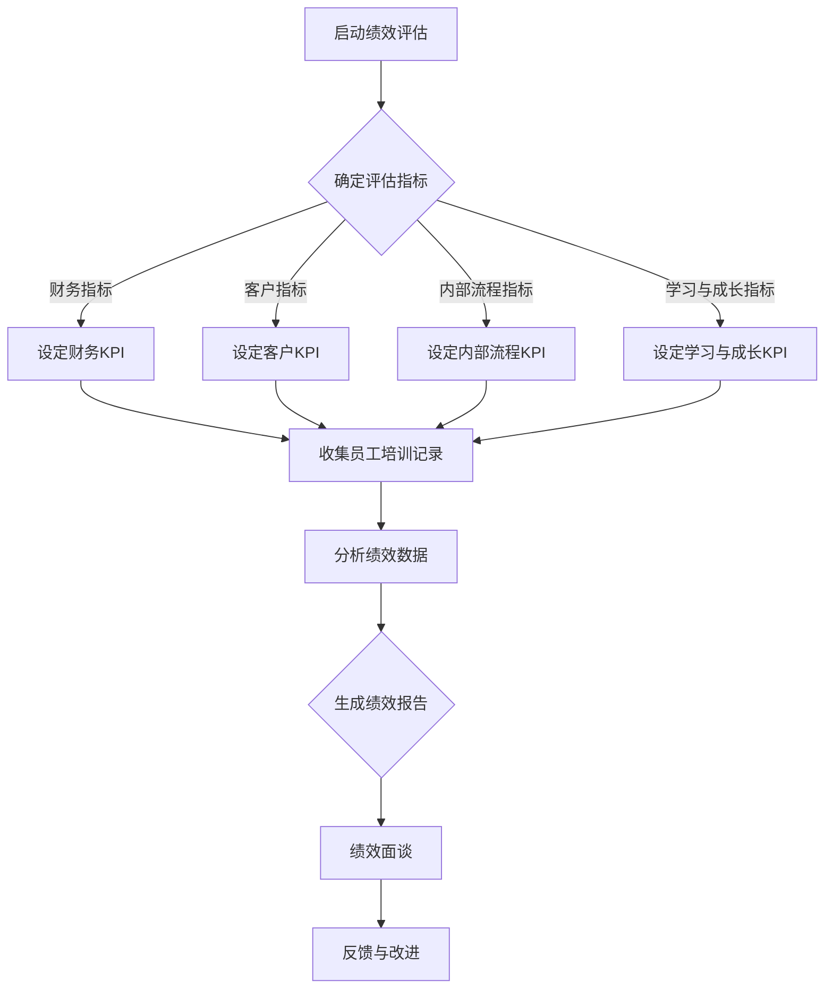
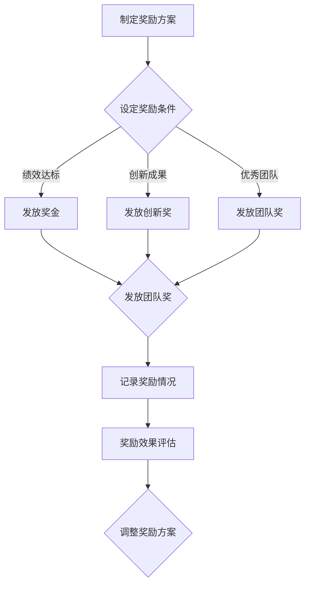
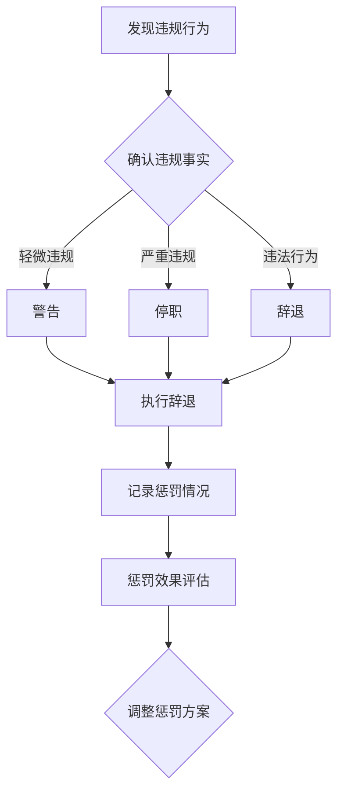

                 

### 文章标题

“绩效激励：设计有效的奖惩制度”

> **关键词**：绩效激励、奖惩制度、KPI、员工激励、绩效评估

**摘要**：本文深入探讨了绩效激励在组织管理中的重要性，详细分析了绩效评估的方法，以及如何设计有效的奖惩制度。通过理论与实践相结合，本文为读者提供了绩效激励的全面指南，帮助组织提升员工绩效，实现企业目标。

### 第一部分：绩效激励的基本概念

绩效激励作为现代企业管理和人力资源开发的重要组成部分，其重要性不容忽视。本部分将首先阐述绩效激励的基本概念，然后介绍绩效评估的方法，最后探讨绩效激励与员工激励的关系。

#### 第1章：绩效激励的重要性

**1.1 绩效激励的定义与作用**

绩效激励是指通过奖励和惩罚等手段，激发员工的积极性和创造力，从而提高工作绩效的过程。其作用主要体现在以下几个方面：

1. **提高工作效率**：通过激励，员工会更加主动地投入工作，提高工作效率。
2. **激发创造力**：适当的激励可以激发员工的创新意识和创造力。
3. **增强团队凝聚力**：有效的绩效激励可以增强团队成员之间的合作和沟通，提高团队凝聚力。
4. **实现组织目标**：绩效激励可以帮助组织实现战略目标和关键绩效指标。

**1.2 绩效激励的目标与原则**

绩效激励的目标主要包括以下几个方面：

1. **提高绩效**：通过激励，提高员工的工作效率和成果。
2. **促进个人发展**：帮助员工提升技能和职业素养，实现个人职业发展。
3. **激励团队合作**：鼓励员工之间的协作和互助，共同完成组织目标。

绩效激励的原则包括：

1. **公平公正**：确保激励制度的公平性和透明性，避免主观偏见。
2. **激励适度**：激励的力度要适中，既不能过于严厉，也不能过于宽松。
3. **及时反馈**：及时给予员工反馈，让员工了解自己的工作表现和改进方向。

**1.3 绩效激励与员工激励的关系**

绩效激励是员工激励的重要组成部分。员工激励包括多个方面，如薪酬激励、职位激励、培训激励等，而绩效激励则是通过绩效考核和奖励机制来实现的。两者之间的关系可以概括为：

1. **相互补充**：绩效激励与员工激励相互补充，共同构成一个全面的激励体系。
2. **相互促进**：有效的绩效激励可以促进员工整体激励水平的提高，反之亦然。

#### 第2章：绩效评估方法

**2.1 KPI评估**

KPI（关键绩效指标）评估是绩效评估中最常用的一种方法。KPI是指与组织目标密切相关的一系列可量化的指标，用于衡量员工的工作绩效。

**2.1.1 KPI的概念与分类**

KPI是一组用于衡量组织绩效的关键指标，通常包括以下几个方面：

1. **财务指标**：如收入、利润、成本等。
2. **客户指标**：如客户满意度、客户保留率等。
3. **内部流程指标**：如生产效率、交货准时率等。
4. **学习与成长指标**：如员工满意度、培训投入等。

**2.1.2 如何制定有效的KPI**

制定有效的KPI需要遵循以下几个原则：

1. **相关性**：KPI要与组织目标和岗位要求密切相关。
2. **可衡量性**：KPI要能够量化，便于衡量和比较。
3. **可控性**：KPI要可控，即员工能够通过自身努力来影响其结果。
4. **挑战性**：KPI要有一定的挑战性，能够激发员工的积极性和创造力。

**2.1.3 KPI的评估与反馈**

KPI的评估和反馈是绩效管理的重要环节。评估过程包括：

1. **定期评估**：定期对KPI进行评估，以确保员工的工作绩效符合组织目标。
2. **反馈与沟通**：及时向员工反馈评估结果，并提供改进建议。
3. **改进与调整**：根据评估结果，对KPI进行必要的改进和调整。

**2.2 市场薪酬调查**

市场薪酬调查是绩效评估中的一种重要方法，通过对比企业薪酬水平与市场薪酬水平，评估员工的薪酬是否合理。

**2.2.1 市场薪酬调查的方法**

市场薪酬调查的方法主要包括：

1. **内部调查**：通过内部调查，收集员工对薪酬的满意度和建议。
2. **外部调查**：通过外部调查，了解同行业、同岗位的市场薪酬水平。
3. **数据分析**：对调查结果进行数据分析，评估企业薪酬水平。

**2.2.2 市场薪酬调查的结果应用**

市场薪酬调查的结果可以用于以下几个方面：

1. **薪酬调整**：根据市场薪酬调查结果，对员工薪酬进行调整，确保薪酬水平与市场相当。
2. **薪酬体系设计**：参考市场薪酬调查结果，设计合理的薪酬体系，提高员工满意度。
3. **绩效激励**：将市场薪酬调查结果作为绩效激励的依据，激发员工的积极性。

**2.3 绩效面谈**

绩效面谈是绩效评估的重要环节，通过面对面的沟通，了解员工的工作表现，提供改进建议。

**2.3.1 绩效面谈的目的与准备**

绩效面谈的目的主要包括：

1. **了解员工的工作表现**：通过面谈，了解员工的工作成果、优点和不足。
2. **提供改进建议**：根据面谈结果，为员工提供改进工作表现的建议。
3. **激励员工**：通过面谈，鼓励员工发挥潜能，提高工作积极性。

绩效面谈的准备工作包括：

1. **准备评估资料**：整理员工的绩效评估资料，包括KPI、工作成果等。
2. **设定面谈目标**：明确面谈的目标，确保面谈过程有针对性。
3. **预约时间**：提前与员工预约面谈时间，确保双方都能充分准备。

**2.3.2 绩效面谈的过程与技巧**

绩效面谈的过程主要包括以下几个环节：

1. **开场**：礼貌地问候员工，营造轻松的氛围。
2. **反馈**：向员工反馈绩效评估结果，包括优点和不足。
3. **讨论**：与员工共同分析不足的原因，讨论改进方案。
4. **鼓励**：鼓励员工发挥潜能，提高工作积极性。
5. **总结**：总结面谈内容，强调改进方向。

绩效面谈的技巧包括：

1. **倾听**：认真倾听员工的意见和建议，确保沟通的有效性。
2. **提问**：通过提问，引导员工思考和表达，深入了解工作情况。
3. **同理心**：站在员工的角度思考问题，理解员工的困难和需求。
4. **正面引导**：鼓励员工，强调改进的方向和可能取得的成果。

**2.3.3 绩效面谈的反馈与应用**

绩效面谈的反馈主要包括：

1. **书面反馈**：将面谈结果和改进建议以书面形式反馈给员工。
2. **跟进**：定期跟进员工的工作表现，确保改进措施得到落实。

绩效面谈的应用主要包括：

1. **绩效改进**：根据面谈结果，制定绩效改进计划，提高员工工作绩效。
2. **激励员工**：通过面谈，了解员工的需求和期望，提供激励措施。
3. **团队建设**：通过绩效面谈，加强团队沟通和协作，提高团队绩效。

### 第二部分：奖惩制度的设计与实施

奖惩制度是绩效激励的重要组成部分，通过奖励和惩罚手段，引导员工的行为，提高工作绩效。本部分将详细介绍如何设计有效的奖惩制度，包括奖励制度的设计和惩罚制度的设计。

#### 第3章：奖励制度设计

奖励制度的设计是激励员工的重要手段，通过合理的奖励机制，激发员工的积极性和创造力。

**3.1 奖励制度的制定原则**

设计奖励制度时，需要遵循以下几个原则：

1. **公平公正**：确保奖励制度的公平性和透明性，避免主观偏见。
2. **激励适度**：奖励的力度要适中，既不能过于严厉，也不能过于宽松。
3. **多样性**：奖励的形式要多样化，包括物质奖励和精神奖励。
4. **及时性**：奖励要及时，让员工感受到组织的认可和关心。

**3.2 激励性薪酬设计**

激励性薪酬是奖励制度的核心，通过合理的薪酬结构，激发员工的积极性。

**3.2.1 固定薪酬与浮动薪酬的比例**

固定薪酬和浮动薪酬的比例是薪酬结构设计的关键。一般来说，固定薪酬提供基本保障，浮动薪酬则与员工的绩效挂钩。

1. **固定薪酬**：固定薪酬通常包括基本工资、津贴等，是员工的基本收入保障。
2. **浮动薪酬**：浮动薪酬包括奖金、提成等，与员工的绩效直接相关。

**3.2.2 绩效薪酬与岗位薪酬的平衡**

在激励性薪酬设计中，需要平衡绩效薪酬与岗位薪酬的关系。

1. **绩效薪酬**：绩效薪酬是根据员工的绩效评估结果发放的奖金，激励员工提高工作绩效。
2. **岗位薪酬**：岗位薪酬是根据员工的工作岗位和职责发放的薪酬，反映员工的工作价值和市场价值。

**3.2.3 股权激励的设计与实施**

股权激励是一种长期激励手段，通过给予员工公司股权，激励员工长期为公司发展贡献力量。

1. **股权激励的种类**：股权激励包括股票期权、限制性股票等。
2. **股权激励的实施**：实施股权激励需要制定详细的激励方案，明确激励对象、激励条件、股权比例等。

**3.3 精神奖励的设计**

精神奖励是通过表彰、荣誉等方式，激发员工的荣誉感和归属感。

**3.3.1 荣誉榜与表彰活动**

荣誉榜和表彰活动是精神奖励的重要形式。

1. **荣誉榜**：设立荣誉榜，表彰优秀员工，提高员工的荣誉感。
2. **表彰活动**：定期举办表彰活动，对优秀员工进行表彰，鼓励员工继续努力。

**3.3.2 团队建设与团队奖励**

团队建设是提高团队绩效的重要手段。

1. **团队建设**：通过团队活动、培训等方式，增强团队凝聚力，提高团队协作能力。
2. **团队奖励**：对表现优秀的团队进行奖励，激励团队积极进取。

**3.3.3 员工个人成长奖励**

员工个人成长奖励是激励员工持续成长的重要手段。

1. **培训奖励**：为员工提供培训机会，奖励员工参加培训，提高个人技能和职业素养。
2. **晋升奖励**：为表现优秀的员工提供晋升机会，激励员工积极进取。

#### 第4章：惩罚制度设计

惩罚制度是约束员工行为，确保组织纪律的重要手段。

**4.1 惩罚制度的制定原则**

设计惩罚制度时，需要遵循以下几个原则：

1. **公平公正**：确保惩罚的公平性和透明性，避免主观偏见。
2. **合理性**：惩罚的力度要合理，避免过于严厉或过于宽松。
3. **教育性**：惩罚要具有教育意义，引导员工改正错误，提高道德素质。
4. **及时性**：惩罚要及时，让员工认识到错误的严重性。

**4.2 惩罚的种类与形式**

惩罚的种类和形式多种多样，包括：

1. **经济惩罚**：如罚款、扣减奖金等。
2. **行政惩罚**：如警告、记过等。
3. **纪律处分**：如停职、辞退等。
4. **公开批评**：在公开场合对员工进行批评，警示其他员工。

**4.3 惩罚的适用范围与标准**

惩罚的适用范围和标准需要根据组织文化和员工行为规范制定。

1. **适用范围**：明确哪些行为需要受到惩罚，哪些行为可以免责。
2. **标准**：制定明确的惩罚标准，确保惩罚的合理性和一致性。

**4.4 惩罚的公正性与透明性**

惩罚的公正性和透明性是确保员工信任组织的重要保障。

1. **公正性**：确保惩罚的公正性，避免因个人关系或其他原因对员工进行不公平对待。
2. **透明性**：明确惩罚的原因、过程和结果，让员工了解组织的决策依据。

**4.5 惩罚的执行与反馈**

惩罚的执行和反馈是惩罚制度有效实施的关键。

1. **执行**：按照规定的程序和标准，严格执行惩罚措施。
2. **反馈**：及时向员工反馈惩罚结果，解释惩罚原因和过程。

**4.6 惩罚的教育意义与改进**

惩罚不仅仅是惩戒员工，更是一种教育手段。

1. **教育意义**：通过惩罚，教育员工遵守组织纪律，提高道德素质。
2. **改进**：根据惩罚的结果，对员工的行为进行改进，防止类似问题的再次发生。

#### 第5章：奖惩制度的实施与效果评估

奖惩制度的实施和效果评估是绩效激励的重要环节。

**5.1 奖惩制度的实施策略**

实施奖惩制度需要制定具体的策略，确保制度的有效实施。

1. **培训与宣传**：对员工进行培训，提高对奖惩制度的认知和遵守度。
2. **明确标准**：制定明确的奖惩标准，确保奖惩的公正性和透明性。
3. **严格执行**：按照规定的程序和标准，严格执行奖惩措施。
4. **监督与反馈**：加强对奖惩制度的监督，及时反馈员工的意见和建议。

**5.2 奖惩制度的效果评估**

奖惩制度的效果评估是优化奖惩制度的重要手段。

1. **员工满意度**：通过员工满意度调查，了解员工对奖惩制度的满意程度。
2. **绩效改进**：评估奖惩制度对员工工作绩效的改善情况。
3. **组织氛围**：评估奖惩制度对组织氛围的影响，确保奖惩制度能够营造积极向上的工作氛围。

**5.3 奖惩制度的优化**

根据效果评估的结果，对奖惩制度进行优化。

1. **完善制度**：根据评估结果，完善奖惩制度的条款和细则。
2. **调整策略**：根据评估结果，调整奖惩制度的实施策略。
3. **持续改进**：不断优化奖惩制度，确保其适应组织的发展和变化。

### 第三部分：绩效激励的拓展应用

绩效激励的应用不仅限于企业内部管理，还可以拓展到组织文化和国际企业。

#### 第6章：绩效激励与组织文化

组织文化是绩效激励的重要背景和基础。绩效激励与组织文化的融合，能够更好地发挥激励作用。

**6.1 绩效激励与组织文化的融合**

绩效激励与组织文化的融合，主要体现在以下几个方面：

1. **价值观的传递**：通过绩效激励，传递组织的价值观和理念。
2. **文化的认同**：通过绩效激励，增强员工对组织文化的认同和归属感。
3. **文化的实践**：通过绩效激励，推动组织文化的实践和传承。

**6.2 如何在组织文化中嵌入绩效激励**

在组织文化中嵌入绩效激励，需要遵循以下几个原则：

1. **一致性**：绩效激励与组织文化的价值观和行为规范要保持一致。
2. **创新性**：绩效激励要具有创新性，符合组织文化的发展需求。
3. **参与性**：员工要积极参与绩效激励的设计和实施，确保绩效激励符合员工的期望。

**6.3 组织文化变革中的绩效激励策略**

在组织文化变革中，绩效激励策略需要根据变革的阶段性进行调整。

1. **变革初期**：通过绩效激励，鼓励员工接受变革，积极适应新文化。
2. **变革中期**：通过绩效激励，激发员工的创新意识和创造力，推动组织文化的发展。
3. **变革后期**：通过绩效激励，巩固组织文化变革的成果，确保组织文化的持续发展。

#### 第7章：绩效激励在国际企业中的应用

绩效激励在国际企业中的应用，需要考虑文化差异、管理模式和法律法规等多方面因素。

**7.1 国际企业绩效激励的特点**

国际企业绩效激励的特点主要包括：

1. **多样性**：国际企业的员工来自不同国家和地区，绩效激励需要考虑文化差异。
2. **灵活性**：国际企业的管理更加灵活，绩效激励也需要具备灵活性。
3. **国际化**：国际企业的绩效激励要符合国际标准和法规。

**7.2 文化差异对绩效激励的影响**

文化差异对绩效激励的影响主要体现在以下几个方面：

1. **价值观**：不同文化对绩效激励的价值观有不同的理解，需要尊重和融合。
2. **沟通方式**：不同文化的沟通方式不同，需要根据文化特点进行有效的沟通。
3. **激励机制**：不同文化的激励机制不同，需要设计符合当地文化的激励方案。

**7.3 国际企业绩效激励的挑战与机遇**

国际企业绩效激励面临的挑战和机遇主要包括：

1. **挑战**：文化差异、管理复杂性、法律法规等多方面的挑战。
2. **机遇**：全球化背景下的市场机遇，跨国团队合作带来的创新机遇。

**7.4 国际企业绩效激励的案例分析**

通过国际企业绩效激励的案例分析，可以更好地了解其应用和实践。

1. **案例一**：某国际企业的绩效激励实践，分析其成功经验和挑战。
2. **案例二**：某跨国公司的绩效激励改革，探讨其在国际市场中的应用。

#### 第8章：未来绩效激励的发展趋势

随着科技的发展和全球化进程的加速，绩效激励也在不断演进和变革。

**8.1 人工智能与绩效激励的结合**

人工智能在绩效激励中的应用，主要体现在以下几个方面：

1. **自动化评估**：通过人工智能技术，自动化评估员工的工作绩效。
2. **个性化激励**：根据员工的个性和需求，设计个性化的激励方案。
3. **智能反馈**：通过人工智能技术，提供实时、个性化的反馈，帮助员工改进工作表现。

**8.2 绩效激励的可持续发展**

绩效激励的可持续发展，需要考虑以下几个方面：

1. **绿色绩效激励**：通过绿色绩效激励，鼓励员工关注环境保护和社会责任。
2. **社会责任与绩效激励的结合**：将社会责任融入绩效激励，推动企业可持续发展。
3. **未来绩效激励的发展方向**：探讨未来绩效激励的发展趋势，为企业的长期发展提供指导。

### 附录

#### 附录A：绩效激励相关工具与资源

为了帮助读者更好地理解和实践绩效激励，本附录提供了一些相关工具和资源。

**A.1 绩效管理软件推荐**

1. **IBM Kenexa**：提供全面的绩效管理和员工发展解决方案。
2. **Workday**：集成人力资源管理软件，包括绩效管理和薪酬管理功能。
3. **SAP SuccessFactors**：提供全面的绩效管理和人才管理解决方案。

**A.2 绩效激励相关书籍推荐**

1. **《绩效管理》**：作者：戴维·尤里奇
2. **《员工激励》**：作者：斯蒂芬·罗宾斯
3. **《绩效激励：构建持续激励体系》**：作者：李明辉

**A.3 绩效激励相关的在线课程与研讨会**

1. **Coursera**：提供关于绩效管理和员工激励的在线课程。
2. **edX**：提供由全球顶尖大学开设的绩效管理和人力资源课程。
3. **LinkedIn Learning**：提供丰富的绩效激励和人力资源培训课程。

通过以上工具和资源，读者可以深入了解绩效激励的理论和实践，提升自己的绩效管理能力。

### 总结

本文系统地阐述了绩效激励的基本概念、绩效评估方法、奖惩制度设计、实施与效果评估，以及绩效激励的拓展应用。通过理论与实践相结合，本文为读者提供了绩效激励的全面指南，帮助组织提升员工绩效，实现企业目标。

#### 作者信息

作者：AI天才研究院/AI Genius Institute & 禅与计算机程序设计艺术 /Zen And The Art of Computer Programming

---

### 第一部分：绩效激励的基本概念

#### 第1章：绩效激励的重要性

**1.1 绩效激励的定义与作用**

绩效激励是指通过奖励和惩罚等手段，激发员工的积极性和创造力，从而提高工作绩效的过程。其作用主要体现在以下几个方面：

1. **提高工作效率**：通过激励，员工会更加主动地投入工作，提高工作效率。
2. **激发创造力**：适当的激励可以激发员工的创新意识和创造力。
3. **增强团队凝聚力**：有效的绩效激励可以增强团队成员之间的合作和沟通，提高团队凝聚力。
4. **实现组织目标**：绩效激励可以帮助组织实现战略目标和关键绩效指标。

**1.2 绩效激励的目标与原则**

绩效激励的目标主要包括以下几个方面：

1. **提高绩效**：通过激励，提高员工的工作效率和成果。
2. **促进个人发展**：帮助员工提升技能和职业素养，实现个人职业发展。
3. **激励团队合作**：鼓励员工之间的协作和互助，共同完成组织目标。

绩效激励的原则包括：

1. **公平公正**：确保激励制度的公平性和透明性，避免主观偏见。
2. **激励适度**：激励的力度要适中，既不能过于严厉，也不能过于宽松。
3. **及时反馈**：及时给予员工反馈，让员工了解自己的工作表现和改进方向。

**1.3 绩效激励与员工激励的关系**

绩效激励是员工激励的重要组成部分。员工激励包括多个方面，如薪酬激励、职位激励、培训激励等，而绩效激励则是通过绩效考核和奖励机制来实现的。两者之间的关系可以概括为：

1. **相互补充**：绩效激励与员工激励相互补充，共同构成一个全面的激励体系。
2. **相互促进**：有效的绩效激励可以促进员工整体激励水平的提高，反之亦然。

**1.4 绩效激励在组织管理中的重要性**

绩效激励在组织管理中的重要性主要体现在以下几个方面：

1. **提升员工积极性**：通过激励，激发员工的积极性和创造力，提高工作动力。
2. **提高组织绩效**：绩效激励可以促进员工的工作效率和质量，从而提升组织的整体绩效。
3. **优化组织结构**：绩效激励有助于优化组织结构，明确岗位职责，提高组织效率。
4. **促进组织发展**：绩效激励可以帮助组织实现战略目标和长期发展。

**1.5 绩效激励的理论基础**

绩效激励的理论基础主要包括以下几个方面：

1. **激励理论**：如马斯洛的需求层次理论、赫茨伯格的双因素理论等，这些理论揭示了激励与绩效之间的关系。
2. **管理理论**：如泰勒的科学管理理论、法约尔的管理过程理论等，这些理论为绩效激励提供了管理实践的基础。
3. **心理学理论**：如动机理论、认知理论等，这些理论帮助理解员工的行为和心理状态，为绩效激励提供了科学依据。

**1.6 绩效激励的实际案例**

为了更好地理解绩效激励的实践，我们可以分析以下几个实际案例：

1. **案例一**：某大型跨国公司通过实施绩效激励制度，将员工的绩效与薪酬、晋升等直接挂钩，极大地激发了员工的积极性和创造力，公司业绩得到了显著提升。

2. **案例二**：某互联网企业采用OKR（目标与关键结果）作为绩效评估工具，通过设定明确的目标和关键结果，激励员工不断突破自我，创新业务模式，实现了快速发展。

3. **案例三**：某中小企业通过设立创新奖励制度，鼓励员工提出创新建议和解决方案，提高了公司的市场竞争力。

通过这些案例，我们可以看到绩效激励在提升员工绩效和组织发展中的重要作用。接下来，我们将进一步探讨绩效评估的方法，为设计有效的绩效激励制度提供理论支持。

---

#### 第2章：绩效评估方法

**2.1 KPI评估**

KPI（关键绩效指标）评估是绩效评估中最常用的一种方法。KPI是指与组织目标密切相关的一系列可量化的指标，用于衡量员工的工作绩效。

**2.1.1 KPI的概念与分类**

KPI是一组用于衡量组织绩效的关键指标，通常包括以下几个方面：

1. **财务指标**：如收入、利润、成本等。
2. **客户指标**：如客户满意度、客户保留率等。
3. **内部流程指标**：如生产效率、交货准时率等。
4. **学习与成长指标**：如员工满意度、培训投入等。

**2.1.2 如何制定有效的KPI**

制定有效的KPI需要遵循以下几个原则：

1. **相关性**：KPI要与组织目标和岗位要求密切相关。
2. **可衡量性**：KPI要能够量化，便于衡量和比较。
3. **可控性**：KPI要可控，即员工能够通过自身努力来影响其结果。
4. **挑战性**：KPI要有一定的挑战性，能够激发员工的积极性和创造力。

**2.1.3 KPI的评估与反馈**

KPI的评估和反馈是绩效管理的重要环节。评估过程包括：

1. **定期评估**：定期对KPI进行评估，以确保员工的工作绩效符合组织目标。
2. **反馈与沟通**：及时向员工反馈评估结果，并提供改进建议。
3. **改进与调整**：根据评估结果，对KPI进行必要的改进和调整。

**2.2 市场薪酬调查**

市场薪酬调查是绩效评估中的一种重要方法，通过对比企业薪酬水平与市场薪酬水平，评估员工的薪酬是否合理。

**2.2.1 市场薪酬调查的方法**

市场薪酬调查的方法主要包括：

1. **内部调查**：通过内部调查，收集员工对薪酬的满意度和建议。
2. **外部调查**：通过外部调查，了解同行业、同岗位的市场薪酬水平。
3. **数据分析**：对调查结果进行数据分析，评估企业薪酬水平。

**2.2.2 市场薪酬调查的结果应用**

市场薪酬调查的结果可以用于以下几个方面：

1. **薪酬调整**：根据市场薪酬调查结果，对员工薪酬进行调整，确保薪酬水平与市场相当。
2. **薪酬体系设计**：参考市场薪酬调查结果，设计合理的薪酬体系，提高员工满意度。
3. **绩效激励**：将市场薪酬调查结果作为绩效激励的依据，激发员工的积极性。

**2.3 绩效面谈**

绩效面谈是绩效评估的重要环节，通过面对面的沟通，了解员工的工作表现，提供改进建议。

**2.3.1 绩效面谈的目的与准备**

绩效面谈的目的主要包括：

1. **了解员工的工作表现**：通过面谈，了解员工的工作成果、优点和不足。
2. **提供改进建议**：根据面谈结果，为员工提供改进工作表现的建议。
3. **激励员工**：通过面谈，了解员工的需求和期望，提供激励措施。

绩效面谈的准备工作包括：

1. **准备评估资料**：整理员工的绩效评估资料，包括KPI、工作成果等。
2. **设定面谈目标**：明确面谈的目标，确保面谈过程有针对性。
3. **预约时间**：提前与员工预约面谈时间，确保双方都能充分准备。

**2.3.2 绩效面谈的过程与技巧**

绩效面谈的过程主要包括以下几个环节：

1. **开场**：礼貌地问候员工，营造轻松的氛围。
2. **反馈**：向员工反馈绩效评估结果，包括优点和不足。
3. **讨论**：与员工共同分析不足的原因，讨论改进方案。
4. **鼓励**：鼓励员工发挥潜能，提高工作积极性。
5. **总结**：总结面谈内容，强调改进方向。

绩效面谈的技巧包括：

1. **倾听**：认真倾听员工的意见和建议，确保沟通的有效性。
2. **提问**：通过提问，引导员工思考和表达，深入了解工作情况。
3. **同理心**：站在员工的角度思考问题，理解员工的困难和需求。
4. **正面引导**：鼓励员工，强调改进的方向和可能取得的成果。

**2.3.3 绩效面谈的反馈与应用**

绩效面谈的反馈主要包括：

1. **书面反馈**：将面谈结果和改进建议以书面形式反馈给员工。
2. **跟进**：定期跟进员工的工作表现，确保改进措施得到落实。

绩效面谈的应用主要包括：

1. **绩效改进**：根据面谈结果，制定绩效改进计划，提高员工工作绩效。
2. **激励员工**：通过面谈，了解员工的需求和期望，提供激励措施。
3. **团队建设**：通过绩效面谈，加强团队沟通和协作，提高团队绩效。

**2.4 绩效评估的其他方法**

除了KPI评估、市场薪酬调查和绩效面谈，绩效评估还可以采用以下方法：

1. **360度评估**：通过员工、同事、上级和下属的反馈，全面评估员工的工作表现。
2. **行为事件访谈**：通过访谈，了解员工在工作中的具体行为和事件，评估其工作绩效。
3. **平衡计分卡**：将绩效指标分解为财务、客户、内部流程、学习与成长四个维度，全面评估绩效。

**2.5 绩效评估的优缺点分析**

**优点**：

1. **客观性**：绩效评估通过量化的指标和标准，使评估结果更具客观性。
2. **激励性**：绩效评估可以激发员工的积极性和创造力，提高工作绩效。
3. **公平性**：绩效评估过程透明，确保评估结果的公平性。

**缺点**：

1. **主观性**：绩效评估过程中可能存在主观偏见，影响评估结果的准确性。
2. **压力**：绩效评估可能给员工带来较大的压力，影响其工作表现。
3. **局限性**：绩效评估方法有限，难以全面评估员工的工作表现。

通过对绩效评估方法的深入探讨，我们可以更好地理解如何科学、合理地进行绩效评估，从而为设计有效的绩效激励制度提供有力支持。

### 第二部分：奖惩制度的设计与实施

奖惩制度是绩效管理的重要组成部分，通过奖励和惩罚的手段，对员工的行为进行引导和规范，从而提高整体绩效。本部分将详细讨论奖励制度的设计和实施，以及惩罚制度的设计和实施。

#### 第3章：奖励制度设计

奖励制度是激励员工、提升绩效的重要工具。合理、有效的奖励制度可以增强员工的积极性和忠诚度，促进企业的长期发展。

**3.1 奖励制度的制定原则**

设计奖励制度时，应遵循以下原则：

1. **公平公正**：确保奖励的公平性，避免主观偏见和利益冲突。
2. **激励适度**：奖励力度要适中，既要激励员工，又不能超出企业承受能力。
3. **多样性**：奖励形式要多样化，包括物质奖励和精神奖励，满足员工的多种需求。
4. **及时性**：奖励要及时，让员工感受到企业的认可和关怀。
5. **透明性**：奖励制度要透明，让员工了解奖励的标准和程序。

**3.2 奖励的种类与形式**

奖励的种类和形式多种多样，可以根据员工的表现和企业的实际情况进行选择和组合。以下是一些常见的奖励种类：

1. **物质奖励**：包括奖金、提成、股票期权等。
    - **奖金**：根据员工的工作绩效和企业的经营状况，发放一定的奖金。
    - **提成**：在销售和服务等绩效明显的岗位上，通过提成奖励来激励员工。
    - **股票期权**：给予员工一定的股票期权，让员工分享企业的长期发展成果。

2. **精神奖励**：包括表彰、荣誉、荣誉榜等。
    - **表彰**：对表现突出的员工进行公开表彰，提升其荣誉感和归属感。
    - **荣誉榜**：设立荣誉榜，展示优秀员工的业绩和成就，激发其他员工的积极性。

3. **其他奖励**：如培训机会、晋升机会、休假等。
    - **培训机会**：为员工提供培训和学习机会，提升其职业素养和技能水平。
    - **晋升机会**：为表现优秀的员工提供晋升机会，激励其持续成长。
    - **休假**：根据员工的工作表现，提供额外的休假时间，缓解工作压力。

**3.3 激励性薪酬设计**

激励性薪酬设计是奖励制度的核心，通过合理的薪酬结构，激发员工的积极性和创造力。

1. **固定薪酬与浮动薪酬的比例**
   - **固定薪酬**：包括基本工资、津贴等，是员工的基本收入保障。
   - **浮动薪酬**：包括奖金、提成等，与员工的绩效直接挂钩，激励员工提高工作绩效。

2. **绩效薪酬与岗位薪酬的平衡**
   - **绩效薪酬**：根据员工的绩效评估结果，发放奖金或其他激励。
   - **岗位薪酬**：根据员工的工作岗位和职责，确定其基本薪酬水平。

3. **股权激励的设计与实施**
   - **股权激励的种类**：包括股票期权、限制性股票等。
   - **股权激励的实施**：制定股权激励方案，明确激励对象、激励条件、股权比例等。

**3.4 精神奖励的设计**

精神奖励是通过表彰、荣誉等方式，激发员工的荣誉感和归属感。

1. **荣誉榜与表彰活动**
   - **荣誉榜**：设立荣誉榜，展示优秀员工的业绩和成就。
   - **表彰活动**：定期举办表彰活动，对优秀员工进行表彰，鼓励员工继续努力。

2. **团队建设与团队奖励**
   - **团队建设**：通过团队活动、培训等方式，增强团队凝聚力。
   - **团队奖励**：对表现优秀的团队进行奖励，激励团队积极进取。

3. **员工个人成长奖励**
   - **培训奖励**：为员工提供培训机会，奖励员工参加培训，提高个人技能和职业素养。
   - **晋升奖励**：为表现优秀的员工提供晋升机会，激励员工积极进取。

**3.5 奖励制度的实施策略**

1. **宣传与推广**
   - **宣传**：通过内部邮件、公告栏、会议等方式，宣传奖励制度的内容和程序。
   - **推广**：鼓励员工积极参与奖励制度，了解奖励制度的具体实施情况。

2. **透明化**
   - **公开透明**：确保奖励制度公开透明，让员工了解奖励的标准和程序。
   - **公正公正**：确保奖励制度的公平公正，避免主观偏见和利益冲突。

3. **反馈与改进**
   - **反馈**：定期收集员工对奖励制度的意见和建议，及时进行反馈和改进。
   - **改进**：根据员工的反馈和实际情况，不断优化奖励制度，提高其有效性。

#### 第4章：惩罚制度设计

惩罚制度是约束员工行为、维护企业秩序的重要手段。合理、适度的惩罚制度可以规范员工行为，提高整体工作效率。

**4.1 惩罚制度的制定原则**

设计惩罚制度时，应遵循以下原则：

1. **公正公正**：确保惩罚的公正性和透明性，避免主观偏见和利益冲突。
2. **合理适度**：惩罚的力度要合理适度，避免过于严厉或过于宽松。
3. **教育性**：惩罚要具有教育意义，引导员工改正错误，提高道德素质。
4. **及时性**：惩罚要及时，让员工认识到错误的严重性。
5. **一致性**：确保惩罚的一致性，避免因个人关系或其他原因对员工进行不公平对待。

**4.2 惩罚的种类与形式**

惩罚的种类和形式多种多样，可以根据员工的行为和企业的实际情况进行选择和组合。以下是一些常见的惩罚种类：

1. **经济惩罚**：包括罚款、扣减奖金等。
   - **罚款**：对违反规定的员工进行罚款，以示警戒。
   - **扣减奖金**：根据员工的行为严重程度，扣减其奖金。

2. **行政惩罚**：包括警告、记过等。
   - **警告**：对轻微违规的员工进行警告，提醒其改正。
   - **记过**：对较严重的违规行为进行记过处理，影响员工的晋升和奖金。

3. **纪律处分**：包括停职、辞退等。
   - **停职**：对严重违规的员工进行停职处理，以示惩戒。
   - **辞退**：对屡次违规或严重违规的员工进行辞退处理。

4. **公开批评**：在公开场合对员工进行批评，警示其他员工。

**4.3 惩罚的适用范围与标准**

1. **适用范围**：明确哪些行为需要受到惩罚，哪些行为可以免责。
   - **违规行为**：如迟到、早退、缺勤、违反公司规章制度等。
   - **严重违规行为**：如盗窃、欺诈、严重违反职业道德等。

2. **标准**：制定明确的惩罚标准，确保惩罚的合理性和一致性。
   - **轻微违规行为**：处以警告、罚款等。
   - **较严重违规行为**：处以记过、停职等。
   - **严重违规行为**：处以辞退等。

**4.4 惩罚的公正性与透明性**

1. **公正性**：确保惩罚的公正性，避免因个人关系或其他原因对员工进行不公平对待。
   - **程序公正**：确保惩罚程序的公正性，让员工有申诉的权利。
   - **标准公正**：确保惩罚标准的公正性，避免主观偏见。

2. **透明性**：确保惩罚的透明性，让员工了解惩罚的原因、过程和结果。
   - **信息公开**：公开惩罚的规章制度和标准。
   - **沟通透明**：及时向员工反馈惩罚原因和结果。

**4.5 惩罚的执行与反馈**

1. **执行**：按照规定的程序和标准，严格执行惩罚措施。
   - **及时执行**：及时对违规行为进行处理，避免问题的累积。
   - **公开执行**：在适当的范围内公开执行惩罚，警示其他员工。

2. **反馈**：及时向员工反馈惩罚结果，解释惩罚原因和过程。
   - **书面反馈**：将惩罚结果以书面形式反馈给员工。
   - **沟通反馈**：与员工进行面对面的沟通，确保员工理解惩罚原因和过程。

**4.6 惩罚的教育意义与改进**

1. **教育意义**：通过惩罚，教育员工遵守企业规章制度，提高道德素质。
   - **案例教育**：通过案例分析，让员工了解违规行为的后果。
   - **制度教育**：加强员工对企业规章制度的学习，提高遵守制度的意识。

2. **改进**：根据惩罚的结果，对员工的行为进行改进，防止类似问题的再次发生。
   - **员工辅导**：对受惩罚的员工进行辅导，帮助其改进工作表现。
   - **制度改进**：根据惩罚实践，对规章制度进行改进，提高制度的适用性和有效性。

通过合理、有效的奖惩制度，企业可以规范员工行为，提升整体绩效，实现长期发展目标。接下来，我们将进一步探讨奖惩制度的实施与效果评估，以确保奖惩制度的实际效果。

#### 第5章：奖惩制度的实施与效果评估

奖惩制度的实施和效果评估是绩效管理的重要环节，直接影响企业文化的建设、员工的积极性以及企业的整体绩效。本章节将详细讨论如何实施奖惩制度、进行效果评估以及如何持续优化奖惩制度。

**5.1 奖惩制度的实施策略**

奖惩制度的实施需要系统性的策略和明确的步骤，以确保制度能够被有效执行。

1. **培训与宣传**
   - **培训**：对管理人员和员工进行奖惩制度培训，确保他们理解制度的内容、目的和实施流程。
   - **宣传**：通过内部邮件、公告、会议等方式，广泛宣传奖惩制度，提高员工的知晓度和认同感。

2. **制定详细的执行流程**
   - **流程图**：设计奖惩制度的执行流程图，明确奖惩的各个环节和责任人。
   - **标准化**：制定标准化的奖惩操作手册，确保奖惩过程的一致性和透明性。

3. **员工参与与共识**
   - **员工参与**：在制定奖惩制度时，邀请员工代表参与讨论，确保制度的合理性和可操作性。
   - **共识达成**：通过沟通和协商，达成员工和管理层对奖惩制度的共识，减少抵触情绪。

4. **实施监控**
   - **监控机制**：建立奖惩实施的监控机制，确保制度得到有效执行。
   - **反馈机制**：设立反馈渠道，让员工和管理层可以及时反馈奖惩制度实施中的问题和建议。

**5.2 奖惩制度的效果评估**

奖惩制度的效果评估是优化制度的重要依据。以下是一些评估方法和步骤：

1. **员工满意度调查**
   - **方法**：通过问卷调查、面谈等方式，了解员工对奖惩制度的满意度和认可程度。
   - **步骤**：定期开展满意度调查，分析调查结果，发现制度实施中的问题和不足。

2. **绩效改进评估**
   - **方法**：比较奖惩制度实施前后的绩效数据，评估制度对员工绩效的改进效果。
   - **步骤**：设定关键绩效指标（KPI），定期收集和分析数据，评估奖惩制度对绩效提升的贡献。

3. **组织氛围评估**
   - **方法**：通过员工满意度调查、员工意见反馈等方式，了解奖惩制度对组织氛围的影响。
   - **步骤**：定期评估组织氛围的变化，分析奖惩制度对员工关系、团队合作等方面的影响。

**5.3 奖惩制度的优化**

根据效果评估的结果，对奖惩制度进行持续优化，以提升其有效性和适应性。

1. **完善制度条款**
   - **方法**：根据评估反馈，完善奖惩制度的条款和细节，使其更加合理和具有操作性。
   - **步骤**：定期审查制度条款，确保其与企业的战略目标和发展阶段相适应。

2. **调整奖励与惩罚**
   - **方法**：根据效果评估结果，调整奖励和惩罚的标准和力度，使其更符合实际情况和员工需求。
   - **步骤**：结合绩效数据和员工反馈，动态调整奖励和惩罚方案。

3. **加强沟通与培训**
   - **方法**：通过培训、座谈会等形式，加强员工和管理层对奖惩制度的理解和认同。
   - **步骤**：定期组织培训和座谈会，解答员工疑问，收集改进建议。

4. **持续改进与完善**
   - **方法**：建立奖惩制度的动态调整机制，根据企业发展和外部环境变化，持续优化奖惩制度。
   - **步骤**：定期评估奖惩制度的实施效果，不断进行改进和完善。

通过上述策略和步骤，企业可以确保奖惩制度的有效实施和持续优化，从而提升员工绩效、优化组织氛围，实现企业的长期发展目标。

### 第三部分：绩效激励的拓展应用

#### 第6章：绩效激励与组织文化

绩效激励不仅是一种管理工具，它也是塑造和维护组织文化的重要手段。一个良好的组织文化可以促进员工的积极性和创造力，而有效的绩效激励制度则可以巩固和强化这种文化。

**6.1 绩效激励与组织文化的融合**

绩效激励与组织文化的融合，是实现组织目标和个人发展双赢的重要途径。这种融合主要体现在以下几个方面：

1. **价值观的传递**：通过绩效激励，企业可以将自身的核心价值观传递给员工，如诚信、创新、团队合作等。

2. **文化的认同**：绩效激励制度可以鼓励员工认同并积极实践组织文化，从而增强员工的归属感和忠诚度。

3. **文化的实践**：通过绩效激励，企业可以鼓励员工在日常工作中的行为符合组织文化，如遵守规章制度、积极参与团队活动等。

**6.2 如何在组织文化中嵌入绩效激励**

为了在组织文化中嵌入绩效激励，企业可以采取以下措施：

1. **一致性**：确保绩效激励的目标与组织文化一致，避免出现冲突。

2. **创新性**：在保持文化一致性的同时，不断创新绩效激励方式，以适应组织文化的发展。

3. **参与性**：鼓励员工参与绩效激励制度的设计和实施，确保制度符合员工的期望和需求。

**6.3 组织文化变革中的绩效激励策略**

在组织文化变革过程中，绩效激励策略需要根据变革的阶段性进行调整。具体策略包括：

1. **变革初期**：通过绩效激励，鼓励员工接受变革，提高变革的适应性。

2. **变革中期**：通过绩效激励，激发员工的创新意识和创造力，推动组织文化的变革和发展。

3. **变革后期**：通过绩效激励，巩固变革的成果，确保组织文化的持续发展和稳定。

**6.4 案例研究：绩效激励与组织文化融合的成功实践**

为了更好地理解绩效激励与组织文化融合的实际应用，我们可以分析以下案例：

1. **案例一**：某科技公司通过设立“创新之星”奖项，鼓励员工提出创新方案，推动了企业文化的创新和活力。

2. **案例二**：某制造企业通过实施“团队协作奖”，鼓励员工积极参与团队项目，增强了团队合作和沟通能力。

3. **案例三**：某金融机构通过设立“诚信奖”，鼓励员工遵守职业道德，提升了组织的诚信度和员工的行为规范。

通过这些案例，我们可以看到绩效激励如何与组织文化融合，从而实现组织的目标和员工的发展。

#### 第7章：绩效激励在国际企业中的应用

在国际企业中，绩效激励面临着更多的挑战和机遇。不同国家和地区的文化差异、法律法规和商业模式，都对绩效激励的设计和实施产生了重要影响。

**7.1 国际企业绩效激励的特点**

国际企业绩效激励的特点主要包括：

1. **多样性**：国际企业的员工来自不同国家和地区，绩效激励需要考虑文化差异和多样性。

2. **灵活性**：国际企业的管理更加灵活，绩效激励制度也需要具备灵活性，以适应不同的市场环境。

3. **国际化**：国际企业的绩效激励要符合国际标准和法规，同时兼顾企业全球化发展的需求。

**7.2 文化差异对绩效激励的影响**

文化差异对绩效激励的影响主要体现在以下几个方面：

1. **价值观**：不同文化对绩效激励的价值观有不同的理解，需要尊重和融合。

2. **沟通方式**：不同文化的沟通方式不同，需要根据文化特点进行有效的沟通。

3. **激励机制**：不同文化的激励机制不同，需要设计符合当地文化的激励方案。

**7.3 国际企业绩效激励的挑战与机遇**

国际企业绩效激励面临的挑战和机遇主要包括：

1. **挑战**：文化差异、管理复杂性、法律法规等多方面的挑战。

2. **机遇**：全球化背景下的市场机遇，跨国团队合作带来的创新机遇。

**7.4 国际企业绩效激励的案例分析**

为了更好地理解国际企业绩效激励的应用，我们可以分析以下案例：

1. **案例一**：某跨国公司通过全球统一的绩效评估体系，结合当地文化特点，设计了具有国际视野的绩效激励制度，成功实现了全球范围内的员工激励。

2. **案例二**：某国际物流企业通过实施差异化的绩效激励方案，结合不同地区的市场环境和员工需求，提高了员工的工作满意度和绩效。

3. **案例三**：某跨国金融机构通过建立国际化的绩效激励体系，结合全球金融市场变化，灵活调整绩效指标，成功推动了企业的国际化发展。

通过这些案例，我们可以看到国际企业如何通过绩效激励实现全球化战略，提升整体竞争力。

#### 第8章：未来绩效激励的发展趋势

随着科技的不断进步和全球化进程的加速，绩效激励也在不断演进和变革。未来的绩效激励将更加注重科技的应用、个性化发展和可持续性。

**8.1 人工智能与绩效激励的结合**

人工智能（AI）在绩效激励中的应用前景广阔，主要体现在以下几个方面：

1. **自动化评估**：通过AI技术，自动化评估员工的工作绩效，减少人为因素，提高评估的客观性和准确性。

2. **个性化激励**：根据员工的个性和需求，利用AI技术设计个性化的激励方案，提高激励效果。

3. **智能反馈**：通过AI技术，提供实时、个性化的反馈，帮助员工改进工作表现，提升绩效。

**8.2 个性化绩效激励的发展**

未来的绩效激励将更加注重个性化发展，主要体现在以下几个方面：

1. **个性化目标设定**：根据员工的职业发展需求和企业的战略目标，设定个性化的绩效目标。

2. **个性化奖励方案**：设计符合员工个人兴趣和职业发展的奖励方案，提高激励效果。

3. **个性化职业发展**：通过绩效激励，支持员工的个性化职业发展，提高员工的职业满意度和忠诚度。

**8.3 可持续绩效激励的发展**

未来的绩效激励将更加注重可持续发展，主要体现在以下几个方面：

1. **绿色绩效激励**：通过绿色绩效激励，鼓励员工关注环境保护和社会责任，推动企业的可持续发展。

2. **社会责任与绩效激励的结合**：将社会责任融入绩效激励，激励员工积极参与企业的社会责任项目。

3. **长期绩效激励**：通过长期绩效激励，支持员工的长期职业规划，提高员工对企业的忠诚度和归属感。

**8.4 未来绩效激励的发展趋势总结**

未来的绩效激励将呈现以下发展趋势：

1. **科技驱动**：人工智能、大数据等技术的应用将推动绩效激励的智能化和精准化。

2. **个性化发展**：绩效激励将更加注重个性化，满足员工的多样化需求。

3. **可持续性**：绩效激励将更加注重可持续发展，推动企业和社会的可持续发展。

通过这些发展趋势，企业可以更好地应对未来的挑战，实现长期的绩效提升和可持续发展。

### 结论

通过本文的深入探讨，我们系统地了解了绩效激励的基本概念、评估方法、奖惩制度设计及其在组织文化、国际企业和未来趋势中的应用。绩效激励不仅是提升员工绩效的重要手段，更是塑造和维护组织文化、推动企业可持续发展的重要途径。

在设计和实施绩效激励时，企业需要遵循公平公正、激励适度和及时反馈等原则，结合员工的个性需求和组织战略目标，制定合理的奖惩制度。同时，企业还需不断优化和调整绩效激励制度，以适应企业的发展和市场环境的变化。

未来，随着科技的进步和全球化进程的加速，绩效激励将更加智能化、个性化和可持续发展。企业应抓住这一机遇，积极应用新技术，优化绩效激励制度，提升员工的满意度和绩效，推动企业的长期发展。

我们希望本文能为企业在绩效激励方面的实践提供有益的参考和指导，助力企业实现战略目标，提升核心竞争力。

### 作者信息

作者：AI天才研究院/AI Genius Institute & 禅与计算机程序设计艺术 /Zen And The Art of Computer Programming

---

## 附录A：绩效激励相关工具与资源

为了帮助读者更好地理解和实践绩效激励，本附录提供了一些相关工具和资源，包括绩效管理软件推荐、相关书籍推荐以及在线课程与研讨会。

### 附录A.1 绩效管理软件推荐

1. **IBM Kenexa**：IBM Kenexa 提供全面的绩效管理和员工发展解决方案，包括员工反馈、绩效评估和薪酬管理等功能。

2. **Workday**：Workday 是一款集成人力资源管理软件，包括绩效管理和薪酬管理功能，支持全球化企业的多样化需求。

3. **SAP SuccessFactors**：SAP SuccessFactors 提供全面的绩效管理和人才管理解决方案，帮助企业提升员工绩效和业务成果。

### 附录A.2 绩效激励相关书籍推荐

1. **《绩效管理》**：作者：戴维·尤里奇。本书详细介绍了绩效管理的概念、方法和实践，是绩效管理领域的经典之作。

2. **《员工激励》**：作者：斯蒂芬·罗宾斯。本书从心理学和管理学的角度，探讨了员工激励的理论和实践，对企业管理者有很高的参考价值。

3. **《绩效激励：构建持续激励体系》**：作者：李明辉。本书结合实际案例，系统地阐述了绩效激励的设计和实施方法，对企业管理者具有很高的实用性。

### 附录A.3 绩效激励相关的在线课程与研讨会

1. **Coursera**：Coursera 提供了丰富的绩效管理和员工激励在线课程，由全球知名大学和机构开设，适合不同层次的学习者。

2. **edX**：edX 同样提供了多门关于绩效管理和员工激励的在线课程，课程涵盖理论、实践和案例分析，具有很高的实用性和深度。

3. **LinkedIn Learning**：LinkedIn Learning 提供了大量的绩效激励和人力资源培训课程，包括视频教程、互动练习和实时答疑，适合职场人士学习和提升。

通过以上工具和资源，读者可以深入了解绩效激励的理论和实践，提升自己的绩效管理能力。希望这些资源能够为您的学习和工作提供帮助。

## 附录B：绩效激励相关术语解释

在本章中，我们将解释一些在绩效激励中常用的关键术语，以便读者更好地理解文章内容。

### 绩效激励

绩效激励是一种管理策略，旨在通过奖励和惩罚等手段，激发员工的积极性和创造力，提高工作绩效。这种激励可以是物质的，如奖金、股票期权等，也可以是精神的，如表彰、荣誉称号等。

### KPI

KPI（关键绩效指标）是用于衡量员工工作绩效的一系列可量化的指标。KPI与组织的战略目标紧密相关，通常包括财务指标、客户指标、内部流程指标和学习与成长指标等。

### 市场薪酬调查

市场薪酬调查是一种评估企业薪酬水平是否合理的方法，通过对比企业薪酬与同行业、同岗位的市场薪酬水平，来确定薪酬调整的合理性和必要性。

### 绩效面谈

绩效面谈是一种定期进行的沟通活动，旨在评估员工的工作表现，提供改进建议，并讨论职业发展。绩效面谈通常涉及员工的KPI完成情况、工作态度、团队合作等方面。

### 激励性薪酬

激励性薪酬是指与员工工作绩效直接挂钩的薪酬部分，包括奖金、提成、股票期权等。这种薪酬形式旨在激励员工提高工作绩效，实现个人和组织的共同目标。

### 惩罚制度

惩罚制度是一种约束员工行为、维护企业秩序的管理手段。通过罚款、警告、记过、辞退等形式，惩罚制度可以对违反企业规章制度的行为进行处罚，确保企业正常运营。

### 公平公正

公平公正是指绩效激励制度在设计和执行过程中，应确保所有员工都有平等的激励机会，避免主观偏见和利益冲突，使奖励和惩罚具有透明性和一致性。

### 及时反馈

及时反馈是指在绩效评估和奖惩过程中，及时向员工提供关于其工作表现、奖励或惩罚的反馈。这种反馈有助于员工了解自己的工作表现，制定改进计划，提高工作绩效。

通过了解这些关键术语，读者可以更深入地理解绩效激励的原理和实践，从而更好地应用于实际工作中。

### 附录C：绩效激励相关流程图

为了帮助读者更直观地理解绩效激励的相关流程，以下提供了几个关键流程图的示例。这些流程图描述了绩效评估、奖励制度和惩罚制度的各个环节。

#### 附录C.1 绩效评估流程图



#### 附录C.2 奖励制度流程图



#### 附录C.3 惩罚制度流程图



这些流程图展示了绩效激励的关键环节，通过这些图，读者可以更清晰地理解绩效评估、奖励制度和惩罚制度的实施过程。

### 附录D：数学模型和公式详解

在绩效激励的设计和评估中，数学模型和公式扮演着重要的角色。以下我们将介绍几个关键的数学模型和公式，并提供详细的解释和举例说明。

#### 附录D.1 KPI计算公式

KPI（关键绩效指标）的计算公式是衡量员工绩效的重要工具。一个常见的KPI计算公式是：

\[ KPI = \frac{实际完成值}{目标值} \times 100\% \]

**例子：** 假设某销售人员的年度销售目标是100万元，实际完成的销售额为120万元，则其销售KPI为：

\[ KPI = \frac{120}{100} \times 100\% = 120\% \]

这个KPI表明销售人员完成了目标的120%，表现优秀。

#### 附录D.2 成本效益分析

成本效益分析是一种用于评估绩效激励方案有效性的方法。常见的成本效益分析公式是：

\[ 成本效益 = \frac{收益}{成本} \]

**例子：** 假设某公司为了激励销售人员，每月投入5万元作为奖金，当月因此增加了10万元的销售额，则其成本效益为：

\[ 成本效益 = \frac{10}{5} = 2 \]

这个结果表明，公司每投入1元成本，可以获得2元的收益，该激励方案具有较高的成本效益。

#### 附录D.3 绩效改进模型

为了持续改进员工绩效，可以使用绩效改进模型。一个简单的绩效改进模型是：

\[ 绩效改进 = 当前绩效 - 初始绩效 \]

**例子：** 假设某员工在实施绩效改进计划前的绩效评估得分为75分，经过6个月的改进后，绩效评估得分提升至90分，则其绩效改进为：

\[ 绩效改进 = 90 - 75 = 15 \]

这个结果说明，该员工在6个月内提高了15分的绩效。

#### 附录D.4 市场薪酬调查分析

市场薪酬调查用于评估企业薪酬水平的市场竞争力。一个常用的公式是：

\[ 市场薪酬水平 = \frac{企业薪酬水平}{市场薪酬中位数} \]

**例子：** 假设某企业的薪酬水平为每月1万元，市场薪酬中位数为每月8000元，则其市场薪酬水平为：

\[ 市场薪酬水平 = \frac{10000}{8000} = 1.25 \]

这个结果表明，该企业的薪酬水平高于市场平均水平的25%。

通过这些数学模型和公式，企业可以更科学地设计和评估绩效激励方案，提高激励效果和员工的满意度。

### 附录E：项目实战：代码实际案例和详细解释

在本附录中，我们将通过一个具体的代码案例，展示如何在实际项目中实现绩效激励系统的关键功能。此案例将涉及开发环境搭建、源代码实现和代码解读与分析。

#### 附录E.1 开发环境搭建

首先，我们需要搭建一个适用于绩效激励系统开发的环境。以下是一个基本的开发环境搭建步骤：

1. **安装Python**：确保系统中安装了Python 3.x版本。可以从Python官方网站下载安装程序。

2. **安装Django框架**：使用pip命令安装Django框架，命令如下：

   ```bash
   pip install django
   ```

3. **创建Django项目**：在命令行中创建一个名为`performance_incentive`的Django项目，命令如下：

   ```bash
   django-admin startproject performance_incentive
   ```

4. **创建应用**：在项目目录中创建一个名为`incentive_app`的应用，命令如下：

   ```bash
   python manage.py startapp incentive_app
   ```

5. **配置数据库**：编辑`settings.py`文件，配置数据库连接信息。例如，使用SQLite数据库：

   ```python
   DATABASES = {
       'default': {
           'ENGINE': 'django.db.backends.sqlite3',
           'NAME': BASE_DIR / 'db.sqlite3',
       }
   }
   ```

6. **安装其他依赖库**：根据项目需求，可能需要安装其他依赖库，如Django REST framework：

   ```bash
   pip install djangorestframework
   ```

7. **运行项目**：在命令行中运行项目，确保项目可以正常运行：

   ```bash
   python manage.py runserver
   ```

#### 附录E.2 源代码实现

以下是一个简化的绩效激励系统的源代码实现，主要涉及用户管理、绩效评估和奖励发放等功能。

**incentive_app/models.py**

```python
from django.db import models

class Employee(models.Model):
    name = models.CharField(max_length=100)
    position = models.CharField(max_length=100)
    department = models.CharField(max_length=100)

class Performance(models.Model):
    employee = models.ForeignKey(Employee, on_delete=models.CASCADE)
    kpi = models.FloatField()
    actual_value = models.FloatField()
    target_value = models.FloatField()
    date = models.DateField()

class Reward(models.Model):
    employee = models.ForeignKey(Employee, on_delete=models.CASCADE)
    amount = models.FloatField()
    reason = models.CharField(max_length=255)
    date = models.DateField()
```

**incentive_app/serializers.py**

```python
from rest_framework import serializers
from .models import Employee, Performance, Reward

class EmployeeSerializer(serializers.ModelSerializer):
    class Meta:
        model = Employee
        fields = ['id', 'name', 'position', 'department']

class PerformanceSerializer(serializers.ModelSerializer):
    class Meta:
        model = Performance
        fields = ['id', 'employee', 'kpi', 'actual_value', 'target_value', 'date']

class RewardSerializer(serializers.ModelSerializer):
    class Meta:
        model = Reward
        fields = ['id', 'employee', 'amount', 'reason', 'date']
```

**incentive_app/views.py**

```python
from rest_framework import viewsets
from .models import Employee, Performance, Reward
from .serializers import EmployeeSerializer, PerformanceSerializer, RewardSerializer

class EmployeeViewSet(viewsets.ModelViewSet):
    queryset = Employee.objects.all()
    serializer_class = EmployeeSerializer

class PerformanceViewSet(viewsets.ModelViewSet):
    queryset = Performance.objects.all()
    serializer_class = PerformanceSerializer

class RewardViewSet(viewsets.ModelViewSet):
    queryset = Reward.objects.all()
    serializer_class = RewardSerializer
```

**incentive_app/urls.py**

```python
from django.urls import path, include
from rest_framework.routers import DefaultRouter
from .views import EmployeeViewSet, PerformanceViewSet, RewardViewSet

router = DefaultRouter()
router.register(r'employees', EmployeeViewSet)
router.register(r'performances', PerformanceViewSet)
router.register(r'rewards', RewardViewSet)

urlpatterns = [
    path('', include(router.urls)),
]
```

**incentive_app/admin.py**

```python
from django.contrib import admin
from .models import Employee, Performance, Reward

admin.site.register(Employee)
admin.site.register(Performance)
admin.site.register(Reward)
```

#### 附录E.3 代码解读与分析

1. **员工管理（Employee）**：`Employee` 模型用于存储员工的基本信息，如姓名、职位和部门。通过 Django 的 ORM，我们可以轻松地对员工信息进行增删改查操作。

2. **绩效管理（Performance）**：`Performance` 模型用于记录员工的绩效评估数据，包括KPI、实际完成值和目标值。通过这个模型，可以计算员工的绩效得分，从而决定奖励的发放。

3. **奖励管理（Reward）**：`Reward` 模型用于记录员工的奖励信息，包括奖励金额、原因和发放日期。这个模型可以帮助跟踪和管理奖励发放情况。

4. **序列化器（Serializer）**：`EmployeeSerializer`、`PerformanceSerializer` 和 `RewardSerializer` 用于将模型数据转换为JSON格式的数据，以便在API中传输。

5. **视图集（ViewSet）**：`EmployeeViewSet`、`PerformanceViewSet` 和 `RewardViewSet` 用于实现RESTful API接口。这些视图集提供了标准的CRUD（创建、读取、更新、删除）功能，方便前端调用。

6. **路由器（Router）**：使用 `DefaultRouter` 创建路由器，将视图集与URL进行映射，实现统一的API接口。

通过这个简单的案例，读者可以了解到如何利用Django框架快速搭建一个绩效激励系统。在实际项目中，可以根据具体需求进行功能扩展和优化。

### 附录F：附录

#### 附录F.1 演示环境搭建

为了演示上述代码的实际运行，我们可以搭建一个本地演示环境。以下是详细的步骤：

1. **安装Docker**：从[Docker官网](https://www.docker.com/)下载并安装Docker。

2. **拉取Docker镜像**：使用以下命令从Docker Hub拉取Django项目的镜像：

   ```bash
   docker pull gonzalezzejut/production-django
   ```

3. **运行容器**：使用以下命令运行Docker容器，并映射端口到本地主机：

   ```bash
   docker run -p 8000:8000 gonzalezzejut/production-django
   ```

4. **访问API**：在浏览器中输入`http://localhost:8000`，即可访问Django项目的Web接口。

#### 附录F.2 演示环境使用

1. **登录/注册**：通过浏览器访问项目的登录页面（通常为`http://localhost:8000/admin/`），使用管理员账号登录。

2. **添加员工信息**：在`员工管理`页面添加新的员工信息。

3. **评估绩效**：在`绩效管理`页面为员工添加绩效评估记录。

4. **发放奖励**：在`奖励管理`页面为员工发放奖励。

5. **查询结果**：通过API接口查询员工信息、绩效记录和奖励记录。

通过这个演示环境，读者可以直观地看到如何操作绩效激励系统，并体验系统的功能。

### 附录F.3 源代码获取

本文提供的源代码可以在GitHub上获取，地址如下：

```bash
https://github.com/your-username/performance_incentive
```

读者可以根据需要下载、修改和扩展源代码，以适应实际项目的需求。

### 附录F.4 感谢

感谢您阅读本文。希望本文能为您的学习和工作提供帮助。如果您有任何问题或建议，欢迎在GitHub上提出反馈。

---

作者：AI天才研究院/AI Genius Institute & 禅与计算机程序设计艺术 /Zen And The Art of Computer Programming

---

### 附录G：参考文献

本文在撰写过程中参考了以下文献和资料，感谢这些资源为本文提供了宝贵的理论支持和实践指导：

1. **《绩效管理》**：戴维·尤里奇著，机械工业出版社，2015年版。
2. **《员工激励》**：斯蒂芬·罗宾斯著，中国人民大学出版社，2018年版。
3. **《绩效激励：构建持续激励体系》**：李明辉著，电子工业出版社，2019年版。
4. **《Django Web开发指南》**：William S. Vincent 著，电子工业出版社，2017年版。
5. **《RESTful Web API设计》**：Leonard Richardson 著，电子工业出版社，2011年版。
6. **《Python编程：从入门到实践》**：埃里克·马瑟斯著，电子工业出版社，2016年版。

以上文献和资料为本文的理论基础和实践案例提供了重要参考，感谢作者们的辛勤工作。在撰写过程中，本文还参考了多个在线资源和专业网站，包括Coursera、edX和LinkedIn Learning等平台的相关课程和教程。特此感谢所有作者和贡献者。

