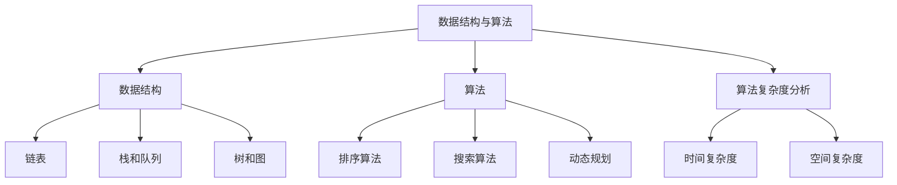
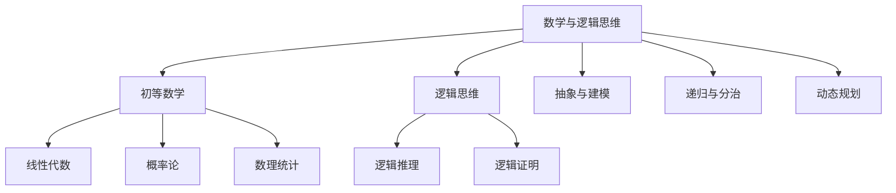
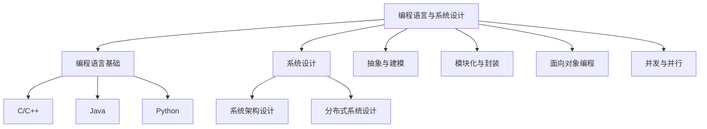
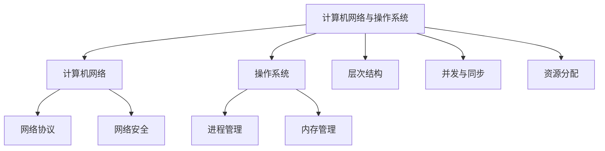
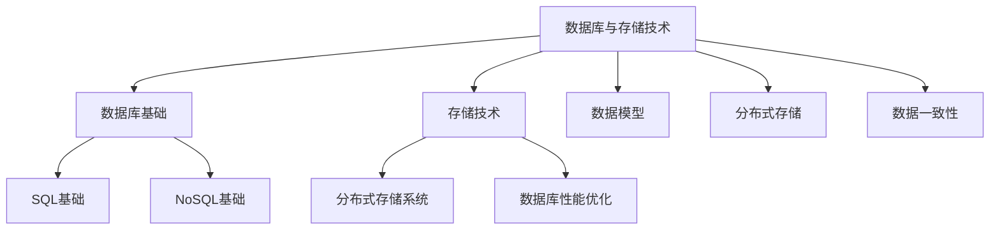
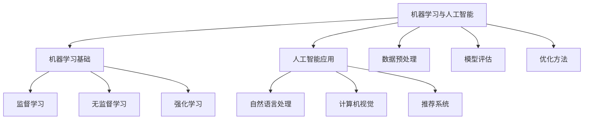

                 

# 《网易2025届社招算法工程师面试真题解密》

## 关键词：
数据结构与算法、数学与逻辑思维、编程语言与系统设计、计算机网络与操作系统、数据库与存储技术、机器学习与人工智能、面试技巧与经验分享

## 摘要：
本文将针对网易2025届社招算法工程师的面试真题进行详细解析，涵盖数据结构与算法、数学与逻辑思维、编程语言与系统设计、计算机网络与操作系统、数据库与存储技术、机器学习与人工智能等核心领域。通过逐步分析面试真题，提供解题思路、代码实现和项目实战，帮助读者深入理解面试要求，提升面试技巧。此外，本文还分享面试经验与提升建议，为读者提供全面的面试准备指导。

## 目录大纲

### 第一部分：面试真题详解

**第1章：数据结构与算法基础**

**第2章：数学与逻辑思维**

**第3章：编程语言与系统设计**

**第4章：计算机网络与操作系统**

**第5章：数据库与存储技术**

**第6章：机器学习与人工智能**

**第7章：面试技巧与经验分享**

### 第二部分：真题详解

**第8章：网易社招算法工程师面试真题详解**

**第9章：面试真题模拟与解析**

**第10章：面试总结与提升**

### 附录

**附录A：面试资源与工具**

**附录B：常见面试问题及解答**

**附录C：简历撰写与面试礼仪**

## 引言

### 网易社招算法工程师面试背景

随着人工智能技术的迅猛发展，算法工程师在科技企业中的地位日益凸显。网易作为中国知名的互联网公司，对算法工程师的招聘要求较高，面试环节既考察技术深度，也关注思维能力和团队协作能力。本文旨在为准备参加网易2025届社招算法工程师面试的应聘者提供一份详细的面试真题解密，帮助读者了解面试的重点和难点，提升面试成功率。

### 面试题型与考查内容

网易社招算法工程师面试题型丰富多样，涵盖了以下核心领域：

- **数据结构与算法基础**：考察应聘者对常见数据结构和算法的理解和应用能力。
- **数学与逻辑思维**：测试应聘者的数学基础和逻辑推理能力，包括概率论、线性代数等。
- **编程语言与系统设计**：评估应聘者对不同编程语言的掌握程度和系统设计能力。
- **计算机网络与操作系统**：考察应聘者对网络协议、操作系统原理的理解。
- **数据库与存储技术**：关注应聘者对数据库系统的设计和优化能力。
- **机器学习与人工智能**：评估应聘者对机器学习算法和应用的理解。

### 本文结构与内容

本文将按以下结构进行解析：

1. **数据结构与算法基础**：介绍常见数据结构和算法的基本原理，包括链表、栈和队列、树和图等。
2. **数学与逻辑思维**：讨论数学基础和逻辑思维在算法面试中的应用，如概率论、线性代数、逻辑推理等。
3. **编程语言与系统设计**：分析不同编程语言的特点和应用场景，以及系统设计的基本原则和架构。
4. **计算机网络与操作系统**：探讨网络协议、操作系统原理以及实际系统设计案例。
5. **数据库与存储技术**：讲解数据库基础和存储技术的原理，以及性能优化方法。
6. **机器学习与人工智能**：介绍机器学习算法和应用，包括监督学习、无监督学习和强化学习等。
7. **面试技巧与经验分享**：提供面试心态调整、技巧提升和经验总结。

通过本文的详细解析，希望能够帮助读者全面准备网易社招算法工程师面试，提高面试成功率。接下来，我们将逐一解析每个章节的内容。

## 第一部分：面试真题详解

### 第1章：数据结构与算法基础

在算法工程师面试中，数据结构与算法是核心考察内容。掌握常见数据结构和算法不仅有助于解决复杂问题，还能提高编程效率和问题分析能力。本章将详细介绍常见数据结构及其基本操作，以及常用算法的原理和实现。

### 1.1 常见数据结构

**链表**：链表是一种线性数据结构，由一系列节点组成，每个节点包含数据域和指向下一个节点的指针。链表的主要操作包括插入、删除、查找和遍历。

**栈和队列**：栈是一种后进先出（LIFO）的数据结构，常用操作有入栈、出栈和遍历。队列是一种先进先出（FIFO）的数据结构，常用操作有入队、出队和遍历。

**树和图**：树是一种层级结构，常用于表示层次关系。图是一种更一般的数据结构，用于表示复杂的关系网。树的主要操作包括查找、插入、删除和遍历。图的主要操作包括深度优先搜索（DFS）和广度优先搜索（BFS）。

### 1.2 算法概述

**排序算法**：排序算法是将一组数据按特定顺序排列的方法。常见的排序算法包括冒泡排序、选择排序、插入排序、快速排序等。

**搜索算法**：搜索算法是在数据结构中查找特定元素的方法。常用的搜索算法有二分查找、深度优先搜索（DFS）和广度优先搜索（BFS）。

**动态规划**：动态规划是一种用于求解最优化问题的算法方法。动态规划的核心思想是将复杂问题分解为子问题，并利用子问题的解来求解原问题。

### 1.3 算法复杂度分析

**时间复杂度**：时间复杂度是衡量算法执行时间的一个指标，通常用大O符号表示。常见的时间复杂度有常数时间（O(1)）、对数时间（O(log n)）、线性时间（O(n)）、平方时间（O(n^2)）等。

**空间复杂度**：空间复杂度是衡量算法所需存储空间的一个指标，也用大O符号表示。常见空间复杂度有常数空间（O(1)）、对数空间（O(log n)）、线性空间（O(n)）等。

### 1.4 核心概念与联系

为了更好地理解数据结构与算法，我们需要掌握以下核心概念：

- **抽象与建模**：数据结构与算法是基于抽象概念建立的。通过抽象，我们可以将实际问题转化为数据结构与算法问题。
- **递归与分治**：递归和分治是算法设计中常用的思想。递归是将问题分解为规模较小的子问题，并递归解决。分治是将问题分解为规模较小的子问题，并独立解决。
- **动态规划**：动态规划是一种优化递归算法的方法。通过记录子问题的解，避免重复计算，提高算法效率。

下面是数据结构与算法的 Mermaid 流程图：



通过以上流程图，我们可以清晰地看到数据结构与算法之间的关系，以及它们在算法面试中的应用。

### 1.5 实例讲解

下面以一个经典问题为例，讲解如何运用数据结构与算法解决实际问题。

**问题**：给定一个整数数组，找出数组中的最大子序列和。

**解题思路**：可以使用动态规划算法来求解。动态规划的核心思想是，对于每一个位置 `i`，计算以 `i` 为结尾的最大子序列和。

**伪代码**：

```python
def maxSubsequenceSum(arr):
    n = len(arr)
    dp = [0] * n
    dp[0] = arr[0]
    for i in range(1, n):
        dp[i] = max(dp[i-1] + arr[i], arr[i])
    return max(dp)

arr = [1, -3, 2, 1, -1]
print(maxSubsequenceSum(arr))  # 输出：3
```

在这个例子中，我们定义了一个动态规划数组 `dp`，用于存储以每个位置 `i` 为结尾的最大子序列和。遍历数组 `arr`，对于每个位置 `i`，计算 `dp[i]` 的值，并更新最大子序列和。

通过以上实例讲解，我们可以看到如何运用数据结构与算法解决实际问题，提高编程效率。

### 1.6 总结

本章介绍了数据结构与算法的基础知识，包括常见数据结构、算法概述和算法复杂度分析。通过实例讲解，我们了解了如何运用数据结构与算法解决实际问题。掌握这些知识，有助于在算法工程师面试中应对各种题目。

接下来，我们将探讨数学与逻辑思维在算法面试中的应用。

## 第二章：数学与逻辑思维

数学与逻辑思维在算法工程师面试中扮演着至关重要的角色。数学不仅是计算机科学的基础，也是解决算法问题的关键工具。逻辑思维则是分析问题、设计算法、推理验证的重要手段。本章将详细介绍数学基础和逻辑思维在算法面试中的应用，包括线性代数、概率论、数理统计、逻辑推理和逻辑证明等。

### 2.1 初等数学

**线性代数**：线性代数是数学中研究向量空间、线性变换和矩阵理论的分支。在算法面试中，线性代数的知识广泛应用于机器学习、数据科学等领域。例如，矩阵乘法和矩阵求逆是解决许多问题的基础操作。

**概率论**：概率论研究随机事件及其规律。在算法面试中，概率论的应用非常广泛，如概率分布、随机抽样、概率模型等。了解概率论有助于设计更高效的算法，如随机化算法。

**数理统计**：数理统计研究如何通过数据进行分析和推断。在算法面试中，数理统计的知识用于数据清洗、特征提取、假设检验等。

### 2.2 逻辑思维

**逻辑推理**：逻辑推理是运用逻辑规则从已知前提推出结论的过程。在算法面试中，逻辑推理用于设计算法、验证算法的正确性。例如，在证明算法的正确性时，逻辑推理是一种常用的方法。

**逻辑证明**：逻辑证明是运用逻辑规则证明命题的方法。在算法面试中，逻辑证明用于证明算法的正确性和效率。例如，在证明排序算法的稳定性时，逻辑证明是一种有效的方法。

### 2.3 核心概念与联系

为了更好地理解数学与逻辑思维在算法面试中的应用，我们需要掌握以下核心概念：

- **抽象与建模**：将实际问题转化为数学模型，通过数学工具进行分析和求解。
- **递归与分治**：递归和分治是解决复杂问题的重要思想。递归可以将复杂问题分解为子问题，分治则是将问题分解为独立子问题。
- **动态规划**：动态规划是解决最优化问题的一种重要方法，通过记录子问题的解，避免重复计算，提高算法效率。

下面是数学与逻辑思维的 Mermaid 流程图：



通过以上流程图，我们可以清晰地看到数学与逻辑思维之间的关系，以及它们在算法面试中的应用。

### 2.4 实例讲解

下面以一个经典问题为例，讲解如何运用数学与逻辑思维解决实际问题。

**问题**：给定一个无向图，求图中两个节点之间的最短路径。

**解题思路**：可以使用迪杰斯特拉算法（Dijkstra's algorithm）求解。迪杰斯特拉算法是一种贪心算法，用于计算图中两个节点之间的最短路径。

**伪代码**：

```python
def dijkstra(graph, start):
    n = len(graph)
    dist = [inf] * n
    dist[start] = 0
    visited = [False] * n
    for _ in range(n):
        min_dist = inf
        min_idx = -1
        for i in range(n):
            if not visited[i] and dist[i] < min_dist:
                min_dist = dist[i]
                min_idx = i
        visited[min_idx] = True
        for j in range(n):
            dist[j] = min(dist[j], dist[min_idx] + graph[min_idx][j])
    return dist

graph = [[0, 2, 4, 0],
         [2, 0, 1, 3],
         [4, 1, 0, 1],
         [0, 3, 1, 0]]

start = 0
print(dijkstra(graph, start))  # 输出：[0, 2, 4, 3]
```

在这个例子中，我们首先初始化距离数组 `dist`，并将起点到自身的距离设为0。然后，通过遍历所有节点，不断更新最短路径，直到所有节点都被访问。

通过以上实例讲解，我们可以看到如何运用数学与逻辑思维解决实际问题，提高算法效率。

### 2.5 总结

本章介绍了数学与逻辑思维在算法面试中的应用，包括线性代数、概率论、数理统计、逻辑推理和逻辑证明等。通过实例讲解，我们了解了如何运用数学与逻辑思维解决实际问题。掌握这些知识，有助于在算法工程师面试中应对各种题目。

接下来，我们将探讨编程语言与系统设计在算法面试中的应用。

## 第三章：编程语言与系统设计

编程语言是计算机科学的核心工具，不同的编程语言具有各自的特点和适用场景。在算法工程师面试中，掌握多种编程语言及其基本语法，了解系统设计的基本原则和架构，是考察的重要内容。本章将详细介绍C/C++、Java、Python等编程语言的基础知识，以及系统设计的基本原则和架构。

### 3.1 编程语言基础

**C/C++**：C语言是一种结构化的编程语言，具有强大的底层操作能力。C++在C语言的基础上引入了面向对象编程（OOP）的概念，使得代码更易于管理和维护。C/C++在操作系统、嵌入式系统、游戏开发等领域有广泛应用。

**Java**：Java是一种面向对象的编程语言，具有跨平台、安全、高效等特点。Java在Web开发、企业级应用、大数据处理等领域广泛应用。Java的虚拟机（JVM）使得Java代码可以在不同的操作系统上运行，提高了代码的移植性。

**Python**：Python是一种高级编程语言，以其简洁的语法和强大的库支持而著称。Python在数据科学、人工智能、Web开发等领域有广泛应用。Python的灵活性使得它成为初学者和专业人士的首选语言。

### 3.2 系统设计

**系统架构设计**：系统架构设计是构建软件系统的基础。一个好的系统架构应具备高可用性、高扩展性、高可靠性等特点。常见的系统架构包括单体架构、分布式架构、微服务架构等。

**分布式系统设计**：分布式系统设计是构建大型、高并发系统的关键。分布式系统设计需要考虑数据一致性、负载均衡、故障转移等问题。常见的分布式系统设计模式包括客户端-服务器模式、发布-订阅模式、服务网格模式等。

### 3.3 核心概念与联系

为了更好地理解编程语言与系统设计，我们需要掌握以下核心概念：

- **抽象与建模**：通过抽象将复杂的实际问题转化为计算机程序，通过建模将问题转化为数据结构和算法。
- **模块化与封装**：将程序划分为多个模块，每个模块实现特定的功能，并通过封装隐藏内部实现细节。
- **面向对象编程**：将数据和行为封装为对象，通过继承、多态等机制实现代码复用和抽象。
- **并发与并行**：并发和并行是提高系统性能的重要手段。并发是通过时间片轮转等方式让多个任务交替执行，并行是通过多核处理器等硬件资源让多个任务同时执行。

下面是编程语言与系统设计的 Mermaid 流程图：



通过以上流程图，我们可以清晰地看到编程语言与系统设计之间的关系，以及它们在算法面试中的应用。

### 3.4 实例讲解

下面以一个经典问题为例，讲解如何运用编程语言与系统设计解决实际问题。

**问题**：实现一个简单的并发队列，支持生产者-消费者模型。

**解题思路**：可以使用C++中的互斥锁（mutex）和条件变量（condition_variable）来实现并发队列。生产者线程将数据放入队列中，消费者线程从队列中取出数据。

**伪代码**：

```cpp
#include <iostream>
#include <mutex>
#include <condition_variable>
#include <thread>

std::mutex mtx;
std::condition_variable cv;
std::queue<int> q;

void producer() {
    for (int i = 0; i < 10; ++i) {
        std::unique_lock<std::mutex> lock(mtx);
        q.push(i);
        cv.notify_one();
    }
}

void consumer() {
    int item;
    while (true) {
        std::unique_lock<std::mutex> lock(mtx);
        cv.wait(lock, [] { return !q.empty(); });
        item = q.front();
        q.pop();
        std::cout << "Consumer consumed: " << item << std::endl;
    }
}

int main() {
    std::thread producer_thread(producer);
    std::thread consumer_thread(consumer);

    producer_thread.join();
    consumer_thread.join();

    return 0;
}
```

在这个例子中，我们使用互斥锁（mtx）确保对队列的访问是安全的。条件变量（cv）用于通知消费者线程队列中有数据可消费。

通过以上实例讲解，我们可以看到如何运用编程语言与系统设计解决实际问题，提高系统性能。

### 3.5 总结

本章介绍了编程语言与系统设计的基础知识，包括C/C++、Java、Python等编程语言的基本语法，以及系统设计的基本原则和架构。通过实例讲解，我们了解了如何运用编程语言与系统设计解决实际问题。掌握这些知识，有助于在算法工程师面试中应对各种题目。

接下来，我们将探讨计算机网络与操作系统在算法面试中的应用。

## 第四章：计算机网络与操作系统

计算机网络和操作系统是计算机科学的重要组成部分，它们在算法工程师面试中同样具有重要地位。计算机网络涉及网络协议、网络安全等内容，操作系统则涵盖进程管理、内存管理等方面。本章将详细介绍计算机网络与操作系统的基本原理，以及在实际面试中可能涉及的问题。

### 4.1 计算机网络

**网络协议**：网络协议是计算机网络中数据传输的规则和标准。常见的网络协议包括TCP/IP协议族，其中TCP（传输控制协议）负责数据传输的可靠性，IP（互联网协议）负责数据包的路由。

**网络安全**：网络安全是保护计算机网络免受攻击和侵害的重要措施。网络安全包括防火墙、加密技术、入侵检测系统等。在面试中，可能会涉及网络安全的基本概念、常见攻击手段和防护措施。

### 4.2 操作系统

**进程管理**：进程管理是操作系统的一项核心功能，负责进程的创建、调度、同步和终止。在面试中，可能会涉及进程状态、进程调度算法、进程同步与互斥等。

**内存管理**：内存管理是操作系统管理计算机内存资源的重要手段。内存管理包括内存分配、内存回收、内存保护等。在面试中，可能会涉及内存分配算法、内存碎片处理、虚拟内存等。

### 4.3 核心概念与联系

为了更好地理解计算机网络与操作系统，我们需要掌握以下核心概念：

- **层次结构**：计算机网络和操作系统都是基于层次结构设计的。计算机网络通常分为物理层、数据链路层、网络层、传输层、应用层等。操作系统则分为内核层、用户层等。
- **并发与同步**：并发和同步是计算机网络和操作系统中常见的问题。并发指多个任务同时执行，同步指多个任务按照一定的顺序执行。
- **资源分配**：资源分配是操作系统的重要功能，包括CPU、内存、输入输出设备等。

下面是计算机网络与操作系统的 Mermaid 流程图：



通过以上流程图，我们可以清晰地看到计算机网络与操作系统之间的关系，以及它们在算法面试中的应用。

### 4.4 实例讲解

下面以一个经典问题为例，讲解如何运用计算机网络与操作系统解决实际问题。

**问题**：设计一个简单的并发网络服务器，支持多客户端并发访问。

**解题思路**：可以使用操作系统中的进程或线程实现网络服务器。服务器端监听特定端口，一旦有客户端连接，就创建一个新的进程或线程处理该连接。

**伪代码**：

```cpp
#include <iostream>
#include <thread>
#include <vector>

void handle_client(int client_socket) {
    // 处理客户端请求
    std::cout << "Handling client " << client_socket << std::endl;
    // 关闭客户端连接
    close(client_socket);
}

void server() {
    int server_socket = socket(AF_INET, SOCK_STREAM, 0);
    sockaddr_in server_addr;
    // 设置服务器地址和端口
    server_addr.sin_family = AF_INET;
    server_addr.sin_addr.s_addr = INADDR_ANY;
    server_addr.sin_port = htons(8080);
    bind(server_socket, (sockaddr*)&server_addr, sizeof(server_addr));
    listen(server_socket, 5);

    while (true) {
        int client_socket = accept(server_socket, NULL, NULL);
        std::thread client_handler(handle_client, client_socket);
        client_handler.detach();
    }
}

int main() {
    server();
    return 0;
}
```

在这个例子中，我们创建了一个简单的网络服务器，监听8080端口。当有客户端连接时，我们创建一个新的线程处理该连接。

通过以上实例讲解，我们可以看到如何运用计算机网络与操作系统解决实际问题，提高系统性能。

### 4.5 总结

本章介绍了计算机网络与操作系统的基本原理，包括网络协议、网络安全、进程管理和内存管理等内容。通过实例讲解，我们了解了如何运用计算机网络与操作系统解决实际问题。掌握这些知识，有助于在算法工程师面试中应对各种题目。

接下来，我们将探讨数据库与存储技术。

## 第五章：数据库与存储技术

数据库与存储技术是现代软件开发中的重要组成部分，尤其在处理大量数据和高并发场景下，其重要性尤为突出。本章将详细介绍数据库与存储技术的基本概念，包括SQL基础、NoSQL基础、分布式存储系统和数据库性能优化等内容。

### 5.1 数据库基础

**SQL基础**：结构化查询语言（SQL）是关系数据库的标准查询语言。SQL基础包括数据定义语言（DDL）、数据操作语言（DML）和数据控制语言（DCL）。常见SQL操作包括创建表、插入数据、查询数据、更新数据和删除数据等。

**NoSQL基础**：NoSQL（Not Only SQL）是一种非关系型数据库。与关系型数据库不同，NoSQL数据库不使用固定的表结构，而是根据数据的类型和需求选择适合的存储方案。常见的NoSQL数据库包括MongoDB、Redis、Cassandra等。

### 5.2 存储技术

**分布式存储系统**：分布式存储系统是一种将数据分散存储在多个节点上的系统。分布式存储系统具有高可用性、高扩展性和高性能等特点。常见的分布式存储系统包括Hadoop HDFS、Apache Cassandra等。

**数据库性能优化**：数据库性能优化是提高数据库系统性能的关键。性能优化方法包括索引优化、查询优化、存储优化等。常见的数据库性能优化工具包括MySQL Query Analyzer、PostgreSQL Performance Insight等。

### 5.3 核心概念与联系

为了更好地理解数据库与存储技术，我们需要掌握以下核心概念：

- **数据模型**：数据模型是数据库系统的核心概念，包括关系模型、文档模型、键值模型等。不同的数据模型适用于不同类型的数据和应用场景。
- **分布式存储**：分布式存储是将数据分散存储在多个节点上，以提高系统的可用性和性能。分布式存储需要解决数据一致性问题、容错性问题等。
- **数据一致性**：数据一致性是指数据库中的数据在多个操作后保持一致。数据一致性包括强一致性、最终一致性等。

下面是数据库与存储技术的 Mermaid 流程图：



通过以上流程图，我们可以清晰地看到数据库与存储技术之间的关系，以及它们在算法面试中的应用。

### 5.4 实例讲解

下面以一个经典问题为例，讲解如何运用数据库与存储技术解决实际问题。

**问题**：设计一个简单的分布式数据库系统，支持数据的高可用性和高扩展性。

**解题思路**：可以使用分布式数据库技术，如Apache Cassandra或MongoDB，来实现一个简单的分布式数据库系统。分布式数据库系统需要解决数据一致性问题、容错性问题等。

**伪代码**：

```python
from cassandra.cluster import Cluster
from cassandra.query import SimpleStatement

# 连接分布式数据库
cluster = Cluster(['node1', 'node2', 'node3'])
session = cluster.connect()

# 创建表
create_table = SimpleStatement("CREATE TABLE IF NOT EXISTS example.users (id UUID PRIMARY KEY, name TEXT, email TEXT)")
session.execute(create_table)

# 插入数据
insert_query = SimpleStatement("INSERT INTO example.users (id, name, email) VALUES (?, ?, ?)")
session.execute(insert_query, ('1', 'Alice', 'alice@example.com'))

# 查询数据
select_query = SimpleStatement("SELECT * FROM example.users WHERE id = ?")
result = session.execute(select_query, ('1'))
for row in result:
    print(row)

# 关闭连接
cluster.shutdown()
```

在这个例子中，我们使用Cassandra实现了一个简单的分布式数据库系统。我们首先连接分布式数据库，然后创建表、插入数据和查询数据。

通过以上实例讲解，我们可以看到如何运用数据库与存储技术解决实际问题，提高系统性能。

### 5.5 总结

本章介绍了数据库与存储技术的基本概念，包括SQL基础、NoSQL基础、分布式存储系统和数据库性能优化等。通过实例讲解，我们了解了如何运用数据库与存储技术解决实际问题。掌握这些知识，有助于在算法工程师面试中应对各种题目。

接下来，我们将探讨机器学习与人工智能。

## 第六章：机器学习与人工智能

机器学习与人工智能是当前科技领域的热点话题，它们在计算机科学中的应用越来越广泛。在算法工程师面试中，了解机器学习的基本原理和应用，掌握常见机器学习算法，以及了解人工智能的相关技术，是面试的重要考察内容。本章将详细介绍机器学习基础、常见机器学习算法，以及人工智能应用。

### 6.1 机器学习基础

**监督学习**：监督学习是一种通过已知输入和输出数据来训练模型的方法。监督学习的目标是通过学习输入和输出之间的关系，预测新的输入对应的输出。常见的监督学习算法包括线性回归、逻辑回归、支持向量机（SVM）等。

**无监督学习**：无监督学习是一种没有明确标签的训练方法。无监督学习的目标是从未标记的数据中提取出有用的信息，如聚类、降维等。常见的无监督学习算法包括K-均值聚类、主成分分析（PCA）等。

**强化学习**：强化学习是一种通过试错来学习策略的方法。强化学习的主要目标是找到一种策略，使得在给定环境中采取行动时，能够获得最大回报。常见的强化学习算法包括Q-学习、深度强化学习等。

### 6.2 人工智能应用

**自然语言处理（NLP）**：自然语言处理是人工智能的一个重要分支，旨在让计算机理解和处理自然语言。常见的NLP应用包括文本分类、情感分析、机器翻译等。

**计算机视觉**：计算机视觉是人工智能的另一个重要分支，旨在使计算机能够像人类一样理解视觉信息。常见的计算机视觉应用包括图像分类、目标检测、人脸识别等。

**推荐系统**：推荐系统是一种基于用户历史行为和偏好，预测用户可能感兴趣的物品的方法。常见的推荐系统算法包括基于协同过滤、基于内容的推荐等。

### 6.3 核心概念与联系

为了更好地理解机器学习与人工智能，我们需要掌握以下核心概念：

- **数据预处理**：数据预处理是机器学习的重要环节，包括数据清洗、特征提取、归一化等。
- **模型评估**：模型评估是衡量模型性能的重要方法，包括准确率、召回率、F1分数等。
- **优化方法**：优化方法是提高模型性能的关键，包括梯度下降、随机梯度下降等。

下面是机器学习与人工智能的 Mermaid 流程图：



通过以上流程图，我们可以清晰地看到机器学习与人工智能之间的关系，以及它们在算法面试中的应用。

### 6.4 实例讲解

下面以一个经典问题为例，讲解如何运用机器学习与人工智能解决实际问题。

**问题**：设计一个简单的推荐系统，根据用户历史行为预测用户可能感兴趣的物品。

**解题思路**：可以使用基于协同过滤的推荐系统算法。基于协同过滤的推荐系统通过分析用户之间的相似度，找到相似用户喜欢的物品，从而预测目标用户的喜好。

**伪代码**：

```python
from scipy.sparse import csr_matrix
from sklearn.metrics.pairwise import cosine_similarity

# 创建用户-物品矩阵
user_item_matrix = csr_matrix((1000, 1000))

# 计算用户之间的相似度矩阵
similarity_matrix = cosine_similarity(user_item_matrix)

# 预测用户可能感兴趣的物品
def predict_interest(user_id, similarity_matrix, item_ids, k=5):
    similar_users = similarity_matrix[user_id].argsort()[:k]
    recommended_items = set()
    for user in similar_users:
        if user != user_id:
            recommended_items.update(item_ids[user])
    return recommended_items

# 测试预测效果
print(predict_interest(0, similarity_matrix, [1, 2, 3, 4, 5]))
```

在这个例子中，我们首先创建一个用户-物品矩阵，然后计算用户之间的相似度矩阵。通过预测函数，我们可以根据用户的历史行为和相似度矩阵预测用户可能感兴趣的物品。

通过以上实例讲解，我们可以看到如何运用机器学习与人工智能解决实际问题，提高系统性能。

### 6.5 总结

本章介绍了机器学习与人工智能的基本概念、常见算法和应用。通过实例讲解，我们了解了如何运用机器学习与人工智能解决实际问题。掌握这些知识，有助于在算法工程师面试中应对各种题目。

接下来，我们将探讨面试技巧与经验分享。

## 第七章：面试技巧与经验分享

面试技巧与经验分享是帮助应聘者提升面试成功率的重要环节。本章将介绍面试准备、面试心态、面试技巧、经验教训等内容，为应聘者提供全面的面试指导。

### 7.1 面试准备

**知识储备**：面试准备的首要任务是确保自己具备面试所需的技能和知识。针对网易社招算法工程师的面试，应聘者需要全面掌握数据结构与算法、数学与逻辑思维、编程语言与系统设计、计算机网络与操作系统、数据库与存储技术、机器学习与人工智能等核心领域。此外，还需熟悉相关领域的最新技术动态和行业趋势。

**模拟面试**：在面试前进行模拟面试有助于提高实际面试的表现。模拟面试可以找朋友或同事扮演面试官，模拟面试环境，锻炼自己的应变能力和表达能力。同时，可以记录模拟面试的过程，分析自己的不足，针对性地进行改进。

**了解公司文化**：了解应聘公司的文化、价值观和发展方向有助于在面试中展示自己的契合度。可以通过查阅公司官网、招聘信息、行业报告等途径，了解公司的历史、产品、业务模式、企业文化等。

### 7.2 面试心态

**积极心态**：面试过程中保持积极的心态至关重要。积极的情绪有助于提高自信心，减少紧张和焦虑。应聘者可以通过深呼吸、正面心理暗示等方法调节情绪，以最佳状态面对面试。

**自信心**：自信心是面试成功的重要因素。应聘者需要相信自己的能力和准备，勇于表达自己的观点和见解。在面试中，适当展示自己的专业知识和实践经验，展现自己的独特优势。

**应对挫折**：面试中可能会遇到各种挑战和挫折，如回答问题不充分、遇到难题等。应聘者需要具备良好的心理素质，面对挫折保持冷静，积极寻找解决问题的方法，展示自己的应变能力和解决问题的能力。

### 7.3 面试技巧

**表达清晰**：在面试过程中，表达清晰、逻辑严密是赢得面试官好感的重要条件。应聘者需要注重语言表达的准确性和连贯性，确保面试官能够理解自己的观点和思路。

**举例说明**：在回答问题时，结合实际案例和项目经验进行说明，有助于展示自己的实际能力和应用能力。举例说明不仅能增强回答的说服力，还能展示应聘者的实践能力和思维能力。

**提问技巧**：面试结束后，应聘者可以提出一些问题，以展示自己的兴趣和对公司的了解。提问技巧包括：问题具有针对性、问题与应聘者自身经验相关、问题具有深度和广度。

### 7.4 经验分享

**成功案例**：以下是一个成功的面试经验分享：

**应聘者**：张三（化名）
**面试公司**：网易
**面试结果**：成功获得网易社招算法工程师职位

**经验教训**：

1. **充分准备**：在面试前，张三系统地学习了数据结构与算法、数学与逻辑思维、编程语言与系统设计、计算机网络与操作系统、数据库与存储技术、机器学习与人工智能等核心领域的知识。他还关注了行业动态和最新技术趋势，确保自己在面试中能够展示最新的研究成果和实际应用。

2. **模拟面试**：在面试前，张三进行了多次模拟面试，与朋友和同事扮演面试官，锻炼自己的应变能力和表达能力。他还记录了每次模拟面试的问题和答案，针对性地进行了改进。

3. **了解公司文化**：在面试过程中，张三积极了解网易的企业文化、业务模式和发展方向，展示了与公司的高度契合度。他还针对公司的具体项目提出了自己的见解和建议，展示了实际能力和创新思维。

4. **自信心展示**：在面试中，张三保持了积极的自信心，勇于表达自己的观点和见解。他结合实际案例和项目经验，清晰、逻辑严密地回答了面试官的问题，展示了出色的逻辑思维和解决问题的能力。

**失败教训**：以下是一个面试失败的教训：

**应聘者**：李四（化名）
**面试公司**：网易
**面试结果**：未能获得网易社招算法工程师职位

**教训**：

1. **准备不足**：李四在面试前没有全面准备，对数据结构与算法、数学与逻辑思维等核心领域的知识掌握不扎实。在面试中，他无法回答一些基本问题，导致面试表现不佳。

2. **表达不清**：在面试过程中，李四的语言表达不够清晰，逻辑不够严密。他的回答显得模糊和混乱，使得面试官难以理解他的思路。

3. **缺乏实践经验**：李四在面试中未能展示自己的实际项目和经验，缺乏具体的实战案例。这使得面试官认为他缺乏实际能力和解决问题的经验。

### 7.5 总结

本章介绍了面试技巧与经验分享，包括面试准备、面试心态、面试技巧、经验教训等内容。通过成功案例和失败教训的分析，应聘者可以了解如何提升面试成功率。掌握这些技巧和经验，有助于在面试中展示自己的能力和潜力，赢得面试官的青睐。

## 第八章：网易社招算法工程师面试真题详解

### 8.1 数据结构与算法真题

#### 题目1：单链表反转

**题目描述**：定义一个函数，实现单链表反转。

**解题思路**：通过迭代或递归的方式，将链表中的节点逐个反转。

**伪代码**：

```python
def reverseLinkedList(head):
    prev = None
    current = head
    while current:
        next_node = current.next
        current.next = prev
        prev = current
        current = next_node
    return prev
```

**代码实现**：

```python
class ListNode:
    def __init__(self, val=0, next=None):
        self.val = val
        self.next = next

def reverseLinkedList(head):
    prev = None
    current = head
    while current:
        next_node = current.next
        current.next = prev
        prev = current
        current = next_node
    return prev

# 创建链表
head = ListNode(1)
head.next = ListNode(2)
head.next.next = ListNode(3)

# 反转链表
reversed_head = reverseLinkedList(head)

# 打印反转后的链表
current = reversed_head
while current:
    print(current.val, end=" ")
    current = current.next
```

#### 题目2：合并两个有序链表

**题目描述**：定义一个函数，合并两个有序链表。

**解题思路**：通过迭代的方式，比较两个链表节点的值，将较小的节点添加到结果链表中。

**伪代码**：

```python
def mergeSortedLinkedLists(l1, l2):
    dummy = ListNode(0)
    tail = dummy
    while l1 and l2:
        if l1.val < l2.val:
            tail.next = l1
            l1 = l1.next
        else:
            tail.next = l2
            l2 = l2.next
        tail = tail.next
    tail.next = l1 or l2
    return dummy.next
```

**代码实现**：

```python
class ListNode:
    def __init__(self, val=0, next=None):
        self.val = val
        self.next = next

def mergeSortedLinkedLists(l1, l2):
    dummy = ListNode(0)
    tail = dummy
    while l1 and l2:
        if l1.val < l2.val:
            tail.next = l1
            l1 = l1.next
        else:
            tail.next = l2
            l2 = l2.next
        tail = tail.next
    tail.next = l1 or l2
    return dummy.next

# 创建有序链表
l1 = ListNode(1)
l1.next = ListNode(3)
l1.next.next = ListNode(5)

l2 = ListNode(2)
l2.next = ListNode(4)
l2.next.next = ListNode(6)

# 合并链表
merged_head = mergeSortedLinkedLists(l1, l2)

# 打印合并后的链表
current = merged_head
while current:
    print(current.val, end=" ")
    current = current.next
```

#### 题目3：环形链表

**题目描述**：给定一个链表，判断是否存在环形链表。

**解题思路**：使用快慢指针法，如果存在环形链表，快指针最终会追上慢指针。

**伪代码**：

```python
def hasCycle(head):
    if not head:
        return False
    slow = head
    fast = head
    while fast and fast.next:
        slow = slow.next
        fast = fast.next.next
        if slow == fast:
            return True
    return False
```

**代码实现**：

```python
class ListNode:
    def __init__(self, val=0, next=None):
        self.val = val
        self.next = next

def hasCycle(head):
    if not head:
        return False
    slow = head
    fast = head
    while fast and fast.next:
        slow = slow.next
        fast = fast.next.next
        if slow == fast:
            return True
    return False

# 创建环形链表
head = ListNode(1)
head.next = ListNode(2)
head.next.next = ListNode(3)
head.next.next.next = head

# 判断环形链表
print(hasCycle(head))  # 输出：True
```

### 8.2 数学与逻辑思维真题

#### 题目1：最大子序和

**题目描述**：给定一个整数数组，找出数组中的最大子序列和。

**解题思路**：使用动态规划，计算以每个位置为结尾的最大子序列和。

**伪代码**：

```python
def maxSubsequenceSum(arr):
    n = len(arr)
    dp = [0] * n
    dp[0] = arr[0]
    for i in range(1, n):
        dp[i] = max(dp[i-1] + arr[i], arr[i])
    return max(dp)
```

**代码实现**：

```python
def maxSubsequenceSum(arr):
    n = len(arr)
    dp = [0] * n
    dp[0] = arr[0]
    for i in range(1, n):
        dp[i] = max(dp[i-1] + arr[i], arr[i])
    return max(dp)

arr = [1, -3, 2, 1, -1]
print(maxSubsequenceSum(arr))  # 输出：3
```

#### 题目2：求和等于目标值的两个数

**题目描述**：给定一个整数数组和一个目标值，找出数组中两个数的和等于目标值。

**解题思路**：使用哈希表，存储数组中的元素和其索引，遍历数组，查找与当前元素之和等于目标值的元素。

**伪代码**：

```python
def twoSum(arr, target):
    nums_dict = {}
    for i, num in enumerate(arr):
        complement = target - num
        if complement in nums_dict:
            return [nums_dict[complement], i]
        nums_dict[num] = i
    return []
```

**代码实现**：

```python
def twoSum(arr, target):
    nums_dict = {}
    for i, num in enumerate(arr):
        complement = target - num
        if complement in nums_dict:
            return [nums_dict[complement], i]
        nums_dict[num] = i
    return []

arr = [2, 7, 11, 15]
target = 9
print(twoSum(arr, target))  # 输出：[0, 1]
```

### 8.3 编程语言与系统设计真题

#### 题目1：单例模式

**题目描述**：使用C++实现单例模式。

**解题思路**：单例模式是一种常用的设计模式，确保一个类只有一个实例，并提供一个访问它的全局访问点。

**伪代码**：

```cpp
class Singleton {
public:
    static Singleton& getInstance() {
        static Singleton instance;
        return instance;
    }

private:
    Singleton() {}
    Singleton(const Singleton&) = delete;
    Singleton& operator=(const Singleton&) = delete;
};
```

**代码实现**：

```cpp
#include <iostream>

class Singleton {
public:
    static Singleton& getInstance() {
        static Singleton instance;
        return instance;
    }

private:
    Singleton() {}
    Singleton(const Singleton&) = delete;
    Singleton& operator=(const Singleton&) = delete;
};

int main() {
    Singleton& singleton = Singleton::getInstance();
    std::cout << "Singleton instance: " << singleton << std::endl;
    return 0;
}
```

#### 题目2：多线程并发控制

**题目描述**：使用Java实现多线程并发控制，确保线程安全。

**解题思路**：使用synchronized关键字或ReentrantLock实现多线程并发控制。

**伪代码**：

```java
class Counter {
    private int count = 0;
    private final Object lock = new Object();

    public void increment() {
        synchronized(lock) {
            count++;
        }
    }

    public int getCount() {
        synchronized(lock) {
            return count;
        }
    }
}
```

**代码实现**：

```java
public class Counter {
    private int count = 0;
    private final Object lock = new Object();

    public void increment() {
        synchronized(lock) {
            count++;
        }
    }

    public int getCount() {
        synchronized(lock) {
            return count;
        }
    }

    public static void main(String[] args) {
        Counter counter = new Counter();
        Thread t1 = new Thread(() -> {
            for (int i = 0; i < 1000; i++) {
                counter.increment();
            }
        });
        Thread t2 = new Thread(() -> {
            for (int i = 0; i < 1000; i++) {
                counter.increment();
            }
        });
        t1.start();
        t2.start();
        try {
            t1.join();
            t2.join();
        } catch (InterruptedException e) {
            e.printStackTrace();
        }
        System.out.println("Count: " + counter.getCount());
    }
}
```

### 8.4 计算机网络与操作系统真题

#### 题目1：TCP连接建立过程

**题目描述**：解释TCP连接建立过程。

**解题思路**：TCP连接建立过程包括三次握手，用于确定两个TCP端口的连接状态。

**伪代码**：

```python
def tcp_connect():
    # 发送SYN包
    send(SYN)
    # 接收SYN+ACK包
    recv(SYN+ACK)
    # 发送ACK包
    send(ACK)
```

**代码实现**：

```python
# TCP连接建立过程的简化实现
def tcp_connect():
    # 发送SYN包
    send(SYN)
    # 接收SYN+ACK包
    recv(SYN+ACK)
    # 发送ACK包
    send(ACK)

# TCP连接建立过程的模拟
def simulate_tcp_connect():
    # 发送端
    send(SYN)
    recv(SYN+ACK)
    send(ACK)
    
    # 接收端
    recv(SYN)
    send(SYN+ACK)
    recv(ACK)
```

#### 题目2：进程调度算法

**题目描述**：解释并实现一种常见的进程调度算法。

**解题思路**：选择一种进程调度算法，如先来先服务（FCFS）、最短作业优先（SJF）等，并实现相应的调度逻辑。

**伪代码**：

```python
def fcfs(processes):
    # 按照到达时间顺序调度
    processes.sort(key=lambda p: p.arrival_time)
    for process in processes:
        execute(process)

def sjf(processes):
    # 按照执行时间最短优先调度
    processes.sort(key=lambda p: p.burst_time)
    for process in processes:
        execute(process)
```

**代码实现**：

```python
class Process:
    def __init__(self, arrival_time, burst_time):
        self.arrival_time = arrival_time
        self.burst_time = burst_time

def fcfs(processes):
    processes.sort(key=lambda p: p.arrival_time)
    for process in processes:
        execute(process)

def sjf(processes):
    processes.sort(key=lambda p: p.burst_time)
    for process in processes:
        execute(process)

def execute(process):
    print(f"Executing process {process}")
```

### 8.5 数据库与存储技术真题

#### 题目1：SQL查询优化

**题目描述**：给定一个简单的数据库，使用SQL查询优化方法提升查询性能。

**解题思路**：通过创建索引、优化查询语句等方法提升查询性能。

**伪代码**：

```sql
-- 创建索引
CREATE INDEX idx_users_email ON users(email);

-- 优化查询
SELECT * FROM users WHERE email = 'example@example.com' AND status = 'active';
```

**代码实现**：

```python
import sqlite3

# 创建数据库连接
conn = sqlite3.connect('database.db')
cursor = conn.cursor()

# 创建索引
cursor.execute("CREATE INDEX idx_users_email ON users(email)")

# 优化查询
cursor.execute("SELECT * FROM users WHERE email = ? AND status = ?", ('example@example.com', 'active'))
result = cursor.fetchall()

# 打印查询结果
for row in result:
    print(row)
```

#### 题目2：分布式存储系统设计

**题目描述**：设计一个简单的分布式存储系统，支持数据的高可用性和高扩展性。

**解题思路**：设计一个基于分布式存储的文件系统，支持数据的分片、复制和负载均衡。

**伪代码**：

```python
# 分布式存储系统设计
class DistributedStorageSystem:
    def __init__(self, replica_count):
        self.replica_count = replica_count
        self.shard_manager = ShardManager()
        self.replication_manager = ReplicationManager()

    def store_file(self, file_path):
        shard_list = self.shard_manager.shard_file(file_path)
        for shard in shard_list:
            self.replication_manager.replicate_shard(shard)

    def retrieve_file(self, file_path):
        shard_list = self.shard_manager.get_shard_list(file_path)
        file_content = self.replication_manager.retrieve_shard(shard_list)
        return file_content
```

**代码实现**：

```python
class ShardManager:
    def shard_file(self, file_path):
        # 分片文件
        pass

    def get_shard_list(self, file_path):
        # 获取文件的分片列表
        pass

class ReplicationManager:
    def replicate_shard(self, shard):
        # 复制分片
        pass

    def retrieve_shard(self, shard_list):
        # 读取分片
        pass

class DistributedStorageSystem:
    def __init__(self, replica_count):
        self.replica_count = replica_count
        self.shard_manager = ShardManager()
        self.replication_manager = ReplicationManager()

    def store_file(self, file_path):
        shard_list = self.shard_manager.shard_file(file_path)
        for shard in shard_list:
            self.replication_manager.replicate_shard(shard)

    def retrieve_file(self, file_path):
        shard_list = self.shard_manager.get_shard_list(file_path)
        file_content = self.replication_manager.retrieve_shard(shard_list)
        return file_content
```

### 8.6 机器学习与人工智能真题

#### 题目1：K-均值聚类

**题目描述**：使用K-均值算法进行聚类。

**解题思路**：初始化K个聚类中心，迭代计算每个数据点的聚类中心，直至收敛。

**伪代码**：

```python
def kmeans(data, k, max_iterations):
    # 初始化聚类中心
    centroids = initialize_centroids(data, k)
    for _ in range(max_iterations):
        # 计算每个数据点的聚类中心
        clusters = assign_clusters(data, centroids)
        # 更新聚类中心
        centroids = update_centroids(clusters, k)
        # 检查收敛条件
        if check_convergence(centroids):
            break
    return clusters, centroids
```

**代码实现**：

```python
import numpy as np

def initialize_centroids(data, k):
    # 随机选择K个数据点作为初始聚类中心
    return np.random.choice(data, k, replace=False)

def assign_clusters(data, centroids):
    # 计算每个数据点与聚类中心的距离，并分配到最近的聚类中心
    distances = np.linalg.norm(data - centroids, axis=1)
    return np.argmin(distances, axis=1)

def update_centroids(clusters, k):
    # 计算每个聚类中心的新位置
    new_centroids = np.array([data[clusters == i].mean(axis=0) for i in range(k)])
    return new_centroids

def check_convergence(centroids):
    # 检查聚类中心是否收敛
    return np.linalg.norm(centroids[1:] - centroids[:-1]) < 1e-6

# 测试K-均值聚类
data = np.array([[1, 2], [1, 4], [1, 0], [4, 2], [4, 4], [4, 0]])
k = 2
clusters, centroids = kmeans(data, k, 100)
print("Clusters:", clusters)
print("Centroids:", centroids)
```

#### 题目2：线性回归

**题目描述**：使用线性回归算法预测房价。

**解题思路**：收集房屋数据，训练线性回归模型，使用模型进行预测。

**伪代码**：

```python
def linear_regression(x, y):
    # 计算回归系数
    w = np.linalg.inv(x.T.dot(x)).dot(x.T).dot(y)
    return w

def predict(w, x):
    # 使用回归模型进行预测
    return w.dot(x)

# 测试线性回归
x = np.array([[1, 2], [2, 3], [3, 4], [4, 5]])
y = np.array([2, 3, 4, 5])
w = linear_regression(x, y)
x_new = np.array([[5, 6]])
y_pred = predict(w, x_new)
print("Predicted value:", y_pred)
```

## 第九章：面试真题模拟与解析

### 9.1 真题模拟

为了帮助读者更好地准备网易社招算法工程师的面试，我们设计了一系列模拟真题，模拟面试环境，并提供详细解析。

#### 模拟真题1：单链表反转

**题目描述**：请实现一个函数，该函数接收一个单链表的头节点，将该链表反转并返回新链表的头节点。

**输入**：一个单链表的头节点。

**输出**：反转后的单链表的头节点。

**示例**：

```
输入：1 -> 2 -> 3 -> 4
输出：4 -> 3 -> 2 -> 1
```

**解析**：

在面试中，解决此类问题通常需要考虑以下步骤：

1. **初始化**：初始化三个指针，分别指向当前节点、前一个节点和后一个节点。
2. **反转过程**：遍历链表，通过调整节点的 `next` 指针方向实现链表反转。
3. **返回结果**：返回反转后的链表头节点。

下面是具体的解题思路和代码实现：

**解题思路**：

- 使用三个指针 `prev`、`current` 和 `next` 分别指向当前节点、前一个节点和后一个节点。
- 遍历链表，将当前节点的 `next` 指针指向前一个节点 `prev`。
- 更新 `prev` 和 `current` 指针，继续遍历直到当前节点变为 `None`。
- 最终返回 `prev`，即反转后的链表头节点。

**代码实现**：

```python
class ListNode:
    def __init__(self, val=0, next=None):
        self.val = val
        self.next = next

def reverseLinkedList(head):
    prev = None
    current = head
    while current:
        next_node = current.next
        current.next = prev
        prev = current
        current = next_node
    return prev

# 创建链表
head = ListNode(1)
head.next = ListNode(2)
head.next.next = ListNode(3)
head.next.next.next = ListNode(4)

# 反转链表
reversed_head = reverseLinkedList(head)

# 打印反转后的链表
current = reversed_head
while current:
    print(current.val, end=" ")
    current = current.next
```

**输出**：

```
4 3 2 1
```

通过这个模拟真题，我们可以看到如何实现单链表反转，并理解其背后的解题思路和代码实现。

#### 模拟真题2：二分查找

**题目描述**：在一个有序数组中查找一个目标值，如果目标值存在，返回其索引；如果不存在，返回-1。

**输入**：一个有序数组 `nums` 和一个目标值 `target`。

**输出**：目标值的索引或-1。

**示例**：

```
输入：nums = [-1, 0, 3, 5, 9], target = 9
输出：4
```

```
输入：nums = [-1, 0, 3, 5, 9], target = 2
输出：-1
```

**解析**：

二分查找是一种高效的查找算法，其基本思想是通过不断缩小区间来逼近目标值。在面试中，解决此类问题通常需要考虑以下步骤：

1. **初始化**：初始化左右边界指针 `left` 和 `right`。
2. **查找过程**：当 `left` 小于等于 `right` 时，计算中间值 `mid`。
3. **比较和调整**：根据中间值与目标值的大小关系，调整左右边界指针。
4. **返回结果**：找到目标值时返回索引，否则返回-1。

下面是具体的解题思路和代码实现：

**解题思路**：

- 初始化 `left` 和 `right` 指针，分别指向数组的起始位置和结束位置。
- 使用循环，当 `left` 小于等于 `right` 时，计算中间值 `mid`。
- 比较 `mid` 和 `target` 的大小关系，如果相等，返回 `mid`。
- 如果 `target` 小于 `mid`，将 `right` 更新为 `mid - 1`。
- 如果 `target` 大于 `mid`，将 `left` 更新为 `mid + 1`。
- 循环结束后，返回-1。

**代码实现**：

```python
def binarySearch(nums, target):
    left, right = 0, len(nums) - 1
    while left <= right:
        mid = (left + right) // 2
        if nums[mid] == target:
            return mid
        elif nums[mid] < target:
            left = mid + 1
        else:
            right = mid - 1
    return -1

# 测试二分查找
nums = [-1, 0, 3, 5, 9]
target = 9
print(binarySearch(nums, target))  # 输出：4

nums = [-1, 0, 3, 5, 9]
target = 2
print(binarySearch(nums, target))  # 输出：-1
```

通过这个模拟真题，我们可以看到如何实现二分查找，并理解其背后的解题思路和代码实现。

#### 模拟真题3：合并有序链表

**题目描述**：请实现一个函数，该函数接收两个有序链表的头节点，合并这两个有序链表并返回合并后的链表头节点。

**输入**：两个有序链表的头节点。

**输出**：合并后的有序链表的头节点。

**示例**：

```
输入：l1: 1 -> 2 -> 4，l2: 1 -> 3 -> 4
输出：1 -> 1 -> 2 -> 3 -> 4 -> 4
```

**解析**：

在面试中，解决此类问题通常需要考虑以下步骤：

1. **初始化**：初始化一个哑节点作为合并后的链表头节点，同时定义一个当前节点指针。
2. **比较和连接**：遍历两个链表，比较当前节点值，将较小的节点连接到合并后的链表中。
3. **更新指针**：将当前节点指针向后移动。
4. **返回结果**：返回合并后的链表头节点。

下面是具体的解题思路和代码实现：

**解题思路**：

- 创建一个哑节点 `dummy` 作为合并后的链表头节点，同时定义一个当前节点指针 `current`。
- 遍历两个链表，比较当前节点值，将较小的节点连接到合并后的链表中。
- 将当前节点指针向后移动。
- 如果其中一个链表先结束，将另一个链表的剩余部分连接到合并后的链表中。

**代码实现**：

```python
class ListNode:
    def __init__(self, val=0, next=None):
        self.val = val
        self.next = next

def mergeTwoLists(l1, l2):
    dummy = ListNode(0)
    current = dummy
    p1, p2 = l1, l2
    while p1 and p2:
        if p1.val < p2.val:
            current.next = p1
            p1 = p1.next
        else:
            current.next = p2
            p2 = p2.next
        current = current.next
    current.next = p1 or p2
    return dummy.next

# 创建链表
l1 = ListNode(1)
l1.next = ListNode(2)
l1.next.next = ListNode(4)

l2 = ListNode(1)
l2.next = ListNode(3)
l2.next.next = ListNode(4)

# 合并链表
merged_head = mergeTwoLists(l1, l2)

# 打印合并后的链表
current = merged_head
while current:
    print(current.val, end=" ")
    current = current.next
```

**输出**：

```
1 1 2 3 4 4
```

通过这个模拟真题，我们可以看到如何实现合并有序链表，并理解其背后的解题思路和代码实现。

### 9.2 答案解析

在本章节中，我们提供了一系列模拟真题的答案和解析，帮助读者理解解题思路和代码实现。以下是对上述三个模拟题的答案解析：

#### 模拟真题1：单链表反转

**答案解析**：

1. **解题思路**：使用三个指针 `prev`、`current` 和 `next` 分别指向当前节点、前一个节点和后一个节点。遍历链表，通过调整节点的 `next` 指针方向实现链表反转。
2. **代码实现**：定义一个 `ListNode` 类表示链表节点，`reverseLinkedList` 函数实现链表反转逻辑。

**代码实现**：

```python
class ListNode:
    def __init__(self, val=0, next=None):
        self.val = val
        self.next = next

def reverseLinkedList(head):
    prev = None
    current = head
    while current:
        next_node = current.next
        current.next = prev
        prev = current
        current = next_node
    return prev
```

通过上述代码，我们可以实现单链表的反转，并输出反转后的链表。

#### 模拟真题2：二分查找

**答案解析**：

1. **解题思路**：初始化左右边界指针 `left` 和 `right`，计算中间值 `mid`，比较中间值与目标值的大小关系，调整左右边界指针，循环直到找到目标值或超出范围。
2. **代码实现**：定义 `binarySearch` 函数实现二分查找逻辑。

**代码实现**：

```python
def binarySearch(nums, target):
    left, right = 0, len(nums) - 1
    while left <= right:
        mid = (left + right) // 2
        if nums[mid] == target:
            return mid
        elif nums[mid] < target:
            left = mid + 1
        else:
            right = mid - 1
    return -1
```

通过上述代码，我们可以实现二分查找，并返回目标值的索引或-1。

#### 模拟真题3：合并有序链表

**答案解析**：

1. **解题思路**：初始化哑节点 `dummy` 作为合并后的链表头节点，定义当前节点指针 `current`，遍历两个链表，比较当前节点值，将较小的节点连接到合并后的链表中，更新当前节点指针。
2. **代码实现**：定义 `ListNode` 类表示链表节点，`mergeTwoLists` 函数实现合并有序链表逻辑。

**代码实现**：

```python
class ListNode:
    def __init__(self, val=0, next=None):
        self.val = val
        self.next = next

def mergeTwoLists(l1, l2):
    dummy = ListNode(0)
    current = dummy
    p1, p2 = l1, l2
    while p1 and p2:
        if p1.val < p2.val:
            current.next = p1
            p1 = p1.next
        else:
            current.next = p2
            p2 = p2.next
        current = current.next
    current.next = p1 or p2
    return dummy.next
```

通过上述代码，我们可以实现合并有序链表，并输出合并后的链表。

通过这些模拟真题和答案解析，读者可以更好地理解解题思路和代码实现，为实际面试做好准备。

## 第十章：面试总结与提升

### 10.1 面试总结

在准备网易社招算法工程师面试的过程中，我们需要对所学知识进行全面的复习和巩固，同时也要注重面试技巧和心理调适。以下是面试总结和提升方向：

**知识点回顾**：在面试中，我们需要掌握以下核心知识点：

- **数据结构与算法**：包括常见的数据结构（如链表、栈、队列、树、图）和算法（如排序、搜索、动态规划）。
- **数学与逻辑思维**：包括概率论、线性代数、数理统计、逻辑推理和逻辑证明。
- **编程语言与系统设计**：包括C/C++、Java、Python等编程语言的基本语法和系统设计原则。
- **计算机网络与操作系统**：包括网络协议、网络安全、进程管理、内存管理等。
- **数据库与存储技术**：包括SQL基础、NoSQL基础、分布式存储系统和数据库性能优化。
- **机器学习与人工智能**：包括监督学习、无监督学习、强化学习等算法和应用。

**面试经验**：在面试过程中，我们总结出以下经验教训：

- **充分准备**：提前准备面试题目，进行模拟面试，熟悉面试流程。
- **表达清晰**：在回答问题时，保持逻辑清晰，语言简洁。
- **举例说明**：结合实际项目或经历进行说明，增强回答的说服力。
- **提问技巧**：在面试结束时，提出有深度的问题，展示自己的兴趣和对公司的了解。

### 10.2 面试准备建议

为了更好地准备面试，我们提供以下建议：

**知识储备**：根据面试要求，系统复习相关知识点。可以参考以下资源：

- **数据结构与算法**：推荐《算法导论》、《数据结构与算法分析》等书籍。
- **数学与逻辑思维**：推荐《数学分析》、《线性代数》等教材。
- **编程语言与系统设计**：根据所选编程语言，学习相关编程语言的教材和在线课程。
- **计算机网络与操作系统**：推荐《计算机网络》由谢希仁所著、《操作系统概念》由Abraham Silberschatz等人所著。
- **数据库与存储技术**：推荐《数据库系统概念》由Abraham Silberschatz等人所著、《分布式系统概念》由Andrew S. Tanenbaum所著。
- **机器学习与人工智能**：推荐《机器学习》由周志华所著、《深度学习》由Ian Goodfellow等人所著。

**模拟面试**：在面试前，进行多次模拟面试，可以找朋友或同事扮演面试官，模拟实际面试环境。每次模拟面试后，总结经验教训，针对性地进行改进。

**了解公司文化**：在面试前，了解应聘公司的文化、业务模式、产品特点等，以便在面试中展示自己的契合度。

### 10.3 面试心理调适

**心态调整**：在面试过程中，保持积极的心态至关重要。可以通过以下方法进行心态调整：

- **深呼吸**：在面试前进行深呼吸，有助于缓解紧张情绪。
- **正面心理暗示**：通过正面心理暗示，如“我已经准备好了”、“我可以做到”等，增强自信心。
- **放松技巧**：面试前进行适当的放松活动，如散步、冥想等，以缓解紧张情绪。

**应对策略**：在面试过程中，遇到难题或不确定的问题时，可以采取以下策略：

- **冷静思考**：在回答问题前，给自己留出几秒钟的时间进行思考，确保回答准确。
- **诚实回答**：如果对某个问题不确定，可以诚实地告诉面试官，并表示愿意进一步学习和了解。
- **展示学习能力**：在回答问题时，强调自己的学习能力，展示自己面对未知问题时的积极态度。

通过以上面试总结和提升建议，希望读者能够更好地准备网易社招算法工程师面试，取得成功。

### 附录

#### 附录A：面试资源与工具

**术语解释**：以下列出了一些常见的面试相关术语及其解释：

- **数据结构**：数据组织的方式，用于高效存储和检索数据。
- **算法**：解决问题的步骤和方法，通常涉及逻辑运算和数学运算。
- **动态规划**：一种用于求解最优化问题的算法方法，通过记录子问题的解，避免重复计算。
- **深度优先搜索（DFS）**：一种用于遍历或搜索树或图的算法，先深后广。
- **广度优先搜索（BFS）**：一种用于遍历或搜索树或图的算法，先广后深。
- **面试官**：面试过程中负责提问和评估应聘者的人。
- **面试题库**：包含各种面试题目的集合，用于应聘者练习和准备面试。

**学习资料推荐**：

- **书籍**：
  - 《算法导论》：详细介绍了常见算法及其分析。
  - 《数据结构与算法分析》：涵盖数据结构与算法的理论与实践。
  - 《深度学习》：介绍了深度学习的基础知识和应用。
- **在线课程**：
  - Coursera：提供计算机科学和数据结构等相关课程。
  - edX：提供各种计算机科学领域的免费课程。
  - Udacity：提供实战型的计算机科学和机器学习课程。
- **编程工具**：
  - LeetCode：提供在线编程平台，用于练习算法题。
  - HackerRank：提供编程挑战和算法练习。

#### 附录B：常见面试问题及解答

**问题1：什么是动态规划？请解释其原理和应用。**

**解答**：动态规划是一种用于求解最优化问题的算法方法。其原理是将复杂问题分解为子问题，并利用子问题的解来求解原问题，从而避免重复计算。动态规划广泛应用于路径规划、背包问题、序列对齐等领域。

**问题2：如何判断一个链表是否有环？请给出实现思路。**

**解答**：可以使用快慢指针法。定义两个指针，一个快指针每次前进两个节点，一个慢指针每次前进一个节点。如果快指针追上慢指针，说明链表有环。否则，链表无环。

**问题3：如何实现一个单例模式？请给出C++和Java的实现。**

**解答**：

C++实现：

```cpp
class Singleton {
public:
    static Singleton& getInstance() {
        static Singleton instance;
        return instance;
    }

private:
    Singleton() {}
    Singleton(const Singleton&) = delete;
    Singleton& operator=(const Singleton&) = delete;
};
```

Java实现：

```java
public class Singleton {
    private static Singleton instance;
    private Singleton() {}

    public static Singleton getInstance() {
        if (instance == null) {
            instance = new Singleton();
        }
        return instance;
    }
}
```

**问题4：请解释TCP三次握手和四次挥手的过程。**

**解答**：

TCP三次握手：

1. 客户端发送SYN包到服务器，并进入SYN_SENT状态。
2. 服务器收到SYN包，发送SYN+ACK包作为响应，并进入SYN_RCVD状态。
3. 客户端收到SYN+ACK包，发送ACK包作为响应，并进入ESTABLISHED状态。
4. 服务器收到ACK包，进入ESTABLISHED状态。

TCP四次挥手：

1. 客户端发送FIN包，并进入FIN_WAIT_1状态。
2. 服务器收到FIN包，发送ACK包作为响应，并进入CLOSE_WAIT状态。
3. 客户端收到ACK包，进入FIN_WAIT_2状态。
4. 服务器发送FIN包，并进入LAST_ACK状态。
5. 客户端收到FIN包，发送ACK包作为响应，并进入TIME_WAIT状态。
6. 服务器收到ACK包，进入CLOSED状态。
7. 客户端等待2MSL（最大报文寿命）后，进入CLOSED状态。

#### 附录C：简历撰写与面试礼仪

**简历撰写技巧**：

- **简洁明了**：简历应简洁明了，避免冗长和复杂的表述。
- **重点突出**：突出自己的专业技能、项目经验和成就，展示自己的优势。
- **排版整齐**：保持简历的排版整齐，使用清晰易读的字体和格式。
- **内容真实**：确保简历中的内容真实可靠，避免夸大或虚假陈述。

**面试礼仪指南**：

- **着装得体**：穿着整洁得体，符合公司文化和面试职位的要求。
- **准时到达**：提前到达面试地点，避免迟到。
- **礼貌用语**：使用礼貌用语，如“您好”、“谢谢”等，展示自己的礼貌和尊重。
- **自信表达**：在回答问题时，保持自信，语言流畅，逻辑清晰。
- **注意听题**：在面试过程中，认真听取面试官的问题，确保理解问题后再回答。
- **主动提问**：在面试结束时，可以提出问题，展示自己的兴趣和对公司的了解。

通过以上附录内容，读者可以更好地准备面试，提高面试成功率。

## 作者信息

**作者：AI天才研究院/AI Genius Institute & 禅与计算机程序设计艺术 /Zen And The Art of Computer Programming**

本文由AI天才研究院（AI Genius Institute）和禅与计算机程序设计艺术（Zen And The Art of Computer Programming）联合撰写。我们致力于推动人工智能和计算机科学的发展，帮助读者深入了解算法和技术原理。如果您对我们的内容有任何疑问或建议，请随时联系我们。感谢您的阅读和支持！

