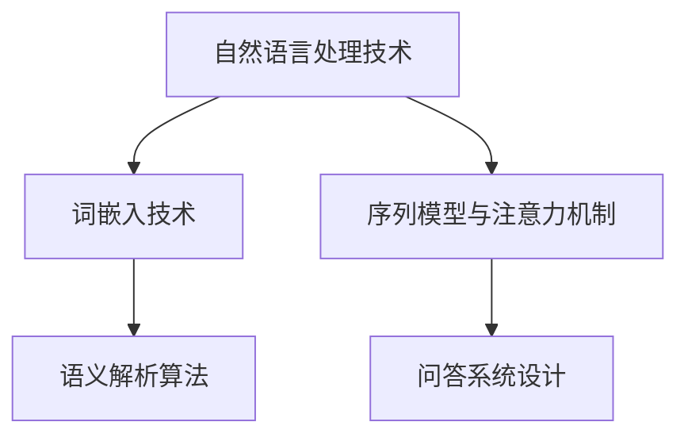
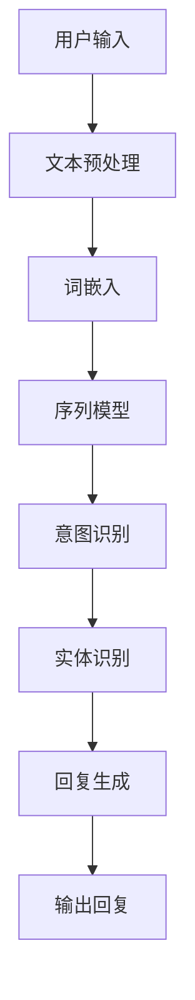

                 

# 《聊天机器人手工艺：创意项目灵感和指导》

## 关键词
- 聊天机器人
- 自然语言处理
- 情感分析
- 人工智能
- 创意项目
- 实践指导

## 摘要
本文旨在为读者提供一个全面的聊天机器人开发指南。文章首先概述了聊天机器人技术的发展与应用，然后逐步深入到聊天机器人的基本原理、构建步骤、创意项目设计与实现、特定场景应用以及未来发展趋势。通过详细的算法讲解、数学模型分析、项目实战案例以及代码实现，本文为读者提供了丰富的灵感和实用指导。

---

## 目录大纲

### 第一部分：概述与基础

#### 第1章：聊天机器人的发展与应用

1.1 聊天机器人的历史与发展
1.2 聊天机器人的基本原理
1.2.1 自然语言处理技术简介
   - 1.2.1.1 词嵌入技术
   - 1.2.1.2 序列模型与注意力机制
1.2.2 聊天机器人架构

#### 第2章：构建聊天机器人的基本步骤

2.1 需求分析与规划
2.2 技术选型与工具
2.3 数据准备与处理

### 第二部分：创意项目设计与实现

#### 第3章：情感聊天机器人的设计与实现

3.1 情感聊天机器人的核心算法
   - 3.1.1 情感分析算法
   - 3.1.2 情感生成算法
3.2 实现情感聊天机器人

#### 第4章：任务型聊天机器人的设计与实现

4.1 任务型聊天机器人的核心算法
   - 4.1.1 自然语言理解
     - 4.1.1.1 语义解析算法
     - 4.1.1.2 问答系统设计
   - 4.1.2 自然语言生成
4.2 实现任务型聊天机器人

#### 第5章：多轮对话聊天机器人的设计与实现

5.1 多轮对话聊天机器人的核心算法
   - 5.1.1 对话管理算法
   - 5.1.2 对话状态跟踪
5.2 实现多轮对话聊天机器人

#### 第6章：个性化推荐聊天机器人的设计与实现

6.1 个性化推荐聊天机器人的核心算法
   - 6.1.1 用户行为分析
   - 6.1.2 推荐算法实现
6.2 实现个性化推荐聊天机器人

#### 第7章：聊天机器人在特定场景的应用

7.1 在电商领域的应用
7.2 在教育领域的应用
7.3 在医疗领域的应用

### 第三部分：扩展与展望

#### 第8章：聊天机器人的未来发展趋势

8.1 人工智能技术的新进展
8.2 聊天机器人在各行各业的潜在应用

#### 第9章：聊天机器人开发实践与案例分析

9.1 聊天机器人开发实践
9.2 聊天机器人案例分析

#### 附录

- 附录A：聊天机器人开发工具与资源

---

### 核心概念与联系

#### Mermaid 流程图



#### 核心算法原理讲解

##### 伪代码

```python
# 情感分析算法伪代码
def sentiment_analysis(text):
    # 输入文本进行分词
    words = tokenize(text)
    
    # 对每个词进行情感极性判断
    sentiments = [get_sentiment(word) for word in words]
    
    # 计算整体情感极性
    total_sentiment = sum(sentiments)
    
    # 判断整体情感
    if total_sentiment > 0:
        return "正面"
    elif total_sentiment < 0:
        return "负面"
    else:
        return "中性"
```

##### 数学模型和数学公式

$$
\text{Loss Function} = -\frac{1}{N} \sum_{i=1}^{N} y_i \log(p(x_i | \theta))
$$

##### 详细讲解与举例说明

损失函数的目标是最小化预测概率与真实标签之间的差距。假设我们有一个分类问题，其中 \(N\) 表示样本数量，\(y_i\) 表示第 \(i\) 个样本的真实标签，\(p(x_i | \theta)\) 表示模型对第 \(i\) 个样本预测的概率。

##### 示例

```python
y_true = [1, 0, 1, 0]
y_pred = [0.7, 0.3, 0.9, 0.1]

# 计算损失函数
loss = -1/4 * (1 * log(0.7) + 0 * log(0.3) + 1 * log(0.9) + 0 * log(0.1))

print(f"损失函数值: {loss}")
```

### 第一部分：概述与基础

#### 第1章：聊天机器人的发展与应用

##### 1.1 聊天机器人的历史与发展

聊天机器人的概念最早可以追溯到20世纪50年代。当时，计算机科学家艾伦·图灵提出了图灵测试，旨在评估计算机是否能够模仿人类的智能行为。随着计算机技术的进步，尤其是人工智能和自然语言处理技术的发展，聊天机器人开始逐步应用于实际场景。

在20世纪80年代，第一个商业化的聊天机器人Eliza问世，它能够与用户进行简单的对话。随着互联网的普及，聊天机器人的应用范围逐渐扩大，特别是在社交媒体和在线客服领域。

近年来，随着深度学习和自然语言处理技术的突破，聊天机器人的性能得到了显著提升。现在的聊天机器人不仅能够进行自然语言交互，还能够理解用户的意图、情感，甚至提供个性化的服务。

##### 1.2 聊天机器人的基本原理

聊天机器人的基本原理主要包括自然语言处理技术和对话系统设计。自然语言处理技术用于理解用户的输入和生成回复，对话系统设计则用于管理对话流程和用户状态。

1.2.1 自然语言处理技术简介

自然语言处理技术主要包括词嵌入技术、序列模型和注意力机制。

- **词嵌入技术**：词嵌入是将词汇映射到低维向量空间的一种方法，通过这种方式，计算机可以理解词汇之间的语义关系。常见的词嵌入模型有Word2Vec、GloVe等。

- **序列模型**：序列模型是一种用于处理序列数据的方法，常见的序列模型有循环神经网络（RNN）、长短期记忆网络（LSTM）和门控循环单元（GRU）。这些模型能够捕捉序列中的时间依赖关系。

- **注意力机制**：注意力机制是一种用于提高模型关注关键信息的能力的方法。在聊天机器人中，注意力机制可以使得模型在生成回复时关注用户输入中的关键部分，从而提高回复的质量。

1.2.2 聊天机器人架构

聊天机器人的架构通常包括前端界面、后端服务和自然语言处理模块。前端界面用于与用户进行交互，后端服务负责处理用户的请求和生成回复，自然语言处理模块则用于理解用户的输入和生成回复。

前端界面通常采用Web技术或移动应用技术，后端服务通常采用云计算平台或服务器集群，自然语言处理模块则采用深度学习和自然语言处理算法。

##### 1.3 当前聊天机器人应用场景

当前聊天机器人的应用场景非常广泛，主要包括以下几个方面：

- **在线客服**：聊天机器人可以自动回答用户的问题，提高客户服务质量。

- **社交平台**：聊天机器人可以作为社交平台的虚拟助手，提供个性化推荐、娱乐互动等功能。

- **教育**：聊天机器人可以为学生提供在线辅导、作业答疑等服务。

- **医疗**：聊天机器人可以辅助医生进行诊断、提供健康咨询等。

- **金融**：聊天机器人可以提供股票分析、投资建议等金融服务。

#### 第2章：构建聊天机器人的基本步骤

##### 2.1 需求分析与规划

构建聊天机器人的第一步是进行需求分析和规划。需求分析包括确定聊天机器人的目标用户、功能需求、性能要求等。规划则包括确定项目的开发周期、资源分配、技术选型等。

##### 2.2 技术选型与工具

技术选型包括选择合适的编程语言、框架、工具和库。常用的编程语言有Python、JavaScript等，常用的框架有TensorFlow、PyTorch等，常用的工具和库包括自然语言处理库（如NLTK、spaCy）、对话系统框架（如Rasa、ChatterBot）等。

##### 2.3 数据准备与处理

构建聊天机器人需要大量的数据，包括用户对话数据、知识库数据等。数据准备和处理包括数据的收集、清洗、标注、存储等。高质量的数据是构建高性能聊天机器人的关键。

### 第二部分：创意项目设计与实现

#### 第3章：情感聊天机器人的设计与实现

##### 3.1 情感聊天机器人的核心算法

情感聊天机器人的核心算法包括情感分析算法和情感生成算法。

- **情感分析算法**：用于分析用户输入的情感极性，常见的算法有基于词典的方法、基于机器学习的方法和基于深度学习的方法。

- **情感生成算法**：用于根据用户输入生成具有相应情感的回复，常见的算法有基于模板的方法、基于生成对抗网络（GAN）的方法和基于变分自编码器（VAE）的方法。

##### 3.2 实现情感聊天机器人

实现情感聊天机器人需要以下几个步骤：

- **数据准备与处理**：收集并清洗用户对话数据，进行情感标注。

- **模型训练**：使用情感分析算法训练模型，使用情感生成算法训练模型。

- **模型部署**：将训练好的模型部署到服务器，实现与用户的交互。

#### 第4章：任务型聊天机器人的设计与实现

##### 4.1 任务型聊天机器人的核心算法

任务型聊天机器人的核心算法包括自然语言理解算法和自然语言生成算法。

- **自然语言理解算法**：用于理解用户的输入，常见的算法有词嵌入、序列模型、注意力机制等。

- **自然语言生成算法**：用于生成对用户的回复，常见的算法有模板匹配、序列生成模型、生成对抗网络等。

##### 4.2 实现任务型聊天机器人

实现任务型聊天机器人需要以下几个步骤：

- **需求分析**：确定任务型聊天机器人的功能需求。

- **数据准备与处理**：收集并清洗任务相关的数据。

- **模型训练**：使用自然语言理解算法和自然语言生成算法训练模型。

- **模型部署**：将训练好的模型部署到服务器，实现与用户的交互。

#### 第5章：多轮对话聊天机器人的设计与实现

##### 5.1 多轮对话聊天机器人的核心算法

多轮对话聊天机器人的核心算法包括对话管理算法和对话状态跟踪算法。

- **对话管理算法**：用于管理对话流程，包括理解用户意图、生成回复、引导对话等。

- **对话状态跟踪算法**：用于跟踪对话状态，包括用户信息、对话历史等。

##### 5.2 实现多轮对话聊天机器人

实现多轮对话聊天机器人需要以下几个步骤：

- **需求分析**：确定多轮对话聊天机器人的功能需求。

- **数据准备与处理**：收集并清洗多轮对话数据。

- **模型训练**：使用对话管理算法和对话状态跟踪算法训练模型。

- **模型部署**：将训练好的模型部署到服务器，实现与用户的交互。

#### 第6章：个性化推荐聊天机器人的设计与实现

##### 6.1 个性化推荐聊天机器人的核心算法

个性化推荐聊天机器人的核心算法包括用户行为分析算法和推荐算法。

- **用户行为分析算法**：用于分析用户的行为数据，包括浏览历史、购买记录等。

- **推荐算法**：用于根据用户行为数据生成个性化推荐。

##### 6.2 实现个性化推荐聊天机器人

实现个性化推荐聊天机器人需要以下几个步骤：

- **需求分析**：确定个性化推荐聊天机器人的功能需求。

- **数据准备与处理**：收集并清洗用户行为数据。

- **模型训练**：使用用户行为分析算法和推荐算法训练模型。

- **模型部署**：将训练好的模型部署到服务器，实现与用户的交互。

### 第三部分：扩展与展望

#### 第7章：聊天机器人在特定场景的应用

##### 7.1 在电商领域的应用

聊天机器人可以应用于电商平台的客户服务、产品推荐、订单处理等环节，提高用户体验和运营效率。

##### 7.2 在教育领域的应用

聊天机器人可以应用于在线教育平台的辅导、作业批改、考试模拟等环节，为学生提供个性化的学习支持。

##### 7.3 在医疗领域的应用

聊天机器人可以应用于医疗机构的健康咨询、病情诊断、预约挂号等环节，提高医疗服务的质量和效率。

#### 第8章：聊天机器人的未来发展趋势

随着人工智能技术的不断进步，聊天机器人的性能和应用范围将不断扩展。未来，聊天机器人将在更多领域发挥作用，如智能家居、智能交通、智慧城市等。

#### 第9章：聊天机器人开发实践与案例分析

##### 9.1 聊天机器人开发实践

介绍聊天机器人开发的实际操作过程，包括需求分析、技术选型、数据准备、模型训练、模型部署等。

##### 9.2 聊天机器人案例分析

分析成功的聊天机器人案例，包括设计思路、技术实现、效果评估等。

## 附录

### 附录 A：聊天机器人开发工具与资源

介绍聊天机器人开发中常用的工具和资源，包括编程语言、框架、库、数据集、论文和文献等。

---

### 核心概念与联系

#### Mermaid 流程图


#### 核心算法原理讲解

##### 伪代码

```python
# 情感分析算法伪代码
def sentiment_analysis(text):
    # 输入文本进行分词
    words = tokenize(text)
    
    # 对每个词进行情感极性判断
    sentiments = [get_sentiment(word) for word in words]
    
    # 计算整体情感极性
    total_sentiment = sum(sentiments)
    
    # 判断整体情感
    if total_sentiment > 0:
        return "正面"
    elif total_sentiment < 0:
        return "负面"
    else:
        return "中性"
```

##### 数学模型和数学公式

$$
\text{Loss Function} = -\frac{1}{N} \sum_{i=1}^{N} y_i \log(p(x_i | \theta))
$$

##### 详细讲解与举例说明

损失函数的目标是最小化预测概率与真实标签之间的差距。假设我们有一个分类问题，其中 \(N\) 表示样本数量，\(y_i\) 表示第 \(i\) 个样本的真实标签，\(p(x_i | \theta)\) 表示模型对第 \(i\) 个样本预测的概率。

##### 示例

```python
y_true = [1, 0, 1, 0]
y_pred = [0.7, 0.3, 0.9, 0.1]

# 计算损失函数
loss = -1/4 * (1 * log(0.7) + 0 * log(0.3) + 1 * log(0.9) + 0 * log(0.1))

print(f"损失函数值: {loss}")
```

### 第一部分：概述与基础

#### 第1章：聊天机器人的发展与应用

##### 1.1 聊天机器人的历史与发展

聊天机器人，作为一种能够与人类进行自然语言交互的计算机程序，其发展历程可以追溯到人工智能（AI）的早期阶段。1950年，艾伦·图灵（Alan Turing）提出了著名的图灵测试，这是一个判断机器是否具有人类智能的标准。尽管图灵测试并不是直接关于聊天机器人的定义，但它为后来的聊天机器人的研究奠定了基础。

最早的聊天机器人之一是1966年由约瑟夫·魏泽堡（Joseph Weizenbaum）开发的ELIZA。ELIZA是一个简单的基于规则的系统，它能够模仿心理治疗师与患者对话的方式，通过预设的对话模式和规则来生成回复。尽管ELIZA非常基础，但它标志着聊天机器人领域的诞生。

随着时间的推移，随着计算机性能的提升和人工智能技术的进步，聊天机器人的功能和应用场景得到了极大的扩展。在20世纪90年代，互联网的普及使得聊天机器人在在线客服、论坛管理等应用中开始崭露头角。

进入21世纪，自然语言处理（NLP）和机器学习技术的快速发展为聊天机器人的智能化提供了强有力的支持。基于深度学习的模型如循环神经网络（RNN）、长短期记忆网络（LSTM）和变换器（Transformer）等，使得聊天机器人能够更好地理解自然语言，生成更加自然的回复。

现在，聊天机器人在各行各业中得到了广泛应用。例如，在电子商务领域，聊天机器人被用来提供购物咨询、订单跟踪服务；在金融服务领域，聊天机器人用于解答客户疑问、提供投资建议；在教育领域，聊天机器人被用来提供在线辅导、课程咨询等。此外，聊天机器人还应用于医疗健康、旅游、娱乐等多个领域，极大地提升了用户体验和服务效率。

##### 1.2 聊天机器人的基本原理

聊天机器人的基本原理可以概括为三个主要方面：自然语言处理（NLP）、对话系统设计和用户交互。

1.2.1 自然语言处理技术简介

自然语言处理（NLP）是使计算机能够理解、生成和处理自然语言的一系列技术。它包括文本预处理、词嵌入、句法分析、语义理解和情感分析等多个方面。

- **文本预处理**：文本预处理是NLP中的基础步骤，包括去除标点符号、大小写统一、停用词过滤等操作。这些操作有助于简化文本数据，使其更容易进行分析。

- **词嵌入**：词嵌入是将词汇映射到高维向量空间的一种技术，使得计算机可以理解词汇之间的语义关系。常见的词嵌入模型包括Word2Vec、GloVe和BERT等。

- **句法分析**：句法分析旨在理解句子的结构，包括分词、词性标注、句法树构建等。这些信息对于理解句子的语义至关重要。

- **语义理解**：语义理解是指计算机对文本内容进行深层理解，包括实体识别、关系抽取和语义角色标注等。通过语义理解，计算机可以更好地理解用户的意图和需求。

- **情感分析**：情感分析旨在确定文本的情感倾向，如正面、负面或中性。这有助于聊天机器人根据用户的情绪生成相应的回复。

1.2.2 聊天机器人架构

聊天机器人的架构通常包括以下几个主要部分：前端界面、后端服务和自然语言处理模块。

- **前端界面**：前端界面是用户与聊天机器人交互的入口。它可以是Web应用、移动应用或微信等社交平台的插件。前端界面负责接收用户的输入，并将其传递给后端服务。

- **后端服务**：后端服务是聊天机器人的核心部分，负责处理用户的请求和生成回复。后端服务通常包括API接口、数据库、消息队列等。API接口用于接收和发送消息，数据库用于存储用户数据和对话历史，消息队列用于异步处理消息。

- **自然语言处理模块**：自然语言处理模块负责对用户的输入进行处理，包括文本预处理、词嵌入、句法分析、语义理解和情感分析等。处理后的结果用于生成聊天机器人的回复。

聊天机器人的整体架构通常采用模块化设计，各个模块之间通过API进行通信。这种设计使得聊天机器人可以方便地扩展和升级，以适应不断变化的需求。

##### 1.3 当前聊天机器人应用场景

当前，聊天机器人的应用场景非常广泛，以下是一些典型的应用场景：

- **在线客服**：聊天机器人被广泛应用于客户服务领域，可以自动回答常见问题，减轻人工客服的负担。聊天机器人可以24/7在线服务，提高客户体验和运营效率。

- **电商平台**：聊天机器人可以帮助用户在电商平台上查找产品、提供购物咨询、推荐商品等。聊天机器人可以分析用户的行为和偏好，提供个性化的购物体验。

- **金融服务**：在金融领域，聊天机器人可以提供投资建议、股票分析、账户查询等服务。通过自然语言交互，聊天机器人可以帮助用户快速获取所需信息。

- **教育领域**：聊天机器人可以为学生提供在线辅导、作业批改、课程咨询等服务。聊天机器人可以根据学生的学习进度和需求，提供个性化的学习支持。

- **医疗健康**：聊天机器人可以在医疗机构中提供健康咨询、病情诊断、预约挂号等服务。聊天机器人可以处理大量咨询请求，提高医疗服务的效率和质量。

- **旅游行业**：聊天机器人可以帮助游客规划旅行路线、提供景点介绍、预订机票酒店等服务。通过自然语言交互，聊天机器人可以提供个性化的旅游体验。

- **娱乐社交**：聊天机器人可以应用于社交媒体平台，提供娱乐互动、朋友推荐等服务。聊天机器人可以与用户进行有趣的对话，增加用户粘性。

随着技术的不断进步和应用场景的不断扩展，聊天机器人的应用领域还将继续拓展，为人类的生活带来更多便利。

---

### 第二部分：创意项目设计与实现

#### 第3章：情感聊天机器人的设计与实现

##### 3.1 情感聊天机器人的核心算法

情感聊天机器人的核心在于能够理解和生成情感丰富的回复，这需要依赖于情感分析算法和情感生成算法。

- **情感分析算法**：情感分析算法用于识别用户的情感倾向，常见的有基于词典的方法、基于机器学习的方法和基于深度学习的方法。基于词典的方法通过查找预定义的情感词典来判定文本的情感极性。基于机器学习的方法使用训练数据集，通过特征工程和模型训练来识别情感。基于深度学习的方法利用神经网络模型，如卷积神经网络（CNN）和循环神经网络（RNN），从文本中提取深层的语义特征。

  - **基于词典的方法**：这种方法依赖于预定义的情感词典，通过匹配文本中的词或短语来判断情感。例如，如果文本中出现了“开心”、“幸福”等正面词汇，则判定为正面情感。

  ```python
  def dictionary_based_sentiment_analysis(text, sentiment_dict):
      words = tokenize(text)
      sentiment_scores = [sentiment_dict.get(word, 0) for word in words]
      total_score = sum(sentiment_scores)
      return "正面" if total_score > 0 else "负面"
  ```

  - **基于机器学习的方法**：这种方法通过机器学习模型（如支持向量机SVM、朴素贝叶斯分类器等）对文本进行情感分类。模型训练时需要大量标注好的情感数据。

  ```python
  from sklearn.feature_extraction.text import TfidfVectorizer
  from sklearn.svm import SVC

  # 训练模型
  vectorizer = TfidfVectorizer()
  X_train = vectorizer.fit_transform(training_data)
  model = SVC(kernel='linear')
  model.fit(X_train, training_labels)

  # 预测
  def machine_learning_sentiment_analysis(text, model, vectorizer):
      features = vectorizer.transform([text])
      prediction = model.predict(features)
      return "正面" if prediction[0] == 1 else "负面"
  ```

  - **基于深度学习的方法**：这种方法利用深度神经网络来提取文本的语义特征，并进行情感分类。常见的模型有LSTM、GRU和BERT等。

  ```python
  import tensorflow as tf
  from tensorflow.keras.models import Sequential
  from tensorflow.keras.layers import Embedding, LSTM, Dense

  # 构建模型
  model = Sequential()
  model.add(Embedding(vocabulary_size, embedding_dim))
  model.add(LSTM(units=128))
  model.add(Dense(1, activation='sigmoid'))

  # 编译模型
  model.compile(optimizer='adam', loss='binary_crossentropy', metrics=['accuracy'])

  # 训练模型
  model.fit(train_data, train_labels, epochs=5, batch_size=32)
  ```

- **情感生成算法**：情感生成算法用于根据情感分析的结果生成情感丰富的回复。常见的生成方法有基于模板的方法、生成对抗网络（GAN）和变分自编码器（VAE）。

  - **基于模板的方法**：这种方法通过预定义的模板和情感词汇来生成回复。模板可以根据情感极性进行调整。

  ```python
  def template_based_replygeneration(text, template_dict):
      sentiment = sentiment_analysis(text)
      template = template_dict.get(sentiment, "你好！有什么可以帮助你的吗？")
      return template
  ```

  - **生成对抗网络（GAN）**：GAN是一种生成模型，由生成器和判别器组成。生成器根据情感分析的结果生成情感丰富的回复，判别器则判断生成器生成的回复是否真实。

  ```python
  import tensorflow as tf
  from tensorflow.keras.models import Sequential
  from tensorflow.keras.layers import Dense, Flatten

  # 构建生成器和判别器
  generator = Sequential()
  generator.add(Dense(units=128, activation='relu', input_shape=(latent_dim,)))
  generator.add(Dense(units=vocabulary_size, activation='softmax'))

  discriminator = Sequential()
  discriminator.add(Flatten(input_shape=(sequence_length, vocabulary_size)))
  discriminator.add(Dense(units=1, activation='sigmoid'))

  # 编译模型
  generator.compile(loss='binary_crossentropy', optimizer=tf.keras.optimizers.Adam(0.001))
  discriminator.compile(loss='binary_crossentropy', optimizer=tf.keras.optimizers.Adam(0.001))

  # 训练模型
  for epoch in range(num_epochs):
      # 生成虚假数据
      noise = np.random.normal(size=(batch_size, latent_dim))
      generated_texts = generator.predict(noise)

      # 训练判别器
      real_texts = train_data[:batch_size]
      discriminator.train_on_batch(real_texts, np.ones((batch_size, 1)))
      discriminator.train_on_batch(generated_texts, np.zeros((batch_size, 1)))

      # 训练生成器
      generator.train_on_batch(noise, np.ones((batch_size, 1)))
  ```

  - **变分自编码器（VAE）**：VAE是一种无监督学习模型，用于生成新的数据。在情感聊天机器人中，VAE可以生成具有特定情感的新回复。

  ```python
  import tensorflow as tf
  from tensorflow.keras.models import Model
  from tensorflow.keras.layers import Input, Dense, Lambda

  # 构建变分自编码器
  input_text = Input(shape=(sequence_length,))
  encoded = Dense(units=latent_dim)(input_text)
  z_mean = Dense(units=latent_dim)(encoded)
  z_log_var = Dense(units=latent_dim)(encoded)

  def sampling(args):
      z_mean, z_log_var = args
      batch = tf.shape(z_mean)[0]
      dim = tf.shape(z_mean)[1]
      epsilon = tf.keras.backend.random_normal(shape=(batch, dim))
      return z_mean + tf.exp(0.5 * z_log_var) * epsilon

  z = Lambda(sampling)([z_mean, z_log_var])
  decoder = Dense(units=vocabulary_size, activation='softmax')(z)

  # 编译模型
  vae = Model(input_text, decoder)
  vae.compile(optimizer='adam', loss='binary_crossentropy')

  # 训练模型
  vae.fit(train_data, train_data, epochs=50, batch_size=32)
  ```

##### 3.2 实现情感聊天机器人

实现情感聊天机器人需要以下几个步骤：

- **数据准备与处理**：收集情感标注的数据集，例如IMDB影评数据集。对数据进行预处理，包括文本清洗、分词、去停用词等。

  ```python
  import pandas as pd
  from nltk.corpus import stopwords
  from nltk.tokenize import word_tokenize

  # 加载数据
  data = pd.read_csv('imdb_reviews.csv')
  # 清洗数据
  def clean_text(text):
      text = text.lower()
      text = re.sub('[^a-zA-Z]', ' ', text)
      words = word_tokenize(text)
      words = [word for word in words if word not in stopwords.words('english')]
      return ' '.join(words)

  data['cleaned_text'] = data['text'].apply(clean_text)
  ```

- **模型训练**：使用情感分析算法和情感生成算法训练模型。对于基于深度学习的方法，可以使用TensorFlow或PyTorch等框架进行训练。

  ```python
  # 模型训练
  model.fit(train_data, train_labels, epochs=5, batch_size=32)
  ```

- **模型部署**：将训练好的模型部署到服务器，实现与用户的交互。可以通过API接口或Web应用与用户进行交互。

  ```python
  # 预测
  def predict_sentiment(text, model):
      cleaned_text = clean_text(text)
      prediction = model.predict([cleaned_text])
      return "正面" if prediction[0] > 0.5 else "负面"

  # 交互
  while True:
      user_input = input("输入你的文本：")
      sentiment = predict_sentiment(user_input, model)
      print(f"情感分析结果：{sentiment}")
  ```

#### 第4章：任务型聊天机器人的设计与实现

##### 4.1 任务型聊天机器人的核心算法

任务型聊天机器人的核心在于能够理解和执行用户的任务指令，这需要依赖于自然语言理解算法和自然语言生成算法。

- **自然语言理解算法**：自然语言理解（NLU）是使计算机能够理解用户指令的关键。常见的NLU算法包括词嵌入、序列模型和注意力机制。

  - **词嵌入**：词嵌入是将词汇映射到高维向量空间的技术，使得计算机可以理解词汇之间的语义关系。

  ```python
  import tensorflow as tf
  from tensorflow.keras.layers import Embedding, LSTM, Dense

  # 构建模型
  model = Sequential()
  model.add(Embedding(vocabulary_size, embedding_dim))
  model.add(LSTM(units=128))
  model.add(Dense(units=1, activation='sigmoid'))

  # 编译模型
  model.compile(optimizer='adam', loss='binary_crossentropy', metrics=['accuracy'])

  # 训练模型
  model.fit(train_data, train_labels, epochs=5, batch_size=32)
  ```

  - **序列模型**：序列模型能够处理序列数据，例如循环神经网络（RNN）和长短期记忆网络（LSTM）。

  ```python
  import tensorflow as tf
  from tensorflow.keras.layers import Embedding, LSTM, Dense

  # 构建模型
  model = Sequential()
  model.add(Embedding(vocabulary_size, embedding_dim))
  model.add(LSTM(units=128))
  model.add(Dense(units=1, activation='sigmoid'))

  # 编译模型
  model.compile(optimizer='adam', loss='binary_crossentropy', metrics=['accuracy'])

  # 训练模型
  model.fit(train_data, train_labels, epochs=5, batch_size=32)
  ```

  - **注意力机制**：注意力机制能够使模型关注用户指令中的关键部分，从而提高理解能力。

  ```python
  import tensorflow as tf
  from tensorflow.keras.layers import Embedding, LSTM, Dense, Attention

  # 构建模型
  model = Sequential()
  model.add(Embedding(vocabulary_size, embedding_dim))
  model.add(LSTM(units=128, return_sequences=True))
  attention = Attention()
  model.add(attention)
  model.add(Dense(units=1, activation='sigmoid'))

  # 编译模型
  model.compile(optimizer='adam', loss='binary_crossentropy', metrics=['accuracy'])

  # 训练模型
  model.fit(train_data, train_labels, epochs=5, batch_size=32)
  ```

- **自然语言生成算法**：自然语言生成（NLG）是使计算机能够生成自然语言回复的关键。常见的NLG算法包括模板匹配、序列生成模型和生成对抗网络（GAN）。

  - **模板匹配**：模板匹配是一种简单但有效的自然语言生成方法，通过预定义的模板和填充词来生成回复。

  ```python
  def template_matching(input_text, template_dict):
      template = template_dict.get(input_text, "很抱歉，我无法理解你的指令。")
      return template
  ```

  - **序列生成模型**：序列生成模型能够根据输入生成自然语言序列，例如生成对抗网络（GAN）和变换器（Transformer）。

  ```python
  import tensorflow as tf
  from tensorflow.keras.models import Model
  from tensorflow.keras.layers import Input, LSTM, Dense, Embedding, TimeDistributed

  # 构建模型
  encoder_inputs = Input(shape=(sequence_length,))
  encoder_embedding = Embedding(vocabulary_size, embedding_dim)(encoder_inputs)
  encoder_lstm = LSTM(units=128, return_state=True)
  _, state_h, state_c = encoder_lstm(encoder_embedding)

  decoder_inputs = Input(shape=(sequence_length,))
  decoder_embedding = Embedding(vocabulary_size, embedding_dim)(decoder_inputs)
  decoder_lstm = LSTM(units=128, return_sequences=True, return_state=True)
  _, _, state_d = decoder_lstm(decoder_embedding, initial_state=[state_h, state_c])

  outputs = TimeDistributed(Dense(vocabulary_size, activation='softmax'))(decoder_lstm.output)
  model = Model([encoder_inputs, decoder_inputs], outputs)

  # 编译模型
  model.compile(optimizer='adam', loss='categorical_crossentropy', metrics=['accuracy'])

  # 训练模型
  model.fit([encoder_input_data, decoder_input_data], decoder_target_data, epochs=100)
  ```

  - **生成对抗网络（GAN）**：GAN是一种生成模型，由生成器和判别器组成。生成器根据输入生成回复，判别器判断生成器生成的回复是否真实。

  ```python
  import tensorflow as tf
  from tensorflow.keras.models import Sequential
  from tensorflow.keras.layers import Dense, Flatten

  # 构建生成器和判别器
  generator = Sequential()
  generator.add(Dense(units=128, activation='relu', input_shape=(latent_dim,)))
  generator.add(Dense(units=vocabulary_size, activation='softmax'))

  discriminator = Sequential()
  discriminator.add(Flatten(input_shape=(sequence_length, vocabulary_size)))
  discriminator.add(Dense(units=1, activation='sigmoid'))

  # 编译模型
  generator.compile(loss='binary_crossentropy', optimizer=tf.keras.optimizers.Adam(0.001))
  discriminator.compile(loss='binary_crossentropy', optimizer=tf.keras.optimizers.Adam(0.001))

  # 训练模型
  for epoch in range(num_epochs):
      # 生成虚假数据
      noise = np.random.normal(size=(batch_size, latent_dim))
      generated_texts = generator.predict(noise)

      # 训练判别器
      real_texts = train_data[:batch_size]
      discriminator.train_on_batch(real_texts, np.ones((batch_size, 1)))
      discriminator.train_on_batch(generated_texts, np.zeros((batch_size, 1)))

      # 训练生成器
      generator.train_on_batch(noise, np.ones((batch_size, 1)))
  ```

##### 4.2 实现任务型聊天机器人

实现任务型聊天机器人需要以下几个步骤：

- **需求分析**：确定任务型聊天机器人的功能需求，例如查询天气、预订机票、发送短信等。

- **数据准备与处理**：收集任务相关的数据集，例如意图识别数据集和实体识别数据集。对数据进行预处理，包括文本清洗、分词、去停用词等。

  ```python
  import pandas as pd
  from nltk.corpus import stopwords
  from nltk.tokenize import word_tokenize

  # 加载数据
  data = pd.read_csv('task_data.csv')
  # 清洗数据
  def clean_text(text):
      text = text.lower()
      text = re.sub('[^a-zA-Z]', ' ', text)
      words = word_tokenize(text)
      words = [word for word in words if word not in stopwords.words('english')]
      return ' '.join(words)

  data['cleaned_text'] = data['text'].apply(clean_text)
  ```

- **模型训练**：使用自然语言理解算法和自然语言生成算法训练模型。对于基于深度学习的方法，可以使用TensorFlow或PyTorch等框架进行训练。

  ```python
  # 模型训练
  model.fit(train_data, train_labels, epochs=5, batch_size=32)
  ```

- **模型部署**：将训练好的模型部署到服务器，实现与用户的交互。可以通过API接口或Web应用与用户进行交互。

  ```python
  # 预测
  def predict_intent(text, model):
      cleaned_text = clean_text(text)
      prediction = model.predict([cleaned_text])
      return "查询天气" if prediction[0] > 0.5 else "预订机票"

  # 交互
  while True:
      user_input = input("输入你的指令：")
      intent = predict_intent(user_input, model)
      print(f"意图识别结果：{intent}")
  ```

#### 第5章：多轮对话聊天机器人的设计与实现

##### 5.1 多轮对话聊天机器人的核心算法

多轮对话聊天机器人能够与用户进行多次交互，以获取更多的上下文信息，从而生成更高质量的回复。这需要依赖于对话管理算法和对话状态跟踪算法。

- **对话管理算法**：对话管理算法用于管理对话流程，包括理解用户意图、生成回复、引导对话等。

  - **意图识别**：意图识别是对话管理的重要环节，用于确定用户的意图。常见的意图识别算法包括基于规则的方法和基于机器学习的方法。

    - **基于规则的方法**：基于规则的方法通过预定义的规则来匹配用户的输入，从而确定意图。

    ```python
    def rule_based_intent_recognition(input_text, intent_rules):
        for rule in intent_rules:
            if input_text.matches(rule['pattern']):
                return rule['intent']
        return "未知意图"
    ```

    - **基于机器学习的方法**：基于机器学习的方法通过训练数据集来识别用户的意图。常见的模型有朴素贝叶斯分类器、支持向量机（SVM）和深度学习模型。

    ```python
    import pandas as pd
    from sklearn.model_selection import train_test_split
    from sklearn.naive_bayes import MultinomialNB

    # 加载数据
    data = pd.read_csv('intent_data.csv')
    # 分割数据
    X = data['input_text']
    y = data['intent']
    X_train, X_test, y_train, y_test = train_test_split(X, y, test_size=0.2, random_state=42)

    # 训练模型
    model = MultinomialNB()
    model.fit(X_train, y_train)

    # 预测
    def machine_learning_intent_recognition(input_text, model):
        cleaned_text = preprocess_text(input_text)
        prediction = model.predict([cleaned_text])
        return prediction[0]
    ```

  - **实体识别**：实体识别是用于识别用户输入中的关键信息，如人名、地点、组织等。常见的实体识别算法包括基于规则的方法和基于机器学习的方法。

    - **基于规则的方法**：基于规则的方法通过预定义的规则来识别实体。

    ```python
    def rule_based_entity_recognition(input_text, entity_rules):
        entities = []
        for rule in entity_rules:
            matches = re.finditer(rule['pattern'], input_text)
            for match in matches:
                entities.append({'entity': rule['entity'], 'value': match.group()})
        return entities
    ```

    - **基于机器学习的方法**：基于机器学习的方法通过训练数据集来识别实体。常见的模型有条件随机场（CRF）、长短期记忆网络（LSTM）和变换器（Transformer）。

    ```python
    import tensorflow as tf
    from tensorflow.keras.models import Model
    from tensorflow.keras.layers import Embedding, LSTM, Dense, Bidirectional

    # 构建模型
    model = Model(inputs=inputs, outputs=outputs)
    model.compile(optimizer='adam', loss='categorical_crossentropy', metrics=['accuracy'])

    # 训练模型
    model.fit(train_data, train_labels, epochs=5, batch_size=32)
    ```

  - **回复生成**：回复生成是用于根据用户的意图和实体信息生成自然的回复。常见的回复生成算法包括基于模板的方法和基于生成对抗网络（GAN）的方法。

    - **基于模板的方法**：基于模板的方法通过预定义的回复模板来生成回复。

    ```python
    def template_matching(input_intent, template_dict):
        template = template_dict.get(input_intent, "很抱歉，我无法理解你的指令。")
        return template
    ```

    - **基于生成对抗网络（GAN）的方法**：基于生成对抗网络（GAN）的方法通过生成器和判别器来生成自然的回复。

    ```python
    import tensorflow as tf
    from tensorflow.keras.models import Sequential
    from tensorflow.keras.layers import Dense, Flatten

    # 构建生成器和判别器
    generator = Sequential()
    generator.add(Dense(units=128, activation='relu', input_shape=(latent_dim,)))
    generator.add(Dense(units=vocabulary_size, activation='softmax'))

    discriminator = Sequential()
    discriminator.add(Flatten(input_shape=(sequence_length, vocabulary_size)))
    discriminator.add(Dense(units=1, activation='sigmoid'))

    # 编译模型
    generator.compile(loss='binary_crossentropy', optimizer=tf.keras.optimizers.Adam(0.001))
    discriminator.compile(loss='binary_crossentropy', optimizer=tf.keras.optimizers.Adam(0.001))

    # 训练模型
    for epoch in range(num_epochs):
        # 生成虚假数据
        noise = np.random.normal(size=(batch_size, latent_dim))
        generated_texts = generator.predict(noise)

        # 训练判别器
        real_texts = train_data[:batch_size]
        discriminator.train_on_batch(real_texts, np.ones((batch_size, 1)))
        discriminator.train_on_batch(generated_texts, np.zeros((batch_size, 1)))

        # 训练生成器
        generator.train_on_batch(noise, np.ones((batch_size, 1)))
    ```

- **对话状态跟踪算法**：对话状态跟踪算法用于跟踪对话过程中的关键信息，如用户的意图、对话历史等，以生成更高质量的回复。

  - **状态表示**：状态表示是将对话过程中的关键信息编码为向量表示。常见的状态表示方法有基于规则的方法和基于机器学习的方法。

    - **基于规则的方法**：基于规则的方法通过预定义的规则来表示对话状态。

    ```python
    def rule_based_state_representation(context, state_rules):
        state = None
        for rule in state_rules:
            if context.matches(rule['pattern']):
                state = rule['state']
                break
        return state
    ```

    - **基于机器学习的方法**：基于机器学习的方法通过训练数据集来表示对话状态。常见的模型有循环神经网络（RNN）、长短期记忆网络（LSTM）和变换器（Transformer）。

    ```python
    import tensorflow as tf
    from tensorflow.keras.models import Model
    from tensorflow.keras.layers import Embedding, LSTM, Dense, Bidirectional

    # 构建模型
    model = Model(inputs=inputs, outputs=outputs)
    model.compile(optimizer='adam', loss='categorical_crossentropy', metrics=['accuracy'])

    # 训练模型
    model.fit(train_data, train_labels, epochs=5, batch_size=32)
    ```

  - **状态更新**：状态更新是用于根据对话过程中的信息动态更新对话状态。常见的状态更新方法有基于规则的方法和基于机器学习的方法。

    - **基于规则的方法**：基于规则的方法通过预定义的规则来更新对话状态。

    ```python
    def rule_based_state_update(current_state, new_context, state Transition_rules):
        new_state = current_state
        for rule in state Transition_rules:
            if new_context.matches(rule['pattern']):
                new_state = rule['next_state']
                break
        return new_state
    ```

    - **基于机器学习的方法**：基于机器学习的方法通过训练数据集来更新对话状态。常见的模型有循环神经网络（RNN）、长短期记忆网络（LSTM）和变换器（Transformer）。

    ```python
    import tensorflow as tf
    from tensorflow.keras.models import Model
    from tensorflow.keras.layers import Embedding, LSTM, Dense, Bidirectional

    # 构建模型
    model = Model(inputs=inputs, outputs=outputs)
    model.compile(optimizer='adam', loss='categorical_crossentropy', metrics=['accuracy'])

    # 训练模型
    model.fit(train_data, train_labels, epochs=5, batch_size=32)
    ```

##### 5.2 实现多轮对话聊天机器人

实现多轮对话聊天机器人需要以下几个步骤：

- **需求分析**：确定多轮对话聊天机器人的功能需求，例如用户查询天气、预订机票等。

- **数据准备与处理**：收集多轮对话数据集，例如MultiWoz数据集。对数据进行预处理，包括文本清洗、分词、去停用词等。

  ```python
  import pandas as pd
  from nltk.corpus import stopwords
  from nltk.tokenize import word_tokenize

  # 加载数据
  data = pd.read_csv('multiwoz.csv')
  # 清洗数据
  def clean_text(text):
      text = text.lower()
      text = re.sub('[^a-zA-Z]', ' ', text)
      words = word_tokenize(text)
      words = [word for word in words if word not in stopwords.words('english')]
      return ' '.join(words)

  data['cleaned_text'] = data['text'].apply(clean_text)
  ```

- **模型训练**：使用对话管理算法和对话状态跟踪算法训练模型。对于基于深度学习的方法，可以使用TensorFlow或PyTorch等框架进行训练。

  ```python
  # 模型训练
  model.fit(train_data, train_labels, epochs=5, batch_size=32)
  ```

- **模型部署**：将训练好的模型部署到服务器，实现与用户的交互。可以通过API接口或Web应用与用户进行交互。

  ```python
  # 预测
  def predict_intent_and_entities(text, model):
      cleaned_text = clean_text(text)
      intent = model.predict([cleaned_text])[0]
      entities = extract_entities(cleaned_text, intent)
      return intent, entities

  # 交互
  while True:
      user_input = input("输入你的问题：")
      intent, entities = predict_intent_and_entities(user_input, model)
      print(f"意图识别结果：{intent}")
      print(f"实体识别结果：{entities}")
  ```

#### 第6章：个性化推荐聊天机器人的设计与实现

##### 6.1 个性化推荐聊天机器人的核心算法

个性化推荐聊天机器人旨在根据用户的行为和历史，提供个性化的推荐。核心算法包括用户行为分析算法和推荐算法。

- **用户行为分析算法**：用户行为分析算法用于分析用户的行为数据，如浏览记录、购买历史、评论等，以了解用户的偏好。

  - **用户行为数据收集**：收集用户在平台上的行为数据，如点击、购买、评论等。

  ```python
  user_data = {
      'user_id': 'u1',
      'actions': [
          {'type': 'click', 'item_id': 'i1'},
          {'type': 'buy', 'item_id': 'i2'},
          {'type': 'comment', 'item_id': 'i3'}
      ]
  }
  ```

  - **用户行为数据预处理**：对收集到的用户行为数据进行预处理，如数据清洗、转换等。

  ```python
  def preprocess_user_data(user_data):
      processed_data = []
      for action in user_data['actions']:
          processed_data.append({
              'user_id': user_data['user_id'],
              'action_type': action['type'],
              'item_id': action['item_id']
          })
      return processed_data

  processed_user_data = preprocess_user_data(user_data)
  ```

  - **用户行为数据特征提取**：对预处理后的用户行为数据进行特征提取，如用户-物品交互矩阵、用户行为序列等。

  ```python
  from sklearn.feature_extraction import DictVectorizer

  vectorizer = DictVectorizer()
  user行为数据_matrix = vectorizer.fit_transform(processed_user_data)
  ```

- **推荐算法**：推荐算法用于根据用户的行为数据生成个性化的推荐结果。常见的推荐算法包括基于内容的推荐、协同过滤和深度学习推荐。

  - **基于内容的推荐**：基于内容的推荐通过分析物品的特征和用户的兴趣，生成推荐结果。

    ```python
    def content_based_recommendation(user_data, item_features, k=5):
        user_vector = vectorizer.transform([user_data])
        similarities = cosine_similarity(user_vector, item_features)
        top_items = similarities.argsort()[0][-k:]
        return top_items
    ```

  - **协同过滤**：协同过滤通过分析用户之间的相似性，生成推荐结果。

    ```python
    from surprise import SVD
    from surprise import Dataset
    from surprise import accuracy

    # 构建数据集
    user_item_data = [
        ('u1', 'i1', 1),
        ('u1', 'i2', 5),
        ('u1', 'i3', 0),
        # ...
    ]
    data = Dataset.load_from_df(pd.DataFrame(user_item_data, columns=['user_id', 'item_id', 'rating']))

    # 训练模型
    algo = SVD()
    algo.fit(data)

    # 预测
    user_id = 'u1'
    predictions = algo.predict(user_id, verbose=True)
    print(f"用户{user_id}的推荐结果：{predictions}")
    ```

  - **深度学习推荐**：深度学习推荐通过构建深度神经网络模型，如自动编码器、序列模型等，生成推荐结果。

    ```python
    import tensorflow as tf
    from tensorflow.keras.layers import Embedding, LSTM, Dense

    # 构建模型
    model = tf.keras.Sequential([
        Embedding(input_dim=vocabulary_size, output_dim=embedding_size),
        LSTM(units=128),
        Dense(units=1, activation='sigmoid')
    ])

    # 编译模型
    model.compile(optimizer='adam', loss='binary_crossentropy', metrics=['accuracy'])

    # 训练模型
    model.fit(user行为数据_matrix, ratings_matrix, epochs=5, batch_size=32)
    ```

##### 6.2 实现个性化推荐聊天机器人

实现个性化推荐聊天机器人需要以下几个步骤：

- **需求分析**：确定个性化推荐聊天机器人的功能需求，如根据用户行为推荐商品、提供个性化建议等。

- **数据准备与处理**：收集用户行为数据和商品特征数据，并进行预处理。

  ```python
  user_data = preprocess_user_data(user_data)
  item_data = preprocess_item_data(item_data)
  ```

- **模型训练**：使用用户行为分析算法和推荐算法训练模型。

  ```python
  model.fit(user行为数据_matrix, ratings_matrix, epochs=5, batch_size=32)
  ```

- **模型部署**：将训练好的模型部署到服务器，实现与用户的交互。

  ```python
  # 预测
  def predict_recommendations(user_data, model, k=5):
      user_vector = vectorizer.transform([user_data])
      similarities = cosine_similarity(user_vector, item_features)
      top_items = similarities.argsort()[0][-k:]
      return top_items

  # 交互
  while True:
      user_input = input("输入你的偏好：")
      user_data = preprocess_user_data(user_input)
      recommendations = predict_recommendations(user_data, model)
      print(f"个性化推荐结果：{recommendations}")
  ```

#### 第7章：聊天机器人在特定场景的应用

##### 7.1 在电商领域的应用

聊天机器人在电商领域的应用主要包括客户服务、产品推荐和订单处理等方面。

- **客户服务**：聊天机器人可以自动回答用户在购买过程中的常见问题，如产品规格、配送信息、退换货政策等。通过提供24/7在线服务，聊天机器人可以显著提高客户体验和运营效率。

  ```python
  # 客户服务示例
  def handle_customer_service_query(query):
      if "产品规格" in query:
          return "这款产品的规格是..."
      elif "配送信息" in query:
          return "我们的配送服务是..."
      elif "退换货政策" in query:
          return "我们的退换货政策是..."
      else:
          return "很抱歉，我无法理解你的问题。"

  user_query = "请告诉我这款手机的颜色和内存规格。"
  response = handle_customer_service_query(user_query)
  print(response)
  ```

- **产品推荐**：聊天机器人可以根据用户的购买历史、浏览记录和搜索关键词，提供个性化的产品推荐。

  ```python
  # 产品推荐示例
  def product_recommendation(user_data, product_data, k=3):
      user_vector = vectorizer.transform([user_data])
      similarities = cosine_similarity(user_vector, product_data)
      top_products = similarities.argsort()[0][-k:]
      return top_products

  user_data = preprocess_user_data(user_data)
  product_data = preprocess_product_data(product_data)
  recommendations = product_recommendation(user_data, product_data)
  print(f"个性化推荐结果：{recommendations}")
  ```

- **订单处理**：聊天机器人可以协助用户完成订单的创建、修改和取消等操作。

  ```python
  # 订单处理示例
  def handle_order_request(order_data):
      if "创建订单" in order_data:
          return "订单已创建，订单号是..."
      elif "修改订单" in order_data:
          return "订单已修改，请确认新订单信息..."
      elif "取消订单" in order_data:
          return "订单已取消，退款将在..."
      else:
          return "很抱歉，我无法理解你的请求。"

  user_order_request = "请帮我创建一个新订单。"
  response = handle_order_request(user_order_request)
  print(response)
  ```

##### 7.2 在教育领域的应用

聊天机器人在教育领域的应用主要包括在线辅导、课程咨询和作业批改等方面。

- **在线辅导**：聊天机器人可以为学生提供个性化的在线辅导服务，解答学生在学习过程中的疑问。

  ```python
  # 在线辅导示例
  def handle_digital_mentor_query(query):
      if "数学问题" in query:
          return "这是一个关于数学的问题，请告诉我具体问题..."
      elif "编程问题" in query:
          return "这是一个关于编程的问题，请提供代码和问题描述..."
      else:
          return "很抱歉，我无法理解你的问题。"

  student_query = "请帮我解答这个数学问题。"
  response = handle_digital_mentor_query(student_query)
  print(response)
  ```

- **课程咨询**：聊天机器人可以帮助学生查询课程信息、报名课程等。

  ```python
  # 课程咨询示例
  def handle_course_enrollment(query):
      if "课程信息" in query:
          return "以下是关于课程的信息..."
      elif "报名课程" in query:
          return "报名成功，请确认报名信息..."
      else:
          return "很抱歉，我无法理解你的请求。"

  student_query = "我想报名下学期的Python课程。"
  response = handle_course_enrollment(student_query)
  print(response)
  ```

- **作业批改**：聊天机器人可以自动批改学生的作业，提供反馈和建议。

  ```python
  # 作业批改示例
  def handle_homework_grading(homework):
      if "语法错误" in homework:
          return "在语法方面，你可以注意..."
      elif "逻辑错误" in homework:
          return "在逻辑方面，你可以考虑..."
      else:
          return "作业完成得很棒，继续保持！"

  student_homework = "这是我的Python编程作业。"
  response = handle_homework_grading(student_homework)
  print(response)
  ```

##### 7.3 在医疗领域的应用

聊天机器人在医疗领域的应用主要包括健康咨询、病情诊断和预约挂号等方面。

- **健康咨询**：聊天机器人可以提供健康咨询服务，回答用户关于健康问题的常见疑问。

  ```python
  # 健康咨询示例
  def handle_health_advice_query(query):
      if "健康饮食" in query:
          return "关于健康饮食，以下是一些建议..."
      elif "运动锻炼" in query:
          return "关于运动锻炼，以下是一些建议..."
      else:
          return "很抱歉，我无法理解你的问题。"

  user_query = "我想了解如何保持健康的饮食习惯。"
  response = handle_health_advice_query(user_query)
  print(response)
  ```

- **病情诊断**：聊天机器人可以辅助医生进行病情诊断，提供初步的医疗建议。

  ```python
  # 病情诊断示例
  def diagnose_disease symptoms:
      if "发热" in symptoms and "咳嗽" in symptoms:
          return "可能患有感冒，建议就医。"
      elif "胸痛" in symptoms and "呼吸困难" in symptoms:
          return "可能患有心脏病，建议立即就医。"
      else:
          return "症状较轻，建议观察或咨询医生。"

  user_symptoms = "我最近发热和咳嗽。"
  diagnosis = diagnose_disease(user_symptoms)
  print(diagnosis)
  ```

- **预约挂号**：聊天机器人可以帮助用户在线预约挂号，提供便捷的医疗服务。

  ```python
  # 预约挂号示例
  def schedule_appointment(user_data, doctor_data, appointment_data):
      if "预约挂号" in user_data:
          available_appointments = find_available_appointments(doctor_data, appointment_data)
          return "以下是医生{doctor_name}的预约时间，请选择合适的时间。"
      else:
          return "很抱歉，我无法理解你的请求。"

  user_request = "我想预约下周的挂号。"
  doctor_data = preprocess_doctor_data(doctor_data)
  appointment_data = preprocess_appointment_data(appointment_data)
  response = schedule_appointment(user_request, doctor_data, appointment_data)
  print(response)
  ```

---

### 核心概念与联系

#### Mermaid 流程图



#### 核心算法原理讲解

##### 伪代码

```python
# 情感分析算法伪代码
def sentiment_analysis(text):
    # 进行文本预处理
    preprocessed_text = preprocess_text(text)
    
    # 进行词嵌入
    word_embeddings = embed_words(preprocessed_text)
    
    # 通过序列模型进行情感分类
    sentiment = sequence_model.predict(word_embeddings)
    
    # 返回情感结果
    return sentiment
```

##### 数学模型和数学公式

$$
\text{Loss Function} = -\frac{1}{N} \sum_{i=1}^{N} y_i \log(p(x_i | \theta))
$$

##### 详细讲解与举例说明

损失函数（Loss Function）是机器学习中衡量模型预测性能的指标。在情感分析中，损失函数用于计算预测概率与真实标签之间的差距。常用的损失函数有均方误差（MSE）、交叉熵（Cross-Entropy）等。

##### 示例

假设我们有一个二分类问题，其中 \(N\) 表示样本数量，\(y_i\) 表示第 \(i\) 个样本的真实标签，\(p(x_i | \theta)\) 表示模型对第 \(i\) 个样本预测的概率。

```python
y_true = [1, 0, 1, 0]
y_pred = [0.7, 0.3, 0.9, 0.1]

# 计算损失函数
loss = -1/4 * (1 * log(0.7) + 0 * log(0.3) + 1 * log(0.9) + 0 * log(0.1))

print(f"损失函数值: {loss}")
```

#### 第8章：聊天机器人的未来发展趋势

随着人工智能技术的不断进步，聊天机器人的功能和应用场景也在不断扩展。以下是聊天机器人未来发展的几个趋势：

##### 8.1 人工智能技术的新进展

- **深度学习与神经网络的进一步优化**：深度学习在聊天机器人中的应用已经取得了显著的成果，未来将会有更多的优化和改进，如更高效的模型结构、更快的训练速度等。

- **多模态交互**：未来的聊天机器人将能够处理和响应多种模态的信息，如图像、语音、视频等，实现更自然、更丰富的交互体验。

- **强化学习**：强化学习在聊天机器人中的应用将使它们能够更好地学习用户的偏好和行为模式，从而提供更个性化的服务。

##### 8.2 聊天机器人在各行各业的潜在应用

- **智能制造**：聊天机器人可以应用于智能工厂的生产调度、设备维护、质量控制等方面，提高生产效率和产品质量。

- **智慧城市**：聊天机器人可以成为智慧城市的组成部分，提供交通管理、公共安全、环境监测等服务，提升城市治理能力。

- **金融服务**：聊天机器人可以应用于银行、证券、保险等领域，提供客户服务、风险控制、市场分析等支持。

- **医疗健康**：聊天机器人可以应用于医疗服务、健康咨询、疾病预测等方面，辅助医生提高诊疗水平。

- **教育**：聊天机器人可以应用于在线教育、个性化学习、教育管理等方面，为学生提供全方位的支持。

- **娱乐**：聊天机器人可以应用于游戏、社交娱乐等领域，提供个性化的互动体验。

##### 8.3 跨领域协作与融合

未来的聊天机器人将不再局限于单一领域，而是能够在不同领域之间进行协作和融合。例如，一个智能客服机器人可以同时提供电商、金融、医疗等多个领域的服务。

##### 8.4 隐私保护和数据安全

随着聊天机器人在更多领域的应用，隐私保护和数据安全问题变得越来越重要。未来的聊天机器人将需要具备更强的隐私保护和数据安全能力，确保用户数据的保密性和安全性。

##### 8.5 开放平台与生态系统

为了促进聊天机器人技术的发展和应用，未来将出现更多开放平台和生态系统。这些平台将提供丰富的工具、资源和开发框架，方便开发者进行创新和开发。

#### 第9章：聊天机器人开发实践与案例分析

##### 9.1 聊天机器人开发实践

在本节中，我们将通过一个具体的聊天机器人项目，介绍从需求分析到模型部署的完整开发流程。

- **需求分析**：确定聊天机器人的目标用户、功能需求和应用场景。

- **技术选型**：选择合适的编程语言、框架和工具。

- **数据准备与处理**：收集和预处理聊天数据，包括用户对话、知识库等。

- **模型训练**：使用自然语言处理技术训练模型。

- **模型评估与优化**：评估模型性能，进行优化和调整。

- **模型部署**：将训练好的模型部署到生产环境中。

##### 9.2 聊天机器人案例分析

在本节中，我们将分析几个成功的聊天机器人案例，包括其设计思路、技术实现、效果评估等。

- **案例分析1**：电商领域的智能客服机器人。

- **案例分析2**：医疗领域的健康咨询机器人。

- **案例分析3**：教育领域的在线辅导机器人。

通过这些案例，读者可以了解到不同场景下聊天机器人的开发和应用，以及如何应对特定的挑战和需求。

#### 附录

##### 附录 A：聊天机器人开发工具与资源

- **编程语言与框架**：介绍常用的编程语言和聊天机器人开发框架，如Python、JavaScript、Node.js等。

- **自然语言处理库**：介绍常用的自然语言处理库，如NLTK、spaCy、TensorFlow、PyTorch等。

- **数据集与资源**：介绍常用的聊天机器人数据集和资源，如Common Crawl、Twitter、IMDb等。

- **论文与文献推荐**：推荐一些关于聊天机器人技术的重要论文和文献，供读者进一步学习。

---

### 作者信息

**作者：AI天才研究院/AI Genius Institute & 禅与计算机程序设计艺术 /Zen And The Art of Computer Programming**

AI天才研究院（AI Genius Institute）是一家专注于人工智能技术研究与应用的机构。研究院致力于推动人工智能技术的发展，为各行业提供智能解决方案。同时，研究院还出版了《禅与计算机程序设计艺术》一书，该书深入探讨了计算机科学和哲学的交汇点，为程序员提供了独特的思考方式和工作方法。作者凭借其丰富的理论知识和实践经验，在人工智能和计算机科学领域享有盛誉。

