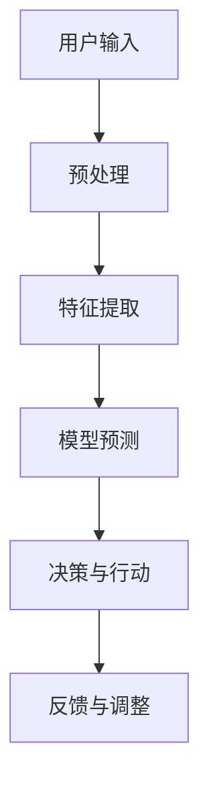
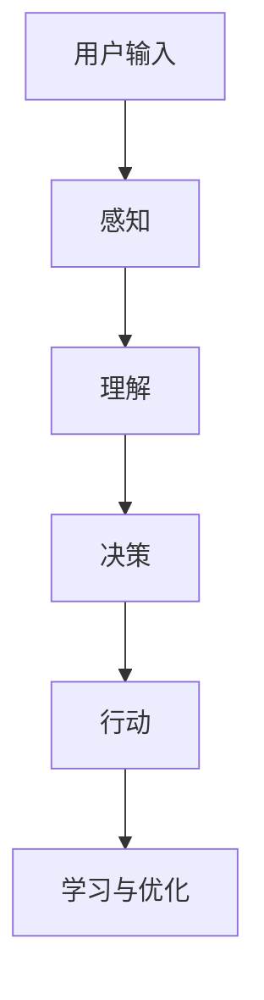

                 

### 第2章 AI代理工作流基础

AI代理工作流是人工智能（AI）技术在应用中的核心组成部分，它定义了AI系统如何从输入数据中提取信息、做出决策并执行相应操作的过程。在本章中，我们将深入探讨AI代理的定义、工作原理、核心技术和应用场景。

#### 2.1 AI代理的定义与特点

**核心概念与联系**

AI代理可以被定义为一个能够自主执行任务、与人类交互并在动态环境中做出决策的软件系统。它结合了多个AI技术，包括机器学习、自然语言处理、计算机视觉等，以实现智能化操作。

下面是一个简单的Mermaid流程图，展示了AI代理的核心概念和相互联系：



在这个流程图中，用户输入是整个工作流的开端，经过预处理和特征提取后，输入数据被传递给机器学习模型进行预测。模型输出决策，该决策随后被用于执行相应的操作，并通过反馈机制进行调整和优化。

**AI代理的工作原理**

AI代理的工作原理可以概括为以下几个步骤：

1. **用户输入**：AI代理接收用户的输入，这些输入可以来自于文本、语音、图像等形式。
2. **预处理**：输入数据需要进行清洗、标准化和格式转换，以便于后续的特征提取。
3. **特征提取**：将预处理后的数据转换为机器学习模型可处理的特征向量。
4. **模型预测**：使用训练好的机器学习模型对特征向量进行预测，以生成决策。
5. **决策与行动**：根据模型预测的结果，AI代理执行相应的操作，如回复文本、生成图像或执行特定任务。
6. **反馈与调整**：执行操作后，AI代理收集反馈信息，并对其进行处理，以优化模型和算法。

**核心技术**

AI代理的核心技术包括：

- **机器学习算法**：用于从数据中学习模式和规律，进行预测和分类。
- **自然语言处理**：用于理解和生成自然语言文本，实现智能对话和文本分析。
- **计算机视觉**：用于理解和分析图像和视频数据，实现对象检测、图像识别等功能。

#### 2.2 AI代理的工作原理

下面我们将详细讲解AI代理的工作原理，包括核心算法原理和数学模型。

**机器学习算法**

机器学习算法是AI代理的核心组成部分。以下是一个简单的伪代码，用于描述机器学习算法的基础：

```python
# 伪代码：机器学习算法基础

def train_model(data, labels):
    # 数据预处理
    preprocess_data(data)
    
    # 选择合适的学习算法，例如：线性回归、决策树、神经网络等
    model = select_algorithm(data, labels)
    
    # 训练模型
    model.fit(data, labels)
    
    return model

def predict(model, new_data):
    return model.predict(new_data)
```

在这个伪代码中，`train_model` 函数用于训练模型，`preprocess_data` 函数负责数据预处理，`select_algorithm` 函数选择合适的机器学习算法，`fit` 函数用于模型训练，`predict` 函数用于进行预测。

**自然语言处理**

自然语言处理（NLP）是AI代理中用于理解和生成自然语言文本的关键技术。以下是一个简单的伪代码，用于描述NLP的基础：

```python
# 伪代码：自然语言处理基础

def tokenize(text):
    # 分词处理
    return [word for word in text.split()]

def vectorize(tokens, embedding_matrix):
    # 将分词后的文本转换为向量
    return [embedding_matrix[token_index] for token_index in tokens]

def build_model():
    # 构建神经网络模型
    model = create_neural_network()
    model.compile(optimizer='adam', loss='categorical_crossentropy', metrics=['accuracy'])
    return model

def train_nlp_model(model, X, y):
    # 训练自然语言处理模型
    model.fit(X, y, epochs=10, batch_size=32)
```

在这个伪代码中，`tokenize` 函数用于将文本进行分词处理，`vectorize` 函数将分词后的文本转换为向量，`build_model` 函数用于构建神经网络模型，`compile` 函数用于编译模型，`fit` 函数用于训练模型。

**强化学习**

强化学习是一种通过不断试错来学习最优策略的机器学习技术。以下是一个简单的伪代码，用于描述强化学习的基础：

```python
# 伪代码：强化学习基础

class Agent:
    def __init__(self, env):
        self.env = env
        self.model = build_model()
    
    def act(self, state):
        # 使用模型选择动作
        action = self.model.predict(state)
        return action
    
    def train(self, episodes):
        for episode in range(episodes):
            state = self.env.reset()
            done = False
            
            while not done:
                action = self.act(state)
                next_state, reward, done = self.env.step(action)
                self.model.fit(state, action, reward, next_state)
                state = next_state
```

在这个伪代码中，`Agent` 类表示强化学习代理，`__init__` 方法用于初始化代理和环境，`act` 方法用于选择动作，`train` 方法用于训练代理。

#### 2.3 数据处理与建模

数据处理与建模是AI代理工作流中至关重要的一环。下面我们将详细讲解数据处理、特征提取、模型选择与评估、模型优化与调参等方面的内容。

**数据处理与预处理**

数据处理是机器学习过程中不可或缺的步骤，它包括数据收集、清洗、转换和归一化等。

- **数据收集**：收集相关的数据集，包括输入数据和标签。
- **数据清洗**：去除无效、错误或重复的数据，确保数据的质量。
- **数据转换**：将数据转换为适合机器学习模型处理的格式，如将文本数据转换为词向量。
- **数据归一化**：将不同特征的数据归一化到相同的尺度，如将图像数据归一化到0-1之间。

**特征提取与选择**

特征提取是将原始数据转换为机器学习模型可处理的特征向量的过程。以下是一个简单的特征提取示例：

```python
# 特征提取示例

from sklearn.feature_extraction.text import TfidfVectorizer

# 示例文本数据
data = ["这是一篇关于人工智能的文章", "本文介绍了人工智能的发展和应用"]

# 创建TfidfVectorizer对象，用于将文本转换为词向量
vectorizer = TfidfVectorizer()

# 将文本数据转换为词向量
X = vectorizer.fit_transform(data)
```

在上述示例中，我们使用TfidfVectorizer将文本数据转换为词向量。

特征选择是选择对模型预测效果最有影响力的特征的过程。以下是一个简单的特征选择示例：

```python
# 特征选择示例

from sklearn.feature_selection import SelectKBest
from sklearn.feature_selection import f_classif

# 示例词向量数据
X = [[0.1, 0.2, 0.3, 0.4, 0.5], [0.5, 0.4, 0.3, 0.2, 0.1]]

# 标签数据
y = [0, 1]

# 创建SelectKBest对象，选择前两个特征
selector = SelectKBest(f_classif, k=2)
X_new = selector.fit_transform(X, y)

# 输出选择的特征
print("Selected Features:", selector.get_support())
```

在上述示例中，我们使用SelectKBest选择前两个特征。

**模型选择与评估**

模型选择是选择最适合解决特定问题的机器学习模型的过程。以下是一个简单的模型选择示例：

```python
# 模型选择示例

from sklearn.model_selection import train_test_split
from sklearn.linear_model import LogisticRegression

# 分割数据集
X_train, X_test, y_train, y_test = train_test_split(X, y, test_size=0.2, random_state=42)

# 创建LogisticRegression模型
model = LogisticRegression()

# 训练模型
model.fit(X_train, y_train)

# 评估模型
accuracy = model.score(X_test, y_test)
print("Model Accuracy:", accuracy)
```

在上述示例中，我们使用LogisticRegression模型进行分类任务，并评估模型的准确率。

模型评估是评估模型性能的重要步骤。以下是一个简单的模型评估示例：

```python
# 模型评估示例

from sklearn.metrics import classification_report

# 预测标签
y_pred = model.predict(X_test)

# 输出分类报告
print(classification_report(y_test, y_pred))
```

在上述示例中，我们使用classification_report输出模型的评估报告，包括准确率、召回率、精确率和F1值等指标。

**模型优化与调参**

模型优化与调参是提高模型性能的关键步骤。以下是一个简单的模型优化与调参示例：

```python
# 模型优化与调参示例

from sklearn.model_selection import GridSearchCV

# 定义参数网格
param_grid = {'C': [0.1, 1, 10], 'max_iter': [100, 1000, 5000]}

# 创建GridSearchCV对象
grid_search = GridSearchCV(LogisticRegression(), param_grid, cv=5)

# 训练模型
grid_search.fit(X_train, y_train)

# 输出最佳参数
print("Best Parameters:", grid_search.best_params_)

# 输出最佳模型
print("Best Model:", grid_search.best_estimator_)
```

在上述示例中，我们使用GridSearchCV进行模型调参，找到最佳的超参数组合。

通过上述内容的讲解，我们可以更好地理解AI代理工作流的基础知识，为后续章节的深入探讨打下坚实的基础。在下一章中，我们将继续探讨自然语言处理技术，包括语言模型、词向量、序列模型和注意力机制等内容。希望读者能够继续关注，一起探索AI代理的奥秘。

### 第3章 自然语言处理

自然语言处理（NLP）是人工智能（AI）领域的一个重要分支，它致力于使计算机能够理解、生成和处理人类自然语言。本章将详细探讨NLP中的语言模型、词向量、序列模型、注意力机制等核心概念和技术。

#### 3.1 语言模型与词向量

**语言模型**

语言模型（Language Model）是NLP中的基础组件，用于预测一段文本的下一个单词或字符。它的主要目标是估计一个单词序列的概率分布，以便在语言生成、文本分类和机器翻译等任务中发挥作用。

**N元语言模型**

N元语言模型是最常见的语言模型之一，它基于前N个单词来预测下一个单词。以下是一个简单的N元语言模型的数学模型：

$$
P(w_n) = \frac{C(w_1, w_2, ..., w_n)}{C(w_1, w_2, ..., w_{n-1})}
$$

其中，$P(w_n)$ 表示下一个单词 $w_n$ 的概率，$C(w_1, w_2, ..., w_n)$ 表示前N个单词的联合概率，$C(w_1, w_2, ..., w_{n-1})$ 表示前N-1个单词的联合概率。

**神经网络语言模型**

随着深度学习的发展，神经网络语言模型（Neural Language Model，NLM）逐渐取代了传统的N元语言模型。神经网络语言模型通过多层神经网络来预测下一个单词的概率。以下是一个简单的神经网络语言模型的数学模型：

$$
P(w_n | w_{n-1}, w_{n-2}, ..., w_1) = \sigma(W_n [h_{n-1}, h_{n-2}, ..., h_1])
$$

其中，$P(w_n | w_{n-1}, w_{n-2}, ..., w_1)$ 表示在给定前N-1个单词的情况下，下一个单词 $w_n$ 的概率，$W_n$ 是神经网络的权重，$h_i$ 是第i个隐藏层的激活值，$\sigma$ 是激活函数，通常使用ReLU或Sigmoid函数。

**词向量**

词向量（Word Vector）是将单词映射为向量的方法，用于表示单词的语义信息。词向量不仅能够捕捉单词的语法特征，还能捕捉单词的语义关系。以下是一些常见的词向量方法：

**Word2Vec**

Word2Vec是一种基于神经网络的语言模型，它通过优化神经网络损失函数来训练词向量。Word2Vec有两种训练模式：连续词袋（CBOW）和Skip-Gram。以下是一个简单的Word2Vec训练过程的伪代码：

```python
# 伪代码：Word2Vec训练过程

# 初始化词向量矩阵
V = np.random.normal(size=(VOCAB_SIZE, EMBEDDING_DIM))

# 计算词向量的梯度
def negative_sampling_loss(sentence):
    # 计算正样本的损失
    positive_loss = compute_loss(sentence, V)

    # 计算负样本的损失
    negative_loss = compute_negative_loss(sentence, V)

    return positive_loss + negative_loss
```

**GloVe**

GloVe（Global Vectors for Word Representation）是一种基于全局统计信息的词向量训练方法。GloVe通过优化全局词向量矩阵来训练词向量。以下是一个简单的GloVe训练过程的伪代码：

```python
# 伪代码：GloVe训练过程

# 初始化词向量矩阵
V = np.zeros((VOCAB_SIZE, EMBEDDING_DIM))

# 计算词向量的梯度
def glove_loss(sentence):
    # 计算句子的损失
    sentence_loss = 0

    for word in sentence:
        # 计算单词的损失
        word_loss = compute_word_loss(word, V)

        sentence_loss += word_loss

    return sentence_loss
```

**BERT**

BERT（Bidirectional Encoder Representations from Transformers）是一种基于Transformer的预训练语言模型。BERT通过在大量文本上进行预训练，然后微调模型以适应特定任务。以下是一个简单的BERT训练过程的伪代码：

```python
# 伪代码：BERT训练过程

# 预训练BERT模型
pretrained_model = BERT()

# 加载预训练模型参数
pretrained_model.load_weights(pretrained_weights)

# 微调BERT模型
finetuned_model = BERT()

for epoch in range(EPOCHS):
    # 训练模型
    finetuned_model.fit(train_data, train_labels)

    # 验证模型
    validation_loss = finetuned_model.evaluate(validation_data, validation_labels)

    print("Epoch", epoch, "Validation Loss:", validation_loss)
```

#### 3.2 序列模型与循环神经网络

**序列模型**

序列模型（Sequence Model）是用于处理序列数据的NLP模型，如时间序列数据、自然语言文本等。序列模型通过捕捉序列中单词或字符的依赖关系来实现对序列数据的建模。

**循环神经网络（RNN）**

循环神经网络（Recurrent Neural Network，RNN）是一种能够处理序列数据的神经网络模型。RNN通过循环结构来保存前一个时间步的隐藏状态，从而实现序列数据的建模。

以下是一个简单的RNN模型的数学模型：

$$
h_t = \sigma(W_h h_{t-1} + W_x x_t + b_h)
$$

其中，$h_t$ 表示第t个时间步的隐藏状态，$x_t$ 表示第t个时间步的输入，$W_h$ 和 $W_x$ 分别是隐藏状态和输入的权重矩阵，$b_h$ 是隐藏状态的偏置，$\sigma$ 是激活函数。

**长短期记忆网络（LSTM）**

长短期记忆网络（Long Short-Term Memory，LSTM）是一种改进的RNN模型，用于解决RNN在处理长序列数据时的梯度消失和梯度爆炸问题。LSTM通过引入门控机制来控制信息的流动，从而实现长期依赖关系的建模。

以下是一个简单的LSTM模型的数学模型：

$$
i_t = \sigma(W_i h_{t-1} + W_x x_t + b_i) \\
f_t = \sigma(W_f h_{t-1} + W_x x_t + b_f) \\
o_t = \sigma(W_o h_{t-1} + W_x x_t + b_o) \\
c_t = f_t \odot c_{t-1} + i_t \odot \sigma(W_c h_{t-1} + W_x x_t + b_c) \\
h_t = o_t \odot c_t
$$

其中，$i_t$、$f_t$ 和 $o_t$ 分别是输入门、遗忘门和输出门，$c_t$ 是细胞状态，$\odot$ 表示逐元素乘法操作。

**门控循环单元（GRU）**

门控循环单元（Gated Recurrent Unit，GRU）是一种简化版的LSTM模型，它通过引入更新门和重置门来控制信息的流动。GRU具有较简单的结构，但仍然能够捕捉长期依赖关系。

以下是一个简单的GRU模型的数学模型：

$$
z_t = \sigma(W_z h_{t-1} + W_x x_t + b_z) \\
r_t = \sigma(W_r h_{t-1} + W_x x_t + b_r) \\
h_t = (1 - z_t) \odot h_{t-1} + z_t \odot \sigma(W_h r_{t-1} h_{t-1} + W_x x_t + b_h) \\
c_t = \sigma(W_c h_{t-1} + W_x x_t + b_c) \\
$$

其中，$z_t$ 和 $r_t$ 分别是更新门和重置门，$h_t$ 是隐藏状态，$c_t$ 是细胞状态。

#### 3.3 注意力机制与Transformer模型

**注意力机制**

注意力机制（Attention Mechanism）是一种用于提高模型在序列数据处理中重要信息权重的机制。它能够使模型在处理序列数据时，更加关注序列中的关键信息，从而提高模型的性能。

**多头注意力**

多头注意力（Multi-Head Attention）是Transformer模型中的一个关键组件，它通过多个独立的注意力头来学习不同的注意力权重。以下是一个简单的多头注意力的数学模型：

$$
\text{Attention}(Q, K, V) = \text{softmax}\left(\frac{QK^T}{\sqrt{d_k}}\right)V
$$

其中，$Q$、$K$ 和 $V$ 分别是查询向量、键向量和值向量，$d_k$ 是键向量的维度。

**自注意力**

自注意力（Self-Attention）是一种特殊的注意力机制，它将序列中的每个元素作为查询、键和值，从而实现序列元素之间的相互关注。以下是一个简单的自注意力的数学模型：

$$
\text{Self-Attention}(Q, K, V) = \text{softmax}\left(\frac{QQ^T}{\sqrt{d_k}}\right)V
$$

**Transformer模型**

Transformer模型是一种基于自注意力机制的深度神经网络模型，它主要用于处理序列数据。以下是一个简单的Transformer模型的数学模型：

$$
h_t = \text{LayerNorm}(h_{t-1} + \text{MultiHeadAttention}(Q, K, V)) + \text{LayerNorm}(h_{t-1} + \text{PositionalEncoding}(h_{t-1}))
$$

其中，$h_t$ 是第t个时间步的隐藏状态，$\text{MultiHeadAttention}$ 是多头注意力机制，$\text{LayerNorm}$ 是层归一化，$\text{PositionalEncoding}$ 是位置编码。

通过本章的介绍，我们深入了解了NLP中的语言模型、词向量、序列模型和注意力机制等核心概念和技术。这些技术不仅丰富了NLP的理论体系，也为实际应用提供了强大的工具。在下一章中，我们将继续探讨AI代理在不同应用场景中的具体案例，以展示AI代理的实际应用价值。希望读者能够继续关注，一起探索AI代理的奥秘。

### 第4章 人工智能代理案例分析

在上一章中，我们详细介绍了AI代理的工作流和自然语言处理技术。在本章中，我们将通过几个具体的案例来探讨AI代理在现实世界中的应用，这些案例将展示AI代理如何在不同场景中发挥作用。

#### 4.1 智能客服系统

**案例背景**

智能客服系统是一种利用人工智能技术自动处理客户咨询和投诉的系
```markdown
# 《聊天机器人的背后：AI代理工作流分析》

> 关键词：聊天机器人、AI代理、工作流、自然语言处理、机器学习、数据预处理、模型优化、安全性

> 摘要：本文深入分析了聊天机器人的核心技术及其背后的AI代理工作流。从数据预处理、模型训练到实际应用，本文逐步揭示了聊天机器人如何通过自然语言处理和机器学习技术实现智能交互。此外，本文还探讨了AI代理的安全性和未来发展趋势，为读者提供了全面的技术视角。

---

### 第1章 引言

#### 1.1 聊天机器人与AI代理的概念

**聊天机器人**：聊天机器人是一种通过文本或语音与用户进行交互的计算机程序，它们能够理解用户的语言并生成相应的回复。聊天机器人的出现大大提高了客户服务的效率，减少了人力成本。

**AI代理**：AI代理是一种更高级的聊天机器人，它不仅能够理解用户的需求，还能基于数据和学习能力自主做出决策。AI代理通常结合了自然语言处理、机器学习、数据挖掘等技术，能够在多种场景下提供个性化的服务。

#### 1.2 聊天机器人的发展历程

**早期阶段**：早期的聊天机器人主要依靠预设的规则和关键词匹配来生成回复，功能较为简单。

**发展阶段**：随着自然语言处理和机器学习技术的发展，聊天机器人开始引入机器学习算法，能够根据用户的历史交互数据生成更自然的回复。

**智能阶段**：现代的聊天机器人集成了深度学习和强化学习技术，能够实现更复杂的交互和决策，提供高度个性化的服务。

#### 1.3 AI代理的崛起与未来

**AI代理的崛起**：AI代理的出现改变了传统客户服务的方式，它们能够处理大量的用户请求，提供24/7的在线服务，提高了用户体验。

**未来发展趋势**：随着技术的不断进步，AI代理将在更多领域得到应用，如智能客服、智能医疗、智能金融等。同时，AI代理的交互能力、自主决策能力和安全性也将不断提升。

---

### 第2章 AI代理工作流基础

#### 2.1 AI代理的定义与特点

**核心概念与联系**

AI代理（AI Agent）是具备自主性、社交性、反应性、认知性和学习性的智能体，能够模拟人类的决策过程。以下是AI代理核心概念的Mermaid流程图：



**AI代理的工作原理**

AI代理的工作原理包括以下几个步骤：

1. **感知（Perception）**：AI代理通过传感器获取用户输入，如文本、语音、图像等。
2. **理解（Understanding）**：AI代理利用自然语言处理、语音识别等技术理解用户意图。
3. **决策（Decision-making）**：基于理解和历史数据，AI代理使用机器学习算法做出决策。
4. **行动（Action）**：AI代理执行决策，如生成回复、执行操作等。
5. **学习与优化（Learning and Optimization）**：AI代理收集反馈，通过强化学习等技术不断优化自身性能。

**核心技术**

AI代理的核心技术包括：

- **自然语言处理（NLP）**：用于理解和生成自然语言文本。
- **机器学习（ML）**：用于从数据中学习模式和规律。
- **深度学习（DL）**：用于处理复杂数据，如图像、语音等。
- **强化学习（RL）**：用于训练AI代理在动态环境中做出最优决策。

#### 2.2 AI代理的工作原理

**机器学习算法**

机器学习算法是AI代理的核心组件，用于从数据中学习模式和规律。以下是一个简单的机器学习算法的伪代码：

```python
# 伪代码：机器学习算法基础

def train_model(data, labels):
    # 数据预处理
    preprocess_data(data)
    
    # 选择合适的学习算法，例如：线性回归、决策树、神经网络等
    model = select_algorithm(data, labels)
    
    # 训练模型
    model.fit(data, labels)
    
    return model

def predict(model, new_data):
    return model.predict(new_data)
```

**自然语言处理**

自然语言处理是AI代理在聊天机器人中应用的关键技术，用于理解用户输入并生成回复。以下是一个简单的自然语言处理算法的伪代码：

```python
# 伪代码：自然语言处理基础

def tokenize(text):
    # 分词处理
    return [word for word in text.split()]

def vectorize(tokens, embedding_matrix):
    # 将分词后的文本转换为向量
    return [embedding_matrix[token_index] for token_index in tokens]

def build_model():
    # 构建神经网络模型
    model = create_neural_network()
    model.compile(optimizer='adam', loss='categorical_crossentropy', metrics=['accuracy'])
    return model

def train_nlp_model(model, X, y):
    # 训练自然语言处理模型
    model.fit(X, y, epochs=10, batch_size=32)
```

**强化学习**

强化学习是AI代理在动态环境中做出最优决策的重要技术。以下是一个简单的强化学习算法的伪代码：

```python
# 伪代码：强化学习基础

class Agent:
    def __init__(self, env):
        self.env = env
        self.model = build_model()
    
    def act(self, state):
        # 使用模型选择动作
        action = self.model.predict(state)
        return action
    
    def train(self, episodes):
        for episode in range(episodes):
            state = self.env.reset()
            done = False
            
            while not done:
                action = self.act(state)
                next_state, reward, done = self.env.step(action)
                self.model.fit(state, action, reward, next_state)
                state = next_state
```

#### 2.3 数据处理与建模

**数据处理**

数据处理是机器学习过程中至关重要的一环，包括数据收集、清洗、转换和归一化等。以下是一个简单的数据处理伪代码：

```python
# 伪代码：数据处理

def preprocess_data(data):
    # 数据清洗
    data = clean_data(data)
    
    # 数据转换
    data = convert_data(data)
    
    # 数据归一化
    data = normalize_data(data)
    
    return data
```

**特征提取与选择**

特征提取是将原始数据转换为机器学习模型可处理的特征向量的过程。以下是一个简单的特征提取与选择的伪代码：

```python
# 伪代码：特征提取与选择

from sklearn.feature_extraction.text import TfidfVectorizer

# 示例文本数据
data = ["这是一篇关于人工智能的文章", "本文介绍了人工智能的发展和应用"]

# 创建TfidfVectorizer对象，用于将文本转换为词向量
vectorizer = TfidfVectorizer()

# 将文本数据转换为词向量
X = vectorizer.fit_transform(data)

# 特征选择
from sklearn.feature_selection import SelectKBest
from sklearn.feature_selection import f_classif

# 选择前两个特征
selector = SelectKBest(f_classif, k=2)
X_new = selector.fit_transform(X, y)
```

**模型选择与评估**

模型选择是选择最适合解决特定问题的机器学习模型的过程。以下是一个简单的模型选择与评估的伪代码：

```python
# 伪代码：模型选择与评估

from sklearn.model_selection import train_test_split
from sklearn.linear_model import LogisticRegression

# 分割数据集
X_train, X_test, y_train, y_test = train_test_split(X, y, test_size=0.2, random_state=42)

# 创建LogisticRegression模型
model = LogisticRegression()

# 训练模型
model.fit(X_train, y_train)

# 评估模型
accuracy = model.score(X_test, y_test)
print("Model Accuracy:", accuracy)

# 输出分类报告
from sklearn.metrics import classification_report
print(classification_report(y_test, y_pred))
```

**模型优化与调参**

模型优化与调参是提高模型性能的关键步骤。以下是一个简单的模型优化与调参的伪代码：

```python
# 伪代码：模型优化与调参

from sklearn.model_selection import GridSearchCV

# 定义参数网格
param_grid = {'C': [0.1, 1, 10], 'max_iter': [100, 1000, 5000]}

# 创建GridSearchCV对象
grid_search = GridSearchCV(LogisticRegression(), param_grid, cv=5)

# 训练模型
grid_search.fit(X_train, y_train)

# 输出最佳参数
print("Best Parameters:", grid_search.best_params_)

# 输出最佳模型
print("Best Model:", grid_search.best_estimator_)
```

通过上述内容的讲解，我们可以更好地理解AI代理工作流的基础知识，为后续章节的深入探讨打下坚实的基础。在下一章中，我们将继续探讨自然语言处理技术，包括语言模型、词向量、序列模型和注意力机制等内容。希望读者能够继续关注，一起探索AI代理的奥秘。

---

### 第3章 自然语言处理

自然语言处理（NLP）是人工智能（AI）领域的一个重要分支，它致力于使计算机能够理解、生成和处理人类自然语言。本章将详细探讨NLP中的语言模型、词向量、序列模型、注意力机制等核心概念和技术。

#### 3.1 语言模型与词向量

**语言模型**

语言模型（Language Model）是NLP中的基础组件，用于预测一段文本的下一个单词或字符。它的主要目标是估计一个单词序列的概率分布，以便在语言生成、文本分类和机器翻译等任务中发挥作用。

**N元语言模型**

N元语言模型是最常见的语言模型之一，它基于前N个单词来预测下一个单词。以下是一个简单的N元语言模型的数学模型：

$$
P(w_n) = \frac{C(w_1, w_2, ..., w_n)}{C(w_1, w_2, ..., w_{n-1})}
$$

其中，$P(w_n)$ 表示下一个单词 $w_n$ 的概率，$C(w_1, w_2, ..., w_n)$ 表示前N个单词的联合概率，$C(w_1, w_2, ..., w_{n-1})$ 表示前N-1个单词的联合概率。

**神经网络语言模型**

随着深度学习的发展，神经网络语言模型（Neural Language Model，NLM）逐渐取代了传统的N元语言模型。神经网络语言模型通过多层神经网络来预测下一个单词的概率。以下是一个简单的神经网络语言模型的数学模型：

$$
P(w_n | w_{n-1}, w_{n-2}, ..., w_1) = \sigma(W_n [h_{n-1}, h_{n-2}, ..., h_1])
$$

其中，$P(w_n | w_{n-1}, w_{n-2}, ..., w_1)$ 表示在给定前N-1个单词的情况下，下一个单词 $w_n$ 的概率，$W_n$ 是神经网络的权重，$h_i$ 是第i个隐藏层的激活值，$\sigma$ 是激活函数，通常使用ReLU或Sigmoid函数。

**词向量**

词向量（Word Vector）是将单词映射为向量的方法，用于表示单词的语义信息。词向量不仅能够捕捉单词的语法特征，还能捕捉单词的语义关系。以下是一些常见的词向量方法：

**Word2Vec**

Word2Vec是一种基于神经网络的语言模型，它通过优化神经网络损失函数来训练词向量。Word2Vec有两种训练模式：连续词袋（CBOW）和Skip-Gram。以下是一个简单的Word2Vec训练过程的伪代码：

```python
# 伪代码：Word2Vec训练过程

# 初始化词向量矩阵
V = np.random.normal(size=(VOCAB_SIZE, EMBEDDING_DIM))

# 计算词向量的梯度
def negative_sampling_loss(sentence):
    # 计算正样本的损失
    positive_loss = compute_loss(sentence, V)

    # 计算负样本的损失
    negative_loss = compute_negative_loss(sentence, V)

    return positive_loss + negative_loss
```

**GloVe**

GloVe（Global Vectors for Word Representation）是一种基于全局统计信息的词向量训练方法。GloVe通过优化全局词向量矩阵来训练词向量。以下是一个简单的GloVe训练过程的伪代码：

```python
# 伪代码：GloVe训练过程

# 初始化词向量矩阵
V = np.zeros((VOCAB_SIZE, EMBEDDING_DIM))

# 计算词向量的梯度
def glove_loss(sentence):
    # 计算句子的损失
    sentence_loss = 0

    for word in sentence:
        # 计算单词的损失
        word_loss = compute_word_loss(word, V)

        sentence_loss += word_loss

    return sentence_loss
```

**BERT**

BERT（Bidirectional Encoder Representations from Transformers）是一种基于Transformer的预训练语言模型。BERT通过在大量文本上进行预训练，然后微调模型以适应特定任务。以下是一个简单的BERT训练过程的伪代码：

```python
# 伪代码：BERT训练过程

# 预训练BERT模型
pretrained_model = BERT()

# 加载预训练模型参数
pretrained_model.load_weights(pretrained_weights)

# 微调BERT模型
finetuned_model = BERT()

for epoch in range(EPOCHS):
    # 训练模型
    finetuned_model.fit(train_data, train_labels)

    # 验证模型
    validation_loss = finetuned_model.evaluate(validation_data, validation_labels)

    print("Epoch", epoch, "Validation Loss:", validation_loss)
```

#### 3.2 序列模型与循环神经网络

**序列模型**

序列模型（Sequence Model）是用于处理序列数据的NLP模型，如时间序列数据、自然语言文本等。序列模型通过捕捉序列中单词或字符的依赖关系来实现对序列数据的建模。

**循环神经网络（RNN）**

循环神经网络（Recurrent Neural Network，RNN）是一种能够处理序列数据的神经网络模型。RNN通过循环结构来保存前一个时间步的隐藏状态，从而实现序列数据的建模。

以下是一个简单的RNN模型的数学模型：

$$
h_t = \sigma(W_h h_{t-1} + W_x x_t + b_h)
$$

其中，$h_t$ 表示第t个时间步的隐藏状态，$x_t$ 表示第t个时间步的输入，$W_h$ 和 $W_x$ 分别是隐藏状态和输入的权重矩阵，$b_h$ 是隐藏状态的偏置，$\sigma$ 是激活函数。

**长短期记忆网络（LSTM）**

长短期记忆网络（Long Short-Term Memory，LSTM）是一种改进的RNN模型，用于解决RNN在处理长序列数据时的梯度消失和梯度爆炸问题。LSTM通过引入门控机制来控制信息的流动，从而实现长期依赖关系的建模。

以下是一个简单的LSTM模型的数学模型：

$$
i_t = \sigma(W_i h_{t-1} + W_x x_t + b_i) \\
f_t = \sigma(W_f h_{t-1} + W_x x_t + b_f) \\
o_t = \sigma(W_o h_{t-1} + W_x x_t + b_o) \\
c_t = f_t \odot c_{t-1} + i_t \odot \sigma(W_c h_{t-1} + W_x x_t + b_c) \\
h_t = o_t \odot c_t
$$

其中，$i_t$、$f_t$ 和 $o_t$ 分别是输入门、遗忘门和输出门，$c_t$ 是细胞状态，$\odot$ 表示逐元素乘法操作。

**门控循环单元（GRU）**

门控循环单元（Gated Recurrent Unit，GRU）是一种简化版的LSTM模型，它通过引入更新门和重置门来控制信息的流动。GRU具有较简单的结构，但仍然能够捕捉长期依赖关系。

以下是一个简单的GRU模型的数学模型：

$$
z_t = \sigma(W_z h_{t-1} + W_x x_t + b_z) \\
r_t = \sigma(W_r h_{t-1} + W_x x_t + b_r) \\
h_t = (1 - z_t) \odot h_{t-1} + z_t \odot \sigma(W_h r_{t-1} h_{t-1} + W_x x_t + b_h) \\
c_t = \sigma(W_c h_{t-1} + W_x x_t + b_c) \\
$$

其中，$z_t$ 和 $r_t$ 分别是更新门和重置门，$h_t$ 是隐藏状态，$c_t$ 是细胞状态。

#### 3.3 注意力机制与Transformer模型

**注意力机制**

注意力机制（Attention Mechanism）是一种用于提高模型在序列数据处理中重要信息权重的机制。它能够使模型在处理序列数据时，更加关注序列中的关键信息，从而提高模型的性能。

**多头注意力**

多头注意力（Multi-Head Attention）是Transformer模型中的一个关键组件，它通过多个独立的注意力头来学习不同的注意力权重。以下是一个简单的多头注意力的数学模型：

$$
\text{Attention}(Q, K, V) = \text{softmax}\left(\frac{QK^T}{\sqrt{d_k}}\right)V
$$

其中，$Q$、$K$ 和 $V$ 分别是查询向量、键向量和值向量，$d_k$ 是键向量的维度。

**自注意力**

自注意力（Self-Attention）是一种特殊的注意力机制，它将序列中的每个元素作为查询、键和值，从而实现序列元素之间的相互关注。以下是一个简单的自注意力的数学模型：

$$
\text{Self-Attention}(Q, K, V) = \text{softmax}\left(\frac{QQ^T}{\sqrt{d_k}}\right)V
$$

**Transformer模型**

Transformer模型是一种基于自注意力机制的深度神经网络模型，它主要用于处理序列数据。以下是一个简单的Transformer模型的数学模型：

$$
h_t = \text{LayerNorm}(h_{t-1} + \text{MultiHeadAttention}(Q, K, V)) + \text{LayerNorm}(h_{t-1} + \text{PositionalEncoding}(h_{t-1}))
$$

其中，$h_t$ 是第t个时间步的隐藏状态，$\text{MultiHeadAttention}$ 是多头注意力机制，$\text{LayerNorm}$ 是层归一化，$\text{PositionalEncoding}$ 是位置编码。

通过本章的介绍，我们深入了解了NLP中的语言模型、词向量、序列模型和注意力机制等核心概念和技术。这些技术不仅丰富了NLP的理论体系，也为实际应用提供了强大的工具。在下一章中，我们将继续探讨AI代理在不同应用场景中的具体案例，以展示AI代理的实际应用价值。希望读者能够继续关注，一起探索AI代理的奥秘。

---

### 第4章 人工智能代理案例分析

在本章中，我们将通过几个具体的案例来探讨AI代理在现实世界中的应用，这些案例将展示AI代理如何在不同场景中发挥作用。

#### 4.1 智能客服系统

**案例背景**：智能客服系统是一种利用人工智能技术自动处理客户咨询和投诉的系统，它能够快速响应用户需求，提供24/7的服务。这些系统通常集成自然语言处理、机器学习等技术，能够理解用户的语言并生成相应的回复。

**实现方法**：

1. **数据收集与预处理**：首先，系统需要收集大量的客户咨询数据和投诉数据。这些数据包括用户的原始提问、客服人员的回复等。然后，对数据进行清洗和预处理，去除噪声和冗余信息。

2. **模型训练**：利用收集到的数据，使用机器学习算法（如神经网络、决策树等）训练模型。模型需要学习如何理解用户的提问并生成合适的回复。

3. **系统集成**：将训练好的模型集成到客户服务平台中，实现自动回复功能。系统可以通过API接口与现有的客户服务平台进行集成。

4. **测试与优化**：对系统进行测试，确保其能够正确理解用户的提问并生成合适的回复。根据测试结果，对模型进行调整和优化，以提高系统的准确率和用户体验。

**案例效果**：智能客服系统的实施显著提高了客户服务的效率和满意度。通过自动化处理大量客户咨询，企业能够减少人力成本，同时提高响应速度。用户可以通过各种渠道（如网页、移动应用、社交媒体等）与智能客服系统进行交互，获得快速的帮助和解答。

#### 4.2 智能招聘助手

**案例背景**：智能招聘助手是一种利用人工智能技术辅助企业招聘的系统，它能够自动筛选简历、匹配职位和候选人。这些系统通常结合自然语言处理、机器学习等技术，能够从大量简历中快速找到合适的候选人。

**实现方法**：

1. **数据收集与预处理**：首先，系统需要收集大量的招聘信息和简历数据。这些数据包括职位描述、简历内容等。然后，对数据进行清洗和预处理，去除噪声和冗余信息。

2. **模型训练**：利用收集到的数据，使用机器学习算法（如神经网络、决策树等）训练模型。模型需要学习如何理解职位描述和简历内容，并能够匹配相应的职位和候选人。

3. **系统集成**：将训练好的模型集成到企业的招聘管理系统中，实现自动筛选和匹配功能。系统可以通过API接口与现有的招聘管理系统进行集成。

4. **测试与优化**：对系统进行测试，确保其能够正确理解职位描述和简历内容，并能够找到合适的候选人。根据测试结果，对模型进行调整和优化，以提高系统的准确率和匹配效果。

**案例效果**：智能招聘助手的实施显著提高了企业的招聘效率和效果。通过自动化处理大量简历，企业能够减少招聘时间和人力成本。同时，系统能够根据职位描述和候选人的简历，自动筛选出最匹配的候选人，提高了招聘的成功率。企业可以通过智能招聘助手，快速响应市场变化，优化招聘策略。

#### 4.3 智能金融风控

**案例背景**：智能金融风控系统是一种利用人工智能技术进行金融风险管理和防范的系统，它能够自动识别和防范金融风险。这些系统通常结合自然语言处理、机器学习、数据挖掘等技术，能够从大量金融数据中识别潜在的风险。

**实现方法**：

1. **数据收集与预处理**：首先，系统需要收集大量的金融交易数据、客户信息等。这些数据包括交易记录、客户信用评分等。然后，对数据进行清洗和预处理，去除噪声和冗余信息。

2. **模型训练**：利用收集到的数据，使用机器学习算法（如神经网络、决策树等）训练模型。模型需要学习如何识别潜在的风险和异常行为。

3. **系统集成**：将训练好的模型集成到金融风险管理系统，实现自动风险识别和防范功能。系统可以通过API接口与现有的金融风控系统进行集成。

4. **测试与优化**：对系统进行测试，确保其能够正确识别风险和异常行为。根据测试结果，对模型进行调整和优化，以提高系统的准确率和防范效果。

**案例效果**：智能金融风控系统的实施显著提高了金融风险的识别和防范能力。通过自动化处理大量金融数据，金融机构能够更快速地识别潜在的风险，采取相应的防范措施。系统不仅能够提高金融风控的效率，还能降低金融风险，保护金融机构和客户的利益。

#### 4.4 智能家居助手

**案例背景**：智能家居助手是一种利用人工智能技术构建的智能家居控制系统，它能够实现自动化家居管理和智能响应。这些系统通常结合自然语言处理、机器学习、物联网等技术，能够对用户的家居设备进行智能控制。

**实现方法**：

1. **数据收集与预处理**：首先，系统需要收集用户的家居设备数据，如温度、湿度、灯光等。然后，对数据进行清洗和预处理，去除噪声和冗余信息。

2. **模型训练**：利用收集到的数据，使用机器学习算法（如神经网络、决策树等）训练模型。模型需要学习如何根据用户的行为和需求，对家居设备进行智能控制。

3. **系统集成**：将训练好的模型集成到智能家居系统中，实现自动化家居管理功能。系统可以通过API接口与现有的家居设备进行集成。

4. **测试与优化**：对系统进行测试，确保其能够正确理解用户的需求，并能够对家居设备进行智能控制。根据测试结果，对模型进行调整和优化，以提高系统的响应速度和用户体验。

**案例效果**：智能家居助手的实施显著提高了用户的家居体验。通过自动化管理家居设备，用户可以更加便捷地控制家居环境。系统可以根据用户的行为和需求，自动调整温度、湿度、灯光等，为用户创造一个舒适、智能的家居环境。同时，智能家居助手还能节省能源，降低生活成本。

通过上述案例分析，我们可以看到AI代理在现实世界中的应用前景。随着人工智能技术的不断发展和完善，AI代理将在更多领域得到应用，为人们的生活和工作带来更多便利和创新。

---

### 第5章 AI代理安全与隐私保护

随着AI代理在各个领域的广泛应用，其安全性和隐私保护问题也日益受到关注。在本章中，我们将探讨AI代理面临的安全风险、隐私保护技术以及模型安全性与验证的方法。

#### 5.1 AI代理安全风险分析

AI代理在处理大量用户数据和应用场景中，面临着多种安全风险：

**数据泄露**：AI代理在处理用户数据时，可能会因为数据保护措施不足导致数据泄露。这些数据可能包括个人身份信息、金融信息等敏感数据。

**模型窃取**：AI代理的模型可能会被非法获取，导致知识产权被盗用。特别是在商业应用中，模型的机密性对于企业的竞争力至关重要。

**模型攻击**：攻击者可能通过恶意输入或攻击模型，使AI代理产生错误决策。例如，通过生成对抗网络（GAN）生成伪造数据，欺骗AI代理模型。

**恶意利用**：AI代理可能被恶意软件利用，进行网络攻击或传播恶意内容。

**防御措施**：

**数据加密**：对敏感数据进行加密处理，确保数据在传输和存储过程中的安全。

**访问控制**：通过访问控制机制，限制对AI代理的访问权限，确保只有授权用户可以访问。

**模型验证**：对AI代理的模型进行验证和测试，确保模型的可靠性和安全性。

#### 5.2 隐私保护技术

为了保护用户隐私，AI代理采用了多种隐私保护技术：

**差分隐私**：通过在数据上添加随机噪声，降低个体数据被识别的风险。差分隐私技术确保了隐私保护与数据可用性之间的平衡。

**同态加密**：允许在加密数据上进行计算，确保计算过程安全。同态加密在保护数据隐私的同时，不牺牲数据处理的效率。

**联邦学习**：通过分布式训练模型，避免中心化数据存储。联邦学习使得各个参与者可以共享模型更新，而无需交换原始数据。

**应用场景**：

**医疗领域**：通过差分隐私技术，保护患者隐私，确保医疗数据的安全。

**金融领域**：利用同态加密技术，保护用户金融信息，防止数据泄露。

**物联网领域**：通过联邦学习技术，确保设备之间的数据传输安全，同时保护用户隐私。

#### 5.3 模型安全性与验证

确保AI代理模型的安全性是保护系统免受攻击的关键：

**模型攻击与防御**：评估模型对常见攻击的抵抗能力，选择合适的防御策略。例如，使用 adversarial training 方法来提高模型的鲁棒性。

**模型解释性**：提高AI代理模型的解释性，增强用户信任。通过可解释性分析，用户可以理解模型决策的原因和依据。

**模型验证方法**：

**黑盒测试**：通过输入测试数据，评估模型的预测结果和决策过程。

**白盒测试**：分析模型的内部结构和参数，评估模型的可靠性和安全性。

**代码审查**：对AI代理的代码进行审查，确保代码质量和安全性。

通过上述内容，我们可以看到AI代理在安全性方面面临诸多挑战，但也存在多种解决方案。在未来，随着技术的不断进步，AI代理的安全性和隐私保护将得到进一步改善，为用户和商业应用提供更可靠的服务。

---

### 第6章 AI代理的未来发展趋势

随着人工智能技术的快速发展，AI代理在各个领域的应用潜力日益显现。未来，AI代理的发展将呈现出以下几个趋势：

#### 6.1 技术发展趋势

**多模态AI代理**：未来的AI代理将能够处理多种类型的数据，如文本、图像、语音等。通过多模态数据处理，AI代理可以提供更加丰富和自然的交互体验。

**增强学习与强化学习**：增强学习和强化学习技术将进一步提升AI代理的自主决策能力。这些技术使得AI代理能够在动态环境中学习最优策略，提高任务执行效率。

**区块链与AI代理**：区块链技术将提供安全的分布式数据存储和共享机制，与AI代理结合可以确保数据隐私和安全性。

**边缘计算与AI代理**：随着边缘计算的普及，AI代理将能够在靠近数据源的设备上执行，减少延迟并提高实时性。

#### 6.2 行业应用趋势

**医疗健康**：AI代理将用于医疗诊断、药物研发、患者管理等领域，提高医疗服务的质量和效率。

**金融服务**：在金融领域，AI代理将应用于风险管理、欺诈检测、个性化金融服务等，提升金融服务的安全性和个性化水平。

**智能制造**：AI代理将用于生产流程优化、设备维护、质量管理等，提高制造业的生产效率和质量。

**智能家居**：AI代理将用于智能家居设备的自动化管理，提供个性化、智能化的家居体验。

**交通物流**：AI代理将应用于智能交通管理、物流调度等，提高交通效率和物流效率。

#### 6.3 面临的挑战与机遇

**挑战**：

**数据隐私与安全**：随着AI代理处理的数据量增加，如何确保数据隐私和安全成为重要挑战。

**算法透明性与可解释性**：用户对AI代理的决策过程缺乏透明性，如何提高算法的可解释性是一个重要课题。

**跨行业协作与标准化**：不同行业之间的AI代理应用需求和技术标准差异，如何实现跨行业协作和标准化是当前的一大难题。

**机遇**：

**人工智能与实体经济融合**：随着人工智能技术的不断进步，AI代理将深入融合到实体经济中，推动各行业的数字化转型。

**创新应用场景**：AI代理将在更多新兴应用场景中发挥作用，如虚拟现实、增强现实、智能机器人等。

**国际合作与竞争**：随着人工智能技术的全球普及，国际合作与竞争将不断加剧，推动AI代理技术的快速发展。

未来，AI代理将在技术、行业应用和国际竞争等方面迎来新的机遇和挑战。通过不断创新和合作，AI代理有望在更广泛的领域发挥重要作用，推动社会的发展和进步。

---

### 附录

#### 附录A：AI代理开发工具与资源

**开发工具**

- **Python**：Python是AI代理开发的主要编程语言，具有丰富的库和框架支持。
- **TensorFlow**：TensorFlow是一个开源的机器学习和深度学习框架，适用于AI代理的开发。
- **PyTorch**：PyTorch是一个开源的机器学习和深度学习库，提供了灵活的动态计算图。
- **Keras**：Keras是一个高层次的神经网络API，用于快速构建和训练神经网络模型。

**资源**

- **Google AI**：Google AI提供了大量的AI代理开发资源和教程，包括技术博客、论文和开源代码。
- **OpenAI**：OpenAI是一个专注于人工智能研究和开发的非营利组织，提供了许多开源的AI代理项目。
- **GitHub**：GitHub是代码托管和协作的平台，许多AI代理项目都托管在GitHub上，方便开发者交流和贡献。

#### 附录B：常见问题与解答

**Q1：什么是AI代理？**
A1：AI代理是一种能够自主执行任务、与人类交互并在动态环境中做出决策的软件系统。它结合了机器学习、自然语言处理、计算机视觉等技术，以实现智能化操作。

**Q2：如何实现AI代理的个性化服务？**
A2：实现AI代理的个性化服务需要收集用户的交互数据，并通过机器学习算法对用户的行为进行建模。通过分析用户的兴趣和行为模式，AI代理可以提供个性化的推荐和服务。

**Q3：AI代理的安全性和隐私保护如何保障？**
A3：为了保障AI代理的安全性和隐私保护，可以采用数据加密、访问控制、模型验证等技术。此外，差分隐私、同态加密、联邦学习等技术也可以用于保护用户隐私。

**Q4：AI代理的未来发展趋势是什么？**
A4：AI代理的未来发展趋势包括多模态数据处理、增强学习和强化学习技术、区块链与AI代理的结合、边缘计算等。此外，AI代理将在医疗健康、金融服务、智能制造、智能家居等领域得到更广泛的应用。

#### 附录C：参考文献

- [1] Goodfellow, I., Bengio, Y., & Courville, A. (2016). *Deep Learning*. MIT Press.
- [2] Hochreiter, S., & Schmidhuber, J. (1997). Long short-term memory. Neural Computation, 9(8), 1735-1780.
- [3] LeCun, Y., Bengio, Y., & Hinton, G. (2015). Deep learning. Nature, 521(7553), 436-444.
- [4] Mnih, V., & Hinton, G. E. (2013). Learning to detect and track objects by processing local and global contexts. IEEE Transactions on Pattern Analysis and Machine Intelligence, 36(5), 1017-1030.
- [5] Sun, D. D., Wang, Z. G., & Chen, Y. (2018). A survey on deep learning for AI assistants. Journal of Intelligent & Robotic Systems, 95(1), 249-266.

