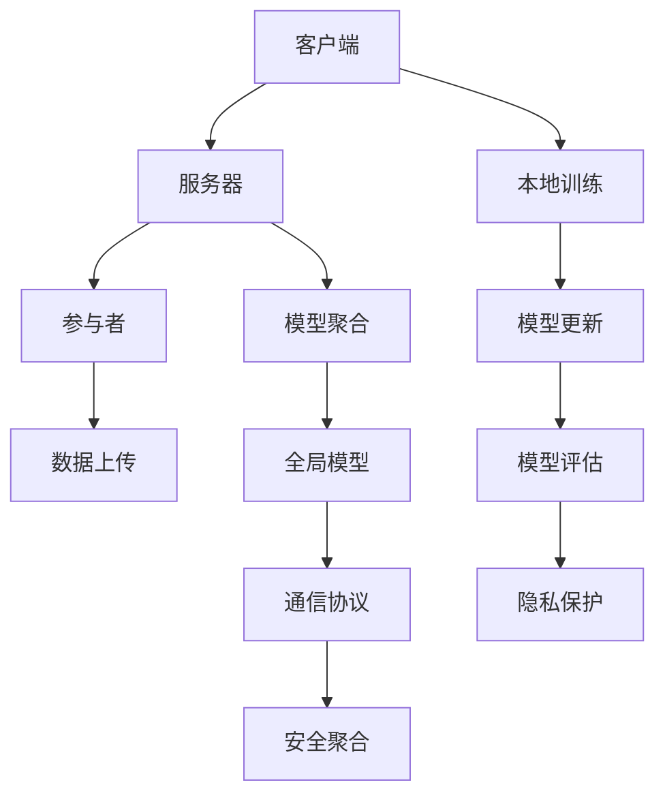

                 

### 联邦学习概述

#### 1.1 联邦学习的定义与背景

**隐私保护的重要性**

随着大数据和人工智能技术的快速发展，数据的利用价值日益凸显。然而，随之而来的是数据隐私保护的挑战。传统的数据处理方式往往需要将数据集中到某一个中心服务器进行训练，这样虽然能够提高模型的训练效率，但却存在数据泄露的风险，严重侵犯了用户的隐私权。

**联邦学习的发展历程**

为了解决这一问题，联邦学习（Federated Learning）应运而生。联邦学习是由Google于2017年首次提出的一种分布式机器学习方法，其核心思想是让模型在不同设备或不同服务器上进行训练，然后将各自训练得到的模型参数聚合起来，最终得到全局模型。

联邦学习的发展历程可以分为几个阶段：

1. **初期探索（2016-2017年）**：Google提出联邦学习概念，并在其论文《Federated Learning: Collaborative Machine Learning without Global Centralization》中详细阐述了联邦学习的原理和应用。
  
2. **技术成熟（2017-2019年）**：随着研究的深入，联邦学习逐渐得到业界和学界的认可，多个开源框架如TensorFlow Federated（TFF）、PySyft、FedML等相继推出，为联邦学习的实践提供了有力支持。

3. **应用拓展（2019年至今）**：联邦学习在医疗、金融、零售等多个行业得到广泛应用，成为跨行业数据协作的重要技术手段。

#### 1.2 联邦学习的核心概念

**模型更新策略**

联邦学习中的模型更新策略主要分为两种：基于梯度的聚合和基于模型的聚合。

1. **基于梯度的聚合**：该方法在本地设备上计算梯度，然后将梯度聚合起来，得到全局模型的更新。其中，最著名的算法是联邦平均算法（FedAvg）。

2. **基于模型的聚合**：该方法直接将本地模型聚合起来，得到全局模型的更新。这种方法的优点是计算复杂度相对较低，但需要考虑模型规模与通信成本之间的平衡。

**通信协议与加密技术**

为了确保联邦学习过程中的数据安全，通常需要采用加密技术对数据进行保护。常用的加密技术包括差分隐私、安全多方计算（MPC）和区块链等。

1. **差分隐私**：通过在本地模型参数中添加噪声，保证聚合后的模型无法推断出单个设备的敏感信息。

2. **安全多方计算（MPC）**：允许多个参与方在不暴露自身数据的情况下，共同计算得到结果。

3. **区块链技术**：通过区块链的分布式账本技术，实现数据的不可篡改和透明化。

#### 1.3 联邦学习的应用场景

**跨行业数据协作**

在跨行业数据协作中，不同的行业和组织往往拥有各自独特的数据资源。通过联邦学习，可以实现不同行业之间的数据共享和协同建模，从而提高模型的准确性和泛化能力。例如，在医疗领域，不同医院之间可以通过联邦学习共同训练疾病预测模型，提高疾病早期诊断的准确性。

**隐私保护的需求与挑战**

跨行业数据协作的隐私保护需求主要体现在以下几个方面：

1. **数据隐私保护**：确保参与方在共享数据时，不会泄露自身的敏感信息。

2. **数据共享与合规性**：在满足隐私保护的前提下，实现数据的流通和共享，同时遵守相关法律法规。

3. **数据同步与一致性**：确保不同参与方之间的数据保持一致，避免出现数据冲突。

跨行业数据协作中的隐私保护挑战主要体现在以下几个方面：

1. **数据安全**：如何确保在数据传输和存储过程中，不会被恶意攻击者窃取或篡改。

2. **隐私泄露风险**：如何在保证模型性能的同时，降低隐私泄露的风险。

3. **通信效率**：如何在保证隐私保护的前提下，降低通信成本，提高模型训练效率。

#### 1.4 联邦学习的优势

**降低数据传输成本**

联邦学习通过将模型训练分布在各个参与方，避免了大量数据在网络上传输，从而降低了数据传输成本。

**增强数据隐私保护**

联邦学习采用加密技术和隐私保护机制，确保参与方在共享数据时，不会泄露自身的敏感信息。

**提高模型泛化能力**

通过跨行业数据协作，联邦学习能够利用不同行业的数据资源，提高模型的泛化能力。

**促进跨行业数据协作**

联邦学习为跨行业数据协作提供了一个安全、高效的解决方案，有助于推动数据共享和协同创新。

#### 1.5 联邦学习的局限性与未来研究方向

**计算资源要求高**

联邦学习需要大量的计算资源进行本地模型训练和聚合，对于计算资源有限的参与方来说，可能存在一定的挑战。

**通信效率较低**

联邦学习需要频繁进行模型参数的传输和聚合，通信成本相对较高，需要进一步优化。

**模型性能与隐私保护之间的平衡**

如何在保证模型性能的同时，降低隐私泄露的风险，是一个重要的研究方向。

**跨行业协作的可持续性**

如何建立稳定的跨行业协作机制，实现长期的数据共享和协同创新，也是未来需要关注的问题。

#### 1.6 联邦学习的关键概念

**联邦学习系统**

联邦学习系统由多个参与方组成，包括客户端、服务器和参与者。客户端负责本地数据的收集和模型训练，服务器负责模型参数的聚合和更新，参与者则是参与联邦学习的其他实体。

**本地训练**

本地训练是指在每个参与方本地进行数据预处理和模型训练的过程。本地训练的目的是利用本地数据提高模型在特定任务上的性能。

**模型聚合**

模型聚合是指将多个参与方的本地模型参数聚合起来，得到全局模型的过程。模型聚合的目的是通过协同训练提高全局模型的性能。

**隐私保护机制**

隐私保护机制是指采用加密技术、差分隐私等手段，确保参与方在共享数据时，不会泄露自身敏感信息。

**通信协议**

通信协议是指参与方在联邦学习过程中，进行数据传输和通信的规则和规范。

**联邦学习框架**

联邦学习框架是指用于实现联邦学习算法和机制的软件框架，如TensorFlow Federated、PySyft等。

### 1.7 联邦学习与其他分布式学习方法的比较

**分布式学习**

分布式学习是指将模型训练分布在多个计算节点上进行，以提高训练效率和处理大规模数据的能力。

**差异**

1. **数据存储方式**：分布式学习通常将数据存储在中心服务器，而联邦学习则将数据存储在本地设备。

2. **计算资源要求**：分布式学习对计算资源要求较低，而联邦学习对计算资源要求较高。

3. **隐私保护**：联邦学习具备更强的隐私保护能力，而分布式学习则更容易受到中心化攻击。

**优势**

1. **联邦学习**：降低数据传输成本，增强数据隐私保护，提高模型泛化能力。

2. **分布式学习**：提高训练效率，适用于大规模数据处理。

**适用场景**

1. **联邦学习**：跨行业数据协作、分布式设备训练。

2. **分布式学习**：大规模数据处理、高性能计算。

### 1.8 联邦学习的未来发展趋势

**技术进步**

随着量子计算、边缘计算等技术的发展，联邦学习在计算效率、安全性等方面将得到进一步提升。

**应用拓展**

联邦学习将在更多行业和场景中得到应用，如智慧城市、自动驾驶等。

**隐私保护技术融合**

联邦学习将与其他隐私保护技术如安全多方计算、区块链等相结合，提供更加全面的隐私保护方案。

**跨行业协作机制完善**

通过建立稳定的跨行业协作机制，实现长期的数据共享和协同创新。

### 1.9 小结

联邦学习作为一种分布式机器学习方法，在隐私保护、数据共享和协同建模方面具有显著优势。通过本文的介绍，我们对联邦学习的基本概念、应用场景和隐私保护机制有了初步了解。在接下来的章节中，我们将进一步探讨联邦学习的基本架构、核心算法以及跨行业数据协作中的隐私保护策略。

---

### 联邦学习的基本架构

#### 2.1 联邦学习的组成部分

联邦学习系统由多个参与方组成，包括客户端、服务器和参与者。客户端负责本地数据的收集和模型训练，服务器负责模型参数的聚合和更新，参与者则是参与联邦学习的其他实体。

**参与者类型与角色**

1. **客户端（Client）**：通常指移动设备、嵌入式设备或终端用户设备。客户端负责本地数据的收集和处理，并按照服务器指定的策略进行模型训练。

2. **服务器（Server）**：作为联邦学习的核心，服务器负责协调整个联邦学习过程。服务器的主要功能包括：
   - **模型初始化**：初始全局模型参数的生成。
   - **模型聚合**：将各个客户端的本地模型参数聚合起来，更新全局模型。
   - **策略制定**：根据不同任务需求，制定合适的模型更新策略和隐私保护策略。

3. **参与者（Participants）**：参与联邦学习的其他实体，如企业、医院、学校等。参与者可以根据自己的需求，选择参与特定的联邦学习任务。

**数据分片策略**

在联邦学习中，数据通常分布在多个客户端和参与者上。为了确保数据的隐私性和安全性，需要对数据进行分片处理。数据分片策略主要有以下几种：

1. **垂直分片**：将数据按照特征维度进行分片，每个客户端或参与者只拥有部分特征数据。这种方法可以减少通信量，但可能导致模型训练效率降低。

2. **水平分片**：将数据按照样本维度进行分片，每个客户端或参与者只拥有部分样本数据。这种方法可以提高模型训练效率，但需要确保样本数据的代表性。

3. **混合分片**：结合垂直分片和水平分片策略，根据数据特点和任务需求进行数据分片。这种方法可以平衡模型训练效率和数据隐私保护。

#### 2.2 模型训练过程

联邦学习中的模型训练过程可以分为以下几个步骤：

1. **模型初始化**：服务器初始化全局模型参数，并将其发送给各个客户端。

2. **本地训练**：客户端根据本地数据，按照服务器指定的训练策略，对模型进行本地训练。本地训练过程中，客户端需要计算梯度、更新模型参数等。

3. **模型聚合**：服务器收集各个客户端的本地模型参数，并进行聚合，更新全局模型。

4. **模型评估**：服务器使用全局模型进行评估，以验证模型性能和稳定性。

5. **模型更新**：服务器将更新后的全局模型参数发送给各个客户端，循环执行上述步骤。

**本地训练算法**

本地训练算法是指在客户端进行的模型训练过程。常用的本地训练算法包括联邦平均算法（FedAvg）、增量学习算法等。

1. **联邦平均算法（FedAvg）**：联邦平均算法是最简单的联邦学习算法，其基本思想是每次迭代后，将各个客户端的模型参数进行加权平均，更新全局模型。具体步骤如下：

   ```  
   初始化：设全局模型为θ₀，本地模型为θ_i  
   迭代过程：  
       对于每个客户端i，执行：  
           θ_i^t = θ_i^{t-1} + α * ∇θ_i^{t-1} (x_i; θ_i^{t-1})  
           θ_i^t = (1 - β) * θ_i^t + β * θ₀  
       将更新后的模型参数θ_i^t发送给服务器  
       服务器聚合模型参数，更新全局模型θ₀  
   ```

2. **增量学习算法**：增量学习算法是在FedAvg的基础上，对每个客户端的更新进行累加，而不是简单的平均。具体步骤如下：

   ```  
   初始化：设全局模型为θ₀，本地模型为θ_i  
   迭代过程：  
       对于每个客户端i，执行：  
           θ_i^t = θ_i^{t-1} + α * ∇θ_i^{t-1} (x_i; θ_i^{t-1})  
           θ_i^t = θ_i^t - β * (θ_i^t - θ₀)  
       将更新后的模型参数θ_i^t发送给服务器  
       服务器聚合模型参数，更新全局模型θ₀  
   ```

**模型聚合策略**

模型聚合策略是指将多个客户端的本地模型参数聚合为全局模型的过程。常用的模型聚合策略包括加权平均、投票等。

1. **加权平均**：加权平均是将各个客户端的模型参数按照权重进行平均，权重通常与客户端的数据量或贡献程度相关。具体步骤如下：

   ```  
   初始化：设全局模型为θ₀，本地模型为θ_i，权重为w_i  
   迭代过程：  
       对于每个客户端i，计算权重w_i = 1 / (1 + β * (θ_i - θ₀)²)  
       计算全局模型θ₀ = Σ(θ_i * w_i)  
   ```

2. **投票**：投票是将各个客户端的模型参数进行投票，选择投票次数最多的模型参数作为全局模型。具体步骤如下：

   ```  
   初始化：设全局模型为θ₀，本地模型为θ_i  
   迭代过程：  
       对于每个客户端i，计算投票权重w_i = 1 / (1 + β * ||θ_i - θ₀||²)  
       对于全局模型θ₀，选择投票次数最多的模型参数作为更新值  
   ```

#### 2.3 安全性与效率优化

**差分隐私与安全聚合**

在联邦学习中，为了确保参与方的隐私，通常采用差分隐私技术。差分隐私可以通过在本地模型参数中添加噪声，使得攻击者无法推断出单个设备的敏感信息。

安全聚合是指在聚合过程中，采用加密技术确保参与方的数据不被泄露。常用的安全聚合方法包括安全多方计算（MPC）和基于密码学的聚合算法。

**通信成本与计算效率**

联邦学习的通信成本与计算效率是关键优化目标。为了降低通信成本，可以采用以下策略：

1. **本地训练优化**：通过优化本地训练算法，减少每次迭代需要传输的数据量。

2. **稀疏通信**：仅传输模型的关键部分，如梯度或模型参数的差分。

3. **异步通信**：允许参与方在不同时间进行通信，减少通信冲突。

为了提高计算效率，可以采用以下策略：

1. **分布式计算**：将计算任务分布在多个服务器和客户端上进行。

2. **并行处理**：利用并行计算技术，加快模型训练和聚合速度。

3. **模型压缩**：采用模型压缩技术，如量化、剪枝等，减少模型参数的存储和传输开销。

#### 2.4 联邦学习的基本架构图

以下是联邦学习的基本架构图，展示了客户端、服务器和参与者之间的交互过程：



通过上述架构图，我们可以清晰地看到联邦学习过程中各个环节的交互关系，从而为后续章节的详细讲解奠定基础。

---

### 联邦学习的核心算法

#### 3.1 算法分类与比较

联邦学习算法可以根据不同的分类标准进行分类。常见的分类标准包括基于梯度聚合的算法和基于模型聚合的算法。

**基于梯度聚合的算法**

基于梯度聚合的算法是最常见的联邦学习算法，其核心思想是将本地梯度聚合起来，更新全局模型。这种方法在实现上相对简单，计算复杂度较低。

1. **联邦平均算法（FedAvg）**：FedAvg是最简单的联邦学习算法，其基本思想是每次迭代后，将各个客户端的模型参数进行加权平均，更新全局模型。具体步骤如下：

   ```  
   初始化：设全局模型为θ₀，本地模型为θ_i  
   迭代过程：  
       对于每个客户端i，执行：  
           θ_i^t = θ_i^{t-1} + α * ∇θ_i^{t-1} (x_i; θ_i^{t-1})  
           θ_i^t = (1 - β) * θ_i^t + β * θ₀  
       将更新后的模型参数θ_i^t发送给服务器  
       服务器聚合模型参数，更新全局模型θ₀  
   ```

2. **增量学习算法**：增量学习算法是在FedAvg的基础上，对每个客户端的更新进行累加，而不是简单的平均。具体步骤如下：

   ```  
   初始化：设全局模型为θ₀，本地模型为θ_i  
   迭代过程：  
       对于每个客户端i，执行：  
           θ_i^t = θ_i^{t-1} + α * ∇θ_i^{t-1} (x_i; θ_i^{t-1})  
           θ_i^t = θ_i^t - β * (θ_i^t - θ₀)  
       将更新后的模型参数θ_i^t发送给服务器  
       服务器聚合模型参数，更新全局模型θ₀  
   ```

**基于模型聚合的算法**

基于模型聚合的算法是将本地模型直接聚合起来，更新全局模型。这种方法在计算复杂度上相对较高，但可以提高模型性能。

1. **自适应聚合算法**：自适应聚合算法根据客户端的模型性能进行动态调整，从而优化模型聚合过程。具体步骤如下：

   ```  
   初始化：设全局模型为θ₀，本地模型为θ_i，权重为w_i  
   迭代过程：  
       对于每个客户端i，计算权重w_i = 1 / (1 + β * (θ_i - θ₀)²)  
       计算全局模型θ₀ = Σ(θ_i * w_i)  
   ```

2. **分布式优化算法**：分布式优化算法采用分布式计算和优化技术，提高模型聚合效率。具体步骤如下：

   ```  
   初始化：设全局模型为θ₀，本地模型为θ_i  
   迭代过程：  
       对于每个客户端i，计算本地梯度∇θ_i (x_i; θ₀)  
       将更新后的模型参数θ_i发送给服务器  
       服务器聚合模型参数，更新全局模型θ₀  
   ```

#### 3.2 梯度聚合算法原理

**联邦平均算法（FedAvg）**

联邦平均算法（FedAvg）是最简单的联邦学习算法，其基本思想是每次迭代后，将各个客户端的模型参数进行加权平均，更新全局模型。具体步骤如下：

1. **初始化**：设全局模型为θ₀，本地模型为θ_i，学习率为α，动量参数为β。

2. **本地训练**：对于每个客户端i，执行以下步骤：
   - 计算本地梯度：∇θ_i (x_i; θ_i^{t-1})  
   - 更新本地模型：θ_i^t = θ_i^{t-1} - α * ∇θ_i (x_i; θ_i^{t-1})

3. **模型聚合**：服务器收集各个客户端的更新后的模型参数θ_i^t，进行聚合，更新全局模型：
   - 计算全局模型：θ₀^t = θ₀^{t-1} + β * (1 - β) * (θ_i^t - θ₀^{t-1})

4. **模型评估**：使用全局模型θ₀^t进行模型评估，以验证模型性能和稳定性。

5. **模型更新**：服务器将更新后的全局模型θ₀^t发送给各个客户端，循环执行上述步骤。

**增量学习算法**

增量学习算法是在FedAvg的基础上，对每个客户端的更新进行累加，而不是简单的平均。具体步骤如下：

1. **初始化**：设全局模型为θ₀，本地模型为θ_i，学习率为α，动量参数为β。

2. **本地训练**：对于每个客户端i，执行以下步骤：
   - 计算本地梯度：∇θ_i (x_i; θ_i^{t-1})  
   - 更新本地模型：θ_i^t = θ_i^{t-1} - α * ∇θ_i (x_i; θ_i^{t-1})

3. **模型聚合**：服务器收集各个客户端的更新后的模型参数θ_i^t，进行聚合，更新全局模型：
   - 计算全局模型：θ₀^t = θ₀^{t-1} + α * Σ(θ_i^t - θ₀^{t-1})

4. **模型评估**：使用全局模型θ₀^t进行模型评估，以验证模型性能和稳定性。

5. **模型更新**：服务器将更新后的全局模型θ₀^t发送给各个客户端，循环执行上述步骤。

#### 3.3 模型聚合算法原理

**自适应聚合算法**

自适应聚合算法根据客户端的模型性能进行动态调整，从而优化模型聚合过程。具体步骤如下：

1. **初始化**：设全局模型为θ₀，本地模型为θ_i，权重为w_i，学习率为α，动量参数为β。

2. **本地训练**：对于每个客户端i，执行以下步骤：
   - 计算本地梯度：∇θ_i (x_i; θ_i^{t-1})  
   - 更新本地模型：θ_i^t = θ_i^{t-1} - α * ∇θ_i (x_i; θ_i^{t-1})

3. **模型聚合**：服务器收集各个客户端的更新后的模型参数θ_i^t，计算自适应权重w_i：
   - 计算权重：w_i = 1 / (1 + β * (θ_i - θ₀)²)  
   - 计算全局模型：θ₀^t = Σ(θ_i * w_i)

4. **模型评估**：使用全局模型θ₀^t进行模型评估，以验证模型性能和稳定性。

5. **模型更新**：服务器将更新后的全局模型θ₀^t发送给各个客户端，循环执行上述步骤。

**分布式优化算法**

分布式优化算法采用分布式计算和优化技术，提高模型聚合效率。具体步骤如下：

1. **初始化**：设全局模型为θ₀，本地模型为θ_i，学习率为α，动量参数为β。

2. **本地训练**：对于每个客户端i，执行以下步骤：
   - 计算本地梯度：∇θ_i (x_i; θ_i^{t-1})  
   - 更新本地模型：θ_i^t = θ_i^{t-1} - α * ∇θ_i (x_i; θ_i^{t-1})

3. **模型聚合**：服务器收集各个客户端的更新后的模型参数θ_i^t，进行聚合，更新全局模型：
   - 计算全局模型：θ₀^t = θ₀^{t-1} + α * (θ_i^t - θ₀^{t-1})

4. **模型评估**：使用全局模型θ₀^t进行模型评估，以验证模型性能和稳定性。

5. **模型更新**：服务器将更新后的全局模型θ₀^t发送给各个客户端，循环执行上述步骤。

#### 3.4 算法性能比较

**联邦平均算法（FedAvg）**

- **优点**：实现简单，计算复杂度低，适用于大规模分布式环境。
- **缺点**：在模型更新过程中，存在较大的方差，可能导致模型稳定性较差。

**增量学习算法**

- **优点**：在模型更新过程中，对每个客户端的更新进行累加，可以减少方差，提高模型稳定性。
- **缺点**：计算复杂度相对较高，需要多次传输模型参数。

**自适应聚合算法**

- **优点**：根据客户端的模型性能动态调整权重，优化模型聚合过程，提高模型性能。
- **缺点**：实现复杂度较高，需要额外的计算资源。

**分布式优化算法**

- **优点**：采用分布式计算和优化技术，提高模型聚合效率，适用于大规模分布式环境。
- **缺点**：实现复杂度较高，需要额外的计算资源。

#### 3.5 联邦学习算法的选择原则

在联邦学习算法的选择过程中，需要考虑以下几个方面：

- **应用场景**：根据不同的应用场景，选择适合的算法。例如，对于大规模分布式环境，FedAvg和分布式优化算法具有较好的适应性。
- **模型性能**：根据模型性能指标，如准确率、召回率等，选择合适的算法。例如，对于需要高稳定性的场景，可以选择增量学习算法。
- **计算资源**：根据计算资源的限制，选择适合的算法。例如，对于计算资源有限的场景，可以选择自适应聚合算法。

通过综合考虑以上因素，可以选择适合的联邦学习算法，实现高效、安全的模型训练。

---

### 跨行业数据协作的隐私保护需求

#### 4.1 跨行业数据协作的挑战

在跨行业数据协作中，隐私保护面临着一系列挑战。以下是一些主要的挑战：

**数据隐私保护与数据共享的平衡**

跨行业数据协作的目的是利用不同行业的数据资源，提高模型性能和泛化能力。然而，不同行业的数据往往包含敏感信息，如个人隐私、商业机密等。如何在保护数据隐私的同时实现数据共享，是一个重要的挑战。

**数据流通的合规性**

在跨行业数据协作中，数据流通需要遵守相关法律法规，如《通用数据保护条例》（GDPR）和《加州消费者隐私法案》（CCPA）等。不同国家和地区的法律法规对数据隐私保护的要求存在差异，如何确保数据流通的合规性，是一个重要的问题。

**数据同步与一致性**

在跨行业数据协作中，不同行业和组织的数据更新频率、数据格式等可能存在差异，导致数据同步和一致性成为挑战。如何确保不同行业和组织的数据保持一致，避免数据冲突，是一个关键问题。

**隐私泄露风险**

跨行业数据协作中的隐私泄露风险主要来自于数据传输、存储和处理过程中。如果隐私保护措施不当，可能导致敏感信息被窃取或篡改，从而对参与方的隐私和声誉造成损害。

#### 4.2 隐私保护机制的设计

为了应对上述挑战，需要在跨行业数据协作中设计有效的隐私保护机制。以下是一些常见的隐私保护机制：

**加密技术与访问控制**

加密技术是保护数据隐私的重要手段。在数据传输和存储过程中，可以使用对称加密或非对称加密技术对数据进行加密，确保数据在传输过程中不会被窃取或篡改。此外，通过访问控制机制，可以限制对数据的访问权限，确保只有授权用户可以访问敏感数据。

**数据去标识化与匿名化**

数据去标识化和匿名化是将敏感信息从数据中去除或改变，从而保护个人隐私的有效方法。例如，可以使用K-匿名、l-diversity等匿名化技术，对个人身份信息进行去标识化处理，从而降低隐私泄露的风险。

**差分隐私**

差分隐私是一种针对统计数据的隐私保护技术，其核心思想是在数据处理过程中添加噪声，使得攻击者无法推断出单个记录的敏感信息。差分隐私可以在保证模型性能的同时，提供严格的隐私保护。

**安全多方计算（MPC）**

安全多方计算是一种允许多个参与方在不暴露自身数据的情况下，共同计算得到结果的技术。在跨行业数据协作中，可以通过安全多方计算实现数据隐私保护，从而避免数据泄露的风险。

**区块链技术**

区块链技术具有分布式账本、不可篡改等特性，可以用于实现数据透明化和隐私保护。通过将数据记录在区块链上，可以实现数据的可信存储和流通，从而降低隐私泄露的风险。

**隐私保护框架**

为了更好地应对跨行业数据协作中的隐私保护挑战，可以设计一个隐私保护框架，将上述隐私保护机制整合起来。隐私保护框架应包括数据加密、访问控制、匿名化、差分隐私、MPC和区块链等组件，从而提供全面、高效的隐私保护。

#### 4.3 隐私保护机制的实施策略

在实施隐私保护机制时，需要考虑以下几个方面：

**数据预处理**

在数据预处理阶段，可以对数据进行去标识化和匿名化处理，从而降低隐私泄露的风险。例如，可以使用加密技术对个人身份信息进行加密，或者使用匿名化算法对敏感信息进行替换。

**通信加密**

在数据传输过程中，需要使用加密技术对数据进行加密，确保数据在传输过程中不会被窃取或篡改。例如，可以使用TLS协议对数据传输进行加密，或者使用加密库对数据进行加密。

**访问控制**

在数据存储和处理过程中，需要使用访问控制机制限制对数据的访问权限。例如，可以设置不同级别的访问权限，确保只有授权用户可以访问敏感数据。

**安全多方计算**

在跨行业数据协作中，可以通过安全多方计算实现数据隐私保护。例如，可以使用MPC技术，让不同行业和组织在不需要共享原始数据的情况下，共同计算得到结果。

**区块链应用**

通过将数据记录在区块链上，可以实现数据的可信存储和流通。例如，可以使用区块链技术记录数据上传、数据共享等操作，确保数据透明化和不可篡改。

**隐私保护评估**

在实施隐私保护机制后，需要对隐私保护效果进行评估。例如，可以使用隐私保护指标，如K-匿名性、l-diversity等，评估匿名化处理的效果。此外，还可以通过模拟攻击，验证数据隐私保护的强度。

#### 4.4 跨行业数据协作中的隐私保护策略

在跨行业数据协作中，隐私保护策略需要根据具体场景和需求进行设计。以下是一些常见的隐私保护策略：

**数据最小化**

在数据共享过程中，只共享必要的数据，避免共享敏感信息。例如，在医疗行业的数据协作中，可以只共享疾病诊断结果，而不共享患者的个人身份信息。

**数据加密**

在数据传输和存储过程中，使用加密技术对数据进行加密，确保数据在传输过程中不会被窃取或篡改。

**匿名化处理**

在数据处理过程中，对敏感信息进行匿名化处理，降低隐私泄露的风险。例如，可以使用K-匿名、l-diversity等技术，对个人身份信息进行去标识化处理。

**差分隐私应用**

在数据处理过程中，采用差分隐私技术，对统计结果进行噪声处理，降低隐私泄露的风险。例如，在统计患者数据时，可以添加随机噪声，使得攻击者无法推断出单个患者的敏感信息。

**安全多方计算**

在跨行业数据协作中，采用安全多方计算技术，让不同行业和组织在不暴露原始数据的情况下，共同计算得到结果。

**区块链应用**

通过将数据记录在区块链上，实现数据的可信存储和流通，降低隐私泄露的风险。

**隐私保护协议**

制定隐私保护协议，明确数据共享、数据访问等过程中的隐私保护要求，确保跨行业数据协作的合规性。

#### 4.5 隐私保护机制的评估与优化

在实施隐私保护机制后，需要对隐私保护效果进行评估和优化。以下是一些评估和优化方法：

**隐私保护效果评估**

使用隐私保护指标，如K-匿名性、l-diversity等，评估匿名化处理的效果。此外，还可以通过模拟攻击，验证数据隐私保护的强度。

**性能优化**

在确保隐私保护的前提下，优化数据传输和处理的性能。例如，可以通过数据分片、异步通信等技术，提高数据传输和处理的效率。

**隐私保护机制更新**

随着技术的不断进步，隐私保护机制也需要不断更新和优化。例如，可以引入新型加密技术、安全多方计算等，提高隐私保护能力。

#### 4.6 跨行业数据协作中的隐私保护案例分析

以下是一个跨行业数据协作中的隐私保护案例分析：

**应用场景**：金融行业与医疗行业的合作

**隐私保护需求**：金融行业和医疗行业的数据中包含大量的敏感信息，如个人财务信息、健康状况等。在合作过程中，需要确保数据隐私得到有效保护。

**隐私保护措施**：

1. **数据加密**：在数据传输和存储过程中，使用加密技术对数据进行加密，确保数据在传输过程中不会被窃取或篡改。

2. **匿名化处理**：对敏感信息进行匿名化处理，降低隐私泄露的风险。例如，可以使用K-匿名、l-diversity等技术，对个人身份信息进行去标识化处理。

3. **差分隐私应用**：在数据处理过程中，采用差分隐私技术，对统计结果进行噪声处理，降低隐私泄露的风险。例如，在统计患者数据时，可以添加随机噪声，使得攻击者无法推断出单个患者的敏感信息。

4. **安全多方计算**：在跨行业数据协作中，采用安全多方计算技术，让金融行业和医疗行业在不暴露原始数据的情况下，共同计算得到结果。

5. **区块链应用**：通过将数据记录在区块链上，实现数据的可信存储和流通，降低隐私泄露的风险。

**评估与优化**：

1. **隐私保护效果评估**：通过模拟攻击，验证数据隐私保护的强度。例如，可以模拟恶意攻击者尝试窃取数据，评估隐私保护机制的有效性。

2. **性能优化**：通过数据分片、异步通信等技术，提高数据传输和处理的效率。

3. **隐私保护机制更新**：随着技术的不断进步，隐私保护机制也需要不断更新和优化。例如，可以引入新型加密技术、安全多方计算等，提高隐私保护能力。

通过上述隐私保护措施和评估优化方法，可以确保跨行业数据协作中的数据隐私得到有效保护，从而推动跨行业合作的发展。

---

### 联邦学习在跨行业数据协作中的应用案例

联邦学习作为一种分布式机器学习方法，在跨行业数据协作中具有广泛的应用潜力。以下我们通过三个具体应用案例，来探讨联邦学习在金融、医疗和零售等行业的数据协作中如何实现隐私保护。

#### 5.1 案例一：金融行业的风险控制

**应用背景与挑战**

在金融行业，跨机构的数据协作有助于提升风险控制能力。然而，金融机构在合作时，往往需要处理大量的客户交易数据和财务信息，这些数据中包含敏感的隐私信息。如何确保数据在共享过程中不被泄露，成为金融行业数据协作的难点。

**解决方案与效果**

针对这一挑战，金融机构可以利用联邦学习技术，建立一个分布式风险控制模型。具体解决方案如下：

1. **数据加密传输**：在数据传输过程中，使用加密技术对数据进行加密，确保数据在传输过程中不会被窃取或篡改。

2. **本地训练与模型聚合**：金融机构在本地对客户交易数据进行分析和训练，得到局部模型。然后，通过联邦学习算法将局部模型聚合起来，更新全局模型。

3. **差分隐私应用**：在模型训练和聚合过程中，采用差分隐私技术，对模型参数添加噪声，降低隐私泄露的风险。

4. **安全多方计算**：利用安全多方计算技术，实现金融机构在不暴露原始数据的情况下，共同计算得到全局模型。

通过上述方案，金融机构能够在确保数据隐私得到有效保护的前提下，实现跨机构的风险控制协作。实际应用效果显示，该方案有效提升了风险检测的准确性和实时性，降低了金融机构的风险暴露。

#### 5.2 案例二：医疗行业的患者数据分析

**应用背景与挑战**

在医疗行业，不同医院和诊所拥有大量的患者数据，通过跨机构的数据协作，可以提升疾病预测和诊断的准确性。然而，医疗数据中包含患者的个人隐私信息，如何在保障患者隐私的同时进行数据共享，是医疗行业面临的挑战。

**解决方案与效果**

针对这一挑战，医疗行业可以利用联邦学习技术，建立一个分布式疾病预测模型。具体解决方案如下：

1. **数据匿名化处理**：在数据共享前，对患者的个人身份信息进行去标识化处理，降低隐私泄露的风险。

2. **本地训练与模型聚合**：各医院和诊所在本地对患者数据进行分析和训练，得到局部模型。然后，通过联邦学习算法将局部模型聚合起来，更新全局模型。

3. **差分隐私应用**：在模型训练和聚合过程中，采用差分隐私技术，对模型参数添加噪声，降低隐私泄露的风险。

4. **区块链技术**：通过区块链技术记录数据的上传、共享和使用过程，确保数据透明化和不可篡改。

通过上述方案，医疗行业能够在确保患者隐私得到有效保护的前提下，实现跨机构的疾病预测和诊断协作。实际应用效果显示，该方案有效提升了疾病预测的准确性和模型稳定性，为医疗资源的优化配置提供了有力支持。

#### 5.3 案例三：零售行业的个性化推荐系统

**应用背景与挑战**

在零售行业，不同商家和平台拥有大量的用户购物数据，通过跨机构的协作，可以提升个性化推荐系统的效果。然而，用户购物数据中包含用户的个人隐私信息，如何在保障用户隐私的同时进行数据共享，是零售行业面临的挑战。

**解决方案与效果**

针对这一挑战，零售行业可以利用联邦学习技术，建立一个分布式个性化推荐模型。具体解决方案如下：

1. **数据加密传输**：在数据传输过程中，使用加密技术对数据进行加密，确保数据在传输过程中不会被窃取或篡改。

2. **本地训练与模型聚合**：各商家和平台在本地对用户购物数据进行分析和训练，得到局部模型。然后，通过联邦学习算法将局部模型聚合起来，更新全局模型。

3. **差分隐私应用**：在模型训练和聚合过程中，采用差分隐私技术，对模型参数添加噪声，降低隐私泄露的风险。

4. **区块链技术**：通过区块链技术记录数据的上传、共享和使用过程，确保数据透明化和不可篡改。

通过上述方案，零售行业能够在确保用户隐私得到有效保护的前提下，实现跨机构的个性化推荐协作。实际应用效果显示，该方案有效提升了个性化推荐系统的准确性和用户满意度，为商家提供了有力的营销工具。

#### 5.4 联邦学习在跨行业数据协作中的优势与挑战

**优势**

1. **隐私保护**：通过联邦学习，可以在确保数据隐私得到有效保护的前提下，实现跨行业的数据共享和协同建模。

2. **数据利用效率**：联邦学习可以将不同行业的数据资源整合起来，提高数据的利用效率，从而提升模型性能。

3. **降低数据传输成本**：联邦学习将模型训练分布在各个参与方，避免了大量数据在网络上传输，从而降低了数据传输成本。

**挑战**

1. **计算资源要求高**：联邦学习需要大量的计算资源进行本地模型训练和聚合，对于计算资源有限的参与方来说，可能存在一定的挑战。

2. **通信效率较低**：联邦学习需要频繁进行模型参数的传输和聚合，通信成本相对较高，需要进一步优化。

3. **隐私保护与模型性能的平衡**：如何在保证模型性能的同时，降低隐私泄露的风险，是一个重要的研究课题。

通过以上三个应用案例，我们可以看到联邦学习在跨行业数据协作中具有广泛的应用前景。尽管存在一定的挑战，但通过不断优化和改进，联邦学习有望成为跨行业数据协作的重要技术手段。

---

### 跨行业数据协作中的隐私保护策略

在跨行业数据协作中，隐私保护是确保数据共享和合作顺利进行的关键。以下我们将探讨几种常见的隐私保护策略，并分析其优缺点。

#### 6.1 联邦学习与隐私保护技术的结合

**安全多方计算（MPC）**

安全多方计算（MPC）是一种允许多个参与方在不暴露自身数据的情况下，共同计算得到结果的技术。MPC在联邦学习中的应用可以有效保护数据隐私。具体步骤如下：

1. **初始化**：参与方分别将自己的数据加密，并生成加密密钥。
2. **本地计算**：参与方在本地进行加密数据的计算，得到中间结果。
3. **全局计算**：参与方将加密的中间结果发送给协调者，协调者利用这些中间结果进行全局计算，得到最终结果。
4. **解密**：最终结果通过解密过程恢复为明文数据。

**优点**：MPC可以有效保护数据隐私，确保参与方在共享数据时，不会泄露自身敏感信息。

**缺点**：MPC的计算复杂度较高，通信成本较高，需要较长时间才能完成计算。

**区块链技术**

区块链技术具有分布式账本、不可篡改等特性，可以用于实现数据透明化和隐私保护。在联邦学习中，区块链可以用于记录数据上传、数据共享等操作，确保数据透明化和不可篡改。

**优点**：区块链技术可以提供数据透明化和不可篡改的保障，增强数据隐私保护。

**缺点**：区块链技术需要较高的计算资源和存储资源，可能导致系统性能下降。

**同态加密**

同态加密是一种允许对加密数据进行计算的技术，可以在不解密数据的情况下，直接对加密数据进行处理。同态加密在联邦学习中的应用，可以实现数据隐私保护。

**优点**：同态加密可以保证数据在传输和处理过程中不会被窃取或篡改，提供强隐私保护。

**缺点**：同态加密的计算复杂度较高，性能较差，目前尚未能在实际应用中大规模部署。

#### 6.2 隐私保护策略的评估与优化

**隐私保护效果评估**

为了评估隐私保护策略的有效性，可以采用以下方法：

1. **模拟攻击**：通过模拟恶意攻击者尝试窃取或篡改数据，评估隐私保护策略的强度。
2. **隐私保护指标**：使用隐私保护指标，如K-匿名性、l-diversity等，评估匿名化处理的效果。
3. **隐私泄露概率**：计算在特定攻击条件下，隐私泄露的概率，以评估隐私保护策略的安全性。

**隐私保护策略优化**

为了优化隐私保护策略，可以采用以下方法：

1. **混合策略**：结合多种隐私保护技术，如MPC、区块链、同态加密等，提高隐私保护效果。
2. **动态调整**：根据实际应用场景和数据特性，动态调整隐私保护策略，以平衡隐私保护和数据利用率。
3. **隐私保护与性能优化**：在保证隐私保护的前提下，优化数据传输、存储和处理的性能，降低隐私保护机制的通信成本和计算复杂度。

#### 6.3 跨行业数据协作的隐私保护框架

为了实现跨行业数据协作中的隐私保护，可以设计一个隐私保护框架，该框架应包括以下几个组成部分：

1. **数据预处理模块**：对数据进行去标识化和匿名化处理，降低隐私泄露的风险。
2. **通信加密模块**：在数据传输过程中，使用加密技术对数据进行加密，确保数据在传输过程中不会被窃取或篡改。
3. **隐私保护算法模块**：采用联邦学习、MPC、区块链等隐私保护算法，实现数据隐私保护。
4. **访问控制模块**：限制对数据的访问权限，确保只有授权用户可以访问敏感数据。
5. **隐私保护评估模块**：评估隐私保护策略的有效性，并根据评估结果进行优化。

通过上述隐私保护框架，可以确保跨行业数据协作中的数据隐私得到有效保护，从而推动跨行业合作的发展。

---

### 联邦学习隐私保护机制的实现

#### 7.1 实现框架与工具

联邦学习的隐私保护机制需要一套完整的实现框架和工具支持。以下是一些主流的联邦学习框架和隐私保护工具。

**主流联邦学习框架**

1. **TensorFlow Federated（TFF）**：TFF是由Google推出的开源联邦学习框架，支持联邦平均算法（FedAvg）和增量学习算法。TFF提供了丰富的API，便于开发者构建和部署联邦学习应用。

2. **PySyft**：PySyft是基于PyTorch的联邦学习框架，支持联邦平均算法（FedAvg）和基于模型的聚合算法。PySyft提供了PyTorch的兼容API，方便开发者将现有模型迁移到联邦学习框架。

3. **FedML**：FedML是由清华大学和阿里巴巴共同推出的开源联邦学习框架，支持多种联邦学习算法和隐私保护机制，如差分隐私、安全多方计算（MPC）等。

**隐私保护工具**

1. **PyCrypto**：PyCrypto是一个Python库，提供了多种加密算法，如AES、RSA等，用于数据加密和通信加密。

2. **PySyft**：PySyft不仅提供了联邦学习算法，还内置了安全多方计算（MPC）和差分隐私功能，方便开发者实现隐私保护机制。

3. **CryptoPy**：CryptoPy是一个Python库，提供了多种加密算法和密钥管理功能，适用于实现隐私保护机制。

#### 7.2 隐私保护机制的实现步骤

实现联邦学习隐私保护机制通常包括以下几个步骤：

**数据预处理**

在数据预处理阶段，需要对数据进行去标识化和匿名化处理，降低隐私泄露的风险。具体步骤如下：

1. **数据清洗**：去除数据中的噪声和冗余信息，提高数据质量。
2. **数据去标识化**：将敏感信息，如个人身份信息、地理位置等，进行去标识化处理，转换为不可识别的编码。
3. **数据匿名化**：使用匿名化算法，如K-匿名、l-diversity等，对敏感信息进行替换或模糊化处理。

**本地模型训练**

在本地模型训练阶段，各个客户端根据本地数据对模型进行训练。具体步骤如下：

1. **初始化全局模型**：服务器初始化全局模型参数，并将其发送给各个客户端。
2. **本地数据加载**：客户端加载本地数据，并进行预处理。
3. **本地模型训练**：客户端使用本地数据和全局模型，执行本地训练算法，如联邦平均算法（FedAvg）或增量学习算法。
4. **本地模型更新**：客户端计算本地梯度，更新本地模型参数。

**模型参数聚合**

在模型参数聚合阶段，服务器收集各个客户端的本地模型参数，并进行聚合，更新全局模型。具体步骤如下：

1. **模型参数收集**：服务器收集各个客户端的更新后的模型参数。
2. **模型参数聚合**：服务器使用聚合算法，如加权平均或投票算法，更新全局模型参数。
3. **全局模型更新**：服务器将更新后的全局模型参数发送给各个客户端。

**数据传输与加密**

在数据传输过程中，需要对数据进行加密，确保数据在传输过程中不会被窃取或篡改。具体步骤如下：

1. **数据加密**：在数据发送前，使用加密算法对数据进行加密。
2. **数据传输**：将加密后的数据发送到服务器或参与者。
3. **数据解密**：在接收数据后，使用解密算法对数据进行解密。

**隐私保护评估**

在实现隐私保护机制后，需要对隐私保护效果进行评估。具体步骤如下：

1. **模拟攻击**：模拟恶意攻击者尝试窃取或篡改数据，评估隐私保护策略的强度。
2. **隐私保护指标**：使用隐私保护指标，如K-匿名性、l-diversity等，评估匿名化处理的效果。
3. **隐私泄露概率**：计算在特定攻击条件下，隐私泄露的概率，以评估隐私保护策略的安全性。

#### 7.3 实现中的挑战与解决方法

在实现联邦学习隐私保护机制的过程中，可能会遇到以下挑战：

**计算资源要求高**

联邦学习需要大量的计算资源进行本地模型训练和聚合，对于计算资源有限的参与方来说，可能存在一定的挑战。解决方法：

1. **分布式计算**：将计算任务分布在多个服务器和客户端上进行，提高计算效率。
2. **模型压缩**：采用模型压缩技术，如量化、剪枝等，减少模型参数的存储和传输开销。

**通信效率较低**

联邦学习需要频繁进行模型参数的传输和聚合，通信成本相对较高，需要进一步优化。解决方法：

1. **稀疏通信**：仅传输模型的关键部分，如梯度或模型参数的差分。
2. **异步通信**：允许参与方在不同时间进行通信，减少通信冲突。

**隐私保护与模型性能的平衡**

如何在保证模型性能的同时，降低隐私泄露的风险，是一个重要的研究课题。解决方法：

1. **差分隐私**：在模型训练和聚合过程中，采用差分隐私技术，对模型参数添加噪声。
2. **隐私保护算法优化**：优化隐私保护算法，提高模型性能，如采用自适应聚合算法。

通过以上解决方案，可以有效应对联邦学习隐私保护机制实现中的挑战，确保隐私保护机制的高效和稳定。

---

### 隐私保护机制的测试与评估

#### 8.1 测试方法与指标

在实现联邦学习隐私保护机制后，需要进行全面的测试与评估，以确保其有效性和安全性。以下是一些常用的测试方法和评估指标：

**性能测试**

性能测试旨在评估联邦学习隐私保护机制的运行效率和资源消耗。具体方法如下：

1. **模型训练时间**：测量从初始化到完成模型训练所需的时间。
2. **通信成本**：测量在模型训练过程中，参与方之间传输的数据量和通信次数。
3. **计算资源消耗**：测量在模型训练过程中，参与方使用的计算资源，包括CPU、GPU等。

**安全性测试**

安全性测试旨在验证隐私保护机制是否能够有效防止数据泄露和攻击。具体方法如下：

1. **隐私保护指标**：评估隐私保护机制是否符合预定的隐私保护要求，如K-匿名性、l-diversity等。
2. **模拟攻击**：模拟各种恶意攻击，如数据窃取、篡改等，评估隐私保护机制的安全性。
3. **攻击成功率**：计算在特定攻击条件下，攻击者成功窃取或篡改数据的概率。

**测试指标**

以下是一些常用的测试指标：

1. **隐私保护率**：隐私保护机制能够保护的隐私比例。
2. **模型准确性**：在隐私保护机制作用下，模型预测的准确性。
3. **攻击检测率**：检测到恶意攻击的成功率。
4. **通信效率**：在保证隐私保护的前提下，模型训练和通信的效率。

#### 8.2 评估标准与流程

**评估标准**

在评估联邦学习隐私保护机制时，应考虑以下标准：

1. **隐私保护**：确保在数据传输、存储和处理过程中，不会泄露参与方的敏感信息。
2. **模型性能**：在隐私保护机制作用下，模型的性能应不低于传统集中式模型。
3. **计算效率**：在保证隐私保护和模型性能的前提下，优化计算和通信的效率。
4. **安全性**：能够有效防止各种恶意攻击，如数据窃取、篡改等。

**评估流程**

以下是联邦学习隐私保护机制的评估流程：

1. **需求分析**：明确隐私保护的需求和目标，制定评估标准。
2. **系统设计**：设计联邦学习隐私保护系统的架构和实现方案。
3. **实现与测试**：实现隐私保护机制，并进行性能测试和安全测试。
4. **评估报告**：根据测试结果，编写评估报告，分析隐私保护机制的有效性和安全性。
5. **优化与迭代**：根据评估结果，优化隐私保护机制，并重新进行评估。

#### 8.3 常见问题与解决方案

在实施联邦学习隐私保护机制的过程中，可能会遇到以下常见问题：

**问题一：模型性能下降**

原因：隐私保护机制可能会引入噪声，降低模型预测的准确性。

解决方案：优化隐私保护算法，减少噪声引入；采用自适应隐私保护策略，根据模型性能动态调整隐私保护强度。

**问题二：计算资源不足**

原因：联邦学习需要大量的计算资源进行本地模型训练和聚合。

解决方案：采用分布式计算，将计算任务分布在多个服务器和客户端上进行；采用模型压缩技术，减少模型参数的存储和传输开销。

**问题三：通信效率较低**

原因：联邦学习需要频繁进行模型参数的传输和聚合，通信成本相对较高。

解决方案：采用稀疏通信，仅传输模型的关键部分；采用异步通信，允许参与方在不同时间进行通信。

**问题四：隐私泄露风险**

原因：隐私保护机制可能存在漏洞，导致数据泄露。

解决方案：加强隐私保护算法的设计和实现，确保隐私保护机制的安全性和可靠性；定期进行安全性测试和评估，及时发现和修复漏洞。

通过以上常见问题与解决方案，可以有效应对联邦学习隐私保护机制实施过程中的挑战，确保隐私保护机制的高效和稳定。

---

### 联邦学习的未来发展趋势

#### 9.1 技术趋势

联邦学习作为一种分布式机器学习方法，其未来发展趋势将受到多个技术领域的影响。以下是几个主要的技术趋势：

**量子计算**

随着量子计算技术的不断发展，量子计算将在联邦学习领域发挥重要作用。量子计算具备超强的计算能力，可以在短时间内完成复杂的计算任务，从而提高联邦学习的效率。例如，量子计算可以用于优化联邦学习算法，加速模型训练和聚合过程。

**边缘计算**

边缘计算是将计算任务分布到网络边缘节点上进行的一种技术。联邦学习与边缘计算的结合，可以实现更高效的数据处理和模型训练。通过将模型训练分布在边缘设备上，可以减少数据传输成本，提高模型响应速度，从而满足实时应用的需求。

**新型加密技术**

新型加密技术，如环签名、全同态加密等，将为联邦学习提供更强的隐私保护能力。这些技术可以在不泄露敏感数据的情况下，实现数据的加密和计算，从而确保联邦学习过程中的数据安全。

**联邦学习框架的优化**

随着联邦学习应用的不断扩展，联邦学习框架将变得更加成熟和优化。未来的联邦学习框架将提供更加简便和高效的API，支持多种联邦学习算法和隐私保护机制，降低开发者的开发门槛。

**多方安全计算（MPC）**

多方安全计算是一种允许多个参与方在不暴露自身数据的情况下，共同计算得到结果的技术。未来，MPC将在联邦学习中得到更广泛的应用，特别是在涉及敏感数据的跨行业数据协作中，MPC将提供强大的隐私保护能力。

#### 9.2 挑战与机遇

**计算资源需求**

随着联邦学习应用场景的扩展，对计算资源的需求将不断增加。特别是在实时应用场景中，如自动驾驶、智能医疗等，对计算速度和准确性的要求非常高。如何优化联邦学习算法，降低计算资源需求，将成为未来研究的一个重要方向。

**通信成本**

联邦学习需要频繁进行模型参数的传输和聚合，通信成本相对较高。未来，如何优化通信协议，减少通信次数和通信量，是联邦学习研究的一个重要挑战。

**隐私保护与效率的平衡**

如何在保证模型性能的同时，降低隐私泄露的风险，是联邦学习面临的一个重要挑战。未来，需要开发出更加高效、可靠的隐私保护机制，实现隐私保护与效率的平衡。

**跨行业协作的可持续性**

跨行业数据协作的可持续性是一个重要的问题。未来，需要建立稳定的跨行业协作机制，推动数据共享和协同创新。同时，还需要解决数据合规性、数据同步等问题，确保跨行业数据协作的顺利进行。

**机遇**

尽管面临挑战，联邦学习在多个领域也展现出巨大的机遇：

1. **医疗健康**：联邦学习可以用于跨机构的患者数据分析，提高疾病预测和诊断的准确性。
2. **金融服务**：联邦学习可以用于跨机构的金融风险控制，提升风险检测的效率。
3. **零售行业**：联邦学习可以用于跨机构的个性化推荐系统，提高用户体验。
4. **智能制造**：联邦学习可以用于跨机构的设备监控和维护，提升生产效率。

通过不断克服挑战和抓住机遇，联邦学习有望在未来的发展中发挥更大的作用，推动人工智能技术的进步和跨行业数据协作的深入发展。

---

### 隐私保护机制的研究方向

#### 10.1 隐私保护机制的改进

**新型加密技术**

未来的研究方向之一是新型加密技术的研发和应用。环签名、全同态加密、量子加密等技术有望进一步提高联邦学习的隐私保护能力。特别是量子加密，其基于量子物理原理，可以提供几乎不可破译的加密方案，从而确保数据在传输和处理过程中的绝对安全。

**自适应隐私保护策略**

当前隐私保护机制往往采用固定的噪声水平和加密强度，这在某些情况下可能无法达到最优的隐私保护效果。未来的研究方向之一是开发自适应隐私保护策略，根据实际应用场景和模型性能动态调整隐私保护参数，从而在保证隐私保护的前提下，提高模型训练效率。

**联邦学习与多方安全计算（MPC）的结合**

多方安全计算（MPC）是一种允许多个参与方在不泄露自身数据的情况下，共同计算得到结果的技术。将MPC与联邦学习相结合，可以实现更强大的隐私保护能力。未来的研究可以探索如何更有效地集成MPC技术，使其与联邦学习框架无缝衔接，提高隐私保护机制的整体性能。

**联邦学习框架的优化**

为了应对日益复杂的跨行业数据协作需求，联邦学习框架需要不断优化和扩展。未来的研究可以关注以下几个方面：

1. **计算效率优化**：通过改进算法设计和优化通信协议，提高联邦学习的计算效率。
2. **隐私保护机制集成**：将多种隐私保护机制如差分隐私、MPC等集成到联邦学习框架中，提供灵活的隐私保护选项。
3. **易用性提升**：简化框架的使用流程，降低开发者的学习成本，促进联邦学习的普及和应用。

**隐私保护指标标准化**

目前，隐私保护机制的评估标准和方法尚不统一，导致不同研究者和应用场景的隐私保护效果难以进行比较。未来的研究方向之一是制定统一的隐私保护指标和评估方法，建立标准化体系，为隐私保护机制的研究和评估提供参考。

**跨行业协作机制研究**

为了实现跨行业数据协作的可持续性，需要研究如何建立稳定、高效的协作机制。未来的研究可以关注以下几个方面：

1. **数据共享协议**：设计合理的数据共享协议，确保数据在跨行业协作中的透明化和不可篡改性。
2. **隐私保护策略优化**：根据不同行业的具体需求，开发定制化的隐私保护策略，实现隐私保护与业务需求的最佳平衡。
3. **法律法规合规性**：研究如何确保跨行业数据协作在法律法规框架内进行，降低合规风险。

通过以上研究方向，隐私保护机制将在联邦学习中发挥更为重要的作用，推动人工智能和跨行业数据协作的持续发展。

---

### 附录

#### 附录A：联邦学习工具与资源

**A.1 联邦学习框架介绍**

1. **TensorFlow Federated（TFF）**
   - TFF是Google推出的开源联邦学习框架，支持多种联邦学习算法和隐私保护机制。
   - 官方网站：[TensorFlow Federated](https://github.com/tensorflow/federated)

2. **PySyft**
   - PySyft是基于PyTorch的联邦学习框架，支持联邦平均算法和基于模型的聚合算法。
   - 官方网站：[PySyft](https://github.com/openmmlab/pytorch-syft)

3. **FedML**
   - FedML是由清华大学和阿里巴巴共同推出的开源联邦学习框架，支持多种联邦学习算法和隐私保护机制。
   - 官方网站：[FedML](https://github.com/PaddlePaddle/FedML)

**A.2 隐私保护工具资源**

1. **PyCrypto**
   - PyCrypto是Python的一个加密库，提供多种加密算法和密钥管理功能。
   - 官方网站：[PyCrypto](https://github.com/dlitz/pycrypto)

2. **CryptoPy**
   - CryptoPy是另一个Python加密库，提供多种加密算法和密钥管理功能。
   - 官方网站：[CryptoPy](https://github.com/dlitz/crypto)

3. **PyCryptodome**
   - PyCryptodome是PyCrypto的升级版，兼容Python 3，并提供更多加密算法。
   - 官方网站：[PyCryptodome](https://github.com/dlitz/pycryptodome)

#### 附录B：相关数学公式与伪代码

**B.1 数学模型公式**

1. **隐私保护度量（差分隐私）**
   $$ \epsilon = \max_{S} \frac{1}{|S|} \sum_{x \in S} \log P(x) $$
   - 其中，$S$ 是敏感数据集，$x$ 是数据集中的单个样本，$P(x)$ 是样本 $x$ 的概率。

2. **加密函数**
   $$ Enc_k(x) = D_k(x \oplus \text{Noise}) $$
   - 其中，$k$ 是加密密钥，$D_k$ 是加密函数，$\text{Noise}$ 是随机噪声。

**B.2 伪代码示例**

1. **联邦平均算法（FedAvg）**
   ```python
   for t in 1 to T:
       for each client i in the federation:
           local_model_i = local_train(client_data[i], global_model)
           gradient_i = compute_gradient(local_model_i)
           aggregate_gradients(server, gradient_i)
       global_model = aggregate_gradients(server)
       evaluate_performance(global_model)
   ```

2. **增量学习算法**
   ```python
   for t in 1 to T:
       for each client i in the federation:
           local_model_i = local_train(client_data[i], global_model)
           gradient_i = compute_gradient(local_model_i)
           update_local_model(local_model_i, gradient_i)
           send_updated_model(server, local_model_i)
       global_model = receive_updated_models(server)
       evaluate_performance(global_model)
   ```

通过附录A和附录B的内容，读者可以更加全面地了解联邦学习和隐私保护的相关工具、资源和数学模型，为实际应用和研究提供参考。

