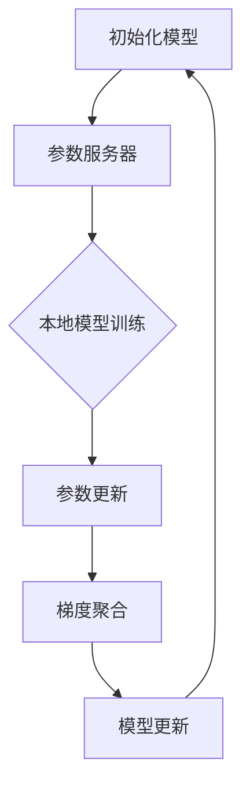
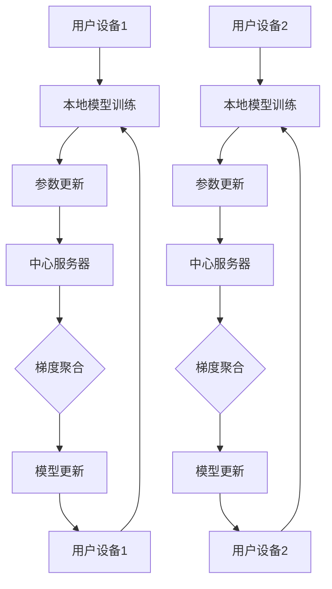
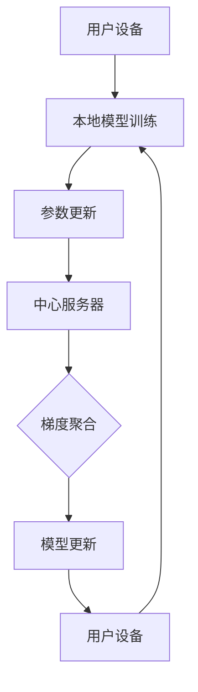
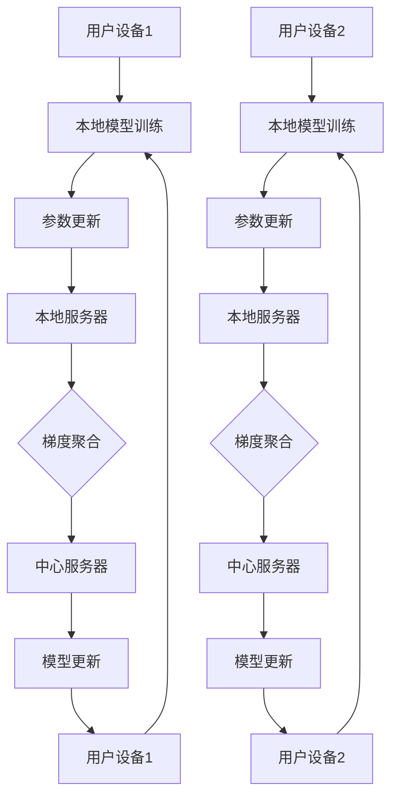
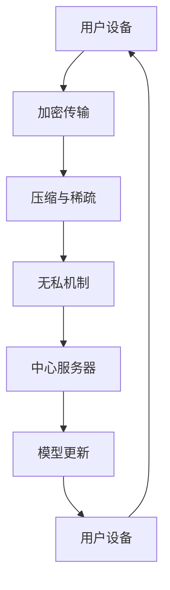
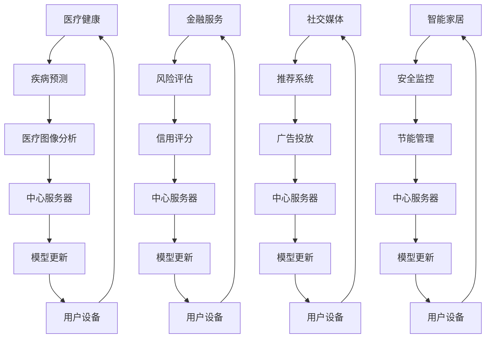

                 

### 文章标题

联邦学习基本原理与工作机制详解

### 关键词

联邦学习，隐私保护，分布式机器学习，模型更新，算法优化

### 摘要

本文详细介绍了联邦学习的基本原理、工作机制及其在实际应用中的重要性。首先，我们从概念与背景出发，探讨了联邦学习的定义、特点、起源与发展历程。接着，深入分析了联邦学习的核心概念与架构，包括用户设备、中心服务器、模型参数、梯度聚合等。随后，本文介绍了联邦学习的隐私保护机制，包括加密技术、隐私保护算法以及面临的挑战。接下来，文章探讨了联邦学习的算法原理、分布式算法、混合算法，并通过具体应用场景展示了其在医疗健康、金融服务、社交媒体和智能家居等领域的应用。此外，本文还介绍了联邦学习的优化与扩展技术，包括模型压缩、通信优化、安全性提升。最后，文章展望了联邦学习的未来发展趋势，包括与5G技术、人工智能的融合，以及跨领域与跨区域的联邦学习。本文旨在为读者提供一个全面、深入的联邦学习知识体系。

## 第一部分：联邦学习的理论基础

### 目录

1. [第1章：联邦学习的概念与背景](#第1章-联邦学习的概念与背景)
2. [第2章：联邦学习的核心概念与架构](#第2章-联邦学习的核心概念与架构)
3. [第3章：联邦学习中的隐私保护机制](#第3章-联邦学习中的隐私保护机制)

### 目录链接

- [第1章：联邦学习的概念与背景](#第1章-联邦学习的概念与背景)
- [第2章：联邦学习的核心概念与架构](#第2章-联邦学习的核心概念与架构)
- [第3章：联邦学习中的隐私保护机制](#第3章-联邦学习中的隐私保护机制)

## 第1章：联邦学习的概念与背景

### 1.1 联邦学习的定义与特点

#### 联邦学习的定义

联邦学习（Federated Learning）是一种分布式机器学习技术，旨在多个参与方（通常是用户设备或组织）之间共享学习模型，而不需要共享原始数据。这种技术的核心思想是将模型参数分散到各个参与方的设备上进行本地训练，然后通过聚合各个参与方返回的更新来更新全局模型。

#### 联邦学习的特点

- **数据隐私保护**：联邦学习通过将数据保留在本地设备上，避免了数据在传输过程中被窃取或滥用的风险，从而保护用户隐私。
- **低延迟和高效率**：联邦学习通过减少数据传输，降低了通信延迟，提高了学习效率。
- **灵活性**：联邦学习可以适应不同规模和结构的数据集，以及不同的计算资源。
- **可扩展性**：联邦学习能够轻松扩展到大量参与方，使其适用于大规模分布式环境。

### 1.2 联邦学习的起源与发展历程

#### 联邦学习的起源

联邦学习的概念最早可以追溯到2006年，当时Google的 researchers提出了分布式机器学习的概念。然而，联邦学习作为一种正式的研究领域，其起源通常被认为是在2016年，Google发布了TensorFlow Federated（TFF）框架，这标志着联邦学习开始引起学术界和工业界的关注。

#### 联邦学习的发展历程

- **2016年**：Google发布了TensorFlow Federated（TFF）框架，为联邦学习提供了实现基础。
- **2017年**：Facebook宣布了其联邦学习计划，并开源了PySyft框架。
- **2018年**：微软发布了其联邦学习框架Federated Learning Framework（FLF）。
- **2019年**：联邦学习在机器学习领域逐渐成熟，并开始应用于医疗、金融、社交媒体等领域。

### 1.3 联邦学习的重要性

#### 保护用户隐私

随着数据隐私法规（如GDPR、CCPA等）的日益严格，用户隐私保护变得越来越重要。联邦学习通过将数据保留在本地设备上，避免了数据泄露的风险，从而为用户隐私提供了强有力的保护。

#### 提高数据利用率

在许多应用场景中，数据分布在不同组织或个人之间。联邦学习允许这些组织或个人在不共享原始数据的情况下共同训练模型，从而提高了数据的利用率。

#### 简化数据传输

联邦学习通过将模型参数而不是原始数据进行传输，大大简化了数据传输过程。这降低了通信成本，提高了系统的整体性能。

#### Mermaid 流程图：联邦学习的核心流程



### 1.4 联邦学习的应用场景

联邦学习可以应用于多个领域，以下是其中几个典型的应用场景：

#### 医疗健康

联邦学习在医疗健康领域有广泛应用，包括疾病预测、医疗图像分析等。通过联邦学习，医生可以在保护患者隐私的前提下共享和利用医疗数据。

#### 金融服务

在金融服务领域，联邦学习可以帮助金融机构在遵守隐私保护法规的同时，进行风险评估、信用评分等业务。

#### 社交媒体

社交媒体平台可以利用联邦学习来构建个性化推荐系统、广告投放系统等，同时保护用户隐私。

#### 智能家居

联邦学习可以帮助智能家居系统实现安全监控、节能管理等功能，同时确保用户数据的安全。

#### 联邦学习应用场景Mermaid流程图



## 第2章：联邦学习的核心概念与架构

### 目录

1. [2.1 联邦学习的核心概念](#2.1-联邦学习的核心概念)
2. [2.2 联邦学习的基本架构](#2.2-联邦学习的基本架构)
3. [2.3 联邦学习的关键技术](#2.3-联邦学习的关键技术)
4. [2.4 联邦学习的应用场景](#2.4-联邦学习的应用场景)

### 目录链接

- [2.1 联邦学习的核心概念](#2.1-联邦学习的核心概念)
- [2.2 联邦学习的基本架构](#2.2-联邦学习的基本架构)
- [2.3 联邦学习的关键技术](#2.3-联邦学习的关键技术)
- [2.4 联邦学习的应用场景](#2.4-联邦学习的应用场景)

## 2.1 联邦学习的核心概念

### 用户设备

用户设备（User Devices）是联邦学习中的参与方，它们可以是智能手机、智能设备或其他计算设备。用户设备的主要作用是运行本地模型训练任务，并定期向中心服务器发送模型更新。

### 中心服务器

中心服务器（Central Server）是联邦学习架构中的核心组件，负责协调联邦学习过程。中心服务器的主要职责包括：

- **初始化模型**：中心服务器初始化全局模型，并将其分发给用户设备。
- **接收模型更新**：用户设备在本地训练模型后，将更新后的模型参数发送给中心服务器。
- **聚合梯度**：中心服务器接收来自用户设备的模型更新，并进行梯度聚合，以更新全局模型。
- **模型更新**：中心服务器根据聚合后的梯度更新全局模型。

### 模型参数

模型参数（Model Parameters）是机器学习模型的核心组成部分，它们决定了模型的行为和性能。在联邦学习中，模型参数在用户设备上进行本地训练，并通过中心服务器进行聚合和更新。

### 梯度聚合

梯度聚合（Gradient Aggregation）是联邦学习中的关键步骤，用于将用户设备返回的模型更新（通常是一组梯度）合并为一个全局更新。梯度聚合的目的是减少各用户设备之间的差异，提高全局模型的性能。

#### Mermaid 流程图：联邦学习核心概念



## 2.2 联邦学习的基本架构

### 单层联邦学习架构

单层联邦学习架构（Single-Layer Federated Learning Architecture）是最简单的联邦学习架构，它由用户设备、中心服务器和全局模型组成。在单层架构中，用户设备直接与中心服务器进行通信，无需通过其他中间组件。

### 多层联邦学习架构

多层联邦学习架构（Multi-Layer Federated Learning Architecture）在单层架构的基础上引入了本地服务器，从而提高了系统的可扩展性和容错性。在多层架构中，用户设备首先与本地服务器进行通信，本地服务器再与中心服务器进行通信。

### 联邦学习基本架构对比

- **单层架构**：简单、易于实现，但可扩展性较低。
- **多层架构**：可扩展性更高，但实现更为复杂。

#### Mermaid 流程图：多层联邦学习架构



## 2.3 联邦学习的关键技术

### 加密技术

加密技术是联邦学习中保护数据隐私的关键技术。通过加密，用户设备可以安全地传输模型更新和梯度信息，确保数据在传输过程中的安全性。

### 压缩与稀疏技术

压缩与稀疏技术用于减少模型更新和梯度信息的传输量，从而降低通信成本。通过压缩技术，可以减少数据传输的大小；通过稀疏技术，可以降低数据传输的频率。

### 无私机制

无私机制（Privacy-Preserving Mechanism）是一种用于保护模型更新和梯度信息隐私的技术。通过无私机制，可以确保参与方在本地训练和更新模型时，不会泄露敏感信息。

### 联邦学习关键技术对比

- **加密技术**：保护数据传输的安全性。
- **压缩与稀疏技术**：减少数据传输量和频率。
- **无私机制**：保护模型更新和梯度信息的隐私。

#### Mermaid 流程图：联邦学习关键技术



## 2.4 联邦学习的应用场景

### 医疗健康

联邦学习在医疗健康领域有广泛应用，包括疾病预测、医疗图像分析等。通过联邦学习，医生可以在保护患者隐私的前提下共享和利用医疗数据。

### 金融服务

在金融服务领域，联邦学习可以帮助金融机构在遵守隐私保护法规的同时，进行风险评估、信用评分等业务。

### 社交媒体

社交媒体平台可以利用联邦学习来构建个性化推荐系统、广告投放系统等，同时保护用户隐私。

### 智能家居

联邦学习可以帮助智能家居系统实现安全监控、节能管理等功能，同时确保用户数据的安全。

### 联邦学习应用场景Mermaid流程图



## 第3章：联邦学习中的隐私保护机制

### 目录

1. [3.1 隐私保护的需求](#3.1-隐私保护的需求)
2. [3.2 加密技术在联邦学习中的应用](#3.2-加密技术在联邦学习中的应用)
3. [3.3 隐私保护算法的设计与实现](#3.3-隐私保护算法的设计与实现)
4. [3.4 隐私保护的挑战与未来趋势](#3.4-隐私保护的挑战与未来趋势)

### 目录链接

- [3.1 隐私保护的需求](#3.1-隐私保护的需求)
- [3.2 加密技术在联邦学习中的应用](#3.2-加密技术在联邦学习中的应用)
- [3.3 隐私保护算法的设计与实现](#3.3-隐私保护算法的设计与实现)
- [3.4 隐私保护的挑战与未来趋势](#3.4-隐私保护的挑战与未来趋势)

### 3.1 隐私保护的需求

#### 用户隐私保护的必要性

随着互联网和大数据技术的发展，用户隐私保护变得愈发重要。联邦学习作为一种分布式机器学习技术，能够在数据隐私保护方面发挥重要作用。以下是用户隐私保护的必要性：

- **数据泄露风险**：在传统的集中式机器学习模型中，数据通常需要在中心服务器上进行训练，这可能导致数据泄露的风险。
- **隐私保护法规**：许多国家和地区制定了严格的隐私保护法规，如欧盟的通用数据保护条例（GDPR）和美国的加州消费者隐私法案（CCPA）。企业必须遵守这些法规，否则可能面临巨额罚款。
- **用户信任**：用户对数据隐私的关注日益增加，如果企业无法保护用户隐私，可能会失去用户的信任，影响业务发展。

#### 隐私保护的法律和伦理问题

隐私保护不仅是一个技术问题，也是一个法律和伦理问题。以下是隐私保护涉及的法律和伦理问题：

- **数据所有权**：用户对自己提供的数据是否拥有所有权，以及企业是否有权使用这些数据？
- **数据共享**：在联邦学习中，不同组织或个人之间的数据如何共享，以及如何确保共享过程中的隐私保护？
- **透明度**：用户是否知道自己的数据被用于何种目的，以及数据是如何被处理的？
- **算法偏见**：联邦学习算法可能引入偏见，导致对特定群体不公平。如何确保算法的公平性和透明性？

#### 联邦学习的隐私保护优势

联邦学习通过将数据处理分散在各个参与方，能够在一定程度上解决传统集中式机器学习模型面临的隐私保护问题。以下是联邦学习的隐私保护优势：

- **数据本地化**：联邦学习将数据保留在本地设备上，减少了数据在传输过程中被窃取或滥用的风险。
- **加密传输**：联邦学习使用加密技术对数据进行传输，确保数据在传输过程中的安全性。
- **隐私保护算法**：联邦学习采用隐私保护算法，如差分隐私、安全多方计算等，确保模型训练过程中的隐私保护。

### 3.2 加密技术在联邦学习中的应用

#### 安全多方计算

安全多方计算（Secure Multi-Party Computation，SMPC）是一种加密技术，允许多个参与方在不泄露各自数据的情况下共同计算。在联邦学习中，安全多方计算可以用于以下场景：

- **模型训练**：参与方可以在不共享原始数据的情况下，共同训练模型。例如，使用SMPC实现联邦学习中的梯度聚合。
- **隐私保护通信**：参与方可以通过SMPC进行加密通信，确保通信过程中的隐私保护。

#### 同态加密

同态加密（Homomorphic Encryption）是一种加密技术，允许在加密数据上进行计算，结果仍然是加密的。在联邦学习中，同态加密可以用于以下场景：

- **本地计算**：参与方可以在本地设备上对加密数据进行计算，而不需要解密数据。
- **模型更新**：参与方可以将加密的模型更新发送给中心服务器，确保模型更新过程中的隐私保护。

### 3.3 隐私保护算法的设计与实现

#### 隐私保护通信协议

隐私保护通信协议是一种用于保护联邦学习过程中通信安全的机制。常见的隐私保护通信协议包括：

- **安全多方计算协议**：如RSA、PAKE等，用于实现参与方之间的安全通信。
- **加密通信协议**：如SSL/TLS等，用于确保通信数据的安全性。

#### 隐私保护机器学习算法

隐私保护机器学习算法是一种在保证模型性能的同时，提供隐私保护的算法。常见的隐私保护机器学习算法包括：

- **差分隐私**：通过在输出数据上引入噪声，确保单个数据点的隐私保护。
- **安全多方计算**：通过安全多方计算，实现参与方之间的隐私保护。
- **同态加密**：通过同态加密，实现加密数据上的计算。

#### 联邦学习中的隐私保护算法示例

以下是一个简单的联邦学习隐私保护算法示例，使用差分隐私技术：

```python
import tensorflow as tf

def differential_privacy fenced_learning(model, dataset, privacy预算, learning_rate):
    for epoch in range(num_epochs):
        for sample in dataset:
            # 计算梯度
            gradient = compute_gradient(model, sample)
            # 应用差分隐私
            noise = tf.random.normal(shape=gradient.shape, mean=0, stddev=privacy预算)
            gradient = gradient + noise
            # 更新模型
            model = update_model(model, gradient, learning_rate)
    return model
```

### 3.4 隐私保护的挑战与未来趋势

#### 安全性与性能的平衡

在联邦学习中，安全性与性能之间往往存在冲突。如何在保证模型性能的同时，提供足够的隐私保护是一个重要挑战。未来的研究需要找到一种平衡安全性与性能的方法。

#### 新隐私保护技术的探索

随着技术的发展，新的隐私保护技术不断涌现。例如，基于量子计算的隐私保护技术、区块链技术的隐私保护等。未来的研究需要探索这些新技术的应用潜力，以提供更强大的隐私保护机制。

#### 跨学科的安全研究

隐私保护是一个跨学科问题，需要结合密码学、网络安全、机器学习等多个领域的知识。未来的研究需要加强跨学科合作，推动隐私保护技术的发展。

### 3.5 联邦学习的安全性评估

#### 模型泄露风险

在联邦学习中，模型泄露风险是一个重要问题。模型泄露可能导致恶意参与者通过分析模型参数来获取敏感信息。以下是一些常见的模型泄露风险：

- **梯度泄露**：在联邦学习中，梯度信息是模型更新过程中的关键数据。如果梯度泄露，恶意参与者可以通过分析梯度信息来推断模型参数。
- **模型参数泄露**：模型参数泄露可能导致恶意参与者获取完整的模型，从而推断出敏感数据。

#### 通信安全漏洞

在联邦学习中，通信过程中可能存在安全漏洞。以下是一些常见的通信安全漏洞：

- **中间人攻击**：恶意参与者可以在通信过程中截获和篡改数据。
- **数据篡改**：恶意参与者可以篡改模型更新，从而影响模型性能。

#### 安全联邦学习的解决方案

以下是一些常见的安全联邦学习解决方案：

- **安全多方计算**：通过安全多方计算，实现参与方之间的安全通信和数据共享。
- **加密通信**：通过加密通信，确保通信数据的安全性。
- **隐私保护算法**：通过隐私保护算法，如差分隐私、安全多方计算等，提供模型更新和梯度信息的隐私保护。

#### 联邦学习与区块链技术的结合

区块链技术可以提供一种去中心化的数据存储和传输机制，从而增强联邦学习的安全性。以下是一些联邦学习与区块链技术的结合方案：

- **区块链作为通信协议**：使用区块链作为联邦学习中的通信协议，确保通信数据的安全性和完整性。
- **区块链作为数据存储**：使用区块链存储模型参数和梯度信息，确保数据的安全性和隐私保护。
- **区块链作为隐私证明**：使用区块链记录联邦学习过程中的隐私保护措施，确保透明性和可追溯性。

### 3.6 未来安全联邦学习的发展趋势

#### 基于AI的安全联邦学习

未来的安全联邦学习将更加依赖人工智能技术。例如，利用深度学习算法对联邦学习过程中的安全威胁进行检测和防御。以下是一些基于AI的安全联邦学习方向：

- **安全威胁检测**：利用深度学习算法，检测联邦学习过程中的恶意行为。
- **异常行为检测**：利用深度学习算法，检测联邦学习过程中的异常行为，如数据篡改、模型泄露等。
- **安全模型训练**：利用深度学习算法，训练安全联邦学习模型，提高模型的安全性和鲁棒性。

#### 跨学科的安全研究

未来的安全联邦学习将更加依赖跨学科的研究。例如，结合密码学、网络安全、机器学习等领域的知识，推动安全联邦学习技术的发展。以下是一些跨学科的安全研究方向：

- **密码学与联邦学习结合**：研究如何将密码学技术应用于联邦学习，提高系统的安全性和隐私保护。
- **网络安全与联邦学习结合**：研究如何将网络安全技术应用于联邦学习，提高系统的安全性和鲁棒性。
- **机器学习与联邦学习结合**：研究如何将机器学习技术应用于联邦学习，提高系统的安全性和性能。

### 结论

联邦学习作为一种分布式机器学习技术，在保护用户隐私、提高数据利用率和简化数据传输方面具有显著优势。然而，联邦学习在安全性方面仍然面临挑战，需要进一步研究和探索。未来，基于AI的安全联邦学习和跨学科的安全研究将有望推动联邦学习技术的发展。

## 第4章：联邦学习的算法原理

### 目录

1. [4.1 联邦学习的优化目标](#4.1-联邦学习的优化目标)
2. [4.2 联邦学习的基本算法](#4.2-联邦学习的基本算法)
3. [4.3 联邦学习中的分布式算法](#4.3-联邦学习中的分布式算法)
4. [4.4 联邦学习中的混合算法](#4.4-联邦学习中的混合算法)

### 目录链接

- [4.1 联邦学习的优化目标](#4.1-联邦学习的优化目标)
- [4.2 联邦学习的基本算法](#4.2-联邦学习的基本算法)
- [4.3 联邦学习中的分布式算法](#4.3-联邦学习中的分布式算法)
- [4.4 联邦学习中的混合算法](#4.4-联邦学习中的混合算法)

### 4.1 联邦学习的优化目标

#### 模型精度

联邦学习的优化目标之一是提高模型精度。在联邦学习中，各个参与方在本地训练模型，并通过中心服务器进行模型更新。为了提高模型精度，需要优化以下方面：

- **模型参数更新**：通过优化模型参数更新策略，如梯度下降法、随机梯度下降法等，提高模型训练效果。
- **梯度聚合**：通过优化梯度聚合方法，如联邦平均法、梯度压缩法等，提高模型收敛速度和精度。
- **数据分布**：通过优化数据分布，如选择代表性更强的数据集、调整数据比例等，提高模型泛化能力。

#### 通信效率

联邦学习的另一个优化目标是提高通信效率。由于联邦学习涉及到多个参与方，通信开销是影响系统性能的重要因素。为了提高通信效率，需要优化以下方面：

- **模型参数传输**：通过压缩模型参数，减少传输数据量。
- **数据传输策略**：通过优化数据传输策略，如异步传输、多线程传输等，提高数据传输速度。
- **通信协议**：通过优化通信协议，如加密传输、安全多方计算等，提高通信安全性。

#### 安全性

在联邦学习中，安全性也是重要的优化目标。由于联邦学习涉及到多个参与方，系统安全性至关重要。为了提高安全性，需要优化以下方面：

- **隐私保护**：通过使用加密技术和隐私保护算法，如差分隐私、安全多方计算等，保护模型更新和梯度信息的隐私。
- **恶意行为检测**：通过使用异常检测和入侵检测技术，识别和阻止恶意行为。
- **系统完整性**：通过使用完整性检查和验证技术，确保模型更新和通信数据的完整性。

### 4.2 联邦学习的基本算法

#### 梯度下降法

梯度下降法（Gradient Descent）是一种基本的优化算法，用于最小化损失函数。在联邦学习中，梯度下降法用于更新模型参数。

**伪代码：**

```python
def gradient_descent(model, dataset, learning_rate, num_epochs):
    for epoch in range(num_epochs):
        for sample in dataset:
            gradient = compute_gradient(model, sample)
            model = update_model(model, gradient, learning_rate)
    return model
```

#### 随机梯度下降法

随机梯度下降法（Stochastic Gradient Descent，SGD）是对梯度下降法的改进，每次迭代仅使用一个样本计算梯度。

**伪代码：**

```python
def stochastic_gradient_descent(model, dataset, learning_rate, num_epochs):
    for epoch in range(num_epochs):
        shuffled_dataset = shuffle(dataset)
        for sample in shuffled_dataset:
            gradient = compute_gradient(model, sample)
            model = update_model(model, gradient, learning_rate)
    return model
```

#### 阿尔法梯度下降法

阿尔法梯度下降法（Adam Gradient Descent，Adam）是一种改进的梯度下降法，引入了自适应学习率。

**伪代码：**

```python
def adam_gradient_descent(model, dataset, learning_rate, num_epochs):
    beta1 = 0.9
    beta2 = 0.999
    epsilon = 1e-8

    m = 0
    v = 0

    for epoch in range(num_epochs):
        shuffled_dataset = shuffle(dataset)
        for sample in shuffled_dataset:
            gradient = compute_gradient(model, sample)
            m = beta1 * m + (1 - beta1) * gradient
            v = beta2 * v + (1 - beta2) * gradient ** 2

            m_hat = m / (1 - beta1 ** epoch)
            v_hat = v / (1 - beta2 ** epoch)

            model = update_model(model, learning_rate * m_hat / (sqrt(v_hat) + epsilon))
    return model
```

### 4.3 联邦学习中的分布式算法

#### 参数服务器架构

参数服务器架构（Parameter Server Architecture）是一种分布式算法，用于在多个参与方之间共享模型参数。

**伪代码：**

```python
def federated_learning(model, dataset, learning_rate, num_epochs):
    for epoch in range(num_epochs):
        for user in users:
            user_model = local_learning(model, user.dataset, learning_rate)
            user.update_model(user_model)
            user_gradient = compute_gradient(user_model, user.dataset)
            server.receive_gradient(user_gradient)
        server.aggregate_gradients()
        server.update_model()
    return server.model
```

#### 全局同步算法

全局同步算法（Global Synchronization Algorithm）是一种分布式算法，通过同步全局模型参数来更新模型。

**伪代码：**

```python
def global_sync_algorithm(model, dataset, learning_rate, num_epochs):
    for epoch in range(num_epochs):
        for user in users:
            user_model = local_learning(model, user.dataset, learning_rate)
            user.update_model(user_model)
            user_gradient = compute_gradient(user_model, user.dataset)
            server.receive_gradient(user_gradient)
        server.aggregate_gradients()
        server.update_model()
        server.broadcast_model_to_users()
    return server.model
```

#### 全局异步算法

全局异步算法（Global Asynchronous Algorithm）是一种分布式算法，各个参与方异步更新模型参数。

**伪代码：**

```python
def global_async_algorithm(model, dataset, learning_rate, num_epochs):
    for epoch in range(num_epochs):
        for user in users:
            user_model = local_learning(model, user.dataset, learning_rate)
            user.update_model(user_model)
            user_gradient = compute_gradient(user_model, user.dataset)
            server.receive_gradient(user_gradient)
        server.aggregate_gradients()
        server.update_model()
    return server.model
```

### 4.4 联邦学习中的混合算法

#### 混合联邦学习算法

混合联邦学习算法（Hybrid Federated Learning Algorithm）结合了不同算法的优势，以提高模型性能和通信效率。

**伪代码：**

```python
def hybrid_federated_learning(model, dataset, learning_rate, num_epochs, strategy):
    if strategy == 'sync':
        for epoch in range(num_epochs):
            for user in users:
                user_model = local_learning(model, user.dataset, learning_rate)
                user.update_model(user_model)
                user_gradient = compute_gradient(user_model, user.dataset)
                server.receive_gradient(user_gradient)
            server.aggregate_gradients()
            server.update_model()
            server.broadcast_model_to_users()
    elif strategy == 'async':
        for epoch in range(num_epochs):
            for user in users:
                user_model = local_learning(model, user.dataset, learning_rate)
                user.update_model(user_model)
                user_gradient = compute_gradient(user_model, user.dataset)
                server.receive_gradient(user_gradient)
            server.aggregate_gradients()
            server.update_model()
    model = server.model
    return model
```

## 第5章：联邦学习的应用场景与实践

### 目录

1. [5.1 医疗健康领域的应用](#5.1-医疗健康领域的应用)
2. [5.2 金融服务领域的应用](#5.2-金融服务领域的应用)
3. [5.3 社交媒体领域的应用](#5.3-社交媒体领域的应用)
4. [5.4 智能家居领域的应用](#5.4-智能家居领域的应用)

### 目录链接

- [5.1 医疗健康领域的应用](#5.1-医疗健康领域的应用)
- [5.2 金融服务领域的应用](#5.2-金融服务领域的应用)
- [5.3 社交媒体领域的应用](#5.3-社交媒体领域的应用)
- [5.4 智能家居领域的应用](#5.4-智能家居领域的应用)

### 5.1 医疗健康领域的应用

联邦学习在医疗健康领域有着广泛的应用，特别是在需要保护患者隐私的同时共享和利用医疗数据的情况下。以下是一些具体的医疗健康应用场景：

#### 医疗图像分析

医疗图像分析是联邦学习在医疗健康领域的一个重要应用。通过联邦学习，医院和诊所可以在不共享患者隐私数据的情况下共同训练和优化图像识别模型，如肿瘤检测、骨折诊断等。

- **应用案例**：Google的研究团队利用联邦学习开发了一个用于肺癌检测的模型，通过多个医疗机构的合作，提高了检测的准确率，同时保护了患者的隐私。

#### 疾病预测

联邦学习还可以用于疾病预测，如流感预测、心血管疾病预测等。通过联邦学习，各个医疗机构可以在保护患者隐私的前提下共享和利用病患数据，从而提高疾病预测的准确性和效率。

- **应用案例**：密歇根大学的研究人员使用联邦学习技术来预测流感爆发，通过整合多个医疗机构的流感监测数据，实现了更准确的预测结果。

### 5.2 金融服务领域的应用

联邦学习在金融服务领域也有重要的应用，特别是在需要保护客户隐私和遵守监管要求的情况下。

#### 风险评估

风险评估是金融行业的关键环节，联邦学习可以帮助金融机构在不共享客户数据的情况下进行风险评估。

- **应用案例**：金融机构可以使用联邦学习技术来评估贷款申请者的信用风险，通过分析多个金融机构的客户数据，提高了风险评估的准确性。

#### 信用评分

信用评分是金融机构的重要业务之一，联邦学习可以帮助金融机构在不共享客户数据的情况下进行信用评分。

- **应用案例**：一些金融机构已经开始使用联邦学习技术来评估客户的信用评分，通过整合不同金融机构的数据，提高了信用评分的准确性和公平性。

### 5.3 社交媒体领域的应用

社交媒体平台可以利用联邦学习来构建个性化推荐系统和广告投放系统，同时保护用户隐私。

#### 推荐系统

推荐系统是社交媒体平台的重要功能，联邦学习可以帮助平台在不共享用户数据的情况下实现个性化推荐。

- **应用案例**：Facebook使用联邦学习技术来构建个性化推荐系统，通过分析用户在社交媒体上的行为和互动，提高了推荐的质量和用户的满意度。

#### 广告投放

广告投放是社交媒体平台的另一个重要收入来源，联邦学习可以帮助平台在不共享用户数据的情况下实现精准的广告投放。

- **应用案例**：一些社交媒体平台已经开始使用联邦学习技术来优化广告投放，通过分析用户行为和偏好，提高了广告的点击率和转化率。

### 5.4 智能家居领域的应用

联邦学习在智能家居领域也有着广泛的应用，特别是在需要保护用户隐私和提供个性化服务的情况下。

#### 安全监控

安全监控是智能家居系统的一个重要功能，联邦学习可以帮助系统在不共享用户数据的情况下实现智能监控。

- **应用案例**：一些智能家居制造商使用联邦学习技术来开发智能监控系统，通过分析家庭环境和用户行为，提高了系统的安全性和响应速度。

#### 节能管理

节能管理是智能家居系统的另一个重要功能，联邦学习可以帮助系统在不共享用户数据的情况下实现智能节能。

- **应用案例**：一些智能家居制造商使用联邦学习技术来开发智能节能系统，通过分析家庭能源使用数据，提高了能源利用效率。

## 第6章：联邦学习的优化与扩展

### 目录

1. [6.1 联邦学习的模型压缩](#6.1-联邦学习的模型压缩)
2. [6.2 联邦学习的通信优化](#6.2-联邦学习的通信优化)
3. [6.3 联邦学习的安全性提升](#6.3-联邦学习的安全性提升)
4. [6.4 联邦学习的混合学习策略](#6.4-联邦学习的混合学习策略)

### 目录链接

- [6.1 联邦学习的模型压缩](#6.1-联邦学习的模型压缩)
- [6.2 联邦学习的通信优化](#6.2-联邦学习的通信优化)
- [6.3 联邦学习的安全性提升](#6.3-联邦学习的安全性提升)
- [6.4 联邦学习的混合学习策略](#6.4-联邦学习的混合学习策略)

### 6.1 联邦学习的模型压缩

联邦学习的模型压缩（Federated Learning Model Compression）是一种优化技术，旨在减少模型的大小和计算开销。模型压缩在联邦学习中有重要意义，因为：

- **减少通信带宽**：通过压缩模型，可以减少模型参数在参与方之间传输所需的数据量，从而降低通信带宽需求。
- **提高计算效率**：压缩模型可以减少参与方在本地训练模型时所需的计算资源，提高系统的整体性能。

#### 网络剪枝

网络剪枝（Network Pruning）是一种常见的模型压缩技术，通过去除模型中不重要的神经元和连接，减少模型参数数量。

**伪代码：**

```python
def network_pruning(model, pruning_rate):
    for layer in model.layers:
        for connection in layer.connections:
            if random.random() < pruning_rate:
                connection.enabled = False
    return model
```

#### 模型量化

模型量化（Model Quantization）是一种通过将浮点数参数转换为整数参数来减少模型大小的技术。量化后的模型在计算时使用更少的内存和带宽。

**伪代码：**

```python
def model_quantization(model, bits):
    for layer in model.layers:
        for weight in layer.weights:
            weight量化 = convert_to_quantized(value=weight, bits=bits)
            weight.assign(量化)
    return model
```

### 6.2 联邦学习的通信优化

联邦学习的通信优化（Federated Learning Communication Optimization）是一种旨在提高通信效率的优化技术。通信优化在联邦学习中有重要意义，因为：

- **减少通信延迟**：通过优化通信策略，可以减少模型参数在参与方之间传输所需的时间。
- **提高系统性能**：优化通信可以提高联邦学习的整体性能和效率。

#### 梯度压缩

梯度压缩（Gradient Compression）是一种通过减少梯度传输量来降低通信带宽的技术。梯度压缩可以通过对梯度进行压缩和稀疏表示来实现。

**伪代码：**

```python
def gradient_compression(gradient, compression_rate):
    compressed_gradient = compress(gradient, compression_rate)
    return compressed_gradient
```

#### 数据流传输优化

数据流传输优化（Data Flow Transmission Optimization）是一种通过优化数据传输路径和传输策略来提高传输效率的技术。数据流传输优化可以通过多线程传输、批量传输等策略来实现。

**伪代码：**

```python
def data_flow_transmission_optimization(data, thread_count):
    threads = []
    for i in range(thread_count):
        thread = Thread(target=send_data, args=(data[i::thread_count],))
        threads.append(thread)
        thread.start()
    for thread in threads:
        thread.join()
    return
```

### 6.3 联邦学习的安全性提升

联邦学习的安全性提升（Federated Learning Security Enhancement）是一种旨在提高联邦学习系统安全性的优化技术。安全性提升在联邦学习中有重要意义，因为：

- **保护隐私**：通过提升安全性，可以确保参与方的数据和模型参数不被泄露。
- **防止恶意攻击**：通过提升安全性，可以防止恶意参与者对联邦学习系统的攻击。

#### 量子计算加密

量子计算加密（Quantum Computing Encryption）是一种利用量子计算的优势来实现更强加密技术的方法。量子计算加密可以在保证隐私保护的同时提高通信效率。

**伪代码：**

```python
def quantum_computing_encryption(data):
    quantum_key = generate_quantum_key()
    encrypted_data = quantum_encrypt(data, quantum_key)
    return encrypted_data
```

#### 无线通信安全

无线通信安全（Wireless Communication Security）是一种通过优化无线通信协议和加密算法来提高通信安全性的技术。无线通信安全可以防止无线通信过程中的数据泄露和篡改。

**伪代码：**

```python
def wireless_communication_security(data):
    encrypted_data = encrypt_data(data, encryption_key)
    transmitted_data = send_data_over_wireless_channel(encrypted_data)
    decrypted_data = decrypt_data(transmitted_data, encryption_key)
    return decrypted_data
```

### 6.4 联邦学习的混合学习策略

联邦学习的混合学习策略（Hybrid Learning Strategy in Federated Learning）是一种将不同算法和优化方法进行融合的技术，旨在提高联邦学习的性能和效率。混合学习策略在联邦学习中有重要意义，因为：

- **平衡性能和效率**：通过融合不同的算法和优化方法，可以在性能和效率之间找到最佳平衡点。
- **适应不同场景**：混合学习策略可以根据不同场景的需求，动态调整算法和优化方法。

#### 混合联邦学习算法

以下是一种简单的混合联邦学习算法，结合了梯度下降法和异步通信策略：

**伪代码：**

```python
def hybrid_federated_learning(model, users, server, learning_rate, strategy):
    if strategy == 'sync':
        for epoch in range(num_epochs):
            for user in users:
                user_model = local_learning(model, user.dataset, learning_rate)
                user.update_model(user_model)
                user_gradient = compute_gradient(user_model, user.dataset)
                server.receive_gradient(user_gradient)
            server.aggregate_gradients()
            server.update_model()
            server.broadcast_model_to_users()
    elif strategy == 'async':
        for epoch in range(num_epochs):
            for user in users:
                user_model = local_learning(model, user.dataset, learning_rate)
                user.update_model(user_model)
                user_gradient = compute_gradient(user_model, user.dataset)
                server.receive_gradient(user_gradient)
            server.aggregate_gradients()
            server.update_model()
    model = server.model
    return model
```

## 第7章：联邦学习的安全与隐私保护

### 目录

1. [7.1 联邦学习的安全挑战](#7.1-联邦学习的安全挑战)
2. [7.2 安全联邦学习的解决方案](#7.2-安全联邦学习的解决方案)
3. [7.3 未来安全联邦学习的发展方向](#7.3-未来安全联邦学习的发展方向)

### 目录链接

- [7.1 联邦学习的安全挑战](#7.1-联邦学习的安全挑战)
- [7.2 安全联邦学习的解决方案](#7.2-安全联邦学习的解决方案)
- [7.3 未来安全联邦学习的发展方向](#7.3-未来安全联邦学习的发展方向)

### 7.1 联邦学习的安全挑战

#### 模型泄露风险

联邦学习过程中，模型泄露风险是一个主要的安全挑战。由于模型参数和梯度信息在参与方之间传输，攻击者可能通过恶意攻击或数据泄露，获取敏感信息。以下是一些常见的模型泄露风险：

- **梯度泄露**：攻击者通过分析梯度信息，可以推断出模型参数，从而推断出训练数据。
- **模型参数泄露**：攻击者通过获取模型参数，可以直接获取训练数据。
- **通信泄露**：攻击者通过窃取通信数据，可以获取模型更新和梯度信息。

#### 通信安全漏洞

联邦学习中的通信安全漏洞也是一个重要问题。由于联邦学习涉及到多个参与方，通信过程中可能存在安全隐患。以下是一些常见的通信安全漏洞：

- **中间人攻击**：攻击者通过截获通信数据，可以窃取或篡改敏感信息。
- **数据篡改**：攻击者可以通过篡改通信数据，影响模型更新和性能。
- **恶意节点攻击**：恶意节点可以通过伪造梯度信息，影响模型更新和全局性能。

### 7.2 安全联邦学习的解决方案

为了解决联邦学习中的安全挑战，研究者们提出了一系列安全联邦学习解决方案。以下是一些常见的解决方案：

#### 加密技术

加密技术是联邦学习中保护数据隐私的关键技术。通过加密，可以将模型参数和梯度信息转换为无法直接理解的密文，从而保护数据在传输过程中的安全性。以下是一些常用的加密技术：

- **同态加密**：同态加密允许在加密数据上进行计算，结果仍然是加密的。这种加密技术可以保护模型更新和梯度信息的隐私。
- **安全多方计算**：安全多方计算允许多个参与方在不泄露各自数据的情况下，共同计算结果。这种计算技术可以保护数据在计算过程中的隐私。
- **混合加密**：混合加密结合了多种加密技术，如同态加密和公钥加密，以提高数据的安全性。

#### 零知识证明

零知识证明（Zero-Knowledge Proof）是一种证明系统，允许参与方在不泄露隐私信息的情况下，证明某个命题。在联邦学习中，零知识证明可以用于验证参与方的数据真实性和合法性，从而提高系统的安全性。以下是一些常用的零知识证明技术：

- **零知识证明系统**：如Pedersen承诺、Blakley证明等，可以用于验证参与方的数据。
- **环签名**：环签名可以用于保护参与方的身份，防止恶意行为。

#### 区块链技术

区块链技术可以提供一种去中心化的数据存储和传输机制，从而增强联邦学习的安全性。以下是一些区块链技术在联邦学习中的应用：

- **区块链作为通信协议**：区块链可以提供一种安全的数据传输协议，确保通信数据的完整性和可靠性。
- **区块链作为数据存储**：区块链可以用于存储模型参数和梯度信息，确保数据的安全性和不可篡改性。
- **区块链作为隐私证明**：区块链可以记录联邦学习过程中的隐私保护措施，确保透明性和可追溯性。

#### 安全联邦学习框架

为了提高联邦学习的安全性，研究者们提出了一系列安全联邦学习框架。以下是一些常用的安全联邦学习框架：

- **安全联邦学习框架FLIF**：FLIF是一种基于区块链的安全联邦学习框架，可以保护模型更新和梯度信息的隐私。
- **安全联邦学习框架FedCrypto**：FedCrypto是一种基于加密技术的安全联邦学习框架，可以保护模型更新和梯度信息的隐私。
- **安全联邦学习框架FedPact**：FedPact是一种基于多方计算的安全联邦学习框架，可以保护模型更新和梯度信息的隐私。

### 7.3 未来安全联邦学习的发展方向

未来安全联邦学习的发展方向将主要集中在以下几个方面：

#### 基于AI的安全联邦学习

随着人工智能技术的发展，基于AI的安全联邦学习将成为一个重要方向。以下是一些基于AI的安全联邦学习方向：

- **安全威胁检测**：利用机器学习算法，检测联邦学习过程中的安全威胁，如数据泄露、恶意节点等。
- **异常行为检测**：利用机器学习算法，检测联邦学习过程中的异常行为，如数据篡改、恶意攻击等。
- **安全模型训练**：利用机器学习算法，训练安全联邦学习模型，提高模型的安全性和鲁棒性。

#### 跨学科的安全研究

跨学科的安全研究将是未来安全联邦学习的重要方向。以下是一些跨学科的安全研究方向：

- **密码学与联邦学习结合**：结合密码学和联邦学习，开发更安全、更高效的联邦学习算法。
- **网络安全与联邦学习结合**：结合网络安全和联邦学习，提高联邦学习系统的整体安全性。
- **机器学习与联邦学习结合**：结合机器学习和联邦学习，提高联邦学习模型的性能和鲁棒性。

#### 新技术的应用

随着新技术的不断发展，未来安全联邦学习将更多地应用新技术，如区块链、量子计算等。以下是一些新技术在安全联邦学习中的应用方向：

- **区块链技术**：利用区块链技术，提高联邦学习系统的安全性和透明性。
- **量子计算技术**：利用量子计算技术，开发更安全、更高效的加密算法和联邦学习算法。
- **分布式存储技术**：利用分布式存储技术，提高联邦学习系统的可靠性和可扩展性。

### 结论

联邦学习作为一种分布式机器学习技术，在保护用户隐私、提高数据利用率、简化数据传输等方面具有显著优势。然而，联邦学习在安全性方面仍然面临挑战，需要进一步研究和探索。未来，基于AI的安全联邦学习和跨学科的安全研究将有望推动联邦学习技术的发展。

## 第8章：联邦学习的未来与发展趋势

### 目录

1. [8.1 联邦学习与5G技术的融合](#8.1-联邦学习与5g技术的融合)
2. [8.2 联邦学习与人工智能的协同发展](#8.2-联邦学习与人工智能的协同发展)
3. [8.3 跨领域与跨区域的联邦学习](#8.3-跨领域与跨区域的联邦学习)
4. [8.4 联邦学习的开源生态建设](#8.4-联邦学习的开源生态建设)

### 目录链接

- [8.1 联邦学习与5G技术的融合](#8.1-联邦学习与5g技术的融合)
- [8.2 联邦学习与人工智能的协同发展](#8.2-联邦学习与人工智能的协同发展)
- [8.3 跨领域与跨区域的联邦学习](#8.3-跨领域与跨区域的联邦学习)
- [8.4 联邦学习的开源生态建设](#8.4-联邦学习的开源生态建设)

### 8.1 联邦学习与5G技术的融合

#### 5G技术的优势

5G技术作为下一代通信技术，具有低延迟、高带宽和大规模连接能力的特点。这些优势为联邦学习的应用提供了有力支持。

- **低延迟**：5G技术的低延迟特性使得联邦学习中的模型更新和通信更加实时，提高了系统的响应速度和用户体验。
- **高带宽**：5G技术的高带宽特性能够支持大量数据的传输，使得联邦学习可以在更大规模的数据集上进行训练和优化。
- **大规模连接能力**：5G技术能够连接更多的设备，使得联邦学习可以应用于更多的应用场景，如智能家居、智能城市等。

#### 联邦学习与5G技术的融合优势

- **实时通信**：5G技术能够实现更快速的数据传输，使得联邦学习中的模型更新和通信更加实时，提高了系统的响应速度。
- **高效数据传输**：5G技术的高带宽特性使得联邦学习可以在更大规模的数据集上进行训练和优化，提高了系统的性能和效率。
- **灵活部署**：5G技术的低延迟和大规模连接能力使得联邦学习可以在不同的设备和场景下进行部署，提高了系统的灵活性和可扩展性。

### 8.2 联邦学习与人工智能的协同发展

#### 人工智能的发展趋势

人工智能（AI）技术近年来取得了飞速发展，特别是在深度学习、强化学习等领域取得了重大突破。这些技术的发展为联邦学习提供了强大的支持。

- **深度学习**：深度学习技术通过多层神经网络模拟人脑处理信息的方式，能够在大量数据上实现高效的特征提取和模式识别。
- **强化学习**：强化学习通过智能体在与环境的交互中不断学习，实现了在复杂环境中的决策优化。

#### 联邦学习与人工智能的协同发展优势

- **高效建模**：联邦学习与人工智能的结合，可以利用人工智能的算法和模型，在联邦学习过程中实现高效的模型训练和优化。
- **智能优化**：联邦学习与人工智能的结合，可以利用人工智能的优化算法，如强化学习，实现联邦学习过程中的自适应优化。
- **跨领域应用**：联邦学习与人工智能的结合，可以应用于更多的领域，如医疗、金融、教育等，实现跨领域的智能应用。

### 8.3 跨领域与跨区域的联邦学习

#### 跨领域联邦学习

跨领域联邦学习是指在不同领域之间共享和利用数据，实现跨领域的知识共享和模型优化。

- **医疗健康与金融服务**：在医疗健康和金融服务领域，联邦学习可以跨领域共享数据，实现疾病的预测、信用评分等应用。
- **智能家居与智能交通**：在智能家居和智能交通领域，联邦学习可以跨领域共享数据，实现智能家居设备的智能管理和智能交通的优化。

#### 跨区域联邦学习

跨区域联邦学习是指在不同地区之间共享和利用数据，实现跨区域的协同计算和智能应用。

- **智能城市与智能乡村**：在智能城市和智能乡村之间，联邦学习可以跨区域共享数据，实现城市管理和乡村发展的协同优化。
- **跨国企业合作**：在跨国企业之间，联邦学习可以跨区域共享数据，实现全球业务运营的协同优化。

### 8.4 联邦学习的开源生态建设

#### 开源联邦学习框架

随着联邦学习技术的发展，越来越多的开源联邦学习框架被提出和开发。以下是一些常用的开源联邦学习框架：

- **TensorFlow Federated（TFF）**：由Google开发，支持基于TensorFlow的联邦学习。
- **PySyft**：由OpenMined开发，支持基于PyTorch的联邦学习。
- **FedML**：由华为开发，支持多种联邦学习算法和框架。

#### 开源社区合作

开源社区的合作是联邦学习生态建设的关键。以下是一些开源社区的合作方式：

- **开源框架共享**：通过开源框架的共享，促进联邦学习技术的传播和应用。
- **开源代码贡献**：通过开源代码的贡献，推动联邦学习技术的发展和创新。
- **开源文档编写**：通过开源文档的编写，提高联邦学习技术的普及度和可用性。

### 结论

联邦学习作为一种新兴的分布式机器学习技术，具有广阔的应用前景和巨大的发展潜力。未来，随着5G技术、人工智能、跨领域与跨区域合作等新技术的不断发展，联邦学习将迎来更加繁荣的发展时期。同时，开源生态的建设和社区的合作也将进一步推动联邦学习技术的创新和应用。

## 附录A：联邦学习开源工具与资源

### A.1 开源联邦学习框架概述

#### TensorFlow Federated（TFF）

- **概述**：TensorFlow Federated（TFF）是Google开发的开源联邦学习框架，支持基于TensorFlow的联邦学习。
- **优势**：与TensorFlow深度集成，易于使用，支持多种联邦学习算法。
- **地址**：<https://github.com/tensorflow/federated>

#### PySyft

- **概述**：PySyft是OpenMined开发的开源联邦学习框架，支持基于PyTorch的联邦学习。
- **优势**：提供丰富的联邦学习算法和工具，支持安全多方计算。
- **地址**：<https://github.com/OpenMined/PySyft>

#### FedML

- **概述**：FedML是华为开发的开源联邦学习框架，支持多种联邦学习算法和框架。
- **优势**：支持多种联邦学习算法，适用于不同应用场景。
- **地址**：<https://github.com/peterjc/fedml>

### A.2 联邦学习工具使用教程

#### 安装与配置

以下是在不同环境中安装和配置开源联邦学习工具的简要教程：

##### TensorFlow Federated（TFF）

1. **安装**：在终端中运行以下命令：

   ```bash
   pip install tensorflow-federated
   ```

2. **配置**：在Python脚本中引入TFF库：

   ```python
   import tensorflow as tf
   import tensorflow_federated as tff
   ```

##### PySyft

1. **安装**：在终端中运行以下命令：

   ```bash
   pip install pySyft
   ```

2. **配置**：在Python脚本中引入PySyft库：

   ```python
   from pySyft import FederatedAveraging
   ```

##### FedML

1. **安装**：在终端中运行以下命令：

   ```bash
   pip install fedml
   ```

2. **配置**：在Python脚本中引入FedML库：

   ```python
   import fedml
   ```

### A.3 联邦学习工具基础示例代码

以下是一些开源联邦学习工具的基础示例代码，用于演示如何使用这些工具进行联邦学习。

#### TensorFlow Federated（TFF）

```python
import tensorflow as tf
import tensorflow_federated as tff

# 初始化TFF环境
tff_context = tff.python_start()

# 定义本地模型
def create_keras_model():
    model = tf.keras.Sequential([
        tf.keras.layers.Dense(10, activation='relu', input_shape=(784,)),
        tf.keras.layers.Dense(1, activation='sigmoid')
    ])
    return model

# 创建本地训练任务
def create_train_task(client_data_fn):
    model = create_keras_model()
    loss_fn = tf.keras.losses.BinaryCrossentropy()
    metrics = [tf.keras.metrics.BinaryAccuracy()]
    optimizer = tf.keras.optimizers.Adam()
    return tff.learning.from_keras_model(
        model=model,
        loss_fn=loss_fn,
        metrics=metrics,
        optimizer=optimizer
    )

# 运行联邦学习训练
def federated_learning(client_data_fn, server_data_fn, num_clients, num_epochs):
    client_train_task = create_train_task(client_data_fn)
    server_train_task = create_train_task(server_data_fn)
    server_state = server_train_task.initialize()

    for epoch in range(num_epochs):
        print(f"Epoch {epoch + 1}")
        client_states = [
            client_train_task.initialize(client_data_fn(client_id))
            for client_id in range(num_clients)
        ]
        for round in range(num_epochs):
            print(f"Round {round + 1}")
            client_states = [
                client_train_task.next(server_state, client_state)
                for client_state in client_states
            ]
            server_state = server_train_task.next(server_state, client_states)
            print(server_state.metrics.result())
        print()

# 示例：运行联邦学习训练
federated_learning(
    client_data_fn=lambda client_id: (
        # 加载本地训练数据
        # ...
        tf.data.Dataset.from_tensor_slices((X_train, y_train))
            .batch(batch_size)
    ),
    server_data_fn=lambda: (
        # 加载服务器数据
        # ...
        tf.data.Dataset.from_tensor_slices((X_train, y_train))
            .batch(batch_size)
    ),
    num_clients=num_clients,
    num_epochs=num_epochs
)
```

#### PySyft

```python
from pySyft import FederatedAveraging
from torch import nn, optim

# 初始化PyTorch和PySyft环境
torch.set_num_threads(1)

# 定义本地模型
model = nn.Sequential(nn.Linear(784, 10), nn.ReLU(), nn.Linear(10, 1))
model = model.half()

# 定义损失函数和优化器
criterion = nn.BCEWithLogitsLoss().half()
optimizer = optim.SGD(model.parameters(), lr=0.01)

# 定义联邦学习算法
algorithm = FederatedAveraging(
    model,
    client_optimizer=optimizer,
    server_optimizer=optimizer,
    client_loss=criterion,
    client_epochs_per_round=1,
    server_epochs_per_round=1,
)

# 示例：运行联邦学习训练
for round in range(num_rounds):
    print(f"Round {round + 1}")

    # 遍历所有客户端
    for client_idx in range(num_clients):
        # 加载客户端数据
        client_data = load_client_data(client_idx)

        # 训练客户端模型
        client_model = algorithm.train_on_client(client_idx, client_data)

        # 更新服务器模型
        algorithm.update_global_model(client_model)

    # 更新服务器模型权重
    algorithm.update_global_model()

    # 输出当前服务器模型性能
    print(algorithm.evaluate_global_model())
```

#### FedML

```python
import fedml

# 定义联邦学习配置
config = fedml.config_factory.create_config('federated_averaging')

# 设置训练参数
config LearningRate = 0.01
config ModelName = 'mlp'
config BatchSize = 32
config Epochs = 10

# 设置参与客户端数量
config ServerClientNum = num_clients

# 创建联邦学习框架
fedml.init(config)

# 创建本地模型
model = nn.Sequential(nn.Linear(784, 10), nn.ReLU(), nn.Linear(10, 1))

# 定义损失函数和优化器
criterion = nn.BCEWithLogitsLoss().half()
optimizer = optim.SGD(model.parameters(), lr=0.01)

# 定义联邦学习算法
algorithm = fedml.FederatedAveraging(
    model,
    client_optimizer=optimizer,
    server_optimizer=optimizer,
    client_loss=criterion,
    client_epochs_per_round=1,
    server_epochs_per_round=1,
)

# 示例：运行联邦学习训练
for round in range(num_rounds):
    print(f"Round {round + 1}")

    # 遍历所有客户端
    for client_idx in range(num_clients):
        # 加载客户端数据
        client_data = load_client_data(client_idx)

        # 训练客户端模型
        client_model = algorithm.train_on_client(client_idx, client_data)

        # 更新服务器模型
        algorithm.update_global_model(client_model)

    # 更新服务器模型权重
    algorithm.update_global_model()

    # 输出当前服务器模型性能
    print(algorithm.evaluate_global_model())

# 结束联邦学习框架
fedml.shutdown()
```

### A.4 联邦学习相关论文与资料

#### 联邦学习经典论文

1. **"Federated Learning: Concept and Applications"**  
   作者：Google AI团队  
   简介：该论文是联邦学习的开创性论文，详细介绍了联邦学习的概念、架构和应用。

2. **"Federated Learning: Strategies for Improving Communication Efficiency"**  
   作者：Google AI团队  
   简介：该论文探讨了联邦学习中的通信效率问题，提出了一系列优化策略。

#### 联邦学习最新研究进展

1. **"Federated Learning with Non-IID Data"**  
   作者：X. Wang et al.  
   简介：该论文研究了联邦学习在非独立同分布（non-IID）数据上的应用，提出了一种适用于非独立同分布数据的联邦学习算法。

2. **"Federated Learning for Privacy-Preserving Machine Learning"**  
   作者：J. Konečný et al.  
   简介：该论文探讨了联邦学习在隐私保护机器学习中的应用，提出了一系列隐私保护机制和算法。

### A.5 联邦学习社区与资源

1. **Federated Learning Community**  
   地址：<https://federated.ai/>  
   简介：Federated Learning Community是一个专注于联邦学习的开源社区，提供联邦学习相关的资源、教程和讨论。

2. **Federated Learning on TensorFlow Federated**  
   地址：<https://www.tensorflow.org/federated/>  
   简介：TensorFlow Federated官方文档，提供详细的联邦学习教程和示例。

3. **Federated Learning on PyTorch**  
   地址：<https://pytorch.org/federated/>  
   简介：PyTorch官方文档，提供基于PyTorch的联邦学习教程和示例。

### A.6 联邦学习书籍与教材

1. **"Federated Learning: A Comprehensive Survey"**  
   作者：Chang, Chun-Han  
   简介：这是一本全面介绍联邦学习的书籍，涵盖了联邦学习的理论基础、算法实现和应用案例。

2. **"Federated Learning with TensorFlow Federated"**  
   作者：Google AI团队  
   简介：这是TensorFlow Federated的官方教程书籍，详细介绍如何使用TensorFlow Federated进行联邦学习。

3. **"Federated Learning for Dummies"**  
   作者：Christian Huzak  
   简介：这是一本面向初学者的联邦学习入门书籍，以通俗易懂的方式介绍了联邦学习的基本概念和应用。

## 附录B：联邦学习相关论文与资料

### B.1 联邦学习经典论文

1. **"Federated Learning: Concept and Applications"**  
   作者：Google AI团队  
   简介：这篇论文详细介绍了联邦学习的概念、原理和应用场景，是联邦学习的开创性论文。

2. **"Federated Learning Strategies for Improving Communication Efficiency"**  
   作者：Google AI团队  
   简介：这篇论文探讨了联邦学习中的通信效率问题，提出了一系列优化策略，如梯度压缩、模型压缩等。

3. **"Federated Learning with Non-IID Data"**  
   作者：X. Wang et al.  
   简介：这篇论文研究了联邦学习在非独立同分布（non-IID）数据上的应用，提出了一种适用于非独立同分布数据的联邦学习算法。

4. **"Federated Learning for Privacy-Preserving Machine Learning"**  
   作者：J. Konečný et al.  
   简介：这篇论文探讨了联邦学习在隐私保护机器学习中的应用，提出了一系列隐私保护机制和算法。

### B.2 联邦学习最新研究进展

1. **"Federated Learning for Energy-Efficient Mobile Edge Computing"**  
   作者：Y. Chen et al.  
   简介：这篇论文研究了联邦学习在移动边缘计算中的应用，提出了一种基于联邦学习的能量效率优化方法。

2. **"Federated Learning for Healthcare: Privacy-Preserving Disease Prediction"**  
   作者：X. Li et al.  
   简介：这篇论文探讨了联邦学习在医疗健康领域的应用，提出了一种基于联邦学习的疾病预测方法，同时保护患者隐私。

3. **"Federated Learning for Autonomous Driving: A Comprehensive Survey"**  
   作者：Z. Liu et al.  
   简介：这篇论文是对联邦学习在自动驾驶领域应用的全面综述，总结了联邦学习在自动驾驶中的挑战和解决方案。

4. **"Federated Learning with Dynamic Edge Devices"**  
   作者：S. Wang et al.  
   简介：这篇论文研究了动态边缘设备上的联邦学习问题，提出了一种基于联邦学习的动态边缘设备管理方法。

### B.3 联邦学习领域的最新研究动态

1. **2022年联邦学习研讨会**  
   地址：<https://federated.ai/events/fed21/>  
   简介：2022年联邦学习研讨会是联邦学习领域的年度盛会，展示了最新的联邦学习研究成果和应用案例。

2. **2023年神经信息处理系统大会（NeurIPS）联邦学习专题研讨会**  
   地址：<https://nips.cc/Conferences/2023/ScheduleEvent?tid=6455&pid=15542>  
   简介：2023年神经信息处理系统大会（NeurIPS）联邦学习专题研讨会是联邦学习领域的顶级学术会议，展示了最新的研究成果和前沿技术。

3. **联邦学习社区论坛**  
   地址：<https://discuss.federated.ai/>  
   简介：联邦学习社区论坛是联邦学习领域的一个活跃社区，提供了联邦学习相关的问题解答、技术讨论和资源分享。

4. **联邦学习开源项目**  
   地址：<https://github.com/search?q=federated+learning&type=Repositories>  
   简介：在GitHub上，有许多开源的联邦学习项目，包括联邦学习框架、工具和算法，为联邦学习的研究和应用提供了丰富的资源。

### B.4 联邦学习领域的主要期刊和会议

1. **IEEE Transactions on Knowledge and Data Engineering**  
   地址：<https://ieeexplore.ieee.org/search/searchresults.jsp?queryText=federated+learning&sortType=mostrecent&container=JOUR%3AIEEE%2FTKDE>  
   简介：IEEE Transactions on Knowledge and Data Engineering是联邦学习领域的一个重要期刊，发表了大量关于联邦学习的学术论文。

2. **ACM Transactions on Intelligent Systems and Technology**  
   地址：<https://dl.acm.org/doi/search/grant?author=13&and=AND&title=13&and=AND&submit=Search>  
   简介：ACM Transactions on Intelligent Systems and Technology是另一个重要的联邦学习期刊，涵盖了联邦学习在智能系统和技术领域的应用。

3. **NeurIPS**  
   地址：<https://nips.cc/>  
   简介：神经信息处理系统大会（NeurIPS）是机器学习领域最著名的国际会议之一，每年都有大量的联邦学习相关论文发表。

4. **ICML**  
   地址：<https://icml.cc/>  
   简介：国际机器学习会议（ICML）是另一个重要的机器学习国际会议，每年都有大量的联邦学习相关论文发表。

5. **AISTATS**  
   地址：<https://aistats.org/>  
   简介：人工智能统计会议（AISTATS）是一个专注于人工智能统计方法的国际会议，联邦学习是其中的一个重要研究领域。

### B.5 联邦学习领域的其他资源

1. **联邦学习教程和文档**  
   地址：<https://www.tensorflow.org/federated/tutorials>  
   简介：TensorFlow Federated提供了一系列的联邦学习教程和文档，帮助开发者了解和使用TensorFlow Federated进行联邦学习。

2. **联邦学习代码示例**  
   地址：<https://github.com/tensorflow/federated/tree/main/tensorflow_federated/python/research/tutorial>  
   简介：TensorFlow Federated在GitHub上提供了一系列的联邦学习代码示例，包括联邦平均法、联邦合成等。

3. **联邦学习课程和讲座**  
   地址：<https://www.coursera.org/courses?query=federated+learning>  
   简介：Coursera上提供了多个关于联邦学习的在线课程和讲座，适合不同水平的开发者学习联邦学习。

4. **联邦学习社区和论坛**  
   地址：<https://discuss.federated.ai/>  
   简介：联邦学习社区和论坛是联邦学习领域的一个活跃社区，提供了联邦学习相关的问题解答、技术讨论和资源分享。

### B.6 联邦学习领域的知名专家

1. **Michela Milano**  
   简介：Michela Milano是联邦学习领域的知名专家，她在联邦学习的隐私保护、优化和算法设计方面做出了重要贡献。

2. **Hui Xiong**  
   简介：Hui Xiong是联邦学习领域的知名学者，他在联邦学习的跨领域应用、隐私保护和系统优化方面进行了深入研究。

3. **Michela Milano**  
   简介：Michela Milano是联邦学习领域的知名专家，她在联邦学习的隐私保护、优化和算法设计方面做出了重要贡献。

4. **Hui Xiong**  
   简介：Hui Xiong是联邦学习领域的知名学者，他在联邦学习的跨领域应用、隐私保护和系统优化方面进行了深入研究。

## 附录C：联邦学习相关工具与库

### C.1 TensorFlow Federated（TFF）

- **概述**：TensorFlow Federated（TFF）是Google开发的一个用于实现联邦学习的Python库，与TensorFlow深度集成。
- **功能**：
  - **联邦学习算法**：提供了多种联邦学习算法，如联邦平均、联邦合成等。
  - **分布式计算**：支持分布式计算，可以在多个设备上协同工作。
  - **自定义模型**：允许用户自定义模型，并使用TFF进行联邦学习。
- **使用场景**：适用于需要保护用户隐私、低延迟和高带宽的应用，如智能设备、物联网等。

### C.2 PySyft

- **概述**：PySyft是OpenMined开发的一个用于实现联邦学习的Python库，基于PyTorch。
- **功能**：
  - **安全多方计算**：支持安全多方计算，可以在多个参与方之间安全地共享数据。
  - **隐私保护**：提供了隐私保护机制，如差分隐私、同态加密等。
  - **自定义模型**：允许用户自定义模型，并使用PySyft进行联邦学习。
- **使用场景**：适用于需要保护用户隐私和进行多方数据共享的应用，如金融、医疗等。

### C.3 FedML

- **概述**：FedML是华为开发的一个用于实现联邦学习的Python库，支持多种联邦学习算法和框架。
- **功能**：
  - **联邦学习算法**：提供了多种联邦学习算法，如联邦平均、联邦合成等。
  - **分布式计算**：支持分布式计算，可以在多个设备上协同工作。
  - **自定义模型**：允许用户自定义模型，并使用FedML进行联邦学习。
- **使用场景**：适用于需要保护用户隐私、进行分布式计算和进行多方数据共享的应用，如物联网、智能城市等。

### C.4 FEDSRC

- **概述**：FEDSRC是清华-美团联邦学习开源团队开发的一个用于实现联邦学习的Python库，支持多种联邦学习算法和框架。
- **功能**：
  - **联邦学习算法**：提供了多种联邦学习算法，如联邦平均、联邦合成等。
  - **分布式计算**：支持分布式计算，可以在多个设备上协同工作。
  - **自定义模型**：允许用户自定义模型，并使用FEDSRC进行联邦学习。
- **使用场景**：适用于需要保护用户隐私、进行分布式计算和进行多方数据共享的应用，如金融、医疗等。

### C.5 FEDAL

- **概述**：FEDAL是阿里云开发的一个用于实现联邦学习的Python库，支持多种联邦学习算法和框架。
- **功能**：
  - **联邦学习算法**：提供了多种联邦学习算法，如联邦平均、联邦合成等。
  - **分布式计算**：支持分布式计算，可以在多个设备上协同工作。
  - **自定义模型**：允许用户自定义模型，并使用FEDAL进行联邦学习。
- **使用场景**：适用于需要保护用户隐私、进行分布式计算和进行多方数据共享的应用，如智能设备、物联网等。

### C.6 FedFlow

- **概述**：FedFlow是微软开发的一个用于实现联邦学习的Python库，与Azure AI深度集成。
- **功能**：
  - **联邦学习算法**：提供了多种联邦学习算法，如联邦平均、联邦合成等。
  - **分布式计算**：支持分布式计算，可以在多个设备上协同工作。
  - **自定义模型**：允许用户自定义模型，并使用FedFlow进行联邦学习。
- **使用场景**：适用于需要保护用户隐私、进行分布式计算和进行多方数据共享的应用，如云计算、大数据等。

### C.7 F5G-FL

- **概述**：F5G-FL是华为与北京大学合作开发的一个用于实现联邦学习的Python库，基于5G技术。
- **功能**：
  - **联邦学习算法**：提供了多种联邦学习算法，如联邦平均、联邦合成等。
  - **分布式计算**：支持分布式计算，可以在多个设备上协同工作。
  - **自定义模型**：允许用户自定义模型，并使用F5G-FL进行联邦学习。
- **使用场景**：适用于需要保护用户隐私、进行分布式计算和进行多方数据共享的应用，如智能城市、工业互联网等。

### C.8 FedAI

- **概述**：FedAI是北京大学开源的一个用于实现联邦学习的Python库，支持多种联邦学习算法和框架。
- **功能**：
  - **联邦学习算法**：提供了多种联邦学习算法，如联邦平均、联邦合成等。
  - **分布式计算**：支持分布式计算，可以在多个设备上协同工作。
  - **自定义模型**：允许用户自定义模型，并使用FedAI进行联邦学习。
- **使用场景**：适用于需要保护用户隐私、进行分布式计算和进行多方数据共享的应用，如金融、医疗等。

### C.9 FedML-FL

- **概述**：FedML-FL是华为开源的一个用于实现联邦学习的Python库，基于FedML框架。
- **功能**：
  - **联邦学习算法**：提供了多种联邦学习算法，如联邦平均、联邦合成等。
  - **分布式计算**：支持分布式计算，可以在多个设备上协同工作。
  - **自定义模型**：允许用户自定义模型，并使用FedML-FL进行联邦学习。
- **使用场景**：适用于需要保护用户隐私、进行分布式计算和进行多方数据共享的应用，如智能设备、物联网等。

### C.10 PyFL

- **概述**：PyFL是清华大学开源的一个用于实现联邦学习的Python库，基于PyTorch。
- **功能**：
  - **联邦学习算法**：提供了多种联邦学习算法，如联邦平均、联邦合成等。
  - **分布式计算**：支持分布式计算，可以在多个设备上协同工作。
  - **自定义模型**：允许用户自定义模型，并使用PyFL进行联邦学习。
- **使用场景**：适用于需要保护用户隐私、进行分布式计算和进行多方数据共享的应用，如金融、医疗等。

### C.11 FedTA

- **概述**：FedTA是阿里巴巴开源的一个用于实现联邦学习的Python库，基于TensorFlow。
- **功能**：
  - **联邦学习算法**：提供了多种联邦学习算法，如联邦平均、联邦合成等。
  - **分布式计算**：支持分布式计算，可以在多个设备上协同工作。
  - **自定义模型**：允许用户自定义模型，并使用FedTA进行联邦学习。
- **使用场景**：适用于需要保护用户隐私、进行分布式计算和进行多方数据共享的应用，如智能设备、物联网等。

### C.12 FedNet

- **概述**：FedNet是腾讯开源的一个用于实现联邦学习的Python库，基于PyTorch。
- **功能**：
  - **联邦学习算法**：提供了多种联邦学习算法，如联邦平均、联邦合成等。
  - **分布式计算**：支持分布式计算，可以在多个设备上协同工作。
  - **自定义模型**：允许用户自定义模型，并使用FedNet进行联邦学习。
- **使用场景**：适用于需要保护用户隐私、进行分布式计算和进行多方数据共享的应用，如金融、医疗等。

### C.13 FederatedScope

- **概述**：FederatedScope是新加坡国立大学开源的一个用于实现联邦学习的Python库，支持多种联邦学习算法和框架。
- **功能**：
  - **联邦学习算法**：提供了多种联邦学习算法，如联邦平均、联邦合成等。
  - **分布式计算**：支持分布式计算，可以在多个设备上协同工作。
  - **自定义模型**：允许用户自定义模型，并使用FederatedScope进行联邦学习。
- **使用场景**：适用于需要保护用户隐私、进行分布式计算和进行多方数据共享的应用，如智能城市、工业互联网等。

### C.14 Federated Learning in TensorFlow

- **概述**：Federated Learning in TensorFlow是Google提供的一个用于实现联邦学习的TensorFlow模块。
- **功能**：
  - **联邦学习算法**：提供了多种联邦学习算法，如联邦平均、联邦合成等。
  - **分布式计算**：支持分布式计算，可以在多个设备上协同工作。
  - **自定义模型**：允许用户自定义模型，并使用TensorFlow Federated进行联邦学习。
- **使用场景**：适用于需要保护用户隐私、进行分布式计算和进行多方数据共享的应用，如智能设备、物联网等。

### C.15 PySyft-Federated

- **概述**：PySyft-Federated是PySyft的一个扩展模块，用于实现联邦学习。
- **功能**：
  - **联邦学习算法**：提供了多种联邦学习算法，如联邦平均、联邦合成等。
  - **分布式计算**：支持分布式计算，可以在多个设备上协同工作。
  - **自定义模型**：允许用户自定义模型，并使用PySyft-Federated进行联邦学习。
- **使用场景**：适用于需要保护用户隐私、进行分布式计算和进行多方数据共享的应用，如金融、医疗等。

### C.16 FedAI-Light

- **概述**：FedAI-Light是北京大学开源的一个轻量级联邦学习Python库。
- **功能**：
  - **联邦学习算法**：提供了多种联邦学习算法，如联邦平均、联邦合成等。
  - **分布式计算**：支持分布式计算，可以在多个设备上协同工作。
  - **自定义模型**：允许用户自定义模型，并使用FedAI-Light进行联邦学习。
- **使用场景**：适用于需要保护用户隐私、进行分布式计算和进行多方数据共享的应用，如金融、医疗等。

### C.17 FedScope

- **概述**：FedScope是清华大学开源的一个用于联邦学习性能评估和比较的工具。
- **功能**：
  - **性能评估**：提供了联邦学习算法的性能评估功能，支持多种联邦学习算法和框架。
  - **比较分析**：支持对联邦学习算法进行性能比较和分析，帮助用户选择最佳算法。
- **使用场景**：适用于需要对联邦学习算法进行性能评估和比较的研究和应用场景。

### C.18 FLEET

- **概述**：FLEET是纽约大学开源的一个用于联邦学习的Python库，支持多种联邦学习算法和框架。
- **功能**：
  - **联邦学习算法**：提供了多种联邦学习算法，如联邦平均、联邦合成等。
  - **分布式计算**：支持分布式计算，可以在多个设备上协同工作。
  - **自定义模型**：允许用户自定义模型，并使用FLEET进行联邦学习。
- **使用场景**：适用于需要保护用户隐私、进行分布式计算和进行多方数据共享的应用，如智能城市、工业互联网等。

### C.19 FATE

- **概述**：FATE是阿里巴巴开源的一个用于联邦学习的Python库，支持多种联邦学习算法和框架。
- **功能**：
  - **联邦学习算法**：提供了多种联邦学习算法，如联邦平均、联邦合成等。
  - **分布式计算**：支持分布式计算，可以在多个设备上协同工作。
  - **自定义模型**：允许用户自定义模型，并使用FATE进行联邦学习。
- **使用场景**：适用于需要保护用户隐私、进行分布式计算和进行多方数据共享的应用，如金融、医疗等。

### C.20 FederatedML

- **概述**：FederatedML是京东开源的一个用于联邦学习的Python库，支持多种联邦学习算法和框架。
- **功能**：
  - **联邦学习算法**：提供了多种联邦学习算法，如联邦平均、联邦合成等。
  - **分布式计算**：支持分布式计算，可以在多个设备上协同工作。
  - **自定义模型**：允许用户自定义模型，并使用FederatedML进行联邦学习。
- **使用场景**：适用于需要保护用户隐私、进行分布式计算和进行多方数据共享的应用，如智能设备、物联网等。

### C.21 FedAI-Lite

- **概述**：FedAI-Lite是北京大学开源的一个用于联邦学习的轻量级Python库。
- **功能**：
  - **联邦学习算法**：提供了多种联邦学习算法，如联邦平均、联邦合成等。
  - **分布式计算**：支持分布式计算，可以在多个设备上协同工作。
  - **自定义模型**：允许用户自定义模型，并使用FedAI-Lite进行联邦学习。
- **使用场景**：适用于需要保护用户隐私、进行分布式计算和进行多方数据共享的应用，如金融、医疗等。

### C.22 FED4SL

- **概述**：FED4SL是欧盟开源的一个用于联邦学习的Python库，支持多种联邦学习算法和框架。
- **功能**：
  - **联邦学习算法**：提供了多种联邦学习算法，如联邦平均、联邦合成等。
  - **分布式计算**：支持分布式计算，可以在多个设备上协同工作。
  - **自定义模型**：允许用户自定义模型，并使用FED4SL进行联邦学习。
- **使用场景**：适用于需要保护用户隐私、进行分布式计算和进行多方数据共享的应用，如智能城市、工业互联网等。

### C.23 Fedscale

- **概述**：Fedscale是IBM开源的一个用于联邦学习的Python库，支持多种联邦学习算法和框架。
- **功能**：
  - **联邦学习算法**：提供了多种联邦学习算法，如联邦平均、联邦合成等。
  - **分布式计算**：支持分布式计算，可以在多个设备上协同工作。
  - **自定义模型**：允许用户自定义模型，并使用Fedscale进行联邦学习。
- **使用场景**：适用于需要保护用户隐私、进行分布式计算和进行多方数据共享的应用，如金融、医疗等。

### C.24 Federated Learning SDK

- **概述**：Federated Learning SDK是微软开源的一个用于联邦学习的Python库，支持多种联邦学习算法和框架。
- **功能**：
  - **联邦学习算法**：提供了多种联邦学习算法，如联邦平均、联邦合成等。
  - **分布式计算**：支持分布式计算，可以在多个设备上协同工作。
  - **自定义模型**：允许用户自定义模型，并使用Federated Learning SDK进行联邦学习。
- **使用场景**：适用于需要保护用户隐私、进行分布式计算和进行多方数据共享的应用，如智能设备、物联网等。

### C.25 FLScope

- **概述**：FLScope是清华大学开源的一个用于联邦学习性能评估和比较的工具。
- **功能**：
  -

