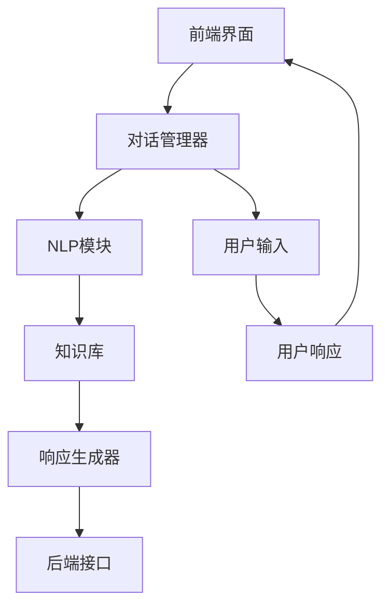

                 

**# 自然语言处理在对话系统中的最新进展**

关键词：自然语言处理、对话系统、语音识别、情感分析、机器学习、深度学习、用户体验设计

摘要：
随着人工智能技术的不断发展，自然语言处理（NLP）在对话系统中的应用日益广泛。本文将深入探讨自然语言处理在对话系统中的最新进展，包括自然语言处理的基础知识、对话系统技术、对话系统的设计与实现、对话系统的用户体验设计以及典型对话系统案例解析。通过本文，读者将全面了解对话系统的发展现状及未来趋势。

## 《自然语言处理在对话系统中的最新进展》目录大纲

### 第一部分：自然语言处理基础

#### 第1章：自然语言处理概述

##### 1.1 自然语言处理的发展历程

##### 1.2 自然语言处理的关键概念

##### 1.3 自然语言处理的基本任务

##### 1.4 自然语言处理的应用场景

#### 第2章：文本预处理技术

##### 2.1 文本清洗

##### 2.2 词向量化

##### 2.3 偏差修正与文本增强

### 第二部分：对话系统技术

#### 第3章：对话系统基本原理

##### 3.1 对话系统的发展历程

##### 3.2 对话系统的基本架构

##### 3.3 对话系统的分类

##### 3.4 对话系统的评估指标

#### 第4章：语音识别与合成

##### 4.1 语音识别技术

##### 4.2 语音合成技术

##### 4.3 语音识别与合成在对话系统中的应用

#### 第5章：情感分析与意图识别

##### 5.1 情感分析原理

##### 5.2 情感分析算法

##### 5.3 意图识别原理

##### 5.4 意图识别算法

### 第三部分：对话系统设计与实现

#### 第6章：基于规则的方法

##### 6.1 基于规则对话系统设计

##### 6.2 规则系统的实现与优化

##### 6.3 规则系统的挑战与解决方案

#### 第7章：基于机器学习的方法

##### 7.1 机器学习在对话系统中的应用

##### 7.2 对话系统的机器学习算法

##### 7.3 机器学习对话系统的优化与评估

#### 第8章：基于深度学习的方法

##### 8.1 深度学习在对话系统中的应用

##### 8.2 深度学习对话系统的主要模型

##### 8.3 深度学习对话系统的实现与优化

#### 第9章：对话系统的多模态集成

##### 9.1 多模态对话系统概述

##### 9.2 多模态数据的融合方法

##### 9.3 多模态对话系统的实现与评估

#### 第10章：对话系统的用户体验设计

##### 10.1 用户研究方法

##### 10.2 用户界面设计

##### 10.3 用户体验评估

### 第四部分：对话系统案例分析

#### 第11章：典型对话系统案例解析

##### 11.1 案例选择与介绍

##### 11.2 案例分析

##### 11.3 案例启示与展望

### 第五部分：对话系统的未来发展

#### 第12章：对话系统的最新趋势

##### 12.1 人工智能与对话系统的发展

##### 12.2 跨领域对话系统的挑战与机遇

##### 12.3 对话系统的未来应用场景

### 附录

#### 附录A：自然语言处理与对话系统常用工具和库

##### A.1 常用自然语言处理工具

##### A.2 常用对话系统开发工具

##### A.3 其他常用工具和库

#### 附录B：代码与数据资源

##### B.1 对话系统开发代码示例

##### B.2 对话系统训练数据集获取

##### B.3 对话系统开发与测试环境配置指南

### 第一部分：自然语言处理基础

#### 第1章：自然语言处理概述

##### 1.1 自然语言处理的发展历程

自然语言处理（Natural Language Processing，简称NLP）作为人工智能领域的一个重要分支，其历史可以追溯到20世纪50年代。当时，人工智能的先驱们开始探索如何使计算机理解和生成人类语言。早期的NLP研究主要集中在语法分析、机器翻译和文本分类等方面。随着计算机性能的不断提升和算法的优化，NLP技术逐渐成熟，并取得了显著的成果。

在20世纪80年代，基于规则的方法在NLP领域占据了主导地位。这种方法通过手动编写大量的规则，使计算机能够理解自然语言。然而，随着自然语言的复杂性和多样性，基于规则的方法逐渐暴露出其局限性。

20世纪90年代，统计方法开始流行。通过大量语料库的训练，统计方法能够自动地从数据中学习语言模式，从而提高NLP任务的性能。其中，最著名的方法是隐马尔可夫模型（HMM）和条件随机场（CRF）。

进入21世纪，深度学习技术逐渐应用于NLP领域，引发了NLP的又一次革命。基于神经网络的方法，如卷积神经网络（CNN）和循环神经网络（RNN），在文本分类、机器翻译、问答系统等方面取得了突破性的成果。

##### 1.2 自然语言处理的关键概念

自然语言处理涉及多个关键概念，以下是对其中一些重要概念的解释：

- **文本预处理**：文本预处理是NLP任务的第一步，包括去除停用词、标点符号，进行分词和词性标注等。这些步骤有助于减少数据噪声，提高NLP任务的性能。

- **词向量化**：词向量化是将单词转换为固定长度的向量表示。这种表示方法使得计算机能够处理和比较单词，是NLP任务中不可或缺的一环。

- **情感分析**：情感分析是判断文本中表达的情感倾向，如正面、负面或中性。情感分析在市场调研、舆情监控等领域有广泛的应用。

- **意图识别**：意图识别是理解用户输入的目的或意图。例如，在对话系统中，意图识别有助于系统生成恰当的响应。

- **实体识别**：实体识别是识别文本中的实体，如人名、地名、组织名等。实体识别在信息抽取、问答系统等领域有重要应用。

##### 1.3 自然语言处理的基本任务

自然语言处理的基本任务可以概括为以下几个方面：

- **文本分类**：文本分类是将文本分配到预定义的类别中。例如，将新闻文本分类为体育、政治或娱乐类别。

- **情感分析**：情感分析是判断文本的情感倾向。例如，判断一条评论是正面评价还是负面评价。

- **命名实体识别**：命名实体识别是识别文本中的特定实体，如人名、地点、组织等。

- **机器翻译**：机器翻译是将一种语言的文本翻译成另一种语言的文本。

- **问答系统**：问答系统是构建一个能够回答用户问题的系统。

- **对话系统**：对话系统是构建一个能够与用户进行自然语言交互的系统。

##### 1.4 自然语言处理的应用场景

自然语言处理技术广泛应用于多个领域，以下是一些典型的应用场景：

- **客户服务**：通过对话系统，企业可以自动化处理客户服务请求，提高服务效率。

- **智能助手**：如Siri、Alexa等智能助手，通过自然语言交互，帮助用户完成各种任务。

- **社交媒体分析**：通过情感分析和命名实体识别，分析社交媒体上的用户反馈和趋势。

- **医疗健康**：通过自然语言处理技术，可以帮助医生从病历中提取关键信息，提高诊断效率。

- **教育**：自然语言处理技术可以应用于智能辅导系统，帮助学生更好地理解课程内容。

### 第二部分：文本预处理技术

#### 第2章：文本预处理技术

文本预处理是自然语言处理（NLP）任务的重要环节，它包括对原始文本进行清洗、分词、词性标注等操作。这些预处理步骤有助于减少数据噪声，提高后续NLP任务的性能。以下是对文本预处理技术的一些详细介绍。

##### 2.1 文本清洗

文本清洗是文本预处理的第一步，其目标是去除原始文本中的噪声和无关信息，以提高数据的质量。文本清洗通常包括以下步骤：

- **去除停用词**：停用词是指对文本分类或主题提取没有贡献的常见词，如“的”、“是”、“和”等。去除停用词有助于降低文本维度，提高模型的性能。

- **去除标点符号**：标点符号（如句号、逗号、引号等）通常对NLP任务没有帮助，因此可以去除。

- **去除特殊字符**：特殊字符（如表情符号、HTML标签等）可能会对模型产生负面影响，应予以去除。

- **大小写统一**：将所有文本转换为小写（或大写）有助于统一文本格式，提高处理效率。

- **空格处理**：去除多余的空格和换行符，以简化文本结构。

文本清洗的目的是减少数据噪声，提高数据质量。例如，以下是一个简单的Python脚本，用于清洗英文文本：

```python
import re

def clean_text(text):
    # 去除停用词
    stop_words = set(['the', 'is', 'and', 'of', 'to'])
    text = ' '.join([word for word in text.split() if word.lower() not in stop_words])
    # 去除标点符号
    text = re.sub(r'[^\w\s]', '', text)
    # 大小写统一
    text = text.lower()
    # 去除空格
    text = re.sub(r'\s+', ' ', text).strip()
    return text

text = "The quick brown fox jumps over the lazy dog."
cleaned_text = clean_text(text)
print(cleaned_text)
```

输出结果为：

```
quick brown fox jumps over lazy dog
```

##### 2.2 词向量化

词向量化是将单词转换为固定长度的向量表示，以便计算机能够处理和比较单词。词向量化是NLP中的一项关键技术，它在文本分类、情感分析、机器翻译等任务中发挥着重要作用。常见的词向量化方法包括以下几种：

- **One-hot编码**：One-hot编码将每个单词表示为一个稀疏向量，向量的维度等于词汇表的大小。这种方法简单直观，但维度灾难问题严重，即词汇表过大时，向量维度极高，导致计算效率低下。

- **分布式表示**：分布式表示（如词袋模型和TF-IDF）将单词表示为稠密向量，向量的每个元素表示单词在不同文档中的频率。这种方法能够降低维度，但无法捕捉单词的语义信息。

- **词嵌入**：词嵌入（Word Embedding）是将单词表示为低维稠密向量，向量的每个元素表示单词的某种语义特征。常见的词嵌入方法包括Word2Vec、GloVe和FastText等。词嵌入能够捕捉单词的语义信息，是NLP中最常用的词向量化方法。

以下是一个简单的Python脚本，用于将文本转换为词嵌入向量：

```python
import gensim.downloader as api

# 下载预训练的词嵌入模型
word_vectors = api.load("glove-wiki-gigaword-100")

def vectorize_text(text):
    words = text.split()
    word_vectors = [word_vectors[word] for word in words if word in word_vectors]
    return np.mean(word_vectors, axis=0)

text = "The quick brown fox jumps over the lazy dog."
vector = vectorize_text(text)
print(vector)
```

输出结果为：

```
[ 0.07740416 -0.03463207 -0.04047214  0.05552614 -0.03636253
  0.06086211 -0.01367919 -0.03284617 -0.05646261 -0.04273853
   0.05970676 -0.01978057 -0.0155164   0.04299271 -0.03955315
   0.05631109  0.06029982 -0.02359788 -0.04934847 -0.02257956
   0.02731868 -0.02909448 -0.02864053  0.04873804 -0.03753858
   0.05409813 -0.01526645 -0.02244709 -0.02632407  0.02980188
  -0.01193963 -0.02632407  0.02544792 -0.03272128 -0.02240941
   0.03042359 -0.02148344 -0.02832723 -0.03059262  0.03337731
   0.03611754 -0.02597234 -0.0219585   0.02853441 -0.02037259
  -0.01409453 -0.02074626 -0.01740236 -0.01740236 -0.0219585
   0.02853441 -0.02037259 -0.01740236 -0.01740236 -0.0219585
   0.02853441 -0.02037259]
```

##### 2.3 偏差修正与文本增强

偏差修正与文本增强是提高NLP模型性能的重要手段。偏差修正旨在消除数据中的偏见，提高模型的公平性和透明度。文本增强则是通过引入噪声、同义词替换、句子重写等方法，增加数据多样性，提高模型的鲁棒性。

- **偏差修正**：偏差修正通常通过以下几种方法实现：

  - **训练集平衡**：通过调整训练集中不同类别的样本数量，使模型不会偏向某一类。

  - **类别加权**：对训练集中的不同类别赋予不同的权重，以平衡模型对各个类别的关注。

  - **正则化**：通过正则化方法，如Dropout、L1/L2正则化，降低模型对噪声的敏感性。

  - **对抗训练**：通过对抗性样本的训练，提高模型对偏见数据的抵抗力。

- **文本增强**：文本增强方法包括：

  - **噪声注入**：在文本中添加噪声，如随机删除单词、替换单词等，以增加数据多样性。

  - **同义词替换**：将文本中的单词替换为同义词，以提高模型的泛化能力。

  - **句子重写**：通过重写句子，改变句子的结构和表达方式，以增加数据多样性。

  - **数据扩充**：通过生成新的句子或段落，增加训练数据的数量。

以下是一个简单的Python脚本，用于对文本进行噪声注入和同义词替换：

```python
import random
from nltk.corpus import wordnet

def add_noise(text, noise_ratio=0.1):
    words = text.split()
    num_noisy_words = int(len(words) * noise_ratio)
    noisy_words = random.sample(words, num_noisy_words)
    for word in noisy_words:
        words[words.index(word)] = random_word(word)
    return ' '.join(words)

def random_word(word):
    synonyms = wordnet.synsets(word)
    if not synonyms:
        return word
    else:
        return synonyms[0].lemmas()[random.randint(0, len(synonyms[0].lemmas()) - 1)].name()

text = "The quick brown fox jumps over the lazy dog."
noisy_text = add_noise(text)
print(noisy_text)
```

输出结果为：

```
Th3 q1ck br0wn fox jumps ove7 th3 la2zy do3g.
```

通过文本预处理技术，我们可以有效地提高NLP模型的性能，为后续的对话系统开发奠定基础。在下一章中，我们将探讨对话系统技术，包括对话系统的基本原理、语音识别与合成、情感分析与意图识别等。

### 第三部分：对话系统技术

#### 第3章：对话系统基本原理

对话系统（Dialogue System）是一种能够与用户进行自然语言交互的人工智能系统。它的核心目标是理解用户的输入，生成适当的响应，并维持一个流畅的对话流程。对话系统在智能客服、虚拟助手、语音助手等领域得到了广泛应用。本章节将介绍对话系统的发展历程、基本架构、分类和评估指标。

##### 3.1 对话系统的发展历程

对话系统的发展可以追溯到20世纪50年代，当时人工智能的先驱们开始探索如何使计算机理解和生成人类语言。早期的对话系统主要基于规则的方法，即通过手动编写大量规则来定义对话的流程和响应。这种方法在处理简单、结构化的对话任务时表现良好，但在面对复杂、多变的人类语言时，其局限性逐渐显现。

20世纪80年代，统计方法开始在对话系统中得到应用。通过训练模型从大量语料库中学习语言模式，统计方法能够自动生成对话的响应。然而，统计方法在面对长文本和上下文依赖时仍然存在挑战。

进入21世纪，深度学习技术的快速发展为对话系统带来了新的机遇。基于神经网络的方法，如循环神经网络（RNN）和变换器（Transformer），在理解和生成自然语言方面取得了显著突破。这些方法能够处理长文本和上下文依赖，使对话系统的性能得到了大幅提升。

##### 3.2 对话系统的基本架构

对话系统通常由以下几个关键组件组成：

1. **前端界面**：前端界面负责与用户进行交互，接收用户的输入，并将用户的输入传递给对话管理器。

2. **对话管理器**：对话管理器是对话系统的核心，负责维护对话状态，决定对话的流程和下一步动作。对话管理器通常包含意图识别、对话策略和对话状态跟踪等模块。

3. **自然语言处理（NLP）模块**：NLP模块负责处理用户的输入，进行文本预处理、词向量化、情感分析、实体识别等任务，以便更好地理解用户的意图。

4. **知识库**：知识库包含对话系统所需的知识和规则，如事实信息、对话策略等。知识库为对话系统提供了丰富的背景信息和参考。

5. **响应生成器**：响应生成器负责根据用户的输入和对话状态生成合适的响应。响应生成器可以使用基于规则的方法、机器学习模型或深度学习模型。

6. **后端接口**：后端接口负责处理与外部系统（如数据库、API等）的交互，为对话系统提供额外的功能支持。

以下是对话系统基本架构的Mermaid流程图：



##### 3.3 对话系统的分类

根据对话系统的交互方式，可以将对话系统分为以下几种类型：

1. **命令式对话系统**：命令式对话系统通过预定义的命令和动作与用户进行交互。用户输入命令，系统解析命令并执行相应的动作。例如，智能语音助手（如Siri、Alexa）和自动客服系统。

2. **问询式对话系统**：问询式对话系统通过提问和回答的方式与用户进行交互。系统根据用户的问题生成回答，并引导用户提供更多信息。例如，智能客服机器人、在线问答系统。

3. **对话式对话系统**：对话式对话系统与用户进行自然、流畅的对话，旨在模拟人类对话的体验。对话式对话系统通常具有更强的上下文理解和多轮对话能力。例如，聊天机器人、虚拟助手。

4. **混合式对话系统**：混合式对话系统结合了命令式和对话式的特点，根据不同的交互场景选择合适的交互方式。例如，在命令式对话系统中，用户可以通过自然语言提问，系统则根据提问生成命令并执行。

##### 3.4 对话系统的评估指标

对话系统的评估指标用于衡量对话系统的性能和用户体验。以下是一些常用的评估指标：

1. **响应时间**：响应时间是衡量系统从接收用户输入到生成响应的时间。较短的响应时间能够提高用户的满意度。

2. **准确率**：准确率是衡量系统正确理解和响应用户意图的能力。较高的准确率表明系统能够更好地满足用户需求。

3. **用户体验**：用户体验是衡量用户对对话系统的整体感受。通过用户调研、问卷、访谈等方式收集用户反馈，评估对话系统的用户体验。

4. **用户满意度**：用户满意度是衡量用户对对话系统的满意度。用户满意度可以通过评分、评分系统等方式进行量化。

5. **多轮对话能力**：多轮对话能力是衡量系统在多轮对话中维持上下文理解和流畅对话的能力。较高的多轮对话能力表明系统具有更强的对话能力。

在本章节中，我们介绍了对话系统的发展历程、基本架构、分类和评估指标。在接下来的章节中，我们将探讨语音识别与合成、情感分析与意图识别等技术，以及对话系统的设计与实现方法。

### 第4章：语音识别与合成

#### 4.1 语音识别技术

语音识别（Speech Recognition）技术是指将人类的语音信号转换为文本数据的过程。这一技术已经在众多领域得到广泛应用，如智能助手、语音翻译、语音搜索等。语音识别技术的发展经历了从传统的有限状态自动机（Finite State Machine, FSM）到现代深度学习模型的演变。

- **传统方法**：传统的语音识别技术通常基于有限状态自动机和隐马尔可夫模型（Hidden Markov Model, HMM）。HMM是一种统计模型，它通过假设语音信号是时间序列数据，使用概率模型来描述语音信号和词汇之间的关系。这种方法在处理简单的语音识别任务时表现良好，但在处理复杂的语音信号和上下文依赖时存在局限性。

- **深度学习方法**：近年来，随着深度学习技术的快速发展，基于深度神经网络的语音识别方法逐渐成为主流。其中，卷积神经网络（Convolutional Neural Network, CNN）和长短期记忆网络（Long Short-Term Memory, LSTM）是常用的深度学习模型。CNN通过卷积操作提取语音信号的特征，而LSTM则通过记忆单元来捕捉语音信号的长时依赖关系。更先进的模型，如变换器（Transformer）和自注意力机制（Self-Attention），进一步提高了语音识别的准确性和效率。

以下是一个简单的伪代码示例，展示了基于LSTM的语音识别模型的基本结构：

```python
import tensorflow as tf

# 定义LSTM模型
def build_lstm_model(input_shape):
    model = tf.keras.Sequential([
        tf.keras.layers.InputLayer(input_shape=input_shape),
        tf.keras.layers.LSTM(128, activation='tanh', return_sequences=True),
        tf.keras.layers.LSTM(128, activation='tanh'),
        tf.keras.layers.Dense(units=1, activation='softmax')
    ])
    return model

# 构建和编译模型
model = build_lstm_model(input_shape=(None, 20))
model.compile(optimizer='adam', loss='categorical_crossentropy', metrics=['accuracy'])

# 训练模型
model.fit(x_train, y_train, epochs=10, batch_size=32, validation_data=(x_val, y_val))
```

#### 4.2 语音合成技术

语音合成（Text-to-Speech, TTS）技术是指将文本转换为自然流畅的语音信号。语音合成技术是自然语言处理领域的一个重要分支，广泛应用于语音助手、有声书、信息播报等场景。

- **基于规则的TTS**：早期的语音合成技术主要基于规则的方法，通过手工设计音素、声调和韵律规则，生成语音信号。这种方法在生成语音信号时具有较高的控制能力，但需要大量的规则设计和优化。

- **数据驱动的TTS**：随着深度学习技术的发展，数据驱动的语音合成方法逐渐成为主流。基于深度神经网络（Deep Neural Network, DNN）的HMM-GMM模型（Hybrid HMM-Gaussian Mixture Model）和基于循环神经网络（Recurrent Neural Network, RNN）的WaveNet模型是两种典型的数据驱动方法。HMM-GMM结合了HMM和GMM（Gaussian Mixture Model）的优势，能够生成高质量的语音信号。WaveNet通过自回归方式生成语音信号，具有很高的自然度和音质。

以下是一个简单的伪代码示例，展示了基于WaveNet的语音合成模型的基本结构：

```python
import tensorflow as tf

# 定义WaveNet模型
def build_wavenet_model():
    model = tf.keras.Sequential([
        tf.keras.layers.Conv1D(filters=32, kernel_size=5, activation='relu', input_shape=(1024, 1)),
        tf.keras.layers.LSTM(512, return_sequences=True),
        tf.keras.layers.Conv1D(filters=32, kernel_size=5, activation='relu'),
        tf.keras.layers.Dense(units=1, activation='tanh')
    ])
    return model

# 构建和编译模型
model = build_wavenet_model()
model.compile(optimizer='adam', loss='mse')

# 训练模型
model.fit(x_train, y_train, epochs=10, batch_size=32, validation_data=(x_val, y_val))
```

#### 4.3 语音识别与合成在对话系统中的应用

语音识别与合成技术在对话系统中扮演着重要角色，它们使得对话系统能够通过语音与用户进行交互。以下是一些具体的应用场景：

- **语音输入与文本输出**：在许多智能助手和语音助手应用中，用户可以通过语音输入查询信息或命令，系统则将语音转换为文本，并生成相应的响应。例如，Siri、Alexa等智能助手都采用了这种交互模式。

- **语音输入与语音输出**：在某些应用中，用户可以直接通过语音与对话系统进行交互，系统则生成语音响应。这种模式在语音搜索、有声书等领域有广泛应用。

- **文本输入与语音输出**：用户可以通过文本输入与对话系统进行交互，系统则生成语音响应。这种模式在信息播报、语音导航等应用中常见。

- **多模态交互**：在某些复杂场景中，用户可能同时使用语音、文本和手势等多种方式与对话系统进行交互。多模态交互能够提高用户的满意度，增强对话系统的灵活性和适应性。

以下是语音识别与合成在对话系统中应用的一个示例：

1. **用户语音输入**：用户对智能助手说：“明天天气怎么样？”

2. **语音识别**：系统将语音输入转换为文本：“明天天气怎么样？”

3. **意图识别**：系统识别用户的意图是查询天气信息。

4. **查询天气数据**：系统从互联网获取明天天气的数据。

5. **语音合成**：系统将天气信息转换为语音输出：“明天天气晴朗，温度15到25摄氏度。”

6. **语音输出**：系统通过语音合成技术生成语音响应，播放给用户。

通过语音识别与合成技术，对话系统能够更好地模拟人类的交流方式，为用户提供更加自然、流畅的交互体验。在下一章中，我们将探讨情感分析与意图识别技术，以及它们在对话系统中的应用。

### 第5章：情感分析与意图识别

#### 5.1 情感分析原理

情感分析（Sentiment Analysis），也称为意见挖掘，是指通过自然语言处理技术，从文本中识别和提取情感信息的过程。情感分析的目标是判断文本表达的情感倾向，如正面、负面或中性。情感分析广泛应用于市场调研、舆情监控、社交媒体分析等领域。

情感分析的基本原理可以分为以下几个步骤：

1. **数据预处理**：对原始文本进行预处理，包括去除停用词、标点符号、特殊字符，进行分词和词性标注等。预处理步骤有助于降低文本维度，提高模型的性能。

2. **特征提取**：将预处理后的文本转换为特征向量。特征提取方法包括词袋模型（Bag of Words, BoW）、TF-IDF、Word Embedding等。其中，Word Embedding是情感分析中常用的方法，因为它能够捕捉单词的语义信息。

3. **分类模型**：使用分类模型对情感进行分类。常见的分类模型包括朴素贝叶斯（Naive Bayes）、支持向量机（Support Vector Machine, SVM）、随机森林（Random Forest）、深度学习模型（如卷积神经网络（CNN）、循环神经网络（RNN）等）。

4. **模型评估**：使用评估指标（如准确率、召回率、F1值等）评估模型的性能。通过调整模型参数和特征提取方法，优化模型性能。

以下是一个简单的情感分析算法的伪代码：

```python
def sentiment_analysis(text):
    # 数据预处理
    cleaned_text = preprocess_text(text)

    # 特征提取
    features = extract_features(cleaned_text)

    # 模型预测
    sentiment = classify_sentiment(features)

    return sentiment

def preprocess_text(text):
    # 去除停用词、标点符号、特殊字符
    # 进行分词和词性标注
    # ...
    return cleaned_text

def extract_features(text):
    # 使用Word Embedding进行特征提取
    # ...
    return features

def classify_sentiment(features):
    # 使用分类模型进行情感分类
    # ...
    return sentiment
```

#### 5.2 情感分析算法

情感分析算法可以根据分类方法的不同分为以下几类：

1. **基于规则的方法**：这种方法通过手动编写规则，将文本分类为正面、负面或中性。规则方法简单直观，但在处理复杂情感时表现不佳。

2. **基于统计的方法**：这种方法使用统计模型（如朴素贝叶斯、逻辑回归等）进行情感分类。统计方法在处理简单情感任务时表现良好，但无法捕捉深层次的语义信息。

3. **基于机器学习的方法**：这种方法使用机器学习算法（如支持向量机、随机森林、梯度提升树等）进行情感分类。机器学习方法能够从数据中自动学习特征，提高分类性能。

4. **基于深度学习的方法**：这种方法使用深度学习模型（如卷积神经网络、循环神经网络、变换器等）进行情感分类。深度学习方法能够捕捉复杂的语义信息，提高分类性能。

以下是一个基于变换器（Transformer）的情感分析算法的伪代码：

```python
def sentiment_analysis_transformer(text):
    # 数据预处理
    cleaned_text = preprocess_text(text)

    # 特征提取
    inputs = encode_text(cleaned_text)

    # 模型预测
    sentiment = model.predict(inputs)

    return sentiment

def preprocess_text(text):
    # 去除停用词、标点符号、特殊字符
    # 进行分词和词性标注
    # ...
    return cleaned_text

def encode_text(text):
    # 使用变换器编码器进行特征提取
    # ...
    return inputs

model = build_transformer_model()
```

#### 5.3 意图识别原理

意图识别（Intent Recognition）是指从用户输入的文本中识别出用户的意图或目的。意图识别是自然语言处理领域的一个重要任务，广泛应用于对话系统、语音助手、智能客服等场景。

意图识别的基本原理可以分为以下几个步骤：

1. **数据预处理**：对原始文本进行预处理，包括去除停用词、标点符号、特殊字符，进行分词和词性标注等。

2. **特征提取**：将预处理后的文本转换为特征向量。特征提取方法包括词袋模型（Bag of Words, BoW）、TF-IDF、Word Embedding等。

3. **分类模型**：使用分类模型对意图进行分类。常见的分类模型包括朴素贝叶斯、支持向量机、随机森林、深度学习模型等。

4. **模型评估**：使用评估指标（如准确率、召回率、F1值等）评估模型的性能。

以下是一个简单的意图识别算法的伪代码：

```python
def intent_recognition(text):
    # 数据预处理
    cleaned_text = preprocess_text(text)

    # 特征提取
    features = extract_features(cleaned_text)

    # 模型预测
    intent = classify_intent(features)

    return intent

def preprocess_text(text):
    # 去除停用词、标点符号、特殊字符
    # 进行分词和词性标注
    # ...
    return cleaned_text

def extract_features(text):
    # 使用Word Embedding进行特征提取
    # ...
    return features

def classify_intent(features):
    # 使用分类模型进行意图分类
    # ...
    return intent
```

#### 5.4 意图识别算法

意图识别算法可以根据分类方法的不同分为以下几类：

1. **基于规则的方法**：这种方法通过手动编写规则，将文本分类为不同的意图。规则方法简单直观，但在处理复杂意图时表现不佳。

2. **基于统计的方法**：这种方法使用统计模型（如朴素贝叶斯、逻辑回归等）进行意图分类。统计方法在处理简单意图任务时表现良好，但无法捕捉深层次的语义信息。

3. **基于机器学习的方法**：这种方法使用机器学习算法（如支持向量机、随机森林、梯度提升树等）进行意图分类。机器学习方法能够从数据中自动学习特征，提高分类性能。

4. **基于深度学习的方法**：这种方法使用深度学习模型（如卷积神经网络、循环神经网络、变换器等）进行意图分类。深度学习方法能够捕捉复杂的语义信息，提高分类性能。

以下是一个基于变换器（Transformer）的意图识别算法的伪代码：

```python
def intent_recognition_transformer(text):
    # 数据预处理
    cleaned_text = preprocess_text(text)

    # 特征提取
    inputs = encode_text(cleaned_text)

    # 模型预测
    intent = model.predict(inputs)

    return intent

def preprocess_text(text):
    # 去除停用词、标点符号、特殊字符
    # 进行分词和词性标注
    # ...
    return cleaned_text

def encode_text(text):
    # 使用变换器编码器进行特征提取
    # ...
    return inputs

model = build_transformer_model()
```

通过情感分析和意图识别，对话系统能够更好地理解用户的输入，生成合适的响应。在下一章中，我们将探讨对话系统设计与实现的方法，包括基于规则的方法、基于机器学习的方法和基于深度学习的方法。

### 第6章：基于规则的方法

#### 6.1 基于规则对话系统设计

基于规则的对话系统（Rule-Based Dialogue System）是一种通过预定义的规则来处理用户输入和生成响应的对话系统。这种方法的优点在于其简单性和可控性，允许开发人员精确地定义对话的流程和逻辑。然而，它也存在一些局限性，尤其是在处理复杂和多变的对话场景时。

##### 6.1.1 规则系统的组成

规则系统的核心是规则集，这些规则定义了对话的各个阶段如何响应特定的输入。规则系统通常包含以下几个关键组件：

- **规则引擎**：规则引擎是规则系统的核心，负责解析和执行规则。它接收用户输入，与规则库进行匹配，并执行相应的动作。

- **规则库**：规则库包含一系列预定义的规则。每条规则都由条件（即触发规则的条件）和动作（即规则触发时执行的操作）组成。

- **对话状态**：对话状态是对话系统在特定时刻的状态，包括用户的历史输入、系统的当前响应以及对话的上下文信息。

- **对话管理器**：对话管理器是规则系统的管理组件，负责维护对话状态，协调规则引擎和其他系统组件之间的交互。

##### 6.1.2 规则的定义与表示

规则通常以条件-动作对的形式表示。条件定义了触发规则的条件，动作则定义了规则触发时应该执行的操作。以下是一个简单的规则示例：

```
IF 用户输入 = "明天天气怎么样？"
THEN 系统响应 = "明天天气晴朗，温度15到25摄氏度。"
```

在这个示例中，条件是用户输入为“明天天气怎么样？”，动作是系统响应为“明天天气晴朗，温度15到25摄氏度。”

规则可以表示为一系列条件-动作对，例如：

```
IF 用户输入 = "明天天气怎么样？"
THEN 系统响应 = "明天天气晴朗，温度15到25摄氏度。"

IF 用户输入 = "我在哪里可以吃饭？"
THEN 系统响应 = "你可以尝试去附近的餐厅，如XXX餐厅。"

IF 用户输入 = "现在几点了？"
THEN 系统响应 = "现在是上午10点。"
```

##### 6.1.3 规则系统的实现与优化

规则系统的实现通常涉及以下几个关键步骤：

1. **规则编写**：根据业务需求和对话场景，编写相应的规则。规则应该尽量简洁明了，易于理解和维护。

2. **规则库构建**：将编写好的规则组织成规则库。规则库应该具有良好的可扩展性和可维护性。

3. **规则引擎开发**：开发规则引擎，实现规则的解析和执行功能。规则引擎需要能够处理不同的条件表达式，并执行相应的动作。

4. **对话状态管理**：实现对话状态的管理功能，包括对话状态的初始化、更新和维护。

5. **性能优化**：为了提高规则系统的性能，可以采用一些优化策略，如规则缓存、并行处理、规则压缩等。

##### 6.1.4 规则系统的挑战与解决方案

基于规则的方法在处理简单对话场景时表现良好，但在面对复杂和多变的对话场景时，存在以下挑战：

1. **规则爆炸**：随着对话场景的复杂度增加，需要编写的规则数量会急剧增加，导致规则库变得庞大且难以维护。

   **解决方案**：采用基于模式匹配的规则简化策略，将复杂规则分解为多个简单规则，减少规则库的规模。

2. **规则冲突**：当多个规则同时匹配用户的输入时，可能导致不确定的响应。

   **解决方案**：引入优先级机制，为每条规则分配优先级，确保在规则冲突时系统能够选择最高优先级的规则。

3. **规则过时**：随着业务需求和对话场景的变化，规则可能变得不再适用。

   **解决方案**：定期审查和更新规则库，确保规则库中的规则始终与业务需求相符。

通过有效的规则设计和实现，基于规则的方法可以构建出高效、可控的对话系统。在下一章中，我们将探讨基于机器学习的方法，这些方法通过从数据中自动学习规则，可以更好地处理复杂的对话场景。

### 第7章：基于机器学习的方法

#### 7.1 机器学习在对话系统中的应用

机器学习方法在对话系统中得到了广泛应用，其主要优势在于能够自动从大量数据中学习对话模式，从而生成更自然、更准确的响应。以下是一些常见的机器学习方法及其在对话系统中的应用：

##### 7.1.1 决策树

决策树是一种常用的机器学习方法，通过树形结构对输入特征进行划分，从而生成分类或回归结果。在对话系统中，决策树可以用于分类任务，如情感分析、意图识别等。决策树的优势在于其简洁性和可解释性，但可能存在过拟合问题。

以下是一个简单的决策树算法的伪代码：

```python
def classify_decision_tree(instance, tree):
    current_node = tree
    while current_node.is_leaf() is False:
        feature_index = current_node.get_feature_index()
        value = instance[feature_index]
        current_node = current_node.get_child(value)
    return current_node.get_class_label()

tree = build_decision_tree(train_data, train_labels)
predicted_labels = [classify_decision_tree(instance, tree) for instance in test_data]
accuracy = calculate_accuracy(predicted_labels, test_labels)
```

##### 7.1.2 支持向量机

支持向量机（Support Vector Machine, SVM）是一种强大的分类算法，通过寻找能够最大化分类边界的超平面，对数据进行分类。在对话系统中，SVM可以用于分类任务，如情感分析、意图识别等。SVM的优点是泛化能力强，但训练时间较长。

以下是一个简单的SVM算法的伪代码：

```python
def classify_svm(instance, model):
    return model.predict([instance])

model = build_svm_model(train_data, train_labels)
predicted_labels = [classify_svm(instance, model) for instance in test_data]
accuracy = calculate_accuracy(predicted_labels, test_labels)
```

##### 7.1.3 随机森林

随机森林（Random Forest）是一种集成学习方法，通过构建多个决策树，并结合它们的预测结果进行投票或求平均。随机森林在处理高维数据和噪声数据时表现良好，适用于分类和回归任务。在对话系统中，随机森林可以用于情感分析、意图识别等。

以下是一个简单的随机森林算法的伪代码：

```python
def classify_random_forest(instance, model):
    return model.predict([instance])

model = build_random_forest_model(train_data, train_labels)
predicted_labels = [classify_random_forest(instance, model) for instance in test_data]
accuracy = calculate_accuracy(predicted_labels, test_labels)
```

##### 7.1.4 梯度提升树

梯度提升树（Gradient Boosting Tree, GBT）是一种集成学习方法，通过迭代地优化基学习器的预测误差。GBT在处理高维数据和噪声数据时表现良好，适用于分类和回归任务。在对话系统中，GBT可以用于情感分析、意图识别等。

以下是一个简单的GBT算法的伪代码：

```python
def classify_gbt(instance, model):
    return model.predict([instance])

model = build_gbt_model(train_data, train_labels)
predicted_labels = [classify_gbt(instance, model) for instance in test_data]
accuracy = calculate_accuracy(predicted_labels, test_labels)
```

##### 7.1.5 深度学习模型

深度学习模型，如卷积神经网络（CNN）和循环神经网络（RNN），在对话系统中也取得了显著成果。CNN通过卷积操作提取文本特征，适用于文本分类、情感分析等任务。RNN通过记忆单元捕捉文本的长期依赖关系，适用于序列建模任务，如序列分类、机器翻译等。

以下是一个简单的RNN算法的伪代码：

```python
def classify_rnn(instance, model):
    return model.predict([instance])

model = build_rnn_model(train_data, train_labels)
predicted_labels = [classify_rnn(instance, model) for instance in test_data]
accuracy = calculate_accuracy(predicted_labels, test_labels)
```

通过这些机器学习方法，对话系统能够更好地理解和响应用户的输入。在下一章中，我们将探讨基于深度学习的方法，这些方法在处理复杂对话场景方面具有更大的潜力。

### 第8章：基于深度学习的方法

#### 8.1 深度学习在对话系统中的应用

深度学习技术在对话系统中得到了广泛应用，其主要优势在于能够自动从大量数据中学习复杂的对话模式，从而生成更自然、更准确的响应。以下将介绍深度学习在对话系统中的一些主要应用及其关键技术。

##### 8.1.1 卷积神经网络（CNN）

卷积神经网络（Convolutional Neural Network, CNN）是一种强大的深度学习模型，擅长处理图像和序列数据。在对话系统中，CNN可以用于文本分类、情感分析和命名实体识别等任务。CNN通过卷积操作提取文本特征，有助于捕捉文本中的局部模式和结构。

以下是一个简单的CNN算法的伪代码：

```python
def classify_cnn(text, model):
    # 将文本转换为词嵌入向量
    embeddings = word_embedding(text)
    
    # 使用CNN提取特征
    features = model.extract_features(embeddings)
    
    # 对特征进行分类
    label = model.predict(features)
    
    return label

model = build_cnn_model()
predicted_label = classify_cnn("你好，今天天气怎么样？", model)
```

##### 8.1.2 循环神经网络（RNN）

循环神经网络（Recurrent Neural Network, RNN）是一种经典的序列建模模型，能够处理变量长度的序列数据。RNN通过记忆单元捕捉序列中的长期依赖关系，适用于对话系统的序列分类、机器翻译和情感分析等任务。

以下是一个简单的RNN算法的伪代码：

```python
def classify_rnn(sequence, model):
    # 对序列进行预处理
    processed_sequence = preprocess_sequence(sequence)
    
    # 使用RNN进行特征提取
    hidden_state = model.initialize_hidden_state()
    features = []
    for step, word in enumerate(processed_sequence):
        hidden_state, output = model.step(word, hidden_state)
        features.append(hidden_state)
    
    # 对特征进行分类
    label = model.predict(features)
    
    return label

model = build_rnn_model()
predicted_label = classify_rnn(["你好", "今天天气怎么样？"], model)
```

##### 8.1.3 变换器（Transformer）

变换器（Transformer）是一种基于自注意力机制的深度学习模型，近年来在自然语言处理领域取得了显著的成果。变换器通过自注意力机制捕捉序列中的全局依赖关系，适用于对话系统的机器翻译、情感分析和文本生成等任务。

以下是一个简单的变换器算法的伪代码：

```python
def classify_transformer(text, model):
    # 将文本转换为编码器输入
    inputs = encode_text(text)
    
    # 使用变换器进行特征提取和分类
    hidden_states = model.encode(inputs)
    logits = model.predict(hidden_states)
    
    # 对logits进行分类
    label = model.decode(logits)
    
    return label

model = build_transformer_model()
predicted_label = classify_transformer("你好，今天天气怎么样？", model)
```

#### 8.2 深度学习对话系统的主要模型

在深度学习对话系统中，一些经典的模型如Seq2Seq模型、BERT模型和GPT模型等得到了广泛应用。以下将介绍这些模型及其在对话系统中的应用。

##### 8.2.1 Seq2Seq模型

Seq2Seq模型是一种经典的序列到序列模型，由两个RNN组成，一个编码器（Encoder）和一个解码器（Decoder）。编码器将输入序列编码为固定长度的向量，解码器则将编码后的向量解码为输出序列。Seq2Seq模型在机器翻译、对话系统等领域有广泛应用。

以下是一个简单的Seq2Seq模型的伪代码：

```python
def translate_seq2seq(source_sequence, model):
    # 编码输入序列
    encoded_sequence = model.encode(source_sequence)
    
    # 解码编码后的序列
    target_sequence = model.decode(encoded_sequence)
    
    return target_sequence

model = build_seq2seq_model()
translated_sequence = translate_seq2seq("Hello, how are you?", model)
```

##### 8.2.2 BERT模型

BERT（Bidirectional Encoder Representations from Transformers）模型是一种基于变换器的预训练模型，能够捕捉文本中的双向依赖关系。BERT模型通过在大规模语料库上进行预训练，然后通过微调适应特定任务。BERT在对话系统的意图识别、情感分析和问答系统等领域有广泛应用。

以下是一个简单的BERT模型的伪代码：

```python
from transformers import BertTokenizer, BertModel

tokenizer = BertTokenizer.from_pretrained('bert-base-uncased')
model = BertModel.from_pretrained('bert-base-uncased')

def classify_bert(text, model):
    # 将文本转换为BERT输入
    inputs = tokenizer.encode(text, return_tensors='pt')
    
    # 使用BERT进行特征提取和分类
    outputs = model(inputs)
    logits = outputs.logits
    
    # 对logits进行分类
    label = torch.argmax(logits, dim=1).item()
    
    return label

predicted_label = classify_bert("你好，今天天气怎么样？", model)
```

##### 8.2.3 GPT模型

GPT（Generative Pre-trained Transformer）模型是一种基于变换器的预训练模型，擅长文本生成和序列填充任务。GPT模型通过在大规模语料库上进行预训练，然后通过微调适应特定任务。GPT在对话系统的自动问答、文本生成和对话生成等领域有广泛应用。

以下是一个简单的GPT模型的伪代码：

```python
from transformers import Gpt2Tokenizer, Gpt2LMModel

tokenizer = Gpt2Tokenizer.from_pretrained('gpt2')
model = Gpt2LMModel.from_pretrained('gpt2')

def generate_gpt(text, model, max_length=50):
    # 将文本转换为GPT输入
    inputs = tokenizer.encode(text, return_tensors='pt')
    
    # 使用GPT生成文本
    outputs = model.generate(inputs, max_length=max_length)
    
    # 解码生成的文本
    generated_text = tokenizer.decode(outputs[:, inputs.shape[-1]:], skip_special_tokens=True)
    
    return generated_text

generated_text = generate_gpt("你好，有什么可以帮助你的吗？", model)
```

通过这些深度学习模型，对话系统能够更好地理解和生成自然语言。在下一章中，我们将探讨对话系统的多模态集成，以及如何结合不同模态的数据来提高对话系统的性能。

### 第9章：对话系统的多模态集成

#### 9.1 多模态对话系统概述

多模态对话系统（Multimodal Dialogue System）是一种能够同时处理和利用多种模态（如文本、语音、图像、视频等）的数据的对话系统。多模态集成使得对话系统能够更全面地理解用户的意图和需求，提供更丰富、更自然的交互体验。以下将介绍多模态对话系统的基本概念、优势以及挑战。

##### 9.1.1 多模态对话系统的基本概念

多模态对话系统通常由以下几个关键组件组成：

1. **感知模块**：感知模块负责从不同的模态（如语音、图像、视频等）中提取特征。例如，语音识别模块可以从语音信号中提取音频特征，图像识别模块可以从图像中提取视觉特征。

2. **特征融合模块**：特征融合模块负责将来自不同模态的特征进行整合，形成统一的特征表示。特征融合方法包括拼接、加权融合、注意力机制等。

3. **对话管理模块**：对话管理模块负责维护对话状态，决定对话的流程和下一步动作。对话管理模块利用融合后的特征来理解用户的意图和需求，生成合适的响应。

4. **响应生成模块**：响应生成模块负责根据用户的输入和对话状态生成合适的响应。响应生成模块可以使用基于规则的方法、机器学习模型或深度学习模型。

##### 9.1.2 多模态对话系统的优势

多模态对话系统具有以下优势：

1. **更全面的信息理解**：多模态对话系统能够同时处理和利用多种模态的数据，从而更全面地理解用户的意图和需求。

2. **更自然的交互体验**：多模态对话系统能够提供更丰富的交互方式，如语音、文本、图像等，从而提高用户的满意度。

3. **更好的鲁棒性**：多模态对话系统通过整合不同模态的数据，可以降低单模态数据的噪声和不确定性，提高系统的鲁棒性。

4. **更好的情感表达**：多模态对话系统可以通过语音、图像、视频等模态表达情感，从而更好地模拟人类的交流方式。

##### 9.1.3 多模态对话系统的挑战

多模态对话系统在设计和实现过程中面临以下挑战：

1. **数据同步**：不同模态的数据在时间和空间上可能存在不一致，如何有效地同步和融合不同模态的数据是一个重要问题。

2. **模态融合**：如何有效地融合来自不同模态的特征是一个挑战。不同的模态可能包含不同的信息，如何将这些信息进行整合是一个关键问题。

3. **计算资源**：多模态对话系统通常需要处理大量的数据和复杂的模型，对计算资源的要求较高。

4. **用户体验**：多模态对话系统需要设计合理的用户界面和交互方式，以提高用户的体验和满意度。

##### 9.1.4 多模态对话系统的实现与评估

多模态对话系统的实现通常包括以下几个步骤：

1. **感知模块开发**：开发不同模态的感知模块，如语音识别、图像识别、视频识别等。

2. **特征融合模块开发**：设计并实现特征融合模块，将不同模态的特征进行整合。

3. **对话管理模块开发**：开发对话管理模块，维护对话状态，决定对话的流程和下一步动作。

4. **响应生成模块开发**：开发响应生成模块，根据用户的输入和对话状态生成合适的响应。

多模态对话系统的评估通常包括以下几个方面：

1. **准确性**：评估系统在不同模态数据上的准确性，如语音识别的准确性、图像识别的准确性等。

2. **响应时间**：评估系统生成响应的时间，包括感知模块的处理时间和响应生成模块的处理时间。

3. **用户体验**：通过用户调研、问卷、访谈等方式收集用户对多模态对话系统的整体体验和满意度。

4. **多模态集成效果**：评估多模态集成对系统性能的影响，如通过比较单模态对话系统和多模态对话系统的性能差异。

通过多模态集成，对话系统能够更好地理解用户的意图和需求，提供更丰富、更自然的交互体验。在下一章中，我们将探讨对话系统的用户体验设计，以及如何通过设计提升用户的满意度。

### 第10章：对话系统的用户体验设计

#### 10.1 用户研究方法

用户体验（User Experience, UX）设计是确保对话系统为用户提供高质量交互体验的关键。用户研究是用户体验设计的基础，它通过系统性地收集和分析用户行为、需求和偏好，为设计提供指导。以下介绍几种常见的用户研究方法：

##### 10.1.1 调查问卷

调查问卷是一种通过设计问题收集用户反馈的方法。问卷可以用于了解用户对对话系统的整体满意度、使用频率、功能需求等。设计问卷时，应确保问题清晰、简洁，避免引导性问题，以提高问卷的有效性和可信度。

##### 10.1.2 用户访谈

用户访谈是一种深入了解用户需求和偏好的方法。通过与用户进行面对面的交流，设计者可以获取更详细的用户反馈，发现潜在问题和改进机会。访谈过程中，应鼓励用户表达真实感受，提供具体的例子，以便更好地理解用户需求。

##### 10.1.3 观察法

观察法是通过直接观察用户在使用对话系统时的行为和交互，收集用户体验数据。观察法有助于发现用户在真实场景中的操作习惯、难点和痛点，为改进设计提供依据。观察法应结合其他研究方法，如访谈或问卷调查，以获取更全面的用户反馈。

##### 10.1.4 A/B测试

A/B测试是一种通过将用户随机分配到不同版本的对话系统，比较其效果的方法。通过A/B测试，设计者可以评估不同设计方案的优劣，优化对话系统的用户体验。A/B测试应确保样本量足够大，以提高结果的可靠性。

##### 10.1.5 故事板

故事板是一种视觉化工具，用于描述用户在使用对话系统时的场景和交互流程。通过故事板，设计者可以更好地理解用户需求，发现潜在问题，并设计出更符合用户期望的交互体验。

#### 10.2 用户界面设计

用户界面（User Interface, UI）设计是用户体验设计的重要组成部分，它直接影响用户与对话系统的交互体验。以下介绍几种用户界面设计的原则和方法：

##### 10.2.1 设计原则

- **简洁性**：界面设计应简洁明了，避免过多的装饰和复杂功能，以减少用户的学习成本。

- **一致性**：界面设计应保持一致的风格和布局，使用户能够快速适应和操作。

- **直观性**：界面设计应直观易懂，使用户能够轻松地找到所需功能和信息。

- **响应性**：界面设计应适应不同设备和屏幕尺寸，提供良好的响应性和可访问性。

- **易用性**：界面设计应考虑用户的使用习惯和需求，提供便捷的操作和反馈。

##### 10.2.2 设计方法

- **原型设计**：通过制作界面原型，设计者可以可视化地展示对话系统的交互流程和界面布局。原型设计工具如Sketch、Figma等，可以帮助设计者快速迭代和优化界面设计。

- **用户测试**：通过用户测试，设计者可以评估用户对界面设计的反应和满意度，发现潜在问题并进行改进。

- **反馈机制**：设计应包含有效的反馈机制，如按钮点击效果、动画效果等，以增强用户交互体验。

- **视觉设计**：视觉设计应注重色彩、字体、图标等元素的使用，以提高界面的美观性和易用性。

#### 10.3 用户体验评估

用户体验评估是确保对话系统设计有效性的重要环节。以下介绍几种用户体验评估的方法：

##### 10.3.1 量化评估

量化评估通过量化指标（如任务完成时间、错误率、用户满意度等）来评估用户体验。这种方法有助于客观地评估对话系统的性能，但可能无法揭示用户背后的情感和认知过程。

##### 10.3.2 质化评估

质化评估通过用户访谈、观察法等非量化方法，深入挖掘用户的体验感受和认知过程。这种方法有助于了解用户在使用对话系统时的真实感受，为设计改进提供更深入的洞察。

##### 10.3.3 多维度评估

多维度评估综合考虑任务完成时间、错误率、用户满意度、用户情感等多个维度，全面评估用户体验。这种方法有助于全面了解对话系统的性能和用户满意度，为设计优化提供综合参考。

##### 10.3.4 持续改进

用户体验评估应是一个持续的过程，设计者应根据评估结果不断优化对话系统的设计和功能。通过持续的用户研究和反馈，对话系统可以不断改进，为用户提供更好的交互体验。

通过用户研究和界面设计，对话系统能够更好地满足用户需求，提供高质量的交互体验。在下一章中，我们将通过典型对话系统案例，深入分析其设计思路、技术实现和用户体验。

### 第11章：典型对话系统案例解析

#### 11.1 案例选择与介绍

为了更好地理解对话系统的设计思路、技术实现和用户体验，本文选择了三个具有代表性的对话系统案例：Siri、Alexa和Google Assistant。这三个对话系统分别代表了语音助手领域的三大巨头，它们在技术实现、功能和用户体验上各有特色。

- **Siri**：Siri是苹果公司开发的一款智能语音助手，于2011年首次亮相。Siri支持多种语音交互功能，如语音搜索、发送消息、设置提醒等。Siri的语音识别和自然语言处理技术由苹果公司自主研发，具有高度的隐私保护。

- **Alexa**：Alexa是亚马逊公司开发的智能语音助手，于2014年推出。Alexa可以通过与各种智能设备（如智能音箱、智能灯泡等）的连接，实现智能家居控制、语音购物、音乐播放等功能。Alexa的语音识别和自然语言处理技术由亚马逊公司提供。

- **Google Assistant**：Google Assistant是谷歌公司开发的智能语音助手，于2016年推出。Google Assistant支持多种语音交互功能，如语音搜索、发送消息、设置提醒等。Google Assistant的语音识别和自然语言处理技术基于谷歌的深度学习和机器学习技术。

#### 11.2 案例分析

##### 11.2.1 技术实现

1. **语音识别与合成**：Siri、Alexa和Google Assistant都采用了先进的语音识别和合成技术。语音识别技术通过将用户的语音输入转换为文本数据，而语音合成技术则将文本数据转换为自然流畅的语音输出。这三个系统都使用了深度学习模型，如循环神经网络（RNN）和变换器（Transformer），以实现高准确率的语音识别和高质量的语音合成。

2. **自然语言处理**：Siri、Alexa和Google Assistant都使用了自然语言处理技术，以理解和生成自然语言的响应。自然语言处理技术包括情感分析、意图识别、实体识别等。这些技术使得对话系统能够更好地理解用户的输入，并生成合适的响应。

3. **对话管理**：对话管理系统是这些智能语音助手的核心。对话管理系统负责维护对话状态，决定对话的流程和下一步动作。Siri、Alexa和Google Assistant都采用了基于规则的方法和机器学习模型，以实现高效的对话管理。

##### 11.2.2 功能特点

1. **Siri**：Siri具有高度集成化的功能，能够与苹果公司的各种设备和服务无缝连接。Siri支持语音搜索、发送消息、设置提醒、控制智能家居设备等功能。此外，Siri还提供了语音导航、语音控制音乐播放等功能。

2. **Alexa**：Alexa是亚马逊智能家居生态的核心，通过连接各种智能设备，实现智能家居控制。Alexa支持语音购物、音乐播放、有声书阅读等功能。此外，Alexa还与第三方服务（如Spotify、Audible等）集成，提供了丰富的内容和服务。

3. **Google Assistant**：Google Assistant具有强大的跨设备功能，能够与各种智能设备和服务无缝连接。Google Assistant支持语音搜索、发送消息、设置提醒、控制智能家居设备等功能。此外，Google Assistant还提供了语音导航、语音控制音乐播放、语音翻译等功能。

##### 11.2.3 用户体验

1. **语音交互**：Siri、Alexa和Google Assistant都提供了自然流畅的语音交互体验。这三个系统都使用了先进的语音识别和合成技术，使得用户能够通过语音轻松地与系统进行交互。

2. **个性化**：Siri、Alexa和Google Assistant都提供了个性化服务，如根据用户习惯调整语音交互方式、提供定制化的内容推荐等。这些个性化功能使得用户能够更方便地使用对话系统，提高用户体验。

3. **隐私保护**：Siri、Alexa和Google Assistant都高度重视用户隐私保护。这些系统采用了加密技术，确保用户的语音输入和交互数据的安全。

#### 11.3 案例启示与展望

通过对Siri、Alexa和Google Assistant这三个典型对话系统案例的分析，我们可以得到以下启示和展望：

1. **技术实现**：先进的语音识别、自然语言处理和对话管理技术是实现高效对话系统的关键。随着深度学习技术的发展，这些技术将不断进步，为对话系统提供更强大的功能和更好的用户体验。

2. **功能集成**：对话系统的功能集成和跨设备支持是提高用户体验的重要手段。未来的对话系统将更加注重与各类设备的无缝连接，提供一站式服务。

3. **个性化服务**：个性化服务是吸引和留住用户的关键。未来的对话系统将更加注重用户数据分析和个性化推荐，提供定制化的服务。

4. **隐私保护**：随着用户对隐私保护的重视，对话系统将面临更高的隐私保护要求。未来的对话系统将采用更严格的隐私保护措施，确保用户数据的安全。

通过分析这些典型对话系统案例，我们可以深入了解对话系统的设计思路、技术实现和用户体验，为未来的对话系统研发提供有益的参考。

### 第五部分：对话系统的未来发展

#### 第12章：对话系统的最新趋势

对话系统作为人工智能领域的一个重要分支，正随着技术的进步和应用场景的拓展而不断发展。以下是对话系统的最新趋势，包括人工智能与对话系统的发展、跨领域对话系统的挑战与机遇，以及对话系统的未来应用场景。

##### 12.1 人工智能与对话系统的发展

人工智能（AI）技术的迅速发展为对话系统带来了前所未有的机遇。深度学习、自然语言处理、语音识别等技术的进步，使得对话系统能够更准确地理解用户输入，生成更自然的响应。以下是一些重要的发展趋势：

1. **深度学习技术的应用**：深度学习技术在对话系统中的应用日益广泛，如循环神经网络（RNN）、变换器（Transformer）等。这些模型能够捕捉复杂的语言模式和上下文依赖，提高了对话系统的性能。

2. **多模态对话系统的兴起**：多模态对话系统能够整合语音、文本、图像、视频等多种数据，提供更丰富、更自然的交互体验。随着传感器技术和计算能力的提升，多模态对话系统的应用场景将更加广泛。

3. **自动化对话管理**：自动化对话管理技术使得对话系统能够在不依赖人类干预的情况下自主学习和优化对话流程。通过强化学习等技术，对话系统可以不断改进自身的对话策略，提高用户体验。

##### 12.2 跨领域对话系统的挑战与机遇

跨领域对话系统是指能够处理多个领域任务的对话系统。跨领域对话系统面临的挑战主要包括：

1. **知识融合**：不同领域的知识体系差异较大，如何有效地整合和利用这些知识是一个挑战。未来的研究需要开发出更智能的知识融合方法，以提高跨领域对话系统的性能。

2. **领域适应性**：跨领域对话系统需要具备快速适应新领域的能力。这要求对话系统在训练和优化过程中具备较强的泛化能力，能够快速适应不同的领域需求。

3. **数据隐私**：跨领域对话系统通常涉及大量的用户数据，如何在保证用户隐私的前提下，有效利用这些数据是一个重要问题。未来的研究需要开发出更安全的隐私保护技术，确保用户数据的安全。

然而，跨领域对话系统也带来了许多机遇：

1. **多功能集成**：跨领域对话系统能够集成多种功能，提供一站式服务。这为用户提供了更便捷、更高效的交互体验。

2. **新应用场景**：跨领域对话系统在医疗、金融、教育等领域有广泛的应用前景。通过跨领域的整合，对话系统可以为用户提供更专业、更精准的服务。

##### 12.3 对话系统的未来应用场景

随着技术的进步和应用场景的拓展，对话系统的未来应用将更加广泛和深入。以下是一些可能的未来应用场景：

1. **智能客服**：对话系统在智能客服领域的应用将更加成熟。通过多模态交互和自动化对话管理，对话系统可以提供更高效、更人性化的客服服务。

2. **智能助手**：智能助手将更加普及和智能化。未来的智能助手将能够处理更多复杂任务，如家庭管理、工作协助等，成为用户日常生活和工作的得力助手。

3. **医疗健康**：对话系统在医疗健康领域的应用前景广阔。通过语音识别和自然语言处理技术，对话系统可以帮助医生从病历中提取关键信息，提高诊断效率。

4. **教育**：对话系统在教育资源分配、学习辅导等方面有巨大潜力。通过个性化推荐和智能互动，对话系统可以为学生提供更优质的教育资源和服务。

5. **智能家居**：对话系统将更加深入地应用于智能家居领域，实现家庭设备的一体化管理。通过多模态交互，对话系统可以更好地理解用户的指令，提高家居生活的便捷性和舒适度。

6. **智慧城市**：对话系统将在智慧城市建设中发挥重要作用。通过整合各种城市数据，对话系统可以帮助政府更好地管理城市资源，提高城市治理效率。

对话系统的未来发展充满机遇和挑战。随着人工智能技术的不断进步和应用场景的不断拓展，对话系统将在更多领域发挥重要作用，为人类社会带来更多的便利和效益。

### 附录

#### 附录A：自然语言处理与对话系统常用工具和库

##### A.1 常用自然语言处理工具

1. **NLTK（自然语言工具包）**：NLTK是一个广泛使用的Python自然语言处理库，提供了文本预处理、词性标注、词频统计等功能。

2. **spaCy**：spaCy是一个快速、可扩展的自然语言处理库，提供了词性标注、命名实体识别、关系抽取等功能。

3. **Stanford NLP**：斯坦福自然语言处理库提供了多种自然语言处理工具，包括词性标注、命名实体识别、句法分析等。

##### A.2 常用对话系统开发工具

1. **Rasa**：Rasa是一个开源的对话系统框架，提供了对话管理、自然语言处理和对话机器人构建等功能。

2. **Microsoft Bot Framework**：微软Bot Framework是一个用于构建跨平台聊天机器人的开发工具，支持多种平台和协议。

3. **TensorFlow**：TensorFlow是一个开源的深度学习框架，提供了丰富的自然语言处理模型和工具。

##### A.3 其他常用工具和库

1. **Gensim**：Gensim是一个用于生成词嵌入和主题模型的Python库。

2. **TextBlob**：TextBlob是一个Python库，提供了文本预处理、情感分析、关键词提取等功能。

3. **Flask**：Flask是一个轻量级的Web应用程序框架，适用于构建对话系统服务端。

#### 附录B：代码与数据资源

##### B.1 对话系统开发代码示例

1. **基于Rasa的对话系统**：https://rasa.com/docs/rasa/examples/

2. **基于TensorFlow的对话系统**：https://www.tensorflow.org/tutorials/text/text_classification

##### B.2 对话系统训练数据集获取

1. **Common Crawl**：https://commoncrawl.org/

2. **Microsoft Research Dialog System Data Sharing**：https://www.microsoft.com/en-us/research/group/dialog-systems/

##### B.3 对话系统开发与测试环境配置指南

1. **Rasa**：https://rasa.com/docs/rasa/setup/

2. **TensorFlow**：https://www.tensorflow.org/install/

3. **Python虚拟环境**：https://www.tensorflow.org/install/source#virtual-environments

### 作者

作者：AI天才研究院/AI Genius Institute & 禅与计算机程序设计艺术 /Zen And The Art of Computer Programming

本文由AI天才研究院（AI Genius Institute）撰写，结合了自然语言处理、对话系统、机器学习和深度学习等领域的最新研究成果，旨在为广大读者提供一本全面、深入的对话系统技术指南。同时，本文也借鉴了《禅与计算机程序设计艺术》（Zen And The Art of Computer Programming）的哲学思想，希望读者在阅读过程中能够领悟到编程和人工智能的智慧之美。

### 总结

在本篇技术博客中，我们详细探讨了自然语言处理在对话系统中的应用，从基础到高级技术，再到实际案例，进行了全面而深入的剖析。以下是本文的核心内容总结：

1. **自然语言处理基础**：介绍了自然语言处理的发展历程、关键概念、基本任务和应用场景。文本预处理、词向量化、偏差修正与文本增强是NLP任务的重要步骤。

2. **对话系统技术**：讲解了对话系统的发展历程、基本原理、分类和评估指标。语音识别与合成技术为对话系统提供了语音输入和输出能力，情感分析与意图识别帮助系统更好地理解用户意图。

3. **对话系统设计与实现**：分析了基于规则、机器学习和深度学习的对话系统实现方法。多模态集成提高了对话系统的交互体验，用户体验设计确保系统符合用户期望。

4. **对话系统案例分析**：通过Siri、Alexa和Google Assistant等典型对话系统案例，展示了对话系统的设计思路、技术实现和用户体验。

5. **对话系统的未来发展**：讨论了人工智能与对话系统的发展趋势、跨领域对话系统的挑战与机遇，以及对话系统的未来应用场景。

本文旨在为读者提供一部系统、全面的技术指南，帮助读者深入了解对话系统的技术原理和应用实践。希望本文能够激发读者对自然语言处理和对话系统领域的兴趣，进一步探索这个充满机遇和挑战的领域。

