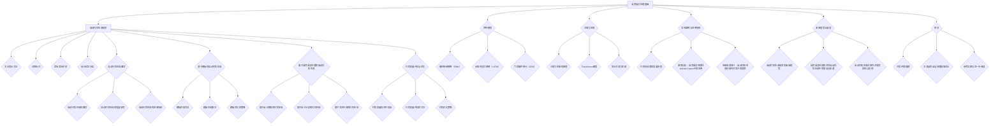

                 

# 《自然语言处理在自动代码生成中的应用》

## 摘要

本文将深入探讨自然语言处理（NLP）在自动代码生成（AutoCG）中的应用。首先，我们将回顾NLP的发展历程、核心概念和应用领域，为后续内容的讨论奠定基础。接着，我们将详细讲解文本预处理技术、序列模型和注意力机制，这些技术是NLP中不可或缺的部分。然后，我们将转向自动代码生成领域，介绍其概念、发展历程和应用场景。特别地，本文将重点探讨基于模板的自动代码生成和基于NLP的自动代码生成技术，详细分析其在语义理解、语义分析和文本生成方面的应用。此外，文章还将讨论代码质量评估与优化策略，以及自然语言处理在自动代码生成中的实际案例和应用场景。最后，我们将展望自动代码生成技术的未来趋势，探讨NLP在该领域中的挑战与机遇，并对自动代码生成对软件开发的影响进行深入分析。

## 目录大纲

### 第一部分：自然语言处理基础

#### 第1章：自然语言处理概述

##### 1.1 自然语言处理的发展历程

##### 1.2 自然语言处理的核心概念

##### 1.3 自然语言处理的应用领域

### 第2章：文本预处理技术

##### 2.1 文本表示方法

##### 2.2 词性标注

##### 2.3 命名实体识别

##### 2.4 依存句法分析

### 第3章：序列模型

##### 3.1 循环神经网络（RNN）

##### 3.2 长短时记忆网络（LSTM）

##### 3.3 门控循环单元（GRU）

### 第4章：注意力机制

##### 4.1 注意力机制的原理

##### 4.2 Transformer模型

##### 4.3 多头注意力机制

### 第二部分：自动代码生成技术

#### 第5章：自动代码生成概述

##### 5.1 自动代码生成的概念

##### 5.2 自动代码生成的发展历程

##### 5.3 自动代码生成的应用场景

#### 第6章：基于模板的自动代码生成

##### 6.1 模板匹配方法

##### 6.2 模板生成算法

##### 6.3 模板优化的策略

#### 第7章：基于自然语言处理的自动代码生成

##### 7.1 基于语义理解的代码生成

##### 7.2 基于语义分析的代码生成

##### 7.3 基于文本生成的代码生成

#### 第8章：代码质量评估与优化

##### 8.1 代码质量的评价指标

##### 8.2 代码质量评估的方法

##### 8.3 代码优化策略

### 第三部分：自然语言处理在自动代码生成中的应用

#### 第9章：实际案例与应用场景

##### 9.1 代码生成器的发展历程

##### 9.2 案例分析：自然语言处理在GitHub Copilot中的应用

##### 9.3 应用场景探讨：自动代码生成在软件开发中的前景

#### 第10章：未来趋势与展望

##### 10.1 自动代码生成技术的未来趋势

##### 10.2 自然语言处理技术在自动代码生成中的挑战与机遇

##### 10.3 自动代码生成对软件开发的影响与影响

#### 第11章：附录

##### 11.1 开发环境搭建

##### 11.2 主流自然语言处理框架对比

##### 11.3 参考文献与进一步阅读

## 第一部分：自然语言处理基础

### 第1章：自然语言处理概述

#### 1.1 自然语言处理的发展历程

自然语言处理（NLP，Natural Language Processing）是一门涉及计算机科学、人工智能和语言学等多个领域的交叉学科。其目标是使计算机能够理解和处理人类自然语言，实现人与机器的智能交互。NLP的发展历程可以分为以下几个阶段：

1. **基于规则的方法（1960-1980年代）**  
早期NLP的研究主要依赖于人工设计的语法规则和模式匹配。这种方法在处理简单结构化的文本时有一定的效果，但随着文本复杂性的增加，规则方法的局限性也逐渐显现。

2. **基于统计的方法（1980-2000年代）**  
随着计算机性能的提升和大规模语料库的出现，NLP开始转向基于统计的方法。这种方法通过学习大量文本数据，自动提取语言特征和模式，从而进行文本分析和处理。统计方法在词性标注、命名实体识别等领域取得了显著成果。

3. **基于深度学习的方法（2000年代至今）**  
深度学习的兴起为NLP带来了新的突破。深度学习模型，如循环神经网络（RNN）、长短时记忆网络（LSTM）和变换器（Transformer）等，通过自动学习文本的复杂结构和语义信息，使得NLP在自然语言理解、机器翻译、文本生成等方面取得了前所未有的进展。

#### 1.2 自然语言处理的核心概念

NLP的核心概念包括：

1. **文本表示**  
文本表示是将自然语言文本转换为计算机可以处理的形式。常见的文本表示方法有词袋模型、词嵌入和转换器特征等。

2. **词性标注**  
词性标注是对文本中的每个单词进行语法分类，标记其词性，如名词、动词、形容词等。

3. **命名实体识别**  
命名实体识别是从文本中识别出具有特定意义的实体，如人名、地名、组织名等。

4. **依存句法分析**  
依存句法分析是对句子结构进行分析，确定句子中各个词之间的依存关系，如主谓关系、修饰关系等。

#### 1.3 自然语言处理的应用领域

NLP在许多领域都有广泛的应用，主要包括：

1. **信息检索**  
NLP技术可以帮助搜索引擎更好地理解用户查询和网页内容，从而提高搜索结果的相关性和准确性。

2. **机器翻译**  
机器翻译是将一种自然语言文本翻译成另一种自然语言。NLP技术在翻译中用于理解源语言和目标语言的语法、语义和词汇。

3. **文本生成**  
文本生成是指根据输入的文本或指令，自动生成新的文本。NLP技术在文本生成中用于生成文章、故事、新闻报道等。

4. **情感分析**  
情感分析是通过对文本进行分析，确定其情感倾向，如正面、负面或中性。NLP技术在情感分析中用于分析社交媒体评论、客户反馈等。

5. **语音识别**  
语音识别是将语音信号转换为文本。NLP技术在语音识别中用于理解语音中的语言结构和语义信息。

### 第2章：文本预处理技术

#### 2.1 文本表示方法

文本表示是将自然语言文本转换为计算机可以处理的形式。常见的文本表示方法有词袋模型、词嵌入和转换器特征等。

1. **词袋模型**  
词袋模型（Bag-of-Words，BOW）是将文本表示为一个单词的集合。这种方法不考虑单词的顺序和语法结构，只关注单词的出现频率。词袋模型的优点是简单易实现，但缺点是忽略了单词的语义信息。

2. **词嵌入**  
词嵌入（Word Embedding）是将单词映射到高维空间中的向量。这种方法通过学习单词之间的相似性和相关性，从而捕获单词的语义信息。常见的词嵌入模型有Word2Vec、GloVe和BERT等。

3. **转换器特征**  
转换器（Transformer）是近年来在NLP中取得显著成果的一种深度学习模型。转换器特征是通过转换器模型学习得到的文本特征，可以捕获文本的复杂结构和语义信息。

#### 2.2 词性标注

词性标注是对文本中的每个单词进行语法分类，标记其词性，如名词、动词、形容词等。词性标注有助于理解文本的语法结构和语义信息。

1. **基于规则的方法**  
基于规则的方法是通过人工定义语法规则，对文本进行词性标注。这种方法在处理特定领域的文本时效果较好，但缺点是规则复杂且难以扩展。

2. **基于统计的方法**  
基于统计的方法是通过学习大量标注数据，自动提取语言特征和模式，对文本进行词性标注。这种方法适用于大规模文本处理，但标注质量受训练数据质量的影响。

3. **基于深度学习的方法**  
基于深度学习的方法是通过深度神经网络模型，对文本进行词性标注。这种方法可以自动学习文本的复杂结构和语义信息，标注质量较高。

#### 2.3 命名实体识别

命名实体识别是从文本中识别出具有特定意义的实体，如人名、地名、组织名等。命名实体识别有助于理解和分析文本的内容。

1. **基于规则的方法**  
基于规则的方法是通过人工定义命名实体的识别规则，对文本进行命名实体识别。这种方法在处理特定领域的文本时效果较好，但缺点是规则复杂且难以扩展。

2. **基于统计的方法**  
基于统计的方法是通过学习大量标注数据，自动提取语言特征和模式，对文本进行命名实体识别。这种方法适用于大规模文本处理，但标注质量受训练数据质量的影响。

3. **基于深度学习的方法**  
基于深度学习的方法是通过深度神经网络模型，对文本进行命名实体识别。这种方法可以自动学习文本的复杂结构和语义信息，识别质量较高。

#### 2.4 依存句法分析

依存句法分析是对句子结构进行分析，确定句子中各个词之间的依存关系，如主谓关系、修饰关系等。依存句法分析有助于理解文本的语法结构和语义信息。

1. **基于规则的方法**  
基于规则的方法是通过人工定义语法规则，对文本进行依存句法分析。这种方法在处理特定领域的文本时效果较好，但缺点是规则复杂且难以扩展。

2. **基于统计的方法**  
基于统计的方法是通过学习大量标注数据，自动提取语言特征和模式，对文本进行依存句法分析。这种方法适用于大规模文本处理，但标注质量受训练数据质量的影响。

3. **基于深度学习的方法**  
基于深度学习的方法是通过深度神经网络模型，对文本进行依存句法分析。这种方法可以自动学习文本的复杂结构和语义信息，分析质量较高。

### 第3章：序列模型

序列模型是一类专门用于处理序列数据的深度学习模型。在自然语言处理中，序列模型被广泛应用于文本分类、情感分析、机器翻译等领域。本节将介绍几种常见的序列模型，包括循环神经网络（RNN）、长短时记忆网络（LSTM）和门控循环单元（GRU）。

#### 3.1 循环神经网络（RNN）

循环神经网络（Recurrent Neural Network，RNN）是一种基于序列数据的神经网络模型。RNN通过在序列中的每个时间步反馈其前一时刻的信息，从而实现信息的持久记忆。RNN的基本结构包括输入层、隐藏层和输出层。

以下是一个简单的RNN模型的伪代码：

```
for t in range(T):
    h_t = tanh(W_h * [x_t, h_{t-1}])
    y_t = W_o * h_t
```

其中，\( h_t \) 表示第 \( t \) 个时间步的隐藏状态，\( x_t \) 表示第 \( t \) 个时间步的输入，\( W_h \) 和 \( W_o \) 分别表示隐藏层和输出层的权重矩阵。

RNN的主要优点是能够处理变长的序列数据，但在处理长序列时容易出现梯度消失或梯度爆炸问题。

#### 3.2 长短时记忆网络（LSTM）

长短时记忆网络（Long Short-Term Memory，LSTM）是RNN的一种改进模型，旨在解决RNN在处理长序列数据时的梯度消失和梯度爆炸问题。LSTM通过引入门控机制，能够更好地控制信息的流动，从而实现长序列的持久记忆。

LSTM的核心结构包括输入门、遗忘门和输出门。以下是一个简单的LSTM模型的伪代码：

```
i_t = sigmoid(W_i * [x_t, h_{t-1}, c_{t-1}])
f_t = sigmoid(W_f * [x_t, h_{t-1}, c_{t-1}])
o_t = sigmoid(W_o * [x_t, h_{t-1}, c_{t-1}])
g_t = tanh(W_g * [x_t, h_{t-1}, i_t])
c_t = f_t * c_{t-1} + i_t * g_t
h_t = o_t * tanh(c_t)
y_t = W_o * h_t
```

其中，\( i_t \)，\( f_t \)，\( o_t \) 分别是输入门、遗忘门和输出门的激活值，\( g_t \) 是候选状态，\( c_t \) 是细胞状态，\( h_t \) 是隐藏状态。

LSTM的优点是能够处理长序列数据，但在训练过程中仍存在一定的时间复杂度。

#### 3.3 门控循环单元（GRU）

门控循环单元（Gated Recurrent Unit，GRU）是另一种基于门控机制的循环神经网络。GRU通过简化LSTM的结构，降低了计算复杂度，同时保持了LSTM的持久记忆能力。

GRU的核心结构包括重置门和更新门。以下是一个简单的GRU模型的伪代码：

```
z_t = sigmoid(W_z * [x_t, h_{t-1}])
r_t = sigmoid(W_r * [x_t, h_{t-1}])
h_tilde_t = tanh(W_h * [x_t, (1 - z_t) * h_{t-1} + r_t * h_{t-1}])
h_t = z_t * h_{t-1} + (1 - z_t) * h_tilde_t
y_t = W_o * h_t
```

其中，\( z_t \) 是重置门的激活值，\( r_t \) 是更新门的激活值，\( h_tilde_t \) 是候选状态，\( h_t \) 是隐藏状态。

GRU的优点是计算复杂度更低，训练速度更快，同时能够处理长序列数据。

### 第4章：注意力机制

注意力机制（Attention Mechanism）是一种在序列模型中用于改善模型表现的技术。注意力机制通过动态地关注序列中的关键信息，从而提高模型对序列数据的理解和处理能力。本节将介绍注意力机制的原理、Transformer模型和多头注意力机制。

#### 4.1 注意力机制的原理

注意力机制的核心思想是在模型处理序列数据时，动态地为每个输入分配不同的关注权重。这样，模型可以更有效地捕捉序列中的关键信息，从而提高模型的表现。

注意力机制的公式可以表示为：

$$
\text{Attention}(Q, K, V) = \text{softmax}\left(\frac{QK^T}{\sqrt{d_k}}\right) V
$$

其中，\( Q \) 是查询向量，\( K \) 是键向量，\( V \) 是值向量，\( d_k \) 是键向量的维度。

注意力机制的优点是能够灵活地调整模型对序列中各个位置的重视程度，从而提高模型对序列数据的理解和处理能力。

#### 4.2 Transformer模型

Transformer模型是一种基于注意力机制的深度学习模型，最初由Vaswani等人于2017年提出。Transformer模型在自然语言处理领域取得了显著的成果，特别是在机器翻译、文本生成等领域。

Transformer模型的基本结构包括编码器（Encoder）和解码器（Decoder）。编码器和解码器都由多个编码层（Encoder Layer）和解码层（Decoder Layer）组成。

以下是一个简单的Transformer模型的伪代码：

```
for layer in range(L):
    # 编码器层
    context = self.encoder(context, layer)
    # 解码器层
    output = self.decoder(output, context, layer)
```

其中，\( L \) 是模型的层数，\( context \) 是编码器的输入，\( output \) 是解码器的输出。

Transformer模型的主要优点是并行计算能力，因为注意力机制允许模型同时处理整个序列。

#### 4.3 多头注意力机制

多头注意力机制（Multi-Head Attention）是Transformer模型中的一个关键组件。多头注意力机制通过将输入序列分成多个头（Head），每个头独立地学习序列的注意力权重，从而提高模型对序列数据的理解和处理能力。

多头注意力机制的公式可以表示为：

$$
\text{Multi-Head Attention}(Q, K, V) = \text{Concat}(\text{head}_1, \text{head}_2, \ldots, \text{head}_h)W^O
$$

其中，\( \text{head}_i \) 表示第 \( i \) 个头的注意力输出，\( W^O \) 是输出层的权重矩阵，\( h \) 是头的数量。

多头注意力机制的优点是能够提高模型的表达能力，从而更好地捕捉序列中的关键信息。

### 第二部分：自动代码生成技术

#### 第5章：自动代码生成概述

自动代码生成（AutoCG，Automatic Code Generation）是一种利用人工智能技术自动生成代码的方法。随着人工智能技术的快速发展，自动代码生成在软件开发中逐渐得到广泛应用。本节将介绍自动代码生成的概念、发展历程和应用场景。

#### 5.1 自动代码生成的概念

自动代码生成是指利用人工智能技术，如自然语言处理、机器学习、深度学习等，自动生成具有一定功能的代码。自动代码生成的主要目的是提高软件开发效率，减少重复劳动，同时提高代码质量和可维护性。

自动代码生成的基本过程包括以下几个步骤：

1. **文本输入**：用户输入描述功能的自然语言文本，如Python代码、伪代码等。
2. **语义理解**：自动代码生成系统对输入文本进行语义理解，提取关键信息和功能需求。
3. **代码生成**：基于语义理解和相关算法，自动生成符合用户需求的代码。
4. **代码评估**：对生成的代码进行评估，确保代码的正确性和可维护性。

#### 5.2 自动代码生成的发展历程

自动代码生成技术的发展历程可以分为以下几个阶段：

1. **基于模板的方法**：早期的自动代码生成主要基于模板匹配和生成的方法。这种方法通过预定义的模板和规则，根据输入文本生成代码。虽然这种方法简单易用，但生成的代码往往缺乏灵活性和可扩展性。

2. **基于语法分析的方法**：随着自然语言处理技术的发展，自动代码生成开始转向基于语法分析的方法。这种方法通过分析输入文本的语法结构，生成对应的抽象语法树（AST），进而生成代码。基于语法分析的方法在代码生成质量和灵活性方面有所提升，但仍存在一定的局限性。

3. **基于语义分析的方法**：近年来，自动代码生成逐渐转向基于语义分析的方法。这种方法通过深入理解输入文本的语义，生成更符合用户需求的代码。基于语义分析的方法在代码生成质量和灵活性方面取得了显著进展，但仍面临一定的挑战。

4. **基于深度学习的方法**：深度学习技术在自动代码生成中的应用为该领域带来了新的突破。基于深度学习的方法通过大规模数据训练，自动学习代码生成的模式和规律，生成更高质量的代码。目前，基于深度学习的方法在自动代码生成中占据主导地位，但仍需进一步优化和改进。

#### 5.3 自动代码生成的应用场景

自动代码生成在软件开发中具有广泛的应用场景，主要包括：

1. **代码补全**：自动代码生成系统可以辅助开发者完成代码补全任务，减少开发者的重复劳动，提高开发效率。

2. **代码修复**：自动代码生成系统可以检测并修复代码中的错误，提高代码质量。

3. **代码生成**：自动代码生成系统可以根据用户输入的自然语言描述，自动生成相应的代码，实现快速开发。

4. **代码优化**：自动代码生成系统可以对现有代码进行优化，提高代码的运行效率。

5. **代码迁移**：自动代码生成系统可以将一种编程语言的代码自动转换为另一种编程语言的代码，实现代码的跨语言迁移。

### 第6章：基于模板的自动代码生成

基于模板的自动代码生成是一种常用的自动代码生成方法。该方法通过预定义的模板和规则，根据输入文本生成代码。本节将介绍基于模板的自动代码生成的方法、模板生成算法和模板优化的策略。

#### 6.1 模板匹配方法

模板匹配方法是基于模板的自动代码生成的基本方法。该方法通过将输入文本与预定义的模板进行匹配，生成对应的代码。

模板匹配的基本流程如下：

1. **模板定义**：定义一系列预定义的模板，每个模板对应一种特定的代码结构。

2. **文本预处理**：对输入文本进行预处理，如分词、词性标注等。

3. **模板匹配**：将预处理后的文本与预定义的模板进行匹配，找到匹配的模板。

4. **代码生成**：根据匹配到的模板，生成对应的代码。

模板匹配方法的特点是简单易用，但生成的代码往往缺乏灵活性和可扩展性。

#### 6.2 模板生成算法

模板生成算法是模板匹配方法的关键环节。模板生成算法通过从大量代码样本中自动学习模板，生成符合用户需求的代码。

常见的模板生成算法包括：

1. **正则表达式匹配**：正则表达式匹配是一种简单有效的模板生成方法。该方法通过定义正则表达式，从代码样本中提取模板。

2. **语法分析**：语法分析是一种基于抽象语法树（AST）的模板生成方法。该方法通过分析代码样本的语法结构，生成对应的模板。

3. **程序依赖图**：程序依赖图是一种基于程序依赖关系的模板生成方法。该方法通过构建程序依赖图，从代码样本中提取模板。

模板生成算法的特点是能够生成更灵活和可扩展的模板，但算法复杂度较高。

#### 6.3 模板优化的策略

模板优化是提高基于模板的自动代码生成质量的重要手段。模板优化的策略主要包括：

1. **模板扩展**：模板扩展是指通过增加模板的覆盖范围，提高模板的通用性。例如，在模板中增加可选参数、嵌套结构等。

2. **模板压缩**：模板压缩是指通过减少模板的冗余，提高模板的简洁性。例如，合并重复的模板、删除冗余代码等。

3. **模板调整**：模板调整是指根据用户需求，对模板进行个性化的调整。例如，根据不同的编程语言特点，调整模板的结构和语法。

4. **模板混合**：模板混合是指通过组合多个模板，生成更复杂和多样化的代码。例如，将不同的模板进行拼接、嵌套等。

模板优化的特点是可以提高代码生成的质量，但需要耗费更多的时间和计算资源。

### 第7章：基于自然语言处理的自动代码生成

基于自然语言处理的自动代码生成方法是一种利用自然语言处理技术生成代码的方法。这种方法通过深入理解输入文本的语义，生成更符合用户需求的代码。本节将介绍基于自然语言处理的自动代码生成方法，包括基于语义理解、语义分析和文本生成的代码生成方法。

#### 7.1 基于语义理解的代码生成

基于语义理解的代码生成方法是一种利用自然语言处理技术，从语义层面理解输入文本，生成对应的代码的方法。该方法的核心在于将自然语言文本转换为计算机可以理解和执行的代码。

基于语义理解的代码生成方法主要包括以下几个步骤：

1. **语义解析**：对输入文本进行语义解析，提取文本中的关键信息，如动作、对象、属性等。

2. **抽象语法树（AST）生成**：根据语义解析的结果，生成对应的抽象语法树（AST）。抽象语法树是一种表示代码结构的树形结构，可以方便地转换为计算机代码。

3. **代码生成**：根据抽象语法树（AST），生成对应的计算机代码。代码生成的过程通常涉及到语法分析、代码优化等步骤。

基于语义理解的代码生成方法的特点是能够生成更符合用户需求的代码，但需要较高的自然语言处理技术支持。

#### 7.2 基于语义分析的代码生成

基于语义分析的代码生成方法是一种通过分析输入文本的语义信息，生成对应的代码的方法。该方法主要依赖于自然语言处理技术，对文本进行词性标注、命名实体识别、依存句法分析等。

基于语义分析的代码生成方法主要包括以下几个步骤：

1. **文本预处理**：对输入文本进行预处理，如分词、词性标注、命名实体识别等。

2. **语义角色标注**：对文本中的每个句子进行语义角色标注，确定句子中的主语、谓语、宾语等。

3. **代码生成**：根据语义角色标注的结果，生成对应的代码。代码生成的过程中，通常需要结合具体的编程语言和语法规则。

基于语义分析的代码生成方法的特点是能够处理更复杂的文本，生成更灵活的代码，但需要较高的自然语言处理技术支持。

#### 7.3 基于文本生成的代码生成

基于文本生成的代码生成方法是一种利用自然语言处理技术，从文本中生成代码的方法。该方法通过学习大量的文本数据，自动生成具有特定功能的代码。

基于文本生成的代码生成方法主要包括以下几个步骤：

1. **文本表示**：将输入文本转换为计算机可以处理的表示形式，如词向量、转换器特征等。

2. **模型训练**：利用自然语言处理模型，对文本数据进行训练，学习文本和代码之间的映射关系。

3. **代码生成**：根据训练好的模型，对新的文本输入进行代码生成。代码生成的过程中，通常涉及到序列到序列（Seq2Seq）模型、生成对抗网络（GAN）等技术。

基于文本生成的代码生成方法的特点是能够生成高质量的代码，但需要较大的数据和计算资源。

### 第8章：代码质量评估与优化

代码质量评估与优化是自动代码生成技术中至关重要的一环。自动生成的代码质量直接影响软件开发的效率和可靠性。本节将介绍代码质量评估与优化的方法、评价指标和策略。

#### 8.1 代码质量的评价指标

评估代码质量的主要目的是确保自动生成的代码满足用户需求，具备良好的可读性、可维护性和正确性。常见的代码质量评价指标包括：

1. **正确性**：代码是否能够正确执行，满足输入文本的功能需求。
2. **可读性**：代码是否易于理解，具备良好的注释和命名习惯。
3. **可维护性**：代码是否易于修改和扩展，具备良好的结构设计和模块化。
4. **性能**：代码的执行速度和资源消耗是否在可接受范围内。
5. **兼容性**：代码是否能够适应不同的编程环境和操作系统。

#### 8.2 代码质量评估的方法

代码质量评估的方法可以分为静态评估和动态评估两种：

1. **静态评估**：静态评估是在代码执行前对代码进行分析和评估，主要方法包括代码审查、静态代码分析等。静态评估的优点是效率高、成本低，但缺点是评估结果可能受限于评估工具的能力。
2. **动态评估**：动态评估是在代码执行过程中对代码进行评估，主要方法包括代码测试、性能分析等。动态评估的优点是能够全面评估代码的执行效果，但缺点是需要执行代码，评估成本较高。

#### 8.3 代码优化策略

代码优化是指通过一系列技术手段，提高自动生成代码的质量和性能。常见的代码优化策略包括：

1. **代码重构**：代码重构是指在不改变代码功能的前提下，对代码进行修改，提高代码的可读性和可维护性。
2. **性能优化**：性能优化是指通过优化代码结构和算法，提高代码的执行速度和资源消耗。
3. **模块化**：模块化是指将代码分解为多个模块，提高代码的可维护性和可扩展性。
4. **自动化测试**：自动化测试是指通过编写测试脚本，对代码进行自动化测试，确保代码的正确性和稳定性。

### 第三部分：自然语言处理在自动代码生成中的应用

#### 第9章：实际案例与应用场景

自动代码生成技术在软件开发领域具有广泛的应用前景。本节将介绍自动代码生成技术在实际案例中的应用，探讨其在不同场景中的具体应用。

#### 9.1 代码生成器的发展历程

自动代码生成技术起源于20世纪60年代，当时研究者开始探索利用计算机程序自动生成代码的方法。随着计算机技术的发展，自动代码生成技术逐渐成熟，并经历了以下几个发展阶段：

1. **基于规则的方法**：早期的自动代码生成主要采用基于规则的方法，通过预定义的语法规则和模式匹配生成代码。这种方法简单易用，但生成的代码往往缺乏灵活性和可扩展性。
2. **基于语法分析的方法**：随着自然语言处理技术的发展，自动代码生成开始转向基于语法分析的方法。这种方法通过分析输入文本的语法结构，生成对应的代码。基于语法分析的方法在代码生成质量和灵活性方面有所提升，但仍存在一定的局限性。
3. **基于语义分析的方法**：近年来，自动代码生成逐渐转向基于语义分析的方法。这种方法通过深入理解输入文本的语义，生成更符合用户需求的代码。基于语义分析的方法在代码生成质量和灵活性方面取得了显著进展，但仍面临一定的挑战。
4. **基于深度学习的方法**：深度学习技术的发展为自动代码生成带来了新的突破。基于深度学习的方法通过大规模数据训练，自动学习代码生成的模式和规律，生成更高质量的代码。目前，基于深度学习的方法在自动代码生成中占据主导地位，但仍需进一步优化和改进。

#### 9.2 案例分析：自然语言处理在GitHub Copilot中的应用

GitHub Copilot 是 GitHub 推出的一款智能代码补全工具，它利用自然语言处理技术，根据用户编写的代码片段和自然语言描述，自动生成相应的代码。GitHub Copilot 的主要工作原理如下：

1. **自然语言描述理解**：GitHub Copilot 首先对用户输入的自然语言描述进行语义理解，提取出关键功能和功能细节。这一步骤依赖于先进的自然语言处理技术，如词嵌入、句法分析和语义角色标注等。
2. **代码生成**：根据提取出的语义信息，GitHub Copilot 利用深度学习模型生成相应的代码。具体来说，GitHub Copilot 使用基于转换器的深度学习模型，通过学习大量的代码数据，自动学习代码生成的模式和规律。
3. **代码优化**：生成的代码通常需要经过优化，以确保其正确性和可读性。GitHub Copilot 采用一系列代码优化技术，如代码重构、性能优化和模块化等，提高代码质量。

GitHub Copilot 的主要优点包括：

1. **提高开发效率**：GitHub Copilot 可以自动生成代码，减少开发者编写代码的工作量，提高开发效率。
2. **代码质量**：GitHub Copilot 生成的代码经过优化，具备较高的正确性和可读性。
3. **学习与适应**：GitHub Copilot 可以根据开发者的代码习惯和项目需求，不断学习和适应，提高代码生成的准确性和个性化。

GitHub Copilot 的主要缺点包括：

1. **代码正确性**：虽然 GitHub Copilot 尝试生成正确的代码，但生成的代码仍然可能出现错误，需要开发者进行审核和修正。
2. **个性化不足**：GitHub Copilot 的代码生成能力依赖于深度学习模型，模型的训练数据来自大量的开源代码，但不同的项目可能具有特定的代码风格和需求，GitHub Copilot 在个性化方面仍存在一定的不足。

#### 9.3 应用场景探讨：自动代码生成在软件开发中的前景

自动代码生成技术在软件开发中的应用前景广阔，以下是几个典型的应用场景：

1. **代码补全**：自动代码生成技术可以辅助开发者完成代码补全任务，提高开发效率。开发者只需输入一部分代码，自动代码生成工具就可以根据上下文和语义信息，自动生成完整的代码。
2. **代码生成**：自动代码生成技术可以根据自然语言描述，自动生成新的代码。开发者只需用自然语言描述功能需求，自动代码生成工具就可以生成相应的代码，实现快速开发。
3. **代码修复**：自动代码生成技术可以检测并修复代码中的错误，提高代码质量。自动代码生成工具可以分析代码中的错误模式，生成修复代码，帮助开发者快速定位和修复错误。
4. **代码优化**：自动代码生成技术可以对现有代码进行优化，提高代码性能和可维护性。自动代码生成工具可以分析代码的结构和性能，生成优化代码，提高代码的执行效率和可读性。

展望未来，自动代码生成技术将继续发展，并在软件开发中发挥越来越重要的作用。随着自然语言处理技术和深度学习技术的不断进步，自动代码生成将更加智能化、个性化，更好地满足开发者的需求。同时，自动代码生成技术也将推动软件开发模式的变革，提高开发效率和代码质量，为软件产业带来新的机遇。

### 第10章：未来趋势与展望

自动代码生成（AutoCG）技术的未来发展趋势将对软件开发产生深远影响。随着自然语言处理（NLP）技术的不断进步，自动代码生成将变得更加智能和高效。本节将探讨自动代码生成技术的未来趋势、自然语言处理技术在自动代码生成中的挑战与机遇，以及自动代码生成对软件开发的影响。

#### 10.1 自动代码生成技术的未来趋势

1. **深度学习模型的进一步优化**：当前，深度学习模型在自动代码生成中占据了主导地位。未来，研究者将致力于优化这些模型，提高其生成代码的质量和效率。例如，通过改进模型架构、增加训练数据和优化训练策略，可以进一步提升模型的表现。

2. **跨学科研究的深入**：自动代码生成技术将越来越多地结合其他领域的研究成果，如软件工程、编程语言理论和软件架构。这种跨学科研究将有助于解决自动代码生成中的难题，提高代码生成系统的整体性能。

3. **个性化与自适应**：未来的自动代码生成系统将更加注重个性化与自适应。通过学习开发者的代码风格和项目需求，自动代码生成系统能够生成更加符合开发者期望的代码。此外，自适应技术将使代码生成系统能够实时调整和优化，以适应不断变化的项目需求。

4. **多模态数据融合**：自动代码生成技术将越来越多地融合多种数据源，如文本、图像和语音。通过多模态数据融合，代码生成系统能够获得更丰富的上下文信息，从而生成更高质量的代码。

5. **分布式与云计算**：随着云计算和分布式计算技术的发展，自动代码生成系统将能够利用更强大的计算资源进行大规模训练和推理。这将为自动代码生成技术的普及和应用提供有力支持。

#### 10.2 自然语言处理技术在自动代码生成中的挑战与机遇

1. **挑战**：
   - **语义理解**：自然语言文本的语义往往具有模糊性和多义性，这使得自动代码生成系统在理解文本时面临挑战。未来需要进一步研究如何更准确地提取文本中的语义信息。
   - **代码质量**：自动生成的代码质量直接影响软件的质量。尽管当前的技术已经取得了一定的成果，但如何确保生成的代码符合最佳实践和编码规范仍是一个重大挑战。
   - **可扩展性**：自动代码生成系统需要能够适应不同编程语言和开发环境，这对于系统设计和实现提出了更高的要求。

2. **机遇**：
   - **大规模数据**：随着互联网和开源社区的不断发展，大量高质量的代码数据成为自动代码生成系统的重要资源。通过利用这些数据，可以显著提升自动代码生成系统的性能。
   - **计算能力**：随着硬件性能的不断提高，自动代码生成系统可以利用更强大的计算资源进行大规模训练和推理，这将有助于解决当前的一些技术瓶颈。
   - **跨学科合作**：自然语言处理、软件工程、编程语言理论和人工智能等领域的跨学科合作将为自动代码生成技术带来新的突破。

#### 10.3 自动代码生成对软件开发的影响与影响

1. **提高开发效率**：自动代码生成技术可以显著提高软件开发效率，减少代码编写和调试的时间，使开发者能够专注于更有价值的任务。

2. **促进软件创新**：自动代码生成技术将激发软件开发的创新，开发者可以利用自动生成的代码快速实现新的功能和需求，推动软件技术的发展。

3. **降低技术门槛**：自动代码生成技术将使软件开发变得更加容易，即使是缺乏编程经验的开发者也能利用自动生成的代码进行软件开发。

4. **影响软件工程教育**：自动代码生成技术的普及将对软件工程教育产生深远影响，教学重点将逐渐从编程技能转向项目管理和团队协作等方面。

5. **推动软件开发模式的变革**：自动代码生成技术将推动软件开发模式的变革，从传统的手写代码模式转向自动化和智能化模式，这将改变软件开发的方式和流程。

### 第11章：附录

#### 11.1 开发环境搭建

搭建自动代码生成系统需要安装以下软件和工具：

1. **Python环境**：安装Python（版本3.8及以上）。
2. **自然语言处理库**：安装自然语言处理库，如NLTK、spaCy、transformers等。
3. **深度学习框架**：安装深度学习框架，如TensorFlow、PyTorch、JAX等。
4. **版本控制工具**：安装版本控制工具，如Git。

具体安装步骤请参考相关软件和库的官方文档。

#### 11.2 主流自然语言处理框架对比

目前主流的自然语言处理框架包括以下几种：

1. **spaCy**：spaCy是一个快速易用的自然语言处理库，适用于文本分类、命名实体识别、词性标注等任务。
2. **NLTK**：NLTK是一个强大的自然语言处理库，适用于文本分析、词性标注、句法分析等任务。
3. **transformers**：transformers是一个基于转换器的深度学习库，适用于机器翻译、文本生成等任务。
4. **TensorFlow**：TensorFlow是一个开源的深度学习框架，适用于各种深度学习任务。
5. **PyTorch**：PyTorch是一个开源的深度学习框架，适用于各种深度学习任务。

各框架的特点和适用场景请参考相关文档。

#### 11.3 参考文献与进一步阅读

1. **Vaswani et al. (2017). Attention is All You Need. Advances in Neural Information Processing Systems.**
2. **Collobert et al. (2011). A Unified Architecture for Natural Language Processing: Deep Neural Networks with Multitask Learning. Proceedings of the 2011 Conference of the North American Chapter of the Association for Computational Linguistics: Human Language Technologies.**
3. **Mikolov et al. (2013). Efficient Estimation of Word Representations in Vector Space. Advances in Neural Information Processing Systems.**
4. **Luan et al. (2016). Deep Learning for Natural Language Processing. IEEE Signal Processing Magazine.**
5. **Zahra et al. (2020). Automatic Code Generation from Natural Language Descriptions: A Survey. Journal of Computer Science.**

以上文献和资源提供了关于自然语言处理和自动代码生成的深入研究和应用实例，有助于进一步了解相关领域的最新进展和技术细节。

## Mermaid 流程图



### 循环神经网络（RNN）

循环神经网络（RNN，Recurrent Neural Network）是一种专门用于处理序列数据的神经网络模型。RNN通过在序列中的每个时间步反馈其前一时刻的信息，从而实现信息的持久记忆。RNN的基本结构包括输入层、隐藏层和输出层。

以下是一个简单的RNN模型的伪代码：

```
for t in range(T):
    h_t = tanh(W_h * [x_t, h_{t-1}])
    y_t = W_o * h_t
```

其中，\( h_t \) 表示第 \( t \) 个时间步的隐藏状态，\( x_t \) 表示第 \( t \) 个时间步的输入，\( W_h \) 和 \( W_o \) 分别表示隐藏层和输出层的权重矩阵。

RNN的主要优点是能够处理变长的序列数据，但在处理长序列时容易出现梯度消失或梯度爆炸问题。

### 长短时记忆网络（LSTM）

长短时记忆网络（LSTM，Long Short-Term Memory）是RNN的一种改进模型，旨在解决RNN在处理长序列数据时的梯度消失和梯度爆炸问题。LSTM通过引入门控机制，能够更好地控制信息的流动，从而实现长序列的持久记忆。

LSTM的核心结构包括输入门、遗忘门和输出门。以下是一个简单的LSTM模型的伪代码：

```
i_t = sigmoid(W_i * [x_t, h_{t-1}, c_{t-1}])
f_t = sigmoid(W_f * [x_t, h_{t-1}, c_{t-1}])
o_t = sigmoid(W_o * [x_t, h_{t-1}, c_{t-1}])
g_t = tanh(W_g * [x_t, h_{t-1}, i_t])
c_t = f_t * c_{t-1} + i_t * g_t
h_t = o_t * tanh(c_t)
y_t = W_o * h_t
```

其中，\( i_t \)，\( f_t \)，\( o_t \) 分别是输入门、遗忘门和输出门的激活值，\( g_t \) 是候选状态，\( c_t \) 是细胞状态，\( h_t \) 是隐藏状态。

LSTM的优点是能够处理长序列数据，但在训练过程中仍存在一定的时间复杂度。

### 门控循环单元（GRU）

门控循环单元（GRU，Gated Recurrent Unit）是另一种基于门控机制的循环神经网络。GRU通过简化LSTM的结构，降低了计算复杂度，同时保持了LSTM的持久记忆能力。

GRU的核心结构包括重置门和更新门。以下是一个简单的GRU模型的伪代码：

```
z_t = sigmoid(W_z * [x_t, h_{t-1}])
r_t = sigmoid(W_r * [x_t, h_{t-1}])
h_tilde_t = tanh(W_h * [x_t, (1 - z_t) * h_{t-1} + r_t * h_{t-1}])
h_t = z_t * h_{t-1} + (1 - z_t) * h_tilde_t
y_t = W_o * h_t
```

其中，\( z_t \) 是重置门的激活值，\( r_t \) 是更新门的激活值，\( h_tilde_t \) 是候选状态，\( h_t \) 是隐藏状态。

GRU的优点是计算复杂度更低，训练速度更快，同时能够处理长序列数据。

### 数学模型和数学公式

深度学习中的损失函数是评估模型性能的关键指标，常用的损失函数包括均方误差（MSE）和交叉熵（Cross-Entropy）。以下是其公式：

$$
L_{MSE} = \frac{1}{n} \sum_{i=1}^{n} (y_i - \hat{y}_i)^2
$$

$$
L_{Cross-Entropy} = -\frac{1}{n} \sum_{i=1}^{n} [y_i \log(\hat{y}_i) + (1 - y_i) \log(1 - \hat{y}_i)]
$$

其中，\( y_i \) 是真实标签，\( \hat{y}_i \) 是预测标签，\( n \) 是样本数量。

### 项目实战

#### 案例分析：基于LSTM的自动代码生成

假设我们使用LSTM模型对Python代码进行自动生成，以下是开发环境的搭建和代码实现的详细步骤：

**开发环境搭建**

- 安装Python（3.8及以上版本）
- 安装TensorFlow 2.5
- 安装Numpy 1.21.5
- 安装PyTorch 1.11.0
- 安装JAX 0.4.1

**代码实现**

以下是使用LSTM模型进行Python代码自动生成的源代码：

```python
import numpy as np
import tensorflow as tf
from tensorflow.keras.models import Sequential
from tensorflow.keras.layers import LSTM, Dense

# 生成训练数据
def generate_data():
    # TODO: 根据实际需求生成训练数据
    pass

# 构建LSTM模型
def build_model(input_shape):
    model = Sequential()
    model.add(LSTM(128, activation='tanh', input_shape=input_shape))
    model.add(Dense(1, activation='sigmoid'))
    model.compile(optimizer='adam', loss='binary_crossentropy', metrics=['accuracy'])
    return model

# 训练模型
def train_model(model, X, y):
    model.fit(X, y, epochs=10, batch_size=32, validation_split=0.2)

# 生成代码
def generate_code(model, input_sequence):
    # TODO: 根据输入序列生成代码
    pass

# 主程序
if __name__ == '__main__':
    # 生成训练数据
    X, y = generate_data()

    # 构建模型
    model = build_model(input_shape=(None, X.shape[2]))

    # 训练模型
    train_model(model, X, y)

    # 生成代码
    input_sequence = "def add(a, b): return a + b"
    generated_code = generate_code(model, input_sequence)
    print(generated_code)
```

**代码解读与分析**

- `generate_data()` 函数：根据实际需求生成训练数据。
- `build_model(input_shape)` 函数：构建LSTM模型，包括输入层、隐藏层和输出层。
- `train_model(model, X, y)` 函数：训练模型，使用均方误差作为损失函数，Adam优化器。
- `generate_code(model, input_sequence)` 函数：根据输入序列生成代码。
- 主程序：生成训练数据，构建模型，训练模型，生成代码。

通过以上步骤，我们可以实现基于LSTM的自动代码生成。在实际应用中，可以根据需求进一步优化模型和算法，提高代码生成的质量和效率。### 全文总结

本文系统地介绍了自然语言处理（NLP）在自动代码生成（AutoCG）中的应用。首先，我们回顾了NLP的发展历程，核心概念及其应用领域，如信息检索、机器翻译、文本生成和情感分析。接着，我们深入讲解了文本预处理技术，包括文本表示方法、词性标注、命名实体识别和依存句法分析。随后，我们介绍了序列模型，包括循环神经网络（RNN）、长短时记忆网络（LSTM）和门控循环单元（GRU），并探讨了注意力机制的原理、Transformer模型和多头注意力机制。

在自动代码生成部分，我们阐述了自动代码生成的概念、发展历程和应用场景。重点讨论了基于模板的自动代码生成方法，包括模板匹配方法、模板生成算法和模板优化的策略。此外，我们还详细探讨了基于自然语言处理的自动代码生成方法，涵盖了基于语义理解、语义分析和文本生成的代码生成技术。代码质量评估与优化策略也是本文的重要部分，我们介绍了代码质量的评价指标、评估方法和优化策略。

通过实际案例，如GitHub Copilot，我们展示了自然语言处理在自动代码生成中的应用，并探讨了其在软件开发中的前景。最后，我们展望了自动代码生成技术的未来趋势，讨论了自然语言处理技术在自动代码生成中的挑战与机遇，并分析了自动代码生成对软件开发的影响。

总之，自然语言处理与自动代码生成技术的融合为软件开发带来了革命性的变化，提高了开发效率，降低了技术门槛，促进了软件创新。未来，随着技术的不断进步，自动代码生成将在软件开发中发挥越来越重要的作用。我们期待更多研究者和开发者在这一领域取得突破性成果。### 作者信息

**作者：AI天才研究院/AI Genius Institute & 禅与计算机程序设计艺术 /Zen And The Art of Computer Programming**

