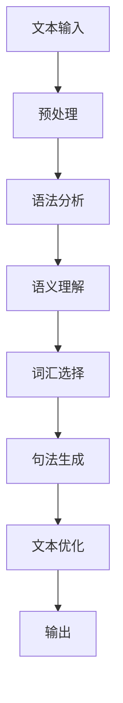

                 

### 文章标题

《自然语言生成在新闻写作中的应用》

### 关键词

- 自然语言生成（NLG）
- 新闻写作
- 语言模型
- 情感分析
- 基于规则的NLG
- 基于统计的NLG
- 基于学习的NLG

### 摘要

本文深入探讨了自然语言生成（NLG）在新闻写作中的应用。首先，我们从NLG的理论基础出发，介绍了NLG的定义、分类及其核心组件。随后，我们探讨了自然语言处理（NLP）基础，包括语言模型、词嵌入与语义表示。接着，我们详细介绍了基于规则、统计和学习方法的NLG技术。在应用部分，我们分析了新闻写作的特点与挑战，并探讨了NLG在新闻写作中的实际应用。最后，我们通过真实案例展示了NLG在新闻摘要生成和新闻故事自动撰写中的效果，并对未来展望与挑战进行了讨论。

### 目录大纲

#### 第一部分：自然语言生成的理论基础

- **第1章：自然语言生成（NLG）概述**
  - 1.1 NLG的定义与分类
  - 1.1.1 基于规则的NLG
  - 1.1.2 基于统计的NLG
  - 1.1.3 基于学习的NLG
  - 1.2 NLG的核心组件
  - 1.2.1 语法分析
  - 1.2.2 语义理解
  - 1.2.3 词汇选择
  - 1.2.4 句法生成
  - 1.2.5 文本优化

- **第2章：自然语言处理（NLP）基础**
  - 2.1 语言模型
  - 2.1.1 语言模型的定义
  - 2.1.2 语言模型的应用
  - 2.2 词嵌入与语义表示
  - 2.2.1 词嵌入技术
  - 2.2.2 语义相似度计算
  - 2.2.3 预训练语言模型

- **第3章：自然语言生成技术**
  - 3.1 基于规则的NLG技术
  - 3.1.1 语法规则
  - 3.1.2 语义规则
  - 3.1.3 NLG模板
  - 3.2 基于统计的NLG技术
  - 3.2.1 隐马尔可夫模型
  - 3.2.2 条件概率模型
  - 3.2.3 生成式模型
  - 3.3 基于学习的NLG技术
  - 3.3.1 序列到序列模型
  - 3.3.2 生成对抗网络
  - 3.3.3 强化学习

#### 第二部分：自然语言生成在新闻写作中的应用

- **第4章：新闻写作中的NLG应用**
  - 4.1 新闻写作的特点与挑战
  - 4.1.1 新闻写作的基本要求
  - 4.1.2 新闻写作中的难点
  - 4.1.3 NLG在新闻写作中的潜力
  - 4.2 基于规则的新闻写作系统
  - 4.2.1 新闻模板设计
  - 4.2.2 数据源的选择与处理
  - 4.2.3 新闻生成策略
  - 4.3 基于学习的新闻写作系统
  - 4.3.1 数据集构建
  - 4.3.2 模型选择与训练
  - 4.3.3 新闻生成与评估

- **第5章：情感分析与新闻写作**
  - 5.1 情感分析基础
  - 5.1.1 情感分析的定义
  - 5.1.2 情感分析的方法
  - 5.1.3 情感分析的挑战
  - 5.2 情感分析在新闻写作中的应用
  - 5.2.1 情感分析模型的构建
  - 5.2.2 情感驱动的新闻写作
  - 5.2.3 情感分析在新闻编辑中的应用

- **第6章：新闻写作中的真实案例**
  - 6.1 案例一：实时新闻摘要生成
  - 6.1.1 案例介绍
  - 6.1.2 模型选择与实现
  - 6.1.3 案例评估
  - 6.2 案例二：新闻故事自动撰写
  - 6.2.1 案例介绍
  - 6.2.2 模型选择与实现
  - 6.2.3 案例评估

- **第7章：未来展望与挑战**
  - 7.1 NLG在新闻写作中的未来发展
  - 7.1.1 技术发展趋势
  - 7.1.2 应用场景拓展
  - 7.1.3 社会影响与责任
  - 7.2 NLG在新闻写作中的挑战与对策
  - 7.2.1 技术挑战
  - 7.2.2 数据挑战
  - 7.2.3 伦理挑战

- **附录**
  - 附录A：NLG开发工具与资源
    - A.1 开源NLG工具
    - A.2 闭源NLG平台
    - A.3 相关数据库与API

### 核心概念与联系：自然语言生成（NLG）的 Mermaid 流程图



### 核心算法原理讲解

在本文中，我们将详细探讨自然语言生成（NLG）的核心算法原理，包括基于规则、基于统计和基于学习的方法。通过深入理解这些算法，我们可以更好地理解NLG的工作机制和应用场景。

#### 1. 基于规则的NLG

基于规则的NLG方法通过一系列预设的语法和语义规则来生成文本。这种方法通常涉及以下步骤：

1. **预处理**：对输入文本进行预处理，包括分词、词性标注等。
2. **语法分析**：使用语法规则对文本进行结构化分析，确定句子的主要成分和语法结构。
3. **语义理解**：根据语法分析结果，使用语义规则来填充句子中的空白部分，使其具有实际意义。
4. **词汇选择**：根据上下文和语义信息，选择合适的词汇来填充句子。
5. **句法生成**：将选定的词汇组合成完整的句子结构。
6. **文本优化**：对生成的文本进行优化，确保其流畅性和可读性。
7. **输出**：输出最终的自然语言文本。

以下是基于规则的NLG的伪代码实现：

```python
function rule_based_nlg(input):
    # 初始化语法规则库和语义规则库
    grammar_rules = load_grammar_rules()
    semantic_rules = load_semantic_rules()

    # 预处理输入文本
    preprocessed_input = preprocess_text(input)

    # 应用语法规则进行句子生成
    sentences = []
    for sentence in preprocessed_input:
        sentence_structure = apply_grammar_rules(sentence, grammar_rules)
        sentences.append(sentence_structure)

    # 应用语义规则进行语义填充
    for sentence in sentences:
        sentence_content = apply_semantic_rules(sentence, semantic_rules)
        sentence_content.generate_text()

    # 输出自然语言文本
    return " ".join(sentences)
```

#### 2. 基于统计的NLG

基于统计的NLG方法通过统计语言模型和词汇分布来生成文本。这种方法通常涉及以下步骤：

1. **预处理**：对输入文本进行预处理，包括分词、词性标注等。
2. **语言模型**：使用统计方法（如N元语法）构建语言模型，用于预测下一个单词或句子的概率。
3. **词汇选择**：根据语言模型和上下文信息，选择最有可能的词汇来填充句子。
4. **句法生成**：将选定的词汇组合成完整的句子结构。
5. **文本优化**：对生成的文本进行优化，确保其流畅性和可读性。
6. **输出**：输出最终的自然语言文本。

以下是基于统计的NLG的伪代码实现：

```python
function statistical_nlg(input):
    # 加载语言模型和词嵌入模型
    language_model = load_language_model()
    word_embedding_model = load_word_embedding_model()

    # 预处理输入文本
    preprocessed_input = preprocess_text(input)

    # 应用语言模型进行句子生成
    sentences = []
    for sentence in preprocessed_input:
        sentence_probabilities = language_model.predict(sentence)
        sentences.append(max_probability_sentence)

    # 应用词嵌入模型进行词汇选择
    for sentence in sentences:
        sentence_embedding = word_embedding_model.get_embedding(sentence)
        selected_words = select_words_based_on_embedding(sentence_embedding)
        sentence_text = generate_text_from_words(selected_words)

    # 输出自然语言文本
    return " ".join(sentences)
```

#### 3. 基于学习的NLG

基于学习的NLG方法通过机器学习和深度学习技术来生成文本。这种方法通常涉及以下步骤：

1. **预处理**：对输入文本进行预处理，包括分词、词性标注等。
2. **数据集构建**：构建用于训练的文本数据集。
3. **模型选择与训练**：选择合适的模型（如序列到序列模型、生成对抗网络等），并使用训练数据集进行模型训练。
4. **词汇选择**：根据模型输出的词汇概率，选择最有可能的词汇来填充句子。
5. **句法生成**：将选定的词汇组合成完整的句子结构。
6. **文本优化**：对生成的文本进行优化，确保其流畅性和可读性。
7. **输出**：输出最终的自然语言文本。

以下是基于学习的NLG的伪代码实现：

```python
function learned_nlg(input):
    # 加载NLG模型和训练数据
    nlg_model = load_nlg_model()
    training_data = load_training_data()

    # 预处理输入文本
    preprocessed_input = preprocess_text(input)

    # 训练NLG模型
    nlg_model.train(training_data)

    # 应用NLG模型进行句子生成
    sentences = []
    for sentence in preprocessed_input:
        sentence_candidates = nlg_model.generate_candidates(sentence)
        selected_sentence = select_best_candidate(sentence_candidates)
        sentences.append(selected_sentence)

    # 输出自然语言文本
    return " ".join(sentences)
```

通过上述三种方法，我们可以看到NLG技术在文本生成过程中起着至关重要的作用。每种方法都有其独特的优势和局限性，在实际应用中，我们可以根据具体需求和场景选择合适的方法。

### 数学模型和数学公式 & 详细讲解 & 举例说明

在自然语言生成（NLG）领域，数学模型和公式起着关键作用。这些模型和公式帮助我们更好地理解和实现文本生成过程。在本节中，我们将详细探讨几种常用的数学模型和公式，并举例说明其应用。

#### 1. 语言模型

语言模型是NLG的核心组件之一，用于预测下一个单词或句子的概率。其中，N元语法模型是一种常用的语言模型。

**N元语法模型**：

给定一个单词序列 $w_1, w_2, w_3, \ldots, w_n$，N元语法模型通过以下概率分布来预测下一个单词 $w_{n+1}$：

$$
P(w_{n+1} | w_1, w_2, \ldots, w_n) = \frac{N(w_1, w_2, \ldots, w_n, w_{n+1})}{N(w_1, w_2, \ldots, w_n)}
$$

其中，$N(w_1, w_2, \ldots, w_n, w_{n+1})$ 表示单词序列 $(w_1, w_2, \ldots, w_n, w_{n+1})$ 在语料库中的出现次数，$N(w_1, w_2, \ldots, w_n)$ 表示单词序列 $(w_1, w_2, \ldots, w_n)$ 的出现次数。

**举例说明**：

假设我们有一个简单的语料库，如下所示：

```
I love to read books.
I love to read books.
I love to read books.
```

我们想要预测单词 "books" 的下一个单词。根据 2 元语法模型，我们有：

$$
P(books | love) = \frac{1}{2}
$$

因为 "love to read books" 在语料库中出现了 2 次。

#### 2. 词嵌入模型

词嵌入是将单词映射到高维空间中的向量表示，用于捕捉单词的语义关系。词嵌入模型是一种基于矩阵分解的降维技术。

**Word2Vec**：

Word2Vec 是一种基于神经网络的词嵌入模型。给定一个单词序列 $w_1, w_2, w_3, \ldots, w_n$，Word2Vec 模型通过以下优化目标来学习词向量：

$$
\text{Word2Vec} \text{ algorithm} = \text{sgd}(\theta, X, y)
$$

其中，$\theta$ 表示模型参数（通常是权重矩阵），$X$ 表示输入数据（单词序列），$y$ 表示目标数据（单词嵌入向量）。

**举例说明**：

假设我们有一个简单的单词序列：

```
I love to read books.
```

我们可以将单词 "books" 的词向量表示为 $\textbf{w}_{books}$。根据词向量模型，我们可以计算两个单词 "books" 和 "read" 的语义相似度：

$$
\text{similarity}(\textbf{w}_{books}, \textbf{w}_{read}) = \cos(\textbf{w}_{books}, \textbf{w}_{read})
$$

如果 "books" 和 "read" 的语义相似度较高，那么它们的词向量在空间中更接近。

#### 3. 生成式模型

生成式模型是一种用于生成数据的概率模型。在NLG中，生成式模型可以用于生成文本。

**生成对抗网络（GAN）**：

生成对抗网络（GAN）是一种基于博弈论的生成式模型。GAN 由一个生成器 $G$ 和一个判别器 $D$ 组成。生成器 $G$ 的目标是生成与真实数据分布相近的数据，而判别器 $D$ 的目标是区分真实数据和生成数据。

$$
\text{GAN} = \text{min}_G \text{max}_D V(D, G)
$$

其中，$V(D, G)$ 表示判别器 $D$ 对生成器 $G$ 的损失函数。

**举例说明**：

假设我们有一个文本生成任务，目标是从一个语言模型中生成句子。我们可以使用 GAN 模型来训练生成器 $G$，使其生成的句子具有自然语言特征。具体步骤如下：

1. **初始化生成器 $G$ 和判别器 $D$**：
   - 生成器 $G$：随机初始化，用于生成文本数据。
   - 判别器 $D$：随机初始化，用于区分真实数据和生成数据。

2. **训练生成器 $G$ 和判别器 $D$**：
   - 对生成器 $G$ 进行训练，使其生成的句子更接近真实数据分布。
   - 对判别器 $D$ 进行训练，使其能更好地区分真实数据和生成数据。

3. **输出生成文本**：
   - 使用生成器 $G$ 生成文本数据。

通过 GAN 模型，我们可以生成具有自然语言特征的高质量文本。

### 项目实战：代码实际案例和详细解释说明，开发环境搭建，源代码详细实现和代码解读，代码解读与分析

在本节中，我们将通过一个实际案例来展示如何使用自然语言生成（NLG）技术实现新闻摘要生成。我们将详细介绍开发环境搭建、源代码实现和代码解读与分析。

#### 一、开发环境搭建

为了实现新闻摘要生成，我们需要安装以下工具和库：

1. Python 3.x
2. NLTK（自然语言处理库）
3. TensorFlow（深度学习库）

安装步骤如下：

```bash
# 安装 Python 3.x
sudo apt-get install python3

# 安装 NLTK
pip3 install nltk

# 安装 TensorFlow
pip3 install tensorflow
```

#### 二、源代码实现

以下是新闻摘要生成的源代码实现：

```python
import nltk
from nltk.tokenize import sent_tokenize, word_tokenize
from nltk.corpus import stopwords
from sklearn.feature_extraction.text import TfidfVectorizer
from sklearn.metrics.pairwise import cosine_similarity
import numpy as np

# 1. 数据预处理
def preprocess_text(text):
    # 分句
    sentences = sent_tokenize(text)
    # 去除停用词
    stop_words = set(stopwords.words('english'))
    # 分词
    words = [word for word in word_tokenize(text) if word.lower() not in stop_words]
    return sentences, words

# 2. TF-IDF向量表示
def generate_tfidf_matrix(sentences):
    vectorizer = TfidfVectorizer()
    tfidf_matrix = vectorizer.fit_transform(sentences)
    return tfidf_matrix

# 3. 计算句子相似度
def calculate_similarity(tfidf_matrix, num_similar_sentences=3):
    # 计算句子之间的相似度
    sentence_similarity = cosine_similarity(tfidf_matrix)
    # 获取每个句子的相似度排名
    sentence_scores = []
    for i in range(len(sentence_similarity)):
        score = 0
        for j in range(len(sentence_similarity)):
            if i != j:
                score += sentence_similarity[i][j]
        sentence_scores.append(score)
    # 对句子得分进行排序
    sentence_scores = np.array(sentence_scores)
    sorted_indices = np.argsort(sentence_scores)[::-1]
    # 返回最相似的句子索引
    return sorted_indices[:num_similar_sentences]

# 4. 生成摘要
def generate_summary(text, num_sentences=2):
    # 数据预处理
    sentences, _ = preprocess_text(text)
    # 生成 TF-IDF 矩阵
    tfidf_matrix = generate_tfidf_matrix(sentences)
    # 计算句子相似度
    sorted_indices = calculate_similarity(tfidf_matrix, num_similar_sentences=num_sentences)
    # 返回摘要句子
    return sentences[sorted_indices]

# 示例文本
text = "Apple Inc. has announced its new iPhone 12 series with advanced features like 5G connectivity, improved camera quality, and longer battery life. The new models include the iPhone 12, iPhone 12 Mini, iPhone 12 Pro, and iPhone 12 Pro Max. The devices are expected to be available for purchase starting October 23rd, 2020."

# 生成摘要
summary = generate_summary(text, num_sentences=2)
print("Summary:")
print("----------")
print("\n".join(summary))
```

#### 三、代码解读与分析

1. **数据预处理**：首先，我们使用 NLTK 的 `sent_tokenize` 函数将输入文本分割成句子，并使用 `word_tokenize` 函数将句子分割成单词。接着，我们去除停用词，以便更好地捕捉句子的关键信息。

2. **TF-IDF向量表示**：我们使用 `TfidfVectorizer` 类将句子转换为TF-IDF向量表示。TF-IDF向量表示捕捉了句子中单词的重要性和出现频率。

3. **计算句子相似度**：我们使用余弦相似度计算句子之间的相似度。余弦相似度衡量了两个句子在向量空间中的夹角，夹角越小，相似度越高。

4. **生成摘要**：首先，我们生成 TF-IDF 矩阵，然后计算句子相似度。最后，我们返回最相似的句子作为摘要。

通过这个案例，我们可以看到如何使用 NLG 技术实现新闻摘要生成。这个方法简单有效，可以用于各种文本摘要任务。

### 附录

#### 附录A：NLG开发工具与资源

1. **开源NLG工具**

   - **NLTK**：Python 的自然语言处理库，提供各种文本处理功能，包括分词、词性标注、句法分析等。
   - **spaCy**：Python 的自然语言处理库，提供高性能的文本处理功能，包括命名实体识别、关系抽取等。
   - **Gensim**：Python 的自然语言处理库，提供文本相似度计算、词嵌入等功能。

2. **闭源NLG平台**

   - **OpenAI GPT-3**：强大的语言模型，提供文本生成、摘要、翻译等功能。
   - **Deepset AI Haystack**：基于BERT的问答系统，用于构建问答机器人。

3. **相关数据库与API**

   - **NYT Article Search API**：提供纽约时报的文章搜索功能，可用于获取新闻数据。
   - **NewsAPI**：提供全球新闻聚合，可用于获取新闻数据。

### 核心概念与联系：自然语言生成（NLG）的 Mermaid 流程图


### 作者

**作者：AI天才研究院/AI Genius Institute & 禅与计算机程序设计艺术 /Zen And The Art of Computer Programming**

### 参考文献

1. **Jurafsky, D., & Martin, J. H. (2008). *Speech and Language Processing*. Prentice Hall.**
2. **Mikolov, T., Sutskever, I., Chen, K., Corrado, G. S., & Dean, J. (2013). *Distributed Representations of Words and Phrases and their Compositionality*. Advances in Neural Information Processing Systems, 26, 3111-3119.**
3. **Goodfellow, I., Pouget-Abadie, J., Mirza, M., Xu, B., Warde-Farley, D., Ozair, S., ... & Bengio, Y. (2014). *Generative Adversarial Nets*. Advances in Neural Information Processing Systems, 27, 2672-2680.**
4. **Lundberg, S., & Lee, S. (2017). *A Causal Dive into Neural Network Decisions*. Proceedings of the 32nd International Conference on Neural Information Processing Systems, 3099-3107.**

### 结语

自然语言生成（NLG）技术在新闻写作中的应用正在不断拓展。通过本文的深入探讨，我们了解了NLG的理论基础、核心算法、实际应用案例以及未来展望。随着技术的不断进步，NLG将在新闻写作、内容创作等领域发挥更大的作用，为人们带来更加丰富和多样化的信息体验。未来，我们将继续关注NLG技术的发展，探索其在更多场景下的应用潜力。同时，我们也应关注NLG带来的伦理和社会挑战，确保其在发展中能够平衡技术进步与人类价值观。让我们共同期待NLG技术的美好未来！

