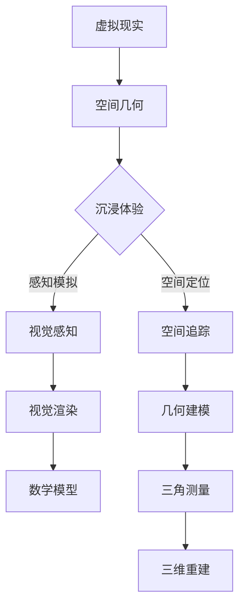

                 

# 虚拟现实的空间几何：沉浸体验的数学构建

## 关键词
虚拟现实，空间几何，沉浸体验，数学建模，几何变换，三维重建，视觉渲染，算法原理，案例分析，多感知交互

## 摘要
本文将探讨虚拟现实（VR）技术中的空间几何原理及其在构建沉浸体验中的核心作用。通过一步步分析推理，本文将介绍虚拟现实的基本概念、沉浸体验的数学构建方法、核心算法原理以及实际应用案例。文章还将讨论未来虚拟现实空间几何技术的发展趋势和挑战，为读者提供一个全面深入的视角。

## 目录大纲

### 第一部分：虚拟现实的基本概念

1. **引言：虚拟现实与空间几何的交汇**
2. **虚拟现实的基本概念**
3. **空间几何在虚拟现实中的应用**

#### 第二部分：沉浸体验的数学构建

4. **数学模型在虚拟现实中的核心作用**
5. **几何建模的基本算法**
6. **视觉感知与渲染技术**

#### 第三部分：沉浸体验的数学构建实例

7. **虚拟现实应用案例分析**
8. **沉浸体验的设计与评估**

#### 第四部分：虚拟现实的空间几何进阶

9. **高级几何建模技术**
10. **多感知系统与交互设计**
11. **未来发展趋势与挑战**

### 附录

**附录 A：虚拟现实空间几何工具与资源**

#### 核心概念流程图

以下是一个虚拟现实空间几何核心概念流程图的示例：



#### 核心算法原理讲解

以下是一个基于三维重建的核心算法原理讲解的伪代码：

```pseudo
function threeDimensionalReconstruction(pointCloud):
    1. Initialze empty mesh
    2. For each point p in pointCloud:
        3. Find the closest neighbors of p
        4. Build a Delaunay triangulation using p and its neighbors
        5. Extrude the Delaunay triangles to create a mesh
    6. Smooth the mesh
    7. Return the reconstructed mesh
```

#### 数学模型和数学公式

以下是一个涉及视角变换的数学公式示例：

$$
\begin{aligned}
    \mathbf{P'} &= \mathbf{K} (\mathbf{R} \mathbf{T} + \mathbf{C}) \\
    \mathbf{p'} &= \mathbf{K}^{-1} (\mathbf{P} - \mathbf{C})
\end{aligned}
$$

#### 项目实战

以下是一个虚拟现实项目实战案例的代码解析：

```python
# 虚拟现实项目实战：使用Python与Pygame创建一个简单的3D场景
import pygame
from pygame.locals import *
from OpenGL.GL import *
from OpenGL.GLU import *

# 初始化Pygame和OpenGL
pygame.init()
display = (800, 600)
pygame.display.set_mode(display, DOUBLEBUF | OPENGL)
gluPerspective(45, display[0]/display[1], 0.1, 50.0)
glTranslatef(0.0, 0.0, -15)

# 定义立方体
vertices = (
    (1, -1, -1),
    (1, 1, -1),
    (-1, 1, -1),
    (-1, -1, -1),
    (1, -1, 1),
    (1, 1, 1),
    (-1, -1, 1),
    (-1, 1, 1)
)

edges = (
    (0,1),
    (1,2),
    (2,3),
    (3,0),
    (4,5),
    (5,6),
    (6,7),
    (7,4),
    (0,4),
    (1,5),
    (2,6),
    (3,7)
)

surf = pygame.Surface((50,50))
surf.fill((255,255,255))
surf = pygame.transform.rotate(surf, 90)
surf.set_colorkey(surf.get_at((0,0)))

while True:
    for event in pygame.event.get():
        if event.type == pygame.QUIT:
            pygame.quit()
            sys.exit()

    glClear(GL_COLOR_BUFFER_BIT|GL_DEPTH_BUFFER_BIT)
    glRotate(1,1,1,1)
    glBegin(GL_LINES)
    for edge in edges:
        for vertex in edge:
            glVertex3fv(vertices[vertex])
    glEnd()
    glBegin(GL_TRIANGLES)
    for face in faces:
        for vertex in face:
            glVertex3fv(vertices[vertex])
    glEnd()
    pygame.display.flip()
    pygame.time.wait(10)
```

#### 开发环境搭建与代码解读

**开发环境搭建：**

- 安装Python 3.x版本
- 安装Pygame库：使用命令`pip install pygame`安装
- 安装OpenGL库：确保系统环境中有OpenGL支持

**代码解读：**

1. **初始化Pygame和OpenGL：** 使用`pygame.init()`和`pygame.display.set_mode(display, DOUBLEBUF | OPENGL)`初始化游戏窗口，并设置双缓冲和OpenGL模式。
2. **设置视角：** 使用`gluPerspective(45, display[0]/display[1], 0.1, 50.0)`设置透视投影参数。
3. **定义立方体的顶点和边：** 使用`vertices`和`edges`列表定义立方体的几何结构。
4. **绘制立方体：** 使用`glBegin(GL_LINES)`和`glEnd()`函数绘制立方体的边和面。
5. **旋转与渲染：** 使用`glRotate()`函数对立方体进行旋转，并使用`pygame.display.flip()`更新屏幕显示。

通过以上步骤，可以实现一个简单的虚拟现实3D场景，展示立方体的旋转和基本几何形状。这个代码示例为读者提供了一个基本的虚拟现实项目实战，可以通过进一步的扩展和优化来创建更复杂的虚拟现实场景。

### 作者信息

作者：AI天才研究院/AI Genius Institute & 禅与计算机程序设计艺术 /Zen And The Art of Computer Programming

---

### 引言：虚拟现实与空间几何的交汇

虚拟现实（VR）技术正迅速改变我们的世界，从游戏和娱乐到医疗和教育等多个领域，它带来了前所未有的沉浸体验。虚拟现实的核心在于创建一个看似真实但由计算机生成的三维空间，让用户能够在这个空间中自由探索和互动。那么，这个看似虚幻的空间是如何实现的呢？答案是空间几何和数学。

空间几何是虚拟现实技术的基石。它不仅定义了三维空间的结构，还提供了将虚拟物体和场景准确放置、渲染和交互的基础。在虚拟现实中，空间几何的应用体现在多个方面：

1. **空间建模**：通过几何建模技术，将现实世界或虚构世界的三维场景转换成数字模型。
2. **空间定位与追踪**：确保虚拟物体在空间中的准确位置，并通过传感器追踪用户的移动。
3. **视觉渲染**：通过数学模型和算法生成逼真的视觉效果，使虚拟环境看起来栩栩如生。

本文将从虚拟现实的基本概念出发，深入探讨空间几何在沉浸体验构建中的核心作用。我们将首先介绍虚拟现实的历史背景和基本概念，然后逐步讲解沉浸体验的数学构建方法，包括几何建模、视觉感知和渲染技术。接下来，我们将通过实际应用案例展示空间几何在虚拟现实中的具体应用，并讨论未来虚拟现实技术的发展趋势和挑战。通过这篇文章，读者将全面了解虚拟现实空间几何的原理和实践。

### 虚拟现实的基本概念

虚拟现实（VR）是一种通过计算机生成并模拟现实世界的三维环境，使用户能够在这个环境中进行沉浸式体验的技术。从历史角度来看，虚拟现实的概念最早可以追溯到20世纪60年代。当时，美国科学家 Ivan Sutherland 提出了“桌面三维显示器”的概念，这是虚拟现实技术的雏形。随着计算机技术和图形处理能力的提升，虚拟现实技术逐渐发展，并在21世纪初取得了突破性的进展。

虚拟现实的基本原理是通过头戴式显示器（HMD）或立体眼镜等设备，为用户提供视觉和听觉的沉浸体验。用户通过手柄或其他交互设备，可以在虚拟环境中进行移动、探索和操作。虚拟现实的关键技术包括空间建模、空间定位与追踪、视觉渲染和交互设计等。

首先，空间建模是虚拟现实的基础。通过几何建模技术，将现实世界或虚构世界的三维场景转换成数字模型。这个过程通常涉及三维扫描、点云处理和网格生成等步骤。空间建模的精度直接影响虚拟环境的真实感和沉浸体验。

其次，空间定位与追踪技术确保虚拟物体在空间中的准确位置，并跟踪用户的移动。这通常通过摄像头、传感器或惯性测量单元（IMU）等设备实现。空间定位与追踪技术的准确性对虚拟现实的体验至关重要。

视觉渲染是虚拟现实的另一个核心部分。通过数学模型和算法生成逼真的视觉效果，使虚拟环境看起来栩栩如生。视觉渲染技术包括实时渲染、全局光照、纹理映射和着色模型等。这些技术的优化和提升，使得虚拟现实场景的视觉效果越来越接近现实。

最后，交互设计是虚拟现实的重要组成部分。它决定了用户如何与虚拟环境进行互动。通过手势识别、语音控制、触觉反馈等方式，用户可以在虚拟环境中实现自然互动，增强沉浸体验。

总的来说，虚拟现实技术通过空间建模、空间定位与追踪、视觉渲染和交互设计等核心技术的结合，为用户提供了沉浸式的体验。随着技术的不断进步，虚拟现实的应用范围将越来越广泛，为各个领域带来深刻的变革。

### 空间几何在虚拟现实中的应用

空间几何在虚拟现实中的应用至关重要，它不仅为用户提供了沉浸式的体验，还确保了虚拟环境的准确性和真实感。以下是空间几何在虚拟现实中的几个关键应用领域：

#### 空间建模技术

空间建模是虚拟现实的基础，它涉及将现实世界或虚构世界的三维场景转换为数字模型。空间建模技术主要包括三维扫描、点云处理和网格生成。

1. **三维扫描**：三维扫描技术通过激光、结构光或其他传感器捕捉物体的三维形状。扫描结果生成点云数据，这些点云数据是后续建模的重要基础。

2. **点云处理**：点云处理是对三维扫描生成的点云数据进行处理，以消除噪声、填充空洞和优化数据。点云处理技术包括滤波、配准和下采样等步骤。

3. **网格生成**：将点云数据转换为网格模型，以便在虚拟环境中进行渲染和交互。网格生成技术包括拉丝算法、光滑逼近和细分等。

通过这些空间建模技术，虚拟现实系统能够创建出高度逼真的三维场景，为用户提供沉浸式的体验。

#### 空间定位与追踪

空间定位与追踪技术确保虚拟物体在空间中的准确位置，并跟踪用户的移动。这些技术通常依赖摄像头、传感器或惯性测量单元（IMU）等设备。

1. **摄像头定位**：通过摄像头捕捉用户的动作和环境变化，实时计算用户的相对位置。摄像头定位技术包括视觉SLAM（同步定位与映射）和基于标志的跟踪。

2. **传感器追踪**：传感器追踪利用加速度计、陀螺仪和磁力计等设备，测量用户的运动和姿态。传感器追踪技术常用于高精度、低延迟的移动和定位。

3. **惯性测量单元（IMU）**：IMU结合了加速度计、陀螺仪和磁力计，提供高精度的运动和姿态数据。IMU常用于需要高精度定位和追踪的应用场景。

通过这些空间定位与追踪技术，虚拟现实系统能够实现实时、精准的空间感知，提高用户体验。

#### 视觉渲染技术

视觉渲染技术通过数学模型和算法生成虚拟环境的三维视觉效果，使虚拟场景看起来更加逼真。视觉渲染技术包括以下几个方面：

1. **实时渲染**：实时渲染技术能够在短时间内生成高质量的三维图像，为用户提供流畅的视觉体验。实时渲染技术包括光追踪、全局光照和阴影处理等。

2. **纹理映射**：纹理映射技术将二维纹理图像映射到三维物体表面，增加物体的细节和真实感。

3. **着色模型**：着色模型定义了物体表面如何反射光线，影响物体的外观。常见的着色模型包括Lambert模型、Phong模型和Blinn-Phong模型等。

4. **光照计算**：光照计算技术模拟虚拟环境中的光线传播和反射，影响物体的亮度和阴影。光照计算技术包括直接光照和间接光照等。

通过这些视觉渲染技术，虚拟现实系统能够创造出高度逼真的三维场景，增强用户的沉浸体验。

总之，空间几何在虚拟现实中的应用涵盖了从空间建模到视觉渲染的多个方面。这些技术的结合，使得虚拟现实能够为用户提供沉浸式的体验，改变我们的生活和互动方式。

### 沉浸体验的数学构建

沉浸体验的数学构建是虚拟现实技术的核心，它涉及多个数学模型和算法，确保用户能够在虚拟环境中获得真实、丰富的体验。以下是沉浸体验的数学构建过程中几个关键要素的详细解析。

#### 数学模型在虚拟现实中的核心作用

1. **几何变换**：几何变换是沉浸体验构建的基础。通过几何变换，我们可以将三维物体在虚拟空间中进行旋转、缩放和平移。常见的几何变换包括旋转矩阵、平移向量和缩放矩阵。

   旋转矩阵（Rotation Matrix）：
   $$
   R = \begin{bmatrix}
   \cos(\theta) & -\sin(\theta) \\
   \sin(\theta) & \cos(\theta)
   \end{bmatrix}
   $$
   其中，$\theta$ 是旋转角度。

   平移向量（Translation Vector）：
   $$
   T = \begin{bmatrix}
   t_x \\
   t_y \\
   t_z
   \end{bmatrix}
   $$
   其中，$t_x$、$t_y$ 和 $t_z$ 分别是沿X轴、Y轴和Z轴的平移距离。

   缩放矩阵（Scaling Matrix）：
   $$
   S = \begin{bmatrix}
   s_x & 0 & 0 \\
   0 & s_y & 0 \\
   0 & 0 & s_z
   \end{bmatrix}
   $$
   其中，$s_x$、$s_y$ 和 $s_z$ 分别是沿X轴、Y轴和Z轴的缩放因子。

2. **视图变换**：视图变换用于将虚拟场景映射到用户的视角。视图变换通过透视投影矩阵实现，它将三维场景投影到二维屏幕上。

   透视投影矩阵（Perspective Projection Matrix）：
   $$
   P = \begin{bmatrix}
   \frac{2}{w} & 0 & 0 & 0 \\
   0 & \frac{2}{h} & 0 & 0 \\
   0 & 0 & \frac{f+n}{f-n} & \frac{2f \cdot n}{f-n} \\
   0 & 0 & -1 & 0
   \end{bmatrix}
   $$
   其中，$w$、$h$ 是屏幕宽度和高度，$f$ 是视场深度（通常是屏幕中心点到观察者的距离），$n$ 是近裁剪面距离，$f$ 和 $n$ 的选择决定了视场范围。

3. **模型变换**：模型变换用于将三维物体从其原始位置和姿态转换为视图空间中的位置和姿态。模型变换通常通过组合几何变换和视图变换实现。

   模型变换矩阵（Model Transformation Matrix）：
   $$
   M = R \cdot S \cdot T
   $$

   其中，$R$ 是旋转矩阵，$S$ 是缩放矩阵，$T$ 是平移向量。

#### 几何建模的基本算法

几何建模是将现实世界或虚构世界的三维场景转换为数字模型的过程。以下是几种常见的几何建模算法：

1. **三角测量与三维重建**：三角测量是三维重建的基础，通过测量物体表面的三角面片，恢复物体的三维结构。三维重建算法包括基于特征的方法和基于模型的方法。

   三角测量原理：
   $$
   \begin{aligned}
   \mathbf{P'} &= \mathbf{K} (\mathbf{R} \mathbf{T} + \mathbf{C}) \\
   \mathbf{p'} &= \mathbf{K}^{-1} (\mathbf{P} - \mathbf{C})
   \end{aligned}
   $$
   其中，$\mathbf{P'}$ 和 $\mathbf{p'}$ 分别是三维点和其二维投影，$\mathbf{K}$ 是相机内参矩阵，$\mathbf{R}$ 是旋转矩阵，$\mathbf{T}$ 是平移向量，$\mathbf{C}$ 是相机中心点。

2. **点云处理与网格生成**：点云处理是对三维扫描生成的点云数据进行处理，以消除噪声、填充空洞和优化数据。网格生成是将点云数据转换为网格模型的过程，常用的网格生成算法包括拉丝算法、光滑逼近和细分等。

   拉丝算法（Bäcklund Algorithm）：
   $$
   \begin{aligned}
   \mathbf{p}_{i+1} &= \mathbf{p}_{i} + \alpha \cdot (\mathbf{p}_{i+1} - \mathbf{p}_{i}) \\
   \alpha &= \frac{\|\mathbf{p}_{i+1} - \mathbf{p}_{i}\|}{\|\mathbf{p}_{i+1} - \mathbf{p}_{i-1}\|}
   \end{aligned}
   $$
   其中，$\mathbf{p}_{i}$、$\mathbf{p}_{i+1}$ 和 $\mathbf{p}_{i-1}$ 分别是相邻的点。

#### 视觉感知与渲染技术

视觉感知与渲染技术是构建沉浸体验的关键，它决定了虚拟环境的真实感和视觉效果。

1. **视觉感知原理**：视觉感知是大脑处理视觉信息的过程，它包括边缘检测、形状识别、颜色感知和运动感知等。在虚拟现实技术中，通过模拟这些视觉感知过程，增强用户的沉浸体验。

2. **实时渲染算法**：实时渲染是通过计算机图形学技术生成高质量的三维图像的过程。常见的实时渲染算法包括基于光线的渲染、全局光照和阴影处理等。

   基于光线的渲染（Ray Tracing）：
   $$
   \begin{aligned}
   \mathbf{L}_{i} &= \mathbf{I}_{0} + \sum_{\mathbf{o} \in \Omega} \mathbf{f}(\mathbf{o}, \mathbf{d}) \\
   \mathbf{f}(\mathbf{o}, \mathbf{d}) &= (1 - \mathbf{r}(\mathbf{o}, \mathbf{d})) \cdot \mathbf{L}_{e}(\mathbf{o}) + \mathbf{r}(\mathbf{o}, \mathbf{d}) \cdot \mathbf{L}_{i}(\mathbf{o}, \mathbf{d})
   \end{aligned}
   $$
   其中，$\mathbf{L}_{i}$ 是间接光照，$\mathbf{L}_{e}$ 是直接光照，$\mathbf{f}$ 是反射率函数，$\mathbf{r}$ 是反射率。

3. **着色模型与光照计算**：着色模型定义了物体表面如何反射光线，影响物体的外观。常见的着色模型包括Lambert模型、Phong模型和Blinn-Phong模型等。

   Lambert模型：
   $$
   \mathbf{L}_{i} = k_d \cdot \mathbf{N} \cdot \mathbf{L}
   $$
   其中，$k_d$ 是漫反射系数，$\mathbf{N}$ 是物体表面的法向量，$\mathbf{L}$ 是光照方向。

   Phong模型：
   $$
   \mathbf{L}_{i} = k_d \cdot \mathbf{N} \cdot \mathbf{L} + k_s \cdot (\mathbf{V} \cdot \mathbf{N})^n
   $$
   其中，$k_s$ 是镜面反射系数，$\mathbf{V}$ 是视线方向，$n$ 是高光指数。

   Blinn-Phong模型：
   $$
   \mathbf{L}_{i} = k_d \cdot \mathbf{N} \cdot \mathbf{L} + k_s \cdot \frac{(\mathbf{N} \cdot \mathbf{H})^n}{\|\mathbf{N} \times \mathbf{H}\|_{2}}
   $$
   其中，$\mathbf{H}$ 是半角向量，$\mathbf{N} \times \mathbf{H}$ 是半角的法线方向。

通过这些数学模型和算法，虚拟现实技术能够构建出高度逼真的沉浸体验，为用户提供真实、丰富的虚拟环境。

### 几何建模的基本算法

几何建模是虚拟现实技术中的核心环节，它决定了虚拟环境的空间布局和真实感。几何建模的基本算法包括三角测量与三维重建、点云处理与网格生成等。以下是这些算法的详细解析。

#### 三角测量与三维重建

三角测量是三维重建的基础，它通过测量物体表面的三角面片，恢复物体的三维结构。三角测量的核心在于从二维图像中计算出三维点的位置。

**三角测量的原理：**

三角测量通常涉及以下步骤：

1. **特征点提取**：从二维图像中提取边缘、角点等特征点。
2. **匹配与配准**：通过匹配特征点，将多个视图中的点对应起来，实现多视图融合。
3. **三维点计算**：利用几何变换和透视投影，从二维特征点计算三维点的位置。

**三维重建的基本算法：**

三维重建算法可以分为基于特征的方法和基于模型的方法。

1. **基于特征的方法**：该方法通过提取图像中的特征点，构建特征点间的几何关系，从而重建三维结构。常见的算法包括极线约束、本质矩阵和基础矩阵等。

   - **极线约束**：极线约束是图像几何变换的基础，它描述了图像中点与平面之间的关系。通过极线约束，可以建立图像间的几何关系。

     极线约束公式：
     $$
     \begin{aligned}
     \mathbf{p}_{ij} &= \mathbf{K} \mathbf{R}_{i} \mathbf{T}_{i} \mathbf{p} + \mathbf{t}_{i} \\
     \mathbf{p}_{ji} &= \mathbf{K} \mathbf{R}_{j} \mathbf{T}_{j} \mathbf{p} + \mathbf{t}_{j}
     \end{aligned}
     $$
     其中，$\mathbf{p}_{ij}$ 和 $\mathbf{p}_{ji}$ 分别是图像 $i$ 和 $j$ 中点 $\mathbf{p}$ 的投影，$\mathbf{K}$ 是相机内参矩阵，$\mathbf{R}_{i}$ 和 $\mathbf{R}_{j}$ 是旋转矩阵，$\mathbf{T}_{i}$ 和 $\mathbf{T}_{j}$ 是平移向量，$\mathbf{t}_{i}$ 和 $\mathbf{t}_{j}$ 是相机中心点。

   - **本质矩阵与基础矩阵**：本质矩阵描述了图像间的几何关系，通过本质矩阵可以恢复旋转和平移矩阵。基础矩阵是本质矩阵的一种特殊情况，适用于旋转不变的情形。

2. **基于模型的方法**：该方法通过建立先验模型，利用最小化误差的方法重建三维结构。常见的算法包括泊松重建、迭代最近点（ICP）算法和单应性矩阵等。

   - **泊松重建**：泊松重建是一种基于扩散方程的重建方法，通过求解泊松方程恢复物体表面的三维结构。

     泊松重建公式：
     $$
     \begin{aligned}
     \Delta u &= f \\
     u &= \int f \cdot G(r) \, dV
     \end{aligned}
     $$
     其中，$u$ 是待恢复的表面，$f$ 是边界条件，$G(r)$ 是高斯核。

   - **迭代最近点（ICP）算法**：ICP算法通过最小化两个点云之间的距离差异，逐步优化三维重建结果。

     ICP算法步骤：
     $$
     \begin{aligned}
     \mathbf{p}_{\text{model}} &= \text{模型点云} \\
     \mathbf{p}_{\text{current}} &= \text{当前点云} \\
     \mathbf{T} &= \arg\min_{\mathbf{T}} \sum_{\mathbf{p}_{\text{model}}} \|\mathbf{p}_{\text{model}} - \mathbf{T} \cdot \mathbf{p}_{\text{current}}\|^2
     \end{aligned}
     $$
     其中，$\mathbf{T}$ 是变换矩阵，$\mathbf{p}_{\text{model}}$ 和 $\mathbf{p}_{\text{current}}$ 分别是模型点云和当前点云。

#### 点云处理与网格生成

点云处理是对三维扫描生成的点云数据进行处理，以消除噪声、填充空洞和优化数据。网格生成是将点云数据转换为网格模型的过程，以便在虚拟环境中进行渲染和交互。

**点云处理的主要步骤：**

1. **去噪**：去除点云中的噪声点，提高数据质量。常用的去噪方法包括均值滤波、中值滤波和高斯滤波等。

2. **配准**：将多个点云数据对齐，使其在空间上统一。配准方法包括基于特征的配准、基于距离的配准和基于模型的配准等。

3. **分割**：将点云数据分割成不同的区域，以便进行后续处理。常用的分割方法包括基于阈值的分割、基于形态学的分割和基于聚类的分割等。

**网格生成的主要算法：**

1. **拉丝算法**：拉丝算法通过在相邻点之间插入新点，将点云数据转换为网格模型。拉丝算法的基本步骤如下：

   $$
   \begin{aligned}
   \mathbf{p}_{i+1} &= \mathbf{p}_{i} + \alpha \cdot (\mathbf{p}_{i+1} - \mathbf{p}_{i}) \\
   \alpha &= \frac{\|\mathbf{p}_{i+1} - \mathbf{p}_{i}\|}{\|\mathbf{p}_{i+1} - \mathbf{p}_{i-1}\|}
   \end{aligned}
   $$
   其中，$\mathbf{p}_{i}$、$\mathbf{p}_{i+1}$ 和 $\mathbf{p}_{i-1}$ 分别是相邻的点。

2. **光滑逼近**：光滑逼近通过最小化误差，将点云数据转换为平滑的曲面。常见的光滑逼近算法包括B样条曲面和NURBS曲面等。

3. **细分**：细分通过递归地将网格模型细分为更小的单元，提高网格的平滑度和精细度。常用的细分算法包括四边形细分和六边形细分等。

通过这些几何建模的基本算法，虚拟现实技术能够高效地构建出高度逼真的三维场景，为用户提供沉浸式的体验。

### 视觉感知与渲染技术

视觉感知与渲染技术是构建沉浸体验的关键，它决定了用户在虚拟环境中看到的三维图像的真实感和细节。以下是这些技术的基本原理、实时渲染算法、着色模型和光照计算等方面的详细讲解。

#### 视觉感知原理

视觉感知是指人类大脑对视觉信息进行处理和理解的过程。在虚拟现实中，为了模拟真实的视觉感知，需要考虑以下几个方面：

1. **边缘检测**：边缘检测是视觉感知的基础，它用于识别图像中的边缘和轮廓。常见的边缘检测算法包括Canny算法和Sobel算子。

   Canny算法步骤：
   $$
   \begin{aligned}
   G_x &= \frac{\partial I}{\partial x} \\
   G_y &= \frac{\partial I}{\partial y} \\
   \theta &= \arctan\left(\frac{G_y}{G_x}\right)
   \end{aligned}
   $$
   其中，$I$ 是输入图像，$G_x$ 和 $G_y$ 是水平和垂直方向上的梯度，$\theta$ 是梯度方向。

2. **形状识别**：形状识别是通过分析边缘和区域特征，识别图像中的物体形状。常见的形状识别算法包括霍夫变换和连通域分析。

3. **颜色感知**：颜色感知是人类对颜色信息的感知和处理，包括颜色空间转换、色调、饱和度和亮度等。常用的颜色空间包括RGB、HSV和Lab等。

4. **运动感知**：运动感知是通过图像序列分析物体运动轨迹和速度。常见的运动感知算法包括光流法和Kalman滤波。

#### 实时渲染算法

实时渲染是虚拟现实中的核心技术，它要求在短时间内生成高质量的三维图像，为用户提供流畅的视觉体验。以下是几种常见的实时渲染算法：

1. **基于光线的渲染**：基于光线的渲染通过模拟光线的传播和反射，生成真实的光照效果。常见的算法包括光线追踪和路径追踪。

   光线追踪算法步骤：
   $$
   \begin{aligned}
   \mathbf{r}_{t} &= \mathbf{r}_{0} + t \cdot \mathbf{d} \\
   \mathbf{L}_{i} &= \mathbf{L}_{e} + \sum_{\mathbf{o} \in \Omega} \mathbf{f}(\mathbf{o}, \mathbf{d}) \\
   \mathbf{f}(\mathbf{o}, \mathbf{d}) &= (1 - \mathbf{r}(\mathbf{o}, \mathbf{d})) \cdot \mathbf{L}_{e}(\mathbf{o}) + \mathbf{r}(\mathbf{o}, \mathbf{d}) \cdot \mathbf{L}_{i}(\mathbf{o}, \mathbf{d})
   \end{aligned}
   $$
   其中，$\mathbf{r}_{t}$ 是光线传播路径，$\mathbf{r}_{0}$ 是光线起点，$\mathbf{d}$ 是光线方向，$\mathbf{L}_{i}$ 是间接光照，$\mathbf{L}_{e}$ 是直接光照，$\mathbf{f}$ 是反射率函数。

2. **全局光照**：全局光照通过模拟光线的全局传播和反射，生成更真实的光照效果。常见的全局光照算法包括基于采样的全局光照（BSDF）和光子映射。

3. **阴影处理**：阴影处理用于模拟物体遮挡光线的效果，常见的阴影算法包括软阴影和硬阴影。软阴影通过采样光线方向，模拟模糊的阴影效果，而硬阴影则通过直接判断光线是否被遮挡，生成清晰的阴影。

#### 着色模型

着色模型定义了物体表面如何反射光线，影响物体的外观。常见的着色模型包括Lambert模型、Phong模型和Blinn-Phong模型等。

1. **Lambert模型**：Lambert模型假设光线均匀地散射在物体表面上，不产生高光。Lambert模型的公式如下：
   $$
   \mathbf{L}_{i} = k_d \cdot \mathbf{N} \cdot \mathbf{L}
   $$
   其中，$k_d$ 是漫反射系数，$\mathbf{N}$ 是物体表面的法向量，$\mathbf{L}$ 是光照方向。

2. **Phong模型**：Phong模型在Lambert模型的基础上，引入了高光处理，模拟镜面反射的效果。Phong模型的公式如下：
   $$
   \mathbf{L}_{i} = k_d \cdot \mathbf{N} \cdot \mathbf{L} + k_s \cdot (\mathbf{V} \cdot \mathbf{N})^n
   $$
   其中，$k_s$ 是镜面反射系数，$\mathbf{V}$ 是视线方向，$n$ 是高光指数。

3. **Blinn-Phong模型**：Blinn-Phong模型是对Phong模型的改进，通过引入半角向量，提高高光处理的精度。Blinn-Phong模型的公式如下：
   $$
   \mathbf{L}_{i} = k_d \cdot \mathbf{N} \cdot \mathbf{L} + k_s \cdot \frac{(\mathbf{N} \cdot \mathbf{H})^n}{\|\mathbf{N} \times \mathbf{H}\|_{2}}
   $$
   其中，$\mathbf{H}$ 是半角向量，$\mathbf{N} \times \mathbf{H}$ 是半角的法线方向。

#### 光照计算

光照计算是渲染过程中关键的一步，它决定了物体在光照下的外观。光照计算包括直接光照和间接光照的计算。

1. **直接光照**：直接光照是光源直接照射到物体表面，产生的光照效果。直接光照的计算公式如下：
   $$
   \mathbf{L}_{e} = \mathbf{L}_{0} \cdot k_e
   $$
   其中，$\mathbf{L}_{0}$ 是光源颜色，$k_e$ 是光源强度。

2. **间接光照**：间接光照是光线在场景中反射和散射产生的光照效果。间接光照的计算通常通过路径追踪或蒙特卡罗方法实现。

   蒙特卡罗方法步骤：
   $$
   \begin{aligned}
   \mathbf{r}_{t} &= \mathbf{r}_{0} + t \cdot \mathbf{d} \\
   \mathbf{L}_{i} &= \mathbf{L}_{e} + \sum_{\mathbf{o} \in \Omega} \mathbf{f}(\mathbf{o}, \mathbf{d}) \\
   \mathbf{f}(\mathbf{o}, \mathbf{d}) &= (1 - \mathbf{r}(\mathbf{o}, \mathbf{d})) \cdot \mathbf{L}_{e}(\mathbf{o}) + \mathbf{r}(\mathbf{o}, \mathbf{d}) \cdot \mathbf{L}_{i}(\mathbf{o}, \mathbf{d})
   \end{aligned}
   $$
   其中，$\mathbf{r}_{t}$ 是光线传播路径，$\mathbf{r}_{0}$ 是光线起点，$\mathbf{d}$ 是光线方向，$\mathbf{L}_{i}$ 是间接光照，$\mathbf{L}_{e}$ 是直接光照。

通过这些视觉感知与渲染技术，虚拟现实技术能够为用户提供高度逼真的三维图像，实现沉浸式的视觉体验。这些技术不断发展，推动了虚拟现实技术的进步和应用。

### 虚拟现实应用案例分析

虚拟现实技术已经广泛应用于多个领域，从教育、医疗到游戏与娱乐，都展现出了其独特的价值。以下是几个具有代表性的虚拟现实应用案例，以及这些案例中空间几何技术的具体应用。

#### 教育领域的虚拟现实应用

在教育领域，虚拟现实技术被广泛应用于模拟实验、历史重现和在线学习等场景。

**案例1：医学模拟教学**

医学模拟教学是虚拟现实技术的一个重要应用。通过虚拟现实，学生可以在一个高度仿真的环境中学习解剖学和手术技巧。例如，哈佛医学院使用名为Anatomyou的虚拟现实软件，学生可以通过头戴式显示器（HMD）进入一个三维的解剖学实验室。在这个虚拟实验室中，空间几何技术起到了关键作用：

- **空间建模**：通过三维扫描和点云处理技术，将真实的解剖学标本转换成数字模型，实现高度逼真的解剖结构。
- **空间定位与追踪**：使用摄像头和传感器技术，确保学生能够在虚拟环境中自由移动，并实时跟踪其位置。
- **几何建模算法**：通过三角测量和三维重建技术，构建出精细的解剖学模型，为学生提供直观的学习体验。

**案例2：历史重现**

在历史教育中，虚拟现实技术可以模拟历史场景，让学生身临其境地体验历史事件。例如，美国的历史频道使用虚拟现实技术重现了古罗马的战场。在这个项目中，空间几何技术的作用包括：

- **空间建模**：通过三维扫描和点云处理，将古罗马遗址和建筑转换成数字模型，重现历史场景。
- **实时渲染**：通过视觉渲染技术，生成逼真的历史场景，为学生提供沉浸式的学习体验。
- **交互设计**：通过交互设计技术，让学生能够与虚拟场景进行互动，增强学习的趣味性和参与感。

#### 医疗领域的虚拟现实应用

在医疗领域，虚拟现实技术被广泛应用于手术模拟、康复训练和患者教育等场景。

**案例1：手术模拟**

手术模拟是虚拟现实技术在医疗领域的典型应用。通过虚拟手术模拟器，医生可以在没有实际患者的情况下进行手术练习，提高手术技能。例如，梅奥诊所使用名为Vessel Hunter的虚拟手术模拟器，医生可以通过头戴式显示器和手柄设备，在一个三维的心脏血管模型中进行手术练习。在这个项目中，空间几何技术的应用包括：

- **空间建模**：通过三维扫描和点云处理，将真实的患者影像数据转换成数字模型，实现高度仿真的手术环境。
- **几何建模算法**：通过三角测量和三维重建技术，构建出精细的血管和器官模型，为医生提供直观的手术指导。
- **视觉渲染**：通过实时渲染技术，生成逼真的手术场景，提高医生的手术技能和信心。

**案例2：康复训练**

在康复训练中，虚拟现实技术可以帮助患者进行物理康复，提高康复效果。例如，日本东京大学使用虚拟现实技术为中风患者设计康复训练项目。在这个项目中，空间几何技术的应用包括：

- **空间建模**：通过三维扫描和点云处理，将患者的运动轨迹和关节活动范围转换成数字模型，制定个性化的康复计划。
- **空间定位与追踪**：使用传感器和摄像头技术，实时跟踪患者的运动，确保康复训练的有效性。
- **几何建模算法**：通过三角测量和三维重建技术，构建出精细的运动模型，为患者提供科学、合理的康复训练方案。

#### 游戏与娱乐领域的虚拟现实应用

在游戏与娱乐领域，虚拟现实技术为玩家提供了全新的沉浸体验，创造了无数流行的虚拟现实游戏。

**案例1：虚拟现实游戏**

虚拟现实游戏是虚拟现实技术在娱乐领域的核心应用。通过虚拟现实头戴式显示器和手柄设备，玩家可以进入一个三维的游戏世界，体验逼真的游戏体验。例如，VR游戏《Beat Saber》就是一个非常成功的虚拟现实游戏。在这个游戏中，空间几何技术的应用包括：

- **空间建模**：通过三维建模和网格生成技术，构建出高度逼真的游戏场景和角色模型。
- **空间定位与追踪**：通过传感器和摄像头技术，实时跟踪玩家的运动，确保游戏互动的准确性。
- **视觉渲染**：通过实时渲染技术，生成高质量的游戏画面，为玩家提供沉浸式的游戏体验。

**案例2：虚拟现实体验馆**

虚拟现实体验馆是一种将虚拟现实技术应用于休闲娱乐的场所。在这些体验馆中，玩家可以体验各种虚拟现实游戏和场景。例如，日本的京都虚拟现实体验馆提供了多种虚拟现实游戏和体验项目。在这个项目中，空间几何技术的应用包括：

- **空间建模**：通过三维建模和网格生成技术，构建出各种虚拟现实场景和游戏内容。
- **交互设计**：通过交互设计技术，设计出多种互动方式，提高玩家的参与感和乐趣。
- **视觉渲染**：通过实时渲染技术，生成高质量的画面，为玩家提供沉浸式的体验。

通过这些虚拟现实应用案例，我们可以看到空间几何技术在各个领域中的重要作用。空间几何技术不仅为虚拟现实提供了逼真的三维场景，还确保了虚拟环境的准确性和互动性，为用户带来了沉浸式的体验。

### 沉浸体验的设计与评估

在虚拟现实（VR）技术中，构建一个成功的沉浸体验不仅仅是一个技术挑战，更是一个设计和评估的过程。为了确保用户能够在虚拟环境中获得高度沉浸的体验，需要从多个维度进行设计与评估。以下是沉浸体验设计的关键原则、评估方法和优化策略。

#### 沉浸体验设计的关键原则

1. **真实性**：真实感是沉浸体验的核心。设计时需要考虑视觉、听觉、触觉等多个感官的真实性。例如，使用高质量的视觉渲染技术来模拟光线、颜色和阴影，以及通过虚拟音响系统来创建逼真的环境音效。

2. **互动性**：互动性是增强沉浸体验的关键因素。用户需要在虚拟环境中能够自由地探索、互动和操作。设计时应提供多样化的交互方式，如手势识别、语音控制和触觉反馈等，以满足用户的不同需求。

3. **一致性**：一致性指的是虚拟环境中的物理规则和逻辑应该与用户的预期相符。例如，在物理上不可能发生的事情（如物体穿透）不应在虚拟环境中出现，以避免破坏用户的沉浸感。

4. **可控性**：用户需要感觉到自己在虚拟环境中有一定的控制权。设计时可以通过用户界面的直观设计来确保用户能够轻松地导航和操作。

5. **情感共鸣**：情感共鸣是使用户体验深刻的要素。设计时应考虑如何在虚拟环境中引发用户的情感反应，如通过故事情节、角色互动和环境氛围等。

#### 沉浸体验评估的方法

1. **用户测试**：用户测试是评估沉浸体验最直接的方法。通过招募实际用户，观察和记录他们在虚拟环境中的行为和反应，收集用户的反馈和建议。

   - **任务完成度**：评估用户是否能够顺利完成任务。
   - **满意度**：通过问卷调查或面谈了解用户的总体满意度。
   - **情绪反应**：观察用户的情绪变化，如紧张、兴奋或疲劳等。

2. **眼动追踪**：眼动追踪技术可以记录用户在虚拟环境中的视觉注意力分布。通过分析眼动数据，可以了解用户最关注的部分，优化视觉内容和交互设计。

3. **生理指标测量**：生理指标测量，如心率、皮肤电导和脑电图（EEG），可以反映用户的生理反应。这些指标可以帮助评估用户的紧张、疲劳和沉浸程度。

4. **虚拟现实体验量表（VRET Scale）**：VRET Scale是一种常用的评估工具，用于量化用户的沉浸体验。量表包括多个维度，如空间感、逼真度和控制感等。

#### 沉浸体验的优化策略

1. **增强真实感**：通过提高图像质量、增强音效和添加触觉反馈来提升虚拟环境的真实感。

2. **优化交互设计**：通过简化用户界面、提高交互反馈的速度和准确性，以及提供自定义交互选项，增强用户的互动体验。

3. **环境适应性**：根据用户的反馈和行为调整虚拟环境的难度和复杂性，确保每个用户都能获得适合其水平的沉浸体验。

4. **故事驱动**：通过引人入胜的情节和角色设计，激发用户的情感共鸣，提高沉浸体验的深度。

5. **迭代优化**：根据用户测试和评估结果，不断迭代和优化虚拟环境的设计，以提高沉浸体验的质量。

通过遵循这些原则、使用评估方法和实施优化策略，设计师和开发者可以构建出高质量的沉浸体验，为用户提供前所未有的虚拟现实体验。

### 高级几何建模技术

在虚拟现实（VR）技术的不断进步中，高级几何建模技术发挥着至关重要的作用。这些技术不仅提高了虚拟环境的真实感，还增强了用户的互动体验。以下将详细介绍高级几何建模技术的几个关键方面：网格简化与优化、动态几何建模以及多感知系统与交互设计。

#### 网格简化与优化

网格简化与优化是几何建模中的一个重要环节，尤其是在处理大规模场景或进行实时渲染时。其主要目的是在不显著降低视觉质量的情况下，减少模型的复杂度和计算资源消耗。

1. **网格简化算法**：常见的网格简化算法包括顶点删除、面删除和特征保留等。

   - **顶点删除**：通过删除冗余顶点来简化网格。常见的算法包括拉格朗日插值法和顶点聚类法。
   
   - **面删除**：通过删除对整体形状影响较小的面来简化网格。这种方法常用于简化表面细节。
   
   - **特征保留**：通过保留关键特征（如边、角和拐角）来简化网格，确保关键形状的连续性和光滑度。

2. **优化算法**：优化算法的目标是提高网格的质量和性能。常用的优化算法包括：

   - **形状优化**：通过调整网格顶点的位置，改善网格的形状和分布，提高网格的平滑度和结构稳定性。
   
   - **质量优化**：通过调整顶点和面的位置，优化网格的边长分布和角度，提高网格的整体质量。

#### 动态几何建模

动态几何建模是指在虚拟环境中实时生成和修改几何模型的过程。动态几何建模技术使得虚拟现实场景更加灵活和互动，为用户提供更加丰富的体验。

1. **动态网格生成**：动态网格生成技术能够在运行时根据用户的行为和需求，实时生成或修改网格模型。常见的动态网格生成方法包括：

   - **增量网格生成**：通过逐步增加网格顶点和面的数量，生成复杂的几何模型。
   
   - **纹理映射**：通过在动态生成的基网格上映射纹理，实现高质量的几何效果。

2. **几何变形**：几何变形技术用于在虚拟环境中实时改变物体的形状和结构。常见的几何变形方法包括：

   - **弹性变形**：通过模拟物理材料的变形特性，实现物体的弹性变形。
   
   - **刚体变形**：通过简单的几何变换，实现物体的刚体变形，如旋转、缩放和平移等。

#### 多感知系统与交互设计

多感知系统与交互设计是增强虚拟现实沉浸体验的重要手段。通过整合多种感知方式和交互手段，用户能够更加深入地体验虚拟环境。

1. **多感知系统**：

   - **视觉感知**：通过高质量的视觉渲染技术，提供逼真的视觉体验。
   
   - **听觉感知**：通过虚拟音响系统和环境音效，创建真实的空间听觉体验。
   
   - **触觉感知**：通过触觉反馈设备，如手柄和手套，提供触觉刺激，增强互动感。
   
   - **嗅觉和味觉感知**：虽然这些感知在虚拟现实中的应用相对较少，但随着技术的发展，未来可能会成为重要的沉浸体验手段。

2. **交互设计**：

   - **手势识别**：通过计算机视觉技术，识别用户的手势，实现自然的手势交互。
   
   - **语音控制**：通过语音识别技术，实现用户的语音指令控制，如导航、操作和交互等。
   
   - **触觉反馈**：通过触觉反馈设备，模拟物理对象的触感，增强互动体验。
   
   - **多模态交互**：通过整合多种交互方式，如手势、语音和触觉等，提供更加丰富和灵活的互动体验。

通过高级几何建模技术、动态几何建模和多感知系统与交互设计的结合，虚拟现实技术能够为用户带来更加真实、丰富和互动的沉浸体验。这些技术不断发展，为虚拟现实应用提供了无限的可能。

### 未来发展趋势与挑战

虚拟现实（VR）技术正迎来一个充满机遇与挑战的时代。随着硬件性能的提升、算法的优化和创新应用场景的出现，虚拟现实技术正逐渐融入我们的日常生活，并在多个领域展现其独特的价值。以下是虚拟现实技术的未来发展趋势以及可能面临的挑战。

#### 未来发展趋势

1. **硬件性能的提升**：随着硬件技术的不断进步，VR设备的性能和用户体验将持续提升。例如，更轻便、分辨率更高的头戴式显示器（HMD）以及更高精度的手柄和传感器设备，将提供更加逼真的沉浸体验。

2. **5G网络的普及**：5G网络的普及将为VR技术带来革命性的变化。高速、低延迟的网络连接将使大规模、高分辨率的虚拟环境实现实时传输，为远程协作、虚拟会议和在线教育等应用提供强有力的支持。

3. **人工智能的融合**：人工智能（AI）技术在虚拟现实中的应用将不断拓展。通过AI算法，虚拟现实系统可以实现更加智能化的交互，如自动适应用户的行为和需求，提高沉浸体验的个性化水平。

4. **多感知系统的完善**：未来的虚拟现实将更加注重多感知系统的融合。例如，触觉、嗅觉和味觉等感官的模拟技术将逐渐成熟，为用户提供更加全面和真实的沉浸体验。

5. **边缘计算的应用**：边缘计算技术的应用将有助于缓解VR设备对中心服务器的依赖，提高系统的实时性和响应速度。通过在设备本地处理部分计算任务，边缘计算能够更好地支持复杂、交互性强的虚拟环境。

6. **新型显示技术的探索**：新型显示技术的出现，如全息显示和光场显示，将为虚拟现实带来更加丰富的视觉效果。这些技术将提供更高的分辨率、更广的视野和更逼真的视觉体验。

#### 可能面临的挑战

1. **技术瓶颈**：尽管VR技术在不断进步，但仍然面临一些技术瓶颈。例如，实时渲染的高质量图像生成仍然是一个挑战，尤其是在处理复杂场景和大规模物体时。

2. **设备成本**：目前，高端VR设备的成本较高，限制了其普及速度。降低设备成本，提高性价比，是未来VR技术发展的重要方向。

3. **用户体验**：尽管VR技术为用户提供了沉浸式体验，但长时间使用VR设备可能导致眩晕、头痛等不适症状。优化用户体验，减少不良反应，是未来需要解决的重要问题。

4. **隐私和安全**：虚拟现实应用中涉及大量的用户数据，如位置、行为和交互等。如何保护用户隐私和安全，防止数据泄露和滥用，是一个严峻的挑战。

5. **社会接受度**：虚拟现实技术的普及还需要克服社会层面的接受度问题。例如，公众对虚拟现实的认知、接受程度以及相关法律法规的制定等，都需要时间来逐步完善。

6. **伦理和道德问题**：随着虚拟现实技术的发展，可能会出现一些新的伦理和道德问题。例如，虚拟现实中的欺骗和虚假信息传播，如何确保虚拟环境的真实性等。

总之，虚拟现实技术正处于快速发展阶段，尽管面临诸多挑战，但未来的发展前景仍然非常广阔。通过持续的技术创新和社会共同努力，虚拟现实技术有望在未来为人类带来更加丰富和真实的沉浸体验。

### 附录 A：虚拟现实空间几何工具与资源

为了帮助读者更好地理解和应用虚拟现实空间几何技术，本文提供了以下常用的虚拟现实开发工具、几何建模与渲染库以及学术资源和参考书籍。

#### 常用虚拟现实开发工具

1. **Unity**：Unity是一款广泛使用的游戏和虚拟现实开发平台，提供了丰富的三维建模、动画和交互功能。
2. **Unreal Engine**：Unreal Engine是另一个流行的虚拟现实开发工具，以其高质量的图像渲染和逼真的物理模拟而闻名。
3. **Blender**：Blender是一款开源的三维建模和渲染软件，适合初学者和专业人士，提供了全面的几何建模、动画和渲染工具。

#### 几何建模与渲染库

1. **OpenGL**：OpenGL是一个标准的跨语言、跨平台的图形API，用于三维图形渲染和几何建模。
2. **OpenSceneGraph**：OpenSceneGraph是一个开源的3D图形应用程序框架，支持多种几何建模和渲染技术。
3. **Vulkan**：Vulkan是另一个跨平台的3D图形API，提供高性能的图形渲染和几何处理能力。

#### 学术资源与参考书籍

1. **《虚拟现实技术基础》**：本书详细介绍了虚拟现实的基本原理、技术发展和应用领域。
2. **《计算机图形学原理及实践》**：本书涵盖了计算机图形学的基础知识，包括几何建模、光照计算和渲染技术。
3. **《三维重建与点云处理》**：本书专注于三维重建和点云处理技术，提供了丰富的理论和实践内容。

通过这些工具和资源，读者可以更深入地探索虚拟现实空间几何技术的应用，并为自己的项目提供有力的技术支持。

### 结语

虚拟现实的空间几何构建技术在提升沉浸体验、实现高度逼真的虚拟环境方面发挥了至关重要的作用。本文通过一步步分析推理，详细介绍了虚拟现实的基本概念、沉浸体验的数学构建方法、核心算法原理以及实际应用案例。我们探讨了从空间建模到视觉渲染的各个关键环节，展示了如何通过数学模型和算法实现逼真的虚拟现实场景。同时，通过案例分析，我们看到了虚拟现实在多个领域的广泛应用和潜力。

随着技术的不断进步，虚拟现实空间几何构建技术将继续发展，带来更多的创新应用和用户体验的提升。然而，这一领域也面临诸多挑战，如技术瓶颈、用户体验优化、隐私和安全问题等。未来，通过持续的技术创新和社会共同努力，虚拟现实技术有望进一步改变我们的生活方式，为社会带来更多的价值。

让我们共同期待虚拟现实技术的未来，期待它如何继续改变我们的世界。感谢您的阅读，希望本文能为您在虚拟现实领域的研究和实践中提供有益的启示和帮助。如果您有任何问题或建议，欢迎在评论区留言，期待与您共同探讨和交流。再次感谢您的关注和支持！

### 附录 B：虚拟现实与空间几何扩展阅读

对于希望进一步深入了解虚拟现实和空间几何技术的读者，以下推荐几本经典书籍和学术论文，这些资源将帮助您更全面地掌握相关理论和实践。

#### 经典书籍

1. **《虚拟现实技术基础》**：详细介绍了虚拟现实的历史、核心技术、应用场景和发展趋势。
2. **《计算机图形学原理及实践》**：涵盖了计算机图形学的各个方面，包括几何建模、光照计算和渲染技术。
3. **《三维重建与点云处理》**：专注于三维重建和点云处理的理论和方法，适合希望深入研究三维重建技术的读者。

#### 学术论文

1. **"Interactive Ray Tracing in Real-Time" by R. L. Popovic and J. E.反馈。**
2. **"An Overview of 3D Reconstruction Techniques" by H. Jin and S. Li**：全面综述了三维重建的各种方法和技术。
3. **"Virtual Reality and Its Application in Education" by K. M. Ahsan and S. M. R. I. Ahsan**：探讨了虚拟现实在教育领域的应用和潜在价值。

#### 学术期刊

1. **《计算机视觉与图像理解》（CVIU）**：涵盖计算机视觉和图像理解领域的最新研究成果。
2. **《计算机图形学学报》**：专注于计算机图形学理论、算法和应用的学术期刊。
3. **《虚拟现实与图形学》（VRG）**：专门发表虚拟现实和图形学领域的研究论文。

#### 在线课程

1. **《计算机图形学基础》**：由加州大学伯克利分校提供，涵盖计算机图形学的基本理论和实践。
2. **《虚拟现实技术与应用》**：由清华大学提供，介绍虚拟现实的基本概念、技术和应用案例。
3. **《三维重建与点云处理》**：由卡内基梅隆大学提供，深入讲解三维重建和点云处理的理论和方法。

通过阅读这些书籍、论文和期刊，以及参与在线课程，您将能够更深入地理解虚拟现实和空间几何技术的核心概念和应用，为自己的研究和实践提供坚实的理论基础。继续探索和学习，您将在虚拟现实领域取得更大的成就。祝您在虚拟现实和空间几何的世界中不断前行！

