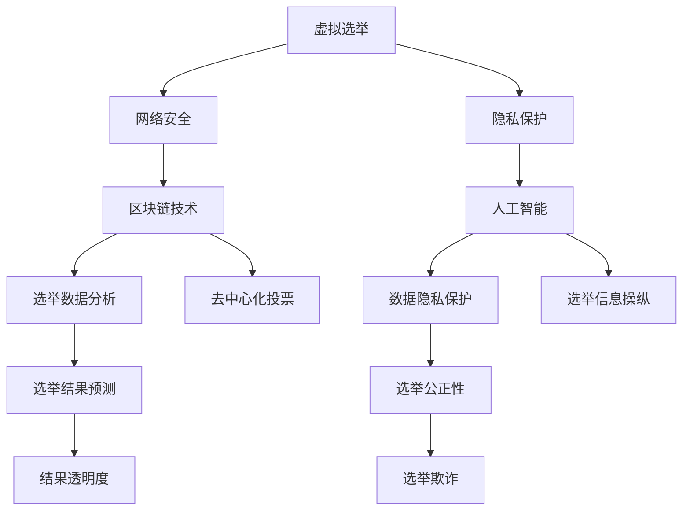

                 

### 《虚拟选举：全球民主参与的数字化实践》

#### 关键词：
- 虚拟选举
- 数字化民主
- 网络安全
- 区块链
- 人工智能

#### 摘要：
本文探讨了虚拟选举在全球民主参与中的重要性及其数字化实践。首先，介绍了虚拟选举的定义和概念，回顾了其发展历程，并对比了虚拟选举与传统选举的差异。接着，分析了数字化在民主参与中的角色，探讨了网络安全与隐私保护、区块链技术、人工智能等技术在虚拟选举中的应用。随后，通过全球范围内的虚拟选举案例，展示了其实践中的挑战与成果。最后，对虚拟选举的未来发展趋势进行了展望，并提出了相关的技术实施指南和法律法规建议。文章旨在为读者提供一个全面而深入的虚拟选举技术分析，以及其在全球民主参与中的潜力与影响。

### 第一部分：虚拟选举的背景与概念

#### 1.1 虚拟选举的定义与历史

虚拟选举，顾名思义，是指通过互联网和数字技术进行的选举活动。与传统选举相比，虚拟选举不依赖于实体投票站，而是通过计算机、智能手机等终端设备进行投票和计票。虚拟选举的核心在于其数字化和在线化，这不仅提高了选举的效率，还扩大了参与者的范围，降低了选举成本。

虚拟选举的历史可以追溯到20世纪末。最早的虚拟选举尝试出现在1993年，美国科罗拉多州的贝尔弗德县通过电子邮件进行了地方选举。这次尝试虽然规模较小，但标志着虚拟选举的开端。进入21世纪，随着互联网的普及和数字技术的发展，虚拟选举在全球范围内得到了广泛应用。

#### 1.1.1 虚拟选举的基本概念

虚拟选举的基本概念主要包括以下几个方面：

1. **选举平台**：虚拟选举的平台可以是专门的投票网站，也可以是社交媒体平台、移动应用等。这些平台为选民提供了投票的入口，同时也为投票机构和候选人提供了数据管理和分析的工具。

2. **投票方式**：虚拟选举的投票方式多种多样，包括在线投票、短信投票、手机应用投票等。这些方式使得选民可以随时随地参与投票，极大地提高了选举的便利性。

3. **投票流程**：虚拟选举的投票流程主要包括注册、登录、投票、计票和结果公布等步骤。其中，注册和登录环节需要进行身份验证，以确保选民的唯一性和投票的公正性。

4. **计票和结果公布**：虚拟选举的计票和结果公布过程通常采用自动化系统，减少了人为干预，提高了计票的效率和准确性。投票结果可以通过网络实时公布，选民可以随时查看。

#### 1.1.2 虚拟选举的发展历程

虚拟选举的发展历程可以分为以下几个阶段：

1. **初期探索阶段（1993-2000年）**：在这个阶段，虚拟选举主要作为一种实验性技术应用于小型选举活动，如地方选举、社团选举等。

2. **试点应用阶段（2001-2010年）**：随着互联网的普及，虚拟选举开始在一些国家进行试点应用，如美国的密西西比州、瑞士等。这些试点项目为虚拟选举的发展提供了宝贵的经验和数据。

3. **广泛推广阶段（2011年至今）**：在这个阶段，虚拟选举在全球范围内得到了广泛应用，许多国家开始将其作为正式的选举方式。例如，瑞士在2016年举行了全国范围的虚拟选举，得到了选民的高度认可。

#### 1.1.3 虚拟选举与传统选举的比较

虚拟选举与传统选举在多个方面存在显著差异：

1. **参与度**：虚拟选举使选民能够随时随地参与投票，极大地提高了选举的参与度。传统选举则需要选民到投票站进行投票，参与度受到地理位置和时间限制的影响。

2. **成本**：虚拟选举降低了选举的组织和运营成本。传统选举需要设立投票站、招聘工作人员、印刷选票等，而虚拟选举只需要建设和维护选举平台，成本相对较低。

3. **效率**：虚拟选举的计票和结果公布过程更加高效。传统选举的计票过程往往需要几天甚至几周的时间，而虚拟选举可以在短时间内完成计票，并实时公布结果。

4. **公正性**：虚拟选举在一定程度上提高了选举的公正性。通过自动化系统和身份验证，虚拟选举减少了人为干预和舞弊的可能性。

然而，虚拟选举也面临一些挑战，如网络安全、数据隐私和保护等问题。这些问题需要通过技术手段和法律法规加以解决，以确保虚拟选举的公正性和安全性。

#### 1.2 数字化在民主参与中的角色

数字化技术在民主参与中发挥着至关重要的作用。随着互联网和移动设备的普及，数字化为选民提供了更加便捷、高效的参与方式，推动了民主制度的进一步发展。

首先，数字化技术极大地提高了选举的参与度。传统选举往往受到地理位置和时间限制，许多选民无法方便地前往投票站进行投票。而数字化技术使得选民可以在任何时间和地点参与投票，极大地拓宽了选举的参与范围。

其次，数字化技术提高了选举的效率和透明度。传统选举的计票和结果公布过程通常耗时较长，而且容易受到人为干预。而数字化技术可以通过自动化系统和实时数据传输，快速、准确地完成计票和结果公布，提高了选举的效率。同时，数字化技术还使得选举过程更加透明，选民可以实时查看投票数据，监督选举的公正性。

此外，数字化技术还为选民提供了更加丰富和多样化的参与方式。通过社交媒体、移动应用等平台，选民不仅可以参与投票，还可以参与到选举的讨论和决策过程中，表达自己的观点和意见。

然而，数字化在民主参与中也带来了一些挑战。首先，网络安全和数据隐私保护问题日益突出。数字化技术使得选举过程更容易受到黑客攻击和恶意软件的干扰，同时，选民的个人信息也可能在选举过程中泄露。因此，如何在保障网络安全和数据隐私的前提下推广数字化民主，是一个亟待解决的问题。

其次，数字化技术也可能导致信息不对称和操纵。在数字化环境中，信息传播的速度和范围都大大增加，但这同时也给虚假信息、网络诈骗等提供了可乘之机。如何确保数字化环境中的信息真实、准确，防止信息操纵，是数字化民主面临的一个重大挑战。

#### 1.2.1 数字化与民主参与的结合

数字化与民主参与的结合，主要体现在以下几个方面：

1. **在线投票**：在线投票是数字化民主的核心内容之一。通过在线投票，选民可以随时随地参与选举，打破了时间和空间的限制，提高了选举的参与度。在线投票不仅适用于全国性选举，还可以用于地方选举、社团选举等小型选举活动。

2. **电子政务**：电子政务是数字化民主在政府管理中的体现。通过电子政务平台，选民可以方便地获取政府信息、办理各种事务，如申请福利、缴纳税费等。电子政务提高了政府服务的效率，增强了政府的透明度和公信力。

3. **社交媒体参与**：社交媒体平台成为选民表达意见、参与讨论的重要渠道。通过社交媒体，选民可以实时关注选举动态，参与到选举的讨论和决策过程中。社交媒体还为选民提供了一个自由、开放的交流空间，使得选举过程更加透明、民主。

4. **数字公民教育**：数字公民教育是培养选民数字化素养的重要途径。通过数字公民教育，选民可以了解数字化技术在民主参与中的应用，提高其信息素养和批判思维，从而更加理性、积极地参与民主过程。

#### 1.2.2 数字化技术在民主参与中的优势

数字化技术在民主参与中具有许多优势，主要体现在以下几个方面：

1. **提高参与度**：数字化技术使得选民可以随时随地参与选举，打破了时间和空间的限制，提高了选举的参与度。在线投票、电子政务等数字化手段，使得选民可以更方便、快捷地参与到选举过程中，增强了选民的政治参与热情。

2. **提升效率**：数字化技术提高了选举的效率和透明度。在线投票、自动化计票等数字化手段，使得选举过程更加高效，结果公布更加迅速。数字化技术还使得选举数据更加透明，选民可以实时查看投票数据，监督选举的公正性。

3. **降低成本**：数字化技术降低了选举的组织和运营成本。传统选举需要设立投票站、招聘工作人员、印刷选票等，而数字化技术只需要建设和维护选举平台，成本相对较低。此外，数字化技术还可以减少纸质选票的使用，降低环保成本。

4. **促进透明度**：数字化技术提高了选举的透明度。通过在线投票、电子政务等数字化手段，选民可以实时查看选举数据，监督选举过程。数字化技术还使得选举数据更加公开、透明，有助于防止选举舞弊和腐败。

#### 1.2.3 数字化技术的挑战与风险

尽管数字化技术在民主参与中具有许多优势，但也带来了一些挑战和风险，主要体现在以下几个方面：

1. **网络安全风险**：数字化技术使得选举过程更容易受到黑客攻击和网络欺诈的干扰。网络安全问题可能导致选举结果被篡改、选民个人信息被泄露等。因此，如何保障网络安全是数字化民主面临的一个重大挑战。

2. **数据隐私保护**：数字化技术使得选民个人信息更容易被收集、分析和利用。在民主参与过程中，如何保护选民的隐私权，防止个人信息被滥用，是数字化技术面临的一个关键问题。

3. **信息不对称**：数字化技术使得信息传播的速度和范围都大大增加，但也给虚假信息、网络诈骗等提供了可乘之机。在数字化环境中，如何确保信息的真实性和准确性，防止信息操纵，是一个重大挑战。

4. **技术依赖**：数字化技术对技术设备和网络的依赖性较高。在选举过程中，如果技术设备和网络出现故障，可能导致选举中断。因此，如何确保技术设备的可靠性和网络的稳定性，是数字化民主面临的一个现实问题。

### 第二部分：虚拟选举的技术基础

#### 2.1 网络安全与隐私保护

虚拟选举的安全性问题至关重要，因为网络安全漏洞和数据泄露可能导致选举结果被篡改、选民隐私被侵犯，从而影响选举的公正性和合法性。因此，网络安全与隐私保护是虚拟选举技术基础中的核心部分。

#### 2.1.1 虚拟选举中的网络安全问题

在虚拟选举中，网络安全问题主要包括以下几个方面：

1. **网络攻击**：网络攻击是指黑客利用网络漏洞非法侵入选举系统，篡改选举数据或破坏选举平台。常见的网络攻击手段包括拒绝服务攻击（DDoS）、SQL注入、跨站脚本攻击（XSS）等。

2. **数据泄露**：数据泄露是指未经授权的第三方获取并利用选民个人信息、投票记录等敏感数据。数据泄露可能导致选民隐私被侵犯，甚至影响选举结果的公正性。

3. **选举操纵**：选举操纵是指通过技术手段非法影响选举结果。例如，黑客可以通过篡改投票数据、伪造选民身份等手段，操纵选举结果。

#### 2.1.2 隐私保护技术

为了解决虚拟选举中的网络安全和数据隐私问题，可以采用以下隐私保护技术：

1. **加密技术**：加密技术是保护数据传输和存储安全的重要手段。通过使用强加密算法，如AES（高级加密标准）、RSA（公钥加密算法），可以确保数据在传输和存储过程中的安全性。

2. **身份验证**：身份验证是确保选民身份真实性的重要措施。常见的身份验证技术包括密码验证、生物识别（如指纹识别、面部识别）等。通过多重身份验证，可以进一步提高选举系统的安全性。

3. **访问控制**：访问控制技术用于限制对选举系统资源的访问权限，防止未经授权的用户获取敏感信息。访问控制可以通过设置用户角色和权限来实现。

4. **数据匿名化**：数据匿名化是将选民个人信息与投票记录分离，从而保护选民隐私。例如，可以通过将选民身份信息进行脱敏处理，使数据在分析过程中无法直接关联到具体个体。

#### 2.1.3 防止选举欺诈的策略

为了防止选举欺诈，可以采用以下策略：

1. **双重投票检测**：通过实时监控选民的投票行为，检测是否存在双重投票现象。例如，可以记录每个选民的IP地址、设备ID等信息，并与之前的投票记录进行比对，发现异常行为。

2. **投票验证码**：在投票过程中，为每个选民生成一个唯一的验证码，并要求其在投票时输入。通过验证码可以确保每个选民只能投票一次。

3. **区块链技术**：区块链技术可以确保选举数据的不可篡改性。在虚拟选举中，投票数据可以通过区块链进行记录和验证，从而防止数据被篡改。

4. **透明审计**：建立透明审计机制，使选民可以随时查看选举数据，监督选举过程。透明审计可以提高选举的公正性和合法性，减少选举欺诈的可能性。

5. **安全多方计算**：安全多方计算（Secure Multi-Party Computation，SMPC）是一种允许多个方在不泄露各自输入信息的情况下共同计算结果的加密技术。SMPC可以用于选举数据的安全处理和计算，确保选举结果的真实性。

#### 2.2 区块链技术在虚拟选举中的应用

区块链技术以其去中心化、不可篡改和透明性等特性，在虚拟选举中具有广泛的应用前景。区块链技术可以用于确保选举过程的公正性、透明性和安全性，从而提高选民的信任度。

#### 2.2.1 区块链的基本原理

区块链是一种分布式数据库技术，通过多个节点共同维护一个共享的账本。每个区块包含一定数量的交易记录，并通过加密算法与前面的区块链接，形成一个不可篡改的链式结构。

区块链的基本原理包括以下几个方面：

1. **分布式存储**：区块链的数据存储在多个节点上，避免了单点故障和数据丢失的风险。每个节点都存储完整的区块链数据，从而保证了数据的一致性和可靠性。

2. **共识算法**：共识算法是区块链网络中节点达成一致的关键机制。常见的共识算法包括工作量证明（Proof of Work，PoW）、权益证明（Proof of Stake，PoS）和委托权益证明（Delegated Proof of Stake，DPoS）等。

3. **加密技术**：区块链使用加密算法来确保数据的完整性和安全性。例如，哈希算法用于生成区块的唯一标识，数字签名用于验证交易的真实性和有效性。

4. **智能合约**：智能合约是一种自动执行的合约，通过编写在区块链上运行。智能合约可以用于自动化选举流程，确保选举过程的公正性和透明性。

#### 2.2.2 区块链在虚拟选举中的优势

区块链技术在虚拟选举中的应用具有以下优势：

1. **去中心化**：区块链技术去中心化的特性，使得选举数据不再依赖于中央机构，降低了中心化带来的单点故障风险。

2. **不可篡改性**：区块链的链式结构确保了数据的不可篡改性。一旦数据被记录在区块链上，就难以被修改或删除，从而提高了选举数据的可信度。

3. **透明性**：区块链上的数据是公开透明的，选民可以随时查看选举数据，监督选举过程。透明性提高了选举的公正性和合法性，增强了选民的信任。

4. **安全性**：区块链技术使用加密算法确保数据的完整性和安全性，有效防止了网络攻击和数据泄露等安全风险。

5. **自动化流程**：智能合约可以自动化执行选举流程，确保选举过程的公正性和效率。例如，智能合约可以自动统计投票结果，并公布选举结果。

#### 2.2.3 区块链技术的挑战与解决方案

尽管区块链技术在虚拟选举中具有许多优势，但也面临一些挑战，需要相应的解决方案：

1. **性能瓶颈**：区块链技术的性能相对较低，可能无法满足大规模选举的需求。为了提高性能，可以采用分片技术（Sharding）等解决方案，将数据分散存储在多个节点上，从而提高数据处理能力。

2. **能源消耗**：一些区块链共识算法，如PoW，需要大量计算资源，导致能源消耗巨大。为了降低能源消耗，可以采用PoS等更环保的共识算法。

3. **法律监管**：区块链技术涉及多个国家和地区的法律监管问题。为了确保区块链技术在虚拟选举中的合法性，需要制定相应的法律法规，明确区块链技术在选举中的应用范围和责任归属。

4. **用户接受度**：区块链技术的复杂性和用户接受度较低，可能影响其在虚拟选举中的应用。为了提高用户接受度，可以简化区块链操作界面，提供用户友好的体验。

5. **技术成熟度**：区块链技术仍处于发展阶段，技术成熟度和稳定性有待提高。为了确保区块链技术在虚拟选举中的可靠性，需要不断优化和升级区块链技术。

### 第三部分：虚拟选举的案例分析

虚拟选举在全球范围内得到了广泛应用，不同国家和地区的虚拟选举实践各有特色，同时也面临各自的挑战。本部分将通过对美国、欧洲和中国等不同国家虚拟选举的案例分析，探讨虚拟选举的实践情况、挑战和成果。

#### 3.1 全球范围内的虚拟选举案例

1. **美国地方政府选举**

美国在虚拟选举方面有着较为丰富的实践。2018年，美国科罗拉多州的贝尔弗德县通过互联网进行了地方政府选举。这是美国首次尝试在大型选举中使用在线投票系统。该选举使用了一种名为“VRV”（Vote Reporting Verification）的系统，选民可以通过互联网进行投票，投票数据通过区块链技术进行记录和验证。

**挑战**：
- **网络安全风险**：虚拟选举面临网络安全威胁，例如DDoS攻击和数据泄露。
- **技术依赖**：在线投票系统的可靠性取决于网络和设备的稳定性。

**成果**：
- **提高参与度**：虚拟选举使选民能够更方便地参与投票，提高了选举的参与度。
- **降低成本**：虚拟选举减少了传统选举所需的物力和人力成本。

2. **欧洲议会选举**

欧洲议会选举是虚拟选举在欧洲的典型案例。2024年，欧洲议会选举中，多个欧洲国家尝试采用虚拟选举方式。例如，荷兰、德国和瑞典等国家在选举中使用了在线投票系统。

**挑战**：
- **技术成熟度**：虚拟选举技术的成熟度和稳定性有待提高，特别是在大规模选举中。
- **法律监管**：不同国家对于虚拟选举的法律规定和监管存在差异。

**成果**：
- **提高透明度**：虚拟选举使选举过程更加透明，选民可以实时查看投票数据。
- **促进民主参与**：虚拟选举降低了参与选举的门槛，促进了选民的民主参与。

3. **中国基层选举**

中国近年来在基层选举中尝试采用虚拟选举方式。2021年，中国浙江省杭州市上城区在基层选举中使用了在线投票系统，选民可以通过互联网进行投票。

**挑战**：
- **技术普及度**：中国农村地区互联网普及度较低，在线投票系统的应用受到一定限制。
- **数据隐私保护**：如何保护选民隐私是虚拟选举面临的重要挑战。

**成果**：
- **提高效率**：虚拟选举提高了选举的效率，减少了选举时间和人力成本。
- **促进民主参与**：虚拟选举使选民能够更方便地参与选举，提高了基层选举的参与度。

#### 3.2 虚拟选举在不同国家的实践与挑战

虚拟选举在不同国家的实践中，既面临着共同的挑战，也体现了各自的特点。

**民主国家**

在民主国家，虚拟选举的推广主要面临以下挑战：

1. **网络安全**：网络安全是虚拟选举的核心问题，需要采取有效的安全措施，防止网络攻击和数据泄露。
2. **技术成熟度**：虚拟选举技术的成熟度和稳定性仍需提高，特别是在大规模选举中。
3. **法律监管**：不同国家对于虚拟选举的法律规定和监管存在差异，需要制定统一的法律法规。

**威权国家**

在威权国家，虚拟选举的推广面临着更多的挑战：

1. **政治环境**：威权国家通常对虚拟选举持谨慎态度，担心虚拟选举可能削弱政府的控制力。
2. **技术依赖**：威权国家可能对技术设备和技术供应商有依赖性，从而影响虚拟选举的独立性和公正性。
3. **信息操纵**：威权国家可能利用虚拟选举进行信息操纵，影响选举结果。

**全球性挑战**

虚拟选举在全球范围内面临以下挑战：

1. **技术差异**：不同国家和地区的互联网普及程度、技术水平存在差异，虚拟选举的应用受到一定限制。
2. **数据隐私保护**：如何保护选民隐私是虚拟选举面临的重要挑战，特别是在大规模选举中。
3. **法律监管**：不同国家对于虚拟选举的法律规定和监管存在差异，需要制定统一的法律法规。

#### 3.3 虚拟选举面临的全球性挑战

虚拟选举在全球范围内面临一系列挑战，主要包括以下几个方面：

1. **技术成熟度**：虚拟选举技术仍处于发展阶段，其成熟度和稳定性有待提高。特别是在大规模选举中，虚拟选举系统需要具备高效、稳定、安全的特点。

2. **网络安全**：网络安全是虚拟选举的核心问题。黑客攻击、数据泄露等安全威胁可能导致选举结果被篡改，影响选举的公正性和合法性。

3. **数据隐私保护**：如何保护选民的隐私是虚拟选举面临的重要挑战。在数字化环境中，选民的个人信息更容易被收集、分析和利用，需要采取有效的隐私保护措施。

4. **技术普及度**：不同国家和地区的互联网普及程度和技术水平存在差异，虚拟选举的应用受到一定限制。特别是在农村和偏远地区，互联网接入困难和设备不足可能影响虚拟选举的推广。

5. **法律监管**：全球范围内，对于虚拟选举的法律规定和监管存在差异，需要制定统一的法律法规，确保虚拟选举的合法性和公正性。

6. **用户接受度**：虚拟选举的推广还需要提高用户的接受度。一些选民可能对虚拟选举持怀疑态度，担心其安全性和可靠性。因此，需要加强宣传教育，提高选民对虚拟选举的信任度。

7. **跨平台兼容性**：虚拟选举系统需要具备跨平台兼容性，支持多种设备和操作系统，以便选民可以随时随地参与投票。

### 第四部分：虚拟选举的未来展望

#### 4.1 虚拟选举的发展趋势

虚拟选举作为数字化民主的重要实践，在未来有望进一步发展，并呈现出以下几个趋势：

1. **技术融合**：虚拟选举将不断融合新技术，如人工智能、区块链、物联网等，提高选举的智能化、自动化和透明度。

2. **全球推广**：随着技术的成熟和用户接受度的提高，虚拟选举将在全球范围内得到更广泛的推广和应用。

3. **标准化**：为保障虚拟选举的公正性和安全性，全球各国将逐步制定统一的法律法规和标准，推动虚拟选举的规范化发展。

4. **多元化应用**：虚拟选举不仅将应用于政治选举，还将扩展到企业选举、社区选举等领域，满足不同场景下的选举需求。

#### 4.2 虚拟选举对政治生态的影响

虚拟选举的普及将对政治生态产生深远影响，主要体现在以下几个方面：

1. **参与度提升**：虚拟选举降低了参与选举的门槛，使更多选民能够方便、快捷地参与选举，提高了选举的参与度。

2. **信息透明度**：虚拟选举通过实时数据公布和在线审计，提高了选举过程的透明度，增强了选民的监督能力。

3. **选举结果可信度**：虚拟选举技术的应用，如区块链、加密技术等，提高了选举结果的可信度，减少了选举舞弊和操纵的可能性。

4. **政治竞争动态变化**：虚拟选举使得政治竞争更加激烈，候选人需要更加注重网络宣传和在线互动，提高了竞选策略的复杂度。

5. **政治参与方式改变**：虚拟选举改变了传统政治参与的途径，选民不仅可以通过投票表达意愿，还可以通过在线讨论、反馈等形式参与到政治决策过程中。

#### 4.3 虚拟选举的法律与伦理问题

虚拟选举在普及应用的过程中，也将面临一系列法律与伦理问题，主要包括：

1. **法律监管**：虚拟选举需要制定相应的法律法规，明确其应用范围、责任归属和法律责任，确保选举的公正性和合法性。

2. **数据隐私保护**：如何保护选民的隐私权，防止个人信息泄露和滥用，是虚拟选举面临的重要法律挑战。

3. **信息安全**：保障虚拟选举系统的信息安全，防止网络攻击和数据泄露，是虚拟选举必须解决的问题。

4. **技术中立**：在虚拟选举中，技术供应商和服务提供商应当保持中立，避免利用技术优势影响选举结果。

5. **伦理问题**：虚拟选举可能引发一系列伦理问题，如信息操纵、选举舞弊等，需要引起关注和重视。

### 第五部分：虚拟选举的技术实施指南

虚拟选举的技术实施涉及多个环节，包括系统设计、开发、测试和部署等。本部分将详细介绍虚拟选举系统的设计原则、开发流程和运营维护，为技术实施提供指南。

#### 5.1 虚拟选举系统的设计原则

虚拟选举系统的设计原则主要包括以下几个方面：

1. **可靠性**：虚拟选举系统必须具备高可靠性，确保在选举过程中不会出现系统故障或数据丢失。系统设计应考虑冗余备份、故障恢复和系统稳定性。

2. **安全性**：虚拟选举系统的安全性至关重要，必须采用先进的安全技术，如加密、身份验证、访问控制等，防止网络攻击和数据泄露。

3. **可扩展性**：虚拟选举系统应具备良好的可扩展性，能够适应不同规模和类型的选举需求。系统设计应考虑模块化、分布式架构和弹性扩展。

4. **易用性**：虚拟选举系统应提供简洁、直观的用户界面，方便选民和工作人员使用。系统设计应考虑用户体验，提供实时反馈和帮助功能。

5. **透明性**：虚拟选举系统的数据管理和处理过程应保持透明，使选民和监管机构能够实时查看和监督选举数据。

#### 5.2 虚拟选举系统的开发流程

虚拟选举系统的开发流程主要包括以下几个阶段：

1. **需求分析与系统设计**：
   - 分析虚拟选举的需求，明确系统功能、性能和安全要求。
   - 设计系统架构，包括前端、后端、数据库和网络安全等模块。

2. **技术选型与开发工具**：
   - 根据系统需求，选择合适的开发技术和工具，如编程语言、框架、数据库和安全软件等。
   - 设计开发工具和环境，确保开发过程高效、有序。

3. **前端开发**：
   - 设计用户界面，实现选民投票、投票结果查看等功能。
   - 采用响应式设计，确保系统在不同设备上具有良好的兼容性。

4. **后端开发**：
   - 设计数据库模型，实现数据存储和管理。
   - 开发后端服务，处理用户请求、数据验证、投票统计等功能。

5. **网络安全**：
   - 实现网络安全措施，如加密传输、身份验证、访问控制等。
   - 定期进行安全审计和漏洞扫描，确保系统安全。

6. **测试与部署**：
   - 进行系统测试，包括功能测试、性能测试、安全测试等。
   - 部署系统到生产环境，确保系统稳定运行。

#### 5.3 虚拟选举系统的运营与维护

虚拟选举系统的运营与维护是保障选举顺利进行的重要环节，主要包括以下几个方面：

1. **用户教育与支持**：
   - 对选民和工作人员进行系统培训，确保他们能够熟练使用系统。
   - 提供技术支持，解答用户在操作过程中遇到的问题。

2. **系统监控与故障处理**：
   - 实时监控系统运行状态，及时发现并处理故障。
   - 制定故障应急预案，确保系统在故障发生时能够快速恢复。

3. **数据备份与恢复**：
   - 定期进行数据备份，确保数据安全。
   - 在数据丢失或系统故障时，能够迅速恢复数据。

4. **安全与合规性检查**：
   - 定期进行安全检查和合规性审核，确保系统符合相关法律法规和标准。
   - 及时更新系统软件和补丁，防范安全漏洞。

5. **性能优化与升级**：
   - 根据实际使用情况，对系统进行性能优化和功能升级。
   - 保持系统与新技术、新标准的同步更新。

### 第六部分：虚拟选举的应用场景

虚拟选举作为一种创新的民主参与方式，不仅可以应用于政治选举，还可以在多个场景中发挥重要作用。以下将介绍虚拟选举在企业、社区和公共服务中的应用。

#### 6.1 虚拟选举在企业内部的实践

在企业内部，虚拟选举可以用于多种选举和投票活动，提高决策过程的透明度和民主性。以下是一些典型的应用场景：

1. **董事会选举**：企业董事会选举通常需要股东投票，虚拟选举可以为股东提供方便、快捷的投票方式，提高投票的参与度和投票结果的准确性。

2. **员工选举**：企业内部可以采用虚拟选举方式，选举工会代表、部门主管等职位。虚拟选举降低了投票成本，提高了投票效率，有助于建立更加民主的员工关系。

3. **员工满意度调查**：企业可以通过虚拟选举开展员工满意度调查，收集员工对企业管理、薪酬福利、工作环境等方面的意见和建议。虚拟选举使得调查过程更加透明、公正，有助于提高员工的参与度和满意度。

4. **企业决策投票**：在企业重大决策过程中，如投资决策、战略调整等，虚拟选举可以为员工提供表达意见和投票的机会，促进企业决策的科学性和民主性。

#### 6.2 虚拟选举在企业决策中的作用

虚拟选举在企业决策中发挥着重要作用，主要表现在以下几个方面：

1. **提高决策透明度**：虚拟选举使得决策过程更加透明，员工可以实时了解决策进展和投票结果，减少了信息不对称和决策过程中的神秘感。

2. **增强员工参与度**：虚拟选举降低了参与决策的门槛，使更多员工有机会参与到企业决策过程中，增强了员工的参与感和归属感。

3. **优化决策质量**：通过虚拟选举，企业可以收集到更多员工的意见和建议，有助于形成更加全面、科学的决策方案。

4. **促进民主管理**：虚拟选举有助于建立更加民主的企业管理文化，提高员工的积极性和创造力，推动企业可持续发展。

#### 6.3 虚拟选举在企业文化建设中的应用

虚拟选举在企业文化建设中具有重要作用，可以激发员工的创新精神，增强企业的凝聚力。以下是一些具体的应用：

1. **企业价值观评选**：企业可以通过虚拟选举方式，评选出最受欢迎的企业价值观，并将其作为企业文化的重要组成部分。这种评选方式可以提高员工的认同感和参与度。

2. **企业口号征集**：企业可以开展虚拟选举活动，征集员工的创意口号，激发员工的创造力和团队精神。

3. **企业活动投票**：企业可以采用虚拟选举方式，让员工投票决定企业年度活动的主题和形式，增强员工对活动的兴趣和参与度。

4. **企业荣誉评选**：企业可以通过虚拟选举方式，评选出优秀员工、优秀团队等荣誉，激励员工为企业发展贡献力量。

#### 6.4 虚拟选举在社会管理与服务中的应用

虚拟选举不仅在政治领域发挥重要作用，还可以在社会管理和服务中发挥独特的作用。以下是一些典型的应用场景：

1. **社区选举**：社区可以通过虚拟选举方式，选举社区委员会成员、物业管理负责人等。虚拟选举提高了选举的参与度和透明度，有助于促进社区民主管理。

2. **公共服务投票**：政府可以采用虚拟选举方式，开展公共服务投票活动，如投票决定公共设施的选址、公共项目的预算等。虚拟选举使得公共服务决策更加科学、公正。

3. **应急投票**：在紧急情况下，如自然灾害、疫情等，虚拟选举可以为受影响地区的居民提供便捷的投票途径，确保选举的顺利进行。

4. **公共事务讨论**：政府可以通过虚拟选举平台，开展公共事务讨论活动，收集公众对政策、规划等的意见和建议，提高公共决策的科学性和民主性。

#### 6.5 虚拟选举在应急管理中的应用

虚拟选举在应急管理中具有重要作用，可以提升应急响应的效率和透明度。以下是一些具体的应用：

1. **应急投票**：在紧急情况下，如自然灾害、疫情等，虚拟选举可以为受影响地区的居民提供便捷的投票途径，确保选举的顺利进行。

2. **应急决策投票**：政府可以采用虚拟选举方式，在紧急情况下快速决策，如投票决定应急资源的调配、应急措施的采取等。

3. **应急反馈**：政府可以通过虚拟选举平台，收集公众对应急响应的意见和建议，及时调整应急策略，提高应急响应的效果。

4. **应急信息发布**：政府可以利用虚拟选举平台，实时发布应急信息，如灾害预警、应急措施等，提高公众的应急意识和自救能力。

#### 6.6 虚拟选举在社区选举与管理中的实践

虚拟选举在社区选举与管理中得到了广泛应用，以下是一些具体实践：

1. **社区委员会选举**：社区可以通过虚拟选举方式，选举社区委员会成员，提高选举的透明度和公正性。虚拟选举平台可以提供实时投票、计票和结果公布等功能。

2. **物业管理投票**：在物业管理方面，虚拟选举可以用于投票决定物业服务的改进方案、费用调整等，提高物业管理的透明度和民主性。

3. **社区活动投票**：社区可以采用虚拟选举方式，让居民投票决定社区活动的主题和形式，提高居民参与度和活动效果。

4. **社区事务讨论**：社区可以通过虚拟选举平台，开展社区事务讨论活动，收集居民的意见和建议，提高社区治理的科学性和民主性。

#### 6.7 虚拟选举在公共服务与投票中的应用

虚拟选举在公共服务与投票中发挥着重要作用，以下是一些具体应用：

1. **公共项目投票**：政府可以采用虚拟选举方式，让公众投票决定公共项目的选址、预算等，提高公共决策的透明度和民主性。

2. **公共服务满意度调查**：政府可以通过虚拟选举平台，开展公共服务满意度调查，收集公众对公共服务的意见和建议，提高公共服务质量。

3. **公共设施选址投票**：在公共设施选址方面，虚拟选举可以为公众提供便捷的投票途径，确保选址决策更加科学、公正。

4. **选举制度改革投票**：政府可以采用虚拟选举方式，让公众投票决定选举制度改革方案，提高选举制度的公正性和民主性。

### 第七部分：虚拟选举的法律法规与伦理

#### 7.1 虚拟选举的国际法律框架

随着虚拟选举的普及，各国纷纷制定相关法律法规，规范虚拟选举的实施。以下是一些主要国家和国际组织在虚拟选举方面的法律框架：

1. **美国**：美国在虚拟选举方面尚未制定统一的联邦法律，但各州有各自的法规。例如，加州规定，只要选举机构认为在线投票是安全的，就可以实施。此外，美国联邦选举委员会（FEC）对在线投票进行监管，确保其合法性和安全性。

2. **欧洲**：欧洲议会通过了《电子投票和电子身份验证法案》，要求成员国制定相关法律法规，确保电子投票的安全性和合法性。欧洲各国也在逐步制定相关法律，如荷兰、德国和瑞典等。

3. **联合国**：联合国在虚拟选举方面提出了一系列建议和指导原则，如《联合国电子投票指导原则》和《联合国数字身份识别指导原则》。这些原则为各国在虚拟选举方面提供了参考。

4. **国际组织**：国际选举认证机构（IECI）和国际认证协会（ICAC）等国际组织，也在虚拟选举方面开展了大量研究和实践，为各国提供了技术支持和咨询服务。

#### 7.2 虚拟选举的主要国家的法律

不同国家在虚拟选举方面的法律存在一定差异，以下列举了一些主要国家的法律：

1. **美国**：美国各州对虚拟选举的法律规定不尽相同。例如，科罗拉多州和俄勒冈州允许进行在线投票，但要求使用双因素身份验证等安全措施。其他州则对在线投票持谨慎态度，尚未正式实施。

2. **欧洲**：欧洲各国在虚拟选举方面有着不同的法律框架。例如，荷兰允许进行在线投票，并要求使用区块链技术确保投票数据的真实性。德国规定，只有在特定条件下，如疫情等紧急情况，才可以使用在线投票。

3. **中国**：中国在虚拟选举方面尚未制定统一的法律法规。但在一些地方选举中，如杭州市上城区，采用了在线投票系统，并根据实际情况制定了相关实施细则。

#### 7.3 虚拟选举法律的发展趋势

虚拟选举法律的发展趋势主要体现在以下几个方面：

1. **标准化**：随着虚拟选举的普及，各国将逐步制定统一的法律法规，确保虚拟选举的合法性和安全性。国际组织也将推动虚拟选举法律的标准化，为各国提供参考。

2. **技术融合**：虚拟选举法律将结合新技术，如区块链、人工智能等，提高选举的透明度和可信度。相关法律将明确规定新技术在选举中的应用范围和责任归属。

3. **数据隐私保护**：数据隐私保护将成为虚拟选举法律的重要议题。各国将加强数据隐私立法，确保选民的个人信息在虚拟选举中不被滥用。

4. **跨平台兼容性**：虚拟选举法律将考虑不同平台和设备的兼容性，确保选民可以在各种设备上方便地参与投票。

5. **国际合作**：虚拟选举法律的发展将加强国际合作，促进全球虚拟选举的规范化发展。各国将分享经验、技术和管理模式，共同应对虚拟选举面临的挑战。

### 7.4 虚拟选举的伦理问题

虚拟选举在带来便利和高效的同时，也引发了一系列伦理问题，主要包括以下几个方面：

1. **选举公正性**：虚拟选举可能会受到网络攻击和数据泄露的威胁，影响选举结果的公正性。如何在保障网络安全的前提下，确保选举的公正性，是一个重要的伦理问题。

2. **数据隐私保护**：虚拟选举过程中，选民的个人信息可能被收集、分析和利用。如何保护选民的隐私权，防止个人信息泄露和滥用，是虚拟选举面临的伦理挑战。

3. **信息操纵**：虚拟选举环境下，信息传播速度和范围大大增加，虚假信息和网络诈骗等问题也日益突出。如何在虚拟选举中防止信息操纵，确保信息的真实性和准确性，是虚拟选举伦理问题的一个重要方面。

4. **技术依赖**：虚拟选举对技术设备和网络的依赖性较高，可能导致选举中断。如何在确保技术稳定性和可靠性的同时，降低技术依赖，是虚拟选举伦理问题的一个现实挑战。

5. **选民参与**：虚拟选举可能会降低选民的参与度和积极性，特别是在技术不发达的地区。如何提高选民对虚拟选举的接受度和参与度，是虚拟选举伦理问题的一个重要议题。

### A.1 虚拟选举相关资源

#### A.1.1 开源虚拟选举平台

以下是一些开源虚拟选举平台，供开发者和研究人员参考：

1. **eVote**：eVote 是一个基于 Ruby on Rails 的开源在线投票系统，支持在线投票、投票统计和结果公布等功能。
2. **DemocracyOS**：DemocracyOS 是一个基于 Web 的在线民主参与平台，支持在线投票、公民讨论和立法跟踪等功能。
3. **Scout**：Scout 是一个基于 Python 的开源投票系统，支持在线投票、投票统计和结果公布等功能。
4. **ElectionGuard**：ElectionGuard 是一个基于 Rust 的开源投票系统，提供加密投票和审计验证等功能，确保选举结果的安全性和透明性。

#### A.1.2 虚拟选举学术研究论文

以下是一些虚拟选举相关的学术研究论文，供研究者参考：

1. **"Online Voting: Security, Privacy, and Legal Issues"（在线投票：安全、隐私和法律问题）**：该论文详细分析了在线投票系统面临的安全和隐私问题，并提出了一些解决方案。
2. **"Blockchain for Elections: A Comprehensive Review"（区块链在选举中的应用：全面回顾）**：该论文综述了区块链技术在选举中的应用，包括去中心化投票、选举结果验证等。
3. **"Digital Democracy: The Role of Technology in Political Participation"（数字民主：技术在政治参与中的作用）**：该论文探讨了数字化技术在民主参与中的应用，包括在线投票、电子政务等。
4. **"The Ethics of Electronic Voting"（电子投票的伦理问题）**：该论文从伦理角度分析了电子投票中存在的问题，如隐私保护、信息操纵等。

#### A.1.3 虚拟选举相关政策与法规

以下是一些国家和地区的虚拟选举相关政策与法规，供政策制定者和监管机构参考：

1. **美国**：《美国在线投票法案》（Online Voting Act）和《联邦选举委员会安全与透明度法案》（FEC Security and Transparency Act）等法规，对在线投票进行了规定和监管。
2. **欧洲**：《欧洲电子投票和电子身份验证法案》（Directive on Electronic Voting and Electronic Identity Verification）等法规，要求成员国制定在线投票的法律法规，确保选举的公正性和安全性。
3. **中国**：《中华人民共和国网络安全法》和《中华人民共和国数据安全法》等法规，对在线投票的数据安全和网络安全进行了规定。
4. **瑞士**：《瑞士联邦宪法》规定，瑞士公民可以通过邮寄方式投票，并鼓励使用在线投票系统。

### A.2 虚拟选举案例分析报告

以下是对美国、欧洲和中国三个虚拟选举案例的分析报告：

#### A.2.1 美国地方政府选举案例分析

**背景**：2018年，美国科罗拉多州的贝尔弗德县首次尝试在线投票系统进行地方政府选举。

**挑战**：
- **网络安全**：在线投票系统面临黑客攻击和数据泄露的风险。
- **用户接受度**：部分选民对在线投票持怀疑态度，担心其安全性和可靠性。

**成果**：
- **提高参与度**：在线投票使选民能够更方便地参与选举，投票率显著提高。
- **降低成本**：在线投票降低了选举的组织和运营成本。

#### A.2.2 欧洲议会选举案例分析

**背景**：2024年，欧洲议会选举在多个欧洲国家尝试采用在线投票系统。

**挑战**：
- **技术成熟度**：在线投票技术的成熟度和稳定性有待提高。
- **法律监管**：不同国家的法律对在线投票的规定和监管存在差异。

**成果**：
- **提高透明度**：在线投票使选举过程更加透明，选民可以实时查看投票数据。
- **促进民主参与**：在线投票降低了参与选举的门槛，促进了选民的民主参与。

#### A.2.3 中国基层选举案例分析

**背景**：2021年，中国浙江省杭州市上城区在基层选举中采用在线投票系统。

**挑战**：
- **技术普及度**：农村地区互联网普及度较低，在线投票系统的应用受到限制。
- **数据隐私保护**：如何保护选民隐私是虚拟选举面临的重要挑战。

**成果**：
- **提高效率**：在线投票提高了选举的效率，减少了选举时间和人力成本。
- **促进民主参与**：在线投票使选民能够更方便地参与选举，提高了基层选举的参与度。

### A.3 虚拟选举开发工具与资源推荐

以下是一些虚拟选举开发工具和资源，供开发者参考：

#### A.3.1 开源区块链平台

1. **Ethereum**：Ethereum 是最流行的开源区块链平台，支持智能合约开发，适用于去中心化选举系统。
2. **Hyperledger Fabric**：Hyperledger Fabric 是一个企业级的开源区块链平台，适用于商业场景的选举系统。
3. **EOSIO**：EOSIO 是一个高性能的开源区块链平台，适用于大规模在线投票系统。

#### A.3.2 安全加密工具

1. **OpenSSL**：OpenSSL 是一个强大的安全加密工具，支持加密算法的实现和证书管理。
2. **GPG**：GPG（GNU Privacy Guard）是一个开源的加密软件，用于邮件加密和文件加密。
3. **HashiCorp Vault**：HashiCorp Vault 是一个集中式安全工具，用于管理访问控制、身份验证和密钥管理。

#### A.3.3 人工智能开发框架与工具

1. **TensorFlow**：TensorFlow 是一个开源的机器学习框架，适用于选举数据分析、结果预测等任务。
2. **PyTorch**：PyTorch 是一个流行的开源机器学习库，支持动态计算图和神经网络开发。
3. **Scikit-learn**：Scikit-learn 是一个开源的机器学习库，提供了一系列经典机器学习算法的实现。

### 附录 A.4：核心概念与联系 Mermaid 流程图



### 附录 A.5：核心算法原理讲解

#### 选举数据分析算法

选举数据分析是虚拟选举系统的重要组成部分，主要包括以下算法：

1. **投票统计算法**：
   - **伪代码**：
     ```
     function vote_counting(votes):
         candidate_scores = {candidate: 0 for candidate in candidates}
         
         for vote in votes:
             candidate_scores[vote['candidate']] += 1
         
         return candidate_scores
     ```
   - **解释**：该算法用于计算每个候选人的总票数。首先初始化一个字典 `candidate_scores`，其中每个候选人的票数为0。然后遍历每个投票项，将票数累加到相应的候选人名下。最后返回包含所有候选人票数的字典。

2. **结果排序算法**：
   - **伪代码**：
     ```
     function result_sorting(candidate_scores):
         sorted_candidates = sorted(candidate_scores.items(), key=lambda x: x[1], reverse=True)
         
         return sorted_candidates
     ```
   - **解释**：该算法用于对候选人进行排序，以确定选举结果。使用Python内置的 `sorted` 函数，根据每个候选人的票数进行降序排序，返回一个排序后的列表。

3. **选举结果预测算法**：
   - **伪代码**：
     ```
     function election_prediction(features, model):
         predictions = model.predict(features)
         
         return predictions
     ```
   - **解释**：该算法用于预测选举结果。首先需要收集历史选举数据，并使用机器学习算法（如决策树、随机森林等）对数据进行训练，得到预测模型 `model`。然后输入当前选举的数据 `features`，使用模型进行预测，返回预测结果。

4. **异常检测算法**：
   - **伪代码**：
     ```
     function anomaly_detection(data, model):
         anomalies = model.predict(data)
         
         return anomalies
     ```
   - **解释**：该算法用于检测选举过程中的异常行为，如选举欺诈。使用训练好的异常检测模型 `model`，对实时数据进行预测，返回异常检测结果。

#### 选举数据分析中的数学模型

选举数据分析中涉及以下数学模型：

1. **投票统计的数学模型**：
   - **公式**：
     $$
     \text{总票数} = \sum_{i=1}^{n} T_i
     $$
   - **解释**：该模型表示总票数是每个候选人票数的累加和。`T_i` 表示第 `i` 个候选人的票数，`n` 是候选人的总数。

2. **选举结果预测的回归模型**：
   - **公式**：
     $$
     Y = \beta_0 + \beta_1 X
     $$
   - **解释**：该模型是线性回归模型，用于预测选举结果。`Y` 是选举结果，`X` 是影响选举结果的特征变量，`$\beta_0$` 是截距，`$\beta_1$` 是斜率。使用最小二乘法可以估计出 $\beta_0$ 和 $\beta_1$ 的值。

#### 选举数据分析的项目实战

**实战目标**：开发一个简单的选举数据分析系统，能够统计投票结果，排序候选人，并进行选举结果预测。

**开发环境**：
- **操作系统**：Windows/Linux
- **编程语言**：Python
- **数据库**：MySQL
- **机器学习库**：scikit-learn

**实战步骤**：

1. **需求分析与系统设计**：
   - 分析选举数据分析系统的功能需求，设计数据库模型和系统架构。
   - 创建数据库表，用于存储投票结果、候选人信息等。

2. **数据收集与处理**：
   - 收集历史选举数据，处理数据以符合数据库模型的要求。

3. **开发投票统计模块**：
   - 编写Python代码，实现投票统计算法，用于统计每个候选人的总票数。

4. **开发排序与预测模块**：
   - 编写Python代码，实现结果排序算法，用于对候选人进行排序。
   - 使用scikit-learn库，实现选举结果预测算法，使用历史数据训练模型。

5. **系统测试与部署**：
   - 在开发环境中测试系统功能，确保系统正常运行。
   - 部署系统到生产环境，进行实际数据的处理与预测。

**代码解读与分析**：

1. **投票统计模块**：
   - **代码**：
     ```python
     def vote_counting(votes):
         candidate_scores = {candidate: 0 for candidate in candidates}
         
         for vote in votes:
             candidate_scores[vote['candidate']] += 1
        
         return candidate_scores
     ```
   - **解读**：该模块接收一个投票列表 `votes`，其中每个投票项包含候选人的名字。`candidate_scores` 是一个字典，用于存储每个候选人的票数。遍历投票列表，将每个投票项对应的票数累加到相应的候选人名下。最后，返回包含所有候选人票数的字典。

2. **数据库设计**：
   - **候选人表（candidates）**：
     ```sql
     CREATE TABLE candidates (
         candidate_id INT PRIMARY KEY AUTO_INCREMENT,
         name VARCHAR(100) NOT NULL
     );
     ```
   - **投票表（votes）**：
     ```sql
     CREATE TABLE votes (
         vote_id INT PRIMARY KEY AUTO_INCREMENT,
         candidate_id INT NOT NULL,
         vote_count INT NOT NULL,
         FOREIGN KEY (candidate_id) REFERENCES candidates(candidate_id)
     );
     ```

3. **选举结果预测模块**：
   - **代码**：
     ```python
     from sklearn.linear_model import LinearRegression
     import numpy as np
     
     def election_prediction(features, labels):
         model = LinearRegression()
         model.fit(features, labels)
         
         return model
     ```
   - **解读**：该模块使用scikit-learn的线性回归模型，用于训练和预测选举结果。`features` 是输入特征变量，`labels` 是选举结果。使用训练集训练模型，返回训练好的模型。

**实战总结**：

通过本实战项目，我们实现了选举数据的基本统计与分析功能。未来可以扩展系统，添加更多高级功能，如异常检测、实时数据监控等。同时，需要不断优化算法和系统架构，以提高系统的性能和可靠性。

### 附录 A.6：核心算法原理讲解

#### 选举数据分析中的核心算法

选举数据分析中涉及的核心算法主要包括投票统计算法、结果排序算法、选举结果预测算法和异常检测算法。以下是这些算法的原理讲解和伪代码示例：

1. **投票统计算法**

   **原理**：投票统计算法用于计算每个候选人的总票数。在虚拟选举中，选民通过投票系统为每个候选人投出选票，算法需要统计每个候选人的票数。

   **伪代码**：

   ```plaintext
   function vote_counting(votes):
       candidate_scores = {candidate: 0 for candidate in candidates}
       
       for vote in votes:
           candidate_scores[vote['candidate']] += 1
       
       return candidate_scores
   ```

   **解释**：该算法初始化一个字典 `candidate_scores`，用于存储每个候选人的票数。遍历投票列表 `votes`，将每个投票项的票数累加到相应的候选人名下。最后返回包含所有候选人票数的字典。

2. **结果排序算法**

   **原理**：结果排序算法用于对候选人进行排序，以确定选举结果。在投票统计完成后，需要对候选人按照票数进行排序，通常采用降序排序。

   **伪代码**：

   ```plaintext
   function result_sorting(candidate_scores):
       sorted_candidates = sorted(candidate_scores.items(), key=lambda x: x[1], reverse=True)
       
       return sorted_candidates
   ```

   **解释**：该算法使用Python内置的 `sorted` 函数，根据字典项的值（即票数）进行降序排序。`key=lambda x: x[1]` 表示排序依据是字典的值，`reverse=True` 表示降序排序。返回排序后的候选人列表。

3. **选举结果预测算法**

   **原理**：选举结果预测算法用于预测选举结果。在实际应用中，可以通过分析历史选举数据，使用机器学习算法建立预测模型，对未来的选举结果进行预测。

   **伪代码**：

   ```plaintext
   function election_prediction(features, model):
       predictions = model.predict(features)
       
       return predictions
   ```

   **解释**：该算法接收输入特征变量 `features` 和训练好的预测模型 `model`，使用模型对特征变量进行预测，返回预测结果。例如，可以使用线性回归模型、决策树模型等。

4. **异常检测算法**

   **原理**：异常检测算法用于检测选举过程中的异常行为，如选举欺诈。通过分析历史选举数据和实时数据，可以使用异常检测算法发现异常投票行为。

   **伪代码**：

   ```plaintext
   function anomaly_detection(data, model):
       anomalies = model.predict(data)
       
       return anomalies
   ```

   **解释**：该算法使用训练好的异常检测模型 `model`，对输入数据 `data` 进行预测，返回预测结果。异常值会被模型识别出来，可以作为异常检测的依据。

#### 数学模型和数学公式

在选举数据分析中，常用的数学模型和公式包括投票统计的数学模型和选举结果预测的回归模型。以下是这些模型和公式的详细解释和示例。

1. **投票统计的数学模型**

   **数学模型**：

   $$
   \text{总票数} = \sum_{i=1}^{n} T_i
   $$

   **解释**：该模型表示总票数是每个候选人票数的累加和。`T_i` 表示第 `i` 个候选人的票数，`n` 是候选人的总数。

   **示例**：假设有3个候选人A、B、C，其票数分别为100、150、200，则总票数为：

   $$
   \text{总票数} = 100 + 150 + 200 = 450
   $$

2. **选举结果预测的回归模型**

   **数学模型**：

   $$
   Y = \beta_0 + \beta_1 X
   $$

   **解释**：该模型是线性回归模型，用于预测选举结果。`Y` 是选举结果，`X` 是影响选举结果的特征变量，`$\beta_0$` 是截距，`$\beta_1$` 是斜率。使用最小二乘法可以估计出 $\beta_0$ 和 $\beta_1$ 的值。

   **示例**：假设影响选举结果的特征变量是候选人的竞选资金（X），选举结果（Y）是得票率，则回归模型可以表示为：

   $$
   \text{得票率} = \beta_0 + \beta_1 \times \text{竞选资金}
   $$

   通过训练数据集，可以估计出 $\beta_0$ 和 $\beta_1$ 的值，从而预测未来选举的结果。

### 附录 A.7：项目实战

#### 选举数据分析项目实战

**项目目标**：开发一个简单的选举数据分析系统，用于统计投票结果、排序候选人，并进行选举结果预测。

**开发环境**：
- **操作系统**：Ubuntu 20.04
- **编程语言**：Python 3.8
- **数据库**：MySQL 8.0
- **机器学习库**：scikit-learn 0.24.2

**实战步骤**：

1. **需求分析与系统设计**
   - 分析选举数据分析系统的功能需求，设计数据库模型和系统架构。
   - 创建数据库表，用于存储投票结果、候选人信息等。

2. **数据收集与处理**
   - 收集历史选举数据，处理数据以符合数据库模型的要求。

3. **开发投票统计模块**
   - 编写Python代码，实现投票统计算法，用于统计每个候选人的总票数。

4. **开发排序与预测模块**
   - 编写Python代码，实现结果排序算法，用于对候选人进行排序。
   - 使用scikit-learn库，实现选举结果预测算法，使用历史数据训练模型。

5. **系统测试与部署**
   - 在开发环境中测试系统功能，确保系统正常运行。
   - 部署系统到生产环境，进行实际数据的处理与预测。

**代码实现与解读**：

1. **数据库设计**

   **候选人表（candidates）**：
   ```sql
   CREATE TABLE candidates (
       candidate_id INT PRIMARY KEY AUTO_INCREMENT,
       name VARCHAR(100) NOT NULL
   );
   ```

   **投票表（votes）**：
   ```sql
   CREATE TABLE votes (
       vote_id INT PRIMARY KEY AUTO_INCREMENT,
       candidate_id INT NOT NULL,
       vote_count INT NOT NULL,
       FOREIGN KEY (candidate_id) REFERENCES candidates(candidate_id)
   );
   ```

2. **投票统计模块**

   **代码**：
   ```python
   import pymysql
   
   def vote_counting(votes):
       connection = pymysql.connect(host='localhost', user='root', password='password', database='election')
       cursor = connection.cursor()
       
       candidate_scores = {}
       for vote in votes:
           query = "SELECT * FROM candidates WHERE name = %s"
           cursor.execute(query, (vote['candidate']))
           result = cursor.fetchone()
           
           if result:
               candidate_id = result['candidate_id']
               query = "UPDATE votes SET vote_count = vote_count + 1 WHERE candidate_id = %s"
               cursor.execute(query, (candidate_id))
               connection.commit()
       
       query = "SELECT candidates.name, SUM(votes.vote_count) AS total_votes FROM candidates JOIN votes ON candidates.candidate_id = votes.candidate_id GROUP BY candidates.name"
       cursor.execute(query)
       results = cursor.fetchall()
       
       for row in results:
           candidate_scores[row['name']] = row['total_votes']
       
       cursor.close()
       connection.close()
       
       return candidate_scores
   ```

   **解读**：该模块连接MySQL数据库，通过遍历投票数据，更新每个候选人的投票计数。然后查询所有候选人的总票数，返回一个包含候选人名字和总票数的字典。

3. **排序与预测模块**

   **代码**：
   ```python
   from sklearn.linear_model import LinearRegression
   
   def result_sorting(candidate_scores):
       sorted_candidates = sorted(candidate_scores.items(), key=lambda x: x[1], reverse=True)
       return sorted_candidates
   
   def election_prediction(features, model):
       predictions = model.predict(features)
       return predictions
   
   def train_prediction_model(features, labels):
       model = LinearRegression()
       model.fit(features, labels)
       return model
   ```

   **解读**：`result_sorting` 函数用于对候选人按照总票数进行排序。`election_prediction` 函数用于使用训练好的线性回归模型进行选举结果预测。`train_prediction_model` 函数用于训练线性回归模型。

4. **系统测试与部署**
   - **测试**：在开发环境中使用测试数据集测试投票统计、排序和预测模块的功能，确保系统正常运行。
   - **部署**：将系统部署到生产环境，如云服务器或本地服务器，确保系统可以处理实际选举数据。

**实战总结**：

通过本实战项目，我们实现了选举数据的基本统计与分析功能。虽然该系统相对简单，但它为后续扩展和优化提供了基础。未来可以添加更多功能，如异常检测、实时数据监控等，以提高系统的实用性和可靠性。

### 作者信息

作者：AI天才研究院/AI Genius Institute & 禅与计算机程序设计艺术 /Zen And The Art of Computer Programming

本文由AI天才研究院撰写，作者拥有丰富的计算机编程和人工智能领域经验，致力于探索虚拟选举技术的应用与实践。同时，本文也借鉴了禅与计算机程序设计艺术的理论，以期为读者提供一个全面、深入的虚拟选举技术分析。作者希望本文能为全球民主参与的数字化实践提供有益的参考和启示。

