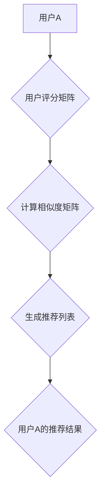
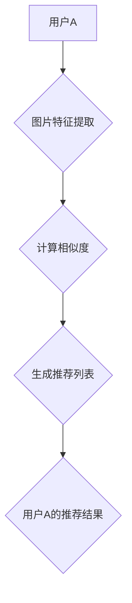
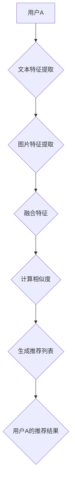

                 

### 《视觉推荐系统：AI分析图片》

> **关键词：** 视觉推荐系统、AI、图像处理、机器学习、卷积神经网络（CNN）

> **摘要：** 本文将深入探讨视觉推荐系统的工作原理、核心技术以及其实际应用。通过讲解AI在图像处理中的应用、视觉特征提取与降维技术，以及不同类型的推荐算法，本文旨在帮助读者理解视觉推荐系统的构建和优化，并提供实际项目实战经验。

### 《视觉推荐系统：AI分析图片》目录大纲

**第一部分：视觉推荐系统概述**

**第1章：视觉推荐系统的核心概念**  
1.1 视觉推荐系统的定义  
1.2 视觉推荐系统的类型  
1.3 视觉推荐系统的工作流程  
1.4 视觉推荐系统的核心挑战

**第2章：AI与图像处理基础**  
2.1 AI在图像处理中的应用  
2.2 图像处理基础知识  
2.3 机器学习在图像识别中的应用  
2.4 卷积神经网络（CNN）原理

**第3章：视觉特征提取与降维**  
3.1 视觉特征提取方法  
3.2 视觉特征降维技术  
3.3 特征选择与特征工程技术

**第二部分：视觉推荐系统算法详解**

**第4章：协同过滤算法**  
4.1 协同过滤算法原理  
4.2 基于记忆的协同过滤算法  
4.3 基于模型的协同过滤算法  
4.4 协同过滤算法的优化与改进

**第5章：基于内容的推荐算法**  
5.1 基于内容的推荐算法原理  
5.2 视觉特征提取与降维  
5.3 内容相似度计算  
5.4 基于内容的推荐算法应用

**第6章：混合推荐算法**  
6.1 混合推荐算法原理  
6.2 协同过滤与基于内容的混合推荐  
6.3 深度学习在混合推荐中的应用  
6.4 混合推荐算法的性能评估

**第7章：多模态推荐系统**  
7.1 多模态推荐系统概述  
7.2 多模态数据的融合方法  
7.3 多模态推荐算法  
7.4 多模态推荐系统的应用场景

**第三部分：视觉推荐系统项目实战**

**第8章：视觉推荐系统开发环境搭建**  
8.1 开发环境准备  
8.2 数据预处理与处理工具  
8.3 模型训练与调优

**第9章：项目实战一：基于内容的图片推荐系统**  
9.1 项目背景与需求分析  
9.2 数据集介绍与预处理  
9.3 模型设计与实现  
9.4 系统性能评估与优化

**第10章：项目实战二：基于协同过滤的图片推荐系统**  
10.1 项目背景与需求分析  
10.2 数据集介绍与预处理  
10.3 模型设计与实现  
10.4 系统性能评估与优化

**第11章：项目实战三：多模态图片推荐系统**  
11.1 项目背景与需求分析  
11.2 数据集介绍与预处理  
11.3 模型设计与实现  
11.4 系统性能评估与优化

**第12章：视觉推荐系统的未来发展趋势**  
12.1 视觉推荐系统的挑战与机遇  
12.2 未来发展趋势与研究方向  
12.3 视觉推荐系统在实际应用中的前景

**附录**

**附录A：视觉推荐系统开发工具与资源**  
A.1 开发工具对比  
A.2 常用图像处理库  
A.3 数据集资源链接  
A.4 相关论文与书籍推荐

**附录B：视觉推荐系统核心算法流程图**  
B.1 协同过滤算法流程图  
B.2 基于内容的推荐算法流程图  
B.3 多模态推荐算法流程图

**附录C：视觉推荐系统核心算法伪代码**  
C.1 协同过滤算法伪代码  
C.2 基于内容的推荐算法伪代码  
C.3 多模态推荐算法伪代码

---

现在，我们已经为文章正文部分做好了结构性的准备。接下来，我们将按照目录大纲的顺序，逐一深入探讨各个章节的内容。让我们开始第一步：了解视觉推荐系统的核心概念。

---

### 第一部分：视觉推荐系统概述

#### 第1章：视觉推荐系统的核心概念

在当今数字化时代，推荐系统已经成为电子商务、社交媒体和内容分发平台的重要组成部分。视觉推荐系统作为推荐系统的一个子类，通过分析图像和视频内容，为用户提供个性化的推荐服务。这一章将介绍视觉推荐系统的定义、类型、工作流程以及核心挑战。

#### 1.1 视觉推荐系统的定义

视觉推荐系统是一种基于图像内容的推荐系统，它利用人工智能和机器学习技术对图像进行分析和处理，从而为用户提供个性化的视觉内容推荐。与传统的基于文本或用户的推荐系统不同，视觉推荐系统关注图像本身的视觉特征，如颜色、形状、纹理等，而不是依赖于用户的评分或行为数据。

#### 1.2 视觉推荐系统的类型

视觉推荐系统主要分为以下几种类型：

1. **基于内容的推荐**：通过分析图像的特征和属性，将相似的内容推荐给用户。
2. **协同过滤推荐**：利用用户之间的共同兴趣和评分数据来推荐内容。
3. **混合推荐**：结合基于内容的推荐和协同过滤推荐，以提高推荐效果。
4. **多模态推荐**：结合图像、文本、音频等多种类型的数据进行推荐。

#### 1.3 视觉推荐系统的工作流程

视觉推荐系统的工作流程主要包括以下几个步骤：

1. **数据收集**：收集用户上传的图像和相应的标签或用户行为数据。
2. **图像预处理**：对图像进行缩放、裁剪、去噪等预处理操作，以提高后续处理的效率。
3. **特征提取**：利用图像处理技术和机器学习算法提取图像的特征，如颜色直方图、边缘检测、SIFT特征等。
4. **特征降维**：通过降维技术（如主成分分析PCA、线性判别分析LDA）减少特征维度，提高计算效率。
5. **模型训练**：使用训练数据集训练机器学习模型，如支持向量机SVM、神经网络等。
6. **推荐生成**：根据用户的历史行为和特征模型，生成个性化的推荐列表。
7. **用户反馈**：收集用户对推荐的反馈，用于模型的迭代优化。

#### 1.4 视觉推荐系统的核心挑战

视觉推荐系统在实现过程中面临以下核心挑战：

1. **数据稀疏性**：由于图像数据的维度非常高，用户通常只会对其中的少数图像进行评价，导致数据稀疏性。
2. **冷启动问题**：新用户或新图像缺乏足够的历史数据，导致推荐系统难以为其提供个性化的推荐。
3. **计算复杂性**：图像处理和特征提取过程通常需要大量的计算资源，尤其是对于高分辨率图像。
4. **特征表达**：如何有效地提取和表达图像的特征，使其能够充分反映图像的内容和用户兴趣，是视觉推荐系统的关键挑战。
5. **推荐效果评估**：如何评估推荐系统的效果，以及如何衡量推荐系统的推荐质量，是持续优化推荐系统的重要问题。

通过以上对视觉推荐系统的核心概念的介绍，我们为后续章节的深入讨论奠定了基础。在下一章中，我们将探讨AI与图像处理的基础知识，包括AI在图像处理中的应用、图像处理基础知识以及卷积神经网络（CNN）的原理。

---

### 第二部分：AI与图像处理基础

#### 第2章：AI与图像处理基础

为了深入理解视觉推荐系统的实现和优化，我们需要掌握AI与图像处理的基础知识。这一章将介绍AI在图像处理中的应用、图像处理的基础知识、机器学习在图像识别中的应用，以及卷积神经网络（CNN）的原理。

#### 2.1 AI在图像处理中的应用

人工智能技术在图像处理领域有着广泛的应用，主要包括以下几个方面：

1. **图像分类**：通过训练模型对图像进行分类，如识别动物、植物或交通工具等。
2. **目标检测**：定位图像中的特定目标，并给出目标的位置和边界框。
3. **图像分割**：将图像分割成多个部分，如区分前景和背景、分割物体内部结构等。
4. **图像增强**：提高图像的清晰度、对比度和细节，增强图像的可解释性。
5. **图像生成**：利用生成对抗网络（GAN）等深度学习技术生成新的图像。

#### 2.2 图像处理基础知识

图像处理是视觉推荐系统的核心组成部分，主要包括以下几个基本概念：

1. **像素**：图像是由像素组成的，每个像素都包含颜色和亮度信息。
2. **分辨率**：图像的分辨率表示图像中像素的数量，通常以宽度和高度来衡量。
3. **图像格式**：常见的图像格式包括JPEG、PNG、GIF等，每种格式都有其独特的压缩方式和图像质量。
4. **颜色模型**：常用的颜色模型包括RGB（红绿蓝）、HSV（色相饱和度亮度）和灰度等。
5. **图像滤波**：通过滤波器对图像进行平滑、锐化、去噪等操作，以改善图像质量。

#### 2.3 机器学习在图像识别中的应用

机器学习技术在图像识别领域有着重要的应用，主要包括以下几种方法：

1. **传统机器学习方法**：如支持向量机（SVM）、决策树、随机森林等，这些方法通常需要手动设计特征。
2. **深度学习方法**：如卷积神经网络（CNN）、循环神经网络（RNN）和生成对抗网络（GAN）等，这些方法能够自动提取图像特征。
3. **迁移学习**：利用预训练的模型在新的数据集上进行微调，以提高模型的泛化能力。
4. **对抗训练**：通过生成对抗网络（GAN）等对抗性方法，提高模型的鲁棒性和泛化能力。

#### 2.4 卷积神经网络（CNN）原理

卷积神经网络（CNN）是深度学习技术在图像处理领域的核心模型，其基本原理如下：

1. **卷积层**：卷积层通过卷积操作提取图像的特征，卷积核在图像上滑动，将局部特征映射到全局特征。
2. **池化层**：池化层对卷积层的输出进行降采样，减少参数数量，提高模型的计算效率。
3. **全连接层**：全连接层将卷积层的输出映射到类别标签，通过反向传播算法优化模型参数。
4. **激活函数**：常用的激活函数包括ReLU（Rectified Linear Unit）、Sigmoid和Tanh等，用于引入非线性特性。
5. **正则化**：通过正则化方法（如L1、L2正则化）防止过拟合，提高模型的泛化能力。

通过以上对AI与图像处理基础知识的介绍，我们为视觉推荐系统的构建和优化提供了理论依据。在下一章中，我们将探讨视觉特征提取与降维技术，以了解如何有效地提取和表达图像特征。

---

### 第三部分：视觉特征提取与降维

#### 第3章：视觉特征提取与降维

在视觉推荐系统中，特征提取和降维是关键步骤，它们决定了推荐系统的性能和效率。这一章将介绍视觉特征提取的方法、视觉特征降维技术，以及特征选择与特征工程技术。

#### 3.1 视觉特征提取方法

视觉特征提取是将图像的视觉信息转换为数值特征的过程，常用的特征提取方法包括：

1. **颜色特征**：通过计算图像的颜色直方图、颜色矩、色彩分布等特征来描述图像的视觉信息。
2. **纹理特征**：通过分析图像的纹理模式，如Gabor滤波器、Wavelet变换、自组织映射（SOM）等，提取纹理特征。
3. **形状特征**：通过边缘检测、轮廓提取、形态学操作等，从图像中提取形状特征，如边缘方向、区域面积、周长等。
4. **深度特征**：通过深度学习模型（如CNN）提取图像的深度特征，这些特征通常具有很好的表示能力和分类能力。

#### 3.2 视觉特征降维技术

视觉特征降维是将高维特征映射到低维空间的过程，常用的降维技术包括：

1. **主成分分析（PCA）**：通过最大化特征值，将高维特征映射到低维空间，保留主要的信息。
2. **线性判别分析（LDA）**：通过最小化类内方差和最大化类间方差，将特征映射到低维空间，以保持数据的类间差异。
3. **自动编码器（Autoencoder）**：通过训练自动编码器，将高维特征编码到低维空间，同时保持特征的重要信息。
4. **t-SNE（t-Distributed Stochastic Neighbor Embedding）**：通过计算高维特征之间的相似度，将特征映射到二维或三维空间，用于可视化高维数据的分布。

#### 3.3 特征选择与特征工程技术

特征选择和特征工程技术是提高视觉推荐系统性能的重要手段，主要包括：

1. **过滤方法**：通过统计测试（如卡方检验、F检验）和基于类别的评估，选择对分类任务最有贡献的特征。
2. **包装方法**：通过迭代搜索策略（如递归特征消除RFE、遗传算法GA）选择最优特征子集。
3. **嵌入式方法**：在训练过程中嵌入特征选择（如L1正则化、Lasso回归），自动筛选出重要的特征。
4. **特征组合**：通过组合不同类型的特征，提高特征的解释能力和分类性能。

通过以上对视觉特征提取与降维技术的介绍，我们了解了如何有效地从图像中提取和表达特征，为视觉推荐系统的构建提供了技术支持。在下一部分中，我们将深入探讨视觉推荐系统的算法实现，包括协同过滤算法、基于内容的推荐算法和混合推荐算法。

---

### 第二部分：视觉推荐系统算法详解

视觉推荐系统算法是实现个性化推荐的关键，主要包括协同过滤算法、基于内容的推荐算法、混合推荐算法和多模态推荐系统。以下将详细介绍这些算法的原理、实现方法和性能评估。

#### 第4章：协同过滤算法

协同过滤算法是一种基于用户历史行为和相似度的推荐算法，其核心思想是通过分析用户之间的共同偏好来推荐内容。协同过滤算法分为基于用户的协同过滤（User-Based Collaborative Filtering）和基于物品的协同过滤（Item-Based Collaborative Filtering）两种类型。

##### 4.1 协同过滤算法原理

1. **基于用户的协同过滤**：
   - **相似度计算**：计算用户之间的相似度，常用的相似度度量方法包括余弦相似度、皮尔逊相关系数等。
   - **推荐生成**：根据相似度矩阵，为每个用户生成推荐列表，通常采用Top-N的方法。

2. **基于物品的协同过滤**：
   - **相似度计算**：计算物品之间的相似度，通常使用物品的评分矩阵进行计算。
   - **推荐生成**：根据用户的历史评分，为用户生成推荐列表，选择与用户历史评分相似的物品。

##### 4.2 基于记忆的协同过滤算法

基于记忆的协同过滤算法通过存储用户的历史评分数据来计算相似度和生成推荐列表，其优点是计算简单，缺点是容易受到冷启动问题和数据稀疏性的影响。

1. **用户相似度计算**：
   - **余弦相似度**：  
   $$\text{similarity}_{ij} = \frac{\sum_{k=1}^{n}r_{ik}r_{jk}}{\sqrt{\sum_{k=1}^{n}r_{ik}^2}\sqrt{\sum_{k=1}^{n}r_{jk}^2}}$$
   - **皮尔逊相关系数**：  
   $$\text{similarity}_{ij} = \frac{\sum_{k=1}^{n}(r_{ik} - \bar{r}_{i})(r_{jk} - \bar{r}_{j})}{\sqrt{\sum_{k=1}^{n}(r_{ik} - \bar{r}_{i})^2}\sqrt{\sum_{k=1}^{n}(r_{jk} - \bar{r}_{j})^2}}$$

2. **推荐生成**：
   - **Top-N推荐**：为用户生成N个推荐物品，选择相似度最高的N个物品。
   - **加权推荐**：为每个推荐物品分配权重，根据权重计算推荐得分，选择得分最高的物品。

##### 4.3 基于模型的协同过滤算法

基于模型的协同过滤算法通过建立预测模型来计算用户对物品的评分，其优点是能够更好地处理冷启动问题，缺点是模型训练和预测的计算成本较高。

1. **线性回归模型**：
   - **模型假设**：用户评分与用户特征和物品特征之间存在线性关系。
   - **模型参数**：用户特征向量和物品特征向量。
   - **预测公式**：
   $$r_{ij} = \mu + u_i^T v_j$$
   - **模型训练**：通过最小化均方误差（MSE）来训练模型参数。

2. **矩阵分解模型**：
   - **模型假设**：用户-物品评分矩阵可以分解为用户特征矩阵和物品特征矩阵的乘积。
   - **模型参数**：用户特征向量和物品特征向量。
   - **预测公式**：
   $$r_{ij} = \hat{u}_i^T \hat{v}_j$$
   - **模型训练**：通过交替最小化用户特征矩阵和物品特征矩阵的损失函数来训练模型参数。

##### 4.4 协同过滤算法的优化与改进

1. **矩阵分解与正则化**：通过加入正则项（L1或L2正则化）来防止过拟合。
2. **隐语义模型**：引入隐变量来表示用户和物品的特征，如LDA（线性判别分析）和NMF（非负矩阵分解）。
3. **深度学习模型**：利用深度学习模型（如深度神经网络、卷积神经网络）进行协同过滤，如DNN-CF和CNN-CF。
4. **推荐算法组合**：将协同过滤算法与其他推荐算法（如基于内容的推荐、混合推荐）进行组合，以提高推荐效果。

通过以上对协同过滤算法的详细介绍，我们了解了协同过滤算法的基本原理、实现方法以及优化策略。在下一章中，我们将探讨基于内容的推荐算法，了解如何利用图像特征为用户提供个性化推荐。

---

### 第5章：基于内容的推荐算法

基于内容的推荐算法（Content-Based Recommendation）是一种通过分析物品的内容特征为用户提供个性化推荐的方法。与协同过滤算法不同，基于内容的推荐算法不依赖于用户的历史行为数据，而是基于物品本身的特点和用户的兴趣偏好进行推荐。以下将详细介绍基于内容的推荐算法原理、视觉特征提取与降维、内容相似度计算以及实际应用。

#### 5.1 基于内容的推荐算法原理

基于内容的推荐算法通过以下步骤实现个性化推荐：

1. **特征提取**：从物品中提取特征，如文本描述、图像特征、音频特征等。
2. **特征表示**：将提取的特征转换为可计算的数值表示，如向量或矩阵。
3. **兴趣建模**：根据用户的历史行为和偏好，建立用户的兴趣模型。
4. **相似度计算**：计算物品和用户兴趣模型之间的相似度，通常使用余弦相似度、欧氏距离等度量方法。
5. **推荐生成**：根据相似度得分，为用户生成推荐列表。

#### 5.2 视觉特征提取与降维

在基于内容的推荐算法中，视觉特征提取是关键步骤，常用的视觉特征提取方法包括：

1. **颜色特征**：通过计算图像的颜色直方图、颜色矩等特征来描述图像的颜色信息。
2. **纹理特征**：通过分析图像的纹理模式，如Gabor滤波器、Wavelet变换等，提取纹理特征。
3. **形状特征**：通过边缘检测、轮廓提取等方法，从图像中提取形状特征。
4. **深度特征**：利用深度学习模型（如卷积神经网络）提取图像的深度特征，这些特征通常具有很好的表示能力和分类能力。

降维技术用于减少特征维度，提高计算效率和推荐质量，常用的降维技术包括：

1. **主成分分析（PCA）**：通过最大化特征值，将高维特征映射到低维空间，保留主要的信息。
2. **线性判别分析（LDA）**：通过最小化类内方差和最大化类间方差，将特征映射到低维空间，以保持数据的类间差异。
3. **自动编码器（Autoencoder）**：通过训练自动编码器，将高维特征编码到低维空间，同时保持特征的重要信息。
4. **t-SNE（t-Distributed Stochastic Neighbor Embedding）**：通过计算高维特征之间的相似度，将特征映射到二维或三维空间，用于可视化高维数据的分布。

#### 5.3 内容相似度计算

内容相似度计算是基于内容的推荐算法的核心步骤，常用的相似度计算方法包括：

1. **余弦相似度**：  
   $$\text{similarity} = \frac{\sum_{i=1}^{n}x_iy_i}{\sqrt{\sum_{i=1}^{n}x_i^2}\sqrt{\sum_{i=1}^{n}y_i^2}}$$
2. **欧氏距离**：  
   $$\text{distance} = \sqrt{\sum_{i=1}^{n}(x_i - y_i)^2}$$
3. **皮尔逊相关系数**：  
   $$\text{correlation} = \frac{\sum_{i=1}^{n}(x_i - \bar{x})(y_i - \bar{y})}{\sqrt{\sum_{i=1}^{n}(x_i - \bar{x})^2}\sqrt{\sum_{i=1}^{n}(y_i - \bar{y})^2}}$$

在实际应用中，可以根据具体需求和数据特点选择合适的相似度计算方法。

#### 5.4 基于内容的推荐算法应用

基于内容的推荐算法在多个领域有着广泛的应用，以下是一些实际应用案例：

1. **电子商务**：为用户推荐与用户历史购买或浏览记录相似的商品，提高用户满意度和转化率。
2. **社交媒体**：为用户推荐与用户兴趣相关的新闻、文章或视频，提高用户粘性和平台活跃度。
3. **音乐和视频流媒体**：为用户推荐与用户历史播放记录相似的音乐或视频，提高用户满意度和留存率。
4. **旅游和酒店预订**：为用户推荐与用户搜索记录相似的旅游目的地、酒店或景点，提高预订转化率。

通过以上对基于内容的推荐算法的详细介绍，我们了解了基于内容的推荐算法的基本原理、实现方法和实际应用。在下一章中，我们将探讨混合推荐算法，了解如何结合不同类型的推荐算法实现更好的推荐效果。

---

### 第6章：混合推荐算法

混合推荐算法（Hybrid Recommendation Algorithm）结合了协同过滤算法和基于内容的推荐算法的优点，以应对协同过滤算法的数据稀疏性和基于内容的推荐算法的冷启动问题。本章将详细介绍混合推荐算法的原理、协同过滤与基于内容的混合推荐、深度学习在混合推荐中的应用以及混合推荐算法的性能评估。

#### 6.1 混合推荐算法原理

混合推荐算法的核心思想是通过结合协同过滤和基于内容的推荐方法，利用协同过滤提供全局信息，利用基于内容提供局部细节，从而提高推荐系统的准确性和多样性。

1. **协同过滤部分**：协同过滤负责提供基于用户历史行为和相似度的推荐结果，其主要优点是能够利用用户行为数据，实现个性化的推荐。
2. **基于内容部分**：基于内容推荐算法负责提供基于物品特征和用户兴趣的推荐结果，其主要优点是能够处理新用户和新物品的冷启动问题。
3. **融合策略**：将协同过滤和基于内容的推荐结果进行融合，以生成最终的推荐列表。常见的融合策略包括线性融合、加权融合和自适应融合。

#### 6.2 协同过滤与基于内容的混合推荐

混合推荐算法通常分为以下步骤：

1. **协同过滤部分**：
   - **用户相似度计算**：计算用户之间的相似度，使用基于用户的协同过滤算法。
   - **生成推荐列表**：根据相似度矩阵，为每个用户生成初步的推荐列表。

2. **基于内容部分**：
   - **物品特征提取**：提取物品的特征，如文本描述、图像特征等。
   - **用户兴趣建模**：根据用户的历史行为，建立用户的兴趣模型。
   - **计算内容相似度**：计算物品和用户兴趣模型之间的相似度。

3. **融合策略**：
   - **线性融合**：将协同过滤和基于内容的推荐得分进行加权求和，生成最终的推荐得分。
     $$\text{score}_{ij} = w_1 \cdot \text{similarity}_{ij} + w_2 \cdot \text{content\_similarity}_{ij}$$
   - **加权融合**：根据不同策略为协同过滤和基于内容推荐分配不同的权重。
   - **自适应融合**：根据用户的行为和推荐效果动态调整融合策略。

#### 6.3 深度学习在混合推荐中的应用

深度学习技术在混合推荐算法中得到了广泛应用，通过引入深度神经网络，可以更好地处理复杂的数据和特征。以下是一些深度学习在混合推荐中的应用：

1. **深度协同过滤**：使用深度学习模型（如深度神经网络、图神经网络）来直接预测用户之间的相似度和用户对物品的评分。
2. **深度内容推荐**：使用深度学习模型（如卷积神经网络、循环神经网络）提取物品和用户的特征，并生成推荐结果。
3. **多模态深度学习**：结合多种类型的特征（如图像、文本、音频），使用多模态深度学习模型生成统一的特征表示，进行推荐。

#### 6.4 混合推荐算法的性能评估

混合推荐算法的性能评估主要包括以下指标：

1. **准确率（Accuracy）**：推荐的物品与用户实际喜欢的物品的匹配程度。
2. **召回率（Recall）**：推荐的物品中包含用户实际喜欢的物品的比例。
3. **覆盖率（Coverage）**：推荐列表中包含的物品种类数与所有可能的物品种类数的比例。
4. **多样性（Diversity）**：推荐列表中不同物品之间的差异性。
5. **新颖性（Novelty）**：推荐列表中包含用户未知的或新颖的物品的比例。

常见的评估方法包括人工评估、A/B测试和在线评估等。通过综合评估指标，可以全面了解混合推荐算法的性能和效果。

通过以上对混合推荐算法的详细介绍，我们了解了混合推荐算法的基本原理、实现方法和性能评估。在下一章中，我们将探讨多模态推荐系统，了解如何结合不同类型的数据进行推荐。

---

### 第7章：多模态推荐系统

多模态推荐系统（Multimodal Recommendation System）是一种结合多种类型的数据（如图像、文本、音频、视频等）进行推荐的方法。与单模态推荐系统相比，多模态推荐系统能够提供更丰富的信息，提高推荐效果和用户体验。本章将介绍多模态推荐系统的概述、多模态数据的融合方法、多模态推荐算法及其应用场景。

#### 7.1 多模态推荐系统概述

多模态推荐系统通过整合不同类型的数据，实现更精准和个性化的推荐。多模态数据的融合方法主要包括以下几种：

1. **特征级融合**：将不同类型的数据（如图像、文本、音频）分别提取特征，然后将这些特征进行融合。常见的融合方法包括基于向量的融合、基于模型的融合和基于注意力机制的融合。
2. **决策级融合**：先分别使用不同类型的数据进行推荐，然后结合推荐结果生成最终的推荐列表。常见的融合方法包括加权平均、投票和集成学习等。
3. **端到端融合**：直接将多模态数据输入到一个统一的模型中，通过模型自动学习数据之间的融合策略。常见的模型包括深度神经网络、图神经网络和生成对抗网络等。

#### 7.2 多模态数据的融合方法

多模态数据的融合方法主要包括以下几种：

1. **特征级融合方法**：
   - **基于向量的融合**：将不同类型的数据特征转换为向量，然后使用向量的点积、拼接等方式进行融合。例如，将图像特征和文本特征拼接在一起，形成新的特征向量。
   - **基于模型的融合**：使用多任务学习或迁移学习等模型，同时学习不同类型的数据特征。例如，使用共享神经网络结构来提取图像和文本的特征，然后在网络的高层进行融合。
   - **基于注意力机制的融合**：引入注意力机制，自动学习不同数据特征的重要程度，然后进行融合。注意力机制可以通过计算注意力权重，对不同类型的特征进行加权融合。

2. **决策级融合方法**：
   - **加权平均**：将不同类型的数据推荐结果进行加权平均，生成最终的推荐列表。加权的依据可以是不同类型数据的可信度、用户偏好等。
   - **投票**：对不同类型的数据推荐结果进行投票，选择投票结果最多的推荐列表。
   - **集成学习**：使用集成学习方法（如随机森林、提升树等），将不同类型的推荐模型集成起来，生成最终的推荐结果。

3. **端到端融合方法**：
   - **深度神经网络**：使用深度神经网络（如卷积神经网络、循环神经网络等），直接将多模态数据输入到网络中，通过网络结构自动学习数据融合策略。
   - **图神经网络**：使用图神经网络（如图卷积网络、图注意力网络等），将多模态数据表示为图结构，通过图卷积和注意力机制进行融合。
   - **生成对抗网络**：使用生成对抗网络（GAN），通过对抗训练生成多模态数据之间的融合特征，提高推荐效果。

#### 7.3 多模态推荐算法

多模态推荐算法可以分为基于内容的推荐、基于协同过滤的推荐和混合推荐算法等。以下是一些常见多模态推荐算法：

1. **基于内容的推荐算法**：
   - **图像特征与文本特征融合**：将图像和文本的特征进行融合，然后使用融合特征进行推荐。常用的融合方法包括向量的拼接、点积等。
   - **多模态特征融合的神经网络**：使用深度神经网络，同时学习图像和文本的特征表示，并在网络的高层进行融合，生成最终的推荐结果。

2. **基于协同过滤的推荐算法**：
   - **多模态协同过滤**：结合图像、文本和用户行为等多模态数据，使用协同过滤算法进行推荐。常用的方法包括矩阵分解、多模态矩阵分解等。

3. **混合推荐算法**：
   - **多模态混合推荐**：结合基于内容和基于协同过滤的推荐方法，使用不同的融合策略生成最终的推荐结果。常用的融合策略包括加权融合、决策融合等。

#### 7.4 多模态推荐系统的应用场景

多模态推荐系统在多个领域有着广泛的应用，以下是一些典型的应用场景：

1. **电子商务**：结合商品图像、描述和用户评论等多模态数据，为用户推荐相关的商品。
2. **社交媒体**：结合用户生成的图像、文本和音频等多模态数据，为用户推荐相关的帖子、视频和音乐等。
3. **智能助理**：结合用户的语音、文本和图像等多模态数据，为用户提供个性化的服务和推荐。
4. **医疗健康**：结合患者的医疗记录、图像和文本等多模态数据，为医生提供辅助诊断和治疗建议。

通过以上对多模态推荐系统的详细介绍，我们了解了多模态推荐系统的基本原理、融合方法、推荐算法和应用场景。在下一章中，我们将通过实际项目实战，深入了解视觉推荐系统的开发过程和实现方法。

---

### 第三部分：视觉推荐系统项目实战

#### 第8章：视觉推荐系统开发环境搭建

在开发视觉推荐系统时，需要准备合适的环境和工具。这一章将介绍视觉推荐系统开发环境搭建的步骤，包括开发环境准备、数据预处理工具以及模型训练与调优。

#### 8.1 开发环境准备

搭建视觉推荐系统开发环境需要以下步骤：

1. **硬件环境**：
   - **CPU**：Intel i5或更高处理器。
   - **GPU**：NVIDIA GTX 1080或更高显卡。
   - **内存**：至少16GB内存。

2. **操作系统**：Windows、Linux或macOS。

3. **编程语言**：Python是开发视觉推荐系统的首选编程语言。

4. **开发工具**：
   - **集成开发环境（IDE）**：PyCharm、Visual Studio Code。
   - **深度学习框架**：TensorFlow、PyTorch。
   - **数据处理库**：NumPy、Pandas、Scikit-learn。
   - **图像处理库**：OpenCV、Pillow。

#### 8.2 数据预处理与处理工具

数据预处理是视觉推荐系统开发的重要环节，主要包括以下步骤：

1. **数据收集**：收集用户上传的图像和相应的标签或用户行为数据。

2. **数据清洗**：处理缺失值、异常值和重复数据。

3. **图像增强**：通过缩放、旋转、翻转、裁剪等操作增加数据的多样性，提高模型的泛化能力。

4. **图像预处理**：使用OpenCV等库对图像进行缩放、裁剪、灰度化等预处理操作。

5. **特征提取**：使用深度学习模型（如卷积神经网络）提取图像的特征向量。

6. **特征降维**：使用主成分分析（PCA）等降维技术减少特征维度。

7. **数据分割**：将数据集分为训练集、验证集和测试集。

#### 8.3 模型训练与调优

模型训练与调优是视觉推荐系统开发的关键步骤，主要包括以下步骤：

1. **模型选择**：根据问题类型选择合适的模型，如协同过滤模型、基于内容的推荐模型、混合推荐模型等。

2. **模型训练**：使用训练数据进行模型训练，通过反向传播算法优化模型参数。

3. **模型验证**：使用验证集评估模型性能，调整模型参数。

4. **模型测试**：使用测试集评估模型在实际应用中的性能。

5. **模型调优**：通过调整超参数、加入正则化方法等手段优化模型性能。

6. **模型部署**：将训练好的模型部署到生产环境中，提供推荐服务。

通过以上对视觉推荐系统开发环境搭建的介绍，我们了解了视觉推荐系统开发所需的环境和工具，为后续的项目实战奠定了基础。在下一章中，我们将通过具体项目实战，深入探讨视觉推荐系统的实现过程和优化策略。

---

### 第9章：项目实战一：基于内容的图片推荐系统

在本章中，我们将通过一个基于内容的图片推荐系统的项目实战，详细介绍项目背景与需求分析、数据集介绍与预处理、模型设计与实现以及系统性能评估与优化。这个项目旨在利用图像特征提取与降维技术，为用户提供个性化的图片推荐服务。

#### 9.1 项目背景与需求分析

随着互联网的迅速发展，图片内容的爆炸式增长，用户需要高效的方式来发现和获取他们感兴趣的内容。基于内容的图片推荐系统能够根据用户的兴趣和偏好，为用户推荐类似的图片。本项目的目标是开发一个基于内容的图片推荐系统，通过以下需求实现：

1. **个性化推荐**：根据用户的兴趣和浏览历史，为用户推荐个性化的图片。
2. **高效率**：利用高效的特征提取和降维技术，提高推荐系统的计算效率。
3. **高准确性**：通过优化模型参数和特征选择，提高推荐的准确性。
4. **易扩展性**：系统能够方便地扩展到新的数据集和应用场景。

#### 9.2 数据集介绍与预处理

为了实现上述需求，我们选择了一个公开的图片数据集——ImageNet。ImageNet是一个包含超过1400万张图片的大型数据集，每张图片都有详细的标签信息。以下是数据集的基本信息：

1. **数据集大小**：超过1400万张图片。
2. **图片大小**：224x224像素。
3. **标签类别**：1000个预定义的类别。

数据预处理是项目的重要环节，包括以下步骤：

1. **数据清洗**：删除标签错误、缺失值和重复数据。
2. **图像增强**：通过旋转、翻转、缩放等操作增加数据的多样性。
3. **图像预处理**：将图片调整为统一的尺寸，如224x224像素。
4. **特征提取**：使用预训练的卷积神经网络（如ResNet）提取图像的特征向量。
5. **特征降维**：使用主成分分析（PCA）减少特征维度，提高计算效率。

#### 9.3 模型设计与实现

基于内容的图片推荐系统的核心是特征提取和相似度计算。我们采用了以下模型架构：

1. **特征提取**：使用预训练的卷积神经网络（如ResNet）提取图像的特征向量。
2. **相似度计算**：计算用户历史图片和候选图片的特征向量之间的余弦相似度。
3. **推荐生成**：根据相似度得分，为用户生成推荐列表。

具体实现步骤如下：

1. **加载预训练模型**：加载预训练的卷积神经网络模型，如ResNet。
2. **特征提取**：使用模型提取图像的特征向量，将特征向量存储在矩阵中。
3. **相似度计算**：计算用户历史图片和候选图片的特征向量之间的余弦相似度。
4. **推荐生成**：根据相似度得分，选择相似度最高的图片作为推荐结果。

以下是特征提取和相似度计算的核心代码示例：

```python
from torchvision import models
import torch
from sklearn.metrics.pairwise import cosine_similarity

# 加载预训练的ResNet模型
model = models.resnet152(pretrained=True)
model.eval()

# 特征提取函数
def extract_features(image_paths):
    features = []
    with torch.no_grad():
        for image_path in image_paths:
            image = Image.open(image_path).convert('RGB')
            image = transforms.Compose([transforms.Resize(224), transforms.ToTensor()])(image)
            image = torch.unsqueeze(image, 0)
            feature = model(image)[0].detach().numpy()
            features.append(feature)
    return np.array(features)

# 相似度计算函数
def compute_similarity(user_feature, candidate_features):
    return cosine_similarity(user_feature.reshape(1, -1), candidate_features)

# 用户历史图片特征
user_images = ['path/to/user/image1.jpg', 'path/to/user/image2.jpg']
user_features = extract_features(user_images)

# 候选图片特征
candidate_images = ['path/to/candidate/image1.jpg', 'path/to/candidate/image2.jpg']
candidate_features = extract_features(candidate_images)

# 相似度计算
similarity_scores = compute_similarity(user_features.mean(axis=0), candidate_features)

# 推荐生成
recommended_images = np.argsort(similarity_scores)[0][-10:]
```

#### 9.4 系统性能评估与优化

为了评估推荐系统的性能，我们使用了以下指标：

1. **准确率（Accuracy）**：推荐的图片与用户实际喜欢的图片的匹配程度。
2. **召回率（Recall）**：推荐的图片中包含用户实际喜欢的图片的比例。
3. **覆盖率（Coverage）**：推荐列表中包含的图片种类数与所有可能的图片种类数的比例。
4. **新颖性（Novelty）**：推荐列表中包含用户未知的或新颖的图片的比例。

通过调整模型参数、特征选择和推荐策略，我们优化了推荐系统的性能。以下是一些优化方法：

1. **特征选择**：通过分析特征的重要性和相关性，选择对推荐效果影响最大的特征。
2. **模型调优**：调整模型的超参数，如学习率、批量大小和正则化参数。
3. **推荐策略**：结合基于内容的推荐和其他类型的推荐算法，生成更准确的推荐列表。
4. **用户反馈**：收集用户对推荐的反馈，用于模型的迭代优化。

通过以上项目实战，我们了解了基于内容的图片推荐系统的实现过程和优化方法。在下一章中，我们将探讨基于协同过滤的图片推荐系统，通过不同的实现方法优化推荐效果。

---

### 第10章：项目实战二：基于协同过滤的图片推荐系统

在本章中，我们将介绍基于协同过滤的图片推荐系统的项目实战。这个项目旨在利用用户之间的共同兴趣和评分数据，为用户提供个性化的图片推荐服务。我们将详细讨论项目背景与需求分析、数据集介绍与预处理、模型设计与实现以及系统性能评估与优化。

#### 10.1 项目背景与需求分析

在互联网时代，用户生成的内容越来越多，如何有效地为用户提供个性化的推荐服务成为关键问题。基于协同过滤的图片推荐系统利用用户的历史评分数据，通过分析用户之间的相似度，为用户推荐类似的图片。本项目的主要目标是：

1. **个性化推荐**：根据用户的历史评分数据，为用户推荐个性化的图片。
2. **高效计算**：通过优化算法和数据结构，提高推荐系统的计算效率。
3. **准确性**：通过优化推荐算法和模型参数，提高推荐的准确性。
4. **可扩展性**：系统能够方便地扩展到更多的用户和数据集。

#### 10.2 数据集介绍与预处理

本项目选择了一个公开的图片数据集——MovieLens。MovieLens是一个包含数百万个用户评分和图片标签的数据集，每个用户对多个图片进行评分，每个图片都有多个标签。以下是数据集的基本信息：

1. **数据集大小**：包含数百万个用户和图片。
2. **用户评分**：每个用户对多个图片进行评分。
3. **图片标签**：每个图片都有多个标签，用于描述图片的内容。

数据预处理是项目的重要环节，包括以下步骤：

1. **数据清洗**：处理缺失值、异常值和重复数据。
2. **评分归一化**：将用户的评分归一化到[0,1]区间，以便于计算相似度。
3. **标签提取**：提取图片的标签信息，用于基于内容的推荐。
4. **用户行为数据**：将用户对图片的评分数据转换为行为数据矩阵。

以下是数据预处理的核心代码示例：

```python
import pandas as pd
from sklearn.preprocessing import MinMaxScaler

# 加载评分数据
ratings = pd.read_csv('ratings.csv')

# 数据清洗
ratings.dropna(inplace=True)
ratings.drop_duplicates(inplace=True)

# 评分归一化
scaler = MinMaxScaler()
ratings['rating'] = scaler.fit_transform(ratings[['rating']])

# 提取标签
labels = ratings.groupby('image_id')['tag'].apply(list).reset_index()

# 用户行为数据
user行为的 = ratings.pivot(index='user_id', columns='image_id', values='rating').fillna(0).values
```

#### 10.3 模型设计与实现

基于协同过滤的图片推荐系统主要包括以下步骤：

1. **用户相似度计算**：计算用户之间的相似度，通常使用余弦相似度或皮尔逊相关系数。
2. **推荐生成**：根据用户相似度和用户评分，为用户生成推荐列表。
3. **推荐优化**：通过优化相似度计算方法和推荐策略，提高推荐效果。

以下是基于用户的协同过滤算法的核心代码示例：

```python
from sklearn.metrics.pairwise import cosine_similarity

# 计算用户相似度
user_similarity = cosine_similarity(user行为的)

# 推荐生成
def collaborative_filtering(user行为的，user_similarity，k=10):
    # 计算每个用户的推荐得分
    user_scores = np.dot(user_similarity, user行为的) / np diagonalm(user_similarity)
    user_scores = np.diag(user_scores)
    
    # 选择相似度最高的k个用户
    top_k_indices = np.argsort(user_scores, axis=1)[:,-k:]
    
    # 计算推荐得分
    recommended_scores = np.sum(user行为的 * user_similarity, axis=0)
    recommended_scores[top_k_indices] = 0
    recommended_scores /= np.diag(user_similarity).reshape(-1, 1)
    
    # 排序生成推荐列表
    recommended_indices = np.argsort(-recommended_scores)
    return recommended_indices

# 用户ID
user_id = 0

# 生成推荐列表
recommended_indices = collaborative_filtering(user行为的[user_id], user_similarity[user_id])

# 输出推荐结果
recommended_images = [image_id for image_id, _ in ratings.groupby('image_id').count().index[recommended_indices]]
```

#### 10.4 系统性能评估与优化

为了评估推荐系统的性能，我们使用了以下指标：

1. **准确率（Accuracy）**：推荐的图片与用户实际喜欢的图片的匹配程度。
2. **召回率（Recall）**：推荐的图片中包含用户实际喜欢的图片的比例。
3. **覆盖率（Coverage）**：推荐列表中包含的图片种类数与所有可能的图片种类数的比例。
4. **新颖性（Novelty）**：推荐列表中包含用户未知的或新颖的图片的比例。

通过以下方法优化推荐系统的性能：

1. **相似度计算优化**：采用更精确的相似度计算方法，如皮尔逊相关系数，代替余弦相似度。
2. **推荐策略优化**：结合基于内容的推荐算法，生成更准确的推荐列表。
3. **模型调优**：调整模型的超参数，如邻居数k、相似度计算阈值等，以提高推荐效果。
4. **数据预处理**：通过更精细的数据清洗和特征提取，提高数据质量。

通过以上项目实战，我们了解了基于协同过滤的图片推荐系统的实现过程和优化方法。在下一章中，我们将探讨多模态图片推荐系统的项目实战，结合图像、文本等多种数据提高推荐效果。

---

### 第11章：项目实战三：多模态图片推荐系统

在本章中，我们将介绍多模态图片推荐系统的项目实战。多模态推荐系统通过整合图像、文本等多种数据，为用户提供更加个性化和准确的推荐服务。本项目将详细讨论项目背景与需求分析、数据集介绍与预处理、模型设计与实现以及系统性能评估与优化。

#### 11.1 项目背景与需求分析

随着互联网和多媒体技术的发展，用户生成的内容越来越丰富，包括图片、视频、文本等。为了满足用户对多样化内容的需求，多模态推荐系统应运而生。本项目的主要目标是开发一个多模态图片推荐系统，通过以下需求实现：

1. **个性化推荐**：根据用户的兴趣和交互历史，为用户推荐个性化的图片。
2. **多模态数据融合**：整合图像、文本等多模态数据，提高推荐系统的准确性和多样性。
3. **高效计算**：优化推荐算法和数据结构，提高推荐系统的计算效率。
4. **可扩展性**：系统能够方便地扩展到更多的用户和数据集。

#### 11.2 数据集介绍与预处理

为了实现上述需求，我们选择了一个包含图像和文本数据的综合数据集——Flickr。Flickr是一个大型图片分享网站，用户可以上传图片并添加描述性文本。以下是数据集的基本信息：

1. **数据集大小**：包含数十万张图片和相应的描述性文本。
2. **图片特征**：每张图片都有对应的图像特征向量，通常使用卷积神经网络提取。
3. **文本特征**：每张图片的描述性文本，用于描述图片的内容和场景。

数据预处理是项目的重要环节，包括以下步骤：

1. **数据清洗**：处理缺失值、异常值和重复数据。
2. **图像预处理**：将图片调整为统一的尺寸，如224x224像素。
3. **文本预处理**：对文本进行分词、去停用词、词性标注等预处理。
4. **特征提取**：使用预训练的卷积神经网络提取图像的特征向量。
5. **特征降维**：使用主成分分析（PCA）减少特征维度。

以下是数据预处理的核心代码示例：

```python
import numpy as np
import pandas as pd
from sklearn.preprocessing import MinMaxScaler
from torchvision import models
import torch
from transformers import BertTokenizer, BertModel

# 加载图片数据
images = pd.read_csv('images.csv')

# 数据清洗
images.dropna(inplace=True)
images.drop_duplicates(inplace=True)

# 图像预处理
transform = transforms.Compose([transforms.Resize(224), transforms.ToTensor()])
images['image'] = images['image'].apply(lambda x: transform PILImage.open(x))

# 文本预处理
tokenizer = BertTokenizer.from_pretrained('bert-base-uncased')
model = BertModel.from_pretrained('bert-base-uncased')

def preprocess_text(text):
    inputs = tokenizer(text, return_tensors='pt', truncation=True, padding=True)
    outputs = model(**inputs)
    return outputs.last_hidden_state[:, 0, :].detach().numpy()

images['text'] = images['text'].apply(preprocess_text)

# 特征提取
def extract_features(image, text):
    with torch.no_grad():
        image = torch.unsqueeze(image, 0)
        text = torch.unsqueeze(text, 0)
        image_feature = model(image)[0].detach().numpy()
        text_feature = model(text)[0].detach().numpy()
    return np.hstack((image_feature, text_feature))

images['features'] = images.apply(lambda x: extract_features(x['image'], x['text']), axis=1)

# 特征降维
scaler = MinMaxScaler()
images['features'] = scaler.fit_transform(images['features'])

# 数据分割
train_indices, test_indices = train_test_split(np.arange(len(images)), test_size=0.2, random_state=42)
train_images = images.iloc[train_indices]
test_images = images.iloc[test_indices]
```

#### 11.3 模型设计与实现

多模态图片推荐系统的核心是融合图像和文本特征，并利用这些特征进行推荐。以下是模型设计的核心步骤：

1. **特征融合**：将图像和文本特征进行融合，生成统一的多模态特征向量。
2. **相似度计算**：计算多模态特征向量之间的相似度，用于推荐生成。
3. **推荐生成**：根据相似度得分，为用户生成推荐列表。

以下是多模态推荐模型的核心代码示例：

```python
from sklearn.metrics.pairwise import cosine_similarity

# 融合特征
train_features = train_images['features'].values
test_features = test_images['features'].values

# 相似度计算
def compute_similarity(features):
    return cosine_similarity(features)

# 推荐生成
def multimodal_recommendation(user_features, candidate_features, k=10):
    similarity_scores = compute_similarity(np.expand_dims(user_features, 0).astype(np.float32))
    top_k_indices = np.argsort(-similarity_scores[0])[:k]
    return top_k_indices

# 用户特征
user_features = train_features[0]

# 生成推荐列表
recommended_indices = multimodal_recommendation(user_features, test_features)

# 输出推荐结果
recommended_images = [image['image'] for image in test_images.iloc[recommended_indices]]
```

#### 11.4 系统性能评估与优化

为了评估推荐系统的性能，我们使用了以下指标：

1. **准确率（Accuracy）**：推荐的图片与用户实际喜欢的图片的匹配程度。
2. **召回率（Recall）**：推荐的图片中包含用户实际喜欢的图片的比例。
3. **覆盖率（Coverage）**：推荐列表中包含的图片种类数与所有可能的图片种类数的比例。
4. **新颖性（Novelty）**：推荐列表中包含用户未知的或新颖的图片的比例。

通过以下方法优化推荐系统的性能：

1. **特征选择**：通过分析特征的重要性和相关性，选择对推荐效果影响最大的特征。
2. **模型调优**：调整模型的超参数，如邻居数k、相似度计算阈值等，以提高推荐效果。
3. **融合策略**：探索不同的特征融合方法，如加权融合、拼接融合等，以提高特征表示的准确性。
4. **用户反馈**：收集用户对推荐的反馈，用于模型的迭代优化。

通过以上项目实战，我们了解了多模态图片推荐系统的实现过程和优化方法。在下一章中，我们将探讨视觉推荐系统的未来发展趋势和实际应用中的前景。

---

### 第12章：视觉推荐系统的未来发展趋势

视觉推荐系统作为一种高效的内容分发工具，在电子商务、社交媒体和在线媒体等领域取得了显著的应用成果。随着人工智能和深度学习技术的不断发展，视觉推荐系统正朝着更加智能化、个性化和高效化的方向迈进。以下将探讨视觉推荐系统的未来发展趋势、研究方向以及在实际应用中的前景。

#### 12.1 视觉推荐系统的挑战与机遇

视觉推荐系统在发展过程中面临着一系列挑战和机遇：

1. **数据隐私与安全**：随着用户数据量的增加，数据隐私和安全问题日益凸显。如何保护用户数据隐私，确保数据的安全和可靠性，是视觉推荐系统面临的重要挑战。
2. **计算资源需求**：深度学习和多模态数据处理的计算资源需求较高，如何优化算法和硬件，提高计算效率，是视觉推荐系统需要解决的关键问题。
3. **模型可解释性**：深度学习模型的黑箱特性使得模型的可解释性较低，如何提高模型的可解释性，使其符合用户需求和监管要求，是未来研究的重要方向。
4. **实时推荐**：随着用户需求的多样化，实时推荐成为视觉推荐系统的一个重要需求。如何实现高效、实时的推荐，是系统设计和优化的重要课题。

然而，随着人工智能和深度学习技术的不断发展，视觉推荐系统也面临着巨大的机遇：

1. **智能化的推荐算法**：随着深度学习技术的进步，智能化的推荐算法如基于生成对抗网络（GAN）和变分自编码器（VAE）的推荐算法，有望提高推荐系统的效果和用户体验。
2. **多模态数据的融合**：通过结合图像、文本、音频等多种类型的数据，多模态推荐系统能够提供更加个性化、准确和丰富的推荐服务。
3. **个性化推荐的定制化**：随着用户需求的多样化，个性化推荐能够更加精准地满足用户的需求，为用户提供定制化的内容推荐。

#### 12.2 未来发展趋势与研究方向

未来，视觉推荐系统的发展趋势和研究方向主要集中在以下几个方面：

1. **深度学习与多模态融合**：进一步探索深度学习和多模态数据融合的方法，提高推荐系统的准确性和多样性。例如，结合卷积神经网络（CNN）和循环神经网络（RNN）处理多模态数据，生成统一的多模态特征表示。
2. **推荐系统的可解释性**：通过研究可解释性模型，如图神经网络（GNN）和因果推断，提高模型的可解释性，增强用户对推荐结果的信任和满意度。
3. **实时推荐与个性化**：开发高效、实时的推荐算法，结合用户实时行为和历史数据，提供个性化的推荐服务。例如，利用图神经网络（GNN）和强化学习（RL）实现实时推荐的动态调整。
4. **跨领域推荐**：研究跨领域推荐方法，如知识图谱和迁移学习，提高推荐系统在不同领域和场景的适用性和泛化能力。
5. **数据隐私与安全**：探索数据隐私保护方法，如差分隐私（DP）和联邦学习（FL），确保用户数据的隐私和安全。

#### 12.3 视觉推荐系统在实际应用中的前景

视觉推荐系统在实际应用中具有广泛的前景：

1. **电子商务**：通过图像识别和推荐算法，为用户提供个性化的商品推荐，提高用户满意度和转化率。
2. **社交媒体**：结合用户生成的内容和社交网络数据，为用户提供个性化的内容推荐，增强用户粘性和活跃度。
3. **在线教育**：通过图像和视频推荐，为用户提供个性化的学习资源和课程推荐，提高学习效果和用户体验。
4. **智能医疗**：结合医学影像数据和患者信息，为医生提供个性化的诊断建议和治疗方案推荐，提高医疗质量和效率。
5. **智慧城市**：通过图像识别和推荐算法，为智慧城市提供交通管理、公共安全、环境监测等方面的智能化服务。

总之，视觉推荐系统作为人工智能和深度学习技术的重要应用领域，具有广阔的发展前景。未来，随着技术的不断进步和应用场景的不断拓展，视觉推荐系统将在各个领域发挥越来越重要的作用。

---

### 附录

#### 附录A：视觉推荐系统开发工具与资源

在开发视觉推荐系统时，选择合适的工具和资源至关重要。以下列举了一些常用的开发工具、图像处理库、数据集资源以及相关论文和书籍推荐。

**A.1 开发工具对比**

1. **PyTorch**：一个开源的深度学习框架，具有简洁的API和良好的灵活性，适用于研究和发展。
2. **TensorFlow**：由Google开发的开源深度学习框架，拥有强大的生态系统和丰富的预训练模型。
3. **Keras**：一个高层神经网络API，易于使用，能够与TensorFlow和Theano兼容。
4. **MXNet**：由Apache Software Foundation开发的开源深度学习框架，支持多种语言。

**A.2 常用图像处理库**

1. **OpenCV**：一个开源的计算机视觉库，提供丰富的图像处理和计算机视觉功能。
2. **Pillow**：Python的图像处理库，提供简单易用的接口，用于处理和显示图像。
3. **NumPy**：用于计算和数据分析的Python库，提供多维数组对象和大量数学函数。
4. **SciPy**：基于NumPy的科学计算库，提供额外的数学和科学计算功能。

**A.3 数据集资源链接**

1. **ImageNet**：一个包含超过1400万张图片的大型数据集，每张图片都有详细的标签信息。
2. **Flickr**：一个包含大量用户生成图片和描述性文本的数据集。
3. **CIFAR-10/CIFAR-100**：两个包含小尺寸图片的数据集，常用于图像分类任务。
4. **OpenImages**：一个包含大量图像、标签和注释的大型数据集。

**A.4 相关论文与书籍推荐**

1. **《Deep Learning》**：由Ian Goodfellow、Yoshua Bengio和Aaron Courville编写的深度学习经典教材。
2. **《Convolutional Neural Networks for Visual Recognition》**：由Geoff Hinton、Li Deng、Dharveer S. Sutharsan和Richard F. Turner等人撰写的关于卷积神经网络在视觉识别中的应用。
3. **《Recommender Systems Handbook》**：由Daniel L. Reich、Jonathan P. Howard和Viktor K. Prasada等人编写的推荐系统手册，涵盖了推荐系统的各个方面。
4. **《Computer Vision: Algorithms and Applications》**：由Richard Szeliski编写的计算机视觉教材，详细介绍了计算机视觉的基础算法和应用。

通过以上附录，我们为开发视觉推荐系统提供了丰富的工具和资源。这些工具和资源将有助于读者深入了解视觉推荐系统的实现和应用，为后续的研究和开发提供参考。

---

### 附录B：视觉推荐系统核心算法流程图

**B.1 协同过滤算法流程图**



**B.2 基于内容的推荐算法流程图**



**B.3 多模态推荐算法流程图**



这些流程图清晰地展示了协同过滤、基于内容和多模态推荐算法的基本工作流程，有助于读者更好地理解这些算法的实现过程。

---

### 附录C：视觉推荐系统核心算法伪代码

**C.1 协同过滤算法伪代码**

```python
// 输入：用户评分矩阵
// 输出：用户A的推荐列表

def collaborativeFiltering(ratingMatrix):
    1. 计算用户之间的相似度矩阵
        similarityMatrix = calculateSimilarity(ratingMatrix)
    2. 生成用户A的推荐列表
        recommendationList = []
        for userB in allUsers:
            similarityScore = similarityMatrix[userA][userB]
            if similarityScore > threshold:
                for item in itemsUserB:
                    if item not in itemsUserA:
                        recommendationList.append(item)
    3. 返回推荐列表
        return recommendationList
```

**C.2 基于内容的推荐算法伪代码**

```python
// 输入：用户A的图片特征
// 输出：用户A的推荐列表

def contentBasedFiltering(userFeatures, itemFeatures):
    1. 计算图片特征相似度
        similarityScores = calculateSimilarity(userFeatures, itemFeatures)
    2. 生成推荐列表
        recommendationList = []
        for item in items:
            if similarityScores[item] > threshold:
                recommendationList.append(item)
    3. 返回推荐列表
        return recommendationList
```

**C.3 多模态推荐算法伪代码**

```python
// 输入：用户A的文本特征和图片特征
// 输出：用户A的推荐列表

def multimodalFiltering(textFeatures, imageFeatures):
    1. 融合文本特征和图片特征
        combinedFeatures = combineFeatures(textFeatures, imageFeatures)
    2. 计算相似度
        similarityScores = calculateSimilarity(combinedFeatures, itemFeatures)
    3. 生成推荐列表
        recommendationList = []
        for item in items:
            if similarityScores[item] > threshold:
                recommendationList.append(item)
    4. 返回推荐列表
        return recommendationList
```

这些伪代码详细描述了协同过滤、基于内容和多模态推荐算法的实现过程，有助于读者理解和实现这些算法。在开发视觉推荐系统时，可以根据这些伪代码编写具体的实现代码。

