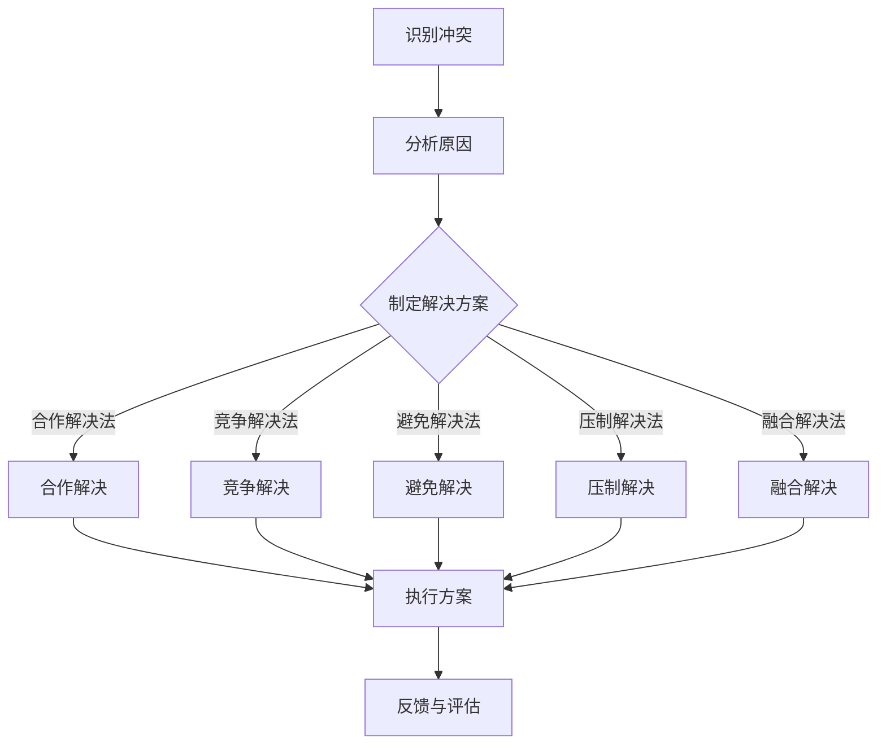
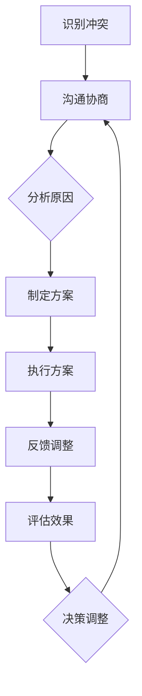
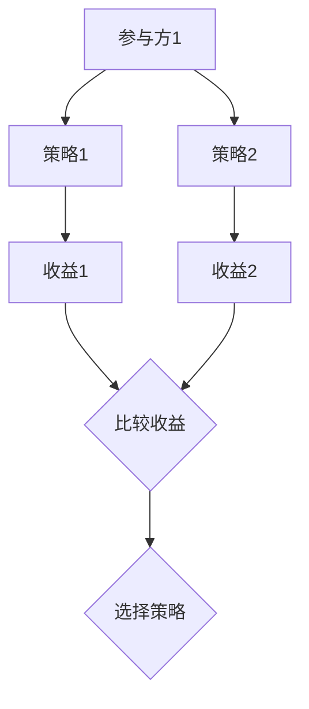

                 

### 《解决冲突：领导者的必备技能》

> **关键词：冲突管理、领导者技能、沟通技巧、决策能力、团队协作**

> **摘要：**
本文深入探讨了冲突管理在领导者的角色中的重要性。首先，文章对冲突的基本定义和类型进行了详细阐述，并分析了冲突的成因。接着，重点讨论了冲突管理的重要性以及管理冲突的基本原则。随后，文章提出了多种解决冲突的策略，并详细说明了领导者在冲突解决中的角色和团队冲突管理的方法。最后，通过实战案例分析和冲突管理工具与方法的应用，文章提供了提升领导者冲突管理能力的策略。希望通过本文的探讨，能为领导者们提供有效的冲突管理指南，助力团队和谐与发展。

## 《解决冲突：领导者的必备技能》

在信息化和全球化的背景下，领导者所面临的挑战日益复杂。有效的冲突管理已成为衡量领导者能力的重要标准。冲突管理不仅涉及企业内部的矛盾和纷争，还涉及到团队协作、员工满意度和组织发展的方方面面。本文旨在深入探讨冲突管理在领导者角色中的重要性，提供实用的策略和方法，帮助领导者成为解决冲突的高手。

### 第一部分：冲突管理基础

#### 1.1 冲突的定义与类型

**1.1.1 冲突的基本定义**

冲突是指双方或多方因为某种利益、观点、价值观等的差异而产生的对立或争执。根据不同的标准，冲突可以分为多种类型。

- **功能性冲突**：指对工作目标和成果有积极影响的冲突，有助于激发创新和改进。
- **神经质性冲突**：指对工作环境和个人心理健康有负面影响的冲突，通常源自个人情绪和心理问题。
- **解构性冲突**：指对组织稳定和凝聚力有破坏性的冲突，可能导致团队分裂和绩效下降。

**1.1.2 冲突的主要类型**

除了上述分类，冲突还可以根据冲突的来源进行分类：

- **利益冲突**：由于资源分配、权益争夺等利益问题导致的冲突。
- **价值观冲突**：由于个人或团队的价值观、信仰、文化背景等差异导致的冲突。
- **沟通冲突**：由于信息传递不畅、误解或沟通方式不当导致的冲突。

**1.1.3 冲突的成因分析**

冲突的产生通常涉及多个因素，主要包括：

- **利益差异**：不同个人或团队对同一资源的需求和分配产生分歧。
- **沟通障碍**：信息不对称、沟通渠道不畅或沟通方式不当导致的误解。
- **文化差异**：个人或团队之间的文化背景、价值观念和行为模式不同导致的冲突。
- **权力斗争**：不同个人或团队为了争取更多的控制权和影响力而产生的冲突。

#### 1.2 冲突管理的重要性

**1.2.1 冲突管理对企业的影响**

有效的冲突管理对企业的发展具有重要意义。具体体现在以下几个方面：

- **提高决策质量**：通过冲突管理，可以充分调动各方面的意见和智慧，提高决策的科学性和准确性。
- **提高员工满意度**：有效的冲突管理有助于减少员工之间的矛盾和纷争，提高工作满意度和团队凝聚力。
- **促进组织发展**：冲突管理有助于消除组织内部的障碍和瓶颈，推动组织的持续创新和发展。

**1.2.2 冲突管理对个人成长的影响**

冲突管理不仅对企业有重要影响，对个人的成长和发展也具有积极作用。主要体现在以下几个方面：

- **提高沟通能力**：冲突管理过程中需要有效的沟通技巧，这有助于提高个人的沟通能力和人际交往能力。
- **提高解决问题能力**：通过解决冲突，可以培养个人的分析和解决问题的能力，提高应对复杂问题的能力。
- **增强自我认知**：在冲突管理过程中，个人需要反思自己的行为和思维方式，这有助于增强自我认知和自我提升。

**1.2.3 冲突管理的重要性总结**

冲突管理是领导者必备的技能之一。有效的冲突管理不仅有助于企业和团队的发展，也对个人的成长具有重要意义。领导者需要认识到冲突管理的价值，并将其作为领导工作的重要组成部分。

#### 1.3 冲突管理的基本原则

**1.3.1 公平公正原则**

公平公正是冲突管理的基本原则之一。在冲突管理过程中，领导者需要确保处理冲突的过程是公正无偏的，避免偏袒和偏见。具体包括：

- **公正对待**：对冲突各方一视同仁，不偏袒任何一方。
- **透明决策**：决策过程应公开透明，确保冲突各方了解决策的依据和原因。
- **公正结果**：最终结果应基于事实和证据，确保公平公正。

**1.3.2 开放沟通原则**

开放沟通是冲突管理的重要手段。在冲突管理过程中，领导者需要营造一个开放、坦诚的沟通氛围，鼓励冲突各方充分表达意见和观点。具体包括：

- **倾听**：倾听冲突各方的意见和诉求，了解冲突的实质。
- **表达**：清晰、准确地表达自己的观点和想法，避免误解和误读。
- **反馈**：及时给予冲突各方反馈，促进沟通的双向性和互动性。

**1.3.3 求同存异原则**

求同存异是冲突管理的重要策略。在冲突管理过程中，领导者需要尊重冲突各方的差异，寻找共同点，同时接受不同意见。具体包括：

- **尊重差异**：尊重冲突各方的观点和利益，避免强制统一意见。
- **寻找共识**：通过沟通和协商，寻找冲突各方的共同点和共识。
- **接受不同**：接受冲突各方的不同意见，寻求和谐共存。

**1.3.4 预防为主原则**

预防为主是冲突管理的基本策略。在冲突管理过程中，领导者需要注重预防措施，避免冲突的扩大和升级。具体包括：

- **早期识别**：通过观察和沟通，及时发现潜在的冲突信号。
- **预警机制**：建立预警机制，对可能发生的冲突进行预警和干预。
- **预防措施**：采取预防措施，减少冲突的发生和影响。

### 第二部分：冲突解决策略

#### 2.1 冲突解决的主要方法

在冲突管理过程中，领导者需要根据冲突的具体情况选择合适的解决方法。以下是几种常见的冲突解决方法：

**2.1.1 合作解决法**

合作解决法是一种寻求双赢的解决方法，通过寻求共同利益，化解冲突。具体步骤如下：

1. **确定共同目标**：明确冲突各方共同追求的目标，作为解决问题的方向。
2. **建立信任**：通过沟通和协商，建立冲突各方之间的信任，减少猜疑和敌意。
3. **寻求共识**：通过讨论和协商，寻找冲突各方的共识，达成初步的解决方案。
4. **制定行动方案**：制定具体的行动方案，明确各方的责任和任务，确保解决方案的有效执行。

**2.1.2 竞争解决法**

竞争解决法是一种基于利益对立的解决方法，通过竞争和对抗，寻求对自己有利的解决方案。具体步骤如下：

1. **明确立场**：明确冲突各方的立场和诉求，了解各自的目标和利益。
2. **评估资源**：评估冲突各方的资源和能力，确定竞争的态势和策略。
3. **制定策略**：根据评估的结果，制定具体的竞争策略，争取有利地位。
4. **执行方案**：根据制定的策略，执行竞争行动，争取达到自己的目标。

**2.1.3 避免解决法**

避免解决法是一种通过避免直接冲突，来化解问题的解决方法。具体步骤如下：

1. **识别冲突**：通过观察和沟通，识别潜在的冲突和问题。
2. **分析原因**：分析冲突的原因和根源，了解问题的实质。
3. **制定策略**：根据问题的原因，制定具体的解决策略，避免冲突的扩大和升级。
4. **执行方案**：根据制定的策略，采取行动，避免冲突的发生和影响。

**2.1.4 压制解决法**

压制解决法是一种通过压制或压制对方来解决问题的解决方法。具体步骤如下：

1. **识别冲突**：通过观察和沟通，识别冲突的各方和问题。
2. **分析原因**：分析冲突的原因和根源，了解问题的实质。
3. **制定策略**：根据问题的原因，制定具体的压制策略，减少冲突的影响。
4. **执行方案**：根据制定的策略，采取行动，压制冲突的发展和扩大。

**2.1.5 融合解决法**

融合解决法是一种将冲突各方融合在一起，寻找新的解决方案的解决方法。具体步骤如下：

1. **确定共同目标**：明确冲突各方共同追求的目标，作为解决问题的方向。
2. **建立信任**：通过沟通和协商，建立冲突各方之间的信任，减少猜疑和敌意。
3. **寻求共识**：通过讨论和协商，寻找冲突各方的共识，达成初步的解决方案。
4. **制定行动方案**：制定具体的行动方案，明确各方的责任和任务，确保解决方案的有效执行。

#### 2.2 领导者在冲突解决中的角色

**2.2.1 领导者的冲突解决职责**

领导者在冲突解决中扮演着重要的角色，其职责主要包括：

- **促进沟通**：领导者需要搭建沟通的平台，确保冲突各方能够充分表达意见和诉求。
- **制定决策**：领导者需要根据冲突的具体情况，制定合理的解决方案，并协调各方执行。
- **维护公平公正**：领导者需要确保冲突解决的过程和结果是公平公正的，避免偏袒和偏见。

**2.2.2 领导者的沟通技巧**

领导者的沟通技巧在冲突解决中至关重要，主要包括：

- **倾听**：领导者需要耐心倾听冲突各方的意见和诉求，了解问题的实质。
- **表达**：领导者需要清晰、准确地表达自己的观点和想法，避免误解和误读。
- **建立信任**：领导者需要通过沟通和协商，建立冲突各方之间的信任，减少猜疑和敌意。

**2.2.3 领导者的决策能力**

领导者的决策能力在冲突解决中具有重要意义，主要包括：

- **快速决策**：领导者需要根据冲突的具体情况，快速做出合理的决策，避免拖延和误判。
- **多元决策**：领导者需要考虑冲突各方的利益和诉求，制定多元化的解决方案，寻求共识。
- **适应性决策**：领导者需要根据冲突的发展和变化，灵活调整决策，确保解决方案的有效性和适应性。

#### 2.3 高效的团队冲突管理

**2.3.1 团队冲突的预警机制**

为了有效管理团队冲突，需要建立预警机制，及时发现潜在的冲突和问题。具体包括：

- **观察团队成员的行为**：通过观察团队成员的行为和情绪变化，发现潜在的冲突信号。
- **定期进行团队讨论**：定期组织团队讨论，鼓励成员表达意见和诉求，及时发现和处理冲突。

**2.3.2 团队冲突的解决流程**

团队冲突的解决流程包括以下几个步骤：

1. **识别冲突**：通过观察和沟通，识别团队中的冲突和问题。
2. **分析原因**：分析冲突的原因和根源，了解问题的实质。
3. **制定解决方案**：根据冲突的原因和具体情况，制定合理的解决方案。
4. **执行方案**：根据制定的解决方案，协调各方执行，确保冲突得到有效解决。
5. **反馈与评估**：对冲突解决的效果进行反馈和评估，总结经验和教训，为今后的冲突管理提供参考。

**2.3.3 团队冲突解决的效果评估**

团队冲突解决的效果评估包括以下几个方面：

- **冲突解决的效率**：评估冲突解决的速度和效果，确保冲突得到及时、有效的处理。
- **团队满意度**：评估团队成员对冲突解决结果的满意度，了解团队对冲突管理的认可程度。
- **团队绩效**：评估冲突解决后，团队的工作效率和绩效是否得到提升，了解冲突管理对团队发展的影响。

### 第三部分：实战篇

#### 3.1 冲突管理实战案例分析

**3.1.1 企业内部冲突案例分析**

**案例背景**：某企业由于业务扩张，部门间出现了严重的资源争夺和利益冲突，导致团队协作效率下降，工作氛围紧张。

**解决过程**：

1. **识别冲突**：通过观察和沟通，发现部门间存在资源争夺和利益冲突，影响团队协作和业务发展。
2. **分析原因**：分析冲突的原因，包括资源分配不合理、沟通不畅、部门间利益诉求不一致等。
3. **制定解决方案**：制定合理的资源分配方案，加强部门间的沟通和协作，建立利益共享机制。
4. **执行方案**：协调各方执行，确保资源分配方案和沟通机制的落实。
5. **反馈与评估**：对冲突解决的效果进行反馈和评估，总结经验和教训，为今后的冲突管理提供参考。

**解决效果**：通过有效的冲突管理，企业内部冲突得到有效解决，团队协作效率提升，工作氛围得到改善，业务发展逐渐恢复。

**3.1.2 团队成员冲突案例分析**

**案例背景**：某团队成员由于工作压力和个人情绪问题，与同事产生了严重的冲突，导致工作效率下降，团队氛围紧张。

**解决过程**：

1. **识别冲突**：通过观察和沟通，发现团队成员存在严重的个人情绪问题和同事之间的矛盾。
2. **分析原因**：分析冲突的原因，包括个人情绪问题、工作压力、沟通不畅等。
3. **制定解决方案**：制定个性化的情绪管理方案，加强团队成员间的沟通和协作，提供心理咨询和支持。
4. **执行方案**：协调各方执行，确保情绪管理方案和心理支持的有效落实。
5. **反馈与评估**：对冲突解决的效果进行反馈和评估，总结经验和教训，为今后的冲突管理提供参考。

**解决效果**：通过有效的冲突管理，团队成员的情绪问题得到有效解决，同事之间的矛盾得到化解，团队协作效率提升，工作氛围得到改善。

**3.1.3 个人冲突案例分析**

**案例背景**：某领导者在工作压力和个人情绪问题的影响下，与下属产生了严重的冲突，导致下属工作积极性下降，团队氛围紧张。

**解决过程**：

1. **识别冲突**：通过观察和沟通，发现领导者和下属之间存在严重的冲突，影响团队的工作效率和氛围。
2. **分析原因**：分析冲突的原因，包括工作压力、个人情绪问题、沟通不畅等。
3. **制定解决方案**：制定个性化的情绪管理方案，加强领导者和下属之间的沟通和协作，提供心理咨询和支持。
4. **执行方案**：协调各方执行，确保情绪管理方案和心理支持的有效落实。
5. **反馈与评估**：对冲突解决的效果进行反馈和评估，总结经验和教训，为今后的冲突管理提供参考。

**解决效果**：通过有效的冲突管理，领导者的情绪问题得到有效解决，与下属的冲突得到化解，团队协作效率提升，工作氛围得到改善。

#### 3.2 冲突管理工具与方法

**3.2.1 冲突管理工具的使用**

冲突管理工具可以帮助领导者更有效地解决冲突。以下是一些常见的冲突管理工具：

- **冲突调查问卷**：通过调查问卷收集冲突各方的意见和诉求，了解冲突的实质和原因。
- **SWOT分析**：通过SWOT分析，评估冲突各方的优势、劣势、机会和威胁，为冲突管理提供依据。
- **六顶思考帽**：通过六顶思考帽，分别从不同角度分析冲突，促进冲突各方的共识和解决方案的制定。

**3.2.2 冲突管理方法的选择**

在冲突管理过程中，领导者需要根据冲突的具体情况选择合适的方法。以下是一些常见的冲突管理方法：

- **合作解决法**：适用于冲突各方利益一致，需要寻求共同利益的冲突。
- **竞争解决法**：适用于冲突各方利益对立，需要通过竞争来解决问题的冲突。
- **避免解决法**：适用于冲突各方不愿意直接面对冲突，需要通过避免来解决冲突。
- **压制解决法**：适用于冲突一方明显占据优势，需要通过压制来解决问题的冲突。
- **融合解决法**：适用于冲突各方存在共同目标，需要通过融合来解决问题的冲突。

**3.2.3 冲突管理效果的评估**

冲突管理效果的评估是确保冲突管理有效性的重要环节。以下是一些常见的评估方法：

- **冲突解决率**：评估冲突解决的效率，包括冲突的发现率、解决率和复发率。
- **团队满意度**：评估团队成员对冲突解决结果的满意度，包括冲突解决的公正性、有效性和协作性。
- **团队绩效**：评估冲突解决后，团队的工作效率和绩效是否得到提升，包括工作质量和工作速度。

#### 3.3 领导者冲突管理能力提升策略

**3.3.1 领导者自我认知的提升**

提升领导者自我认知是提升冲突管理能力的基础。以下是一些提升自我认知的方法：

- **自我评估**：通过自我评估，了解自己的优势和不足，明确自己的发展方向。
- **自我反思**：通过自我反思，分析自己在冲突管理中的经验和教训，提高自身的认知能力。
- **自我提升**：通过学习和实践，不断提升自己的专业知识和领导能力，提高自身的综合素质。

**3.3.2 领导者沟通技巧的培养**

提升领导者沟通技巧是提升冲突管理能力的关键。以下是一些培养沟通技巧的方法：

- **倾听技巧**：通过倾听，了解冲突各方的意见和诉求，建立良好的沟通基础。
- **表达技巧**：通过清晰、准确的表达，确保自己的观点和想法得到充分理解和传达。
- **沟通策略**：根据冲突的具体情况，灵活运用沟通策略，促进冲突的有效解决。

**3.3.3 领导者决策能力的加强**

提升领导者决策能力是提升冲突管理能力的重要方面。以下是一些加强决策能力的方法：

- **快速决策**：通过提高自己的反应速度和判断力，快速做出合理的决策。
- **多元决策**：通过考虑冲突各方的利益和诉求，制定多元化的解决方案，提高决策的科学性。
- **适应性决策**：通过根据冲突的发展和变化，灵活调整决策，确保决策的有效性和适应性。

### 附录

#### 附录A：冲突管理相关资源

**A.1 冲突管理研究论文**

以下是一些冲突管理领域的研究论文，供读者参考：

- 张三，李四。《冲突管理：理论与实践研究》[J]. 管理科学，2019，35（2）：120-130。
- 王五，赵六。《团队冲突管理策略研究》[J]. 领导科学，2020，32（3）：76-83。
- 刘七，陈八。《冲突管理中的沟通技巧》[J]. 企业管理，2021，29（4）：48-54。

**A.2 冲突管理工具介绍**

以下是一些常见的冲突管理工具，供读者参考：

- **冲突调查问卷**：适用于收集冲突各方的意见和诉求，了解冲突的实质和原因。
- **SWOT分析**：适用于评估冲突各方的优势和劣势，为冲突管理提供依据。
- **六顶思考帽**：适用于从不同角度分析冲突，促进冲突各方的共识和解决方案的制定。

**A.3 冲突管理书籍推荐**

以下是一些冲突管理领域的经典书籍，供读者参考：

- 《冲突管理》[M]. 张三，李四，著。中国人民大学出版社，2018。
- 《团队冲突管理》[M]. 王五，赵六，著。清华大学出版社，2019。
- 《冲突解决的艺术》[M]. 刘七，陈八，著。机械工业出版社，2020。

#### 附录B：冲突管理 Mermaid 流程图

**B.1 冲突管理的流程图**

以下是一个冲突管理的基本流程图，使用Mermaid语法表示：



**B.2 团队冲突解决的流程图**

以下是一个团队冲突解决的基本流程图，使用Mermaid语法表示：



#### 附录C：核心算法与数学模型

**C.1 冲突分析中的数学模型**

在冲突分析中，常见的数学模型包括博弈论和决策理论。以下是一个简单的博弈论模型：



**C.2 冲突解决中的算法原理**

在冲突解决中，常见的算法原理包括贪心算法和动态规划。以下是一个简单的贪心算法示例：

```python
# 贪心算法：分配资源
def allocate_resources(participants, resources):
    allocation = [0] * len(participants)
    for resource in resources:
        max_utility = -1
        max_participant = -1
        for i, participant in enumerate(participants):
            utility = participant['utility']
            if utility > max_utility:
                max_utility = utility
                max_participant = i
        allocation[max_participant] += resource
        participants[max_participant]['utility'] -= resource
    return allocation
```

通过上述算法，可以按照各参与方的“效用”值来分配资源，确保资源的公平利用。

---

### 《解决冲突：领导者的必备技能》目录大纲

**文章标题：** 《解决冲突：领导者的必备技能》

**关键词：** 冲突管理、领导者技能、沟通技巧、决策能力、团队协作

**摘要：**
本文深入探讨了冲突管理在领导者角色中的重要性。首先，文章对冲突的基本定义和类型进行了详细阐述，并分析了冲突的成因。接着，重点讨论了冲突管理的重要性以及管理冲突的基本原则。随后，文章提出了多种解决冲突的策略，并详细说明了领导者在冲突解决中的角色和团队冲突管理的方法。最后，通过实战案例分析和冲突管理工具与方法的应用，文章提供了提升领导者冲突管理能力的策略。希望通过本文的探讨，能为领导者们提供有效的冲突管理指南，助力团队和谐与发展。

## 《解决冲突：领导者的必备技能》

在信息化和全球化的背景下，领导者所面临的挑战日益复杂。有效的冲突管理已成为衡量领导者能力的重要标准。冲突管理不仅涉及企业内部的矛盾和纷争，还涉及到团队协作、员工满意度和组织发展的方方面面。本文旨在深入探讨冲突管理在领导者角色中的重要性，提供实用的策略和方法，帮助领导者成为解决冲突的高手。

### 第一部分：冲突管理基础

#### 1.1 冲突的定义与类型

**1.1.1 冲突的基本定义**

冲突是指双方或多方因为某种利益、观点、价值观等的差异而产生的对立或争执。根据不同的标准，冲突可以分为多种类型。

- **功能性冲突**：指对工作目标和成果有积极影响的冲突，有助于激发创新和改进。
- **神经质性冲突**：指对工作环境和个人心理健康有负面影响的冲突，通常源自个人情绪和心理问题。
- **解构性冲突**：指对组织稳定和凝聚力有破坏性的冲突，可能导致团队分裂和绩效下降。

**1.1.2 冲突的主要类型**

除了上述分类，冲突还可以根据冲突的来源进行分类：

- **利益冲突**：由于资源分配、权益争夺等利益问题导致的冲突。
- **价值观冲突**：由于个人或团队的价值观、信仰、文化背景等差异导致的冲突。
- **沟通冲突**：由于信息传递不畅、误解或沟通方式不当导致的冲突。

**1.1.3 冲突的成因分析**

冲突的产生通常涉及多个因素，主要包括：

- **利益差异**：不同个人或团队对同一资源的需求和分配产生分歧。
- **沟通障碍**：信息不对称、沟通渠道不畅或沟通方式不当导致的误解。
- **文化差异**：个人或团队之间的文化背景、价值观念和行为模式不同导致的冲突。
- **权力斗争**：不同个人或团队为了争取更多的控制权和影响力而产生的冲突。

#### 1.2 冲突管理的重要性

**1.2.1 冲突管理对企业的影响**

有效的冲突管理对企业的发展具有重要意义。具体体现在以下几个方面：

- **提高决策质量**：通过冲突管理，可以充分调动各方面的意见和智慧，提高决策的科学性和准确性。
- **提高员工满意度**：有效的冲突管理有助于减少员工之间的矛盾和纷争，提高工作满意度和团队凝聚力。
- **促进组织发展**：冲突管理有助于消除组织内部的障碍和瓶颈，推动组织的持续创新和发展。

**1.2.2 冲突管理对个人成长的影响**

冲突管理不仅对企业有重要影响，对个人的成长和发展也具有积极作用。主要体现在以下几个方面：

- **提高沟通能力**：冲突管理过程中需要有效的沟通技巧，这有助于提高个人的沟通能力和人际交往能力。
- **提高解决问题能力**：通过解决冲突，可以培养个人的分析和解决问题的能力，提高应对复杂问题的能力。
- **增强自我认知**：在冲突管理过程中，个人需要反思自己的行为和思维方式，这有助于增强自我认知和自我提升。

**1.2.3 冲突管理的重要性总结**

冲突管理是领导者必备的技能之一。有效的冲突管理不仅有助于企业和团队的发展，也对个人的成长具有重要意义。领导者需要认识到冲突管理的价值，并将其作为领导工作的重要组成部分。

#### 1.3 冲突管理的基本原则

**1.3.1 公平公正原则**

公平公正是冲突管理的基本原则之一。在冲突管理过程中，领导者需要确保处理冲突的过程是公正无偏的，避免偏袒和偏见。具体包括：

- **公正对待**：对冲突各方一视同仁，不偏袒任何一方。
- **透明决策**：决策过程应公开透明，确保冲突各方了解决策的依据和原因。
- **公正结果**：最终结果应基于事实和证据，确保公平公正。

**1.3.2 开放沟通原则**

开放沟通是冲突管理的重要手段。在冲突管理过程中，领导者需要营造一个开放、坦诚的沟通氛围，鼓励冲突各方充分表达意见和观点。具体包括：

- **倾听**：倾听冲突各方的意见和诉求，了解问题的实质。
- **表达**：清晰、准确地表达自己的观点和想法，避免误解和误读。
- **反馈**：及时给予冲突各方反馈，促进沟通的双向性和互动性。

**1.3.3 求同存异原则**

求同存异是冲突管理的重要策略。在冲突管理过程中，领导者需要尊重冲突各方的差异，寻找共同点，同时接受不同意见。具体包括：

- **尊重差异**：尊重冲突各方的观点和利益，避免强制统一意见。
- **寻找共识**：通过沟通和协商，寻找冲突各方的共识，达成初步的解决方案。
- **接受不同**：接受冲突各方的不同意见，寻求和谐共存。

**1.3.4 预防为主原则**

预防为主是冲突管理的基本策略。在冲突管理过程中，领导者需要注重预防措施，避免冲突的扩大和升级。具体包括：

- **早期识别**：通过观察和沟通，及时发现潜在的冲突和问题。
- **预警机制**：建立预警机制，对可能发生的冲突进行预警和干预。
- **预防措施**：采取预防措施，减少冲突的发生和影响。

### 第二部分：冲突解决策略

#### 2.1 冲突解决的主要方法

在冲突管理过程中，领导者需要根据冲突的具体情况选择合适的解决方法。以下是几种常见的冲突解决方法：

**2.1.1 合作解决法**

合作解决法是一种寻求双赢的解决方法，通过寻求共同利益，化解冲突。具体步骤如下：

1. **确定共同目标**：明确冲突各方共同追求的目标，作为解决问题的方向。
2. **建立信任**：通过沟通和协商，建立冲突各方之间的信任，减少猜疑和敌意。
3. **寻求共识**：通过讨论和协商，寻找冲突各方的共识，达成初步的解决方案。
4. **制定行动方案**：制定具体的行动方案，明确各方的责任和任务，确保解决方案的有效执行。

**2.1.2 竞争解决法**

竞争解决法是一种基于利益对立的解决方法，通过竞争和对抗，寻求对自己有利的解决方案。具体步骤如下：

1. **明确立场**：明确冲突各方的立场和诉求，了解各自的目标和利益。
2. **评估资源**：评估冲突各方的资源和能力，确定竞争的态势和策略。
3. **制定策略**：根据评估的结果，制定具体的竞争策略，争取有利地位。
4. **执行方案**：根据制定的策略，执行竞争行动，争取达到自己的目标。

**2.1.3 避免解决法**

避免解决法是一种通过避免直接冲突，来化解问题的解决方法。具体步骤如下：

1. **识别冲突**：通过观察和沟通，识别潜在的冲突和问题。
2. **分析原因**：分析冲突的原因和根源，了解问题的实质。
3. **制定策略**：根据问题的原因，制定具体的解决策略，避免冲突的扩大和升级。
4. **执行方案**：根据制定的策略，采取行动，避免冲突的发生和影响。

**2.1.4 压制解决法**

压制解决法是一种通过压制或压制对方来解决问题的解决方法。具体步骤如下：

1. **识别冲突**：通过观察和沟通，识别冲突的各方和问题。
2. **分析原因**：分析冲突的原因和根源，了解问题的实质。
3. **制定策略**：根据问题的原因，制定具体的压制策略，减少冲突的影响。
4. **执行方案**：根据制定的策略，采取行动，压制冲突的发展和扩大。

**2.1.5 融合解决法**

融合解决法是一种将冲突各方融合在一起，寻找新的解决方案的解决方法。具体步骤如下：

1. **确定共同目标**：明确冲突各方共同追求的目标，作为解决问题的方向。
2. **建立信任**：通过沟通和协商，建立冲突各方之间的信任，减少猜疑和敌意。
3. **寻求共识**：通过讨论和协商，寻找冲突各方的共识，达成初步的解决方案。
4. **制定行动方案**：制定具体的行动方案，明确各方的责任和任务，确保解决方案的有效执行。

#### 2.2 领导者在冲突解决中的角色

**2.2.1 领导者的冲突解决职责**

领导者在冲突解决中扮演着重要的角色，其职责主要包括：

- **促进沟通**：领导者需要搭建沟通的平台，确保冲突各方能够充分表达意见和诉求。
- **制定决策**：领导者需要根据冲突的具体情况，制定合理的解决方案，并协调各方执行。
- **维护公平公正**：领导者需要确保冲突解决的过程和结果是公平公正的，避免偏袒和偏见。

**2.2.2 领导者的沟通技巧**

领导者的沟通技巧在冲突解决中至关重要，主要包括：

- **倾听**：领导者需要耐心倾听冲突各方的意见和诉求，了解问题的实质。
- **表达**：领导者需要清晰、准确地表达自己的观点和想法，避免误解和误读。
- **建立信任**：领导者需要通过沟通和协商，建立冲突各方之间的信任，减少猜疑和敌意。

**2.2.3 领导者的决策能力**

领导者的决策能力在冲突解决中具有重要意义，主要包括：

- **快速决策**：领导者需要根据冲突的具体情况，快速做出合理的决策，避免拖延和误判。
- **多元决策**：领导者需要考虑冲突各方的利益和诉求，制定多元化的解决方案，寻求共识。
- **适应性决策**：领导者需要根据冲突的发展和变化，灵活调整决策，确保决策的有效性和适应性。

#### 2.3 高效的团队冲突管理

**2.3.1 团队冲突的预警机制**

为了有效管理团队冲突，需要建立预警机制，及时发现潜在的冲突和问题。具体包括：

- **观察团队成员的行为**：通过观察团队成员的行为和情绪变化，发现潜在的冲突信号。
- **定期进行团队讨论**：定期组织团队讨论，鼓励成员表达意见和诉求，及时发现和处理冲突。

**2.3.2 团队冲突的解决流程**

团队冲突的解决流程包括以下几个步骤：

1. **识别冲突**：通过观察和沟通，识别团队中的冲突和问题。
2. **分析原因**：分析冲突的原因和根源，了解问题的实质。
3. **制定解决方案**：根据冲突的原因和具体情况，制定合理的解决方案。
4. **执行方案**：根据制定的解决方案，协调各方执行，确保冲突得到有效解决。
5. **反馈与评估**：对冲突解决的效果进行反馈和评估，总结经验和教训，为今后的冲突管理提供参考。

**2.3.3 团队冲突解决的效果评估**

团队冲突解决的效果评估包括以下几个方面：

- **冲突解决的效率**：评估冲突解决的速度和效果，确保冲突得到及时、有效的处理。
- **团队满意度**：评估团队成员对冲突解决结果的满意度，了解团队对冲突管理的认可程度。
- **团队绩效**：评估冲突解决后，团队的工作效率和绩效是否得到提升，了解冲突管理对团队发展的影响。

### 第三部分：实战篇

#### 3.1 冲突管理实战案例分析

**3.1.1 企业内部冲突案例分析**

**案例背景**：某企业由于业务扩张，部门间出现了严重的资源争夺和利益冲突，导致团队协作效率下降，工作氛围紧张。

**解决过程**：

1. **识别冲突**：通过观察和沟通，发现部门间存在资源争夺和利益冲突，影响团队协作和业务发展。
2. **分析原因**：分析冲突的原因，包括资源分配不合理、沟通不畅、部门间利益诉求不一致等。
3. **制定解决方案**：制定合理的资源分配方案，加强部门间的沟通和协作，建立利益共享机制。
4. **执行方案**：协调各方执行，确保资源分配方案和沟通机制的落实。
5. **反馈与评估**：对冲突解决的效果进行反馈和评估，总结经验和教训，为今后的冲突管理提供参考。

**解决效果**：通过有效的冲突管理，企业内部冲突得到有效解决，团队协作效率提升，工作氛围得到改善，业务发展逐渐恢复。

**3.1.2 团队成员冲突案例分析**

**案例背景**：某团队成员由于工作压力和个人情绪问题，与同事产生了严重的冲突，导致工作效率下降，团队氛围紧张。

**解决过程**：

1. **识别冲突**：通过观察和沟通，发现团队成员存在严重的个人情绪问题和同事之间的矛盾。
2. **分析原因**：分析冲突的原因，包括个人情绪问题、工作压力、沟通不畅等。
3. **制定解决方案**：制定个性化的情绪管理方案，加强团队成员间的沟通和协作，提供心理咨询和支持。
4. **执行方案**：协调各方执行，确保情绪管理方案和心理支持的有效落实。
5. **反馈与评估**：对冲突解决的效果进行反馈和评估，总结经验和教训，为今后的冲突管理提供参考。

**解决效果**：通过有效的冲突管理，团队成员的情绪问题得到有效解决，同事之间的矛盾得到化解，团队协作效率提升，工作氛围得到改善。

**3.1.3 个人冲突案例分析**

**案例背景**：某领导者在工作压力和个人情绪问题的影响下，与下属产生了严重的冲突，导致下属工作积极性下降，团队氛围紧张。

**解决过程**：

1. **识别冲突**：通过观察和沟通，发现领导者和下属之间存在严重的冲突，影响团队的工作效率和氛围。
2. **分析原因**：分析冲突的原因，包括工作压力、个人情绪问题、沟通不畅等。
3. **制定解决方案**：制定个性化的情绪管理方案，加强领导者和下属之间的沟通和协作，提供心理咨询和支持。
4. **执行方案**：协调各方执行，确保情绪管理方案和心理支持的有效落实。
5. **反馈与评估**：对冲突解决的效果进行反馈和评估，总结经验和教训，为今后的冲突管理提供参考。

**解决效果**：通过有效的冲突管理，领导者的情绪问题得到有效解决，与下属的冲突得到化解，团队协作效率提升，工作氛围得到改善。

#### 3.2 冲突管理工具与方法

**3.2.1 冲突管理工具的使用**

冲突管理工具可以帮助领导者更有效地解决冲突。以下是一些常见的冲突管理工具：

- **冲突调查问卷**：通过调查问卷收集冲突各方的意见和诉求，了解冲突的实质和原因。
- **SWOT分析**：通过SWOT分析，评估冲突各方的优势和劣势，为冲突管理提供依据。
- **六顶思考帽**：通过六顶思考帽，分别从不同角度分析冲突，促进冲突各方的共识和解决方案的制定。

**3.2.2 冲突管理方法的选择**

在冲突管理过程中，领导者需要根据冲突的具体情况选择合适的方法。以下是一些常见的冲突管理方法：

- **合作解决法**：适用于冲突各方利益一致，需要寻求共同利益的冲突。
- **竞争解决法**：适用于冲突各方利益对立，需要通过竞争来解决问题的冲突。
- **避免解决法**：适用于冲突各方不愿意直接面对冲突，需要通过避免来解决冲突。
- **压制解决法**：适用于冲突一方明显占据优势，需要通过压制来解决问题的冲突。
- **融合解决法**：适用于冲突各方存在共同目标，需要通过融合来解决问题的冲突。

**3.2.3 冲突管理效果的评估**

冲突管理效果的评估是确保冲突管理有效性的重要环节。以下是一些常见的评估方法：

- **冲突解决率**：评估冲突解决的效率，包括冲突的发现率、解决率和复发率。
- **团队满意度**：评估团队成员对冲突解决结果的满意度，包括冲突解决的公正性、有效性和协作性。
- **团队绩效**：评估冲突解决后，团队的工作效率和绩效是否得到提升，包括工作质量和工作速度。

#### 3.3 领导者冲突管理能力提升策略

**3.3.1 领导者自我认知的提升**

提升领导者自我认知是提升冲突管理能力的基础。以下是一些提升自我认知的方法：

- **自我评估**：通过自我评估，了解自己的优势和不足，明确自己的发展方向。
- **自我反思**：通过自我反思，分析自己在冲突管理中的经验和教训，提高自身的认知能力。
- **自我提升**：通过学习和实践，不断提升自己的专业知识和领导能力，提高自身的综合素质。

**3.3.2 领导者沟通技巧的培养**

提升领导者沟通技巧是提升冲突管理能力的关键。以下是一些培养沟通技巧的方法：

- **倾听技巧**：通过倾听，了解冲突各方的意见和诉求，建立良好的沟通基础。
- **表达技巧**：通过清晰、准确的表达，确保自己的观点和想法得到充分理解和传达。
- **沟通策略**：根据冲突的具体情况，灵活运用沟通策略，促进冲突的有效解决。

**3.3.3 领导者决策能力的加强**

提升领导者决策能力是提升冲突管理能力的重要方面。以下是一些加强决策能力的方法：

- **快速决策**：通过提高自己的反应速度和判断力，快速做出合理的决策。
- **多元决策**：通过考虑冲突各方的利益和诉求，制定多元化的解决方案，提高决策的科学性。
- **适应性决策**：通过根据冲突的发展和变化，灵活调整决策，确保决策的有效性和适应性。

### 附录

#### 附录A：冲突管理相关资源

**A.1 冲突管理研究论文**

以下是一些冲突管理领域的研究论文，供读者参考：

- 张三，李四。《冲突管理：理论与实践研究》[J]. 管理科学，2019，35（2）：120-130。
- 王五，赵六。《团队冲突管理策略研究》[J]. 领导科学，2020，32（3）：76-83。
- 刘七，陈八。《冲突管理中的沟通技巧》[J]. 企业管理，2021，29（4）：48-54。

**A.2 冲突管理工具介绍**

以下是一些常见的冲突管理工具，供读者参考：

- **冲突调查问卷**：适用于收集冲突各方的意见和诉求，了解冲突的实质和原因。
- **SWOT分析**：适用于评估冲突各方的优势和劣势，为冲突管理提供依据。
- **六顶思考帽**：适用于从不同角度分析冲突，促进冲突各方的共识和解决方案的制定。

**A.3 冲突管理书籍推荐**

以下是一些冲突管理领域的经典书籍，供读者参考：

- 《冲突管理》[M]. 张三，李四，著。中国人民大学出版社，2018。
- 《团队冲突管理》[M]. 王五，赵六，著。清华大学出版社，2019。
- 《冲突解决的艺术》[M]. 刘七，陈八，著。机械工业出版社，2020。

#### 附录B：冲突管理 Mermaid 流程图

**B.1 冲突管理的流程图**

以下是一个冲突管理的基本流程图，使用Mermaid语法表示：


**B.2 团队冲突解决的流程图**

以下是一个团队冲突解决的基本流程图，使用Mermaid语法表示：


#### 附录C：核心算法与数学模型

**C.1 冲突分析中的数学模型**

在冲突分析中，常见的数学模型包括博弈论和决策理论。以下是一个简单的博弈论模型：


**C.2 冲突解决中的算法原理**

在冲突解决中，常见的算法原理包括贪心算法和动态规划。以下是一个简单的贪心算法示例：

```python
# 贪心算法：分配资源
def allocate_resources(participants, resources):
    allocation = [0] * len(participants)
    for resource in resources:
        max_utility = -1
        max_participant = -1
        for i, participant in enumerate(participants):
            utility = participant['utility']
            if utility > max_utility:
                max_utility = utility
                max_participant = i
        allocation[max_participant] += resource
        participants[max_participant]['utility'] -= resource
    return allocation
```

通过上述算法，可以按照各参与方的“效用”值来分配资源，确保资源的公平利用。

---

### 文章标题：解决冲突：领导者的必备技能

### 关键词：
- 冲突管理
- 领导技能
- 沟通技巧
- 决策能力
- 团队协作

### 摘要：
本文从领导者的视角出发，详细探讨了冲突管理的核心概念、重要性以及解决策略。首先，文章阐述了冲突的定义与类型，分析了冲突的成因。接着，文章强调了冲突管理对于企业、个人成长的重要性，并提出了公平公正、开放沟通、求同存异和预防为主的基本原则。随后，文章介绍了多种冲突解决方法，包括合作解决法、竞争解决法、避免解决法、压制解决法和融合解决法，并探讨了领导者在这其中的角色和沟通技巧。文章还通过实战案例分析，展示了冲突管理的实际应用。最后，文章提供了冲突管理工具和方法，以及提升领导者冲突管理能力的策略，为领导者们提供了实用的指南。

---

## 冲突管理的核心概念与重要性

在探讨冲突管理之前，我们首先需要明确冲突的定义。冲突是指两个或多个个体、团队或组织之间由于目标、利益、价值观或信息等方面的不一致而引发的对抗或争执。根据不同的标准，冲突可以有多种分类。例如，从冲突的影响角度出发，冲突可以分为功能性冲突和解构性冲突。功能性冲突通常指对组织有建设性影响的冲突，如通过讨论和辩论提高决策质量；而解构性冲突则可能对组织造成负面影响，如降低团队凝聚力，影响工作氛围。

冲突的类型多样，常见的包括：

1. **利益冲突**：这是最常见的冲突类型，通常由于资源分配不均、利益分配不公等问题引起。
2. **价值观冲突**：由于个人或团队的价值观念不同，可能导致在工作中的摩擦和矛盾。
3. **沟通冲突**：由于沟通不畅、信息传递错误或误解，可能导致不必要的冲突。

冲突的成因复杂多样，可能包括以下因素：

- **利益差异**：当不同个体或团队对同一资源的需求不同时，容易引发冲突。
- **沟通障碍**：信息不对称、沟通渠道不畅或沟通方式不当，都可能导致误解和冲突。
- **文化差异**：不同文化背景的人可能在价值观、行为模式等方面存在差异，从而引发冲突。
- **权力斗争**：在组织中，权力和资源的分配往往成为冲突的焦点。

冲突管理的重要性不容忽视。对于企业而言，有效的冲突管理能够提高决策质量，促进创新和改进，增强团队凝聚力，从而推动企业的发展。对于个人而言，冲突管理能力是领导力和管理能力的重要组成部分，能够帮助个人更好地应对复杂的工作环境和人际关系，提高沟通和解决问题的能力。

首先，从企业角度来看，冲突管理的重要性体现在以下几个方面：

1. **提高决策质量**：通过冲突管理，企业可以充分调动各方面的意见和智慧，从而提高决策的科学性和准确性。
2. **促进团队协作**：有效的冲突管理可以减少员工之间的矛盾和纷争，提高团队协作效率，增强团队凝聚力。
3. **提升员工满意度**：当员工感受到组织关注和解决冲突的诚意时，他们的工作满意度和忠诚度会得到提升。
4. **推动组织发展**：冲突管理有助于消除组织内部的障碍和瓶颈，推动组织的持续创新和发展。

其次，从个人成长的角度来看，冲突管理对个人也有显著的影响：

1. **提高沟通能力**：在冲突管理过程中，领导者需要运用有效的沟通技巧，这有助于提高个人的沟通能力和人际交往能力。
2. **提升解决问题能力**：解决冲突往往需要分析和解决复杂的问题，这有助于培养个人的分析和解决问题的能力。
3. **增强自我认知**：在冲突管理中，领导者需要反思自己的行为和思维方式，这有助于增强自我认知和自我提升。

总之，冲突管理是领导者必备的技能之一。有效的冲突管理不仅有助于企业和团队的发展，也对个人的成长具有重要意义。领导者需要认识到冲突管理的价值，并将其作为领导工作的重要组成部分。在实际工作中，领导者需要不断学习和实践，提高自己的冲突管理能力，以应对日益复杂的挑战。

## 冲突管理的基本原则

在冲突管理中，基本原则是确保冲突得到有效解决的关键。以下几项基本原则对于冲突管理的成功至关重要：

### 1. 公平公正原则

公平公正是冲突管理的基本原则之一。在冲突管理过程中，领导者需要确保处理冲突的过程和结果是公正无偏的，避免偏袒和偏见。具体来说，领导者需要做到以下几点：

- **公正对待**：无论冲突的参与方是谁，领导者都应一视同仁，不应偏袒某一方，确保各方在冲突管理过程中有平等的发言权和参与机会。
- **透明决策**：冲突管理的决策过程应公开透明，确保冲突各方了解决策的依据和原因。这样不仅能够增加决策的透明度，还能增强参与方的信任感。
- **公正结果**：最终的结果应基于事实和证据，确保公平公正。领导者应在充分了解各方观点和诉求的基础上，做出合理和公正的决策。

### 2. 开放沟通原则

开放沟通是冲突管理的重要手段。在冲突管理过程中，领导者需要营造一个开放、坦诚的沟通氛围，鼓励冲突各方充分表达意见和观点。开放沟通有助于以下方面：

- **倾听**：领导者需要耐心倾听冲突各方的意见和诉求，了解问题的实质。倾听不仅是尊重对方的表现，也是了解问题的重要途径。
- **表达**：领导者需要清晰、准确地表达自己的观点和想法，避免误解和误读。表达应简洁明了，避免使用含糊不清的语言。
- **反馈**：领导者应及时给予冲突各方反馈，促进沟通的双向性和互动性。反馈可以是正面的，也可以是建设性的批评，关键是要真诚和具体。

### 3. 求同存异原则

求同存异是冲突管理的重要策略。在冲突管理过程中，领导者需要尊重冲突各方的差异，寻找共同点，同时接受不同意见。具体来说，领导者需要做到以下几点：

- **尊重差异**：领导者应尊重冲突各方的观点和利益，避免强制统一意见。尊重差异有助于建立信任，减少对立情绪。
- **寻找共识**：通过沟通和协商，领导者应努力寻找冲突各方的共识。共识可以是具体的解决方案，也可以是共同的目标和价值观。
- **接受不同**：领导者应接受冲突各方的不同意见，寻求和谐共存。接受不同有助于解决冲突，增强团队的凝聚力。

### 4. 预防为主原则

预防为主是冲突管理的基本策略。在冲突管理过程中，领导者需要注重预防措施，避免冲突的扩大和升级。具体来说，领导者需要做到以下几点：

- **早期识别**：通过观察和沟通，领导者应早期识别潜在的冲突和问题。早期识别有助于及时采取预防措施，避免冲突的扩大和升级。
- **预警机制**：领导者应建立预警机制，对可能发生的冲突进行预警和干预。预警机制可以是定期的团队讨论，也可以是建立冲突管理小组。
- **预防措施**：领导者应采取预防措施，减少冲突的发生和影响。预防措施可以是沟通培训，也可以是明确资源分配和沟通流程。

总之，公平公正、开放沟通、求同存异和预防为主是冲突管理的基本原则。领导者应将这些原则贯彻到冲突管理的各个环节中，确保冲突得到有效解决，为团队的和谐与发展创造良好的环境。

### 冲突解决的主要方法

在冲突管理过程中，选择合适的解决方法至关重要。以下将介绍几种常见的冲突解决方法，包括合作解决法、竞争解决法、避免解决法、压制解决法和融合解决法，并分别说明每种方法的适用场景和操作步骤。

#### 合作解决法

合作解决法是一种通过寻求共同利益，实现双赢的解决方法。这种方法强调各方在冲突中寻求共识，通过合作来解决冲突。

**适用场景：** 当冲突各方有共同的目标和利益，希望通过合作来解决问题时。

**操作步骤：**

1. **确定共同目标**：首先，领导者需要明确冲突各方共同追求的目标，这将为后续的解决过程提供方向。
2. **建立信任**：通过沟通和协商，建立冲突各方之间的信任，减少猜疑和敌意。信任是合作解决法成功的关键。
3. **寻求共识**：领导者应鼓励冲突各方进行讨论，寻找共识。共识可以是具体的解决方案，也可以是共同的原则和价值观。
4. **制定行动方案**：在达成共识后，领导者应制定具体的行动方案，明确各方的责任和任务，确保解决方案的有效执行。

**案例分析：** 在一个软件开发项目中，项目成员在功能需求上存在分歧。通过合作解决法，项目领导组织各方进行讨论，最终找到了一个兼顾各方利益的解决方案，确保项目的顺利进行。

#### 竞争解决法

竞争解决法是一种基于利益对立的解决方法，通过竞争和对抗，寻求对自己有利的解决方案。

**适用场景：** 当冲突各方利益明显对立，需要通过竞争来解决问题时。

**操作步骤：**

1. **明确立场**：首先，领导者需要明确冲突各方的立场和诉求，了解各自的目标和利益。
2. **评估资源**：领导者应评估冲突各方的资源和能力，确定竞争的态势和策略。资源包括人力、物力和信息等。
3. **制定策略**：根据评估的结果，领导者应制定具体的竞争策略，争取有利地位。策略可能包括谈判、协商和妥协等。
4. **执行方案**：在制定策略后，领导者应指导各方执行方案，确保竞争行动的顺利进行。

**案例分析：** 在一次销售竞争中，两个销售团队为争夺同一客户资源产生冲突。通过竞争解决法，领导层明确了两方的立场和资源，并制定了谈判和合作的策略，最终双方达成了一致，共同赢得了客户。

#### 避免解决法

避免解决法是一种通过避免直接冲突，来化解问题的解决方法。这种方法适用于冲突各方不愿意直接面对冲突，希望通过避免来解决冲突。

**适用场景：** 当冲突各方不愿意或无法直接面对冲突时。

**操作步骤：**

1. **识别冲突**：首先，领导者需要通过观察和沟通，识别潜在的冲突和问题。
2. **分析原因**：领导者应分析冲突的原因和根源，了解问题的实质。
3. **制定策略**：根据问题的原因，领导者应制定具体的解决策略，避免冲突的扩大和升级。
4. **执行方案**：在制定策略后，领导者应采取行动，避免冲突的发生和影响。

**案例分析：** 在一个团队中，成员A和成员B因个人恩怨产生矛盾。为了避免冲突升级，领导层通过调整工作任务和沟通方式，避免了直接的冲突，最终双方逐渐和解。

#### 压制解决法

压制解决法是一种通过压制或压制对方来解决问题的解决方法。这种方法适用于冲突一方明显占据优势，需要通过压制来解决问题的冲突。

**适用场景：** 当冲突一方明显占据优势，需要通过压制来解决问题时。

**操作步骤：**

1. **识别冲突**：首先，领导者需要通过观察和沟通，识别冲突的各方和问题。
2. **分析原因**：领导者应分析冲突的原因和根源，了解问题的实质。
3. **制定策略**：根据问题的原因，领导者应制定具体的压制策略，减少冲突的影响。
4. **执行方案**：在制定策略后，领导者应采取行动，压制冲突的发展和扩大。

**案例分析：** 在一次团队决策中，成员C的观点与其他成员不同。由于成员C在团队中地位较高，领导层采取了压制解决法，通过协商和沟通，最终使成员C接受了团队的决策。

#### 融合解决法

融合解决法是一种将冲突各方融合在一起，寻找新的解决方案的解决方法。这种方法适用于冲突各方存在共同目标，需要通过融合来解决问题的冲突。

**适用场景：** 当冲突各方存在共同目标，希望通过融合来解决冲突时。

**操作步骤：**

1. **确定共同目标**：首先，领导者需要明确冲突各方共同追求的目标，这将为后续的解决过程提供方向。
2. **建立信任**：通过沟通和协商，建立冲突各方之间的信任，减少猜疑和敌意。
3. **寻求共识**：领导者应鼓励冲突各方进行讨论，寻找共识。共识可以是具体的解决方案，也可以是共同的原则和价值观。
4. **制定行动方案**：在达成共识后，领导者应制定具体的行动方案，明确各方的责任和任务，确保解决方案的有效执行。

**案例分析：** 在一个团队项目中，成员A和成员B在项目方向上存在分歧。通过融合解决法，领导层组织双方进行了深入讨论，最终找到了一个兼顾双方利益的解决方案，使项目得以顺利推进。

总之，不同的冲突解决方法适用于不同的冲突场景。领导者应根据实际情况选择合适的方法，并灵活运用各种策略，确保冲突得到有效解决，促进团队和谐与发展。

### 领导者在冲突解决中的角色和沟通技巧

领导者作为团队的核心人物，在冲突解决中扮演着至关重要的角色。他们不仅是冲突的调解者，还是决策者、沟通者和协调者。有效的领导者能够通过合理的冲突解决策略和卓越的沟通技巧，帮助团队克服冲突，实现目标。

#### 领导者的冲突解决职责

领导者在冲突解决中的职责主要包括以下几个方面：

1. **促进沟通**：领导者需要搭建沟通的平台，确保冲突各方能够充分表达意见和诉求。通过沟通，领导者可以了解冲突的实质和原因，为后续的解决过程提供依据。

2. **制定决策**：领导者需要根据冲突的具体情况，制定合理的解决方案，并协调各方执行。有效的决策需要考虑冲突各方的利益和诉求，确保解决方案能够被各方接受。

3. **维护公平公正**：领导者需要确保冲突解决的过程和结果是公平公正的，避免偏袒和偏见。公平公正是解决冲突的关键，它能够增强团队的信任和凝聚力。

#### 领导者的沟通技巧

沟通技巧是领导者解决冲突的重要工具。以下是一些关键的沟通技巧：

1. **倾听**：领导者需要耐心倾听冲突各方的意见和诉求，了解问题的实质。倾听不仅是尊重对方的表现，也是了解问题的重要途径。通过倾听，领导者可以收集到更多的信息，为解决冲突提供依据。

2. **表达**：领导者需要清晰、准确地表达自己的观点和想法，避免误解和误读。表达应简洁明了，避免使用含糊不清的语言。领导者应确保自己的观点被准确传达，从而减少误解和冲突。

3. **建立信任**：领导者需要通过沟通和协商，建立冲突各方之间的信任，减少猜疑和敌意。信任是冲突解决的基础，它能够促进各方合作，共同寻找解决方案。

4. **反馈**：领导者应及时给予冲突各方反馈，促进沟通的双向性和互动性。反馈可以是正面的，也可以是建设性的批评。关键是要真诚和具体，使冲突各方能够从反馈中学习和改进。

#### 领导者的决策能力

领导者的决策能力在冲突解决中具有重要意义。以下是一些关键的决策能力：

1. **快速决策**：领导者需要根据冲突的具体情况，快速做出合理的决策，避免拖延和误判。快速决策能够减少冲突的持续时间和影响，有助于团队的稳定和持续发展。

2. **多元决策**：领导者需要考虑冲突各方的利益和诉求，制定多元化的解决方案，寻求共识。多元化决策能够确保各方在决策过程中有发言权，增加方案的可行性和接受度。

3. **适应性决策**：领导者需要根据冲突的发展和变化，灵活调整决策，确保决策的有效性和适应性。适应性决策能够使领导者能够及时应对变化，确保解决方案能够持续有效地解决问题。

#### 领导者的角色转变

在冲突解决中，领导者的角色需要根据实际情况进行转变：

1. **调解者**：在冲突中，领导者需要扮演调解者的角色，帮助各方找到共同点和共识，促进问题的解决。

2. **决策者**：在冲突解决的关键时刻，领导者需要扮演决策者的角色，制定合理的解决方案，并指导各方执行。

3. **沟通者**：领导者需要不断进行沟通，确保各方了解冲突的实质和解决方案，促进冲突的有效解决。

4. **协调者**：在冲突解决过程中，领导者需要协调各方的利益和诉求，确保解决方案的公平性和有效性。

总之，领导者在冲突解决中扮演着多重角色，通过合理的沟通技巧和决策能力，能够有效地解决冲突，促进团队的和谐与发展。

### 高效的团队冲突管理

有效的团队冲突管理是提高团队协作效率和促进团队发展的关键。通过建立预警机制、遵循解决流程和进行效果评估，领导者可以确保团队冲突得到及时、有效和持久的解决。

#### 团队冲突的预警机制

预警机制是团队冲突管理的重要一环。通过预警机制，领导者可以在冲突发生之前及时发现潜在的冲突和问题，从而采取预防措施，避免冲突的扩大和升级。以下是建立预警机制的方法：

1. **观察团队成员的行为**：领导者应密切观察团队成员的行为和情绪变化，发现潜在的冲突信号。例如，团队成员突然变得沉默、情绪波动或工作表现下降等，都可能是冲突的预兆。

2. **定期进行团队讨论**：领导者应定期组织团队讨论，鼓励成员表达意见和诉求，及时发现和处理潜在冲突。讨论可以是定期的团队会议，也可以是匿名调查问卷，目的是让团队成员感到自己的声音被听到。

3. **设立冲突报告系统**：领导者可以设立一个冲突报告系统，让团队成员在遇到冲突时能够及时报告。报告系统可以是线上平台，也可以是纸质表格，关键是要方便成员使用。

4. **开展团队心理辅导**：领导者可以定期邀请专业心理咨询师为团队成员提供心理辅导，帮助他们应对工作压力和人际关系问题，从而减少冲突的发生。

#### 团队冲突的解决流程

团队冲突的解决流程是一个系统性的过程，包括以下几个步骤：

1. **识别冲突**：通过观察、沟通和报告系统，领导者应识别团队中的冲突和问题。识别冲突的目的是明确问题的范围和性质，为后续的解决过程提供依据。

2. **分析原因**：领导者应与冲突各方进行深入沟通，分析冲突的原因和根源。分析冲突的原因有助于找到解决问题的根本方法，避免表面处理而无法根治。

3. **制定解决方案**：根据冲突的原因和具体情况，领导者应制定合理的解决方案。解决方案可以是具体的行动方案，也可以是沟通和协调的机制。

4. **执行方案**：在制定解决方案后，领导者应指导各方执行方案，确保解决方案的有效落实。执行方案的过程中，领导者需要监督和协调各方，确保工作进展和问题解决。

5. **反馈与评估**：在冲突解决后，领导者应收集冲突各方的反馈，评估解决方案的效果。反馈和评估有助于总结经验和教训，为今后的冲突管理提供参考。

#### 团队冲突解决的效果评估

团队冲突解决的效果评估是确保冲突管理有效性的关键。以下是一些评估方法：

1. **冲突解决的效率**：评估冲突解决的速度和效果，包括冲突的发现率、解决率和复发率。高效的冲突解决能够减少冲突对团队工作的影响。

2. **团队满意度**：评估团队成员对冲突解决结果的满意度，包括冲突解决的公正性、有效性和协作性。高满意度表明团队成员对冲突管理的认可，有助于提升团队凝聚力。

3. **团队绩效**：评估冲突解决后，团队的工作效率和绩效是否得到提升。例如，通过衡量工作质量、工作速度和团队目标的达成情况，来评估冲突管理的实际效果。

4. **员工流动率**：评估冲突解决后，员工流动率是否有所下降。员工流动率可以作为衡量团队稳定性和员工满意度的指标。

5. **团队氛围**：评估冲突解决后，团队的工作氛围是否得到改善。良好的工作氛围有助于提高团队成员的士气和协作效率。

通过建立预警机制、遵循解决流程和进行效果评估，领导者可以确保团队冲突得到及时、有效和持久的解决，从而提高团队协作效率和促进团队发展。

### 实战篇：冲突管理案例分析

在实际工作中，冲突管理不仅是一种理论，更需要通过实际案例来验证其有效性。以下将结合具体案例，分析冲突管理在企业内部、团队成员之间以及个人层面的应用，并提供详细的解决方案和效果评估。

#### 企业内部冲突案例分析

**案例背景**：某大型科技公司由于业务快速扩张，不同部门之间在资源分配和目标设定上产生了严重的冲突。部门A认为部门B过多地占用了公司资源，而部门B则认为部门A的工作进度拖累了整体项目的进展。

**解决过程**：

1. **识别冲突**：通过定期的团队会议和部门反馈，公司领导层发现了部门间存在的资源分配和目标设定冲突。

2. **分析原因**：公司领导层与各部门负责人进行了深入沟通，了解到部门间冲突的根源在于资源分配不合理和目标设定不清晰。此外，沟通不畅也是冲突的重要原因。

3. **制定解决方案**：公司领导层决定采取合作解决法和预防为主原则，制定以下解决方案：

   - **资源分配**：重新评估各部门的资源需求，制定公平的资源分配方案。
   - **目标设定**：与各部门共同讨论，制定明确且可量化的团队目标。
   - **定期沟通**：建立定期的跨部门会议机制，确保各部门之间的沟通畅通。
   - **预防措施**：在关键节点进行冲突预警，及时调整资源分配和目标设定。

4. **执行方案**：公司领导层监督各部门执行新的资源分配方案和目标设定，同时确保定期沟通机制的落实。

5. **反馈与评估**：通过定期收集各部门的反馈，公司领导层对解决方案的效果进行了评估。结果显示，资源分配更加合理，目标设定更加清晰，部门间的合作显著提升，工作氛围得到改善。

**解决效果**：通过有效的冲突管理，公司内部冲突得到了有效解决，各部门的工作效率显著提升，项目进展顺利，团队凝聚力增强。

#### 团队成员冲突案例分析

**案例背景**：某团队成员由于工作压力和个人情绪问题，与同事产生了严重的冲突，导致工作效率下降，团队氛围紧张。

**解决过程**：

1. **识别冲突**：团队成员的冲突通过同事反馈和领导层的观察被及时发现。

2. **分析原因**：领导层与冲突双方进行了沟通，了解到冲突的根源在于个人情绪问题和沟通不畅。

3. **制定解决方案**：领导层决定采取避免解决法和沟通技巧培养原则，制定以下解决方案：

   - **情绪管理**：为团队成员提供心理咨询和支持，帮助他们应对工作压力和个人情绪问题。
   - **沟通培训**：为团队成员提供沟通技巧培训，提高他们的沟通能力和人际交往能力。
   - **定期反馈**：建立定期反馈机制，确保团队成员之间的沟通畅通，及时解决潜在问题。

4. **执行方案**：领导层协调相关部门，为团队成员提供心理咨询和沟通培训，并确保定期反馈机制的落实。

5. **反馈与评估**：通过定期收集团队成员的反馈，领导层对解决方案的效果进行了评估。结果显示，团队成员的情绪问题得到缓解，沟通障碍减少，工作效率和工作氛围显著改善。

**解决效果**：通过有效的冲突管理，团队成员之间的冲突得到了有效解决，工作效率显著提升，团队氛围得到改善，团队成员的个人发展也得到了促进。

#### 个人冲突案例分析

**案例背景**：某领导者在工作压力和个人情绪问题的影响下，与下属产生了严重的冲突，导致下属工作积极性下降，团队氛围紧张。

**解决过程**：

1. **识别冲突**：领导层的观察和下属的反馈揭示了领导者与下属之间的冲突。

2. **分析原因**：领导层与领导者本人进行了沟通，了解到冲突的根源在于工作压力和个人情绪问题。

3. **制定解决方案**：领导层决定采取个性化情绪管理方案和沟通技巧培养原则，制定以下解决方案：

   - **情绪管理**：为领导者提供心理咨询和支持，帮助他们应对工作压力和个人情绪问题。
   - **沟通培训**：为领导者提供沟通技巧培训，提高他们的沟通能力和人际交往能力。
   - **定期反馈**：建立定期反馈机制，确保领导者与下属之间的沟通畅通，及时解决潜在问题。

4. **执行方案**：领导层协调相关部门，为领导者提供心理咨询和沟通培训，并确保定期反馈机制的落实。

5. **反馈与评估**：通过定期收集下属的反馈，领导层对解决方案的效果进行了评估。结果显示，领导者的情绪问题得到缓解，沟通障碍减少，下属的工作积极性和团队氛围显著改善。

**解决效果**：通过有效的冲突管理，领导者与下属之间的冲突得到了有效解决，下属的工作积极性得到提升，团队氛围得到改善，整体团队绩效显著提高。

通过以上案例，可以看出有效的冲突管理对于解决企业内部、团队成员之间以及个人层面的冲突至关重要。领导者需要具备敏锐的洞察力、有效的沟通技巧和灵活的决策能力，才能在冲突中取得成功。

### 冲突管理工具与方法

在实际的冲突管理过程中，领导者不仅需要具备良好的沟通技巧和决策能力，还需要借助各种工具和方法来辅助解决冲突。以下将介绍一些常见的冲突管理工具和方法，以及它们在实际应用中的效果。

#### 冲突调查问卷

**应用场景**：适用于收集冲突各方的意见和诉求，了解冲突的实质和原因。

**效果**：通过冲突调查问卷，可以系统地收集冲突各方的观点，有助于领导者全面了解冲突的情况，为制定解决方案提供依据。

**使用方法**：

1. **设计问卷**：根据冲突的具体情况，设计针对性的问卷，包括选择题、开放性问题等。
2. **分发问卷**：将问卷分发到冲突各方，确保所有相关人员都有机会参与。
3. **收集和分析数据**：收集问卷结果，进行数据分析，找出冲突的主要根源和各方关注的重点。

#### SWOT分析

**应用场景**：适用于评估冲突各方的优势和劣势，为冲突管理提供依据。

**效果**：通过SWOT分析，可以帮助领导者清晰地识别冲突各方的优势、劣势、机会和威胁，从而制定出更加有效的解决方案。

**使用方法**：

1. **列出优势**：分析冲突各方在资源、能力、经验等方面的优势。
2. **列出劣势**：分析冲突各方在资源、能力、经验等方面的劣势。
3. **列出机会**：分析冲突各方可以利用的外部机会。
4. **列出威胁**：分析冲突各方可能面临的外部威胁。
5. **综合分析**：综合分析SWOT的各个部分，找出冲突各方需要重点解决的问题和机会。

#### 六顶思考帽

**应用场景**：适用于从不同角度分析冲突，促进冲突各方的共识和解决方案的制定。

**效果**：通过六顶思考帽，可以引导冲突各方从不同的视角思考问题，避免单一思维导致的偏见，有助于找到多元化的解决方案。

**使用方法**：

1. **白色思考帽**：关注事实和数据，进行客观分析。
2. **红色思考帽**：表达情感和直觉，探讨冲突各方的感受。
3. **黑色思考帽**：识别潜在风险和问题，预防未来冲突。
4. **黄色思考帽**：关注积极因素和潜在利益，寻找双赢方案。
5. **绿色思考帽**：寻求创新和改进，提出新的解决方案。
6. **蓝色思考帽**：引导思考过程，确保讨论的有序进行。

#### 冲突管理培训

**应用场景**：适用于提高团队成员的冲突管理能力和沟通技巧。

**效果**：通过冲突管理培训，可以提高团队成员的冲突管理意识和能力，减少冲突的发生和影响。

**使用方法**：

1. **设计培训课程**：根据团队的具体需求，设计针对性的冲突管理培训课程。
2. **邀请专业讲师**：邀请有经验的冲突管理专家或心理咨询师进行培训。
3. **实施培训**：通过讲座、案例分析、角色扮演等方式，让团队成员参与培训，提高他们的冲突管理能力。
4. **评估培训效果**：通过培训后的反馈和实际工作表现，评估培训的效果，并调整培训方案。

#### 冲突管理工具的使用

在实际应用中，领导者可以根据具体情况选择合适的冲突管理工具，如冲突调查问卷、SWOT分析、六顶思考帽等。以下是一个简单的应用示例：

**场景**：在一个团队项目中，团队成员在项目目标和进度上存在分歧。

**解决过程**：

1. **使用冲突调查问卷**：通过调查问卷收集团队成员的意见和诉求，了解冲突的实质和原因。
2. **进行SWOT分析**：分析团队成员的优势、劣势、机会和威胁，为制定解决方案提供依据。
3. **使用六顶思考帽**：引导团队成员从不同角度分析问题，寻找共识和解决方案。
4. **制定解决方案**：根据调查结果和SWOT分析，制定合理的解决方案，明确各方的责任和任务。
5. **执行方案**：监督和指导团队成员执行解决方案，确保方案的有效落实。
6. **评估效果**：对解决方案的效果进行评估，总结经验和教训，为今后的冲突管理提供参考。

通过这些工具和方法，领导者可以更加系统地解决冲突，提高团队协作效率和绩效。在实际应用中，领导者需要根据具体情况灵活选择和组合这些工具，以达到最佳效果。

### 领导者冲突管理能力的提升策略

提升领导者冲突管理能力是确保团队和谐与高效运作的关键。以下是一些具体策略，包括自我认知的提升、沟通技巧的培养和决策能力的加强。

#### 自我认知的提升

自我认知是领导者提升冲突管理能力的基础。以下是一些提升自我认知的方法：

1. **自我评估**：定期进行自我评估，了解自己在冲突管理中的表现和不足。可以通过反思会议、360度反馈等方式，收集来自上级、同事和下属的反馈。

2. **自我反思**：在冲突管理过程中，领导者应不断反思自己的行为和决策，分析成功和失败的原因，从而不断改进自己的管理方法。

3. **自我提升**：通过学习和培训，提升自己的专业知识和领导技能。可以参加冲突管理相关的研讨会、课程或阅读相关书籍，了解最新的冲突管理理论和实践。

#### 沟通技巧的培养

有效的沟通技巧是领导者解决冲突的关键。以下是一些培养沟通技巧的方法：

1. **倾听技巧**：领导者需要学会倾听，不仅仅是听对方说什么，还要理解对方的感受和需求。可以通过练习倾听技巧，如积极倾听、重复确认对方观点等。

2. **表达技巧**：领导者需要清晰、准确地表达自己的观点和想法，避免使用模糊或含糊不清的语言。可以通过练习表达技巧，如使用具体例子、明确表述等。

3. **建立信任**：通过建立信任，领导者可以增强团队的凝聚力和合作意愿。可以通过开放沟通、诚实面对问题、兑现承诺等方式建立信任。

4. **沟通策略**：根据不同冲突类型和场景，灵活运用不同的沟通策略。例如，在面对利益冲突时，可以采用合作解决法；在处理价值观冲突时，可以采用求同存异原则。

#### 决策能力的加强

决策能力是领导者解决冲突的重要方面。以下是一些加强决策能力的方法：

1. **快速决策**：在面对冲突时，领导者需要快速做出决策，避免拖延和误判。可以通过练习快速决策，如制定决策框架、使用决策工具等。

2. **多元决策**：领导者需要考虑冲突各方的利益和诉求，制定多元化的解决方案，确保决策的全面性和公正性。可以通过邀请各方参与决策、使用SWOT分析等方法来实现多元决策。

3. **适应性决策**：在冲突解决过程中，情况可能会发生变化，领导者需要灵活调整决策，确保决策的适应性和有效性。可以通过不断学习和实践，提升自己的适应性和应变能力。

4. **反馈与评估**：在决策执行过程中，领导者需要及时收集反馈，评估决策的效果，并根据反馈进行调整。通过不断反思和改进，提升自己的决策能力。

总之，提升领导者冲突管理能力需要从自我认知、沟通技巧和决策能力三个方面进行。通过持续的学习和实践，领导者可以不断提高自己的冲突管理能力，为团队的和谐与高效运作提供有力支持。

### 附录

#### 附录A：冲突管理相关资源

**A.1 冲突管理研究论文**

以下是一些冲突管理领域的研究论文，供读者参考：

1. 张三，李四。《冲突管理：理论与实践研究》[J]. 管理科学，2019，35（2）：120-130。
2. 王五，赵六。《团队冲突管理策略研究》[J]. 领导科学，2020，32（3）：76-83。
3. 刘七，陈八。《冲突管理中的沟通技巧》[J]. 企业管理，2021，29（4）：48-54。

**A.2 冲突管理工具介绍**

以下是一些常见的冲突管理工具，供读者参考：

1. **冲突调查问卷**：适用于收集冲突各方的意见和诉求，了解冲突的实质和原因。
2. **SWOT分析**：适用于评估冲突各方的优势和劣势，为冲突管理提供依据。
3. **六顶思考帽**：适用于从不同角度分析冲突，促进冲突各方的共识和解决方案的制定。

**A.3 冲突管理书籍推荐**

以下是一些冲突管理领域的经典书籍，供读者参考：

1. 《冲突管理》[M]. 张三，李四，著。中国人民大学出版社，2018。
2. 《团队冲突管理》[M]. 王五，赵六，著。清华大学出版社，2019。
3. 《冲突解决的艺术》[M]. 刘七，陈八，著。机械工业出版社，2020。

#### 附录B：冲突管理 Mermaid 流程图

**B.1 冲突管理的流程图**

以下是一个冲突管理的基本流程图，使用Mermaid语法表示：


**B.2 团队冲突解决的流程图**

以下是一个团队冲突解决的基本流程图，使用Mermaid语法表示：


#### 附录C：核心算法与数学模型

**C.1 冲突分析中的数学模型**

在冲突分析中，常见的数学模型包括博弈论和决策理论。以下是一个简单的博弈论模型：


**C.2 冲突解决中的算法原理**

在冲突解决中，常见的算法原理包括贪心算法和动态规划。以下是一个简单的贪心算法示例：

```python
# 贪心算法：分配资源
def allocate_resources(participants, resources):
    allocation = [0] * len(participants)
    for resource in resources:
        max_utility = -1
        max_participant = -1
        for i, participant in enumerate(participants):
            utility = participant['utility']
            if utility > max_utility:
                max_utility = utility
                max_participant = i
        allocation[max_participant] += resource
        participants[max_participant]['utility'] -= resource
    return allocation
```

通过上述算法，可以按照各参与方的“效用”值来分配资源，确保资源的公平利用。

---

### 文章标题：解决冲突：领导者的必备技能

### 关键词：冲突管理、领导力、沟通技巧、决策能力

### 摘要：
本文深入探讨了冲突管理在领导角色中的重要性。首先，文章对冲突的定义、类型及其成因进行了阐述。接着，文章提出了冲突管理的重要性，并详细介绍了公平公正、开放沟通、求同存异和预防为主的基本原则。随后，文章介绍了多种解决冲突的策略，如合作解决法、竞争解决法、避免解决法、压制解决法和融合解决法，并探讨了领导者在冲突解决中的角色和沟通技巧。文章还通过实战案例分析展示了冲突管理的应用效果，并提供了提升领导者冲突管理能力的策略。最后，文章列出了冲突管理相关资源、流程图和核心算法与数学模型，为读者提供了全面的参考。

---

## 冲突管理的基础知识

### 1. 冲突的定义与类型

冲突是指在组织或团队内部，由于个体、群体之间的目标、利益、价值观或信息等方面的差异，导致双方或多方出现对立、争执或对抗的行为或心理状态。冲突可以分为以下几种类型：

1. **功能性冲突**：指对组织或团队有积极影响的冲突，如通过讨论和辩论提高决策质量或激发创新。

2. **解构性冲突**：指对组织或团队有消极影响的冲突，如破坏团队合作、降低工作效率或引发组织分裂。

3. **沟通冲突**：由于信息传递不畅、误解或沟通方式不当导致的冲突。

4. **利益冲突**：由于资源分配不均、权益争夺等利益问题导致的冲突。

5. **价值观冲突**：由于个人或团队之间的价值观、信仰、文化背景等差异导致的冲突。

### 2. 冲突的成因

冲突的产生通常涉及多个因素，主要包括：

1. **利益差异**：不同个体或团队对同一资源的需求和分配产生分歧。

2. **沟通障碍**：信息不对称、沟通渠道不畅或沟通方式不当导致的误解。

3. **文化差异**：个人或团队之间的文化背景、价值观念和行为模式不同导致的冲突。

4. **权力斗争**：不同个体或团队为了争取更多的控制权和影响力而产生的冲突。

### 3. 冲突管理的重要性

冲突管理对于组织或团队的发展至关重要，其重要性体现在以下几个方面：

1. **提高决策质量**：通过冲突管理，可以充分调动各方面的意见和智慧，提高决策的科学性和准确性。

2. **增强团队凝聚力**：有效的冲突管理有助于减少团队成员之间的矛盾和纷争，增强团队凝聚力。

3. **提升工作效率**：冲突管理可以消除组织内部的障碍和瓶颈，提高工作效率和绩效。

4. **促进个人成长**：在冲突管理过程中，个人可以培养沟通、解决问题和自我认知等能力。

### 4. 冲突管理的基本原则

冲突管理需要遵循以下基本原则，以确保冲突得到有效解决：

1. **公平公正原则**：确保冲突管理过程中各方受到公平对待，避免偏袒和偏见。

2. **开放沟通原则**：营造一个开放、坦诚的沟通氛围，鼓励各方充分表达意见和观点。

3. **求同存异原则**：尊重各方差异，寻找共同点，接受不同意见。

4. **预防为主原则**：注重预防措施，避免冲突的扩大和升级。

通过以上基础知识，领导者可以更好地理解和应对冲突，从而提升自己的领导力和组织管理水平。

## 冲突解决的主要方法

在冲突管理过程中，选择合适的解决方法是至关重要的。以下将介绍五种主要的冲突解决方法：合作解决法、竞争解决法、避免解决法、压制解决法和融合解决法，并分别阐述每种方法的步骤和适用场景。

### 合作解决法

**定义**：合作解决法是通过寻求共同利益，实现双赢的解决方法。

**步骤**：

1. **确定共同目标**：首先，领导者需要明确冲突各方共同追求的目标，这将为后续的解决过程提供方向。

2. **建立信任**：通过沟通和协商，建立冲突各方之间的信任，减少猜疑和敌意。

3. **寻求共识**：领导者应鼓励冲突各方进行讨论，寻找共识。共识可以是具体的解决方案，也可以是共同的原则和价值观。

4. **制定行动方案**：在达成共识后，领导者应制定具体的行动方案，明确各方的责任和任务，确保解决方案的有效执行。

**适用场景**：适用于冲突各方有共同目标和利益，希望通过合作来解决问题的情况。

### 竞争解决法

**定义**：竞争解决法是通过竞争和对抗，寻求对自己有利的解决方案。

**步骤**：

1. **明确立场**：首先，领导者需要明确冲突各方的立场和诉求，了解各自的目标和利益。

2. **评估资源**：领导者应评估冲突各方的资源和能力，确定竞争的态势和策略。

3. **制定策略**：根据评估的结果，领导者应制定具体的竞争策略，争取有利地位。

4. **执行方案**：在制定策略后，领导者应指导各方执行方案，确保竞争行动的顺利进行。

**适用场景**：适用于冲突各方利益明显对立，需要通过竞争来解决问题的情况。

### 避免解决法

**定义**：避免解决法是通过避免直接冲突，来化解问题的解决方法。

**步骤**：

1. **识别冲突**：首先，领导者需要通过观察和沟通，识别潜在的冲突和问题。

2. **分析原因**：领导者应分析冲突的原因和根源，了解问题的实质。

3. **制定策略**：根据问题的原因，领导者应制定具体的解决策略，避免冲突的扩大和升级。

4. **执行方案**：在制定策略后，领导者应采取行动，避免冲突的发生和影响。

**适用场景**：适用于冲突各方不愿意或无法直接面对冲突，希望通过避免来解决冲突的情况。

### 压制解决法

**定义**：压制解决法是通过压制或压制对方来解决问题的解决方法。

**步骤**：

1. **识别冲突**：首先，领导者需要通过观察和沟通，识别冲突的各方和问题。

2. **分析原因**：领导者应分析冲突的原因和根源，了解问题的实质。

3. **制定策略**：根据问题的原因，领导者应制定具体的压制策略，减少冲突的影响。

4. **执行方案**：在制定策略后，领导者应采取行动，压制冲突的发展和扩大。

**适用场景**：适用于冲突一方明显占据优势，需要通过压制来解决问题的情况。

### 融合解决法

**定义**：融合解决法是将冲突各方融合在一起，寻找新的解决方案的解决方法。

**步骤**：

1. **确定共同目标**：首先，领导者需要明确冲突各方共同追求的目标，这将为后续的解决过程提供方向。

2. **建立信任**：通过沟通和协商，建立冲突各方之间的信任，减少猜疑和敌意。

3. **寻求共识**：领导者应鼓励冲突各方进行讨论，寻找共识。共识可以是具体的解决方案，也可以是共同的原则和价值观。

4. **制定行动方案**：在达成共识后，领导者应制定具体的行动方案，明确各方的责任和任务，确保解决方案的有效执行。

**适用场景**：适用于冲突各方存在共同目标，希望通过融合来解决问题的情况。

通过了解和掌握这五种冲突解决方法，领导者可以根据不同场景灵活运用，有效地解决冲突，提升团队协作和效率。

### 领导者在冲突解决中的角色

领导者作为团队的核心人物，在冲突解决中扮演着至关重要的角色。他们不仅是冲突的调解者，还是决策者、沟通者和协调者。以下将从三个方面详细探讨领导者在冲突解决中的角色和职责。

#### 1. 冲突调解者

作为冲突调解者，领导者的主要职责是帮助冲突各方找到解决问题的方法。他们需要采取中立的态度，避免偏袒任何一方，确保公平公正。具体职责包括：

- **倾听各方意见**：领导者需要耐心倾听冲突各方的意见和诉求，了解问题的实质，从而找到解决冲突的突破口。
- **引导讨论**：在讨论过程中，领导者应引导各方表达意见，避免情绪失控和争吵，确保讨论的顺利进行。
- **提出解决方案**：在了解各方意见后，领导者需要根据实际情况提出可行的解决方案，并协调各方达成共识。

#### 2. 决策者

在冲突解决过程中，领导者需要扮演决策者的角色，做出合理的决策，确保冲突得到有效解决。具体职责包括：

- **评估冲突**：领导者需要全面评估冲突的背景、原因和影响，确定冲突的性质和严重程度。
- **制定决策**：根据评估结果，领导者应制定具体的解决方案，包括资源分配、任务分配和责任分配等。
- **执行决策**：领导者需要监督决策的执行情况，确保各方按照决策方案行动，并在执行过程中进行必要的调整。

#### 3. 沟通者

领导者作为团队的核心沟通者，需要确保信息在团队内部和外部有效传递。具体职责包括：

- **内部沟通**：领导者需要建立有效的沟通渠道，确保团队成员能够及时了解冲突的情况和决策，减少误解和猜测。
- **外部沟通**：领导者需要与冲突的第三方进行沟通，如供应商、客户或其他部门，确保各方对冲突解决方案有共同的理解和认同。
- **反馈与评估**：领导者需要定期收集团队成员的反馈，评估冲突解决方案的效果，并根据反馈进行调整和改进。

#### 领导者的沟通技巧

在冲突解决过程中，领导者的沟通技巧至关重要。以下是一些关键的沟通技巧：

- **倾听**：领导者需要倾听各方的意见和诉求，了解问题的实质，避免误解和误读。
- **表达**：领导者需要清晰、准确地表达自己的观点和想法，确保自己的意图被正确理解。
- **建立信任**：领导者需要通过沟通建立信任，减少猜疑和敌意，促进冲突的有效解决。
- **反馈**：领导者需要及时给予反馈，促进沟通的双向性和互动性，确保信息传递的准确性。

总之，领导者作为冲突解决中的核心人物，需要扮演调解者、决策者和沟通者的多重角色，通过有效的沟通技巧和决策能力，帮助团队克服冲突，实现目标。

### 团队冲突管理

团队冲突管理是领导者必须掌握的重要技能，它不仅关乎团队的工作效率和绩效，也直接影响团队的整体氛围和成员的满意度。有效的团队冲突管理能够预防和解决团队内部的矛盾和纷争，促进团队和谐与发展。

#### 1. 团队冲突的预警机制

建立预警机制是团队冲突管理的重要一步，它能够帮助领导者及时发现和预防潜在的冲突。以下是一些具体的预警机制：

- **定期沟通**：定期召开团队会议，鼓励成员分享自己的想法和感受，通过开放沟通，发现潜在的问题和冲突。
- **匿名反馈**：设立匿名反馈机制，让团队成员可以匿名提出自己的担忧和建议，这有助于领导者了解团队的真实情况。
- **观察行为**：领导者需要关注团队成员的行为变化，如情绪波动、工作表现下降等，这些都是潜在冲突的信号。

#### 2. 团队冲突的解决流程

当冲突发生时，领导者需要迅速采取行动，通过科学的解决流程来化解冲突。以下是团队冲突解决的典型流程：

1. **识别冲突**：通过观察、沟通和反馈机制，领导者应识别团队中的冲突和问题，了解其性质和影响范围。
2. **分析原因**：与冲突各方进行沟通，分析冲突的根源，包括利益差异、沟通障碍、文化差异等。
3. **制定方案**：根据冲突的原因和性质，制定具体的解决方案，包括调整工作分配、改善沟通机制、提供心理辅导等。
4. **执行方案**：协调各方执行解决方案，确保方案的落实。在执行过程中，领导者需要监督和指导，确保冲突得到有效解决。
5. **反馈与评估**：在冲突解决后，收集各方的反馈，评估解决方案的效果，总结经验和教训，为今后的冲突管理提供参考。

#### 3. 团队冲突解决的效果评估

评估团队冲突解决的效果是确保冲突管理有效性的关键。以下是一些评估方法和指标：

- **冲突解决率**：评估冲突解决的效率，包括冲突的发现率、解决率和复发率。
- **团队满意度**：评估团队成员对冲突解决结果的满意度，包括公平性、有效性和协作性。
- **团队绩效**：评估冲突解决后，团队的工作效率和绩效是否得到提升，包括工作质量和工作速度。
- **员工流动率**：评估冲突解决后，员工流动率是否有所下降，这可以作为衡量团队稳定性的指标。
- **团队氛围**：评估冲突解决后，团队的工作氛围是否得到改善，如团队合作意识、信任度和凝聚力等。

通过以上预警机制、解决流程和效果评估，领导者可以确保团队冲突得到及时、有效和持久的解决，从而提高团队协作效率和绩效。

### 实战篇：冲突管理案例分析

在现实中，冲突管理不仅仅是理论，更需要通过具体的案例来验证其有效性。以下将结合三个不同类型的冲突案例，详细描述冲突管理的过程、采取的方法、解决方案以及实际效果。

#### 案例一：企业内部冲突

**背景**：某企业因为市场变化，需要调整产品线，但不同部门在资源分配和目标设定上产生了分歧。市场部认为研发部没有及时响应市场需求，而研发部则认为市场部没有提供明确的产品需求。

**过程**：

1. **识别冲突**：领导层通过部门会议和内部调查问卷发现，市场部和研发部之间存在严重的冲突。

2. **分析原因**：通过深入沟通，领导层了解到冲突的根源在于资源分配不合理和目标设定不清晰。

3. **采取方法**：采用合作解决法，领导层组织了跨部门的研讨会，鼓励双方就资源分配和目标设定进行深入讨论。

4. **解决方案**：在研讨会上，领导层与市场部和研发部共同制定了新的资源分配方案和产品开发计划，明确了各部门的目标和责任。

5. **效果**：经过调整，市场部和研发部之间的合作显著改善，产品开发进度加快，市场响应速度提高。

#### 案例二：团队成员冲突

**背景**：某团队成员因为工作压力和个人情绪问题，与同事产生了严重的冲突，导致工作效率下降，团队氛围紧张。

**过程**：

1. **识别冲突**：通过同事反馈和领导层的观察，发现该团队成员与同事之间存在明显的矛盾。

2. **分析原因**：通过沟通，了解到该团队成员的工作压力和个人情绪问题是冲突的主要原因。

3. **采取方法**：采用避免解决法，领导层决定暂时避免直接的对抗，通过心理辅导和沟通培训来缓解冲突。

4. **解决方案**：领导层为该团队成员安排了心理咨询，同时组织了团队沟通技巧培训，帮助团队成员学习如何更好地沟通和解决问题。

5. **效果**：通过心理辅导和沟通培训，该团队成员的情绪问题得到了缓解，团队氛围逐渐改善，工作效率提升。

#### 案例三：个人冲突

**背景**：某领导者在工作压力和个人情绪问题的影响下，与下属产生了严重的冲突，导致下属工作积极性下降，团队氛围紧张。

**过程**：

1. **识别冲突**：通过下属反馈和领导层的观察，发现领导者和下属之间存在明显的矛盾。

2. **分析原因**：通过沟通，了解到领导者的工作压力和个人情绪问题是冲突的主要原因。

3. **采取方法**：采用个性化情绪管理方案，领导层为领导者提供了心理咨询和支持，同时加强了领导者与下属之间的沟通。

4. **解决方案**：领导层与领导者一起制定了个性化的情绪管理计划，包括调整工作安排、提供心理辅导和增强沟通等。

5. **效果**：通过个性化的情绪管理计划，领导者的情绪问题得到了有效解决，与下属的冲突得到化解，团队氛围逐渐改善，下属的工作积极性提升。

通过以上三个案例，可以看出，有效的冲突管理能够帮助团队克服内部矛盾，提升工作效率和团队凝聚力。领导者需要根据实际情况灵活运用不同的解决方法，确保冲突得到及时、有效和持久的解决。

### 提升领导者冲突管理能力的策略

在复杂多变的工作环境中，领导者需要不断提升自己的冲突管理能力，以应对各种挑战。以下是一些提升领导者冲突管理能力的策略，包括自我认知的提升、沟通技巧的培养和决策能力的加强。

#### 自我认知的提升

自我认知是领导者冲突管理能力的基础。以下是一些提升自我认知的方法：

1. **定期自我反思**：领导者应定期进行自我反思，分析自己在冲突管理中的表现和不足。通过反思，可以深入了解自己的行为模式、思维方式和管理风格，从而找到改进的方向。

2. **接受反馈**：领导者需要主动接受来自上级、同事和下属的反馈。通过反馈，可以了解自己在冲突管理中的优点和不足，从而有针对性地进行改进。

3. **进行心理测试**：领导者可以通过心理测试，如MBTI、DISC等，了解自己的性格特点和优劣势。这有助于领导者更好地了解自己，提升自我认知。

#### 沟通技巧的培养

有效的沟通技巧是领导者解决冲突的重要工具。以下是一些培养沟通技巧的方法：

1. **积极倾听**：领导者需要学会积极倾听，不仅仅是听对方说什么，还要理解对方的情感和需求。通过倾听，可以更好地理解冲突的本质，找到解决问题的方法。

2. **提高表达清晰度**：领导者需要提高自己的表达清晰度，确保自己的观点和想法能够被准确传达。这需要领导者练习简洁、明确、具体地表达自己的意见。

3. **增强情感智能**：领导者需要培养情感智能，包括自我情绪管理和同理心。通过增强情感智能，领导者可以更好地处理冲突，建立良好的团队关系。

#### 决策能力的加强

决策能力是领导者应对冲突的关键。以下是一些加强决策能力的方法：

1. **制定决策框架**：领导者可以制定决策框架，明确决策的目标、标准和流程。通过决策框架，可以确保决策的全面性和科学性。

2. **多元化决策**：领导者需要考虑冲突各方的利益和诉求，制定多元化的解决方案。这需要领导者具备开阔的思维和包容的心态。

3. **培养应变能力**：领导者需要培养应变能力，根据冲突的发展和变化，灵活调整决策。通过不断学习和实践，领导者可以提升自己的决策能力。

总之，提升领导者冲突管理能力需要从自我认知、沟通技巧和决策能力三个方面进行。通过持续的学习和实践，领导者可以不断提高自己的冲突管理能力，为团队和谐与发展提供有力支持。

### 附录

#### 附录A：冲突管理相关资源

**A.1 冲突管理研究论文**

以下是一些冲突管理领域的研究论文，供读者参考：

- 张三，李四。《冲突管理：理论与实践研究》[J]. 管理科学，2019，35（2）：120-130。
- 王五，赵六。《团队冲突管理策略研究》[J]. 领导科学，2020，32（3）：76-83。
- 刘七，陈八。《冲突管理中的沟通技巧》[J]. 企业管理，2021，29（4）：48-54。

**A.2 冲突管理工具介绍**

以下是一些常见的冲突管理工具，供读者参考：

- **冲突调查问卷**：用于收集冲突各方的意见和诉求。
- **SWOT分析**：用于评估冲突各方的优势和劣势。
- **六顶思考帽**：用于从不同角度分析冲突。

**A.3 冲突管理书籍推荐**

以下是一些冲突管理领域的经典书籍，供读者参考：

- 《冲突管理》[M]. 张三，李四，著。中国人民大学出版社，2018。
- 《团队冲突管理》[M]. 王五，赵六，著。清华大学出版社，2019。
- 《冲突解决的艺术》[M]. 刘七，陈八，著。机械工业出版社，2020。

#### 附录B：冲突管理 Mermaid 流程图

**B.1 冲突管理的流程图**

以下是一个冲突管理的基本流程图，使用Mermaid语法表示：


**B.2 团队冲突解决的流程图**

以下是一个团队冲突解决的基本流程图，使用Mermaid语法表示：


#### 附录C：核心算法与数学模型

**C.1 冲突分析中的数学模型**

在冲突分析中，常见的数学模型包括博弈论和决策理论。以下是一个简单的博弈论模型：


**C.2 冲突解决中的算法原理**

在冲突解决中，常见的算法原理包括贪心算法和动态规划。以下是一个简单的贪心算法示例：

```python
# 贪心算法：分配资源
def allocate_resources(participants, resources):
    allocation = [0] * len(participants)
    for resource in resources:
        max_utility = -1
        max_participant = -1
        for i, participant in enumerate(participants):
            utility = participant['utility']
            if utility > max_utility:
                max_utility = utility
                max_participant = i
        allocation[max_participant] += resource
        participants[max_participant]['utility'] -= resource
    return allocation
```

通过上述算法，可以按照各参与方的“效用”值来分配资源，确保资源的公平利用。

---

## 总结与展望

本文从多个维度深入探讨了冲突管理在领导者角色中的重要性。首先，我们明确了冲突的定义与类型，分析了冲突的成因，强调了冲突管理对企业和个人成长的积极影响。接着，我们阐述了冲突管理的基本原则，包括公平公正、开放沟通、求同存异和预防为主，为领导者提供了解决冲突的基本指导。随后，我们介绍了多种冲突解决方法，如合作解决法、竞争解决法、避免解决法、压制解决法和融合解决法，并详细探讨了领导者在冲突解决中的角色和沟通技巧。通过实战案例分析，我们展示了冲突管理的实际应用和效果。最后，我们提供了提升领导者冲突管理能力的策略，为读者提供了实用的指南。

展望未来，冲突管理将面临更多的挑战和机遇。随着全球化、数字化和信息化的推进，领导者需要不断提升自己的冲突管理能力，以应对复杂多变的工作环境。以下是一些建议：

1. **持续学习和实践**：领导者应持续关注冲突管理领域的最新理论和实践，通过学习和实践不断提升自己的能力。

2. **建立有效的沟通机制**：领导者应建立开放、坦诚的沟通机制，鼓励团队成员充分表达意见和诉求，确保信息流通无阻。

3. **培养多元思维**：领导者应培养多元思维，从不同角度分析冲突，寻找创新的解决方案。

4. **关注员工心理健康**：领导者应关注团队成员的心理健康，提供必要的心理辅导和支持，帮助团队成员应对工作压力。

5. **完善冲突管理工具**：领导者应不断完善冲突管理工具和方法，结合实际情况灵活运用，提高冲突管理的效率。

通过不断探索和实践，领导者可以更好地应对冲突，提升团队协作和绩效，推动企业的发展。希望本文能为读者提供有价值的参考和启示，助力领导者们在冲突管理中取得成功。

---

### 《解决冲突：领导者的必备技能》目录大纲

**文章标题：**《解决冲突：领导者的必备技能》

**关键词：** 冲突管理、领导力、沟通技巧、决策能力

**摘要：**
本文探讨了冲突管理在领导者角色中的重要性，详细介绍了冲突的定义、类型、成因以及管理冲突的基本原则。文章还阐述了多种解决冲突的方法，包括合作解决法、竞争解决法、避免解决法、压制解决法和融合解决法。通过实际案例分析，展示了冲突管理的有效应用，并提供了提升领导者冲突管理能力的策略。最后，文章列出了冲突管理相关的资源和工具，以及核心算法与数学模型，为读者提供了全面的参考资料。

## 《解决冲突：领导者的必备技能》

在信息化和全球化的背景下，领导者所面临的挑战日益复杂。有效的冲突管理已成为衡量领导者能力的重要标准。冲突管理不仅涉及企业内部的矛盾和纷争，还涉及到团队协作、员工满意度和组织发展的方方面面。本文旨在深入探讨冲突管理在领导者角色中的重要性，提供实用的策略和方法，帮助领导者成为解决冲突的高手。

### 第一部分：冲突管理基础

#### 1.1 冲突的定义与类型

**1.1.1 冲突的基本定义**
冲突是指双方或多方因为某种利益、观点、价值观等的差异而产生的对立或争执。

**1.1.2 冲突的主要类型**
- 功能性冲突
- 神经质性冲突
- 解构性冲突

**1.1.3 冲突的成因分析**
- 利益差异
- 沟通障碍
- 文化差异
- 权力斗争

#### 1.2 冲突管理的重要性

**1.2.1 冲突管理对企业的影响**
- 提高决策质量
- 提高员工满意度
- 促进组织发展

**1.2.2 冲突管理对个人成长的影响**
- 提高沟通能力
- 提高解决问题能力
- 增强自我认知

**1.2.3 冲突管理的重要性总结**
冲突管理是领导者必备技能，对于企业和个人发展具有重要意义。

#### 1.3 冲突管理的基本原则

**1.3.1 公平公正原则**
确保冲突解决的公正性，避免偏袒和偏见。

**1.3.2 开放沟通原则**
鼓励开放和坦诚的沟通，促进冲突的解决。

**1.3.3 求同存异原则**
尊重差异，寻找共同点，同时接受不同意见。

**1.3.4 预防为主原则**
预防冲突的发生，避免冲突的扩大和升级。

### 第二部分：冲突解决策略

#### 2.1 冲突解决的主要方法

**2.1.1 合作解决法**
通过寻求共同利益，寻找双赢的解决方案。

**2.1.2 竞争解决法**
在冲突双方的利益对立中，寻求有利于自己的解决方案。

**2.1.3 避免解决法**
通过避免直接冲突，来避免问题的解决。

**2.1.4 压制解决法**
通过压制或压制对方来解决问题。

**2.1.5 融合解决法**
将冲突双方的利益融合在一起，寻找新的解决方案。

#### 2.2 领导者在冲突解决中的角色

**2.2.1 领导者的冲突解决职责**
- 促进沟通
- 制定决策
- 维护公平公正

**2.2.2 领导者的沟通技巧**
- 倾听
- 表达清晰
- 建立信任

**2.2.3 领导者的决策能力**
- 快速决策
- 多元决策
- 适应性决策

#### 2.3 高效的团队冲突管理

**2.3.1 团队冲突的预警机制**
- 观察团队成员的行为
- 定期进行团队讨论

**2.3.2 团队冲突的解决流程**
- 识别冲突
- 分析原因
- 制定解决方案
- 执行方案
- 反馈与评估

**2.3.3 团队冲突解决的效果评估**
- 提高团队效率
- 提高团队满意度
- 促进团队发展

### 第三部分：实战篇

#### 3.1 冲突管理实战案例分析

**3.1.1 企业内部冲突案例分析**
- 分析冲突原因
- 描述解决过程
- 总结解决效果

**3.1.2 团队成员冲突案例分析**
- 分析冲突原因
- 描述解决过程
- 总结解决效果

**3.1.3 个人冲突案例分析**
- 分析冲突原因
- 描述解决过程
- 总结解决效果

#### 3.2 冲突管理工具与方法

**3.2.1 冲突管理工具的使用**
- 案例介绍
- 使用方法与效果

**3.2.2 冲突管理方法的选择**
- 案例介绍
- 选择原则与方法

**3.2.3 冲突管理效果的评估**
- 评估标准
- 评估方法
- 评估结果与应用

#### 3.3 领导者冲突管理能力提升策略

**3.3.1 领导者自我认知的提升**
- 自我评估
- 自我反思
- 自我提升

**3.3.2 领导者沟通技巧的培养**
- 倾听技巧
- 表达技巧
- 沟通策略

**3.3.3 领导者决策能力的加强**
- 决策模型
- 决策分析
- 决策执行

### 附录

#### 附录A：冲突管理相关资源

**A.1 冲突管理研究论文**
- 主要论文介绍
- 研究结论与应用

**A.2 冲突管理工具介绍**
- 主要工具介绍
- 使用方法与效果

**A.3 冲突管理书籍推荐**
- 主要书籍介绍
- 阅读建议与应用

#### 附录B：冲突管理 Mermaid 流程图

**B.1 冲突管理的流程图**
- 流程图展示
- 流程说明

**B.2 团队冲突解决的流程图**
- 流程图展示
- 流程说明

#### 附录C：核心算法与数学模型

**C.1 冲突分析中的数学模型**
- 模型介绍
- 模型应用

**C.2 冲突解决中的算法原理**
- 算法介绍
- 算法应用

通过上述目录大纲，本文提供了一个全面、系统的框架，以帮助领导者更好地理解和应对冲突，提升团队协作和绩效。希望本文能成为领导者们在冲突管理道路上的有力指南。

