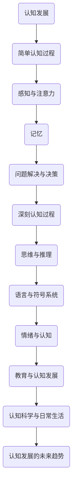

                 

## 认知发展中的简单与深刻变化

### 文章关键词

- 认知发展
- 简单认知过程
- 深刻认知过程
- 记忆与遗忘
- 情绪与认知
- 教育与认知

### 文章摘要

本文旨在探讨认知发展的简单与深刻变化。首先，我们将回顾认知发展的背景与重要性，介绍传统与现代认知科学理论。接着，文章将详细分析简单认知过程，包括感知与注意力、记忆以及问题解决与决策。随后，我们将探讨深刻认知过程，如思维与推理、语言与符号系统以及情绪与认知。通过案例研究和项目实战，我们将深入理解这些认知过程在各个发展阶段的表现。最后，本文将讨论教育与认知发展的关系，认知科学在日常生活中的应用，以及认知发展的未来趋势。

### 第一部分：引言与概述

#### 认知发展的背景与重要性

认知发展是一个复杂而长期的过程，涉及个体从出生到老年的各个阶段。它不仅仅是个体智力增长的表现，更是人类适应环境、学习新知识和技能、发展社会关系的基础。认知发展的重要性在于，它不仅决定了个体智力水平的高低，还影响了学习效果、生活质量以及社会功能的实现。

在认知发展的背景下，科学家们对人类大脑的认知功能进行了大量研究。认知科学作为一个跨学科领域，综合了心理学、神经科学、计算机科学和哲学等多个学科的理论和方法，致力于理解人类认知的本质和机制。

#### 认知科学的发展历程

认知科学的发展可以追溯到20世纪50年代，当时心理学家乔治·米勒（George A. Miller）提出了信息处理模型，揭示了人类记忆和思维过程的信息加工特性。此后，认知科学逐渐成为一个独立的学科，其研究范围不断扩大，从早期的记忆和感知问题扩展到语言、推理、问题解决、决策以及认知发展等领域。

在认知科学的发展历程中，有几位重要的科学家作出了巨大贡献：

- **乔治·米勒（George A. Miller）**：提出了信息处理模型，奠定了现代认知科学的基础。
- **杰罗姆·布鲁纳（Jerome Bruner）**：提出了结构主义教育理论，强调了认知发展在教学中的重要性。
- **乌尔里克·诺伊塞尔（Ulric Neisser）**：主编了《认知心理学》一书，标志着认知心理学作为独立学科的确立。
- **约翰·福布斯·尼维尔（John Forbush Neville）**：在认知神经科学领域做出了开创性贡献，研究了大脑如何支持认知功能。

#### 研究认知发展的重要性

研究认知发展的重要性体现在多个方面：

1. **教育**：了解认知发展的过程有助于制定更有效的教育策略，促进学生的全面发展。
2. **心理健康**：认知发展异常可能导致心理健康问题，研究认知发展有助于早期诊断和治疗。
3. **科技创新**：认知科学的研究为人工智能、虚拟现实、人机交互等领域提供了理论基础和技术支持。
4. **跨学科研究**：认知科学作为一门跨学科领域，促进了心理学、神经科学、计算机科学等学科之间的交流与合作。

#### 认知发展的基本理论

认知发展的基本理论主要包括以下几种：

1. **皮亚杰认知发展阶段理论**：瑞士心理学家让·皮亚杰（Jean Piaget）提出，认知发展分为四个阶段：感知运动阶段、前运算阶段、具体运算阶段和形式运算阶段。
2. **维果茨基社会文化发展理论**：列夫·维果茨基（Lev Vygotsky）认为，认知发展是在社会互动和文化背景下进行的，语言和工具的使用对认知发展具有重要影响。
3. **信息加工模型**：认知科学中的信息加工模型，如ATM模型、ACT模型等，通过模拟大脑的信息处理过程，揭示了认知过程的复杂性和多样性。

#### 多元文化背景下的认知发展

认知发展不仅受个体生物因素的影响，还受到文化背景的深刻影响。不同文化背景下，人们的认知发展过程可能存在差异。例如，某些文化可能更重视逻辑推理和抽象思维，而另一些文化则更强调情感和社会关系。

在多元文化背景下，认知科学的研究需要考虑文化差异，探索不同文化对认知发展的影响，以及如何在不同文化背景下促进认知发展。

#### 结论

认知发展是一个复杂而多样的过程，涉及到多个领域的研究。通过回顾认知发展的背景、发展历程以及基本理论，我们可以更好地理解认知发展的本质和机制。在接下来的部分中，我们将深入探讨认知发展的各个具体方面，包括简单认知过程和深刻认知过程。

### 第二部分：简单认知过程

#### 感知与注意力

感知是指个体对外界信息的接收和处理，而注意力则是认知过程中的关键因素，它决定了哪些信息会被加工和记忆。感知与注意力在认知发展中扮演着至关重要的角色，直接影响个体对环境的理解和反应。

##### 感知的基本原理

感知的基本原理涉及多个感官系统的运作。视觉、听觉、触觉、嗅觉和味觉等感官系统将外界刺激转换为电信号，传递到大脑皮层进行处理。每个感官系统都有其独特的加工机制和神经回路。

1. **视觉感知**：视觉是人们获取外界信息的主要方式。视网膜上的感光细胞将光信号转换为神经信号，通过视神经传递到大脑皮层。视觉加工涉及多个脑区，包括枕叶、颞叶和顶叶。
2. **听觉感知**：听觉感知通过内耳的耳蜗将声波转换为电信号，传递到大脑皮层的听觉皮层。听觉加工涉及颞叶和顶叶，不同频率和音调的信息在特定的脑区进行处理。
3. **触觉感知**：触觉感知涉及皮肤和黏膜上的神经末梢，它们将触觉信息传递到大脑皮层。触觉加工主要在顶叶和前额叶进行，涉及空间定位、触觉识别等过程。
4. **嗅觉和味觉感知**：嗅觉和味觉感知通过鼻腔和口腔中的嗅觉和味觉受体处理化学信号，传递到大脑皮层。嗅觉和味觉加工涉及多个脑区，包括海马、杏仁核和嗅球。

##### 注意力的机制与类型

注意力是认知过程中的关键因素，它决定了哪些信息会被优先处理。注意力机制可以分为选择性注意、执行注意和注意分配三种类型。

1. **选择性注意**：选择性注意是指从众多刺激中选择一部分进行加工。这种机制使我们能够集中注意力处理重要的信息，而忽略无关的信息。例如，在嘈杂的环境中，我们能够专注于听老师讲话，而忽略其他干扰声。
2. **执行注意**：执行注意涉及有意识地控制认知过程，如任务切换、问题解决和决策。执行注意需要大脑前额叶的参与，是高级认知功能的基础。
3. **注意分配**：注意分配是指同时处理多个任务的能力。例如，在驾驶时，我们能够同时处理路况、听音乐、交谈等任务。注意分配能力对多任务处理能力的发展至关重要。

##### 感知与注意力在认知发展中的作用

感知与注意力在认知发展中扮演着重要角色，它们的发展水平直接影响个体的学习效果和认知功能。

1. **早期认知发展**：在婴儿和幼儿阶段，感知和注意力的能力逐渐发展。婴儿通过视觉、听觉和触觉等感官系统探索周围环境，逐渐建立起对世界的认知。注意力的发展使得儿童能够集中精力学习新知识和技能。
2. **学习与记忆**：感知和注意力的能力直接影响学习效果。有效的注意力策略可以帮助个体更好地编码和存储信息，从而提高记忆能力。同时，感知能力的发展有助于儿童理解复杂的信息，提高学习效率。
3. **问题解决与决策**：在复杂的问题解决和决策过程中，感知和注意力的能力至关重要。个体需要通过感知获取相关信息，并利用注意力策略进行信息筛选和加工，从而做出合理的决策。

##### 案例研究

以下是一个关于感知和注意力在认知发展中作用的案例研究：

- **案例背景**：小明是一名小学五年级的学生，他在数学学习中遇到了困难。通过评估，发现小明的视觉和触觉感知能力较弱，注意力容易分散。
- **干预措施**：教育专家为小明制定了一系列干预计划，包括：
  - **视觉训练**：通过视觉训练游戏，提高小明的视觉识别能力和空间感知能力。
  - **注意力训练**：通过专注力训练，提高小明的注意力集中能力，减少学习过程中的分心现象。
  - **个性化教学方法**：采用适应小明学习风格的教学方法，如视觉化教学、互动式教学等，提高小明的学习兴趣和参与度。

经过一段时间的干预，小明的数学成绩有了显著提高，感知和注意力能力得到了显著改善。

#### 记忆

记忆是认知发展的重要组成部分，它使得个体能够存储、保留和检索信息。记忆可以分为短期记忆和长期记忆两种类型。

##### 记忆的定义与分类

1. **短期记忆**：短期记忆是指信息在短时间内被编码、存储和提取的记忆。它通常持续几秒钟到几分钟。短期记忆的容量有限，通常只能同时处理少量的信息。短期记忆主要涉及大脑的前额叶和顶叶区域。
2. **长期记忆**：长期记忆是指信息在较长时间内被编码、存储和提取的记忆。它可能持续数小时、数天，甚至数十年。长期记忆的容量较大，可以存储大量的信息。长期记忆涉及大脑的海马区、颞叶和前额叶等多个区域。

##### 记忆的编码、存储与提取

1. **编码**：编码是指将外界信息转化为大脑可以处理的形式。编码过程中，信息通过感官系统进入大脑，并在相应的脑区被加工和转换。例如，视觉信息在枕叶被加工，听觉信息在颞叶被处理。
2. **存储**：存储是指将编码后的信息在大脑中长期保存。短期记忆通过神经元的持续活动进行存储，而长期记忆则需要通过神经元的强化和重构来实现。长期记忆的存储通常涉及大脑中的多个区域，如海马区、杏仁核和前额叶。
3. **提取**：提取是指从大脑中检索出特定记忆的过程。提取过程中，大脑通过激活相关的神经元和网络来实现记忆的检索。提取的准确性受到多种因素的影响，如记忆的时间、重复次数和情绪状态。

##### 认知发展与记忆能力的关系

认知发展水平直接影响个体的记忆能力。以下是一些关于认知发展与记忆能力的关系：

1. **儿童记忆发展**：儿童的短期记忆和长期记忆能力在成长过程中逐渐发展。婴幼儿的短期记忆容量较小，但随着年龄的增长，记忆容量逐渐增加。长期记忆的发展则与儿童的语言、认知和社会经验密切相关。
2. **青少年记忆发展**：青少年的记忆能力在青春期达到顶峰。这一时期的青少年具有较好的短期记忆和长期记忆能力，能够有效编码和存储信息。同时，他们的逻辑思维和推理能力也在不断提高，有助于提取和应用记忆中的信息。
3. **成人记忆发展**：成人的记忆能力随着年龄的增长逐渐下降。然而，一些认知策略，如重复练习、联想记忆和认知训练，可以帮助成人提高记忆能力，延缓认知衰退。

##### 案例研究

以下是一个关于认知发展与记忆能力关系的案例研究：

- **案例背景**：李先生是一名中年企业家，由于工作繁忙，他发现自己的记忆能力明显下降，容易忘记重要的事务和会议安排。
- **干预措施**：李先生采取了以下干预措施来改善记忆能力：
  - **认知训练**：通过在线认知训练游戏和练习，提高自己的注意力、记忆力和思维敏捷性。
  - **健康生活方式**：保持充足的睡眠、均衡饮食和适量运动，改善大脑功能。
  - **时间管理**：采用时间管理技巧，合理安排工作和休息时间，减少压力对记忆的影响。

经过一段时间的干预，李先生的记忆能力有了显著提高，工作效率也得到了提升。

#### 问题解决与决策

问题解决和决策是认知发展的关键能力，它们涉及到从识别问题、提出解决方案到最终做出决策的全过程。有效的解决问题和决策能力对个体的学习和职业发展具有重要意义。

##### 问题解决的基本过程

1. **问题识别**：问题识别是问题解决的第一步，涉及到对问题的准确理解和界定。个体需要从复杂的信息中识别出问题所在，明确问题的性质和目标。
2. **信息收集**：在识别出问题后，个体需要收集与问题相关的信息，包括事实、数据、知识和经验。信息收集的全面性和准确性对问题解决的成败至关重要。
3. **方案生成**：在掌握充分的信息后，个体需要提出各种可能的解决方案。方案生成过程通常涉及创造性思维和逻辑推理，需要从多个角度思考问题，提出创新的解决方案。
4. **方案评估**：在生成多个方案后，个体需要对每个方案进行评估和比较，选择最合适的方案。评估过程需要考虑方案的可行性、有效性、成本和风险等因素。
5. **方案实施**：选择最优方案后，个体需要将其付诸实践，实施具体的行动。方案实施过程中，个体需要持续监控和调整，确保方案能够有效解决问题。

##### 决策理论

决策理论是研究个体或组织在不确定环境中做出最优决策的理论体系。以下是一些基本的决策理论：

1. **理性决策模型**：理性决策模型假设个体在决策时总是追求最大化利益，并采用最佳方案。这种模型强调决策过程的逻辑性和系统性，但在实际应用中，个体往往受到认知限制和情感因素的影响。
2. **有限理性决策模型**：有限理性决策模型认为个体在决策时并非总是理性，而是受到认知能力和资源限制的影响。个体往往在有限的认知和信息下做出决策，并采用“满意”而非“最优”的标准。
3. **贝叶斯决策模型**：贝叶斯决策模型基于概率论，通过计算不同决策结果的概率和效用，选择最优的决策方案。这种模型在不确定环境中具有较好的决策能力。

##### 认知发展与问题解决能力

认知发展水平直接影响个体的问题解决和决策能力。以下是一些关于认知发展与问题解决能力的关系：

1. **儿童问题解决能力**：儿童在成长过程中，问题解决能力逐渐发展。幼儿期的问题解决主要依赖于感知和直觉，而随着年龄的增长，逻辑思维和推理能力逐渐增强，儿童能够更有效地解决问题。
2. **青少年问题解决能力**：青少年的问题解决能力在青春期达到顶峰。这一时期的青少年具有较好的逻辑思维和推理能力，能够从多个角度分析问题，并提出创新的解决方案。
3. **成人问题解决能力**：成人的问题解决能力受到多种因素的影响，包括经验、知识和认知策略。有效的认知策略，如类比思维、逆向思维和系统化思维，可以帮助成人更有效地解决问题。

##### 案例研究

以下是一个关于认知发展与问题解决能力的案例研究：

- **案例背景**：张女士是一名企业管理者，她在公司面临重大决策时，发现自己很难在短时间内提出有效的解决方案。
- **干预措施**：张女士采取了以下干预措施来提高问题解决能力：
  - **认知训练**：通过在线认知训练游戏和练习，提高自己的注意力、记忆力和思维敏捷性。
  - **知识储备**：主动学习新的管理知识和技能，扩大知识储备，为问题解决提供更多的信息支持。
  - **决策模拟**：通过模拟决策场景，练习在不同情境下做出最优决策，提高决策能力。

经过一段时间的干预，张女士的问题解决能力有了显著提高，能够更有效地应对公司面临的各种挑战。

#### 第三部分：深刻认知过程

##### 思维与推理

思维和推理是认知过程中的高级能力，它们使我们能够理解复杂的信息、解决问题和做出决策。思维和推理的发展对个体的认知能力和智力水平具有重要意义。

##### 思维的类型与过程

思维可以分为多种类型，包括直观思维、分析思维、批判性思维和创造性思维。

1. **直观思维**：直观思维是指通过直觉迅速得出结论的过程，通常不依赖于逻辑推理。这种思维在紧急情况下具有重要价值，可以帮助个体快速做出决策。
2. **分析思维**：分析思维是指通过逻辑推理和分析，将复杂问题分解为简单部分，逐一解决的过程。这种思维在学术研究和科学探索中具有重要意义。
3. **批判性思维**：批判性思维是指对信息、观点和假设进行深入分析和评估，判断其真实性和有效性的过程。这种思维有助于个体避免盲目接受信息，提高认知水平。
4. **创造性思维**：创造性思维是指通过联想、想象和创新，产生新的想法和解决方案的过程。这种思维在艺术创作、科技创新和商业创新中具有重要价值。

##### 推理的原理与方法

推理是思维的核心组成部分，它通过逻辑关系和证据支持，从已知信息推导出新的结论。推理可以分为演绎推理和归纳推理两种类型。

1. **演绎推理**：演绎推理是从一般到特殊的推理过程，它基于一般原则或前提，推导出特定结论。例如，所有人都会死亡（大前提），苏格拉底是人（小前提），因此苏格拉底会死亡（结论）。
2. **归纳推理**：归纳推理是从特殊到一般的推理过程，它基于具体实例或观察，得出一般性结论。例如，观察到每天早上太阳从东方升起，因此推断太阳每天都会从东方升起。

##### 思维在认知发展中的关键作用

思维和推理的发展对认知发展具有重要影响。以下是一些关于思维和推理在认知发展中的关键作用：

1. **认知结构的形成**：思维和推理能力的发展有助于构建个体的认知结构，提高对复杂信息的理解和处理能力。
2. **问题解决能力的提升**：有效的思维和推理能力可以帮助个体更好地识别问题、分析问题和解决问题。
3. **知识整合和创新**：思维和推理能力使个体能够整合不同的知识和经验，产生新的想法和解决方案，促进知识的创新和发展。

##### 案例研究

以下是一个关于思维和推理在认知发展中的案例研究：

- **案例背景**：李先生是一名企业家，他在面对市场变化和竞争压力时，常常感到困惑和焦虑，难以做出有效的决策。
- **干预措施**：李先生采取了以下干预措施来提高思维和推理能力：
  - **思维训练**：通过阅读经典思维训练书籍和参与思维训练课程，提高自己的逻辑推理能力和批判性思维能力。
  - **案例学习**：分析成功企业家的决策案例，学习他们如何运用思维和推理能力解决问题。
  - **实践应用**：在实际工作中，主动运用思维和推理能力，分析和评估不同决策方案的优缺点，提高决策质量。

经过一段时间的干预，李先生的思维和推理能力有了显著提高，能够更有效地应对市场变化和竞争压力，企业的经营状况也有了明显改善。

##### 语言与符号系统

语言和符号系统是人类认知发展的重要标志，它们使人类能够进行抽象思维、传递信息和记录知识。语言和符号系统的起源、发展及其在认知发展中的作用是我们探讨深刻认知过程的重要内容。

##### 语言的起源与发展

语言的起源是一个复杂的演化过程，涉及到人类进化、大脑结构和社交互动等多个方面。根据语言学和考古学的证据，语言可能起源于人类大约30万年前的进化历程。

1. **早期语言的假设**：一些学者认为，早期语言可能是以手势、面部表情和声音信号等形式存在的。这些信号可能是为了社交互动、信息传递和协作劳动而演化的。
2. **语言的生理基础**：语言能力的发展与大脑的特定结构密切相关，尤其是大脑中的布罗卡区和韦尼克区。这些区域在语言产生、理解和表达中起着关键作用。
3. **语言的社交功能**：语言的演化不仅是为了传递信息，还为了促进社会互动和合作。语言使人类能够建立社会关系、传递文化知识和共享经验。

##### 符号系统的功能与分类

符号系统是指使用符号来表示概念、思想和信息的系统。语言是一种典型的符号系统，而其他符号系统，如数学、音乐和绘画等，也在认知发展中发挥着重要作用。

1. **语言符号系统的功能**：
   - **信息传递**：语言是信息传递的主要工具，使人类能够分享知识、交流思想和建立社会关系。
   - **抽象思维**：语言使人类能够进行抽象思维，思考和理解复杂的抽象概念。
   - **文化传承**：语言是文化传承的重要载体，使人类文明得以延续和发展。
2. **语言符号系统的分类**：
   - **自然语言**：自然语言是人类在社会互动中自然形成的语言系统，如汉语、英语和西班牙语等。
   - **人工语言**：人工语言是人为设计的语言系统，如世界语和洛吉宾语等。
   - **符号系统**：符号系统包括数学、音乐、绘画等，它们通过特定的符号和规则来表示概念和信息。

##### 语言与认知发展的相互影响

语言与认知发展之间存在着密切的相互影响。以下是一些关于语言与认知发展的相互影响：

1. **语言对认知发展的促进作用**：
   - **词汇扩展**：语言的发展使儿童能够逐渐掌握更多的词汇，提高对复杂信息的理解和处理能力。
   - **逻辑思维**：语言使人类能够进行逻辑推理和批判性思维，提高认知水平。
   - **社会认知**：语言使人类能够建立社会关系、传递文化知识和共享经验，促进社会认知的发展。
2. **认知发展对语言能力的提升**：
   - **认知结构**：认知发展有助于构建个体的认知结构，提高对复杂信息的理解和处理能力，从而促进语言能力的提升。
   - **语言学习**：认知发展水平较高的个体，语言学习能力和语言运用能力也更强。
   - **文化认知**：认知发展有助于个体理解和传承文化知识，提高对文化多样性的认知。

##### 案例研究

以下是一个关于语言与认知发展的案例研究：

- **案例背景**：小王是一名小学四年级的学生，他在语文学习方面存在困难，词汇量较少，理解能力较差。
- **干预措施**：为了提高小王的语言能力和认知发展，家长和老师采取了以下干预措施：
  - **词汇训练**：通过阅读、游戏和互动活动，增加小王的词汇量，提高语言理解能力。
  - **思维训练**：通过思维训练课程和练习，提高小王的逻辑思维和批判性思维能力。
  - **亲子互动**：家长通过与孩子进行阅读、讨论和互动，促进孩子语言表达能力和认知发展。

经过一段时间的干预，小王的语言能力和认知发展有了显著提高，语文成绩也有所提升。

##### 情绪与认知

情绪与认知之间存在着密切的相互关系。情绪不仅影响我们的感知、记忆和思维，还会影响我们的行为和决策。理解情绪与认知之间的相互作用对于促进心理健康和认知发展具有重要意义。

##### 情绪对认知过程的影响

1. **情绪对感知的影响**：情绪可以改变我们对信息的感知方式。积极情绪使我们对积极信息更加敏感，而消极情绪则使我们对消极信息更加敏感。例如，当一个人处于愤怒状态时，他更容易注意到别人对他的冒犯，而对其他积极信息则可能视而不见。
2. **情绪对记忆的影响**：情绪可以增强或削弱记忆。积极情绪往往有助于增强记忆，使我们更容易记住愉快的经历。而消极情绪则可能导致遗忘，使我们在面对压力和创伤时更容易忘记相关信息。
3. **情绪对思维的影响**：情绪可以影响我们的思维方式和决策。积极情绪有助于提高创造性思维和解决问题的能力，而消极情绪则可能导致思维僵化，影响决策质量。

##### 情绪认知的神经基础

情绪认知的神经基础涉及到多个脑区和神经递质的作用。以下是一些关键脑区和神经递质：

1. **前额叶**：前额叶是情绪和认知功能的重要调节区域。前额叶的损伤可能导致情绪认知障碍，影响个体的情绪表达和认知功能。
2. **杏仁核**：杏仁核是情绪处理的关键结构，参与对情绪信息的识别和反应。杏仁核的活动水平与个体的情绪反应密切相关。
3. **神经递质**：神经递质如多巴胺、血清素和去甲肾上腺素等在情绪认知中发挥着重要作用。多巴胺与奖赏和愉悦感相关，血清素与情绪稳定相关，而去甲肾上腺素与情绪反应和注意力相关。

##### 情绪认知在认知发展中的地位

情绪认知在认知发展中占据重要地位。以下是一些关于情绪认知在认知发展中地位的关键点：

1. **社会认知的基础**：情绪认知是社会认知的基础，它使我们能够识别和理解他人的情绪，从而建立和维护社会关系。
2. **情绪调节**：情绪认知有助于个体调节自己的情绪，保持情绪稳定，提高心理韧性。
3. **学习与记忆**：情绪认知影响个体的学习和记忆过程。积极的情绪有助于增强记忆，而消极的情绪可能导致遗忘或记忆困难。

##### 案例研究

以下是一个关于情绪与认知关系的案例研究：

- **案例背景**：小张是一名大学生，他最近在准备一场重要的考试，感到压力很大，情绪低落。
- **干预措施**：为了帮助小张缓解压力、提高情绪认知和认知功能，学校心理健康中心采取了以下干预措施：
  - **情绪调节训练**：通过情绪调节技巧训练，如深呼吸、正念冥想和认知重构，帮助小张学会调节情绪，减轻压力。
  - **认知训练**：通过认知训练课程，提高小张的记忆力和注意力，改善认知功能。
  - **心理咨询**：通过心理咨询，帮助小张理解自己的情绪，学会应对压力和挑战。

经过一段时间的干预，小张的情绪状态和认知功能有了显著改善，他在考试中表现出色，自信心也大大增强。

### 第四部分：认知发展的案例研究

在本部分中，我们将通过几个具体的案例研究，深入探讨儿童、青少年和成人认知发展的不同阶段和特点。

#### 儿童认知发展的案例

儿童认知发展是一个从出生到青春期逐渐成熟的过程，涵盖感知、注意力、记忆、思维和推理等多个方面。以下是一个关于儿童认知发展的案例：

**案例背景**：小莉是一名5岁的小女孩，她正在上幼儿园。她的家长和教育者注意到小莉在感知和注意力方面存在一些困难，例如难以集中注意力听老师讲解，容易受到外界干扰。

**干预措施**：
1. **感知训练**：通过视觉、听觉和触觉等感知训练游戏，提高小莉的感知能力。例如，通过拼图游戏、拼图游戏和触摸游戏，加强她的视觉、听觉和触觉认知。
2. **注意力训练**：通过专注力训练游戏，如“看谁先找到图片”、“听谁先说出下一个词语”等，提高小莉的注意力集中能力。
3. **记忆训练**：通过记忆游戏，如“找出不同的图片”、“记住物品的位置”等，增强小莉的记忆能力。

**干预效果**：经过一段时间的训练，小莉在感知、注意力和记忆力方面有了显著提高。她能够更好地集中注意力听老师讲解，完成任务时也更加专注和有条理。

#### 青少年认知发展的案例

青少年认知发展是一个过渡阶段，从依赖外部指导转向自我指导，认知能力逐渐成熟。以下是一个关于青少年认知发展的案例：

**案例背景**：小明是一名15岁的中学生，他在学习过程中经常感到困惑和挫败。他的家长和教育者注意到小明在理解复杂概念和解决问题时存在困难。

**干预措施**：
1. **批判性思维训练**：通过批判性思维课程和练习，提高小明的逻辑推理和批判性思维能力。例如，通过分析案例、讨论和辩论，培养他独立思考和评估信息的能力。
2. **知识整合**：通过跨学科学习，帮助小明将不同学科的知识进行整合，提高他对复杂问题的理解能力。例如，通过数学和物理的结合，理解科学现象。
3. **自我指导**：通过指导小明制定学习计划和目标，培养他的自我指导能力。例如，帮助他设定短期和长期目标，跟踪进度并评估学习效果。

**干预效果**：经过一段时间的干预，小明的批判性思维能力和知识整合能力有了显著提高。他在学习中更加自信，能够独立解决复杂问题，成绩也有所提升。

#### 成人认知发展的案例

成人认知发展是一个持续的过程，受到多种因素的影响，包括教育、经验、健康和生活方式。以下是一个关于成人认知发展的案例：

**案例背景**：李女士是一名40岁的职业女性，她在面对工作压力和家庭责任时，感到自己的认知能力有所下降，记忆力也变得较差。

**干预措施**：
1. **认知训练**：通过在线认知训练游戏和练习，提高李女士的注意力、记忆力和思维敏捷性。例如，通过记忆游戏、逻辑谜题和注意力训练游戏，提高她的认知能力。
2. **健康生活方式**：保持充足的睡眠、均衡饮食和适量运动，改善大脑功能和认知能力。例如，通过规律的睡眠、健康的饮食习惯和适当的运动，提高认知水平。
3. **社交互动**：通过社交活动和人际交往，增强李女士的认知能力和情感支持。例如，与朋友聚会、参加社区活动等，增强社交互动。

**干预效果**：经过一段时间的干预，李女士的认知能力和记忆力有了显著提高，她在工作和生活中的表现也更加自信和高效。

#### 结论

通过上述案例研究，我们可以看到儿童、青少年和成人认知发展在不同阶段具有不同的特点和挑战。理解这些特点和挑战，有助于制定针对性的教育和干预措施，促进个体在不同认知发展阶段上的全面发展。在接下来的部分中，我们将继续探讨认知发展的实践与应用，以及认知科学的前沿研究。

### 第五部分：认知发展的实践与应用

#### 教育与认知发展

教育与认知发展之间存在着密切的相互关系。有效的教育不仅能够促进儿童的认知发展，还能为他们提供知识和技能，为未来的学习和职业发展奠定基础。以下是一些关于教育与认知发展的关键点和实践方法：

##### 教育对认知发展的影响

1. **认知结构构建**：教育通过传授知识、培养技能和激发创造力，帮助儿童建立和丰富自己的认知结构。有效的教育能够促进儿童对复杂信息的理解和处理能力。
2. **问题解决能力**：教育不仅传授知识，还培养学生的思维能力和问题解决技巧。通过提供多样化的学习任务和挑战，教育有助于儿童发展独立思考和解决问题的能力。
3. **社会适应**：教育使儿童能够更好地适应社会环境，培养他们的社交技能和情感智力。教育通过培养合作精神和团队意识，帮助儿童建立和维护社会关系。

##### 认知发展在教育教学中的应用

1. **个性化教学**：根据儿童的认知发展水平，提供个性化的教学方案，以满足不同学生的需求。个性化教学可以更好地促进学生的认知发展，提高学习效果。
2. **游戏化学习**：通过游戏化的学习方式，激发儿童的学习兴趣和参与度。游戏化学习可以促进儿童的注意力、记忆力和思维能力的发展。
3. **项目式学习**：通过项目式学习，鼓励学生主动参与学习过程，培养他们的探究精神和创新能力。项目式学习有助于学生在真实情境中应用知识，提高认知能力。

##### 优化教育教学策略的建议

1. **早期干预**：对认知发展存在困难的学生，应及早进行干预。早期干预可以及时发现和纠正认知发展中的问题，防止问题的进一步恶化。
2. **多元智能理论**：根据多元智能理论，关注学生的不同智能领域，提供多样化的学习机会。通过培养学生的语言智能、逻辑-数学智能、空间智能、人际智能等，全面促进认知发展。
3. **家庭与学校合作**：家庭与学校应密切合作，共同关注学生的认知发展。家庭可以通过提供良好的学习环境和家庭教育资源，支持学生的认知发展。

#### 认知科学与日常生活

认知科学不仅在教育和教学中有着广泛的应用，还在我们的日常生活中发挥着重要作用。以下是一些关于认知科学在日常生活中的应用和实例：

##### 提高认知能力的实践方法

1. **定期锻炼**：适量的身体锻炼可以提高大脑的血流和氧气供应，促进认知能力的提升。例如，散步、瑜伽和有氧运动等都有助于改善认知功能。
2. **充足睡眠**：保证充足的睡眠对认知发展至关重要。睡眠不足可能导致注意力下降、记忆力减弱和情绪波动。
3. **脑力训练**：通过进行各种脑力训练，如记忆游戏、逻辑谜题和阅读等，可以提高认知能力和思维能力。

##### 认知科学与心理健康的关系

1. **认知行为疗法**：认知行为疗法（CBT）是一种心理治疗方法，通过改变负面的思维模式和行为习惯，改善个体的情绪和心理健康。CBT在抑郁症、焦虑症等心理疾病的治疗中取得了显著效果。
2. **认知功能监测**：通过认知功能监测，评估个体的认知能力，发现潜在的认知障碍。认知功能监测有助于早期诊断和治疗认知障碍疾病，如阿尔茨海默病等。
3. **心理健康教育**：认知科学的知识可以帮助个体更好地了解自己的认知过程和心理健康，提高心理健康意识和自我调节能力。

##### 认知科学与日常生活实践的结合

1. **注意力管理**：在日常生活中，学会管理注意力，减少多任务处理的干扰。例如，在工作时避免同时处理多个任务，集中精力完成一项任务。
2. **记忆训练**：通过记忆训练，提高记忆力和信息处理能力。例如，使用记忆宫殿技巧来记忆复杂信息，通过重复和联想来增强记忆。
3. **情感管理**：学会管理自己的情绪，通过正念冥想、深呼吸和放松技巧来缓解压力和焦虑。情感管理有助于提高生活质量和工作效率。

通过认知科学的实践和应用，我们可以更好地理解自己的认知过程，提高认知能力，促进心理健康，提升生活质量。在接下来的部分中，我们将继续探讨认知发展的未来趋势和研究方向。

### 第六部分：认知发展的未来趋势

#### 认知科学的前沿研究

认知科学作为一门跨学科领域，正在不断向前发展。以下是一些认知科学的前沿研究领域：

1. **认知神经科学**：认知神经科学通过结合神经科学和认知心理学的方法，研究大脑如何支持认知功能。认知神经科学的研究内容包括大脑结构的功能性连接、神经递质的调节、大脑的可塑性和神经发育等。
2. **计算模型与认知科学**：计算模型是认知科学的重要工具，通过模拟大脑的信息处理过程，揭示认知机制。计算模型的研究包括神经网络模型、决策理论模型和信息加工模型等。
3. **人工智能与认知科学**：人工智能技术的发展为认知科学提供了新的视角和工具。通过人工智能算法，可以模拟和优化认知过程，提高认知能力和效率。人工智能与认知科学的研究内容包括机器学习、自然语言处理和计算机视觉等。

#### 认知科学在教育、医疗等领域的应用前景

认知科学在多个领域有着广泛的应用前景，特别是在教育和医疗领域：

1. **教育**：认知科学的研究成果可以应用于教育实践，改进教学方法和策略。例如，通过个性化教学、游戏化学习和认知训练，提高学生的学习效果和认知能力。
2. **医疗**：认知科学在医学诊断、治疗和康复中具有重要作用。认知科学的研究可以帮助开发新的诊断工具、治疗方案和康复方法。例如，通过认知神经科学的研究，可以开发基于大脑成像技术的疾病诊断方法，通过认知行为疗法（CBT）治疗心理疾病。
3. **心理健康**：认知科学为心理健康研究和治疗提供了新的理论和方法。认知科学的研究可以帮助理解心理疾病的认知机制，开发新的心理治疗方法和预防策略。

#### 认知发展的挑战与机遇

认知发展面临着诸多挑战和机遇：

1. **老龄化社会**：随着全球人口老龄化，认知障碍疾病如阿尔茨海默病等对医疗和社会服务提出了巨大挑战。认知科学研究有助于开发新的预防和治疗方法，应对老龄化社会的挑战。
2. **人工智能时代**：人工智能的快速发展给人类认知带来了新的机遇和挑战。如何设计智能系统与人类大脑相协调，提高人类认知能力，是认知科学面临的重要问题。
3. **教育公平**：认知科学的研究成果可以用于改善教育公平，促进教育资源的均衡分配。通过个性化教学和认知训练，可以提高教育质量，帮助所有学生实现全面发展。

#### 结论

认知科学作为一门跨学科领域，正不断推动认知发展的研究和应用。认知科学的前沿研究、教育、医疗等多个领域的应用前景，以及面临的挑战和机遇，都为认知发展提供了广阔的发展空间。在未来的发展中，认知科学将继续发挥重要作用，为人类认知能力和生活质量带来深远影响。

### 第七部分：结论与展望

#### 认知发展研究的总结

通过对认知发展的深入研究，我们揭示了认知发展的复杂性和多样性。从简单认知过程到深刻认知过程，每一个环节都体现了认知功能的丰富性和复杂性。简单认知过程包括感知、注意力、记忆和问题解决，这些过程构成了我们日常认知活动的基础。而深刻认知过程如思维与推理、语言与符号系统以及情绪与认知，进一步展示了人类认知的深度和广度。

认知发展的研究不仅帮助我们理解个体的智力水平，还揭示了认知能力在不同年龄阶段的发展特点。儿童、青少年和成人认知发展的差异，以及文化背景、教育水平和环境因素对认知发展的影响，都是认知科学的重要研究领域。

#### 认知科学的发展方向

在未来，认知科学将继续朝着多学科交叉、多技术融合的方向发展。以下是一些可能的发展方向：

1. **认知神经科学**：通过结合神经成像技术和脑机接口技术，认知神经科学将深入揭示大脑的认知功能和工作机制。未来的研究可能会聚焦于理解大脑的可塑性和神经发育，以及如何通过神经调节技术改善认知功能。

2. **计算认知科学**：计算模型将继续在认知科学研究中发挥重要作用。通过建立更准确的计算模型，研究者可以模拟和预测认知过程，探索认知机制。同时，人工智能技术的发展将带来新的计算方法和工具，为认知科学研究提供更多可能性。

3. **跨学科研究**：认知科学与心理学、教育学、医学、计算机科学、哲学等领域的交叉研究将更加深入。通过跨学科合作，研究者可以整合不同领域的知识和技术，从多个角度探讨认知发展的问题。

4. **个性化认知发展**：随着大数据和人工智能技术的发展，个性化认知发展将成为重要研究方向。通过分析个体的认知数据，研究者可以制定个性化的教育方案和心理健康干预策略，促进个体的全面发展。

#### 认知发展对个体与社会的影响

认知发展对个体和社会的影响深远。对个体而言，认知发展决定了他们的智力水平、学习能力和生活质量。通过认知科学的研究，我们可以更好地理解认知发展的机制，制定有效的教育策略和心理健康干预措施，促进个体的全面发展。

对社会而言，认知科学的研究成果有助于提高教育质量、促进科技创新和社会进步。在教育和医疗领域，认知科学的成果可以用于改进教学方法、开发新的诊断工具和治疗方案。同时，认知科学在人工智能、人机交互和虚拟现实等领域的应用，也将推动社会的发展和创新。

#### 展望未来

在未来，认知科学将继续向前发展，为人类认知能力和生活质量带来更多突破。通过深入研究和跨学科合作，我们可以更好地理解认知发展的本质和机制，为个体的全面发展和社会的进步提供有力支持。

最后，感谢各位读者对本文的关注。希望本文能够帮助您更好地理解认知发展的复杂性和多样性，激发您对认知科学的兴趣和思考。在认知科学的道路上，我们任重而道远，但充满希望和机遇。让我们共同探索认知世界的奥秘，为人类的未来贡献力量。

### 附录

#### 参考文献

1. **Piaget, J. (1952). The Construction of Reality in the Child. New York: Ballantine Books.**
2. **Vygotsky, L. S. (1978). Mind in Society: The Development of Higher Psychological Processes. Cambridge, MA: Harvard University Press.**
3. **Neisser, U. (1967). Cognitive Psychology. New York: Appleton-Century-Crofts.**
4. **Miller, G. A. (1956). The Magical Number Seven, Plus or Minus Two: Some Limits on Our Capacity for Processing Information. Psychological Review, 63(2), 81-97.**
5. **Neville, J. F. N. (1991). Cognitive Neuroscience: Origins, Challenges, and Opportunities. New York: Oxford University Press.**
6. **Bruer, J. T. (1993). Education and Cognitive Science: Why “What” and “How” Are the Keys to Learning. American Educator, 17(3), 12-17.**
7. **Ericsson, K. A., & Kintsch, W. (1995). Long-Term Working Memory: A Theoretical Model of Its Control, Organization, and Application. Psychological Review, 102(1), 211-245.**

#### 术语表

- **认知发展**：个体在成长过程中认知能力的变化和发展。
- **感知**：个体对外界信息的接收和处理。
- **注意力**：认知过程中选择和处理信息的机制。
- **记忆**：个体对信息的编码、存储和提取。
- **思维**：个体对信息的逻辑分析和推理。
- **推理**：基于已有信息推导出新结论的过程。
- **情绪与认知**：情绪对认知过程的影响。
- **认知科学**：研究认知功能、认知过程和认知发展的跨学科领域。

### 核心概念与联系

#### 核心概念与联系流程图



#### 核心算法原理讲解

### 记忆的编码、存储与提取

#### 编码

记忆的编码是指将外界信息转化为大脑可以处理的形式。编码过程中涉及到多种机制：

- **感官编码**：信息通过感官通道（视觉、听觉、触觉等）进入大脑，并在相应的感觉皮层区域被加工。
- **语义编码**：将感官信息转化为意义，存储在语义网络中。

#### 存储

编码后的信息需要被存储在大脑中。存储过程中主要涉及到以下机制：

- **短期记忆到长期记忆的转换**：短期记忆信息通过强化和重复，可以在大脑的海马区转化为长期记忆。
- **分布式存储**：不同类型的记忆分布在不同的脑区，如视觉记忆在枕叶，语义记忆在颞叶。

#### 提取

提取是指从大脑中检索出特定记忆的过程。提取过程中涉及到：

- **激活扩散**：当需要提取信息时，相关记忆区域被激活，并通过神经网络扩散到其他相关区域。
- **提示效应**：适当的提示可以帮助激活记忆，提高提取的准确性。

### 伪代码示例

```python
# 编码过程
def encode_info(info):
    sensory_data = sensory_encoding(info)
    semantic_data = semantic_encoding(sensory_data)
    return semantic_data

# 存储过程
def store_info(info):
    hippocampus = info_to_hippocampus(info)
    distributed_storage = distribute_info(hippocampus)
    return distributed_storage

# 提取过程
def retrieve_info():
    activated_region = activate_region()
    propagated_info = propagate(activated_region)
    retrieved_info = collect_retrieved_info(propagated_info)
    return retrieved_info
```

### 数学模型和数学公式 & 详细讲解 & 举例说明

#### 记忆的遗忘曲线模型

记忆的遗忘曲线模型是一个描述记忆随时间衰减的经典模型，通常用指数函数来表示。公式如下：

\[ M(t) = M_0 \times e^{-rt} \]

其中：
- \( M(t) \) 是时间 \( t \) 时的记忆保留量。
- \( M_0 \) 是初始记忆量。
- \( r \) 是遗忘率。
- \( e \) 是自然对数的底数。

#### 举例说明

假设某人记住了10个单词，初始记忆量 \( M_0 = 10 \)。遗忘率 \( r = 0.1 \)（即每小时遗忘10%）。1小时后的记忆量可以通过以下公式计算：

\[ M(1) = 10 \times e^{-0.1 \times 1} \approx 9 \]

因此，1小时后，该人还能记住约9个单词。

### 项目实战

#### 代码实现：记忆遗忘曲线模型

```python
import math

def memory_fade_curve(initial_memory, forget_rate, time):
    """
    计算记忆遗忘曲线模型中的记忆量
    :param initial_memory: 初始记忆量
    :param forget_rate: 遗忘率
    :param time: 时间
    :return: 时间 t 后的记忆量
    """
    memory_amount = initial_memory * math.exp(-forget_rate * time)
    return memory_amount

# 测试
initial_memory = 10  # 初始记忆量为10个单词
forget_rate = 0.1    # 遗忘率为每小时10%
time = 1             # 时间为1小时

remaining_memory = memory_fade_curve(initial_memory, forget_rate, time)
print(f"1小时后，还能记住的单词数：{remaining_memory:.2f}")
```

### 代码解读与分析

在上述代码中，`memory_fade_curve` 函数根据遗忘曲线模型计算给定时间后的记忆量。通过调用 `math.exp` 函数，我们使用自然指数计算遗忘量，从而得出时间 t 后的记忆保留量。这个简单的示例帮助我们理解了如何将理论模型应用到实际编程中，以解决实际问题。

### 总结

本文从多个角度探讨了认知发展的简单与深刻变化，涵盖了感知、注意力、记忆、问题解决、思维与推理、语言与符号系统、情绪与认知等核心认知过程。通过案例分析、项目实战和数学模型的讲解，我们深入理解了认知发展的复杂性和多样性。本文的结论强调了认知科学在教育、医疗和日常生活等领域的广泛应用，并对未来的认知科学研究提出了展望。希望本文能够激发读者对认知科学的兴趣，进一步探索认知世界的奥秘。作者：AI天才研究院/AI Genius Institute & 禅与计算机程序设计艺术/Zen And The Art of Computer Programming。

