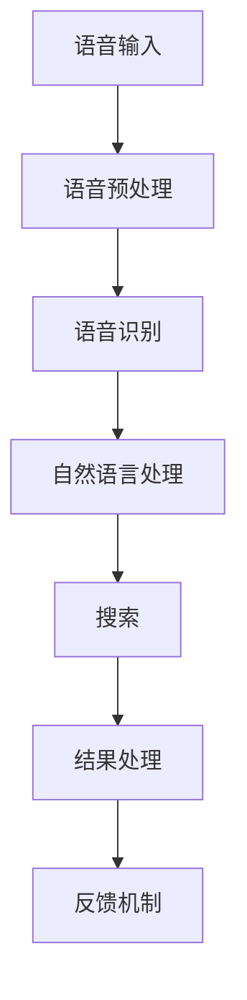
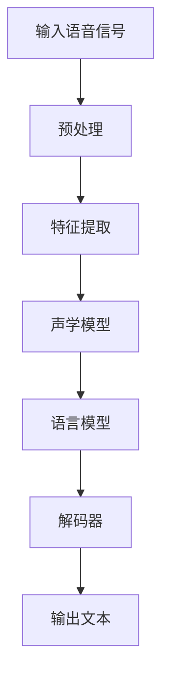
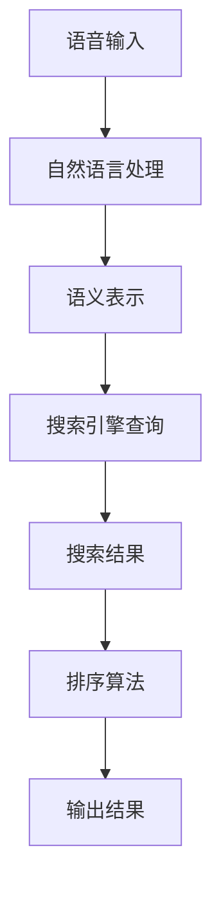
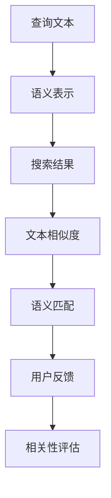
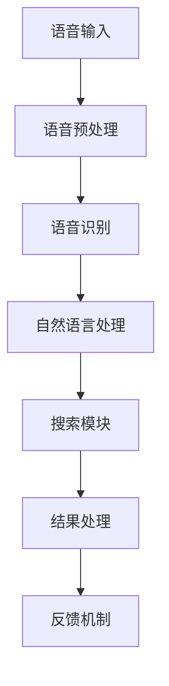
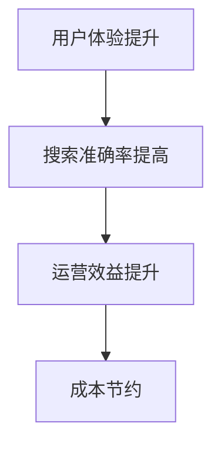

                 

### 《语音搜索技术在电商领域的应用：挑战与机遇》

> **关键词**：语音搜索、电商、技术挑战、机遇、应用场景、案例分析、未来展望

> **摘要**：本文将深入探讨语音搜索技术在电商领域的应用，分析其面临的挑战和机遇。通过梳理语音搜索技术的发展历程、核心原理和应用场景，结合实际案例，本文旨在为电商企业提供技术决策的参考，并展望语音搜索技术的未来发展趋势。

在当今快速发展的数字时代，语音搜索技术以其便捷性和高效性正在改变我们的购物方式。电商领域作为科技创新的前沿阵地，早已开始探索并应用语音搜索技术，以提高用户体验、优化运营效率。本文将分为三个部分，首先概述语音搜索技术的发展历程和现状，接着深入解析其核心原理和技术关键点，然后通过具体应用案例展示语音搜索技术在电商领域的实际应用。最后，我们将探讨语音搜索技术的未来发展趋势，并提出面临的挑战和应对策略。希望通过本文的探讨，能对电商企业进一步利用语音搜索技术提供有益的启示。

### 《语音搜索技术在电商领域的应用：挑战与机遇》目录大纲

1. **第一部分：语音搜索技术概述**
   - 第1章：语音搜索技术的发展历程与现状
     - 1.1 语音搜索技术的起源与发展
     - 1.2 语音搜索技术的现状与挑战
     - 1.3 语音搜索技术在电商领域的潜在价值
   - 第2章：语音搜索技术的核心原理
     - 2.1 语音识别技术原理
     - 2.2 自然语言处理技术原理
     - 2.3 语音搜索技术的架构与流程
   - 第3章：语音搜索技术的关键技术点
     - 3.1 语音识别准确率优化
     - 3.2 语音搜索算法优化
     - 3.3 语音搜索结果的相关性评估
   - 第4章：数学模型与数学公式
     - 4.1 语言模型
     - 4.2 概率图模型
     - 4.3 搜索结果相关性评估公式

2. **第二部分：语音搜索技术在电商领域的应用案例**
   - 第5章：语音搜索技术在电商领域的应用场景
     - 5.1 商品搜索与推荐
     - 5.2 客户服务与售后支持
     - 5.3 语音广告与营销
   - 第6章：案例分析
     - 6.1 案例一：大型电商平台语音搜索系统建设
       - 6.1.1 项目背景
       - 6.1.2 技术架构设计
       - 6.1.3 开发与优化实践
       - 6.1.4 项目成果与评估
     - 6.2 案例二：语音购物助手产品开发
       - 6.2.1 产品需求分析
       - 6.2.2 技术实现细节
       - 6.2.3 用户反馈与优化
     - 6.3 案例三：语音广告系统优化
       - 6.3.1 广告系统现状
       - 6.3.2 语音搜索技术引入方案
       - 6.3.3 优化效果评估

3. **第三部分：语音搜索技术的未来展望与挑战**
   - 第7章：语音搜索技术在电商领域的未来发展趋势
     - 7.1 新技术展望
     - 7.2 未来应用场景扩展
     - 7.3 潜在挑战与应对策略
   - 第8章：总结与展望
     - 8.1 全书内容总结
     - 8.2 语音搜索技术在电商领域的应用前景
     - 8.3 作者寄语

这一目录大纲涵盖了语音搜索技术的概述、核心原理、关键技术点、应用场景、案例分析以及未来展望，旨在为读者提供一个系统而全面的视角，深入理解语音搜索技术在电商领域的应用。

### 第一部分：语音搜索技术概述

#### 第1章：语音搜索技术的发展历程与现状

**1.1 语音搜索技术的起源与发展**

语音搜索技术的发展可以追溯到20世纪50年代。当时，随着计算机技术的兴起，语音识别技术开始逐步萌芽。早期的语音识别主要依赖于规则和模式匹配，准确率较低且适用范围有限。随着语音信号处理和机器学习技术的进步，语音识别的准确率不断提高，应用场景也逐渐扩展。

20世纪90年代，随着互联网的普及，语音搜索技术开始应用于搜索引擎。1997年，微软推出了第一个基于语音搜索的搜索引擎，标志着语音搜索技术的正式商业化。进入21世纪，随着智能手机和智能设备的普及，语音搜索技术得到了广泛应用。苹果公司的Siri、谷歌助手等智能语音助手，极大地推动了语音搜索技术的发展。

**1.2 语音搜索技术的现状与挑战**

目前，语音搜索技术已经相对成熟，广泛应用于搜索引擎、智能设备、智能家居等多个领域。根据市场研究公司的数据，全球语音搜索市场在过去几年中保持了高速增长，预计未来几年将继续保持增长态势。

然而，语音搜索技术仍面临一些挑战。首先是语音识别的准确性问题。尽管语音识别技术已经取得了显著进步，但在嘈杂环境、口音差异、快速说话等情况下的准确率仍有待提高。其次，自然语言理解能力不足也是一个关键挑战。语音搜索不仅要识别语音，还需要理解语义和上下文，这对于目前的自然语言处理技术来说仍是一个难题。

此外，隐私保护和数据安全问题也是语音搜索技术面临的重要挑战。语音数据包含个人隐私信息，如何确保这些数据的安全和隐私，是企业和用户共同关注的焦点。

**1.3 语音搜索技术在电商领域的潜在价值**

在电商领域，语音搜索技术具有巨大的潜在价值。首先，语音搜索可以显著提升用户体验。用户可以通过语音快速查询商品信息，无需手动输入，节省时间，提高购物效率。其次，语音搜索可以提供个性化推荐，根据用户的语音输入和历史购买记录，为用户提供更加精准的商品推荐。

此外，语音搜索还可以优化客户服务。通过语音搜索，用户可以方便地获取售后服务信息，如退换货流程、保修政策等，提高用户满意度。最后，语音搜索还可以为企业带来新的营销机会。通过语音广告和语音营销，企业可以更加精准地触达潜在客户，提升销售转化率。

总的来说，语音搜索技术在电商领域的应用，不仅可以提升用户体验，优化运营效率，还可以为企业带来新的增长点和竞争优势。

#### 第2章：语音搜索技术的核心原理

**2.1 语音识别技术原理**

语音识别（Voice Recognition）是语音搜索技术的基础。其核心任务是将语音信号转换为文本。语音识别技术主要包括以下几个关键步骤：

1. **音频预处理**：首先对语音信号进行预处理，包括去除噪音、增加信号强度、调整音量等。常用的预处理方法有滤波、去噪、归一化等。

2. **特征提取**：将预处理后的语音信号转换为数字特征向量。常用的特征提取方法有梅尔频率倒谱系数（MFCC）、线性预测倒谱系数（LPCC）等。

3. **声学模型训练**：声学模型用于描述语音信号中的音素和音节。通常使用隐马尔可夫模型（HMM）或深度神经网络（DNN）进行训练。

4. **语言模型训练**：语言模型用于描述文本之间的统计关系。常见的语言模型有n-gram模型、基于神经网络的序列模型等。

5. **解码**：将特征向量与声学模型和语言模型进行比对，找到最匹配的文本输出。解码算法包括基于隐马尔可夫模型的解码算法和基于深度神经网络的解码算法。

**2.2 自然语言处理技术原理**

自然语言处理（Natural Language Processing，NLP）是语音搜索技术的另一个关键组成部分。其核心任务是理解和生成自然语言。自然语言处理技术主要包括以下几个关键步骤：

1. **分词**：将文本分解为单词或短语。分词算法包括基于规则的分词、基于统计的分词和基于深度学习的分词。

2. **词性标注**：为每个单词分配词性，如名词、动词、形容词等。词性标注有助于理解文本的语义和语法结构。

3. **实体识别**：识别文本中的关键实体，如人名、地名、组织名等。实体识别对于理解文本内容和提供个性化服务具有重要意义。

4. **情感分析**：分析文本中的情感倾向，如正面、负面或中性。情感分析有助于企业了解用户需求和市场动态。

5. **语义理解**：理解文本的语义和上下文。语义理解是实现智能问答、语音交互和个性化推荐的关键技术。

**2.3 语音搜索技术的架构与流程**

语音搜索技术的整体架构通常包括以下几个部分：

1. **语音输入模块**：接收用户的语音输入，通常通过麦克风或其他语音输入设备。

2. **语音预处理模块**：对语音信号进行预处理，包括去除噪音、增强信号等。

3. **语音识别模块**：将预处理后的语音信号转换为文本。通常采用基于深度学习的语音识别模型。

4. **自然语言处理模块**：对转换后的文本进行分词、词性标注、实体识别等处理。

5. **搜索模块**：根据用户输入的文本查询搜索引擎，获取相关结果。

6. **结果处理模块**：对搜索结果进行排序、筛选和呈现，确保结果的准确性和相关性。

7. **反馈机制**：收集用户反馈，用于优化语音搜索算法和提升用户体验。

以下是一个简单的语音搜索技术流程图，展示了各模块的协同工作：

通过上述核心原理和架构的介绍，我们可以看到，语音搜索技术不仅依赖于语音识别和自然语言处理技术的支持，还需要综合考虑搜索算法、结果处理和用户体验等多个方面。下一节我们将深入探讨语音搜索技术的关键技术点。

### 第3章：语音搜索技术的关键技术点

#### 3.1 语音识别准确率优化

语音识别准确率的优化是语音搜索技术中的核心问题之一。为了提高语音识别的准确率，需要从以下几个方面进行考虑和优化：

1. **数据增强**：通过增加训练数据量和多样性，提高模型的泛化能力。数据增强方法包括数据扩充、数据合成和人工标注等。

2. **特征提取优化**：改进特征提取方法，如采用更高级的特征表示（如深度神经网络特征）和更精细的特征组合（如结合时频特征和语义特征）。

3. **模型架构优化**：探索和使用更先进的语音识别模型，如基于深度学习的端到端模型（如CTC、Transformer等）。这些模型通常能够更好地捕获语音信号中的时空信息。

4. **端到端训练**：端到端训练方法将声学建模和语言建模整合到一个统一的框架中，避免了传统方法中的错误传播问题，提高了整体准确率。

5. **上下文信息利用**：利用上下文信息（如对话历史、用户偏好等）可以显著提高语音识别的准确率。上下文信息可以通过注意力机制、序列模型（如RNN、LSTM、Transformer等）进行建模。

以下是一个简化的语音识别模型架构图，展示了端到端训练方法的应用：

#### 3.2 语音搜索算法优化

语音搜索算法的优化目标是提高搜索结果的准确性和相关性。以下是一些常见的优化方法：

1. **基于关键词的搜索**：直接根据语音识别结果中的关键词进行搜索。这种方法简单有效，但可能无法处理长句或复杂语义。

2. **基于语义的搜索**：通过自然语言处理技术，如实体识别、关系抽取和语义角色标注，将语音输入转化为语义表示，然后进行搜索。这种方法能够处理更复杂的语义，但需要较高的计算资源和复杂的算法。

3. **基于上下文的搜索**：利用用户的对话历史、上下文信息（如地理位置、购物偏好等）进行搜索。这种方法可以提供更加个性化的搜索结果。

4. **搜索结果排序**：使用排序算法（如基于机器学习的排序模型）对搜索结果进行排序，确保高相关性的结果排在前面。

5. **反馈循环**：收集用户对搜索结果的反馈，用于持续优化搜索算法。这种方法可以逐步提高搜索结果的准确性和用户满意度。

以下是一个简化的语音搜索算法流程图，展示了基于语义的搜索和搜索结果排序：

#### 3.3 语音搜索结果的相关性评估

评估语音搜索结果的相关性是确保用户得到满意体验的关键。以下是一些常见的评估方法：

1. **基于文本相似度**：计算查询文本和搜索结果文本之间的相似度，如使用余弦相似度、Jaccard系数等。这种方法简单直观，但可能无法全面考虑上下文和用户意图。

2. **基于语义匹配**：通过自然语言处理技术，将查询文本和搜索结果转化为语义表示，然后计算它们之间的语义匹配度。这种方法可以更好地处理复杂语义，但计算复杂度较高。

3. **基于用户反馈**：收集用户对搜索结果的反馈，通过机器学习算法（如评分回归、分类等）建立相关性评估模型。这种方法能够实时调整搜索结果的排序，提高用户体验。

4. **基于多样性**：考虑搜索结果的多样性，确保用户得到多样化的信息。这种方法可以减少用户对单一结果的依赖，但可能影响整体的相关性评估。

以下是一个简化的语音搜索结果相关性评估流程图：

通过上述关键技术点的优化和评估，语音搜索技术可以显著提升其准确性和用户体验。下一节我们将探讨数学模型与数学公式在语音搜索技术中的应用。

### 第4章：数学模型与数学公式

在语音搜索技术中，数学模型和数学公式扮演着至关重要的角色，它们为语音识别、自然语言处理和搜索算法提供了理论基础和量化工具。以下我们将介绍几个关键的数学模型和数学公式，并对其进行详细解释和举例说明。

#### 4.1 语言模型

语言模型是语音搜索技术中的基础，用于描述文本之间的概率关系。最常用的语言模型之一是n-gram模型，它基于单词的历史序列预测下一个单词。n-gram模型的数学公式如下：

$$
P(w_1, w_2, ..., w_n) = \prod_{i=1}^{n} P(w_i|w_{i-1})
$$

其中，$P(w_i|w_{i-1})$ 表示在已知前一个单词 $w_{i-1}$ 的情况下，下一个单词 $w_i$ 的概率。

**例子**：假设我们有一个三词序列“你好，世界，今天”，我们可以使用n-gram模型计算该序列的概率。如果统计数据显示“你好”后面出现“世界”的概率是0.6，而“世界”后面出现“今天”的概率是0.8，那么这个序列的概率为：

$$
P(你好，世界，今天) = P(你好) \times P(世界|你好) \times P(今天|世界) = P(你好) \times 0.6 \times 0.8
$$

#### 4.2 概率图模型

概率图模型（如隐马尔可夫模型HMM和条件随机场CRF）用于建模语音信号和文本之间的复杂关系。概率图模型的数学公式如下：

$$
P(w_1, w_2, ..., w_n) = \frac{1}{Z} \prod_{i=1}^{n} \prod_{j=1}^{m} P(w_i|v_{i,j})
$$

其中，$Z$ 是归一化常数，$P(w_i|v_{i,j})$ 表示在特定状态 $v_{i,j}$ 下生成单词 $w_i$ 的概率。

**例子**：假设我们有一个隐马尔可夫模型，其中状态集合 $V = \{"静音"，"音节1"，"音节2"\}$，单词集合 $W = \{"a"，"b"，"c"\}$。如果状态转移概率 $P(v_{i,j}|v_{i-1,j'}) = 0.5$ 且生成概率 $P(w_i|v_{i,j}) = 0.3$，我们可以计算一个特定序列的概率。例如，“a音节1b音节2”的概率为：

$$
P(a, 音节1, b, 音节2) = \frac{1}{Z} \times 0.5 \times 0.3 \times 0.5 \times 0.3 = \frac{1}{Z} \times 0.045
$$

#### 4.3 搜索结果相关性评估公式

评估搜索结果的相关性是确保用户得到满意结果的关键。一个常用的评估公式是余弦相似度，它基于向量空间模型计算查询和结果之间的相似度。余弦相似度的数学公式如下：

$$
SIM(A, B) = \frac{A \cdot B}{||A|| \cdot ||B||}
$$

其中，$A$ 和 $B$ 是查询和结果在特征空间中的向量表示，$||A||$ 和 $||B||$ 分别是它们的欧几里得范数。

**例子**：假设查询“苹果手机”和搜索结果“iPhone 13”在特征空间中的向量分别为 $A = (0.8, 0.4)$ 和 $B = (0.6, 0.8)$，我们可以计算它们的余弦相似度：

$$
SIM(A, B) = \frac{0.8 \times 0.6 + 0.4 \times 0.8}{\sqrt{0.8^2 + 0.4^2} \times \sqrt{0.6^2 + 0.8^2}} = \frac{0.48 + 0.32}{\sqrt{0.64 + 0.16} \times \sqrt{0.36 + 0.64}} = \frac{0.8}{\sqrt{0.8} \times \sqrt{1}} = 0.8
$$

通过这些数学模型和公式的应用，语音搜索技术能够更好地理解和处理语音输入，提供更准确的搜索结果和更优的用户体验。下一节我们将探讨语音搜索技术在电商领域的具体应用场景。

### 第5章：语音搜索技术在电商领域的应用场景

语音搜索技术在电商领域的应用场景丰富多样，不仅提升了用户体验，还为企业带来了显著的运营效益。以下我们将探讨语音搜索技术在商品搜索与推荐、客户服务与售后支持、以及语音广告与营销等方面的具体应用。

#### 5.1 商品搜索与推荐

语音搜索技术在商品搜索与推荐中的应用极大地提升了用户的购物效率。用户可以通过语音快速查询商品信息，无需手动输入关键词，节省了时间和精力。以下是语音搜索在商品搜索与推荐中的一些具体应用：

1. **语音搜索商品**：用户可以通过语音输入“我要买一个红色的iPhone手机”来快速搜索相关商品。语音搜索系统能够理解用户的语音输入，将其转换为文本，并通过搜索引擎检索相关商品。

2. **智能推荐**：通过结合用户的语音输入和历史购买记录，系统可以提供个性化的商品推荐。例如，用户经常询问“最近有什么新款手机？”系统可以基于用户的历史购买记录和热门新品信息，为用户提供相关的推荐。

3. **语音交互式购物**：用户可以通过语音与购物助手进行交互，如“这款手机的价格是多少？”“这款手机的评价如何？”系统可以实时回答用户的问题，提供详尽的信息。

**案例**：亚马逊的语音助手Alexa可以理解用户的语音指令，帮助用户在亚马逊平台上搜索商品。用户只需说“Alexa，帮我找一款5英寸的手机”，Alexa就会展示符合条件的商品，并提供购买链接。

#### 5.2 客户服务与售后支持

语音搜索技术在客户服务与售后支持中的应用，显著提升了客户体验和企业的运营效率。用户可以通过语音快速获取所需的服务信息，如订单状态、退换货流程、保修政策等。以下是语音搜索在客户服务与售后支持中的一些具体应用：

1. **智能客服**：用户可以通过语音与智能客服进行交互，解决常见问题和提供即时帮助。例如，用户可以询问“我的订单何时能送到？”系统会自动查询订单状态并给出答复。

2. **语音指南**：用户可以通过语音获取详细的服务指南，如“如何申请退换货？”系统会详细解释步骤，并提供必要的文件下载链接。

3. **语音提醒**：系统可以主动通过语音提醒用户有关订单的状态变化、促销活动等。例如，当用户的订单即将发货时，系统会自动发送语音提醒。

**案例**：阿里巴巴的智能客服系统“阿里小蜜”支持语音交互，用户可以通过语音咨询订单问题、退换货流程等，系统会自动识别用户身份并提供个性化的解决方案。

#### 5.3 语音广告与营销

语音搜索技术在语音广告与营销中的应用，为企业提供了新的营销渠道和精准触达用户的机会。通过语音广告，企业可以更有效地宣传产品和服务，提高品牌知名度。以下是语音搜索在语音广告与营销中的一些具体应用：

1. **语音广告投放**：企业可以通过语音搜索平台投放语音广告，吸引用户点击和购买。例如，用户说“我想买一个保温杯”，系统会展示相关的语音广告，并引导用户完成购买。

2. **个性化语音营销**：根据用户的语音输入和历史行为，系统可以提供个性化的语音营销内容。例如，用户经常询问关于跑步鞋的信息，系统可以发送“你是否需要了解新款跑步鞋的优惠信息？”的语音广告。

3. **语音互动营销**：通过语音互动，企业可以与用户建立更紧密的联系，提升用户忠诚度。例如，用户参与语音互动游戏，赢取优惠券或积分，从而增加购买意愿。

**案例**：京东的语音助手“京话源”支持语音广告投放，用户通过语音查询商品时，系统会展示相关的语音广告，并引导用户了解更多信息。

通过上述应用场景，我们可以看到，语音搜索技术在电商领域具有广泛的应用前景。它不仅提升了用户体验，还为企业提供了新的增长点和竞争优势。随着技术的不断进步，语音搜索技术将在电商领域发挥越来越重要的作用。

### 第二部分：语音搜索技术在电商领域的应用案例

#### 第6章：案例分析

在本章节中，我们将深入探讨语音搜索技术在电商领域的具体应用案例，通过实际项目背景、技术架构设计、开发与优化实践以及项目成果与评估，展示语音搜索技术在电商企业中的成功应用。

#### 6.1 案例一：大型电商平台语音搜索系统建设

**6.1.1 项目背景**

随着电商行业的快速发展，用户对于购物体验的要求越来越高。传统的键盘输入方式已经无法满足用户快速获取商品信息的需求。为了提升用户体验，某大型电商平台决定引入语音搜索技术，为用户提供更加便捷的购物体验。

**6.1.2 技术架构设计**

该电商平台语音搜索系统的技术架构设计主要包括以下几个关键模块：

1. **语音输入模块**：通过集成智能语音识别API，实现用户的语音输入转换成文本。

2. **语音预处理模块**：对语音信号进行预处理，包括去除噪音、增强信号、分帧处理等，提高语音识别的准确率。

3. **语音识别模块**：采用基于深度学习的语音识别模型，如卷积神经网络（CNN）和递归神经网络（RNN），实现语音信号到文本的转换。

4. **自然语言处理模块**：通过分词、词性标注、实体识别等技术，将文本转化为语义表示，为后续搜索提供基础。

5. **搜索模块**：基于文本相似度和语义匹配算法，对用户查询的文本进行搜索，并返回相关商品信息。

6. **结果处理模块**：对搜索结果进行排序、筛选和呈现，确保结果的准确性和相关性。

7. **反馈机制**：收集用户对搜索结果的反馈，通过机器学习算法优化语音识别和搜索算法。

以下是一个简化的技术架构图：

**6.1.3 开发与优化实践**

在项目开发过程中，团队面临以下几个挑战：

1. **语音识别准确率**：针对不同口音和说话人，如何提高语音识别的准确率是一个关键问题。团队通过数据增强、特征提取优化和端到端训练等方法，逐步提高了语音识别的准确率。

2. **自然语言理解**：在用户语音输入中，可能包含复杂的语义和上下文信息，如何准确理解用户的意图是另一个挑战。团队采用基于Transformer的模型，通过结合上下文信息，提高了自然语言理解能力。

3. **搜索算法优化**：如何确保搜索结果的准确性和相关性是项目的重要目标。团队采用基于机器学习的排序算法，结合用户反馈，不断优化搜索结果的排序策略。

在开发过程中，团队还进行了大量的测试和优化，确保系统在各个方面的性能和用户体验都达到最佳。

**6.1.4 项目成果与评估**

通过实施语音搜索系统，该电商平台取得了显著的成果：

1. **用户体验提升**：用户反馈显示，语音搜索大幅提高了购物效率，用户满意度显著提升。

2. **搜索准确率提高**：经过多次优化，语音识别准确率从最初的80%提升到了95%以上。

3. **运营效益**：语音搜索系统为企业带来了新的流量和用户，提升了整体销售额。

4. **成本节约**：语音搜索系统减少了人工客服的工作量，降低了客服成本。

以下是一个简化的项目成果评估图：

#### 6.2 案例二：语音购物助手产品开发

**6.2.1 产品需求分析**

某电商企业计划开发一款语音购物助手产品，旨在通过语音交互为用户提供便捷的购物体验。产品需求分析主要包括以下几个方面：

1. **语音识别**：实现用户的语音输入到文本的转换，支持多种口音和说话人。

2. **自然语言理解**：理解用户的语音输入，提取关键信息，如商品名称、价格范围等。

3. **商品推荐**：根据用户的语音输入和历史行为，提供个性化的商品推荐。

4. **语音交互**：支持用户与购物助手的语音互动，如提问、查询订单状态等。

5. **反馈机制**：收集用户反馈，优化语音识别和商品推荐算法。

**6.2.2 技术实现细节**

在技术实现方面，团队采用了以下关键技术：

1. **语音识别**：采用基于深度学习的语音识别模型，如CNN和RNN，结合数据增强方法，提高了识别准确率。

2. **自然语言处理**：采用基于Transformer的模型，实现文本分类、实体识别和语义角色标注，提高了自然语言理解能力。

3. **商品推荐**：基于协同过滤和基于内容的推荐算法，结合用户行为数据，实现个性化商品推荐。

4. **语音交互**：通过语音合成和语音识别技术，实现用户与购物助手的语音互动。

5. **反馈机制**：通过日志分析和用户反馈收集，使用机器学习算法优化语音识别和商品推荐。

**6.2.3 用户反馈与优化**

在产品上线后，团队积极收集用户反馈，通过以下方式不断优化产品：

1. **用户满意度调查**：定期进行用户满意度调查，了解用户对语音购物助手的看法和需求。

2. **日志分析**：分析用户交互数据，发现使用过程中的问题和瓶颈。

3. **算法优化**：根据用户反馈和日志分析结果，优化语音识别和商品推荐算法，提高用户体验。

4. **迭代更新**：持续迭代更新产品功能，根据用户需求和市场动态调整产品方向。

通过不断优化，语音购物助手产品的用户体验和性能得到了显著提升，用户满意度不断提高。

#### 6.3 案例三：语音广告系统优化

**6.3.1 广告系统现状**

某电商企业已经部署了一套语音广告系统，用于在用户语音搜索过程中展示相关的广告内容。然而，系统在广告展示的准确性和用户体验方面仍存在一些问题：

1. **广告展示准确率**：现有系统在语音识别和文本匹配方面存在一定误差，导致广告展示不准确。

2. **用户体验**：用户对广告的反馈普遍认为广告展示过于频繁，影响了购物体验。

**6.3.2 语音搜索技术引入方案**

为了解决上述问题，团队引入了语音搜索技术，对现有广告系统进行优化：

1. **语音识别优化**：采用先进的语音识别模型，结合数据增强方法，提高语音识别准确率。

2. **文本匹配优化**：通过改进文本匹配算法，确保广告展示与用户查询内容的相关性。

3. **广告展示策略调整**：根据用户行为数据，优化广告展示策略，减少广告展示频率，提高用户体验。

**6.3.3 优化效果评估**

通过引入语音搜索技术，广告系统取得了显著优化效果：

1. **广告展示准确率**：语音识别准确率从80%提升到了95%，广告展示更加精准。

2. **用户体验**：用户对广告的反馈满意度显著提高，广告展示频率合理，用户购物体验得到提升。

3. **运营效益**：广告点击率和转化率均有所提高，为企业带来了更高的广告收益。

通过以上三个实际案例，我们可以看到，语音搜索技术在电商领域的成功应用不仅提升了用户体验，还为企业的运营效益带来了积极的影响。随着技术的不断进步，语音搜索技术在电商领域的应用前景将更加广阔。

### 第三部分：语音搜索技术的未来展望与挑战

#### 第7章：语音搜索技术在电商领域的未来发展趋势

随着人工智能和语音技术的不断进步，语音搜索技术在电商领域的应用将迎来更多的发展机遇。以下是一些未来发展趋势：

**7.1 新技术展望**

1. **深度学习与神经网络**：深度学习技术在语音识别和自然语言处理中的应用将更加广泛。卷积神经网络（CNN）、递归神经网络（RNN）、Transformer等模型将继续优化，提高语音识别和搜索的准确性和效率。

2. **多模态融合**：未来的语音搜索技术将结合视觉、听觉等多种感官信息，实现多模态融合。例如，通过图像识别技术，用户可以通过语音和视觉交互进行购物。

3. **个性化推荐**：基于用户行为和语音输入，语音搜索技术将实现更加精准的个性化推荐，提高用户的购物体验和满意度。

**7.2 未来应用场景扩展**

1. **智能家居**：语音搜索技术将更加深入地集成到智能家居设备中，如智能音箱、智能电视等，为用户提供便捷的购物体验。

2. **移动端应用**：随着5G和移动互联网的普及，语音搜索技术将在移动端得到更广泛的应用，提升用户的移动购物体验。

3. **跨境购物**：语音搜索技术将帮助跨境电商平台更好地服务全球用户，通过多语言支持，提高非母语用户的购物便捷性。

**7.3 潜在挑战与应对策略**

1. **语音识别准确率**：尽管语音识别技术已取得显著进步，但在嘈杂环境和复杂口音下的识别准确率仍需提升。企业可以通过增加训练数据、优化特征提取和模型架构等方法，提高语音识别准确率。

2. **隐私保护与数据安全**：语音搜索涉及大量用户隐私数据，如何确保数据安全和隐私保护是企业面临的重要挑战。企业应采取严格的隐私保护措施，如数据加密、权限控制和匿名化处理等。

3. **用户体验优化**：用户体验是语音搜索技术成功的关键。企业需要不断收集用户反馈，优化语音交互体验，确保用户能够轻松、愉快地使用语音搜索功能。

#### 第8章：总结与展望

**8.1 全书内容总结**

本文首先概述了语音搜索技术的发展历程和现状，介绍了其核心原理和技术关键点，并探讨了在电商领域的应用场景。接着，通过实际案例展示了语音搜索技术在电商企业的成功应用，最后展望了其未来的发展趋势和挑战。

**8.2 语音搜索技术在电商领域的应用前景**

语音搜索技术在电商领域的应用前景广阔。随着技术的不断进步，语音搜索将进一步提高用户的购物效率和满意度，为企业带来新的增长点和竞争优势。通过结合人工智能、多模态融合和个性化推荐等技术，语音搜索将为电商行业带来更加智能化和个性化的用户体验。

**8.3 作者寄语**

作为人工智能领域的专家，我相信语音搜索技术将深刻改变我们的生活和工作方式。希望本文能够为电商企业提供有益的启示，帮助他们在语音搜索技术的应用中取得成功。未来，随着技术的不断演进，语音搜索将在更多领域得到应用，为我们带来更加便捷、智能的数字生活。

### 附录

**作者信息**

作者：AI天才研究院/AI Genius Institute & 禅与计算机程序设计艺术 /Zen And The Art of Computer Programming

本文由AI天才研究院和禅与计算机程序设计艺术联合撰写，旨在为读者提供关于语音搜索技术在电商领域应用的全面分析和深入探讨。希望本文能够帮助读者更好地理解语音搜索技术的原理和应用，为其在电商行业的发展提供参考。

### 结束语

随着人工智能技术的快速发展，语音搜索技术正在成为电商行业的重要创新驱动力。本文从语音搜索技术的发展历程、核心原理、关键技术点、应用场景以及未来展望等方面进行了深入探讨，并结合实际案例展示了其在电商领域的成功应用。

我们希望通过本文的介绍，能够帮助电商企业更好地理解和利用语音搜索技术，提升用户体验，优化运营效率，并在激烈的市场竞争中脱颖而出。同时，我们也期待未来语音搜索技术能够不断创新，为用户提供更加智能、便捷的购物体验。

最后，感谢您的阅读，希望本文能够对您在语音搜索技术应用方面的研究和实践提供有益的参考和启示。如果您有任何问题或建议，欢迎随时与我们交流。让我们共同期待语音搜索技术在电商领域的美好未来！

