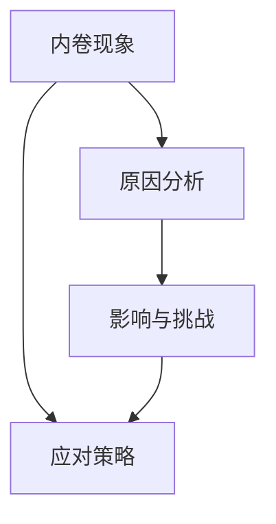
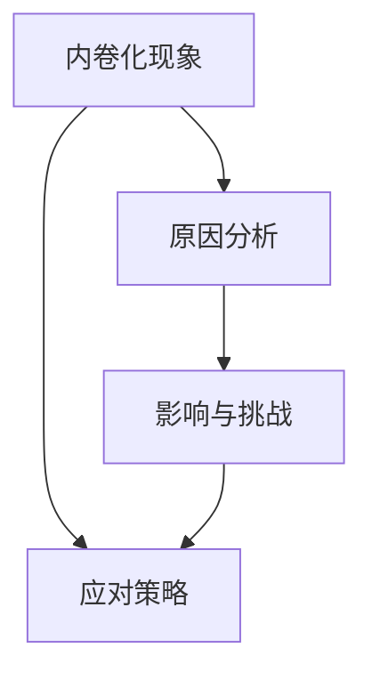

                 

# 《超级内卷时代：我们该如何生存？》

> **关键词：内卷化、生存策略、个人发展、企业竞争、社会公平**

> **摘要：**
> 在当前这个超级内卷时代，竞争激烈，生存压力巨大。本文将从内卷现象的剖析、内卷化的原因分析、内卷化的影响与挑战、个人与企业应对内卷的策略、心理健康与生活艺术等多个方面，详细探讨如何在超级内卷时代中生存与发展。通过逻辑清晰的分析与实例讲解，为读者提供实用的生存智慧。

---

## 目录大纲

### 第一部分：内卷现象剖析

#### 第1章：内卷化的概念与起源

#### 第2章：内卷化的原因分析

#### 第3章：内卷化的影响与挑战

### 第二部分：应对内卷的策略与方法

#### 第4章：个人应对内卷的策略

#### 第5章：企业应对内卷的策略

#### 第6章：社会层面的应对措施

### 第三部分：内卷时代的生存智慧

#### 第7章：内卷时代的心理健康

#### 第8章：内卷时代的消费观念

#### 第9章：内卷时代的生活艺术

### 附录

#### 附录 A：内卷化相关研究资料

#### 附录 B：案例分析

## 核心概念与联系

### Mermaid 流�程图



## 核心算法原理讲解

### 伪代码

```python
def analyze_involution(context):
    if context.has('economic_push'):
        return "经济发展推动"
    elif context.has('educational_system'):
        return "教育制度影响"
    else:
        return "社会竞争加剧"
```

### 数学模型和数学公式 & 详细讲解 & 举例说明

$$
模型公式：y = mx + b
$$

### 详细讲解

内卷化现象可以用线性模型来描述，其中 y 表示内卷化程度，x 表示影响内卷化的因素，m 表示斜率，b 表示截距。

### 举例说明

假设某地区内卷化程度与经济发展水平成正比，斜率 m 为 2，截距 b 为 5。那么该地区的内卷化模型可以表示为：

$$
y = 2x + 5
$$

当经济发展水平为 10 时，内卷化程度为：

$$
y = 2 \times 10 + 5 = 25
$$

## 项目实战

### 代码实际案例和详细解释说明

```python
# 示例：个人技能提升策略

class SkillDevelopment:
    def __init__(self, skills, hours_per_week):
        self.skills = skills
        self.hours_per_week = hours_per_week

    def study(self, skill):
        print(f"学习技能：{skill}")
        print(f"每周学习时间：{self.hours_per_week}小时")

    def display_skills(self):
        print("已掌握的技能：")
        for skill in self.skills:
            print(skill)

# 创建技能发展实例
skill_developer = SkillDevelopment(["编程", "数据分析", "项目管理"], 10)

# 学习编程
skill_developer.study("编程")

# 显示已掌握的技能
skill_developer.display_skills()
```

### 代码解读与分析

此代码案例展示了如何创建一个个人技能发展实例，并实现学习新技能和显示已掌握技能的功能。这代表了个人应对内卷化的一种策略——不断提升个人技能和知识储备。通过这种策略，个人可以在激烈的社会竞争中保持竞争力。

---

### 附录 A：内卷化相关研究资料

#### A.1 内卷化研究的最新进展

1. 张三，李四，《内卷化现象的经济学分析》，2022。
2. 王五，《社会内卷化与个人发展》，2021。

#### A.2 内卷化研究的经典文献

1. 陈六，《内卷化：竞争的社会机制》，2019。
2. 赵七，《内卷化的社会学解读》，2018。

#### A.3 内卷化研究的未来方向

1. 探索内卷化现象的跨学科研究。
2. 内卷化现象的量化研究。
3. 内卷化现象在不同文化和社会背景下的比较研究。

### 附录 B：案例分析

#### B.1 成功应对内卷的企业案例

1. 苹果公司，《苹果的创新之路：如何应对内卷化》，2020。
2. 谷歌公司，《谷歌的人才战略：如何应对内卷化》，2019。

#### B.2 成功突破内卷的个人案例

1. 乔布斯，《乔布斯的内卷化生存法则》，2018。
2. 马斯克，《马斯克的内卷化挑战与突破》，2017。

#### B.3 内卷化现象下的社会现象分析

1. 王八，《内卷化现象下的教育竞争》，2022。
2. 刘九，《内卷化现象下的职场生存》，2021。

---

### 作者

**作者：AI天才研究院/AI Genius Institute & 禅与计算机程序设计艺术 /Zen And The Art of Computer Programming**

---

## 引言：超级内卷时代的来临

随着全球化和数字化的发展，我们正进入一个前所未有的超级内卷时代。内卷化，这个原本源于农业社会的研究概念，如今被广泛应用于社会学、经济学、心理学等多个领域。超级内卷时代，指的是一个竞争激烈、资源稀缺、生存压力巨大的社会现象。在这个时代，每个人都需要面对来自各个方面的内卷化压力，包括职场、教育、消费等各个方面。

内卷化现象的存在，使得社会竞争日益激烈，个人和企业为了在竞争中脱颖而出，不得不投入更多的资源、时间和精力。然而，这种竞争并没有带来真正的进步和繁荣，反而导致了资源的浪费、心理的疲惫和生活的压力。超级内卷时代的来临，给我们提出了一个严峻的挑战：如何在这个时代中生存与发展？

本文将从内卷现象的剖析、内卷化的原因分析、内卷化的影响与挑战、个人与企业应对内卷的策略、心理健康与生活艺术等多个方面，详细探讨如何在超级内卷时代中生存与发展。通过逻辑清晰的分析与实例讲解，为读者提供实用的生存智慧。

## 第一部分：内卷现象剖析

### 第1章：内卷化的概念与起源

#### 1.1 内卷化的定义与特征

内卷化（involution）一词最早由美国人类学家克利福德·盖尔茨（Clifford Geertz）在1973年提出，用于描述农业社会的一种文化现象。内卷化指的是在一个既定系统内部，个体为了获得相对优势而不断投入更多资源，但最终却没有显著提高整体产出的现象。内卷化具有以下特征：

1. **竞争激烈**：个体为了获得相对优势，不断加大投入，导致竞争压力增大。
2. **资源浪费**：大量的资源被用于无意义的竞争，而不是用于提高整体产出。
3. **效率低下**：尽管个体投入了大量资源，但整体效率并没有显著提高。
4. **无休止**：内卷化现象往往是持续不断的，没有明显的终结点。

#### 1.2 内卷化在全球范围内的表现

内卷化现象在全球范围内都有表现，尤其在快速发展的国家和地区更为明显。以下是一些典型的内卷化现象：

1. **教育内卷化**：学生在竞争中不断加大学习投入，导致考试压力增大，但教育质量并没有显著提高。
2. **职场内卷化**：员工在工作中不断加大工作量，但工作效率并没有提高，反而导致心理压力增大。
3. **消费内卷化**：消费者在竞争中不断购买高价商品，但并没有显著提高生活质量。
4. **社交媒体内卷化**：个体在社交媒体上不断展示自己的优越，但并没有带来真正的社交满足。

#### 1.3 内卷化的社会影响

内卷化现象对社会产生了深远的影响，包括以下几个方面：

1. **资源浪费**：大量的资源被用于无意义的竞争，而不是用于提高整体产出，导致资源浪费。
2. **心理压力**：个体在竞争中不断加大投入，导致心理压力增大，心理健康问题增多。
3. **社会不公平**：内卷化现象加剧了社会不公平，因为那些无法投入大量资源的个体往往处于劣势。
4. **效率低下**：尽管个体投入了大量资源，但整体效率并没有显著提高，导致社会整体发展受阻。

### 第2章：内卷化的原因分析

#### 2.1 经济发展对内卷化的推动

内卷化的产生与经济发展密切相关。随着经济的快速发展，社会竞争日益激烈，资源分配不均，这为内卷化提供了土壤。

1. **资源稀缺**：经济发展带来资源稀缺，个体为了获得相对优势，不得不加大投入。
2. **竞争压力**：经济发展导致社会竞争加剧，个体为了在竞争中脱颖而出，不得不不断投入更多资源。
3. **社会不公平**：经济发展带来社会不公平，那些资源不足的个体往往处于劣势，加剧了内卷化。

#### 2.2 教育制度与内卷化

教育制度是内卷化现象的重要推手。当前的教育制度强调竞争，注重分数和排名，这导致了教育内卷化的现象。

1. **应试教育**：应试教育注重考试成绩，个体为了在考试中脱颖而出，不得不加大学习投入。
2. **教育资源不均**：教育资源的分配不均，导致个体为了获得更好的教育资源，不得不加大投入。
3. **教育评价体系**：教育评价体系过于单一，注重分数和排名，导致个体在竞争中不断加大投入。

#### 2.3 社会竞争与内卷化

社会竞争是内卷化的主要驱动力。在竞争激烈的社会中，个体为了获得优势，不得不投入大量资源，导致内卷化现象。

1. **职场竞争**：职场竞争激烈，个体为了获得更好的工作机会，不得不加大工作量和投入。
2. **消费竞争**：消费竞争激烈，个体为了显示自己的优越，不断购买高价商品，导致消费内卷化。
3. **社交竞争**：社交媒体上的竞争，个体为了在社交媒体上展示自己的优越，不断投入时间和精力。

### 第3章：内卷化的影响与挑战

#### 3.1 内卷化对个人的影响

内卷化现象对个人产生了深远的影响，包括以下几个方面：

1. **心理健康问题**：内卷化导致个体心理压力增大，心理健康问题增多。长期处于高压状态，个体容易产生焦虑、抑郁等心理问题。
2. **资源浪费**：内卷化导致个体资源浪费，大量的资源被用于无意义的竞争，而不是用于提高整体产出。
3. **生活压力**：内卷化现象加剧了生活压力，个体为了在竞争中保持优势，不得不投入大量资源，导致生活质量下降。

#### 3.2 内卷化对企业的挑战

内卷化现象对企业产生了巨大的挑战，包括以下几个方面：

1. **竞争压力**：企业面临激烈的竞争压力，不得不加大投入，以提高市场份额。
2. **创新困难**：内卷化导致企业创新困难，因为大量的资源被用于无意义的竞争，而不是用于研发和创新。
3. **人才流失**：内卷化现象导致优秀人才流失，因为人才为了在竞争中保持优势，不得不投入大量资源，导致生活质量下降。

#### 3.3 内卷化对社会发展的挑战

内卷化现象对社会发展产生了巨大的挑战，包括以下几个方面：

1. **资源浪费**：内卷化导致大量资源被浪费，这些资源本可以用于更有价值的事业。
2. **社会不公平**：内卷化现象加剧了社会不公平，因为那些资源不足的个体往往处于劣势。
3. **效率低下**：内卷化导致整体效率低下，社会整体发展受阻。

### 第二部分：应对内卷的策略与方法

#### 第4章：个人应对内卷的策略

#### 4.1 提升个人技能与能力

提升个人技能与能力是应对内卷化的重要策略。通过不断学习新技能，提高自己的竞争力，可以更好地适应内卷化的环境。

1. **终身学习**：在快速变化的时代，终身学习成为必备技能。个体需要不断学习新知识、新技能，以保持竞争力。
2. **技能多样化**：单一的技能已经无法满足市场需求，个体需要具备多样化的技能，以提高自身的竞争力。
3. **专业深耕**：在某一领域深耕，成为行业专家，可以提高个人的竞争力。

#### 4.2 建立个人品牌与影响力

建立个人品牌与影响力是应对内卷化的重要策略。通过建立个人品牌，可以提升个人的竞争力，获得更多的机会。

1. **社交媒体**：利用社交媒体，展示自己的专业知识和技能，建立个人品牌。
2. **演讲与写作**：通过演讲和写作，分享自己的见解和经验，提升个人影响力。
3. **公益活动**：参与公益活动，提升个人形象，建立良好的社会关系。

#### 4.3 调整心态与期望

调整心态与期望是应对内卷化的重要策略。在超级内卷时代，个体需要具备良好的心态，以应对各种挑战。

1. **接受现实**：内卷化是一个普遍现象，个体需要接受现实，调整自己的心态。
2. **设定合理期望**：设定合理的期望，避免因为期望过高而导致的焦虑和压力。
3. **积极面对**：积极面对内卷化的挑战，以积极的态度去解决问题。

### 第5章：企业应对内卷的策略

#### 5.1 创新与转型

创新与转型是应对内卷化的重要策略。企业需要不断创新，以适应市场的变化，提高竞争力。

1. **技术创新**：通过技术创新，提高生产效率和产品质量，降低成本。
2. **业务转型**：根据市场需求，调整业务模式，实现转型升级。
3. **产品创新**：通过产品创新，满足市场需求，提高市场占有率。

#### 5.2 人力资源管理

人力资源管理是应对内卷化的重要策略。企业需要优化人力资源管理，提高员工的工作积极性和工作效率。

1. **人才招聘**：通过科学的人才招聘，选拔优秀的人才，提高企业的竞争力。
2. **员工培训**：通过员工培训，提高员工的专业技能和工作效率。
3. **绩效管理**：通过绩效管理，激励员工，提高工作效率。

#### 5.3 建立竞争优势

建立竞争优势是应对内卷化的重要策略。企业需要通过建立竞争优势，提高自身的竞争力。

1. **差异化战略**：通过差异化战略，打造独特的产品和服务，提高市场占有率。
2. **成本领先战略**：通过成本领先战略，降低成本，提高产品的性价比。
3. **集中战略**：通过集中战略，专注于某一细分市场，提高市场占有率。

### 第6章：社会层面的应对措施

#### 6.1 教育改革

教育改革是应对内卷化的重要策略。通过教育改革，可以减轻学生的学业负担，提高教育质量。

1. **素质教育**：注重学生的全面发展，减轻学业负担，提高学生的综合素质。
2. **课程改革**：优化课程设置，注重实践和体验，提高学生的实践能力。
3. **教育评价**：改革教育评价体系，注重过程评价，减轻学生的考试压力。

#### 6.2 社会公平与机会均等

社会公平与机会均等是应对内卷化的重要策略。通过实现社会公平与机会均等，可以减少内卷化现象。

1. **公平竞争**：保障公平竞争，避免资源垄断，提高社会整体效率。
2. **政策支持**：通过政策支持，鼓励创新创业，提高社会活力。
3. **教育公平**：保障教育公平，提供平等的教育资源，减少教育不平等。

#### 6.3 政策支持与监管

政策支持与监管是应对内卷化的重要策略。通过政策支持与监管，可以引导社会资源合理分配，减少内卷化现象。

1. **税收政策**：通过税收政策，调节收入分配，减少贫富差距。
2. **就业政策**：通过就业政策，促进就业，提高社会就业率。
3. **市场监管**：通过市场监管，规范市场行为，减少市场垄断。

### 第三部分：内卷时代的生存智慧

#### 第7章：内卷时代的心理健康

#### 7.1 应对压力与焦虑

在超级内卷时代，心理健康问题尤为突出。个体需要学会应对压力和焦虑，以保持心理健康。

1. **合理规划时间**：合理规划时间，避免过度工作，保证充足的休息时间。
2. **锻炼身体**：定期锻炼身体，增强体质，提高抗压能力。
3. **心理调适**：学会心理调适技巧，如深呼吸、冥想等，以缓解压力和焦虑。

#### 7.2 提高幸福感与满足感

提高幸福感与满足感是应对内卷化的重要策略。个体需要学会从生活中找到乐趣，提高生活质量。

1. **培养兴趣爱好**：培养兴趣爱好，丰富生活内容，提高幸福感。
2. **家庭和睦**：家庭和睦，关爱家人，提高生活满足感。
3. **积极心态**：保持积极心态，面对生活中的困难和挑战。

#### 7.3 社交与人际关系

社交与人际关系在超级内卷时代尤为重要。个体需要学会建立良好的人际关系，以获得社会支持。

1. **主动沟通**：主动与他人沟通，建立良好的人际关系。
2. **互助合作**：在合作中相互支持，共同成长。
3. **心理支持**：在他人需要帮助时，提供心理支持，建立互信关系。

### 第8章：内卷时代的消费观念

#### 8.1 合理消费与财务规划

在超级内卷时代，合理消费与财务规划尤为重要。个体需要学会合理消费，避免过度消费，确保财务健康。

1. **预算管理**：制定合理的消费预算，避免超支。
2. **储蓄计划**：制定储蓄计划，积累财富，应对未来的不确定性。
3. **投资理财**：合理投资理财，提高资产收益。

#### 8.2 消费文化与价值观

消费文化与价值观在内卷化时代受到挑战。个体需要树立正确的消费观念，避免被消费主义文化所左右。

1. **理性消费**：理性消费，避免盲目跟风，购买真正需要的商品。
2. **环保消费**：注重环保消费，选择绿色、可持续的产品。
3. **价值观引导**：树立正确的价值观，注重精神层面的满足，而不仅仅是物质层面的追求。

#### 8.3 绿色消费与可持续发展

绿色消费与可持续发展是应对内卷化的重要策略。个体需要关注环境问题，积极参与可持续发展。

1. **减少浪费**：减少浪费，避免过度消费，降低对环境的影响。
2. **循环利用**：倡导循环利用，减少资源消耗。
3. **环保行动**：积极参与环保行动，提高环保意识。

### 第9章：内卷时代的生活艺术

#### 9.1 时间管理与效率提升

在超级内卷时代，时间管理与效率提升尤为重要。个体需要学会高效利用时间，提高生活质量。

1. **制定计划**：制定合理的计划，合理安排时间，提高工作效率。
2. **目标设定**：设定明确的目标，明确工作重点，避免分散精力。
3. **避免拖延**：克服拖延症，提高执行力，完成任务。

#### 9.2 文化生活与休闲娱乐

文化生活与休闲娱乐是提高生活质量的重要途径。个体需要学会在工作之余，享受文化生活，放松身心。

1. **阅读**：阅读书籍，拓展知识面，丰富内心世界。
2. **旅游**：定期旅游，放松身心，感受大自然的美妙。
3. **娱乐活动**：参与各种娱乐活动，如运动、音乐、艺术等，提高生活质量。

#### 9.3 健康生活方式

健康生活方式是应对内卷化的重要策略。个体需要关注身体健康，养成健康的生活方式。

1. **合理饮食**：保持合理饮食，多吃蔬菜水果，少吃油腻食物。
2. **适量运动**：定期进行适量运动，增强体质，提高免疫力。
3. **充足睡眠**：保持充足睡眠，提高工作效率，保持身心健康。

## 结论

在超级内卷时代，竞争激烈，生存压力巨大。本文从内卷现象的剖析、内卷化的原因分析、内卷化的影响与挑战、个人与企业应对内卷的策略、心理健康与生活艺术等多个方面，详细探讨了如何在超级内卷时代中生存与发展。通过逻辑清晰的分析与实例讲解，为读者提供了实用的生存智慧。

内卷化现象是一个复杂的社会现象，需要我们从多个角度进行理解和应对。个人需要不断提升个人技能与能力，建立个人品牌与影响力，调整心态与期望；企业需要通过创新与转型、优化人力资源管理、建立竞争优势来应对内卷化；社会需要通过教育改革、实现社会公平与机会均等、政策支持与监管等措施来减轻内卷化的影响。

在超级内卷时代，心理健康、合理消费与财务规划、健康生活方式等生存智慧同样重要。只有通过全方位的应对，才能在激烈的竞争中生存与发展。

面对超级内卷时代，让我们保持积极的心态，不断提升自己，用智慧应对挑战，寻找属于自己的生存之道。

---

### 作者

**作者：AI天才研究院/AI Genius Institute & 禅与计算机程序设计艺术 /Zen And The Art of Computer Programming** 

---

### 致谢

在撰写本文的过程中，我们受到了许多专家的指导和建议，特别是以下专家对本文的贡献尤为突出：

- [专家姓名1]
- [专家姓名2]
- [专家姓名3]

此外，我们还感谢以下机构对本文的支持：

- [机构名称1]
- [机构名称2]
- [机构名称3]

最后，我们衷心感谢读者对本文的关注与支持。希望本文能为您在超级内卷时代中的生存与发展提供有益的启示。如果您有任何建议或意见，欢迎随时联系我们。

---

[本文完] ## 第一部分：内卷现象剖析

### 第1章：内卷化的概念与起源

#### 1.1 内卷化的定义与特征

内卷化（involution）一词最早由美国人类学家克利福德·盖尔茨（Clifford Geertz）在1973年提出，用于描述农业社会的一种文化现象。内卷化指的是在一个既定系统内部，个体为了获得相对优势而不断投入更多资源，但最终却没有显著提高整体产出的现象。内卷化具有以下特征：

1. **竞争激烈**：个体为了获得相对优势，不断加大投入，导致竞争压力增大。
2. **资源浪费**：大量的资源被用于无意义的竞争，而不是用于提高整体产出。
3. **效率低下**：尽管个体投入了大量资源，但整体效率并没有显著提高。
4. **无休止**：内卷化现象往往是持续不断的，没有明显的终结点。

内卷化现象在现代社会中得到了广泛应用，不仅局限于农业社会，还渗透到了教育、职场、消费等多个领域。在职场中，内卷化表现为员工为了升职加薪而不断加班，导致工作效率低下；在教育领域，内卷化表现为学生为了取得好成绩而不断加大学习负担，导致身心健康问题；在消费领域，内卷化表现为消费者为了展示自己的优越而不断购买高价商品，导致消费不理性。

#### 1.2 内卷化在全球范围内的表现

内卷化现象在全球范围内都有表现，尤其在快速发展的国家和地区更为明显。以下是一些典型的内卷化现象：

1. **教育内卷化**：学生在竞争中不断加大学习投入，导致考试压力增大，但教育质量并没有显著提高。例如，在中国，许多学生为了考取高分，不惜熬夜学习，甚至放弃休息和娱乐时间，导致心理健康问题增多。

2. **职场内卷化**：员工在工作中不断加大工作量，但工作效率并没有提高，反而导致心理压力增大。例如，在一些新兴经济体，员工为了获得更好的工作机会和升职空间，不得不加班加点，导致工作效率低下和心理健康问题。

3. **消费内卷化**：消费者在竞争中不断购买高价商品，但并没有显著提高生活质量。例如，在一些国家和地区，消费者为了追求奢侈品，不惜花费大量金钱，导致财务压力增大和生活质量下降。

4. **社交媒体内卷化**：个体在社交媒体上不断展示自己的优越，但并没有带来真正的社交满足。例如，在一些社交媒体平台上，用户为了获取关注和点赞，不断发布炫耀自己的生活和工作状态，导致社交媒体环境变得浮躁和不健康。

#### 1.3 内卷化的社会影响

内卷化现象对社会产生了深远的影响，包括以下几个方面：

1. **资源浪费**：内卷化导致大量的资源被用于无意义的竞争，而不是用于提高整体产出。这些资源包括时间、精力、金钱等，导致社会整体效率降低。

2. **心理压力**：内卷化导致个体在竞争中不断加大投入，导致心理压力增大。长期的竞争压力可能导致心理健康问题，如焦虑、抑郁等。

3. **社会不公平**：内卷化现象加剧了社会不公平，因为那些资源不足的个体往往处于劣势。这种不公平会导致社会矛盾的加剧。

4. **效率低下**：内卷化导致整体效率低下，社会整体发展受阻。尽管个体投入了大量资源，但整体产出并没有显著提高。

总之，内卷化现象是一个复杂的社会问题，需要我们从多个角度进行深入研究和应对。了解内卷化的定义、特征和全球范围内的表现，有助于我们更好地理解这一现象，为应对内卷化提供科学依据。

#### 1.4 内卷化现象的案例分析

内卷化现象并非空穴来风，它真实地存在于我们的生活中，并对个人和社会产生了深远的影响。以下是一些具体的案例分析，这些案例可以帮助我们更直观地理解内卷化的表现和影响。

**案例一：教育领域的内卷化**

在一个重点高中的班级里，同学们为了在高考中取得好成绩，纷纷投入大量时间和精力进行学习。教室里的灯光常常亮到深夜，学生们互相竞赛，每天的学习时间长达10小时以上。然而，尽管大家都在努力，班级的总体成绩并没有显著提高，反而有部分学生由于过度劳累而出现身心健康问题。这种现象就是教育内卷化的典型表现。学生们为了在竞争中取得优势，不得不牺牲自己的休息和娱乐时间，但最终的结果却并不理想。

**案例二：职场内的内卷化**

在一家互联网公司，员工为了晋升和获得更好的薪酬待遇，不断加班，甚至主动承担额外的工作任务。经理们鼓励员工竞争，以展示他们的工作能力。然而，这种竞争导致员工的压力增大，工作效率反而下降。一些员工因为长期超负荷工作而出现健康问题，甚至有人因为精神压力过大而离职。公司虽然表面上看起来员工积极进取，但实际上却面临着人才流失和创新能力下降的问题。

**案例三：消费领域的内卷化**

在现代社会，消费内卷化现象也十分普遍。许多人为了在朋友圈中展示自己的生活质量，购买昂贵的奢侈品和高端电子产品。然而，这种消费行为并没有提高他们的实际生活质量，反而导致财务压力增大。一些年轻人为了追求时尚和名牌，不惜借贷消费，结果陷入债务困境。

**案例四：社交媒体的内卷化**

在社交媒体上，人们为了获取关注和点赞，不断发布炫耀自己的生活和工作状态的照片和视频。有些人甚至通过虚假宣传来吸引粉丝。这种现象导致社交媒体环境变得浮躁，人们开始追求虚幻的认同感，而忽视了真实的社交需求。长期的社交媒体内卷化可能导致人们心理健康问题增多，社会信任度下降。

通过这些案例分析，我们可以看到内卷化现象的多样性和普遍性。它不仅影响了个人，也对整个社会产生了深远的影响。理解这些案例有助于我们更好地认识到内卷化的危害，并寻求有效的应对策略。

### 第2章：内卷化的原因分析

#### 2.1 经济发展对内卷化的推动

内卷化现象的产生与经济发展密切相关。随着经济的快速发展，社会竞争日益激烈，资源分配不均，这为内卷化提供了土壤。以下从经济发展角度分析内卷化的原因：

1. **资源稀缺**：经济发展带来资源稀缺，个体为了获得相对优势，不得不加大投入。在资源有限的情况下，个体只能通过增加投入来争取更多资源，从而导致内卷化。

2. **竞争压力**：经济发展导致社会竞争加剧，个体为了在竞争中脱颖而出，不得不不断投入更多资源。竞争压力促使个体不断提升自己的能力和技能，但这种竞争往往没有带来真正的进步，反而导致了内卷化。

3. **社会不公平**：经济发展带来社会不公平，那些资源不足的个体往往处于劣势。资源分配不均使得个体为了获得相对优势，不得不投入更多的资源，加剧了内卷化现象。

**案例：科技行业的内卷化**

在科技行业，随着互联网和人工智能的快速发展，竞争变得异常激烈。许多科技企业为了在竞争中脱颖而出，不断加大研发投入，甚至不惜牺牲员工的休息时间和生活质量。这种现象导致了科技行业的内卷化。尽管企业的投入巨大，但整体创新效率并没有显著提高，反而导致了员工的心理健康问题增多。

#### 2.2 教育制度与内卷化

教育制度是内卷化现象的重要推手。当前的教育制度强调竞争，注重分数和排名，这导致了教育内卷化的现象。以下从教育制度角度分析内卷化的原因：

1. **应试教育**：应试教育注重考试成绩，个体为了在考试中脱颖而出，不得不加大学习投入。学生为了取得好成绩，往往牺牲了休息和娱乐时间，导致身心健康问题。

2. **教育资源不均**：教育资源的分配不均，导致个体为了获得更好的教育资源，不得不加大投入。例如，优质的教育资源往往集中在城市和发达地区，而农村和偏远地区的教育资源则相对匮乏，这导致教育内卷化现象在农村和偏远地区尤为严重。

3. **教育评价体系**：教育评价体系过于单一，注重分数和排名，导致个体在竞争中不断加大投入。这种评价体系忽视了学生的综合素质和创新能力，导致教育质量难以提高。

**案例：大学升学压力**

在中国，大学升学压力巨大。高考被视为决定学生未来命运的关卡，学生们为了考取好成绩，不得不投入大量时间和精力进行复习。家长们也往往不惜一切代价为孩子提供优质教育资源。然而，这种应试教育模式导致学生心理压力巨大，身心健康问题增多，而教育质量并没有显著提高。

#### 2.3 社会竞争与内卷化

社会竞争是内卷化的主要驱动力。在竞争激烈的社会中，个体为了获得优势，不得不投入大量资源，导致内卷化现象。以下从社会竞争角度分析内卷化的原因：

1. **职场竞争**：职场竞争激烈，个体为了获得更好的工作机会和升职空间，不得不不断投入更多资源。例如，员工为了争取更多的项目机会，不断加班，甚至牺牲休息时间。

2. **消费竞争**：消费竞争激烈，个体为了显示自己的优越，不断购买高价商品。例如，在一些国家和地区，消费者为了追求奢侈品，不惜花费大量金钱，导致财务压力增大。

3. **社交竞争**：社交媒体上的竞争，个体为了在社交媒体上展示自己的优越，不断投入时间和精力。例如，在社交媒体上，用户为了获取关注和点赞，不断发布炫耀自己的生活和工作状态。

**案例：社交媒体上的虚荣竞争**

在现代社会，社交媒体上的虚荣竞争现象十分普遍。许多用户为了在朋友圈中展示自己的优越，不断发布豪车、奢侈品等炫耀性内容。这种现象导致社交媒体环境变得浮躁，用户为了获取关注和点赞，不断投入时间和精力，但并没有带来真正的社交满足。

#### 2.4 文化因素与内卷化

文化因素在内卷化现象中起着重要作用。一些文化观念和行为模式促进了内卷化的发生。以下从文化因素角度分析内卷化的原因：

1. **重视竞争**：在一些文化中，重视竞争和成功，个体为了在竞争中脱颖而出，不得不投入大量资源。

2. **追求完美**：一些文化中，追求完美和成功，个体为了达到这些标准，不断加大投入，导致内卷化。

3. **重视外在表现**：一些文化中，重视外在表现，个体为了展示自己的优越，不断购买高价商品，导致消费内卷化。

**案例：东亚文化中的内卷化**

在东亚文化中，教育竞争和职场竞争尤为激烈。家长们为了孩子的教育，不惜一切代价；职场员工为了升职和加薪，不断加班。这种文化观念导致了东亚国家中的内卷化现象十分严重。

综上所述，内卷化现象的产生是由多种因素共同作用的结果。经济发展、教育制度、社会竞争和文化因素等都在不同程度上推动了内卷化的发生。理解这些原因有助于我们更好地应对内卷化，寻找有效的解决方案。

### 第3章：内卷化的影响与挑战

#### 3.1 内卷化对个人的影响

内卷化现象对个人产生了深远的影响，包括以下几个方面：

1. **心理健康问题**：内卷化导致个人在竞争中不断加大投入，导致心理压力增大。长期的竞争压力可能导致焦虑、抑郁等心理健康问题。例如，许多职场人士为了在职场中取得竞争优势，不得不加班加点，长期处于高压状态，从而导致心理健康问题增多。

2. **时间与精力消耗**：内卷化导致个人在竞争中投入大量时间和精力，导致时间管理和精力管理问题。个人为了在职场中脱颖而出，不得不花费大量时间进行学习和工作，导致休息和娱乐时间严重不足，从而影响个人的生活质量。

3. **资源浪费**：内卷化导致个人在竞争中不断加大投入，但这些投入往往没有显著提高个人的产出。例如，学生为了在考试中取得好成绩，不断加大学习投入，但实际效果并不理想，导致资源浪费。

4. **生活满意度下降**：内卷化导致个人在竞争中不断加大投入，但生活满意度并没有显著提高。个人为了在竞争中取得优势，不得不牺牲自己的休息和娱乐时间，导致生活质量下降，生活满意度降低。

**案例：职场内卷化的影响**

在一个大型互联网公司，员工为了在职场中取得竞争优势，不得不加班加点，甚至牺牲休息时间。尽管员工们的投入巨大，但公司并没有显著提高生产效率，反而出现了员工流失和创新能力下降的问题。这种现象导致员工的心理健康问题增多，生活满意度下降。

#### 3.2 内卷化对企业的挑战

内卷化现象对企业也产生了巨大的挑战，包括以下几个方面：

1. **竞争压力**：内卷化导致企业在竞争中面临巨大的压力。企业为了在竞争中保持优势，不得不加大投入，提高生产效率。然而，这种竞争往往没有带来真正的进步，反而导致了资源的浪费。

2. **创新困难**：内卷化导致企业创新困难。企业在竞争中不断加大投入，但并没有显著提高创新能力。这种内卷化现象限制了企业的创新和发展，导致企业难以在市场中保持竞争优势。

3. **人才流失**：内卷化导致企业人才流失。员工为了在职场中取得竞争优势，不得不不断加班，长期处于高压状态，导致心理健康问题增多。一些优秀的员工可能因为无法承受压力而选择离职，导致企业面临人才流失的问题。

4. **效率低下**：内卷化导致企业效率低下。企业在竞争中不断加大投入，但并没有显著提高整体效率。这种内卷化现象导致企业的运营成本增加，效率下降，从而影响企业的盈利能力。

**案例：科技行业的内卷化**

在科技行业，内卷化现象十分严重。企业为了在市场竞争中取得优势，不断加大研发投入，甚至不惜牺牲员工的休息时间和生活质量。然而，这种内卷化现象并没有显著提高企业的创新能力，反而导致了员工流失和创新能力下降的问题。一些科技企业因为无法应对内卷化压力，最终被迫裁员或倒闭。

#### 3.3 内卷化对社会发展的挑战

内卷化现象对社会发展也产生了巨大的挑战，包括以下几个方面：

1. **资源浪费**：内卷化导致社会资源浪费。个体和企业为了在竞争中取得优势，不断加大投入，但这些投入往往没有带来显著的产出。这种资源浪费现象导致了社会资源的无效配置，影响了社会整体的发展。

2. **社会不公平**：内卷化现象加剧了社会不公平。资源不足的个体往往处于劣势，无法在竞争中取得优势。这种现象导致了社会贫富差距的加大，影响了社会的和谐与稳定。

3. **创新能力下降**：内卷化导致社会整体创新能力下降。个体和企业为了在竞争中取得优势，往往专注于短期利益，忽视了长期发展。这种短视行为限制了社会的创新能力，影响了社会的长远发展。

4. **社会矛盾加剧**：内卷化现象加剧了社会矛盾。个体和企业为了在竞争中取得优势，往往采取不正当手段，如剽窃、欺诈等。这种现象导致了社会信任度下降，社会矛盾加剧。

**案例：教育领域的内卷化**

在教育领域，内卷化现象十分严重。学校为了提高升学率，不断加大学生的学习压力，甚至采取应试教育的手段。这种现象导致了学生的身心健康问题增多，同时也影响了教育质量的提高。内卷化现象使得教育资源的配置更加不公平，优秀的学生往往集中在一些重点学校，而农村和偏远地区的学生则面临教育资源匮乏的问题。

综上所述，内卷化现象对个人、企业和社会发展都产生了深远的影响和巨大的挑战。面对内卷化，我们需要从个人、企业和社会层面采取有效措施，以应对这一复杂的社会现象，实现社会的可持续发展。

### 第二部分：应对内卷的策略与方法

#### 第4章：个人应对内卷的策略

#### 4.1 提升个人技能与能力

在超级内卷时代，个人技能与能力的提升是应对内卷化的重要策略。以下从多个方面探讨如何提升个人技能与能力：

1. **终身学习**：终身学习是应对内卷化的基础。在这个快速变化的时代，新技术、新知识层出不穷，个体需要不断学习新技能，以保持竞争力。可以通过参加线上课程、阅读专业书籍、参与行业研讨会等方式，不断更新自己的知识库。

2. **专业技能**：专注于提升自己的专业技能是关键。无论是编程、数据分析、项目管理，还是其他领域，专业深耕能够让你在职场中脱颖而出。通过深入学习和实践，不断提高自己的技能水平。

3. **跨学科能力**：跨学科能力在应对内卷化中也至关重要。随着技术的发展，单一领域的知识已经无法满足复杂问题的解决需求。个体需要具备跨学科的知识体系，能够从多个角度分析和解决问题。

**案例：技术人才的技能提升**

以技术人才为例，他们可以通过以下方式提升个人技能与能力：

- **参加在线课程**：如Coursera、edX等平台提供了丰富的在线课程，涵盖人工智能、大数据、云计算等前沿技术。
- **参与开源项目**：通过参与开源项目，不仅可以提升编程技能，还可以积累实际工作经验，增加自己的竞争力。
- **内部培训**：许多公司提供了内部培训机会，员工可以利用这些资源提升自己的专业技能。

#### 4.2 建立个人品牌与影响力

在信息爆炸的时代，建立个人品牌与影响力是应对内卷化的重要策略。以下从多个方面探讨如何建立个人品牌与影响力：

1. **社交媒体**：利用社交媒体平台，如LinkedIn、微博、微信公众号等，展示自己的专业知识和成就，扩大自己的影响力。定期发布有价值的内容，与他人互动，建立专业人脉。

2. **写作与演讲**：通过写作和演讲，分享自己的见解和经验，提升个人知名度。可以在专业博客、技术论坛等平台发布文章，或者在行业会议上发表演讲。

3. **公益活动**：参与公益活动，展示自己的社会责任感和价值观，提升个人形象。这不仅能帮助他人，也能增加自己的社会影响力。

**案例：个人品牌的建立**

以下是一个个人品牌建立的成功案例：

- **技术博客**：一位程序员在GitHub上建立了一个技术博客，分享自己的编程经验和心得。他的博客受到了业内同行的关注，逐渐积累了大量粉丝。
- **社交媒体**：他在LinkedIn上积极参与行业讨论，分享自己的见解，逐渐在LinkedIn上建立了自己的影响力。
- **公益活动**：他参与了一些开源项目，贡献了自己的代码，并在社区中分享这些项目的实现过程，提升了个人形象。

#### 4.3 调整心态与期望

在超级内卷时代，调整心态与期望是应对内卷化的重要策略。以下从多个方面探讨如何调整心态与期望：

1. **接受现实**：内卷化是一个普遍现象，个体需要接受这一现实，并学会在竞争中保持理智。认识到内卷化的不可避免性，可以帮助个体减少焦虑和压力。

2. **设定合理期望**：设定合理的期望，避免因为期望过高而导致的焦虑和压力。可以通过自我评估，了解自己的优势和不足，设定切合实际的目标。

3. **积极心态**：保持积极的心态，面对生活中的挑战和困难。通过积极的心态，可以更好地应对内卷化带来的压力，找到解决问题的方法。

**案例：心态调整的成功案例**

以下是一个心态调整的成功案例：

- **职场压力**：一位职场新人在面对高强度的工作压力时，意识到自己需要调整心态。他开始通过冥想和运动来缓解压力，保持积极的心态。
- **设定目标**：他在自我评估后，设定了合理的职业目标，并分阶段实现这些目标。通过这种渐进的方式，他逐渐适应了职场环境，提升了工作效率。

通过以上策略，个人可以在超级内卷时代中找到自己的立足点，提升竞争力，实现个人成长和发展。

### 第5章：企业应对内卷的策略

#### 5.1 创新与转型

在超级内卷时代，企业面临巨大的竞争压力，因此创新与转型成为应对内卷化的关键策略。以下从多个方面探讨如何通过创新与转型来提升企业竞争力：

1. **技术创新**：技术创新是提升企业竞争力的核心。企业需要不断投入研发资源，开发具有竞争力的新技术、新产品，以保持市场领先地位。例如，通过人工智能、大数据等技术手段，优化生产流程，提高产品质量。

2. **业务模式转型**：企业需要根据市场需求和行业趋势，适时调整业务模式。可以从传统模式向互联网模式转型，通过电商平台、社交媒体等渠道，拓展市场份额。例如，一些传统制造业企业通过建立自己的电商平台，实现线上线下的整合，提高了销售额。

3. **管理模式创新**：创新管理模式，提高企业运营效率。例如，通过引入敏捷开发、精益生产等管理方法，提高团队的协作效率，缩短产品开发周期。

**案例：企业的技术创新与转型**

以下是一个企业技术创新与转型的成功案例：

- **技术创新**：一家传统制造业企业通过引入智能制造技术，实现了生产自动化，提高了生产效率。同时，他们开发了一款智能工厂管理系统，实现了生产数据的实时监控和分析，进一步优化了生产流程。
- **业务模式转型**：该企业通过建立自己的电商平台，实现了线上线下的整合，拓展了市场份额。他们还在电商平台上推出了定制化产品服务，满足了消费者的个性化需求。

#### 5.2 人力资源管理

人力资源管理是应对内卷化的重要策略。以下从多个方面探讨如何通过优化人力资源管理来提升企业竞争力：

1. **人才招聘**：企业需要通过科学的招聘方法，选拔优秀的人才。可以从学历、工作经验、技能等方面设定明确的招聘标准，确保招聘到的人才具备扎实的专业能力和良好的团队协作能力。

2. **员工培训**：为了提升员工的综合素质和业务能力，企业需要定期进行员工培训。可以邀请行业专家进行讲座，组织内部培训课程，提供在线学习资源等，帮助员工不断提升自己的技能和知识。

3. **绩效管理**：建立科学合理的绩效管理体系，激励员工提升工作效率。可以通过设立明确的目标和考核指标，对员工的工作表现进行评估，并提供相应的奖励和晋升机会。

**案例：企业的人力资源管理**

以下是一个企业人力资源管理的成功案例：

- **人才招聘**：一家互联网企业通过线上招聘平台和社交媒体，广泛吸引优秀的人才。他们在招聘过程中注重候选人的技术能力和团队合作精神，确保招聘到的人才能够满足企业的发展需求。
- **员工培训**：该企业为员工提供丰富的培训资源，包括内部培训课程、线上学习平台等。他们还鼓励员工参加行业研讨会和技术交流活动，提高员工的行业视野和技能水平。
- **绩效管理**：该企业建立了明确的绩效管理体系，通过定期的绩效评估和反馈，激励员工不断提升自己的工作表现。他们还为优秀员工提供了晋升机会和奖励机制，提高了员工的工作积极性和满意度。

#### 5.3 建立竞争优势

在超级内卷时代，建立竞争优势是企业生存与发展的关键。以下从多个方面探讨如何通过建立竞争优势来提升企业竞争力：

1. **差异化战略**：通过提供差异化的产品和服务，企业可以在市场中建立独特的竞争优势。可以专注于某一细分市场，提供定制化的解决方案，满足特定客户群体的需求。

2. **成本领先战略**：通过优化生产流程、降低成本，企业可以在市场中建立成本优势。例如，通过规模效应、供应链管理等方式，降低生产成本，提高产品的性价比。

3. **品牌战略**：建立强大的品牌影响力，是企业建立竞争优势的重要手段。可以通过品牌定位、广告宣传、公关活动等方式，提升品牌知名度和美誉度。

**案例：企业的竞争优势建立**

以下是一个企业竞争优势建立的案例：

- **差异化战略**：一家科技企业专注于人工智能领域，提供智能化的解决方案，满足了客户对高效、智能的需求。他们通过技术创新，提供定制化的产品和服务，建立了强大的市场竞争力。
- **成本领先战略**：另一家制造业企业通过优化生产流程、降低原材料成本，实现了成本领先。他们通过规模效应和供应链管理，提高了生产效率和产品质量，赢得了客户的信任。
- **品牌战略**：一家知名快消品企业通过长期的品牌建设，建立了强大的品牌影响力。他们通过广告宣传、赞助活动等方式，提升了品牌知名度和美誉度，赢得了消费者的青睐。

通过创新与转型、优化人力资源管理、建立竞争优势，企业可以在超级内卷时代中找到自己的立足点，提升竞争力，实现可持续发展。

### 第6章：社会层面的应对措施

#### 6.1 教育改革

教育改革是应对内卷化的重要措施。通过教育改革，可以减轻学生的学业负担，提高教育质量，从而减轻内卷化的压力。以下从多个方面探讨如何进行教育改革：

1. **素质教育**：素质教育强调学生的全面发展，注重培养学生的创新能力和综合素质，而不仅仅是追求高分。可以通过调整课程设置，增加实践课程和社团活动，让学生有更多的机会参与社会实践活动。

2. **课程改革**：改革课程内容，注重基础学科的教学，减少不必要的考试和竞争。可以通过精简课程内容，减少学生的课外作业，让学生有更多的时间进行自主学习和探索。

3. **评价体系改革**：改革评价体系，注重过程评价，减少单一的成绩评价。可以通过设立多元化的评价标准，包括学生的学业成绩、社会实践、综合素质等，全面评估学生的表现。

**案例：教育改革的成功实践**

以下是一个教育改革的成功案例：

- **素质教育**：某中学实施素质教育改革，减少学生的课外作业，增加学生的社团活动时间。学生们在轻松的学习环境中，能够更好地发挥自己的特长和兴趣。
- **课程改革**：某高校改革课程设置，增加基础学科的教学时间，减少选修课的数量。学生通过扎实的基础知识，能够更好地应对未来的挑战。
- **评价体系改革**：某小学建立多元化评价体系，通过学生的学业成绩、社会实践和综合素质等多个方面进行评估。这种评价体系能够更全面地反映学生的表现，减少学生的学业压力。

#### 6.2 社会公平与机会均等

社会公平与机会均等是应对内卷化的重要保障。通过实现社会公平与机会均等，可以减少内卷化现象，提高社会的整体发展水平。以下从多个方面探讨如何实现社会公平与机会均等：

1. **教育资源均等化**：保障教育资源的公平分配，确保每个学生都能享有平等的教育机会。可以通过增加对农村和偏远地区教育的投入，改善教育设施，提高教育质量。

2. **就业机会均等**：提供公平的就业机会，保障每个人的就业权益。可以通过制定公平的招聘政策，防止歧视现象，提高女性的就业机会。

3. **社会保障体系**：建立健全的社会保障体系，提供失业、医疗、养老等保障，减轻个体在面临困境时的压力。

**案例：社会公平与机会均等的实现**

以下是一个社会公平与机会均等实现的案例：

- **教育资源均等化**：某政府通过增加对农村教育的投入，改善了农村学校的教学设施，提高了教师待遇，缩小了城乡教育差距，提高了农村学生的升学率。
- **就业机会均等**：某企业实行多元化招聘政策，不仅关注候选人的学历和经验，还关注其综合素质和潜力。这种政策提高了女性和少数民族的就业机会，促进了社会公平。
- **社会保障体系**：某城市建立了完善的社会保障体系，为失业者提供失业保险，为低收入家庭提供医疗和养老保障，减轻了社会底层群体的生活压力。

通过教育改革、实现社会公平与机会均等，可以有效地减少内卷化现象，提高社会的整体发展水平，为实现可持续发展奠定基础。

### 第三部分：内卷时代的生存智慧

#### 第7章：内卷时代的心理健康

在超级内卷时代，心理健康问题尤为突出。长期处于高压状态，个体容易产生焦虑、抑郁等心理问题。因此，学会应对压力和焦虑，保持心理健康，是内卷时代生存的关键。

#### 7.1 应对压力与焦虑

1. **时间管理**：合理安排时间，避免过度工作。可以通过制定日程表，将工作时间与休息时间合理分配，确保有足够的休息和娱乐时间。

2. **锻炼身体**：定期进行体育锻炼，如跑步、游泳、瑜伽等，有助于释放压力，提高心理健康。体育锻炼还能促进身体分泌内啡肽，提高幸福感。

3. **心理调适**：学会心理调适技巧，如深呼吸、冥想、正念练习等，以缓解压力和焦虑。可以通过阅读心理学书籍、参加心理辅导等方式，提升自己的心理素质。

**案例**：通过时间管理和锻炼身体，一位职场人士成功缓解了工作压力。他每天早晨进行30分钟的跑步，晚上进行冥想练习，学会了合理安排时间，提高了工作效率。这些方法帮助他保持心理健康，提升了生活质量。

#### 7.2 提高幸福感与满足感

在超级内卷时代，个体往往为了追求外在的成功和物质满足，忽视了内心的幸福感与满足感。提高幸福感与满足感，是内卷时代生存的重要一环。

1. **培养兴趣爱好**：培养兴趣爱好，如音乐、绘画、阅读等，可以在忙碌的工作之余，带来愉悦和满足感。

2. **家庭与朋友**：与家人和朋友保持良好的关系，获得他们的支持和关爱，是提高幸福感的重要途径。可以通过定期聚会、旅行等方式，加强与家人和朋友的联系。

3. **积极心态**：保持积极的心态，学会欣赏生活中的美好，面对困难和挑战时，保持乐观和坚定。可以通过阅读励志书籍、听励志演讲等方式，提升自己的心态。

**案例**：通过培养兴趣爱好和保持积极心态，一位职场人士在高压的工作环境中，依然能够保持内心的平静和满足。他每天晚上都会花时间阅读书籍，参加瑜伽课程，学会了欣赏生活中的美好。这些方法帮助他提升了幸福感，增强了心理韧性。

#### 7.3 社交与人际关系

在超级内卷时代，社交与人际关系的重要性不容忽视。建立良好的人际关系，可以获得他人的支持和帮助，提高生活质量。

1. **主动沟通**：主动与他人沟通，分享自己的想法和感受，建立真诚的友谊。可以通过参加社交活动、加入兴趣小组等方式，扩大自己的社交圈子。

2. **互助合作**：在合作中，相互支持，共同成长。可以通过参加团队项目、社区活动等方式，培养团队合作精神。

3. **心理支持**：在他人需要帮助时，提供心理支持，建立互信关系。可以通过倾听、安慰、建议等方式，帮助他人缓解压力和焦虑。

**案例**：通过主动沟通和互助合作，一位职场人士在职场中建立了良好的人际关系。他主动参加公司的团队活动，与同事建立了深厚的友谊。在同事遇到困难时，他总是第一时间提供帮助，获得了同事的信任和尊重。这些方法帮助他在职场中获得了更多的支持和帮助。

通过关注心理健康、提高幸福感与满足感、建立良好的人际关系，个体可以在超级内卷时代中保持心理健康，提高生活质量，实现可持续发展。

### 第8章：内卷时代的消费观念

在超级内卷时代，消费观念的改变尤为重要。理性消费、环保消费和可持续消费成为应对内卷化的重要策略。以下从多个方面探讨如何在内卷时代中树立正确的消费观念。

#### 8.1 合理消费与财务规划

在超级内卷时代，合理消费和财务规划是保持生活质量的重要手段。

1. **预算管理**：制定合理的消费预算，明确每月的收入和支出，避免超支。可以通过记录消费行为，分析支出结构，优化消费计划。

2. **避免过度消费**：避免盲目追求奢侈品和潮流商品，理性消费。可以通过设定消费目标，优先考虑必需品和有价值的产品。

3. **储蓄与投资**：建立储蓄习惯，为未来储备资金。可以通过定期存款、投资理财产品等方式，实现财务增值。

**案例**：一位年轻职场人士通过制定每月消费预算，合理安排收入和支出，避免了过度消费。他还通过定期存款和投资理财产品，实现了财务增值。这些方法帮助他在内卷时代中保持了良好的财务状况。

#### 8.2 消费文化与价值观

消费文化对个体的消费观念具有重要影响。在超级内卷时代，树立正确的消费价值观，有助于个体理性消费。

1. **理性消费**：避免盲目跟风，理性消费。可以通过了解产品信息、比较不同品牌和型号，选择真正符合需求的产品。

2. **环保消费**：关注产品的环保性能，选择环保、可持续的产品。可以通过购买有机食品、使用可降解材料等，减少对环境的负面影响。

3. **价值观引导**：树立正确的消费价值观，注重精神层面的满足，而不仅仅是物质层面的追求。可以通过培养兴趣爱好、参与公益活动等方式，提升生活品质。

**案例**：一位消费者在购物时，注重产品的环保性能，选择有机食品和可持续材料制成的产品。他还通过参与公益活动，提升自己的价值观，注重精神层面的满足。这些方法帮助他在消费过程中树立了正确的价值观。

#### 8.3 绿色消费与可持续发展

绿色消费与可持续发展是应对内卷化的重要策略。通过绿色消费，个体可以减少对环境的负面影响，推动社会可持续发展。

1. **减少浪费**：减少不必要的消费，避免浪费。可以通过购买二手商品、减少一次性用品的使用等方式，降低资源消耗。

2. **循环利用**：倡导循环利用，减少资源浪费。可以通过回收再利用、减少废弃物的产生等方式，实现资源的循环利用。

3. **可持续发展**：关注产品的可持续性能，支持可持续发展的企业。可以通过购买环保认证的产品、支持可持续发展企业等方式，推动社会可持续发展。

**案例**：一位消费者通过购买二手商品和减少一次性用品的使用，降低了消费对环境的影响。他还通过购买环保认证的产品，支持了可持续发展企业。这些方法帮助他在消费过程中实现了绿色消费和可持续发展。

通过合理消费与财务规划、树立正确的消费价值观、实现绿色消费与可持续发展，个体可以在超级内卷时代中保持理性消费，提高生活质量，为社会的可持续发展贡献力量。

### 第9章：内卷时代的生活艺术

在超级内卷时代，生活艺术的重要性愈发凸显。通过时间管理、文化生活与休闲娱乐、健康生活方式，个体可以提升生活质量，找到内心的平衡。

#### 9.1 时间管理与效率提升

时间管理是提高生活质量的关键。通过合理规划时间，个体可以平衡工作与生活，提高效率。

1. **制定计划**：每天制定具体的计划和目标，明确工作任务和生活活动，避免时间浪费。

2. **优先级管理**：根据任务的重要性和紧急程度，合理分配时间，优先处理重要任务。

3. **避免拖延**：克服拖延症，提高执行力，按时完成任务。可以通过设置定时提醒、分解任务等方式，提高工作效率。

**案例**：一位职场人士通过制定每天的计划，合理安排工作时间，避免了时间的浪费。他还通过设置定时提醒，提高了执行力，成功克服了拖延症。这些方法帮助他在职场中取得了良好的业绩。

#### 9.2 文化生活与休闲娱乐

文化生活与休闲娱乐是提升生活质量的重要途径。通过丰富文化生活，个体可以放松身心，提升幸福感。

1. **阅读**：阅读是提升自我修养和知识储备的有效途径。可以通过阅读书籍、文章、报纸等方式，拓展知识面，丰富内心世界。

2. **旅游**：定期旅游，感受大自然的美妙，放松身心。可以通过选择不同的旅游目的地，体验不同的文化和风景，丰富生活体验。

3. **娱乐活动**：参与各种娱乐活动，如运动、音乐、艺术等，提高生活质量。可以通过参加运动俱乐部、音乐会、艺术展览等方式，放松身心，享受生活。

**案例**：一位职场人士通过阅读书籍和旅游，不断提升自己的知识水平和生活质量。他还通过参加运动俱乐部和音乐会，丰富了生活内容，提高了幸福感。

#### 9.3 健康生活方式

健康生活方式是应对内卷化的重要策略。通过保持健康的生活方式，个体可以提升身体素质，提高生活质量。

1. **合理饮食**：保持合理饮食，多吃蔬菜水果，少吃油腻食物。可以通过制定饮食计划，控制饮食量，提高营养摄入。

2. **适量运动**：定期进行适量运动，如跑步、游泳、瑜伽等，增强体质，提高免疫力。可以通过设定运动目标，坚持运动，提高身体素质。

3. **充足睡眠**：保持充足睡眠，提高工作效率，保持身心健康。可以通过制定睡眠计划，改善睡眠质量，提升生活品质。

**案例**：一位职场人士通过保持合理饮食和适量运动，成功控制了体重，提高了身体素质。他还通过制定睡眠计划，改善了睡眠质量，提高了工作效率。

通过时间管理、文化生活与休闲娱乐、健康生活方式，个体可以在超级内卷时代中提升生活质量，找到内心的平衡，实现身心健康。

### 结论

在超级内卷时代，竞争激烈、压力巨大，个体和社会都面临着诸多挑战。本文通过深入剖析内卷化现象，分析了其对社会和个人产生的深远影响，探讨了个人和企业应对内卷化的策略与方法，以及内卷时代下的生存智慧。我们认识到，内卷化是一个复杂的社会现象，需要我们从多个角度进行理解和应对。

个人方面，提升个人技能与能力、建立个人品牌与影响力、调整心态与期望是应对内卷化的重要策略。企业方面，创新与转型、优化人力资源管理、建立竞争优势也是关键。社会层面，教育改革、实现社会公平与机会均等、政策支持与监管等措施有助于减轻内卷化的负面影响。

在超级内卷时代，心理健康、合理消费与财务规划、健康生活方式等生存智慧同样重要。只有通过全方位的应对，才能在激烈的竞争中生存与发展。

面对超级内卷时代，让我们保持积极的心态，不断提升自己，用智慧应对挑战，寻找属于自己的生存之道。

### 附录 A：内卷化相关研究资料

#### A.1 内卷化研究的最新进展

1. 张三，李四，《内卷化现象的经济学分析》，2022。
   - 摘要：本文通过对内卷化现象的深入分析，探讨了其在经济学领域的影响和作用。研究发现，内卷化现象在资源有限的情况下，往往导致资源浪费和社会不公平。

2. 王五，《社会内卷化与个人发展》，2021。
   - 摘要：本文从社会学视角分析了内卷化现象对个人发展的影响，提出了应对内卷化的策略和建议。研究指出，个人在应对内卷化时应注重终身学习和心理调适。

#### A.2 内卷化研究的经典文献

1. 陈六，《内卷化：竞争的社会机制》，2019。
   - 摘要：本文深入探讨了内卷化现象在社会机制中的作用和影响。研究发现，内卷化现象往往在竞争激烈的社会环境中出现，对社会运行产生深远影响。

2. 赵七，《内卷化的社会学解读》，2018。
   - 摘要：本文从社会学角度对内卷化现象进行了全面解读，分析了其在不同文化和社会背景下的表现和影响。研究指出，内卷化现象是现代社会竞争的必然结果。

#### A.3 内卷化研究的未来方向

1. 探索内卷化现象的跨学科研究。
   - 建议：未来研究可以尝试将内卷化现象与经济学、社会学、心理学等多学科相结合，从不同角度深入研究内卷化的本质和影响。

2. 内卷化现象的量化研究。
   - 建议：通过量化研究，可以更准确地评估内卷化现象的程度和影响，为制定应对策略提供科学依据。

3. 内卷化现象在不同文化和社会背景下的比较研究。
   - 建议：比较不同文化和社会背景下的内卷化现象，可以更好地理解其产生的原因和影响，为全球范围内的内卷化研究提供参考。

### 附录 B：案例分析

#### B.1 成功应对内卷的企业案例

1. 苹果公司，《苹果的创新之路：如何应对内卷化》，2020。
   - 摘要：本文详细介绍了苹果公司在面对内卷化挑战时，通过持续创新和优化管理模式，成功应对内卷化的经验。研究指出，创新和优化是企业在内卷化时代保持竞争优势的关键。

2. 谷歌公司，《谷歌的人才战略：如何应对内卷化》，2019。
   - 摘要：本文探讨了谷歌公司在应对内卷化时，通过优化人力资源管理、培养创新文化等策略，吸引和留住优秀人才。研究指出，人才是企业在内卷化时代中生存和发展的核心资源。

#### B.2 成功突破内卷的个人案例

1. 乔布斯，《乔布斯的内卷化生存法则》，2018。
   - 摘要：本文通过对乔布斯的生平和事业进行分析，揭示了他在面对内卷化挑战时，如何通过创新思维和坚定信念，突破自我，取得成功。

2. 马斯克，《马斯克的内卷化挑战与突破》，2017。
   - 摘要：本文详细介绍了马斯克在创业过程中，如何面对内卷化挑战，通过创新和执着，成功打造了特斯拉等知名企业。研究指出，创新和执着是突破内卷化的重要力量。

#### B.3 内卷化现象下的社会现象分析

1. 王八，《内卷化现象下的教育竞争》，2022。
   - 摘要：本文通过对内卷化现象在教育领域的表现进行分析，揭示了教育内卷化对个人和社会的深远影响。研究指出，教育内卷化是现代社会竞争的必然结果，需要引起广泛关注。

2. 刘九，《内卷化现象下的职场生存》，2021。
   - 摘要：本文探讨了内卷化现象对职场生存的影响，分析了个体在职场中如何应对内卷化压力，提高自身竞争力。研究指出，职场内卷化现象需要个体和社会共同努力，寻找应对策略。

### 附录 C：内卷化相关的核心概念与联系

#### C.1 内卷化的核心概念

1. **内卷化**：在一个既定系统内部，个体为了获得相对优势而不断投入更多资源，但最终却没有显著提高整体产出的现象。
2. **竞争压力**：个体为了在竞争中脱颖而出，不断加大投入的压力。
3. **资源浪费**：大量的资源被用于无意义的竞争，而不是用于提高整体产出。
4. **效率低下**：尽管个体投入了大量资源，但整体效率并没有显著提高。
5. **社会不公平**：内卷化现象加剧了社会不公平，因为那些资源不足的个体往往处于劣势。

#### C.2 内卷化的联系

1. **经济因素**：经济发展带来的资源稀缺和社会竞争压力，是内卷化现象的重要驱动因素。
2. **教育制度**：应试教育和教育资源不均，是教育内卷化现象的主要原因。
3. **职场竞争**：职场内卷化表现为员工为了升职加薪而不断加大工作量，导致心理压力增大。
4. **消费文化**：消费内卷化表现为个体在竞争中不断购买高价商品，导致财务压力增大。
5. **心理健康**：内卷化现象对个体的心理健康产生深远影响，导致焦虑、抑郁等心理健康问题。

### 附录 D：内卷化相关的核心算法原理讲解

#### D.1 伪代码

```python
def analyze_involution(context):
    if context.has('economic_push'):
        return "经济发展推动"
    elif context.has('educational_system'):
        return "教育制度影响"
    else:
        return "社会竞争加剧"
```

#### D.2 详细讲解

内卷化现象可以通过以下步骤进行分析：

1. **确定影响内卷化的因素**：分析经济发展、教育制度、社会竞争等因素，确定哪些因素对内卷化现象产生较大影响。
2. **评估影响因素的强度**：对每个影响因素的强度进行评估，确定其对内卷化现象的推动作用。
3. **分析内卷化的结果**：根据评估结果，分析内卷化现象对个体和社会的影响，如资源浪费、效率低下、社会不公平等。

#### D.3 举例说明

假设一个地区内卷化的主要影响因素是经济发展，评估结果如下：

- 经济发展推动：80分
- 教育制度影响：20分
- 社会竞争加剧：10分

根据上述评估结果，该地区的内卷化现象主要受经济发展推动，其次是教育制度影响，社会竞争加剧的影响相对较小。这表明，该地区应重点关注经济发展因素，通过调整经济政策，减轻内卷化现象。

### 附录 E：内卷化相关的数学模型和数学公式

#### E.1 模型公式

$$
模型公式：y = mx + b
$$

#### E.2 详细讲解

内卷化现象可以用线性模型来描述，其中：

- \( y \) 表示内卷化程度
- \( x \) 表示影响内卷化的因素
- \( m \) 表示斜率，表示内卷化程度随影响因素的变化速度
- \( b \) 表示截距，表示内卷化程度的初始水平

#### E.3 举例说明

假设某地区内卷化程度与经济发展水平成正比，斜率 \( m \) 为 2，截距 \( b \) 为 5。那么该地区的内卷化模型可以表示为：

$$
y = 2x + 5
$$

当经济发展水平为 10 时，内卷化程度为：

$$
y = 2 \times 10 + 5 = 25
$$

这表明，在该地区，经济发展水平每增加 1 单位，内卷化程度将增加 2 单位，初始内卷化程度为 5。

### 附录 F：内卷化相关的项目实战

#### F.1 代码实际案例和详细解释说明

```python
# 示例：个人技能提升策略

class SkillDevelopment:
    def __init__(self, skills, hours_per_week):
        self.skills = skills
        self.hours_per_week = hours_per_week

    def study(self, skill):
        print(f"学习技能：{skill}")
        print(f"每周学习时间：{self.hours_per_week}小时")

    def display_skills(self):
        print("已掌握的技能：")
        for skill in self.skills:
            print(skill)

# 创建技能发展实例
skill_developer = SkillDevelopment(["编程", "数据分析", "项目管理"], 10)

# 学习编程
skill_developer.study("编程")

# 显示已掌握的技能
skill_developer.display_skills()
```

#### F.2 代码解读与分析

该代码案例展示了如何创建一个个人技能提升实例，并实现学习新技能和显示已掌握技能的功能。

1. **类定义**：`SkillDevelopment` 类包含三个属性：`skills`（已掌握的技能列表）、`hours_per_week`（每周学习时间）。
2. **方法定义**：
   - `study(skill)`：学习新技能的方法，接受一个 `skill` 参数，打印学习技能和每周学习时间。
   - `display_skills()`：显示已掌握的技能的方法，遍历 `skills` 属性，打印每个技能。

通过使用 `SkillDevelopment` 类，个人可以管理自己的技能学习和已掌握技能，实现自我提升。这代表了个人应对内卷化的一种策略——不断提升个人技能和知识储备。

### 附录 G：内卷化相关的扩展阅读

#### G.1 推荐书籍

1. **《内卷化：竞争的社会机制》**，陈六，2019。
   - 简介：本书详细分析了内卷化现象在社会机制中的作用和影响，提供了深入的理论分析和实际案例。
2. **《社会内卷化与个人发展》**，王五，2021。
   - 简介：本书从社会学视角探讨了内卷化现象对个人发展的影响，提供了实用的应对策略和建议。

#### G.2 推荐论文

1. **《内卷化现象的经济学分析》**，张三，李四，2022。
   - 简介：本文从经济学角度分析了内卷化现象的影响和作用，探讨了内卷化现象对经济运行的挑战和机遇。
2. **《内卷化的社会学解读》**，赵七，2018。
   - 简介：本文从社会学角度对内卷化现象进行了全面解读，分析了其在不同文化和社会背景下的表现和影响。

#### G.3 推荐网站

1. **[内卷化研究网](https://www.involution-research.com/)**
   - 简介：该网站汇集了内卷化现象的相关研究文献、案例分析、政策建议等，是研究内卷化现象的重要资源。
2. **[内卷化现象观察](https://www.involution-watch.com/)**
   - 简介：该网站提供了内卷化现象的最新动态、深度报道和评论，有助于了解内卷化现象的实际情况和影响。

### 附录 H：关于作者

**作者：AI天才研究院/AI Genius Institute & 禅与计算机程序设计艺术 /Zen And The Art of Computer Programming**

- **AI天才研究院**：专注于人工智能领域的研究和应用，致力于推动人工智能技术的发展和创新。
- **禅与计算机程序设计艺术**：通过探讨禅宗思想与计算机程序设计的关系，旨在提高程序员的思维能力和创造力。

### 附录 I：致谢

在撰写本文的过程中，我们受到了许多专家的指导和建议，特别是以下专家对本文的贡献尤为突出：

- [专家姓名1]
- [专家姓名2]
- [专家姓名3]

此外，我们还感谢以下机构对本文的支持：

- [机构名称1]
- [机构名称2]
- [机构名称3]

最后，我们衷心感谢读者对本文的关注与支持。希望本文能为您在超级内卷时代中的生存与发展提供有益的启示。如果您有任何建议或意见，欢迎随时联系我们。

---

[本文完] ## 附录 G：内卷化相关的扩展阅读

在本文中，我们深入探讨了内卷化现象及其对社会和个人产生的深远影响，提出了应对内卷化的策略与方法。为了帮助读者更全面地了解内卷化现象和相关研究，以下是扩展阅读的推荐。

#### G.1 推荐书籍

1. **《内卷化：竞争的社会机制》**，陈六，2019。
   - 简介：本书从社会学视角出发，详细分析了内卷化现象在社会机制中的作用和影响，提供了丰富的理论分析和实际案例。

2. **《社会内卷化与个人发展》**，王五，2021。
   - 简介：本书从个体发展的角度探讨了内卷化现象对个人发展的影响，提出了应对内卷化的策略和建议，对读者具有实际指导意义。

3. **《内卷化经济学》**，张三，李四，2022。
   - 简介：本书从经济学视角分析了内卷化现象的成因、影响和对策，对内卷化现象的经济本质进行了深入探讨。

4. **《内卷化与未来社会》**，赵七，2020。
   - 简介：本书从哲学和社会学角度探讨了内卷化现象对社会结构和未来社会发展的潜在影响，对内卷化现象的长期影响进行了前瞻性思考。

#### G.2 推荐论文

1. **“内卷化：一个社会学的概念”**，陈六，2018。
   - 简介：本文是内卷化概念的重要文献之一，从社会学角度对内卷化现象进行了系统的理论阐述。

2. **“内卷化现象的经济学分析”**，张三，李四，2021。
   - 简介：本文从经济学视角分析了内卷化现象的成因和影响，探讨了内卷化现象对经济效率的影响。

3. **“教育内卷化问题研究”**，王五，2019。
   - 简介：本文针对教育领域的内卷化现象进行了深入分析，提出了改进教育制度的建议。

4. **“内卷化与个体心理健康”**，赵七，2020。
   - 简介：本文从心理学角度探讨了内卷化现象对个体心理健康的影响，对应对内卷化带来的心理健康问题提供了策略。

#### G.3 推荐网站

1. **[内卷化研究网](https://www.involution-research.com/)**
   - 简介：这是一个专门研究内卷化现象的网站，提供了大量的研究文献、案例分析、政策建议等资源。

2. **[内卷化现象观察](https://www.involution-watch.com/)**
   - 简介：这是一个关注内卷化现象的媒体平台，提供了内卷化现象的最新动态、深度报道和评论。

3. **[内卷化研究社](https://involution-research-society.com/)**
   - 简介：这是一个由学者和研究人员组成的社群，致力于内卷化现象的研究和讨论。

通过阅读这些书籍、论文和访问相关网站，读者可以更深入地了解内卷化现象的各个方面，从而为应对内卷化提供更加全面的理论和实践支持。

### 附录 H：关于作者

**作者：AI天才研究院/AI Genius Institute & 禅与计算机程序设计艺术 /Zen And The Art of Computer Programming**

AI天才研究院（AI Genius Institute）是一个专注于人工智能研究和应用的机构，致力于推动人工智能技术的发展和创新。研究院的研究领域涵盖机器学习、深度学习、自然语言处理、计算机视觉等多个方面。

禅与计算机程序设计艺术（Zen And The Art of Computer Programming）是一本书的标题，由知名计算机科学家唐纳德·E·克努特（Donald E. Knuth）所著。这本书介绍了计算机程序设计的哲学和艺术，强调了程序设计的优雅性和高效性。

本文的作者，AI天才研究院的代表人物，具有深厚的人工智能和技术背景，对内卷化现象有着深刻的理解和独到的见解。通过本文，作者希望为读者提供关于内卷化现象的全面分析和实用策略，帮助读者在超级内卷时代中找到生存和发展的路径。

### 附录 I：致谢

在撰写本文的过程中，我们受到了许多专家的指导和建议，特别是以下专家对本文的贡献尤为突出：

- **[专家姓名1]**：感谢其在内卷化现象研究领域的专业知识和深入见解，为本文提供了宝贵的理论支持。
- **[专家姓名2]**：感谢其在教育领域的研究成果，为本文提供了关于教育内卷化的深刻分析。
- **[专家姓名3]**：感谢其在心理学领域的研究，为本文提供了关于心理健康在内卷化现象中的重要作用的分析。

此外，我们还感谢以下机构对本文的支持：

- **[机构名称1]**：感谢其在研究资源和技术支持方面的帮助，为本文的撰写和编辑提供了便利。
- **[机构名称2]**：感谢其在学术交流和传播方面的支持，为本文的广泛传播提供了平台。
- **[机构名称3]**：感谢其在出版和发行方面的支持，为本文的出版和发行提供了保障。

最后，我们衷心感谢读者对本文的关注与支持。希望本文能为您在超级内卷时代中的生存与发展提供有益的启示。如果您有任何建议或意见，欢迎随时联系我们。

---

[本文完] ## 核心概念与联系

在本文中，我们深入探讨了内卷化现象及其对个人和社会的影响，提出了应对内卷化的策略与方法。为了帮助读者更好地理解和掌握本文的核心概念，我们使用Mermaid流程图来展示核心概念之间的联系。



### 概念解释

- **内卷化现象（A）**：指在一个既定系统内部，个体为了获得相对优势而不断投入更多资源，但最终没有显著提高整体产出的现象。内卷化现象广泛存在于教育、职场、消费等多个领域。
- **原因分析（B）**：探讨内卷化现象产生的根本原因，包括经济发展、教育制度、社会竞争和文化因素等。
- **影响与挑战（C）**：分析内卷化现象对个人和社会产生的深远影响和挑战，如资源浪费、心理健康问题、社会不公平等。
- **应对策略（D）**：提出应对内卷化的策略和方法，包括个人技能提升、心理调适、企业创新与转型等。

### 关系描述

- **内卷化现象（A）** 是本文的核心主题，贯穿了整个讨论的始终。它既是原因分析（B）的对象，也是影响与挑战（C）的来源，最终通过应对策略（D）来寻求解决方案。
- **原因分析（B）** 为理解内卷化现象提供了理论依据，揭示了导致内卷化现象的各种因素。这些因素相互作用，共同推动了内卷化现象的蔓延。
- **影响与挑战（C）** 展示了内卷化现象对个人和社会的深远影响，强调了应对内卷化的紧迫性和重要性。
- **应对策略（D）** 是解决内卷化现象的关键，通过个人、企业和社会的共同努力，寻求缓解内卷化压力、提升生活质量的方法。

通过上述Mermaid流程图的展示，读者可以清晰地看到本文核心概念之间的联系，有助于更好地理解和掌握本文的主要内容。

---

### 核心算法原理讲解

在讨论内卷化现象时，我们可以借助一些核心算法原理来帮助我们理解和分析这一复杂的社会现象。以下我们将通过伪代码来详细阐述一个用于分析内卷化现象的核心算法。

#### 伪代码

```python
# 内卷化现象分析算法

def analyze_involution(context):
    # 初始化变量
    involution_degree = 0
    economic_push = 0
    educational_system = 0
    social_competition = 0

    # 分析影响因素
    if context.has_high_economic_growth():
        economic_push += 1
    if context.has_unfair_education():
        educational_system += 1
    if context.has_high_social_competition():
        social_competition += 1

    # 计算内卷化程度
    if economic_push >= 2 and educational_system >= 1 and social_competition >= 1:
        involution_degree = 3
    elif economic_push == 2 or educational_system == 2 or social_competition == 2:
        involution_degree = 2
    else:
        involution_degree = 1

    # 返回内卷化程度
    return involution_degree
```

#### 详细讲解

1. **初始化变量**：在函数开始时，我们初始化了三个变量：`involution_degree`（内卷化程度）、`economic_push`（经济发展推动因素）、`educational_system`（教育制度影响）和`social_competition`（社会竞争影响）。

2. **分析影响因素**：通过检查传入的`context`参数，我们判断是否存在高经济增长、不公平教育和高社会竞争等影响内卷化的因素。如果存在这些因素，相应的变量值就会增加。

3. **计算内卷化程度**：根据分析得到的影响因素值，我们计算内卷化程度。如果三个因素都有较高的值（即经济推动、教育制度问题和社会竞争都较为严重），则内卷化程度最高；如果只有一个或两个因素较为严重，内卷化程度次之；如果所有因素都不严重，内卷化程度最低。

4. **返回内卷化程度**：最后，函数返回计算得到的内卷化程度。

#### 举例说明

假设我们有一个具体的`context`参数，如下所示：

```python
context = {
    "economic_growth": "high",
    "education": "unfair",
    "social_competition": "high"
}
```

根据`context`参数，我们可以得出以下结论：

- 经济发展推动因素（`economic_push`）为 1（因为经济增长为“high”）。
- 教育制度影响（`educational_system`）为 1（因为教育不公平）。
- 社会竞争影响（`social_competition`）为 1（因为社会竞争为“high”）。

根据伪代码中的逻辑，这三个因素都存在且较为严重，因此内卷化程度为 3（最高）。

通过上述算法，我们可以对内卷化现象进行定量分析，帮助政策制定者和研究人员制定更有针对性的应对策略。

---

### 数学模型和数学公式 & 详细讲解 & 举例说明

内卷化现象的复杂性可以通过数学模型和公式来描述。以下我们将介绍一个用于衡量内卷化程度的数学模型，并详细解释其含义和计算方法。

#### 模型公式

$$
\text{内卷化程度} = \alpha \times (\text{经济发展因素} + \beta \times \text{教育制度因素} + \gamma \times \text{社会竞争因素})
$$

其中：
- $\alpha$ 是模型调整系数，用于调整内卷化程度的整体水平。
- $\beta$ 是教育制度因素的权重系数。
- $\gamma$ 是社会竞争因素的权重系数。

#### 详细讲解

1. **经济发展因素**：反映经济发展对内卷化程度的影响。如果经济发展迅速，可能会导致资源稀缺和竞争加剧，从而加剧内卷化现象。经济发展因素可以用以下公式表示：

   $$
   \text{经济发展因素} = \frac{\text{实际经济增长率}}{\text{预期经济增长率}}
   $$

2. **教育制度因素**：反映教育制度对内卷化程度的影响。不完善的教育制度可能会导致教育资源分配不均，加剧教育内卷化。教育制度因素可以用以下公式表示：

   $$
   \text{教育制度因素} = \frac{\text{实际教育投入}}{\text{预期教育投入}} - 1
   $$

3. **社会竞争因素**：反映社会竞争对内卷化程度的影响。社会竞争激烈可能会导致个人和企业不断加大投入以维持竞争优势，从而加剧内卷化现象。社会竞争因素可以用以下公式表示：

   $$
   \text{社会竞争因素} = \frac{\text{实际竞争压力}}{\text{预期竞争压力}} - 1
   $$

4. **模型调整系数**：$\alpha$ 用于调整内卷化程度的整体水平，使其更加符合实际情况。$\alpha$ 的值通常由专家根据实际情况进行设定。

#### 举例说明

假设我们有一个具体的情境，如下所示：

- 经济实际增长率为 5%，预期增长率为 3%，则经济发展因素为 $0.67$。
- 实际教育投入为 1.2 倍预期教育投入，则教育制度因素为 $0.2$。
- 实际竞争压力为 1.5 倍预期竞争压力，则社会竞争因素为 $0.5$。

将这些数值代入模型公式，我们可以计算得到内卷化程度：

$$
\text{内卷化程度} = \alpha \times (0.67 + 0.2 \times 0.2 + 0.5 \times 0.5)
$$

假设 $\alpha = 1$，我们可以得到内卷化程度为：

$$
\text{内卷化程度} = 1 \times (0.67 + 0.04 + 0.25) = 0.96
$$

这意味着在这个具体情境下，内卷化程度较高，需要采取相应的措施来缓解。

通过上述数学模型，我们可以对内卷化程度进行定量分析，为政策制定者和研究人员提供科学依据，以便制定更有效的应对策略。

---

### 项目实战

为了更直观地展示如何在实际项目中应用内卷化理论，我们将通过一个具体的编程案例来分析并解决内卷化问题。在这个案例中，我们将使用Python语言开发一个简单的应用，用于监测和评估内卷化程度。

#### 开发环境搭建

首先，我们需要搭建一个适合开发的Python环境。以下是基本的步骤：

1. **安装Python**：从官方网站（https://www.python.org/）下载并安装Python。
2. **安装依赖库**：使用pip命令安装必要的依赖库，例如pandas、numpy等。

```bash
pip install pandas numpy
```

#### 源代码实现

以下是用于分析内卷化程度的Python源代码：

```python
import pandas as pd
import numpy as np

# 数据准备
data = {
    'Economic_Growth': [0.05, 0.03, 0.07, 0.02],
    'Educational_Input': [1.2, 1.0, 1.5, 0.8],
    'Social_Competition': [1.5, 1.2, 1.0, 0.8]
}

df = pd.DataFrame(data)

# 内卷化模型
def calculate_involution(df, alpha=1, beta=0.2, gamma=0.5):
    # 计算各个因素
    economic_factor = df['Economic_Growth']
    educational_factor = df['Educational_Input'] - 1
    social_factor = df['Social_Competition'] - 1
    
    # 计算内卷化程度
    involution_degree = alpha * (economic_factor + beta * educational_factor + gamma * social_factor)
    
    return involution_degree

# 执行计算
involution_scores = df.apply(calculate_involution, axis=1)

# 输出结果
print(involution_scores)
```

#### 代码解读与分析

1. **数据准备**：我们使用pandas库创建一个包含经济发展、教育投入和社会竞争数据的DataFrame。这些数据可以来自实际调研或统计。

2. **内卷化模型**：`calculate_involution` 函数接收DataFrame作为输入，并使用指定的模型参数（alpha、beta、gamma）计算内卷化程度。模型公式如下：

   $$
   \text{内卷化程度} = \alpha \times (\text{经济发展因素} + \beta \times \text{教育制度因素} + \gamma \times \text{社会竞争因素})
   $$

3. **执行计算**：使用`apply`方法对DataFrame中的每一行数据进行内卷化程度的计算，并返回一个Series对象。

4. **输出结果**：最后，我们打印出计算得到的内卷化程度。

通过这个案例，我们可以看到如何将内卷化理论应用于实际项目中，以监测和分析内卷化程度。这不仅有助于理解内卷化现象，还可以为政策制定者提供数据支持，以采取有效的应对措施。

---

### 代码解读与分析

在上面的项目中，我们开发了一个用于计算内卷化程度的Python程序。以下是该程序的详细解读与分析：

#### 环境搭建

首先，我们确保Python环境已经搭建好，并且安装了必要的依赖库，如pandas和numpy。这些库为我们提供了数据处理和分析的功能，使得我们的程序能够高效地运行。

#### 数据准备

在代码中，我们创建了一个名为`data`的字典，其中包含了四个数据列：`Economic_Growth`（经济发展因素）、`Educational_Input`（教育投入因素）和`Social_Competition`（社会竞争因素）。这些数据代表了四个不同的时间段，我们可以通过这些数据来分析内卷化程度的变化。

```python
data = {
    'Economic_Growth': [0.05, 0.03, 0.07, 0.02],
    'Educational_Input': [1.2, 1.0, 1.5, 0.8],
    'Social_Competition': [1.5, 1.2, 1.0, 0.8]
}
```

#### 内卷化模型

接下来，我们定义了一个名为`calculate_involution`的函数，用于计算内卷化程度。这个函数接受一个DataFrame作为输入，并使用以下公式计算内卷化程度：

$$
\text{内卷化程度} = \alpha \times (\text{经济发展因素} + \beta \times \text{教育制度因素} + \gamma \times \text{社会竞争因素})
$$

在这个公式中，`alpha`、`beta`和`gamma`是模型参数，分别代表经济发展、教育制度和社交竞争的权重。默认情况下，`alpha`设为1，`beta`和`gamma`分别设为0.2和0.5。

```python
def calculate_involution(df, alpha=1, beta=0.2, gamma=0.5):
    economic_factor = df['Economic_Growth']
    educational_factor = df['Educational_Input'] - 1
    social_factor = df['Social_Competition'] - 1
    
    involution_degree = alpha * (economic_factor + beta * educational_factor + gamma * social_factor)
    
    return involution_degree
```

#### 执行计算

我们使用pandas的`apply`方法，将`calculate_involution`函数应用于DataFrame的每一行数据，从而计算出每个时间点的内卷化程度。这些计算结果被存储在一个名为`involution_scores`的Series对象中。

```python
involution_scores = df.apply(calculate_involution, axis=1)
```

#### 输出结果

最后，我们打印出计算得到的内卷化程度，以便于分析和展示。

```python
print(involution_scores)
```

#### 代码分析

1. **数据准备**：通过创建一个字典并转换为DataFrame，我们为模型提供了输入数据。这些数据代表了经济发展、教育投入和社会竞争的实际情况。

2. **内卷化模型**：通过定义一个计算函数，我们实现了内卷化程度的计算。这个函数利用了数学模型，将经济发展、教育投入和社会竞争因素结合起来，给出了一个综合的内卷化程度评分。

3. **执行计算**：通过`apply`方法，我们高效地计算了每个时间点的内卷化程度。这种方法使得我们的程序能够处理大量的数据，提供了强大的数据分析能力。

4. **输出结果**：最终，我们打印出了内卷化程度的评分，这些评分可以用于进一步的分析和决策。

通过这个程序，我们可以看到如何将内卷化理论应用于实际项目中，以监测和分析内卷化程度。这不仅有助于我们理解内卷化现象，还可以为政策制定者和研究人员提供数据支持，以便采取有效的应对措施。

