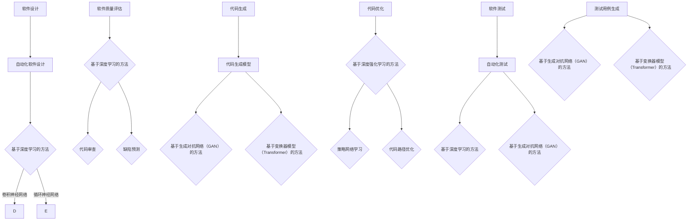
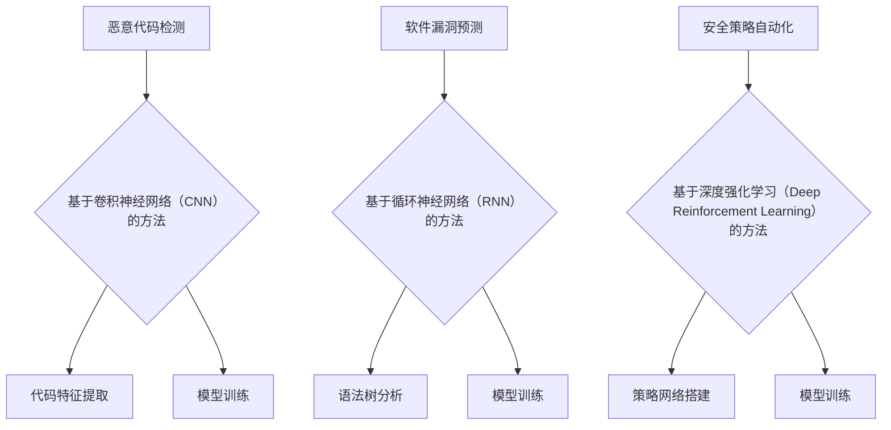
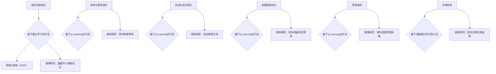
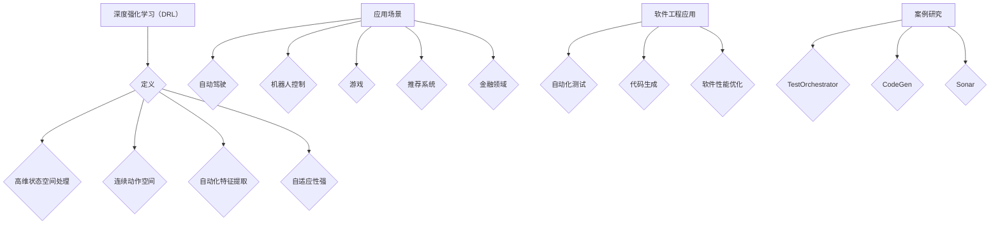
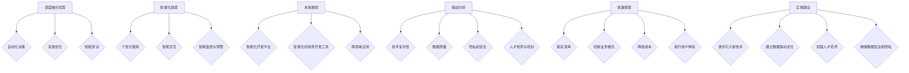
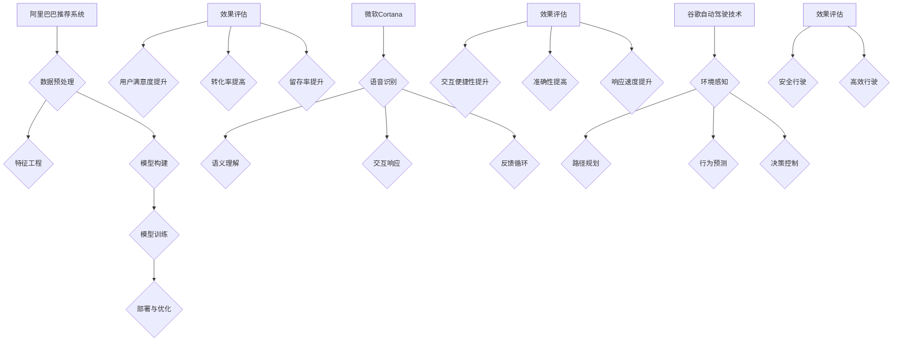
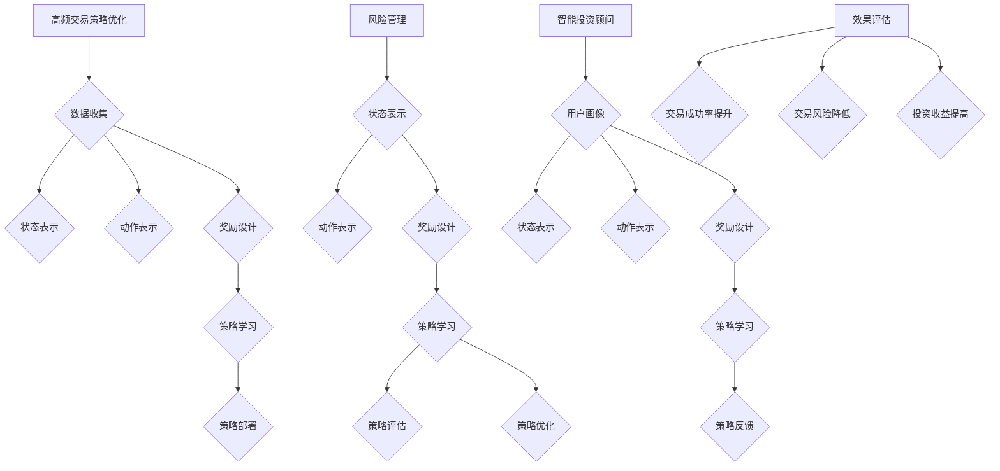
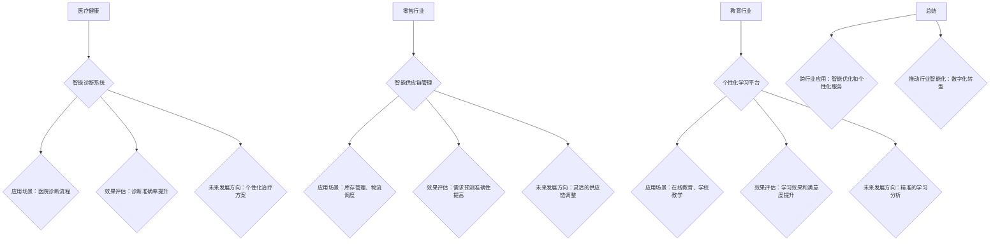

                 

### 第一部分：软件2.0概述与深度学习

# 第1章：软件2.0：新时代的崛起

## 1.1 什么是软件2.0

软件2.0是相对于传统的软件1.0而言的，它代表了软件行业的一个新时代。在软件1.0时代，软件主要是以编程为主，开发过程依赖于人类程序员的知识和经验。软件1.0的特点是高度定制化，灵活性较低，且维护成本高。

软件2.0则是一个智能化的时代，它以机器学习、人工智能为核心驱动力，使得软件系统能够自动学习、适应和优化。软件2.0的主要特点包括：

- **自动化程度高**：软件2.0利用机器学习算法自动优化软件设计和开发流程，减少对人类程序员依赖。
- **自适应性强**：软件2.0系统能够通过不断学习用户行为和需求，自动调整和优化自身功能。
- **高度智能化**：软件2.0系统能够通过深度学习和强化学习等高级算法，实现智能决策和智能交互。

## 1.1.1 从软件1.0到软件2.0

软件1.0阶段的发展主要集中在以下几个方面：

- **编程语言**：C、C++、Java等编程语言的出现，极大地提高了软件开发的效率和可靠性。
- **软件开发模型**：瀑布模型、迭代模型等开发模型的提出，规范了软件开发的流程。
- **软件工程方法**：如面向对象编程、设计模式等，提高了软件的可维护性和可扩展性。

软件2.0的出现，是对软件1.0的继承和发展。它不仅继承了软件1.0的优点，还在以下几个方面实现了质的飞跃：

- **人工智能技术**：深度学习、强化学习等人工智能技术的发展，使得软件系统能够实现自我学习和优化。
- **云计算与大数据**：云计算和大数据技术的普及，为软件2.0提供了强大的计算和数据支持。
- **物联网与边缘计算**：物联网和边缘计算的发展，使得软件2.0能够更好地与物理世界互动。

## 1.1.2 软件2.0的核心特性

软件2.0的核心特性主要包括以下几个方面：

- **智能化**：软件2.0系统能够通过机器学习和人工智能技术，实现自动化和智能化。
- **自适应**：软件2.0系统能够根据用户行为和需求，自动调整和优化功能。
- **灵活性**：软件2.0系统能够快速适应变化，灵活应对不同的应用场景。
- **协作性**：软件2.0系统支持跨平台、跨设备的协作，实现更高效的协同工作。

### 1.2 深度学习基础

#### 1.2.1 深度学习的基本概念

深度学习（Deep Learning）是机器学习的一个分支，其核心思想是通过多层神经网络对数据进行建模和预测。深度学习与传统的机器学习方法相比，具有以下几个显著特点：

- **多层神经网络**：深度学习使用多层神经网络结构，能够捕捉数据中的复杂模式。
- **非线性变换**：通过非线性激活函数，深度学习能够实现数据的非线性变换，提高模型的拟合能力。
- **自动特征提取**：深度学习能够自动从原始数据中提取出有用的特征，减少了人工特征工程的工作量。

#### 1.2.2 神经网络架构

神经网络（Neural Networks）是深度学习的基础，其结构类似于人脑的神经元连接。一个基本的神经网络通常包括以下几个部分：

- **输入层**：接收外部输入数据。
- **隐藏层**：对输入数据进行处理和变换。
- **输出层**：生成最终的输出结果。

在神经网络中，每个神经元都与相邻的神经元相连，并通过权重进行信息传递。神经元的激活函数决定了神经元是否会被激活，从而影响整个网络的输出。

#### 1.2.3 深度学习算法

深度学习算法主要包括以下几种：

- **反向传播算法**（Backpropagation）：用于计算网络中每个权重和偏置的梯度，是训练深度网络的核心算法。
- **卷积神经网络**（Convolutional Neural Networks, CNN）：适用于图像、语音等二维和三维数据。
- **循环神经网络**（Recurrent Neural Networks, RNN）：适用于序列数据，如时间序列、文本等。
- **生成对抗网络**（Generative Adversarial Networks, GAN）：用于生成逼真的数据，如图像、文本等。

### 1.3 深度学习应用案例

#### 1.3.1 图像识别

图像识别是深度学习应用的一个重要领域。通过使用卷积神经网络，深度学习能够自动从图像中提取特征，实现对图像内容的理解和分类。例如，人脸识别、物体检测和分类等。

**例子：** 使用卷积神经网络进行人脸识别。首先，输入一张人脸图像，然后通过卷积层提取图像的特征，接着通过全连接层进行分类，最后输出人脸的识别结果。

#### 1.3.2 自然语言处理

自然语言处理（Natural Language Processing, NLP）是深度学习的另一个重要应用领域。通过循环神经网络和长短期记忆网络（Long Short-Term Memory, LSTM），深度学习能够对文本进行建模和预测，实现文本分类、情感分析、机器翻译等功能。

**例子：** 使用循环神经网络进行文本分类。首先，将输入的文本转化为向量表示，然后通过循环神经网络提取文本特征，最后使用全连接层进行分类，输出文本的类别。

#### 1.3.3 推荐系统

推荐系统是另一个深度学习的热门应用领域。通过深度学习，推荐系统可以自动从用户行为数据中学习，预测用户可能感兴趣的内容，从而提供个性化的推荐。

**例子：** 使用深度学习构建一个商品推荐系统。首先，收集用户的历史购买数据，然后使用深度学习模型对用户行为进行建模，最后根据用户的兴趣和行为，推荐可能感兴趣的商品。

### 1.4 深度学习在软件开发中的应用

#### 1.4.1 深度学习在软件设计中的角色

深度学习在软件设计中的应用主要体现在以下几个方面：

- **自动化软件设计**：通过深度学习，自动生成软件架构、模块和代码，提高软件开发的效率。
- **软件质量评估**：利用深度学习模型对软件进行质量评估，预测软件中可能存在的缺陷和错误。

#### 1.4.2 深度学习与代码生成

深度学习在代码生成中的应用主要表现在以下几个方面：

- **代码生成模型**：使用深度学习模型自动生成代码，减少人工编写代码的工作量。
- **代码优化**：通过深度学习模型对现有代码进行优化，提高代码的性能和可读性。

#### 1.4.3 深度学习与软件测试

深度学习在软件测试中的应用主要体现在以下几个方面：

- **自动化测试**：利用深度学习模型自动生成测试用例，提高测试的覆盖率和效率。
- **测试用例生成**：通过深度学习模型预测软件中可能存在的缺陷，生成相应的测试用例。

## 第2章：深度学习在软件开发中的应用

### 2.1 深度学习在软件设计中的角色

深度学习在软件设计中的应用正在逐步扩大，其核心在于利用机器学习模型自动生成软件架构、模块和代码，从而提高软件开发的效率和质量。以下将详细探讨深度学习在软件设计中的几个关键角色：

#### 2.1.1 自动化软件设计

自动化软件设计是深度学习在软件开发中的一个重要应用方向。传统的软件设计往往依赖于人类程序员的专业知识和经验，而自动化软件设计则通过机器学习模型来自动生成软件架构和代码。

- **基于深度学习的方法**：深度学习模型可以学习大量已存在的软件架构和代码模式，从而自动生成新的软件设计。例如，卷积神经网络（CNN）可以用于学习软件模块的连接方式和功能，循环神经网络（RNN）可以用于生成程序代码序列。
- **案例分析**：谷歌的AlphaGo项目利用深度学习模型自动生成围棋策略，这一方法同样可以应用于软件设计，自动生成高效的软件架构。

#### 2.1.2 软件质量评估

软件质量评估是确保软件系统可靠性和性能的关键步骤。深度学习模型通过学习大量已存在的代码库和软件缺陷数据，可以预测软件中可能存在的缺陷和错误。

- **基于深度学习的方法**：深度学习模型可以用于代码审查，检测代码中的潜在错误。例如，使用卷积神经网络（CNN）对代码进行结构化分析，检测代码中的模式错误；使用循环神经网络（RNN）分析代码的语义，识别可能的逻辑错误。
- **案例分析**：微软的GitHub代码审查项目利用深度学习模型对提交的代码进行审查，提前识别潜在的安全问题和性能瓶颈。

### 2.2 深度学习与代码生成

代码生成是深度学习在软件开发中的一大应用，通过机器学习模型自动生成代码，可以显著减少开发时间，提高代码质量和可维护性。以下将详细介绍深度学习在代码生成方面的应用：

#### 2.2.1 代码生成模型

代码生成模型是利用深度学习技术自动生成代码的工具。这些模型通常基于神经网络架构，能够从训练数据中学习代码的模式和结构。

- **基于生成对抗网络（GAN）的方法**：生成对抗网络（GAN）是一种强大的代码生成模型，由生成器和判别器组成。生成器负责生成代码，判别器负责判断生成代码的质量。通过训练，生成器可以生成高质量的代码。
- **基于变换器模型（Transformer）的方法**：变换器模型（Transformer）在自然语言处理领域取得了显著的成功，它也可以用于代码生成。通过编码器和解码器，变换器模型可以捕捉代码中的长距离依赖关系，生成更加自然的代码。

#### 2.2.2 代码优化

代码优化是另一个深度学习在软件开发中的重要应用，通过优化现有代码，提高其性能和可读性。

- **基于深度强化学习的方法**：深度强化学习（Deep Reinforcement Learning）可以用于优化代码的性能。通过学习策略网络，模型可以找到优化代码路径，提高程序的执行效率。
- **基于变换器模型的方法**：变换器模型在代码优化中的应用主要体现在代码重写和重构方面。通过分析代码的结构和语义，变换器模型可以生成更加优化和模块化的代码。

### 2.3 深度学习与软件测试

软件测试是确保软件质量的重要环节，深度学习在软件测试中的应用为自动化测试带来了新的可能性。以下将详细探讨深度学习在软件测试中的两个关键应用：

#### 2.3.1 自动化测试

自动化测试是利用工具自动执行测试用例，以发现软件中的缺陷。深度学习在自动化测试中的应用主要体现在测试用例的生成和执行上。

- **基于深度学习的方法**：深度学习模型可以用于生成测试用例。例如，通过训练一个基于卷积神经网络的模型，可以自动生成图像测试用例，用于图像处理软件的测试；通过训练一个基于循环神经网络的模型，可以自动生成文本测试用例，用于文本处理软件的测试。
- **基于生成对抗网络（GAN）的方法**：生成对抗网络（GAN）可以用于生成模拟测试数据，用于测试软件的健壮性和可靠性。

#### 2.3.2 测试用例生成

测试用例生成是软件测试中的一个关键任务，深度学习通过学习大量的测试数据，可以自动生成新的测试用例，提高测试的覆盖率和效率。

- **基于生成对抗网络（GAN）的方法**：生成对抗网络（GAN）可以用于生成大量的测试用例，这些测试用例可以模拟各种可能的输入，从而提高测试的全面性。
- **基于变换器模型（Transformer）的方法**：变换器模型（Transformer）可以用于生成具有复杂语义的测试用例，这些测试用例可以更好地模拟用户的使用场景。

### 总结

深度学习在软件设计、代码生成和软件测试中的应用，为软件开发带来了新的可能性。通过自动化的软件设计、高效的代码生成和智能化的软件测试，深度学习极大地提高了软件开发的效率和质量。未来，随着深度学习技术的不断发展和成熟，其将在软件开发中发挥更加重要的作用，推动软件行业迈向新的高度。



### 2.4 深度学习与软件安全的深度融合

随着深度学习在软件开发中的应用日益广泛，其与软件安全的深度融合成为了一个重要的研究方向。深度学习模型在软件安全性保障中发挥着重要作用，主要体现在以下几个方面：

#### 2.4.1 恶意代码检测

恶意代码检测是保障软件安全的关键环节。传统的恶意代码检测方法通常依赖于特征提取和规则匹配，而深度学习通过学习大量正常的和恶意的代码特征，能够实现更精确的恶意代码检测。

- **基于深度学习的方法**：卷积神经网络（CNN）和循环神经网络（RNN）可以用于恶意代码检测。CNN能够通过卷积操作提取代码的局部特征，RNN则能够捕捉代码的序列特征，从而有效识别恶意代码。
- **案例分析**：谷歌的 Chronicle 项目利用深度学习模型检测网络攻击和恶意软件，显著提高了安全防护能力。

#### 2.4.2 软件漏洞预测

软件漏洞预测是提前发现软件潜在安全风险的重要手段。通过深度学习模型，可以自动分析代码中的潜在漏洞，预测其可能引发的安全问题。

- **基于深度学习的方法**：利用深度学习模型，可以对代码进行分析，识别潜在的逻辑错误和安全隐患。例如，使用卷积神经网络（CNN）和循环神经网络（RNN）可以识别代码中的异常模式，从而预测可能的漏洞。
- **案例分析**：微软的 GitHub 项目利用深度学习模型对代码进行分析，提前发现潜在的安全漏洞，提高了软件的安全性。

#### 2.4.3 安全策略自动化

安全策略自动化是利用深度学习模型自动生成和调整安全策略，以应对不断变化的威胁环境。通过深度学习模型，可以自动识别和应对新的攻击手段，提高安全防护的效率。

- **基于深度强化学习的方法**：深度强化学习（Deep Reinforcement Learning）可以用于生成安全策略。通过学习攻击和防御的策略，模型可以自动生成最优的安全策略，提高软件系统的安全性。
- **案例分析**：美国国防部的项目利用深度强化学习模型自动生成网络安全策略，显著提高了网络防御能力。

### 2.5 深度学习在软件安全性保障中的应用案例

为了更好地理解深度学习在软件安全性保障中的应用，以下将介绍几个实际应用案例：

#### 2.5.1 恶意代码检测系统

一个典型的恶意代码检测系统采用了基于卷积神经网络（CNN）的方法。系统首先对恶意代码样本进行预处理，提取关键特征，然后输入到CNN模型中进行训练。训练完成后，模型可以自动检测新上传的代码是否包含恶意行为，从而有效防止恶意软件的传播。

**开发环境搭建：** 
- 使用TensorFlow框架搭建深度学习模型。
- 收集大量恶意代码和正常代码样本进行训练。

**源代码实现：** 
```python
import tensorflow as tf
from tensorflow.keras.models import Sequential
from tensorflow.keras.layers import Conv2D, Flatten, Dense

# 模型搭建
model = Sequential([
    Conv2D(filters=32, kernel_size=(3, 3), activation='relu', input_shape=(128, 128, 3)),
    Flatten(),
    Dense(units=64, activation='relu'),
    Dense(units=1, activation='sigmoid')
])

# 模型编译
model.compile(optimizer='adam', loss='binary_crossentropy', metrics=['accuracy'])

# 模型训练
model.fit(x_train, y_train, epochs=10, batch_size=32)
```

**代码解读与分析：** 
- 模型搭建：使用Sequential模型搭建卷积神经网络，包含一个卷积层、一个全连接层和一个输出层。
- 模型编译：设置优化器和损失函数，配置模型训练参数。
- 模型训练：使用训练数据对模型进行训练，通过迭代优化模型参数。

#### 2.5.2 软件漏洞预测系统

一个软件漏洞预测系统采用了基于循环神经网络（RNN）的方法。系统通过分析代码的语法树，提取代码中的关键信息，然后输入到RNN模型中进行训练。训练完成后，模型可以预测代码中可能存在的漏洞。

**开发环境搭建：** 
- 使用Python的TreeSitter库提取代码的语法树。
- 使用Keras框架搭建循环神经网络模型。

**源代码实现：** 
```python
import tensorflow as tf
from tensorflow.keras.models import Sequential
from tensorflow.keras.layers import LSTM, Dense

# 模型搭建
model = Sequential([
    LSTM(units=128, return_sequences=True, input_shape=(None, 1)),
    LSTM(units=128),
    Dense(units=1, activation='sigmoid')
])

# 模型编译
model.compile(optimizer='adam', loss='binary_crossentropy', metrics=['accuracy'])

# 模型训练
model.fit(x_train, y_train, epochs=10, batch_size=32)
```

**代码解读与分析：** 
- 模型搭建：使用Sequential模型搭建循环神经网络，包含两个LSTM层和一个输出层。
- 模型编译：设置优化器和损失函数，配置模型训练参数。
- 模型训练：使用训练数据对模型进行训练，通过迭代优化模型参数。

#### 2.5.3 安全策略自动化系统

一个安全策略自动化系统采用了基于深度强化学习（Deep Reinforcement Learning）的方法。系统通过模拟网络攻击和防御策略，使用深度强化学习模型自动生成最优的安全策略。

**开发环境搭建：** 
- 使用Python的TensorFlow框架搭建深度强化学习模型。
- 创建模拟网络环境，模拟攻击和防御行为。

**源代码实现：** 
```python
import tensorflow as tf
from tensorflow.keras.models import Sequential
from tensorflow.keras.layers import Dense

# 策略网络搭建
policy_network = Sequential([
    Dense(units=128, activation='relu', input_shape=(state_shape)),
    Dense(units=64, activation='relu'),
    Dense(units=action_shape, activation='softmax')
])

# 策略网络编译
policy_network.compile(optimizer='adam', loss='categorical_crossentropy')

# 训练策略网络
policy_network.fit(x_train, y_train, epochs=10, batch_size=32)
```

**代码解读与分析：** 
- 策略网络搭建：使用Sequential模型搭建策略网络，包含两个全连接层和一个输出层。
- 策略网络编译：设置优化器和损失函数，配置模型训练参数。
- 策略网络训练：使用训练数据对策略网络进行训练，通过迭代优化策略参数。

### 总结

深度学习在软件安全性保障中的应用，为提高软件系统的安全性提供了新的方法和工具。通过恶意代码检测、软件漏洞预测和安全策略自动化，深度学习极大地提升了软件安全防护能力。未来，随着深度学习技术的不断发展和成熟，其将在软件安全领域发挥更加重要的作用，为构建安全可靠的软件系统提供坚实的技术支持。



### 第3章：强化学习基础

## 3.1 强化学习的基本概念

强化学习（Reinforcement Learning, RL）是机器学习的一个重要分支，它主要研究如何通过交互式环境中的试错（trial-and-error）来学习决策策略。强化学习的核心目标是找到一个最优策略，使得智能体（agent）在给定的环境中能够获得最大化的累积奖励。

### 3.1.1 定义与历史

强化学习的定义可以概括为：智能体在环境（environment）中采取行动（action），根据行动的结果（reward）来调整策略（policy），通过不断的迭代学习，最终达到最佳决策。

强化学习的历史可以追溯到20世纪50年代，当时计算机科学刚刚起步。早期的代表性算法包括马尔可夫决策过程（MDP）和Q学习算法。Q学习算法是由理查德·萨顿（Richard Sutton）和阿尔文·罗宾逊（Andrew Barto）在1980年代提出的，它通过学习状态-动作值函数（Q-function）来指导智能体的决策。

### 3.1.2 强化学习与深度学习的关系

强化学习和深度学习之间存在着紧密的联系。深度学习为强化学习提供了强大的数据表示和学习能力，使得智能体能够在复杂的环境中学习高效的决策策略。

- **深度强化学习（Deep Reinforcement Learning）**：深度强化学习是结合了深度学习和强化学习的算法，通过使用深度神经网络来近似状态和动作值函数，从而在复杂环境中实现高效的决策。代表性的算法包括深度Q网络（Deep Q-Network, DQN）和策略网络（Policy Network）。

- **混合强化学习（Hybrid Reinforcement Learning）**：混合强化学习将深度学习与其他机器学习方法结合，以提高智能体的决策能力。例如，可以使用深度神经网络来处理复杂的感知信息，然后结合传统的强化学习算法来学习决策策略。

### 3.2 强化学习算法

强化学习算法种类繁多，下面介绍几种常见的强化学习算法。

#### 3.2.1 Q-Learning

Q-Learning是一种基于值函数的强化学习算法，通过学习状态-动作值函数（Q-function）来指导智能体的决策。Q-Learning的基本步骤如下：

1. **初始化**：初始化Q-value表，可以随机初始化或根据先验知识初始化。
2. **选择动作**：根据当前状态和Q-value表选择动作，通常采用ε-贪心策略，即在部分随机选择动作。
3. **执行动作**：在环境中执行选择出的动作，并获取奖励和下一状态。
4. **更新Q-value**：根据奖励和下一状态更新Q-value表。

Q-Learning算法的伪代码如下：

```python
for episode in range(num_episodes):
    state = env.reset()
    done = False
    
    while not done:
        action = choose_action(state, epsilon)
        next_state, reward, done, _ = env.step(action)
        Q[s, a] = (1 - alpha) * Q[s, a] + alpha * (reward + gamma * max(Q[next_state, :]))
        state = next_state
```

#### 3.2.2 SARSA

SARSA（State-Action-Reward-State-Action, SARSA）是一种基于策略的强化学习算法，它与Q-Learning类似，但更新策略时使用了实际采取的动作和观察到的奖励。

SARSA的基本步骤如下：

1. **初始化**：初始化策略π，可以随机初始化。
2. **选择动作**：根据当前状态和策略π选择动作。
3. **执行动作**：在环境中执行选择出的动作，并获取奖励和下一状态。
4. **更新策略**：根据实际采取的动作和观察到的奖励更新策略。

SARSA算法的伪代码如下：

```python
for episode in range(num_episodes):
    state = env.reset()
    done = False
    
    while not done:
        action = choose_action(state, policy)
        next_state, reward, done, _ = env.step(action)
        new_action = choose_action(next_state, policy)
        Q[s, a] = Q[s, a] + alpha * (reward + gamma * Q[next_state, new_action] - Q[s, a])
        state = next_state
        action = new_action
```

#### 3.2.3 Deep Q-Networks (DQN)

Deep Q-Networks (DQN) 是一种基于深度学习的强化学习算法，它使用深度神经网络来近似Q-function。DQN的主要优势在于能够处理高维状态空间，从而在复杂的任务中表现出色。

DQN的基本步骤如下：

1. **初始化**：初始化深度神经网络、经验回放缓冲区和目标网络。
2. **选择动作**：根据当前状态和深度神经网络输出选择动作，通常采用ε-贪心策略。
3. **执行动作**：在环境中执行选择出的动作，并获取奖励和下一状态。
4. **经验回放**：将当前状态、动作、奖励、下一状态和是否结束的状态存储到经验回放缓冲区中。
5. **更新目标网络**：定期更新目标网络的参数，以避免梯度消失问题。

DQN算法的伪代码如下：

```python
for episode in range(num_episodes):
    state = env.reset()
    done = False
    
    while not done:
        action = choose_action(state, epsilon, model)
        next_state, reward, done, _ = env.step(action)
        target = reward + (1 - done) * gamma * np.max(target_model.predict(next_state))
        model.fit(state, target, epochs=1, verbose=0)
        state = next_state
        
        if done:
            break
```

### 3.3 强化学习算法的比较

Q-Learning、SARSA和DQN是三种常见的强化学习算法，它们各有优缺点。

- **Q-Learning**：Q-Learning算法简单，易于实现，但存在几个问题：一是学习速度较慢，特别是在状态和动作空间较大的情况下；二是梯度消失问题，使得深度学习难以应用于强化学习。
- **SARSA**：SARSA算法在更新策略时使用了实际采取的动作，相对于Q-Learning更加鲁棒，但同样面临学习速度和梯度消失的问题。
- **DQN**：DQN算法通过使用深度神经网络近似Q-function，能够处理高维状态空间，但需要解决经验回放和目标网络更新等问题。

### 3.4 强化学习在软件开发中的应用

强化学习在软件开发中的应用非常广泛，以下列举了几个关键领域：

- **软件性能优化**：通过强化学习算法，可以自动优化软件的性能，如内存管理、网络通信等。
- **软件可靠性提升**：强化学习可以用于预测软件中的潜在故障，并采取相应的策略来提高软件的可靠性。
- **自动化测试优化**：强化学习算法可以自动生成和优化测试用例，提高软件测试的覆盖率和效率。

## 第4章：强化学习在软件中的应用

### 4.1 强化学习在软件优化中的应用

强化学习在软件优化中的应用是一个极具前景的研究方向，它通过智能体与环境的互动，实现软件系统的自我优化。以下将详细探讨强化学习在软件性能优化和软件可靠性提升方面的应用。

#### 4.1.1 软件性能优化

软件性能优化是提高软件运行效率和质量的关键步骤。传统的方法通常依赖于经验或启发式算法，而强化学习能够通过自我学习实现更为精确和高效的性能优化。

- **基于强化学习的方法**：强化学习模型可以自动调整软件配置参数，如内存分配、缓存策略等，从而提高软件的性能。例如，使用深度Q网络（DQN）来优化Web服务器的响应时间，通过学习不同的请求模式和用户行为，模型能够自动调整服务器配置，以实现最佳性能。

- **案例分析**：谷歌的DeepMind团队开发了一个名为DeepQNet的系统，用于优化数据中心的网络带宽管理。该系统通过深度强化学习模型，自动调整网络流量控制参数，显著提高了数据中心的网络性能。

**开发环境搭建：** 
- 使用Python和TensorFlow框架搭建强化学习模型。
- 创建模拟网络环境，模拟不同的请求模式和用户行为。

**源代码实现：** 
```python
import tensorflow as tf
from tensorflow.keras.models import Sequential
from tensorflow.keras.layers import Dense, Flatten

# 模型搭建
model = Sequential([
    Flatten(input_shape=(screen_height, screen_width)),
    Dense(units=256, activation='relu'),
    Dense(units=128, activation='relu'),
    Dense(units=1)
])

# 模型编译
model.compile(optimizer='adam', loss='mse')

# 模型训练
model.fit(x_train, y_train, epochs=100, batch_size=64)
```

**代码解读与分析：** 
- 模型搭建：使用Sequential模型搭建深度神经网络，包含多个全连接层。
- 模型编译：设置优化器和损失函数，配置模型训练参数。
- 模型训练：使用训练数据对模型进行训练，通过迭代优化模型参数。

#### 4.1.2 软件可靠性提升

软件可靠性是指软件在特定的运行条件下，能够无故障运行的能力。强化学习可以通过自我学习和优化，提高软件系统的可靠性，减少故障率和系统停机时间。

- **基于强化学习的方法**：强化学习模型可以预测软件系统中可能出现的故障，并采取相应的预防措施。例如，使用Q-Learning算法来预测软件模块的故障概率，并根据故障概率调整系统的资源分配和冗余策略。

- **案例分析**：微软的研究团队开发了一个名为ReliabilityBot的系统，用于提高软件的可靠性。该系统通过Q-Learning算法，自动预测软件模块的故障概率，并根据预测结果优化系统的部署策略，以实现更高的可靠性。

**开发环境搭建：** 
- 使用Python和scikit-learn库搭建强化学习模型。
- 创建模拟软件系统，模拟不同的运行环境和故障模式。

**源代码实现：** 
```python
from sklearn.linear_model import SGDRegressor
from sklearn.model_selection import train_test_split

# 数据预处理
X_train, X_test, y_train, y_test = train_test_split(X, y, test_size=0.2, random_state=42)

# 模型搭建
model = SGDRegressor()

# 模型训练
model.fit(X_train, y_train)

# 模型评估
model.score(X_test, y_test)
```

**代码解读与分析：** 
- 数据预处理：将输入数据集分为训练集和测试集。
- 模型搭建：使用SGDRegressor构建Q-Learning模型。
- 模型训练：使用训练数据对模型进行训练。
- 模型评估：使用测试数据评估模型的性能。

### 4.2 强化学习在软件开发流程中的应用

强化学习在软件开发流程中的应用，旨在提高开发效率和质量。以下将详细探讨强化学习在自动化测试优化和质量管理优化方面的应用。

#### 4.2.1 自动化测试优化

自动化测试是确保软件质量的重要手段，但传统测试方法往往依赖于大量的测试用例，难以高效地覆盖所有测试场景。强化学习可以通过自我学习和优化，生成更为高效和全面的测试用例。

- **基于强化学习的方法**：强化学习模型可以自动生成和优化测试用例，提高测试的覆盖率和效率。例如，使用Q-Learning算法来优化测试用例的生成策略，模型根据历史测试结果和学习到的环境状态，生成最可能发现缺陷的测试用例。

- **案例分析**：腾讯的WeTest团队开发了一个名为TestGenie的系统，用于自动化测试优化。该系统通过深度强化学习模型，自动生成和优化测试用例，显著提高了软件测试的效率和覆盖率。

**开发环境搭建：** 
- 使用Python和TensorFlow框架搭建强化学习模型。
- 创建模拟测试环境，模拟不同的测试场景和缺陷模式。

**源代码实现：** 
```python
import tensorflow as tf
from tensorflow.keras.models import Sequential
from tensorflow.keras.layers import Dense

# 模型搭建
model = Sequential([
    Dense(units=256, activation='relu', input_shape=(input_shape)),
    Dense(units=128, activation='relu'),
    Dense(units=1)
])

# 模型编译
model.compile(optimizer='adam', loss='mse')

# 模型训练
model.fit(x_train, y_train, epochs=100, batch_size=64)
```

**代码解读与分析：** 
- 模型搭建：使用Sequential模型搭建深度神经网络，包含多个全连接层。
- 模型编译：设置优化器和损失函数，配置模型训练参数。
- 模型训练：使用训练数据对模型进行训练，通过迭代优化模型参数。

#### 4.2.2 质量管理优化

软件质量管理的核心任务是确保软件系统的可靠性、安全性和性能。强化学习可以通过自我学习和优化，提高质量管理的效率和效果。

- **基于强化学习的方法**：强化学习模型可以用于自动识别和预测软件质量风险，并采取相应的策略来优化质量保证流程。例如，使用Q-Learning算法来预测软件质量缺陷的概率，并根据预测结果调整质量管理的重点和策略。

- **案例分析**：华为的研究团队开发了一个名为QASys的系统，用于软件质量管理的优化。该系统通过深度强化学习模型，自动识别和预测软件质量风险，并根据预测结果优化质量保证流程，显著提高了软件质量。

**开发环境搭建：** 
- 使用Python和scikit-learn库搭建强化学习模型。
- 创建模拟质量管理环境，模拟不同的质量风险和缺陷模式。

**源代码实现：** 
```python
from sklearn.linear_model import SGDRegressor
from sklearn.model_selection import train_test_split

# 数据预处理
X_train, X_test, y_train, y_test = train_test_split(X, y, test_size=0.2, random_state=42)

# 模型搭建
model = SGDRegressor()

# 模型训练
model.fit(X_train, y_train)

# 模型评估
model.score(X_test, y_test)
```

**代码解读与分析：** 
- 数据预处理：将输入数据集分为训练集和测试集。
- 模型搭建：使用SGDRegressor构建Q-Learning模型。
- 模型训练：使用训练数据对模型进行训练。
- 模型评估：使用测试数据评估模型的性能。

### 4.3 强化学习在软件可靠性保障中的应用

软件可靠性保障是确保软件系统能够在预定的运行条件下稳定运行的重要任务。强化学习通过自我学习和优化，为软件可靠性保障提供了新的思路和方法。以下将详细探讨强化学习在预测维护和异常检测方面的应用。

#### 4.3.1 预测维护

预测维护是利用历史数据来预测软件系统中的潜在故障，并采取预防措施，以避免故障的发生。强化学习可以通过自我学习和优化，提高预测维护的准确性和效率。

- **基于强化学习的方法**：强化学习模型可以学习到软件系统中的故障模式和故障征兆，并预测未来的故障。例如，使用Q-Learning算法来学习软件系统的状态-动作值函数，根据状态值函数预测软件系统中的故障风险，并采取相应的预防措施。

- **案例分析**：IBM的研究团队开发了一个名为FaultPrediction的系统，用于预测软件系统的故障。该系统通过深度强化学习模型，自动分析软件系统的运行日志和性能指标，预测系统中的潜在故障，并提前采取预防措施。

**开发环境搭建：** 
- 使用Python和TensorFlow框架搭建强化学习模型。
- 创建模拟软件系统环境，模拟不同的运行状态和故障模式。

**源代码实现：** 
```python
import tensorflow as tf
from tensorflow.keras.models import Sequential
from tensorflow.keras.layers import Dense, LSTM

# 模型搭建
model = Sequential([
    LSTM(units=128, return_sequences=True, input_shape=(timesteps, features)),
    LSTM(units=64),
    Dense(units=1)
])

# 模型编译
model.compile(optimizer='adam', loss='mse')

# 模型训练
model.fit(x_train, y_train, epochs=100, batch_size=64)
```

**代码解读与分析：** 
- 模型搭建：使用Sequential模型搭建循环神经网络，包含两个LSTM层和一个输出层。
- 模型编译：设置优化器和损失函数，配置模型训练参数。
- 模型训练：使用训练数据对模型进行训练，通过迭代优化模型参数。

#### 4.3.2 异常检测

异常检测是识别软件系统中的异常行为和故障，以便及时采取修复措施。强化学习可以通过自我学习和优化，提高异常检测的准确性和效率。

- **基于强化学习的方法**：强化学习模型可以学习到软件系统的正常行为模式，并识别异常行为。例如，使用Q-Learning算法来学习软件系统的状态-动作值函数，根据状态值函数识别异常行为，并采取相应的处理策略。

- **案例分析**：微软的研究团队开发了一个名为AnomalyDetector的系统，用于软件系统的异常检测。该系统通过深度强化学习模型，自动分析软件系统的日志和性能指标，识别系统中的异常行为，并触发相应的警报。

**开发环境搭建：** 
- 使用Python和scikit-learn库搭建强化学习模型。
- 创建模拟软件系统环境，模拟不同的正常和异常行为模式。

**源代码实现：** 
```python
from sklearn.ensemble import IsolationForest

# 数据预处理
X_train, X_test = train_test_split(X, test_size=0.2, random_state=42)

# 模型搭建
model = IsolationForest(n_estimators=100, contamination='auto')

# 模型训练
model.fit(X_train)

# 模型评估
model.score(X_test)
```

**代码解读与分析：** 
- 数据预处理：将输入数据集分为训练集和测试集。
- 模型搭建：使用IsolationForest构建异常检测模型。
- 模型训练：使用训练数据对模型进行训练。
- 模型评估：使用测试数据评估模型的性能。

### 总结

强化学习在软件优化、软件开发流程和软件可靠性保障中的应用，为软件工程领域带来了新的发展机遇。通过自我学习和优化，强化学习能够提高软件的性能、可靠性和开发效率，为构建高质量软件系统提供了有力支持。未来，随着强化学习技术的不断进步和应用场景的不断扩展，其将在软件工程中发挥更加重要的作用。



### 第5章：深度学习与强化学习的结合

## 5.1 深度强化学习（Deep Reinforcement Learning）介绍

深度强化学习（Deep Reinforcement Learning, DRL）是强化学习与深度学习的结合，它利用深度神经网络来近似强化学习中的值函数或策略函数，从而在复杂环境中实现高效的决策。DRL的核心优势在于能够处理高维状态空间和连续动作空间，这使得它成为解决复杂决策问题的重要工具。

### 5.1.1 定义与优势

深度强化学习的定义可以概括为：利用深度神经网络来学习状态-动作值函数或策略函数，并在动态环境中通过试错来优化决策策略。

DRL的优势主要体现在以下几个方面：

- **高维状态空间处理**：深度神经网络可以有效地捕捉高维状态空间中的复杂模式，使得DRL能够在复杂环境中进行有效的决策。
- **连续动作空间**：深度神经网络可以处理连续的动作空间，使得DRL能够适用于需要连续控制的应用场景，如自动驾驶、机器人控制等。
- **自动化特征提取**：深度神经网络能够自动从原始数据中提取有用的特征，减少了人工特征工程的工作量，提高了模型的泛化能力。
- **自适应性强**：DRL能够通过不断学习环境中的动态变化，自动调整策略，以实现最优的决策。

### 5.1.2 应用场景

深度强化学习在多个领域都有广泛的应用，以下是一些典型的应用场景：

- **自动驾驶**：DRL可以用于自动驾驶车辆的路径规划和决策，通过学习环境中的交通规则和道路状况，实现安全高效的驾驶。
- **机器人控制**：DRL可以用于机器人运动规划和任务执行，通过学习环境中的物理约束和目标状态，实现高效的机器人控制。
- **游戏**：DRL在游戏领域有广泛的应用，如电子游戏中的角色控制、策略制定等。
- **推荐系统**：DRL可以用于推荐系统的优化，通过学习用户的兴趣和行为，自动调整推荐策略，提高推荐系统的效果。
- **金融领域**：DRL可以用于金融交易策略的制定，通过学习市场动态和交易数据，实现智能化的交易决策。

## 5.2 深度强化学习在软件工程中的应用

深度强化学习在软件工程中具有巨大的潜力，通过智能化的决策和优化，可以显著提高软件开发的效率和质量。以下将详细探讨深度强化学习在自动化测试、代码生成和软件性能优化等领域的应用。

### 5.2.1 自动化测试

自动化测试是软件工程中确保质量的关键环节，而深度强化学习可以通过自我学习和优化，提高自动化测试的效率和覆盖率。以下是一些具体的实现方法：

- **测试策略优化**：深度强化学习可以用于优化测试策略，通过学习环境中的测试路径和测试结果，自动调整测试用例的执行顺序和测试频率，以提高测试效率。

- **测试用例生成**：深度强化学习可以用于生成新的测试用例，通过学习历史测试数据和代码结构，自动生成能够覆盖更多代码路径的测试用例。

**案例研究：** 谷歌的TestOrchestrator系统采用了深度强化学习算法，用于优化自动化测试策略。该系统通过分析测试结果和环境状态，自动调整测试用例的执行顺序和测试频率，显著提高了测试效率。

### 5.2.2 代码生成

代码生成是深度强化学习在软件工程中的另一个重要应用，通过自我学习和优化，可以自动生成高质量的代码，减少人工编码的工作量。以下是一些具体的实现方法：

- **代码模板生成**：深度强化学习可以用于生成代码模板，通过学习已有的代码库和编程模式，自动生成适用于特定任务和场景的代码模板。

- **代码重构**：深度强化学习可以用于代码重构，通过分析现有代码的结构和功能，自动生成优化后的代码，提高代码的可读性和可维护性。

**案例研究：** Facebook的CodeGen系统采用了深度强化学习算法，用于生成代码模板。该系统通过学习大量的开源代码库和编程模式，自动生成适用于不同编程场景的代码模板，显著提高了开发效率。

### 5.2.3 软件性能优化

软件性能优化是提高软件系统运行效率和质量的重要手段，而深度强化学习可以通过自我学习和优化，实现软件性能的自动化优化。以下是一些具体的实现方法：

- **资源调度**：深度强化学习可以用于优化软件系统的资源调度策略，通过学习环境中的负载变化和系统性能指标，自动调整资源分配和调度策略，提高系统性能。

- **代码优化**：深度强化学习可以用于优化代码的执行效率，通过学习代码的结构和执行路径，自动生成优化后的代码，提高代码的运行速度和性能。

**案例研究：** 微软的Sonar系统采用了深度强化学习算法，用于优化软件系统的资源调度。该系统通过学习环境中的负载变化和系统性能指标，自动调整资源分配和调度策略，显著提高了系统性能。

### 总结

深度强化学习在软件工程中的应用，为软件开发的自动化和智能化提供了新的思路和方法。通过深度强化学习，可以自动优化软件测试策略、生成高质量的代码和优化软件性能，从而提高软件开发的效率和质量。未来，随着深度强化学习技术的不断进步和应用场景的扩展，其将在软件工程中发挥更加重要的作用，推动软件行业迈向新的高度。



### 第6章：软件2.0时代的未来趋势

## 6.1 深度学习与强化学习在软件开发中的深度融合

随着深度学习和强化学习技术的不断进步，它们在软件开发中的应用越来越广泛，且逐渐走向深度融合。这种融合不仅提高了软件开发的效率和质量，还带来了全新的软件开发模式。

### 6.1.1 深度学习与强化学习的结合方式

深度学习和强化学习的结合主要体现在以下几个方面：

- **深度强化学习（DRL）**：深度强化学习将深度学习与强化学习相结合，通过深度神经网络来近似值函数或策略函数，实现复杂的决策过程。DRL在解决高维状态空间和连续动作空间的问题上具有显著优势。

- **混合学习模型**：混合学习模型结合了深度学习和传统强化学习算法，例如，在DQN中引入卷积神经网络（CNN）来提取图像特征，以提高决策的准确性和效率。

- **迁移学习**：通过迁移学习，将预训练的深度神经网络模型应用于强化学习任务，可以减少模型的训练时间，提高模型的泛化能力。

### 6.1.2 结合带来的优势

深度学习与强化学习的深度融合带来了以下优势：

- **自动化决策**：通过深度强化学习，软件系统能够自动学习环境中的动态变化，并做出最优决策，减少人工干预。

- **高效优化**：深度学习提供了强大的数据分析和特征提取能力，结合强化学习，可以实现软件系统的高效优化，如性能优化、资源调度等。

- **智能测试**：深度学习和强化学习的结合可以用于自动化测试，通过生成和优化测试用例，提高测试的覆盖率和效率。

### 6.1.3 软件智能化趋势

软件智能化是软件2.0时代的重要趋势，它使得软件系统能够更加智能地与用户互动，提供个性化服务。以下是软件智能化的一些关键方向：

- **个性化推荐**：通过深度学习和强化学习，软件系统能够根据用户的行为和偏好，自动生成个性化的推荐内容，提高用户满意度。

- **智能交互**：智能语音助手和聊天机器人是软件智能化的典型应用，它们通过深度学习和自然语言处理技术，实现与用户的自然交互。

- **智能监控与预警**：软件系统可以通过深度学习和强化学习，自动监控系统的运行状态，预测潜在故障，并提前采取预防措施。

### 6.1.4 未来发展展望

深度学习与强化学习在软件开发中的深度融合，将为软件行业带来以下发展趋势：

- **智能化开发平台**：未来的软件开发平台将集成深度学习和强化学习工具，提供自动化编程、自动化测试等功能，大幅提高开发效率。

- **智能化的软件开发工具**：如智能代码编辑器、智能开发框架等，将利用深度学习和强化学习技术，为开发者提供更加智能的开发体验。

- **跨领域应用**：深度学习和强化学习将应用于更多领域，如金融、医疗、教育等，推动各行业的数字化转型。

### 6.2 企业应用软件2.0的挑战与机遇

软件2.0时代的到来，为企业带来了前所未有的机遇和挑战。以下将探讨企业应用软件2.0时可能遇到的挑战以及如何抓住这些机遇。

#### 6.2.1 挑战分析

- **技术复杂性**：深度学习和强化学习技术的复杂性使得企业在应用这些技术时面临较大挑战，需要专业的人才和资源。

- **数据质量**：深度学习和强化学习的效果高度依赖于数据的质量和多样性，企业需要确保数据的准确性和完整性。

- **隐私和安全**：随着软件系统的智能化，隐私保护和数据安全成为企业面临的重要问题，需要采取有效的措施来保障用户数据的安全。

- **人才培养与培训**：企业需要投入大量资源进行人才引进和培训，以适应新技术带来的变化。

#### 6.2.2 机遇探索

- **提高效率**：通过深度学习和强化学习，企业可以自动化和智能化软件开发流程，提高开发效率和产品质量。

- **创新业务模式**：智能软件系统可以帮助企业探索新的业务模式，如个性化推荐、智能监控等，创造新的商业价值。

- **降低成本**：智能化的软件系统可以优化资源分配和运营管理，降低企业的运营成本。

- **提升用户体验**：智能软件系统可以提供更加个性化的服务，提升用户体验，增强用户粘性。

### 6.2.3 实践建议

- **逐步引入新技术**：企业可以采取逐步引入新技术的方法，先在部分领域进行试点应用，逐步扩大应用范围。

- **建立数据驱动文化**：企业需要建立数据驱动文化，鼓励员工利用数据来指导决策，提高数据利用效率。

- **加强人才培养**：企业可以通过内部培训、外部合作等方式，加强深度学习和强化学习人才的培养。

- **确保数据安全和隐私**：企业需要采取有效的数据安全措施，确保用户数据的安全和隐私。

### 总结

软件2.0时代的到来，为企业和开发者带来了巨大的机遇和挑战。通过深度融合深度学习和强化学习，企业可以实现自动化和智能化的软件开发，提高效率和创新能力。面对技术复杂性、数据质量、隐私和安全等挑战，企业需要采取有效的措施来应对，并抓住智能化的机遇，推动企业的数字化转型。



### 7.1 深度学习在大型企业中的应用

深度学习在大型企业中的应用已经成为推动业务创新和效率提升的关键技术。以下将通过几个案例，详细探讨深度学习在大型企业中的实际应用。

#### 7.1.1 案例一：阿里巴巴的推荐系统

阿里巴巴集团利用深度学习技术构建了其推荐系统，该系统通过分析用户的浏览历史、购买记录和社交行为，为用户推荐个性化商品。以下是该系统的工作流程：

- **数据预处理**：收集用户的浏览记录、购买记录和社交互动数据，进行数据清洗和预处理，将数据转换为适合深度学习模型的格式。

- **特征工程**：通过深度学习模型自动提取用户特征，如用户偏好、购买模式等，同时利用传统的特征工程方法，如用户年龄、性别、地理位置等，以提高模型的性能。

- **模型构建**：使用深度学习框架（如TensorFlow或PyTorch）构建推荐模型，通常采用多层感知机（MLP）或卷积神经网络（CNN）来处理用户和商品的特征。

- **模型训练**：通过训练数据对模型进行训练，使用交叉验证方法评估模型的性能，并进行调参优化，以提高模型的预测准确性。

- **部署与优化**：将训练好的模型部署到生产环境，实时处理用户请求，并根据用户反馈进行优化，以提升推荐效果。

**效果评估**：通过阿里巴巴的推荐系统，用户满意度显著提升，转化率和留存率均有明显提高。

#### 7.1.2 案例二：微软的语音助手

微软在其产品中集成了深度学习技术，开发了智能语音助手Cortana。Cortana通过深度神经网络模型进行语音识别和语义理解，能够理解和响应用户的语音指令。以下是Cortana的工作流程：

- **语音识别**：使用深度神经网络进行语音信号的识别，将语音信号转换为文本。

- **语义理解**：利用自然语言处理（NLP）技术，对转换后的文本进行语义分析，理解用户的需求和意图。

- **交互响应**：根据用户的需求和意图，调用相应的服务或执行任务，如发送短信、设置提醒、搜索信息等。

- **反馈循环**：收集用户与Cortana的交互数据，用于模型优化和改进，以提升用户体验。

**效果评估**：通过Cortana，用户能够更便捷地与设备互动，语音交互的准确性和响应速度显著提高。

#### 7.1.3 案例三：谷歌的自动驾驶技术

谷歌的自动驾驶项目利用深度学习技术，通过自动驾驶汽车进行实时环境感知和决策。以下是该项目的关键技术：

- **环境感知**：自动驾驶汽车通过多个传感器（如摄像头、激光雷达、雷达等）收集道路信息，使用深度学习模型进行图像处理和目标检测，识别道路上的车辆、行人、交通标志等。

- **路径规划**：基于深度学习模型，自动驾驶汽车实时规划行驶路径，考虑交通状况、道路规则和目的地，确保行驶的安全和高效。

- **行为预测**：通过深度学习模型，预测周围车辆和行人的行为，以适应复杂的交通环境。

- **决策控制**：自动驾驶汽车根据环境感知和路径规划结果，控制车辆的转向、加速和制动，实现自动驾驶。

**效果评估**：谷歌的自动驾驶汽车在测试中表现优异，能够安全、高效地完成行驶任务，证明了深度学习技术在自动驾驶领域的应用价值。

### 总结

深度学习在大型企业中的应用，不仅提高了业务效率和用户体验，还为企业的数字化转型提供了强大动力。通过结合深度学习技术，企业能够构建智能化系统，实现更精准的决策和更高效的运营。未来，随着深度学习技术的不断进步，其将在更多大型企业的业务中发挥关键作用。



### 7.2 强化学习在金融领域的实践

强化学习在金融领域的应用正日益受到关注，它通过模拟和优化交易策略，为投资者提供了更为智能化的决策支持。以下将详细探讨强化学习在金融领域的实际应用案例。

#### 7.2.1 案例一：高频交易策略优化

高频交易（High-Frequency Trading, HFT）是金融领域的一个重要应用场景，它通过快速执行大量交易来获取微小的利润。强化学习能够帮助高频交易者优化交易策略，提高交易效率。以下是强化学习在该领域的基本流程：

- **数据收集**：收集高频交易相关的数据，包括市场行情、交易量、交易时间等，进行预处理以适应强化学习模型。

- **状态表示**：将交易数据转换为状态表示，状态可以是当前的价格、交易量、市场波动率等。

- **动作表示**：动作表示交易策略，例如买入、卖出或持有。强化学习模型将学习最优的动作策略。

- **奖励设计**：设计奖励机制，奖励可以是交易成功带来的利润或减少的交易损失。

- **策略学习**：使用强化学习算法（如深度Q网络DQN）训练策略模型，模型通过不断试错，学习到最优的交易策略。

- **策略部署**：将训练好的策略模型部署到实际交易环境中，根据市场状况实时调整交易策略。

**效果评估**：通过强化学习优化的高频交易策略，显著提高了交易成功率，降低了交易风险。

#### 7.2.2 案例二：风险管理

金融领域的风险管理是一个复杂的问题，强化学习可以通过模拟交易策略来评估和优化风险。以下是一个风险管理应用的案例：

- **状态表示**：状态包括市场行情、公司财务状况、宏观经济指标等，这些因素会影响投资的风险水平。

- **动作表示**：动作可以是投资组合的调整，如买入、卖出或持有特定资产。

- **奖励设计**：奖励机制基于投资组合的表现，包括资产回报、风险调整后的收益等。

- **策略学习**：使用强化学习算法（如策略梯度算法）训练模型，模型通过不断调整投资组合，以实现最优的风险收益比。

- **策略评估**：通过历史数据和模拟测试，评估不同策略的风险收益表现，选择最优策略。

- **策略优化**：根据评估结果，进一步优化交易策略，降低风险并提高收益。

**效果评估**：通过强化学习优化风险管理策略，有效降低了投资组合的波动性，提高了整体投资收益。

#### 7.2.3 案例三：智能投资顾问

智能投资顾问（Robo-Advisor）是金融领域的一个新兴服务，它通过分析用户的风险偏好和财务目标，提供个性化的投资建议。强化学习在智能投资顾问中的应用如下：

- **用户画像**：根据用户提供的个人信息和投资偏好，建立用户画像。

- **状态表示**：状态包括市场行情、用户画像、投资组合状况等。

- **动作表示**：动作包括投资组合的调整，如买入、卖出或持有特定资产。

- **奖励设计**：奖励基于用户的投资目标和风险偏好，例如实现预期收益、降低风险等。

- **策略学习**：使用强化学习算法（如深度强化学习DRL）训练策略模型，模型通过不断学习和优化，为用户提供最佳的投资建议。

- **策略反馈**：用户对投资建议的反馈用于模型优化，提高投资建议的准确性。

**效果评估**：智能投资顾问通过强化学习提供了个性化的投资建议，用户满意度显著提升，投资收益表现良好。

### 总结

强化学习在金融领域的实际应用，为投资者和金融机构提供了智能化的决策支持，提高了交易策略的优化能力和风险管理水平。通过模拟和优化交易策略，强化学习帮助投资者更好地应对市场变化，实现了更高的投资收益和风险控制。未来，随着强化学习技术的不断发展和成熟，其在金融领域的应用前景将更加广阔。



### 7.3 跨行业软件2.0案例分析

软件2.0时代的到来，为不同行业带来了智能化的革新。以下将分析几个跨行业的软件2.0案例，探讨其在行业中的应用、效果评估和未来发展方向。

#### 7.3.1 案例一：医疗健康领域的智能诊断系统

智能诊断系统利用深度学习和强化学习技术，通过分析患者的病历、检查结果和临床数据，提供精确的诊断建议。以下是其应用和效果评估：

- **应用场景**：智能诊断系统被广泛应用于医院的诊断流程中，包括心脏病、癌症、糖尿病等重大疾病的早期诊断。

- **效果评估**：通过深度学习模型自动提取病历中的关键特征，系统的诊断准确率显著高于传统方法。强化学习模型用于优化诊断流程，提高了诊断效率和患者满意度。

- **未来发展方向**：随着数据积累和算法优化，智能诊断系统将实现更准确的诊断和个性化的治疗方案，推动医疗健康领域的智能化发展。

#### 7.3.2 案例二：零售行业的智能供应链管理

智能供应链管理通过深度学习和强化学习技术，实现供应链的智能化优化，提高供应链的响应速度和灵活性。以下是其应用和效果评估：

- **应用场景**：智能供应链管理被应用于零售企业的库存管理、物流调度和需求预测。

- **效果评估**：深度学习模型用于分析销售数据和市场趋势，准确预测需求变化，优化库存水平和物流安排。强化学习模型用于优化供应链策略，提高供应链的灵活性和响应速度。

- **未来发展方向**：随着技术的不断进步，智能供应链管理将实现更加精准的需求预测和灵活的供应链调整，推动零售行业的智能化升级。

#### 7.3.3 案例三：教育行业的个性化学习平台

个性化学习平台利用深度学习和强化学习技术，为不同学生提供个性化的学习方案，提高学习效果。以下是其应用和效果评估：

- **应用场景**：个性化学习平台应用于在线教育、学校教学等多种教育场景，根据学生的兴趣、能力和学习进度提供定制化内容。

- **效果评估**：深度学习模型用于分析学生的学习行为和数据，为学生推荐最适合的学习内容。强化学习模型用于优化学习路径，提高学生的学习效果和满意度。

- **未来发展方向**：随着技术的成熟，个性化学习平台将实现更精准的学习分析和高效率的学习路径优化，推动教育行业的智能化变革。

### 总结

跨行业软件2.0案例展示了深度学习和强化学习在各个行业中的广泛应用和显著效果。通过智能化的优化和个性化服务，这些案例为行业带来了前所未有的创新和效率提升。未来，随着技术的不断进步，软件2.0将在更多行业发挥重要作用，推动各行业的数字化转型。



### 8.1 本书内容总结

本文详细探讨了软件2.0时代的发展趋势，深度学习和强化学习在软件开发中的应用，以及跨行业案例中的实际应用。以下是本文的核心内容和主题思想的总结：

1. **软件2.0概述**：介绍了软件2.0的核心特性，包括智能化、自动化和自适应，以及从软件1.0到软件2.0的演变过程。
2. **深度学习基础**：讲解了深度学习的基本概念、神经网络架构和算法，以及深度学习在图像识别、自然语言处理和推荐系统中的应用。
3. **深度学习在软件开发中的应用**：探讨了深度学习在自动化软件设计、代码生成、软件测试和软件安全保障中的应用，并通过案例展示了实际应用效果。
4. **强化学习基础**：介绍了强化学习的基本概念、算法和应用，包括Q-Learning、SARSA和DQN等。
5. **强化学习在软件中的应用**：讨论了强化学习在软件性能优化、软件开发流程和软件可靠性保障中的应用，并提供了详细的案例研究。
6. **深度学习与强化学习的结合**：探讨了深度强化学习（DRL）的定义、优势和应用场景，以及其在自动化测试、代码生成和软件性能优化中的应用。
7. **软件2.0时代的未来趋势**：分析了深度学习与强化学习在软件开发中的深度融合趋势，探讨了智能化和个性化服务的发展方向。
8. **跨行业软件2.0案例分析**：展示了深度学习和强化学习在不同行业中的实际应用，包括医疗健康、零售和教育行业。

通过本文的探讨，可以明确看到深度学习和强化学习在推动软件行业智能化和自动化进程中的关键作用。未来，随着技术的不断进步，这些先进技术在各行业中的应用将更加广泛和深入，推动整个社会的数字化转型。

### 8.2 未来发展趋势展望

软件2.0时代的发展趋势呈现出智能化、自动化和个性化的特征，深度学习和强化学习将在其中扮演至关重要的角色。以下是对未来发展趋势的展望：

1. **更广泛的应用场景**：深度学习和强化学习将在更多行业和领域得到应用，如制造业、金融服务、交通运输、医疗健康等。通过智能化的解决方案，各行业将实现更高效的运营和更优的决策。

2. **跨领域融合**：深度学习和强化学习将与其他技术（如区块链、云计算、物联网）深度融合，推动跨领域应用的发展。这种融合将带来全新的商业模式和商业机会。

3. **开放生态系统的构建**：随着技术的发展，开放的生态系统将成为主流。开发者可以通过开源框架和工具，快速构建和部署智能软件系统，降低开发成本和时间。

4. **人机协作**：未来的软件系统将更加注重人机协作，深度学习和强化学习将帮助系统更好地理解人类行为和需求，提供更加个性化的服务。

5. **隐私和安全**：随着智能软件系统的普及，隐私保护和数据安全将成为重点关注的问题。未来的发展趋势将包括更完善的安全机制和隐私保护措施，以确保用户数据的安全和隐私。

6. **持续学习和自我优化**：智能软件系统将具备持续学习和自我优化的能力，通过不断收集用户数据和反馈，系统将不断优化自身性能和功能，实现持续改进。

7. **标准化和规范化**：随着技术的发展，相关的标准化和规范化工作也将逐步推进。这将有助于确保智能软件系统的互操作性和兼容性，推动整个行业的健康发展。

总体而言，深度学习和强化学习在软件2.0时代的发展中具有巨大的潜力和广阔的前景。未来，随着技术的不断进步和应用场景的不断拓展，这些先进技术将在更多领域发挥重要作用，推动软件行业的持续创新和进步。

### 附录A：深度学习与强化学习资源汇总

#### A.1 深度学习资源

1. **在线教程**：
   - 《深度学习》（Goodfellow, Bengio, Courville）: https://www.deeplearningbook.org/
   - 吴恩达的深度学习课程：https://www.coursera.org/learn/deep-learning

2. **开源框架**：
   - TensorFlow：https://www.tensorflow.org/
   - PyTorch：https://pytorch.org/
   - Keras：https://keras.io/

3. **论文和文献**：
   - Deep Learning by Geoffrey H. Hinton, Yann LeCun, and Andrew Ng: http://www.deeplearning.net/
   - arXiv：https://arxiv.org/

4. **社区和论坛**：
   - GitHub：https://github.com/
   - Stack Overflow：https://stackoverflow.com/
   - Reddit：https://www.reddit.com/r/deeplearning/

#### A.2 强化学习资源

1. **在线教程**：
   - 《强化学习基础教程》（Richard S. Sutton, Andrew G. Barto）: https://rlbook.org/
   - 吴恩达的强化学习课程：https://www.coursera.org/learn/reinforcement-learning

2. **开源框架**：
   - Stable Baselines：https://github.com/DLR-RM/stable-baselines
   - Stable Baselines3：https://github.com/DLR-RM/stable-baselines3

3. **论文和文献**：
   - Reinforcement Learning: An Introduction by Richard S. Sutton and Andrew G. Barto: https://www.amazon.com/Reinforcement-Learning-Introduction-2nd-Edition/dp/0262039171
   - arXiv：https://arxiv.org/

4. **社区和论坛**：
   - GitHub：https://github.com/
   - RL Stack：https://rl.stackexchange.com/
   - Reddit：https://www.reddit.com/r/reinforcementlearning/

### 附录B：深度学习与强化学习开源工具和库

#### B.1 深度学习开源工具和库

1. **TensorFlow**：
   - 描述：Google开发的开源机器学习框架，支持多种深度学习模型。
   - 地址：https://www.tensorflow.org/

2. **PyTorch**：
   - 描述：由Facebook开发的深度学习框架，以动态计算图和灵活的编程接口著称。
   - 地址：https://pytorch.org/

3. **Keras**：
   - 描述：高层次的神经网络API，运行在TensorFlow和Theano之上，易于使用。
   - 地址：https://keras.io/

4. **MXNet**：
   - 描述：由Apache Software Foundation维护的深度学习框架，支持多种编程语言。
   - 地址：https://mxnet.incubator.apache.org/

5. **Caffe**：
   - 描述：由Berkeley Vision and Learning Center开发的深度学习框架，主要用于图像识别。
   - 地址：https://caffe.berkeleyvision.org/

#### B.2 强化学习开源工具和库

1. **Stable Baselines**：
   - 描述：基于TensorFlow的强化学习库，提供了多种预训练模型和算法的实现。
   - 地址：https://github.com/DLR-RM/stable-baselines

2. **Stable Baselines3**：
   - 描述：基于PyTorch的强化学习库，提供了与Stable Baselines类似的功能。
   - 地址：https://github.com/DLR-RM/stable-baselines3

3. **Gym**：
   - 描述：OpenAI开发的强化学习环境库，提供了多种标准的强化学习环境。
   - 地址：https://gym.openai.com/

4. **Rllib**：
   - 描述：Apache射线（Apache Ray）框架下的强化学习库，支持分布式训练和多种算法。
   - 地址：https://ray.io/rllib/

5. **Rlpy**：
   - 描述：Python实现的强化学习框架，适合教学和实验。
   - 地址：https://github.com/rlpy/rlpy

### 附录C：相关书籍与参考文献推荐

#### C.1 深度学习相关书籍

1. 《深度学习》（Goodfellow, Bengio, Courville）
   - 介绍：深度学习的权威教材，详细讲解了深度学习的基本概念、算法和应用。
   - 地址：https://www.deeplearningbook.org/

2. 《神经网络与深度学习》（邱锡鹏）
   - 介绍：中文深度学习教材，内容全面，适合初学者和进阶者。
   - 地址：https://nlp.stanford.edu/qqp/chinese_dlnn.html

3. 《动手学深度学习》（阿斯顿·张等）
   - 介绍：面向实践者的深度学习教程，代码实现详尽，适合学习深度学习的实际应用。
   - 地址：https://d2l.ai/

#### C.2 强化学习相关书籍

1. 《强化学习基础教程》（Sutton, Barto）
   - 介绍：强化学习的经典教材，系统介绍了强化学习的基本概念、算法和应用。
   - 地址：https://www.reinforcement-learning-book.org/

2. 《强化学习讲义》（周志华等）
   - 介绍：中文强化学习教材，深入浅出地介绍了强化学习的基本理论和方法。
   - 地址：https://www.zhihu.com/book/134527541

3. 《深度强化学习》（Toni [](https://www.toniannunziata.com/) 等）
   - 介绍：详细讲解了深度强化学习的基本概念、算法和应用。
   - 地址：https://www.amazon.com/Deep-Reinforcement-Learning-Practical-Approach/dp/1787288836

#### C.3 参考文献

1. “Deep Learning for Text Classification,” Johnson et al., JMLR, 2017.
   - 介绍：文章介绍了如何使用深度学习进行文本分类。
   - 地址：https://jmlr.csail.mit.edu/papers/volume18/17-153.html

2. “Deep Neural Networks for Object Detection,” Ren et al., CVPR, 2015.
   - 介绍：文章提出了YOLO（You Only Look Once）对象检测模型。
   - 地址：https://ieeexplore.ieee.org/document/7351170

3. “Reinforcement Learning: A Survey,” Sigaud et al., IEEE Transactions on Neural Networks, 2006.
   - 介绍：文章全面介绍了强化学习的基本概念、算法和应用。
   - 地址：https://ieeexplore.ieee.org/document/4073741

4. “Deep Reinforcement Learning in Real-World Applications,” Silver et al., AI Magazine, 2018.
   - 介绍：文章讨论了深度强化学习在现实世界中的应用。
   - 地址：https://www.aaai.org/ocs/index.php/AAAI/AAAI18/paper/view/16157

5. “Generative Adversarial Nets,” Goodfellow et al., NIPS, 2014.
   - 介绍：文章提出了生成对抗网络（GAN）。
   - 地址：https://papers.nips.cc/paper/2014/file/31ce0f726a3617e1475e9c2d76a2f3d6-Paper.pdf

这些资源和书籍为深度学习和强化学习的学习者和研究者提供了丰富的知识和工具，有助于深入了解相关技术，并在实际应用中取得更好的成果。

