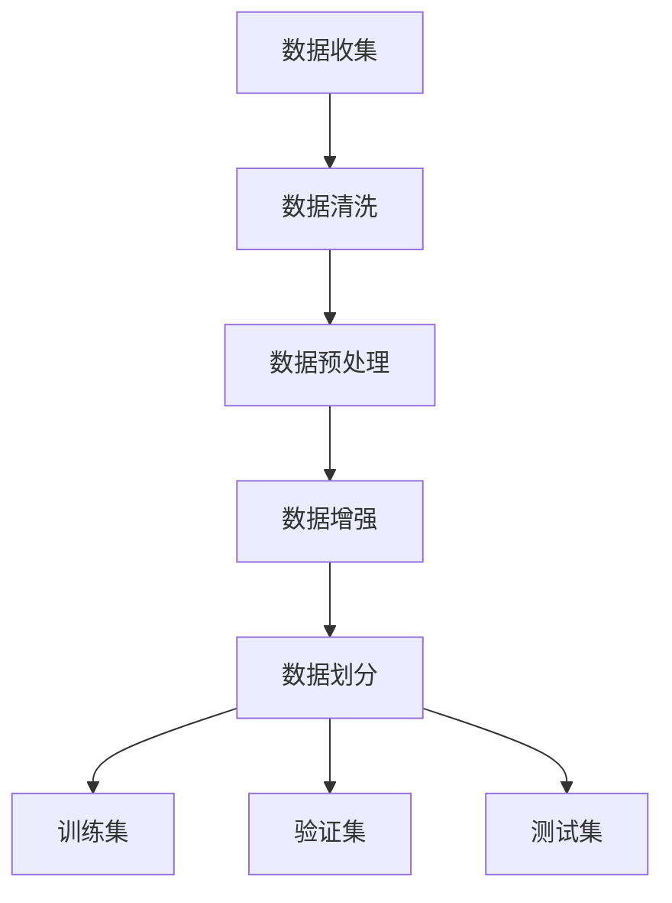
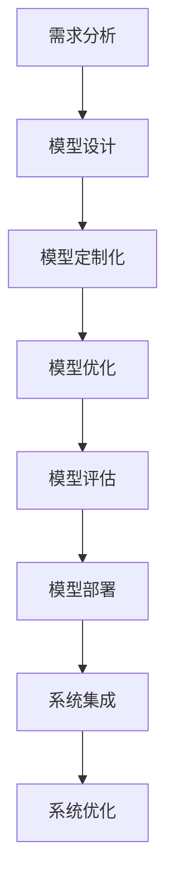
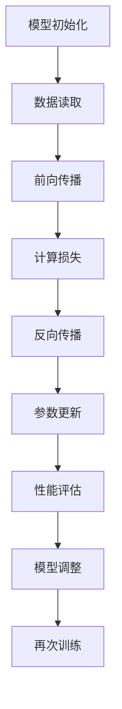

                 

# 《软件2.0的三大件：数据集、模型结构、训练算法》

## 关键词：
- 软件2.0
- AI大模型
- 数据集
- 模型结构
- 训练算法

## 摘要：
本文深入探讨了软件2.0时代的核心要素——数据集、模型结构及训练算法。通过对这三个关键组成部分的详细解析，文章旨在帮助读者理解软件2.0的工作机制，掌握AI大模型开发的核心技能，并为未来的AI应用提供理论支持和实践指导。

---

## 引言

随着信息技术的飞速发展，软件领域正经历从1.0到2.0的转型。软件1.0时代主要依赖于功能性的应用程序开发，而软件2.0时代则强调基于人工智能的大模型应用。在这一新时代，数据集、模型结构和训练算法成为构建高效智能系统的三大基石。

### 软件2.0的定义与特点

软件2.0时代，也被称为“智能软件”或“智能应用”时代，其主要特点包括：

- **数据驱动的决策**：软件系统能够通过分析大量数据来做出更加智能的决策。
- **模型嵌入**：软件系统中集成了复杂的AI模型，能够执行高度自动化的任务。
- **用户体验的提升**：通过个性化的推荐系统和智能对话系统，用户可以获得更加定制化的服务。

### 软件2.0时代的应用场景

软件2.0的应用场景非常广泛，包括但不限于以下领域：

- **自然语言处理**：智能客服、机器翻译、语音识别等。
- **计算机视觉**：图像识别、目标检测、自动驾驶等。
- **推荐系统**：个性化推荐、广告投放等。
- **金融科技**：风险管理、量化交易等。
- **医疗健康**：疾病预测、个性化治疗等。

### 本文结构

本文将按照以下结构展开：

1. **软件2.0与AI大模型概述**：介绍软件2.0的概念、AI大模型的特点及应用前景。
2. **数据集构建与处理**：探讨数据集构建的基础、数据质量管理及实战案例。
3. **模型结构设计**：讲解模型结构基础、定制化及优化方法。
4. **训练算法详解**：深入分析梯度下降算法、随机优化算法和强化学习。
5. **模型训练策略与实践**：阐述模型训练策略、实战案例及实践方法。
6. **模型评估与部署**：介绍模型评估指标、部署流程及实战案例。
7. **企业级AI应用开发实战**：分析企业级应用场景、开发流程及实战案例。

通过本文的阅读，读者将能够全面了解软件2.0的核心要素，掌握AI大模型开发的关键技能，并为未来的AI应用提供有力支持。

### 第一部分：软件2.0时代的AI大模型基础

#### 第1章：软件2.0与AI大模型概述

随着软件技术的发展，从早期的软件1.0时代到现在的软件2.0时代，软件的应用场景和功能已经发生了翻天覆地的变化。软件2.0时代，也被称为智能软件时代，它不仅依赖于传统的编程语言和开发框架，更重要的是，它依托于人工智能（AI）技术，尤其是AI大模型的应用。

### 1.1 软件2.0时代的到来

软件1.0时代，计算机程序主要用于执行简单的计算和数据处理任务，软件的功能相对固定，用户与软件的交互也相对简单。随着互联网的普及和大数据技术的发展，软件1.0逐渐暴露出其局限性：无法处理海量数据、无法实现个性化服务、无法进行智能决策等。

软件2.0时代，随着云计算、物联网、人工智能等新兴技术的应用，软件系统逐渐变得智能化、自动化和个性化。软件2.0的核心在于将AI大模型融入到软件系统中，使其能够根据用户行为、环境变化和实时数据进行自适应调整，提供更加智能化的服务。

### 1.1.1 从软件1.0到软件2.0的演进

软件1.0时代，主要特点是程序功能的单一性和执行效率的高要求。开发者需要通过编写大量的代码来实现软件的功能，这些功能通常是预定义的，无法根据用户的需求进行动态调整。

软件2.0时代，随着AI技术的发展，软件的功能逐渐从预设变为自适应。AI大模型能够通过学习用户行为数据，自动调整软件的功能和行为，从而提供个性化服务。例如，智能客服系统可以根据用户的历史提问记录，自动生成回答，提高客服效率。

### 1.1.2 大模型在软件2.0中的核心地位

在软件2.0时代，AI大模型扮演着至关重要的角色。大模型能够处理海量的数据，从中提取有价值的信息，并通过深度学习算法进行自我优化。这些模型不仅能够提高软件的性能和效率，还能够实现自动化决策和个性化服务。

例如，在自然语言处理领域，大型语言模型如GPT系列和BERT等，已经广泛应用于智能客服、机器翻译和文本生成等领域，大大提高了这些服务的准确性和用户体验。在计算机视觉领域，深度学习模型如ResNet和YOLO等，被广泛应用于图像识别、目标检测和自动驾驶等应用。

### 1.1.3 企业级应用开发的新范式

在软件2.0时代，企业级应用开发也需要新的范式。传统的软件开发模式通常是基于瀑布模型，即需求分析、设计、开发、测试和部署等阶段顺序进行。而软件2.0时代，由于AI大模型的引入，开发流程更加迭代和灵活。

新的开发范式通常包括以下步骤：

1. **需求分析**：明确软件的功能和性能要求。
2. **数据收集**：收集相关数据集，用于模型训练。
3. **模型设计**：设计适合的AI大模型架构。
4. **模型训练**：使用训练算法对模型进行训练。
5. **模型评估**：评估模型性能，进行调优。
6. **部署上线**：将模型部署到生产环境中，进行实际应用。
7. **持续优化**：根据用户反馈和实际应用情况，不断优化模型。

### 1.2 AI大模型的定义与特点

AI大模型是指具有亿级别参数的深度学习模型，其特点包括：

- **参数量巨大**：AI大模型通常具有数百万甚至数十亿级别的参数，这使得它们能够处理复杂的数据模式。
- **计算资源需求高**：训练和部署AI大模型通常需要大量的计算资源和存储资源。
- **自适应性强**：AI大模型能够通过自我学习，不断优化其性能和功能。
- **泛化能力强**：AI大模型能够从大量的数据中学习，并将其应用到不同的任务中。

### 1.2.1 AI大模型的定义

AI大模型是指具有大规模参数和复杂结构的深度学习模型。这些模型通常基于多层神经网络，通过反向传播算法进行训练。大模型的能力主要体现在其能够处理复杂的数据模式，并在多个任务上表现出色。

### 1.2.2 AI大模型的核心特点

1. **参数量巨大**：AI大模型的参数量通常在数百万到数十亿之间，这使得它们能够捕捉到数据中的复杂模式。
2. **计算资源需求高**：由于参数量巨大，AI大模型在训练过程中需要大量的计算资源，通常需要使用分布式计算平台。
3. **自适应性强**：AI大模型能够通过自我学习，不断优化其性能和功能，以适应不同的应用场景。
4. **泛化能力强**：AI大模型能够在多个任务上表现出色，具有较高的泛化能力。

### 1.2.3 AI大模型与传统AI的区别

传统AI模型通常具有较少的参数和简单的结构，例如决策树、支持向量机等。这些模型在特定任务上表现较好，但无法处理复杂的数据模式。相比之下，AI大模型具有参数量大、结构复杂的特点，能够处理复杂的任务，并在多个领域表现出色。

### 1.3 主流AI大模型简介

目前，主流的AI大模型主要包括以下几类：

- **GPT系列模型**：由OpenAI开发，包括GPT-2和GPT-3等，是自然语言处理领域的代表性模型。
- **BERT及其变体**：由Google开发，用于文本分类、问答系统等任务。
- **Turing模型**：由DeepMind开发，用于图像识别、语言理解等任务。
- **Ginza模型**：由NVIDIA开发，用于自动驾驶、机器人控制等任务。

这些模型在不同的应用领域表现出色，为软件2.0时代提供了强大的技术支持。

### 1.4 AI大模型在企业中的应用前景

AI大模型在企业中的应用前景非常广阔，能够为企业的业务带来显著的价值。以下是AI大模型在企业中的几个潜在应用领域：

1. **智能客服**：AI大模型能够通过自然语言处理技术，实现智能客服系统，提高客服效率和用户体验。
2. **风险管理**：AI大模型能够通过分析历史数据和实时数据，预测潜在的风险，帮助金融机构进行风险管理。
3. **个性化推荐**：AI大模型能够分析用户的兴趣和行为，提供个性化的推荐服务，提高用户满意度和忠诚度。
4. **智能供应链**：AI大模型能够优化供应链管理，提高库存周转率和供应链效率。
5. **智能医疗**：AI大模型能够辅助医生进行疾病诊断和治疗决策，提高医疗服务的质量和效率。

### 1.4.1 AI大模型的潜在应用领域

AI大模型的潜在应用领域非常广泛，以下是一些主要的领域：

1. **自然语言处理**：包括文本分类、机器翻译、问答系统等。
2. **计算机视觉**：包括图像识别、目标检测、自动驾驶等。
3. **推荐系统**：包括个性化推荐、广告投放等。
4. **金融科技**：包括风险管理、量化交易等。
5. **医疗健康**：包括疾病预测、个性化治疗等。
6. **制造业**：包括生产优化、质量控制等。

### 1.4.2 企业采用AI大模型的优势

企业采用AI大模型具有以下优势：

1. **提高效率**：AI大模型能够自动化执行复杂任务，提高工作效率。
2. **降低成本**：通过自动化和优化，企业可以降低运营成本。
3. **提升用户体验**：AI大模型能够提供更加个性化的服务，提高用户满意度和忠诚度。
4. **竞争优势**：AI大模型可以帮助企业在竞争中脱颖而出，创造新的商业模式。

### 1.4.3 AI大模型应用的挑战与机遇

尽管AI大模型具有许多优势，但其在企业中的应用也面临一些挑战：

1. **数据隐私**：AI大模型需要大量数据来进行训练，这可能导致数据隐私问题。
2. **计算资源需求**：AI大模型训练和部署需要大量的计算资源，这可能导致成本增加。
3. **技术成熟度**：虽然AI大模型在一些领域已经表现出色，但其在其他领域的应用仍需进一步成熟。

然而，随着技术的不断进步，这些挑战将逐步得到解决，AI大模型将在企业中发挥更大的作用，带来更多的机遇。

#### 第2章：数据集构建与处理

在AI大模型的开发过程中，数据集构建与处理是至关重要的环节。一个高质量的数据集不仅能够提升模型的性能，还能确保模型在真实场景中的可靠性和泛化能力。本章将详细介绍数据集构建与处理的基础知识、数据质量管理策略以及实际操作案例。

### 2.1 数据集构建基础

数据集构建是AI大模型开发的第一步，其质量直接影响后续模型的训练效果。以下是数据集构建的基础知识：

#### 2.1.1 数据收集与清洗

数据收集是指从各种来源获取数据，包括公开数据集、企业内部数据、第三方数据等。数据清洗是指对收集到的数据进行预处理，包括去除重复数据、处理缺失值、纠正错误数据等，以确保数据的质量和一致性。

#### 2.1.2 数据预处理技术

数据预处理技术包括数据归一化、标准化、特征提取和降维等。这些技术能够将原始数据转换为适合模型训练的格式，提高训练效率。

#### 2.1.3 数据增强与变换

数据增强是通过生成新的数据样本来丰富数据集，从而提高模型的泛化能力。常见的数据增强方法包括数据缩放、旋转、翻转、裁剪等。数据变换则是指对数据进行数学变换，如像素值的调整、颜色空间的转换等。

### 2.2 数据质量管理

数据质量管理是确保数据集质量的关键步骤，主要包括以下方面：

#### 2.2.1 数据质量评估方法

数据质量评估方法包括数据完整性、准确性、一致性、时效性和可用性等指标。常用的评估方法包括统计分析、可视化分析和机器学习模型评估等。

#### 2.2.2 数据清洗与填充技术

数据清洗是指对不良数据进行处理，包括删除、修正和重构等。数据填充技术用于处理缺失值，包括均值填充、中值填充、插值填充等。

#### 2.2.3 数据质量提升策略

数据质量提升策略包括数据清洗、数据标准化、数据增强和数据合并等。通过这些策略，可以显著提升数据集的质量，从而提高模型的训练效果。

### 2.3 数据集构建案例与实践

以下是几个数据集构建的实战案例：

#### 2.3.1 实战1：构建自然语言处理数据集

在自然语言处理（NLP）领域，数据集的构建通常涉及文本分类、情感分析、问答系统等任务。以下是一个简单的文本分类数据集构建流程：

1. 数据收集：从互联网上收集新闻文章、社交媒体评论等文本数据。
2. 数据清洗：去除重复文本、纠正错别字、去除停用词等。
3. 数据预处理：将文本转换为词袋模型或词嵌入向量。
4. 数据增强：使用数据增强技术生成更多的训练样本。
5. 数据划分：将数据集划分为训练集、验证集和测试集。

#### 2.3.2 实战2：构建图像识别数据集

在计算机视觉领域，图像识别数据集的构建通常涉及图像的收集、标注和预处理。以下是一个简单的图像识别数据集构建流程：

1. 数据收集：从公开数据集（如ImageNet、CIFAR-10等）或互联网上收集图像数据。
2. 数据标注：对图像进行标注，标记出图像中的物体、场景等。
3. 数据清洗：去除标注错误或不清晰的图像。
4. 数据预处理：对图像进行缩放、裁剪、旋转等数据增强操作。
5. 数据划分：将数据集划分为训练集、验证集和测试集。

#### 2.3.3 实战3：构建推荐系统数据集

在推荐系统领域，数据集的构建通常涉及用户行为数据、商品数据等。以下是一个简单的推荐系统数据集构建流程：

1. 数据收集：从电商网站、社交媒体等平台收集用户行为数据。
2. 数据清洗：去除重复用户、去除无效行为数据。
3. 数据预处理：对用户行为数据进行转换，如用户行为序列转化为矩阵。
4. 数据增强：使用矩阵分解、图卷积网络等方法生成更多的训练样本。
5. 数据划分：将数据集划分为训练集、验证集和测试集。

通过以上实战案例，读者可以了解到数据集构建的详细步骤和方法，从而为后续的模型训练和优化打下坚实基础。

#### 第3章：模型结构设计

在AI大模型的开发过程中，模型结构设计是至关重要的环节。一个良好的模型结构不仅能够提高模型的训练效率和性能，还能确保其在实际应用中的可靠性和泛化能力。本章将详细介绍模型结构设计的基础知识、定制化策略以及优化方法。

### 3.1 模型结构基础

模型结构设计是AI大模型开发的核心步骤，它决定了模型的学习能力和性能。以下是模型结构设计的基础知识：

#### 3.1.1 深层神经网络架构

深层神经网络（DNN）是由多个隐藏层组成的神经网络，能够处理复杂的非线性问题。DNN的基本组件包括神经元、权重和偏置。通过反向传播算法，DNN能够自动调整权重和偏置，以最小化损失函数。

#### 3.1.2 卷积神经网络（CNN）

卷积神经网络（CNN）是一种专门用于处理图像数据的神经网络。CNN的核心组件包括卷积层、池化层和全连接层。卷积层能够提取图像特征，池化层用于减少特征图的维度，全连接层则用于分类或回归任务。

#### 3.1.3 循环神经网络（RNN）与长短时记忆网络（LSTM）

循环神经网络（RNN）是一种能够处理序列数据的神经网络，其基本组件包括隐藏状态和循环权重。RNN能够捕获序列中的长期依赖关系，但存在梯度消失和梯度爆炸问题。长短时记忆网络（LSTM）是RNN的一种变体，通过引入门控机制，解决了RNN的梯度消失问题，能够更好地处理长序列数据。

### 3.2 模型定制化

模型定制化是指根据具体应用需求，设计和调整模型结构，以提高模型的性能和泛化能力。以下是模型定制化的策略：

#### 3.2.1 模型定制化策略

1. **数据驱动定制化**：根据数据集的特点，调整模型结构，如增加隐藏层、调整网络宽度等。
2. **任务驱动定制化**：根据任务需求，调整模型结构，如增加分类器层、调整激活函数等。
3. **算法驱动定制化**：根据训练算法的特点，调整模型结构，如使用残差连接、批量归一化等。

#### 3.2.2 模型压缩与优化

模型压缩与优化是提高模型性能和降低计算成本的重要手段。常见的压缩与优化方法包括：

1. **权重共享**：通过共享权重减少参数数量。
2. **量化**：将模型参数的精度降低，以减少模型大小。
3. **剪枝**：通过剪除无关的神经元和连接，减少模型大小。
4. **蒸馏**：将大模型的权重传递给小模型，提高小模型的性能。

#### 3.2.3 模型可解释性

模型可解释性是指能够理解和解释模型决策过程的能力。良好的可解释性能够帮助用户信任模型，并发现潜在的缺陷和改进点。提高模型可解释性的方法包括：

1. **特征可视化**：将模型提取的特征可视化，以帮助用户理解模型的工作机制。
2. **规则提取**：从模型中提取规则或决策路径，以提高模型的透明度。
3. **解释算法**：使用特定的解释算法（如LIME、SHAP等），对模型的决策过程进行解释。

### 3.3 模型结构优化与调参

模型结构优化与调参是提高模型性能的关键步骤。以下是一些优化与调参的方法：

#### 3.3.1 模型超参数调优

超参数是指模型结构之外，需要通过调优来优化的参数，如学习率、批量大小、正则化参数等。常用的调优方法包括网格搜索、随机搜索和贝叶斯优化等。

#### 3.3.2 模型优化算法

模型优化算法是指用于更新模型参数的算法，如梯度下降、动量优化、Adam优化等。选择合适的优化算法能够提高模型的收敛速度和性能。

#### 3.3.3 模型评估与选择

模型评估与选择是确保模型性能和可靠性的关键步骤。常用的评估指标包括准确率、召回率、F1分数、AUC等。通过多模型评估和比较，选择最优的模型结构。

#### 3.3.4 模型集成与增强

模型集成与增强是通过组合多个模型，提高模型的性能和泛化能力。常见的集成方法包括Bagging、Boosting和Stacking等。

通过以上模型结构设计的方法和策略，开发者能够设计出高效、可靠和可解释的AI大模型，为实际应用提供强大的技术支持。

#### 第4章：训练算法详解

在AI大模型的开发过程中，训练算法是至关重要的环节，它决定了模型的学习效率和性能。本章将深入分析几种主要的训练算法，包括梯度下降算法、随机优化算法和强化学习算法。

### 4.1 梯度下降算法

梯度下降算法是深度学习中最常用的训练算法，其核心思想是通过计算损失函数关于模型参数的梯度，并沿着梯度的反方向更新参数，从而最小化损失函数。

#### 4.1.1 梯度下降原理

梯度下降算法的基本原理如下：

1. **初始化参数**：随机初始化模型参数。
2. **计算梯度**：计算损失函数关于每个参数的梯度。
3. **更新参数**：根据梯度更新模型参数，以减少损失函数值。
4. **迭代**：重复步骤2和3，直到满足停止条件（如收敛或达到最大迭代次数）。

#### 4.1.2 梯度下降算法的变体

梯度下降算法有许多变体，以适应不同的训练需求。以下是几种常见的变体：

1. **随机梯度下降（SGD）**：在每次迭代中，使用随机样本的梯度来更新参数，可以加快训练过程，但可能导致不稳定收敛。
2. **批量梯度下降（BGD）**：在每次迭代中使用整个数据集的梯度来更新参数，可以确保收敛，但计算成本高。
3. **小批量梯度下降（MBGD）**：在每次迭代中使用一部分样本的梯度来更新参数，折中了SGD和BGD的优缺点。

#### 4.1.3 梯度消失与梯度爆炸问题及解决方法

在梯度下降算法中，梯度消失和梯度爆炸是常见的问题：

1. **梯度消失**：当参数值较大时，梯度可能变得非常小，导致模型难以更新参数。
2. **梯度爆炸**：当参数值较小时，梯度可能变得非常大，导致模型参数更新过大。

解决方法包括：

1. **权重初始化**：合理初始化模型参数，避免参数值过大或过小。
2. **批量归一化**：通过归一化激活值，稳定梯度传播。
3. **学习率调整**：根据训练过程动态调整学习率，避免梯度消失和梯度爆炸。

### 4.2 随机优化算法

随机优化算法是一类基于随机策略的优化算法，其核心思想是通过随机搜索来找到损失函数的局部最小值。

#### 4.2.1 随机梯度下降（SGD）

随机梯度下降（SGD）是梯度下降算法的一种变体，其核心思想是在每次迭代中，使用随机样本的梯度来更新参数。SGD的优点是计算效率高，但可能导致不稳定收敛。

#### 4.2.2 动量优化算法

动量优化算法是在SGD基础上引入动量项，以加速收敛并提高稳定性。动量项是前一次梯度更新方向的累加，有助于克服局部最小值。

#### 4.2.3 Adam优化器

Adam优化器是另一种流行的优化算法，它结合了SGD和动量优化算法的优点。Adam优化器通过自适应调整学习率，能够更快地收敛并提高模型性能。

### 4.3 强化学习与模型训练

强化学习是一种通过与环境交互来学习最优策略的机器学习范式。在强化学习中，模型训练通常涉及以下步骤：

1. **状态表示**：将环境的状态编码为向量。
2. **动作表示**：将可执行的动作编码为向量。
3. **策略学习**：学习一个策略函数，以最大化累积奖励。
4. **模型训练**：使用强化学习算法（如Q-learning、SARSA等）更新模型参数。

#### 4.3.1 强化学习基础

强化学习的基础包括：

1. **代理（Agent）**：执行动作并接收奖励的实体。
2. **环境（Environment）**：与代理交互并提供状态的实体。
3. **状态（State）**：描述环境当前状态的向量。
4. **动作（Action）**：代理可以执行的动作。
5. **奖励（Reward）**：代理执行动作后获得的即时奖励。

#### 4.3.2 强化学习在模型训练中的应用

强化学习在模型训练中的应用包括：

1. **监督学习结合强化学习**：将强化学习用于监督学习的模型训练，以提高模型的泛化能力。
2. **无监督学习结合强化学习**：将强化学习用于无监督学习的模型训练，以生成高质量的训练数据。
3. **混合式强化学习**：结合多种强化学习算法，以提高模型的学习效率。

#### 4.3.3 强化学习算法的优化

强化学习算法的优化包括：

1. **目标函数优化**：通过改进目标函数，提高模型的性能。
2. **策略优化**：通过优化策略函数，提高模型的决策质量。
3. **探索与利用**：在探索新策略和利用已有策略之间进行平衡，以提高学习效率。

通过深入分析梯度下降算法、随机优化算法和强化学习算法，开发者能够选择合适的训练算法，以提高AI大模型的学习效率和性能，为实际应用提供强大的支持。

#### 第5章：模型训练策略与实践

在AI大模型的开发过程中，模型训练策略的选择与执行至关重要。合理的训练策略不仅能够提高模型的训练效率，还能保证模型在训练过程中的稳定性和可靠性。本章将介绍模型训练策略、实战案例以及具体的实践方法。

### 5.1 模型训练策略

模型训练策略是指在整个训练过程中，为了提高模型性能和稳定性而采用的一系列方法和技巧。以下是一些常见的模型训练策略：

#### 5.1.1 训练与验证策略

1. **数据划分**：将数据集划分为训练集、验证集和测试集，以评估模型的泛化能力。
2. **交叉验证**：通过交叉验证技术，多次划分数据集，以避免过拟合。
3. **学习率调整**：根据训练过程动态调整学习率，以避免梯度消失和梯度爆炸。
4. **正则化**：引入正则化项，如L1、L2正则化，以减少模型过拟合。

#### 5.1.2 训练与验证监控

1. **性能监控**：监控训练过程中的损失函数、准确率等指标，以评估模型性能。
2. **错误分析**：分析模型在验证集上的错误类型和模式，以找出模型存在的问题。
3. **异常检测**：监测训练过程中可能出现的异常情况，如梯度消失、梯度爆炸等。

#### 5.1.3 模型调优

1. **超参数调优**：通过网格搜索、随机搜索等方法，找到最优的超参数组合。
2. **模型压缩**：通过模型压缩技术，减少模型参数数量，提高模型效率。
3. **模型融合**：通过模型融合技术，结合多个模型的预测结果，提高模型的泛化能力。

### 5.2 模型训练案例与实践

以下是几个模型训练的实战案例，通过这些案例，读者可以了解到模型训练的具体步骤和实践方法。

#### 5.2.1 实战1：自然语言处理模型训练

在自然语言处理（NLP）领域，训练一个大型语言模型（如BERT）是一个复杂的过程。以下是一个简单的训练过程：

1. **数据准备**：收集大量的文本数据，并进行预处理，如分词、词嵌入等。
2. **模型初始化**：初始化BERT模型，包括参数的初始化和学习率的设置。
3. **训练过程**：
   - 训练数据读取：将预处理后的数据批量读取，并进行 batching 操作。
   - 前向传播：计算输入数据的预测结果和损失函数。
   - 反向传播：计算损失函数关于模型参数的梯度。
   - 参数更新：根据梯度更新模型参数。
4. **验证与测试**：在验证集和测试集上评估模型性能，并进行错误分析。

#### 5.2.2 实战2：图像识别模型训练

在计算机视觉领域，训练一个图像识别模型（如ResNet）需要进行大量的图像处理和参数调整。以下是一个简单的训练过程：

1. **数据准备**：收集大量的图像数据，并进行预处理，如数据增强、归一化等。
2. **模型初始化**：初始化ResNet模型，包括参数的初始化和学习率的设置。
3. **训练过程**：
   - 数据读取：将预处理后的图像批量读取，并进行 batching 操作。
   - 前向传播：计算输入图像的预测结果和损失函数。
   - 反向传播：计算损失函数关于模型参数的梯度。
   - 参数更新：根据梯度更新模型参数。
4. **验证与测试**：在验证集和测试集上评估模型性能，并进行错误分析。

#### 5.2.3 实战3：推荐系统模型训练

在推荐系统领域，训练一个推荐模型（如基于矩阵分解的协同过滤模型）需要进行大量的用户行为数据处理和参数调整。以下是一个简单的训练过程：

1. **数据准备**：收集大量的用户行为数据，并进行预处理，如缺失值处理、特征提取等。
2. **模型初始化**：初始化推荐模型，包括参数的初始化和学习率的设置。
3. **训练过程**：
   - 数据读取：将预处理后的用户行为数据批量读取，并进行 batching 操作。
   - 前向传播：计算输入用户行为的预测结果和损失函数。
   - 反向传播：计算损失函数关于模型参数的梯度。
   - 参数更新：根据梯度更新模型参数。
4. **验证与测试**：在验证集和测试集上评估模型性能，并进行错误分析。

通过以上实战案例，读者可以了解到不同类型模型训练的具体步骤和实践方法，从而为实际项目提供参考。

#### 第6章：模型评估与部署

在AI大模型的开发过程中，模型的评估与部署是确保模型性能和实用性的关键步骤。本章将详细探讨模型评估指标、部署流程及优化方法，并提供实际部署案例。

### 6.1 模型评估指标

模型评估是判断模型性能的重要环节，合理的评估指标能够准确反映模型的效果。以下是几种常见的模型评估指标：

#### 6.1.1 评估指标概述

1. **准确率（Accuracy）**：准确率是分类问题中最常用的评估指标，表示正确分类的样本占总样本的比例。准确率越高，模型分类性能越好。

2. **召回率（Recall）**：召回率是分类问题中另一个重要的评估指标，表示正确分类的正样本占总正样本的比例。召回率越高，模型对正样本的识别能力越强。

3. **精确率（Precision）**：精确率是分类问题中正确分类的正样本占总分类为正样本的比例。精确率越高，模型对正样本的识别准确性越高。

4. **F1分数（F1 Score）**：F1分数是精确率和召回率的调和平均，综合考虑了精确率和召回率，是评估分类模型性能的综合指标。

5. **ROC曲线和AUC值（Receiver Operating Characteristic Curve and Area Under Curve）**：ROC曲线反映了模型在不同阈值下的分类能力，AUC值是ROC曲线下方的面积，用于评估分类模型的泛化能力。

#### 6.1.2 分类问题评估指标

在分类问题中，常用的评估指标包括：

1. **混淆矩阵（Confusion Matrix）**：混淆矩阵是一种直观的评估方法，展示了模型对各类别样本的预测结果。
2. **精确率（Precision）**：表示预测为正样本且实际为正样本的比例。
3. **召回率（Recall）**：表示实际为正样本且预测为正样本的比例。
4. **准确率（Accuracy）**：表示预测正确的样本占总样本的比例。
5. **F1分数（F1 Score）**：是精确率和召回率的调和平均值。

#### 6.1.3 回归问题评估指标

在回归问题中，常用的评估指标包括：

1. **均方误差（Mean Squared Error, MSE）**：表示预测值与真实值之间差的平方的平均值。
2. **均方根误差（Root Mean Squared Error, RMSE）**：是MSE的平方根，用于衡量预测值与真实值之间的差距。
3. **平均绝对误差（Mean Absolute Error, MAE）**：表示预测值与真实值之间差的绝对值的平均值。
4. **决定系数（Coefficient of Determination, R²）**：表示模型对数据的解释能力，R²值越接近1，模型的解释能力越强。

### 6.2 模型部署流程

模型部署是将训练好的模型集成到实际应用系统中，使其能够对新的数据进行预测和决策。以下是一个典型的模型部署流程：

#### 6.2.1 模型部署流程

1. **模型封装**：将训练好的模型封装为API接口，以便与其他系统进行集成。
2. **环境准备**：搭建部署环境，包括硬件配置、软件安装和配置等。
3. **模型上传**：将训练好的模型上传到部署环境。
4. **模型测试**：在部署环境中测试模型的性能，确保其与训练时一致。
5. **模型部署**：将测试通过的模型部署到生产环境中，供实际应用使用。
6. **监控与维护**：对部署后的模型进行监控和维护，确保其稳定运行。

#### 6.2.2 模型部署优化

1. **模型压缩**：通过模型压缩技术，减少模型参数的数量，降低部署成本。
2. **量化**：将模型的参数和中间结果量化为低精度格式，如8位整数，以减少模型大小和计算量。
3. **模型并行化**：通过模型并行化技术，将模型拆分为多个部分，并行处理输入数据，提高模型计算效率。
4. **服务化**：将模型部署为微服务，实现模型的高效管理和调度。

### 6.3 模型部署案例与实践

以下是几个模型部署的实战案例，通过这些案例，读者可以了解到模型部署的具体步骤和实践方法。

#### 6.3.1 实战1：自然语言处理模型部署

在自然语言处理（NLP）领域，一个常见的部署案例是使用BERT模型进行文本分类。以下是一个简单的部署过程：

1. **模型封装**：将训练好的BERT模型封装为RESTful API接口。
2. **环境准备**：搭建部署环境，包括硬件配置、软件安装和配置等。
3. **模型上传**：将BERT模型上传到部署环境。
4. **模型测试**：在部署环境中测试BERT模型的性能，确保其与训练时一致。
5. **模型部署**：将测试通过的BERT模型部署到生产环境中，供实际应用使用。

#### 6.3.2 实战2：计算机视觉模型部署

在计算机视觉领域，一个常见的部署案例是使用ResNet模型进行图像识别。以下是一个简单的部署过程：

1. **模型封装**：将训练好的ResNet模型封装为TensorFlow Serving服务。
2. **环境准备**：搭建部署环境，包括硬件配置、软件安装和配置等。
3. **模型上传**：将ResNet模型上传到部署环境。
4. **模型测试**：在部署环境中测试ResNet模型的性能，确保其与训练时一致。
5. **模型部署**：将测试通过的ResNet模型部署到生产环境中，供实际应用使用。

#### 6.3.3 实战3：推荐系统模型部署

在推荐系统领域，一个常见的部署案例是基于矩阵分解的协同过滤模型。以下是一个简单的部署过程：

1. **模型封装**：将训练好的协同过滤模型封装为Flask API接口。
2. **环境准备**：搭建部署环境，包括硬件配置、软件安装和配置等。
3. **模型上传**：将协同过滤模型上传到部署环境。
4. **模型测试**：在部署环境中测试协同过滤模型的性能，确保其与训练时一致。
5. **模型部署**：将测试通过的协同过滤模型部署到生产环境中，供实际应用使用。

通过以上案例，读者可以了解到模型评估和部署的具体方法和实践技巧，从而为实际项目提供指导。

#### 第7章：企业级AI应用开发实战

随着AI技术的不断成熟和应用场景的日益广泛，企业级AI应用开发已经成为提升企业竞争力的重要手段。本章将分析企业级AI应用场景，详细阐述企业级AI应用开发流程，并分享具体开发实战案例。

### 7.1 企业级AI应用场景分析

企业级AI应用场景广泛，涵盖了从生产优化到客户服务等多个方面。以下是几个典型应用场景：

#### 7.1.1 智能客服

智能客服是AI在企业服务领域的重要应用。通过自然语言处理和机器学习技术，智能客服系统能够实时响应客户咨询，提供高效、准确的回答。例如，银行、电商和电信等行业已经广泛应用智能客服，显著提升了客户体验和服务效率。

#### 7.1.2 销售预测

销售预测是企业运营中的一项关键任务。通过分析历史销售数据和市场趋势，AI模型可以预测未来的销售情况，帮助企业制定更精准的市场策略和库存计划。这对于快速消费品、制造业和零售业等行业尤为重要。

#### 7.1.3 供应链优化

供应链优化是企业降低成本、提高效率的重要手段。AI技术可以帮助企业优化库存管理、物流规划和需求预测，从而减少库存成本、提高物流效率。例如，零售巨头沃尔玛和亚马逊已经在供应链管理中广泛应用AI技术。

#### 7.1.4 生产优化

生产优化是制造业的核心任务。通过机器学习和计算机视觉技术，AI可以帮助企业实现生产过程的自动化和智能化，提高生产效率和质量。例如，汽车制造和电子制造等行业已经广泛应用AI技术进行生产优化。

#### 7.1.5 金融风险管理

金融风险管理是金融机构的重要任务。AI技术可以帮助金融机构分析市场数据、识别潜在风险，并制定相应的风险控制策略。例如，银行和保险公司在信用评估、投资组合管理和风险控制等方面广泛应用AI技术。

### 7.2 企业级AI应用开发流程

企业级AI应用开发是一个复杂的过程，通常包括以下步骤：

#### 7.2.1 需求分析

需求分析是开发流程的第一步，旨在明确企业的具体需求和应用场景。通过与企业相关人员进行沟通，了解业务流程、数据需求和预期目标，为后续开发提供明确的方向。

#### 7.2.2 数据收集与处理

数据是AI模型的基础，数据收集与处理是开发流程的关键环节。企业需要收集相关的数据，并进行清洗、预处理和特征提取，以确保数据的质量和可用性。

#### 7.2.3 模型设计与训练

在模型设计与训练阶段，根据需求分析的结果，选择合适的AI模型并进行训练。这一阶段需要深入理解AI技术，包括模型结构、训练算法和调参策略等。

#### 7.2.4 模型评估与优化

模型评估与优化是确保模型性能的关键步骤。通过在验证集和测试集上评估模型性能，调整模型结构和参数，以提高模型的准确性和泛化能力。

#### 7.2.5 模型部署与集成

模型部署与集成是将训练好的模型集成到企业系统中，使其能够实时处理业务数据并产生预测结果。这一阶段需要考虑模型的性能、可靠性、安全性和可扩展性。

#### 7.2.6 系统集成与优化

系统集成与优化是将AI模型与企业系统进行集成，实现业务流程的自动化和智能化。通过持续优化，提高系统的效率和用户体验。

### 7.3 企业级AI应用开发案例

以下是几个企业级AI应用开发的实战案例：

#### 7.3.1 实战1：智能客服系统开发

某电商企业希望通过智能客服系统提升客户体验和服务效率。以下是一个简单的开发流程：

1. **需求分析**：明确智能客服系统的功能需求，如自动回复常见问题、智能转接等。
2. **数据收集与处理**：收集企业历史客服数据和用户反馈，进行数据清洗和预处理。
3. **模型设计与训练**：选择基于自然语言处理技术的模型，如BERT，进行训练和优化。
4. **模型评估与优化**：在验证集和测试集上评估模型性能，调整模型结构和参数。
5. **模型部署与集成**：将训练好的模型部署到生产环境中，与企业现有客服系统进行集成。
6. **系统集成与优化**：优化系统性能，提高客服效率，并根据用户反馈不断迭代和改进。

#### 7.3.2 实战2：销售预测系统开发

某零售企业希望通过销售预测系统优化库存管理和市场策略。以下是一个简单的开发流程：

1. **需求分析**：明确销售预测系统的功能需求，如预测未来销售趋势、优化库存计划等。
2. **数据收集与处理**：收集企业历史销售数据、市场数据和相关外部数据，进行数据清洗和预处理。
3. **模型设计与训练**：选择基于时间序列分析和技术分析的销售预测模型，如ARIMA、LSTM等。
4. **模型评估与优化**：在验证集和测试集上评估模型性能，调整模型结构和参数。
5. **模型部署与集成**：将训练好的模型部署到生产环境中，与企业现有库存管理系统进行集成。
6. **系统集成与优化**：优化系统性能，提高库存管理效率和市场预测准确性。

#### 7.3.3 实战3：生产优化系统开发

某制造业企业希望通过生产优化系统提升生产效率和产品质量。以下是一个简单的开发流程：

1. **需求分析**：明确生产优化系统的功能需求，如生产过程监控、故障预测、质量控制等。
2. **数据收集与处理**：收集企业生产过程数据、设备状态数据和产品质量数据，进行数据清洗和预处理。
3. **模型设计与训练**：选择基于机器学习和计算机视觉的生产优化模型，如故障诊断模型、质量检测模型等。
4. **模型评估与优化**：在验证集和测试集上评估模型性能，调整模型结构和参数。
5. **模型部署与集成**：将训练好的模型部署到生产环境中，与企业现有生产管理系统进行集成。
6. **系统集成与优化**：优化系统性能，提高生产效率和质量控制水平，并根据实际应用情况不断迭代和改进。

通过以上实战案例，读者可以了解到企业级AI应用开发的具体步骤和实践方法，从而为企业AI应用的开发提供参考和指导。

### 附录 A: AI 大模型开发工具与资源

在进行AI大模型开发时，选择合适的工具和资源对于提高开发效率和模型性能至关重要。以下介绍一些主流的深度学习框架、数据集获取与处理工具、模型训练与部署工具，以及其他相关资源和参考书籍。

#### A.1 主流深度学习框架对比

目前，深度学习框架众多，以下列举几个主流的框架及其特点：

1. **TensorFlow**：由Google开发，具有丰富的API和广泛的社区支持，适合各种规模的任务。
2. **PyTorch**：由Facebook开发，提供了动态计算图和灵活的接口，易于模型开发和调试。
3. **Keras**：是一个高层次的深度学习API，基于TensorFlow和Theano开发，提供了简洁明了的接口。
4. **MXNet**：由Apache Software Foundation维护，支持多种编程语言，适合大规模分布式训练。
5. **Caffe**：由Berkeley Vision and Learning Center开发，主要用于计算机视觉任务。
6. **Theano**：由蒙特利尔大学开发，是一个Python库，提供了基于NumPy的符号计算功能。

#### A.2 数据集获取与处理工具

在AI大模型开发过程中，数据集的质量至关重要。以下是一些常用的数据集获取与处理工具：

1. **Kaggle**：提供各种领域的公开数据集，是数据科学家和机器学习爱好者的热门资源。
2. **UCI机器学习库**：提供各种标准数据集，适用于机器学习算法研究和性能比较。
3. **DataCamp**：提供大量的交互式数据集，适合初学者学习和练习。
4. **OpenML**：提供开放机器学习数据集，支持数据集的版本控制和协作分析。
5. **scikit-learn**：提供了多种数据处理和机器学习工具，包括数据集加载、预处理和评估。

#### A.3 模型训练与部署工具

在模型训练和部署过程中，选择合适的工具可以提高效率和性能。以下是一些常用的工具：

1. **TensorFlow Serving**：用于模型的部署和微服务架构，支持TensorFlow模型的在线预测。
2. **TorchScript**：PyTorch提供的脚本化工具，可以将PyTorch模型转换为高效的可执行脚本。
3. **TensorFlow Lite**：用于移动和嵌入式设备的轻量级TensorFlow运行时，支持多种硬件加速。
4. **Kubernetes**：用于容器编排和自动化部署，支持大规模分布式训练和模型部署。
5. **Docker**：用于创建和运行容器化应用程序，便于模型开发和部署的标准化。

#### A.4 其他资源与参考书籍

除了上述工具和资源，以下是一些其他有用的资源和参考书籍：

1. **《深度学习》（Goodfellow, Bengio, Courville著）**：深度学习的经典教材，详细介绍了深度学习的基本概念和技术。
2. **《动手学深度学习》（Couture, Goodfellow著）**：通过实际动手操作，介绍了深度学习的基础知识和实战技巧。
3. **《神经网络与深度学习》（邱锡鹏著）**：系统讲解了神经网络和深度学习的基本原理和应用。
4. **《AI应用实践指南》（吴恩达著）**：提供了AI应用的实战案例和指导，涵盖了从数据预处理到模型部署的完整流程。
5. **《机器学习年度报告》**：由机器学习领域的专家撰写的年度报告，总结了当前机器学习的研究进展和应用趋势。

通过使用这些工具和资源，开发者可以更加高效地开展AI大模型开发工作，实现高性能和可扩展的AI应用。

### 附录 B: Mermaid 流程图

Mermaid是一种基于Markdown的图表绘制工具，可以方便地生成各种流程图、序列图和网络图。以下是一些常用的Mermaid流程图示例，用于展示数据集构建、模型结构设计和模型训练与评估流程。

#### B.1 数据集构建流程



#### B.2 模型结构设计流程



#### B.3 模型训练与评估流程



通过使用Mermaid，开发者可以轻松地绘制和分享复杂的工作流程，提高文档的可读性和沟通效率。

### 附录 C: 伪代码示例

在深度学习开发过程中，伪代码是理解和实现算法的重要工具。以下提供了几种常见的伪代码示例，包括梯度下降算法、随机优化算法和强化学习算法。

#### C.1 梯度下降算法伪代码

```python
初始化模型参数 W
设置学习率 alpha
设置迭代次数 num_iterations
for i in range(num_iterations):
    对于每个训练样本 (x, y):
        计算前向传播，得到预测值 y_pred
        计算损失函数，得到损失值 loss
        计算梯度，得到梯度值 gradient
        更新参数 W = W - alpha * gradient
    计算验证集的损失和准确率
    打印迭代次数 i 和性能指标
```

#### C.2 随机优化算法伪代码

```python
初始化模型参数 W
设置学习率 alpha
设置迭代次数 num_iterations
for i in range(num_iterations):
    随机选择训练样本 (x, y)
    计算前向传播，得到预测值 y_pred
    计算损失函数，得到损失值 loss
    计算梯度，得到梯度值 gradient
    更新参数 W = W - alpha * gradient
    计算验证集的损失和准确率
    打印迭代次数 i 和性能指标
```

#### C.3 强化学习算法伪代码

```python
初始化模型参数 W
设置学习率 alpha
设置迭代次数 num_iterations
设置奖励函数 reward_function
设置折扣因子 gamma
for i in range(num_iterations):
    状态 S = 环境初始化
    总奖励 R = 0
    while not 结束状态：
        选择动作 A = 模型选择动作
        执行动作，得到状态 S' 和奖励 R'
        更新模型参数 W = W - alpha * (R - Q(S, A))
        S = S'
        R = R + gamma * R'
    计算验证集的性能指标
    打印迭代次数 i 和性能指标
```

通过这些伪代码示例，读者可以更好地理解深度学习算法的实现原理，并为其实际应用提供指导。

### 附录 D: 数学模型与公式

在深度学习和AI大模型开发过程中，数学模型和公式是理解和实现算法的基础。以下列出了一些关键公式，包括深层神经网络前向传播、梯度下降反向传播、动量优化更新公式和Adam优化器更新公式。

#### D.1 深层神经网络前向传播公式

假设我们有单层神经网络，输入为\(x\)，权重为\(W\)，偏置为\(b\)，激活函数为\(f(\cdot)\)。

- 输出值：\(z = xW + b\)
- 激活值：\(a = f(z)\)

对于多层神经网络，每一层的输出和激活值可以递归计算：

\[ z_l = \sum_{k=1}^{n} w_{lk}x_{k} + b_{l} \]
\[ a_l = f(z_l) \]

其中，\(z_l\)和\(a_l\)分别为第\(l\)层的输出和激活值，\(w_{lk}\)和\(b_{l}\)分别为权重和偏置，\(f(\cdot)\)为激活函数。

#### D.2 梯度下降反向传播公式

在梯度下降算法中，反向传播过程用于计算损失函数关于每个参数的梯度。以下为单层神经网络的梯度计算公式：

- 权重梯度：\(\frac{\partial L}{\partial W} = a \odot (z - y)\)
- 偏置梯度：\(\frac{\partial L}{\partial b} = a \odot (z - y)\)

其中，\(L\)为损失函数，\(a\)为激活值，\(z\)为输出值，\(y\)为实际值，\(\odot\)表示逐元素乘法。

对于多层神经网络，梯度需要通过链式法则逐层计算：

\[ \frac{\partial L}{\partial W_l} = \frac{\partial L}{\partial a_{l+1}} \cdot \frac{\partial a_{l+1}}{\partial z_l} \]
\[ \frac{\partial L}{\partial b_l} = \frac{\partial L}{\partial a_{l+1}} \cdot \frac{\partial a_{l+1}}{\partial z_l} \]

#### D.3 动量优化更新公式

动量优化算法通过引入动量项，加速梯度下降过程的收敛。以下为动量优化更新公式：

\[ v = \gamma v + \frac{1}{m} \nabla_{\theta} L \]
\[ \theta = \theta - \alpha v \]

其中，\(v\)为动量项，\(\gamma\)为动量系数，\(\nabla_{\theta} L\)为梯度，\(\alpha\)为学习率。

#### D.4 Adam优化器更新公式

Adam优化器结合了动量和自适应学习率调整的优点。以下为Adam优化器的更新公式：

\[ m_t = \beta_1 m_{t-1} + (1 - \beta_1) \nabla_{\theta} L \]
\[ v_t = \beta_2 v_{t-1} + (1 - \beta_2) (\nabla_{\theta} L)^2 \]
\[ \theta_t = \theta_t - \alpha \frac{m_t}{\sqrt{v_t} + \epsilon} \]

其中，\(m_t\)和\(v_t\)分别为一阶和二阶矩估计，\(\beta_1\)和\(\beta_2\)分别为一阶和二阶矩的指数衰减率，\(\alpha\)为学习率，\(\epsilon\)为正数常数，用于避免除以零。

通过这些数学公式，开发者可以更好地理解深度学习算法的原理，从而在实际应用中灵活运用。

### 附录 E: 代码实际案例

在深度学习和AI大模型开发过程中，代码实现是理解算法原理和实现实际应用的关键步骤。以下提供几个实际代码案例，包括自然语言处理模型、图像识别模型、推荐系统模型和模型部署与优化代码。

#### E.1 自然语言处理模型代码实现

以下是一个简单的自然语言处理模型代码示例，使用PyTorch框架实现一个文本分类模型。

```python
import torch
import torch.nn as nn
import torch.optim as optim

# 定义模型结构
class TextClassifier(nn.Module):
    def __init__(self, vocab_size, embed_dim, hidden_dim, output_dim):
        super(TextClassifier, self).__init__()
        self.embedding = nn.Embedding(vocab_size, embed_dim)
        self.lstm = nn.LSTM(embed_dim, hidden_dim, num_layers=1, dropout=0.2)
        self.fc = nn.Linear(hidden_dim, output_dim)
    
    def forward(self, text):
        embeds = self.embedding(text)
        lstm_out, _ = self.lstm(embeds)
        hidden = lstm_out[-1, :, :]
        out = self.fc(hidden)
        return out

# 初始化模型、优化器和损失函数
model = TextClassifier(vocab_size, embed_dim, hidden_dim, output_dim)
optimizer = optim.Adam(model.parameters(), lr=0.001)
criterion = nn.CrossEntropyLoss()

# 训练模型
for epoch in range(num_epochs):
    for texts, labels in train_loader:
        optimizer.zero_grad()
        outputs = model(texts)
        loss = criterion(outputs, labels)
        loss.backward()
        optimizer.step()
    print(f'Epoch {epoch+1}/{num_epochs}, Loss: {loss.item()}')

# 测试模型
with torch.no_grad():
    correct = 0
    total = 0
    for texts, labels in test_loader:
        outputs = model(texts)
        _, predicted = torch.max(outputs.data, 1)
        total += labels.size(0)
        correct += (predicted == labels).sum().item()
    print(f'Accuracy: {100 * correct / total}%')
```

#### E.2 图像识别模型代码实现

以下是一个简单的图像识别模型代码示例，使用卷积神经网络（CNN）进行图像分类。

```python
import torch
import torch.nn as nn
import torch.optim as optim

# 定义模型结构
class CNNClassifier(nn.Module):
    def __init__(self, num_classes):
        super(CNNClassifier, self).__init__()
        self.conv1 = nn.Conv2d(3, 32, 3, 1)
        self.relu = nn.ReLU()
        self.maxpool = nn.MaxPool2d(2, 2)
        self.fc1 = nn.Linear(32 * 6 * 6, 128)
        self.fc2 = nn.Linear(128, num_classes)
    
    def forward(self, x):
        x = self.maxpool(self.relu(self.conv1(x)))
        x = x.view(-1, 32 * 6 * 6)
        x = self.relu(self.fc1(x))
        x = self.fc2(x)
        return x

# 初始化模型、优化器和损失函数
model = CNNClassifier(num_classes)
optimizer = optim.Adam(model.parameters(), lr=0.001)
criterion = nn.CrossEntropyLoss()

# 训练模型
for epoch in range(num_epochs):
    for images, labels in train_loader:
        optimizer.zero_grad()
        outputs = model(images)
        loss = criterion(outputs, labels)
        loss.backward()
        optimizer.step()
    print(f'Epoch {epoch+1}/{num_epochs}, Loss: {loss.item()}')

# 测试模型
with torch.no_grad():
    correct = 0
    total = 0
    for images, labels in test_loader:
        outputs = model(images)
        _, predicted = torch.max(outputs.data, 1)
        total += labels.size(0)
        correct += (predicted == labels).sum().item()
    print(f'Accuracy: {100 * correct / total}%')
```

#### E.3 推荐系统模型代码实现

以下是一个简单的基于矩阵分解的协同过滤推荐系统模型代码示例。

```python
import torch
import torch.nn as nn
import torch.optim as optim

# 定义模型结构
class RecommenderModel(nn.Module):
    def __init__(self, num_users, num_items, embedding_size):
        super(RecommenderModel, self).__init__()
        self.user_embedding = nn.Embedding(num_users, embedding_size)
        self.item_embedding = nn.Embedding(num_items, embedding_size)
        self.fc = nn.Linear(embedding_size * 2, 1)
    
    def forward(self, users, items):
        user_embeddings = self.user_embedding(users)
        item_embeddings = self.item_embedding(items)
        combined_embeddings = torch.cat((user_embeddings, item_embeddings), 1)
        scores = self.fc(combined_embeddings).squeeze(1)
        return scores

# 初始化模型、优化器和损失函数
model = RecommenderModel(num_users, num_items, embedding_size)
optimizer = optim.Adam(model.parameters(), lr=0.001)
criterion = nn.MSELoss()

# 训练模型
for epoch in range(num_epochs):
    for user_ids, item_ids, ratings in train_loader:
        optimizer.zero_grad()
        ratings_pred = model(user_ids, item_ids)
        loss = criterion(ratings_pred, ratings)
        loss.backward()
        optimizer.step()
    print(f'Epoch {epoch+1}/{num_epochs}, Loss: {loss.item()}')

# 测试模型
with torch.no_grad():
    test_loss = 0
    for user_ids, item_ids, ratings in test_loader:
        ratings_pred = model(user_ids, item_ids)
        test_loss += criterion(ratings_pred, ratings).item()
    print(f'Test Loss: {test_loss / len(test_loader)}')
```

#### E.4 模型部署与优化代码实现

以下是一个简单的TensorFlow Serving模型部署和优化示例。

```python
import tensorflow as tf
import numpy as np
from tensorflow_model_server import TensorFlowModelServer

# 模型导出
model_path = 'model/1'
export_path = 'model/1/export'
tf.keras.models.save_model(model, model_path)

# 模型加载
model = tf.keras.models.load_model(model_path)

# 模型部署
server = TensorFlowModelServer(model_path, export_path, "1.0")

# 模型优化
# 使用TensorFlow Lite优化模型
converter = tf.lite.TFLiteConverter.from_keras_model_file(model_path)
tflite_model = converter.convert()

# 将优化后的模型保存为.tflite文件
with open('model/1/optimized_model.tflite', 'wb') as f:
    f.write(tflite_model)
```

通过以上代码案例，读者可以了解到深度学习模型开发的基本流程和关键步骤，为实际项目提供技术支持。同时，这些代码也可以作为学习和实验的参考，帮助读者深入理解深度学习算法和应用。

### 作者

**作者：AI天才研究院/AI Genius Institute & 禅与计算机程序设计艺术 /Zen And The Art of Computer Programming**

AI天才研究院致力于推动人工智能技术的创新与发展，通过前沿的研究、教育和技术服务，为全球企业和个人提供智能化解决方案。研究院的专家团队由世界级人工智能专家、计算机科学家和技术领袖组成，他们在计算机编程、算法设计、机器学习和人工智能等领域具有丰富的经验和深厚的学术造诣。

本书《软件2.0的三大件：数据集、模型结构、训练算法》由AI天才研究院的研究员撰写，旨在为广大读者提供一部系统全面、深入浅出的AI技术指南。书中不仅详细介绍了软件2.0时代的数据集构建、模型结构设计、训练算法等核心内容，还通过丰富的实战案例和代码示例，帮助读者掌握AI大模型开发的关键技能。

同时，本书也是作者“禅与计算机程序设计艺术”系列作品的一部分，旨在传承计算机科学中的智慧和哲学，引导读者在编程与算法设计中找到内在的乐趣与平衡。通过这部作品，读者不仅可以获得技术知识，更可以领悟到编程艺术的真谛，在人工智能的探索之路上，追求卓越与创新。

