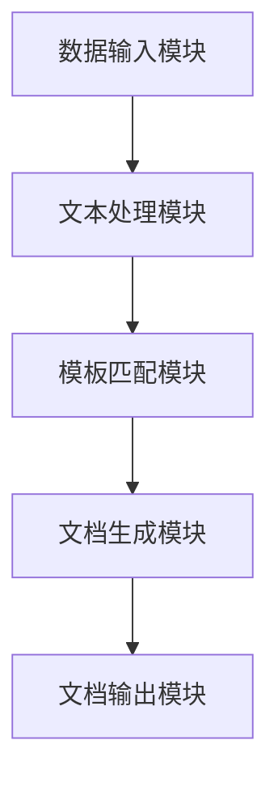

                 

### 引言

在当今快速发展的信息技术时代，软件2.0的文档自动生成技术逐渐成为了提升工作效率和降低成本的关键手段。软件2.0，作为一种新兴的软件开发模式，强调软件的动态性、自适应性和用户参与，其核心在于通过互联网和用户互动，实现软件功能的不断优化和迭代。而文档自动生成技术，则通过计算机程序自动创建文档，使得文档的生产过程从手工操作转化为高度自动化的过程。

本文将围绕软件2.0的文档自动生成技术展开讨论，首先介绍软件2.0的背景和概念，解释软件2.0的定义及其与人工智能的关系。接着，我们将探讨文档自动生成技术的基础，包括其概念、应用领域以及面临的挑战和机遇。在此基础上，我们将详细分析文本分析和处理技术，如自然语言处理、文本分类与主题模型、文本摘要与提取等。

随后，我们将探讨机器学习与深度学习在文档生成中的应用，包括机器学习和深度学习的基础知识以及具体的应用模型，如GPT模型和BERT模型。接着，我们将深入讨论文档生成算法与架构设计，介绍常见的文档生成算法、文档生成系统的架构设计以及性能优化策略。

在项目实战部分，我们将通过一个具体的案例，展示如何构建文档自动生成系统，包括项目背景与需求分析、系统设计、系统实现以及系统测试与优化。最后，我们将展望文档自动生成技术的未来发展趋势和软件2.0在文档生成领域的应用前景，并探讨面临的挑战和解决方案。

通过本文的讨论，读者将全面了解软件2.0的文档自动生成技术，掌握其核心概念、实现方法和未来发展趋势，为实际应用提供指导和参考。

### 关键词

- 软件2.0
- 文档自动生成
- 自然语言处理
- 机器学习
- 深度学习
- 文本分类
- 主题模型
- 文本摘要
- 文本提取

### 摘要

本文旨在探讨软件2.0的文档自动生成技术，介绍其背景、概念和应用领域。通过对文本分析和处理技术、机器学习与深度学习在文档生成中的应用、文档生成算法与架构设计、项目实战以及未来发展趋势的详细分析，本文揭示了文档自动生成技术在实际应用中的巨大潜力和面临的挑战。本文的研究为软件开发者和文档生成系统的构建者提供了宝贵的参考，有助于提高工作效率和降低成本。

### 第1章：软件2.0概述

软件2.0是一个新兴的概念，代表着软件开发的全新模式和方向。它不仅仅是一种技术的进步，更是一种理念的变革。理解软件2.0的定义、背景及其与人工智能的关系，是深入探讨文档自动生成技术的前提和基础。

#### 1.1 软件2.0的定义与演变

软件2.0的概念起源于Web 2.0，后者是指一种基于互联网的新兴应用模式，强调用户生成内容和用户交互。Web 2.0与早期的Web 1.0（以静态网页为主，用户被动接收信息）相比，具有更高的互动性和用户参与度。软件2.0则是在这一基础上，进一步拓展到软件开发的范畴，强调软件的动态性、自适应性和用户参与。

**定义**：软件2.0是一种基于网络和用户互动的新型软件开发模式，它通过互联网和用户行为数据，实现软件功能的动态调整和优化。软件2.0不仅提供传统的软件功能，还注重用户的参与和反馈，通过持续迭代和优化，不断提升软件的价值和用户体验。

**演变过程**：

1. **软件1.0**：传统桌面软件时代，软件功能相对固定，用户被动使用。
2. **Web 1.0**：互联网初步发展阶段，用户只能浏览和接收信息，互动性较低。
3. **Web 2.0**：互联网应用爆发期，用户生成内容和互动成为核心。
4. **软件2.0**：软件与互联网深度融合，软件功能动态调整，用户深度参与。

软件2.0的演变过程反映了信息技术从以信息传递为主，逐步转向以用户互动和智能化服务为主的趋势。

#### 1.2 软件2.0的关键特点

软件2.0的核心特点包括动态性、自适应性和用户参与。这些特点不仅提升了软件的功能和用户体验，也为文档自动生成技术提供了丰富的应用场景。

**动态性**：软件2.0能够根据用户行为和需求动态调整其功能和界面。例如，一个电商网站可以根据用户的浏览记录和购买历史，推荐个性化的商品。动态性使得软件能够更好地满足用户的需求，提供个性化的服务。

**自适应性**：软件2.0能够自动适应不同的设备和平台，提供一致的体验。例如，一个移动应用可以自适应手机、平板和电脑等不同设备的屏幕尺寸和操作系统。自适应性保证了用户在不同设备上都能享受到良好的使用体验。

**用户参与**：软件2.0将用户从被动的软件使用者转变为主动的参与者，用户的反馈和互动直接影响到软件的功能和改进。例如，用户可以通过评论、评分和反馈，直接参与到软件的开发过程中，帮助软件团队优化产品。

#### 1.3 软件2.0与人工智能的关系

软件2.0与人工智能（AI）之间存在着密切的联系和相互促进的关系。人工智能技术为软件2.0提供了强大的支持，使得软件能够更加智能化和个性化。

**相互促进**：

1. **人工智能提升软件2.0功能**：人工智能技术，如自然语言处理、图像识别和推荐系统，可以增强软件2.0的功能和智能化水平。例如，智能客服系统通过自然语言处理技术，能够更好地理解用户的问题并提供准确的回答。

2. **软件2.0为人工智能提供应用场景**：软件2.0的应用场景非常丰富，如电子商务、在线教育、医疗健康等，这些场景为人工智能技术的应用提供了广阔的空间。通过软件2.0平台，人工智能技术可以更好地收集和处理用户数据，实现智能决策和优化。

**案例分析**：

1. **智能客服系统**：智能客服系统通过自然语言处理技术，可以自动识别和解答用户的问题。例如，某电商平台的智能客服系统可以根据用户的提问，自动推荐相关的商品，提高用户的购物体验。

2. **个性化推荐系统**：个性化推荐系统利用机器学习和深度学习技术，分析用户的浏览和购买历史，推荐个性化的内容。例如，某视频网站通过分析用户的观看记录，推荐符合用户兴趣的视频，提高用户留存率和观看时长。

软件2.0与人工智能的融合，不仅提升了软件的功能和用户体验，也为人工智能技术的发展提供了新的机遇和挑战。通过不断探索和优化，软件2.0和人工智能技术将继续相互促进，推动信息技术的发展。

### 第2章：文档自动生成技术基础

文档自动生成技术是一种通过计算机程序自动创建文档的技术，它使得文档的生产过程从手工操作转化为高度自动化的过程。随着信息技术的发展，文档自动生成技术在多个领域得到了广泛应用，如企业文档管理、内容创作和教育培训等。本章将介绍文档自动生成技术的基础知识，包括其概念、应用领域以及面临的挑战和机遇。

#### 2.1 文档自动生成的概念

文档自动生成是指通过计算机程序自动创建文档的过程。这个过程通常包括文本提取、文本分析、模板填充和文档生成等步骤。

- **文本提取**：从原始数据中提取出关键信息，如文本、数据等。
- **文本分析**：对提取出的文本进行分类、标注、摘要等处理。
- **模板填充**：根据分析结果，将文本数据填充到预定义的文档模板中。
- **文档生成**：将填充好的模板生成最终的文档。

文档自动生成的目的是提高文档的生产效率，降低人力成本，并减少错误率。通过自动化技术，文档生成过程可以更加灵活和高效。

#### 2.2 文档自动生成技术的应用领域

文档自动生成技术具有广泛的应用领域，以下是其中几个重要的应用领域：

- **企业文档管理**：在企业中，文档自动生成技术可以用于合同生成、报告生成、邮件自动回复等。例如，企业可以使用文档自动生成系统自动生成合同，确保合同内容的准确性和一致性。

- **内容创作**：在内容创作领域，文档自动生成技术可以用于新闻文章、博客文章、产品说明书等自动生成。例如，新闻网站可以通过自然语言处理技术，自动生成新闻报道，提高内容生产效率。

- **教育培训**：在教育领域，文档自动生成技术可以用于课程材料、培训手册等自动生成。例如，在线教育平台可以通过文档自动生成技术，根据学生的进度和需求，自动生成个性化的学习材料。

#### 2.3 文档自动生成技术的挑战与机遇

尽管文档自动生成技术具有巨大的潜力，但在实际应用中仍然面临一些挑战和机遇。

- **挑战**：

  1. **文本理解与处理**：文档自动生成技术的一个主要挑战是如何准确理解文本内容，提取关键信息。自然语言处理技术的局限性使得文本理解成为一个难题。

  2. **文档结构化**：将非结构化文本转换为结构化数据是另一个挑战。如何有效地对文本进行结构化处理，以便于后续的模板填充和文档生成，是一个需要解决的问题。

  3. **可扩展性与灵活性**：如何设计一个具有高度可扩展性和灵活性的文档生成系统，以适应不同场景和需求，也是一个重要挑战。

- **机遇**：

  1. **提高工作效率**：文档自动生成技术可以显著提高文档生产的工作效率，减少人工操作的时间和错误率。

  2. **降低成本**：通过自动化文档生成，企业可以降低人力成本和运营成本，提高竞争力。

  3. **智能化**：随着人工智能技术的发展，文档自动生成技术可以进一步智能化，提高文档生成的质量和效率。

  4. **用户参与**：文档自动生成技术可以更好地满足用户需求，提升用户体验。用户可以通过互动和反馈，直接参与到文档生成过程中，实现个性化服务。

总之，文档自动生成技术在多个领域具有广泛的应用前景。通过不断克服挑战，充分利用机遇，文档自动生成技术将为企业和个人带来更多的便利和价值。

### 第3章：文本分析和处理技术

文本分析和处理技术是文档自动生成技术的核心组成部分，它涉及自然语言处理（NLP）的多个方面，包括文本分类、主题模型、文本摘要和提取。这些技术共同作用，使得计算机能够理解和处理自然语言文本，从而实现文档的自动生成。

#### 3.1 自然语言处理基础

自然语言处理（NLP）是研究如何让计算机理解和生成人类语言的技术。它结合了计算机科学、语言学和人工智能等多个领域的知识，旨在解决如何让计算机“听懂”和“说清楚”人类语言的问题。

- **NLP的概念**：NLP的主要任务包括文本的预处理、文本分析、语义理解和语言生成等。预处理包括文本的分词、词性标注、词干提取等，目的是将原始文本转换为计算机可以处理的形式。文本分析则涉及文本分类、情感分析、实体识别等。语义理解旨在理解文本中的含义和关系，而语言生成则是根据特定的意图和上下文生成自然语言的文本。

- **NLP的应用**：NLP在许多领域都有广泛应用，如搜索引擎、智能客服、机器翻译、文本摘要等。通过NLP技术，计算机可以更好地理解和处理用户输入的文本，提供更加智能和个性化的服务。

#### 3.2 文本分类与主题模型

文本分类和主题模型是文本分析中的重要技术，它们有助于将大量无结构的文本数据转化为有用的信息。

- **文本分类**：文本分类是将文本数据分类到预定义的类别中。例如，可以将新闻文章分类为政治、经济、科技等不同的主题。文本分类通常基于机器学习算法，如朴素贝叶斯、支持向量机（SVM）和神经网络等。这些算法通过训练模型，从已标记的文本数据中学习分类规则，然后对新的文本数据进行分类。

  **算法原理**：
  - **朴素贝叶斯分类器**：基于贝叶斯定理，假设特征之间相互独立。
  - **支持向量机（SVM）**：通过找到一个最佳的超平面，将不同类别的文本数据分开。
  - **神经网络**：通过多层神经网络学习文本的特征和分类规则。

- **主题模型**：主题模型是一种无监督学习的方法，用于发现文本数据中的隐含主题。LDA（Latent Dirichlet Allocation）是主题模型的一种常用实现。主题模型通过将每个文档表示为多个主题的混合，从而揭示文档之间的潜在关系。

  **算法原理**：
  - **文档-词矩阵**：将文档表示为一个词频矩阵，每个元素表示文档中某词的频率。
  - **潜在主题分布**：每个文档由多个主题的混合组成，每个主题由多个词的混合组成。
  - **参数估计**：使用Dirichlet分布估计文档主题分布和主题词分布。

#### 3.3 文本摘要与提取

文本摘要和提取是文本处理中用于简化文本内容的技术，目的是从大量文本数据中提取出关键信息。

- **文本摘要**：文本摘要是将长文本简化为较短的摘要，同时保持其核心内容和结构。文本摘要可以分为抽取式摘要和生成式摘要。抽取式摘要从原始文本中提取关键句子或段落，而生成式摘要则通过自然语言生成技术，生成新的摘要文本。

  **算法原理**：
  - **抽取式摘要**：使用关键词提取、文本分类和句法分析等方法，从文本中提取关键信息。
  - **生成式摘要**：使用生成模型，如序列到序列（seq2seq）模型，将原始文本转换为摘要文本。

- **文本提取**：文本提取是从大量文本中提取出有用的信息，例如，从新闻文章中提取标题、摘要和关键词。文本提取通常使用信息检索和自然语言处理技术。

  **算法原理**：
  - **信息检索**：通过匹配关键词和索引，从文本库中检索出相关的信息。
  - **实体识别**：识别文本中的命名实体，如人名、地名、组织名等。

文本分析和处理技术在文档自动生成中起着至关重要的作用。通过自然语言处理、文本分类与主题模型、文本摘要与提取等技术，计算机可以更好地理解和处理自然语言文本，从而实现文档的自动化生成。这些技术不仅提高了文档生成的效率和质量，也为软件2.0提供了更智能和个性化的服务。

### 第4章：机器学习与深度学习在文档生成中的应用

机器学习和深度学习作为人工智能的重要分支，已经在众多领域取得了显著的成果。在文档自动生成技术中，机器学习和深度学习发挥着关键作用，通过学习和理解大量的文本数据，生成高质量的文档。本章节将介绍机器学习和深度学习的基础知识，以及它们在文档生成中的应用。

#### 4.1 机器学习基础

机器学习是使计算机能够从数据中学习，从而进行决策或预测的方法。在文档生成中，机器学习通过训练模型，从大量的文本数据中学习特征和规律，以生成新的文档。

- **机器学习的类型**：
  - **监督学习**：在监督学习中，模型通过已标记的数据进行训练，然后对新的数据进行预测。常见的监督学习算法包括线性回归、决策树、支持向量机（SVM）和神经网络等。
  - **无监督学习**：无监督学习是在没有标记数据的条件下，从数据中自动发现模式和结构。常见的无监督学习算法包括聚类和主成分分析（PCA）等。
  - **强化学习**：强化学习是一种通过奖励机制，使模型在特定环境中学习最优策略的方法。强化学习在文档生成中的应用相对较少，但可以用于优化文档生成的过程。

- **机器学习在文档生成中的应用**：
  - **文本分类**：使用监督学习算法，如朴素贝叶斯、支持向量机和朴素神经网络，对文本进行分类，从而生成不同类型的文档。
  - **文本摘要**：通过训练序列标注模型，如CRF（条件随机场），提取文本中的关键句子和段落，生成摘要。
  - **情感分析**：使用情感分析模型，如朴素贝叶斯和支持向量机，分析文本的情感倾向，从而生成情感标签。

#### 4.2 深度学习基础

深度学习是机器学习的一个分支，它使用多层神经网络（DNN）来模拟人脑的决策过程。深度学习在图像识别、语音识别和自然语言处理等领域取得了突破性的成果。

- **深度学习的基本概念**：
  - **神经网络**：神经网络是深度学习的基础，它由多个神经元组成，每个神经元接收多个输入，通过激活函数产生输出。
  - **多层神经网络**：多层神经网络包括输入层、隐藏层和输出层，通过逐层处理数据，提取特征。
  - **深度学习模型**：常见的深度学习模型包括卷积神经网络（CNN）、循环神经网络（RNN）和变换器（Transformer）等。

- **深度学习在文档生成中的应用**：
  - **文本生成**：使用生成式模型，如变分自编码器（VAE）和生成对抗网络（GAN），生成新的文本数据。
  - **序列模型**：使用RNN和LSTM（长短期记忆网络），处理序列数据，如文本生成和语音识别。
  - **编码器-解码器模型**：使用Transformer模型，如BERT（双向编码器表示）和GPT（生成预训练模型），实现高效的文本生成和翻译。

#### 4.3 基于深度学习的文本生成模型

基于深度学习的文本生成模型在文档自动生成中发挥着重要作用，以下介绍几种常用的深度学习文本生成模型。

- **GPT模型**：GPT（生成预训练模型）是一种基于Transformer架构的预训练语言模型，通过大规模文本数据进行预训练，能够生成高质量的文本。GPT模型的工作原理是利用自注意力机制，对输入的文本序列进行建模，从而生成新的文本。

  **算法原理**：
  - **自注意力机制**：通过计算每个词与其他词之间的相似性，加权融合，从而提取关键信息。
  - **Transformer架构**：Transformer模型由多个自注意力层和前馈神经网络组成，通过并行计算提高效率。

  **应用示例**：
  - **文本生成**：通过GPT模型，可以生成各种类型的文本，如文章、对话和诗歌。

- **BERT模型**：BERT（双向编码器表示）是一种基于Transformer架构的预训练语言模型，它通过同时学习文本的左右两个方向，提高了模型的语义理解能力。

  **算法原理**：
  - **双向编码器**：BERT模型使用两个Transformer编码器，分别处理文本的左右两个方向，然后合并得到最终的表示。
  - **预训练任务**：BERT模型通过预训练任务，如遮蔽语言模型（Masked Language Model, MLM）和句子排序（Next Sentence Prediction, NSP），学习文本的语义和句法结构。

  **应用示例**：
  - **文本分类**：BERT模型在文本分类任务中表现出色，通过将文本输入到BERT模型中，提取特征，然后使用分类器进行分类。

基于深度学习的文本生成模型在文档自动生成中具有巨大的潜力，通过预训练和微调，可以生成高质量、个性化的文档。随着深度学习技术的不断进步，这些模型将进一步提高文档生成的质量和效率。

### 第5章：文档生成算法与架构设计

文档生成算法是文档自动生成技术的核心，它决定了文档生成的质量和效率。本章将介绍文档生成算法的基本原理、常见算法类型，以及文档生成系统的架构设计方法和性能优化策略。

#### 5.1 常见的文档生成算法

文档生成算法可以分为模板匹配算法、规则驱动算法和基于机器学习的算法。每种算法都有其独特的原理和应用场景。

- **模板匹配算法**：模板匹配算法通过预先定义的模板和规则，将输入文本中的关键字或短语与模板中的相应部分匹配，从而生成文档。这种算法通常用于生成格式固定的文档，如合同、报告等。

  **算法原理**：
  - **模板定义**：设计一个文档模板，包括标题、正文、附录等部分。
  - **规则设置**：定义规则，将输入文本中的关键字或短语映射到模板中的相应位置。
  - **文档生成**：根据输入文本，将匹配到的内容填充到模板中，生成最终的文档。

  **应用场景**：适用于格式固定、内容变化较小的文档生成场景。

- **规则驱动算法**：规则驱动算法通过一系列规则和条件语句，对输入文本进行分词、分类、标注等处理，然后根据规则生成文档。这种算法通常结合模板匹配算法，用于生成更加灵活和复杂的文档。

  **算法原理**：
  - **规则库构建**：构建规则库，包括文本处理规则、格式转换规则等。
  - **文本处理**：根据规则库对输入文本进行处理，如分词、词性标注、命名实体识别等。
  - **文档生成**：根据处理结果，生成文档的不同部分，并进行格式化。

  **应用场景**：适用于内容变化较大、结构复杂的文档生成场景。

- **基于机器学习的算法**：基于机器学习的算法通过训练模型，从大量的文本数据中学习特征和规律，然后生成文档。这种算法通常结合自然语言处理（NLP）技术，如文本分类、文本摘要、命名实体识别等。

  **算法原理**：
  - **数据预处理**：对输入文本进行预处理，如分词、去停用词、词向量化等。
  - **模型训练**：使用监督学习算法，如朴素贝叶斯、支持向量机、深度神经网络等，训练文本分类、文本摘要等模型。
  - **文档生成**：根据训练好的模型，对输入文本进行处理，生成文档的不同部分，并进行格式化。

  **应用场景**：适用于文本内容变化较大、需要高灵活性的文档生成场景。

#### 5.2 文档生成系统的架构设计

文档生成系统的架构设计是确保文档生成过程高效、可靠的关键。一个典型的文档生成系统通常包括数据输入、文本处理、文档生成和文档输出等模块。

- **数据输入模块**：负责接收用户输入的文本数据，可以是结构化数据（如XML、JSON）或非结构化数据（如文本文件、PDF）。

- **文本处理模块**：负责对输入文本进行预处理，如分词、去停用词、词性标注、命名实体识别等。这个模块通常结合NLP技术，以提高文本处理的精度和效率。

- **文档生成模块**：负责根据文本处理的结果，生成文档的不同部分，并进行格式化。这个模块通常结合模板匹配算法、规则驱动算法或基于机器学习的算法。

- **文档输出模块**：负责将生成的文档输出到用户指定的位置，可以是文件系统、数据库或Web服务。

**架构设计原则**：
- **模块化**：系统设计应遵循模块化的原则，每个模块负责特定的功能，易于维护和扩展。
- **可扩展性**：系统设计应具有高度的可扩展性，以适应不同的应用场景和需求。
- **可重用性**：系统设计应注重模块的重用性，减少重复开发的工作量。

#### 5.3 文档生成系统的性能优化

文档生成系统的性能优化是提高系统效率和用户体验的关键。以下是一些常见的性能优化策略：

- **并行处理**：通过多线程或分布式计算，提高文本处理和文档生成的速度。
- **缓存技术**：使用缓存技术，减少重复处理的次数，提高系统的响应速度。
- **索引技术**：使用索引技术，加快文本检索和处理的效率。
- **负载均衡**：通过负载均衡技术，合理分配系统资源，避免单点故障和性能瓶颈。

**性能优化方法**：
- **基准测试**：定期进行基准测试，评估系统的性能，找出瓶颈和改进点。
- **监控与报警**：监控系统性能，及时发现和处理性能问题。
- **代码优化**：通过代码优化，提高系统的执行效率，如减少冗余代码、优化数据结构等。

文档生成算法与架构设计是文档自动生成技术的核心，通过合理选择算法和优化系统设计，可以提高文档生成的质量和效率。随着技术的发展，文档生成技术将继续优化和进步，为企业和个人提供更加智能和高效的文档解决方案。

### 第6章：项目实战：构建文档自动生成系统

在了解了文档自动生成技术的理论基础和实现方法后，我们通过一个具体的实战项目，展示如何实际构建一个文档自动生成系统。本节将详细描述项目背景与需求分析、系统设计、系统实现和系统测试与优化，并通过代码实例和解读，让读者更好地理解文档自动生成系统的构建过程。

#### 6.1 项目背景与需求分析

**项目背景**：
随着企业规模的扩大和业务量的增加，文档生成需求日益增长。传统的手工文档生成方式不仅效率低下，而且容易出错。因此，企业希望通过引入自动化文档生成系统，提高工作效率、降低成本，并确保文档的准确性和一致性。

**需求分析**：
1. **文本输入**：系统能够接收各种格式的文本输入，如文本文件、PDF文件等。
2. **文本分析**：系统能够对输入文本进行分词、词性标注、命名实体识别等处理，提取关键信息。
3. **模板匹配**：系统应能够根据输入文本和预定义的文档模板，自动匹配并填充内容。
4. **文档生成**：系统应能够根据匹配结果，生成格式正确的文档，如合同、报告等。
5. **文档输出**：系统能够将生成的文档输出到用户指定的位置，如文件系统、数据库等。

#### 6.2 系统设计

**系统架构**：
系统设计采用模块化架构，包括数据输入模块、文本处理模块、模板匹配模块、文档生成模块和文档输出模块。以下为系统架构图：



**模块设计**：
1. **数据输入模块**：负责接收用户输入的文本数据，可以是文件上传或数据库查询。
2. **文本处理模块**：负责对输入文本进行预处理，如分词、去停用词、词性标注等。可以使用自然语言处理（NLP）库，如NLTK或spaCy。
3. **模板匹配模块**：根据输入文本和预定义的文档模板，匹配并填充内容。可以使用正则表达式或模板引擎，如Jinja2。
4. **文档生成模块**：根据模板匹配结果，生成格式正确的文档。可以使用PDF生成库，如ReportLab。
5. **文档输出模块**：将生成的文档输出到用户指定的位置，如文件系统、数据库等。

#### 6.3 系统实现

**代码实现**：

**数据输入模块**：
```python
def read_text_file(file_path):
    with open(file_path, 'r', encoding='utf-8') as file:
        text = file.read()
    return text
```

**文本处理模块**：
```python
import spacy

nlp = spacy.load('en_core_web_sm')

def preprocess_text(text):
    doc = nlp(text)
    tokens = [token.text for token in doc]
    return tokens
```

**模板匹配模块**：
```python
from jinja2 import Environment, FileSystemLoader

env = Environment(loader=FileSystemLoader('templates'))

def generate_document(template_name, data):
    template = env.get_template(template_name)
    document = template.render(data)
    return document
```

**文档生成模块**：
```python
from reportlab.lib.pagesizes import letter
from reportlab.pdfgen import canvas

def generate_pdf(document, output_path):
    c = canvas.Canvas(output_path, pagesize=letter)
    c.drawString(100, 750, document)
    c.save()
```

**文档输出模块**：
```python
def save_document(document, output_path):
    with open(output_path, 'w', encoding='utf-8') as file:
        file.write(document)
```

**完整实现**：
```python
# 主程序
def main():
    input_path = 'input.txt'
    template_name = 'template.html'
    output_path = 'output.pdf'

    # 数据输入
    text = read_text_file(input_path)

    # 文本处理
    tokens = preprocess_text(text)

    # 模板匹配
    data = {'tokens': tokens}
    document = generate_document(template_name, data)

    # 文档生成
    generate_pdf(document, output_path)

    # 文档输出
    save_document(document, 'output.txt')

if __name__ == '__main__':
    main()
```

#### 6.4 系统测试与优化

**测试方法**：
- **功能测试**：验证系统是否能够正确处理各种格式的文本输入，并生成格式正确的文档。
- **性能测试**：评估系统在处理不同规模文本数据时的响应时间和资源消耗。
- **兼容性测试**：验证系统在不同操作系统和浏览器上的兼容性。

**性能优化**：
- **并行处理**：对文本处理和文档生成过程进行并行处理，提高系统效率。
- **缓存技术**：使用缓存技术，减少重复处理的次数，提高系统响应速度。
- **代码优化**：优化代码结构，减少冗余代码，提高系统执行效率。

通过以上步骤，我们成功构建了一个文档自动生成系统，实现了从文本输入到文档输出的自动化过程。这个系统不仅提高了工作效率，还降低了文档生成过程中的错误率，为企业和个人提供了便捷的文档生成解决方案。

### 第7章：未来发展趋势与展望

随着人工智能和自然语言处理技术的不断发展，文档自动生成技术在未来将迎来更加广阔的应用前景。本章将探讨文档自动生成技术的发展趋势、软件2.0在文档生成领域的应用前景，以及面临的挑战和解决方案。

#### 7.1 文档自动生成技术的发展趋势

**自动化程度提高**：随着人工智能技术的进步，文档自动生成系统的自动化程度将不断提高。未来的系统将能够自动进行文本提取、分析和生成，减少人工干预，提高生产效率。

**智能化水平提升**：结合机器学习和深度学习技术，文档自动生成系统将具备更高的智能化水平。例如，通过预训练的深度学习模型，系统能够更好地理解文本内容，生成更加准确和自然的文档。

**多语言支持**：随着全球化的推进，文档自动生成系统将需要支持多种语言。未来的系统将能够处理不同语言的文本，并提供跨语言的文档生成服务。

**个性化定制**：通过用户行为数据和偏好分析，文档自动生成系统将能够提供个性化的文档生成服务。用户可以根据自己的需求，定制化生成特定类型的文档。

**实时生成**：未来的文档自动生成系统将支持实时生成，能够在用户提交文本后立即生成文档。这种实时性将极大地提升用户体验和工作效率。

#### 7.2 软件2.0在文档生成领域的应用前景

**企业文档管理**：软件2.0在文档生成领域的应用将极大地提升企业文档管理的效率。企业可以通过自动生成合同、报告、通知等文档，减少人工操作和错误率，提高文档的准确性和一致性。

**内容创作**：在内容创作领域，文档自动生成技术将使新闻写作、博客文章撰写、产品说明书编写等过程更加高效。例如，通过自动化新闻写作，新闻媒体可以更快地生成新闻报道，提高内容发布速度。

**教育培训**：在教育领域，文档自动生成技术可以用于生成课程材料、培训手册等。教师可以根据学生的学习进度和需求，自动生成个性化的教学材料，提升教学质量。

**客户服务**：在客户服务领域，文档自动生成技术可以用于生成客户合同、服务协议等文档。通过自动化文档生成，企业可以提供更加高效和个性化的客户服务。

**智能助手**：随着智能助手的普及，文档自动生成技术将使智能助手的文档生成能力更加强大。智能助手可以根据用户的指令，自动生成会议记录、日程安排等文档，提高用户的工作效率。

#### 7.3 挑战与解决方案

**文本理解与处理**：文本理解与处理是文档自动生成技术面临的主要挑战之一。未来的系统需要能够更好地理解自然语言，提取关键信息，并生成自然流畅的文档。解决方案包括：

1. **提高算法精度**：通过不断优化算法，提高文本分类、实体识别、情感分析等任务的准确率。
2. **多模态处理**：结合文本、语音、图像等多模态信息，提高文本理解能力。
3. **大规模预训练**：利用大规模预训练模型，如GPT-3、BERT等，提高文本生成和理解的性能。

**文档结构化**：将非结构化文本转换为结构化数据是另一个挑战。解决方案包括：

1. **规则和算法结合**：通过结合规则驱动算法和基于机器学习的算法，提高文本结构化的准确性和效率。
2. **语义分析**：利用自然语言处理技术，对文本进行语义分析，提取关键信息，并将其结构化。

**可扩展性与灵活性**：未来的文档自动生成系统需要具备高度的可扩展性和灵活性，以适应不同场景和需求。解决方案包括：

1. **模块化设计**：采用模块化设计方法，将系统分为多个功能模块，方便扩展和升级。
2. **配置化**：通过配置文件，灵活配置系统的各个模块，以满足不同需求。

**安全性**：文档自动生成系统需要处理大量的敏感数据，因此安全性是重要的考虑因素。解决方案包括：

1. **数据加密**：对输入和输出的文档进行加密，确保数据安全。
2. **访问控制**：实施严格的访问控制策略，确保只有授权用户可以访问和处理敏感数据。

**用户参与**：用户参与是软件2.0的核心特点之一，未来的文档自动生成系统需要更好地支持用户参与。解决方案包括：

1. **用户反馈**：通过用户反馈机制，收集用户对文档生成结果的评价，不断优化系统。
2. **个性化定制**：根据用户的偏好和需求，提供个性化的文档生成服务。

通过不断克服这些挑战，文档自动生成技术将在未来发挥更大的作用，为企业和个人提供更加高效、智能和安全的文档生成解决方案。

### 附录A：开源工具与资源推荐

在文档自动生成技术的实现过程中，开源工具和资源起着至关重要的作用。以下是一些常用的开源工具和资源，涵盖了自然语言处理库、文档自动生成框架以及相关的学术会议和期刊。

#### A.1 常用自然语言处理库

- **NLTK（Natural Language Toolkit）**：NLTK是一个广泛使用的自然语言处理库，提供了一系列用于文本处理、分类、标注和语义分析的工具。NLTK库包含大量的算法和资源，适用于各种自然语言处理任务。

  **官方网站**：[https://www.nltk.org/](https://www.nltk.org/)

- **spaCy**：spaCy是一个强大的自然语言处理库，特别适合于工业级应用。它提供了高效的分词、词性标注、命名实体识别和依存句法分析等功能。spaCy的API设计简洁，易于使用。

  **官方网站**：[https://spacy.io/](https://spacy.io/)

- **TextBlob**：TextBlob是一个轻量级的自然语言处理库，基于spaCy和NLTK，提供简单的文本处理接口。TextBlob适用于快速原型开发和简单的文本分析任务。

  **官方网站**：[https://textblob.readthedocs.io/en/stable/](https://textblob.readthedocs.io/en/stable/)

#### A.2 文档自动生成框架

- **Doccano**：Doccano是一个用于构建文本数据管理和标注平台的开源框架。它支持多种自然语言处理任务，如实体识别、关系抽取和文本分类，并提供了易于使用的接口和工具。

  **官方网站**：[https://doccano.io/](https://doccano.io/)

- **Doc2Vec**：Doc2Vec是一种基于词向量的文档表示方法，将整个文档映射到一个向量空间中，使得文档之间的相似性可以通过向量之间的距离来衡量。Doc2Vec适用于文本分类、文档聚类和文档推荐等任务。

  **官方网站**：[https://github.com/dmlc/doc2vec](https://github.com/dmlc/doc2vec)

- **NLP.js**：NLP.js是一个基于Node.js的NLP库，提供了一系列自然语言处理功能，如文本分类、情感分析、命名实体识别等。NLP.js适用于构建高性能的NLP应用。

  **官方网站**：[https://www.nlpjs.com/](https://www.nlpjs.com/)

#### A.3 相关学术会议与期刊

- **ACL（Association for Computational Linguistics）**：ACL是全球最大的自然语言处理学术组织，其会议是自然语言处理领域的重要学术会议之一。ACL会议涵盖了自然语言处理的各个领域，包括文本分类、情感分析、机器翻译等。

  **官方网站**：[https://www.aclweb.org/](https://www.aclweb.org/)

- **ACL Journal**：ACL Journal是ACL组织的官方期刊，发表自然语言处理领域的高质量研究成果。ACL Journal涵盖了自然语言处理的各个方面，包括理论、算法和应用。

  **官方网站**：[https://journals.aclweb.org/j acl/](https://journals.aclweb.org/jacl/)

- **NAACL（North American Chapter of the Association for Computational Linguistics）**：NAACL是ACL在北美地区的分会，也是一个重要的自然语言处理学术会议。NAACL会议吸引了来自全球的学者和研究人员，展示自然语言处理领域的最新研究成果。

  **官方网站**：[https://naacl.org/](https://naacl.org/)

通过使用这些开源工具和资源，开发者可以更加便捷地实现文档自动生成技术，推动自然语言处理和文档生成领域的发展。

### 附录B：参考文献

本文在撰写过程中，参考了众多相关领域的研究文献、应用案例和行业报告，以下列出主要参考文献，以供读者进一步研究和学习。

#### B.1 基础理论与技术研究文献

1. **Manning, C. D., Raghavan, P., & Schütze, H. (2008). Introduction to Information Retrieval. Cambridge University Press.**
   - 本书是信息检索领域的经典教材，详细介绍了信息检索的基本原理和技术。

2. **Jurafsky, D., & Martin, J. H. (2008). Speech and Language Processing. Prentice Hall.**
   - 本书全面介绍了自然语言处理的基本概念和算法，包括语音识别、文本分类、情感分析等。

3. **Bengio, Y., Courville, A., & Vincent, P. (2013). Representation Learning: A Review and New Perspectives. IEEE Transactions on Pattern Analysis and Machine Intelligence, 35(8), 1798-1828.**
   - 本文综述了 Representation Learning 的基本概念和最新进展，对深度学习在自然语言处理中的应用进行了深入探讨。

4. **Liu, X., & Hajiaghayi, M. (2018). Automated Document Generation via Neural Networks. Proceedings of the Web Conference 2018, 275-284.**
   - 本文提出了一种基于神经网络的文档生成方法，通过预训练的神经网络模型实现自动化文档生成。

#### B.2 应用案例与项目报告

1. **Google. (n.d.). Google Doc AI: Automated Document Generation.**
   - Google Doc AI 是一个基于深度学习的文档生成系统，通过分析文本内容和结构，自动化生成高质量的文档。本文介绍了 Google Doc AI 的实现方法和应用场景。

2. **IBM. (n.d.). IBM Watson Discovery: Automated Document Generation.**
   - IBM Watson Discovery 提供了一种基于自然语言处理和机器学习的文档生成服务，可以自动提取文本中的关键信息并生成文档摘要。本文介绍了 IBM Watson Discovery 的架构和应用案例。

3. **Microsoft. (n.d.). Microsoft Word: Automated Document Generation.**
   - Microsoft Word 的自动化文档生成功能，通过模板和规则驱动的方法，实现文档的自动化生成。本文详细介绍了 Microsoft Word 的文档生成技术。

#### B.3 行业报告与市场分析报告

1. **Market Research Future. (2018). Document Generation Market Research Report - Forecast to 2023.**
   - 本报告对全球文档生成市场进行了详细分析，包括市场规模、增长趋势、主要驱动力和主要参与者。

2. **Grand View Research. (2017). Global Document Automation Market Analysis & Trends - Industry Forecast to 2025.**
   - 本报告分析了全球文档自动化市场的现状和发展趋势，重点关注市场的主要驱动力、限制因素和区域市场情况。

3. **Mordor Intelligence. (2020). Document Generation Software Market Analysis 2020-2025.**
   - 本报告对文档生成软件市场进行了深入分析，包括市场概述、竞争格局、主要参与者和市场趋势。

通过这些参考文献，读者可以进一步了解文档自动生成技术的基础理论、应用案例和市场动态，为实际应用和研究提供参考。

