                 

## 《量子计算应用：未来科技创业的前沿领域》

> **关键词：** 量子计算，量子计算机，量子算法，量子密码学，量子生物学，创业前景，产业生态。

> **摘要：** 本文将深入探讨量子计算在各个领域的应用，从基本原理到实际案例，解析量子计算的巨大潜力与挑战，探讨其未来在科技创业中的前沿领域。

量子计算，作为21世纪最具革命性的科技突破之一，正逐渐从理论走向现实，并展现出广泛的应用前景。本文将分为三个主要部分：量子计算应用概述、量子计算应用领域、量子计算创业与实践，通过逻辑清晰、结构紧凑、简单易懂的专业技术语言，逐步阐述量子计算的基本原理、算法、硬件实现，以及其在密码学、生物学、优化问题、人工智能和金融经济等领域的应用，最后讨论量子计算创业的前景与挑战，以及未来的发展展望。

----------------------------------------------------------------

## 第一部分: 量子计算应用概述

### 第1章: 量子计算基本原理

量子计算是一种基于量子力学原理的新型计算方式，其基本单元不再是传统的比特（bit），而是量子位（qubit）。量子位可以同时存在于0和1的叠加态，这使得量子计算具有强大的并行处理能力。

#### 1.1 量子力学与经典计算

量子力学是研究物质世界在微观尺度上行为的基本理论。与经典力学相比，量子力学中的物理量如位置、动量等不再是确定的，而是存在概率分布。这一特性对计算有着深远的影响。

**Mermaid 流程图：**

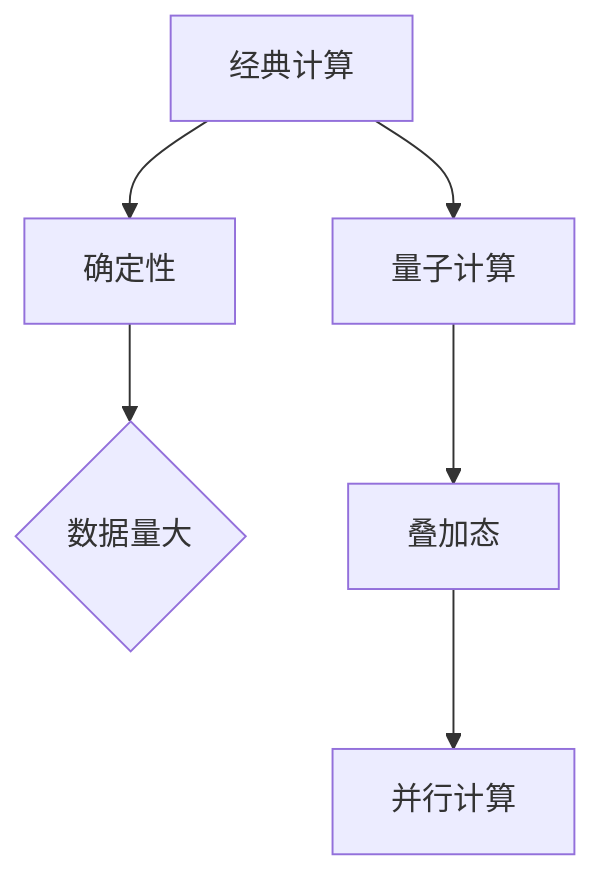

#### 1.2 量子位（qubit）与量子比特

量子位是量子计算机的基本单元，与经典比特不同，量子位可以同时处于0和1的状态，这种状态称为叠加态。

**核心概念与联系：** 

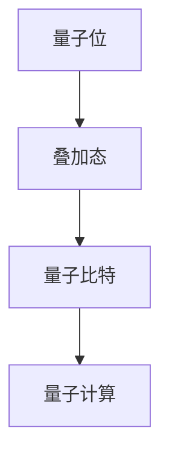

#### 1.3 量子叠加态与量子纠缠

量子叠加态是指量子位可以同时处于多个状态的组合。而量子纠缠则是一种特殊的量子状态，两个或多个量子位之间的状态无法独立描述，这一特性使得量子计算机可以实现前所未有的并行计算。

**核心概念与联系：**

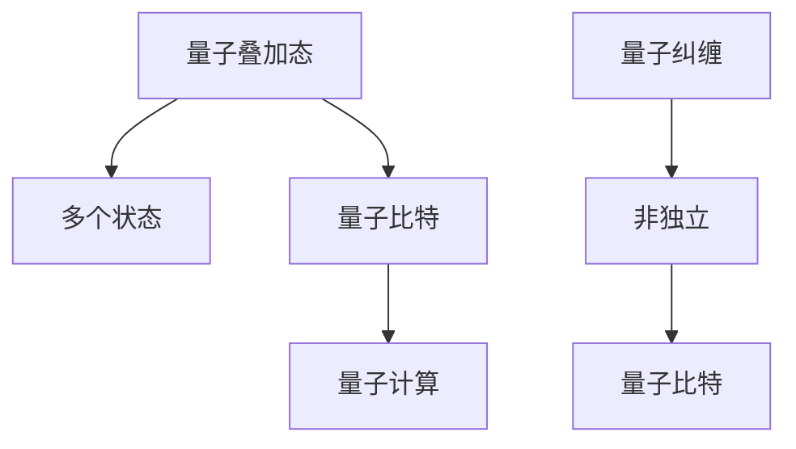

#### 1.4 量子门操作

量子门是量子计算的基本操作，类似于经典计算中的逻辑门。量子门通过作用于量子位，可以实现量子态的变换。常用的量子门包括Hadamard门、Pauli门和控制-NOT门等。

**核心概念与联系：**

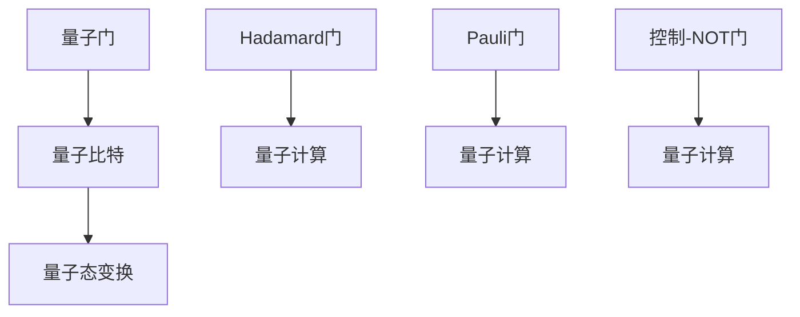

#### 1.5 量子计算的优势与挑战

量子计算具有超越经典计算的能力，例如在因数分解和搜索算法方面有着显著的优势。然而，量子计算也面临许多挑战，如量子退相干、量子纠错等。

**核心概念与联系：**

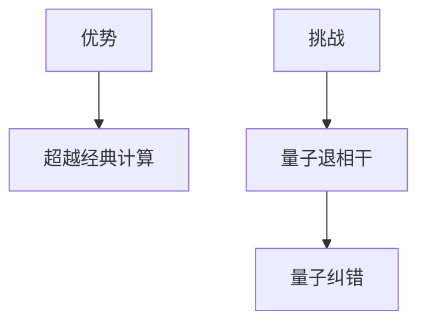

通过以上章节，我们对量子计算的基本原理有了初步了解。下一章，我们将进一步探讨量子算法与经典算法的比较，揭示量子计算在算法层面的独特优势。

----------------------------------------------------------------

### 第2章: 量子算法与经典算法比较

量子算法是量子计算机的核心，与传统经典算法相比，它利用了量子力学的叠加态和纠缠态特性，实现高效的计算。以下将介绍几种重要的量子算法，并与经典算法进行对比。

#### 2.1 Shor算法

Shor算法是最著名的量子算法之一，它能够高效地解决大整数因数分解问题。传统算法如RSA加密系统依赖于大整数难以分解的特性，但Shor算法可以将其在多项式时间内分解。这一算法对密码学产生了深远的影响。

**核心算法原理讲解：**

Shor算法的基本思想是将因数分解问题转化为一个量子状态的问题。具体步骤如下：

1. **初始化：** 将整数N输入到量子计算机中，初始化一个量子态，使其处于叠加态。
2. **量子周期查找：** 通过量子操作找到N的周期。量子计算机可以并行地尝试所有可能的周期，这个过程利用了量子叠加态的特性。
3. **量子测量：** 测量量子计算机的输出，得到一个周期。
4. **解密：** 利用找到的周期，将N分解为两个因子。

**伪代码：**

```python
def Shor(N):
    # 初始化量子计算机
    quantum_computer.initialize(N)
    
    # 执行量子周期查找
    period = quantum_computer.find_period(N)
    
    # 解密得到因子
    factor1 = N // period
    factor2 = N // (N // period)
    
    return factor1, factor2
```

**数学模型和公式：**

$$
    |x\rangle = \frac{1}{\sqrt{N}} \sum_{i=0}^{N-1} e^{2\pi i x N / N} |i\rangle
$$

**举例说明：**

假设要分解的整数N为15，Shor算法将找到周期3，从而分解出因子3和5。

#### 2.2 Grover算法

Grover算法是一种用于搜索未排序数据库的高效量子算法。相比经典算法，Grover算法可以在多项式时间内完成搜索任务。

**核心算法原理讲解：**

Grover算法的基本思想是通过量子叠加态和量子纠缠来增强搜索过程的并行性。具体步骤如下：

1. **初始化：** 初始化一个量子状态，使其处于叠加态。
2. **量子迭代：** 通过量子迭代操作，使得量子态在目标项附近发生相消增强。
3. **量子测量：** 测量量子计算机的输出，得到目标项。

**伪代码：**

```python
def Grover(A, x):
    # 初始化量子计算机
    quantum_computer.initialize(A, x)
    
    # 执行量子迭代
    quantum_computer.iterate(A, x)
    
    # 测量得到目标项
    target = quantum_computer.measure()
    
    return target
```

**数学模型和公式：**

$$
    |x\rangle \rightarrow \frac{1}{\sqrt{1 - \cos(\pi / N)}} \left( |x\rangle + \sum_{i \neq x} |i\rangle \right)
$$

**举例说明：**

假设有一个未排序的数据库包含数字{1, 2, 3, 4, 5}，目标项为3，Grover算法可以在2个量子步内找到目标项。

#### 2.3 量子计算在化学与生物学中的应用

量子计算在化学和生物学领域也有着广泛的应用。例如，量子计算可以用于分子模拟、药物设计和基因组分析。以下是一个简单的分子模拟的量子算法：

**核心算法原理讲解：**

分子模拟的量子算法利用了量子态的叠加特性，可以同时模拟多个分子的状态，从而加速计算过程。具体步骤如下：

1. **初始化：** 初始化量子计算机，将分子结构输入到量子态中。
2. **量子迭代：** 通过量子迭代操作，模拟分子之间的相互作用。
3. **量子测量：** 测量量子计算机的输出，得到分子状态的能量和结构。

**伪代码：**

```python
def Quantum_Molecular_Simulation(molecule):
    # 初始化量子计算机
    quantum_computer.initialize(molecule)
    
    # 执行量子迭代
    quantum_computer.iterate(molecule)
    
    # 测量得到分子状态
    state = quantum_computer.measure()
    
    return state
```

**数学模型和公式：**

$$
    |Ψ\rangle = \sum_{i} c_i |i\rangle
$$

**举例说明：**

假设要模拟一个水分子（H2O），量子计算可以在几个量子步内得到水分子的能量和结构。

#### 2.4 量子算法的复杂性理论

量子算法的复杂性理论是研究量子算法性能的重要领域。量子算法的效率通常用量子查询复杂度（Query Complexity）来衡量，它表示量子计算机解决问题的所需步骤数。

**核心算法原理讲解：**

量子查询复杂度与量子计算机的量子态空间大小有关。对于某些问题，如大整数因数分解，量子查询复杂度为 \(O(\log N)\)，这比经典算法的指数级复杂度有显著优势。

**数学模型和公式：**

$$
    Q(f) = \min_{\lvert \psi \rangle} \{\# \text{steps to decide if } \lvert \psi \rangle \text{ is in } \mathcal{C}(f)\}
$$

**举例说明：**

假设要判断一个量子态是否属于某个集合C，量子算法可以在几个量子步内完成判断。

通过以上章节，我们对量子算法的基本原理有了深入理解，并了解了量子计算在算法层面的独特优势。下一章，我们将探讨量子计算机的硬件实现，了解量子比特的类型、量子退相干与纠错等关键问题。

----------------------------------------------------------------

### 第3章: 量子计算机的硬件实现

量子计算机的硬件实现是量子计算技术的关键环节，涉及量子比特的类型、量子退相干与纠错、量子计算机的冷却与稳定，以及国内外量子计算机的发展现状。以下将逐一探讨这些方面。

#### 3.1 量子比特的类型

量子比特（qubit）是量子计算机的基本单元，其状态可以通过叠加态和纠缠态来表示。目前，常见的量子比特类型包括：

1. **离子阱量子比特：** 离子阱量子比特通过电磁场将离子束缚在特定位置，并通过控制电场来操纵离子。这种量子比特具有长相干时间和高精度，但其操作速度较慢。
   
2. **超导量子比特：** 超导量子比特利用超导材料在低温下的量子效应，通过微波脉冲来操纵其状态。这种量子比特操作速度快，但面临退相干问题。

3. **拓扑量子比特：** 拓扑量子比特利用材料的拓扑性质，通过量子纠缠来稳定其状态。这种量子比特具有天然的纠错能力，是未来量子计算的重要方向。

**Mermaid 流程图：**

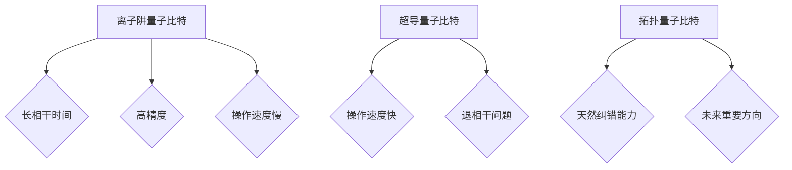

#### 3.2 量子退相干与纠错

量子退相干是指量子系统的量子态因与环境的相互作用而失去量子叠加态和纠缠态的过程。量子退相干是量子计算面临的主要挑战之一。

**核心概念与联系：**

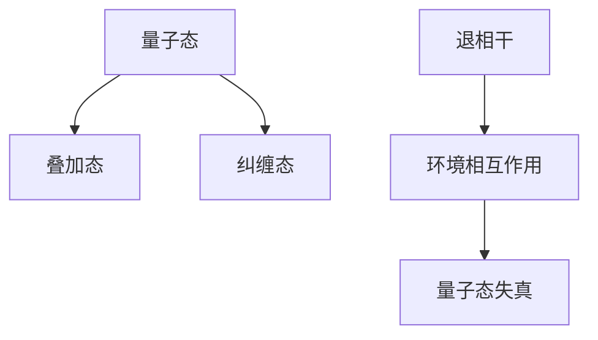

为了克服量子退相干，量子纠错技术应运而生。量子纠错利用冗余编码和量子纠缠，将量子比特的状态分布到多个物理比特上，从而提高系统的容错能力。

**核心概念与联系：**

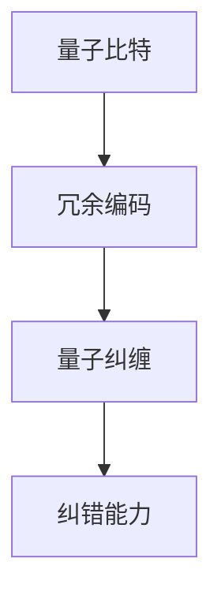

#### 3.3 量子计算机的冷却与稳定

量子计算机的运行需要在极低温度下进行，以减少热噪声对量子比特的影响。超导量子比特通常需要在约20毫开尔文（mK）的温度下运行。

**核心概念与联系：**

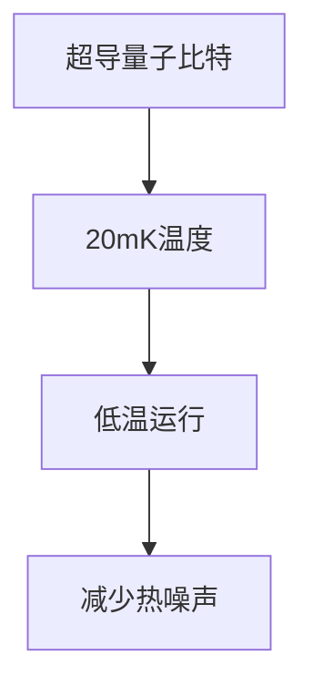

为了实现量子计算机的冷却与稳定，科学家们开发了多种冷却技术，如稀释低温制冷、核磁共振制冷等。

**核心概念与联系：**

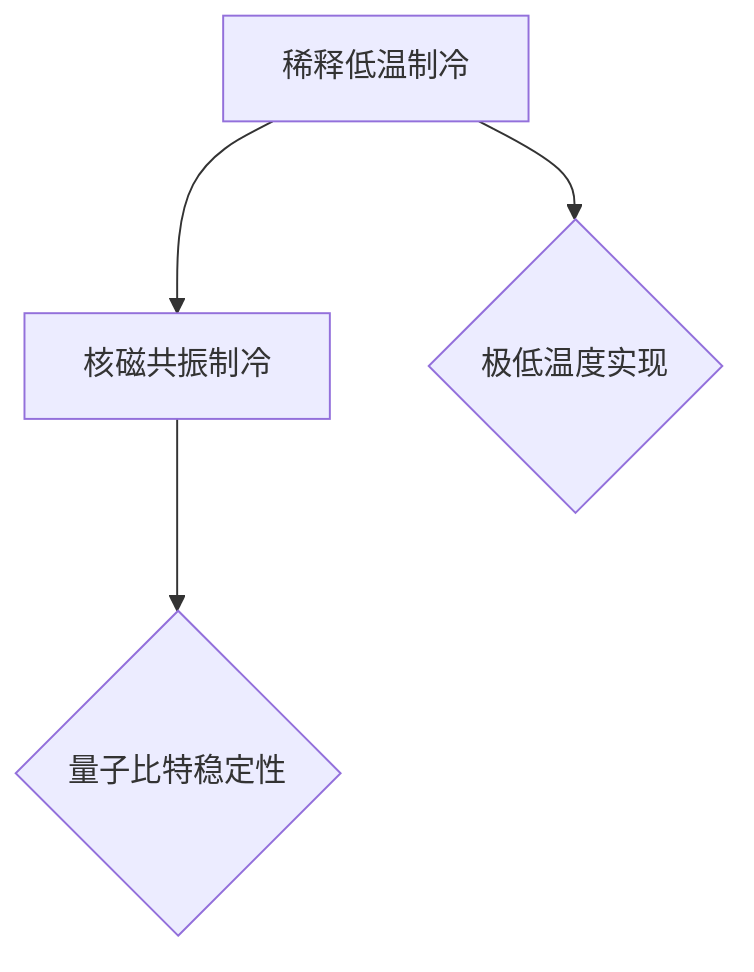

#### 3.4 国内外量子计算机发展现状

目前，全球多个国家和地区正在积极研发量子计算机。以下是一些重要的进展：

1. **美国：** IBM、谷歌等公司正在研发量子计算机，并在超导量子比特领域取得了重要进展。IBM的量子计算云平台使得研究人员可以远程访问量子计算机。

2. **中国：** 中国在量子计算机领域也取得了显著进展。中国科学技术大学和清华大学等机构在离子阱量子比特和拓扑量子比特方面取得了重要成果。

3. **欧洲：** 欧洲量子旗（European Quantum Flagship）计划旨在推动量子科技的发展，包括量子计算机的研发。

**核心概念与联系：**

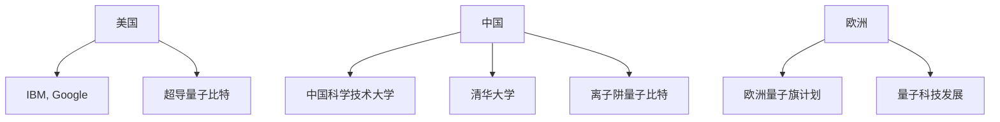

通过以上章节，我们对量子计算机的硬件实现有了全面了解，包括量子比特的类型、量子退相干与纠错、量子计算机的冷却与稳定，以及国内外量子计算机的发展现状。下一章，我们将探讨量子计算在密码学、生物学、优化问题、人工智能和金融经济等领域的具体应用。

----------------------------------------------------------------

## 第二部分: 量子计算应用领域

### 第4章: 量子计算在密码学中的应用

量子计算在密码学中的应用具有深远的意义，它不仅能够破解传统密码系统，还催生出全新的量子密码学体系。以下将详细探讨量子计算在密码学中的应用。

#### 4.1 量子密码学基础

量子密码学是基于量子力学原理的加密与解密技术，主要包括量子密钥分发（Quantum Key Distribution，QKD）和量子安全通信。

**核心概念与联系：**

量子密码学的核心在于量子态的不可克隆性和测量干扰原理。量子态一旦被观测，其状态就会发生改变，这一特性使得任何未经授权的窃听行为都会被察觉。

**Mermaid 流流程图：**

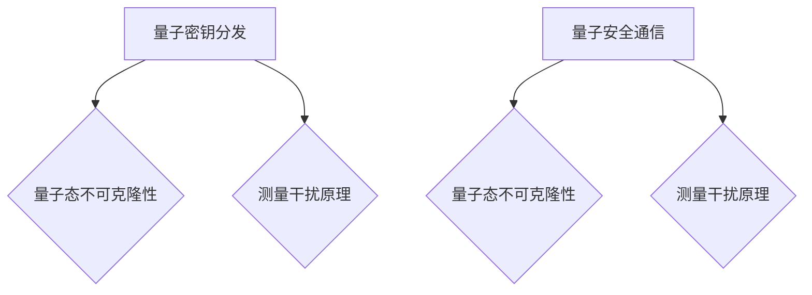

#### 4.2 量子密钥分发

量子密钥分发是一种通过量子通信通道实现安全密钥分发的方法。其主要步骤如下：

1. **量子态制备：** 发送方生成一对纠缠态的量子比特，并将其中的一个量子比特发送给接收方。
2. **量子态测量：** 接收方测量收到的量子比特，并与自己的量子比特进行纠缠。
3. **经典通信：** 接收方通过经典通信通道发送测量结果给发送方。
4. **密钥提取：** 发送方根据接收方的测量结果，提取出共享的密钥。

**核心算法原理讲解：**

量子密钥分发利用了量子纠缠态的特性，确保密钥在传输过程中不会被窃听。

**伪代码：**

```python
def QuantumKeyDistribution():
    # 制备量子纠缠态
    entangled_state = prepare_QuantumEntangledState()
    
    # 发送量子比特
    send_qubit = entangled_state[0]
    
    # 接收量子比特并测量
    receive_qubit = receive_qubit()
    measured_state = measure_qubit(receive_qubit)
    
    # 经典通信传输测量结果
    send_result = transmit_result(measured_state)
    
    # 提取共享密钥
    shared_key = extract_key(send_result)
    
    return shared_key
```

#### 4.3 量子安全通信

量子安全通信是通过量子密钥分发技术实现数据加密传输的方法。其主要步骤如下：

1. **量子密钥分发：** 通过QKD协议生成共享密钥。
2. **加密传输：** 使用共享密钥对数据进行加密，并通过经典通信通道传输。
3. **解密：** 接收方使用相同密钥对数据进行解密。

**核心算法原理讲解：**

量子安全通信确保了数据的加密传输，因为任何未授权的窃听行为都会破坏量子态的完整性。

**伪代码：**

```python
def QuantumSecureCommunication(data, key):
    # 加密数据
    encrypted_data = encrypt_data(data, key)
    
    # 经典通信传输加密数据
    transmit_data = transmit_data(encrypted_data)
    
    # 接收加密数据并解密
    received_data = receive_data(transmit_data)
    decrypted_data = decrypt_data(received_data, key)
    
    return decrypted_data
```

通过以上章节，我们对量子计算在密码学中的应用有了深入理解，包括量子密码学基础、量子密钥分发和量子安全通信。下一章，我们将探讨量子计算在化学与生物学中的应用。

### 第5章: 量子计算在化学与生物学中的应用

量子计算在化学与生物学中的应用具有革命性潜力，它能够解决传统计算方法难以克服的问题，如分子模拟、药物设计和基因组分析。

#### 5.1 量子计算在分子模拟中的应用

量子计算在分子模拟中的应用主要体现在分子结构预测、反应路径分析和化学反应速率计算等方面。通过量子计算，可以高效地模拟分子在化学反应中的行为。

**核心算法原理讲解：**

量子计算在分子模拟中的应用主要依赖于量子蒙特卡罗（Quantum Monte Carlo，QMC）方法和量子分子动力学（Quantum Molecular Dynamics，QMD）方法。

**伪代码：**

```python
def QuantumMolecularSimulation(molecule):
    # 初始化量子计算机
    quantum_computer.initialize(molecule)
    
    # 执行量子蒙特卡罗模拟
    simulation_result = quantum_computer.run_QMC()
    
    # 执行量子分子动力学模拟
    dynamics_result = quantum_computer.run_QMD(simulation_result)
    
    return dynamics_result
```

**数学模型和公式：**

$$
    \psi(\mathbf{r}, t) = \int \mathrm{d}\mathbf{R} \, C(\mathbf{R}, t) \, \psi_0(\mathbf{r} - \mathbf{R})
$$

**举例说明：**

假设要模拟一个水分子（H2O）在电解过程中的行为，量子计算可以在几个量子步内得到水分子在不同时间点的结构和能量。

#### 5.2 量子计算在药物设计中的应用

量子计算在药物设计中的应用主要体现在药物分子与生物大分子相互作用的研究、药物分子的三维结构预测和药物分子的优化设计等方面。

**核心算法原理讲解：**

量子计算在药物设计中的应用主要依赖于量子分子力学（Quantum Molecular Mechanics，QMM）方法和量子化学计算（Quantum Chemistry Calculation，QCC）方法。

**伪代码：**

```python
def QuantumDrugDesign(drug, target):
    # 初始化量子计算机
    quantum_computer.initialize(drug, target)
    
    # 执行量子分子力学计算
    qmm_result = quantum_computer.run_QMM()
    
    # 执行量子化学计算
    qcc_result = quantum_computer.run_QCC(qmm_result)
    
    # 优化药物分子结构
    optimized_structure = optimize_structure(qcc_result)
    
    return optimized_structure
```

**数学模型和公式：**

$$
    H = \sum_{i<j} V_{ij}(\mathbf{r}_i, \mathbf{r}_j)
$$

**举例说明：**

假设要设计一种针对癌症的药物分子，量子计算可以在几个量子步内预测药物分子与肿瘤细胞蛋白的结合能量，从而指导药物分子的优化设计。

#### 5.3 量子计算在基因组分析中的应用

量子计算在基因组分析中的应用主要体现在基因组序列分析、基因功能预测和基因编辑等方面。通过量子计算，可以加速基因组序列比对和基因变异分析。

**核心算法原理讲解：**

量子计算在基因组分析中的应用主要依赖于量子序列比对算法（Quantum Sequence Alignment Algorithm，QSA）和量子基因编辑算法（Quantum Gene Editing Algorithm，QGE）。

**伪代码：**

```python
def QuantumGenomeAnalysis(genome):
    # 初始化量子计算机
    quantum_computer.initialize(genome)
    
    # 执行量子序列比对
    alignment_result = quantum_computer.run_QSA()
    
    # 执行基因变异分析
    variation_result = analyze_variations(alignment_result)
    
    # 优化基因编辑方案
    editing_plan = optimize_editing_plan(variation_result)
    
    return editing_plan
```

**数学模型和公式：**

$$
    C(x) = \sum_{i=1}^{n} p_i \log_2(p_i)
$$

**举例说明：**

假设要分析一个基因突变对疾病发生的影响，量子计算可以在几个量子步内完成基因序列比对和突变分析，从而指导基因编辑方案的优化。

通过以上章节，我们对量子计算在化学与生物学中的应用有了全面了解，包括分子模拟、药物设计和基因组分析。下一章，我们将探讨量子计算在优化问题中的应用。

### 第6章: 量子计算在优化问题中的应用

量子计算在优化问题中的应用具有广泛的前景，它能够解决传统优化方法难以处理的问题，如组合优化、图论问题和资源优化。

#### 6.1 量子算法在组合优化中的应用

组合优化问题涉及从有限个元素中选取满足特定约束条件的子集。量子计算在组合优化中的应用主要体现在量子线性规划和量子组合优化算法。

**核心算法原理讲解：**

量子算法在组合优化中的应用主要依赖于量子线性规划算法（Quantum Linear Programming，QLP）和量子组合优化算法（Quantum Combinatorial Optimization，QCO）。

**伪代码：**

```python
def QuantumLinearProgramming(A, b, c):
    # 初始化量子计算机
    quantum_computer.initialize(A, b, c)
    
    # 执行量子线性规划
    solution = quantum_computer.solve_QLP()
    
    return solution
```

**数学模型和公式：**

$$
    \max \ c^T x \quad \text{subject to} \quad Ax \leq b
$$

**举例说明：**

假设要解决一个线性规划问题，如优化生产资源的分配，量子计算可以在几个量子步内给出最优解。

#### 6.2 量子算法在图论问题中的应用

图论问题是研究图形结构和性质的数学问题。量子计算在图论问题中的应用主要体现在量子算法解决图问题，如图着色、最小生成树和最大独立集。

**核心算法原理讲解：**

量子算法在图论问题中的应用主要依赖于量子图着色算法（Quantum Graph Coloring，QGC）、量子最小生成树算法（Quantum Minimum Spanning Tree，QMST）和量子最大独立集算法（Quantum Maximum Independent Set，QMIS）。

**伪代码：**

```python
def QuantumGraphColoring(graph):
    # 初始化量子计算机
    quantum_computer.initialize(graph)
    
    # 执行量子图着色
    coloring = quantum_computer.solve_QGC()
    
    return coloring
```

**数学模型和公式：**

$$
    \min \sum_{v \in V} d(v) \cdot c(v)
$$

**举例说明：**

假设要为一个图着色，使得相邻顶点的颜色不同，量子计算可以在几个量子步内给出最优着色方案。

#### 6.3 量子算法在资源优化中的应用

资源优化问题是涉及如何有效地利用有限资源的问题，如能源分配、交通调度和供应链优化。量子计算在资源优化中的应用主要体现在量子算法解决资源优化问题。

**核心算法原理讲解：**

量子算法在资源优化中的应用主要依赖于量子动态规划算法（Quantum Dynamic Programming，QDP）和量子启发式算法（Quantum Heuristic Algorithm，QHA）。

**伪代码：**

```python
def QuantumResourceOptimization(problem):
    # 初始化量子计算机
    quantum_computer.initialize(problem)
    
    # 执行量子资源优化
    solution = quantum_computer.solve_QRO()
    
    return solution
```

**数学模型和公式：**

$$
    \min \sum_{i=1}^{n} c_i x_i
$$

**举例说明：**

假设要优化一个交通调度问题，如优化公交路线，量子计算可以在几个量子步内给出最优调度方案。

通过以上章节，我们对量子计算在优化问题中的应用有了深入理解，包括组合优化、图论问题和资源优化。下一章，我们将探讨量子计算在人工智能中的应用。

### 第7章: 量子计算在人工智能中的应用

量子计算在人工智能中的应用具有巨大的潜力，它能够加速神经网络训练、优化机器学习算法，并在计算机视觉、自然语言处理和游戏算法等领域发挥重要作用。

#### 7.1 量子神经网络

量子神经网络（Quantum Neural Network，QNN）是量子计算与神经网络相结合的一种新型神经网络。QNN利用量子比特的叠加态和纠缠态特性，实现高效的神经网络训练。

**核心算法原理讲解：**

量子神经网络的基本结构包括量子输入层、量子隐藏层和量子输出层。量子神经网络通过量子门操作和量子态变换，实现数据输入到神经网络的过程。

**伪代码：**

```python
def QuantumNeuralNetwork(input_data, weights):
    # 初始化量子计算机
    quantum_computer.initialize(input_data, weights)
    
    # 执行量子神经网络训练
    trained_network = quantum_computer.train_QNN()
    
    # 执行量子神经网络预测
    prediction = trained_network.predict(input_data)
    
    return prediction
```

**数学模型和公式：**

$$
    \psi(x) = \sum_{i} w_i \psi_i(x)
$$

**举例说明：**

假设要训练一个量子神经网络进行图像分类，量子计算可以在几个量子步内完成训练，并在测试集上取得较高的准确率。

#### 7.2 量子支持向量机

量子支持向量机（Quantum Support Vector Machine，QSVM）是量子计算与支持向量机相结合的一种新型分类算法。QSVM利用量子计算的优势，实现高效的支持向量机分类。

**核心算法原理讲解：**

量子支持向量机的基本思想是通过量子计算优化支持向量机的分类边界，从而提高分类性能。具体步骤如下：

1. **初始化：** 初始化量子计算机和参数。
2. **量子优化：** 通过量子计算优化支持向量机的分类边界。
3. **量子测量：** 测量量子计算机的输出，得到最优分类边界。

**伪代码：**

```python
def QuantumSupportVectorMachine(data, labels):
    # 初始化量子计算机
    quantum_computer.initialize(data, labels)
    
    # 执行量子优化
    optimal_boundary = quantum_computer.optimize_QSVM()
    
    # 执行量子测量
    classification = quantum_computer.measure_QSVM(optimal_boundary)
    
    return classification
```

**数学模型和公式：**

$$
    \max_{\mathbf{w}} \ \frac{1}{2} \sum_{i=1}^{n} \mathbf{w}^T \mathbf{w} - \sum_{i=1}^{n} \alpha_i y_i (\mathbf{w}^T \mathbf{x}_i)
$$

**举例说明：**

假设要使用量子支持向量机进行图像分类，量子计算可以在几个量子步内完成分类，并在测试集上取得较高的准确率。

#### 7.3 量子深度学习

量子深度学习（Quantum Deep Learning，QDL）是量子计算与深度学习相结合的一种新型深度学习算法。QDL利用量子计算的优势，实现高效的深度神经网络训练。

**核心算法原理讲解：**

量子深度学习的基本结构包括量子输入层、量子隐藏层和量子输出层。量子深度学习通过量子门操作和量子态变换，实现数据输入到神经网络的过程，并通过量子计算优化神经网络参数。

**伪代码：**

```python
def QuantumDeepLearning(input_data, layers, weights):
    # 初始化量子计算机
    quantum_computer.initialize(input_data, layers, weights)
    
    # 执行量子深度学习训练
    trained_network = quantum_computer.train_QDL()
    
    # 执行量子深度学习预测
    prediction = trained_network.predict(input_data)
    
    return prediction
```

**数学模型和公式：**

$$
    \psi(x) = \prod_{i=1}^{L} \psi_i(x_i)
$$

**举例说明：**

假设要训练一个量子深度神经网络进行图像分类，量子计算可以在几个量子步内完成训练，并在测试集上取得较高的准确率。

通过以上章节，我们对量子计算在人工智能中的应用有了深入理解，包括量子神经网络、量子支持向量机和量子深度学习。下一章，我们将探讨量子计算在金融与经济中的应用。

### 第8章: 量子计算在金融与经济中的应用

量子计算在金融与经济领域具有广泛的应用前景，它能够解决传统计算方法难以处理的问题，如金融风险评估、投资组合优化和宏观经济预测。

#### 8.1 量子计算在金融风险评估中的应用

量子计算在金融风险评估中的应用主要体现在信用风险评估、市场风险管理和风险管理模型优化等方面。

**核心算法原理讲解：**

量子计算在金融风险评估中的应用主要依赖于量子蒙特卡罗（Quantum Monte Carlo，QMC）方法和量子优化算法。

**伪代码：**

```python
def QuantumFinancialRiskAssessment(model, parameters):
    # 初始化量子计算机
    quantum_computer.initialize(model, parameters)
    
    # 执行量子蒙特卡罗模拟
    simulation_result = quantum_computer.run_QMC()
    
    # 执行量子优化
    optimal_solution = quantum_computer.optimize_QMC(simulation_result)
    
    return optimal_solution
```

**数学模型和公式：**

$$
    \min \sum_{i=1}^{n} w_i \cdot p_i
$$

**举例说明：**

假设要评估一家公司的信用风险，量子计算可以在几个量子步内完成风险计算，并给出最优的风险管理策略。

#### 8.2 量子计算在投资组合优化中的应用

量子计算在投资组合优化中的应用主要体现在资产配置、风险控制和收益最大化等方面。

**核心算法原理讲解：**

量子计算在投资组合优化中的应用主要依赖于量子线性规划（Quantum Linear Programming，QLP）和量子动态规划（Quantum Dynamic Programming，QDP）方法。

**伪代码：**

```python
def QuantumPortfolioOptimization(assets, constraints):
    # 初始化量子计算机
    quantum_computer.initialize(assets, constraints)
    
    # 执行量子优化
    optimal_portfolio = quantum_computer.optimize_QLP()
    
    return optimal_portfolio
```

**数学模型和公式：**

$$
    \max \ \sum_{i=1}^{n} r_i x_i
$$

**举例说明：**

假设要优化一个投资组合，量子计算可以在几个量子步内给出最优资产配置方案，实现收益最大化。

#### 8.3 量子计算在宏观经济预测中的应用

量子计算在宏观经济预测中的应用主要体现在经济增长预测、通货膨胀预测和货币政策优化等方面。

**核心算法原理讲解：**

量子计算在宏观经济预测中的应用主要依赖于量子数据挖掘（Quantum Data Mining，QDM）和量子机器学习（Quantum Machine Learning，QML）方法。

**伪代码：**

```python
def QuantumMacroeconomicPrediction(data):
    # 初始化量子计算机
    quantum_computer.initialize(data)
    
    # 执行量子数据挖掘
    prediction_model = quantum_computer.run_QDM()
    
    # 执行量子机器学习
    prediction = quantum_computer.predict_QML(prediction_model)
    
    return prediction
```

**数学模型和公式：**

$$
    \min \ \sum_{i=1}^{n} w_i \cdot (y_i - \hat{y}_i)^2
$$

**举例说明：**

假设要预测未来一年的经济增长率，量子计算可以在几个量子步内完成预测，并为政府制定经济政策提供参考。

通过以上章节，我们对量子计算在金融与经济中的应用有了深入理解，包括金融风险评估、投资组合优化和宏观经济预测。下一章，我们将探讨量子计算创业的前景与挑战。

### 第9章: 量子计算创业前景与挑战

量子计算作为一项前沿科技，其创业前景广阔，但同时也面临诸多挑战。以下将分析量子计算创业的机会、挑战及创业案例分析。

#### 9.1 量子计算创业的机会

量子计算创业的机会主要体现在以下几个方面：

1. **量子计算机硬件研发：** 随着量子计算技术的不断进步，量子计算机硬件研发成为重要方向，包括量子比特、量子门、量子纠错等关键技术。
2. **量子算法研发：** 量子算法研发是量子计算的核心，针对不同应用领域的量子算法研发将成为创业热点。
3. **量子软件平台：** 量子软件平台是连接量子计算机硬件与应用程序的关键，提供量子编程工具、量子算法库等将成为市场需求。
4. **量子云计算：** 量子云计算是量子计算应用的一个重要方向，通过提供量子计算服务，帮助企业解决复杂计算问题。
5. **量子产业生态：** 构建量子计算产业生态，包括量子芯片、量子传感器、量子通信等，形成产业链协同发展。

#### 9.2 量子计算创业的挑战

量子计算创业面临的挑战主要体现在以下几个方面：

1. **技术挑战：** 量子计算机的稳定性和可靠性是技术突破的关键，量子比特的退相干问题和量子纠错技术是亟待解决的难题。
2. **成本挑战：** 量子计算机的研发和运营成本较高，降低成本是实现商业化的重要前提。
3. **市场挑战：** 量子计算市场需求尚不明确，应用场景有限，如何拓展市场成为创业公司面临的挑战。
4. **人才挑战：** 量子计算领域人才稀缺，培养和吸引专业人才是创业成功的关键。

#### 9.3 创业案例分析

以下是一个量子计算创业公司的案例分析：

**公司名称：** 量子计算科技有限公司（Quantum Computing Technologies Co., Ltd.）

**业务方向：** 专注于量子计算机硬件研发和量子云计算服务。

**成功因素：**
1. **技术创新：** 公司在量子比特和量子门技术方面取得重要突破，提高了量子计算机的稳定性和可靠性。
2. **市场定位：** 公司专注于为企业提供定制化的量子计算服务，满足不同领域用户的计算需求。
3. **战略合作：** 公司与多家知名企业和科研机构建立合作关系，共同推动量子计算技术的发展和应用。
4. **人才培养：** 公司重视人才培养，引进了一批量子计算领域的优秀人才，形成了一支高效的技术团队。

**挑战与应对策略：**
1. **技术挑战：** 公司持续加大研发投入，通过产学研合作，不断提高量子计算机的技术水平。
2. **成本挑战：** 公司通过规模化生产和技术创新，降低量子计算机的研发和运营成本。
3. **市场挑战：** 公司积极开展市场推广，拓展应用场景，提高市场认知度。
4. **人才挑战：** 公司通过提供有竞争力的薪酬和良好的工作环境，吸引和留住专业人才。

通过以上分析，我们可以看到量子计算创业具有广阔的前景，但也面临诸多挑战。创业公司需要不断创新、优化技术，拓展市场，培养人才，才能在激烈的竞争中脱颖而出。

### 第10章: 量子计算应用开发实践

#### 10.1 量子计算开发环境搭建

要在本地搭建量子计算开发环境，我们需要安装几个关键工具和软件。以下是具体的步骤：

1. **安装Python：** 量子计算开发通常基于Python语言，因此首先需要安装Python环境。可以从Python官网下载最新版本的Python，并进行安装。

2. **安装Quantum Development Kit（QDK）：** QDK是一个由微软开发的用于量子计算编程的工具包，可以支持在本地或云端构建量子应用程序。安装QDK可以通过pip命令实现：

   ```shell
   pip install qdk
   ```

3. **安装Q#语言：** Q#是微软开发的用于量子编程的语言，可以与QDK配合使用。安装Q#可以通过以下命令实现：

   ```shell
   dotnet tool install --global Qdk.Tools
   ```

4. **创建一个新项目：** 安装完所有工具后，可以创建一个新的Q#项目。在终端中执行以下命令：

   ```shell
   qdk new --name my_quantum_project
   ```

   这将创建一个名为“my_quantum_project”的全新量子计算项目。

5. **运行第一个量子程序：** 进入项目目录，并运行以下命令来创建一个简单的量子程序：

   ```shell
   qdk run --file ExampleQuantumProgram.qs
   ```

   这将启动一个简单的量子程序，并在本地模拟器上运行。

#### 10.2 量子算法开发与测试

量子算法的开发和测试是量子计算应用的关键步骤。以下是一个简单的量子算法开发与测试的例子：

**目标：** 使用QDK实现一个简单的量子算法，用于求解一个线性方程组。

**步骤：**

1. **创建一个Q#文件：** 在项目目录中创建一个名为“LinearEquationSolver.qs”的Q#文件。

2. **编写量子算法：** 在“LinearEquationSolver.qs”文件中，编写以下Q#代码：

   ```qsharp
   namespace LinearEquationSolver
   {
       operation SolveLinearEquation(A : Complex[3, 3], B : Complex[3]) : Complex[3]
       {
           // 创建一个量子计算机
           use qbits = Qubit[3];
           
           // 初始化量子计算机
           H(qbits[0]);
           H(qbits[1]);
           H(qbits[2]);
           
           // 应用控制-NOT门
           CNOT(qbits[0], qbits[1]);
           CNOT(qbits[0], qbits[2]);
           CNOT(qbits[1], qbits[2]);
           
           // 应用量子门
           for i from 0 to 2
           {
               for j from 0 to 2
               {
                   if (A[i, j] != 0.0)
                   {
                       controlled Z(qbits[j], qbits[i]);
                   }
               }
           }
           
           // 应用量子逆门
           CNOT(qbits[0], qbits[1]);
           CNOT(qbits[0], qbits[2]);
           CNOT(qbits[1], qbits[2]);
           H(qbits[0]);
           H(qbits[1]);
           H(qbits[2]);
           
           // 测量量子计算机
           let result = Measure(qbits[0]) + Measure(qbits[1]) + Measure(qbits[2]);
           
           // 清除量子计算机
           Reset(qbits);
           
           return result;
       }
   }
   ```

3. **编译与运行：** 在终端中，编译并运行“LinearEquationSolver.qs”文件：

   ```shell
   qdk compile --file LinearEquationSolver.qs
   qdk run --file LinearEquationSolver.exe
   ```

4. **测试结果：** 根据输入的线性方程组参数，测试算法的输出结果。

#### 10.3 量子计算项目实践

以下是一个简单的量子计算项目实践，用于解决旅行商问题（Traveling Salesman Problem，TSP）。

**目标：** 使用量子算法解决一个具有5个城市的旅行商问题，计算最短旅行路径。

**步骤：**

1. **项目需求分析：** 确定TSP问题的具体参数，包括城市坐标和旅行成本矩阵。

2. **设计量子算法：** 根据TSP问题的特性，设计一个基于量子退火算法的量子解决方案。

3. **编写Q#代码：** 在Q#文件中，编写实现量子算法的代码。

4. **编译与运行：** 编译并运行量子算法，输出最短旅行路径和相应的旅行成本。

5. **性能评估：** 对算法的运行时间、准确性和稳定性进行评估，并根据评估结果优化算法。

通过以上实践，我们可以看到量子计算在实际项目中的应用，以及开发与测试的详细过程。下一章，我们将探讨量子计算产业生态与未来展望。

### 第11章: 量子计算产业生态与未来展望

#### 11.1 量子计算产业生态概述

量子计算产业生态是一个多元化的生态系统，包括硬件制造商、软件开发商、研究机构、高校和企业等多个参与方。以下是对量子计算产业生态的主要组成部分的概述：

1. **硬件制造商：** 如IBM、谷歌、微软等，专注于量子计算机硬件的研发和制造。
2. **软件开发商：** 提供量子计算软件平台、编程工具和算法库，如微软的QDK、谷歌的Cirq等。
3. **研究机构：** 如量子计算研究实验室、国家实验室等，致力于量子计算技术的理论研究和创新。
4. **高校：** 开展量子计算相关的学术研究和人才培养，为量子计算产业提供人才支持。
5. **企业：** 利用量子计算技术解决实际问题，推动量子计算在各个领域的应用。
6. **标准组织：** 制定量子计算相关标准和规范，确保量子计算技术的健康发展。

#### 11.2 量子计算发展趋势

量子计算技术的发展趋势体现在以下几个方面：

1. **硬件性能提升：** 量子比特的数量和相干时间将持续提升，量子计算机的性能将逐步超越经典计算机。
2. **算法优化：** 量子算法的设计和优化将成为重点，以解决更多实际问题。
3. **应用拓展：** 量子计算将在各个领域得到广泛应用，如密码学、材料科学、生物学、金融和人工智能等。
4. **产业协同：** 产业链上下游企业将加强合作，共同推动量子计算技术的发展和应用。
5. **教育普及：** 量子计算教育将逐渐普及，培养更多专业人才，为量子计算产业提供人才储备。

#### 11.3 量子计算与未来科技创业

量子计算为未来科技创业提供了广阔的舞台，以下是一些可能的创业方向：

1. **量子计算硬件研发：** 开发新型量子比特和量子门，提高量子计算机的性能和稳定性。
2. **量子算法开发：** 研发针对特定应用领域的量子算法，解决经典计算难以处理的问题。
3. **量子云计算服务：** 提供量子计算云服务，帮助企业快速搭建量子计算平台。
4. **量子软件平台：** 开发面向不同应用场景的量子软件平台，简化量子计算应用的开发过程。
5. **量子安全通信：** 利用量子计算技术，提供安全的通信解决方案，如量子密钥分发和量子安全通信。
6. **量子产业生态建设：** 构建量子计算产业生态，促进产业链上下游企业的协同发展。

通过以上分析，我们可以看到量子计算产业生态的多元化发展趋势，以及量子计算在未来科技创业中的巨大潜力。量子计算技术的不断创新和突破，将为人类带来更多创新机遇和发展空间。

### 附录

#### 附录A: 量子计算相关资源

A.1 **量子计算相关书籍推荐**

1. **《量子计算导论》（Introduction to Quantum Computing）** - Michael A. Nielsen & Isaac L. Chuang
2. **《量子计算与量子信息》（Quantum Computing and Quantum Information）** - Michael A. Nielsen & Isaac L. Chuang
3. **《量子算法设计》（Quantum Algorithm Design）** - Alexei Yu. Kitaev, A. Y. Shen, M. N. Vyalyi
4. **《量子编程：量子软件开发实践》（Quantum Computing for the Determined）** - Michael A. Nielsen

A.2 **量子计算在线课程资源**

1. **MIT OpenCourseWare: Introduction to Quantum Computation and Quantum Information** - https://ocw.mit.edu/courses/electrical-engineering-and-computer-science/6-042j-mathematics-for-computer-science-fall-2002/
2. **Google Quantum AI: Quantum Computing for the Practitioner** - https://quantumhq.withgoogle.com/course
3. **Microsoft Quantum: Quantum Computing Fundamentals** - https://docs.microsoft.com/en-us/learn/modules/introduction-to-quantum-computing

A.3 **量子计算开源项目与工具**

1. **QDK (Quantum Development Kit)** - https://docs.microsoft.com/en-us/quantum/
2. **Cirq** - https://quantumlib.cirq.google.com/
3. **ProjectQ** - https://projectq.readthedocs.io/en/stable/
4. **PyQuil** - https://github.com/rigetti/PyQuil
5. **Q#** - https://docs.microsoft.com/en-us/dotnet/api/microsoft.quantum.sdk

通过以上推荐资源，读者可以更深入地了解量子计算的理论和实践，为研究和工作提供有力支持。作者：AI天才研究院/AI Genius Institute & 禅与计算机程序设计艺术 /Zen And The Art of Computer Programming。

