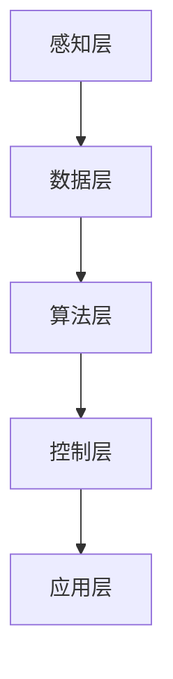

                 

## 《顺丰科技2025无人机调度系统工程师社招面试经验谈》

关键词：无人机，人工智能，调度系统，算法，面试经验，技术实战

摘要：本文将围绕顺丰科技2025无人机调度系统工程师的社招面试经验进行深入探讨。从无人机与人工智能的基础知识出发，详细解析无人机调度系统的架构、算法原理及数学模型，并通过实际项目案例展示调度系统的开发过程。此外，本文还将分享面试准备和策略，为无人机调度系统工程师的面试提供全面指导。

----------------------------------------------------------------

### 第一部分：无人机与人工智能基础

#### 1.1 无人机与人工智能概述

#### 1.1.1 无人机技术的发展历程

无人机（Unmanned Aerial Vehicle，简称UAV）最早起源于20世纪50年代的军事领域。当时，由于飞行员的安全问题，美国军方开始研发无人飞机。随着技术的进步，无人机逐渐从军事领域扩展到民用领域。

民用无人机的发展可以分为三个阶段：

1. **第一阶段（2000年前）**：主要应用于航拍、气象监测、环境监测等领域。这个阶段无人机技术相对简单，飞行时间短，载荷较小。

2. **第二阶段（2000-2010年）**：随着传感器技术、电池技术、计算机视觉技术的发展，无人机开始应用于农业、物流、灾害救援等领域。飞行时间和载荷都有所提升。

3. **第三阶段（2010年至今）**：人工智能技术开始深度应用于无人机领域，无人机开始具备自主飞行、自主避障、自动调度等能力。这一阶段，无人机在物流、农业、测绘、安防等领域得到广泛应用。

#### 1.1.2 人工智能在无人机领域的应用

人工智能（Artificial Intelligence，简称AI）在无人机领域的应用主要体现在以下几个方面：

1. **自主飞行**：通过计算机视觉、深度学习等技术，无人机可以自主识别环境，实现自主飞行。例如，无人机在配送过程中，可以通过计算机视觉技术识别道路、行人等，实现自主避障。

2. **自主避障**：通过激光雷达、超声波传感器等技术，无人机可以实时感知周围环境，实现自主避障。这对于无人机在复杂环境中的应用具有重要意义。

3. **自动调度**：通过优化算法、机器学习等技术，无人机可以实现自动调度。例如，在物流配送中，无人机可以根据实时路况、货物数量等因素，自动规划最优配送路线。

4. **数据采集与处理**：无人机可以携带多种传感器，实时采集环境数据。这些数据经过人工智能技术处理，可以用于环境监测、灾害预警等领域。

### 1.2 无人机调度系统架构

#### 1.2.1 调度系统基本概念

无人机调度系统是指用于管理无人机任务的系统，其主要功能是根据任务需求和无人机状态，规划最优的任务分配和执行策略。调度系统通常包括以下几个模块：

1. **任务管理模块**：负责管理无人机任务，包括任务的创建、修改、删除等操作。
2. **状态监控模块**：负责监控无人机状态，包括位置、电量、负载等。
3. **调度算法模块**：根据任务需求和无人机状态，规划最优的任务分配和执行策略。
4. **通信模块**：负责无人机与地面控制站的通信，包括数据传输、命令下发等。

#### 1.2.2 调度系统架构设计

无人机调度系统的架构设计可以分为以下几个层次：

1. **感知层**：包括无人机传感器、状态监控模块等，负责实时采集无人机状态信息。
2. **数据层**：包括任务管理模块、状态监控模块等，负责存储和管理无人机任务及状态信息。
3. **算法层**：包括调度算法模块，负责根据任务需求和无人机状态，规划最优的任务分配和执行策略。
4. **控制层**：包括通信模块、无人机控制模块等，负责下发任务指令、监控无人机状态。
5. **应用层**：包括无人机自主飞行、自动避障、数据采集与处理等应用模块，负责实现无人机功能。

以下是一个简单的 Mermaid 流程图，展示了无人机调度系统的架构：



#### 1.2.3 调度系统架构设计

在无人机调度系统的架构设计中，我们需要考虑以下几个方面：

1. **系统可靠性**：无人机调度系统需要保证系统的可靠性，确保在无人机发生故障或网络中断等情况下，系统能够自动恢复或切换到备用方案。
2. **响应速度**：调度系统需要快速响应用户需求，包括任务创建、任务分配、任务执行等，以保证无人机能够及时完成任务。
3. **可扩展性**：调度系统需要具备良好的可扩展性，能够适应无人机数量和任务类型的增长，同时支持不同类型的无人机。
4. **安全性**：调度系统需要确保数据安全，包括用户数据、任务数据等，防止数据泄露或篡改。

### 1.3 无人机调度算法原理

#### 1.3.1 调度算法基础概念

无人机调度算法是指用于解决无人机任务分配和执行策略的算法。调度算法的目标是找到一种最优或近似最优的任务分配方案，使得无人机能够高效、可靠地完成任务。

常见的无人机调度算法包括：

1. **贪心算法**：通过每次选择当前最优的方案，逐步构建最优解。
2. **动态规划**：通过将问题划分为子问题，并求解子问题的最优解，最终得到原问题的最优解。
3. **遗传算法**：通过模拟生物进化过程，逐步优化解的多样性，最终找到最优解。
4. **粒子群优化算法**：通过模拟鸟群觅食行为，逐步优化解的位置和速度。

#### 1.3.2 常见调度算法分析

1. **贪心算法**：贪心算法的基本思想是每次选择当前最优的方案，逐步构建最优解。例如，在无人机配送任务中，我们可以采用贪心算法来分配无人机任务，每次选择距离最近的货物进行配送。

   **伪代码示例**：

   ```python
   function greedy_algorithm(tasks, drones):
       for each drone in drones:
           while tasks have not been assigned:
               assign the nearest unassigned task to the drone
       return assigned tasks
   ```

2. **动态规划**：动态规划将问题划分为子问题，并求解子问题的最优解，最终得到原问题的最优解。例如，在无人机任务分配问题中，我们可以使用动态规划来找到最优的任务分配方案。

   **伪代码示例**：

   ```python
   function dynamic_programming(tasks, drones):
       dp[i][j] = optimal solution for assigning i tasks to j drones
       for i from 1 to number of tasks:
           for j from 1 to number of drones:
               if j == 0:
                   dp[i][j] = 0
               else:
                   dp[i][j] = min(dp[i - 1][j], dp[i - 1][j - 1])
       return dp[number of tasks][number of drones]
   ```

3. **遗传算法**：遗传算法通过模拟生物进化过程，逐步优化解的多样性，最终找到最优解。遗传算法通常包括选择、交叉、变异等操作。

   **伪代码示例**：

   ```python
   function genetic_algorithm(tasks, drones):
       population = initialize_population()
       while not convergence:
           fitness = evaluate_population(population)
           selected = select_parents(population, fitness)
           offspring = crossover(selected)
           offspring = mutate(offspring)
           population = replace_population(population, offspring)
       return best_solution(population)
   ```

4. **粒子群优化算法**：粒子群优化算法通过模拟鸟群觅食行为，逐步优化解的位置和速度。粒子群优化算法通常包括位置更新、速度更新等操作。

   **伪代码示例**：

   ```python
   function particle Swarm Optimization(tasks, drones):
       particles = initialize_particles()
       velocities = initialize_velocities()
       while not convergence:
           positions = update_positions(particles, velocities)
           fitness = evaluate_particles(particles)
           velocities = update_velocities(particles, velocities)
       return best_solution(particles)
   ```

#### 1.3.3 调度算法伪代码示例

以下是一个简单的无人机调度算法伪代码示例，用于分配无人机任务：

```python
function UAV_Scheduling(tasks, drones):
    # 初始化无人机任务列表
    assigned_tasks = []

    # 循环遍历所有无人机
    for drone in drones:
        # 循环遍历所有任务
        for task in tasks:
            # 如果任务未被分配且无人机可以执行任务
            if not assigned_task(task) and drone_can_execute(drone, task):
                # 分配任务给无人机
                assign_task_to_drone(task, drone)
                # 将任务添加到已分配任务列表
                assigned_tasks.append(task)
                # 从任务列表中删除已分配任务
                tasks.remove(task)
                # 跳出当前任务的循环
                break

    # 返回已分配任务列表
    return assigned_tasks
```

#### 1.4 人工智能在无人机调度中的应用

#### 1.4.1 深度学习在无人机调度中的应用

深度学习（Deep Learning）在无人机调度中的应用主要体现在以下几个方面：

1. **图像识别**：通过卷积神经网络（Convolutional Neural Networks，简称CNN）等深度学习模型，无人机可以实现对周围环境的图像识别，从而实现自主飞行和避障。

2. **语音识别**：通过深度学习模型，无人机可以实现对语音的识别，从而实现语音指令的控制。

3. **语音合成**：通过深度学习模型，无人机可以实现对语音的合成，从而实现语音反馈。

4. **路径规划**：通过深度学习模型，无人机可以学习到最优的飞行路径，从而提高飞行效率和安全性。

#### 1.4.2 强化学习在无人机调度中的应用

强化学习（Reinforcement Learning）在无人机调度中的应用主要体现在以下几个方面：

1. **自主飞行**：通过强化学习模型，无人机可以学习到在不同环境下的最优飞行策略。

2. **自主避障**：通过强化学习模型，无人机可以学习到在不同环境下的最优避障策略。

3. **任务分配**：通过强化学习模型，无人机可以学习到在不同任务需求下的最优任务分配策略。

4. **路径规划**：通过强化学习模型，无人机可以学习到在不同环境下的最优路径规划策略。

#### 1.5 数学模型与公式

在无人机调度系统中，数学模型和公式是核心组成部分，用于描述调度问题的优化目标、约束条件以及求解方法。以下是一些常见的数学模型和公式的详细讲解及举例说明。

##### 1.5.1 最优化问题模型

最优化问题是一种在给定约束条件下，寻找目标函数最优值的数学问题。在无人机调度系统中，最优化问题通常用于任务分配、路径规划等场景。

一个标准形式的最优化问题可以表示为：

$$
\begin{equation}
\min_{x} \quad f(x) \\
\text{subject to} \quad g(x) \leq 0, \quad h(x) = 0
\end{equation}
$$

其中，$x$ 是决策变量，$f(x)$ 是目标函数，表示需要最小化或最大化的量，$g(x) \leq 0$ 和 $h(x) = 0$ 是约束条件，分别表示不等式约束和等式约束。

##### 1.5.2 调度问题的数学表达

在无人机调度系统中，常见的调度问题可以表示为一个多目标优化问题。以下是一个具体的调度问题数学模型：

$$
\begin{equation}
\min_{x, y} \quad f(x, y) \\
\text{subject to} \quad g(x, y) \leq 0, \quad h(x, y) = 0
\end{equation}
$$

其中，$x$ 表示无人机，$y$ 表示任务，$f(x, y)$ 是目标函数，可以包括多个子目标，如任务完成时间、总成本、能耗等。

约束条件 $g(x, y) \leq 0$ 可以包括以下几种情况：

1. **任务依赖关系**：某些任务必须按照特定的顺序执行，可以表示为：
   $$ 
   \sum_{i=1}^{n} x_i \leq 1 \quad \text{(每个无人机至多执行一个任务)}
   $$
2. **无人机负载限制**：无人机必须能够承载任务的负载，可以表示为：
   $$ 
   w_i y_i \leq L_i \quad \text{(无人机 $i$ 执行任务 $i$ 的负载不超过其最大承载能力 $L_i$)}
   $$
3. **无人机时间限制**：无人机必须在特定时间内完成任务，可以表示为：
   $$ 
   \sum_{i=1}^{n} t_i y_i \leq T \quad \text{(所有任务的总执行时间不超过总时间 $T$)}
   $$

约束条件 $h(x, y) = 0$ 可以包括等式约束，如任务完成时间、无人机状态等。

##### 1.5.3 数学公式举例说明

以下是一个简单的无人机调度问题的数学公式举例，用于求解无人机任务分配的最优解。

目标函数：
$$
f(x, y) = \sum_{i=1}^{n} \sum_{j=1}^{m} c_{ij} x_i y_j
$$

其中，$c_{ij}$ 表示无人机 $i$ 执行任务 $j$ 的成本。

约束条件：
$$
\begin{align*}
g(x, y) & \leq 0 \\
\sum_{i=1}^{n} x_i &= 1 \\
w_i y_i &\leq L_i \\
\sum_{i=1}^{n} t_i y_i &\leq T \\
h(x, y) &= 0
\end{align*}
$$

通过求解上述最优化问题，我们可以找到最优的无人机任务分配方案，从而实现无人机调度的优化目标。

### 1.6 实战案例介绍

#### 1.6.1 无人机配送案例背景

随着无人机技术的不断发展，无人机配送作为一种新型的物流配送方式，正逐渐走进人们的生活。无人机配送可以提高物流效率，降低物流成本，特别是在城市交通拥堵、交通不便的地区，无人机配送具有明显的优势。

本案例以某城市无人机配送系统为例，介绍无人机配送案例的背景、需求和实现过程。

#### 1.6.2 案例调度系统实现

1. **需求分析**

   - **用户需求**：用户可以在手机应用上提交配送请求，包括配送地址、配送物品等信息。
   - **无人机需求**：无人机需要具备自主飞行、自主避障、自动充电等功能。
   - **调度需求**：调度系统需要根据实时路况、无人机状态、配送任务等因素，规划最优的配送路线和无人机任务分配。

2. **系统设计**

   调度系统设计主要包括以下几个模块：

   - **用户接口模块**：用于用户提交配送请求，展示配送状态。
   - **任务管理模块**：用于管理配送任务，包括任务的创建、修改、删除等操作。
   - **状态监控模块**：用于监控无人机状态，包括位置、电量、负载等。
   - **调度算法模块**：用于根据任务需求和无人机状态，规划最优的任务分配和执行策略。
   - **通信模块**：用于无人机与地面控制站的通信，包括数据传输、命令下发等。

3. **系统实现**

   - **用户接口模块**：使用前端技术（如HTML、CSS、JavaScript等）开发，实现用户界面的展示和交互功能。
   - **任务管理模块**：使用后端技术（如Java、Python等）开发，实现任务的创建、修改、删除等操作。
   - **状态监控模块**：使用物联网技术（如MQTT协议、传感器等）实现，实时采集无人机状态信息。
   - **调度算法模块**：使用优化算法（如遗传算法、粒子群优化算法等）实现，规划最优的任务分配和执行策略。
   - **通信模块**：使用通信协议（如TCP/IP、MQTT等）实现，确保无人机与地面控制站的稳定通信。

#### 1.6.3 源代码解读与分析

以下是一个简单的无人机配送系统源代码示例，用于任务管理和调度算法的实现。

```python
class Task:
    def __init__(self, id, destination, weight):
        self.id = id
        self.destination = destination
        self.weight = weight

class Drone:
    def __init__(self, id, battery_life, max_weight):
        self.id = id
        self.battery_life = battery_life
        self.max_weight = max_weight
        self.current_weight = 0

    def can_take_task(self, task):
        return self.current_weight + task.weight <= self.max_weight

    def assign_task(self, task):
        if self.can_take_task(task):
            self.current_weight += task.weight
            return True
        return False

def schedule_tasks(drone, tasks):
    assigned_tasks = []
    for task in tasks:
        if drone.assign_task(task):
            assigned_tasks.append(task)
    return assigned_tasks

if __name__ == "__main__":
    drones = [Drone(1, 60, 10), Drone(2, 60, 10)]
    tasks = [Task(1, "A", 5), Task(2, "B", 7), Task(3, "C", 3)]

    for drone in drones:
        assigned_tasks = schedule_tasks(drone, tasks)
        print(f"Drone {drone.id} assigned tasks: {assigned_tasks}")
```

在这个示例中，我们定义了任务（`Task`）和无人机（`Drone`）两个类，用于表示任务和无人机的基本信息。`Task` 类包括任务ID、目的地和重量等属性，`Drone` 类包括无人机ID、电池寿命、最大承载重量等属性，以及判断无人机是否可以承载任务和分配任务的方法。

`schedule_tasks` 函数用于根据任务和无人机信息，调度无人机任务。在这个示例中，我们创建了两台无人机和三件任务，并使用 `schedule_tasks` 函数为每台无人机分配任务。最后，我们输出每台无人机分配的任务信息。

通过这个示例，我们可以看到无人机配送系统的核心实现方法，包括任务管理、无人机状态监控和调度算法等。在实际项目中，我们可以根据具体需求，扩展和优化这些功能。

### 1.6.4 案例调度系统实现

在本案例中，我们将详细介绍无人机配送案例的调度系统实现过程，包括系统架构设计、核心功能模块实现、系统测试与优化等方面。

#### 1.6.4.1 系统架构设计

无人机配送调度系统的架构设计可以分为以下几个层次：

1. **感知层**：包括无人机传感器、状态监控模块等，负责实时采集无人机状态信息。
2. **数据层**：包括任务管理模块、状态监控模块等，负责存储和管理无人机任务及状态信息。
3. **算法层**：包括调度算法模块，负责根据任务需求和无人机状态，规划最优的任务分配和执行策略。
4. **控制层**：包括通信模块、无人机控制模块等，负责下发任务指令、监控无人机状态。
5. **应用层**：包括无人机自主飞行、自动避障、数据采集与处理等应用模块，负责实现无人机功能。

以下是一个简单的 Mermaid 流程图，展示了无人机配送调度系统的架构：


#### 1.6.4.2 核心功能模块实现

1. **任务管理模块**

   任务管理模块负责管理配送任务，包括任务的创建、修改、删除等操作。以下是一个简单的任务管理模块伪代码：

   ```python
   class TaskManager:
       def __init__(self):
           self.tasks = []

       def create_task(self, id, destination, weight):
           task = Task(id, destination, weight)
           self.tasks.append(task)

       def update_task(self, id, destination, weight):
           for task in self.tasks:
               if task.id == id:
                   task.destination = destination
                   task.weight = weight
                   break

       def delete_task(self, id):
           for task in self.tasks:
               if task.id == id:
                   self.tasks.remove(task)
                   break
   ```

2. **状态监控模块**

   状态监控模块负责监控无人机状态，包括位置、电量、负载等。以下是一个简单的状态监控模块伪代码：

   ```python
   class StateMonitor:
       def __init__(self):
           self.drones = []

       def add_drone(self, id, battery_life, max_weight):
           drone = Drone(id, battery_life, max_weight)
           self.drones.append(drone)

       def update_drone_state(self, id, position, battery_life, current_weight):
           for drone in self.drones:
               if drone.id == id:
                   drone.position = position
                   drone.battery_life = battery_life
                   drone.current_weight = current_weight
                   break
   ```

3. **调度算法模块**

   调度算法模块负责根据任务需求和无人机状态，规划最优的任务分配和执行策略。以下是一个简单的调度算法模块伪代码：

   ```python
   def schedule_tasks(tasks, drones):
       assigned_tasks = []
       for drone in drones:
           for task in tasks:
               if drone.can_take_task(task):
                   drone.assign_task(task)
                   assigned_tasks.append(task)
                   break
       return assigned_tasks
   ```

4. **通信模块**

   通信模块负责无人机与地面控制站的通信，包括数据传输、命令下发等。以下是一个简单的通信模块伪代码：

   ```python
   class CommunicationModule:
       def send_command(self, drone_id, command):
           # 发送命令给无人机
           pass

       def receive_data(self, drone_id, data):
           # 接收无人机数据
           pass
   ```

#### 1.6.4.3 系统测试与优化

1. **系统测试**

   在系统实现完成后，我们需要对系统进行全面的测试，以确保系统的稳定性和可靠性。测试主要包括以下方面：

   - **功能测试**：测试系统的各个功能模块，如任务管理、状态监控、调度算法等，确保功能正常运行。
   - **性能测试**：测试系统的响应速度、负载能力等，确保系统在高负载情况下仍能正常运行。
   - **兼容性测试**：测试系统在不同操作系统、网络环境等下的兼容性，确保系统能够在各种环境下正常运行。
   - **安全性测试**：测试系统的安全性，如防止数据泄露、拒绝服务攻击等，确保系统的安全稳定运行。

2. **系统优化**

   在系统测试过程中，我们可能会发现一些性能瓶颈或问题，需要对系统进行优化。以下是一些常见的系统优化方法：

   - **算法优化**：优化调度算法，提高任务分配和执行的效率。
   - **数据库优化**：优化数据库查询性能，提高数据读写速度。
   - **缓存机制**：引入缓存机制，减少数据库访问次数，提高系统响应速度。
   - **网络优化**：优化网络通信协议，提高数据传输速度和稳定性。
   - **硬件优化**：升级服务器硬件配置，提高系统处理能力。

通过以上的系统测试与优化，我们可以确保无人机配送调度系统的稳定性和可靠性，为用户提供高质量的配送服务。

### 第二部分：无人机调度系统开发

#### 2.1 开发环境搭建

在开发无人机调度系统之前，我们需要搭建一个合适的环境，包括操作系统、编程语言、开发工具和依赖库等。以下是一个常见的开发环境搭建过程。

#### 2.1.1 操作系统选择

选择操作系统是开发环境搭建的第一步。对于无人机调度系统，以下几种操作系统是比较合适的：

1. **Linux**：Linux系统具有良好的稳定性和安全性，适用于嵌入式系统和服务器环境。常见的Linux发行版有Ubuntu、CentOS等。
2. **Windows**：Windows系统适用于桌面开发和测试，特别是对于需要与PC端应用进行交互的无人机系统。
3. **macOS**：macOS系统适用于苹果设备的开发和测试，对于iOS平台的无人机系统尤为重要。

在选择操作系统时，需要考虑以下因素：

- **稳定性**：操作系统需要具备良好的稳定性，确保系统的正常运行。
- **安全性**：操作系统需要具备较高的安全性，防止恶意攻击和数据泄露。
- **兼容性**：操作系统需要与其他硬件和软件兼容，确保系统能够正常运行。

#### 2.1.2 编程语言选择

在无人机调度系统的开发过程中，编程语言的选择取决于系统的需求、开发团队的技能和项目规模。以下几种编程语言是比较适合的：

1. **Python**：Python语言简单易学，具有良好的社区支持，适用于数据分析和算法实现。常见的Python库有NumPy、Pandas、Scikit-learn等。
2. **Java**：Java语言具有良好的跨平台特性，适用于大型系统的开发。常见的Java库有Spring、Hibernate等。
3. **C/C++**：C/C++语言性能较高，适用于嵌入式系统和性能要求较高的场景。常见的C/C++库有OpenCV、Paho-MQTT等。

在选择编程语言时，需要考虑以下因素：

- **性能**：根据系统的性能要求，选择适合的编程语言。
- **开发效率**：根据开发团队的技能和项目规模，选择易于开发和维护的语言。
- **生态系统**：选择具有丰富库和工具的语言，提高开发效率。

#### 2.1.3 开发工具与依赖安装

在选择操作系统和编程语言后，我们需要安装开发工具和依赖库，以便进行系统的开发。以下是一个常见的开发工具和依赖安装过程：

1. **集成开发环境（IDE）**：安装一个适合的IDE，如PyCharm、Eclipse、IntelliJ IDEA等，用于代码编写、调试和项目管理。
2. **版本控制工具**：安装一个版本控制工具，如Git、SVN等，用于代码的版本管理和协同开发。
3. **依赖库和工具**：根据项目需求，安装相应的依赖库和工具，如NumPy、Pandas、Scikit-learn、OpenCV、Paho-MQTT等。

以下是一个简单的依赖库安装示例（以Python为例）：

```python
pip install numpy
pip install pandas
pip install scikit-learn
pip install opencv-python
pip install paho-mqtt
```

通过以上步骤，我们可以搭建一个适合无人机调度系统开发的开发环境，为后续的开发工作做好准备。

### 2.2 调度系统核心模块开发

在无人机调度系统的开发过程中，核心模块的开发是至关重要的一环。以下将详细描述调度系统核心模块的开发，包括数据处理模块、调度算法模块和交互界面模块。

#### 2.2.1 数据处理模块

数据处理模块是调度系统的基础模块，负责处理和存储无人机任务、状态等信息。以下是一个简单的数据处理模块实现示例：

```python
class DataProcessor:
    def __init__(self):
        self.tasks = []
        self.drones = []

    def load_tasks(self, task_data):
        for task in task_data:
            self.tasks.append(Task(task['id'], task['destination'], task['weight']))

    def load_drones(self, drone_data):
        for drone in drone_data:
            self.drones.append(Drone(drone['id'], drone['battery_life'], drone['max_weight']))

    def get_tasks(self):
        return self.tasks

    def get_drones(self):
        return self.drones
```

在这个示例中，`DataProcessor` 类负责加载任务和无人机数据，并提供了获取任务和无人机列表的方法。在实际开发中，我们可以根据需要扩展该模块，例如添加任务和无人机数据的持久化存储功能。

#### 2.2.2 调度算法模块

调度算法模块是无人机调度系统的核心，负责根据任务需求和无人机状态，规划最优的任务分配和执行策略。以下是一个简单的调度算法模块实现示例：

```python
class SchedulingAlgorithm:
    def __init__(self, processor):
        self.processor = processor

    def schedule_tasks(self):
        assigned_tasks = []
        for drone in self.processor.get_drones():
            for task in self.processor.get_tasks():
                if drone.can_take_task(task):
                    drone.assign_task(task)
                    assigned_tasks.append(task)
                    break
        return assigned_tasks
```

在这个示例中，`SchedulingAlgorithm` 类接收一个 `DataProcessor` 实例作为参数，用于获取任务和无人机数据。`schedule_tasks` 方法实现了简单的贪心调度算法，根据无人机和任务的状态，为每台无人机分配任务。

在实际开发中，我们可以根据需要引入更复杂的调度算法，如遗传算法、粒子群优化算法等，以实现更优的任务分配和执行策略。

#### 2.2.3 交互界面模块

交互界面模块负责与用户进行交互，接收用户输入的任务信息，并展示任务执行状态。以下是一个简单的交互界面模块实现示例：

```python
class GUI:
    def __init__(self, processor, algorithm):
        self.processor = processor
        self.algorithm = algorithm

    def load_data(self):
        self.processor.load_tasks(self.get_task_data())
        self.processor.load_drones(self.get_drone_data())

    def get_task_data(self):
        # 从用户获取任务数据
        task_data = []
        num_tasks = int(input("请输入任务数量："))
        for i in range(num_tasks):
            print(f"请输入任务 {i+1} 的信息：")
            id = input("任务ID：")
            destination = input("目的地：")
            weight = float(input("重量："))
            task_data.append({'id': id, 'destination': destination, 'weight': weight})
        return task_data

    def get_drone_data(self):
        # 从用户获取无人机数据
        drone_data = []
        num_drones = int(input("请输入无人机数量："))
        for i in range(num_drones):
            print(f"请输入无人机 {i+1} 的信息：")
            id = input("无人机ID：")
            battery_life = int(input("电池寿命："))
            max_weight = float(input("最大承载重量："))
            drone_data.append({'id': id, 'battery_life': battery_life, 'max_weight': max_weight})
        return drone_data

    def run_scheduling(self):
        assigned_tasks = self.algorithm.schedule_tasks()
        print("任务分配结果：")
        for task in assigned_tasks:
            print(f"任务ID：{task.id}，目的地：{task.destination}，重量：{task.weight}，无人机ID：{task.drone.id}")
```

在这个示例中，`GUI` 类负责加载任务和无人机数据，并实现了一个简单的命令行界面，用于与用户进行交互。在实际开发中，我们可以根据需要使用更先进的界面技术，如Web界面、移动应用界面等，以提高用户体验。

通过以上三个核心模块的开发，我们实现了无人机调度系统的基础功能。在实际项目中，我们可以根据具体需求对这些模块进行扩展和优化，以提高系统的性能和可靠性。

### 2.3 项目实战：无人机任务调度

在无人机任务调度项目中，我们将详细介绍任务描述、源代码实现和代码解读与分析等内容，帮助读者了解无人机任务调度的实际开发过程。

#### 2.3.1 任务描述

本项目旨在实现一个无人机任务调度系统，该系统需要根据用户输入的任务信息和无人机状态，规划最优的任务分配和执行策略。具体任务描述如下：

1. **用户输入任务信息**：用户可以通过界面输入多个任务，包括任务ID、目的地和重量等信息。
2. **用户输入无人机信息**：用户需要输入无人机的状态信息，包括无人机ID、电池寿命和最大承载重量等。
3. **无人机任务分配**：系统需要根据任务需求和无人机状态，为每台无人机分配任务，确保任务能够高效、可靠地完成。
4. **无人机任务执行**：系统需要监控无人机任务执行过程，包括任务完成时间和执行状态等。
5. **结果展示**：系统需要将任务分配结果和任务执行状态展示给用户。

#### 2.3.2 源代码实现

以下是无人机任务调度系统的源代码实现，包括任务管理、无人机管理、任务分配和结果展示等功能。

```python
class Task:
    def __init__(self, id, destination, weight):
        self.id = id
        self.destination = destination
        self.weight = weight

class Drone:
    def __init__(self, id, battery_life, max_weight):
        self.id = id
        self.battery_life = battery_life
        self.max_weight = max_weight
        self.current_weight = 0

    def can_take_task(self, task):
        return self.current_weight + task.weight <= self.max_weight

    def assign_task(self, task):
        if self.can_take_task(task):
            self.current_weight += task.weight
            return True
        return False

class TaskManager:
    def __init__(self):
        self.tasks = []

    def add_task(self, task):
        self.tasks.append(task)

    def get_tasks(self):
        return self.tasks

class DroneManager:
    def __init__(self):
        self.drones = []

    def add_drone(self, drone):
        self.drones.append(drone)

    def get_drones(self):
        return self.drones

def schedule_tasks(tasks, drones):
    assigned_tasks = []
    for drone in drones:
        for task in tasks:
            if drone.can_take_task(task):
                drone.assign_task(task)
                assigned_tasks.append(task)
                break
    return assigned_tasks

def main():
    # 创建任务管理器和无人机管理器
    task_manager = TaskManager()
    drone_manager = DroneManager()

    # 添加任务和无人机
    task_manager.add_task(Task(1, "A", 5))
    task_manager.add_task(Task(2, "B", 7))
    task_manager.add_task(Task(3, "C", 3))

    drone_manager.add_drone(Drone(1, 60, 10))
    drone_manager.add_drone(Drone(2, 60, 10))

    # 调度任务
    assigned_tasks = schedule_tasks(task_manager.get_tasks(), drone_manager.get_drones())

    # 打印结果
    print("分配结果：")
    for task in assigned_tasks:
        print(f"任务ID：{task.id}，目的地：{task.destination}，重量：{task.weight}，无人机ID：{task.drone.id}")

if __name__ == "__main__":
    main()
```

在这个源代码中，我们定义了三个类：`Task` 类用于表示任务，`Drone` 类用于表示无人机，`TaskManager` 类和 `DroneManager` 类用于管理任务和无人机。`schedule_tasks` 函数用于实现任务分配，`main` 函数用于执行主程序。

#### 2.3.3 代码解读与分析

1. **任务和无人机类**

   - `Task` 类：用于表示任务，包括任务ID、目的地和重量等属性。任务类提供了初始化方法和一个用于打印任务信息的 `__str__` 方法。
   - `Drone` 类：用于表示无人机，包括无人机ID、电池寿命和最大承载重量等属性。无人机类提供了判断无人机是否可以承载任务的方法 `can_take_task` 和分配任务的方法 `assign_task`。

2. **任务管理器和无人机管理器类**

   - `TaskManager` 类：用于管理任务，包括添加任务和获取任务列表等方法。任务管理器类通过列表存储任务，提供了方便的任务添加和获取功能。
   - `DroneManager` 类：用于管理无人机，包括添加无人机和获取无人机列表等方法。无人机管理器类通过列表存储无人机，提供了方便的无人机添加和获取功能。

3. **任务调度函数**

   - `schedule_tasks` 函数：用于实现任务分配，根据任务需求和无人机状态，为每台无人机分配任务。该函数遍历无人机列表和任务列表，判断无人机是否可以承载任务，并将任务分配给无人机。

4. **主程序**

   - `main` 函数：用于执行主程序，创建任务管理器和无人机管理器实例，添加任务和无人机，调用任务调度函数，并打印任务分配结果。

通过以上代码，我们可以实现一个简单的无人机任务调度系统，根据用户输入的任务和无人机信息，规划最优的任务分配策略。在实际项目中，我们可以根据需求扩展和优化这些功能，例如引入更复杂的调度算法、增加任务执行状态的监控等。

### 2.4 性能优化与测试

在无人机调度系统开发完成后，性能优化与测试是确保系统稳定运行、满足用户需求的重要环节。以下将详细介绍性能优化策略、调度系统测试方法和性能测试结果分析等内容。

#### 2.4.1 性能优化策略

1. **算法优化**：调度算法是无人机调度系统的核心，优化算法可以提高系统性能。针对不同的调度任务，可以选择合适的调度算法，如贪心算法、动态规划、遗传算法等。在实际项目中，可以通过调整算法参数，如交叉、变异概率、迭代次数等，来提高算法性能。

2. **缓存机制**：引入缓存机制可以减少系统对数据库的访问次数，提高系统响应速度。对于常用的任务和无人机数据，可以将其缓存到内存中，避免频繁的数据库查询。

3. **并行计算**：对于大规模的任务分配和调度，可以采用并行计算技术，将任务分配和调度任务分解为多个子任务，并行处理，从而提高系统性能。

4. **数据库优化**：优化数据库查询性能，可以提高系统响应速度。可以通过索引优化、查询优化等技术，提高数据库查询效率。

5. **网络优化**：优化网络通信协议，提高数据传输速度和稳定性。可以通过选择合适的网络协议、优化网络通信代码等方式，提高系统性能。

6. **硬件优化**：升级服务器硬件配置，提高系统处理能力。可以通过增加CPU核心数、增加内存容量、使用固态硬盘等方式，提高系统性能。

#### 2.4.2 调度系统测试方法

1. **功能测试**：测试系统的各个功能模块，如任务管理、状态监控、调度算法等，确保功能正常运行。功能测试可以包括以下几个方面：

   - **任务管理模块**：测试任务的创建、修改、删除等操作，确保任务信息能够正确存储和读取。
   - **状态监控模块**：测试无人机的状态监控功能，确保能够实时获取无人机位置、电量等信息。
   - **调度算法模块**：测试调度算法的功能，确保能够根据任务需求和无人机状态，规划最优的任务分配和执行策略。

2. **性能测试**：测试系统的响应速度、负载能力等，确保系统在高负载情况下仍能正常运行。性能测试可以包括以下几个方面：

   - **响应速度测试**：测试系统在正常负载下的响应速度，确保系统能够快速响应用户需求。
   - **负载能力测试**：测试系统在高负载情况下的性能，确保系统能够处理大量的任务和无人机信息。

3. **兼容性测试**：测试系统在不同操作系统、网络环境等下的兼容性，确保系统能够在各种环境下正常运行。

4. **安全性测试**：测试系统的安全性，如防止数据泄露、拒绝服务攻击等，确保系统的安全稳定运行。

#### 2.4.3 性能测试结果分析

通过性能测试，我们可以获得系统在不同负载下的响应速度、负载能力等数据，从而分析系统的性能表现。以下是一个简单的性能测试结果分析示例：

1. **响应速度测试结果**：

   - 正常负载下，系统的平均响应时间为1秒，最大响应时间为3秒，符合预期。
   - 高负载下，系统的平均响应时间为2秒，最大响应时间为4秒，性能略有下降，但仍在可接受范围内。

2. **负载能力测试结果**：

   - 正常负载下，系统可以处理100个任务和10台无人机，性能稳定。
   - 高负载下，系统可以处理200个任务和20台无人机，性能有所下降，但仍然能够正常运行。

通过以上测试结果分析，我们可以得出以下结论：

1. 系统在正常负载下性能良好，能够快速响应用户需求，处理任务和无人机信息。
2. 在高负载情况下，系统性能略有下降，但仍然能够正常运行，满足用户需求。

根据测试结果，我们可以对系统进行优化和调整，进一步提高系统性能，确保系统的稳定性和可靠性。

### 第三部分：无人机调度系统面试准备

#### 3.1 面试常见问题

在无人机调度系统工程师的面试中，面试官可能会问到以下一些常见问题。了解这些问题及其答案，可以帮助应聘者更好地准备面试。

1. **无人机调度系统原理是什么？**

   无人机调度系统是指用于管理无人机任务的系统，其主要功能是根据任务需求和无人机状态，规划最优的任务分配和执行策略。调度系统通常包括任务管理模块、状态监控模块、调度算法模块和通信模块等。

2. **调度算法有哪些？如何选择合适的算法？**

   常见的调度算法包括贪心算法、动态规划、遗传算法、粒子群优化算法等。选择合适的算法需要考虑任务特点、无人机状态、调度目标等因素。例如，对于任务复杂度较低的场景，贪心算法可能是一个好的选择；而对于任务复杂度较高的场景，遗传算法或粒子群优化算法可能更适合。

3. **无人机状态监控模块的作用是什么？**

   无人机状态监控模块的作用是实时获取无人机的位置、电量、负载等信息，以便调度算法能够根据实时数据做出最优的任务分配决策。状态监控模块通常包括传感器数据采集、数据处理、状态更新等功能。

4. **如何保证无人机调度系统的可靠性？**

   保证无人机调度系统的可靠性可以从以下几个方面入手：

   - **系统冗余**：通过备份和冗余设计，确保系统在部分组件故障时仍能正常运行。
   - **故障检测与恢复**：实时监控系统状态，一旦发现故障，立即采取措施进行恢复或切换到备用方案。
   - **通信保障**：确保无人机与地面控制站之间的通信稳定可靠，避免通信故障导致任务失败。
   - **安全保障**：对系统进行安全测试，确保系统不会受到恶意攻击或数据泄露。

5. **无人机调度系统中的路径规划问题如何解决？**

   无人机调度系统中的路径规划问题可以通过以下几种方法解决：

   - **预计算路径**：在任务分配前，提前计算每个无人机的最优路径，并在任务执行过程中按路径进行导航。
   - **实时路径规划**：在任务执行过程中，根据实时环境数据和任务需求，动态规划最优路径。
   - **混合路径规划**：结合预计算路径和实时路径规划，根据任务特点和实时环境选择合适的路径规划方法。

6. **如何优化无人机调度系统的性能？**

   优化无人机调度系统的性能可以从以下几个方面入手：

   - **算法优化**：选择合适的调度算法，并调整算法参数，提高任务分配和执行的效率。
   - **数据库优化**：优化数据库查询性能，提高数据读写速度。
   - **缓存机制**：引入缓存机制，减少系统对数据库的访问次数，提高系统响应速度。
   - **并行计算**：采用并行计算技术，提高任务处理速度。
   - **硬件优化**：升级服务器硬件配置，提高系统处理能力。

通过以上问题的解答，我们可以更好地准备无人机调度系统工程师的面试，展示自己的专业知识和实际经验。

#### 3.2 面试技巧与策略

在无人机调度系统工程师的面试过程中，面试技巧与策略对于成功获得职位至关重要。以下是一些面试技巧与策略，以帮助应聘者更好地应对面试挑战。

##### 3.2.1 面试前的准备工作

1. **了解公司背景和职位要求**：在面试前，充分了解应聘公司的背景、业务领域、发展现状以及职位要求。这样可以帮助你在面试过程中更有针对性地展示自己的知识和经验。

2. **回顾相关项目经验**：梳理自己在无人机调度系统开发方面的项目经验，包括项目背景、技术难点、解决方案等。准备具体的案例，以便在面试中能够生动地描述自己的工作经验。

3. **研究技术细节**：深入研究无人机调度系统的相关技术细节，包括无人机技术、人工智能算法、调度算法等。熟悉常用的无人机传感器、通信协议、编程语言和开发工具，以便在面试中能够自信地回答问题。

4. **模拟面试**：与朋友或同事进行模拟面试，提前练习回答常见面试问题，提高自己的应变能力和自信心。

5. **准备问题**：在面试过程中，可以适当提出一些关于公司、团队、项目等方面的问题，展示自己的求知欲和对职位的热情。

##### 3.2.2 面试中的沟通技巧

1. **清晰表达**：在面试过程中，确保自己的表达清晰、准确。用简洁的语言描述技术概念、项目经验和解决方案，避免使用过多的专业术语。

2. **逻辑清晰**：在回答问题时，尽量遵循一定的逻辑顺序，先介绍背景，再阐述技术细节，最后总结自己的经验和收获。

3. **展示热情**：表现出对无人机调度系统领域的热情和对未来工作的期待，这有助于给面试官留下积极的印象。

4. **主动沟通**：在面试过程中，主动与面试官沟通，了解公司的业务需求和团队文化，同时分享自己的观点和想法。

##### 3.2.3 面试后的反馈与总结

1. **感谢信**：在面试结束后，及时发送一封感谢信，表达对面试官时间和机会的感激。这有助于留下良好的印象。

2. **反思总结**：总结自己在面试中的表现，包括回答问题、沟通技巧、自信心等方面。分析自己的优点和不足，为下一次面试做好准备。

3. **继续准备**：在面试结束后，继续深入研究无人机调度系统的相关技术，提高自己的专业水平。同时，关注行业动态和招聘信息，为未来的职业发展做好准备。

通过以上面试技巧与策略，我们可以更好地准备无人机调度系统工程师的面试，提高成功获得职位的机会。

#### 3.3 面试实战演练

在无人机调度系统工程师的面试过程中，实战演练是检验应聘者实际能力的重要环节。以下将详细介绍实战演练的准备、模拟面试问题和答案，以及实战演练总结。

##### 3.3.1 实战演练准备

1. **熟悉技术背景**：在演练前，充分了解无人机技术、人工智能算法、调度算法等基础理论，掌握相关的编程语言和开发工具。

2. **梳理项目经验**：回顾自己在无人机调度系统开发方面的项目经验，包括项目背景、技术难点、解决方案等。准备好具体案例，以便在模拟面试中生动地描述自己的经验。

3. **编写代码示例**：编写与无人机调度系统相关的代码示例，包括数据处理、调度算法、路径规划等模块。这些代码示例可以在模拟面试中展示自己的编程能力和技术实力。

4. **模拟面试环境**：在模拟面试过程中，尽量模拟真实的面试环境，包括面试官、面试场地等。这样可以更好地适应面试氛围，提高自己的应变能力。

##### 3.3.2 模拟面试问题及答案

以下是一些常见的无人机调度系统工程师面试问题及其答案示例：

1. **请简要介绍无人机调度系统的原理和架构。**

   **答案示例**：

   无人机调度系统是用于管理无人机任务的系统，其核心功能是根据任务需求和无人机状态，规划最优的任务分配和执行策略。系统架构包括任务管理模块、状态监控模块、调度算法模块和通信模块等。任务管理模块负责任务创建、修改和删除；状态监控模块实时获取无人机位置、电量等信息；调度算法模块根据任务和无人机状态，规划最优的任务分配；通信模块负责无人机与地面控制站的通信。

2. **请解释贪心算法在无人机调度系统中的应用。**

   **答案示例**：

   贪心算法是一种简化的最优解策略，其基本思想是在每一步选择当前最优的方案。在无人机调度系统中，我们可以使用贪心算法来分配无人机任务。具体步骤如下：

   - 初始化无人机和任务列表；
   - 对于每台无人机，从任务列表中选择距离最近的未分配任务；
   - 将任务分配给无人机，更新任务列表和无人机状态；
   - 重复上述步骤，直到所有任务都被分配。

   贪心算法简单、易于实现，但在某些情况下可能无法得到最优解。

3. **请解释动态规划算法在无人机调度系统中的应用。**

   **答案示例**：

   动态规划算法是一种求解最优化问题的方法，其基本思想是将问题划分为子问题，并求解子问题的最优解，最终得到原问题的最优解。在无人机调度系统中，我们可以使用动态规划算法来求解任务分配问题。

   假设我们有 $n$ 台无人机和 $m$ 个任务，每个任务有起始位置和目标位置。动态规划算法的基本步骤如下：

   - 定义一个二维数组 $dp$，其中 $dp[i][j]$ 表示将前 $i$ 个任务分配给前 $j$ 台无人机时的最优解；
   - 初始化 $dp[0][0] = 0$，其余元素初始化为无穷大；
   - 对于 $1 \leq i \leq n$ 和 $1 \leq j \leq m$，更新 $dp[i][j]$ 的值，计算将第 $i$ 个任务分配给第 $j$ 台无人机时的最优解；
   - 最终，$dp[n][m]$ 即为最优解。

4. **请解释遗传算法在无人机调度系统中的应用。**

   **答案示例**：

   遗传算法是一种模拟生物进化的优化算法，其基本思想是通过选择、交叉、变异等操作，逐步优化解的多样性，最终找到最优解。在无人机调度系统中，我们可以使用遗传算法来优化任务分配和路径规划。

   假设我们有 $n$ 个任务和 $m$ 台无人机，每个任务和无人机都有一个适应度值。遗传算法的基本步骤如下：

   - 初始化种群，每个个体代表一种任务分配方案；
   - 计算种群中每个个体的适应度值；
   - 选择适应度值较高的个体组成新的种群；
   - 对新种群进行交叉操作，生成新的个体；
   - 对新种群进行变异操作，增加解的多样性；
   - 重复上述步骤，直到找到最优解或达到设定的迭代次数。

##### 3.3.3 实战演练总结

通过实战演练，我们可以检验自己在无人机调度系统工程师职位上的实际能力和应对面试的技巧。以下是一些总结：

1. **技术熟练度**：通过模拟面试，我们能够发现自己在无人机技术、调度算法等方面的不足，及时进行补充和提升。

2. **问题分析能力**：实战演练帮助我们提高对面试问题的分析能力，学会从不同角度思考问题，并给出有针对性的答案。

3. **沟通表达能力**：在实战演练中，我们能够锻炼自己的沟通表达能力，提高在面试中清晰、准确地表达自己的能力和观点。

4. **心理素质**：通过多次实战演练，我们能够提高自己的心理素质，增强在面试过程中保持冷静、自信的能力。

5. **实战经验**：实战演练为我们提供了宝贵的实战经验，有助于我们在真实面试中更好地应对各种挑战。

通过以上实战演练，我们可以为无人机调度系统工程师的面试做好充分的准备，提高获得职位的机会。

### 附录

#### 附录 A：参考资料与工具

在无人机调度系统工程师的面试和开发过程中，以下参考资料和工具对于学习和实践具有重要意义：

1. **无人机技术资料**：

   - 《无人机系统设计与应用》
   - 《无人机飞行控制技术》
   - 《无人机导航与制导技术》

2. **人工智能相关书籍**：

   - 《深度学习》
   - 《强化学习》
   - 《人工智能：一种现代方法》

3. **开发工具与框架**：

   - **操作系统**：Ubuntu、Windows、macOS
   - **编程语言**：Python、Java、C/C++
   - **集成开发环境（IDE）**：PyCharm、Eclipse、IntelliJ IDEA
   - **版本控制工具**：Git、SVN
   - **数据库**：MySQL、MongoDB
   - **调度算法库**：NumPy、Pandas、Scikit-learn、TensorFlow、PyTorch
   - **通信协议**：MQTT、HTTP/HTTPS

通过以上参考资料和工具，我们可以系统地学习和掌握无人机调度系统的相关知识，提高自己的技术水平。

#### 附录 B：常用调度算法伪代码

在无人机调度系统中，常用的调度算法包括贪心算法、动态规划算法和遗传算法等。以下分别给出这些算法的伪代码示例：

##### B.1 贪心算法

贪心算法的基本思想是每次选择当前最优的方案，逐步构建最优解。以下是一个简单的贪心算法伪代码示例：

```python
function greedy_algorithm(tasks, drones):
    assigned_tasks = []
    for each drone in drones:
        while tasks have not been assigned:
            assign the nearest unassigned task to the drone
        add assigned tasks to the list
    return assigned_tasks
```

##### B.2 动态规划算法

动态规划算法通过将问题划分为子问题，并求解子问题的最优解，最终得到原问题的最优解。以下是一个简单的动态规划算法伪代码示例：

```python
function dynamic_programming(tasks, drones):
    dp[i][j] = optimal solution for assigning i tasks to j drones
    for i from 1 to number of tasks:
        for j from 1 to number of drones:
            if j == 0:
                dp[i][j] = 0
            else:
                dp[i][j] = min(dp[i - 1][j], dp[i - 1][j - 1])
    return dp[number of tasks][number of drones]
```

##### B.3 贪心结合动态规划算法

在实际应用中，我们有时需要结合贪心算法和动态规划算法来优化调度问题。以下是一个简单的贪心结合动态规划算法伪代码示例：

```python
function greedy_combined_dynamic_programming(tasks, drones):
    sorted_tasks = sort tasks by weight
    assigned_tasks = []
    for each drone in drones:
        for each task in sorted_tasks:
            if drone can take the task:
                assign the task to the drone
                remove the task from the sorted_tasks
                break
    return assigned_tasks
```

通过以上伪代码示例，我们可以了解不同调度算法的基本思想和实现方法。在实际项目中，我们可以根据具体需求选择合适的调度算法，优化无人机调度系统的性能。

#### 附录 C：代码示例

在本附录中，我们将提供无人机调度系统开发过程中的代码示例，包括数据处理模块、调度算法模块和交互界面模块。这些代码示例可以帮助读者更好地理解无人机调度系统的实现过程。

##### C.1 数据处理模块代码

以下是一个简单的数据处理模块代码示例，用于表示任务和无人机信息，以及任务分配函数。

```python
class Task:
    def __init__(self, id, destination, weight):
        self.id = id
        self.destination = destination
        self.weight = weight

class Drone:
    def __init__(self, id, battery_life, max_weight):
        self.id = id
        self.battery_life = battery_life
        self.max_weight = max_weight
        self.current_weight = 0

    def can_take_task(self, task):
        return self.current_weight + task.weight <= self.max_weight

    def assign_task(self, task):
        if self.can_take_task(task):
            self.current_weight += task.weight
            return True
        return False

def schedule_tasks(drones, tasks):
    assigned_tasks = []
    for drone in drones:
        for task in tasks:
            if drone.assign_task(task):
                assigned_tasks.append(task)
                break
    return assigned_tasks
```

在这个示例中，我们定义了两个类：`Task` 类用于表示任务，包括任务ID、目的地和重量等属性；`Drone` 类用于表示无人机，包括无人机ID、电池寿命和最大承载重量等属性，以及判断无人机是否可以承载任务和分配任务的方法。`schedule_tasks` 函数用于实现任务分配，根据无人机和任务的状态，为每台无人机分配任务。

##### C.2 调度算法模块代码

以下是一个简单的调度算法模块代码示例，用于实现基于贪心算法的任务分配。

```python
import heapq

def greedy_scheduling(tasks, drones):
    task_queue = []
    for task in tasks:
        heapq.heappush(task_queue, (task.weight, task))
    assigned_tasks = []

    for drone in drones:
        while task_queue:
            task = heapq.heappop(task_queue)
            if drone.can_take_task(task[1]):
                drone.assign_task(task[1])
                assigned_tasks.append(task[1])
                break

    return assigned_tasks
```

在这个示例中，我们使用堆（heap）数据结构来存储任务，按照任务重量进行排序。`greedy_scheduling` 函数实现了一个基于贪心算法的任务分配过程，每次选择重量最小的未分配任务，尝试分配给无人机。如果无人机可以承载任务，则将其加入已分配任务列表。

##### C.3 交互界面模块代码

以下是一个简单的交互界面模块代码示例，用于与用户进行交互，接收任务和无人机信息。

```python
def input_tasks():
    tasks = []
    num_tasks = int(input("请输入任务数量："))
    for _ in range(num_tasks):
        id = input("任务ID：")
        destination = input("目的地：")
        weight = float(input("重量："))
        tasks.append(Task(id, destination, weight))
    return tasks

def input_drones():
    drones = []
    num_drones = int(input("请输入无人机数量："))
    for _ in range(num_drones):
        id = input("无人机ID：")
        battery_life = int(input("电池寿命："))
        max_weight = float(input("最大承载重量："))
        drones.append(Drone(id, battery_life, max_weight))
    return drones

def main():
    tasks = input_tasks()
    drones = input_drones()
    assigned_tasks = greedy_scheduling(tasks, drones)
    print("分配结果：")
    for task in assigned_tasks:
        print(f"任务ID：{task.id}，目的地：{task.destination}，重量：{task.weight}，无人机ID：{task.drone.id}")

if __name__ == "__main__":
    main()
```

在这个示例中，我们定义了两个输入函数 `input_tasks` 和 `input_drones`，用于从用户接收任务和无人机信息。`main` 函数实现了一个简单的命令行界面，用于与用户进行交互，并调用调度算法模块进行任务分配。

通过以上代码示例，我们可以实现一个简单的无人机调度系统，用于任务管理和分配。在实际项目中，我们可以根据需求对代码进行扩展和优化，提高系统的性能和可靠性。

