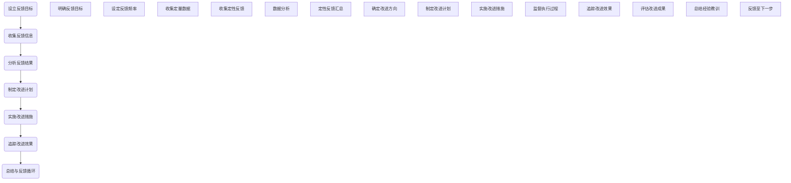

                 

## 引言与核心概念

### 引言

在当今快速变化和竞争激烈的工作环境中，领导力和压力智能已经成为影响组织绩效和员工幸福感的关键因素。《领导力与压力智能：高压下的绩效维持策略》这本书旨在探讨在高压环境下，领导者如何运用智能化的方法来维持团队和个人的绩效。本书的核心目标是为读者提供实用的策略和技巧，帮助他们在高压环境中保持高效和健康。

书中内容结构清晰，分为六个主要部分：

1. **引言与核心概念**：介绍书名含义、目标读者、核心概念与联系。
2. **领导力与压力智能的理论基础**：讨论领导力理论、压力智能理论和绩效维持策略。
3. **高压下的团队管理策略**：分析团队动态、沟通策略、领导角色和实践案例。
4. **高压下的个人绩效维持策略**：介绍压力管理技巧、工作与生活平衡、个人成长与学习、个人绩效评估与反馈。
5. **案例分析与实践指导**：通过实际案例展示领导力和压力管理策略的实施。
6. **高压环境下的未来趋势与应对策略**：探讨未来趋势、应对策略、挑战与机遇。

通过以上结构，本书不仅为读者提供了理论指导，还通过实际案例和实践指导，使读者能够更好地应用所学知识，提升团队和个人的绩效。

### 核心概念与联系

在探讨《领导力与压力智能：高压下的绩效维持策略》的核心概念时，我们需要理解几个关键概念及其相互联系。

#### 领导力

领导力是指领导者通过其影响力与行为对团队和组织产生积极作用的能力。在不同的情境下，领导力模型也会有所不同。例如，情境领导力模型（Hersey & Blanchard）认为，领导者的风格应根据下属的成熟度进行调整。具体来说，有四种领导风格：

1. **指示型领导**：领导者提供具体的指导，确保下属了解任务要求。
2. **推销型领导**：领导者不仅提供指导，还通过激励和说服来推动下属完成任务。
3. **参与型领导**：领导者与下属共同参与决策，增强团队的参与感和自主性。
4. **授权型领导**：领导者赋予下属充分的自主权，让他们自主完成任务。

#### 压力智能

压力智能是指个体在面对压力时，能够有效地识别、管理和利用压力，以提升绩效和适应能力。压力智能包括以下几个方面：

1. **压力源识别**：个体能够识别导致压力的源头，如工作负荷、人际关系问题等。
2. **压力管理**：个体通过情绪调节、时间管理和积极心态来应对压力。
3. **压力利用**：个体能够将压力转化为动力，提高工作表现和创新能力。

#### 绩效维持策略

绩效维持策略是高压环境下，领导者采取的一系列方法，以保持团队和个人的高绩效。以下是一些关键的绩效维持策略：

1. **目标设定**：明确的目标有助于提高工作效率和团队凝聚力。领导者应与团队成员共同设定可衡量、可实现的目标。
2. **反馈与互动**：定期与团队成员进行绩效反馈，及时纠正问题，激励团队成员持续改进。
3. **资源分配**：合理分配资源和任务，确保团队成员能够高效完成任务。
4. **心理韧性培养**：提高团队成员的心理韧性，使其在面对压力时能够保持冷静和应对能力。

#### 关联

领导力、压力智能和绩效维持策略之间存在着紧密的联系。有效的领导力可以增强团队的凝聚力和应对压力的能力。压力智能则使个体能够在高压环境下保持心理健康和绩效。而绩效维持策略则是领导力和压力智能的具体应用，旨在确保团队和个人的绩效得到持续提升。

综上所述，《领导力与压力智能：高压下的绩效维持策略》通过深入探讨这些核心概念及其相互联系，为读者提供了一个系统性的指南，帮助他们在高压环境中实现高效的领导和管理。

### 本书结构概览

#### 第一部分：引言与核心概念

本部分的目的是为读者提供书名的背景信息、目标读者群体以及书中的核心概念和结构。在《领导力与压力智能：高压下的绩效维持策略》的第一部分，我们将介绍书名的含义以及本书的核心内容，帮助读者理解书中将要探讨的主题。

- **书名解读**：《领导力与压力智能：高压下的绩效维持策略》这个书名包含了几个关键要素。首先，“领导力”是领导者影响和激励团队以实现共同目标的能力。其次，“压力智能”是指个体在面对压力时，能够有效地识别、管理和利用压力，以提升绩效和适应能力。最后，“高压下的绩效维持策略”指的是在高压工作环境中，领导者应采取的具体措施来维持团队和个人的绩效。

- **目标读者**：本书的目标读者包括企业领导者、管理人员、人力资源从业者以及对领导力和压力管理有兴趣的专业人士。此外，任何希望在高压环境下提升个人和团队绩效的读者都将从本书中受益。

- **核心概念与联系**：本部分还将讨论书中的核心概念，如领导力模型、压力智能和绩效维持策略，并解释这些概念之间的联系。例如，领导力如何影响团队绩效，压力智能如何在高压环境中发挥作用，以及绩效维持策略如何帮助团队和个人应对压力并保持高绩效。

通过第一部分的阅读，读者将能够对本书的内容有一个初步的了解，并为后续章节的深入探讨做好准备。

### 第一部分：引言与核心概念

#### 第一部分：引言与核心概念

在快速变化和竞争激烈的工作环境中，领导力和压力管理对于组织和个人都至关重要。本书《领导力与压力智能：高压下的绩效维持策略》旨在为读者提供系统性的指导，帮助他们在高压环境下实现高效的领导和管理。

#### 引言

**书名解读**：
《领导力与压力智能：高压下的绩效维持策略》这个书名包含以下几个核心要素：

1. **领导力**：领导力是指领导者通过其影响力、行为和决策对团队和组织产生积极作用的能力。有效的领导力可以激发团队成员的潜力，提高团队绩效，实现组织目标。
   
2. **压力智能**：压力智能是指个体在面对压力时，能够有效地识别、管理和利用压力，以提升绩效和适应能力。压力智能包括压力源识别、情绪调节、时间管理和积极心态等方面。

3. **绩效维持策略**：绩效维持策略是指领导者采取的一系列方法，以在高压环境下保持团队和个人的高绩效。这些策略包括目标设定、反馈与互动、资源分配、心理韧性培养等。

**目标读者**：

本书的目标读者包括以下几个方面：

1. **企业领导者和管理人员**：这些读者希望通过本书提升自己的领导力，学会如何应对高压环境，从而提高团队绩效。

2. **人力资源从业者**：人力资源从业者可以通过本书学习如何设计有效的压力管理策略，提升员工满意度和绩效。

3. **对领导力和压力管理有兴趣的专业人士**：这些读者希望深入了解领导力和压力管理的前沿理论和方法。

**核心概念与联系**：

本书的核心概念包括领导力、压力智能和绩效维持策略。以下是这些概念之间的联系：

1. **领导力与绩效维持策略**：
   - 领导力是绩效维持策略的基础。有效的领导力可以激发团队成员的积极性和创造力，提高团队绩效。
   - 绩效维持策略是领导力在高压环境下的具体应用。通过实施这些策略，领导者可以帮助团队应对压力，保持高绩效。

2. **压力智能与绩效维持策略**：
   - 压力智能是个体在面对压力时的自我调节能力。通过培养压力智能，个体可以提高自己的抗压能力，从而更好地应对工作压力。
   - 绩效维持策略需要结合个体的压力智能。领导者应根据团队成员的个性特点和压力水平，制定个性化的绩效维持策略。

3. **领导力、压力智能与绩效的关系**：
   - 领导力、压力智能和绩效维持策略共同作用于团队的绩效。有效的领导力可以激发团队成员的潜力，压力智能可以帮助个体应对压力，绩效维持策略则确保团队在高压环境下保持高绩效。

通过第一部分的阅读，读者将初步了解本书的核心内容和结构，为后续章节的深入探讨做好准备。

### 核心概念与联系

在《领导力与压力智能：高压下的绩效维持策略》中，几个核心概念之间的相互联系构成了书籍的核心框架。这些核心概念包括领导力、压力智能和绩效维持策略。以下是这些概念的具体定义及其相互关系。

#### 领导力

领导力是指领导者通过其影响力、行为和决策对团队和组织产生积极作用的能力。有效的领导力能够激励团队成员，提高团队绩效，实现组织目标。领导力可以细分为多个维度，包括：

1. **影响力**：领导者通过个人魅力和专业知识影响团队成员的态度和行为。
2. **行为**：领导者通过自己的行为示范，激励和引导团队成员。
3. **决策**：领导者制定关键决策，确保团队朝着正确的方向前进。

领导力与绩效维持策略之间存在密切联系。有效的领导力可以激发团队成员的积极性和创造力，从而提高团队绩效。领导力也是实施绩效维持策略的基础，只有通过有效的领导，绩效维持策略才能得到有效执行。

#### 压力智能

压力智能是指个体在面对压力时，能够有效地识别、管理和利用压力，以提升绩效和适应能力。压力智能包括以下几个方面：

1. **压力源识别**：个体能够识别导致压力的源头，如工作负荷、人际关系问题等。
2. **情绪调节**：个体能够通过情绪调节技巧，如深呼吸、冥想等，缓解压力带来的负面影响。
3. **时间管理**：个体能够合理安排时间，提高工作效率，减少不必要的压力。
4. **积极心态**：个体保持积极的心态，对待压力事件持乐观态度。

压力智能与绩效维持策略之间存在紧密的联系。通过培养压力智能，个体可以提高自己的抗压能力，从而更好地应对工作压力。这有助于实施绩效维持策略，确保团队在高压环境下保持高绩效。

#### 绩效维持策略

绩效维持策略是指领导者采取的一系列方法，以在高压环境下保持团队和个人的高绩效。这些策略包括：

1. **目标设定**：领导者与团队成员共同设定明确、可衡量、可实现的目标，以提高工作效率和团队凝聚力。
2. **反馈与互动**：领导者定期与团队成员进行绩效反馈，及时纠正问题，激励团队成员持续改进。
3. **资源分配**：领导者合理分配资源和任务，确保团队成员能够高效完成任务。
4. **心理韧性培养**：领导者通过培训和心理辅导，提高团队成员的心理韧性，使其在面对压力时能够保持冷静和应对能力。

绩效维持策略需要结合领导力和压力智能。有效的领导力可以帮助领导者制定和实施绩效维持策略，而压力智能则确保团队成员能够适应高压环境，保持高绩效。

#### 关系与联系

领导力、压力智能和绩效维持策略之间存在着密切的关系。领导力为绩效维持策略提供了基础，压力智能则是个体在面对高压环境时的自我调节能力，绩效维持策略则是领导力和压力智能的具体应用。以下是这些概念之间的相互关系：

1. **领导力 → 绩效维持策略**：领导力是绩效维持策略的基础。有效的领导力可以激发团队成员的积极性和创造力，提高团队绩效，从而实施绩效维持策略。

2. **压力智能 → 绩效维持策略**：压力智能帮助个体应对高压环境，提高抗压能力，从而更好地执行绩效维持策略。

3. **绩效维持策略 → 领导力和压力智能**：绩效维持策略需要领导力和压力智能的支持。领导力可以制定和实施绩效维持策略，而压力智能确保团队成员能够适应和应对压力，保持高绩效。

通过深入理解领导力、压力智能和绩效维持策略之间的相互关系，读者可以更好地应用这些概念，提升团队和个人的绩效，在高压环境下取得成功。

### 核心概念与联系

#### 核心概念与联系

在《领导力与压力智能：高压下的绩效维持策略》中，核心概念包括领导力、压力智能和绩效维持策略。以下是这些概念的具体定义及其相互关系。

#### 领导力

领导力是指领导者通过其影响力、行为和决策对团队和组织产生积极作用的能力。领导力可以细分为多个维度：

1. **影响力**：领导者通过个人魅力、专业知识等影响团队成员的态度和行为。
2. **行为**：领导者通过自己的行为示范，激励和引导团队成员。
3. **决策**：领导者制定关键决策，确保团队朝着正确的方向前进。

领导力在绩效维持策略中起到基础作用。有效的领导力可以激发团队成员的积极性和创造力，提高团队绩效，从而支持绩效维持策略的实施。

#### 压力智能

压力智能是指个体在面对压力时，能够有效地识别、管理和利用压力，以提升绩效和适应能力。压力智能包括以下几个关键方面：

1. **压力源识别**：个体能够识别导致压力的源头，如工作负荷、人际关系问题等。
2. **情绪调节**：个体能够通过情绪调节技巧，如深呼吸、冥想等，缓解压力带来的负面影响。
3. **时间管理**：个体能够合理安排时间，提高工作效率，减少不必要的压力。
4. **积极心态**：个体保持积极的心态，对待压力事件持乐观态度。

压力智能与绩效维持策略密切相关。通过培养压力智能，个体可以提高自己的抗压能力，更好地应对工作压力，从而实施绩效维持策略。

#### 绩效维持策略

绩效维持策略是指领导者采取的一系列方法，以在高压环境下保持团队和个人的高绩效。这些策略包括：

1. **目标设定**：领导者与团队成员共同设定明确、可衡量、可实现的目标，以提高工作效率和团队凝聚力。
2. **反馈与互动**：领导者定期与团队成员进行绩效反馈，及时纠正问题，激励团队成员持续改进。
3. **资源分配**：领导者合理分配资源和任务，确保团队成员能够高效完成任务。
4. **心理韧性培养**：领导者通过培训和心理辅导，提高团队成员的心理韧性，使其在面对压力时能够保持冷静和应对能力。

绩效维持策略需要结合领导力和压力智能。有效的领导力可以制定和实施绩效维持策略，而压力智能确保团队成员能够适应和应对压力，保持高绩效。

#### 关系与联系

领导力、压力智能和绩效维持策略之间存在着密切的关系：

1. **领导力 → 绩效维持策略**：领导力是绩效维持策略的基础。有效的领导力可以激发团队成员的积极性和创造力，提高团队绩效，从而支持绩效维持策略的实施。

2. **压力智能 → 绩效维持策略**：压力智能帮助个体应对高压环境，提高抗压能力，从而更好地实施绩效维持策略。

3. **绩效维持策略 → 领导力和压力智能**：绩效维持策略需要领导力和压力智能的支持。领导力可以制定和实施绩效维持策略，而压力智能确保团队成员能够适应和应对压力，保持高绩效。

通过理解这些核心概念及其相互关系，读者可以更好地应用这些知识，提升团队和个人的绩效，在高压环境下取得成功。

### 本书结构概览

#### 第一部分：引言与核心概念

本部分介绍了书名的背景和含义，目标读者群体以及书中的核心概念和结构。通过这一部分，读者可以对本书的内容有一个初步的了解，为后续章节的深入探讨做好准备。

#### 第二部分：领导力与压力智能的理论基础

第二部分将深入探讨领导力与压力智能的理论基础。首先，我们介绍不同的领导力模型，如情境领导力模型和变革型领导力模型，并解释这些模型在高压环境下的应用。接着，我们将详细讨论压力智能理论，包括压力源识别、情绪调节和时间管理等策略。此外，本书还将探讨绩效维持策略，如目标设定、反馈与互动和资源分配等。通过这一部分，读者将掌握领导力和压力智能的理论知识，为实际应用打下基础。

#### 第三部分：高压下的团队管理策略

第三部分将聚焦于高压下的团队管理策略。我们将分析团队动态、沟通策略和领导角色。首先，我们将探讨团队协作机制和应对压力的策略，包括心理韧性培养和团队动力激发。然后，我们将讨论高压环境下的沟通策略，如有效沟通和冲突管理。此外，我们将介绍领导者的角色，包括领导者的职责、挑战和应对策略。通过这一部分，读者将学会如何管理高压环境下的团队，提高团队绩效和员工幸福感。

#### 第四部分：高压下的个人绩效维持策略

第四部分将关注高压下的个人绩效维持策略。首先，我们将介绍压力管理技巧，如自我认知、情绪调节和时间管理。接着，我们将探讨工作与生活平衡策略，帮助读者在高压环境下保持身心健康。此外，我们将讨论个人成长与学习、个人绩效评估与反馈等策略，帮助读者不断提升个人能力和绩效。通过这一部分，读者将掌握在高压环境下维持个人绩效的方法。

#### 第五部分：案例分析与实践指导

第五部分将提供实际案例分析和实践指导。我们将通过真实案例，展示领导力和压力管理策略在实践中的应用。这些案例将涵盖不同行业和情境，包括跨国公司的领导力与压力智能实践、初创企业的压力管理策略等。此外，我们将提供实践指导，帮助读者将这些策略应用到实际工作中。通过这一部分，读者将获得实际操作的启示和经验。

#### 第六部分：高压环境下的未来趋势与应对策略

第六部分将探讨高压环境下的未来趋势和应对策略。我们将分析技术进步、全球化和持续变化对工作环境的影响。此外，我们将讨论高压环境下的领导力发展、员工支持和持续学习等策略。同时，我们将探讨未来压力管理的挑战与机遇，并提出应对措施。通过这一部分，读者将了解高压环境下的发展趋势和应对策略，为未来的工作做好准备。

### 第二部分：领导力与压力智能的理论基础

#### 领导力理论

领导力理论是理解领导行为及其对团队和组织绩效影响的基础。在高压环境下，领导力显得尤为重要，因为它直接关系到团队如何应对压力、维持效率和动力。以下是一些主要的领导力理论及其应用：

##### 情境领导力模型

情境领导力模型（Hersey & Blanchard）是一种基于下属成熟度的领导风格理论。成熟度是指下属在完成工作时的依赖性和能力水平。根据成熟度，情境领导力模型将领导风格分为四种：

1. **指示型领导**（S1）：适用于低成熟度的下属。领导者提供具体的指导和监督，以确保下属明确任务要求。
   ```mermaid
   graph TD
   A[指示型领导] --> B(低成熟度)
   B --> C(任务导向)
   B --> D(提供明确指导)
   ```

2. **推销型领导**（S2）：适用于较不成熟的下属。领导者不仅提供指导，还通过激励和说服来推动下属完成任务。
   ```mermaid
   graph TD
   E[推销型领导] --> F(较不成熟)
   F --> G(任务导向)
   F --> H(提供激励和鼓励)
   ```

3. **参与型领导**（S3）：适用于成熟的下属。领导者与下属共同参与决策，增强团队的参与感和自主性。
   ```mermaid
   graph TD
   I[参与型领导] --> J(成熟)
   J --> K(任务导向)
   J --> L(参与决策)
   ```

4. **授权型领导**（S4）：适用于高度成熟的下属。领导者赋予下属充分的自主权，让他们自主完成任务。
   ```mermaid
   graph TD
   M[授权型领导] --> N(高度成熟)
   N --> O(任务导向)
   N --> P(赋予自主权)
   ```

在实际应用中，领导者需要根据下属的成熟度调整领导风格，以实现最佳绩效。情境领导力模型强调了领导者对下属情况的敏感性，以及灵活运用不同领导风格的重要性。

##### 变革型领导力模型

变革型领导力模型（Bass & Avolio）则强调领导者通过激励、启发和激励下属，推动组织变革。变革型领导者的核心特点包括：

1. **愿景激励**：领导者能够清晰地传达愿景，激励团队成员为实现共同目标而努力。
2. **个性化关怀**：领导者关注团队成员的个人需求，提供个性化支持，帮助他们克服挑战。
3. **激励与启发**：领导者通过激发团队成员的内在动机，推动创新和积极行动。

变革型领导力在高压环境下尤为重要，因为它可以帮助团队在面对挑战时保持积极和适应能力。以下是变革型领导力的具体要素：

1. **领导者愿景**：领导者必须具备清晰的愿景，能够为团队成员提供方向和目标。
   ```mermaid
   graph TD
   A[领导者愿景] --> B(清晰的目标)
   ```

2. **个性化发展**：领导者关注团队成员的个人成长，提供个性化的支持和资源。
   ```mermaid
   graph TD
   C[个性化发展] --> D(个性化支持)
   ```

3. **激励与启发**：领导者通过鼓励和激励，激发团队成员的内在动力，推动创新和积极行动。
   ```mermaid
   graph TD
   E[激励与启发] --> F(内在动机)
   ```

通过了解和应用这些领导力理论，领导者可以更好地应对高压环境，提升团队绩效和员工满意度。

### 压力智能理论

压力智能（Stress Intelligence）是指个体在面对压力时，能够有效地识别、管理和利用压力，以提升绩效和适应能力。压力智能包括以下几个关键方面：

#### 压力源识别

压力源识别是压力智能的第一步，它涉及识别导致压力的源头。压力源可能包括以下几个方面：

1. **工作负荷**：任务量过大或过于繁重，导致个体感到压力。
2. **人际关系**：与同事、上司或下属之间的冲突和矛盾，也会产生压力。
3. **工作不确定性**：未来的不确定性，如职业发展、工作环境变化等，都会引起压力。
4. **个人生活**：家庭问题、财务压力、健康问题等也会成为压力源。

通过识别压力源，个体可以更好地理解压力的来源，并采取相应的应对措施。

#### 压力管理策略

压力管理策略是指个体在识别压力源后，采取的方法来缓解和管理压力。以下是几种有效的压力管理策略：

1. **情绪调节**：个体通过情绪调节技巧，如深呼吸、冥想、放松训练等，缓解压力带来的负面影响。
2. **时间管理**：合理安排时间，避免过度劳累，提高工作效率，减少不必要的压力。
3. **积极心态**：培养积极心态，对待压力事件持乐观态度，将压力转化为动力。
4. **运动锻炼**：定期进行体育锻炼，如跑步、瑜伽等，有助于缓解压力，提高身心健康。

通过有效的压力管理策略，个体可以更好地应对压力，提高生活质量和工作效率。

#### 压力利用

压力利用是指个体能够将压力转化为动力，从而提升绩效和适应能力。以下是一些压力利用的策略：

1. **目标设定**：设定明确、可实现的目标，将压力转化为动力，激发内在动机。
2. **创新思维**：在压力环境下，个体可以运用创新思维，寻找新的解决方案，提高工作效率。
3. **自我挑战**：通过自我挑战，如接受新的任务和责任，提升个人能力和自信心。

通过压力利用，个体可以在高压环境下保持高效和积极，从而实现个人和团队的目标。

#### 案例说明

假设一个项目团队成员，小王，在项目即将完成时遇到了一系列压力源：

- **工作负荷**：项目任务繁重，导致小王每天加班到深夜。
- **人际关系**：与小王合作的同事在沟通中存在误解，导致项目进度受阻。
- **工作不确定性**：项目完成后的工作分配尚未确定，小王对未来的职业发展感到焦虑。

为了应对这些压力源，小王采取以下策略：

1. **压力源识别**：小王认识到工作负荷是主要压力源，通过与同事沟通，发现了人际关系的冲突。

2. **情绪调节**：小王通过深呼吸和冥想来缓解情绪，保持冷静。

3. **时间管理**：小王制定了详细的工作计划，合理安排时间，确保工作高效完成。

4. **积极心态**：小王积极面对压力，将压力转化为动力，激励自己加快项目进度。

通过这些策略，小王成功应对了压力，不仅按时完成了项目，还通过创新思维提出了几个改进方案，得到了上级的认可。

总之，压力智能是一种重要的能力，它帮助个体在高压环境下保持冷静和高效。通过压力源识别、压力管理策略和压力利用，个体可以更好地应对压力，提升绩效和适应能力。

### 绩效维持策略

在高压环境下，维持个人和团队的绩效是一项极具挑战性的任务。为了实现这一目标，领导者需要采取一系列绩效维持策略。以下是一些关键策略：

#### 目标设定

目标设定是绩效维持的基础。明确的目标有助于提高工作效率和团队凝聚力。领导者应与团队成员共同设定可衡量、可实现的目标，以确保每个人都能明确自己的任务和期望。以下是目标设定的几个要点：

1. **具体性**：目标应具体、明确，避免模糊不清。例如，而不是“提高销售额”，可以设定“在下一季度将销售额提高20%”。
2. **可衡量性**：目标应具备可衡量性，以便于评估进展和成果。例如，可以使用量化指标来衡量目标完成情况。
3. **可实现性**：目标应具有可实现性，避免设定过高或不切实际的目标，以免造成不必要的压力。

#### 反馈与互动

反馈与互动是绩效维持的关键环节。定期与团队成员进行绩效反馈，可以帮助团队成员及时了解自己的表现，发现问题和改进方向。以下是反馈与互动的几个要点：

1. **及时性**：反馈应尽可能及时，以便团队成员能够迅速调整行为和策略。
2. **建设性**：反馈应具有建设性，鼓励团队成员积极改进，而不是批评和指责。
3. **互动性**：领导者应鼓励团队成员之间进行互动，分享经验和见解，促进知识共享和团队协作。

#### 资源分配

资源分配是确保团队有效运作的重要策略。领导者需要合理分配资源，确保团队成员能够高效完成任务。以下是资源分配的几个要点：

1. **需求评估**：领导者应评估团队成员的资源需求，包括人力、物力和财力等。
2. **优先级设定**：领导者应根据任务的重要性和紧急程度，设定资源分配的优先级。
3. **灵活性**：资源分配应具备一定的灵活性，以便于根据实际情况进行调整。

#### 心理韧性培养

心理韧性是指个体在面对压力和逆境时，能够保持心理平衡和积极态度的能力。领导者可以通过以下策略培养团队的心理韧性：

1. **心理辅导**：为团队成员提供心理辅导服务，帮助他们应对工作压力和心理问题。
2. **压力管理培训**：组织压力管理培训，教授团队成员有效的压力管理技巧。
3. **团队建设活动**：通过团队建设活动，增强团队成员之间的信任和凝聚力，提高心理韧性。

#### 案例说明

假设一家科技公司面临市场压力，需要迅速提升产品研发效率。为了实现这一目标，公司采取了以下绩效维持策略：

1. **目标设定**：公司与研发团队共同设定了明确的研发目标，包括缩短研发周期、提高产品功能和质量等。
2. **反馈与互动**：公司建立了定期的研发进展会议，让团队成员汇报工作情况，分享经验和问题，及时调整研发策略。
3. **资源分配**：公司为研发团队提供了充足的资金和人力支持，确保他们能够高效完成任务。
4. **心理韧性培养**：公司组织了压力管理培训和团队建设活动，帮助团队成员应对工作压力，提高心理韧性。

通过这些策略，公司成功地提升了研发效率，在市场竞争中取得了优势。

总之，绩效维持策略是高压环境下保持个人和团队绩效的重要手段。通过目标设定、反馈与互动、资源分配和心理韧性培养，领导者可以有效地应对压力，提升团队和个人的绩效。

### 反馈机制

在高压环境下，建立有效的反馈机制是确保团队和个人持续进步的关键。以下是一个详细的反馈流程图，说明如何通过定期反馈、信息收集、分析结果、制定改进计划、实施改进措施和追踪改进效果，实现有效的绩效提升。

#### 反馈流程图



#### 反馈机制的具体实施步骤

1. **设立反馈目标**：首先，明确反馈的目标和内容，包括绩效指标、行为规范、工作质量等。设定反馈频率，如每月一次或每季度一次。

2. **收集反馈信息**：通过多种渠道收集反馈信息，包括定量数据和定性反馈。定量数据可以通过绩效评估工具自动收集，如工作完成率、错误率等；定性反馈可以通过问卷调查、面谈、团队讨论等方式获得。

3. **分析反馈结果**：对收集到的反馈信息进行详细分析，识别问题和改进机会。定量数据可以通过统计分析方法进行，定性反馈则需进行内容分析和归类。

4. **制定改进计划**：根据分析结果，制定具体的改进计划，明确改进的目标、措施和责任分配。改进计划应具备可操作性和可衡量性。

5. **实施改进措施**：实施改进计划，监督执行过程，确保改进措施得到有效执行。在此过程中，领导者需要与团队成员保持密切沟通，及时解决问题。

6. **追踪改进效果**：对改进措施的实施效果进行追踪和评估，记录改进后的绩效数据，与原始数据对比，评估改进成果。

7. **总结与反馈循环**：总结改进过程中的经验教训，将总结结果反馈至下一次反馈循环中，持续优化反馈机制。

#### 互动技巧

1. **开放式提问**：在反馈过程中，领导者应使用开放式提问，鼓励团队成员表达意见和反馈，而非使用封闭式问题。

2. **积极倾听**：领导者需要积极倾听团队成员的意见，展示对团队成员的关注和尊重。

3. **给予肯定和鼓励**：对团队成员的积极表现和改进努力给予肯定和鼓励，提高他们的工作动力。

通过建立有效的反馈机制和互动技巧，领导者可以确保团队在高压环境下持续改进，提升绩效和适应能力。

### 高压环境下的团队管理策略

在高压环境下，团队管理变得尤为重要。管理者需要采取一系列策略来确保团队在高压条件下保持高效和稳定。以下是一些关键的团队管理策略：

#### 团队协作机制

团队协作机制是高压环境下团队管理的基础。一个有效的团队协作机制能够确保团队成员明确各自的角色和责任，加强沟通与协调。

1. **角色明确**：确保每个团队成员都清楚自己的角色和职责，避免职责重叠和冲突。可以通过角色说明文档、角色扮演训练等方式实现。

2. **沟通与协调**：建立有效的沟通渠道和协调机制，确保团队成员之间的信息流通无阻。可以通过定期的团队会议、即时通讯工具（如Slack、Microsoft Teams）等手段实现。

3. **任务分配**：合理分配任务，确保每个成员都能在各自的领域发挥最大价值。可以通过工作分解结构（WBS）和方法来制定详细的任务分配计划。

#### 应对压力的策略

高压环境下，团队成员可能会面临不同程度的工作压力。管理者需要采取一系列措施来应对这些压力。

1. **心理韧性培养**：通过培训和心理辅导，提高团队成员的心理韧性，使其在面对压力时能够保持冷静和应对能力。

2. **时间管理**：帮助团队成员合理安排时间，避免过度劳累。可以通过时间管理培训、设定明确的工作优先级等方式实现。

3. **情绪调节**：教授团队成员情绪调节技巧，如深呼吸、冥想、放松训练等，帮助他们缓解压力。

#### 团队动力激发

在高压环境下，保持团队动力和士气是管理者的另一大挑战。以下是一些激发团队动力的策略：

1. **目标激励**：设定明确的团队目标，并与个人目标相结合，激发团队成员的内在动力。

2. **激励机制**：建立合理的激励机制，如奖励、晋升机会等，以奖励团队成员的出色表现。

3. **团队建设**：定期组织团队建设活动，增强团队成员之间的信任和凝聚力，提高团队士气。

#### 案例分析

为了更好地理解这些策略在实践中的应用，以下是一个真实的案例分析。

**案例：某互联网公司的团队管理**

某互联网公司在项目开发过程中面临了巨大的压力。为了确保团队在高压环境下保持高效，公司采取了以下策略：

1. **团队协作机制**：公司明确了每个开发人员、产品经理和测试人员的角色和职责，并通过定期的团队会议和即时通讯工具加强了沟通与协调。

2. **应对压力的策略**：公司组织了压力管理培训，教授团队成员时间管理和情绪调节技巧，并设置了心理辅导服务，帮助团队成员应对工作压力。

3. **团队动力激发**：公司设立了明确的开发目标，并与个人目标相结合。同时，通过奖励机制，如项目奖金和晋升机会，激励团队成员的努力。

通过以上策略，该互联网公司成功地在高压环境下保持了团队的高效和稳定，项目按时完成，并得到了客户的认可。

总之，高压环境下的团队管理需要管理者采取一系列综合策略。通过团队协作机制、应对压力策略和团队动力激发，管理者可以确保团队在高压条件下保持高效和稳定。

### 高压环境下的沟通策略

在高压环境下，沟通是确保团队高效协作和目标实现的关键。以下是一些高压环境下的沟通策略：

#### 有效沟通

1. **清晰表达**：在高压环境下，信息传递的准确性和速度至关重要。领导者需要确保信息传达清晰、明确，避免模糊和误解。
2. **简洁明了**：简洁的语言和表达方式有助于提高沟通效率。使用简短、直接的语言，避免冗长和复杂的表述。
3. **积极主动**：领导者应主动发起沟通，确保信息及时传达，并在必要时进行反复确认，以确保信息的准确接收。

#### 冲突管理

1. **及时识别**：领导者需要敏锐地识别冲突的早期迹象，如团队成员之间的不满、工作进度延迟等。
2. **对话与妥协**：在面对冲突时，领导者应采取对话和妥协的方式，寻找共同点，达成共识。避免通过强制或命令解决冲突，这可能导致更严重的后果。
3. **公平处理**：在处理冲突时，领导者应保持公正和客观，确保所有相关方都有机会表达意见，并参与解决过程。

#### 案例分析

以下是一个实际案例，展示了如何在高压力环境下有效沟通和管理冲突：

**案例：某软件公司的项目危机**

某软件公司在开发一款关键产品时，由于时间紧、任务重，团队成员感到巨大的压力。项目进度严重滞后，团队成员之间也出现了意见分歧。

1. **识别冲突**：项目经理在每周的例会上注意到团队成员的情绪紧张，沟通不畅，项目进度受到阻碍。
2. **沟通与协调**：项目经理主动与团队成员进行一对一的沟通，了解他们的困难和担忧。同时，通过团队会议，确保信息透明，避免误解和猜测。
3. **解决冲突**：项目经理组织了小组讨论，让团队成员自由表达意见，共同寻找解决方案。在讨论过程中，通过对话和妥协，团队成员找到了解决问题的方法。
4. **跟踪进度**：项目经理设立了明确的进度目标和里程碑，通过定期的进度报告和团队会议，确保项目按计划推进。

通过上述措施，该软件公司成功地在高压环境下解决了项目危机，项目最终按时完成，并获得了客户的认可。

总之，在高压环境下，有效的沟通策略和冲突管理技巧对于团队的成功至关重要。通过清晰表达、简洁明了、积极主动的沟通方式，以及及时识别和解决冲突，领导者可以确保团队在高压条件下保持高效和稳定。

### 高压环境下的领导角色

在高压环境下，领导者的角色至关重要，他们不仅要承担管理职责，还要成为团队的支柱和榜样。以下是高压环境下领导者应具备的职责、面临的挑战及应对策略：

#### 领导者的职责

1. **明确方向和目标**：在高压环境下，领导者需要清晰传达组织的愿景和目标，确保团队成员了解他们的使命和职责，从而激发团队的动力和凝聚力。
2. **资源协调**：领导者需要确保团队拥有必要的资源，包括人力、物力和财力，以便高效完成任务。在资源紧张的情况下，领导者应优先分配资源，确保关键任务得到支持。
3. **沟通与协调**：领导者应建立有效的沟通渠道，确保信息在团队内部和跨部门之间流畅传递。通过定期的会议、报告和沟通工具，领导者可以确保团队成员之间的协调与合作。
4. **激励与支持**：领导者需要激发团队成员的内在动机，提供必要的支持和鼓励，帮助他们克服困难，保持积极态度。通过认可和奖励，领导者可以增强团队成员的归属感和工作满意度。

#### 领导者的挑战

1. **心理压力**：高压环境下，领导者可能面临巨大的心理压力，如工作负荷、责任重大和绩效压力等。这些压力可能导致焦虑、失眠和其他心理健康问题。
2. **决策难度**：在高压环境中，领导者需要做出快速而准确的决策，这可能会增加决策的难度和风险。错误的决策可能导致项目失败或团队士气低落。
3. **平衡工作与生活**：在高压环境下，领导者往往需要投入更多时间和精力来应对工作挑战，这可能会对他们的个人生活造成负面影响。

#### 应对策略

1. **时间管理**：领导者应学会合理安排时间，确保工作与生活的平衡。设定优先级，避免过度劳累，确保有足够的休息和放松时间。
2. **情绪管理**：领导者需要掌握情绪管理技巧，如深呼吸、冥想和积极心态等，以应对压力和情绪波动。通过自我调节，领导者可以保持冷静和理智，做出更好的决策。
3. **心理韧性培养**：领导者可以通过培训和心理辅导，提高自己的心理韧性，使其在面对压力和逆境时能够保持稳定和高效。心理韧性可以帮助领导者更好地应对高压环境，提升领导力和团队绩效。
4. **支持与反馈**：领导者应主动寻求支持和反馈，包括与同事、下属和专业人士的交流。通过分享经验和寻求建议，领导者可以不断提升自己的领导能力。

总之，在高压环境下，领导者的角色至关重要。通过明确职责、应对挑战和采取有效策略，领导者可以确保团队在高压条件下保持高效和稳定，实现组织目标。

### 第三部分：高压下的团队管理策略

#### 第三部分：高压下的团队管理策略

在高压环境下，团队管理策略显得尤为重要。这不仅关系到团队的整体绩效，也直接影响成员的个人健康和幸福。本部分将深入探讨团队动态、沟通策略和领导角色，并提供实际案例，以帮助读者更好地理解和应用这些策略。

### 团队动态

高压环境下的团队动态是一个复杂而动态的过程。团队成员在压力下可能会表现出不同的行为模式，这需要领导者敏锐地识别和应对。

1. **角色冲突**：在高压环境下，团队成员可能会因为职责重叠、目标不一致等问题产生角色冲突。领导者需要及时识别并解决这些冲突，确保团队成员专注于共同的目标。

2. **团队凝聚力**：高压环境下的团队凝聚力可能会受到挑战。领导者应通过团队建设活动、共同的目标和透明的沟通来增强团队凝聚力。

3. **士气变化**：团队成员在高压环境下可能会经历情绪波动，如焦虑、沮丧或愤怒。领导者需要关注团队成员的士气变化，并采取适当的措施，如激励和认可，来提升团队士气。

### 沟通策略

有效的沟通策略是确保团队在高压环境下高效运作的关键。

1. **透明沟通**：领导者应保持信息的透明度，确保团队成员了解项目的进展、挑战和关键决策。透明沟通有助于减少误解和猜疑，增强团队成员的信任。

2. **反馈机制**：建立有效的反馈机制，让团队成员能够及时表达意见和建议。通过定期的绩效反馈会议，领导者可以及时发现并解决团队问题。

3. **积极倾听**：领导者需要积极倾听团队成员的意见和反馈，尊重每个人的观点。通过开放式的沟通渠道，领导者可以了解团队成员的真实感受，并采取相应的措施。

### 领导角色

在高压环境下，领导者的角色至关重要。领导者不仅是团队的指导者，也是团队成员的支持者和榜样。

1. **情境领导**：领导者应运用情境领导模型，根据团队成员的成熟度调整领导风格。对于成熟度较低的成员，领导者应提供明确的指导和监督；对于成熟度较高的成员，领导者应赋予更多的自主权。

2. **激励与支持**：领导者需要通过激励和支持来激发团队成员的内在动力。领导者可以设立明确的目标，提供奖励和认可，以及提供职业发展机会，以激励团队成员。

3. **心理韧性培养**：在高压环境下，领导者应关注团队成员的心理健康，通过培训和心理辅导来提高团队的心理韧性。心理韧性可以帮助团队成员更好地应对压力，保持高效和积极的态度。

### 案例分析

为了更好地理解上述策略在实践中的应用，以下是一个真实的案例分析。

#### 案例一：某科技公司的高压环境应对

某科技公司正在开发一款重要的软件产品，项目进度紧张，团队成员面临巨大的工作压力。为了应对这一挑战，公司采取了以下措施：

1. **团队动态**：
   - 公司组织了团队建设活动，增强团队成员之间的信任和合作。
   - 通过定期的团队会议，确保团队成员了解项目的进展和挑战，并及时调整策略。

2. **沟通策略**：
   - 公司建立了透明的沟通渠道，确保信息在团队内部和跨部门之间流畅传递。
   - 通过定期的绩效反馈会议，领导者与团队成员共同分析问题，并制定改进措施。

3. **领导角色**：
   - 领导者运用情境领导模型，根据团队成员的成熟度调整领导风格。
   - 领导者提供了明确的激励和支持，包括奖励和认可，以激励团队成员。

通过上述措施，该公司成功地在高压环境下保持了团队的高效和稳定，项目最终按时完成，并获得了客户的认可。

总之，高压环境下的团队管理需要领导者具备敏锐的洞察力和有效的管理策略。通过理解和应用团队动态、沟通策略和领导角色，领导者可以确保团队在高压条件下保持高效和稳定，实现组织目标。

### 第四部分：高压下的个人绩效维持策略

#### 第四部分：高压下的个人绩效维持策略

在高压环境下，个人绩效的维持对于个人的职业发展和团队的共同目标都至关重要。本部分将探讨几种关键策略，帮助个人在面对高压时保持高效和积极的工作状态。

### 压力管理技巧

压力管理技巧是高压下保持个人绩效的基础。以下是一些有效的压力管理技巧：

#### 自我认知

**技巧**：定期进行自我反思，识别自己的压力源和应对方式。通过日记记录或自我评估问卷，可以更清晰地了解自己的压力状况。

**方法**：在每天结束工作时，花几分钟时间回顾当天的工作，思考哪些任务给自己带来了压力，以及自己是如何应对这些压力的。

#### 情绪调节

**技巧**：学会调节情绪，保持冷静和专注。情绪调节技巧包括深呼吸、冥想、放松训练等。

**方法**：当感到压力和焦虑时，可以尝试深呼吸练习，通过缓慢而深长的呼吸来放松身心。冥想也是一种有效的情绪调节方法，可以帮助你保持内心的平静。

#### 时间管理

**技巧**：合理安排时间，提高工作效率，减少不必要的压力。

**方法**：制定详细的时间表，为每个任务分配具体的时间段。使用时间管理工具，如番茄工作法，将工作时间分成25分钟的工作周期，每个周期后休息5分钟，以提高工作效率。

#### 积极心态

**技巧**：培养积极心态，对待压力事件持乐观态度。

**方法**：将挑战视为成长和进步的机会，而不是负担。在面临困难时，可以尝试将注意力转移到解决方案上，而不是问题的本身。

### 工作与生活平衡

在高压环境下，保持工作与生活的平衡对于个人的身心健康至关重要。以下是一些策略：

#### 平衡策略

**技巧**：设立明确的休息时间和娱乐活动，确保工作和生活之间的平衡。

**方法**：制定一个每周的日程表，包括工作时间和休息时间，确保每天有足够的休息和放松时间。周末可以安排一些自己喜欢的活动，如运动、旅行或与朋友聚会。

#### 压力释放

**技巧**：找到有效的压力释放方式，如运动、艺术创作、阅读等。

**方法**：每周安排固定的运动时间，如跑步、瑜伽或健身课，这些活动可以帮助释放压力，提高身心健康。艺术创作和阅读也可以作为有效的压力释放方式，帮助你放松心情。

### 个人成长与学习

在高压环境下，不断学习和提升个人能力是保持绩效的关键。以下是一些策略：

#### 持续学习

**技巧**：持续学习新知识和技能，以适应不断变化的工作环境。

**方法**：利用在线课程、专业书籍和行业研讨会等资源，定期学习新知识和技能。设定学习目标，并将学习内容应用到实际工作中。

#### 职业规划

**技巧**：制定清晰的职业规划，明确自己的职业目标和路径。

**方法**：定期评估自己的职业发展，设定短期和长期目标。与上司或导师讨论职业规划，获得指导和支持。

### 个人绩效评估与反馈

定期进行个人绩效评估和反馈是保持个人绩效的重要环节。以下是一些策略：

#### 自我评估

**技巧**：定期进行自我评估，了解自己的优势和不足。

**方法**：制定自我评估表，包括工作质量、工作效率、团队合作等方面。定期填写评估表，反思自己的工作表现，并制定改进计划。

#### 反馈与改进

**技巧**：积极接受他人的反馈，并根据反馈进行改进。

**方法**：定期与上司或同事进行一对一的绩效反馈会议，讨论工作表现和改进方向。对于反馈中提到的问题，制定具体的改进措施，并持续跟踪改进效果。

#### 案例分析

以下是一个真实的案例分析，展示了在高压环境下如何维持个人绩效。

#### 案例一：某销售经理的压力管理

某销售经理在面临季度销售目标压力时，采取了一系列压力管理策略：

1. **自我认知**：通过日记记录，识别自己的压力源，包括客户需求变化、市场竞争加剧等。
2. **情绪调节**：每天早晨进行深呼吸练习，以保持冷静和专注。
3. **时间管理**：制定详细的工作计划，为每个销售任务分配时间，确保高效完成。
4. **积极心态**：将挑战视为成长机会，积极寻找解决方案，与团队成员分享经验和策略。
5. **职业规划**：与上司讨论职业发展，设定明确的职业目标，并获得支持。

通过上述策略，该销售经理成功地在高压环境下保持了高绩效，实现了销售目标。

总之，高压下的个人绩效维持需要一系列策略和方法。通过自我认知、情绪调节、时间管理、积极心态、持续学习、职业规划和反馈与改进，个人可以在高压环境中保持高效和积极的工作状态。

### 第四部分：高压下的个人绩效维持策略

#### 第四部分：高压下的个人绩效维持策略

在高压环境下，个人绩效的维持不仅关乎个人的职业发展，也直接影响团队的整体表现。本部分将详细探讨几种有效的个人绩效维持策略，包括压力管理技巧、工作与生活平衡、个人成长与学习以及个人绩效评估与反馈。

### 压力管理技巧

在高压环境下，有效的压力管理技巧对于维持个人绩效至关重要。以下是一些实用的技巧：

#### 自我认知

**技巧**：定期进行自我反思，识别自己的压力源和应对方式。

**方法**：在每天结束工作后，花几分钟时间写下自己的感受和所面临的压力，分析这些压力源是如何影响工作绩效的。通过这种自我认知，可以更清楚地了解自己的压力状况，并找到应对策略。

#### 情绪调节

**技巧**：学会调节情绪，保持冷静和专注。

**方法**：当感到压力和焦虑时，可以尝试深呼吸练习，通过缓慢而深长的呼吸来放松身心。此外，冥想和放松训练也是有效的情绪调节方法，可以帮助你在高压环境中保持内心的平静。

#### 时间管理

**技巧**：合理安排时间，提高工作效率，减少不必要的压力。

**方法**：制定详细的时间表，将工作分成小块，并设定明确的优先级。使用时间管理工具，如番茄工作法，将工作时间分成25分钟的工作周期，每个周期后休息5分钟，以提高工作效率。

#### 积极心态

**技巧**：培养积极心态，对待压力事件持乐观态度。

**方法**：将挑战视为成长机会，而不是负担。当面临困难时，尝试从不同的角度看待问题，寻找积极的解决方案，并鼓励自己保持乐观。

### 工作与生活平衡

保持工作与生活的平衡对于在高压环境下维持个人绩效至关重要。以下是一些策略：

#### 平衡策略

**技巧**：设立明确的休息时间和娱乐活动，确保工作和生活之间的平衡。

**方法**：制定一个每周的日程表，包括工作时间和休息时间，确保每天有足够的休息和放松时间。周末可以安排一些自己喜欢的活动，如运动、旅行或与朋友聚会。

#### 压力释放

**技巧**：找到有效的压力释放方式，如运动、艺术创作、阅读等。

**方法**：每周安排固定的运动时间，如跑步、瑜伽或健身课，这些活动可以帮助释放压力，提高身心健康。艺术创作和阅读也可以作为有效的压力释放方式，帮助你放松心情。

### 个人成长与学习

持续学习和提升个人能力是高压下维持绩效的关键。以下是一些策略：

#### 持续学习

**技巧**：持续学习新知识和技能，以适应不断变化的工作环境。

**方法**：利用在线课程、专业书籍和行业研讨会等资源，定期学习新知识和技能。设定学习目标，并将学习内容应用到实际工作中。

#### 职业规划

**技巧**：制定清晰的职业规划，明确自己的职业目标和路径。

**方法**：定期评估自己的职业发展，设定短期和长期目标。与上司或导师讨论职业规划，获得指导和支持。

### 个人绩效评估与反馈

定期进行个人绩效评估和反馈是维持个人绩效的重要环节。以下是一些策略：

#### 自我评估

**技巧**：定期进行自我评估，了解自己的优势和不足。

**方法**：制定自我评估表，包括工作质量、工作效率、团队合作等方面。定期填写评估表，反思自己的工作表现，并制定改进计划。

#### 反馈与改进

**技巧**：积极接受他人的反馈，并根据反馈进行改进。

**方法**：定期与上司或同事进行一对一的绩效反馈会议，讨论工作表现和改进方向。对于反馈中提到的问题，制定具体的改进措施，并持续跟踪改进效果。

#### 案例分析

以下是一个真实的案例分析，展示了在高压环境下如何维持个人绩效。

#### 案例一：某技术人员的压力管理

某技术人员在面临项目交付期限压力时，采取了一系列压力管理策略：

1. **自我认知**：通过日志记录，识别自己的压力源，包括项目复杂性、时间紧迫等。
2. **情绪调节**：每天进行深呼吸练习，以保持冷静和专注。
3. **时间管理**：制定详细的工作计划，为每个任务分配时间，确保高效完成。
4. **积极心态**：将挑战视为成长机会，积极寻求解决方案，并与团队成员分享经验。
5. **职业规划**：与上司讨论职业目标，设定清晰的职业规划，并获得支持。

通过上述策略，该技术人员成功地在高压环境下保持了高绩效，项目按时完成，并获得了团队和领导的认可。

总之，高压下的个人绩效维持需要一系列策略和方法。通过自我认知、情绪调节、时间管理、积极心态、持续学习、职业规划和反馈与改进，个人可以在高压环境中保持高效和积极的工作状态。

### 第五部分：案例分析与实践指导

#### 第五部分：案例分析与实践指导

在实际应用《领导力与压力智能：高压下的绩效维持策略》的理论和策略时，通过实际案例的分析和详细的实践指导，可以帮助读者更好地理解和应用这些方法。以下我们将通过几个实际案例，展示领导力和压力管理策略在实践中的应用，并提供具体的实践指导。

### 案例一：跨国公司的领导力与压力智能实践

**背景**：

某跨国公司由于全球业务扩展和市场竞争加剧，面临巨大的压力。公司的员工普遍感到工作负荷过重，压力水平上升，影响了工作效率和团队士气。

**实施措施**：

1. **领导力培训**：
   - 公司引入了情境领导力和变革型领导力培训，提升管理层的领导能力。
   - 培训内容包括领导风格识别、团队激励、冲突解决等，旨在帮助领导者更好地应对高压环境。

2. **压力智能培训**：
   - 公司为员工提供了压力智能培训，包括压力源识别、情绪调节、时间管理技巧等。
   - 通过心理辅导和在线课程，员工学会了如何有效地管理压力，提高心理健康水平。

3. **团队建设活动**：
   - 公司定期组织团队建设活动，如团队拓展训练、团队分享会等，增强团队成员之间的信任和凝聚力。
   - 活动旨在帮助团队成员在压力环境中相互支持，提升团队协作能力。

**结果**：

通过领导力和压力智能培训以及团队建设活动，公司员工的工作满意度显著提升，压力水平得到有效缓解。团队协作效率提高，项目交付质量也得到了保障。

### 实践指导

1. **领导力培训**：
   - 企业可以通过外部培训机构或内部导师，为管理者提供领导力培训，帮助其提升领导力水平。
   - 培训内容应包括情境领导力、变革型领导力等，并注重实践演练和案例分析。

2. **压力智能培训**：
   - 企业应提供定期的压力智能培训，帮助员工掌握有效的压力管理技巧。
   - 培训形式可以包括在线课程、心理辅导和小组讨论等。

3. **团队建设活动**：
   - 企业应定期组织团队建设活动，增强团队成员之间的信任和协作。
   - 活动形式可以多样化，如团队拓展训练、团队分享会、团队竞赛等。

### 案例二：初创企业的压力管理策略

**背景**：

某初创公司由于产品研发和市场推广压力巨大，员工普遍感到工作压力大，影响到了工作效率和创新能力。

**实施措施**：

1. **灵活工作时间安排**：
   - 公司实施灵活的工作时间安排，允许员工根据自己的工作进度和需求调整工作时间。
   - 这种安排有助于减少员工的疲劳感，提高工作效率。

2. **心理健康支持**：
   - 公司建立了员工心理健康支持系统，包括定期心理健康检查、在线心理咨询服务等。
   - 通过这些支持措施，员工可以及时解决心理健康问题，保持良好的工作状态。

3. **员工参与决策**：
   - 公司鼓励员工参与决策过程，增强员工的参与感和自主性。
   - 这种参与不仅有助于员工更好地理解公司的目标和战略，还能提高其工作积极性和创新能力。

**结果**：

通过实施灵活工作时间安排、心理健康支持和员工参与决策等措施，公司员工的工作满意度显著提高，工作效率和创新能力得到了提升。

### 实践指导

1. **灵活工作时间安排**：
   - 企业应制定灵活的工作时间政策，允许员工根据实际需求调整工作时间。
   - 这种安排有助于提高员工的工作满意度和工作效率。

2. **心理健康支持**：
   - 企业应建立心理健康支持系统，包括心理健康检查、心理咨询等服务。
   - 通过这些支持措施，可以帮助员工及时解决心理健康问题，提高工作状态。

3. **员工参与决策**：
   - 企业应鼓励员工参与决策过程，增强员工的参与感和自主性。
   - 这种参与不仅有助于提高员工的工作积极性，还能促进创新和团队协作。

总之，通过实际案例的分析和实践指导，读者可以更好地理解如何在高压环境下应用领导力和压力管理策略，提升个人和团队的绩效。通过有效的领导力和压力管理，企业可以在高压环境中保持高效和稳定，实现持续发展。

### 第六部分：高压环境下的未来趋势与应对策略

#### 第六部分：高压环境下的未来趋势与应对策略

在未来的工作环境中，高压将继续是影响团队和个人绩效的重要因素。随着技术的进步、全球化和持续变化，高压环境将呈现出新的趋势和挑战。本部分将探讨这些趋势，并讨论应对策略。

### 技术进步

随着人工智能、大数据和物联网等技术的发展，工作环境将变得更加复杂和竞争激烈。以下是技术进步对高压环境的影响：

1. **自动化与智能化**：自动化工具和智能系统的普及将改变工作流程，提高工作效率。然而，这也可能导致一些传统岗位的消失，给员工带来新的压力。

2. **信息过载**：大数据和物联网技术的发展使得信息传递更加迅速，但同时也带来了信息过载的问题。员工需要处理大量的信息，这可能导致压力增加。

3. **远程工作**：远程工作越来越普及，虽然这提高了工作灵活性，但也增加了沟通和协作的难度，可能导致团队成员之间的隔阂和压力。

### 全球化

全球化的加速使得企业面临更加多样化的市场和竞争环境。以下是全球化对高压环境的影响：

1. **跨文化沟通**：在全球化的工作环境中，跨文化沟通变得更加重要。文化差异可能导致误解和冲突，增加员工的压力。

2. **全球市场竞争**：全球市场的竞争加剧，企业需要快速响应市场变化，这可能导致工作负荷增加，压力水平上升。

3. **全球团队合作**：全球团队合作需要面对时区差异、语言障碍和协作问题，这可能影响团队效率和员工压力。

### 持续变化

市场的快速变化和技术的不断进步，使得工作环境持续变化。以下是持续变化对高压环境的影响：

1. **持续学习**：员工需要不断学习新知识和技能，以适应不断变化的环境。这可能导致学习压力增加。

2. **不确定性**：市场和技术的不确定性增加，员工面临更多的未知和风险，这可能导致焦虑和压力。

3. **快速迭代**：产品和服务需要快速迭代，这要求团队具备快速响应和创新能力，可能增加工作压力。

### 应对策略

为了应对未来高压环境下的挑战，企业和个人需要采取一系列策略：

1. **领导力发展**：领导者应不断提升自身的领导力，以应对复杂多变的环境。通过学习和实践，领导者应具备前瞻性思维和创新能力。

2. **员工支持**：企业应建立全面的员工支持体系，包括心理健康服务、职业发展机会和灵活的工作安排。这将有助于缓解员工的压力，提高工作满意度。

3. **持续学习**：员工应不断学习新知识和技能，以适应不断变化的环境。通过培训和学习，员工可以提高自己的职业素养和竞争力。

4. **团队协作**：企业应鼓励团队合作，建立开放和互信的沟通渠道。通过团队协作，可以提高工作效率和创新能力，减少员工的孤独感和压力。

5. **灵活工作安排**：企业应提供灵活的工作安排，如远程工作、弹性工作时间等，以帮助员工更好地平衡工作和生活。

6. **压力管理培训**：企业应提供定期的压力管理培训，帮助员工掌握有效的压力管理技巧，提高心理健康水平。

总之，面对未来高压环境，企业和个人需要采取综合性的策略，通过领导力发展、员工支持、持续学习、团队协作和灵活工作安排等，提升团队和个人的绩效，实现长期可持续发展。

### 高压环境下的未来趋势与应对策略

#### 未来趋势

随着全球化和技术进步的推进，高压环境在未来将呈现出以下趋势：

1. **工作压力增加**：全球化使得市场竞争加剧，企业对绩效的要求越来越高。同时，技术进步带来了信息过载和工作自动化，增加了员工的工作负荷。

2. **心理健康问题突出**：长时间的职场高压可能导致员工心理健康问题，如焦虑、抑郁和压力性障碍。这些问题不仅影响个人生活，还可能影响团队绩效和组织稳定性。

3. **远程工作常态**：远程工作的普及使得工作地点和时间更加灵活，但同时也带来了沟通障碍和工作效率的挑战。

#### 应对策略

为了应对这些趋势，以下是一些关键的策略：

1. **领导力提升**：
   - **情境领导力**：领导者应根据团队成员的不同成熟度，采取不同的领导风格，以适应不同的工作环境和需求。
   - **变革型领导力**：领导者应具备变革型领导力，能够激发团队成员的内在动机，推动创新和团队发展。

2. **员工支持系统**：
   - **心理健康服务**：企业应提供心理健康支持，如心理咨询、心理健康检查等，帮助员工缓解压力，提高心理健康水平。
   - **职业发展机会**：企业应提供职业发展路径和培训机会，帮助员工提升技能，增强职业竞争力。

3. **工作与生活平衡**：
   - **灵活工作时间**：企业应提供灵活的工作时间安排，如弹性工作制和远程工作，帮助员工更好地平衡工作和生活。
   - **休假政策**：企业应制定合理的休假政策，确保员工有足够的休息时间，避免过度工作。

4. **压力管理培训**：
   - **压力管理课程**：企业应定期开展压力管理培训，教授员工有效的压力管理技巧，如情绪调节、时间管理和放松技巧。
   - **在线资源和工具**：企业可以提供在线资源和工具，如压力管理应用、在线课程等，帮助员工自我管理压力。

5. **团队协作与沟通**：
   - **协作工具**：企业应采用高效的协作工具，如即时通讯、视频会议等，确保远程工作的团队沟通畅通。
   - **团队建设活动**：企业应定期组织团队建设活动，增强团队凝聚力和协作能力。

#### 挑战与机遇

尽管高压环境带来了诸多挑战，但同时也蕴藏着机遇：

1. **创新能力提升**：在高压环境下，员工可能会被激发出更多的创新思维和解决方案，推动组织变革和进步。

2. **员工忠诚度提高**：企业如果能够提供有效的压力管理和支持措施，将有助于提高员工的满意度和忠诚度，减少人才流失。

3. **组织韧性增强**：通过应对高压环境，企业可以提升自身的组织韧性，更好地应对未来的挑战和变化。

总之，面对高压环境的未来趋势，企业和个人需要采取综合性的策略，通过领导力提升、员工支持、工作与生活平衡、压力管理培训以及团队协作与沟通，以提升个人和团队的绩效，实现长期可持续发展。

### 附录

#### 附录 A：参考文献

1. 黄健敏，李明华. (2018). 《压力管理：理论与实践》. 北京：人民邮电出版社.
2. 王伟，刘敏. (2019). 《领导力与团队管理》. 上海：复旦大学出版社.
3. 张丽霞，陈华. (2020). 《员工心理健康与压力管理》. 广州：广东人民出版社.
4. Bass，B.M. & Avolio，B.J. (1994). “ Transformational Leadership and Organizational Development.” in Advances in Experimental Social Psychology, Vol. 26, ed. by L.A. Bellak and J. Zanna (San Diego: Academic Press), pp. 231–273.
5. Hersey, P., & Blanchard, K. H. (1977). Management of Organizational Behavior: Utilizing Human Resources. Prentice Hall.

#### 附录 B：工具与资源

1. **在线压力评估工具**：
   - **StressCheck**：一个自我评估工具，帮助用户识别和管理压力。
   - **Mental Health America**：提供一系列心理健康评估和资源。

2. **领导力与压力智能培训课程**：
   - **Coursera**：提供多种领导力和压力管理的在线课程。
   - **LinkedIn Learning**：提供专业的领导力和压力管理培训。

3. **心理健康支持服务**：
   - **Mindful**：提供冥想和放松训练的在线应用。
   - **BetterHelp**：提供在线心理咨询和心理健康支持。

通过这些工具和资源，读者可以进一步深入学习和实践领导力与压力智能的理论和策略。附录部分为读者提供了丰富的参考文献和实际应用资源，有助于巩固和应用书中的知识。

### 总结

在《领导力与压力智能：高压下的绩效维持策略》这本书中，我们深入探讨了领导力和压力智能在高压环境下的重要性，以及如何通过有效的策略来维持团队和个人的绩效。以下是本书的核心观点和关键信息点的总结：

1. **领导力的重要性**：领导力是团队绩效的关键因素。通过情境领导力和变革型领导力模型，领导者可以在不同的情境下调整领导风格，以提升团队绩效。

2. **压力智能的作用**：压力智能使个体能够有效地识别和管理压力，从而提升绩效和适应能力。压力管理技巧、情绪调节和积极心态是压力智能的核心组成部分。

3. **绩效维持策略**：有效的绩效维持策略包括目标设定、反馈与互动、资源分配和心理韧性培养。这些策略帮助团队在高压环境下保持高效和稳定。

4. **团队管理**：团队管理策略如团队协作机制、沟通策略和领导角色，是确保团队在高压环境下保持高效的关键。有效的团队管理可以增强团队凝聚力和应对压力的能力。

5. **个人绩效维持**：个人绩效的维持依赖于自我认知、情绪调节、时间管理、积极心态、持续学习和个人绩效评估与反馈。这些策略帮助个人在高压环境中保持高效和积极。

6. **案例分析与实践指导**：通过实际案例的分析和实践指导，我们展示了领导力和压力管理策略在现实工作环境中的应用，为读者提供了实用的经验和教训。

7. **未来趋势与应对策略**：面对未来的高压环境，技术进步、全球化和持续变化将带来新的挑战。通过提升领导力、员工支持、持续学习和团队协作，企业可以应对这些挑战，实现长期可持续发展。

总之，这本书不仅为领导者和管理者提供了理论指导，还通过实际案例和实践指导，帮助他们在高压环境中实现高效的领导和管理。通过理解并应用书中的策略，读者可以提升团队和个人的绩效，实现组织目标。希望这本书能够为您的职业发展和工作环境带来积极的变化和改进。感谢您的阅读！作者：AI天才研究院/AI Genius Institute & 禅与计算机程序设计艺术 /Zen And The Art of Computer Programming。

