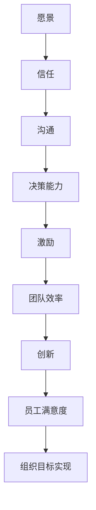
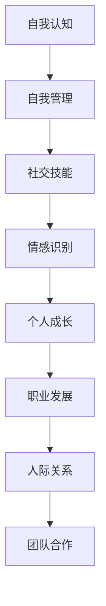
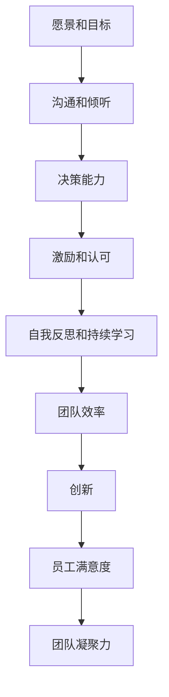

                 

### 第1章：领导力的定义与重要性

#### 1.1 领导力的定义

领导力是一个多维度的概念，它涉及激励、指导、决策、沟通等多个方面。从广义上讲，领导力可以定义为影响他人一起实现共同目标的能力。这种能力不仅限于企业管理者，而是普遍存在于各个层级和领域中。

领导力与管理的区别在于，管理侧重于确保组织的日常运作，而领导力则关注于推动组织向前发展，激发团队成员的潜力，并创造出一种积极的工作氛围。

在组织中，领导力的重要性体现在多个方面。首先，优秀的领导力能够提高团队的效率和凝聚力，从而实现组织的目标。其次，领导力可以激发创新和创造力，推动组织不断进步。最后，领导力对员工的职业发展和个人成长也有重要影响。

#### 1.2 领导力的核心要素

领导力的核心要素包括但不限于以下几个方面：

- **愿景**：领导力始于一个清晰的愿景，这个愿景为团队提供了明确的方向和目标。
- **信任**：建立和维护团队中的信任是领导力的基础。信任可以增强团队的凝聚力，促进协作和沟通。
- **沟通**：有效的沟通是领导力的关键。领导者需要能够清晰地传达信息，同时也要倾听团队成员的意见和反馈。
- **决策能力**：领导者在面对复杂问题时，需要具备快速做出有效决策的能力。
- **激励**：领导者需要能够激励团队成员，激发他们的积极性和创造力。

#### 1.3 领导力的 Mermaid 流程图

以下是领导力核心要素的 Mermaid 流程图：

通过这个流程图，我们可以看到领导力的各个核心要素是如何相互关联的，以及它们如何共同作用于团队和组织。

#### 1.4 领导力在组织中的角色

领导力在组织中的角色至关重要。首先，领导者是组织的灵魂，他们通过制定愿景和目标，为组织指引方向。其次，领导者是团队的纽带，他们通过沟通和激励，确保团队成员朝着共同的目标努力。最后，领导者是变革的推动者，他们通过创新和调整，使组织能够适应不断变化的环境。

在实际应用中，领导力不仅影响团队的工作效率，还影响员工的工作满意度和职业发展。因此，领导者需要不断地提升自己的领导力，以适应不同情境和挑战。

#### 1.5 领导力的发展

领导力的发展是一个持续的过程，它需要领导者不断地学习、实践和反思。以下是一些提升领导力的方法：

- **自我反思**：定期进行自我反思，了解自己的优势和不足，并制定相应的改进计划。
- **阅读和学习**：阅读有关领导力的书籍和文章，学习优秀的领导案例，从中获取启发和经验。
- **实践**：通过实际的工作经历，不断提升自己的领导力。在实践中遇到问题，学会解决问题，这是领导力发展的关键。
- **培训**：参加专业的领导力培训课程，学习系统的领导力知识和技能。

#### 1.6 领导力与情商的关系

情商是领导力的一个重要组成部分。高情商的领导者能够更好地理解和管理自己的情绪，同时也能够理解和激励团队成员的情绪。情商的提升有助于领导者更好地应对压力和挑战，建立良好的人际关系，提高领导效果。

总之，领导力是一个复杂而多维度的概念，它不仅仅是管理职位的要求，更是每个人在任何场合都能发挥的作用。通过提升领导力和情商，我们可以更好地影响他人，实现共同的目标，推动个人和组织的成长和发展。

### 第2章：情商的基本概念

#### 2.1 情商的定义

情商（Emotional Intelligence，EQ）是一个广泛的概念，它涉及到个体识别、理解、管理和利用自己及他人情绪的能力。情商不仅仅是关于个人情绪的管理，还涉及到社交技能、自我意识和自我调节等多个方面。情商在个人生活和职业发展中扮演着至关重要的角色。

#### 2.2 情商的分类

情商可以分为四个主要维度，即自我认知、自我管理、社交技能和情感识别。以下是每个维度的详细解释：

- **自我认知**：这是情商的基础，指的是个体对自己的情绪状态和内在动机的认识。自我认知能力可以帮助个体更好地理解自己的情绪，从而做出更明智的决策。

- **自我管理**：自我管理是指个体在情绪激动时控制情绪和行为的能力。这种能力可以帮助个体在压力和挑战面前保持冷静和专注，从而更好地应对各种情境。

- **社交技能**：社交技能涉及个体在社交场合中的沟通能力、建立和维护人际关系的能力。良好的社交技能有助于个体在团队合作、领导力和个人职业发展中取得成功。

- **情感识别**：情感识别是指个体识别和理解自己和他人的情绪状态。这种能力对于建立良好的人际关系和团队合作至关重要。

#### 2.3 情商的重要性

情商的重要性在于它对个人生活、职业发展和人际关系的影响。以下是一些关键点：

- **个人成长**：情商高的人更容易实现个人目标和职业发展，因为他们能够更好地理解自己的需求和动机，并有效地管理情绪。

- **职业发展**：在职场中，情商高的人更容易得到同事和上司的信任和认可，从而获得更多的职业机会。

- **人际关系**：良好的社交技能和情感识别能力有助于建立和维护健康的人际关系，减少冲突和误解。

- **团队合作**：在团队合作中，情商高的人能够更好地理解团队成员的情感和需求，从而促进协作和团队凝聚力。

#### 2.4 情商提升的方法

提升情商需要持续的努力和实践。以下是一些有效的方法：

- **自我反思**：定期进行自我反思，了解自己的情绪和行为模式，并寻找改进的机会。

- **情绪管理训练**：通过练习情绪管理技巧，如深呼吸、冥想和正念练习，提高自我管理和调节情绪的能力。

- **社交技能培养**：通过参加社交活动、角色扮演和沟通训练，提升社交技能。

- **情感识别练习**：通过阅读、观察和体验，提高对自己和他人的情绪识别能力。

#### 2.5 情商提升的 Mermaid 流程图

以下是情商提升的 Mermaid 流程图：

通过这个流程图，我们可以看到情商提升的各个方面是如何相互关联的，以及它们如何共同促进个人和职业发展。

#### 2.6 情商与领导力的关系

情商是领导力的一个关键组成部分。高情商的领导者能够更好地理解和管理自己的情绪，同时也能够理解和激励团队成员的情绪。情商的提升有助于领导者更好地应对压力和挑战，建立良好的人际关系，提高领导效果。

总之，情商是一个复杂而多维度的概念，它对个人生活、职业发展和人际关系具有重要影响。通过提升情商，我们可以更好地管理自己的情绪，提高社交技能，实现个人和职业目标。

### 第3章：有效沟通

#### 3.1 沟通的基本要素

沟通是人际交往的核心，是领导力的重要组成部分。有效沟通不仅涉及信息的传递，还涉及到理解、反馈和互动。沟通的基本要素包括：

- **信息源**：信息的发送者，可以是个人或组织。
- **信息内容**：需要传递的具体信息或观点。
- **信息传递渠道**：信息传递的媒介，如面对面的交流、电子邮件、电话或书面报告等。
- **信息接收者**：接收并处理信息的个体或团体。

有效沟通的三个基本要素是信息源、信息传递渠道和信息接收者。这三个要素之间需要保持良好的互动，以确保信息的准确性和有效性。

#### 3.2 沟通的技巧

- **倾听技巧**：倾听不仅仅是听到对方说的话，更是理解对方的意图和情感。有效的倾听包括积极倾听、确认理解和提问。
- **表达技巧**：清晰、准确地表达自己的想法和感受，避免误解和冲突。表达技巧包括使用简单明了的语言、避免使用模糊的术语和情绪化的话语。
- **非言语沟通**：非言语沟通包括肢体语言、面部表情、语调和眼神交流等。这些非言语因素在沟通中起着至关重要的作用，可以补充和强调言语沟通的内容。

#### 3.3 沟通的障碍与解决方法

沟通的障碍可能来自多个方面，包括文化差异、语言障碍、个人心理状态和沟通环境等。以下是一些常见的沟通障碍及其解决方法：

- **文化差异**：解决文化差异的障碍需要尊重和理解不同文化背景下的沟通习惯和价值观。可以通过跨文化培训和文化交流来提高跨文化沟通的能力。
- **语言障碍**：语言障碍可以通过学习语言、使用简单明了的语言和使用翻译服务来解决。
- **个人心理状态**：个人心理状态如焦虑、压力和情绪问题都可能影响沟通的有效性。通过心理辅导和情绪管理技巧，可以提高个人的心理状态，改善沟通效果。
- **沟通环境**：不良的沟通环境，如噪音、压力和不良的氛围，都可能阻碍沟通的顺利进行。改善沟通环境，如选择合适的时间和地点进行沟通，可以帮助解决这些障碍。

#### 3.4 沟通案例分析

为了更好地理解有效沟通的重要性，我们可以通过以下案例分析：

案例：一家跨国公司的项目经理需要与他的团队进行一次重要会议，讨论项目的进展和下一步计划。

- **信息源**：项目经理是信息源，他需要准备会议议程和项目报告。
- **信息传递渠道**：会议是信息传递的渠道，项目经理通过口头报告和讨论来传递信息。
- **信息接收者**：团队成员是信息接收者，他们需要理解项目进展和下一步计划。

在这个案例中，项目经理可以采用以下沟通技巧来确保会议的有效性：

1. **倾听技巧**：项目经理需要倾听团队成员的意见和建议，确保每个人都能表达自己的观点。
2. **表达技巧**：项目经理需要清晰、准确地传达项目进展和下一步计划，避免使用专业术语和模糊的语言。
3. **非言语沟通**：项目经理可以通过积极的肢体语言和眼神交流来增强沟通效果，表明他对团队成员的关注和尊重。

通过有效的沟通，项目经理可以确保团队对项目的进展有清晰的理解，并激发团队成员的参与和积极性，从而提高项目的成功概率。

#### 3.5 沟通与情商的关系

沟通与情商密切相关。情商高的人能够更好地理解和管理自己的情绪，同时也能够更好地理解他人的情感和需求。这种能力在沟通中尤为重要：

- **情绪管理**：情商高的人在沟通中能够更好地控制自己的情绪，避免情绪化的言辞和行为，从而避免误解和冲突。
- **同理心**：情商高的人能够站在对方的立场上思考问题，理解他人的感受，从而建立更好的人际关系。
- **适应性**：情商高的人能够适应不同的沟通环境和对象，灵活调整自己的沟通策略，提高沟通效果。

总之，有效沟通需要倾听技巧、表达技巧和非言语沟通能力的综合运用，同时还需要情商的支持。通过提升沟通技巧和情商，我们可以更好地理解他人，建立良好的人际关系，提高沟通的效果和效率。

### 第4章：冲突管理

#### 4.1 冲突的类型与原因

冲突是人际关系和团队合作中不可避免的一部分。冲突可以分为建设性冲突和破坏性冲突。建设性冲突是指能够促进团队思考和创新的冲突，而破坏性冲突则可能损害团队关系和效率。

- **建设性冲突**：建设性冲突通常源于团队成员对问题或解决方案的不同看法。这种冲突可以激发团队的思考和创新，促进问题的解决。例如，团队成员在讨论项目方案时，可能会提出不同的观点和建议，从而找到更好的解决方案。
- **破坏性冲突**：破坏性冲突通常源于个人利益冲突、沟通障碍或误解。这种冲突可能导致团队成员之间的关系紧张，影响团队的协作和效率。例如，团队成员在任务分配和责任归属上出现分歧，可能导致互相推诿和不满。

冲突的原因可以归结为以下几个方面：

- **意见分歧**：团队成员对问题或解决方案有不同的看法，无法达成一致意见。
- **利益冲突**：团队成员之间存在利益冲突，例如资源分配、晋升机会或工作责任等。
- **沟通障碍**：信息传递不畅导致误解和冲突。例如，团队成员之间缺乏有效的沟通渠道或沟通方式不当。
- **文化差异**：不同文化背景的团队成员可能存在价值观和行为习惯的差异，这可能导致冲突。

#### 4.2 冲突管理的策略

有效的冲突管理策略可以帮助团队预防和解决冲突，维持和谐的工作氛围和提高效率。以下是一些常见的冲突管理策略：

- **预防策略**：
  - **建立开放的沟通环境**：鼓励团队成员表达意见和反馈，确保信息畅通无阻。
  - **明确目标和期望**：明确团队目标和个人责任，减少误解和冲突。
  - **培训沟通技能**：通过培训提高团队成员的沟通能力，减少因沟通障碍引起的冲突。
  - **建立冲突解决机制**：制定明确的冲突解决流程，确保团队成员在出现冲突时知道如何寻求帮助和解决方案。

- **解决策略**：
  - **谈判与妥协**：通过谈判和妥协找到双方都能接受的解决方案，避免冲突升级。
  - **中立调解**：在冲突中保持中立立场，协助双方找到共同点，化解冲突。
  - **第三方调解**：在团队内部无法解决冲突时，引入第三方调解，以客观公正的方式解决冲突。

#### 4.3 冲突管理案例分析

为了更好地理解冲突管理策略的应用，我们可以通过以下案例分析：

案例：一家软件开发团队在项目开发过程中出现意见分歧，导致项目进度滞后。

- **冲突类型**：破坏性冲突，由于团队成员在技术方案选择上存在分歧，导致项目进展受阻。
- **冲突原因**：团队成员对技术方案的偏好不同，缺乏有效的沟通和协调。
- **冲突管理策略**：
  - **预防策略**：在项目启动阶段，通过明确项目目标和预期成果，减少误解和冲突。
  - **解决策略**：
    - **谈判与妥协**：项目经理组织团队成员进行讨论，通过谈判和妥协，找到双方都能接受的解决方案。
    - **中立调解**：项目经理在团队内部进行调解，确保每位团队成员都有机会表达自己的观点，并找到共同点。
    - **第三方调解**：如果内部调解无效，项目经理可以考虑引入技术专家或项目经理顾问，以客观公正的方式解决冲突。

通过有效的冲突管理，软件开发团队最终达成一致意见，项目进度恢复正常，团队协作得到加强。

#### 4.4 冲突管理的重要性

冲突管理在团队和组织中具有重要意义。首先，有效的冲突管理可以减少团队内部的紧张和摩擦，提高工作效率和满意度。其次，冲突管理有助于团队在面对挑战和变化时保持稳定和灵活性。最后，冲突管理可以促进团队成员之间的相互理解和尊重，建立更加和谐和高效的团队关系。

总之，冲突管理是团队和组织成功的关键因素之一。通过了解冲突的类型和原因，应用有效的冲突管理策略，团队可以更好地应对冲突，实现共同的目标。

### 第5章：团队协作

#### 5.1 团队协作的重要性

团队协作是现代工作环境中不可或缺的一部分，它涉及到团队成员之间的合作、沟通和共同努力，以实现共同的目标。团队协作的重要性体现在以下几个方面：

- **提升工作效率**：通过团队协作，可以更有效地完成复杂的任务和项目。团队成员可以互相补充技能和知识，从而提高整体工作效率。
- **增强创新能力**：团队协作鼓励成员分享想法和观点，从而激发创新思维。多个头脑的碰撞往往能够产生更优秀的解决方案。
- **促进个人成长**：在团队协作中，成员可以学习新的技能和知识，提升自己的职业能力。同时，通过与他人合作，成员可以更好地理解团队协作的重要性，提高个人软技能。
- **提高团队凝聚力**：团队协作有助于建立团队成员之间的信任和尊重，从而增强团队的凝聚力。一个紧密团结的团队能够在面对挑战时更加坚定和有力。

#### 5.2 团队协作的技巧

为了实现有效的团队协作，团队成员需要掌握一些关键的技巧。以下是一些常用的团队协作技巧：

- **沟通协调**：良好的沟通是团队协作的基础。团队成员需要学会如何清晰、准确地传达信息，同时也需要学会倾听和理解他人的意见。有效的沟通协调可以减少误解和冲突，提高团队的整体效率。
- **角色分配**：每个团队成员都应该明确自己的角色和职责，以确保任务能够被合理分配和执行。通过角色分配，可以确保每个成员都能够发挥自己的优势，同时避免重复劳动和资源浪费。
- **冲突解决**：在团队协作过程中，难免会出现意见分歧和冲突。团队成员需要学会如何以积极的方式解决冲突，避免冲突升级，影响团队进度。冲突解决技巧包括谈判、妥协和第三方调解等。
- **共同目标**：团队协作的成功离不开共同的目标。团队成员应该共同设定明确的目标，并确保每个人都了解这些目标的含义和重要性。共同目标可以帮助团队成员保持一致，共同努力，从而提高团队协作的效果。

#### 5.3 团队协作案例分析

为了更好地理解团队协作的实践，我们可以通过以下案例分析：

案例：一家初创公司在开发一款新的移动应用程序。为了确保项目的顺利进行，公司决定采用敏捷开发方法，并组建了一个跨职能团队。

- **团队组成**：团队由产品经理、设计师、开发工程师、测试工程师和市场分析师组成。
- **任务分配**：产品经理负责确定产品需求和优先级，设计师负责界面设计，开发工程师负责编码和开发，测试工程师负责测试和修复bug，市场分析师负责分析用户反馈和市场趋势。
- **沟通协调**：团队采用每日站会（Daily Stand-up Meeting）来同步进度，讨论问题和解决方案。此外，团队还使用项目管理工具（如Trello或Jira）来跟踪任务和进度。
- **冲突解决**：当团队成员在任务分配或技术决策上出现分歧时，他们会通过开诚布公的讨论和妥协来解决冲突。如果内部无法解决，团队会邀请项目经理或外部顾问进行调解。
- **共同目标**：团队的目标是按时发布一款高质量的应用程序，并在市场上取得成功。

通过有效的团队协作，这家初创公司成功地按计划完成了项目，并获得了用户和市场的高度评价。

#### 5.4 团队协作与领导力的关系

团队协作与领导力密切相关。领导者在团队协作中扮演着至关重要的角色，他们需要通过以下方式来促进团队协作：

- **设定目标**：领导者需要明确团队的目标和期望，并确保团队成员了解这些目标，以便大家能够共同努力。
- **提供资源**：领导者需要为团队成员提供必要的资源和工具，以确保他们能够有效地完成任务。
- **沟通与协调**：领导者需要确保团队内部的信息流通畅通无阻，并协调团队成员之间的合作。
- **激励与支持**：领导者需要激励团队成员，提供支持和鼓励，以增强团队的凝聚力和士气。

总之，团队协作是提高工作效率、增强创新能力和促进个人成长的关键因素。通过掌握团队协作的技巧和应用领导力，团队可以更好地实现共同的目标。

### 第6章：情商提升实践

#### 6.1 情商提升的方法

提升情商需要一系列的方法和实践，以下是一些常见且有效的方法：

- **自我反思**：自我反思是提升情商的第一步，通过定期审视自己的情绪和行为，我们可以更好地理解自己的情绪模式，识别潜在的问题，并制定改进计划。

- **情绪管理训练**：情绪管理训练包括学习如何识别和接受自己的情绪，以及如何有效地调节情绪。这可以通过深呼吸、冥想和正念练习来实现。

- **社交技能培养**：社交技能的培养涉及沟通技巧、倾听技巧和解决冲突的能力。通过参加社交活动、角色扮演和沟通培训，我们可以提高这些技能。

- **情感识别练习**：情感识别练习可以帮助我们更好地理解和识别自己和他人的情绪。这可以通过观察他人、阅读情感故事和情感卡片游戏来实现。

#### 6.2 情商提升的实践案例

以下是一个情商提升的实践案例：

案例：某公司的一名项目经理，张先生，意识到自己在沟通和冲突解决方面存在不足，决定通过提升情商来改善工作表现。

- **自我反思**：张先生开始定期记录自己的情绪变化和沟通情况，识别出自己在面对冲突时容易情绪化的行为模式。

- **情绪管理训练**：张先生开始每天进行冥想练习，学会在情绪激动时冷静下来，并通过深呼吸来缓解紧张情绪。

- **社交技能培养**：张先生参加了沟通技巧培训课程，学习了如何更有效地表达自己的想法和感受，以及如何倾听他人。

- **情感识别练习**：张先生开始通过阅读情感故事和参加情感卡片游戏来提高对他人情绪的识别能力。

通过这些实践，张先生发现自己的情绪管理能力得到了显著提升，沟通更加顺畅，冲突解决能力也有所增强。这不仅改善了他在团队中的工作表现，也提高了团队的整体效率。

#### 6.3 情商提升的长期实践

情商提升是一个长期的过程，需要持续的实践和努力。以下是一些建议，以帮助个人在长期实践中提升情商：

- **持续学习**：通过阅读相关书籍、参加培训课程和参加工作坊，不断学习和更新自己的情商知识。

- **定期反思**：定期进行自我反思，评估自己的进步和需要改进的地方，并制定相应的行动计划。

- **寻求反馈**：向同事、朋友或导师寻求反馈，了解他们在沟通和合作中的体验，以便调整和改进自己的行为。

- **实践应用**：将学到的情商技巧应用到实际工作和生活中，通过不断的实践来巩固和提高。

通过长期的实践和努力，我们可以不断提升自己的情商，改善人际关系，提高工作效率，实现个人和职业目标。

### 第7章：领导力提升实践

#### 7.1 领导力提升的方法

提升领导力需要系统的学习和实践，以下是一些有效的方法：

- **自我评估**：通过自我评估，了解自己的领导风格、优势和不足。可以使用领导力评估工具，如领导力问卷或360度反馈。

- **学习与实践**：阅读有关领导力的书籍、参加领导力培训课程和工作坊，学习理论知识和实践经验。

- **角色扮演**：通过角色扮演练习，模拟领导情境，提升领导技能和决策能力。

- **反馈与改进**：定期寻求同事、下属和导师的反馈，识别自己的改进点，并制定行动计划。

#### 7.2 领导力提升的实践案例

以下是一个领导力提升的实践案例：

案例：某公司的一名部门经理，李女士，希望通过提升领导力来改善部门的工作氛围和绩效。

- **自我评估**：李女士使用领导力问卷进行了自我评估，识别出自己在激励团队和冲突管理方面的不足。

- **学习与实践**：李女士参加了领导力培训课程，学习了激励理论和冲突解决技巧。她还阅读了相关书籍，如《领导力与影响力》和《高效能人士的七个习惯》。

- **角色扮演**：李女士在模拟情境中练习激励团队成员和解决冲突的技能，通过角色扮演来提高实际操作能力。

- **反馈与改进**：李女士定期与下属进行一对一的反馈会议，了解团队成员的感受和建议。她根据反馈调整自己的领导方式，制定改进计划。

通过这些实践，李女士的领导力得到了显著提升，部门的工作氛围更加积极，工作效率和绩效也有了明显改善。

#### 7.3 长期实践与持续发展

领导力提升是一个长期的过程，需要持续的努力和实践。以下是一些建议，以帮助个人在长期实践中提升领导力：

- **持续学习**：不断学习新的领导力知识和技能，通过阅读、参加培训和参加工作坊来更新自己的知识库。

- **反思与总结**：定期进行反思和总结，评估自己的领导力提升进展，识别需要改进的方面，并制定新的学习计划。

- **实践应用**：将学到的领导力技能应用到实际工作中，通过不断的实践来巩固和提高。

- **寻求反馈**：定期向下属、同事和导师寻求反馈，了解他们在领导力实践中的体验，以便调整和改进自己的领导方式。

通过长期的实践和努力，我们可以不断提升自己的领导力，成为更有效的领导者，推动团队和组织的发展。

### 附录A：情商提升与领导力提升的工具与资源

#### 评估工具

为了更好地提升情商和领导力，以下是一些常用的评估工具：

1. **梅耶-沙洛维-卡尔霍恩情商测试（MSCEIT）**：这是最广泛使用的情商评估工具之一，涵盖了四个维度：自我认知、自我管理、社交技能和情感识别。
2. **霍兰德领导风格量表**：用于评估领导者的领导风格，包括专制型、民主型和放任型等。
3. **360度反馈**：通过收集来自不同层级的反馈，全面了解自己的领导力和情商表现。

#### 训练课程

以下是一些推荐的情商和领导力提升训练课程：

1. **梅耶-沙洛维-卡尔霍恩情商训练课程**：提供系统性的情商提升训练，包括自我认知、自我管理、社交技能和情感识别。
2. **领导力发展课程**：如哈佛商学院的领导力发展项目，涵盖领导力基础、团队管理、决策能力等。
3. **行为科学培训课程**：如斯坦福大学的沟通技巧和行为科学培训，提供有效的沟通策略和人际关系管理技巧。

#### 相关书籍和资料推荐

以下是一些经典的情商和领导力书籍，供进一步学习和实践：

1. **《情绪智能》** - 丹尼尔·戈尔曼：详细介绍了情商的概念、维度和应用。
2. **《领导力与影响力》** - 约翰·麦斯威尔：提供了实用的领导力提升技巧和策略。
3. **《高效能人士的七个习惯》** - 史蒂芬·柯维：介绍了个人和团队成功的关键习惯。
4. **《非暴力沟通》** - 马歇尔·卢森堡：提供了有效沟通和冲突解决的方法。

通过使用这些评估工具、参加培训课程和阅读相关书籍，我们可以系统地提升情商和领导力，改善人际关系，提高工作效率和职业发展。持续学习和实践是提升情商和领导力的关键，也是实现个人和职业目标的重要途径。

---

**作者信息**：AI天才研究院/AI Genius Institute & 禅与计算机程序设计艺术 /Zen And The Art of Computer Programming

---

### 第1章：领导力的定义与重要性

#### 1.1 领导力的定义

领导力是一个多维度的概念，它涉及到激励、指导、决策、沟通等多个方面。从广义上讲，领导力可以定义为影响和激励他人一起实现共同目标的能力。这种能力不仅限于企业管理者，而是普遍存在于各个层级和领域中。

领导力与管理的区别在于，管理侧重于确保组织的日常运作，而领导力则关注于推动组织向前发展，激发团队成员的潜力，并创造出一种积极的工作氛围。

在组织中，领导力的重要性体现在多个方面。首先，优秀的领导力可以提升团队的效率和凝聚力，从而实现组织的目标。其次，领导力可以激发创新和创造力，推动组织不断进步。最后，领导力对员工的职业发展和个人成长也有重要影响。

#### 1.2 领导力的核心要素

领导力的核心要素包括但不限于以下几个方面：

- **愿景**：领导力始于一个清晰的愿景，这个愿景为团队提供了明确的方向和目标。
- **信任**：建立和维护团队中的信任是领导力的基础。信任可以增强团队的凝聚力，促进协作和沟通。
- **沟通**：有效的沟通是领导力的关键。领导者需要能够清晰地传达信息，同时也要倾听团队成员的意见和反馈。
- **决策能力**：领导者在面对复杂问题时，需要具备快速做出有效决策的能力。
- **激励**：领导者需要能够激励团队成员，激发他们的积极性和创造力。

#### 1.3 领导力的 Mermaid 流程图

以下是领导力核心要素的 Mermaid 流程图：

通过这个流程图，我们可以看到领导力的各个核心要素是如何相互关联的，以及它们如何共同作用于团队和组织。

#### 1.4 领导力在组织中的角色

领导力在组织中的角色至关重要。首先，领导者是组织的灵魂，他们通过制定愿景和目标，为组织指引方向。其次，领导者是团队的纽带，他们通过沟通和激励，确保团队成员朝着共同的目标努力。最后，领导者是变革的推动者，他们通过创新和调整，使组织能够适应不断变化的环境。

在实际应用中，领导力不仅影响团队的工作效率，还影响员工的工作满意度和职业发展。因此，领导者需要不断地提升自己的领导力，以适应不同情境和挑战。

#### 1.5 领导力的发展

领导力的发展是一个持续的过程，它需要领导者不断地学习、实践和反思。以下是一些提升领导力的方法：

- **自我反思**：定期进行自我反思，了解自己的优势和不足，并制定相应的改进计划。
- **阅读和学习**：阅读有关领导力的书籍和文章，学习优秀的领导案例，从中获取启发和经验。
- **实践**：通过实际的工作经历，不断提升自己的领导力。在实践中遇到问题，学会解决问题，这是领导力发展的关键。
- **培训**：参加专业的领导力培训课程，学习系统的领导力知识和技能。

#### 1.6 领导力与情商的关系

情商是领导力的一个重要组成部分。高情商的领导者能够更好地理解和管理自己的情绪，同时也能够理解和激励团队成员的情绪。情商的提升有助于领导者更好地应对压力和挑战，建立良好的人际关系，提高领导效果。

总之，领导力是一个复杂而多维度的概念，它对个人生活、职业发展和人际关系具有重要影响。通过提升领导力和情商，我们可以更好地影响他人，实现共同的目标，推动个人和组织的成长和发展。

### 第2章：情商的基本概念

#### 2.1 情商的定义

情商（Emotional Intelligence，EQ）是指一个人识别、理解、管理自己和他人情绪的能力。情商不仅仅是关于个人情绪的管理，还涉及到社交技能、自我意识和自我调节等多个方面。

情商的重要性在于它对个人生活、职业发展和人际关系的影响。首先，情商高的人能够更好地处理压力和挑战，保持心理健康。其次，情商有助于建立和维护良好的人际关系，提高沟通和合作能力。最后，情商在职场中也是衡量一个人成功的重要标准。

#### 2.2 情商的分类

情商可以分为四个主要维度，即自我认知、自我管理、社交技能和情感识别。以下是每个维度的详细解释：

- **自我认知**：自我认知是指个体对自己的情绪、需求、动机和信念的了解。自我认知有助于个体更好地理解自己的情绪和行为，从而做出更明智的决策。
- **自我管理**：自我管理是指个体在情绪激动时控制情绪和行为的能力。自我管理能力可以帮助个体在压力和挑战面前保持冷静和专注，从而更好地应对各种情境。
- **社交技能**：社交技能是指个体在社交场合中的沟通能力、建立和维护人际关系的能力。良好的社交技能有助于个体在团队合作、领导力和个人职业发展中取得成功。
- **情感识别**：情感识别是指个体识别和理解自己和他人的情绪状态。情感识别能力对于建立良好的人际关系和团队合作至关重要。

#### 2.3 情商提升的重要性

情商的提升对个人成长和职业发展具有重要意义。以下是一些关键点：

- **个人成长**：情商高的人能够更好地理解自己的情绪和需求，从而实现个人成长和自我提升。
- **职业发展**：在职场中，情商高的人更容易得到同事和上司的信任和认可，从而获得更多的职业机会。
- **人际关系**：良好的社交技能和情感识别能力有助于建立和维护健康的人际关系，减少冲突和误解。
- **团队合作**：在团队合作中，情商高的人能够更好地理解团队成员的情感和需求，从而促进协作和团队凝聚力。

#### 2.4 情商提升的方法

提升情商需要持续的努力和实践。以下是一些有效的方法：

- **自我反思**：定期进行自我反思，了解自己的情绪和行为模式，并寻找改进的机会。
- **情绪管理训练**：通过练习情绪管理技巧，如深呼吸、冥想和正念练习，提高自我管理和调节情绪的能力。
- **社交技能培养**：通过参加社交活动、角色扮演和沟通训练，提升社交技能。
- **情感识别练习**：通过阅读、观察和体验，提高对自己和他人的情绪识别能力。

#### 2.5 情商提升的 Mermaid 流程图

以下是情商提升的 Mermaid 流程图：

通过这个流程图，我们可以看到情商提升的各个方面是如何相互关联的，以及它们如何共同促进个人和职业发展。

#### 2.6 情商与领导力的关系

情商是领导力的一个关键组成部分。高情商的领导者能够更好地理解和管理自己的情绪，同时也能够理解和激励团队成员的情绪。情商的提升有助于领导者更好地应对压力和挑战，建立良好的人际关系，提高领导效果。

总之，情商是一个复杂而多维度的概念，它对个人生活、职业发展和人际关系具有重要影响。通过提升情商，我们可以更好地管理自己的情绪，提高社交技能，实现个人和职业目标。

### 第3章：有效沟通

#### 3.1 沟通的基本要素

沟通是人际交往的核心，是领导力的重要组成部分。有效沟通不仅涉及信息的传递，还涉及到理解、反馈和互动。沟通的基本要素包括：

- **信息源**：信息的发送者，可以是个人或组织。
- **信息内容**：需要传递的具体信息或观点。
- **信息传递渠道**：信息传递的媒介，如面对面的交流、电子邮件、电话或书面报告等。
- **信息接收者**：接收并处理信息的个体或团体。

有效沟通的三个基本要素是信息源、信息传递渠道和信息接收者。这三个要素之间需要保持良好的互动，以确保信息的准确性和有效性。

#### 3.2 沟通的技巧

- **倾听技巧**：倾听不仅仅是听到对方说的话，更是理解对方的意图和情感。有效的倾听包括积极倾听、确认理解和提问。
- **表达技巧**：清晰、准确地表达自己的想法和感受，避免误解和冲突。表达技巧包括使用简单明了的语言、避免使用模糊的术语和情绪化的话语。
- **非言语沟通**：非言语沟通包括肢体语言、面部表情、语调和眼神交流等。这些非言语因素在沟通中起着至关重要的作用，可以补充和强调言语沟通的内容。

#### 3.3 沟通的障碍与解决方法

沟通的障碍可能来自多个方面，包括文化差异、语言障碍、个人心理状态和沟通环境等。以下是一些常见的沟通障碍及其解决方法：

- **文化差异**：解决文化差异的障碍需要尊重和理解不同文化背景下的沟通习惯和价值观。可以通过跨文化培训和文化交流来提高跨文化沟通的能力。
- **语言障碍**：语言障碍可以通过学习语言、使用简单明了的语言和使用翻译服务来解决。
- **个人心理状态**：个人心理状态如焦虑、压力和情绪问题都可能影响沟通的有效性。通过心理辅导和情绪管理技巧，可以提高个人的心理状态，改善沟通效果。
- **沟通环境**：不良的沟通环境，如噪音、压力和不良的氛围，都可能阻碍沟通的顺利进行。改善沟通环境，如选择合适的时间和地点进行沟通，可以帮助解决这些障碍。

#### 3.4 沟通案例分析

为了更好地理解有效沟通的重要性，我们可以通过以下案例分析：

案例：一家跨国公司的项目经理需要与他的团队进行一次重要会议，讨论项目的进展和下一步计划。

- **信息源**：项目经理是信息源，他需要准备会议议程和项目报告。
- **信息传递渠道**：会议是信息传递的渠道，项目经理通过口头报告和讨论来传递信息。
- **信息接收者**：团队成员是信息接收者，他们需要理解项目进展和下一步计划。

在这个案例中，项目经理可以采用以下沟通技巧来确保会议的有效性：

1. **倾听技巧**：项目经理需要倾听团队成员的意见和建议，确保每个人都能表达自己的观点。
2. **表达技巧**：项目经理需要清晰、准确地传达项目进展和下一步计划，避免使用专业术语和模糊的语言。
3. **非言语沟通**：项目经理可以通过积极的肢体语言和眼神交流来增强沟通效果，表明他对团队成员的关注和尊重。

通过有效的沟通，项目经理可以确保团队对项目的进展有清晰的理解，并激发团队成员的参与和积极性，从而提高项目的成功概率。

#### 3.5 沟通与情商的关系

沟通与情商密切相关。情商高的人能够更好地理解和管理自己的情绪，同时也能够更好地理解他人的情感和需求。这种能力在沟通中尤为重要：

- **情绪管理**：情商高的人在沟通中能够更好地控制自己的情绪，避免情绪化的言辞和行为，从而避免误解和冲突。
- **同理心**：情商高的人能够站在对方的立场上思考问题，理解他人的感受，从而建立更好的人际关系。
- **适应性**：情商高的人能够适应不同的沟通环境和对象，灵活调整自己的沟通策略，提高沟通效果。

总之，有效沟通需要倾听技巧、表达技巧和非言语沟通能力的综合运用，同时还需要情商的支持。通过提升沟通技巧和情商，我们可以更好地理解他人，建立良好的人际关系，提高沟通的效果和效率。

### 第4章：冲突管理

#### 4.1 冲突的类型与原因

冲突是人际关系和团队合作中不可避免的一部分。冲突可以分为建设性冲突和破坏性冲突。建设性冲突是指能够促进团队思考和创新的冲突，而破坏性冲突则可能损害团队关系和效率。

- **建设性冲突**：建设性冲突通常源于团队成员对问题或解决方案的不同看法。这种冲突可以激发团队的思考和创新，促进问题的解决。例如，团队成员在讨论项目方案时，可能会提出不同的观点和建议，从而找到更好的解决方案。
- **破坏性冲突**：破坏性冲突通常源于个人利益冲突、沟通障碍或误解。这种冲突可能导致团队成员之间的关系紧张，影响团队的协作和效率。例如，团队成员在任务分配和责任归属上出现分歧，可能导致互相推诿和不满。

冲突的原因可以归结为以下几个方面：

- **意见分歧**：团队成员对问题或解决方案有不同的看法，无法达成一致意见。
- **利益冲突**：团队成员之间存在利益冲突，例如资源分配、晋升机会或工作责任等。
- **沟通障碍**：信息传递不畅导致误解和冲突。例如，团队成员之间缺乏有效的沟通渠道或沟通方式不当。
- **文化差异**：不同文化背景的团队成员可能存在价值观和行为习惯的差异，这可能导致冲突。

#### 4.2 冲突管理的策略

有效的冲突管理策略可以帮助团队预防和解决冲突，维持和谐的工作氛围和提高效率。以下是一些常见的冲突管理策略：

- **预防策略**：
  - **建立开放的沟通环境**：鼓励团队成员表达意见和反馈，确保信息畅通无阻。
  - **明确目标和期望**：明确团队目标和个人责任，减少误解和冲突。
  - **培训沟通技能**：通过培训提高团队成员的沟通能力，减少因沟通障碍引起的冲突。
  - **建立冲突解决机制**：制定明确的冲突解决流程，确保团队成员在出现冲突时知道如何寻求帮助和解决方案。

- **解决策略**：
  - **谈判与妥协**：通过谈判和妥协找到双方都能接受的解决方案，避免冲突升级。
  - **中立调解**：在冲突中保持中立立场，协助双方找到共同点，化解冲突。
  - **第三方调解**：在团队内部无法解决冲突时，引入第三方调解，以客观公正的方式解决冲突。

#### 4.3 冲突管理案例分析

为了更好地理解冲突管理策略的应用，我们可以通过以下案例分析：

案例：一家软件开发团队在项目开发过程中出现意见分歧，导致项目进度滞后。

- **冲突类型**：破坏性冲突，由于团队成员在技术方案选择上存在分歧，导致项目进展受阻。
- **冲突原因**：团队成员对技术方案的偏好不同，缺乏有效的沟通和协调。
- **冲突管理策略**：
  - **预防策略**：在项目启动阶段，通过明确项目目标和预期成果，减少误解和冲突。
  - **解决策略**：
    - **谈判与妥协**：项目经理组织团队成员进行讨论，通过谈判和妥协，找到双方都能接受的解决方案。
    - **中立调解**：项目经理在团队内部进行调解，确保每位团队成员都有机会表达自己的观点，并找到共同点。
    - **第三方调解**：如果内部调解无效，项目经理可以考虑引入技术专家或项目经理顾问，以客观公正的方式解决冲突。

通过有效的冲突管理，软件开发团队最终达成一致意见，项目进度恢复正常，团队协作得到加强。

#### 4.4 冲突管理的重要性

冲突管理在团队和组织中具有重要意义。首先，有效的冲突管理可以减少团队内部的紧张和摩擦，提高工作效率和满意度。其次，冲突管理有助于团队在面对挑战和变化时保持稳定和灵活性。最后，冲突管理可以促进团队成员之间的相互理解和尊重，建立更加和谐和高效的团队关系。

总之，冲突管理是团队和组织成功的关键因素之一。通过了解冲突的类型和原因，应用有效的冲突管理策略，团队可以更好地应对冲突，实现共同的目标。

### 第5章：团队协作

#### 5.1 团队协作的重要性

团队协作是现代工作环境中不可或缺的一部分，它涉及到团队成员之间的合作、沟通和共同努力，以实现共同的目标。团队协作的重要性体现在以下几个方面：

- **提升工作效率**：通过团队协作，可以更有效地完成复杂的任务和项目。团队成员可以互相补充技能和知识，从而提高整体工作效率。
- **增强创新能力**：团队协作鼓励成员分享想法和观点，从而激发创新思维。多个头脑的碰撞往往能够产生更优秀的解决方案。
- **促进个人成长**：在团队协作中，成员可以学习新的技能和知识，提升自己的职业能力。同时，通过与他人合作，成员可以更好地理解团队协作的重要性，提高个人软技能。
- **提高团队凝聚力**：团队协作有助于建立团队成员之间的信任和尊重，从而增强团队的凝聚力。一个紧密团结的团队能够在面对挑战时更加坚定和有力。

#### 5.2 团队协作的技巧

为了实现有效的团队协作，团队成员需要掌握一些关键的技巧。以下是一些常用的团队协作技巧：

- **沟通协调**：良好的沟通是团队协作的基础。团队成员需要学会如何清晰、准确地传达信息，同时也需要学会倾听和理解他人的意见。有效的沟通协调可以减少误解和冲突，提高团队的整体效率。
- **角色分配**：每个团队成员都应该明确自己的角色和职责，以确保任务能够被合理分配和执行。通过角色分配，可以确保每个成员都能够发挥自己的优势，同时避免重复劳动和资源浪费。
- **冲突解决**：在团队协作过程中，难免会出现意见分歧和冲突。团队成员需要学会如何以积极的方式解决冲突，避免冲突升级，影响团队进度。冲突解决技巧包括谈判、妥协和第三方调解等。
- **共同目标**：团队协作的成功离不开共同的目标。团队成员应该共同设定明确的目标，并确保每个人都了解这些目标的含义和重要性。共同目标可以帮助团队成员保持一致，共同努力，从而提高团队协作的效果。

#### 5.3 团队协作案例分析

为了更好地理解团队协作的实践，我们可以通过以下案例分析：

案例：一家初创公司在开发一款新的移动应用程序。为了确保项目的顺利进行，公司决定采用敏捷开发方法，并组建了一个跨职能团队。

- **团队组成**：团队由产品经理、设计师、开发工程师、测试工程师和市场分析师组成。
- **任务分配**：产品经理负责确定产品需求和优先级，设计师负责界面设计，开发工程师负责编码和开发，测试工程师负责测试和修复bug，市场分析师负责分析用户反馈和市场趋势。
- **沟通协调**：团队采用每日站会（Daily Stand-up Meeting）来同步进度，讨论问题和解决方案。此外，团队还使用项目管理工具（如Trello或Jira）来跟踪任务和进度。
- **冲突解决**：当团队成员在任务分配或技术决策上出现分歧时，他们会通过开诚布公的讨论和妥协来解决冲突。如果内部无法解决，团队会邀请项目经理或外部顾问进行调解。

通过有效的团队协作，这家初创公司成功地按计划完成了项目，并获得了用户和市场的高度评价。

#### 5.4 团队协作与领导力的关系

团队协作与领导力密切相关。领导者在团队协作中扮演着至关重要的角色，他们需要通过以下方式来促进团队协作：

- **设定目标**：领导者需要明确团队的目标和期望，并确保团队成员了解这些目标，以便大家能够共同努力。
- **提供资源**：领导者需要为团队成员提供必要的资源和工具，以确保他们能够有效地完成任务。
- **沟通与协调**：领导者需要确保团队内部的信息流通畅通无阻，并协调团队成员之间的合作。
- **激励与支持**：领导者需要激励团队成员，提供支持和鼓励，以增强团队的凝聚力和士气。

总之，团队协作是提高工作效率、增强创新能力和促进个人成长的关键因素。通过掌握团队协作的技巧和应用领导力，团队可以更好地实现共同的目标。

### 第6章：情商提升实践

#### 6.1 情商提升的方法

提升情商需要一系列的方法和实践，以下是一些常见且有效的方法：

- **自我反思**：自我反思是提升情商的第一步，通过定期审视自己的情绪和行为，我们可以更好地理解自己的情绪模式，识别潜在的问题，并制定改进计划。

- **情绪管理训练**：情绪管理训练包括学习如何识别和接受自己的情绪，以及如何有效地调节情绪。这可以通过深呼吸、冥想和正念练习来实现。

- **社交技能培养**：社交技能的培养涉及沟通技巧、倾听技巧和解决冲突的能力。通过参加社交活动、角色扮演和沟通培训，我们可以提高这些技能。

- **情感识别练习**：情感识别练习可以帮助我们更好地理解和识别自己和他人的情绪。这可以通过观察他人、阅读情感故事和情感卡片游戏来实现。

#### 6.2 情商提升的实践案例

以下是一个情商提升的实践案例：

案例：某公司的一名项目经理，张先生，意识到自己在沟通和冲突解决方面存在不足，决定通过提升情商来改善工作表现。

- **自我反思**：张先生开始定期记录自己的情绪变化和沟通情况，识别出自己在面对冲突时容易情绪化的行为模式。

- **情绪管理训练**：张先生开始每天进行冥想练习，学会在情绪激动时冷静下来，并通过深呼吸来缓解紧张情绪。

- **社交技能培养**：张先生参加了沟通技巧培训课程，学习了如何更有效地表达自己的想法和感受，以及如何倾听他人。

- **情感识别练习**：张先生开始通过阅读情感故事和参加情感卡片游戏来提高对他人情绪的识别能力。

通过这些实践，张先生发现自己的情绪管理能力得到了显著提升，沟通更加顺畅，冲突解决能力也有所增强。这不仅改善了他在团队中的工作表现，也提高了团队的整体效率。

#### 6.3 情商提升的长期实践

情商提升是一个长期的过程，需要持续的实践和努力。以下是一些建议，以帮助个人在长期实践中提升情商：

- **持续学习**：通过阅读相关书籍、参加培训课程和参加工作坊，不断学习和更新自己的情商知识。

- **定期反思**：定期进行自我反思，评估自己的进步和需要改进的地方，并制定相应的行动计划。

- **寻求反馈**：向同事、朋友或导师寻求反馈，了解他们在沟通和合作中的体验，以便调整和改进自己的行为。

- **实践应用**：将学到的情商技巧应用到实际工作和生活中，通过不断的实践来巩固和提高。

通过长期的实践和努力，我们可以不断提升自己的情商，改善人际关系，提高工作效率，实现个人和职业目标。

### 第7章：领导力提升实践

#### 7.1 领导力提升的方法

提升领导力需要系统的学习和实践，以下是一些有效的方法：

- **自我评估**：通过自我评估，了解自己的领导风格、优势和不足。可以使用领导力评估工具，如领导力问卷或360度反馈。

- **学习与实践**：阅读有关领导力的书籍、参加领导力培训课程和工作坊，学习理论知识和实践经验。

- **角色扮演**：通过角色扮演练习，模拟领导情境，提升领导技能和决策能力。

- **反馈与改进**：定期寻求同事、下属和导师的反馈，识别自己的改进点，并制定行动计划。

#### 7.2 领导力提升的实践案例

以下是一个领导力提升的实践案例：

案例：某公司的一名部门经理，李女士，希望通过提升领导力来改善部门的工作氛围和绩效。

- **自我评估**：李女士使用领导力问卷进行了自我评估，识别出自己在激励团队和冲突管理方面的不足。

- **学习与实践**：李女士参加了领导力培训课程，学习了激励理论和冲突解决技巧。她还阅读了相关书籍，如《领导力与影响力》和《高效能人士的七个习惯》。

- **角色扮演**：李女士在模拟情境中练习激励团队成员和解决冲突的技能，通过角色扮演来提高实际操作能力。

- **反馈与改进**：李女士定期与下属进行一对一的反馈会议，了解团队成员的感受和建议。她根据反馈调整自己的领导方式，制定改进计划。

通过这些实践，李女士的领导力得到了显著提升，部门的工作氛围更加积极，工作效率和绩效也有了明显改善。

#### 7.3 长期实践与持续发展

领导力提升是一个长期的过程，需要持续的努力和实践。以下是一些建议，以帮助个人在长期实践中提升领导力：

- **持续学习**：不断学习新的领导力知识和技能，通过阅读、参加培训和参加工作坊来更新自己的知识库。

- **反思与总结**：定期进行反思和总结，评估自己的领导力提升进展，识别需要改进的方面，并制定新的学习计划。

- **实践应用**：将学到的领导力技能应用到实际工作中，通过不断的实践来巩固和提高。

- **寻求反馈**：定期向下属、同事和导师寻求反馈，了解他们在领导力实践中的体验，以便调整和改进自己的领导方式。

通过长期的实践和努力，我们可以不断提升自己的领导力，成为更有效的领导者，推动团队和组织的发展。

### 附录A：情商提升与领导力提升的工具与资源

#### 评估工具

为了更好地提升情商和领导力，以下是一些常用的评估工具：

1. **梅耶-沙洛维-卡尔霍恩情商测试（MSCEIT）**：这是最广泛使用的情商评估工具之一，涵盖了四个维度：自我认知、自我管理、社交技能和情感识别。
2. **霍兰德领导风格量表**：用于评估领导者的领导风格，包括专制型、民主型和放任型等。
3. **360度反馈**：通过收集来自不同层级的反馈，全面了解自己的领导力和情商表现。

#### 训练课程

以下是一些推荐的情商和领导力提升训练课程：

1. **梅耶-沙洛维-卡尔霍恩情商训练课程**：提供系统性的情商提升训练，包括自我认知、自我管理、社交技能和情感识别。
2. **领导力发展课程**：如哈佛商学院的领导力发展项目，涵盖领导力基础、团队管理、决策能力等。
3. **行为科学培训课程**：如斯坦福大学的沟通技巧和行为科学培训，提供有效的沟通策略和人际关系管理技巧。

#### 相关书籍和资料推荐

以下是一些经典的情商和领导力书籍，供进一步学习和实践：

1. **《情绪智能》** - 丹尼尔·戈尔曼：详细介绍了情商的概念、维度和应用。
2. **《领导力与影响力》** - 约翰·麦斯威尔：提供了实用的领导力提升技巧和策略。
3. **《高效能人士的七个习惯》** - 史蒂芬·柯维：介绍了个人和团队成功的关键习惯。
4. **《非暴力沟通》** - 马歇尔·卢森堡：提供了有效沟通和冲突解决的方法。

通过使用这些评估工具、参加培训课程和阅读相关书籍，我们可以系统地提升情商和领导力，改善人际关系，提高工作效率和职业发展。持续学习和实践是提升情商和领导力的关键，也是实现个人和职业目标的重要途径。

---

**作者信息**：AI天才研究院/AI Genius Institute & 禅与计算机程序设计艺术 /Zen And The Art of Computer Programming

---

### 第1章：领导力的定义与重要性

#### 1.1 领导力的定义

领导力是一个多维度的概念，它涉及到激励、指导、决策、沟通等多个方面。从广义上讲，领导力可以定义为影响和激励他人一起实现共同目标的能力。这种能力不仅限于企业管理者，而是普遍存在于各个层级和领域中。

领导力与管理的区别在于，管理侧重于确保组织的日常运作，而领导力则关注于推动组织向前发展，激发团队成员的潜力，并创造出一种积极的工作氛围。

在组织中，领导力的重要性体现在多个方面。首先，优秀的领导力可以提升团队的效率和凝聚力，从而实现组织的目标。其次，领导力可以激发创新和创造力，推动组织不断进步。最后，领导力对员工的职业发展和个人成长也有重要影响。

#### 1.2 领导力的核心要素

领导力的核心要素包括但不限于以下几个方面：

- **愿景**：领导力始于一个清晰的愿景，这个愿景为团队提供了明确的方向和目标。
- **信任**：建立和维护团队中的信任是领导力的基础。信任可以增强团队的凝聚力，促进协作和沟通。
- **沟通**：有效的沟通是领导力的关键。领导者需要能够清晰地传达信息，同时也要倾听团队成员的意见和反馈。
- **决策能力**：领导者在面对复杂问题时，需要具备快速做出有效决策的能力。
- **激励**：领导者需要能够激励团队成员，激发他们的积极性和创造力。

#### 1.3 领导力的 Mermaid 流程图

以下是领导力核心要素的 Mermaid 流程图：

通过这个流程图，我们可以看到领导力的各个核心要素是如何相互关联的，以及它们如何共同作用于团队和组织。

#### 1.4 领导力在组织中的角色

领导力在组织中的角色至关重要。首先，领导者是组织的灵魂，他们通过制定愿景和目标，为组织指引方向。其次，领导者是团队的纽带，他们通过沟通和激励，确保团队成员朝着共同的目标努力。最后，领导者是变革的推动者，他们通过创新和调整，使组织能够适应不断变化的环境。

在实际应用中，领导力不仅影响团队的工作效率，还影响员工的工作满意度和职业发展。因此，领导者需要不断地提升自己的领导力，以适应不同情境和挑战。

#### 1.5 领导力的发展

领导力的发展是一个持续的过程，它需要领导者不断地学习、实践和反思。以下是一些提升领导力的方法：

- **自我反思**：定期进行自我反思，了解自己的优势和不足，并制定相应的改进计划。
- **阅读和学习**：阅读有关领导力的书籍和文章，学习优秀的领导案例，从中获取启发和经验。
- **实践**：通过实际的工作经历，不断提升自己的领导力。在实践中遇到问题，学会解决问题，这是领导力发展的关键。
- **培训**：参加专业的领导力培训课程，学习系统的领导力知识和技能。

#### 1.6 领导力与情商的关系

情商是领导力的一个重要组成部分。高情商的领导者能够更好地理解和管理自己的情绪，同时也能够理解和激励团队成员的情绪。情商的提升有助于领导者更好地应对压力和挑战，建立良好的人际关系，提高领导效果。

总之，领导力是一个复杂而多维度的概念，它对个人生活、职业发展和人际关系具有重要影响。通过提升领导力和情商，我们可以更好地影响他人，实现共同的目标，推动个人和组织的成长和发展。

### 第2章：情商的基本概念

#### 2.1 情商的定义

情商（Emotional Intelligence，EQ）是指一个人识别、理解、管理自己和他人情绪的能力。情商不仅仅是关于个人情绪的管理，还涉及到社交技能、自我意识和自我调节等多个方面。

情商的重要性在于它对个人生活、职业发展和人际关系的影响。首先，情商高的人能够更好地处理压力和挑战，保持心理健康。其次，情商有助于建立和维护良好的人际关系，提高沟通和合作能力。最后，情商在职场中也是衡量一个人成功的重要标准。

#### 2.2 情商的分类

情商可以分为四个主要维度，即自我认知、自我管理、社交技能和情感识别。以下是每个维度的详细解释：

- **自我认知**：自我认知是指个体对自己的情绪、需求、动机和信念的了解。自我认知有助于个体更好地理解自己的情绪和行为，从而做出更明智的决策。
- **自我管理**：自我管理是指个体在情绪激动时控制情绪和行为的能力。自我管理能力可以帮助个体在压力和挑战面前保持冷静和专注，从而更好地应对各种情境。
- **社交技能**：社交技能是指个体在社交场合中的沟通能力、建立和维护人际关系的能力。良好的社交技能有助于个体在团队合作、领导力和个人职业发展中取得成功。
- **情感识别**：情感识别是指个体识别和理解自己和他人的情绪状态。情感识别能力对于建立良好的人际关系和团队合作至关重要。

#### 2.3 情商提升的重要性

情商的提升对个人成长和职业发展具有重要意义。以下是一些关键点：

- **个人成长**：情商高的人能够更好地理解自己的情绪和需求，从而实现个人成长和自我提升。
- **职业发展**：在职场中，情商高的人更容易得到同事和上司的信任和认可，从而获得更多的职业机会。
- **人际关系**：良好的社交技能和情感识别能力有助于建立和维护健康的人际关系，减少冲突和误解。
- **团队合作**：在团队合作中，情商高的人能够更好地理解团队成员的情感和需求，从而促进协作和团队凝聚力。

#### 2.4 情商提升的方法

提升情商需要持续的努力和实践。以下是一些有效的方法：

- **自我反思**：定期进行自我反思，了解自己的情绪和行为模式，并寻找改进的机会。
- **情绪管理训练**：通过练习情绪管理技巧，如深呼吸、冥想和正念练习，提高自我管理和调节情绪的能力。
- **社交技能培养**：通过参加社交活动、角色扮演和沟通训练，提升社交技能。
- **情感识别练习**：通过阅读、观察和体验，提高对自己和他人的情绪识别能力。

#### 2.5 情商提升的 Mermaid 流程图

以下是情商提升的 Mermaid 流程图：

通过这个流程图，我们可以看到情商提升的各个方面是如何相互关联的，以及它们如何共同促进个人和职业发展。

#### 2.6 情商与领导力的关系

情商是领导力的一个关键组成部分。高情商的领导者能够更好地理解和管理自己的情绪，同时也能够理解和激励团队成员的情绪。情商的提升有助于领导者更好地应对压力和挑战，建立良好的人际关系，提高领导效果。

总之，情商是一个复杂而多维度的概念，它对个人生活、职业发展和人际关系具有重要影响。通过提升情商，我们可以更好地管理自己的情绪，提高社交技能，实现个人和职业目标。

### 第3章：有效沟通

#### 3.1 沟通的基本要素

沟通是人际交往的核心，是领导力的重要组成部分。有效沟通不仅涉及信息的传递，还涉及到理解、反馈和互动。沟通的基本要素包括：

- **信息源**：信息的发送者，可以是个人或组织。
- **信息内容**：需要传递的具体信息或观点。
- **信息传递渠道**：信息传递的媒介，如面对面的交流、电子邮件、电话或书面报告等。
- **信息接收者**：接收并处理信息的个体或团体。

有效沟通的三个基本要素是信息源、信息传递渠道和信息接收者。这三个要素之间需要保持良好的互动，以确保信息的准确性和有效性。

#### 3.2 沟通的技巧

- **倾听技巧**：倾听不仅仅是听到对方说的话，更是理解对方的意图和情感。有效的倾听包括积极倾听、确认理解和提问。
- **表达技巧**：清晰、准确地表达自己的想法和感受，避免误解和冲突。表达技巧包括使用简单明了的语言、避免使用模糊的术语和情绪化的话语。
- **非言语沟通**：非言语沟通包括肢体语言、面部表情、语调和眼神交流等。这些非言语因素在沟通中起着至关重要的作用，可以补充和强调言语沟通的内容。

#### 3.3 沟通的障碍与解决方法

沟通的障碍可能来自多个方面，包括文化差异、语言障碍、个人心理状态和沟通环境等。以下是一些常见的沟通障碍及其解决方法：

- **文化差异**：解决文化差异的障碍需要尊重和理解不同文化背景下的沟通习惯和价值观。可以通过跨文化培训和文化交流来提高跨文化沟通的能力。
- **语言障碍**：语言障碍可以通过学习语言、使用简单明了的语言和使用翻译服务来解决。
- **个人心理状态**：个人心理状态如焦虑、压力和情绪问题都可能影响沟通的有效性。通过心理辅导和情绪管理技巧，可以提高个人的心理状态，改善沟通效果。
- **沟通环境**：不良的沟通环境，如噪音、压力和不良的氛围，都可能阻碍沟通的顺利进行。改善沟通环境，如选择合适的时间和地点进行沟通，可以帮助解决这些障碍。

#### 3.4 沟通案例分析

为了更好地理解有效沟通的重要性，我们可以通过以下案例分析：

案例：一家跨国公司的项目经理需要与他的团队进行一次重要会议，讨论项目的进展和下一步计划。

- **信息源**：项目经理是信息源，他需要准备会议议程和项目报告。
- **信息传递渠道**：会议是信息传递的渠道，项目经理通过口头报告和讨论来传递信息。
- **信息接收者**：团队成员是信息接收者，他们需要理解项目进展和下一步计划。

在这个案例中，项目经理可以采用以下沟通技巧来确保会议的有效性：

1. **倾听技巧**：项目经理需要倾听团队成员的意见和建议，确保每个人都能表达自己的观点。
2. **表达技巧**：项目经理需要清晰、准确地传达项目进展和下一步计划，避免使用专业术语和模糊的语言。
3. **非言语沟通**：项目经理可以通过积极的肢体语言和眼神交流来增强沟通效果，表明他对团队成员的关注和尊重。

通过有效的沟通，项目经理可以确保团队对项目的进展有清晰的理解，并激发团队成员的参与和积极性，从而提高项目的成功概率。

#### 3.5 沟通与情商的关系

沟通与情商密切相关。情商高的人能够更好地理解和管理自己的情绪，同时也能够更好地理解他人的情感和需求。这种能力在沟通中尤为重要：

- **情绪管理**：情商高的人在沟通中能够更好地控制自己的情绪，避免情绪化的言辞和行为，从而避免误解和冲突。
- **同理心**：情商高的人能够站在对方的立场上思考问题，理解他人的感受，从而建立更好的人际关系。
- **适应性**：情商高的人能够适应不同的沟通环境和对象，灵活调整自己的沟通策略，提高沟通效果。

总之，有效沟通需要倾听技巧、表达技巧和非言语沟通能力的综合运用，同时还需要情商的支持。通过提升沟通技巧和情商，我们可以更好地理解他人，建立良好的人际关系，提高沟通的效果和效率。

### 第4章：冲突管理

#### 4.1 冲突的类型与原因

冲突是人际关系和团队合作中不可避免的一部分。冲突可以分为建设性冲突和破坏性冲突。建设性冲突是指能够促进团队思考和创新的冲突，而破坏性冲突则可能损害团队关系和效率。

- **建设性冲突**：建设性冲突通常源于团队成员对问题或解决方案的不同看法。这种冲突可以激发团队的思考和创新，促进问题的解决。例如，团队成员在讨论项目方案时，可能会提出不同的观点和建议，从而找到更好的解决方案。
- **破坏性冲突**：破坏性冲突通常源于个人利益冲突、沟通障碍或误解。这种冲突可能导致团队成员之间的关系紧张，影响团队的协作和效率。例如，团队成员在任务分配和责任归属上出现分歧，可能导致互相推诿和不满。

冲突的原因可以归结为以下几个方面：

- **意见分歧**：团队成员对问题或解决方案有不同的看法，无法达成一致意见。
- **利益冲突**：团队成员之间存在利益冲突，例如资源分配、晋升机会或工作责任等。
- **沟通障碍**：信息传递不畅导致误解和冲突。例如，团队成员之间缺乏有效的沟通渠道或沟通方式不当。
- **文化差异**：不同文化背景的团队成员可能存在价值观和行为习惯的差异，这可能导致冲突。

#### 4.2 冲突管理的策略

有效的冲突管理策略可以帮助团队预防和解决冲突，维持和谐的工作氛围和提高效率。以下是一些常见的冲突管理策略：

- **预防策略**：
  - **建立开放的沟通环境**：鼓励团队成员表达意见和反馈，确保信息畅通无阻。
  - **明确目标和期望**：明确团队目标和个人责任，减少误解和冲突。
  - **培训沟通技能**：通过培训提高团队成员的沟通能力，减少因沟通障碍引起的冲突。
  - **建立冲突解决机制**：制定明确的冲突解决流程，确保团队成员在出现冲突时知道如何寻求帮助和解决方案。

- **解决策略**：
  - **谈判与妥协**：通过谈判和妥协找到双方都能接受的解决方案，避免冲突升级。
  - **中立调解**：在冲突中保持中立立场，协助双方找到共同点，化解冲突。
  - **第三方调解**：在团队内部无法解决冲突时，引入第三方调解，以客观公正的方式解决冲突。

#### 4.3 冲突管理案例分析

为了更好地理解冲突管理策略的应用，我们可以通过以下案例分析：

案例：一家软件开发团队在项目开发过程中出现意见分歧，导致项目进度滞后。

- **冲突类型**：破坏性冲突，由于团队成员在技术方案选择上存在分歧，导致项目进展受阻。
- **冲突原因**：团队成员对技术方案的偏好不同，缺乏有效的沟通和协调。
- **冲突管理策略**：
  - **预防策略**：在项目启动阶段，通过明确项目目标和预期成果，减少误解和冲突。
  - **解决策略**：
    - **谈判与妥协**：项目经理组织团队成员进行讨论，通过谈判和妥协，找到双方都能接受的解决方案。
    - **中立调解**：项目经理在团队内部进行调解，确保每位团队成员都有机会表达自己的观点，并找到共同点。
    - **第三方调解**：如果内部调解无效，项目经理可以考虑引入技术专家或项目经理顾问，以客观公正的方式解决冲突。

通过有效的冲突管理，软件开发团队最终达成一致意见，项目进度恢复正常，团队协作得到加强。

#### 4.4 冲突管理的重要性

冲突管理在团队和组织中具有重要意义。首先，有效的冲突管理可以减少团队内部的紧张和摩擦，提高工作效率和满意度。其次，冲突管理有助于团队在面对挑战和变化时保持稳定和灵活性。最后，冲突管理可以促进团队成员之间的相互理解和尊重，建立更加和谐和高效的团队关系。

总之，冲突管理是团队和组织成功的关键因素之一。通过了解冲突的类型和原因，应用有效的冲突管理策略，团队可以更好地应对冲突，实现共同的目标。

### 第5章：团队协作

#### 5.1 团队协作的重要性

团队协作是现代工作环境中不可或缺的一部分，它涉及到团队成员之间的合作、沟通和共同努力，以实现共同的目标。团队协作的重要性体现在以下几个方面：

- **提升工作效率**：通过团队协作，可以更有效地完成复杂的任务和项目。团队成员可以互相补充技能和知识，从而提高整体工作效率。
- **增强创新能力**：团队协作鼓励成员分享想法和观点，从而激发创新思维。多个头脑的碰撞往往能够产生更优秀的解决方案。
- **促进个人成长**：在团队协作中，成员可以学习新的技能和知识，提升自己的职业能力。同时，通过与他人合作，成员可以更好地理解团队协作的重要性，提高个人软技能。
- **提高团队凝聚力**：团队协作有助于建立团队成员之间的信任和尊重，从而增强团队的凝聚力。一个紧密团结的团队能够在面对挑战时更加坚定和有力。

#### 5.2 团队协作的技巧

为了实现有效的团队协作，团队成员需要掌握一些关键的技巧。以下是一些常用的团队协作技巧：

- **沟通协调**：良好的沟通是团队协作的基础。团队成员需要学会如何清晰、准确地传达信息，同时也需要学会倾听和理解他人的意见。有效的沟通协调可以减少误解和冲突，提高团队的整体效率。
- **角色分配**：每个团队成员都应该明确自己的角色和职责，以确保任务能够被合理分配和执行。通过角色分配，可以确保每个成员都能够发挥自己的优势，同时避免重复劳动和资源浪费。
- **冲突解决**：在团队协作过程中，难免会出现意见分歧和冲突。团队成员需要学会如何以积极的方式解决冲突，避免冲突升级，影响团队进度。冲突解决技巧包括谈判、妥协和第三方调解等。
- **共同目标**：团队协作的成功离不开共同的目标。团队成员应该共同设定明确的目标，并确保每个人都了解这些目标的含义和重要性。共同目标可以帮助团队成员保持一致，共同努力，从而提高团队协作的效果。

#### 5.3 团队协作案例分析

为了更好地理解团队协作的实践，我们可以通过以下案例分析：

案例：一家初创公司在开发一款新的移动应用程序。为了确保项目的顺利进行，公司决定采用敏捷开发方法，并组建了一个跨职能团队。

- **团队组成**：团队由产品经理、设计师、开发工程师、测试工程师和市场分析师组成。
- **任务分配**：产品经理负责确定产品需求和优先级，设计师负责界面设计，开发工程师负责编码和开发，测试工程师负责测试和修复bug，市场分析师负责分析用户反馈和市场趋势。
- **沟通协调**：团队采用每日站会（Daily Stand-up Meeting）来同步进度，讨论问题和解决方案。此外，团队还使用项目管理工具（如Trello或Jira）来跟踪任务和进度。
- **冲突解决**：当团队成员在任务分配或技术决策上出现分歧时，他们会通过开诚布公的讨论和妥协来解决冲突。如果内部无法解决，团队会邀请项目经理或外部顾问进行调解。

通过有效的团队协作，这家初创公司成功地按计划完成了项目，并获得了用户和市场的高度评价。

#### 5.4 团队协作与领导力的关系

团队协作与领导力密切相关。领导者在团队协作中扮演着至关重要的角色，他们需要通过以下方式来促进团队协作：

- **设定目标**：领导者需要明确团队的目标和期望，并确保团队成员了解这些目标，以便大家能够共同努力。
- **提供资源**：领导者需要为团队成员提供必要的资源和工具，以确保他们能够有效地完成任务。
- **沟通与协调**：领导者需要确保团队内部的信息流通畅通无阻，并协调团队成员之间的合作。
- **激励与支持**：领导者需要激励团队成员，提供支持和鼓励，以增强团队的凝聚力和士气。

总之，团队协作是提高工作效率、增强创新能力和促进个人成长的关键因素。通过掌握团队协作的技巧和应用领导力，团队可以更好地实现共同的目标。

### 第6章：情商提升实践

#### 6.1 情商提升的方法

提升情商需要一系列的方法和实践，以下是一些常见且有效的方法：

- **自我反思**：自我反思是提升情商的第一步，通过定期审视自己的情绪和行为，我们可以更好地理解自己的情绪模式，识别潜在的问题，并制定改进计划。

- **情绪管理训练**：情绪管理训练包括学习如何识别和接受自己的情绪，以及如何有效地调节情绪。这可以通过深呼吸、冥想和正念练习来实现。

- **社交技能培养**：社交技能的培养涉及沟通技巧、倾听技巧和解决冲突的能力。通过参加社交活动、角色扮演和沟通培训，我们可以提高这些技能。

- **情感识别练习**：情感识别练习可以帮助我们更好地理解和识别自己和他人的情绪。这可以通过观察他人、阅读情感故事和情感卡片游戏来实现。

#### 6.2 情商提升的实践案例

以下是一个情商提升的实践案例：

案例：某公司的一名项目经理，张先生，意识到自己在沟通和冲突解决方面存在不足，决定通过提升情商来改善工作表现。

- **自我反思**：张先生开始定期记录自己的情绪变化和沟通情况，识别出自己在面对冲突时容易情绪化的行为模式。

- **情绪管理训练**：张先生开始每天进行冥想练习，学会在情绪激动时冷静下来，并通过深呼吸来缓解紧张情绪。

- **社交技能培养**：张先生参加了沟通技巧培训课程，学习了如何更有效地表达自己的想法和感受，以及如何倾听他人。

- **情感识别练习**：张先生开始通过阅读情感故事和参加情感卡片游戏来提高对他人情绪的识别能力。

通过这些实践，张先生发现自己的情绪管理能力得到了显著提升，沟通更加顺畅，冲突解决能力也有所增强。这不仅改善了他在团队中的工作表现，也提高了团队的整体效率。

#### 6.3 情商提升的长期实践

情商提升是一个长期的过程，需要持续的实践和努力。以下是一些建议，以帮助个人在长期实践中提升情商：

- **持续学习**：通过阅读相关书籍、参加培训课程和参加工作坊，不断学习和更新自己的情商知识。

- **定期反思**：定期进行自我反思，评估自己的进步和需要改进的地方，并制定相应的行动计划。

- **寻求反馈**：向同事、朋友或导师寻求反馈，了解他们在沟通和合作中的体验，以便调整和改进自己的行为。

- **实践应用**：将学到的情商技巧应用到实际工作和生活中，通过不断的实践来巩固和提高。

通过长期的实践和努力，我们可以不断提升自己的情商，改善人际关系，提高工作效率，实现个人和职业目标。

### 第7章：领导力提升实践

#### 7.1 领导力提升的方法

提升领导力需要系统的学习和实践，以下是一些有效的方法：

- **自我评估**：通过自我评估，了解自己的领导风格、优势和不足。可以使用领导力评估工具，如领导力问卷或360度反馈。

- **学习与实践**：阅读有关领导力的书籍、参加领导力培训课程和工作坊，学习理论知识和实践经验。

- **角色扮演**：通过角色扮演练习，模拟领导情境，提升领导技能和决策能力。

- **反馈与改进**：定期寻求同事、下属和导师的反馈，识别自己的改进点，并制定行动计划。

#### 7.2 领导力提升的实践案例

以下是一个领导力提升的实践案例：

案例：某公司的一名部门经理，李女士，希望通过提升领导力来改善部门的工作氛围和绩效。

- **自我评估**：李女士使用领导力问卷进行了自我评估，识别出自己在激励团队和冲突管理方面的不足。

- **学习与实践**：李女士参加了领导力培训课程，学习了激励理论和冲突解决技巧。她还阅读了相关书籍，如《领导力与影响力》和《高效能人士的七个习惯》。

- **角色扮演**：李女士在模拟情境中练习激励团队成员和解决冲突的技能，通过角色扮演来提高实际操作能力。

- **反馈与改进**：李女士定期与下属进行一对一的反馈会议，了解团队成员的感受和建议。她根据反馈调整自己的领导方式，制定改进计划。

通过这些实践，李女士的领导力得到了显著提升，部门的工作氛围更加积极，工作效率和绩效也有了明显改善。

#### 7.3 长期实践与持续发展

领导力提升是一个长期的过程，需要持续的努力和实践。以下是一些建议，以帮助个人在长期实践中提升领导力：

- **持续学习**：不断学习新的领导力知识和技能，通过阅读、参加培训和参加工作坊来更新自己的知识库。

- **反思与总结**：定期进行反思和总结，评估自己的领导力提升进展，识别需要改进的方面，并制定新的学习计划。

- **实践应用**：将学到的领导力技能应用到实际工作中，通过不断的实践来巩固和提高。

- **寻求反馈**：定期向下属、同事和导师寻求反馈，了解他们在领导力实践中的体验，以便调整和改进自己的领导方式。

通过长期的实践和努力，我们可以不断提升自己的领导力，成为更有效的领导者，推动团队和组织的发展。

### 附录A：情商提升与领导力提升的工具与资源

#### 评估工具

为了更好地提升情商和领导力，以下是一些常用的评估工具：

1. **梅耶-沙洛维-卡尔霍恩情商测试（MSCEIT）**：这是最广泛使用的情商评估工具之一，涵盖了四个维度：自我认知、自我管理、社交技能和情感识别。
2. **霍兰德领导风格量表**：用于评估领导者的领导风格，包括专制型、民主型和放任型等。
3. **360度反馈**：通过收集来自不同层级的反馈，全面了解自己的领导力和情商表现。

#### 训练课程

以下是一些推荐的情商和领导力提升训练课程：

1. **梅耶-沙洛维-卡尔霍恩情商训练课程**：提供系统性的情商提升训练，包括自我认知、自我管理、社交技能和情感识别。
2. **领导力发展课程**：如哈佛商学院的领导力发展项目，涵盖领导力基础、团队管理、决策能力等。
3. **行为科学培训课程**：如斯坦福大学的沟通技巧和行为科学培训，提供有效的沟通策略和人际关系管理技巧。

#### 相关书籍和资料推荐

以下是一些经典的情商和领导力书籍，供进一步学习和实践：

1. **《情绪智能》** - 丹尼尔·戈尔曼：详细介绍了情商的概念、维度和应用。
2. **《领导力与影响力》** - 约翰·麦斯威尔：提供了实用的领导力提升技巧和策略。
3. **《高效能人士的七个习惯》** - 史蒂芬·柯维：介绍了个人和团队成功的关键习惯。
4. **《非暴力沟通》** - 马歇尔·卢森堡：提供了有效沟通和冲突解决的方法。

通过使用这些评估工具、参加培训课程和阅读相关书籍，我们可以系统地提升情商和领导力，改善人际关系，提高工作效率和职业发展。持续学习和实践是提升情商和领导力的关键，也是实现个人和职业目标的重要途径。

---

**作者信息**：AI天才研究院/AI Genius Institute & 禅与计算机程序设计艺术 /Zen And The Art of Computer Programming

---

### 第1章：领导力的定义与重要性

#### 1.1 领导力的定义

领导力是一个多维度的概念，它涉及到激励、指导、决策、沟通等多个方面。从广义上讲，领导力可以定义为影响和激励他人一起实现共同目标的能力。这种能力不仅限于企业管理者，而是普遍存在于各个层级和领域中。

领导力与管理的区别在于，管理侧重于确保组织的日常运作，而领导力则关注于推动组织向前发展，激发团队成员的潜力，并创造出一种积极的工作氛围。

在组织中，领导力的重要性体现在多个方面。首先，优秀的领导力可以提升团队的效率和凝聚力，从而实现组织的目标。其次，领导力可以激发创新和创造力，推动组织不断进步。最后，领导力对员工的职业发展和个人成长也有重要影响。

#### 1.2 领导力的核心要素

领导力的核心要素包括但不限于以下几个方面：

- **愿景**：领导力始于一个清晰的愿景，这个愿景为团队提供了明确的方向和目标。
- **信任**：建立和维护团队中的信任是领导力的基础。信任可以增强团队的凝聚力，促进协作和沟通。
- **沟通**：有效的沟通是领导力的关键。领导者需要能够清晰地传达信息，同时也要倾听团队成员的意见和反馈。
- **决策能力**：领导者在面对复杂问题时，需要具备快速做出有效决策的能力。
- **激励**：领导者需要能够激励团队成员，激发他们的积极性和创造力。

#### 1.3 领导力的 Mermaid 流程图

以下是领导力核心要素的 Mermaid 流程图：

通过这个流程图，我们可以看到领导力的各个核心要素是如何相互关联的，以及它们如何共同作用于团队和组织。

#### 1.4 领导力在组织中的角色

领导力在组织中的角色至关重要。首先，领导者是组织的灵魂，他们通过制定愿景和目标，为组织指引方向。其次，领导者是团队的纽带，他们通过沟通和激励，确保团队成员朝着共同的目标努力。最后，领导者是变革的推动者，他们通过创新和调整，使组织能够适应不断变化的环境。

在实际应用中，领导力不仅影响团队的工作效率，还影响员工的工作满意度和职业发展。因此，领导者需要不断地提升自己的领导力，以适应不同情境和挑战。

#### 1.5 领导力的发展

领导力的发展是一个持续的过程，它需要领导者不断地学习、实践和反思。以下是一些提升领导力的方法：

- **自我反思**：定期进行自我反思，了解自己的优势和不足，并制定相应的改进计划。
- **阅读和学习**：阅读有关领导力的书籍和文章，学习优秀的领导案例，从中获取启发和经验。
- **实践**：通过实际的工作经历，不断提升自己的领导力。在实践中遇到问题，学会解决问题，这是领导力发展的关键。
- **培训**：参加专业的领导力培训课程，学习系统的领导力知识和技能。

#### 1.6 领导力与情商的关系

情商是领导力的一个重要组成部分。高情商的领导者能够更好地理解和管理自己的情绪，同时也能够理解和激励团队成员的情绪。情商的提升有助于领导者更好地应对压力和挑战，建立良好的人际关系，提高领导效果。

总之，领导力是一个复杂而多维度的概念，它对个人生活、职业发展和人际关系具有重要影响。通过提升领导力和情商，我们可以更好地影响他人，实现共同的目标，推动个人和组织的成长和发展。

### 第2章：情商的基本概念

#### 2.1 情商的定义

情商（Emotional Intelligence，EQ）是指一个人识别、理解、管理自己和他人情绪的能力。情商不仅仅是关于个人情绪的管理，还涉及到社交技能、自我意识和自我调节等多个方面。

情商的重要性在于它对个人生活、职业发展和人际关系的影响。首先，情商高的人能够更好地处理压力和挑战，保持心理健康。其次，情商有助于建立和维护良好的人际关系，提高沟通和合作能力。最后，情商在职场中也是衡量一个人成功的重要标准。

#### 2.2 情商的分类

情商可以分为四个主要维度，即自我认知、自我管理、社交技能和情感识别。以下是每个维度的详细解释：

- **自我认知**：自我认知是指个体对自己的情绪、需求、动机和信念的了解。自我认知有助于个体更好地理解自己的情绪和行为，从而做出更明智的决策。
- **自我管理**：自我管理是指个体在情绪激动时控制情绪和行为的能力。自我管理能力可以帮助个体在压力和挑战面前保持冷静和专注，从而更好地应对各种情境。
- **社交技能**：社交技能是指个体在社交场合中的沟通能力、建立和维护人际关系的能力。良好的社交技能有助于个体在团队合作、领导力和个人职业发展中取得成功。
- **情感识别**：情感识别是指个体识别和理解自己和他人的情绪状态。情感识别能力对于建立良好的人际关系和团队合作至关重要。

#### 2.3 情商提升的重要性

情商的提升对个人成长和职业发展具有重要意义。以下是一些关键点：

- **个人成长**：情商高的人能够更好地理解自己的情绪和需求，从而实现个人成长和自我提升。
- **职业发展**：在职场中，情商高的人更容易得到同事和上司的信任和认可，从而获得更多的职业机会。
- **人际关系**：良好的社交技能和情感识别能力有助于建立和维护健康的人际关系，减少冲突和误解。
- **团队合作**：在团队合作中，情商高的人能够更好地理解团队成员的情感和需求，从而促进协作和团队凝聚力。

#### 2.4 情商提升的方法

提升情商需要持续的努力和实践。以下是一些有效的方法：

- **自我反思**：定期进行自我反思，了解自己的情绪和行为模式，并寻找改进的机会。
- **情绪管理训练**：通过练习情绪管理技巧，如深呼吸、冥想和正念练习，提高自我管理和调节情绪的能力。
- **社交技能培养**：通过参加社交活动、角色扮演和沟通训练，提升社交技能。
- **情感识别练习**：通过阅读、观察和体验，提高对自己和他人的情绪识别能力。

#### 2.5 情商提升的 Mermaid 流程图

以下是情商提升的 Mermaid 流程图：

通过这个流程图，我们可以看到情商提升的各个方面是如何相互关联的，以及它们如何共同促进个人和职业发展。

#### 2.6 情商与领导力的关系

情商是领导力的一个关键组成部分。高情商的领导者能够更好地理解和管理自己的情绪，同时也能够理解和激励团队成员的情绪。情商的提升有助于领导者更好地应对压力和挑战，建立良好的人际关系，提高领导效果。

总之，情商是一个复杂而多维度的概念，它对个人生活、职业发展和人际关系具有重要影响。通过提升情商，我们可以更好地管理自己的情绪，提高社交技能，实现个人和职业目标。

### 第3章：有效沟通

#### 3.1 沟通的基本要素

沟通是人际交往的核心，是领导力的重要组成部分。有效沟通不仅涉及信息的传递，还涉及到理解、反馈和互动。沟通的基本要素包括：

- **信息源**：信息的发送者，可以是个人或组织。
- **信息内容**：需要传递的具体信息或观点。
- **信息传递渠道**：信息传递的媒介，如面对面的交流、电子邮件、电话或书面报告等。
- **信息接收者**：接收并处理信息的个体或团体。

有效沟通的三个基本要素是信息源、信息传递渠道和信息接收者。这三个要素之间需要保持良好的互动，以确保信息的准确性和有效性。

#### 3.2 沟通的技巧

- **倾听技巧**：倾听不仅仅是听到对方说的话，更是理解对方的意图和情感。有效的倾听包括积极倾听、确认理解和提问。
- **表达技巧**：清晰、准确地表达自己的想法和感受，避免误解和冲突。表达技巧包括使用简单明了的语言、避免使用模糊的术语和情绪化的话语。
- **非言语沟通**：非言语沟通包括肢体语言、面部表情、语调和眼神交流等。这些非言语因素在沟通中起着至关重要的作用，可以补充和强调言语沟通的内容。

#### 3.3 沟通的障碍与解决方法

沟通的障碍可能来自多个方面，包括文化差异、语言障碍、个人心理状态和沟通环境等。以下是一些常见的沟通障碍及其解决方法：

- **文化差异**：解决文化差异的障碍需要尊重和理解不同文化背景下的沟通习惯和价值观。可以通过跨文化培训和文化交流来提高跨文化沟通的能力。
- **语言障碍**：语言障碍可以通过学习语言、使用简单明了的语言和使用翻译服务来解决。
- **个人心理状态**：个人心理状态如焦虑、压力和情绪问题都可能影响沟通的有效性。通过心理辅导和情绪管理技巧，可以提高个人的心理状态，改善沟通效果。
- **沟通环境**：不良的沟通环境，如噪音、压力和不良的氛围，都可能阻碍沟通的顺利进行。改善沟通环境，如选择合适的时间和地点进行沟通，可以帮助解决这些障碍。

#### 3.4 沟通案例分析

为了更好地理解有效沟通的重要性，我们可以通过以下案例分析：

案例：一家跨国公司的项目经理需要与他的团队进行一次重要会议，讨论项目的进展和下一步计划。

- **信息源**：项目经理是信息源，他需要准备会议议程和项目报告。
- **信息传递渠道**：会议是信息传递的渠道，项目经理通过口头报告和讨论来传递信息。
- **信息接收者**：团队成员是信息接收者，他们需要理解项目进展和下一步计划。

在这个案例中，项目经理可以采用以下沟通技巧来确保会议的有效性：

1. **倾听技巧**：项目经理需要倾听团队成员的意见和建议，确保每个人都能表达自己的观点。
2. **表达技巧**：项目经理需要清晰、准确地传达项目进展和下一步计划，避免使用专业术语和模糊的语言。
3. **非言语沟通**：项目经理可以通过积极的肢体语言和眼神交流来增强沟通效果，表明他对团队成员的关注和尊重。

通过有效的沟通，项目经理可以确保团队对项目的进展有清晰的理解，并激发团队成员的参与和积极性，从而提高项目的成功概率。

#### 3.5 沟通与情商的关系

沟通与情商密切相关。情商高的人能够更好地理解和管理自己的情绪，同时也能够更好地理解他人的情感和需求。这种能力在沟通中尤为重要：

- **情绪管理**：情商高的人在沟通中能够更好地控制自己的情绪，避免情绪化的言辞和行为，从而避免误解和冲突。
- **同理心**：情商高的人能够站在对方的立场上思考问题，理解他人的感受，从而建立更好的人际关系。
- **适应性**：情商高的人能够适应不同的沟通环境和对象，灵活调整自己的沟通策略，提高沟通效果。

总之，有效沟通需要倾听技巧、表达技巧和非言语沟通能力的综合运用，同时还需要情商的支持。通过提升沟通技巧和情商，我们可以更好地理解他人，建立良好的人际关系，提高沟通的效果和效率。

### 第4章：冲突管理

#### 4.1 冲突的类型与原因

冲突是人际关系和团队合作中不可避免的一部分。冲突可以分为建设性冲突和破坏性冲突。建设性冲突是指能够促进团队思考和创新的冲突，而破坏性冲突则可能损害团队关系和效率。

- **建设性冲突**：建设性冲突通常源于团队成员对问题或解决方案的不同看法。这种冲突可以激发团队的思考和创新，促进问题的解决。例如，团队成员在讨论项目方案时，可能会提出不同的观点和建议，从而找到更好的解决方案。
- **破坏性冲突**：破坏性冲突通常源于个人利益冲突、沟通障碍或误解。这种冲突可能导致团队成员之间的关系紧张，影响团队的协作和效率。例如，团队成员在任务分配和责任归属上出现分歧，可能导致互相推诿和不满。

冲突的原因可以归结为以下几个方面：

- **意见分歧**：团队成员对问题或解决方案有不同的看法，无法达成一致意见。
- **利益冲突**：团队成员之间存在利益冲突，例如资源分配、晋升机会或工作责任等。
- **沟通障碍**：信息传递不畅导致误解和冲突。例如，团队成员之间缺乏有效的沟通渠道或沟通方式不当。
- **文化差异**：不同文化背景的团队成员可能存在价值观和行为习惯的差异，这可能导致冲突。

#### 4.2 冲突管理的策略

有效的冲突管理策略可以帮助团队预防和解决冲突，维持和谐的工作氛围和提高效率。以下是一些常见的冲突管理策略：

- **预防策略**：
  - **建立开放的沟通环境**：鼓励团队成员表达意见和反馈，确保信息畅通无阻。
  - **明确目标和期望**：明确团队目标和个人责任，减少误解和冲突。
  - **培训沟通技能**：通过培训提高团队成员的沟通能力，减少因沟通障碍引起的冲突。
  - **建立冲突解决机制**：制定明确的冲突解决流程，确保团队成员在出现冲突时知道如何寻求帮助和解决方案。

- **解决策略**：
  - **谈判与妥协**：通过谈判和妥协找到双方都能接受的解决方案，避免冲突升级。
  - **中立调解**：在冲突中保持中立立场，协助双方找到共同点，化解冲突。
  - **第三方调解**：在团队内部无法解决冲突时，引入第三方调解，以客观公正的方式解决冲突。

#### 4.3 冲突管理案例分析

为了更好地理解冲突管理策略的应用，我们可以通过以下案例分析：

案例：一家软件开发团队在项目开发过程中出现意见分歧，导致项目进度滞后。

- **冲突类型**：破坏性冲突，由于团队成员在技术方案选择上存在分歧，导致项目进展受阻。
- **冲突原因**：团队成员对技术方案的偏好不同，缺乏有效的沟通和协调。
- **冲突管理策略**：
  - **预防策略**：在项目启动阶段，通过明确项目目标和预期成果，减少误解和冲突。
  - **解决策略**：
    - **谈判与妥协**：项目经理组织团队成员进行讨论，通过谈判和妥协，找到双方都能接受的解决方案。
    - **中立调解**：项目经理在团队内部进行调解，确保每位团队成员都有机会表达自己的观点，并找到共同点。
    - **第三方调解**：如果内部调解无效，项目经理可以考虑引入技术专家或项目经理顾问，以客观公正的方式解决冲突。

通过有效的冲突管理，软件开发团队最终达成一致意见，项目进度恢复正常，团队协作得到加强。

#### 4.4 冲突管理的重要性

冲突管理在团队和组织中具有重要意义。首先，有效的冲突管理可以减少团队内部的紧张和摩擦，提高工作效率和满意度。其次，冲突管理有助于团队在面对挑战和变化时保持稳定和灵活性。最后，冲突管理可以促进团队成员之间的相互理解和尊重，建立更加和谐和高效的团队关系。

总之，冲突管理是团队和组织成功的关键因素之一。通过了解冲突的类型和原因，应用有效的冲突管理策略，团队可以更好地应对冲突，实现共同的目标。

### 第5章：团队协作

#### 5.1 团队协作的重要性

团队协作是现代工作环境中不可或缺的一部分，它涉及到团队成员之间的合作、沟通和共同努力，以实现共同的目标。团队协作的重要性体现在以下几个方面：

- **提升工作效率**：通过团队协作，可以更有效地完成复杂的任务和项目。团队成员可以互相补充技能和知识，从而提高整体工作效率。
- **增强创新能力**：团队协作鼓励成员分享想法和观点，从而激发创新思维。多个头脑的碰撞往往能够产生更优秀的解决方案。
- **促进个人成长**：在团队协作中，成员可以学习新的技能和知识，提升自己的职业能力。同时，通过与他人合作，成员可以更好地理解团队协作的重要性，提高个人软技能。
- **提高团队凝聚力**：团队协作有助于建立团队成员之间的信任和尊重，从而增强团队的凝聚力。一个紧密团结的团队能够在面对挑战时更加坚定和有力。

#### 5.2 团队协作的技巧

为了实现有效的团队协作，团队成员需要掌握一些关键的技巧。以下是一些常用的团队协作技巧：

- **沟通协调**：良好的沟通是团队协作的基础。团队成员需要学会如何清晰、准确地传达信息，同时也需要学会倾听和理解他人的意见。有效的沟通协调可以减少误解和冲突，提高团队的整体效率。
- **角色分配**：每个团队成员都应该明确自己的角色和职责，以确保任务能够被合理分配和执行。通过角色分配，可以确保每个成员都能够发挥自己的优势，同时避免重复劳动和资源浪费。
- **冲突解决**：在团队协作过程中，难免会出现意见分歧和冲突。团队成员需要学会如何以积极的方式解决冲突，避免冲突升级，影响团队进度。冲突解决技巧包括谈判、妥协和第三方调解等。
- **共同目标**：团队协作的成功离不开共同的目标。团队成员应该共同设定明确的目标，并确保每个人都了解这些目标的含义和重要性。共同目标可以帮助团队成员保持一致，共同努力，从而提高团队协作的效果。

#### 5.3 团队协作案例分析

为了更好地理解团队协作的实践，我们可以通过以下案例分析：

案例：一家初创公司在开发一款新的移动应用程序。为了确保项目的顺利进行，公司决定采用敏捷开发方法，并组建了一个跨职能团队。

- **团队组成**：团队由产品经理、设计师、开发工程师、测试工程师和市场分析师组成。
- **任务分配**：产品经理负责确定产品需求和优先级，设计师负责界面设计，开发工程师负责编码和开发，测试工程师负责测试和修复bug，市场分析师负责分析用户反馈和市场趋势。
- **沟通协调**：团队采用每日站会（Daily Stand-up Meeting）来同步进度，讨论问题和解决方案。此外，团队还使用项目管理工具（如Trello或Jira）来跟踪任务和进度。
- **冲突解决**：当团队成员在任务分配或技术决策上出现分歧时，他们会通过开诚布公的讨论和妥协来解决冲突。如果内部无法解决，团队会邀请项目经理或外部顾问进行调解。

通过有效的团队协作，这家初创公司成功地按计划完成了项目，并获得了用户和市场的高度评价。

#### 5.4 团队协作与领导力的关系

团队协作与领导力密切相关。领导者在团队协作中扮演着至关重要的角色，他们需要通过以下方式来促进团队协作：

- **设定目标**：领导者需要明确团队的目标和期望，并确保团队成员了解这些目标，以便大家能够共同努力。
- **提供资源**：领导者需要为团队成员提供必要的资源和工具，以确保他们能够有效地完成任务。
- **沟通与协调**：领导者需要确保团队内部的信息流通畅通无阻，并协调团队成员之间的合作。
- **激励与支持**：领导者需要激励团队成员，提供支持和鼓励，以增强团队的凝聚力和士气。

总之，团队协作是提高工作效率、增强创新能力和促进个人成长的关键因素。通过掌握团队协作的技巧和应用领导力，团队可以更好地实现共同的目标。

### 第6章：情商提升实践

#### 6.1 情商提升的方法

提升情商需要一系列的方法和实践，以下是一些常见且有效的方法：

- **自我反思**：自我反思是提升情商的第一步，通过定期审视自己的情绪和行为，我们可以更好地理解自己的情绪模式，识别潜在的问题，并制定改进计划。

- **情绪管理训练**：情绪管理训练包括学习如何识别和接受自己的情绪，以及如何有效地调节情绪。这可以通过深呼吸、冥想和正念练习来实现。

- **社交技能培养**：社交技能的培养涉及沟通技巧、倾听技巧和解决冲突的能力。通过参加社交活动、角色扮演和沟通培训，我们可以提高这些技能。

- **情感识别练习**：情感识别练习可以帮助我们更好地理解和识别自己和他人的情绪。这可以通过观察他人、阅读情感故事和情感卡片游戏来实现。

#### 6.2 情商提升的实践案例

以下是一个情商提升的实践案例：

案例：某公司的一名项目经理，张先生，意识到自己在沟通和冲突解决方面存在不足，决定通过提升情商来改善工作表现。

- **自我反思**：张先生开始定期记录自己的情绪变化和沟通情况，识别出自己在面对冲突时容易情绪化的行为模式。

- **情绪管理训练**：张先生开始每天进行冥想练习，学会在情绪激动时冷静下来，并通过深呼吸来缓解紧张情绪。

- **社交技能培养**：张先生参加了沟通技巧培训课程，学习了如何更有效地表达自己的想法和感受，以及如何倾听他人。

- **情感识别练习**：张先生开始通过阅读情感故事和参加情感卡片游戏来提高对他人情绪的识别能力。

通过这些实践，张先生发现自己的情绪管理能力得到了显著提升，沟通更加顺畅，冲突解决能力也有所增强。这不仅改善了他在团队中的工作表现，也提高了团队的整体效率。

#### 6.3 情商提升的长期实践

情商提升是一个长期的过程，需要持续的实践和努力。以下是一些建议，以帮助个人在长期实践中提升情商：

- **持续学习**：通过阅读相关书籍、参加培训课程和参加工作坊，不断学习和更新自己的情商知识。

- **定期反思**：定期进行自我反思，评估自己的进步和需要改进的地方，并制定相应的行动计划。

- **寻求反馈**：向同事、朋友或导师寻求反馈，了解他们在沟通和合作中的体验，以便调整和改进自己的行为。

- **实践应用**：将学到的情商技巧应用到实际工作和生活中，通过不断的实践来巩固和提高。

通过长期的实践和努力，我们可以不断提升自己的情商，改善人际关系，提高工作效率，实现个人和职业目标。

### 第7章：领导力提升实践

#### 7.1 领导力提升的方法

提升领导力需要系统的学习和实践，以下是一些有效的方法：

- **自我评估**：通过自我评估，了解自己的领导风格、优势和不足。可以使用领导力评估工具，如领导力问卷或360度反馈。

- **学习与实践**：阅读有关领导力的书籍、参加领导力培训课程和工作坊，学习理论知识和实践经验。

- **角色扮演**：通过角色扮演练习，模拟领导情境，提升领导技能和决策能力。

- **反馈与改进**：定期寻求同事、下属和导师的反馈，识别自己的改进点，并制定行动计划。

#### 7.2 领导力提升的实践案例

以下是一个领导力提升的实践案例：

案例：某公司的一名部门经理，李女士，希望通过提升领导力来改善部门的工作氛围和绩效。

- **自我评估**：李女士使用领导力问卷进行了自我评估，识别出自己在激励团队和冲突管理方面的不足。

- **学习与实践**：李女士参加了领导力培训课程，学习了激励理论和冲突解决技巧。她还阅读了相关书籍，如《领导力与影响力》和《高效能人士的七个习惯》。

- **角色扮演**：李女士在模拟情境中练习激励团队成员和解决冲突的技能，通过角色扮演来提高实际操作能力。

- **反馈与改进**：李女士定期与下属进行一对一的反馈会议，了解团队成员的感受和建议。她根据反馈调整自己的领导方式，制定改进计划。

通过这些实践，李女士的领导力得到了显著提升，部门的工作氛围更加积极，工作效率和绩效也有了明显改善。

#### 7.3 长期实践与持续发展

领导力提升是一个长期的过程，需要持续的努力和实践。以下是一些建议，以帮助个人在长期实践中提升领导力：

- **持续学习**：不断学习新的领导力知识和技能，通过阅读、参加培训和参加工作坊来更新自己的知识库。

- **反思与总结**：定期进行反思和总结，评估自己的领导力提升进展，识别需要改进的方面，并制定新的学习计划。

- **实践应用**：将学到的领导力技能应用到实际工作中，通过不断的实践来巩固和提高。

- **寻求反馈**：定期向下属、同事和导师寻求反馈，了解他们在领导力实践中的体验，以便调整和改进自己的领导方式。

通过长期的实践和努力，我们可以不断提升自己的领导力，成为更有效的领导者，推动团队和组织的发展。

### 附录A：情商提升与领导力提升的工具与资源

#### 评估工具

为了更好地提升情商和领导力，以下是一些常用的评估工具：

1. **梅耶-沙洛维-卡尔霍恩情商测试（MSCEIT）**：这是最广泛使用的情商评估工具之一，涵盖了四个维度：自我认知、自我管理、社交技能和情感识别。
2. **霍兰德领导风格量表**：用于评估领导者的领导风格，包括专制型、民主型和放任型等。
3. **360度反馈**：通过收集来自不同层级的反馈，全面了解自己的领导力和情商表现。

#### 训练课程

以下是一些推荐的情商和领导力提升训练课程：

1. **梅耶-沙洛维-卡尔霍恩情商训练课程**：提供系统性的情商提升训练，包括自我认知、自我管理、社交技能和情感识别。
2. **领导力发展课程**：如哈佛商学院的领导力发展项目，涵盖领导力基础、团队管理、决策能力等。
3. **行为科学培训课程**：如斯坦福大学的沟通技巧和行为科学培训，提供有效的沟通策略和人际关系管理技巧。

#### 相关书籍和资料推荐

以下是一些经典的情商和领导力书籍，供进一步学习和实践：

1. **《情绪智能》** - 丹尼尔·戈尔曼：详细介绍了情商的概念、维度和应用。
2. **《领导力与影响力》** - 约翰·麦斯威尔：提供了实用的领导力提升技巧和策略。
3. **《高效能人士的七个习惯》** - 史蒂芬·柯维：介绍了个人和团队成功的关键习惯。
4. **《非暴力沟通》** - 马歇尔·卢森堡：提供了有效沟通和冲突解决的方法。

通过使用这些评估工具、参加培训课程和阅读相关书籍，我们可以系统地提升情商和领导力，改善人际关系，提高工作效率和职业发展。持续学习和实践是提升情商和领导力的关键，也是实现个人和职业目标的重要途径。

---

**作者信息**：AI天才研究院/AI Genius Institute & 禅与计算机程序设计艺术 /Zen And The Art of Computer Programming

---

### 第1章：领导力的定义与重要性

#### 1.1 领导力的定义

领导力是指一个人或一组人通过影响、指导和激励他人来实现共同目标的能力。这种能力不仅限于企业管理者，而是在各个层级和领域中普遍存在。领导力不仅仅是关于职位和权威，更多的是关于如何与他人合作，共同创造价值。

#### 1.2 领导力的重要性

领导力的重要性在于它能够：

- **提升团队效率**：优秀的领导者能够激发团队成员的潜力，提高工作效率，实现组织的目标。
- **促进创新**：领导者通过鼓励团队成员提出新的想法和解决方案，推动组织不断进步。
- **增强员工满意度**：领导者通过关注员工的需求和福祉，提高员工的工作满意度和忠诚度。
- **建立团队凝聚力**：领导者通过建立信任和协作的氛围，增强团队的凝聚力。

#### 1.3 领导力的核心要素

领导力的核心要素包括：

- **愿景和目标**：领导者需要明确组织的愿景和目标，并确保团队成员理解并致力于实现这些目标。
- **沟通和倾听**：有效的沟通和倾听是领导者与团队成员建立信任和合作的基础。
- **决策能力**：领导者需要在复杂和不确定的情况下做出明智的决策。
- **激励和认可**：领导者需要激励团队成员，并给予他们认可和奖励，以保持积极性和创造力。
- **自我反思和持续学习**：领导者需要不断反思自己的行为和领导风格，并持续学习新的知识和技能。

#### 1.4 领导力的 Mermaid 流程图

以下是领导力的 Mermaid 流程图：

这个流程图展示了领导力的核心要素如何相互作用，共同推动团队和组织的发展。

### 第2章：情商的基本概念

#### 2.1 情商的定义

情商（Emotional Intelligence，简称EQ）是指一个人识别、理解、管理和运用自己及他人的情绪，以促进个人成长、决策和人际交往的能力。情商包括以下四个主要维度：

- **自我认知**：了解自己的情绪状态、需求、动机和信念。
- **自我管理**：在情绪激动时控制自己的情绪，保持冷静和专注。
- **社交技能**：建立和维护健康的人际关系，包括沟通、倾听和解决冲突的能力。
- **情感识别**：识别和理解自己和他人的情绪状态。

#### 2.2 情商的重要性

情商的重要性体现在以下几个方面：

- **个人成长**：情商高的人能够更好地理解自己的情绪，从而实现个人成长和自我提升。
- **职业发展**：情商高的人在职场中能够更好地处理人际关系，提高工作效率和职业满意度。
- **人际关系**：情商高的人能够建立和维护良好的人际关系

