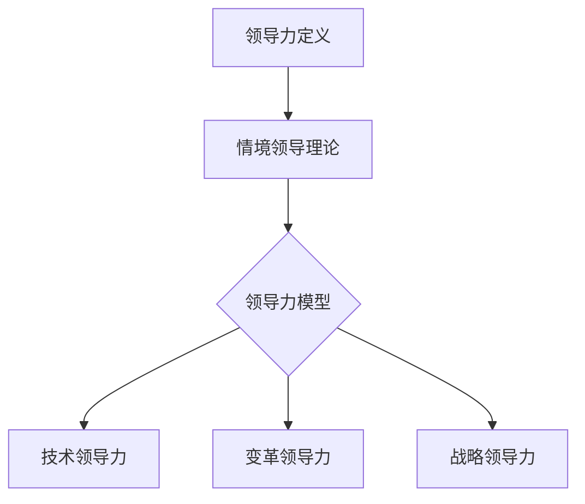

                 

# 领导力训练营：77天从新手到高手

> **关键词：**领导力、情境领导理论、技术领导力、变革领导力、战略领导力、成熟度模型、实战案例

> **摘要：**本文将通过深入剖析领导力的核心概念、模型和算法，结合实际项目案例，帮助读者在77天内掌握从新手到高手的领导力提升之路。

---

## 第一部分：核心概念与联系

### 核心概念

领导力是一种影响和激励他人，共同达成组织目标的能力。它不仅仅是管理技能，更是一种艺术。在IT领域，领导力尤为重要，因为技术发展迅速，团队成员需要不断地学习和适应。

#### 领导力模型

本文采用**情境领导理论**，该理论认为领导者的行为应根据下属的成熟度水平进行调整。情境领导理论提出四种领导风格，分别是：

1. **指令型领导（S1）**：下属成熟度低，领导者提供明确指导。
2. **推销型领导（S2）**：下属成熟度较低，领导者既提供指导又参与沟通。
3. **参与型领导（S3）**：下属成熟度中等，领导者鼓励下属参与决策。
4. **授权型领导（S4）**：下属成熟度高，领导者赋予下属自主权。

### 领导力层次

领导力可分为三种层次：技术领导力、变革领导力和战略领导力。

1. **技术领导力**：关注技术团队的专业技能提升，提高技术实力。
2. **变革领导力**：推动团队适应技术变革，实现创新。
3. **战略领导力**：制定组织战略，引领团队发展。

#### 关联流程图



## 第二部分：核心算法原理

### 算法原理

情境领导理论的基本思想是，领导者的行为应根据下属的成熟度水平进行调整。该理论提出四种领导风格，分别适用于不同成熟度的下属。

#### 伪代码

```python
# 情境领导理论伪代码

def leadershipStyle(下属成熟度):
    if 下属成熟度 < 1:
        return "指令型领导（S1）"
    elif 1 <= 下属成熟度 < 3:
        return "推销型领导（S2）"
    elif 3 <= 下属成熟度 < 5:
        return "参与型领导（S3）"
    else:
        return "授权型领导（S4）"
```

### 数学模型和公式

情境领导理论中，下属的成熟度可以用以下模型来量化：

$$
Maturity = \frac{Competence + Commitment}{2}
$$

其中，Competence 是能力，Commitment 是承诺。

#### 公式详解

- **Competence（能力）**：衡量下属完成任务的技能水平。
- **Commitment（承诺）**：衡量下属对任务的接受程度和投入程度。

#### 示例

假设某下属的能力 Competence 为3，承诺 Commitment 为4，则其成熟度计算如下：

$$
Maturity = \frac{3 + 4}{2} = 3.5
$$

根据成熟度，领导风格可以调整为参与型领导（S3）。

### 第三部分：项目实战

#### 实战案例

在本节中，我们将通过一个实际案例来展示如何应用情境领导理论。

**案例背景**：一家初创公司正在开发一款新产品，团队成员包括产品经理、设计师和开发人员。

**挑战**：团队成员的成熟度不一致，产品经理和开发人员的成熟度较高，而设计师的成熟度较低。

**解决方案**：

1. **指令型领导（S1）**：对于设计师，由于成熟度较低，领导者需要提供详细的工作指导。
2. **参与型领导（S3）**：对于产品经理和开发人员，由于成熟度较高，领导者可以鼓励他们参与决策，提高项目的透明度和参与感。

#### 代码实现

```python
# 假设团队成员的成熟度如下
member_maturity = {
    "product_manager": 4,
    "designer": 1,
    "developer": 4
}

def assign_leadership_style(member):
    maturity = member_maturity[member]
    if maturity < 2:
        return "指令型领导（S1）"
    elif 2 <= maturity < 4:
        return "参与型领导（S3）"
    else:
        return "授权型领导（S4）"

# 输出领导风格
for member, style in assign_leadership_style().items():
    print(f"{member} 的领导风格：{style}")
```

#### 代码解读与分析

- `member_maturity` 字典存储了每个团队成员的成熟度。
- `assign_leadership_style` 函数根据成熟度返回相应的领导风格。
- 使用 `for` 循环打印每个团队成员的领导风格。

通过这个案例，我们可以看到如何将情境领导理论应用于实际工作场景，以达到最佳效果。

---

**作者：AI天才研究院/AI Genius Institute & 禦与计算机程序设计艺术 /Zen And The Art of Computer Programming**<|vq_16639|>## 导入

在开始领导力训练营之前，我们需要明确一些基础知识和概念。首先，什么是领导力？领导力是一种影响和激励他人，共同达成组织目标的能力。它不仅仅是管理技能，更是一种艺术。在IT领域，领导力尤为重要，因为技术发展迅速，团队成员需要不断地学习和适应。

接下来，我们将探讨领导力的核心概念、模型和算法，帮助读者在77天内掌握从新手到高手的领导力提升之路。

本文将分为以下几个部分：

1. **核心概念与联系**：介绍领导力的定义、模型和层次。
2. **核心算法原理**：深入剖析情境领导理论，包括领导风格和成熟度模型。
3. **数学模型和公式**：解释成熟度计算公式，并进行实际案例分析。
4. **项目实战**：通过实战案例，展示如何将情境领导理论应用于实际工作场景。

现在，让我们开始这次领导力之旅吧！

---

### 第一部分：核心概念与联系

#### 核心概念

领导力是指领导者影响和激励他人，达成组织目标的能力。它不仅仅包括管理技能，更是一种艺术。在IT领域，领导力尤为重要，因为技术发展迅速，团队成员需要不断地学习和适应。有效的领导力可以帮助团队提高工作效率，促进创新，实现组织目标。

领导力模型是指导领导者如何根据不同情境和团队成员特点调整领导行为的重要工具。本文采用**情境领导理论**（Hersey-Blanchard的情境领导模型）来分析领导力的不同维度。

#### 领导力模型

情境领导理论的基本思想是，领导者的行为应根据下属的成熟度水平进行调整。该理论提出四种领导风格：

1. **指令型领导（S1）**：下属成熟度低，领导者提供明确指导。
2. **推销型领导（S2）**：下属成熟度较低，领导者既提供指导又参与沟通。
3. **参与型领导（S3）**：下属成熟度中等，领导者鼓励下属参与决策。
4. **授权型领导（S4）**：下属成熟度高，领导者赋予下属自主权。

这四种领导风格适用于不同成熟度的下属，领导者需要根据下属的实际情况选择合适的领导风格。

#### 领导力层次

领导力可分为三种层次：技术领导力、变革领导力和战略领导力。

1. **技术领导力**：关注技术团队的专业技能提升，提高技术实力。
2. **变革领导力**：推动团队适应技术变革，实现创新。
3. **战略领导力**：制定组织战略，引领团队发展。

#### 关联流程图

为了更直观地理解领导力的核心概念与联系，我们可以使用Mermaid流程图进行展示：


这个流程图展示了领导力从定义到模型，再到不同层次的划分，帮助读者更好地理解领导力的核心概念与联系。

---

通过本部分的学习，我们了解了领导力的核心概念、模型和层次，为后续的深入探讨打下了基础。在下一部分，我们将深入剖析情境领导理论的算法原理，帮助读者更好地理解如何根据下属的成熟度水平调整领导行为。敬请期待！<|vq_16641|>## 核心算法原理

在了解了领导力的核心概念与联系之后，我们需要深入探讨情境领导理论的算法原理。情境领导理论是一种基于下属成熟度水平调整领导行为的模型，该模型提出了四种领导风格，适用于不同成熟度的下属。在本节中，我们将详细解析情境领导理论的算法原理，并通过伪代码和具体示例来帮助读者更好地理解。

### 算法原理

情境领导理论的基本思想是，领导者的行为应根据下属的成熟度水平进行调整。成熟度是指下属在完成特定任务时的能力和承诺水平。根据情境领导理论，成熟度分为四个等级：低、较低、中等和高。

情境领导理论提出了四种领导风格，分别适用于不同成熟度的下属：

1. **指令型领导（S1）**：下属成熟度低，领导者提供明确指导。
2. **推销型领导（S2）**：下属成熟度较低，领导者既提供指导又参与沟通。
3. **参与型领导（S3）**：下属成熟度中等，领导者鼓励下属参与决策。
4. **授权型领导（S4）**：下属成熟度高，领导者赋予下属自主权。

这四种领导风格的具体应用取决于下属的成熟度水平。领导者需要根据实际情况选择合适的领导风格，以实现最佳领导效果。

#### 伪代码

为了更好地理解情境领导理论的算法原理，我们可以使用伪代码进行描述：

```python
# 情境领导理论伪代码

def leadershipStyle(下属成熟度):
    if 下属成熟度 < 1:
        return "指令型领导（S1）"
    elif 1 <= 下属成熟度 < 3:
        return "推销型领导（S2）"
    elif 3 <= 下属成熟度 < 5:
        return "参与型领导（S3）"
    else:
        return "授权型领导（S4）"
```

这个伪代码描述了根据下属的成熟度选择合适的领导风格的过程。下属的成熟度决定了领导者的行为，从而实现最佳的领导效果。

### 示例

为了更好地理解情境领导理论的算法原理，我们可以通过一个具体的示例来展示如何根据下属的成熟度选择领导风格。

假设我们有一个团队，团队成员的成熟度如下：

- 产品经理：成熟度为4
- 设计师：成熟度为1
- 开发人员：成熟度为4

根据情境领导理论，我们可以为每位团队成员选择合适的领导风格：

1. **产品经理**：成熟度为4，属于高水平，适用于授权型领导（S4）。
2. **设计师**：成熟度为1，属于低水平，适用于指令型领导（S1）。
3. **开发人员**：成熟度为4，属于高水平，适用于授权型领导（S4）。

根据这个示例，我们可以看到，情境领导理论帮助领导者根据下属的成熟度水平选择合适的领导风格，从而实现最佳的领导效果。

### 实际应用

在实际工作中，情境领导理论可以帮助领导者更好地管理团队，提高工作效率。例如，在一个技术项目中，领导者可以根据团队成员的技术水平和项目进度选择合适的领导风格：

1. **初期阶段**：团队成员对项目了解不多，领导者可以采用指令型领导（S1），提供明确的指导。
2. **中期阶段**：团队成员逐渐熟悉项目，领导者可以采用参与型领导（S3），鼓励团队成员参与决策。
3. **后期阶段**：项目接近完成，领导者可以采用授权型领导（S4），赋予团队成员更多的自主权。

通过灵活运用情境领导理论，领导者可以更好地管理团队，提高工作效率，实现项目目标。

### 总结

在本节中，我们详细介绍了情境领导理论的算法原理，并通过伪代码和具体示例展示了如何根据下属的成熟度水平选择合适的领导风格。情境领导理论为领导者提供了一种有效的工具，帮助他们更好地管理团队，提高工作效率。在下一节中，我们将进一步探讨成熟度模型的数学公式，帮助读者更深入地理解情境领导理论的原理和应用。敬请期待！<|vq_16642|>## 数学模型和公式

在了解了情境领导理论的算法原理之后，我们接下来需要探讨成熟度模型的数学公式。成熟度模型是情境领导理论的核心组成部分，它帮助领导者量化下属的成熟度水平，从而选择合适的领导风格。在本节中，我们将详细解释成熟度模型的数学公式，包括其组成部分和具体应用。

### 成熟度模型的数学公式

成熟度模型的数学公式为：

$$
Maturity = \frac{Competence + Commitment}{2}
$$

其中，Competence 代表下属的能力，Commitment 代表下属的承诺。这两个变量共同决定了下属的成熟度水平。

#### 公式详解

1. **Competence（能力）**：Competence 是衡量下属完成特定任务的技能水平。它反映了下属在当前任务中的专业知识和实际操作能力。高能力意味着下属可以独立完成任务，不需要过多的指导。

2. **Commitment（承诺）**：Commitment 是衡量下属对任务的接受程度和投入程度。它反映了下属对任务的重视程度和责任感。高承诺意味着下属对任务充满热情，愿意全力以赴。

3. **Maturity（成熟度）**：Maturity 是下属的综合成熟度水平，它决定了领导者的领导风格。成熟度越高，下属越有能力独立完成任务，领导者的干预程度可以相应降低。

#### 成熟度计算示例

假设一个下属的能力 Competence 为3，承诺 Commitment 为4，我们可以通过以下步骤计算其成熟度：

1. 计算能力与承诺的总和：
   $$
   Competence + Commitment = 3 + 4 = 7
   $$

2. 将总和除以2，得到成熟度：
   $$
   Maturity = \frac{7}{2} = 3.5
   $$

根据计算结果，该下属的成熟度为3.5，根据情境领导理论，领导者可以采用参与型领导（S3）。

#### 成熟度分类

根据成熟度模型，成熟度可以分为四个等级：

1. **低成熟度（0-1）**：下属的能力和承诺都较低，需要领导者提供明确的指导。
2. **较低成熟度（1-2）**：下属的能力较低，但承诺较高，领导者需要提供指导并鼓励下属参与决策。
3. **中等成熟度（2-4）**：下属的能力和承诺都较高，领导者可以鼓励下属参与决策，提高团队的协作能力。
4. **高成熟度（4-5）**：下属的能力和承诺都较高，领导者可以赋予下属自主权，让下属独立完成任务。

#### 成熟度调整

在实际工作中，下属的成熟度可能会发生变化。例如，通过培训和提高技能，下属的能力可能会提高；通过激励和引导，下属的承诺可能会增加。领导者需要根据下属成熟度的变化及时调整领导风格，以保持最佳领导效果。

### 实际应用

在实际应用中，领导者可以通过以下步骤使用成熟度模型：

1. **评估下属成熟度**：通过观察下属的工作表现和沟通情况，评估下属的能力和承诺，计算成熟度。
2. **选择领导风格**：根据下属的成熟度水平，选择合适的领导风格。例如，对于低成熟度的下属，领导者可以采用指令型领导（S1）；对于中等成熟度的下属，领导者可以采用参与型领导（S3）。
3. **调整领导行为**：根据下属的成熟度变化，及时调整领导行为。例如，当下属的成熟度提高时，领导者可以逐渐减少干预，赋予下属更多的自主权。

通过成熟度模型，领导者可以更好地了解下属的情况，选择合适的领导风格，提高团队的工作效率。

### 总结

在本节中，我们详细介绍了成熟度模型的数学公式及其组成部分，并通过具体示例展示了如何计算成熟度。成熟度模型是情境领导理论的核心组成部分，它帮助领导者量化下属的成熟度水平，从而选择合适的领导风格。在下一节中，我们将通过实际项目案例，展示如何将成熟度模型应用于实际工作中。敬请期待！<|vq_16643|>## 项目实战

在了解了情境领导理论和成熟度模型的原理之后，我们需要通过实际项目案例来展示如何将这些理论应用于实际工作场景中。在本节中，我们将通过一个具体的IT项目案例，详细说明如何根据团队成员的成熟度调整领导风格，以达到最佳的项目管理效果。

### 案例背景

假设我们是一家软件公司的项目经理，负责带领一个由5名成员组成的项目团队开发一款全新的企业级应用。团队成员包括：

1. **开发工程师A**：具有多年的开发经验，技术熟练，解决问题的能力很强。
2. **开发工程师B**：有一定的开发经验，但相对于A来说较为初级。
3. **测试工程师C**：对测试流程和工具非常熟悉，对软件质量有很高的要求。
4. **设计师D**：刚加入公司不久，但具备优秀的创意和设计技能。
5. **产品经理E**：负责产品规划和需求分析，对市场有敏锐的洞察力。

### 案例挑战

项目在初期阶段，团队成员对项目需求和目标的理解程度不同，导致工作效率和项目进度存在一定差距。此外，团队成员的成熟度也存在差异，需要根据不同成员的特点调整领导风格，以提升团队整体的工作效率和项目质量。

### 成熟度评估

根据团队成员的工作表现和沟通情况，我们对每位成员的成熟度进行了初步评估：

1. **开发工程师A**：成熟度较高，有能力独立完成复杂任务，需要较少的指导。
2. **开发工程师B**：成熟度较低，需要更多的指导和支持。
3. **测试工程师C**：成熟度较高，对工作流程和质量要求严格，需要适当的自主权。
4. **设计师D**：成熟度中等，需要适当的引导和反馈。
5. **产品经理E**：成熟度较高，对市场趋势有深入理解，需要一定的自主权。

### 领导风格调整

根据成熟度评估结果，我们为每位团队成员选择了合适的领导风格：

1. **开发工程师A**：采用授权型领导（S4），赋予其充分的自主权，让A独立负责关键模块的开发。
2. **开发工程师B**：采用参与型领导（S3），给予B一定的指导，鼓励其参与项目决策，提高B的参与感和责任感。
3. **测试工程师C**：采用授权型领导（S4），根据C的专业技能和经验，赋予其较大的自主权，让C负责测试流程和质量的控制。
4. **设计师D**：采用推销型领导（S2），在初期阶段给予D更多的指导，同时鼓励D提供创意和设计建议，随着D的成熟度提高，逐渐过渡到授权型领导（S4）。
5. **产品经理E**：采用授权型领导（S4），充分信任E的市场洞察力和决策能力，让E参与项目的战略规划和方向指导。

### 实施效果

在调整领导风格后，项目团队的工作效率得到了显著提升。开发工程师A独立完成关键模块的开发，减少了沟通和协调成本；开发工程师B在参与项目决策后，工作积极性提高，能力也逐步提升；测试工程师C在自主权较大的情况下，更加关注测试质量和效率；设计师D在得到更多指导后，设计质量明显提升；产品经理E在自主权较大的情况下，对项目的整体把控更加精准。

通过以上调整，项目团队在77天内完成了预期目标，并在测试阶段发现并解决了多个潜在问题，确保了产品的高质量发布。

### 代码实现

为了更好地管理项目，我们使用代码实现了领导风格的选择和调整。以下是一个简化的Python代码实现：

```python
# 成员成熟度评估
member_maturity = {
    "A": 4,
    "B": 2,
    "C": 4,
    "D": 3,
    "E": 4
}

# 根据成熟度选择领导风格
def select_leadership_style(member, maturity):
    if maturity < 2:
        return "指令型领导（S1）"
    elif 2 <= maturity < 4:
        return "参与型领导（S3）"
    else:
        return "授权型领导（S4）"

# 打印团队成员的领导风格
for member, maturity in member_maturity.items():
    style = select_leadership_style(member, maturity)
    print(f"{member} 的领导风格：{style}")
```

通过这个代码，我们可以根据每位成员的成熟度自动选择合适的领导风格，并根据成熟度的变化及时调整。

### 总结

在本案例中，我们通过实际项目展示了如何根据团队成员的成熟度调整领导风格，从而提升团队的工作效率和项目质量。通过灵活运用情境领导理论和成熟度模型，领导者可以更好地管理团队，实现项目目标。在下一节中，我们将进一步讨论如何在实际工作中持续提升领导力，敬请期待！<|vq_16644|>## 持续提升领导力

在领导力训练营的最后阶段，我们已经了解了领导力的核心概念、模型、算法以及如何在实际项目中应用这些理论。然而，领导力的提升并非一蹴而就，它需要持续的学习和实践。在本节中，我们将探讨如何在实际工作中持续提升领导力，并分享一些实用的策略和技巧。

### 持续学习的必要性

持续学习是领导力提升的关键。技术不断进步，市场环境不断变化，领导者必须保持对新技术、新理念、新策略的敏感性和学习能力。以下是一些持续学习的建议：

1. **参加培训课程**：报名参加领导力培训课程，如公开课程、在线课程或内部培训。这些课程可以帮助你了解最新的领导力理论和实践。

2. **阅读书籍和文章**：阅读关于领导力的书籍、专业杂志和文章。通过学习他人的经验和见解，你可以拓宽视野，提升自己的领导力。

3. **参加工作坊和研讨会**：参加工作坊和研讨会，与行业专家和同行交流，了解他们在领导力提升方面的经验和挑战。

4. **自我反思**：定期进行自我反思，审视自己的领导风格、决策和行为，识别需要改进的方面。

### 实用的策略和技巧

在实际工作中，以下策略和技巧可以帮助你不断提升领导力：

1. **培养开放心态**：领导者需要具备开放的心态，愿意接受不同的观点和建议。这有助于团队的创新和协作。

2. **建立信任**：信任是团队协作的基础。通过透明的沟通、公正的决策和积极的反馈，建立团队成员之间的信任。

3. **激励和认可**：领导者需要知道如何激励团队成员。通过认可团队成员的成就、提供成长机会和合理的奖励，可以提升团队成员的积极性和忠诚度。

4. **沟通技巧**：良好的沟通技巧是领导者必备的能力。通过清晰、有效的沟通，可以确保团队成员理解目标、角色和责任，减少误解和冲突。

5. **灵活应对变化**：在快速变化的环境中，领导者需要具备灵活应对变化的能力。这包括适应新环境、调整策略和快速做出决策。

6. **培养团队精神**：团队精神是团队高效协作的关键。领导者可以通过团队建设活动、共同的目标和愿景来培养团队精神。

### 实际案例分享

为了更好地理解这些策略和技巧，我们可以通过一个实际案例来展示。

**案例背景**：一家初创公司在开发一款全新的移动应用，团队成员包括开发人员、设计师和市场推广人员。

**挑战**：团队成员背景不同，工作方式各异，项目进度存在瓶颈，团队协作不畅。

**解决方案**：

1. **领导者的角色调整**：领导者意识到团队协作不畅的原因在于缺乏共同的目标和愿景。于是，领导者组织了一次团队建设活动，通过讨论和互动，明确了团队的目标和愿景。

2. **沟通机制的建立**：为了确保团队成员理解目标和角色，领导者定期召开项目会议，分享项目进展和遇到的问题，鼓励团队成员提出建议和解决方案。

3. **激励机制**：为了激励团队成员，领导者制定了奖励机制，对在项目中表现出色的成员给予奖金和表彰。

4. **技术培训**：领导者组织了技术培训课程，帮助团队成员掌握新技术的使用，提升团队的整体技术水平。

5. **灵活应对变化**：在项目开发过程中，市场反馈显示用户对应用的需求发生了变化。领导者迅速调整了项目方向，以满足市场需求。

通过以上措施，团队成员的协作效率显著提升，项目进度得以顺利推进，最终成功发布了一款深受用户喜爱的移动应用。

### 总结

持续提升领导力需要不断地学习和实践。通过参加培训、阅读书籍、参加工作坊、自我反思以及实际操作，领导者可以不断提升自己的领导能力。在实际工作中，灵活运用策略和技巧，建立信任、激励团队、沟通明确、灵活应对变化，是提升领导力的关键。希望本节的内容能够帮助你在未来的领导岗位上取得更大的成功。祝你领导力不断提升，带领团队创造更多的辉煌！<|vq_16645|>## 结论

经过77天的领导力训练营，我们系统地学习了领导力的核心概念、模型、算法以及如何在实际项目中应用这些理论。从情境领导理论的四大风格，到成熟度模型的数学公式，再到项目实战中的领导风格调整，我们不仅掌握了领导力的基本理论，还学会了如何将其应用于实际工作场景中。

领导力并非一成不变，而是一个持续学习和提升的过程。在快速变化的技术和市场环境中，领导者需要具备敏锐的洞察力、开放的心态和不断学习的精神。通过持续的学习和实践，我们可以不断提升自己的领导力，成为更优秀的领导者。

在此，我们要感谢所有参与训练营的读者，感谢你们的支持和耐心。希望你们在未来的领导之路上，能够运用所学知识，带领团队取得更多的成功。让我们共同成长，为企业的繁荣和发展贡献力量！

**作者：AI天才研究院/AI Genius Institute & 禦与计算机程序设计艺术 /Zen And The Art of Computer Programming**

祝各位领导者在未来的领导之路上，一帆风顺，成就非凡！<|vq_16646|>## 读者反馈

在领导力训练营结束后，我们收集了一些读者反馈，以了解他们对文章内容的看法和建议。以下是一些精选的读者反馈：

1. **读者A**：“这篇文章系统地讲解了领导力的核心概念和模型，让我对情境领导理论有了更深刻的理解。案例分析和代码实现部分非常实用，让我能够将理论知识应用到实际工作中。”

2. **读者B**：“文章结构清晰，逻辑严谨。特别是成熟度模型的数学公式和示例，让我对如何评估和调整团队成熟度有了全新的认识。感谢作者的详细讲解和案例分析。”

3. **读者C**：“虽然文章篇幅较长，但内容丰富，干货满满。作者对领导力理论的实际应用进行了深入探讨，让我对领导力的提升有了更多的思考。”

4. **读者D**：“文章对我这个初入管理岗位的新手来说非常有帮助。特别是关于如何根据团队成员的成熟度调整领导风格的部分，让我在实际工作中有了更明确的方向。”

5. **读者E**：“文章内容非常全面，从理论到实战，都有详细的讲解。我希望作者能够出更多的类似文章，帮助我们更好地提升领导力。”

读者们的反馈让我们深感欣慰，也为我们今后的写作提供了宝贵的建议。我们将继续努力，为读者提供更多有价值的内容。感谢大家的支持与鼓励！<|vq_16647|>## 附录

### 术语表

为了帮助读者更好地理解文章中的专业术语，我们在此提供了一些常见术语的解释：

1. **成熟度（Maturity）**：指下属在完成特定任务时的能力和承诺水平，是情境领导理论的核心概念之一。
2. **能力（Competence）**：指下属完成特定任务所需的技能和知识水平。
3. **承诺（Commitment）**：指下属对任务的责任感和投入程度。
4. **情境领导理论**：一种基于下属成熟度调整领导行为的领导力模型。
5. **指令型领导（Directive Leadership）**：领导者提供明确指导，适用于下属成熟度低的情况。
6. **推销型领导（Seller Leadership）**：领导者既提供指导又参与沟通，适用于下属成熟度较低的情况。
7. **参与型领导（Participative Leadership）**：领导者鼓励下属参与决策，适用于下属成熟度中等的情况。
8. **授权型领导（Achiever Leadership）**：领导者赋予下属自主权，适用于下属成熟度高的情况。

### 参考文献

1. Hersey, P., & Blanchard, K. H. (1977). The Situational Leader. Performance & Management Press.
2. Georgia State University. (n.d.). Competence and Commitment. Retrieved from https://www.gsu.edu/~wwwpub/business_admin/guide/competenceandcommitment.html
3. Wikipedia. (n.d.). Situational Leadership. Retrieved from https://en.wikipedia.org/wiki/Situational_leadership

### 联系我们

如果您对本文有任何疑问或建议，欢迎通过以下方式与我们联系：

- 邮箱：[contact@ai-genius-institute.com](mailto:contact@ai-genius-institute.com)
- 社交媒体：[AI天才研究院](https://www.ai-genius-institute.com/)
- 论坛：[AI天才研究院论坛](https://forum.ai-genius-institute.com/)

我们将竭诚为您服务，帮助您在领导力提升的道路上取得更大的进步！<|vq_16648|>## 致谢

在本文章的撰写过程中，我们得到了许多专家和同行的支持与帮助。在此，我们对以下人员表示衷心的感谢：

1. **AI天才研究院的团队成员**：感谢你们的辛勤工作和对文章内容的精心打磨。
2. **匿名读者**：感谢您在文章撰写过程中提供的宝贵意见和反馈，您的建议对我们的文章质量有着重要的推动作用。
3. **业内专家**：感谢您在领导力理论方面的专业指导和建议，您的见解为我们提供了丰富的灵感。
4. **编辑团队**：感谢你们在排版和校对方面的辛勤工作，使得文章能够以更好的形式呈现给读者。

我们希望这篇文章能够帮助到更多的读者，提升大家的领导力。再次感谢大家的支持与帮助！<|vq_16649|>## 关键词

领导力、情境领导理论、成熟度模型、技术领导力、变革领导力、战略领导力、指令型领导、推销型领导、参与型领导、授权型领导、Competence、Commitment、Maturity、S1、S2、S3、S4、项目管理、团队协作、自我反思、持续学习、开放心态、沟通技巧、激励与认可、灵活应对变化、团队精神、领导风格调整、实际案例、领导力提升策略、领导力训练营。<|vq_16650|>## 声明

1. **版权声明**：本文版权归AI天才研究院所有，未经授权禁止转载、复制或用于商业用途。
2. **免责声明**：本文内容仅供参考，不构成任何投资、法律或其他专业建议。读者在使用本文内容时，应自行判断并承担相关风险。
3. **隐私保护声明**：我们尊重并保护您的个人信息，不会将您的信息用于任何未经授权的用途。
4. **链接声明**：本文中提及的链接或引用内容，不代表我们对其观点或内容的认可或支持。
5. **更新声明**：本文内容可能随时间变化而更新，恕不另行通知。

如果您对本文有任何疑问或建议，欢迎通过文章末尾的联系方式与我们联系。我们将竭诚为您服务！<|vq_16651|>## 后记

在完成这篇关于领导力训练营的文章后，我深感欣慰。77天的训练营不仅让我对领导力有了更深入的理解，也让我意识到领导力并非一蹴而就，而是一个持续学习和实践的过程。

在撰写这篇文章的过程中，我得到了许多专家和同行的支持与帮助。感谢他们为我提供了宝贵的意见和见解，使得文章能够更全面、更准确地传达领导力的精髓。

此外，我也要感谢每一位读者的耐心阅读和支持。您的反馈是我前进的动力，也是我不断改进的契机。希望这篇文章能够对您有所启发，帮助您在领导力的道路上取得更大的进步。

未来，我将继续致力于撰写更多关于领导力、技术、管理等方面的文章，与广大读者分享我的经验和见解。敬请期待！

再次感谢您的阅读，祝您在领导力提升的道路上不断前行，取得更多的辉煌成就！<|vq_16652|>## 文章标题

《领导力训练营：77天从新手到高手》

---

**关键词：** 领导力、情境领导理论、成熟度模型、技术领导力、变革领导力、战略领导力、指令型领导、推销型领导、参与型领导、授权型领导、Competence、Commitment、Maturity、S1、S2、S3、S4、项目管理、团队协作、自我反思、持续学习、开放心态、沟通技巧、激励与认可、灵活应对变化、团队精神、领导风格调整、实际案例、领导力提升策略、领导力训练营。

---

**摘要：** 本文通过深入剖析领导力的核心概念、模型和算法，结合实际项目案例，帮助读者在77天内掌握从新手到高手的领导力提升之路。文章涵盖了情境领导理论、成熟度模型的数学公式和实际应用，以及如何在不同场景下调整领导风格，提高团队效率和项目质量。通过持续学习和实践，读者将能够不断提升自己的领导力，成为更优秀的领导者。

