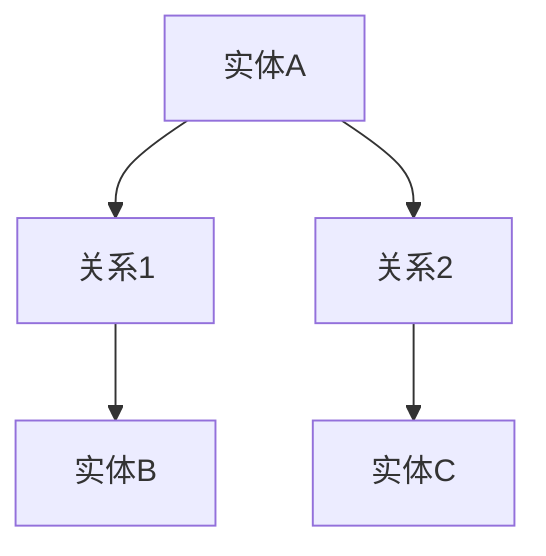

                 

### 《AI Agent: AI的下一个风口 从智能体到具身智能》

关键词：AI智能体、具身智能、强化学习、自然语言处理、对话系统

摘要：本文深入探讨了人工智能（AI）领域中的一个新兴趋势——智能体（AI Agent）及其发展至具身智能的潜力。文章首先介绍了AI Agent的概念、分类、发展历程和未来趋势，随后详细解析了智能体的核心技术，包括基本原理、架构设计和学习算法。接着，文章展示了智能体在自然语言处理、对话系统和知识图谱中的应用，以及如何从智能体过渡到具身智能。最后，文章讨论了具身智能的发展趋势、挑战与机遇，并提供了AI Agent开发的实战案例和工具资源推荐。通过本文的阅读，读者将对AI Agent及其未来前景有一个全面而深入的理解。

---

### 第一部分：引言与概述

#### 第1章：AI Agent的概念与背景

##### 1.1 AI Agent的定义与分类

AI Agent，即人工智能代理，是能够感知环境、自主决策并采取行动的智能系统。在人工智能领域，AI Agent扮演着至关重要的角色，它们不仅具备自主学习和适应环境的能力，还可以执行复杂的任务。

AI Agent可以按照不同的标准进行分类，以下是几种常见的分类方法：

1. **基于任务类型**：  
   - **通用智能代理**：旨在解决多种类型的任务，如语音助手、智能机器人等。
   - **特定任务代理**：专注于解决特定类型的任务，如智能客服机器人、医疗诊断助手等。

2. **基于技术层次**：  
   - **规则基础代理**：基于预定义的规则进行决策。
   - **数据驱动代理**：通过数据分析和机器学习算法进行决策。
   - **混合代理**：结合规则和数据驱动方法进行决策。

3. **基于功能特点**：  
   - **感知代理**：专注于感知环境信息。
   - **决策代理**：专注于做出合理的决策。
   - **执行代理**：专注于执行具体的任务动作。

##### 1.2 AI Agent的发展历程

AI Agent的发展历程可以追溯到20世纪50年代，当时人工智能（AI）的概念刚刚诞生。以下是几个关键的发展阶段：

1. **早期智能代理（1950-1970）**：  
   - **逻辑推理代理**：基于逻辑和符号系统进行决策。
   - **知识库代理**：利用知识库进行信息检索和推理。

2. **专家系统代理（1970-1980）**：  
   - **基于规则的专家系统**：使用预定义的规则进行决策。

3. **基于数据的代理（1980-2000）**：  
   - **数据挖掘代理**：利用统计学和数据挖掘技术进行决策。
   - **机器学习代理**：引入了机器学习算法，如决策树、支持向量机等。

4. **现代智能代理（2000至今）**：  
   - **强化学习代理**：通过与环境交互学习最优策略。
   - **深度学习代理**：利用神经网络进行复杂任务的处理。
   - **多模态代理**：结合多种感知模态进行决策。

##### 1.3 AI Agent在人工智能中的角色与地位

AI Agent在人工智能（AI）领域扮演着核心角色，它们不仅是实现AI目标的关键组成部分，也是推动AI技术发展的重要动力。以下是AI Agent在AI中的几个关键作用：

1. **任务自动化与优化**：  
   AI Agent可以自动化执行复杂的任务，提高效率和准确性，减少人力成本。

2. **环境适应与学习**：  
   AI Agent能够通过感知和决策学习环境中的规律，不断优化自身行为。

3. **人机交互**：  
   AI Agent为人机交互提供了新的途径，使得人与机器之间的互动更加自然和高效。

4. **决策支持**：  
   AI Agent可以为人类提供决策支持，特别是在复杂和不确定的环境中。

##### 1.4 AI Agent的未来趋势

随着技术的不断进步，AI Agent的未来发展趋势主要体现在以下几个方面：

1. **强化学习与深度学习的融合**：  
   强化学习和深度学习的融合将进一步提升AI Agent的决策能力和环境适应能力。

2. **多模态感知与执行**：  
   AI Agent将结合多种感知模态（如视觉、听觉、触觉）进行决策和执行，提高任务的复杂度和适应性。

3. **跨领域应用**：  
   AI Agent将在更多领域得到应用，如医疗、金融、教育等，为各行各业带来深刻的变革。

4. **具身智能的发展**：  
   AI Agent将逐渐向具身智能过渡，具备更加复杂的感知和执行能力，实现更高层次的自主性和智能化。

#### 1.5 AI Agent的潜在应用领域

AI Agent在未来的应用领域将非常广泛，以下是几个重要的潜在应用方向：

1. **智能机器人**：  
   AI Agent将广泛应用于智能机器人，如服务机器人、工业机器人、医疗机器人等。

2. **自动驾驶汽车**：  
   AI Agent将在自动驾驶汽车中发挥核心作用，提供实时决策和执行能力。

3. **智能家居**：  
   AI Agent将赋能智能家居设备，实现更智能、更便捷的生活体验。

4. **虚拟助手**：  
   AI Agent将在虚拟助手领域（如语音助手、智能客服）中扮演重要角色，提供高效、个性化的服务。

5. **智能医疗**：  
   AI Agent将在医疗领域（如疾病诊断、治疗方案推荐）中发挥重要作用，提高医疗水平和效率。

6. **金融与安全**：  
   AI Agent将在金融和安全领域（如风险评估、网络安全）中提供智能化的决策支持。

##### 1.6 AI Agent面临的技术挑战与机遇

尽管AI Agent有着广阔的应用前景，但其在发展过程中也面临着一系列技术挑战和机遇：

1. **数据隐私与安全**：  
   AI Agent在处理大量数据时，如何确保数据的安全和隐私是一个重要挑战。

2. **泛化能力**：  
   AI Agent需要具备更好的泛化能力，以适应不同的环境和任务。

3. **决策透明性与可解释性**：  
   AI Agent的决策过程需要具备透明性和可解释性，以便用户理解和信任。

4. **计算资源与能耗**：  
   AI Agent需要高效的计算资源和能耗管理，以满足实时性和移动性的需求。

5. **伦理与社会影响**：  
   AI Agent的发展需要考虑其对社会和伦理的影响，确保其发展符合人类价值观。

总之，AI Agent作为人工智能领域的一个重要分支，具有巨大的发展潜力和应用价值。通过不断的技术创新和应用探索，AI Agent将为人类带来更加智能、便捷和高效的生活体验。在接下来的章节中，我们将深入探讨AI Agent的核心技术、实际应用以及未来趋势。希望您在阅读本文后，能够对AI Agent及其未来发展有一个全面而深入的理解。

---

### 第二部分：AI Agent的核心技术

#### 第2章：智能体基础理论

##### 2.1 智能体的基本原理

智能体（AI Agent）是人工智能（AI）中的一个核心概念，代表了能够自主感知环境、做出决策并采取行动的实体。智能体不仅能够处理静态信息，还能通过学习和适应不断变化的环境来实现其目标。

###### 2.1.1 智能体的定义与特征

智能体的定义可以概括为：一个能够在特定环境中自主行动、适应和学习的系统。智能体的基本特征包括：

1. **自主性**：智能体能够自主地做出决策和采取行动，而不需要人类的直接干预。
2. **适应性**：智能体能够通过与环境交互学习，不断调整其行为以适应不同的环境和任务。
3. **感知能力**：智能体能够感知环境信息，获取关于其当前状态的数据。
4. **决策能力**：智能体能够根据感知到的信息，使用某种算法或策略做出决策。
5. **行动能力**：智能体能够根据决策采取相应的行动。

###### 2.1.2 智能体与智能系统

智能体是智能系统的核心组成部分，智能系统是指由多个智能体组成的协同工作系统。智能系统的特点包括：

1. **协同工作**：智能系统中的多个智能体能够相互协作，共同完成任务。
2. **分布式决策**：智能系统中的每个智能体都能够独立地做出决策，同时考虑全局目标。
3. **动态适应**：智能系统能够动态地调整智能体的行为，以应对环境变化和任务需求。

智能体与智能系统之间的关系可以概括为：智能体是智能系统的基本单元，智能系统是多个智能体的协同结果。智能体通过感知、决策和行动来执行任务，而智能系统则通过多个智能体的合作来实现复杂的任务。

##### 2.2 智能体架构设计

智能体的架构设计决定了其功能和行为，一个良好的架构能够使得智能体具备高效、可扩展和鲁棒的特点。智能体的典型架构包括以下几个关键组成部分：

###### 2.2.1 感知系统

感知系统是智能体获取环境信息的重要渠道，它通常包括以下几个模块：

1. **传感器**：用于获取环境中的物理信号，如摄像头、麦克风、温度传感器等。
2. **数据处理**：对传感器获取的信号进行预处理和特征提取，以供决策模块使用。
3. **状态估计**：通过感知到的信息估计智能体当前的状态，如位置、速度、方向等。

感知系统的主要任务是提供智能体关于环境的信息，以便其进行决策。

###### 2.2.2 决策系统

决策系统是智能体的核心，它负责分析感知到的信息，并生成行动策略。决策系统通常包括以下几个模块：

1. **状态评估**：根据当前状态评估环境的可能性和潜在收益。
2. **策略选择**：选择一个最优或次优的行动策略。
3. **决策模型**：可以是规则基础、数据驱动或混合模型。

决策系统的主要任务是生成智能体应采取的行动，以最大化目标函数。

###### 2.2.3 执行系统

执行系统负责将决策系统的输出转化为实际的物理动作。执行系统通常包括以下几个模块：

1. **执行控制器**：根据决策模块的输出生成控制信号，驱动智能体的动作执行。
2. **执行器**：执行具体的动作，如电机、舵机、显示屏等。
3. **反馈机制**：将执行后的结果反馈给感知系统和决策系统，以进行迭代优化。

执行系统的主要任务是确保智能体能够按照决策系统的指令执行动作，并获取即时反馈。

###### 2.2.4 通信模块

在智能系统或复杂环境中，智能体之间可能需要进行通信和协作。通信模块负责处理智能体之间的信息交换和同步。

1. **通信协议**：定义智能体之间进行通信的规则和协议。
2. **通信接口**：实现智能体之间的数据传输和通信接口。

通信模块的主要任务是保证智能体之间的信息传递和协作。

##### 2.3 智能体学习算法

智能体在学习过程中，需要不断更新其感知、决策和执行能力。学习算法是实现智能体自主学习和适应环境的关键。以下是几种常用的智能体学习算法：

###### 2.3.1 反复学习算法

反复学习算法是一种简单而有效的学习方式，通过不断重复实验和反馈来优化智能体的行为。其基本步骤包括：

1. **初始化参数**：初始化智能体的感知、决策和执行参数。
2. **感知与决策**：根据当前状态进行感知，并使用决策模型生成行动策略。
3. **执行与反馈**：执行行动，并获取环境的反馈信息。
4. **参数更新**：根据反馈信息更新智能体的参数。

反复学习算法的优势在于其简单易实现，但缺点是收敛速度较慢，且可能陷入局部最优。

###### 2.3.2 强化学习算法

强化学习（Reinforcement Learning，RL）是一种基于奖励和惩罚机制进行学习的方法，其核心思想是通过不断的试错学习最优策略。强化学习算法主要包括以下几个步骤：

1. **初始化参数**：初始化智能体的感知、决策和执行参数。
2. **状态感知**：感知当前状态。
3. **策略选择**：使用策略网络选择一个动作。
4. **执行与反馈**：执行动作，并获取环境的即时奖励。
5. **策略更新**：根据奖励信号更新策略网络。
6. **迭代**：重复执行步骤3-5，直到达到预期目标。

强化学习算法在复杂环境中具有很好的表现，其核心挑战是如何设计合适的奖励机制和策略网络。

###### 2.3.3 深度强化学习算法

深度强化学习（Deep Reinforcement Learning，DRL）是强化学习的一种扩展，结合了深度学习和强化学习的优点。DRL算法通过使用深度神经网络来近似策略和值函数，从而提高学习效率和决策质量。DRL算法的主要步骤包括：

1. **初始化参数**：初始化深度神经网络参数。
2. **状态感知**：使用感知模块获取当前状态。
3. **策略网络**：使用策略网络选择动作。
4. **执行与反馈**：执行动作，并获取环境的即时奖励。
5. **值函数网络**：使用值函数网络预测未来回报。
6. **网络更新**：根据奖励信号更新策略网络和值函数网络。

DRL算法在处理复杂和高维状态空间方面具有显著优势，但其训练过程通常需要大量的计算资源和时间。

##### 2.4 智能体学习算法的选择与优化

选择合适的智能体学习算法是智能体成功的关键之一。以下是几种常见的智能体学习算法选择与优化策略：

1. **任务特点**：根据任务的特点选择适合的算法，如强化学习适用于动态环境，深度学习适用于高维状态空间。
2. **数据量**：使用足够的数据量进行训练，以提高算法的收敛速度和泛化能力。
3. **算法优化**：通过调整算法参数和结构，优化算法的性能和效率。
4. **模型集成**：结合多种算法和模型，提高智能体的综合性能。

总之，智能体基础理论为构建高效的AI Agent提供了理论依据和实践指导。在接下来的章节中，我们将探讨智能体在自然语言处理、对话系统和知识图谱中的应用，进一步展示智能体的实际应用价值。

---

### 第三部分：AI Agent的实际应用

#### 第3章：智能体在自然语言处理中的应用

自然语言处理（Natural Language Processing，NLP）是人工智能（AI）领域的一个重要分支，旨在让计算机理解和生成人类语言。AI Agent在NLP中的应用极大地提升了语言处理的效率和智能化水平。本章节将深入探讨智能体在NLP中的具体应用，包括语言模型、文本分类与情感分析、对话系统以及知识图谱等方面。

##### 3.1 智能体与自然语言理解

自然语言理解（Natural Language Understanding，NLU）是NLP的核心任务，旨在让计算机理解和解释人类语言。智能体在NLU中的应用主要体现在以下几个方面：

###### 3.1.1 语言模型的构建

语言模型是NLU的基础，它通过学习大量文本数据，预测下一个单词或句子。智能体可以结合深度学习技术，如循环神经网络（RNN）和变换器（Transformer），构建高精度的语言模型。

- **循环神经网络（RNN）**：RNN能够处理序列数据，通过隐藏状态保存历史信息，从而预测下一个词。
  
  ```mermaid
  graph TD
  A[输入序列] --> B[嵌入层]
  B --> C[隐藏层]
  C --> D[输出层]
  D --> E[预测下一个词]
  ```

- **变换器（Transformer）**：Transformer采用自注意力机制，可以并行处理序列数据，大大提高了模型的效率。

  ```mermaid
  graph TD
  A[输入序列] --> B[嵌入层]
  B --> C[自注意力层]
  C --> D[前馈神经网络]
  D --> E[输出层]
  ```

智能体通过训练语言模型，可以理解语言的语法和语义，为后续的文本分类、情感分析和对话生成提供基础。

###### 3.1.2 文本分类与情感分析

文本分类（Text Classification）和情感分析（Sentiment Analysis）是NLP中的重要任务，智能体通过这些任务可以自动地对文本进行分类和情感标注。

- **文本分类**：文本分类任务是将文本数据分为预定义的类别。智能体可以使用朴素贝叶斯、支持向量机（SVM）和深度学习等算法进行分类。

  ```mermaid
  graph TD
  A[文本] --> B[特征提取]
  B --> C[分类器]
  C --> D[类别]
  ```

- **情感分析**：情感分析任务是判断文本的情感极性，如正面、负面或中性。智能体可以使用机器学习算法，如逻辑回归和卷积神经网络（CNN），进行情感分析。

  ```mermaid
  graph TD
  A[文本] --> B[情感词典]
  B --> C[情感分析模型]
  C --> D[情感极性]
  ```

通过文本分类和情感分析，智能体可以帮助企业了解用户反馈，优化产品和服务。

###### 3.1.3 语言模型的优化与泛化

为了提高语言模型的性能和泛化能力，智能体可以采用多种优化方法，如：

- **迁移学习**：迁移学习利用预训练的语言模型，在特定任务上进行微调，从而提高模型的泛化能力。
- **数据增强**：通过数据增强方法，如同义词替换、随机插入和删除，增加训练数据的多样性，提高模型的鲁棒性。
- **多任务学习**：多任务学习同时训练多个相关任务，共享模型参数，提高模型的泛化能力和效率。

##### 3.2 智能体与对话系统

对话系统（Dialogue System）是NLP的一个重要应用领域，旨在实现人与机器之间的自然对话。智能体在对话系统中扮演着关键角色，通过以下方面提升对话系统的性能：

###### 3.2.1 对话系统的基础架构

对话系统通常包括以下几个关键组件：

- **用户意图识别**：识别用户的意图，如查询信息、完成任务等。
- **对话管理**：管理对话流程，包括上下文维护、对话策略选择等。
- **对话生成**：根据用户意图和对话上下文生成合适的回复。

智能体可以通过强化学习和深度学习等技术，优化对话系统的各个组件，提高对话的自然性和准确性。

###### 3.2.2 智能体的对话生成能力

智能体的对话生成能力主要体现在以下方面：

- **模板匹配**：通过预定义的模板生成回复，适用于简单的任务和问答场景。
- **基于规则的生成**：使用规则和模板结合的方法，生成更加个性化的回复。
- **基于模型的生成**：利用深度学习模型（如Transformer）生成自然语言回复。

智能体可以通过不断学习和优化，提高对话生成的自然性和多样性。

##### 3.3 智能体与知识图谱

知识图谱（Knowledge Graph）是NLP和AI领域的一个重要工具，它通过表示实体和关系，为智能体提供丰富的知识信息。智能体在知识图谱中的应用主要体现在以下几个方面：

###### 3.3.1 知识图谱的基本概念

知识图谱是由实体（如人、地点、事物）和关系（如属于、位于、创建）组成的语义网络。知识图谱可以用来表示复杂的关系和语义信息，为智能体提供知识支持。



###### 3.3.2 智能体在知识图谱中的应用

智能体可以在以下方面利用知识图谱：

- **实体识别**：通过知识图谱中的实体和关系，识别文本中的实体和其关系。
- **关系推理**：利用知识图谱中的关系，进行实体间关系的推理和扩展。
- **问答系统**：利用知识图谱，构建智能问答系统，回答用户关于实体和关系的问题。

通过知识图谱，智能体可以获取和利用丰富的背景知识，提高自然语言处理和对话系统的性能。

##### 3.4 智能体在NLP中的实际应用案例

智能体在NLP中的实际应用案例非常丰富，以下是几个典型的应用场景：

- **智能客服系统**：通过自然语言理解和对话系统，智能客服可以与用户进行自然对话，提供24/7的客户支持。
- **语音助手**：如苹果的Siri、亚马逊的Alexa，通过语音识别和自然语言理解，为用户提供语音交互服务。
- **智能推荐系统**：通过文本分类和情感分析，智能推荐系统可以分析用户评论和反馈，提供个性化的产品推荐。

通过上述应用，智能体在NLP中展示了强大的能力和广泛的应用前景。随着技术的不断进步，智能体将在更多领域发挥重要作用，为人们带来更加智能、便捷和高效的生活体验。

---

### 第四部分：从智能体到具身智能的发展与挑战

#### 第4章：从智能体到具身智能

##### 4.1 具身智能的概念与特点

具身智能（Embodied AI）是指结合物理世界和智能系统，使智能体能够通过感知、决策和行动在真实环境中进行交互和适应。与传统的智能体不同，具身智能不仅依赖于虚拟环境中的模拟和计算，还强调物理世界的直接参与和反馈。以下是具身智能的一些核心概念和特点：

###### 4.1.1 具身智能的定义

具身智能是通过将智能系统与物理世界紧密结合，使智能体具备自主感知、决策和行动的能力。具体来说，具身智能强调以下几点：

- **物理交互**：智能体能够在物理环境中与物体和人类进行直接交互，如触摸、移动和操作。
- **感知与反馈**：智能体通过传感器（如摄像头、麦克风、触觉传感器等）感知环境信息，并通过执行器（如电机、舵机、显示器等）进行行动，获取即时反馈。
- **动态适应**：智能体能够根据环境变化和任务需求，动态调整其行为和策略。

###### 4.1.2 具身智能的关键技术

实现具身智能需要多个领域的技术协同发展，以下是具身智能的关键技术：

- **感知技术**：包括视觉、听觉、触觉等多种感知方式，使智能体能够获取环境信息。
- **决策算法**：包括强化学习、深度学习等算法，使智能体能够基于感知信息做出合理的决策。
- **执行系统**：包括各种执行器，如电机、舵机、机械臂等，使智能体能够执行具体的物理动作。
- **机器人技术**：包括机器人架构设计、控制系统、传感器融合等技术，实现智能体的物理交互能力。
- **多模态学习**：结合多种感知模态和执行方式，使智能体能够适应复杂多变的环境。

###### 4.1.3 具身智能的应用场景

具身智能在多个应用场景中具有巨大的潜力，以下是几个典型的应用领域：

- **智能机器人**：具身智能使智能机器人能够执行复杂的任务，如家庭服务、工业制造、医疗辅助等。
- **无人驾驶汽车**：具身智能使无人驾驶汽车能够实时感知和理解环境，做出安全的驾驶决策。
- **智能配送系统**：具身智能使配送机器人能够自主导航和配送，提高物流效率。
- **虚拟现实与增强现实**：具身智能使虚拟现实和增强现实系统更加真实和互动，提升用户体验。

##### 4.2 智能体在具身智能中的作用

智能体在具身智能中扮演着核心角色，是具身智能系统的重要组成部分。以下是智能体在具身智能中的几个关键作用：

###### 4.2.1 智能体在具身智能中的核心价值

智能体为具身智能提供了以下核心价值：

- **感知与决策**：智能体通过感知系统获取环境信息，通过决策系统做出合理的决策，是实现具身智能的关键。
- **行动与执行**：智能体通过执行系统执行决策，实现物理动作，使智能体能够在真实环境中进行交互和适应。
- **自主学习与优化**：智能体通过不断学习和优化，不断提高其感知、决策和执行能力，使具身智能系统更加智能和高效。

###### 4.2.2 智能体与感知、执行能力的结合

智能体与感知、执行能力的结合是具身智能的关键。以下是智能体与感知、执行能力的结合方式：

- **多模态感知**：智能体通过结合多种感知模态（如视觉、听觉、触觉等），提高对环境的感知能力，使智能体能够更好地理解和适应环境。
- **感知与决策融合**：智能体通过将感知信息与决策过程融合，实现实时感知和快速决策，提高智能体在动态环境中的响应速度和准确性。
- **执行与反馈闭环**：智能体通过执行器执行决策，并通过传感器获取反馈信息，形成感知-决策-执行-反馈的闭环，使智能体能够不断优化其行为。

##### 4.3 具身智能的应用案例

以下是几个具身智能的应用案例，展示了智能体在真实环境中的能力和应用前景：

###### 4.3.1 智能机器人

智能机器人是具身智能的重要应用领域。以下是几个典型的智能机器人案例：

- **服务机器人**：如家庭清洁机器人、餐厅服务员机器人，通过智能体的感知和决策能力，为用户提供高效、便捷的服务。
- **工业机器人**：如焊接机器人、装配机器人，通过智能体的感知和执行能力，提高生产效率和质量。
- **医疗机器人**：如手术机器人、康复机器人，通过智能体的感知和决策能力，为患者提供精准、安全的医疗服务。

###### 4.3.2 无人驾驶汽车

无人驾驶汽车是具身智能的另一个重要应用领域。以下是几个典型的无人驾驶汽车案例：

- **自动驾驶出租车**：如Waymo的自动驾驶出租车，通过智能体的感知和决策能力，实现安全、高效的自动驾驶。
- **自动驾驶货车**：如亚马逊的自动驾驶货车，通过智能体的感知和决策能力，提高物流效率和降低成本。
- **自动驾驶公交车**：如Navya的自动驾驶公交车，通过智能体的感知和决策能力，提供便捷、智能的公共交通服务。

###### 4.3.3 智能配送系统

智能配送系统是具身智能在物流领域的应用。以下是几个典型的智能配送系统案例：

- **无人机配送**：如亚马逊的Prime Air无人机配送系统，通过智能体的感知和决策能力，实现快速、高效的物流配送。
- **配送机器人**：如Starship的配送机器人，通过智能体的感知和决策能力，实现自主导航和配送，提高配送效率和用户体验。

##### 4.4 具身智能的发展挑战与机遇

具身智能的发展面临着一系列挑战和机遇。以下是具身智能发展中的几个关键挑战：

- **感知与执行能力的提升**：提高智能体的感知和执行能力是实现具身智能的关键，需要不断优化感知技术和执行系统。
- **实时决策与响应**：智能体需要在动态环境中快速做出决策和响应，需要开发高效的决策算法和优化方法。
- **数据隐私与安全**：具身智能系统处理大量敏感数据，需要确保数据的安全和隐私。
- **伦理与社会影响**：具身智能的发展需要考虑其对人类生活和社会的影响，确保其符合伦理和社会价值观。

同时，具身智能也带来了许多机遇：

- **智能化生活**：具身智能将使生活更加智能和便捷，提高生活质量。
- **产业升级**：具身智能将在各个领域推动产业升级，提高生产效率和创新能力。
- **跨界融合**：具身智能与多个领域的融合将带来新的应用场景和商业模式。

总之，从智能体到具身智能的发展是一个重要的趋势，具有巨大的发展潜力和应用前景。通过不断的技术创新和应用探索，具身智能将为人类社会带来更加智能、高效和美好的未来。

---

### 第五部分：具身智能的未来展望

#### 第5章：AI Agent与具身智能的发展趋势

##### 5.1 AI Agent的未来发展

随着技术的不断进步和应用的深入，AI Agent的未来发展前景广阔，主要体现在以下几个方面：

###### 5.1.1 AI Agent的技术趋势

1. **强化学习与深度学习的融合**：未来的AI Agent将更加依赖强化学习和深度学习的结合，以提高自主学习和环境适应能力。例如，通过深度强化学习算法，AI Agent可以更好地理解复杂任务，实现更加精准的决策和行动。

2. **多模态感知与执行**：AI Agent将结合多种感知模态（如视觉、听觉、触觉等）进行决策和执行，提高任务的复杂度和适应性。例如，在医疗领域，多模态感知可以帮助AI Agent更准确地诊断疾病，提供个性化治疗方案。

3. **边缘计算与云计算的结合**：AI Agent将充分利用边缘计算和云计算的优势，实现实时数据处理和智能决策。例如，在智能机器人领域，边缘计算可以帮助AI Agent在本地快速处理感知数据，实现实时响应；云计算则可以为AI Agent提供强大的计算和存储资源，支持复杂任务的处理和优化。

4. **跨领域融合与应用**：AI Agent将在更多领域得到应用，如教育、金融、医疗、交通等，推动各行各业的智能化转型。例如，在教育领域，AI Agent可以提供个性化教学和辅导，提高学生的学习效果；在金融领域，AI Agent可以协助金融分析师进行市场预测和风险评估，提高决策的准确性。

###### 5.1.2 AI Agent在多领域融合中的应用

1. **智能医疗**：AI Agent将在医疗领域发挥重要作用，如辅助医生进行诊断和治疗、管理患者健康、提供个性化医疗服务。通过深度学习和强化学习算法，AI Agent可以分析海量医疗数据，识别疾病早期信号，提供精准的治疗方案。

2. **智能交通**：AI Agent将在智能交通系统中发挥关键作用，如自动驾驶汽车、智能交通管理、物流配送。通过多模态感知和深度强化学习，AI Agent可以实现安全、高效的交通运行，减少交通事故和拥堵，提高交通效率。

3. **智能教育**：AI Agent将在教育领域提供个性化教学和辅导，如智能课堂、在线学习平台。通过自然语言处理和强化学习，AI Agent可以理解学生的学习需求和进度，提供针对性的学习资源和指导，提高学习效果。

4. **智能金融**：AI Agent将在金融领域提供风险管理、投资顾问、信用评估等服务。通过深度学习和数据挖掘，AI Agent可以分析市场动态和用户行为，提供精准的决策支持和投资建议。

##### 5.2 具身智能的挑战与机遇

随着AI Agent向具身智能的过渡，其在实际应用中面临着一系列挑战和机遇：

###### 5.2.1 具身智能面临的挑战

1. **感知与执行能力的提升**：具身智能需要具备更高的感知和执行能力，以适应复杂多变的现实环境。例如，智能机器人需要在各种环境中灵活移动和操作，无人驾驶汽车需要应对各种交通场景和突发事件。

2. **实时决策与响应**：具身智能系统需要在短时间内做出准确的决策和响应，以满足实时性要求。例如，在自动驾驶汽车中，需要实时处理大量的感知数据，并做出安全的驾驶决策。

3. **数据隐私与安全**：具身智能系统处理大量的个人和敏感数据，需要确保数据的安全和隐私。例如，在医疗领域，患者数据的安全和隐私是至关重要的。

4. **伦理与社会影响**：具身智能的发展需要考虑其对社会和伦理的影响，确保其符合人类价值观。例如，在军事领域，需要确保AI Agent的使用符合国际法和道德准则。

###### 5.2.2 具身智能的机遇与前景

1. **智能化生活**：具身智能将使生活更加智能和便捷，提高生活质量。例如，智能家居系统可以通过感知和执行，为用户提供个性化的生活体验。

2. **产业升级**：具身智能将在各个领域推动产业升级，提高生产效率和创新能力。例如，智能工厂可以通过具身智能实现自动化生产，提高生产效率和产品质量。

3. **跨界融合**：具身智能与多个领域的融合将带来新的应用场景和商业模式。例如，智能医疗与物联网的融合，将推动医疗服务的智能化和个性化发展。

总之，AI Agent与具身智能的未来发展充满挑战和机遇。通过不断的技术创新和应用探索，我们可以期待AI Agent和具身智能在更多领域发挥重要作用，为人类社会带来更加智能、高效和美好的未来。

---

### 第六部分：AI Agent的实践与应用

#### 第6章：AI Agent开发的实战案例

在本章节中，我们将通过两个具体的实战案例来展示AI Agent的开发过程和技术实现。这两个案例分别是智能客服机器人和智能投顾系统，它们分别代表了AI Agent在客户服务和金融领域的应用。

##### 6.1 案例一：智能客服机器人

###### 6.1.1 项目背景

随着企业对客户服务质量的要求越来越高，智能客服机器人应运而生。智能客服机器人的目标是提供24/7全天候的客户支持，提高客户满意度，同时降低人工成本。该项目旨在开发一款能够自动处理常见客户问题的智能客服机器人，通过自然语言处理和对话系统技术，实现与用户的自然对话。

###### 6.1.2 技术架构

智能客服机器人技术架构主要包括以下几个关键组件：

1. **前端界面**：通过Web应用程序或移动应用提供用户交互界面。
2. **自然语言处理（NLP）引擎**：用于处理用户的自然语言输入，进行意图识别和实体抽取。
3. **对话管理模块**：管理对话流程，包括对话上下文维护和策略选择。
4. **知识库**：存储常见问题的回答和业务规则，供智能客服机器人查询。
5. **后端服务**：提供数据存储、业务逻辑处理等支持。

###### 6.1.3 开发流程

智能客服机器人的开发流程可以分为以下几个步骤：

1. **需求分析**：明确智能客服机器人的目标和功能需求，如常见问题的自动解答、用户意图识别等。
2. **架构设计**：根据需求分析结果，设计智能客服机器人的技术架构和模块划分。
3. **NLP模型训练**：收集和整理常见问题的语料库，利用自然语言处理技术训练意图识别和实体抽取模型。
4. **对话系统开发**：开发对话管理模块，实现对话流程控制和策略选择。
5. **系统集成与测试**：将各模块集成到一起，进行系统集成测试和优化。
6. **部署上线**：将智能客服机器人部署到生产环境，进行实际应用和持续优化。

##### 6.2 案例二：智能投顾系统

###### 6.2.1 项目背景

随着金融市场的快速发展，个人投资者对理财顾问的需求日益增加。智能投顾系统（Robo-Advisor）应运而生，它利用人工智能和大数据技术，为投资者提供个性化的投资建议和管理服务。该项目旨在开发一款能够根据用户的风险偏好、投资目标和市场状况提供投资策略的智能投顾系统。

###### 6.2.2 技术架构

智能投顾系统的技术架构主要包括以下几个关键组件：

1. **用户画像**：收集和分析用户的基本信息、投资偏好和财务状况，构建用户画像。
2. **市场分析**：通过大数据分析和机器学习模型，实时监控市场动态，分析投资机会和风险。
3. **策略生成**：根据用户画像和市场分析结果，生成个性化的投资策略。
4. **资产配置**：将投资策略转化为具体的资产配置方案，实现投资组合的优化。
5. **交易平台**：提供投资交易服务，实现资产配置和投资操作的自动化。

###### 6.2.3 开发流程

智能投顾系统的开发流程可以分为以下几个步骤：

1. **需求分析**：明确智能投顾系统的目标和功能需求，如用户画像分析、市场分析、投资策略生成等。
2. **架构设计**：根据需求分析结果，设计智能投顾系统的技术架构和模块划分。
3. **数据收集与处理**：收集用户的财务数据和市场数据，利用大数据技术进行清洗、处理和分析。
4. **机器学习模型训练**：利用历史数据训练机器学习模型，用于用户画像分析和市场预测。
5. **策略生成与优化**：开发策略生成模块，根据用户画像和市场分析结果，生成和优化投资策略。
6. **系统集成与测试**：将各模块集成到一起，进行系统集成测试和优化。
7. **部署上线**：将智能投顾系统部署到生产环境，进行实际应用和持续优化。

通过这两个实战案例，我们可以看到AI Agent在实际应用中的具体实现过程和技术挑战。智能客服机器人和智能投顾系统的成功开发，不仅展示了AI Agent在特定领域的应用价值，也为其他领域的AI Agent开发提供了宝贵的经验和参考。

---

### 第七部分：AI Agent开发工具与资源推荐

#### 第7章：AI Agent开发工具与资源推荐

为了帮助开发者更高效地开发AI Agent，我们需要了解一些常用的开发工具、资源和社区。以下是针对AI Agent开发的一些建议和推荐：

##### 7.1 开发工具推荐

1. **编程语言与框架**：
   - **Python**：Python是AI Agent开发中最常用的编程语言，具有丰富的库和框架支持。
   - **TensorFlow**：TensorFlow是一个开源机器学习框架，适用于构建和训练深度学习模型。
   - **PyTorch**：PyTorch是一个灵活的深度学习框架，支持动态计算图，易于研究和实验。
   - **Keras**：Keras是一个高级神经网络API，能够简化TensorFlow和PyTorch的使用。

2. **工具集**：
   - **Google Colab**：Google Colab提供了免费的GPU计算资源，适用于大规模数据集的训练和模型调试。
   - **Jupyter Notebook**：Jupyter Notebook是一个交互式计算环境，方便代码编写和演示。
   - **Docker**：Docker可以用于容器化AI Agent开发环境，确保环境的一致性和可移植性。

##### 7.2 资源推荐

1. **教程与文档**：
   - **TensorFlow官方文档**：提供了详细的教程和API文档，是学习TensorFlow的必备资源。
   - **PyTorch官方文档**：PyTorch官方文档提供了丰富的示例和教程，有助于开发者快速上手。
   - **Coursera和edX**：在线课程平台提供了许多关于机器学习和深度学习的课程，适合初学者和进阶者。

2. **论坛与社区**：
   - **Stack Overflow**：Stack Overflow是一个编程问答社区，可以解决开发者遇到的问题。
   - **GitHub**：GitHub是一个代码托管平台，提供了大量开源AI Agent项目，供开发者学习和参考。
   - **Reddit**：Reddit上有多个关于机器学习和深度学习的讨论版块，可以了解最新的研究和应用动态。

3. **开源代码与数据集**：
   - **ML Kit**：Google提供的机器学习工具包，适用于移动和Web应用。
   - **OpenAI Gym**：一个开源的环境库，提供了多种标准的强化学习环境，适用于算法研究和实验。
   - **Kaggle**：一个数据科学竞赛平台，提供了大量公开的数据集和竞赛项目，有助于开发者积累实践经验。

##### 7.3 AI Agent实用工具与库

1. **NLTK**：一个强大的自然语言处理库，提供了文本处理、词频统计、情感分析等多种功能。
2. **spaCy**：一个高效的自然语言处理库，支持多种语言的文本处理和分析。
3. **transformers**：一个开源库，提供了预训练的Transformer模型，适用于自然语言处理任务。
4. **OpenCV**：一个计算机视觉库，提供了丰富的图像处理和视频分析功能，适用于视觉感知任务。

通过上述工具和资源的推荐，开发者可以更高效地开发AI Agent，充分利用现有的技术和资源，加速项目进展。在实际开发过程中，开发者可以根据项目需求选择合适的工具和资源，不断优化和改进AI Agent的性能和功能。

---

## 附录

### A.1 AI Agent相关标准与规范

随着AI Agent技术的快速发展，相关的标准与规范也逐渐完善。以下是几个重要的AI Agent相关标准与规范：

1. **IEEE Standard for an Agent-Oriented Software Engineering Methodology**：IEEE发布的关于代理导向软件工程方法的标准，提供了智能代理系统的设计与开发框架。
2. **ISO/IEC 23219**：国际标准化组织发布的关于智能代理系统的标准，涵盖了智能代理的定义、体系结构、通信协议等方面。
3. **OWL-S**：Web服务语义描述语言OWL-S，用于描述智能代理的能力、服务和功能。

### A.2 AI Agent经典论文与书籍推荐

以下是一些关于AI Agent的经典论文和书籍，有助于读者深入了解智能代理的理论和实践：

1. **"A Behavioral Model of the Ficedula Hedwigia Decision Process" by Douglas Lenat**：该论文介绍了基于逻辑推理的智能代理体系结构，是早期智能代理研究的经典之作。
2. **"Intelligent Agents: Theory and Models" by Yoav Shoham and Kevin Leyton-Brown**：本书系统地介绍了智能代理的理论基础和模型，是智能代理领域的入门指南。
3. **"Embodied Agents: A New Approach to Artificial Intelligence" by Satinder Singh and Michael Generous**：本书探讨了具身智能的概念和实现方法，为智能代理的发展提供了新的视角。

### A.3 AI Agent实用工具与库

以下是一些实用的AI Agent开发工具和库，有助于开发者快速构建和优化智能代理系统：

1. **RSLinx**：西门子自动化产品系列中用于OPC和工业通信的软件工具，适用于工业智能代理的开发。
2. **Pymol**：一个开源的分子可视化软件，可用于化学领域中的智能代理开发。
3. **OpenHome Platform**：智能家居系统中的智能代理开发平台，支持多种传感器和执行器的集成。
4. **AI2**：一个开源的AI框架，提供了强化学习、自然语言处理、计算机视觉等多种AI算法和工具。

通过附录中的相关标准和规范、经典论文与书籍推荐，以及实用工具与库的介绍，读者可以更全面地了解AI Agent领域的发展状况和技术趋势，为实际开发工作提供参考和指导。希望这些资源能够帮助您在AI Agent的开发道路上走得更远、更快。

