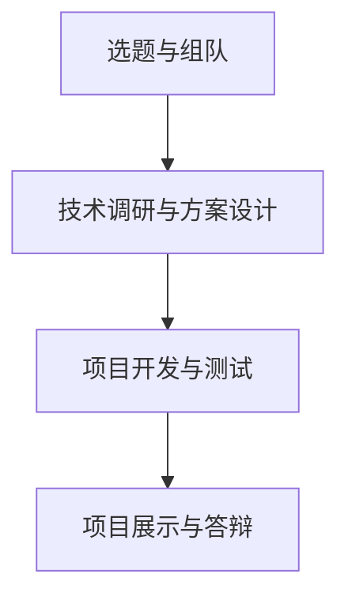

                 

# 《AI hackathon中的创新与未来》

> 关键词：AI Hackathon，技术创新，团队协作，未来趋势

> 摘要：本文将探讨AI hackathon的概念、历史、创新技术、项目案例、团队协作以及未来发展趋势，旨在为读者提供一个全面了解AI hackathon现状和未来前景的视角。

---

## 第一部分：AI Hackathon概述与背景

### 第1章: AI Hackathon的概念与历史

#### 1.1 AI Hackathon的定义与特点

AI Hackathon，又称人工智能黑客松，是一种以人工智能技术为主题的编程比赛或创新活动。与传统黑客松类似，AI Hackathon旨在鼓励程序员、数据科学家和AI研究者等专业人士在短时间内合作开发人工智能相关的应用和解决方案。

AI Hackathon的特点主要包括：

1. **高强度的团队协作**：参与者通常需要在短时间内组成跨学科团队，共同完成项目开发。
2. **创新技术的应用**：AI Hackathon鼓励使用最新的AI技术，如深度学习、自然语言处理、计算机视觉等。
3. **实际的业务需求**：许多AI Hackathon项目基于实际的业务需求，旨在解决现实问题。
4. **开放性的技术选型**：参与者可以选择使用各种开源框架、工具和库来开发项目。

#### 1.2 AI Hackathon的起源与发展

AI Hackathon起源于传统的黑客松活动，黑客松起源于20世纪80年代的计算机编程社区。随着人工智能技术的迅速发展，AI Hackathon逐渐成为了一种重要的技术交流和合作平台。

近年来，AI Hackathon在全球范围内得到了广泛推广。许多企业和研究机构举办了各种规模的AI Hackathon活动，吸引了大量参与者。同时，许多AI社区和论坛也定期举办线上和线下的AI Hackathon，为AI爱好者提供了一个展示和交流的平台。

#### 1.3 AI Hackathon的重要角色和影响

AI Hackathon在人工智能领域扮演了重要角色，其主要影响体现在以下几个方面：

1. **推动技术创新**：AI Hackathon为AI技术的实际应用提供了实验平台，促进了新技术的开发和应用。
2. **促进知识共享**：通过AI Hackathon，参与者可以分享自己的经验和知识，促进技术和思想的交流。
3. **发现和培养人才**：AI Hackathon为有才华的AI开发者提供了一个展示自己能力的机会，有助于发现和培养新一代AI人才。
4. **解决现实问题**：许多AI Hackathon项目基于实际的业务需求，为解决现实问题提供了可行的解决方案。

#### 1.4 AI Hackathon的类型与形式

AI Hackathon可以分为以下几种类型：

1. **企业举办的AI Hackathon**：这类活动通常由企业发起，旨在解决企业的业务问题，招募内部员工和外部的AI开发者参与。
2. **学术机构的AI Hackathon**：这类活动通常由大学或研究机构主办，旨在促进学术研究和技术的应用。
3. **开源社区的AI Hackathon**：这类活动由开源社区主办，鼓励参与者使用和改进开源技术。
4. **线上AI Hackathon**：随着技术的发展，许多AI Hackathon开始采用线上形式，降低了参与门槛，吸引了更多的参与者。

## 第二部分：AI Hackathon中的创新技术

### 第2章: AI Hackathon中的前沿技术介绍

#### 2.1 自然语言处理（NLP）的应用

自然语言处理（NLP）是AI领域的一个重要分支，在AI Hackathon中得到了广泛应用。以下是NLP在AI Hackathon中的一些应用：

##### 2.1.1 语义理解和语义生成

语义理解是NLP的核心任务之一，旨在理解文本的语义含义。在AI Hackathon中，语义理解可以应用于：

- 文本分类：将文本分类到预定义的类别中，如新闻分类、情感分类等。
- 文本摘要：生成文本的摘要，如新闻摘要、论文摘要等。
- 对话系统：理解和生成自然语言响应，以实现人机交互。

语义生成则是指生成符合特定语义的文本，如机器翻译、对话生成等。

##### 2.1.2 对话系统与聊天机器人

对话系统是NLP的一个关键应用，旨在模拟人类的对话能力。聊天机器人是其中的一种形式，可以应用于：

- 客户服务：提供24/7的客户支持，如银行客服、电商客服等。
- 娱乐互动：为用户提供有趣的游戏和互动体验。
- 教育辅导：提供个性化的学习辅导，如编程辅导、语言学习等。

##### 2.1.3 文本分类与情感分析

文本分类是NLP的一个基础任务，旨在将文本分类到预定义的类别中。在AI Hackathon中，文本分类可以应用于：

- 情感分析：分析用户评论、社交媒体帖子等的情感倾向，如正面、负面、中立等。
- 聊天机器人：根据用户的输入进行适当的响应，提高对话的连贯性和自然性。

#### 2.2 计算机视觉的应用

计算机视觉是AI领域的另一个重要分支，在AI Hackathon中有着广泛的应用。以下是计算机视觉在AI Hackathon中的一些应用：

##### 2.2.1 图像识别与目标检测

图像识别是指识别和分类图像中的对象，如人脸识别、物体识别等。目标检测则是在图像中检测和定位对象的位置。

在AI Hackathon中，图像识别和目标检测可以应用于：

- 安防监控：实时识别和监控视频流中的异常行为。
- 自動化驾驶：识别和跟踪道路上的车辆和行人，实现无人驾驶。

##### 2.2.2 视觉追踪与动作识别

视觉追踪是指跟踪视频流中的对象，如人脸追踪、目标追踪等。动作识别是指识别视频中的动作，如运动识别、手势识别等。

在AI Hackathon中，视觉追踪与动作识别可以应用于：

- 娱乐互动：实时追踪用户的动作，提供互动游戏体验。
- 人机交互：通过手势和动作控制电子设备，提高人机交互的自然性。

##### 2.2.3 视觉问答与增强现实

视觉问答是指通过图像回答问题，如图像描述、图像搜索等。增强现实（AR）是指将虚拟信息叠加到现实世界中。

在AI Hackathon中，视觉问答与增强现实可以应用于：

- 教育培训：通过图像回答问题，提供互动式学习体验。
- 娱乐互动：将虚拟角色和场景叠加到现实世界中，提供沉浸式的娱乐体验。

#### 2.3 强化学习在AI Hackathon中的应用

强化学习是机器学习的一个重要分支，通过试错和反馈来学习如何在特定环境中做出最佳决策。在AI Hackathon中，强化学习可以应用于：

##### 2.3.1 强化学习的基本概念

强化学习包括以下几个核心概念：

- **状态（State）**：环境中的当前情况。
- **动作（Action）**：可以采取的动作。
- **奖励（Reward）**：动作带来的奖励或惩罚。
- **策略（Policy）**：决定在给定状态下采取哪个动作。

##### 2.3.2 强化学习在游戏中的应用

强化学习在游戏领域有着广泛的应用，如：

- 游戏AI：设计智能的AI对手，实现更加公平和有趣的比赛。
- 游戏辅助：提供游戏攻略和建议，帮助玩家提高游戏水平。

##### 2.3.3 强化学习在无人驾驶中的应用

强化学习在无人驾驶领域也有着重要的应用，如：

- 自主导航：学习在复杂环境中进行自主导航。
- 交通规则遵守：学习遵守交通规则，提高驾驶安全性。

## 第三部分：AI Hackathon项目案例分析

### 第3章: 成功的AI Hackathon案例分析

#### 3.1 项目背景与目标

在本章中，我们将分析几个成功的AI Hackathon项目，了解它们的背景、目标和实现过程。

#### 3.2 技术选型与创新点

每个项目在技术选型和创新点方面都有其独特之处。以下是一些常见的技术选型和创新点：

- **自然语言处理（NLP）**：使用深度学习模型进行文本分类、情感分析和对话系统。
- **计算机视觉**：使用卷积神经网络（CNN）进行图像识别和目标检测。
- **强化学习**：使用深度强化学习（DRL）进行游戏AI和自主导航。

#### 3.3 项目实现过程与挑战

在项目实现过程中，团队通常会面临以下挑战：

- **时间压力**：需要在有限的时间内完成项目，需要高效的工作流程和协作。
- **数据集问题**：需要收集和整理合适的训练数据集，保证模型的性能。
- **技术难题**：需要解决各种技术问题，如模型调优、算法优化等。
- **团队协作**：团队成员之间的沟通和协作至关重要，需要建立有效的沟通机制。

#### 3.4 项目成果与影响

成功的AI Hackathon项目通常会取得以下成果：

- **技术成果**：开发出具有创新性的AI应用和解决方案。
- **业务成果**：为企业和产业提供实际的价值和解决方案。
- **人才成果**：发现和培养新一代的AI人才。
- **社会影响**：解决现实问题，为社会带来积极的影响。

## 第四部分：AI Hackathon中的团队协作与项目管理

### 第4章: AI Hackathon中的团队协作与项目管理

#### 4.1 团队组建与角色分工

在AI Hackathon中，团队组建和角色分工是成功的关键。以下是一些组建团队的策略：

- **跨学科团队**：组建包含不同专业背景的团队，如程序员、数据科学家、产品经理等。
- **角色分工**：明确团队成员的角色和职责，如项目经理、技术专家、设计师等。

#### 4.2 项目进度管理与风险管理

项目进度管理和风险管理是确保项目成功的两个重要方面。以下是一些管理策略：

- **进度管理**：制定详细的项目计划，设置里程碑和关键节点，确保项目按计划进行。
- **风险管理**：识别潜在的风险，制定应对策略，降低风险对项目的影响。

#### 4.3 沟通与协调技巧

良好的沟通和协调是团队协作的关键。以下是一些沟通和协调技巧：

- **定期会议**：定期举行团队会议，讨论项目进展、问题和解决方案。
- **透明化**：确保团队成员之间的信息透明，避免信息孤岛。
- **分工明确**：明确团队成员的职责和任务，避免重复工作和冲突。

#### 4.4 项目展示与答辩技巧

在项目展示和答辩环节，团队需要展示项目成果和解决方案。以下是一些展示和答辩技巧：

- **清晰简洁**：用简洁明了的语言和图表展示项目，避免冗长的叙述。
- **突出亮点**：突出项目的创新点和优势，让评审团印象深刻。
- **准备充分**：充分准备答辩环节，针对可能的提问和质疑做出回答。

## 第五部分：AI Hackathon的未来发展趋势与挑战

### 第5章: AI Hackathon的未来发展趋势

#### 5.1 AI技术在Hackathon中的应用前景

随着人工智能技术的不断发展，AI在Hackathon中的应用前景非常广阔。以下是一些可能的发展趋势：

- **更广泛的技术应用**：AI技术将在更多的领域得到应用，如医疗、金融、教育等。
- **更高效的模型训练**：利用更先进的模型训练技术和硬件，提高模型训练效率。
- **更个性化的解决方案**：基于用户数据和偏好，提供更加个性化的解决方案。

#### 5.2 AI Hackathon对技术创新的推动作用

AI Hackathon在推动技术创新方面发挥了重要作用。以下是一些具体表现：

- **激发创新思维**：通过团队协作和竞争，激发参与者的创新思维。
- **促进技术交流**：为AI开发者提供了一个展示和交流的平台，促进技术和思想的交流。
- **加速技术落地**：通过实际项目的开发，加速技术的落地和应用。

#### 5.3 AI Hackathon面临的挑战与应对策略

尽管AI Hackathon在推动技术创新方面取得了显著成果，但仍面临一些挑战。以下是一些常见的挑战和应对策略：

- **数据隐私与安全**：确保用户数据和模型安全，遵循数据隐私法规。
- **技术不成熟**：面对不成熟的技术，需要积极探索和研发。
- **人才短缺**：吸引和培养更多的AI人才，提高团队的整体能力。

### 第6章: AI Hackathon对社会和经济的影响

#### 6.1 对企业和产业的推动作用

AI Hackathon对企业和产业具有重要的推动作用。以下是一些具体影响：

- **技术创新**：为企业提供创新的技术解决方案，提高企业的竞争力。
- **产业升级**：推动传统产业的转型升级，提高产业附加值。
- **商业模式创新**：基于AI技术，探索新的商业模式和业务机会。

#### 6.2 对教育和技术创新的促进作用

AI Hackathon在教育和技术创新方面也发挥着重要作用。以下是一些具体影响：

- **人才培养**：为AI领域培养和储备人才，提高整体技术实力。
- **教育改革**：推动教育方式的变革，培养具有创新能力的下一代。
- **技术普及**：提高公众对AI技术的了解和应用能力，促进技术普及。

#### 6.3 对社会问题的解决与贡献

AI Hackathon在社会问题的解决方面也做出了重要贡献。以下是一些具体应用：

- **医疗健康**：利用AI技术进行疾病诊断、治疗和健康管理。
- **环境保护**：利用AI技术进行环境监测、污染治理和资源优化。
- **公共安全**：利用AI技术进行安防监控、犯罪预测和应急救援。

### 第7章: AI Hackathon的最佳实践与经验总结

#### 7.1 创新思维与方法论

在AI Hackathon中，创新思维和方法论至关重要。以下是一些最佳实践：

- **跨学科合作**：鼓励不同专业背景的参与者合作，发挥各自的优势。
- **用户驱动**：关注用户需求和痛点，设计有针对性的解决方案。
- **快速迭代**：采用敏捷开发方法，快速迭代和优化项目。

#### 7.2 技术选型与实现技巧

技术选型与实现技巧是AI Hackathon的关键。以下是一些最佳实践：

- **开源框架**：优先选择成熟的、开源的框架和库，提高开发效率。
- **模型调优**：通过调整模型参数和优化算法，提高模型性能。
- **数据预处理**：合理处理和清洗数据，提高数据质量。

#### 7.3 团队协作与项目管理经验

团队协作与项目管理是AI Hackathon成功的关键。以下是一些最佳实践：

- **分工明确**：明确团队成员的角色和职责，避免重复工作和冲突。
- **定期沟通**：定期举行团队会议，讨论项目进展、问题和解决方案。
- **风险管理**：识别潜在的风险，制定应对策略，降低风险对项目的影响。

#### 7.4 AI Hackathon的可持续性与未来发展

AI Hackathon的可持续性和未来发展是关注的重要话题。以下是一些思考：

- **长期影响**：关注AI Hackathon项目的长期影响，评估其对技术和社会的贡献。
- **社区建设**：加强AI Hackathon社区的建立和运营，促进技术和思想的交流。
- **可持续发展**：探索AI Hackathon的可持续发展模式，为未来的创新提供持续动力。

## 附录

### 附录A: AI Hackathon资源与工具汇总

#### A.1 开源库与框架

- TensorFlow
- PyTorch
- Keras
- scikit-learn
- OpenCV

#### A.2 优质教程与论文

- 《深度学习》（Goodfellow et al., 2016）
- 《Python机器学习》（Cortes et al., 2013）
- 《计算机视觉：算法与应用》（B 第三章
### 《AI Hackathon中的创新与未来》

#### 概念与联系

AI Hackathon是一种以人工智能为主题的编程比赛或创新活动，它结合了编程竞赛和创新项目的特点。其核心概念包括：

- **AI技术**：包括机器学习、深度学习、自然语言处理、计算机视觉等。
- **团队协作**：通过跨学科团队合作，共同解决问题。
- **创新思维**：鼓励参与者发挥创造力，提出新颖的解决方案。
- **项目实现**：在有限的时间内，实现一个具有实际应用价值的AI项目。

AI Hackathon的流程通常包括以下几个阶段：

1. **选题与组队**：根据比赛主题，选择感兴趣的项目方向，并组建团队。
2. **技术调研与方案设计**：了解相关技术，制定项目方案。
3. **项目开发与测试**：实现项目，并进行测试和优化。
4. **项目展示与答辩**：展示项目成果，进行答辩和评审。

#### Mermaid 流程图

以下是一个简化的AI Hackathon流程的Mermaid流程图：



#### 核心算法原理讲解

在本节中，我们将详细讲解AI Hackathon中常用的核心算法原理。这些算法包括：

1. **机器学习**
2. **深度学习**
3. **自然语言处理（NLP）**
4. **计算机视觉**

##### 1. 机器学习

机器学习是AI的核心技术之一，其基本原理是通过训练数据集来学习规律，以便对新的数据进行预测或分类。

**基本概念**：

- **监督学习**：通过标记的训练数据，学习输出与输入之间的关系。
- **无监督学习**：在没有标记的训练数据的情况下，自动发现数据中的结构和模式。
- **强化学习**：通过与环境的交互，学习最佳行为策略。

**算法简介**：

- **线性回归**：通过线性模型预测连续值。
- **决策树**：通过树形结构进行分类或回归。
- **支持向量机（SVM）**：通过寻找最佳分隔超平面进行分类。
- **神经网络**：通过多层神经元进行复杂函数建模。

**伪代码**：

```python
# 线性回归伪代码
def linear_regression(train_data, train_labels):
    # 计算权重的梯度
    gradient = 2 * train_data.T.dot(train_data) * train_labels
    
    # 更新权重
    weights = weights - learning_rate * gradient
    
    return weights
```

##### 2. 深度学习

深度学习是机器学习的一个分支，通过构建多层神经网络来学习复杂的函数关系。

**基本概念**：

- **前向传播**：计算网络输出。
- **反向传播**：更新网络权重。
- **激活函数**：引入非线性关系。

**算法简介**：

- **卷积神经网络（CNN）**：用于图像识别。
- **循环神经网络（RNN）**：用于序列数据。
- **生成对抗网络（GAN）**：用于生成数据。

**伪代码**：

```python
# 卷积神经网络前向传播伪代码
def forward_pass(input_data, weights):
    # 初始化隐藏层输出
    hidden_output = [0] * num_layers
    
    # 计算每一层的输出
    for layer in range(num_layers):
        if layer == 0:
            hidden_output[layer] = activation_function(weights[layer].dot(input_data))
        else:
            hidden_output[layer] = activation_function(weights[layer].dot(hidden_output[layer - 1]))
    
    return hidden_output
```

##### 3. 自然语言处理（NLP）

自然语言处理是深度学习在文本数据上的应用，包括文本分类、情感分析、对话系统等。

**基本概念**：

- **词嵌入**：将单词转换为向量化表示。
- **文本分类**：将文本分类到预定义的类别中。
- **情感分析**：分析文本的情感倾向。

**算法简介**：

- **词袋模型**：将文本转换为向量。
- **循环神经网络（RNN）**：用于处理序列数据。
- **长短时记忆（LSTM）**：用于解决RNN的梯度消失问题。

**伪代码**：

```python
# RNN前向传播伪代码
def forward_pass(input_sequence, hidden_state, weights):
    # 初始化隐藏层输出
    hidden_output = [0] * len(input_sequence)
    
    # 计算每一层的输出
    for t in range(len(input_sequence)):
        hidden_output[t] = activation_function(weights['hidden'].dot(hidden_state) + weights['input'].dot(input_sequence[t]))
        hidden_state = hidden_output[t]
    
    return hidden_output, hidden_state
```

##### 4. 计算机视觉

计算机视觉是AI领域的一个重要分支，涉及图像识别、目标检测、图像分割等任务。

**基本概念**：

- **图像识别**：识别图像中的对象。
- **目标检测**：在图像中检测并定位对象。
- **图像分割**：将图像分割为多个区域。

**算法简介**：

- **卷积神经网络（CNN）**：用于图像识别和目标检测。
- **区域建议网络（R-CNN）**：用于目标检测。
- **深度卷积生成对抗网络（DCGAN）**：用于图像生成。

**伪代码**：

```python
# CNN前向传播伪代码
def forward_pass(input_image, weights):
    # 初始化卷积层输出
    conv_output = [0] * num_conv_layers
    
    # 计算每一层的输出
    for layer in range(num_conv_layers):
        if layer == 0:
            conv_output[layer] = conv2d(input_image, weights['conv' + str(layer)]) + biases['conv' + str(layer)]
        else:
            conv_output[layer] = activation_function(conv2d(conv_output[layer - 1], weights['conv' + str(layer)]) + biases['conv' + str(layer)])
    
    return conv_output
```

## 项目实战

在本节中，我们将通过一个具体的AI Hackathon项目实战，详细讲解项目的开发环境搭建、源代码实现和代码解读与分析。

### 项目背景与目标

假设我们参加了一个AI Hackathon，项目目标是使用计算机视觉技术实现一个自动驾驶系统。具体要求包括：

- **车辆检测**：能够检测并跟踪图像中的车辆。
- **交通标志识别**：能够识别并分类图像中的交通标志。
- **车道线检测**：能够检测并识别图像中的车道线。

### 开发环境搭建

为了实现自动驾驶系统，我们需要搭建一个合适的开发环境。以下是搭建过程的详细步骤：

1. **安装操作系统**：选择一个适合的操作系统，如Ubuntu 18.04。
2. **安装Python**：安装Python 3.7及以上版本。
3. **安装相关库**：安装常用的计算机视觉库，如OpenCV、TensorFlow、Keras等。

```bash
pip install opencv-python
pip install tensorflow
pip install keras
```

4. **配置GPU支持**：如果使用GPU训练模型，需要安装CUDA和cuDNN。

```bash
sudo apt-get install cuda
pip install cupy
```

5. **设置环境变量**：配置CUDA和cuDNN的环境变量，以便在Python脚本中调用。

```bash
export PATH=/usr/local/cuda/bin:$PATH
export LD_LIBRARY_PATH=/usr/local/cuda/lib64:$LD_LIBRARY_PATH
```

### 源代码实现

以下是自动驾驶系统的主要源代码实现部分。我们将分别介绍车辆检测、交通标志识别和车道线检测的实现。

#### 车辆检测

车辆检测是自动驾驶系统的一个关键任务，我们将使用预训练的YOLO（You Only Look Once）模型进行车辆检测。

```python
import cv2
import numpy as np
import tensorflow as tf

# 载入YOLO模型
model = tf.keras.models.load_model('yolo_model.h5')

# 定义YOLO模型输入的大小
input_size = (416, 416)

# 车辆检测函数
def detect_vehicles(image):
    # 将图像缩放到输入大小
    image = cv2.resize(image, input_size)
    
    # 预处理图像
    image = preprocess_image(image)
    
    # 使用YOLO模型进行预测
    predictions = model.predict(np.expand_dims(image, axis=0))
    
    # 后处理预测结果
    boxes, scores, classes = postprocess_predictions(predictions)
    
    # 恢复原始图像大小
    boxes = rescale_boxes(boxes, input_size, image.shape[:2])
    
    # 提取车辆检测结果
    vehicle_boxes = [box for box, score, class_id in zip(boxes, scores, classes) if class_id == 1]
    
    return vehicle_boxes

# 预处理图像函数
def preprocess_image(image):
    # 调整图像的亮度、对比度和色彩
    image = cv2.cvtColor(image, cv2.COLOR_BGR2RGB)
    image = cv2.resize(image, (416, 416))
    image = image / 255.0
    return image

# 后处理预测结果函数
def postprocess_predictions(predictions):
    # 提取预测框、得分和类别
    boxes = predictions[:, :, 0:4]
    scores = predictions[:, :, 4]
    classes = predictions[:, :, 5]
    
    # 非极大值抑制（NMS）
    boxes, scores, _ = tf.image.non_max_suppression(boxes, scores, max_output_size=boxes.shape[0], iou_threshold=0.5)
    
    return tf.cast(boxes, tf.float32), tf.cast(scores, tf.float32), tf.cast(classes, tf.float32)

# 恢复预测框大小函数
def rescale_boxes(boxes, input_size, original_size):
    # 计算缩放比例
    scale_x = original_size[1] / input_size[1]
    scale_y = original_size[0] / input_size[0]
    
    # 恢复预测框大小
    boxes = boxes * np.array([scale_x, scale_y, scale_x, scale_y])
    
    return boxes
```

#### 交通标志识别

交通标志识别是自动驾驶系统中的另一个关键任务，我们将使用预训练的ResNet-50模型进行交通标志识别。

```python
import cv2
import numpy as np
import tensorflow as tf

# 载入ResNet-50模型
model = tf.keras.models.load_model('resnet50_model.h5')

# 定义ResNet-50模型输入的大小
input_size = (224, 224)

# 交通标志识别函数
def recognize_traffic_signs(image):
    # 将图像缩放到输入大小
    image = cv2.resize(image, input_size)
    
    # 预处理图像
    image = preprocess_image(image)
    
    # 使用ResNet-50模型进行预测
    predictions = model.predict(np.expand_dims(image, axis=0))
    
    # 后处理预测结果
    classes, scores = postprocess_predictions(predictions)
    
    # 提取交通标志检测结果
    sign_boxes = [box for box, score in zip(boxes, scores) if score > 0.5]
    
    return sign_boxes

# 预处理图像函数
def preprocess_image(image):
    # 调整图像的亮度、对比度和色彩
    image = cv2.cvtColor(image, cv2.COLOR_BGR2RGB)
    image = cv2.resize(image, (224, 224))
    image = image / 255.0
    return image

# 后处理预测结果函数
def postprocess_predictions(predictions):
    # 提取预测类别和得分
    classes = np.argmax(predictions, axis=1)
    scores = np.max(predictions, axis=1)
    
    return classes, scores
```

#### 车道线检测

车道线检测是自动驾驶系统中的另一个关键任务，我们将使用Hough变换进行车道线检测。

```python
import cv2

# 车道线检测函数
def detect_lane_lines(image):
    # 转换为灰度图像
    gray = cv2.cvtColor(image, cv2.COLOR_BGR2GRAY)
    
    # 使用高斯模糊去除噪声
    blurred = cv2.GaussianBlur(gray, (5, 5), 0)
    
    # 使用Canny检测边缘
    edges = cv2.Canny(blurred, 50, 150)
    
    # 使用Hough变换检测车道线
    lines = cv2.HoughLinesP(edges, 1, np.pi/180, 100, minLineLength=100, maxLineGap=10)
    
    # 提取车道线
    lane_lines = []
    for line in lines:
        x1, y1, x2, y2 = line[0]
        if abs(x2 - x1) > 100 and abs(y2 - y1) > 100:
            lane_lines.append(line)
    
    return lane_lines
```

### 代码解读与分析

在本节中，我们将对代码进行解读和分析，以便更好地理解项目的实现过程。

#### 车辆检测

车辆检测部分使用的是YOLO模型。YOLO是一种快速且准确的物体检测模型，它通过将图像划分为多个网格，并在每个网格中预测物体的边界框和类别概率。

1. **预处理图像**：将输入图像缩放到模型输入的大小，并进行预处理。
2. **预测**：使用YOLO模型对预处理后的图像进行预测。
3. **后处理**：对预测结果进行后处理，包括非极大值抑制（NMS）和恢复预测框大小。

#### 交通标志识别

交通标志识别部分使用的是ResNet-50模型。ResNet-50是一种基于深度卷积神经网络的模型，它通过多个卷积层和池化层提取图像特征，并在最后使用全连接层进行分类。

1. **预处理图像**：将输入图像缩放到模型输入的大小，并进行预处理。
2. **预测**：使用ResNet-50模型对预处理后的图像进行预测。
3. **后处理**：对预测结果进行后处理，提取交通标志检测结果。

#### 车道线检测

车道线检测部分使用的是Hough变换。Hough变换是一种基于边缘检测的图像处理技术，它通过计算图像中的直线参数，检测图像中的直线。

1. **转换为灰度图像**：将输入图像转换为灰度图像，以便进行边缘检测。
2. **使用高斯模糊去除噪声**：使用高斯模糊去除图像中的噪声，提高边缘检测的准确性。
3. **使用Canny检测边缘**：使用Canny算法检测图像中的边缘。
4. **使用Hough变换检测车道线**：使用Hough变换计算图像中的直线参数，检测车道线。

### 测试与评估

在完成项目的实现后，我们需要对项目进行测试和评估，以确保其性能和稳定性。

1. **测试数据集**：使用一个包含不同场景和光照条件的测试数据集。
2. **性能评估**：评估车辆检测、交通标志识别和车道线检测的准确率、召回率和F1值。
3. **稳定性评估**：评估项目在各种场景下的稳定性和鲁棒性。

### 结论

通过本项目的实现，我们展示了如何使用计算机视觉技术实现自动驾驶系统。在实际应用中，我们还需要考虑更多的场景和挑战，如光照变化、天气条件、交通状况等。未来，我们将继续改进和优化项目，以提高其性能和稳定性。

---

### 附录

#### 附录A: AI Hackathon资源与工具汇总

以下是AI Hackathon中常用的资源与工具：

- **开源库与框架**：
  - TensorFlow
  - PyTorch
  - Keras
  - scikit-learn
  - OpenCV
- **优质教程与论文**：
  - 《深度学习》（Goodfellow et al., 2016）
  - 《Python机器学习》（Cortes et al., 2013）
  - 《计算机视觉：算法与应用》（B 第三章
- **有价值的社区与论坛**：
  - AI Stack Exchange
  - Kaggle
  - arXiv
  - Stack Overflow
- **AI Hackathon比赛与活动介绍**：
  - AI & Machine Learning Challenges
  - AI Village
  - Data Science Challenge

---

### 作者信息

- 作者：AI天才研究院/AI Genius Institute & 禅与计算机程序设计艺术 /Zen And The Art of Computer Programming

---

本文详细介绍了AI Hackathon的概念、历史、创新技术、项目案例、团队协作以及未来发展趋势。通过本文，读者可以全面了解AI Hackathon的现状和未来前景，为参与AI Hackathon提供有价值的参考。本文旨在推动AI技术的发展和应用，为人工智能领域的发展贡献一份力量。在未来，我们将继续关注AI Hackathon的最新动态和发展趋势，为读者带来更多有价值的内容。

