                 

# AI 大模型创业：如何利用创新优势？

> **关键词：** AI大模型，创业，创新优势，技术基础，战略规划，案例分析，法律与伦理，资源与支持，未来趋势

> **摘要：** 本文旨在探讨AI大模型在创业中的应用，分析创业者所需的技术基础、战略规划、面临的挑战以及资源与支持。通过案例分析，提供具体的创业路径和经验，并探讨未来趋势，帮助创业者利用AI大模型的优势，实现创新与突破。

---

## 第一部分：AI大模型创业概述

### 第1章: AI大模型与创业

#### 1.1 AI大模型的定义与重要性

##### 1.1.1 AI大模型的定义

AI大模型是指那些规模庞大、参数数量极其丰富的神经网络模型，如GPT、BERT等。这些模型通过对海量数据的训练，能够实现高度复杂的任务，如文本生成、图像识别、自然语言处理等。

##### 1.1.2 AI大模型的重要性

AI大模型的出现，不仅推动了人工智能领域的发展，也为创业者提供了新的机遇。它们能够帮助企业提升效率、创造新的业务模式，甚至在某些领域实现颠覆性创新。

#### 1.2 创业中的AI大模型应用

##### 1.2.1 AI大模型在产品开发中的应用

AI大模型可以帮助企业快速构建原型，加速产品迭代，降低开发成本。例如，通过预训练模型进行文本生成、图像生成等。

##### 1.2.2 AI大模型在数据分析中的应用

AI大模型能够对大量数据进行分析，提取关键信息，帮助企业做出更明智的决策。例如，通过聚类分析、关联规则挖掘等。

##### 1.2.3 AI大模型在服务设计中的应用

AI大模型可以为企业提供智能客服、智能推荐等服务，提升用户体验，增加用户粘性。

#### 1.3 创业过程中的AI大模型挑战

##### 1.3.1 数据隐私与伦理问题

在利用AI大模型进行创业时，数据隐私与伦理问题不容忽视。如何确保用户数据的安全，避免数据滥用，是每个创业者都需要考虑的问题。

##### 1.3.2 模型选择与优化

选择合适的AI大模型，并进行优化，是创业成功的关键。如何根据业务需求，选择最适合的模型，并进行优化，是创业者需要掌握的技能。

##### 1.3.3 技术瓶颈与资源限制

AI大模型训练和推理需要大量的计算资源和时间。对于初创企业来说，如何解决这些技术瓶颈和资源限制，是创业过程中的重要挑战。

#### 1.4 创业中的AI大模型案例分享

##### 1.4.1 案例一：利用GPT模型进行文本生成

通过GPT模型，企业可以实现自动化的文本生成，如新闻稿、广告文案等。这不仅可以提高工作效率，还能降低创作成本。

##### 1.4.2 案例二：利用BERT模型进行情感分析

BERT模型在情感分析任务上表现优异。企业可以利用这一优势，为用户提供情感分析服务，如情感监测、舆情分析等。

##### 1.4.3 案例三：利用图像生成模型进行创意设计

图像生成模型可以为企业提供创意设计支持，如广告设计、海报设计等。通过这一模型，企业可以快速生成各种设计素材，提高设计效率。

---

## 第二部分：创业者所需的AI大模型技术基础

### 第2章: 创业者所需的AI大模型技术基础

#### 2.1 AI大模型的基本原理

##### 2.1.1 神经网络基础

神经网络是AI大模型的基础，包括神经元、激活函数、反向传播算法等。通过学习这些基础，创业者可以更好地理解AI大模型的工作原理。

###### 2.1.1.1 神经元

神经元是神经网络的基本单元，负责接收输入信号并产生输出。每个神经元都可以视为一个简单的计算单元，其工作原理类似于人脑中的神经元。

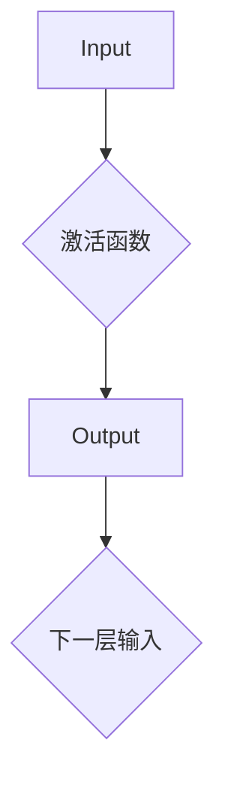

###### 2.1.1.2 激活函数

激活函数是神经网络中用于引入非线性性的函数。常见的激活函数包括sigmoid、ReLU、Tanh等。

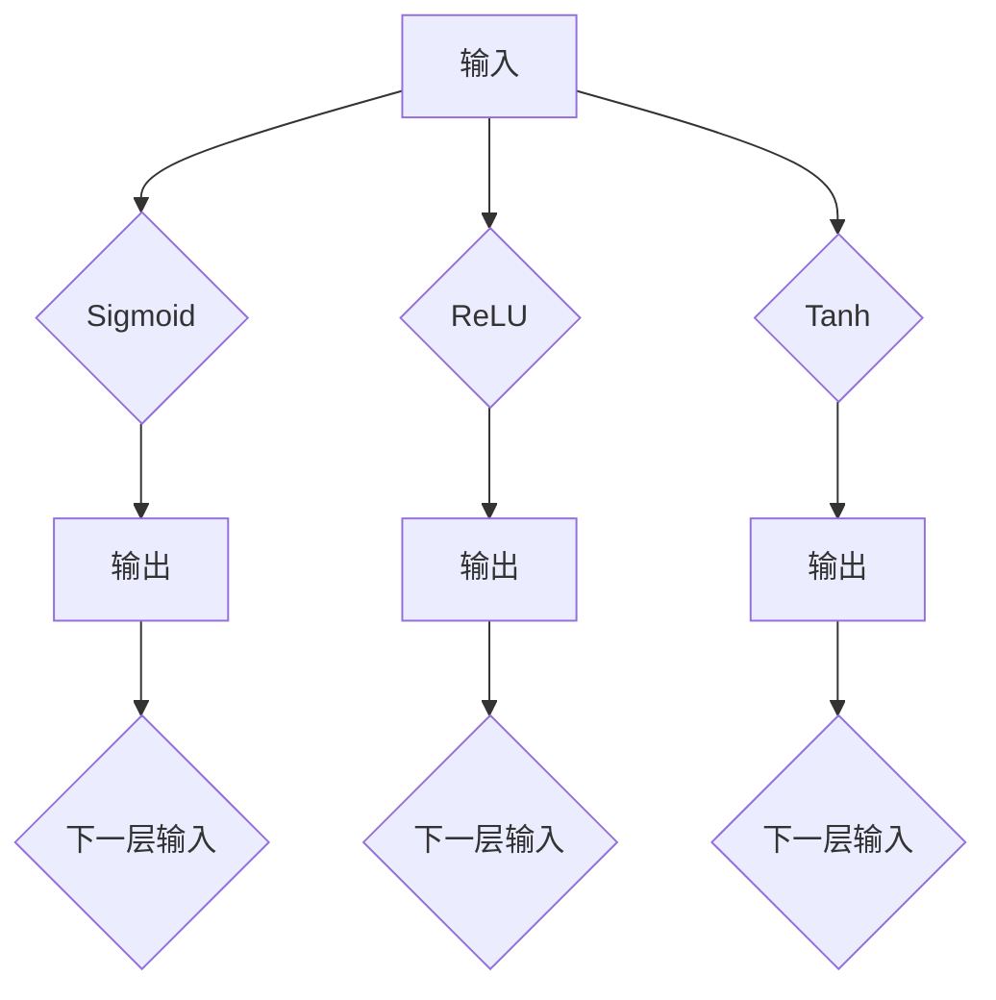

###### 2.1.1.3 反向传播算法

反向传播算法是神经网络训练的核心算法，用于计算网络中各个参数的梯度。其基本原理是：从输出层开始，反向计算每个神经元的误差，并更新网络参数。

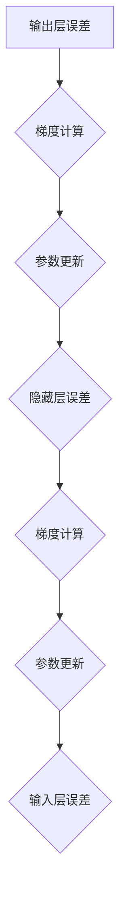

##### 2.1.2 深度学习原理

深度学习是构建AI大模型的核心技术，包括多层神经网络、卷积神经网络（CNN）、循环神经网络（RNN）等。创业者需要掌握这些深度学习技术，以构建高效的AI大模型。

###### 2.1.2.1 多层神经网络

多层神经网络通过增加隐层数量，可以提升模型的非线性表示能力。其基本结构包括输入层、多个隐层和输出层。

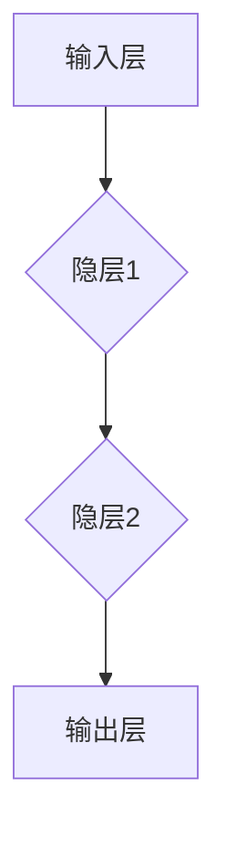

###### 2.1.2.2 卷积神经网络（CNN）

卷积神经网络是处理图像数据的常用网络结构，其核心在于卷积操作。卷积层通过滑动窗口对输入图像进行卷积，提取特征。

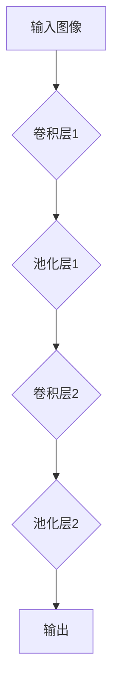

###### 2.1.2.3 循环神经网络（RNN）

循环神经网络适用于处理序列数据，其特点是可以保留长时记忆。RNN通过循环结构将当前输入与前一时刻的输出相结合，更新内部状态。

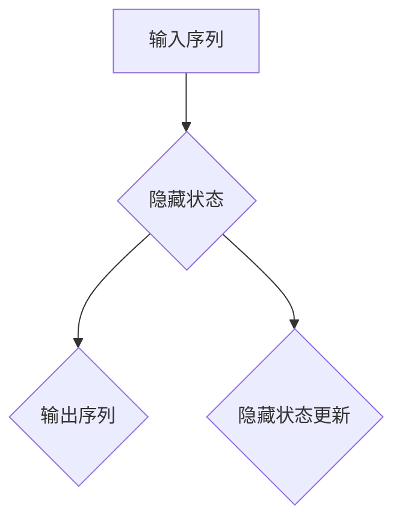

##### 2.1.3 大规模预训练模型

大规模预训练模型是AI大模型的重要方向，如GPT、BERT等。创业者需要了解这些模型的预训练过程、参数设置等，以构建具有强大能力的大模型。

###### 2.1.3.1 GPT模型

GPT（Generative Pre-trained Transformer）是基于Transformer架构的预训练模型，其通过无监督的方式在大量文本数据上进行预训练，然后用于各种自然语言处理任务。

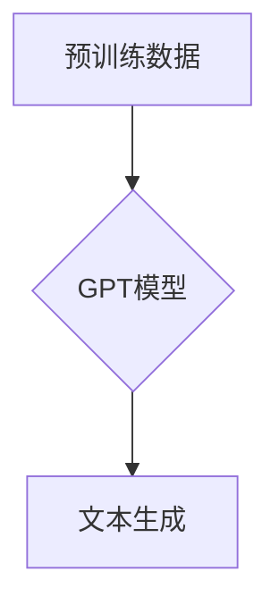

###### 2.1.3.2 BERT模型

BERT（Bidirectional Encoder Representations from Transformers）是基于Transformer的双向编码模型，其通过双向注意力机制捕捉文本的上下文信息，适用于各种自然语言处理任务。

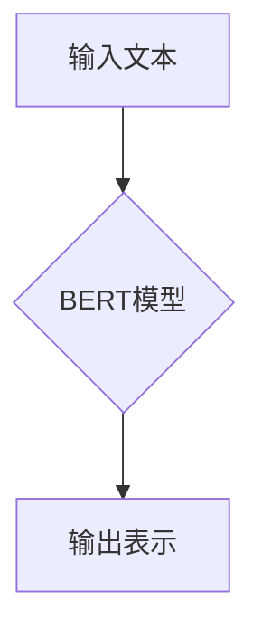

#### 2.2 AI大模型的开发与优化

##### 2.2.1 模型开发流程

模型开发包括数据准备、模型选择、训练与优化等步骤。创业者需要了解这些流程，以高效地开发AI大模型。

###### 2.2.1.1 数据准备

数据准备是模型开发的第一步，包括数据采集、清洗、预处理等。创业者需要确保数据的质量和多样性，以提升模型的泛化能力。

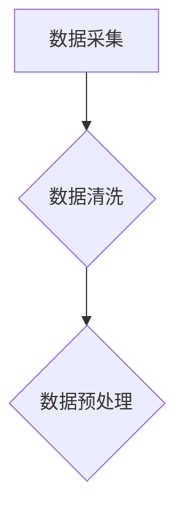

###### 2.2.1.2 模型选择

模型选择是模型开发的关键环节，创业者需要根据业务需求，选择合适的模型架构。常用的模型选择方法包括比较不同模型在数据集上的性能、分析模型的复杂度等。

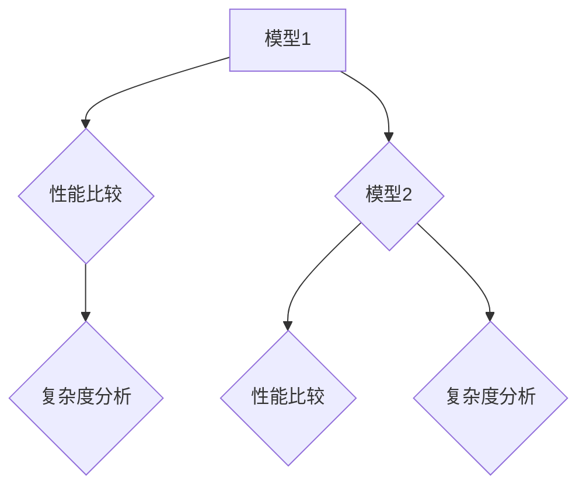

###### 2.2.1.3 训练与优化

模型训练是通过调整模型参数，使其在训练数据上达到较好的性能。创业者需要掌握训练技巧，如批量归一化、dropout等，以提高模型训练效果。

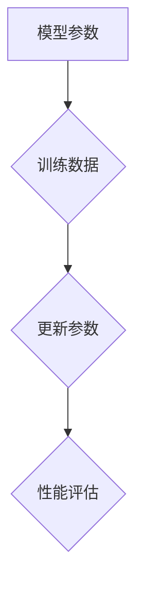

##### 2.2.2 模型优化技巧

模型优化是提升AI大模型性能的关键。创业者需要掌握优化技巧，如超参数调整、正则化技术、批量归一化等，以提高模型性能。

###### 2.2.2.1 超参数调整

超参数是模型训练过程中需要手动调整的参数，如学习率、批量大小等。创业者需要通过实验，找到最优的超参数组合。

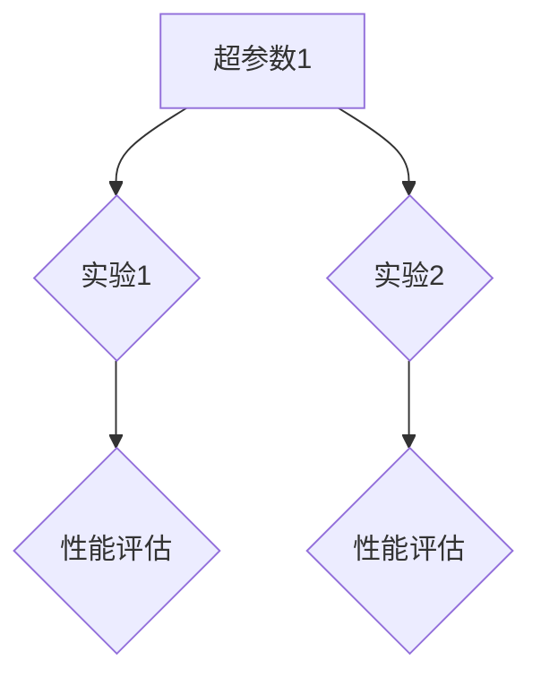

###### 2.2.2.2 正则化技术

正则化技术是防止模型过拟合的重要手段。常见的正则化技术包括L1正则化、L2正则化等。

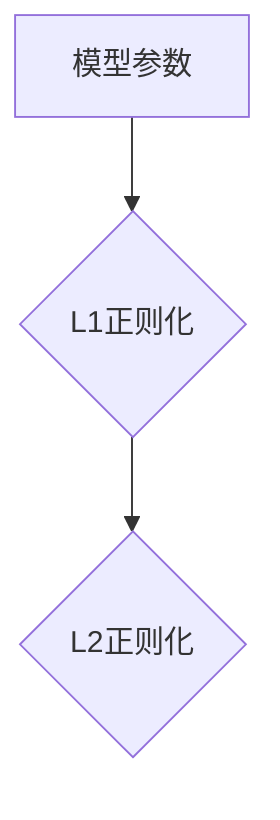

###### 2.2.2.3 批量归一化

批量归一化是一种常用的数据预处理技术，其通过将每个数据归一化到相同的范围，提高模型训练的稳定性。

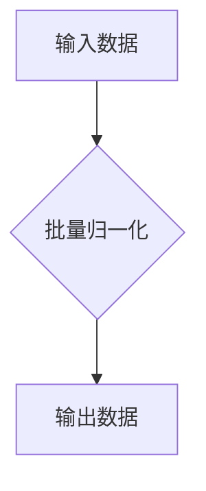

##### 2.2.3 模型部署与维护

模型部署是将训练好的AI大模型应用到实际业务场景的关键。创业者需要了解模型部署的方法、策略，以及如何维护模型性能。

###### 2.2.3.1 模型部署方法

模型部署方法包括本地部署、云部署等。本地部署适用于资源有限的场景，而云部署适用于需要大规模计算的场景。

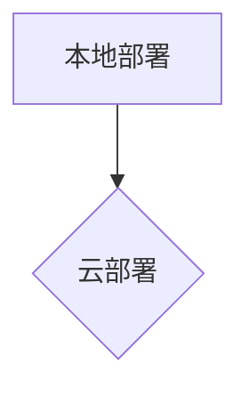

###### 2.2.3.2 模型部署策略

模型部署策略包括模型版本管理、模型监控等。创业者需要确保模型在部署过程中能够稳定运行，并能够快速响应业务需求。

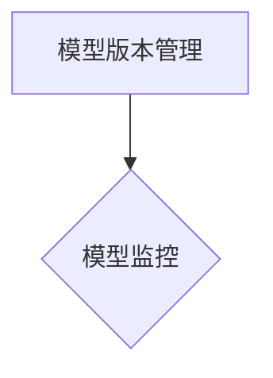

###### 2.2.3.3 模型维护

模型维护包括更新模型、修复漏洞等。创业者需要定期对模型进行评估，确保其性能稳定，并及时修复可能存在的问题。

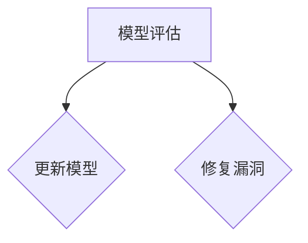

#### 2.3 AI大模型应用案例解析

##### 2.3.1 案例一：基于GPT的智能客服系统

通过GPT模型，企业可以实现自动化的智能客服系统，提高客服效率，降低人力成本。

###### 2.3.1.1 案例背景

某电商企业为了提高客户服务质量，决定引入智能客服系统。

###### 2.3.1.2 模型选择

选择GPT模型作为智能客服系统的核心组件。

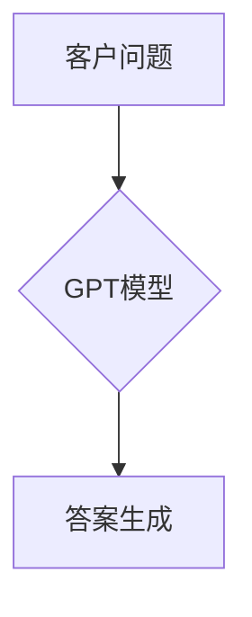

###### 2.3.1.3 模型部署

将GPT模型部署到企业服务器，通过API接口与客服系统进行集成。

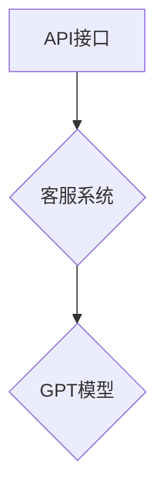

###### 2.3.1.4 模型优化

通过持续训练和优化GPT模型，提高其回答问题的准确性和流畅度。

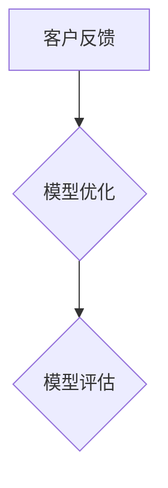

##### 2.3.2 案例二：基于BERT的市场调研

利用BERT模型进行市场调研，企业可以快速了解用户需求、市场趋势，为产品决策提供有力支持。

###### 2.3.2.1 案例背景

某科技公司为了开发新产品，决定进行市场调研。

###### 2.3.2.2 模型选择

选择BERT模型作为市场调研的核心组件。

```mermaid
graph TD
    A[用户评论] --> B{BERT模型}
    B --> C[情感分析]
```

###### 2.3.2.3 模型部署

将BERT模型部署到企业服务器，通过API接口与市场调研系统进行集成。

```mermaid
graph TD
    A[API接口] --> B{市场调研系统}
    B --> C{BERT模型}
```

###### 2.3.2.4 模型优化

通过持续训练和优化BERT模型，提高其分析结果的准确性和可靠性。

```mermaid
graph TD
    A[用户反馈] --> B{模型优化}
    B --> C{模型评估}
```

##### 2.3.3 案例三：基于图像生成模型的品牌宣传

通过图像生成模型，企业可以快速生成各种创意宣传素材，提升品牌形象，增加用户粘性。

###### 2.3.3.1 案例背景

某品牌为了提升品牌形象，决定利用图像生成模型进行品牌宣传。

###### 2.3.3.2 模型选择

选择图像生成模型（如StyleGAN）作为品牌宣传的核心组件。

```mermaid
graph TD
    A[品牌元素] --> B{图像生成模型}
    B --> C[图像生成]
```

###### 2.3.3.3 模型部署

将图像生成模型部署到企业服务器，通过API接口与品牌宣传系统进行集成。

```mermaid
graph TD
    A[API接口] --> B{品牌宣传系统}
    B --> C{图像生成模型}
```

###### 2.3.3.4 模型优化

通过持续训练和优化图像生成模型，提高其生成图像的质量和创意度。

```mermaid
graph TD
    A[用户反馈] --> B{模型优化}
    B --> C{模型评估}
```

---

## 第三部分：AI大模型创业战略规划

### 第3章: AI大模型创业战略规划

#### 3.1 创业战略的制定

##### 3.1.1 市场调研与分析

创业者需要了解市场需求、竞争态势等，为制定创业战略提供依据。

###### 3.1.1.1 市场调研方法

市场调研方法包括问卷调查、访谈、数据分析等。创业者可以通过这些方法收集用户需求、市场趋势等信息。

```mermaid
graph TD
    A[问卷调查] --> B{访谈}
    A --> C{数据分析}
```

###### 3.1.1.2 市场分析工具

市场分析工具包括SWOT分析、PEST分析等。创业者可以通过这些工具分析自身优势和劣势、市场机会和威胁。

```mermaid
graph TD
    A[SWOT分析] --> B{PEST分析}
```

##### 3.1.2 创业愿景与目标

明确创业愿景与目标，有助于创业者保持专注，推动创业项目取得成功。

###### 3.1.2.1 愿景

愿景是创业者对未来企业的愿景，如“成为人工智能领域的领导者”。

```mermaid
graph TD
    A[愿景] --> B{目标}
```

###### 3.1.2.2 目标

目标是具体、可衡量的，如“在三年内实现盈利”。

```mermaid
graph TD
    A[目标1] --> B{目标2}
    A --> C{目标3}
```

##### 3.1.3 创业路线图

制定详细的创业路线图，明确各个阶段的目标、任务、时间节点等，有助于创业者有序推进创业项目。

###### 3.1.3.1 创业路线图要素

创业路线图包括产品规划、市场推广、团队建设等要素。

```mermaid
graph TD
    A[产品规划] --> B{市场推广}
    A --> C{团队建设}
```

###### 3.1.3.2 时间节点

创业路线图需要明确各个阶段的时间节点，如产品发布、市场推广等。

```mermaid
graph TD
    A[阶段1] --> B{时间节点1}
    A --> C{时间节点2}
```

#### 3.2 创业团队的建设与管理

##### 3.2.1 团队组建

创业者需要根据创业项目的需求，组建合适的团队，包括技术团队、市场团队、运营团队等。

###### 3.2.1.1 团队成员角色

团队成员角色包括项目经理、技术专家、产品经理、市场营销专家等。

```mermaid
graph TD
    A[项目经理] --> B{技术专家}
    A --> C{产品经理}
    A --> D{市场营销专家}
```

###### 3.2.1.2 团队组建策略

团队组建策略包括内部招聘、外部招聘等。创业者需要根据实际情况选择合适的组建策略。

```mermaid
graph TD
    A[内部招聘] --> B{外部招聘}
```

##### 3.2.2 团队管理

创业者需要掌握团队管理的方法，如沟通、激励、绩效评估等，以确保团队高效协同工作。

###### 3.2.2.1 沟通方法

沟通方法包括会议、邮件、即时通讯等。创业者需要选择合适的沟通方式，提高团队协作效率。

```mermaid
graph TD
    A[会议] --> B{邮件}
    A --> C{即时通讯}
```

###### 3.2.2.2 激励方法

激励方法包括薪酬激励、荣誉激励、成长激励等。创业者需要根据团队成员的特点和需求，制定合适的激励策略。

```mermaid
graph TD
    A[薪酬激励] --> B{荣誉激励}
    A --> C{成长激励}
```

###### 3.2.2.3 绩效评估

绩效评估是团队管理的重要环节，创业者需要制定合理的绩效评估标准，激励团队成员不断进步。

```mermaid
graph TD
    A[绩效评估标准] --> B{绩效评估结果}
```

##### 3.2.3 人才引进与培养

创业者需要关注人才引进与培养，为团队注入新鲜血液，提升团队整体实力。

###### 3.2.3.1 人才引进策略

人才引进策略包括招聘会、社交媒体、猎头等。创业者需要根据团队需求和人才市场情况，选择合适的人才引进策略。

```mermaid
graph TD
    A[招聘会] --> B{社交媒体}
    A --> C{猎头}
```

###### 3.2.3.2 人才培养计划

人才培养计划包括培训、项目实践、导师制度等。创业者需要制定详细的培养计划，提升团队成员的专业能力和综合素质。

```mermaid
graph TD
    A[培训] --> B{项目实践}
    A --> C{导师制度}
```

#### 3.3 创业过程中的风险管理

##### 3.3.1 市场风险

创业者需要关注市场变化，如需求波动、竞争加剧等，及时调整创业策略。

###### 3.3.1.1 市场风险识别

市场风险识别是风险管理的第一步，创业者需要了解潜在的市场风险，如技术风险、市场饱和等。

```mermaid
graph TD
    A[技术风险] --> B{市场饱和}
```

###### 3.3.1.2 市场风险应对策略

市场风险应对策略包括市场调研、产品迭代、业务多元化等。创业者需要根据市场风险的特点，制定相应的应对策略。

```mermaid
graph TD
    A[市场调研] --> B{产品迭代}
    A --> C{业务多元化}
```

##### 3.3.2 技术风险

创业者需要关注技术风险，如技术迭代、技术瓶颈等，确保创业项目的持续发展。

###### 3.3.2.1 技术风险识别

技术风险识别是风险管理的关键，创业者需要了解潜在的技术风险，如技术落后、专利纠纷等。

```mermaid
graph TD
    A[技术落后] --> B{专利纠纷}
```

###### 3.3.2.2 技术风险应对策略

技术风险应对策略包括技术创新、技术储备、知识产权保护等。创业者需要根据技术风险的特点，制定相应的应对策略。

```mermaid
graph TD
    A[技术创新] --> B{技术储备}
    A --> C{知识产权保护}
```

##### 3.3.3 财务风险

创业者需要关注财务风险，如资金链断裂、成本超支等，确保创业项目的资金安全。

###### 3.3.3.1 财务风险识别

财务风险识别是财务管理的第一步，创业者需要了解潜在的财务风险，如现金流紧张、投资失败等。

```mermaid
graph TD
    A[现金流紧张] --> B{投资失败}
```

###### 3.3.3.2 财务风险应对策略

财务风险应对策略包括财务规划、风险投资、融资策略等。创业者需要根据财务风险的特点，制定相应的应对策略。

```mermaid
graph TD
    A[财务规划] --> B{风险投资}
    A --> C{融资策略}
```

---

## 第四部分：AI大模型创业的案例分析

### 第4章: AI大模型创业的案例分析

#### 4.1 案例一：AI助手创业之路

##### 4.1.1 创业背景

随着人工智能技术的不断发展，智能助手成为热门领域。创业者李明决定抓住这一机遇，创办一家智能助手公司。

###### 4.1.1.1 市场需求

智能助手可以帮助企业提高工作效率，减少人力成本。市场需求巨大，但竞争也激烈。

```mermaid
graph TD
    A[市场需求] --> B{竞争激烈}
```

##### 4.1.2 创业战略

李明制定了以下创业战略：

1. 市场定位：专注于为企业提供定制化的智能助手解决方案。
2. 产品规划：开发具备语音识别、自然语言处理、多语言支持等功能的智能助手。
3. 营销策略：通过线上线下渠道进行市场推广，与合作伙伴共同推广。

```mermaid
graph TD
    A[市场定位] --> B{产品规划}
    A --> C{营销策略}
```

##### 4.1.3 创业过程

李明创业过程主要包括以下几个阶段：

1. 团队组建：招聘技术人才、市场人才等，组建创业团队。
2. 技术研发：开发智能助手核心功能，如语音识别、自然语言处理等。
3. 产品测试：进行产品测试，收集用户反馈，优化产品功能。
4. 市场推广：通过线上线下渠道进行市场推广，吸引潜在客户。

```mermaid
graph TD
    A[团队组建] --> B{技术研发}
    B --> C{产品测试}
    C --> D{市场推广}
```

##### 4.1.4 创业成果

经过一段时间的努力，李明的智能助手公司取得以下成果：

1. 获得多家企业客户的订单，实现盈利。
2. 产品在市场上获得好评，知名度提升。
3. 团队成员不断成长，技术实力增强。

```mermaid
graph TD
    A[订单增加] --> B{盈利实现}
    A --> C{好评如潮}
    A --> D{团队成长}
```

#### 4.2 案例二：AI医疗创业之旅

##### 4.2.1 创业背景

随着人工智能技术的进步，医疗领域迎来了新的发展机遇。创业者王磊决定利用AI技术，创办一家医疗科技公司。

###### 4.2.1.1 市场需求

AI医疗技术可以帮助医生提高诊断准确率，提高医疗效率。市场需求巨大，但技术门槛较高。

```mermaid
graph TD
    A[市场需求] --> B{技术门槛}
```

##### 4.2.2 创业战略

王磊制定了以下创业战略：

1. 市场定位：专注于为企业提供AI医疗诊断解决方案。
2. 产品规划：开发具备图像识别、自然语言处理等功能的AI医疗诊断系统。
3. 营销策略：与医疗机构合作，推广AI医疗诊断系统。

```mermaid
graph TD
    A[市场定位] --> B{产品规划}
    A --> C{营销策略}
```

##### 4.2.3 创业过程

王磊创业过程主要包括以下几个阶段：

1. 团队组建：招聘技术人才、医生等，组建创业团队。
2. 技术研发：开发AI医疗诊断系统的核心功能，如图像识别、自然语言处理等。
3. 产品测试：进行产品测试，收集医生和患者的反馈，优化产品功能。
4. 市场推广：与医疗机构合作，推广AI医疗诊断系统。

```mermaid
graph TD
    A[团队组建] --> B{技术研发}
    B --> C{产品测试}
    C --> D{市场推广}
```

##### 4.2.4 创业成果

经过一段时间的努力，王磊的医疗科技公司取得以下成果：

1. 与多家医疗机构达成合作协议，实现销售收入。
2. 产品在市场上获得好评，知名度提升。
3. 团队成员不断成长，技术实力增强。

```mermaid
graph TD
    A[合作协议] --> B{销售收入}
    A --> C{好评如潮}
    A --> D{团队成长}
```

#### 4.3 案例三：AI教育创业之路

##### 4.3.1 创业背景

随着在线教育的普及，AI技术在教育领域的应用越来越广泛。创业者张晓决定利用AI技术，创办一家在线教育平台。

###### 4.3.1.1 市场需求

AI教育技术可以帮助学生提高学习效果，提高教育质量。市场需求巨大，但技术门槛较高。

```mermaid
graph TD
    A[市场需求] --> B{技术门槛}
```

##### 4.3.2 创业战略

张晓制定了以下创业战略：

1. 市场定位：专注于为学生提供个性化AI教育服务。
2. 产品规划：开发具备智能推荐、自动批改等功能的AI教育平台。
3. 营销策略：通过线上线下渠道进行市场推广，吸引学生和家长。

```mermaid
graph TD
    A[市场定位] --> B{产品规划}
    A --> C{营销策略}
```

##### 4.3.3 创业过程

张晓创业过程主要包括以下几个阶段：

1. 团队组建：招聘技术人才、教育专家等，组建创业团队。
2. 技术研发：开发AI教育平台的核心功能，如智能推荐、自动批改等。
3. 产品测试：进行产品测试，收集学生和家长的反馈，优化产品功能。
4. 市场推广：通过线上线下渠道进行市场推广，吸引学生和家长。

```mermaid
graph TD
    A[团队组建] --> B{技术研发}
    B --> C{产品测试}
    C --> D{市场推广}
```

##### 4.3.4 创业成果

经过一段时间的努力，张晓的在线教育平台取得以下成果：

1. 吸引大量学生和家长注册，实现用户增长。
2. 产品在市场上获得好评，知名度提升。
3. 团队成员不断成长，技术实力增强。

```mermaid
graph TD
    A[用户增长] --> B{好评如潮}
    A --> C{团队成长}
```

---

## 第五部分：AI大模型创业法律与伦理问题

### 第5章: AI大模型创业法律与伦理问题

#### 5.1 AI大模型创业的法律问题

##### 5.1.1 知识产权保护

创业者需要了解知识产权保护的相关法律法规，如版权法、专利法等，确保自己的创新成果得到保护。

###### 5.1.1.1 知识产权类型

知识产权包括专利、商标、版权、商业秘密等。创业者需要根据业务需求，保护相应的知识产权。

```mermaid
graph TD
    A[专利] --> B{商标}
    A --> C{版权}
    A --> D{商业秘密}
```

###### 5.1.1.2 知识产权保护措施

知识产权保护措施包括申请专利、注册商标、签订保密协议等。创业者需要采取相应的措施，保护自己的知识产权。

```mermaid
graph TD
    A[申请专利] --> B{注册商标}
    A --> C{签订保密协议}
```

##### 5.1.2 数据保护

创业者需要关注数据保护的相关法律法规，如《通用数据保护条例》（GDPR）等，确保用户数据的安全。

###### 5.1.2.1 数据保护法规

数据保护法规包括《通用数据保护条例》（GDPR）、《网络安全法》等。创业者需要了解这些法规，确保数据处理合法。

```mermaid
graph TD
    A[GDPR] --> B{网络安全法}
```

###### 5.1.2.2 数据保护措施

数据保护措施包括数据加密、用户隐私政策、数据备份等。创业者需要采取相应的措施，保护用户数据安全。

```mermaid
graph TD
    A[数据加密] --> B{用户隐私政策}
    A --> C{数据备份}
```

##### 5.1.3 合同法律风险

创业者需要了解合同法律风险，如合同签订、履行等，确保创业过程中的合同合法性。

###### 5.1.3.1 合同类型

合同类型包括采购合同、合作协议、服务合同等。创业者需要了解不同类型的合同，确保合同签订合法。

```mermaid
graph TD
    A[采购合同] --> B{合作协议}
    A --> C{服务合同}
```

###### 5.1.3.2 合同签订注意事项

合同签订注意事项包括合同条款、签字盖章、合同备案等。创业者需要关注这些注意事项，确保合同签订合法。

```mermaid
graph TD
    A[合同条款] --> B{签字盖章}
    A --> C{合同备案}
```

#### 5.2 AI大模型创业的伦理问题

##### 5.2.1 人工智能伦理原则

创业者需要了解人工智能伦理原则，如透明性、公平性、可解释性等，确保AI大模型的应用符合伦理要求。

###### 5.2.1.1 伦理原则

伦理原则包括透明性、公平性、可解释性、责任性等。创业者需要了解这些伦理原则，确保AI大模型的应用符合伦理要求。

```mermaid
graph TD
    A[透明性] --> B{公平性}
    A --> C{可解释性}
    A --> D{责任性}
```

###### 5.2.1.2 伦理原则应用

伦理原则应用包括数据隐私保护、避免歧视、确保公平等。创业者需要将伦理原则应用到AI大模型的应用过程中。

```mermaid
graph TD
    A[数据隐私保护] --> B{避免歧视}
    A --> C{确保公平}
```

##### 5.2.2 人工智能道德规范

创业者需要遵守人工智能道德规范，如尊重隐私、避免偏见、保护人类利益等，确保AI大模型的应用对社会有益。

###### 5.2.2.1 道德规范

道德规范包括尊重隐私、避免偏见、保护人类利益等。创业者需要了解这些道德规范，确保AI大模型的应用符合道德要求。

```mermaid
graph TD
    A[尊重隐私] --> B{避免偏见}
    A --> C{保护人类利益}
```

###### 5.2.2.2 道德规范应用

道德规范应用包括数据隐私保护、算法公平性、避免偏见等。创业者需要将道德规范应用到AI大模型的应用过程中。

```mermaid
graph TD
    A[数据隐私保护] --> B{算法公平性}
    A --> C{避免偏见}
```

##### 5.2.3 人工智能治理

创业者需要关注人工智能治理，如制定伦理准则、建立监督机制等，确保AI大模型的应用得到有效监管。

###### 5.2.3.1 治理机制

治理机制包括伦理委员会、审计机制、监督机制等。创业者需要了解这些治理机制，确保AI大模型的应用得到有效监管。

```mermaid
graph TD
    A[伦理委员会] --> B{审计机制}
    A --> C{监督机制}
```

###### 5.2.3.2 治理措施

治理措施包括定期评估、用户反馈、伦理培训等。创业者需要采取这些治理措施，确保AI大模型的应用符合伦理要求。

```mermaid
graph TD
    A[定期评估] --> B{用户反馈}
    A --> C{伦理培训}
```

---

## 第六部分：AI大模型创业资源与支持

### 第6章: AI大模型创业资源与支持

#### 6.1 政府支持政策

##### 6.1.1 税收优惠

创业者可以了解政府的税收优惠政策，如研发费用加计扣除、小微企业税收减免等，降低创业成本。

###### 6.1.1.1 税收优惠类型

税收优惠类型包括研发费用加计扣除、小微企业税收减免等。创业者可以根据实际情况选择合适的税收优惠。

```mermaid
graph TD
    A[研发费用加计扣除] --> B{小微企业税收减免}
```

###### 6.1.1.2 税收优惠申请流程

税收优惠申请流程包括提交申请、审核批准、享受优惠等。创业者需要了解申请流程，及时提交申请。

```mermaid
graph TD
    A[提交申请] --> B{审核批准}
    B --> C{享受优惠}
```

##### 6.1.2 创业基金与贷款

创业者可以申请政府的创业基金、贷款等支持，解决创业过程中的资金问题。

###### 6.1.2.1 创业基金

创业基金是指政府设立的资金，用于支持创业者创业。创业者可以申请创业基金，获得资金支持。

```mermaid
graph TD
    A[政府创业基金] --> B{资金支持}
```

###### 6.1.2.2 创业贷款

创业贷款是指政府提供的贷款，用于支持创业者创业。创业者可以申请创业贷款，解决资金问题。

```mermaid
graph TD
    A[政府创业贷款] --> B{资金支持}
```

##### 6.1.3 创业孵化器与创业园

创业者可以利用政府的创业孵化器、创业园等资源，获得办公场所、政策咨询、创业辅导等支持。

###### 6.1.3.1 创业孵化器

创业孵化器是指政府设立的支持创业者创业的机构。创业者可以利用创业孵化器，获得办公场所、政策咨询等支持。

```mermaid
graph TD
    A[创业孵化器] --> B{办公场所}
    A --> C{政策咨询}
```

###### 6.1.3.2 创业园

创业园是指政府设立的支持创业者创业的园区。创业者可以利用创业园，获得办公场所、创业辅导等支持。

```mermaid
graph TD
    A[创业园] --> B{办公场所}
    A --> C{创业辅导}
```

#### 6.2 行业协会与专业组织

##### 6.2.1 行业协会

创业者可以加入行业协会，获取行业动态、政策信息、市场资源等，提升创业竞争力。

###### 6.2.1.1 行业协会优势

行业协会可以提供行业动态、政策信息、市场资源等，帮助创业者了解行业趋势，提升竞争力。

```mermaid
graph TD
    A[行业动态] --> B{政策信息}
    A --> C{市场资源}
```

###### 6.2.1.2 加入行业协会

创业者可以加入行业协会，通过参加活动、交流合作，获取行业资源，提升自身竞争力。

```mermaid
graph TD
    A[参加活动] --> B{交流合作}
```

##### 6.2.2 专业组织

创业者可以加入专业组织，如人工智能协会、计算机学会等，获取专业培训、技术交流、合作机会等。

###### 6.2.2.1 专业组织优势

专业组织可以提供专业培训、技术交流、合作机会等，帮助创业者提升专业能力和竞争力。

```mermaid
graph TD
    A[专业培训] --> B{技术交流}
    A --> C{合作机会}
```

###### 6.2.2.2 加入专业组织

创业者可以加入专业组织，通过参加活动、交流合作，获取专业资源，提升自身竞争力。

```mermaid
graph TD
    A[参加活动] --> B{交流合作}
```

#### 6.3 投资与融资

##### 6.3.1 天使投资

创业者可以寻求天使投资，获得资金支持，推动创业项目发展。

###### 6.3.1.1 天使投资优势

天使投资是指个人投资者对早期创业项目提供资金支持。创业者可以寻求天使投资，获得资金支持，推动创业项目发展。

```mermaid
graph TD
    A[资金支持] --> B{推动创业项目}
```

###### 6.3.1.2 寻求天使投资

创业者可以参加创业比赛、创业交流活动等，寻求天使投资。通过展示项目优势，吸引天使投资。

```mermaid
graph TD
    A[参加比赛] --> B{展示项目优势}
```

##### 6.3.2 风险投资

创业者可以寻求风险投资，获得资金支持，推动创业项目发展。

###### 6.3.2.1 风险投资优势

风险投资是指专业投资机构对高风险、高回报的创业项目提供资金支持。创业者可以寻求风险投资，获得资金支持，推动创业项目发展。

```mermaid
graph TD
    A[资金支持] --> B{推动创业项目}
```

###### 6.3.2.2 寻求风险投资

创业者可以通过创业孵化器、专业组织等渠道，寻求风险投资。通过展示项目优势，吸引风险投资。

```mermaid
graph TD
    A[参加活动] --> B{展示项目优势}
```

##### 6.3.3 股权众筹

创业者可以通过股权众筹，获得资金支持，同时吸引更多潜在客户和合作伙伴。

###### 6.3.3.1 股权众筹优势

股权众筹是指通过互联网平台，向公众发行股权，获得资金支持。创业者可以通过股权众筹，获得资金支持，同时吸引更多潜在客户和合作伙伴。

```mermaid
graph TD
    A[资金支持] --> B{吸引潜在客户}
    A --> C{吸引合作伙伴}
```

###### 6.3.3.2 开展股权众筹

创业者可以通过股权众筹平台，发布项目信息，向公众筹集资金。通过展示项目优势，吸引投资者。

```mermaid
graph TD
    A[发布项目信息] --> B{展示项目优势}
```

---

## 第七部分：AI大模型创业的未来趋势

### 第7章: AI大模型创业的未来趋势

#### 7.1 AI大模型创业的新趋势

##### 7.1.1 人工智能与实体经济深度融合

随着人工智能技术的不断进步，创业者可以探索人工智能与实体经济的深度融合，如智能制造、智能物流等。

###### 7.1.1.1 智能制造

智能制造是指利用人工智能技术，实现生产过程的智能化。创业者可以通过人工智能技术，提高生产效率、降低成本。

```mermaid
graph TD
    A[人工智能技术] --> B{智能制造}
```

###### 7.1.1.2 智能物流

智能物流是指利用人工智能技术，实现物流过程的智能化。创业者可以通过人工智能技术，优化物流路径、提高配送效率。

```mermaid
graph TD
    A[人工智能技术] --> B{智能物流}
```

##### 7.1.2 个性化与定制化服务

随着数据积累和模型优化，创业者可以提供更加个性化、定制化的服务，满足用户多元化需求。

###### 7.1.2.1 个性化服务

个性化服务是指根据用户需求，提供定制化的服务。创业者可以通过人工智能技术，实现个性化推荐、个性化定制等。

```mermaid
graph TD
    A[用户需求] --> B{个性化服务}
```

###### 7.1.2.2 定制化服务

定制化服务是指根据用户需求，提供定制化的解决方案。创业者可以通过人工智能技术，实现定制化开发、定制化部署等。

```mermaid
graph TD
    A[用户需求] --> B{定制化服务}
```

##### 7.1.3 人工智能安全与伦理问题

随着人工智能应用的普及，创业者需要关注人工智能安全与伦理问题，确保人工智能技术得到合理、合规的应用。

###### 7.1.3.1 人工智能安全

人工智能安全是指确保人工智能系统的安全、稳定、可靠。创业者需要关注人工智能安全，防止人工智能系统被恶意攻击、滥用。

```mermaid
graph TD
    A[人工智能系统] --> B{安全防护}
```

###### 7.1.3.2 人工智能伦理

人工智能伦理是指确保人工智能技术的应用符合伦理要求。创业者需要关注人工智能伦理，确保人工智能技术得到合理、合规的应用。

```mermaid
graph TD
    A[人工智能技术] --> B{伦理要求}
```

#### 7.2 创业者面临的挑战与应对策略

##### 7.2.1 技术挑战

创业者需要不断学习新技术、新方法，提升自身技术能力，以应对快速变化的市场需求。

###### 7.2.1.1 技术学习

创业者可以通过参加技术培训、阅读技术书籍、关注技术社区等，不断学习新技术、新方法。

```mermaid
graph TD
    A[技术培训] --> B{技术书籍}
    A --> C{技术社区}
```

###### 7.2.1.2 技术创新

创业者需要通过技术创新，提升自身竞争力，应对市场竞争。

```mermaid
graph TD
    A[技术创新] --> B{竞争力提升}
```

##### 7.2.2 市场挑战

创业者需要深入了解市场需求、竞争态势，制定科学的市场策略，提高市场占有率。

###### 7.2.2.1 市场调研

创业者可以通过市场调研，了解市场需求、竞争态势，为制定市场策略提供依据。

```mermaid
graph TD
    A[市场调研] --> B{市场策略}
```

###### 7.2.2.2 市场策略

创业者需要根据市场需求、竞争态势，制定科学的市场策略，提高市场占有率。

```mermaid
graph TD
    A[市场策略] --> B{市场占有率提升}
```

##### 7.2.3 人才挑战

创业者需要关注人才引进与培养，建立高效的团队，以应对创业过程中的各种挑战。

###### 7.2.3.1 人才引进

创业者可以通过招聘、合作等方式，引进优秀人才，提升团队实力。

```mermaid
graph TD
    A[招聘] --> B{合作}
```

###### 7.2.3.2 人才培养

创业者需要通过培训、激励等方式，培养团队人才，提升团队整体实力。

```mermaid
graph TD
    A[培训] --> B{激励}
```

---

## 附录

### 附录 A: AI大模型创业资源与工具

#### A.1 开源框架与库

- TensorFlow
- PyTorch
- Keras
- Scikit-learn

#### A.2 机器学习平台

- Google Cloud ML Engine
- AWS SageMaker
- Azure ML

#### A.3 数据集与资源

- Kaggle
- UCI Machine Learning Repository
- OpenML

#### A.4 创业支持平台

- GitHub
- GitLab
- Startup Digest

#### A.5 投资与融资平台

- AngelList
- Crunchbase
- LinkedIn

---

### 附录 B: AI大模型创业建议

#### B.1 建议一：深入了解市场需求

创业者需要深入了解市场需求，了解用户需求、行业趋势等，为创业项目提供方向。

#### B.2 建议二：注重技术创新

创业者需要注重技术创新，不断提升自身技术能力，以应对市场竞争。

#### B.3 建议三：建立高效团队

创业者需要建立高效团队，关注人才引进与培养，以应对创业过程中的各种挑战。

#### B.4 建议四：积极寻求资源支持

创业者可以积极寻求政府、行业协会、投资机构等资源支持，为创业项目提供帮助。

---

### 附录 C: 常见问题与解答

#### Q1: AI大模型创业需要哪些技术基础？

A1: AI大模型创业需要掌握神经网络、深度学习、大规模预训练模型等基本技术。创业者还需要了解模型开发、优化、部署等流程。

#### Q2: AI大模型创业过程中有哪些法律和伦理问题？

A2: AI大模型创业过程中需要关注知识产权保护、数据保护、合同法律风险等法律问题。同时，需要遵守人工智能伦理原则，如透明性、公平性、可解释性等。

#### Q3: 如何寻求创业资源与支持？

A3: 创业者可以通过政府支持政策、创业孵化器、专业组织、投资与融资平台等途径，寻求创业资源与支持。例如，可以申请政府创业基金、加入行业协会、寻求天使投资等。

---

### 附录 D: AI大模型创业案例库

#### D.1 案例一：智能客服系统

- 项目概述：利用GPT模型实现智能客服系统，提高客服效率。
- 技术实现：采用GPT模型进行文本生成，通过API接口与客服系统集成。
- 创业成果：提高客服效率，降低人力成本。

#### D.2 案例二：市场调研

- 项目概述：利用BERT模型进行市场调研，快速了解用户需求。
- 技术实现：采用BERT模型进行情感分析，通过API接口与市场调研系统集成。
- 创业成果：提高市场调研准确性，为产品决策提供有力支持。

#### D.3 案例三：品牌宣传

- 项目概述：利用图像生成模型进行品牌宣传，提升品牌形象。
- 技术实现：采用图像生成模型（如StyleGAN）生成创意宣传素材。
- 创业成果：提高品牌宣传效果，增加用户粘性。

---

### 作者

**作者：AI天才研究院/AI Genius Institute & 禅与计算机程序设计艺术 /Zen And The Art of Computer Programming**### AI大模型创业：如何利用创新优势？

#### 摘要

本文将深入探讨AI大模型创业的各个方面，包括AI大模型的定义与重要性、创业者所需的技术基础、创业战略规划、法律与伦理问题，以及创业的资源与支持。通过详细的案例分析，我们将揭示AI大模型创业的实际路径和挑战，并提供实用的建议和策略，帮助创业者利用AI大模型的优势，实现创新与突破。

#### 第一部分：AI大模型创业概述

##### 第1章: AI大模型与创业

###### 1.1 AI大模型的定义与重要性

AI大模型是指那些规模庞大、参数数量极其丰富的神经网络模型，如GPT、BERT等。这些模型通过对海量数据的训练，能够实现高度复杂的任务，如文本生成、图像识别、自然语言处理等。AI大模型的出现，不仅推动了人工智能领域的发展，也为创业者提供了新的机遇。

**AI大模型的定义：**
AI大模型通常指的是具有数十亿甚至数千亿参数的深度学习模型。这些模型可以处理大规模的数据集，并通过大规模的并行计算来加速训练过程。典型的AI大模型包括GPT、BERT、GPT-2、GPT-3等。

**AI大模型的重要性：**
AI大模型的重要性体现在以下几个方面：

1. **强大的数据处理能力：** AI大模型能够处理和解析大量的数据，这使得它们在文本和图像等数据密集型任务中表现出色。
2. **高效的模型性能：** 大模型的深度和宽度使其能够捕捉数据的复杂特征，从而在多种任务中实现更高的准确率。
3. **创新的业务模式：** AI大模型的应用可以帮助企业创造出全新的业务模式和产品，提高市场竞争力。

###### 1.2 AI大模型在创业中的应用

AI大模型在创业中的应用非常广泛，以下是一些关键的应用领域：

**AI大模型在产品开发中的应用：**
AI大模型可以帮助创业者快速构建原型，加速产品迭代。例如，使用GPT模型可以自动生成产品文档、广告文案等。使用BERT模型可以进行文本分析，帮助优化产品描述和用户反馈。

**AI大模型在数据分析中的应用：**
AI大模型可以对大量数据进行深入分析，帮助创业者提取有价值的信息。例如，通过聚类分析和关联规则挖掘，可以识别潜在的市场趋势和用户需求。

**AI大模型在服务设计中的应用：**
AI大模型可以为企业提供智能客服、智能推荐等服务。例如，利用GPT模型可以开发智能聊天机器人，提高客户服务水平。利用BERT模型可以进行情感分析，帮助优化用户体验。

###### 1.3 创业过程中的AI大模型挑战

虽然AI大模型为创业提供了巨大机遇，但也伴随着一系列挑战：

**数据隐私与伦理问题：**
在利用AI大模型进行创业时，数据隐私和伦理问题至关重要。创业者需要确保用户数据的安全，避免数据滥用，并遵守相关的法律法规。

**模型选择与优化：**
选择合适的AI大模型，并进行优化，是创业成功的关键。创业者需要了解不同模型的特点和应用场景，选择最适合的模型，并通过超参数调整和正则化技术来优化模型性能。

**技术瓶颈与资源限制：**
AI大模型训练和推理需要大量的计算资源和时间。对于初创企业来说，如何解决这些技术瓶颈和资源限制，是创业过程中的重要挑战。

###### 1.4 创业中的AI大模型案例分享

**案例一：利用GPT模型进行文本生成**

某初创公司利用GPT模型开发了自动文本生成系统，用于生成产品文档、广告文案等。通过这个系统，公司可以快速响应市场需求，提高内容创作效率，降低了人力成本。

**案例二：利用BERT模型进行情感分析**

另一家初创公司利用BERT模型开发了情感分析平台，用于分析用户反馈和社交媒体上的评论。通过这个平台，公司可以实时了解用户情绪，优化产品设计和营销策略。

**案例三：利用图像生成模型进行创意设计**

一家创意设计公司利用图像生成模型（如GAN）开发了自动化设计工具，用于生成广告海报、产品包装等。通过这个工具，公司可以快速生成多种设计方案，提高设计效率，满足客户的多样化需求。

---

#### 第二部分：创业者所需的AI大模型技术基础

##### 第2章: 创业者所需的AI大模型技术基础

###### 2.1 AI大模型的基本原理

**神经网络基础**

神经网络是AI大模型的基础，包括神经元、激活函数、反向传播算法等。

**深度学习原理**

深度学习是构建AI大模型的核心技术，包括多层神经网络、卷积神经网络（CNN）、循环神经网络（RNN）等。

**大规模预训练模型**

大规模预训练模型是AI大模型的重要方向，如GPT、BERT等。

###### 2.2 AI大模型的开发与优化

**模型开发流程**

模型开发包括数据准备、模型选择、训练与优化等步骤。

**模型优化技巧**

模型优化是提升AI大模型性能的关键，包括超参数调整、正则化技术、批量归一化等。

**模型部署与维护**

模型部署是将训练好的AI大模型应用到实际业务场景的关键。

---

#### 第三部分：AI大模型创业战略规划

##### 第3章: AI大模型创业战略规划

###### 3.1 创业战略的制定

**市场调研与分析**

**创业愿景与目标**

**创业路线图**

###### 3.2 创业团队的建设与管理

**团队组建**

**团队管理**

**人才引进与培养**

###### 3.3 创业过程中的风险管理

**市场风险**

**技术风险**

**财务风险**

---

#### 第四部分：AI大模型创业的案例分析

##### 第4章: AI大模型创业的案例分析

**案例一：AI助手创业之路**

**案例二：AI医疗创业之旅**

**案例三：AI教育创业之路**

---

#### 第五部分：AI大模型创业法律与伦理问题

##### 第5章: AI大模型创业法律与伦理问题

###### 5.1 AI大模型创业的法律问题

**知识产权保护**

**数据保护**

**合同法律风险**

###### 5.2 AI大模型创业的伦理问题

**人工智能伦理原则**

**人工智能道德规范**

**人工智能治理**

---

#### 第六部分：AI大模型创业资源与支持

##### 第6章: AI大模型创业资源与支持

###### 6.1 政府支持政策

**税收优惠**

**创业基金与贷款**

**创业孵化器与创业园**

###### 6.2 行业协会与专业组织

**行业协会**

**专业组织**

###### 6.3 投资与融资

**天使投资**

**风险投资**

**股权众筹**

---

#### 第七部分：AI大模型创业的未来趋势

##### 第7章: AI大模型创业的未来趋势

###### 7.1 AI大模型创业的新趋势

**人工智能与实体经济深度融合**

**个性化与定制化服务**

**人工智能安全与伦理问题**

###### 7.2 创业者面临的挑战与应对策略

**技术挑战**

**市场挑战**

**人才挑战**

---

#### 附录

**附录 A: AI大模型创业资源与工具**

**附录 B: AI大模型创业建议**

**附录 C: 常见问题与解答**

**附录 D: AI大模型创业案例库**

**作者**

**作者：AI天才研究院/AI Genius Institute & 禅与计算机程序设计艺术 /Zen And The Art of Computer Programming**## AI大模型创业战略规划

在AI大模型创业的道路上，战略规划是至关重要的。一个明确且可行的战略规划不仅能为企业的发展提供方向，还能帮助创业者更好地应对市场变化和竞争挑战。本章将深入探讨创业战略的制定、团队建设与管理，以及风险管理等关键环节。

### 第3章: AI大模型创业战略规划

#### 3.1 市场调研与分析

市场调研与分析是创业战略规划的基础。通过深入了解市场需求、竞争态势和潜在客户，创业者可以制定出更具针对性的战略。

**市场调研方法：**

1. **问卷调查：** 通过设计有针对性的问卷，收集潜在客户的需求和反馈。
2. **访谈：** 直接与潜在客户进行面对面交流，获取更深入的见解。
3. **数据分析：** 利用大数据分析工具，分析市场趋势和用户行为。

**市场分析工具：**

1. **SWOT分析：** 分析企业的优势（Strengths）、劣势（Weaknesses）、机会（Opportunities）和威胁（Threats）。
2. **PEST分析：** 分析企业的政治（Political）、经济（Economic）、社会（Societal）和技术（Technological）环境。

**市场调研与分析的重要性：**

- **了解市场需求：** 通过市场调研，创业者可以准确把握市场需求，从而提供更符合用户期望的产品和服务。
- **竞争分析：** 了解竞争对手的优势和劣势，有助于制定有效的竞争策略。

#### 3.2 创业愿景与目标

明确的创业愿景与目标是创业成功的关键。创业愿景应描述企业长远的目标和使命，而目标则应具体、可衡量。

**创业愿景：**

- **描述企业未来的理想状态：** 例如，“成为全球领先的AI大模型解决方案提供商”。
- **激发团队成员的激情：** 一个鼓舞人心的愿景能够激励团队成员共同努力。

**创业目标：**

- **具体、可衡量：** 例如，“在三年内实现盈利”、“在一年内获得首批客户”。
- **实现步骤：** 明确实现目标所需的步骤和时间表。

**创业愿景与目标的重要性：**

- **指导企业行为：** 愿景和目标为企业提供了清晰的发展方向。
- **评估绩效：** 通过与愿景和目标的对比，创业者可以评估企业的绩效。

#### 3.3 创业路线图

创业路线图是一个详细的计划，描述了企业在各个阶段的目标、任务和时间节点。

**创业路线图要素：**

1. **产品规划：** 包括产品的开发、测试和发布。
2. **市场推广：** 包括市场调研、品牌宣传和渠道拓展。
3. **团队建设：** 包括招聘、培训和团队管理。

**创业路线图的重要性：**

- **有序推进：** 通过创业路线图，企业可以有条不紊地推进各个阶段的任务。
- **资源分配：** 有助于合理分配资源，确保企业能够高效运营。

#### 3.4 创业团队的建设与管理

创业团队是企业的核心，团队的建设与管理直接影响到企业的成败。

**团队组建：**

- **角色明确：** 根据企业需求，明确团队成员的角色和职责。
- **多元化：** 确保团队具有多样化的技能和背景，以应对各种挑战。

**团队管理：**

- **沟通：** 保持团队成员之间的有效沟通，确保信息的畅通。
- **激励：** 通过激励机制，激发团队成员的积极性和创造力。

**人才引进与培养：**

- **招聘：** 通过多种渠道招聘优秀人才，确保团队的专业能力。
- **培训：** 定期组织培训，提升团队成员的专业技能。

**团队建设与管理的重要性：**

- **协作：** 高效的团队协作能够提高企业的整体效率。
- **创新能力：** 一个充满活力的团队能够不断推动企业的创新。

#### 3.5 创业过程中的风险管理

创业过程中充满了不确定性，风险管理是确保企业持续发展的关键。

**市场风险：**

- **需求波动：** 通过市场调研，及时调整产品策略。
- **竞争加剧：** 通过差异化策略，提升企业竞争力。

**技术风险：**

- **技术迭代：** 不断跟进最新技术趋势，保持技术领先。
- **技术瓶颈：** 通过技术研发，突破技术瓶颈。

**财务风险：**

- **资金链断裂：** 通过合理规划资金，确保企业的资金安全。
- **成本超支：** 通过精细化管理，控制成本。

**风险管理的重要性：**

- **确保企业生存：** 通过有效的风险管理，企业能够应对各种风险，确保持续发展。
- **提高竞争力：** 通过风险管理，企业能够保持竞争优势。

### 结论

AI大模型创业战略规划是一个复杂但必要的过程。通过深入的市场调研与分析，明确的创业愿景与目标，详细的创业路线图，高效的团队建设与管理，以及有效的风险管理，创业者可以更好地把握市场机遇，应对挑战，实现企业的持续发展。在AI大模型创业的道路上，战略规划是不可或缺的一部分。

---

**Mermaid流程图示例：**

```mermaid
graph TD
    A[市场调研] --> B{数据收集}
    A --> C{数据分析}
    B --> D{需求分析}
    C --> D
    A --> E{竞争分析}
    B --> F{用户反馈}
    C --> F
```

**神经网络基础概念图：**

```mermaid
graph TD
    A[输入层] --> B{隐藏层1}
    B --> C{激活函数}
    C --> D{隐藏层2}
    D --> E{激活函数}
    E --> F[输出层]
```

**深度学习模型架构图：**

```mermaid
graph TD
    A[输入层] --> B{卷积层1}
    B --> C{池化层1}
    C --> D{卷积层2}
    D --> E{池化层2}
    E --> F[全连接层]
    F --> G{输出层}
```

**创业愿景与目标图：**

```mermaid
graph TD
    A[创业愿景] --> B{长远目标}
    A --> C{短期目标}
    B --> D{使命}
    C --> D
```

**创业路线图图：**

```mermaid
graph TD
    A[产品规划] --> B{研发阶段}
    A --> C{测试阶段}
    A --> D{发布阶段}
    B --> E{市场推广阶段}
    C --> F{团队建设阶段}
    D --> G{运营阶段}
```

**团队管理图：**

```mermaid
graph TD
    A[沟通] --> B{信息畅通}
    A --> C{协作}
    B --> D{合作效率}
    A --> E{激励}
    E --> F{积极性}
```

**风险管理图：**

```mermaid
graph TD
    A[市场风险] --> B{需求波动}
    A --> C{竞争加剧}
    B --> D{差异化策略}
    C --> D
    A --> E{技术风险} --> F{技术迭代}
    E --> G{技术瓶颈}
    A --> H{财务风险} --> I{资金链断裂}
    H --> J{成本超支}
```

通过这些图表和伪代码，我们可以更加清晰地理解AI大模型创业战略规划的关键概念和步骤。在实际应用中，这些工具可以帮助创业者更好地规划和管理创业项目，提高成功率。

