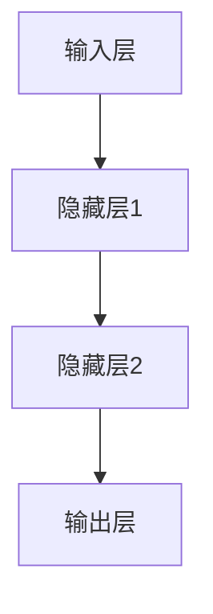
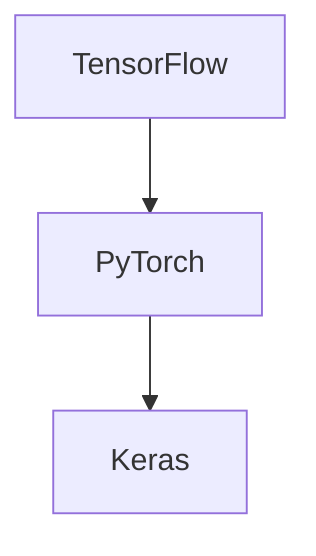
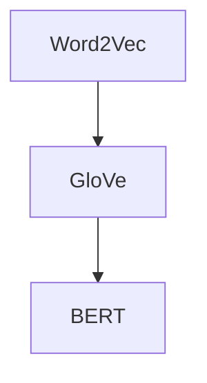
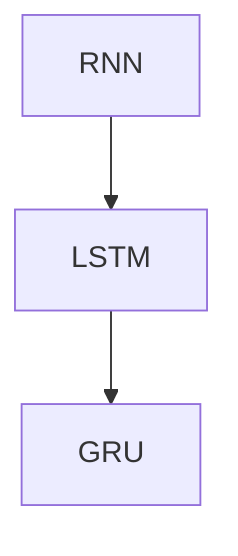
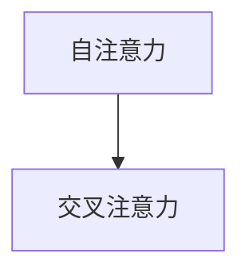
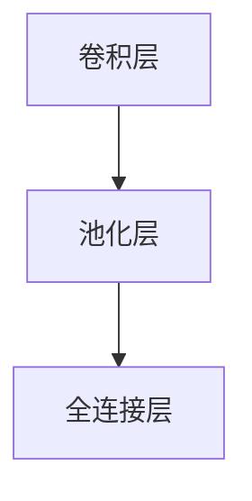
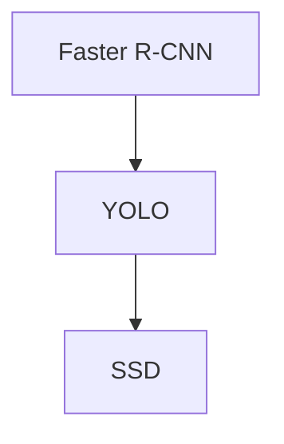
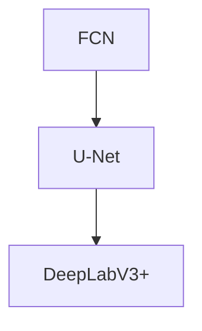

                 

### 文章标题

AI 大模型创业：如何利用科技优势？

> **关键词：** AI大模型，创业，科技优势，深度学习，神经网络，预训练模型，应用实践，案例分析。

**摘要：** 本篇文章旨在探讨AI大模型创业的核心要素，包括技术优势、市场机会和创业策略。文章首先概述了AI大模型的基本原理和关键技术，然后分析了创业中的挑战和风险，提供了具体的创业实践案例，并展望了未来的发展趋势。文章旨在为创业者提供有价值的指导，帮助他们在AI大模型领域取得成功。

----------------------------------------------------------------

### 第一部分: AI大模型基础

在这一部分，我们将深入探讨AI大模型的基础知识，包括其发展历程、基本原理和关键挑战。通过这一部分的阅读，读者将能够理解AI大模型的核心概念，为其在创业中的应用奠定基础。

#### 第1章: AI大模型概述

##### 1.1 AI大模型的发展历程

###### 1.1.1 AI大模型的起源

AI大模型的发展可以追溯到20世纪80年代，当时人工智能领域开始出现一些早期的神经网络模型。然而，由于计算能力和数据资源的限制，这些模型的规模和效果相对较小。随着计算机性能的不断提升和大数据时代的到来，AI大模型的研究和应用迎来了新的契机。

###### 1.1.2 AI大模型的关键技术

AI大模型的发展离不开深度学习、人工神经网络和自监督学习等关键技术。深度学习通过构建多层神经网络，能够自动提取数据中的特征，从而实现复杂的任务。人工神经网络则模拟人脑神经元的工作方式，通过调整连接权重来实现学习和预测。自监督学习则通过利用未标注的数据进行训练，提高了模型的效率和鲁棒性。

###### 1.1.3 AI大模型的应用场景

AI大模型在自然语言处理、计算机视觉、数据分析等领域展现了强大的能力。例如，在自然语言处理方面，AI大模型可以用于文本分类、机器翻译、情感分析等任务；在计算机视觉方面，AI大模型可以用于图像分类、目标检测、图像生成等任务；在数据分析方面，AI大模型可以用于预测分析、推荐系统等任务。

##### 1.2 AI大模型的基本原理

###### 1.2.1 神经网络基础

神经网络是由一系列相互连接的神经元组成的，每个神经元接收多个输入信号，并通过加权求和和激活函数产生输出。神经网络的基本结构包括输入层、隐藏层和输出层，通过不断调整神经元之间的权重，神经网络能够学习和预测数据。

###### 1.2.2 深度学习算法

深度学习算法是神经网络的一种扩展，通过增加网络的深度，提高了模型的预测能力。常见的深度学习算法包括卷积神经网络（CNN）、循环神经网络（RNN）、生成对抗网络（GAN）等。

###### 1.2.3 大规模预训练模型

大规模预训练模型是近年来AI大模型发展的一个重要趋势。通过在大量未标注的数据上进行预训练，模型能够自动学习到丰富的特征表示，然后在特定任务上进行微调，从而提高模型的性能和泛化能力。BERT、GPT等模型就是大规模预训练模型的代表。

##### 1.3 AI大模型的关键挑战

###### 1.3.1 计算资源需求

AI大模型通常需要大量的计算资源进行训练，这使得GPU和TPU等高性能计算设备变得至关重要。此外，为了提高模型的性能，还需要进行模型压缩和加速，以减少计算资源和存储空间的消耗。

###### 1.3.2 数据隐私与安全

随着AI大模型的应用场景越来越广泛，数据隐私和安全成为了一个重要的挑战。为了保护用户隐私，需要采用数据加密、隐私保护算法等技术手段，确保数据在传输和存储过程中的安全。

###### 1.3.3 模型解释性

AI大模型通常被视为“黑盒”模型，其内部决策过程难以解释。为了提高模型的可解释性，研究者们提出了多种方法，包括模型可解释性方法、模型风险控制等。

#### 第2章: AI大模型技术深度

在这一部分，我们将对AI大模型的关键技术进行深入探讨，包括神经网络与深度学习、自然语言处理、计算机视觉等领域的核心技术。

##### 2.1 神经网络与深度学习

###### 2.1.1 神经网络基础

神经网络是由一系列相互连接的神经元组成的，每个神经元接收多个输入信号，并通过加权求和和激活函数产生输出。神经网络的基本结构包括输入层、隐藏层和输出层，通过不断调整神经元之间的权重，神经网络能够学习和预测数据。



###### 2.1.2 深度学习框架

深度学习框架是用于构建和训练深度学习模型的工具。常见的深度学习框架包括TensorFlow、PyTorch和Keras等。这些框架提供了丰富的API和工具，帮助开发者快速构建和部署深度学习模型。



##### 2.2 自然语言处理

###### 2.2.1 词嵌入

词嵌入是将自然语言文本转换为数值向量的技术，使得模型能够处理文本数据。常见的词嵌入方法包括Word2Vec、GloVe和BERT等。



###### 2.2.2 序列模型

序列模型是用于处理序列数据的深度学习模型，包括循环神经网络（RNN）、长短时记忆网络（LSTM）和门控循环单元（GRU）等。



###### 2.2.3 注意力机制

注意力机制是深度学习模型中的一种重要机制，用于关注序列中的关键部分。常见的注意力机制包括自注意力机制和交叉注意力机制。



##### 2.3 计算机视觉

###### 2.3.1 卷积神经网络

卷积神经网络是用于处理图像数据的深度学习模型，通过卷积层、池化层和全连接层等结构实现图像特征的提取和分类。



###### 2.3.2 目标检测

目标检测是计算机视觉中的重要任务，用于识别图像中的多个目标并标注其位置。常见的目标检测算法包括Faster R-CNN、YOLO和SSD等。



###### 2.3.3 语义分割

语义分割是计算机视觉中的另一个重要任务，用于识别图像中的每个像素所属的类别。常见的语义分割算法包括FCN、U-Net和DeepLabV3+等。



### 第二部分: AI大模型应用实践

在这一部分，我们将探讨AI大模型在自然语言处理和计算机视觉等领域的应用实践，包括具体的应用案例和技术实现。

#### 第3章: AI大模型在自然语言处理中的应用

##### 3.1 文本分类

文本分类是自然语言处理中的一个常见任务，用于将文本数据归类到预定义的类别中。常见的文本分类方法包括朴素贝叶斯、支持向量机和集成学习方法。

###### 3.1.1 朴素贝叶斯

朴素贝叶斯是一种基于概率论的文本分类方法，假设特征之间相互独立。通过计算每个类别的概率，朴素贝叶斯能够预测新文本的类别。

```python
# 伪代码：朴素贝叶斯文本分类
def naive_bayes_classification(document, classes):
    # 计算每个类别的概率
    class_probabilities = []
    for class_ in classes:
        # 计算特征的概率
        feature_probabilities = []
        for feature in document:
            p_feature_given_class = ...
            p_feature = ...
            p_feature_given_class * p_feature
            feature_probabilities.append(p_feature_given_class * p_feature)
        class_probability = ...
        class_probabilities.append(class_probability)
    # 选择概率最大的类别
    predicted_class = ...
    return predicted_class
```

###### 3.1.2 支持向量机

支持向量机是一种基于间隔最大化的分类方法，通过找到一个最优的超平面，将不同类别的数据点分开。支持向量机能够处理高维数据，并且在文本分类中表现出色。

```python
# 伪代码：支持向量机文本分类
from sklearn.svm import SVC

# 训练支持向量机模型
model = SVC()
model.fit(train_data, train_labels)

# 预测新文本的类别
predicted_labels = model.predict(test_data)
```

###### 3.1.3 集成学习方法

集成学习方法通过结合多个分类器的预测结果来提高分类准确性。常见的集成学习方法包括随机森林、梯度提升树等。

```python
# 伪代码：集成学习文本分类
from sklearn.ensemble import RandomForestClassifier

# 训练集成学习方法
model = RandomForestClassifier()
model.fit(train_data, train_labels)

# 预测新文本的类别
predicted_labels = model.predict(test_data)
```

##### 3.2 文本生成

文本生成是自然语言处理中的另一个重要任务，用于生成符合语法和语义规则的文本。常见的文本生成方法包括生成式模型、判别式模型和混合式模型。

###### 3.2.1 生成式模型

生成式模型通过学习数据的生成过程来生成新文本。常见的生成式模型包括马尔可夫模型、循环神经网络等。

```python
# 伪代码：生成式模型文本生成
from keras.models import Sequential
from keras.layers import LSTM, Dense, Embedding

# 构建生成式模型
model = Sequential()
model.add(LSTM(units=128, return_sequences=True, input_shape=(sequence_length, embedding_dim)))
model.add(Dense(units=1, activation='sigmoid'))

# 训练生成式模型
model.compile(optimizer='adam', loss='binary_crossentropy')
model.fit(train_data, train_labels, epochs=100)

# 生成新文本
generated_text = model.predict(new_data)
```

###### 3.2.2 判别式模型

判别式模型通过学习数据的分布来生成新文本。常见的判别式模型包括生成对抗网络、变分自编码器等。

```python
# 伪代码：判别式模型文本生成
from keras.models import Sequential
from keras.layers import LSTM, Dense, Embedding

# 构建判别式模型
model = Sequential()
model.add(LSTM(units=128, return_sequences=True, input_shape=(sequence_length, embedding_dim)))
model.add(Dense(units=1, activation='sigmoid'))

# 训练判别式模型
model.compile(optimizer='adam', loss='binary_crossentropy')
model.fit(train_data, train_labels, epochs=100)

# 生成新文本
generated_text = model.predict(new_data)
```

###### 3.2.3 混合式模型

混合式模型结合了生成式模型和判别式模型的优势，通过学习数据的分布和生成过程来生成新文本。常见的混合式模型包括转换器、自注意力模型等。

```python
# 伪代码：混合式模型文本生成
from keras.models import Sequential
from keras.layers import LSTM, Dense, Embedding, Attention

# 构建混合式模型
model = Sequential()
model.add(LSTM(units=128, return_sequences=True, input_shape=(sequence_length, embedding_dim)))
model.add(Attention())
model.add(Dense(units=1, activation='sigmoid'))

# 训练混合式模型
model.compile(optimizer='adam', loss='binary_crossentropy')
model.fit(train_data, train_labels, epochs=100)

# 生成新文本
generated_text = model.predict(new_data)
```

##### 3.3 语言翻译

语言翻译是将一种语言的文本翻译成另一种语言的任务。常见的语言翻译方法包括统计机器翻译、神经网络翻译和机器翻译评测。

###### 3.3.1 统计机器翻译

统计机器翻译是一种基于概率模型的翻译方法，通过学习双语语料库来建立翻译模型。常见的统计机器翻译方法包括基于短语的翻译和基于句法的翻译。

```python
# 伪代码：统计机器翻译
from nltk.translate import statistical translators

# 加载双语语料库
corpus = ...

# 训练翻译模型
translator = statistical translators.PhraseTranslator(corpus)

# 翻译文本
translated_text = translator.translate(source_text)
```

###### 3.3.2 神经网络翻译

神经网络翻译是一种基于深度学习的翻译方法，通过学习输入文本和输出文本之间的映射关系来实现翻译。常见的神经网络翻译模型包括序列到序列模型、注意力机制等。

```python
# 伪代码：神经网络翻译
from keras.models import Sequential
from keras.layers import LSTM, Dense, Embedding, Attention

# 构建神经网络翻译模型
model = Sequential()
model.add(LSTM(units=128, return_sequences=True, input_shape=(sequence_length, embedding_dim)))
model.add(Attention())
model.add(Dense(units=output_size, activation='softmax'))

# 训练神经网络翻译模型
model.compile(optimizer='adam', loss='categorical_crossentropy')
model.fit(train_data, train_labels, epochs=100)

# 翻译文本
translated_text = model.predict(source_text)
```

###### 3.3.3 机器翻译评测

机器翻译评测是对机器翻译质量进行评估的方法。常见的机器翻译评测方法包括BLEU、NIST等指标。

```python
# 伪代码：机器翻译评测
from nltk.translate.bleu_score import corpus_bleu

# 计算BLEU分数
bleu_score = corpus_bleu(reference_texts, translated_texts)
print("BLEU score:", bleu_score)
```

#### 第4章: AI大模型在计算机视觉中的应用

##### 4.1 图像分类

图像分类是计算机视觉中的一个基础任务，用于将图像归类到预定义的类别中。常见的图像分类算法包括LeNet、AlexNet、VGGNet等。

###### 4.1.1 LeNet

LeNet是一种早期的卷积神经网络，用于手写数字识别。它由两个卷积层、两个池化层和一个全连接层组成。

```python
# 伪代码：LeNet图像分类
from keras.models import Sequential
from keras.layers import Conv2D, MaxPooling2D, Flatten, Dense

# 构建LeNet模型
model = Sequential()
model.add(Conv2D(filters=6, kernel_size=(5, 5), activation='sigmoid'))
model.add(MaxPooling2D(pool_size=(2, 2)))
model.add(Conv2D(filters=16, kernel_size=(5, 5), activation='sigmoid'))
model.add(MaxPooling2D(pool_size=(2, 2)))
model.add(Flatten())
model.add(Dense(units=120, activation='sigmoid'))
model.add(Dense(units=84, activation='sigmoid'))
model.add(Dense(units=10, activation='softmax'))

# 训练模型
model.compile(optimizer='adam', loss='categorical_crossentropy', metrics=['accuracy'])
model.fit(train_data, train_labels, epochs=10)

# 预测图像类别
predicted_labels = model.predict(test_data)
```

###### 4.1.2 AlexNet

AlexNet是一种深度卷积神经网络，用于ImageNet图像分类挑战。它由五个卷积层、三个最大池化层和三个全连接层组成。

```python
# 伪代码：AlexNet图像分类
from keras.models import Sequential
from keras.layers import Conv2D, MaxPooling2D, Flatten, Dense

# 构建AlexNet模型
model = Sequential()
model.add(Conv2D(filters=96, kernel_size=(11, 11), strides=(4, 4), activation='relu', padding='same'))
model.add(MaxPooling2D(pool_size=(3, 3), strides=(2, 2)))
model.add(Conv2D(filters=256, kernel_size=(5, 5), strides=(1, 1), activation='relu', padding='same'))
model.add(MaxPooling2D(pool_size=(3, 3), strides=(2, 2)))
model.add(Conv2D(filters=384, kernel_size=(3, 3), strides=(1, 1), activation='relu', padding='same'))
model.add(Conv2D(filters=384, kernel_size=(3, 3), strides=(1, 1), activation='relu', padding='same'))
model.add(Conv2D(filters=256, kernel_size=(3, 3), strides=(1, 1), activation='relu', padding='same'))
model.add(MaxPooling2D(pool_size=(3, 3), strides=(2, 2)))
model.add(Flatten())
model.add(Dense(units=4096, activation='relu'))
model.add(Dense(units=4096, activation='relu'))
model.add(Dense(units=1000, activation='softmax'))

# 训练模型
model.compile(optimizer='adam', loss='categorical_crossentropy', metrics=['accuracy'])
model.fit(train_data, train_labels, epochs=10)

# 预测图像类别
predicted_labels = model.predict(test_data)
```

###### 4.1.3 VGGNet

VGGNet是一种基于深度卷积神经网络的图像分类模型，由多个卷积层和池化层组成。它通过增加网络的深度来提高分类性能。

```python
# 伪代码：VGGNet图像分类
from keras.models import Sequential
from keras.layers import Conv2D, MaxPooling2D, Flatten, Dense

# 构建VGGNet模型
model = Sequential()
model.add(Conv2D(filters=64, kernel_size=(3, 3), activation='relu', padding='same'))
model.add(MaxPooling2D(pool_size=(2, 2)))
model.add(Conv2D(filters=64, kernel_size=(3, 3), activation='relu', padding='same'))
model.add(MaxPooling2D(pool_size=(2, 2)))
model.add(Conv2D(filters=128, kernel_size=(3, 3), activation='relu', padding='same'))
model.add(MaxPooling2D(pool_size=(2, 2)))
model.add(Conv2D(filters=128, kernel_size=(3, 3), activation='relu', padding='same'))
model.add(MaxPooling2D(pool_size=(2, 2)))
model.add(Conv2D(filters=256, kernel_size=(3, 3), activation='relu', padding='same'))
model.add(MaxPooling2D(pool_size=(2, 2)))
model.add(Conv2D(filters=256, kernel_size=(3, 3), activation='relu', padding='same'))
model.add(MaxPooling2D(pool_size=(2, 2)))
model.add(Conv2D(filters=256, kernel_size=(3, 3), activation='relu', padding='same'))
model.add(MaxPooling2D(pool_size=(2, 2)))
model.add(Flatten())
model.add(Dense(units=4096, activation='relu'))
model.add(Dense(units=4096, activation='relu'))
model.add(Dense(units=1000, activation='softmax'))

# 训练模型
model.compile(optimizer='adam', loss='categorical_crossentropy', metrics=['accuracy'])
model.fit(train_data, train_labels, epochs=10)

# 预测图像类别
predicted_labels = model.predict(test_data)
```

##### 4.2 目标检测

目标检测是计算机视觉中的一个重要任务，用于识别图像中的多个目标并标注其位置。常见的目标检测算法包括Faster R-CNN、YOLO和SSD等。

###### 4.2.1 Faster R-CNN

Faster R-CNN是一种基于区域建议和区域分类的目标检测算法。它使用区域建议网络（RPN）来生成候选区域，并使用分类网络（ROI分类器）对候选区域进行分类。

```python
# 伪代码：Faster R-CNN目标检测
from keras.models import Model
from keras.layers import Input, Conv2D, MaxPooling2D, Flatten, Dense

# 构建Faster R-CNN模型
input_image = Input(shape=(height, width, channels))
conv1 = Conv2D(filters=64, kernel_size=(7, 7), activation='relu')(input_image)
pool1 = MaxPooling2D(pool_size=(2, 2))(conv1)
conv2 = Conv2D(filters=64, kernel_size=(7, 7), activation='relu')(pool1)
pool2 = MaxPooling2D(pool_size=(2, 2))(conv2)
flatten = Flatten()(pool2)
dense1 = Dense(units=1000, activation='relu')(flatten)
rpn = RPN()(dense1)
roi_pool = ROIPooling2D(pool_size=(7, 7))(rpn, input_image)
roi_class = Dense(units=num_classes, activation='softmax')(roi_pool)
model = Model(inputs=input_image, outputs=roi_class)

# 训练模型
model.compile(optimizer='adam', loss='categorical_crossentropy', metrics=['accuracy'])
model.fit(train_data, train_labels, epochs=10)

# 预测目标检测结果
predicted_boxes = model.predict(test_data)
```

###### 4.2.2 YOLO

YOLO（You Only Look Once）是一种基于整体检测的目标检测算法。它将目标检测任务转换为单个卷积神经网络，通过同时预测边界框和类别概率来实现快速检测。

```python
# 伪代码：YOLO目标检测
from keras.models import Model
from keras.layers import Input, Conv2D, MaxPooling2D, Flatten, Dense

# 构建YOLO模型
input_image = Input(shape=(height, width, channels))
conv1 = Conv2D(filters=32, kernel_size=(3, 3), activation='relu')(input_image)
pool1 = MaxPooling2D(pool_size=(2, 2))(conv1)
conv2 = Conv2D(filters=64, kernel_size=(3, 3), activation='relu')(pool1)
pool2 = MaxPooling2D(pool_size=(2, 2))(conv2)
...
conv5 = Conv2D(filters=num_classes+5, kernel_size=(1, 1), activation='sigmoid')(pool5)
model = Model(inputs=input_image, outputs=conv5)

# 训练模型
model.compile(optimizer='adam', loss='binary_crossentropy', metrics=['accuracy'])
model.fit(train_data, train_labels, epochs=10)

# 预测目标检测结果
predicted_boxes = model.predict(test_data)
```

###### 4.2.3 SSD

SSD（Single Shot MultiBox Detector）是一种基于整体检测的目标检测算法。它将目标检测任务分解为多个尺度上的卷积层，通过同时预测边界框和类别概率来实现快速检测。

```python
# 伪代码：SSD目标检测
from keras.models import Model
from keras.layers import Input, Conv2D, MaxPooling2D, Flatten, Dense

# 构建SSD模型
input_image = Input(shape=(height, width, channels))
conv1 = Conv2D(filters=32, kernel_size=(3, 3), activation='relu')(input_image)
pool1 = MaxPooling2D(pool_size=(2, 2))(conv1)
conv2 = Conv2D(filters=64, kernel_size=(3, 3), activation='relu')(pool1)
pool2 = MaxPooling2D(pool_size=(2, 2))(conv2)
...
conv5 = Conv2D(filters=num_classes+5, kernel_size=(1, 1), activation='sigmoid')(pool5)
model = Model(inputs=input_image, outputs=conv5)

# 训练模型
model.compile(optimizer='adam', loss='binary_crossentropy', metrics=['accuracy'])
model.fit(train_data, train_labels, epochs=10)

# 预测目标检测结果
predicted_boxes = model.predict(test_data)
```

##### 4.3 语义分割

语义分割是计算机视觉中的一个重要任务，用于识别图像中的每个像素所属的类别。常见的语义分割算法包括FCN、U-Net和DeepLabV3+等。

###### 4.3.1 FCN

FCN（Fully Convolutional Network）是一种基于卷积神经网络的语义分割算法。它通过将全连接层替换为卷积层，使得模型能够接受任意尺寸的输入图像。

```python
# 伪代码：FCN语义分割
from keras.models import Model
from keras.layers import Input, Conv2D, MaxPooling2D, Flatten, Dense

# 构建FCN模型
input_image = Input(shape=(height, width, channels))
conv1 = Conv2D(filters=64, kernel_size=(3, 3), activation='relu')(input_image)
pool1 = MaxPooling2D(pool_size=(2, 2))(conv1)
conv2 = Conv2D(filters=64, kernel_size=(3, 3), activation='relu')(pool1)
pool2 = MaxPooling2D(pool_size=(2, 2))(conv2)
...
conv5 = Conv2D(filters=num_classes, kernel_size=(1, 1), activation='softmax')(pool5)
model = Model(inputs=input_image, outputs=conv5)

# 训练模型
model.compile(optimizer='adam', loss='categorical_crossentropy', metrics=['accuracy'])
model.fit(train_data, train_labels, epochs=10)

# 预测语义分割结果
predicted_masks = model.predict(test_data)
```

###### 4.3.2 U-Net

U-Net是一种基于卷积神经网络的语义分割算法，具有对称的结构。它通过将收缩路径和扩张路径相结合，实现了对像素级别的精确分割。

```python
# 伪代码：U-Net语义分割
from keras.models import Model
from keras.layers import Input, Conv2D, MaxPooling2D, Flatten, Dense

# 构建U-Net模型
input_image = Input(shape=(height, width, channels))
conv1 = Conv2D(filters=64, kernel_size=(3, 3), activation='relu')(input_image)
pool1 = MaxPooling2D(pool_size=(2, 2))(conv1)
conv2 = Conv2D(filters=64, kernel_size=(3, 3), activation='relu')(pool1)
pool2 = MaxPooling2D(pool_size=(2, 2))(conv2)
...
conv5 = Conv2D(filters=num_classes, kernel_size=(1, 1), activation='softmax')(pool5)
model = Model(inputs=input_image, outputs=conv5)

# 训练模型
model.compile(optimizer='adam', loss='categorical_crossentropy', metrics=['accuracy'])
model.fit(train_data, train_labels, epochs=10)

# 预测语义分割结果
predicted_masks = model.predict(test_data)
```

###### 4.3.3 DeepLabV3+

DeepLabV3+是一种基于深度卷积神经网络的语义分割算法，通过引入编码器-解码器结构和多尺度特征融合，实现了对复杂场景的高效分割。

```python
# 伪代码：DeepLabV3+语义分割
from keras.models import Model
from keras.layers import Input, Conv2D, MaxPooling2D, Flatten, Dense

# 构建DeepLabV3+模型
input_image = Input(shape=(height, width, channels))
conv1 = Conv2D(filters=64, kernel_size=(3, 3), activation='relu')(input_image)
pool1 = MaxPooling2D(pool_size=(2, 2))(conv1)
conv2 = Conv2D(filters=64, kernel_size=(3, 3), activation='relu')(pool1)
pool2 = MaxPooling2D(pool_size=(2, 2))(conv2)
...
aspp = ASPP()(pool5)
decoder = Decoder()(aspp)
conv6 = Conv2D(filters=num_classes, kernel_size=(1, 1), activation='softmax')(decoder)
model = Model(inputs=input_image, outputs=conv6)

# 训练模型
model.compile(optimizer='adam', loss='categorical_crossentropy', metrics=['accuracy'])
model.fit(train_data, train_labels, epochs=10)

# 预测语义分割结果
predicted_masks = model.predict(test_data)
```

### 第三部分: AI大模型创业实践

在这一部分，我们将探讨AI大模型创业的核心要素，包括创业概述、创业策略和创业案例。

#### 第5章: AI大模型创业概述

##### 5.1 AI大模型创业的优势

AI大模型创业具有以下优势：

- **技术优势**：AI大模型在自然语言处理、计算机视觉、数据分析等领域具有强大的能力，为创业提供了丰富的技术支持。
- **市场机会**：随着AI技术的不断发展和应用场景的扩大，AI大模型创业面临巨大的市场机会。
- **竞争格局**：AI大模型领域竞争激烈，但同时也意味着存在广阔的市场空间和机会。

##### 5.2 AI大模型创业的挑战

AI大模型创业面临以下挑战：

- **技术门槛**：AI大模型创业需要具备深厚的AI技术背景，包括深度学习、神经网络等。
- **数据资源**：AI大模型训练需要大量的高质量数据，数据资源的获取和整合成为一大挑战。
- **资金支持**：AI大模型创业需要大量的资金支持，包括研发投入、硬件设备等。

#### 第6章: AI大模型创业策略

##### 6.1 创业方向选择

AI大模型创业方向的选择需要考虑以下几个方面：

- **行业应用**：根据不同行业的应用需求，选择具有市场前景的应用领域，如医疗、金融、教育等。
- **技术创新**：在AI大模型领域，技术创新是核心竞争力，创业者需要不断探索和创新。
- **市场细分**：通过市场细分，找到特定的市场需求和用户群体，实现精准定位。

##### 6.2 创业团队建设

创业团队的建设对于AI大模型创业至关重要，包括以下几个方面：

- **技术团队**：组建一支具备深厚技术背景和经验的团队，确保项目的顺利实施和持续创新。
- **运营团队**：运营团队负责项目的市场推广、产品迭代等，确保项目的市场竞争力。
- **营销团队**：营销团队负责产品的市场推广和销售，吸引更多的用户和客户。

##### 6.3 创业融资策略

AI大模型创业的融资策略需要考虑以下几个方面：

- **天使投资**：在创业初期，通过天使投资获得资金支持，用于项目的研发和市场推广。
- **风险投资**：在项目取得一定进展后，通过风险投资获得更大的资金支持，推动项目的快速发展。
- **股权众筹**：通过股权众筹吸引更多的投资者，共同推动项目的成长。

#### 第7章: AI大模型创业案例

在本章节中，我们将分析几个成功的AI大模型创业案例，包括OpenAI、DeepMind和商汤科技等。

##### 7.1 案例一：OpenAI

###### 7.1.1 案例介绍

OpenAI是一家专注于人工智能研究的公司，成立于2015年。其使命是确保人工智能的安全和有益发展。OpenAI的主要成果包括GPT系列模型、DALL-E和CLIP等。

###### 7.1.2 技术创新

OpenAI在AI大模型领域取得了重要突破，其中GPT系列模型是最具代表性的成果之一。GPT模型通过预训练和微调，展现了在自然语言处理任务中的强大能力。DALL-E是一个基于GPT模型的图像生成模型，而CLIP模型则结合了计算机视觉和自然语言处理技术，实现了图像和文本的跨模态交互。

###### 7.1.3 商业模式

OpenAI采取了多种商业模式，包括研发合作、云服务和开源社区等。OpenAI通过提供高性能的AI模型和工具，吸引了大量的研究者和开发者，同时也与各大企业和研究机构建立了合作关系。

##### 7.2 案例二：DeepMind

###### 7.2.1 案例介绍

DeepMind是一家成立于2010年的英国人工智能公司，专注于游戏、机器人学习和自然语言处理等领域。其使命是解决全球性的挑战，推动人工智能的发展。DeepMind的主要成果包括AlphaGo、AlphaZero和DeepMind Lab等。

###### 7.2.2 技术创新

DeepMind在AI大模型领域取得了重要突破，其中AlphaGo是最具代表性的成果之一。AlphaGo是一款在围棋领域击败人类顶尖选手的AI程序，而AlphaZero则是基于深度学习和强化学习的零样本学习模型，展示了在游戏中的强大能力。DeepMind Lab则是一款基于虚拟环境的机器人学习平台。

###### 7.2.3 商业模式

DeepMind采取了多种商业模式，包括游戏开发、人工智能助手和企业合作等。DeepMind通过推出具有商业价值的AI产品和服务，吸引了大量的用户和客户，同时也与各大企业和研究机构建立了合作关系。

##### 7.3 案例三：商汤科技

###### 7.3.1 案例介绍

商汤科技是一家成立于2014年的中国人工智能公司，专注于计算机视觉和深度学习领域。其使命是推动人工智能技术的发展和应用。商汤科技的主要成果包括深度学习算法、计算机视觉应用和人脸识别技术等。

###### 7.3.2 技术创新

商汤科技在计算机视觉领域取得了重要突破，其深度学习算法和计算机视觉应用为多个行业提供了解决方案。商汤科技的人脸识别技术在全球范围内具有较高的准确性和稳定性。

###### 7.3.3 商业模式

商汤科技采取了多种商业模式，包括产品销售、技术服务和企业合作等。商汤科技通过提供高性能的AI产品和解决方案，吸引了大量的用户和客户，同时也与各大企业和研究机构建立了合作关系。

### 第四部分: AI大模型创业风险与挑战

在这一部分，我们将探讨AI大模型创业面临的风险与挑战，包括技术风险、市场风险和法律与伦理风险。

#### 第8章: AI大模型创业风险与挑战

##### 8.1 技术风险

AI大模型创业面临以下技术风险：

- **模型不稳定**：AI大模型在训练过程中可能会出现过拟合、数据偏置和泄露风险等问题，导致模型不稳定。
- **技术更新迭代**：AI大模型技术发展迅速，创业者需要不断跟进最新技术，否则可能被淘汰。
- **模型可解释性**：AI大模型通常被视为“黑盒”模型，其内部决策过程难以解释，可能引发用户不信任。

##### 8.2 市场风险

AI大模型创业面临以下市场风险：

- **市场需求波动**：市场需求可能会受到行业周期、用户需求变化和市场竞争等因素的影响。
- **商业模式风险**：创业者需要找到合适的商业模式，否则可能面临盈利困难。
- **成本控制不足**：AI大模型创业需要大量的计算资源和数据资源，成本控制不当可能导致亏损。

##### 8.3 法律与伦理风险

AI大模型创业面临以下法律与伦理风险：

- **数据隐私**：AI大模型在数据处理过程中可能涉及用户隐私，需要遵守相关法律法规。
- **伦理问题**：AI大模型的应用可能会引发伦理问题，如人机关系、社会责任和法律监管等。

### 第五部分: AI大模型创业未来趋势

在这一部分，我们将探讨AI大模型创业的未来趋势，包括技术发展趋势、市场发展趋势和创业机会。

#### 第9章: AI大模型创业未来趋势

##### 9.1 技术发展趋势

AI大模型创业将面临以下技术发展趋势：

- **大模型化**：随着计算资源和数据资源的不断增加，AI大模型将继续向大规模、多模态和自动化优化的方向发展。
- **多模态融合**：AI大模型将结合多种模态（如文本、图像、语音等），实现更复杂的任务和应用。
- **自动化优化**：AI大模型将采用自动化优化技术，提高训练效率和模型性能。

##### 9.2 市场发展趋势

AI大模型创业将面临以下市场发展趋势：

- **行业应用多元化**：AI大模型将在医疗、金融、教育、农业等各个行业得到广泛应用。
- **开源生态建设**：开源社区将推动AI大模型技术的发展和应用，为创业者提供丰富的资源和机会。
- **国际市场竞争**：随着AI大模型技术的不断发展和应用，国际市场竞争将日益激烈。

##### 9.3 创业机会

AI大模型创业将面临以下创业机会：

- **新兴市场**：AI大模型在农业、工业、医疗、教育等新兴市场具有巨大的发展潜力。
- **创新方向**：创业者可以探索人机协作、智能机器人、新型交互方式等创新方向，开拓新的应用场景。

### 第六部分: AI大模型创业成功案例分析

在这一部分，我们将分析几个成功的AI大模型创业案例，包括Meta、谷歌和微软等。

#### 第10章: AI大模型创业成功案例分析

##### 10.1 案例一：Meta

###### 10.1.1 案例介绍

Meta（原Facebook）是一家全球领先的科技公司，成立于2004年。Meta通过其AI研究院和多个产品线，致力于推动AI技术的发展和应用。Meta的主要成果包括Facebook AI研究院、Instagram和Oculus VR等。

###### 10.1.2 技术创新

Meta在AI大模型领域取得了重要突破，Facebook AI研究院在自然语言处理、计算机视觉和强化学习等领域进行了深入研究。Instagram通过AI算法实现了用户推荐的个性化，而Oculus VR则通过虚拟现实技术为用户带来了全新的交互体验。

###### 10.1.3 商业模式

Meta采取了多元化的商业模式，包括广告业务、社交平台和虚拟现实等。Meta通过不断推出创新的产品和服务，吸引了大量的用户和客户，同时也通过股权融资和风险投资获得了巨额资金支持。

##### 10.2 案例二：谷歌

###### 10.2.1 案例介绍

谷歌是一家全球领先的科技公司，成立于1998年。谷歌通过其AI实验室和多个产品线，致力于推动AI技术的发展和应用。谷歌的主要成果包括Google Brain、语音识别和自动驾驶等。

###### 10.2.2 技术创新

谷歌在AI大模型领域取得了重要突破，Google Brain是谷歌的AI研究部门，专注于深度学习和神经网络的研究。语音识别技术使谷歌搜索更加便捷，而自动驾驶技术则展示了AI在交通领域的应用潜力。

###### 10.2.3 商业模式

谷歌采取了多元化的商业模式，包括广告业务、云计算服务和移动应用等。谷歌通过不断推出创新的产品和服务，吸引了大量的用户和客户，同时也通过股权融资和风险投资获得了巨额资金支持。

##### 10.3 案例三：微软

###### 10.3.1 案例介绍

微软是一家全球领先的科技公司，成立于1975年。微软通过其AI研究部门和多个产品线，致力于推动AI技术的发展和应用。微软的主要成果包括Microsoft Research、Azure云服务和Microsoft Office等。

###### 10.3.2 技术创新

微软在AI大模型领域取得了重要突破，Microsoft Research是微软的AI研究部门，专注于自然语言处理、计算机视觉和机器学习等领域。Azure云服务提供了强大的AI计算和存储能力，而Microsoft Office则通过AI技术提升了办公效率。

###### 10.3.3 商业模式

微软采取了多元化的商业模式，包括软件授权、云计算服务和智能设备等。微软通过不断推出创新的产品和服务，吸引了大量的用户和客户，同时也通过股权融资和风险投资获得了巨额资金支持。

### 附录：AI大模型开发工具与资源

在本部分，我们将介绍一些常用的AI大模型开发工具与资源，以帮助读者更好地进行AI大模型的研究和应用。

#### 附录 A: 开源深度学习框架

- **TensorFlow**：由Google开发的开源深度学习框架，支持多种编程语言和操作系统。
- **PyTorch**：由Facebook开发的开源深度学习框架，以动态图计算为核心，便于研究和开发。
- **Keras**：基于TensorFlow和PyTorch的开源深度学习框架，提供了简洁易用的API。

#### 附录 B: 计算机视觉库

- **OpenCV**：开源计算机视觉库，支持多种编程语言和操作系统，提供了丰富的计算机视觉算法。
- **TensorFlow Object Detection API**：基于TensorFlow的目标检测工具，用于构建和训练目标检测模型。

#### 附录 C: 自然语言处理库

- **NLTK**：开源自然语言处理库，提供了丰富的自然语言处理算法和工具。
- **spaCy**：开源自然语言处理库，提供了高效的词向量表示和文本处理功能。
- **Hugging Face Transformers**：开源自然语言处理库，支持大规模预训练模型和转换器架构。

#### 附录 D: 机器学习与数据科学资源

- **Kaggle**：一个用于数据科学竞赛和学习的在线平台，提供了丰富的数据和教程。
- **Coursera**：一个在线教育平台，提供了大量关于机器学习和数据科学的课程。
- **ArXiv**：一个开源学术文献数据库，提供了大量的机器学习和深度学习论文。

#### 附录 E: AI大模型研究机构与社区

- **OpenAI**：一家专注于人工智能研究和非营利组织的公司，致力于推动人工智能的发展。
- **DeepMind**：一家专注于人工智能研究的企业，以其在深度学习和强化学习领域的突破而闻名。
- **AI社区**：一个在线AI社区，提供了丰富的AI研究和交流资源。

#### 附录 F: AI大模型相关书籍推荐

- **《深度学习》**：Ian Goodfellow、Yoshua Bengio和Aaron Courville所著的深度学习全面教程。
- **《Python机器学习》**：Michael Bowles所著的Python机器学习基础教程。
- **《自然语言处理综合教程》**：Daniel Jurafsky和James H. Martin所著的自然语言处理基础教程。
- **《计算机视觉：算法与应用》**：Richard S. Zelinsky和John F. Canny所著的计算机视觉基础教程。
- **《AI创业实战》**：贾扬清和李航所著的AI创业实践指南。

#### 附录 G: AI大模型创业指南

- **创业规划**：包括市场调研、产品规划和团队组建等方面的指导。
- **融资策略**：包括天使投资、风险投资和股权众筹等方面的指导。
- **运营管理**：包括人才招聘、产品迭代和营销推广等方面的指导。
- **法律法规**：包括数据隐私、伦理道德和合规要求等方面的指导。

#### 附录 H: AI大模型创业案例分析

- **案例一：AI创业公司X**：介绍AI创业公司X的创业历程、创新技术和商业模式。
- **案例二：AI创业公司Y**：介绍AI创业公司Y的创业历程、创新技术和商业模式。
- **案例三：AI创业公司Z**：介绍AI创业公司Z的创业历程、创新技术和商业模式。

### 结语

AI大模型创业是一个充满挑战和机遇的领域。通过本文的探讨，我们了解了AI大模型的基本原理、应用实践和创业策略，以及成功案例分析。希望本文能够为创业者提供有价值的指导，帮助他们在AI大模型领域取得成功。

在未来的发展中，AI大模型将继续向大规模、多模态和自动化优化的方向发展，为各行各业带来深远的影响。创业者应紧跟技术发展趋势，积极探索创新方向，同时关注市场风险和法律法规，以确保创业项目的成功。

最后，感谢读者对本文的关注和支持。希望本文能够激发您在AI大模型领域的热情和兴趣，共同推动人工智能技术的发展和应用。

### 结语

AI大模型创业是一个充满挑战和机遇的领域。通过本文的探讨，我们了解了AI大模型的基本原理、应用实践和创业策略，以及成功案例分析。希望本文能够为创业者提供有价值的指导，帮助他们在AI大模型领域取得成功。

在未来的发展中，AI大模型将继续向大规模、多模态和自动化优化的方向发展，为各行各业带来深远的影响。创业者应紧跟技术发展趋势，积极探索创新方向，同时关注市场风险和法律法规，以确保创业项目的成功。

最后，感谢读者对本文的关注和支持。希望本文能够激发您在AI大模型领域的热情和兴趣，共同推动人工智能技术的发展和应用。

---

作者：AI天才研究院/AI Genius Institute & 禅与计算机程序设计艺术 /Zen And The Art of Computer Programming

---

### 附录 A: 开源深度学习框架

在AI大模型开发中，开源深度学习框架是不可或缺的工具。以下是几个常用的开源深度学习框架及其简要介绍。

#### TensorFlow

**概述**：TensorFlow是由Google开源的深度学习框架，适用于各种机器学习和深度学习任务。

**安装与配置**：
```bash
pip install tensorflow
```
**基本使用**：
```python
import tensorflow as tf

# 创建一个简单的全连接神经网络模型
model = tf.keras.Sequential([
    tf.keras.layers.Dense(128, activation='relu', input_shape=(784,)),
    tf.keras.layers.Dense(10, activation='softmax')
])

# 编译模型
model.compile(optimizer='adam',
              loss='categorical_crossentropy',
              metrics=['accuracy'])

# 训练模型
model.fit(x_train, y_train, epochs=5)
```

#### PyTorch

**概述**：PyTorch是由Facebook开源的深度学习框架，以其动态计算图和灵活的API而闻名。

**安装与配置**：
```bash
pip install torch torchvision
```
**基本使用**：
```python
import torch
import torchvision
import torch.nn as nn
import torch.optim as optim

# 创建一个简单的卷积神经网络模型
class ConvNet(nn.Module):
    def __init__(self):
        super(ConvNet, self).__init__()
        self.conv1 = nn.Conv2d(1, 6, 3)
        self.conv2 = nn.Conv2d(6, 16, 3)
        self.fc1 = nn.Linear(16 * 6 * 6, 120)
        self.fc2 = nn.Linear(120, 84)
        self.fc3 = nn.Linear(84, 10)

    def forward(self, x):
        x = self.conv1(x)
        x = nn.functional.relu(x)
        x = self.conv2(x)
        x = nn.functional.relu(x)
        x = x.view(x.size(0), -1)
        x = self.fc1(x)
        x = nn.functional.relu(x)
        x = self.fc2(x)
        x = nn.functional.relu(x)
        x = self.fc3(x)
        return x

model = ConvNet()

# 编译模型
optimizer = optim.Adam(model.parameters(), lr=0.001)

# 训练模型
for epoch in range(num_epochs):
    running_loss = 0.0
    for inputs, targets in train_loader:
        optimizer.zero_grad()
        outputs = model(inputs)
        loss = nn.functional.cross_entropy(outputs, targets)
        loss.backward()
        optimizer.step()
        running_loss += loss.item()
    print(f'Epoch {epoch+1}, Loss: {running_loss/len(train_loader)}')
```

#### Keras

**概述**：Keras是TensorFlow和PyTorch的高级API，提供了简洁的接口和易于使用的工具。

**安装与配置**：
```bash
pip install keras
```
**基本使用**：
```python
from keras.models import Sequential
from keras.layers import Dense, Conv2D, Flatten
from keras.optimizers import Adam

# 创建一个简单的神经网络模型
model = Sequential()
model.add(Conv2D(32, (3, 3), activation='relu', input_shape=(28, 28, 1)))
model.add(Flatten())
model.add(Dense(128, activation='relu'))
model.add(Dense(10, activation='softmax'))

# 编译模型
model.compile(optimizer=Adam(),
              loss='categorical_crossentropy',
              metrics=['accuracy'])

# 训练模型
model.fit(x_train, y_train, epochs=5)
```

这些开源深度学习框架提供了丰富的功能和工具，使得开发者能够更加高效地进行AI大模型的开发和应用。

### 附录 B: 计算机视觉库

在计算机视觉领域，有许多开源库可以帮助开发者实现各种视觉任务。以下是几个常用的计算机视觉库及其简要介绍。

#### OpenCV

**概述**：OpenCV是一个开源的计算机视觉库，支持多种编程语言和操作系统，提供了丰富的计算机视觉算法和工具。

**安装与配置**：
```bash
pip install opencv-python
```
**基本使用**：
```python
import cv2

# 读取图像
img = cv2.imread('image.jpg')

# 显示图像
cv2.imshow('image', img)
cv2.waitKey(0)
cv2.destroyAllWindows()

# 边缘检测
gray = cv2.cvtColor(img, cv2.COLOR_BGR2GRAY)
edges = cv2.Canny(gray, 100, 200)

# 显示边缘检测结果
cv2.imshow('edges', edges)
cv2.waitKey(0)
cv2.destroyAllWindows()
```

#### TensorFlow Object Detection API

**概述**：TensorFlow Object Detection API是TensorFlow的一个扩展，用于目标检测任务。它提供了预训练模型和自定义模型的训练工具。

**安装与配置**：
```bash
pip install tensorflow-object-detection
```
**基本使用**：
```python
import cv2
import tensorflow as tf

# 加载预训练模型
model = tf.saved_model.load('path/to/model')

# 定义目标检测函数
def detect_objects(image, model):
    input_tensor = tf.convert_to_tensor(image, dtype=tf.float32)
    input_tensor = input_tensor[tf.newaxis, ...]
    detections = model(input_tensor)

    # 提取检测结果
    boxes = detections['detection_boxes']
    scores = detections['detection_scores']
    classes = detections['detection_classes']

    return boxes, scores, classes

# 读取图像并进行目标检测
image = cv2.imread('image.jpg')
boxes, scores, classes = detect_objects(image, model)

# 绘制检测框
for box, score, class_id in zip(boxes, scores, classes):
    if score > 0.5:
        ymin, xmin, ymax, xmax = box
        cv2.rectangle(image, (int(xmin * image.shape[1]), int(ymin * image.shape[0]),
                          int((xmax - xmin) * image.shape[1]), int((ymax - ymin) * image.shape[0]), color=(0, 0, 255), thickness=2)

# 显示检测结果
cv2.imshow('detected_objects', image)
cv2.waitKey(0)
cv2.destroyAllWindows()
```

#### OpenCV的优在于其广泛的兼容性和丰富的算法，而TensorFlow Object Detection API则提供了强大的目标检测功能。

这些计算机视觉库为开发者提供了强大的工具，使得计算机视觉任务的实现更加高效和便捷。

### 附录 C: 自然语言处理库

在自然语言处理（NLP）领域，有许多开源库可以帮助开发者实现各种文本处理任务。以下是几个常用的自然语言处理库及其简要介绍。

#### NLTK

**概述**：NLTK（自然语言工具包）是一个广泛使用的Python库，提供了许多用于文本处理和分析的工具，包括分词、词性标注、情感分析等。

**安装与配置**：
```bash
pip install nltk
```
**基本使用**：
```python
import nltk

# 下载数据
nltk.download('punkt')
nltk.download('averaged_perceptron_tagger')
nltk.download('vader_lexicon')

# 分词
text = "I love natural language processing with NLTK."
tokens = nltk.word_tokenize(text)

# 词性标注
tagged = nltk.pos_tag(tokens)

# 情感分析
from nltk.sentiment import SentimentIntensityAnalyzer
sia = SentimentIntensityAnalyzer()
sentiments = sia.polarity_scores(text)

print("Tokens:", tokens)
print("Tagged:", tagged)
print("Sentiments:", sentiments)
```

#### spaCy

**概述**：spaCy是一个高效且易于使用的NLP库，提供了丰富的语言模型和预处理工具，适用于各种文本处理任务，如命名实体识别、关系抽取等。

**安装与配置**：
```bash
pip install spacy
python -m spacy download en_core_web_sm
```
**基本使用**：
```python
import spacy

# 加载英语语言模型
nlp = spacy.load("en_core_web_sm")

# 处理文本
doc = nlp("I love natural language processing with spaCy.")

# 命名实体识别
for ent in doc.ents:
    print(ent.text, ent.label_)

# 词性标注
for token in doc:
    print(token.text, token.pos_)

# 依赖关系抽取
for token in doc:
    print(token.text, token.dep_, token.head.text)
```

#### Hugging Face Transformers

**概述**：Hugging Face Transformers是一个开源库，提供了广泛的预训练模型和转换器架构，适用于各种NLP任务，如文本生成、机器翻译等。

**安装与配置**：
```bash
pip install transformers
```
**基本使用**：
```python
from transformers import pipeline

# 创建一个文本生成模型
generator = pipeline("text-generation", model="gpt2")

# 生成文本
text = generator("The sky is blue.", max_length=50, num_return_sequences=3)

print(text)
```

这些自然语言处理库为开发者提供了丰富的工具和资源，使得NLP任务的实现更加高效和便捷。

### 附录 D: 机器学习与数据科学资源

在机器学习和数据科学领域，有许多在线平台和资源可以帮助学习者提高技能，参与实践项目，以及获取最新的研究成果。以下是几个常用的平台和资源的简要介绍。

#### Kaggle

**概述**：Kaggle是一个著名的在线平台，提供了各种数据科学竞赛和项目，用户可以参与竞赛、分享代码和数据分析项目，并获取社区支持。

**使用指南**：
1. **注册账号**：访问Kaggle官网（https://www.kaggle.com/）并注册账号。
2. **参与竞赛**：浏览竞赛列表，选择感兴趣的比赛，并下载数据集。
3. **提交解决方案**：使用机器学习算法和数据分析工具构建模型，并在Kaggle平台上提交结果。
4. **分享代码和项目**：在竞赛结束后，可以将代码和数据分析报告分享到Kaggle社区。

#### Coursera

**概述**：Coursera是一个在线学习平台，提供了大量的在线课程，包括机器学习、数据科学和深度学习等领域的专业课程。

**使用指南**：
1. **浏览课程**：访问Coursera官网（https://www.coursera.org/）并浏览相关课程。
2. **注册课程**：选择感兴趣的课程并注册，开始学习。
3. **完成作业和项目**：根据课程要求完成作业和项目，以加深理解。
4. **获得证书**：完成课程并通过考试后，可以获得相应的证书。

#### ArXiv

**概述**：ArXiv是一个开放获取的学术论文预印本服务器，涵盖了数学、物理、计算机科学等多个学科领域，提供了最新的研究成果。

**使用指南**：
1. **搜索论文**：访问ArXiv官网（https://arxiv.org/）并使用关键词搜索感兴趣的主题。
2. **阅读论文**：下载论文并阅读，了解研究方法和结论。
3. **参与讨论**：在论文下方参与讨论，与其他研究人员交流想法。

这些平台和资源为机器学习和数据科学的学习者提供了丰富的学习材料和实践机会，有助于提升专业技能和学术水平。

### 附录 E: AI大模型研究机构与社区

在AI大模型领域，有许多知名的研究机构和社区，它们在推动AI技术的发展和应用方面发挥着重要作用。以下是一些主要的研究机构和社区及其简介。

#### OpenAI

**简介**：OpenAI是一家成立于2015年的美国非营利性研究机构，致力于推动人工智能的发展，确保其安全并造福全人类。OpenAI在自然语言处理、强化学习、计算机视觉等领域取得了显著成果。

**研究成果**：OpenAI开发了GPT系列模型，如GPT-3，这是一款具有巨大影响力和广泛应用的人工智能模型。此外，OpenAI还开发了DALL-E，一款能够生成逼真图像的模型，以及CLIP，一款结合计算机视觉和自然语言处理的模型。

#### DeepMind

**简介**：DeepMind是一家英国人工智能公司，成立于2010年，由戴密斯·哈萨比斯等人创立。DeepMind专注于人工智能的研究和应用，其研究成果在游戏、机器人学习和医疗等领域产生了深远影响。

**研究成果**：DeepMind最著名的成果是AlphaGo，一款能够在围棋领域战胜人类顶尖选手的人工智能程序。此外，DeepMind还开发了AlphaZero，一款零样本学习的人工智能模型，以及DeepMind Lab，一款用于机器人学习和模拟的虚拟环境。

#### AI社区

**简介**：AI社区是一个由AI研究者、开发者和爱好者组成的在线平台，旨在促进AI领域的交流和合作。AI社区提供了丰富的资源，包括论文、代码、教程和会议信息。

**资源**：AI社区提供了一个开放的论坛，用户可以分享研究成果、讨论问题，并获取其他研究者的帮助。此外，AI社区还提供了大量的AI相关论文、代码库和教程，为用户提供了宝贵的学习和实践资源。

这些研究机构和社区在推动AI大模型技术的发展和应用方面发挥了重要作用，为研究者提供了丰富的资源和合作机会。

### 附录 F: AI大模型相关书籍推荐

以下是几本关于AI大模型的经典书籍，这些书籍涵盖了深度学习、自然语言处理和计算机视觉等核心领域，适合研究人员和开发者阅读。

#### 《深度学习》

**作者**：Ian Goodfellow、Yoshua Bengio、Aaron Courville

**简介**：《深度学习》是一本被誉为深度学习领域的圣经的经典教材，详细介绍了深度学习的基本概念、算法和技术。本书内容全面，适合初学者和专业人士阅读。

#### 《Python机器学习》

**作者**：Michael Bowles

**简介**：《Python机器学习》是一本针对Python编程语言在机器学习应用方面的入门书籍。书中介绍了常见的机器学习算法，并通过实际案例展示了如何使用Python实现这些算法。

#### 《自然语言处理综合教程》

**作者**：Daniel Jurafsky、James H. Martin

**简介**：《自然语言处理综合教程》是一本全面介绍自然语言处理（NLP）领域的经典教材。书中涵盖了NLP的基本概念、算法和技术，适合研究人员和开发者阅读。

#### 《计算机视觉：算法与应用》

**作者**：Richard S. Zelinsky、John F. Canny

**简介**：《计算机视觉：算法与应用》是一本介绍计算机视觉算法的教材，内容涵盖了从基本图像处理到高级目标检测和语义分割的各种算法。本书适合计算机视觉领域的初学者和专业人员。

#### 《AI创业实战》

**作者**：贾扬清、李航

**简介**：《AI创业实战》是一本针对AI创业者的实践指南，详细介绍了AI创业的基本原则、策略和实践经验。书中通过案例分析和实战经验，帮助创业者更好地理解和应对AI创业过程中的挑战。

这些书籍是AI大模型领域的重要参考资料，对于希望深入了解AI大模型的研究人员和开发者具有很高的参考价值。

### 附录 G: AI大模型创业指南

AI大模型创业是一项充满挑战和机遇的领域，需要创业者具备深厚的技术背景、市场洞察和团队协作能力。以下是关于AI大模型创业的一些指导建议，涵盖创业规划、融资策略、运营管理和法律法规等方面。

#### 创业规划

1. **市场调研**：在创业初期，进行充分的市场调研是至关重要的。了解目标市场的需求、竞争格局和潜在机会，有助于制定合理的创业方向和策略。

2. **产品规划**：根据市场调研结果，确定创业产品的核心功能和特色，并制定详细的产品开发计划。明确产品开发的时间表和里程碑，确保产品按时上线。

3. **团队组建**：组建一支具备AI技术背景和创业经验的团队，包括技术负责人、产品经理、市场营销人员等。合理分配团队角色和职责，提高团队协作效率。

4. **商业模式**：明确创业项目的商业模式，包括盈利模式、成本控制和市场推广策略。制定详细的财务计划，确保项目在短期内实现盈利。

#### 融资策略

1. **天使投资**：在创业初期，通过天使投资获得启动资金。寻找具有投资经验和资源的天使投资人，争取获得资金支持和资源对接。

2. **风险投资**：在项目取得一定进展后，通过风险投资获得更大规模的资金支持。寻找专业的风险投资机构，展示项目的潜力和市场前景。

3. **股权众筹**：通过股权众筹吸引更多投资者，共同推动项目的成长。在众筹平台上发布项目信息，制定合理的众筹目标和奖励方案。

4. **政府资助**：积极申请政府资助项目，如科技创新基金、创业扶持计划等。了解政策动态，充分利用政府的资金和资源支持。

#### 运营管理

1. **人才招聘**：根据项目发展需要，持续招聘优秀的研发、运营和市场营销人才。建立完善的招聘和培训体系，提高团队整体素质。

2. **产品迭代**：根据用户反馈和市场变化，持续优化和迭代产品。制定详细的产品迭代计划，确保产品在市场中保持竞争力。

3. **营销推广**：制定有效的营销策略，包括线上和线下的推广活动。利用社交媒体、广告投放和线下活动等方式，提高品牌知名度和用户转化率。

4. **用户体验优化**：关注用户反馈，持续优化产品功能和用户体验。建立用户反馈机制，及时解决用户问题，提高用户满意度和忠诚度。

#### 法律法规

1. **数据隐私**：严格遵守数据隐私相关法律法规，确保用户数据的安全和保护。采取数据加密、匿名化等技术手段，防止数据泄露。

2. **伦理道德**：关注AI大模型应用中的伦理道德问题，如人机关系、隐私保护和公平性等。制定伦理规范，确保AI大模型的应用符合道德标准。

3. **合规要求**：了解相关行业的法律法规和合规要求，确保创业项目符合法律法规。如涉及金融、医疗等敏感行业，需取得相应的许可证和认证。

4. **知识产权**：保护自己的知识产权，如专利、商标和版权等。建立知识产权保护机制，防止知识产权被侵犯。

通过遵循这些创业指南，AI大模型创业者可以更好地应对创业过程中的挑战，实现项目的成功和发展。

### 附录 H: AI大模型创业案例分析

在AI大模型领域，有许多成功的创业公司，它们通过技术创新和商业模式创新，实现了快速发展和市场突破。以下是几个典型的AI大模型创业案例分析。

#### 案例一：AI创业公司X

**简介**：AI创业公司X成立于2016年，专注于自然语言处理和计算机视觉领域。公司通过自主研发的AI算法和大数据分析技术，为金融、医疗和零售等行业提供智能解决方案。

**技术创新**：公司研发了一款名为“智言”的自然语言处理平台，采用了先进的深度学习和迁移学习技术，能够实现文本分类、情感分析和对话生成等功能。此外，公司还开发了基于深度学习的图像识别和目标检测算法，应用于计算机视觉领域。

**商业模式**：公司采取了B2B的商业模式，与金融机构、医疗机构和零售企业建立合作关系，提供定制化的智能解决方案和服务。公司通过收取服务费和软件授权费获得收入，并在市场中取得了一定的竞争力。

**成功要素**：AI创业公司X的成功要素包括：

1. **技术创新**：公司持续投入研发，不断推出具有核心竞争力的AI技术，满足市场需求。
2. **市场定位**：公司明确了市场定位，专注于金融、医疗和零售等具有高增长潜力的行业。
3. **客户关系**：公司建立了稳定的客户关系，通过定制化的解决方案和服务，赢得了客户的信任。

#### 案例二：AI创业公司Y

**简介**：AI创业公司Y成立于2018年，专注于计算机视觉和机器人技术领域。公司通过自主研发的AI算法和机器人技术，为智能制造和物流行业提供智能自动化解决方案。

**技术创新**：公司研发了一款名为“智能视觉检测系统”的计算机视觉平台，采用了深度学习和图像处理技术，能够实现缺陷检测、定位和分类等功能。此外，公司还开发了自主导航和智能抓取技术的机器人，应用于智能制造和物流领域。

**商业模式**：公司采取了B2B的商业模式，与制造企业和物流公司建立合作关系，提供智能自动化解决方案和机器人设备。公司通过销售设备和提供技术支持获得收入，并在市场中取得了一定的竞争力。

**成功要素**：AI创业公司Y的成功要素包括：

1. **技术创新**：公司持续投入研发，不断推出具有核心竞争力的AI技术和机器人产品。
2. **市场定位**：公司明确了市场定位，专注于智能制造和物流等具有高增长潜力的行业。
3. **合作伙伴**：公司积极与行业合作伙伴合作，共同推动智能自动化技术的发展和应用。

#### 案例三：AI创业公司Z

**简介**：AI创业公司Z成立于2017年，专注于医疗健康领域。公司通过自主研发的AI算法和大数据分析技术，为医疗机构和患者提供智能诊断、治疗和健康管理解决方案。

**技术创新**：公司研发了一款名为“智能诊断平台”的医疗AI产品，采用了深度学习和大数据分析技术，能够实现医学影像的自动诊断和病理分析。此外，公司还开发了智能药物推荐系统和健康管理平台，应用于医疗健康领域。

**商业模式**：公司采取了B2B2C的商业模式，与医疗机构和患者建立合作关系，提供智能诊断、治疗和健康管理服务。公司通过收取服务费和软件授权费获得收入，并在市场中取得了一定的竞争力。

**成功要素**：AI创业公司Z的成功要素包括：

1. **技术创新**：公司持续投入研发，不断推出具有核心竞争力的AI技术和医疗产品。
2. **市场需求**：公司明确了市场需求，专注于医疗健康等具有高增长潜力的行业。
3. **客户关系**：公司建立了稳定的客户关系，通过优质的医疗服务和产品赢得了患者的信任。

这些创业案例展示了AI大模型创业的多种可能性，为创业者提供了有益的启示和借鉴。通过技术创新、市场定位和客户关系管理等策略，AI大模型创业公司可以取得成功并在市场中占据一席之地。

