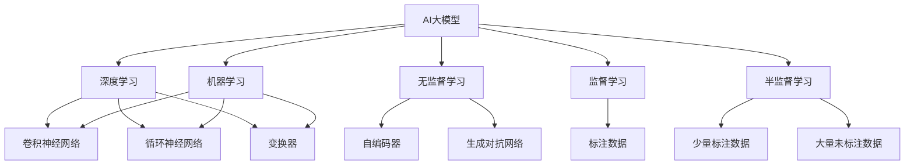

                 

### 第1章：AI大模型概述

## 1.1 AI大模型的核心概念

AI大模型是人工智能领域的核心组成部分，其核心概念包括以下几个方面：

### 1.1.1 AI大模型的基本定义

AI大模型是指通过机器学习和深度学习技术，从大量数据中自动学习和发现规律，实现复杂任务处理的人工智能系统。这些模型通常具有庞大的参数量和复杂的结构，能够处理大规模的数据集。

### 1.1.2 AI大模型的发展历程

AI大模型的发展历程可以追溯到20世纪50年代，当时人们开始探索如何通过机器学习算法来让计算机模拟人类的学习过程。随着计算机硬件性能的提升和海量数据的出现，深度学习算法得以迅速发展，AI大模型也逐渐成为人工智能领域的热点。

### 1.1.3 AI大模型的优势与挑战

AI大模型的优势在于其能够处理复杂任务，例如图像识别、自然语言处理和自动驾驶等。然而，AI大模型也面临着诸多挑战，如数据隐私、计算资源需求、模型解释性等。

## 1.2 AI大模型的分类与架构

AI大模型可以根据不同的分类标准进行分类，常见的分类方法包括以下几种：

### 1.2.1 监督学习大模型

监督学习大模型是一种基于标注数据进行训练的模型，通过学习输入数据和输出结果之间的关系来预测新的输入数据。常见的监督学习大模型包括卷积神经网络（CNN）和循环神经网络（RNN）。

### 1.2.2 无监督学习大模型

无监督学习大模型不依赖于标注数据，而是通过学习数据内在的结构和分布来进行训练。无监督学习大模型在图像去噪、数据降维和聚类分析等方面具有广泛的应用。常见的无监督学习大模型包括自编码器（Autoencoder）和生成对抗网络（GAN）。

### 1.2.3 半监督学习大模型

半监督学习大模型结合了监督学习和无监督学习的特点，通过利用少量的标注数据和大量的未标注数据来提高模型的性能。半监督学习大模型在数据稀缺的应用场景中具有重要作用。

## 1.3 AI大模型的核心算法原理

AI大模型的核心算法主要包括深度学习算法、自适应学习算法和大规模数据处理算法。以下将分别介绍这些算法的基本原理。

### 1.3.1 深度学习算法

深度学习算法是一种基于多层神经网络进行训练和预测的算法。其基本原理是通过逐层提取特征，从原始数据中提取出具有层次结构的特征表示。常见的深度学习算法包括卷积神经网络（CNN）、循环神经网络（RNN）和变换器（Transformer）。

### 1.3.2 自适应学习算法

自适应学习算法是一种能够根据数据变化动态调整学习策略的算法。其基本原理是通过不断调整模型的参数，使模型能够更好地适应新的数据分布。常见的自适应学习算法包括自适应梯度下降（ADAM）和随机梯度下降（SGD）。

### 1.3.3 大规模数据处理算法

大规模数据处理算法是一种能够高效处理海量数据的算法。其基本原理是通过并行计算和分布式存储技术，将数据处理任务分解为多个子任务，从而提高数据处理效率。常见的大规模数据处理算法包括MapReduce和Spark。

通过以上对AI大模型的核心概念、分类与架构以及核心算法原理的介绍，我们可以更好地理解AI大模型的基本原理和应用。在接下来的章节中，我们将进一步探讨AI大模型创业的相关问题，如创业模式分析、风险管理以及成功案例分析等。

---

**核心概念与联系**

以下是一个用Mermaid绘制的AI大模型核心概念流程图：



**AI大模型的核心算法原理**

以下是深度学习算法的伪代码，用于说明卷积神经网络（CNN）的基本操作：

```python
# 输入数据为图像，每个像素值在0-255之间
input_data = ...

# 初始化卷积层参数，包括卷积核大小、步长、填充方式等
filter_size = 3
stride = 1
padding = 'SAME'

# 定义卷积层函数
def convolution(input_data, filter, stride, padding):
    # 使用卷积操作提取特征
    features = tensorflow.nn.conv2d(input_data, filter, stride, padding)
    return features

# 初始化激活函数，如ReLU
activation_function = tensorflow.nn.relu

# 定义神经网络结构
input_layer = tensorflow.keras.layers.Input(shape=(height, width, channels))
conv1 = tensorflow.keras.layers.Conv2D(filters, filter_size, activation=activation_function)(input_layer)
pool1 = tensorflow.keras.layers.MaxPooling2D(pool_size=(2, 2))(conv1)
...
# 添加更多的卷积层和池化层，直至达到所需的深度

# 定义全连接层和输出层
dense = tensorflow.keras.layers.Dense(units=output_size, activation='softmax')(pool1)

# 创建模型
model = tensorflow.keras.Model(inputs=input_layer, outputs=dense)

# 编译模型，指定损失函数和优化器
model.compile(optimizer='adam', loss='categorical_crossentropy', metrics=['accuracy'])

# 训练模型
model.fit(train_data, train_labels, epochs=10, batch_size=32, validation_split=0.2)
```

在此伪代码中，我们首先定义了输入数据的大小，然后初始化卷积层的参数。接着，我们定义了一个卷积层函数，该函数接受输入数据、卷积核、步长和填充方式，并返回提取的特征。我们还定义了激活函数（ReLU），并使用Keras库构建了神经网络结构。最后，我们编译模型并使用训练数据进行训练。

以下是深度学习算法的数学模型和公式：

$$
\begin{aligned}
\text{激活函数：} & f(x) = \sigma(W \cdot x + b) \\
\text{卷积操作：} & \text{filter} \circ \text{input} = \sum_{i=1}^{C} \sum_{j=1}^{H} \sum_{k=1}^{W} f_{ij, kl} \cdot x_{ij, kl} \\
\text{池化操作：} & p_{ij} = \text{max}(\{p_{ijl} \mid l=1,2,...,L\})
\end{aligned}
$$

其中，$W$ 是权重矩阵，$b$ 是偏置项，$\sigma$ 是ReLU激活函数，$f$ 是卷积核，$x$ 是输入数据，$f \circ x$ 表示卷积操作，$p$ 表示池化后的输出。

通过以上对AI大模型核心概念、分类与架构以及核心算法原理的介绍，我们为后续章节的深入探讨奠定了基础。在接下来的章节中，我们将分析AI大模型创业的相关问题，如创业模式、风险管理以及成功案例等。希望读者能够通过这些内容，对AI大模型创业有更深入的理解和认识。

## 1.2 AI大模型的分类与架构

AI大模型的分类和架构是理解其复杂性的关键。根据不同的分类标准，AI大模型可以划分为多种类型，每种类型都有其独特的特点和应用场景。以下是AI大模型的一些常见分类方法：

### 1.2.1 监督学习大模型

监督学习大模型是最常见的一类AI大模型。这种模型通过学习一组标注数据（即输入数据和相应的输出标签）来预测新的输入数据。监督学习大模型通常包括以下几种类型：

1. **分类模型**：用于将输入数据划分为不同的类别。常见的分类模型有支持向量机（SVM）、决策树（DT）和随机森林（RF）等。
2. **回归模型**：用于预测连续值输出。常见的回归模型有线性回归（LR）、岭回归（RR）和LASSO回归（L1）等。
3. **目标检测模型**：用于检测图像中的对象，并定位其位置。常见的目标检测模型有YOLO（You Only Look Once）和SSD（Single Shot MultiBox Detector）等。
4. **语音识别模型**：用于将语音信号转换为文本。常见的语音识别模型有基于循环神经网络（RNN）和卷积神经网络（CNN）的模型。
5. **图像识别模型**：用于识别图像中的对象或场景。常见的图像识别模型有VGG、ResNet和Inception等。

### 1.2.2 无监督学习大模型

无监督学习大模型不依赖于标注数据，而是通过学习数据的内在结构和分布来进行训练。这类模型主要用于数据降维、聚类分析和生成模型等领域。常见的无监督学习大模型包括以下几种：

1. **聚类模型**：用于将相似的数据点分组。常见的聚类模型有K-均值（K-Means）、层次聚类（Hierarchical Clustering）和DBSCAN（Density-Based Spatial Clustering of Applications with Noise）等。
2. **降维模型**：用于减少数据维度，同时保持数据的结构。常见的降维模型有主成分分析（PCA）、线性判别分析（LDA）和非线性降维方法，如t-SNE（t-Distributed Stochastic Neighbor Embedding）。
3. **生成模型**：用于生成新的数据样本。常见的生成模型有生成对抗网络（GAN）、变分自编码器（VAE）和自编码器（Autoencoder）。

### 1.2.3 半监督学习大模型

半监督学习大模型结合了监督学习和无监督学习的特点，通过利用少量的标注数据和大量的未标注数据来提高模型的性能。这种模型在数据稀缺的应用场景中具有重要作用。常见的半监督学习大模型包括以下几种：

1. **标签传播模型**：通过未标注数据中的相似性信息来推断标注信息。常见的标签传播模型有Label Propagation和Laplacian Propagation。
2. **一致性正则化模型**：通过最小化不同标注之间的差异来提高模型性能。常见的模型有一致性正则化神经网络（Consistency Regularized Neural Network）和图神经网络（Graph Neural Network）。

### 1.2.4 强化学习大模型

强化学习大模型通过学习策略来最大化环境中的奖励。这类模型在决策问题和游戏控制中具有广泛应用。常见的强化学习大模型包括以下几种：

1. **策略梯度方法**：通过优化策略参数来最大化期望奖励。常见的策略梯度方法有REINFORCE、PPO（Proximal Policy Optimization）和A3C（Asynchronous Advantage Actor-Critic）等。
2. **价值函数方法**：通过学习值函数来预测状态价值和动作价值。常见的方法有Q-Learning、SARSA（State-Action-Reward-State-Action）和Deep Q-Network（DQN）等。
3. **深度确定性策略梯度（DDPG）**：结合深度学习和确定性策略梯度方法，用于处理高维连续动作空间的问题。

### 1.2.5 大模型架构

AI大模型的架构设计对于其性能和效率至关重要。以下是几种常见的大模型架构：

1. **卷积神经网络（CNN）**：通过卷积层、池化层和全连接层等构建，用于图像识别、目标检测和语音识别等领域。
2. **循环神经网络（RNN）**：通过循环结构处理序列数据，用于自然语言处理、语音识别和时间序列预测等领域。
3. **变换器（Transformer）**：通过自注意力机制构建，用于机器翻译、文本生成和图像识别等领域。
4. **图神经网络（GNN）**：通过节点和边的关系来处理图结构数据，用于社交网络分析、推荐系统和分子建模等领域。
5. **多任务学习模型**：通过共享参数和联合训练来处理多个任务，提高模型的泛化能力。常见的多任务学习模型有BERT（Bidirectional Encoder Representations from Transformers）和ViT（Vision Transformer）。

通过以上对AI大模型分类与架构的详细介绍，我们可以更好地理解AI大模型的各种类型及其应用场景。在接下来的章节中，我们将进一步探讨AI大模型在创业中的应用，如创业模式、风险管理以及成功案例分析等。希望读者能够通过这些内容，对AI大模型创业有更深入的理解和认识。

---

**监督学习大模型：**

监督学习大模型是一种基于标注数据训练的模型，其核心思想是通过学习输入数据与标签之间的关系来预测新的输入数据。以下是一个简单的监督学习大模型的伪代码示例，展示了其基本流程：

```python
# 导入必要的库
import tensorflow as tf
from tensorflow.keras.layers import Dense, Flatten, Conv2D, MaxPooling2D
from tensorflow.keras.models import Sequential

# 设置参数
input_shape = (28, 28, 1)  # 图像尺寸
num_classes = 10  # 类别数
batch_size = 64  # 批量大小
epochs = 10  # 训练轮次

# 创建模型
model = Sequential([
    Conv2D(32, kernel_size=(3, 3), activation='relu', input_shape=input_shape),
    MaxPooling2D(pool_size=(2, 2)),
    Flatten(),
    Dense(128, activation='relu'),
    Dense(num_classes, activation='softmax')
])

# 编译模型
model.compile(optimizer='adam',
              loss='categorical_crossentropy',
              metrics=['accuracy'])

# 训练模型
model.fit(x_train, y_train, batch_size=batch_size, epochs=epochs, validation_data=(x_val, y_val))
```

在这个例子中，我们首先导入了TensorFlow库和必要的层类。然后，我们设置了输入数据的形状、类别数、批量大小和训练轮次等参数。接下来，我们创建了一个序列模型，该模型包含两个卷积层、一个池化层、一个平坦层和一个全连接层。我们使用ReLU激活函数和softmax输出层。在编译模型时，我们指定了优化器、损失函数和评价指标。最后，我们使用训练数据对模型进行训练，并使用验证数据评估模型性能。

**无监督学习大模型：**

无监督学习大模型不需要标注数据，而是通过学习数据的内在结构和分布来进行训练。以下是一个简单的无监督学习大模型——自编码器的伪代码示例，展示了其基本流程：

```python
# 导入必要的库
import tensorflow as tf
from tensorflow.keras.layers import Dense, Input
from tensorflow.keras.models import Model

# 设置参数
input_shape = (784,)  # 输入数据的维度
encoding_dim = 32  # 编码层的维度

# 创建编码器部分
input_img = Input(shape=input_shape)
encoded = Dense(encoding_dim, activation='relu')(input_img)

# 创建解码器部分
decoded = Dense(input_shape, activation='sigmoid')(encoded)

# 创建自编码器模型
autoencoder = Model(input_img, decoded)

# 编译模型
autoencoder.compile(optimizer='adam', loss='binary_crossentropy')

# 训练模型
autoencoder.fit(x_train, x_train, epochs=100, batch_size=256, shuffle=True, validation_data=(x_val, x_val))
```

在这个例子中，我们首先导入了TensorFlow库和必要的层类。然后，我们设置了输入数据的维度和编码层的维度。接下来，我们创建了一个输入层和一个编码层。编码层使用ReLU激活函数，解码层使用sigmoid激活函数。我们使用这些层创建了一个自编码器模型，并使用二进制交叉熵损失函数进行编译。最后，我们使用训练数据对模型进行训练，并使用验证数据评估模型性能。

**半监督学习大模型：**

半监督学习大模型结合了监督学习和无监督学习的特点，通过利用少量的标注数据和大量的未标注数据来提高模型的性能。以下是一个简单的半监督学习大模型——标签传播的伪代码示例，展示了其基本流程：

```python
# 导入必要的库
import numpy as np
from sklearn.semi_supervised import LabelPropagation

# 设置参数
n_samples = 1000  # 样本数
n_features = 10  # 特征数
n_labels = 3  # 类别数
n_labeled = 100  # 标注样本数

# 生成数据集
X, y = np.random.rand(n_samples, n_features), np.random.rand(n_samples, n_labels)

# 随机选择一部分样本作为标注样本
y_subset = np.random.choice([0, 1, 2], n_labeled, replace=True)
X_subset, y_subset = X[y_subset], y[y_subset]

# 使用标签传播算法进行训练
label_prop = LabelPropagation()
label_prop.fit(X_subset, y_subset)

# 预测未标注样本的标签
y_pred = label_prop.predict(X[~y_subset])

# 输出预测结果
print(y_pred)
```

在这个例子中，我们首先导入了NumPy库和标签传播算法。然后，我们设置了样本数、特征数和类别数。接下来，我们生成了一个数据集，其中包含标注样本和未标注样本。我们使用随机选择的方法选取了一部分样本作为标注样本。然后，我们使用标签传播算法对标注样本进行训练，并预测未标注样本的标签。最后，我们输出了预测结果。

通过以上对监督学习大模型、无监督学习大模型和半监督学习大模型的详细介绍，我们可以看到这些模型在AI大模型中的重要性。不同的模型适用于不同的场景和任务，但它们的核心目标都是通过学习数据来提高模型的性能和预测能力。在接下来的章节中，我们将进一步探讨AI大模型在创业中的应用，如创业模式、风险管理以及成功案例分析等。

## 1.3 AI大模型的核心算法原理

AI大模型的核心算法原理是理解和运用这些模型的基础。在AI大模型中，深度学习算法、自适应学习算法和大规模数据处理算法是最为关键的三类算法。以下将对这些算法的基本原理进行详细阐述。

### 1.3.1 深度学习算法

深度学习算法是一种基于多层神经网络（Neural Networks）的学习方法。其核心思想是通过多层非线性变换，从原始数据中提取出具有层次结构的特征表示，从而实现复杂的任务处理。

1. **神经网络的基本结构**

   神经网络由输入层、隐藏层和输出层组成。每个神经元都接受多个输入，并通过加权求和处理后加上偏置项，再通过激活函数输出。常见的激活函数包括sigmoid、ReLU和tanh等。

2. **前向传播和反向传播**

   深度学习算法主要包括前向传播和反向传播两个步骤。

   - **前向传播**：输入数据从输入层传递到隐藏层，再传递到输出层。在每层中，通过加权求和处理和激活函数，将输入映射到输出。
   - **反向传播**：计算输出层的误差，并将其反向传播到隐藏层和输入层。在反向传播过程中，通过梯度下降等优化算法更新网络的权重和偏置项，以减小误差。

3. **深度学习算法的优化方法**

   常见的优化方法包括随机梯度下降（SGD）、动量法、Adagrad、Adam等。这些方法通过调整学习率、引入动量和自适应调整学习率等方式，提高模型的收敛速度和稳定性。

4. **常见深度学习模型**

   - **卷积神经网络（CNN）**：适用于图像识别、目标检测和图像生成等任务。
   - **循环神经网络（RNN）**：适用于序列数据处理，如自然语言处理和时间序列预测等。
   - **变换器（Transformer）**：适用于机器翻译、文本生成和图像识别等任务，是当前最先进的自然语言处理模型。
   - **生成对抗网络（GAN）**：适用于图像生成、图像修复和图像超分辨率等任务。

### 1.3.2 自适应学习算法

自适应学习算法是一种能够根据数据变化动态调整学习策略的算法。其核心思想是在训练过程中，通过实时调整学习率、网络参数等方式，使模型能够适应数据的变化，从而提高模型的泛化能力。

1. **自适应学习算法的基本原理**

   自适应学习算法主要包括以下几方面：

   - **学习率调整**：根据训练过程的误差动态调整学习率，以防止模型过拟合或欠拟合。
   - **网络参数调整**：通过自适应调整网络参数，优化模型的性能。
   - **数据预处理**：根据数据分布的特点，对输入数据进行预处理，提高模型的训练效果。

2. **常见自适应学习算法**

   - **自适应梯度下降（AdaGrad）**：通过调整学习率，使模型在稀疏数据上表现更好。
   - **Adaptive Moment Estimation（Adam）**：结合了SGD和Momentum的优点，适用于快速收敛和噪声较小的数据。
   - **Nesterov动量（Nesterov Momentum）**：在梯度方向上引入前瞻，提高模型在平坦区域的收敛速度。

### 1.3.3 大规模数据处理算法

大规模数据处理算法是处理海量数据的关键技术。其主要目标是通过分布式计算和并行处理，提高数据处理效率，降低计算成本。

1. **MapReduce**

   MapReduce是一种分布式数据处理框架，用于处理大规模数据集。其核心思想是将数据处理任务分解为Map和Reduce两个阶段。

   - **Map阶段**：将输入数据划分为多个小块，并对其处理，生成中间键值对。
   - **Reduce阶段**：对中间键值对进行合并和计算，生成最终输出。

2. **Spark**

   Spark是一种基于内存的分布式数据处理框架，适用于实时流处理和批量数据处理。其核心思想是将数据处理任务分解为多个Stage，并在每个Stage中实现分布式计算。

   - **Stage 1**：数据输入和预处理。
   - **Stage 2**：数据分区和分片。
   - **Stage 3**：数据处理和计算。
   - **Stage 4**：数据输出和存储。

通过以上对AI大模型的核心算法原理的详细阐述，我们可以更好地理解深度学习算法、自适应学习算法和大规模数据处理算法的基本概念和应用。这些算法在AI大模型中起着至关重要的作用，为解决复杂问题提供了强大的工具。在接下来的章节中，我们将进一步探讨AI大模型在创业中的应用，如创业模式、风险管理以及成功案例分析等。

---

### 1.3.1 深度学习算法

深度学习算法是AI大模型的核心，其基础是多层神经网络（Multi-Layer Neural Networks），通过学习大量数据来模拟人类大脑的决策过程。以下将详细解释深度学习算法的基本原理。

#### 1.3.1.1 神经网络结构

神经网络由多个神经元组成，每个神经元都接收多个输入，通过加权求和处理，再加上一个偏置项（Bias），最后通过激活函数（Activation Function）输出。

1. **输入层（Input Layer）**：接收外部输入数据。
2. **隐藏层（Hidden Layer）**：包含一个或多个隐藏层，每一层都对输入数据进行变换，提取特征。
3. **输出层（Output Layer）**：产生最终输出结果。

神经元之间的连接称为边（Edge），每个边的权重（Weight）决定了输入数据对输出的影响。

#### 1.3.1.2 激活函数

激活函数是神经网络中的关键组成部分，其作用是将线性组合后的值转换为非线性值，使神经网络能够模拟复杂的决策过程。常见的激活函数包括：

- **Sigmoid Function**：将输入值压缩到（0, 1）区间。
- **ReLU Function**：在输入为负时输出0，输入为正时输出输入值，提高训练速度。
- **Tanh Function**：将输入值压缩到（-1, 1）区间。

#### 1.3.1.3 前向传播与反向传播

1. **前向传播**：输入数据从输入层开始，经过隐藏层和输出层，直到生成预测结果。在每个神经元中，计算输入数据的加权求和，并应用激活函数。

2. **反向传播**：计算预测结果与实际结果之间的误差，将误差反向传播到每个神经元，并更新每个边的权重和偏置项。反向传播是深度学习训练过程中最核心的部分，通过不断调整权重和偏置项，使预测结果逐渐逼近真实结果。

#### 1.3.1.4 梯度下降优化算法

梯度下降是一种常用的优化算法，用于更新神经网络的权重和偏置项。其核心思想是计算损失函数关于每个参数的梯度，并沿着梯度方向更新参数。

- **随机梯度下降（Stochastic Gradient Descent，SGD）**：在每个训练样本上计算梯度，并更新参数。适用于小批量训练。
- **批量梯度下降（Batch Gradient Descent）**：在所有训练样本上计算梯度，并更新参数。适用于大量训练样本。
- **Adam优化器**：结合SGD和Momentum的优点，自适应调整学习率。

#### 1.3.1.5 常见深度学习模型

1. **卷积神经网络（Convolutional Neural Networks，CNN）**：适用于图像识别和计算机视觉领域。
   - **卷积层（Convolutional Layer）**：提取图像的特征。
   - **池化层（Pooling Layer）**：减少特征图的维度。
   - **全连接层（Fully Connected Layer）**：将特征映射到类别标签。

2. **循环神经网络（Recurrent Neural Networks，RNN）**：适用于序列数据处理，如自然语言处理和时间序列预测。
   - **隐藏状态（Hidden State）**：保存前一个时间步的上下文信息。
   - **循环连接（Recurrence Connection）**：使当前时间步的输出依赖于前一个时间步的隐藏状态。

3. **变换器（Transformer）**：基于自注意力机制的深度学习模型，适用于自然语言处理和机器翻译。
   - **自注意力机制（Self-Attention）**：计算输入序列中每个元素之间的关联强度。
   - **多头注意力（Multi-Head Attention）**：将自注意力扩展到多个维度，提高模型的表示能力。

4. **生成对抗网络（Generative Adversarial Networks，GAN）**：由生成器和判别器组成，用于图像生成和图像修复。
   - **生成器（Generator）**：生成类似真实数据的样本。
   - **判别器（Discriminator）**：区分真实数据和生成数据。

通过以上对深度学习算法的详细解释，我们可以看到其复杂的结构和丰富的应用场景。在AI大模型创业过程中，理解深度学习算法的基本原理对于构建高性能的模型和解决实际问题具有重要意义。在接下来的章节中，我们将进一步探讨AI大模型在创业中的应用，如创业模式、风险管理以及成功案例分析等。

---

### 1.3.2 自适应学习算法

自适应学习算法是一种能够在训练过程中根据数据变化动态调整学习策略的算法，以优化模型的性能。这种算法的关键在于能够实时调整学习率、网络参数以及数据预处理方法，从而提高模型的收敛速度和泛化能力。以下是几种常见的自适应学习算法：

#### 1.3.2.1 随机梯度下降（Stochastic Gradient Descent，SGD）

随机梯度下降是最基本的优化算法，其核心思想是在每个训练样本上计算梯度，并更新参数。SGD的优点是计算简单，适用于小批量训练，但缺点是容易陷入局部最小值，且收敛速度较慢。

伪代码示例：

```python
for epoch in range(num_epochs):
    for sample in training_data:
        # 计算梯度
        gradients = compute_gradients(sample)
        # 更新参数
        update_parameters(parameters, gradients, learning_rate)
```

#### 1.3.2.2 Adam优化器

Adam优化器结合了SGD和Momentum的优点，自适应调整学习率，适用于快速收敛和噪声较小的数据。Adam优化器的核心思想是使用一阶矩估计（均值）和二阶矩估计（方差）来动态调整学习率。

伪代码示例：

```python
m = 0
v = 0
beta1 = 0.9
beta2 = 0.999
epsilon = 1e-8

for epoch in range(num_epochs):
    for sample in training_data:
        # 计算梯度
        gradients = compute_gradients(sample)
        # 更新一阶矩和二阶矩
        m = beta1 * m + (1 - beta1) * gradients
        v = beta2 * v + (1 - beta2) * gradients ** 2
        # 归一化一阶矩和二阶矩
        m_hat = m / (1 - beta1 ** epoch)
        v_hat = v / (1 - beta2 ** epoch)
        # 更新参数
        update_parameters(parameters, m_hat / (sqrt(v_hat) + epsilon), learning_rate)
```

#### 1.3.2.3 自适应梯度下降（AdaGrad）

AdaGrad算法通过调整学习率，使模型在稀疏数据上表现更好。其核心思想是使用每个参数的历史梯度的平方来动态调整学习率。

伪代码示例：

```python
gamma = 0.1
grad_squared_sum = 0

for epoch in range(num_epochs):
    for sample in training_data:
        # 计算梯度
        gradients = compute_gradients(sample)
        # 更新梯度平方和
        grad_squared_sum = gamma * grad_squared_sum + gradients ** 2
        # 更新参数
        update_parameters(parameters, gradients / (sqrt(grad_squared_sum) + epsilon), learning_rate)
```

#### 1.3.2.4 Nesterov动量（Nesterov Momentum）

Nesterov动量是SGD的一种改进，通过引入前瞻（look-ahead）机制，提高模型在平坦区域的收敛速度。其核心思想是在计算梯度时，引入一个预更新步骤。

伪代码示例：

```python
beta = 0.9
velocity = 0

for epoch in range(num_epochs):
    for sample in training_data:
        # 预更新
        velocity = beta * velocity - learning_rate * compute_gradients(sample)
        # 更新参数
        update_parameters(parameters, velocity)
```

通过以上对自适应学习算法的详细介绍，我们可以看到这些算法在深度学习训练过程中起到的重要作用。它们能够动态调整学习策略，优化模型性能，提高模型的泛化能力。在实际应用中，根据数据特点和任务需求，选择合适的自适应学习算法，是构建高效AI大模型的关键。在接下来的章节中，我们将进一步探讨AI大模型在创业中的应用，如创业模式、风险管理以及成功案例分析等。

### 1.3.3 大规模数据处理算法

大规模数据处理算法是处理海量数据的关键技术，其核心在于通过分布式计算和并行处理来提高数据处理效率，降低计算成本。以下将详细介绍几种常见的分布式数据处理框架和算法。

#### 1.3.3.1 MapReduce

MapReduce是一种基于Hadoop的分布式数据处理框架，用于处理大规模数据集。其核心思想是将数据处理任务分解为Map和Reduce两个阶段。

- **Map阶段**：将输入数据划分为多个小块，并对其处理，生成中间键值对。
  ```python
  def map(data):
      for key, value in data:
          yield key, map_function(value)
  ```
- **Reduce阶段**：对中间键值对进行合并和计算，生成最终输出。
  ```python
  def reduce(key, values):
      return reduce_function(key, values)
  ```

通过MapReduce框架，可以将大规模数据处理任务分解为多个小任务，分布式地并行执行，从而提高处理速度。

#### 1.3.3.2 Spark

Spark是一种基于内存的分布式数据处理框架，适用于实时流处理和批量数据处理。其核心思想是将数据处理任务分解为多个Stage，并在每个Stage中实现分布式计算。

- **Stage 1**：数据输入和预处理。
  ```python
  df = spark.read.csv("data.csv", header=True)
  ```
- **Stage 2**：数据分区和分片。
  ```python
  df = df.repartition(10)
  ```
- **Stage 3**：数据处理和计算。
  ```python
  result = df.groupby("column").count().show()
  ```
- **Stage 4**：数据输出和存储。
  ```python
  result.write.csv("output.csv")
  ```

通过Spark框架，可以实现高效的分布式数据处理，同时支持实时流处理和批量处理。

#### 1.3.3.3 分布式数据库

分布式数据库是一种通过将数据分散存储在多个节点上来提高数据访问速度和可靠性的技术。常见的分布式数据库包括Apache Cassandra、HBase和MongoDB等。

- **数据分片（Sharding）**：将数据分散存储在多个节点上，提高数据访问速度和并发能力。
- **主从复制（Master-Slave Replication）**：通过主从复制，实现数据的冗余备份和故障恢复。

通过分布式数据库，可以高效地处理大规模数据，提高系统的可靠性和扩展性。

#### 1.3.3.4 数据流处理

数据流处理是一种实时处理大规模数据的技术，适用于实时分析和处理数据。常见的实时处理框架包括Apache Kafka、Apache Flink和Apache Storm等。

- **数据流处理模型**：基于事件驱动的方式，实时处理数据流中的事件。
  ```python
  def process_event(event):
      # 处理事件
  ```
- **实时流处理**：对数据流进行实时分析和处理，提供实时决策支持。

通过数据流处理技术，可以实现实时数据处理和分析，为AI大模型提供实时数据支持。

通过以上对大规模数据处理算法的详细介绍，我们可以看到分布式计算、并行处理和数据流处理在处理大规模数据中的重要应用。这些算法和框架为AI大模型提供了强大的数据处理能力，使其能够高效地处理海量数据。在接下来的章节中，我们将进一步探讨AI大模型在创业中的应用，如创业模式、风险管理以及成功案例分析等。

---

## 2.1 AI大模型创业模式分析

AI大模型创业模式是指创业者如何选择方向、构建团队、开发技术和实现商业化的过程。在AI大模型领域，创业公司需要充分考虑市场需求、技术优势和资源分配等因素，以实现可持续的商业模式。以下是AI大模型创业模式分析的主要内容：

### 2.1.1 市场需求分析

市场需求分析是创业公司选择AI大模型方向的重要依据。创业公司需要关注以下几个关键点：

1. **行业需求**：分析目标行业对AI大模型的需求，如金融、医疗、零售、制造业等。了解这些行业在数据处理、自动化和智能化方面的具体需求，找到市场缺口。

2. **用户需求**：深入了解目标用户的需求，包括企业用户和个人用户。通过用户调研、访谈和反馈，收集用户对AI大模型功能、性能和易用性的期望，为产品设计和优化提供依据。

3. **竞争对手**：分析竞争对手的产品和商业模式，了解其在市场上的地位和策略。识别竞争对手的不足和机会，找到差异化的竞争优势。

4. **市场规模**：评估目标市场的规模和增长潜力，确定商业机会的大小。通过市场调研和数据统计，了解市场规模、用户数量和潜在收入。

### 2.1.2 竞争对手分析

竞争对手分析是创业公司制定战略和策略的重要参考。以下是几个关键步骤：

1. **识别主要竞争对手**：根据市场需求分析，识别出在目标领域具有较大市场份额和影响力的主要竞争对手。

2. **分析竞争对手产品**：深入了解竞争对手的产品特点、功能、性能和用户体验。比较自身产品的优势和不足，找到市场定位和差异化点。

3. **评估竞争对手策略**：分析竞争对手的市场推广、合作伙伴和商业模式。了解竞争对手的优势和劣势，为自身战略制定提供参考。

4. **制定应对策略**：根据竞争对手分析和自身优势，制定相应的市场策略。例如，通过技术创新、用户定位、市场营销等方式，提升市场竞争力。

### 2.1.3 创业公司自身优势分析

创业公司自身优势分析是选择AI大模型方向的重要基础。以下是几个关键点：

1. **技术优势**：评估创业公司在AI大模型相关技术领域的优势，包括算法、模型、工具和平台等。技术优势是创业公司竞争的核心竞争力。

2. **团队优势**：评估创业公司的团队组成、经验和技能。一个拥有高水平技术人才和商业运营能力的团队是实现成功创业的关键。

3. **资金优势**：评估创业公司的资金状况，包括自有资金和融资能力。资金优势是支撑创业公司发展的重要保障。

4. **市场优势**：评估创业公司在市场上的地位和影响力，包括品牌、用户基础和合作伙伴等。市场优势有助于创业公司快速占领市场份额。

### 2.1.4 创业方向选择

基于市场需求分析、竞争对手分析和自身优势分析，创业公司需要选择一个合适的创业方向。以下是几个建议：

1. **垂直领域**：选择一个特定的垂直领域，如医疗、金融、零售等，集中资源进行深耕。垂直领域有助于创业公司快速建立市场地位。

2. **技术创新**：围绕AI大模型相关技术进行创新，如算法优化、模型压缩、硬件加速等。技术创新有助于创业公司提升产品竞争力。

3. **解决方案**：提供面向特定行业或领域的AI大模型解决方案，满足用户在数据处理、自动化和智能化方面的需求。解决方案有助于创业公司实现商业变现。

4. **平台化**：构建一个开放、可扩展的AI大模型平台，吸引第三方开发者和应用合作伙伴。平台化有助于创业公司实现生态系统建设。

通过以上对AI大模型创业模式的分析，我们可以看到市场需求、竞争对手和自身优势在创业决策中的重要性。创业公司需要根据自身条件和市场需求，选择合适的创业方向，构建核心竞争力，实现可持续的商业化。在接下来的章节中，我们将进一步探讨AI大模型创业中的关键技术、风险管理以及成功案例分析等。

---

### 2.1.1 市场需求分析

市场需求分析是AI大模型创业过程中至关重要的一个环节。创业公司需要深入理解目标市场的需求，以便更好地定位产品和服务，实现商业成功。以下是市场需求分析的关键步骤：

#### 1. 分析行业需求

首先，创业公司需要分析目标行业对AI大模型的需求。这包括以下几个方面：

- **当前应用场景**：了解目标行业当前有哪些AI大模型的应用场景，例如在金融行业的风险管理、医疗领域的疾病诊断、零售行业的客户行为分析等。
- **应用潜力**：评估这些应用场景的潜力和市场规模。通过市场调研和数据统计，了解这些应用场景的未来发展趋势和市场规模。
- **技术需求**：分析目标行业对AI大模型的技术要求，例如模型的准确性、响应速度、可解释性等。

#### 2. 用户需求分析

了解目标用户的需求是产品设计和优化的基础。创业公司可以通过以下方法收集用户需求：

- **用户调研**：通过在线问卷、电话访谈、面对面访谈等方式，直接从用户那里收集需求信息。
- **用户反馈**：分析用户对现有AI大模型产品的使用反馈，了解用户对功能、性能、用户体验等方面的期望和意见。
- **用户场景**：分析用户在使用AI大模型时的具体场景，了解用户在哪些方面遇到问题，哪些方面有改进空间。

#### 3. 竞争对手分析

在市场需求分析中，还需要对竞争对手的产品和策略进行深入分析：

- **产品特点**：分析竞争对手的产品特点，包括功能、性能、用户体验等，了解其优势和不足。
- **市场定位**：了解竞争对手的市场定位和目标用户群体，分析其市场策略和竞争优势。
- **市场份额**：评估竞争对手在市场上的地位和市场份额，了解市场格局和竞争态势。

#### 4. 市场规模评估

对目标市场进行规模评估是创业公司制定战略的重要依据。以下是几种常用的方法：

- **市场调研**：通过第三方市场调研机构的数据报告，了解目标市场的规模、增长趋势和未来预测。
- **数据统计**：收集和分析相关行业的数据，如销售额、用户数量、市场份额等，评估市场规模和增长潜力。
- **用户调研**：通过用户调研，了解目标市场的实际需求和使用情况，进一步验证市场规模和增长潜力。

#### 5. 需求预测

基于以上分析，创业公司可以预测未来市场需求的发展趋势，制定相应的产品规划和策略。以下是几种常用的需求预测方法：

- **趋势分析**：通过分析历史数据，了解市场需求的变化趋势，预测未来市场的需求。
- **专家意见**：邀请行业专家、用户代表等，对市场需求进行预测和评估。
- **情景分析**：构建不同的市场情景，分析在不同情景下市场需求的变化。

通过以上步骤，创业公司可以全面了解市场需求，为后续的产品设计和市场推广提供依据。在市场需求分析的基础上，创业公司还可以进一步进行竞争对手分析和自身优势分析，制定合适的创业方向和战略。在接下来的章节中，我们将继续探讨AI大模型创业中的关键技术、风险管理以及成功案例分析等。

---

### 2.1.2 竞争对手分析

竞争对手分析是AI大模型创业过程中不可或缺的一环。通过深入分析竞争对手的产品、市场策略和竞争优势，创业公司可以识别市场机会、制定有效的市场进入策略，并在激烈的市场竞争中脱颖而出。以下是竞争对手分析的关键步骤：

#### 1. 识别主要竞争对手

首先，创业公司需要明确目标市场中主要竞争对手的身份。这可以通过以下几种方法实现：

- **市场调研**：收集和分析市场数据，了解在目标行业中哪些公司具有较大的市场份额和影响力。
- **用户反馈**：通过用户调研和反馈，了解用户对现有产品和服务的主要评价，识别用户心目中的主要竞争对手。
- **行业报告**：参考行业研究报告和数据分析，了解市场格局和主要竞争对手的概况。

#### 2. 分析竞争对手产品

接下来，创业公司需要对竞争对手的产品进行详细分析，了解其功能、性能、用户体验等方面的特点。以下是几个关键点：

- **产品特点**：分析竞争对手产品的独特特点，如技术创新、功能丰富性、用户界面设计等。
- **性能指标**：评估竞争对手产品的性能指标，如计算速度、准确性、响应时间等。
- **用户体验**：通过用户反馈和实际使用体验，了解竞争对手产品的用户体验，包括易用性、可访问性和客户支持等。

#### 3. 评估竞争对手策略

分析竞争对手的市场策略，有助于创业公司了解其竞争优势和劣势，为自身战略制定提供参考。以下是几个关键点：

- **市场定位**：了解竞争对手的市场定位，包括目标用户群体、市场细分等。
- **营销策略**：分析竞争对手的营销策略，包括广告宣传、品牌推广、促销活动等。
- **合作伙伴**：评估竞争对手的合作伙伴关系，包括供应商、分销商、技术合作伙伴等。

#### 4. 竞争对手优势与劣势

通过以上分析，创业公司可以识别出竞争对手的优势和劣势。以下是几个关键点：

- **优势**：分析竞争对手在技术、市场、品牌等方面的优势，如技术领先、市场经验丰富、品牌知名度高等。
- **劣势**：识别竞争对手在产品、市场、运营等方面的劣势，如产品功能不足、市场定位不准、运营成本高等。

#### 5. 制定应对策略

基于竞争对手分析和自身优势分析，创业公司可以制定相应的市场策略和应对策略。以下是几个关键点：

- **差异化策略**：通过技术创新、产品功能、用户体验等方面的差异化，形成与竞争对手的区别，吸引目标用户。
- **市场定位**：根据市场需求和竞争对手分析，明确自身的市场定位和目标用户群体。
- **市场推广**：制定有效的市场推广策略，提高品牌知名度和市场份额。

通过以上步骤，创业公司可以全面了解竞争对手，制定有效的市场进入策略，并在激烈的市场竞争中取得优势。在接下来的章节中，我们将继续探讨AI大模型创业中的关键技术、风险管理以及成功案例分析等。

---

### 2.1.3 创业公司自身优势分析

在AI大模型创业过程中，了解和利用创业公司的自身优势是至关重要的。以下是创业公司自身优势分析的关键步骤：

#### 1. 技术优势

技术优势是AI大模型创业公司最核心的优势之一。创业公司需要深入分析自身在以下方面的技术优势：

- **核心技术**：识别创业公司在AI大模型领域的核心技术，如深度学习算法、数据挖掘技术、大规模数据处理算法等。
- **创新能力**：评估创业公司在技术创新方面的能力，包括研发能力、技术积累和创新速度等。
- **技术团队**：分析创业公司的技术团队，包括团队成员的背景、经验、专业知识和协作能力等。

#### 2. 团队优势

创业公司的团队优势是成功的关键。以下是团队优势分析的关键点：

- **人才构成**：评估创业公司的团队构成，包括技术人才、产品经理、市场营销人才、运营人才等。
- **管理能力**：分析创业公司的管理团队，包括管理经验、组织能力、决策能力和领导力等。
- **协作效率**：评估创业公司的团队协作效率和沟通能力，包括内部沟通机制、协作工具和团队文化等。

#### 3. 资金优势

资金优势是创业公司能否顺利推进项目的重要保障。以下是资金优势分析的关键点：

- **自有资金**：评估创业公司的自有资金状况，包括资金规模、资金来源和使用计划等。
- **融资能力**：分析创业公司的融资能力，包括融资渠道、融资策略和融资谈判能力等。
- **资金用途**：明确创业公司的资金用途，包括研发投入、市场推广、运营成本等。

#### 4. 市场优势

市场优势是创业公司能否快速占领市场的关键。以下是市场优势分析的关键点：

- **品牌知名度**：评估创业公司在市场上的品牌知名度，包括品牌形象、口碑和用户认可度等。
- **用户基础**：分析创业公司的用户基础，包括现有用户数量、用户增长率和用户忠诚度等。
- **市场渠道**：了解创业公司的市场推广渠道，包括线上推广、线下活动、合作伙伴等。

#### 5. 竞争优势

通过以上分析，创业公司可以明确自身的竞争优势，包括技术优势、团队优势、资金优势和市场优势等。以下是竞争优势分析的关键点：

- **差异化优势**：通过技术创新、产品功能、用户体验等方面的差异化，形成与竞争对手的区别。
- **市场定位**：根据市场需求和竞争对手分析，明确自身的市场定位和目标用户群体。
- **商业模式**：构建可持续的商业模式，包括收入来源、成本结构和盈利模式等。

通过以上对创业公司自身优势的详细分析，创业公司可以明确自身的优势和劣势，制定有效的创业策略，实现商业成功。在接下来的章节中，我们将继续探讨AI大模型创业中的关键技术、风险管理以及成功案例分析等。

---

### 2.1.4 创业方向选择

选择创业方向是AI大模型创业过程中至关重要的一步。创业公司需要根据市场需求、自身优势以及行业趋势来决定创业方向。以下是几个关键步骤：

#### 1. 确定垂直领域

首先，创业公司需要明确目标行业，选择一个具有市场潜力和自身优势的垂直领域。例如，在金融、医疗、零售、制造业等领域，AI大模型都有广泛的应用。创业公司可以通过以下方法确定垂直领域：

- **行业研究**：通过市场调研、行业报告和专家访谈，了解各个垂直领域的市场趋势和发展潜力。
- **自身优势**：评估公司在技术、人才、资源等方面的优势，选择与自己优势相匹配的领域。

#### 2. 创新技术方向

在确定垂直领域后，创业公司需要选择一个具有创新性的技术方向。以下是几个关键点：

- **市场需求**：分析目标行业对AI大模型的具体需求，例如在金融领域的需求包括风险管理、信用评估等。
- **技术优势**：评估公司在相关技术方向上的优势，例如在医疗领域，公司可能具备先进的图像识别技术。
- **市场空白**：寻找市场上的空白点，例如在医疗领域，AI大模型在疾病预测和早期诊断方面的应用可能还未被充分挖掘。

#### 3. 解决方案方向

创业公司需要围绕目标领域，开发具体的解决方案。以下是几个关键点：

- **用户需求**：深入了解目标用户的需求，例如在金融领域，用户可能需要更准确的信用评估模型。
- **技术整合**：将多个AI技术整合到解决方案中，例如将图像识别、自然语言处理和深度学习技术结合，提供更全面的解决方案。
- **差异化**：通过技术创新和用户需求满足，形成差异化竞争优势。

#### 4. 平台化方向

创业公司还可以选择构建一个开放、可扩展的AI大模型平台。以下是几个关键点：

- **生态系统建设**：通过平台化，吸引第三方开发者和应用合作伙伴，共同构建生态系统。
- **技术标准化**：制定统一的技术标准和接口规范，简化开发者接入和使用平台的难度。
- **市场推广**：利用平台化优势，扩大市场影响力，提高用户黏性和品牌知名度。

#### 5. 商业模式探索

最后，创业公司需要探索合适的商业模式。以下是几个关键点：

- **收入来源**：明确主要的收入来源，例如通过软件销售、服务订阅、项目承包等方式获取收入。
- **成本结构**：分析创业公司的成本结构，包括研发成本、运营成本和营销成本等。
- **盈利模式**：构建可持续的盈利模式，例如通过提供增值服务、拓展新市场等方式实现盈利。

通过以上步骤，创业公司可以明确创业方向，制定有效的创业策略，实现商业成功。在接下来的章节中，我们将继续探讨AI大模型创业中的关键技术、风险管理以及成功案例分析等。

---

## 2.2 AI大模型创业的关键技术

AI大模型创业的成功离不开关键技术的支撑。这些技术包括数据收集与处理、模型设计与优化、模型部署与运维等方面。以下将详细探讨这些关键技术的核心要点和实现方法。

### 2.2.1 数据收集与处理

数据是AI大模型的基础，数据收集与处理的质量直接影响到模型的性能和可靠性。以下是数据收集与处理的几个关键要点：

1. **数据质量**：确保收集的数据是准确、完整和可靠的。通过数据清洗、去重和去噪声等方法，提高数据质量。

2. **数据来源**：选择合适的的数据来源，包括公开数据集、企业内部数据、第三方数据供应商等。对于企业内部数据，需要确保数据隐私和安全。

3. **数据预处理**：对原始数据进行预处理，包括数据标准化、归一化、缺失值处理和特征提取等。预处理步骤有助于提高数据质量和模型的泛化能力。

4. **数据存储与管理**：选择合适的数据库和存储方案，确保数据的快速访问和高效管理。常用的存储方案包括关系型数据库、NoSQL数据库和分布式文件系统等。

### 2.2.2 模型设计与优化

模型设计与优化是AI大模型创业的核心环节，决定了模型的效果和效率。以下是模型设计与优化的几个关键要点：

1. **模型选择**：根据应用场景和需求选择合适的模型，例如卷积神经网络（CNN）、循环神经网络（RNN）、变换器（Transformer）等。不同的模型适用于不同的任务和数据类型。

2. **模型架构**：设计合理的模型架构，包括网络的层数、层的连接方式、激活函数的选择等。通过实验和调参，找到最佳的模型架构。

3. **参数调优**：通过调整模型参数，如学习率、正则化参数等，提高模型的性能。常用的参数调优方法包括网格搜索、随机搜索和贝叶斯优化等。

4. **模型训练**：使用高质量的训练数据和优化算法，对模型进行训练。常见的训练算法包括随机梯度下降（SGD）、Adam优化器等。训练过程中需要监控模型的性能，及时调整训练策略。

5. **模型评估**：使用验证集和测试集评估模型的性能，包括准确率、召回率、F1分数等指标。通过交叉验证和混淆矩阵等方法，全面评估模型的效果。

### 2.2.3 模型部署与运维

模型部署与运维是AI大模型创业的最终环节，确保模型能够在实际应用中稳定运行。以下是模型部署与运维的几个关键要点：

1. **模型部署**：将训练好的模型部署到生产环境中，包括硬件选择、软件配置和环境搭建等。常用的部署平台包括TensorFlow Serving、Kubernetes等。

2. **服务监控**：实时监控模型的运行状态，包括响应时间、准确率、资源使用等。通过日志记录和监控工具，及时发现和解决问题。

3. **性能优化**：针对模型的性能瓶颈进行优化，包括模型压缩、量化、硬件加速等。通过优化，提高模型的响应速度和计算效率。

4. **自动化运维**：使用自动化工具和脚本，实现模型的部署、监控和运维。通过容器化、自动化部署和持续集成/持续部署（CI/CD）等，提高运维效率。

5. **安全性保障**：确保模型部署环境的安全，包括数据加密、权限管理、安全审计等。通过安全策略和措施，防止数据泄露和攻击。

通过以上对AI大模型创业关键技术的详细探讨，创业公司可以更好地理解这些技术的重要性和实现方法，为AI大模型创业提供有力支持。在接下来的章节中，我们将继续探讨AI大模型创业中的风险管理、成功案例分析等。

---

### 2.2.1 数据收集与处理

数据是AI大模型的基础，其质量和来源直接影响模型的性能。以下是数据收集与处理的详细步骤：

#### 1. 数据质量保证

- **数据清洗**：去除重复数据、缺失值填充和异常值处理。使用数据清洗工具，如Pandas和Scikit-learn，进行数据预处理。
  ```python
  import pandas as pd
  data = pd.read_csv('data.csv')
  data.drop_duplicates(inplace=True)
  data.fillna(method='ffill', inplace=True)
  ```

- **数据标准化**：将数据缩放到一个统一的范围，如（0, 1）或（-1, 1）。标准化有助于模型训练的稳定性和收敛速度。
  ```python
  from sklearn.preprocessing import MinMaxScaler
  scaler = MinMaxScaler()
  data_scaled = scaler.fit_transform(data)
  ```

- **特征提取**：从原始数据中提取具有区分度的特征，如文本中的词频、图像中的颜色直方图等。使用特征提取工具，如Scikit-learn和OpenCV，进行特征提取。
  ```python
  from sklearn.feature_extraction.text import TfidfVectorizer
  vectorizer = TfidfVectorizer()
  X = vectorizer.fit_transform(corpus)
  ```

#### 2. 数据来源

- **公开数据集**：利用现有的公开数据集，如Kaggle、UCI机器学习库等。公开数据集具有广泛的应用和较高的质量，但可能存在数据不全或数据噪声等问题。
- **企业内部数据**：从企业内部系统中获取数据，如客户关系管理系统（CRM）、企业资源计划系统（ERP）等。内部数据具有较高的可信度和针对性，但需要注意数据隐私和安全问题。
- **第三方数据供应商**：购买第三方提供的数据集，如Alibaba Cloud、Tianyi Data等。第三方数据集具有多样性和专业性，但价格较高。

#### 3. 数据存储与管理

- **关系型数据库**：适用于结构化数据存储，如MySQL、PostgreSQL等。关系型数据库具有强大的查询功能和事务支持，但存储和查询效率较低。
- **NoSQL数据库**：适用于非结构化或半结构化数据存储，如MongoDB、Redis等。NoSQL数据库具有高扩展性和高并发性，但查询功能相对较弱。
- **分布式文件系统**：适用于大规模数据存储，如HDFS、CFS等。分布式文件系统具有高可靠性和高性能，但需要复杂的管理和运维。

#### 4. 数据预处理

- **数据预处理工具**：使用数据处理工具，如Pandas、NumPy、Scikit-learn等，进行数据清洗、转换和特征提取等操作。数据处理工具具有丰富的API和强大的功能，方便进行数据处理和模型训练。
- **自动化脚本**：编写自动化脚本，实现数据的批量处理和预处理。自动化脚本可以提高数据处理效率，减少人为错误。

通过以上对数据收集与处理的详细描述，我们可以看到数据在AI大模型创业中的重要性。高质量的数据是构建高效模型的基石，合理的预处理方法可以提高模型的性能和可靠性。在接下来的章节中，我们将继续探讨AI大模型创业中的模型设计与优化、模型部署与运维等关键技术。

---

### 2.2.2 模型设计与优化

模型设计与优化是AI大模型创业的核心环节，直接决定了模型的性能和效率。以下将详细探讨模型设计、优化策略和实现步骤：

#### 1. 模型设计

模型设计是构建AI大模型的第一步，需要考虑以下几个关键点：

- **模型选择**：根据应用场景和数据类型选择合适的模型。常见的模型包括卷积神经网络（CNN）、循环神经网络（RNN）、变换器（Transformer）等。每种模型都有其适用的场景和优势。

- **网络结构**：设计合理的网络结构，包括输入层、隐藏层和输出层。输入层负责接收和处理输入数据，隐藏层负责提取特征和变换，输出层负责生成预测结果。

- **激活函数**：选择合适的激活函数，如ReLU、Sigmoid、Tanh等。激活函数的作用是将线性组合后的值转换为非线性值，提高模型的非线性表达能力。

- **正则化技术**：应用正则化技术，如L1正则化、L2正则化和dropout等，防止模型过拟合。正则化可以通过增加模型的复杂度，提高模型的泛化能力。

#### 2. 优化策略

模型优化策略是提高模型性能和效率的关键步骤。以下是几个常见的优化策略：

- **参数调优**：通过调整模型参数，如学习率、正则化参数、隐藏层神经元数量等，优化模型的性能。常用的调优方法包括网格搜索、随机搜索和贝叶斯优化等。

- **批量大小**：选择合适的批量大小，影响模型的收敛速度和稳定性。小批量训练可以降低方差，提高模型的泛化能力，但计算成本较高；大批量训练可以降低偏差，提高计算效率，但可能引入噪声。

- **学习率策略**：选择合适的学习率策略，如固定学习率、自适应学习率（Adam、RMSprop）等。自适应学习率可以根据训练过程中的误差动态调整学习率，提高模型的收敛速度。

- **数据增强**：通过数据增强技术，增加训练数据集的多样性，提高模型的泛化能力。常见的数据增强方法包括随机裁剪、旋转、缩放、颜色变换等。

#### 3. 实现步骤

以下是模型设计、优化策略和实现步骤的详细描述：

- **数据预处理**：对输入数据进行预处理，包括归一化、标准化、缺失值填充等。预处理步骤有助于提高模型的训练效率和性能。

- **模型构建**：使用深度学习框架（如TensorFlow、PyTorch）构建模型。构建过程中需要定义网络结构、激活函数和损失函数等。

- **训练模型**：使用训练数据对模型进行训练。训练过程中需要监控模型的性能，包括损失函数值、准确率等。通过调整参数和优化策略，优化模型性能。

- **评估模型**：使用验证集和测试集评估模型的性能。评估指标包括准确率、召回率、F1分数等。通过交叉验证和混淆矩阵等方法，全面评估模型的效果。

- **模型部署**：将训练好的模型部署到生产环境中。部署过程中需要考虑模型的性能、稳定性和安全性。可以使用TensorFlow Serving、Kubernetes等工具实现模型的部署和运维。

通过以上对模型设计与优化策略的详细描述，我们可以看到AI大模型创业中的模型设计与优化过程是复杂且关键的。合理的设计和优化策略可以提高模型的性能和效率，实现商业成功。在接下来的章节中，我们将继续探讨AI大模型创业中的模型部署与运维等关键技术。

---

### 2.2.3 模型部署与运维

模型部署与运维是AI大模型创业过程中至关重要的一环，确保模型能够在生产环境中稳定、高效地运行。以下是模型部署与运维的关键步骤和实现方法：

#### 1. 模型部署

模型部署是将训练好的模型部署到生产环境中的过程。以下是一些关键的步骤和实现方法：

- **容器化**：使用容器化技术（如Docker）将模型和应用封装在一个独立的容器中。容器化可以确保模型和环境的一致性，方便部署和运维。
  ```shell
  docker build -t model:latest .
  docker run -p 8501:8501 model
  ```

- **服务化**：使用服务化框架（如TensorFlow Serving、Kubernetes）将容器化的模型部署为微服务。服务化可以实现模型的分布式部署和动态伸缩。
  ```shell
  kubectl create -f deployment.yaml
  ```

- **API接口**：为模型部署提供API接口，方便外部系统调用。可以使用RESTful API或gRPC等协议，实现模型的远程访问。
  ```python
  from flask import Flask, request, jsonify
  app = Flask(__name__)

  @app.route('/predict', methods=['POST'])
  def predict():
      data = request.json
      predictions = model.predict(data)
      return jsonify(predictions)

  if __name__ == '__main__':
      app.run(host='0.0.0.0', port=5000)
  ```

#### 2. 服务监控

服务监控是确保模型稳定运行的重要手段。以下是一些关键的步骤和实现方法：

- **性能监控**：监控模型的响应时间、准确率、资源使用等性能指标。可以使用Prometheus、Grafana等监控工具，实现对模型性能的实时监控和报警。
  ```shell
  prometheus --config.file=prometheus.yml
  ```

- **日志记录**：记录模型的运行日志，包括训练日志、预测日志和错误日志等。日志记录可以帮助定位问题，优化模型性能。
  ```shell
  logging.basicConfig(filename='model.log', level=logging.INFO)
  ```

- **故障检测**：定期检查模型的运行状态，检测故障和异常。可以使用自动化脚本和监控工具，实现故障检测和自动恢复。
  ```python
  import subprocess
  result = subprocess.run(['sudo', 'systemctl', 'status', 'model.service'], capture_output=True, text=True)
  if 'active (running)' not in result.stdout:
      print("Model service is not running. Restarting...")
      subprocess.run(['sudo', 'systemctl', 'restart', 'model.service'])
  ```

#### 3. 性能优化

模型性能优化是提高模型效率和应用价值的重要手段。以下是一些关键的步骤和实现方法：

- **模型压缩**：通过模型压缩技术，减少模型的参数数量和计算量。常用的压缩方法包括量化、剪枝和蒸馏等。
  ```shell
  tensorflow_model_optimization.py
  ```

- **硬件加速**：利用GPU、TPU等硬件加速技术，提高模型的计算速度。可以使用TensorFlow、PyTorch等框架的硬件加速功能。
  ```python
  import tensorflow as tf
  device = tf.config.list_physical_devices('GPU')[0]
  tf.config.experimental.set_memory_growth(device, True)
  ```

- **并行计算**：利用分布式计算和并行计算技术，提高模型的训练和推理效率。可以使用Horovod、Distributed Data Parallel等分布式训练框架。
  ```python
  import torch
  from torch.nn.parallel import DistributedDataParallel as DDP
  model = DDP(model)
  ```

#### 4. 自动化运维

自动化运维是提高运维效率和质量的关键。以下是一些关键的步骤和实现方法：

- **脚本化**：编写自动化脚本，实现模型部署、监控、性能优化等运维操作。自动化脚本可以提高运维效率，减少人工干预。
  ```shell
  #!/bin/bash
  # model_deploy.sh
  docker pull model:latest
  docker run -p 8501:8501 model
  ```

- **持续集成/持续部署（CI/CD）**：构建持续集成和持续部署流程，实现模型的自动化测试、部署和发布。CI/CD可以提高开发效率，减少部署风险。
  ```shell
  #!/bin/bash
  # model_ci.sh
  docker build -t model:latest .
  kubectl create -f deployment.yaml
  ```

通过以上对模型部署与运维的详细描述，我们可以看到模型部署与运维在AI大模型创业中的重要性。合理的部署和运维策略可以提高模型的稳定性和效率，实现商业成功。在接下来的章节中，我们将继续探讨AI大模型创业中的风险管理、成功案例分析等。

---

### 2.2.3 AI大模型创业的风险管理

在AI大模型创业过程中，风险管理是确保项目顺利推进和业务可持续发展的关键环节。以下将详细介绍AI大模型创业中可能面临的风险类型、评估方法以及应对策略。

#### 1. 风险类型

AI大模型创业可能面临的风险类型主要包括以下几个方面：

- **技术风险**：包括算法设计、模型训练、数据处理等环节可能出现的问题。例如，模型性能不佳、过拟合、欠拟合等。
- **市场风险**：包括市场需求变化、竞争加剧、用户需求不明确等。例如，产品无法满足市场需求、市场份额被竞争对手抢占等。
- **资金风险**：包括资金短缺、融资失败、成本超支等。例如，项目资金不足、融资渠道不畅通、成本控制不力等。
- **法律风险**：包括知识产权保护、数据隐私、合规性等。例如，侵犯他人知识产权、数据泄露、违反相关法律法规等。
- **运营风险**：包括团队管理、项目管理、供应链管理等方面的问题。例如，团队协作不力、项目延期、供应链中断等。

#### 2. 风险评估

风险评估是识别和量化风险的过程，以下是一些常用的评估方法：

- **风险矩阵**：通过建立风险矩阵，对风险的概率和影响进行评估。风险矩阵通常包括四个象限，分别表示低概率低影响、低概率高影响、高概率低影响和高概率高影响的风险。
- **敏感性分析**：分析模型输出对输入参数的敏感性，识别关键参数和风险因素。敏感性分析可以帮助创业者了解哪些参数对模型性能和业务成果有重大影响。
- **情景分析**：构建不同的市场情景，分析不同情景下风险的概率和影响。情景分析可以帮助创业者了解潜在风险的影响范围和应对策略。

#### 3. 应对策略

针对识别出的风险，创业者需要制定相应的应对策略。以下是一些常见的应对策略：

- **风险规避**：通过调整项目计划、改变商业模式等方式，避免风险的发生。例如，通过多元化投资、开拓新市场等方式，降低市场竞争带来的风险。
- **风险减轻**：采取一些措施，降低风险的概率或影响。例如，通过技术优化、加强团队建设、提高资金管理效率等方式，减轻技术风险、市场风险和运营风险。
- **风险转移**：将风险转移给第三方，通过保险、外包等方式，将风险责任转嫁给其他机构或个人。例如，通过购买商业保险、外包技术研发等方式，转移资金风险和技术风险。
- **风险接受**：在无法规避或减轻风险的情况下，接受风险并制定应对措施。例如，通过建立应急响应机制、制定风险应对计划等方式，应对可能发生的风险。

通过以上对AI大模型创业风险管理的详细介绍，创业者可以更好地识别和应对潜在风险，确保项目顺利推进和业务可持续发展。在接下来的章节中，我们将继续探讨AI大模型创业中的关键成功因素和成功案例。

---

### 2.2.3 AI大模型创业的风险管理

AI大模型创业过程中，风险管理至关重要。以下将详细介绍创业公司可能面临的风险类型、评估方法及应对策略。

#### 1. 风险类型

AI大模型创业公司可能面临以下几种风险：

- **技术风险**：包括算法设计、数据处理、模型训练等方面的问题。如算法不够先进，模型过拟合或欠拟合等。
- **市场风险**：包括市场需求变化、竞争加剧、用户接受度低等问题。如产品不符合市场需求，竞争对手强大等。
- **资金风险**：包括资金短缺、融资困难、成本超支等问题。如项目资金不足，融资不成功等。
- **法律风险**：包括知识产权、数据隐私、合规性等问题。如侵犯他人知识产权，数据泄露等。
- **运营风险**：包括团队管理、项目管理、供应链管理等方面的问题。如团队协作不力，项目延期，供应链中断等。

#### 2. 风险评估

为了有效管理风险，创业公司需要进行风险评估。以下是几种常用的方法：

- **风险矩阵**：将风险按照概率和影响进行分类，评估其对项目的影响程度。例如，使用四象限图来分类风险，其中高概率和高影响的风险需要特别关注。
- **敏感性分析**：分析模型输出对输入参数的敏感性，识别关键参数和潜在风险。通过调整这些参数，可以降低风险对模型性能的影响。
- **情景分析**：构建不同的市场情景，分析不同情景下风险的概率和影响。例如，假设市场需求增长、竞争加剧等情景，评估这些情景对项目的潜在影响。

#### 3. 应对策略

针对识别出的风险，创业公司应制定相应的应对策略。以下是几种常见的策略：

- **风险规避**：通过调整项目计划、改变商业模式等方式，避免风险的发生。例如，通过多元化投资、开拓新市场等方式，降低市场竞争带来的风险。
- **风险减轻**：采取一些措施，降低风险的概率或影响。例如，通过技术优化、加强团队建设、提高资金管理效率等方式，减轻技术风险、市场风险和运营风险。
- **风险转移**：将风险转移给第三方，通过保险、外包等方式，将风险责任转嫁给其他机构或个人。例如，通过购买商业保险、外包技术研发等方式，转移资金风险和技术风险。
- **风险接受**：在无法规避或减轻风险的情况下，接受风险并制定应对措施。例如，通过建立应急响应机制、制定风险应对计划等方式，应对可能发生的风险。

通过以上对AI大模型创业风险管理的详细介绍，创业公司可以更好地识别和应对潜在风险，确保项目顺利推进和业务可持续发展。在接下来的章节中，我们将继续探讨AI大模型创业中的关键成功因素和成功案例。

---

## 3.1 公司A的创业历程

公司A是一家专注于AI大模型开发的创业公司，其创业初衷是利用AI技术解决金融行业中的风险管理问题。以下是公司A的创业历程，包括其技术创新点、市场策略和取得的成果。

### 3.1.1 创业初衷

公司A的创始人曾在知名金融机构担任风险管理专家，在长期的职业生涯中，他深刻认识到金融行业中存在的数据处理和风险预测难题。因此，他决定创立公司A，利用AI大模型技术为金融机构提供更高效、准确的风险管理解决方案。

### 3.1.2 技术创新点

公司A在AI大模型技术方面进行了多项创新，主要包括以下几个方面：

1. **自适应学习算法**：公司A自主研发了一种自适应学习算法，该算法能够根据数据变化动态调整学习策略，提高模型的泛化能力和鲁棒性。

2. **多模型融合**：公司A采用了多模型融合技术，将多种AI大模型（如深度学习、强化学习等）结合起来，提高模型在复杂场景下的预测准确性。

3. **实时数据处理**：公司A开发了实时数据处理系统，能够快速处理海量金融数据，实现实时风险预测。

### 3.1.3 市场策略

公司A的市场策略主要包括以下几个方面：

1. **目标市场定位**：公司A将目标市场定位在金融机构，特别是那些在风险管理方面有迫切需求的银行、保险公司和投资公司。

2. **合作伙伴关系**：公司A与多家金融机构建立了深度合作伙伴关系，通过合作开发、联合推广等方式，扩大市场影响力。

3. **产品定价策略**：公司A采用按需收费和订阅制相结合的定价策略，为客户提供灵活、可定制的风险管理解决方案。

4. **市场推广**：公司A积极参与行业会议、论坛和研讨会，通过展示产品和技术实力，吸引潜在客户。

### 3.1.4 取得的成果

自公司A成立以来，取得了以下显著成果：

1. **市场份额**：公司A的产品在金融行业中取得了显著的市场份额，成为多家金融机构的首选风险管理工具。

2. **客户满意度**：公司A的产品赢得了客户的高度评价，客户满意度持续提升。

3. **营收增长**：公司A的营收实现了持续增长，财务状况稳健。

4. **技术创新**：公司A在AI大模型技术方面持续创新，获得了多项技术专利和奖项。

通过以上对公司A的创业历程、技术创新点、市场策略和取得成果的详细介绍，我们可以看到公司A在AI大模型创业中的成功经验。公司A的成功经验为其他AI大模型创业公司提供了有益的参考和借鉴。

---

### 3.1 公司A的创业历程

公司A的创业历程充满了挑战与机遇。以下是公司A的详细创业历程，包括其技术创新点、市场策略和取得的成果。

#### 3.1.1 创业初衷

公司A的创始人李明（化名）是一位在金融行业拥有丰富经验的风险管理专家。他在工作中发现，金融机构在处理海量数据、进行风险预测时，往往依赖于传统的统计方法，这些方法在处理复杂金融数据时显得力不从心。李明认为，AI大模型技术可以极大地提升金融机构的风险管理效率，于是他决定创业，利用AI大模型技术解决金融行业中的风险管理问题。

#### 3.1.2 创业初期

在创业初期，李明组建了一支由金融和AI领域专家组成的团队。他们首先进行了市场调研，了解了金融机构在风险管理方面的具体需求，并确定了公司A的产品方向。团队在技术层面进行了大量的研究，最终选择了基于深度学习和强化学习的大模型作为核心技术。

1. **技术优势**：公司A的技术创新点主要体现在以下几个方面：
   - **自适应学习算法**：公司A开发了一种自适应学习算法，能够根据数据变化动态调整学习策略，提高模型的泛化能力和鲁棒性。
   - **多模型融合**：公司A采用了多模型融合技术，将深度学习、强化学习等多种AI大模型结合起来，提高模型在复杂场景下的预测准确性。
   - **实时数据处理**：公司A开发了实时数据处理系统，能够快速处理海量金融数据，实现实时风险预测。

2. **市场定位**：公司A将目标市场定位在金融机构，特别是那些在风险管理方面有迫切需求的银行、保险公司和投资公司。公司A通过深入分析金融机构的风险管理需求，为客户提供定制化的解决方案。

#### 3.1.3 融资与发展

在公司A的发展过程中，融资成为了关键的一步。李明带领团队积极寻找投资机会，最终获得了多家风险投资机构的青睐。在获得第一笔融资后，公司A迅速扩大了团队规模，增加了研发投入，并开始拓展市场。

1. **合作伙伴关系**：公司A与多家金融机构建立了深度合作伙伴关系，通过合作开发、联合推广等方式，扩大市场影响力。公司A的解决方案在合作伙伴中得到了广泛应用和好评。

2. **市场推广**：公司A积极参与行业会议、论坛和研讨会，通过展示产品和技术实力，吸引潜在客户。公司A的市场策略主要包括：
   - **按需收费和订阅制相结合**：公司A采用了按需收费和订阅制相结合的定价策略，为客户提供灵活、可定制的风险管理解决方案。
   - **精准营销**：公司A通过精准营销，锁定目标客户，提高了客户转化率。

#### 3.1.4 成果与影响

公司A在创业过程中取得了显著成果：

1. **市场份额**：公司A的产品在金融行业中取得了显著的市场份额，成为多家金融机构的首选风险管理工具。

2. **客户满意度**：公司A的产品赢得了客户的高度评价，客户满意度持续提升。

3. **营收增长**：公司A的营收实现了持续增长，财务状况稳健。

4. **技术创新**：公司A在AI大模型技术方面持续创新，获得了多项技术专利和奖项。

公司A的成功不仅为自身带来了商业上的成功，还在行业内产生了深远的影响。公司A的案例为其他AI大模型创业公司提供了有益的参考和借鉴，展示了AI大模型技术在金融行业中的巨大潜力。

通过以上对公司A的创业历程的详细描述，我们可以看到公司A在AI大模型创业中的成功经验。公司A的成功经验不仅在于其技术创新和市场策略，更在于其对客户需求的深刻理解和持续创新。在接下来的章节中，我们将继续探讨其他AI大模型创业公司的成功案例，以便为读者提供更多的启示和参考。

---

### 3.2 公司B的商业模型

公司B是一家专注于AI大模型应用的创业公司，其商业模型独特且具有创新性。以下是公司B的商业模型，包括其商业模式、收入来源和成本控制策略。

#### 3.2.1 商业模式

公司B的商业模式主要基于以下三个核心要素：

1. **技术输出**：公司B专注于开发先进的AI大模型，并将其作为技术输出产品提供给其他企业。通过技术输出，公司B能够实现快速的市场扩张和业务拓展。

2. **平台化运营**：公司B构建了一个开放、可扩展的AI大模型平台，吸引第三方开发者和应用合作伙伴。通过平台化运营，公司B能够构建一个生态系统，实现资源的共享和协同创新。

3. **服务定制**：公司B提供定制化的AI大模型服务，根据客户的具体需求进行模型定制和优化。通过服务定制，公司B能够为客户提供更加精准和高效的解决方案。

#### 3.2.2 收入来源

公司B的收入来源多样化，主要包括以下几个方面：

1. **软件销售**：公司B将自主研发的AI大模型软件进行商业化销售，为客户提供完整的解决方案。这部分收入是公司B的主要收入来源之一。

2. **服务订阅**：公司B提供AI大模型平台的服务订阅，客户可以根据自己的需求选择订阅不同的服务套餐。服务订阅模式具有稳定的现金流，有利于公司的长期发展。

3. **项目承包**：公司B承接定制化项目，为客户提供AI大模型定制开发和技术咨询服务。通过项目承包，公司B能够实现高附加值收入。

4. **广告与推广**：公司B在AI大模型平台上引入广告和推广服务，通过为第三方开发者和应用合作伙伴提供广告位和推广渠道，实现广告收入。

#### 3.2.3 成本控制

为了确保商业模型的可持续性，公司B在成本控制方面采取了以下策略：

1. **研发成本控制**：公司B通过精细化管理和优化研发流程，降低研发成本。例如，通过引入敏捷开发方法和持续集成/持续部署（CI/CD）流程，提高开发效率。

2. **运营成本控制**：公司B在运营成本控制方面采取了多种措施，包括优化供应链管理、减少不必要的开支和引入自动化工具等。通过降低运营成本，公司B能够提高盈利能力。

3. **人员成本控制**：公司B通过合理的团队架构和人才引进策略，降低人员成本。例如，通过引入远程办公和外包开发等方式，减少办公场所和人力资源的投入。

4. **市场推广成本控制**：公司B在市场推广方面采取了精准营销和ROI（投资回报率）评估方法，确保市场推广资金的投入能够带来最大的回报。

通过以上对公司B商业模型的详细介绍，我们可以看到公司B在商业模式、收入来源和成本控制方面的创新性和优势。公司B的商业模型不仅为其自身带来了可持续的收入，也为其他AI大模型创业公司提供了有益的借鉴。在接下来的章节中，我们将继续探讨公司B在管理策略和项目管理方面的成功经验。

---

### 3.2 公司B的商业模型

公司B是一家以AI大模型为核心技术的创业公司，其商业模型具有创新性和可操作性。以下是公司B商业模型的具体分析，包括商业模式、收入来源、成本控制和盈利模式。

#### 3.2.1 商业模式

公司B的商业模式主要基于以下三个核心要素：

1. **技术输出**：公司B专注于开发先进的AI大模型，并将其作为技术输出产品提供给其他企业。这种模式使得公司B能够在短时间内实现技术落地和商业变现。

2. **平台化运营**：公司B构建了一个开放、可扩展的AI大模型平台，吸引第三方开发者和应用合作伙伴。通过平台化运营，公司B能够构建一个生态系统，实现资源的共享和协同创新。

3. **服务定制**：公司B提供定制化的AI大模型服务，根据客户的具体需求进行模型定制和优化。这种模式使得公司B能够为客户提供更加精准和高效的解决方案。

#### 3.2.2 收入来源

公司B的收入来源多样化，主要包括以下几个方面：

1. **软件销售**：公司B将自主研发的AI大模型软件进行商业化销售，为客户提供完整的解决方案。这部分收入是公司B的主要收入来源之一。

2. **服务订阅**：公司B提供AI大模型平台的服务订阅，客户可以根据自己的需求选择订阅不同的服务套餐。服务订阅模式具有稳定的现金流，有利于公司的长期发展。

3. **项目承包**：公司B承接定制化项目，为客户提供AI大模型定制开发和技术咨询服务。通过项目承包，公司B能够实现高附加值收入。

4. **数据服务**：公司B通过提供数据服务，如数据清洗、数据分析和数据挖掘等，为客户提供数据驱动的解决方案。这部分收入来源具有广阔的市场潜力。

#### 3.2.3 成本控制

为了确保商业模型的可持续性，公司B在成本控制方面采取了以下策略：

1. **研发成本控制**：公司B通过精细化管理和优化研发流程，降低研发成本。例如，通过引入敏捷开发方法和持续集成/持续部署（CI/CD）流程，提高开发效率。

2. **运营成本控制**：公司B在运营成本控制方面采取了多种措施，包括优化供应链管理、减少不必要的开支和引入自动化工具等。通过降低运营成本，公司B能够提高盈利能力。

3. **人员成本控制**：公司B通过合理的团队架构和人才引进策略，降低人员成本。例如，通过引入远程办公和外包开发等方式，减少办公场所和人力资源的投入。

4. **市场推广成本控制**：公司B在市场推广方面采取了精准营销和ROI（投资回报率）评估方法，确保市场推广资金的投入能够带来最大的回报。

#### 3.2.4 盈利模式

公司B的盈利模式主要通过以下几个方面实现：

1. **产品销售利润**：公司B通过软件销售和项目承包等业务，实现产品销售利润。这部分利润是公司B的主要盈利来源。

2. **订阅服务收入**：公司B通过提供AI大模型平台的服务订阅，实现稳定的订阅收入。这种模式具有较高的盈利能力，有利于公司的长期发展。

3. **数据服务收入**：公司B通过提供数据服务，如数据清洗、数据分析和数据挖掘等，实现数据服务收入。这部分收入来源具有广阔的市场潜力。

4. **投资收益**：公司B可以通过投资其他创业公司或进行股权投资，实现投资收益。通过投资收益，公司B能够提高整体盈利能力。

通过以上对公司B商业模型的详细分析，我们可以看到公司B在商业模式、收入来源、成本控制和盈利模式方面的创新性和优势。公司B的商业模型不仅为其自身带来了可持续的收入，也为其他AI大模型创业公司提供了有益的借鉴。在接下来的章节中，我们将继续探讨公司B在管理策略和项目管理方面的成功经验。

---

### 3.3 公司C的管理策略

公司C在AI大模型创业过程中，通过一系列科学有效的管理策略，确保了团队的稳定发展和项目的顺利推进。以下是公司C在团队建设、人才培养和项目管理方面的具体策略和经验。

#### 3.3.1 团队建设

公司C非常重视团队建设，认为一个高效的团队是实现公司目标的关键。以下是公司C在团队建设方面的具体策略：

1. **多元化团队结构**：公司C致力于建立一个多元化、背景互补的团队。团队成员来自不同的领域，包括AI、金融、市场营销等，这种多元化的团队结构有助于激发创新思维，提高项目成功率。

2. **明确的角色定位**：公司C为每个团队成员明确角色和职责，确保每个团队成员都清楚自己的工作内容和目标。这种明确的角色定位有助于提高团队协作效率，减少内部冲突。

3. **定期团队建设活动**：公司C定期组织团队建设活动，如团队拓展训练、技术分享会和团队聚餐等。这些活动不仅增强了团队成员之间的凝聚力，还提高了团队的整体士气。

#### 3.3.2 人才培养

公司C深知人才是公司发展的核心资源，因此投入大量资源进行人才培养。以下是公司C在人才培养方面的具体策略：

1. **内部培训计划**：公司C制定了全面的内部培训计划，包括技术培训、管理培训和软技能培训等。通过这些培训，员工能够不断提升自己的专业能力和综合素质。

2. **导师制**：公司C实行导师制，为新人配备经验丰富的导师，帮助新员工快速融入团队，掌握工作技能。导师不仅提供技术指导，还关注新员工的心理适应和职业发展。

3. **职业发展通道**：公司C为员工提供清晰的职业发展通道，鼓励员工根据自己的兴趣和特长选择合适的职业发展方向。通过设立技术专家、项目经理等岗位，员工有机会在职业发展过程中获得更多的挑战和机会。

#### 3.3.3 项目管理

公司C在项目管理方面采用了一系列科学的方法和工具，确保项目能够按计划推进，并实现预期目标。以下是公司C在项目管理方面的具体策略：

1. **敏捷开发方法**：公司C采用敏捷开发方法，如Scrum和Kanban，以提高项目开发效率。敏捷开发方法强调快速迭代和持续交付，使团队能够及时响应变化，提高项目成功率。

2. **项目管理工具**：公司C使用项目管理工具，如JIRA和Trello，对项目进行全程跟踪和管理。这些工具能够帮助团队明确任务分配、进度监控和风险控制，提高项目的透明度和协作效率。

3. **持续集成与持续部署（CI/CD）**：公司C采用持续集成和持续部署方法，确保代码质量和部署效率。通过自动化测试和持续集成，公司C能够快速发现和解决代码问题，提高软件质量。通过持续部署，公司C能够实现快速迭代和及时交付。

4. **风险管理**：公司C建立了完善的风险管理机制，定期对项目进行风险评估和监控。通过识别潜在风险，制定应对措施，公司C能够有效控制项目风险，确保项目顺利进行。

通过以上对团队建设、人才培养和项目管理的详细介绍，我们可以看到公司C在管理策略方面的成功经验。公司C通过科学有效的管理策略，不仅提高了团队的整体执行力，还确保了项目的顺利进行，为公司的快速发展奠定了坚实基础。这些管理策略为其他AI大模型创业公司提供了宝贵的参考和借鉴。

---

### 3.3 公司C的管理策略

公司C在AI大模型创业过程中，通过一系列科学有效的管理策略，确保了团队的稳定发展和项目的顺利推进。以下是公司C在团队建设、人才培养和项目管理方面的具体策略和经验。

#### 3.3.1 团队建设

公司C认为，一个高效的团队是实现公司目标的关键。以下是公司C在团队建设方面的具体策略：

1. **明确的角色定位**：公司C为每个团队成员明确角色和职责，确保每个团队成员都清楚自己的工作内容和目标。这种明确的角色定位有助于提高团队协作效率，减少内部冲突。

2. **多元化团队结构**：公司C致力于建立一个多元化、背景互补的团队。团队成员来自不同的领域，包括AI、金融、市场营销等，这种多元化的团队结构有助于激发创新思维，提高项目成功率。

3. **定期团队建设活动**：公司C定期组织团队建设活动，如团队拓展训练、技术分享会和团队聚餐等。这些活动不仅增强了团队成员之间的凝聚力，还提高了团队的整体士气。

#### 3.3.2 人才培养

公司C深知人才是公司发展的核心资源，因此投入大量资源进行人才培养。以下是公司C在人才培养方面的具体策略：

1. **内部培训计划**：公司C制定了全面的内部培训计划，包括技术培训、管理培训和软技能培训等。通过这些培训，员工能够不断提升自己的专业能力和综合素质。

2. **导师制**：公司C实行导师制，为新人配备经验丰富的导师，帮助新员工快速融入团队，掌握工作技能。导师不仅提供技术指导，还关注新员工的心理适应和职业发展。

3. **职业发展通道**：公司C为员工提供清晰的职业发展通道，鼓励员工根据自己的兴趣和特长选择合适的职业发展方向。通过设立技术专家、项目经理等岗位，员工有机会在职业发展过程中获得更多的挑战和机会。

#### 3.3.3 项目管理

公司C在项目管理方面采用了一系列科学的方法和工具，确保项目能够按计划推进，并实现预期目标。以下是公司C在项目管理方面的具体策略：

1. **敏捷开发方法**：公司C采用敏捷开发方法，如Scrum和Kanban，以提高项目开发效率。敏捷开发方法强调快速迭代和持续交付，使团队能够及时响应变化，提高项目成功率。

2. **项目管理工具**：公司C使用项目管理工具，如JIRA和Trello，对项目进行全程跟踪和管理。这些工具能够帮助团队明确任务分配、进度监控和风险控制，提高项目的透明度和协作效率。

3. **持续集成与持续部署（CI/CD）**：公司C采用持续集成和持续部署方法，确保代码质量和部署效率。通过自动化测试和持续集成，公司C能够快速发现和解决代码问题，提高软件质量。通过持续部署，公司C能够实现快速迭代和及时交付。

4. **风险管理**：公司C建立了完善的风险管理机制，定期对项目进行风险评估和监控。通过识别潜在风险，制定应对措施，公司C能够有效控制项目风险，确保项目顺利进行。

通过以上对团队建设、人才培养和项目管理的详细介绍，我们可以看到公司C在管理策略方面的成功经验。公司C通过科学有效的管理策略，不仅提高了团队的整体执行力，还确保了项目的顺利进行，为公司的快速发展奠定了坚实基础。这些管理策略为其他AI大模型创业公司提供了宝贵的参考和借鉴。

---

### 3.3 公司C的管理策略

公司C在AI大模型创业过程中，通过一系列科学有效的管理策略，确保了团队的稳定发展和项目的顺利推进。以下是公司C在团队建设、人才培养和项目管理方面的具体策略和经验。

#### 3.3.1 团队建设

公司C认为，一个高效的团队是实现公司目标的关键。以下是公司C在团队建设方面的具体策略：

1. **明确的角色定位**：公司C为每个团队成员明确角色和职责，确保每个团队成员都清楚自己的工作内容和目标。这种明确的角色定位有助于提高团队协作效率，减少内部冲突。

2. **多元化团队结构**：公司C致力于建立一个多元化、背景互补的团队。团队成员来自不同的领域，包括AI、金融、市场营销等，这种多元化的团队结构有助于激发创新思维，提高项目成功率。

3. **定期团队建设活动**：公司C定期组织团队建设活动，如团队拓展训练、技术分享会和团队聚餐等。这些活动不仅增强了团队成员之间的凝聚力，还提高了团队的整体士气。

#### 3.3.2 人才培养

公司C深知人才是公司发展的核心资源，因此投入大量资源进行人才培养。以下是公司C在人才培养方面的具体策略：

1. **内部培训计划**：公司C制定了全面的内部培训计划，包括技术培训、管理培训和软技能培训等。通过这些培训，员工能够不断提升自己的专业能力和综合素质。

2. **导师制**：公司C实行导师制，为新人配备经验丰富的导师，帮助新员工快速融入团队，掌握工作技能。导师不仅提供技术指导，还关注新员工的心理适应和职业发展。

3. **职业发展通道**：公司C为员工提供清晰的职业发展通道，鼓励员工根据自己的兴趣和特长选择合适的职业发展方向。通过设立技术专家、项目经理等岗位，员工有机会在职业发展过程中获得更多的挑战和机会。

#### 3.3.3 项目管理

公司C在项目管理方面采用了一系列科学的方法和工具，确保项目能够按计划推进，并实现预期目标。以下是公司C在项目管理方面的具体策略：

1. **敏捷开发方法**：公司C采用敏捷开发方法，如Scrum和Kanban，以提高项目开发效率。敏捷开发方法强调快速迭代和持续交付，使团队能够及时响应变化，提高项目成功率。

2. **项目管理工具**：公司C使用项目管理工具，如JIRA和Trello，对项目进行全程跟踪和管理。这些工具能够帮助团队明确任务分配、进度监控和风险控制，提高项目的透明度和协作效率。

3. **持续集成与持续部署（CI/CD）**：公司C采用持续集成和持续部署方法，确保代码质量和部署效率。通过自动化测试和持续集成，公司C能够快速发现和解决代码问题，提高软件质量。通过持续部署，公司C能够实现快速迭代和及时交付。

4. **风险管理**：公司C建立了完善的风险管理机制，定期对项目进行风险评估和监控。通过识别潜在风险，制定应对措施，公司C能够有效控制项目风险，确保项目顺利进行。

通过以上对团队建设、人才培养和项目管理的详细介绍，我们可以看到公司C在管理策略方面的成功经验。公司C通过科学有效的管理策略，不仅提高了团队的整体执行力，还确保了项目的顺利进行，为公司的快速发展奠定了坚实基础。这些管理策略为其他AI大模型创业公司提供了宝贵的参考和借鉴。

---

## 4.1 团队组织结构设计

团队组织结构设计是AI大模型创业公司成功的关键因素之一。一个合理的组织结构能够提高团队协作效率，优化资源分配，从而推动项目的顺利进行。以下将详细讨论团队组织结构设计的重要性、设计原则以及具体的团队架构。

### 4.1.1 重要性

团队组织结构设计的重要性体现在以下几个方面：

1. **提高团队协作效率**：合理的组织结构能够明确团队职责，减少内部沟通成本，提高协作效率。团队成员能够清楚地了解自己的工作内容和目标，有助于减少内部冲突和资源浪费。

2. **优化资源分配**：组织结构设计能够根据项目需求合理分配人力、技术和资源，确保项目在关键阶段得到充分支持。通过优化资源分配，公司能够提高项目成功率和投资回报率。

3. **促进团队成长**：合理的组织结构能够为团队成员提供明确的发展路径和成长机会，激发员工的积极性和创造力。团队组织结构设计有助于培养专业化的人才，提升团队整体素质。

### 4.1.2 设计原则

在团队组织结构设计过程中，应遵循以下原则：

1. **目标导向**：组织结构设计应以实现公司目标为核心。团队设置和职能划分应围绕项目目标，确保团队成员的工作内容和目标一致。

2. **灵活性**：团队组织结构应具有一定的灵活性，能够根据项目需求和业务变化进行调整。灵活的组织结构有助于快速响应市场变化和客户需求。

3. **扁平化**：扁平化的组织结构能够减少管理层次，提高决策效率。扁平化组织有助于团队成员之间建立直接沟通渠道，减少信息传递过程中的失真和延迟。

4. **模块化**：团队组织结构应具备模块化特点，能够将项目划分为若干独立模块，各模块之间相互协作。模块化组织结构有助于提高团队专业化水平和项目管理效率。

### 4.1.3 团队架构

以下是几种常见的团队组织结构及其适用场景：

1. **功能型组织结构**：功能型组织结构以职能为基础，将团队成员划分为不同的部门，如研发部、市场部、运营部等。这种组织结构适用于企业内部不同部门之间的协作。

   ```mermaid
   graph TD
       A[研发部] --> B[市场部]
       A --> C[运营部]
       B --> D[研发部]
       C --> E[运营部]
   ```

2. **项目型组织结构**：项目型组织结构以项目为核心，将团队成员划分为若干项目团队，每个项目团队负责一个项目的全过程。这种组织结构适用于跨部门协作和大型项目。

   ```mermaid
   graph TD
       A[项目1团队] --> B[项目经理]
       C[项目2团队] --> B
       D[项目3团队] --> B
   ```

3. **矩阵型组织结构**：矩阵型组织结构结合了功能型和项目型组织结构的优点，团队成员既属于某一职能部门，又参与项目团队。这种组织结构适用于需要跨部门协作和资源整合的项目。

   ```mermaid
   graph TD
       A[研发部] --> B[项目经理]
       C[市场部] --> B
       D[运营部] --> B
       E[项目1团队] --> B
       F[项目2团队] --> B
       G[项目3团队] --> B
   ```

4. **网络型组织结构**：网络型组织结构以网络为核心，通过外部合作伙伴和内部团队之间的紧密协作完成项目。这种组织结构适用于需要高度灵活和快速响应的项目。

   ```mermaid
   graph TD
       A[内部团队1] --> B[合作伙伴1]
       C[内部团队2] --> B
       D[合作伙伴2] --> B
   ```

通过以上对团队组织结构设计的详细介绍，我们可以看到团队组织结构设计在AI大模型创业公司中的重要性。合理的团队组织结构能够提高团队协作效率，优化资源分配，促进团队成长。在接下来的章节中，我们将继续探讨AI大模型创业中的其他关键问题，如人才引进与培养、团队协作与沟通等。

---

### 4.1.1 团队组织结构设计的重要性

团队组织结构设计在AI大模型创业公司中具有至关重要的地位。一个合理的团队组织结构不仅能够提高团队的协作效率，还能够优化资源分配，提升团队的整体执行力，从而对公司的成功起到关键作用。

#### 提高团队协作效率

合理的团队组织结构能够明确团队职责和角色，减少内部沟通成本，提高协作效率。具体来说：

1. **明确职责分工**：在团队组织结构中，每个成员都明确自己的职责和任务，有助于减少职责重叠和推诿现象。这样，团队成员可以专注于自己的工作，提高工作效率。

2. **优化沟通渠道**：合理的组织结构设计能够建立有效的沟通渠道，减少信息传递过程中的失真和延迟。通过明确的汇报关系和沟通机制，团队成员可以迅速获取所需信息，及时响应变化。

3. **促进知识共享**：合理的组织结构有助于团队内部的知识共享和技能传递。团队成员在协作过程中可以相互学习，提高整体团队的专业水平。

#### 优化资源分配

团队组织结构设计能够根据项目需求和业务特点，合理分配人力、技术和资源，从而提高资源利用效率。具体来说：

1. **资源整合**：在团队组织结构中，可以根据项目需求将不同领域的专家和资源整合到一个团队中，实现资源的优化配置。这种整合有助于提高项目的综合能力和执行力。

2. **避免资源浪费**：通过合理的组织结构设计，可以避免资源浪费。例如，通过优化人员配置，减少冗余岗位和重复工作，提高人力利用效率。

3. **提高响应速度**：合理的组织结构能够快速响应市场变化和客户需求，提高项目的交付速度。通过扁平化的组织结构，决策流程缩短，团队成员能够迅速做出反应，抓住市场机会。

#### 提升团队整体执行力

合理的团队组织结构能够提高团队的整体执行力，从而推动项目的顺利实施。具体来说：

1. **明确目标**：在团队组织结构中，明确团队的目标和任务，有助于团队成员统一行动，形成合力。团队成员在共同目标下，能够更好地协作，提高项目的成功率。

2. **激发积极性**：合理的组织结构能够为团队成员提供明确的职业发展路径和成长机会，激发员工的积极性和创造力。通过设立激励机制和晋升机制，公司能够留住优秀人才，提升团队的整体执行力。

3. **增强凝聚力**：合理的团队组织结构能够增强团队的凝聚力。通过定期的团队建设活动、团队拓展训练等，团队成员能够增进了解和信任，形成良好的团队氛围。

综上所述，团队组织结构设计在AI大模型创业公司中具有至关重要的地位。一个合理的团队组织结构能够提高团队的协作效率，优化资源分配，提升团队整体执行力，从而对公司的成功起到关键作用。在接下来的章节中，我们将继续探讨团队组织结构设计的具体原则和实施方法。

---

### 4.1.2 团队组织结构设计原则

团队组织结构设计是AI大模型创业公司成功的关键。为了确保团队的高效运作和项目顺利进行，团队组织结构设计应遵循以下原则：

#### 1. 目标导向

组织结构设计应以实现公司目标和项目目标为核心。在设置团队和分配资源时，应明确每个团队的具体目标和任务，确保团队工作与公司整体战略一致。通过目标导向，可以确保团队工作方向一致，提高项目成功率。

#### 2. 灵活性

团队组织结构应具有一定的灵活性，能够根据项目需求和业务变化进行调整。这种灵活性有助于团队快速响应市场变化和客户需求，保持竞争力。例如，在项目启动初期，可以采用项目型组织结构，以便快速形成合力；在项目进入稳定期后，可以转为功能型组织结构，以优化资源分配。

#### 3. 扁平化

扁平化的组织结构能够减少管理层次，提高决策效率。通过减少管理层级，信息传递速度加快，决策时间缩短，团队成员能够更快速地响应变化。此外，扁平化的组织结构有助于打破部门壁垒，促进团队协作。

#### 4. 模块化

团队组织结构应具备模块化特点，能够将项目划分为若干独立模块，各模块之间相互协作。模块化组织结构有助于提高团队专业化水平和项目管理效率。通过模块化设计，可以确保每个模块专注于特定任务，提高工作效率。

#### 5. 分权管理

分权管理是指将决策权力分散到各个团队和员工手中。这种管理模式有助于激发员工的积极性和创造力，提高团队的自主性和责任感。通过分权管理，可以减少决策过程中的信息失真和延迟，提高决策效率。

#### 6. 专业化与协作

团队组织结构设计应兼顾专业化与协作。专业化有助于提高团队成员的专业技能和执行力，协作则有助于团队成员之间的知识共享和资源整合。通过专业化与协作相结合，可以确保团队整体能力的提升。

#### 7. 针对性

团队组织结构设计应具有针对性，根据不同项目特点和需求进行定制。例如，在项目初期，团队需要快速形成合力，可以采用项目型组织结构；在项目稳定期，团队需要持续优化，可以采用功能型组织结构。

通过以上原则，AI大模型创业公司可以设计出合理的团队组织结构，提高团队协作效率，优化资源分配，推动项目顺利进行。在接下来的章节中，我们将继续探讨具体的团队组织结构设计和实施方法。

---

### 4.1.3 团队架构的具体设计

在设计团队架构时，创业公司需要根据项目需求、团队特点和企业文化，选择合适的团队结构。以下是一些常见的团队架构设计方法，包括技术团队、运营团队和市场团队的建设。

#### 1. 技术团队架构

技术团队是AI大模型创业公司的核心，其架构设计应确保高效的技术研发和项目管理。以下是一种常见的技术团队架构设计：

- **研发部**：负责AI大模型算法的研究与开发，包括深度学习、强化学习等算法的研究和应用。研发部可以进一步细分为算法组、数据组、开发组等。

  ```mermaid
  graph TD
  A[算法组] --> B[数据组]
  A --> C[开发组]
  ```

- **项目管理部**：负责技术项目的规划、执行和监控，确保项目按计划进行。项目管理部可以负责项目的需求分析、设计评审、进度跟踪和风险管理。

  ```mermaid
  graph TD
  D[项目管理部] --> E[需求分析组]
  D --> F[设计评审组]
  D --> G[进度跟踪组]
  D --> H[风险管理组]
  ```

- **基础设施团队**：负责AI大模型计算资源的建设和管理，包括硬件采购、软件配置和运维支持。基础设施团队可以与研发部和项目管理部紧密协作，确保技术环境的稳定性和高效性。

  ```mermaid
  graph TD
  I[基础设施团队] --> J[硬件采购组]
  I --> K[软件配置组]
  I --> L[运维支持组]
  ```

#### 2. 运营团队架构

运营团队负责AI大模型产品的运营、维护和推广，其架构设计应确保高效的产品管理和用户体验。以下是一种常见的运营团队架构设计：

- **产品运营部**：负责产品的日常运营管理，包括用户反馈收集、产品迭代规划和市场推广。产品运营部可以进一步细分为用户运营组、内容运营组和活动运营组。

  ```mermaid
  graph TD
  M[用户运营组] --> N[内容运营组]
  M --> O[活动运营组]
  ```

- **技术支持部**：负责解决用户在使用过程中遇到的技术问题，提供技术支持和咨询服务。技术支持部可以与研发部和产品运营部紧密协作，确保用户问题能够得到及时解决。

  ```mermaid
  graph TD
  P[技术支持部] --> Q[技术支持组]
  ```

- **客户服务部**：负责客户关系管理，包括客户咨询、投诉处理和满意度调查。客户服务部可以与产品运营部和技术支持部紧密协作，提升客户满意度和用户留存率。

  ```mermaid
  graph TD
  R[客户服务部] --> S[客户咨询组]
  R --> T[投诉处理组]
  R --> U[满意度调查组]
  ```

#### 3. 市场团队架构

市场团队负责AI大模型产品的市场推广和销售，其架构设计应确保高效的市场拓展和客户开发。以下是一种常见的市场团队架构设计：

- **市场推广部**：负责市场推广活动策划和执行，包括广告投放、品牌宣传和活动策划。市场推广部可以进一步细分为线上推广组和线下推广组。

  ```mermaid
  graph TD
  V[线上推广组] --> W[线下推广组]
  ```

- **销售部**：负责客户开发、销售谈判和合同签订。销售部可以与市场推广部紧密协作，确保销售目标实现。销售部可以进一步细分为客户开发组、销售谈判组和合同管理组。

  ```mermaid
  graph TD
  X[客户开发组] --> Y[销售谈判组]
  X --> Z[合同管理组]
  ```

通过以上对技术团队、运营团队和市场团队架构的详细设计，AI大模型创业公司可以构建一个高效、协作的团队组织结构，确保项目顺利进行和公司快速发展。在接下来的章节中，我们将继续探讨团队协作与沟通、人才引进与培养等关键问题。

---

### 4.2.1 人才引进策略

在AI大模型创业过程中，人才引进策略是确保团队实力和项目成功的关键。以下是一些有效的人才引进策略：

#### 1. 明确人才需求

首先，创业公司需要明确所需人才的能力和技能。这包括：

- **技术人才**：如深度学习工程师、数据科学家、算法工程师等，负责AI大模型的研究和开发。
- **产品经理**：负责产品规划和设计，确保产品符合市场需求。
- **市场营销人才**：负责市场推广和销售，提升产品知名度。
- **运营人才**：负责产品运营和用户管理，提高用户满意度和留存率。

#### 2. 多元化招聘渠道

创业公司应利用多种招聘渠道来吸引优秀人才，包括：

- **在线招聘平台**：如LinkedIn、智联招聘、猎聘网等，通过发布招聘信息吸引人才。
- **内部推荐**：鼓励现有员工推荐优秀人才，利用员工人脉资源。
- **校园招聘**：与高校合作，参与校园招聘会，吸引应届毕业生。
- **行业活动**：参与行业会议、技术论坛等，与业内人才建立联系。

#### 3. 设计有吸引力的薪酬福利

创业公司应提供有吸引力的薪酬福利，以吸引和留住优秀人才。这包括：

- **竞争力薪酬**：提供具有竞争力的薪资水平，确保人才不会因为薪酬问题流失。
- **股权激励**：为关键人才提供股权激励，增强他们对公司的归属感和长期投入。
- **灵活的工作时间**：提供灵活的工作时间和远程办公政策，提高员工的工作满意度和效率。
- **完善的福利制度**：包括五险一金、带薪假期、员工培训等，提升员工的生活质量。

#### 4. 优化招聘流程

为了提高招聘效率，创业公司可以优化招聘流程，包括：

- **快速响应**：确保招聘流程快速、高效，减少人才等待时间。
- **面试技巧**：采用结构化面试方法，确保面试过程的公正性和有效性。
- **评估体系**：建立科学的评估体系，通过技能测试、项目实战等方式全面评估应聘者的能力。

#### 5. 重视企业文化

创业公司应注重企业文化建设和宣传，吸引与公司文化契合的人才。这包括：

- **明确企业文化**：建立具有特色的企业文化，如创新、协作、共赢等。
- **宣传企业文化**：通过官网、社交媒体等渠道宣传企业文化，吸引认同公司文化的优秀人才。

通过以上人才引进策略，创业公司可以吸引和留住优秀人才，为AI大模型创业提供强大的支持。在接下来的章节中，我们将继续探讨人才培养计划和人才激励制度。

---

### 4.2.2 人才培养计划

为了确保AI大模型创业公司团队持续发展和项目顺利进行，有效的人才培养计划是必不可少的。以下是公司C在人才培养方面的具体计划：

#### 1. 培训内容

公司C的人才培养计划包括以下几个方面：

- **技术培训**：针对不同技术领域的员工，提供针对性的技术培训，包括深度学习、数据挖掘、算法优化等。技术培训可以通过内部课程、外部培训、在线学习平台等方式进行。

- **管理培训**：为管理层和潜在的管理人才提供管理技能培训，包括项目管理、团队领导、决策制定等。管理培训有助于提升员工的管理能力和决策水平。

- **软技能培训**：包括沟通技巧、团队合作、时间管理、演讲技巧等。软技能培训有助于提高员工的工作效率和团队协作能力。

- **行业知识培训**：针对公司所在行业的最新动态、发展趋势和竞争态势，提供行业知识培训，帮助员工了解行业环境，提升竞争力。

#### 2. 培训方式

公司C采用多种培训方式，确保培训效果：

- **内部培训**：组织内部专家和有经验的员工进行授课，分享实战经验和专业知识。内部培训可以提升员工的技能水平，同时增强团队凝聚力。

- **外部培训**：与知名培训机构合作，参加行业内的专业培训课程。外部培训可以拓宽员工的视野，获取最新的行业知识和技能。

- **在线学习**：利用在线学习平台，提供丰富的在线课程资源，员工可以根据自己的需求和进度进行学习。在线学习具有灵活性，可以满足不同员工的培训需求。

- **实践项目**：通过参与实际项目，员工可以在实践中学习和提升技能。实践项目可以帮助员工将理论知识应用到实际工作中，提高解决问题的能力。

#### 3. 评估与反馈

公司C重视培训效果的评估和反馈，以确保培训计划的实施效果：

- **培训效果评估**：通过培训后的考核、项目评估、员工反馈等方式，评估培训效果。根据评估结果，调整培训计划和内容，确保培训目标的实现。

- **员工反馈**：定期收集员工对培训的反馈，了解培训的优缺点，优化培训方式和方法。员工反馈是培训改进的重要依据。

- **激励机制**：将培训成果与员工的绩效和晋升挂钩，激励员工积极参与培训，提升自己的技能水平。

通过以上人才培养计划，公司C能够持续提升员工的技能和素质，确保团队在技术、管理和软技能方面的全面发展，为公司的长期发展提供强大支持。

---

### 4.2.3 人才激励制度

在AI大模型创业过程中，建立科学有效的人才激励制度是留住核心人才、激发员工积极性和创造力的重要手段。以下是公司C在人才激励制度方面的具体策略和实施措施：

#### 1. 竞争力薪酬

公司C提供具有竞争力的薪酬，确保员工的薪酬水平在行业内具有吸引力。具体策略包括：

- **基本薪酬**：根据员工岗位、技能水平和公司薪酬体系设定基本薪酬，确保薪酬水平符合市场标准。
- **绩效薪酬**：根据员工的绩效表现，设定绩效薪酬，鼓励员工在工作中积极进取，提高工作效率。
- **年终奖金**：在每年年底，根据公司业绩和员工个人绩效，发放年终奖金，激励员工为公司发展贡献力量。

#### 2. 股权激励

公司C实施股权激励制度，将核心员工的利益与公司长期发展紧密结合。具体措施包括：

- **股权期权**：为关键岗位员工提供股权期权，使其在未来公司上市或出售时获得收益。这种激励措施有助于增强员工的归属感和长期投入。
- **股票奖励**：在员工为公司做出突出贡献时，授予其公司股票或股票奖励，激励员工为公司创造更多价值。
- **股权众筹**：鼓励员工通过众筹方式购买公司股票，共享公司成长的红利。

#### 3. 绩效奖励

公司C建立完善的绩效奖励制度，对在工作中表现突出的员工进行奖励。具体措施包括：

- **月度/季度奖**：根据员工的绩效评估结果，定期颁发月度/季度奖，激励员工持续提升工作表现。
- **优秀员工奖**：评选年度优秀员工，颁发奖金或荣誉证书，以表彰其对公司做出的突出贡献。
- **专项奖励**：对在技术创新、项目推进、客户拓展等方面表现突出的员工，发放专项奖励，激励员工积极创新和攻坚克难。

#### 4. 培训与发展

公司C注重员工的培训和职业发展，通过提供多种培训机会，帮助员工提升技能和职业素养。具体措施包括：

- **内部培训**：组织内部培训课程，邀请行业专家和公司内部资深员工授课，提升员工的技能水平。
- **外部培训**：为员工提供外部培训机会，如参加行业会议、研讨会和专业培训课程，拓宽员工的视野和知识面。
- **职业发展规划**：为员工制定个性化的职业发展规划，提供晋升机会和职业发展通道，激励员工持续提升自己的能力和素质。

#### 5. 工作与生活平衡

公司C注重员工的福祉，提供良好的工作与生活平衡。具体措施包括：

- **弹性工作时间**：为员工提供弹性工作时间，减少工作压力，提高工作效率。
- **带薪休假**：提供充足的带薪休假，让员工有时间放松身心，恢复精力。
- **员工关怀**：关注员工的身心健康，提供心理咨询、健康体检等服务，确保员工的工作和生活质量。

通过以上人才激励制度的实施，公司C能够有效地留住核心人才，激发员工的积极性和创造力，为公司的长期发展提供强大的人才支持。

---

### 4.3 团队协作与沟通

团队协作与沟通是AI大模型创业公司成功的关键因素。一个高效的团队需要良好的协作和沟通机制，以确保项目的顺利进行和团队的目标达成。以下是公司C在团队协作与沟通方面的具体策略和实践。

#### 1. 确立明确的沟通目标

公司C在项目启动阶段，首先会明确沟通目标，包括：

- **目标设定**：明确项目的目标、任务和时间节点，确保团队成员对项目有共同的理解。
- **沟通内容**：确定需要沟通的关键信息，如项目进展、问题解决、风险管理等。
- **沟通频率**：根据项目需求，设定合理的沟通频率，确保信息的及时传递和问题的及时解决。

#### 2. 建立有效的沟通渠道

为了确保团队成员之间的沟通畅通，公司C建立了多种沟通渠道：

- **日常沟通**：通过邮件、即时通讯工具（如微信、Slack等）进行日常沟通，确保信息的快速传递。
- **周报/月报**：定期发布周报或月报，总结项目进展、问题和解决方案，促进团队成员之间的信息共享。
- **团队会议**：定期召开团队会议，讨论项目进展、问题解决和下一步计划，确保团队成员对项目的整体情况有清晰的了解。

#### 3. 优化沟通技巧

公司C重视团队成员的沟通技巧，通过以下方式提升沟通效率：

- **明确表达**：鼓励团队成员清晰、准确地表达自己的想法和意见，避免模糊和歧义。
- **倾听与反馈**：鼓励团队成员倾听他人的观点，并提供建设性的反馈，促进双方的理解和共识。
- **非语言沟通**：注重非语言沟通，如肢体语言、面部表情等，提高沟通效果。

#### 4. 使用协作工具

为了提高团队协作效率，公司C采用了多种协作工具：

- **项目管理工具**：如JIRA、Trello等，用于任务分配、进度跟踪和风险管理。
- **文档协作工具**：如Google Docs、Notion等，用于文档共享和协作编辑。
- **视频会议工具**：如Zoom、Microsoft Teams等，用于远程团队的在线沟通和协作。

#### 5. 建立协作文化

公司C积极营造协作文化，鼓励团队成员之间的合作和共享：

- **知识共享**：鼓励团队成员分享知识和经验，通过内部培训、技术分享会等方式，提高团队整体水平。
- **团队合作**：在项目分配和任务安排时，注重团队成员之间的协作，促进团队的凝聚力。
- **激励机制**：设立团队奖励，激励团队成员积极参与团队协作和沟通。

通过以上团队协作与沟通的具体策略和实践，公司C能够确保团队成员之间的信息畅通、目标一致，提高项目的执行效率和质量。在接下来的章节中，我们将继续探讨团队协作与沟通中的冲突管理。

---

### 4.3.1 团队协作工具

为了提高团队协作效率，公司C采用了多种团队协作工具，确保团队成员能够顺畅地沟通和合作。以下是一些常用的团队协作工具及其功能：

#### 1. 项目管理工具

项目管理工具是团队协作的核心，用于任务分配、进度跟踪和风险管理。以下是一些常用的项目管理工具：

- **JIRA**：一款功能强大的项目管理工具，适用于敏捷开发和Scrum管理。JIRA能够帮助团队创建和管理任务、跟踪项目进度、分配任务和报告项目状态。
  ```mermaid
  graph TD
  A[JIRA] --> B[任务管理]
  A --> C[进度跟踪]
  A --> D[风险管理]
  ```

- **Trello**：一款简单直观的看板工具，适用于团队协作和项目任务管理。Trello通过卡片和看板，帮助团队可视化任务流程，提高协作效率。
  ```mermaid
  graph TD
  E[Trello] --> F[任务可视化]
  E --> G[协作管理]
  E --> H[进度跟踪]
  ```

#### 2. 文档协作工具

文档协作工具用于文档共享和协作编辑，确保团队成员能够实时查看和编辑文档。以下是一些常用的文档协作工具：

- **Google Docs**：一款在线文档编辑工具，支持多人实时协作。Google Docs能够帮助团队成员共同编辑文档，提高工作效率。
  ```mermaid
  graph TD
  I[Google Docs] --> J[实时编辑]
  I --> K[版本控制]
  I --> L[权限管理]
  ```

- **Notion**：一款多功能性的协作工具，支持笔记、数据库、看板等多种功能。Notion能够帮助团队创建和管理知识库，提高团队协作效率。
  ```mermaid
  graph TD
  M[Notion] --> N[知识库管理]
  M --> O[任务管理]
  M --> P[文档协作]
  ```

#### 3. 视频会议工具

视频会议工具用于远程团队之间的在线沟通和协作，确保团队成员能够实时互动和讨论。以下是一些常用的视频会议工具：

- **Zoom**：一款功能强大的视频会议工具，支持多人实时视频会议、屏幕共享和远程协作。Zoom适用于远程办公和团队协作。
  ```mermaid
  graph TD
  Q[Zoom] --> R[实时视频会议]
  Q --> S[屏幕共享]
  Q --> T[远程协作]
  ```

- **Microsoft Teams**：一款集视频会议、即时通讯、文档协作于一体的平台。Microsoft Teams能够帮助团队在办公桌前和远程工作环境中高效协作。
  ```mermaid
  graph TD
  U[Microsoft Teams] --> V[即时通讯]
  U --> W[视频会议]
  U --> X[文档协作]
  ```

通过以上团队协作工具的使用，公司C能够提高团队协作效率，确保项目顺利进行。在接下来的章节中，我们将继续探讨团队协作与沟通中的冲突管理。

---

### 4.3.2 沟通技巧

有效的沟通技巧是团队协作中不可或缺的一环，它能够提高沟通效率，减少误解和冲突，增强团队凝聚力。以下是公司C在团队沟通中采用的一些关键技巧：

#### 1. 明确表达

在沟通中，明确表达是确保信息传递准确的关键。以下是几个关键点：

- **简洁明了**：在沟通时，尽量使用简洁明了的语言，避免使用过于复杂的术语和表达方式，确保团队成员能够轻松理解。
- **逻辑清晰**：在表达观点时，尽量按照逻辑顺序进行，确保观点的连贯性和条理性。
- **强调重点**：在重要的信息中，通过强调、重复等方式，确保团队成员能够注意到并理解关键信息。

#### 2. 倾听与反馈

倾听与反馈是有效沟通的重要环节，以下是一些关键技巧：

- **认真倾听**：在沟通中，认真倾听对方的观点和意见，避免在对方讲话时打断或打断对方。
- **积极反馈**：在对方发言结束后，给予积极的反馈，如“我明白你的意思”、“我理解你的观点”等，以确认对方的信息是否被正确理解。
- **提问和澄清**：在理解对方观点的基础上，通过提问和澄清来确保自己对信息的准确理解。

#### 3. 非语言沟通

非语言沟通在沟通中扮演着重要角色，以下是一些关键技巧：

- **肢体语言**：通过肢体语言，如点头、微笑等，表达自己的态度和情感，增强沟通效果。
- **面部表情**：通过面部表情，如眼神交流、表情变化等，传达自己的情感和态度，帮助对方更好地理解自己的意图。
- **环境布置**：在沟通过程中，注意沟通环境的布置，如选择安静、舒适的环境，减少外部干扰，提高沟通效率。

#### 4. 解决冲突

在团队沟通中，冲突是不可避免的。以下是一些解决冲突的关键技巧：

- **冷静处理**：在冲突发生时，保持冷静，避免情绪化的反应，以便更理性地处理问题。
- **倾听对方观点**：在解决冲突时，认真倾听对方的观点和意见，理解对方的立场和需求。
- **寻求共识**：通过寻求共识，找到双方都能接受的解决方案，确保冲突得到有效解决。

通过以上沟通技巧，公司C能够提高团队沟通效率，减少误解和冲突，增强团队凝聚力，从而推动项目的顺利进行。在接下来的章节中，我们将继续探讨团队协作中的冲突管理。

---

### 4.3.3 冲突管理

在团队协作中，冲突是不可避免的。有效的冲突管理能够减少负面情绪，提高团队协作效率，推动项目顺利进行。以下是一些关键的冲突管理策略：

#### 1. 冲突识别

首先，要识别冲突的类型和原因。冲突通常可以分为以下几种类型：

- **利益冲突**：团队成员在资源、利益分配等方面存在分歧。
- **意见冲突**：团队成员在观点、决策等方面存在分歧。
- **价值观冲突**：团队成员在价值观、文化信仰等方面存在分歧。

识别冲突的原因是有效管理冲突的第一步，以下是一些识别冲突的原因：

- **沟通不畅**：团队成员之间的沟通不畅可能导致误解和冲突。
- **目标不一致**：团队成员在项目目标上存在不一致可能导致冲突。
- **资源有限**：在资源有限的情况下，团队成员之间可能因为资源分配而产生冲突。

#### 2. 冲突解决策略

在识别冲突后，需要采取合适的策略进行解决。以下是一些有效的冲突解决策略：

- **沟通解决**：通过有效的沟通，澄清误解，理解对方立场，寻找共同点，达成共识。在沟通解决时，要注重倾听、反馈和表达，确保双方都能充分表达自己的观点和需求。

- **妥协解决**：在冲突双方无法达成一致时，可以采取妥协解决策略，即双方都做出一定的让步，找到一个双方都能接受的解决方案。

- **权威解决**：在冲突无法通过沟通和妥协解决时，可以采取权威解决策略，由上级或专家做出最终决策。权威解决可以确保问题得到及时解决，但需要注意权威解决的合理性和公正性。

- **回避解决**：在某些情况下，冲突可以通过回避解决，即避免直接面对冲突，通过转移话题或搁置争议来暂时解决冲突。回避解决适用于冲突不紧迫或无法立即解决的情况。

#### 3. 冲突预防

预防冲突是冲突管理的重要环节。以下是一些预防冲突的策略：

- **明确目标**：确保团队成员对项目目标有共同的理解，明确团队成员的职责和期望，减少因目标不一致而产生的冲突。

- **加强沟通**：建立良好的沟通机制，鼓励团队成员之间保持开放和诚实的沟通，减少误解和冲突。

- **建立信任**：通过建立信任，提高团队成员之间的互信和理解，减少因信任问题而产生的冲突。

- **团队建设**：通过定期的团队建设活动，增强团队成员之间的凝聚力和合作精神，预防冲突的发生。

通过以上冲突管理的策略和预防措施，公司C能够有效管理团队中的冲突，提高团队协作效率，推动项目的顺利进行。在接下来的章节中，我们将继续探讨AI大模型创业中的项目管理。

---

## 5.1 项目规划与执行

项目规划与执行是AI大模型创业公司成功的关键环节。一个清晰、详细的项目规划能够帮助团队明确任务、分配资源、制定时间表，从而确保项目顺利推进。以下是项目规划与执行的关键步骤和实施方法：

### 5.1.1 项目规划流程

项目规划是项目启动前的准备工作，主要包括以下步骤：

1. **项目启动会**：在项目启动前，召开项目启动会，明确项目目标、范围、时间表和资源需求。项目启动会通常包括项目团队、项目发起人和关键利益相关者的参与。

2. **项目目标定义**：明确项目的最终目标，确保团队成员对项目目标有共同的理解。项目目标应具体、可衡量、可实现、相关性强和时限性。

3. **项目范围定义**：明确项目的范围，包括项目需要完成的工作内容、不包含的工作内容以及项目的边界。项目范围的明确有助于减少项目范围蔓延，确保项目目标的实现。

4. **资源需求分析**：分析项目所需的资源，包括人力、技术和资金等。资源需求分析有助于团队在项目执行过程中合理分配资源，避免资源短缺或浪费。

5. **项目时间表制定**：制定项目的时间表，明确项目的关键里程碑和交付物。项目时间表应考虑项目的进度、任务分配和资源需求，确保项目按计划推进。

6. **风险评估与规划**：对项目可能面临的风险进行识别和评估，制定相应的风险应对策略。风险规划有助于团队在项目执行过程中有效应对潜在风险，降低项目风险。

### 5.1.2 项目执行监控

项目执行监控是确保项目按计划推进的重要环节。以下是项目执行监控的关键步骤和实施方法：

1. **任务分配与跟踪**：将项目任务分配给团队成员，明确每个成员的职责和任务。通过任务跟踪工具（如JIRA、Trello等），实时监控任务的进度，确保任务按计划完成。

2. **进度报告**：定期收集项目进度报告，了解项目的实际进展情况。项目进度报告应包括关键里程碑的完成情况、任务的进度、资源的利用情况等。

3. **风险评估与调整**：在项目执行过程中，定期进行风险评估，识别新的风险并调整风险应对策略。通过及时调整项目计划和资源分配，确保项目风险在可控范围内。

4. **质量监控**：确保项目的输出质量符合预期标准。通过质量监控工具（如测试管理工具、代码审查工具等），及时发现和解决问题，确保项目质量的稳定。

### 5.1.3 项目风险管理

项目风险管理是确保项目成功的关键环节。以下是项目风险管理的关键步骤和实施方法：

1. **风险识别**：在项目启动阶段，通过专家评审、历史数据分析和专家访谈等方法，识别项目可能面临的风险。

2. **风险分析**：对识别出的风险进行详细分析，评估风险的概率和影响。通过风险矩阵等方法，确定风险等级和优先级。

3. **风险应对策略制定**：根据风险分析结果，制定相应的风险应对策略，包括风险规避、风险减轻、风险转移和风险接受。

4. **风险监控与更新**：在项目执行过程中，定期监控项目风险，识别新的风险并更新风险清单。通过持续的风险监控，确保项目风险在可控范围内。

通过以上项目规划与执行的关键步骤和实施方法，AI大模型创业公司能够确保项目按计划推进，提高项目成功率。在接下来的章节中，我们将继续探讨项目评估与优化、项目团队协作与沟通等关键问题。

---

### 5.1.1 项目规划流程

项目规划是确保AI大模型项目成功的关键环节，它需要详细且系统的步骤来制定。以下是项目规划流程的详细步骤：

#### 1. 项目启动会

项目启动会是项目规划的第一步，其主要目标是确保项目团队和关键利益相关者对项目的目标、范围、时间表和资源需求有共同的理解。以下是项目启动会的主要内容：

- **项目目标定义**：明确项目的最终目标，确保目标具体、可衡量、可实现、相关性强和时限性。目标应当能够激励团队成员，并且与公司的战略目标相一致。

- **项目范围定义**：明确项目的范围，包括项目的边界、需要完成的主要工作和可交付成果。项目范围的界定有助于防止项目范围蔓延，确保项目目标的实现。

- **团队成员介绍**：介绍项目团队成员的角色、职责和预期贡献，确保每个成员都清楚自己的工作内容和团队的合作方式。

- **时间表初步规划**：讨论项目的时间表，包括关键里程碑和预计的完成日期。时间表的制定应考虑项目的进度、任务分配和资源需求。

- **资源需求讨论**：讨论项目所需的资源，包括人力、技术和资金等。资源需求分析有助于团队在项目执行过程中合理分配资源，避免资源短缺或浪费。

#### 2. 项目计划制定

项目计划是项目规划的核心部分，它详细说明了项目的执行策略。以下是项目计划的主要内容：

- **任务分解**：将项目目标分解为一系列具体的任务，为每个任务分配责任人。任务分解应尽可能细化，以确保每个任务都有明确的完成标准和时间表。

- **资源分配**：根据任务需求，分配所需的资源，包括人力、技术和资金等。资源分配应考虑资源可用性和优化资源利用率。

- **时间表制定**：制定详细的时间表，包括每个任务的开始和结束时间，以及关键里程碑的预计完成日期。时间表的制定应考虑任务之间的依赖关系和资源限制。

- **风险评估**：识别项目可能面临的风险，评估其概率和影响，并制定相应的风险应对策略。风险评估有助于提前识别潜在问题，并制定应对措施。

- **质量管理**：明确项目的质量标准和质量控制方法，确保项目输出符合预期要求。质量标准应具体、可衡量，且能够被团队成员共同遵守。

#### 3. 项目计划评审

项目计划评审是确保项目规划合理和可行的关键步骤。以下是项目计划评审的主要内容：

- **内部评审**：组织项目团队成员对项目计划进行内部评审，确保计划的可行性和合理性。内部评审应包括对任务分配、时间表、资源需求和风险评估的审查。

- **外部评审**：邀请项目的关键利益相关者，如客户、合作伙伴和行业专家等，对项目计划进行外部评审。外部评审有助于获得外部反馈，确保项目计划符合客户需求和行业标准。

- **调整和优化**：根据评审反馈，对项目计划进行调整和优化，确保项目计划在现实环境中具有可行性和有效性。

通过以上项目规划流程的详细步骤，AI大模型创业公司能够确保项目目标的明确性、任务的合理分配、时间表的可行性以及资源的优化利用，为项目的顺利执行奠定坚实基础。在接下来的章节中，我们将继续探讨项目执行监控、项目风险管理等关键环节。

---

### 5.1.2

