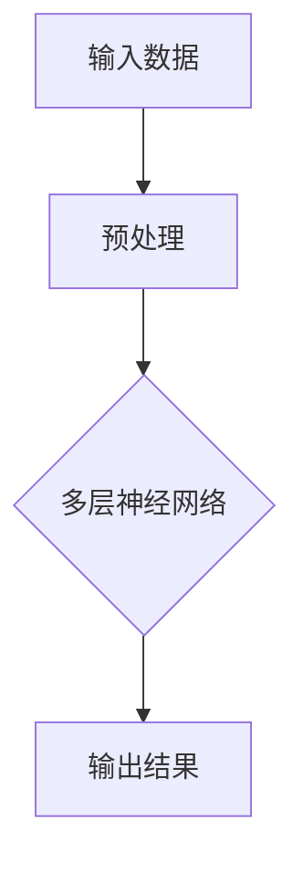
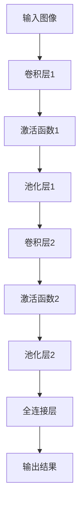
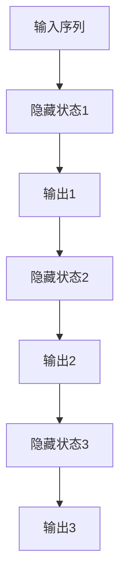
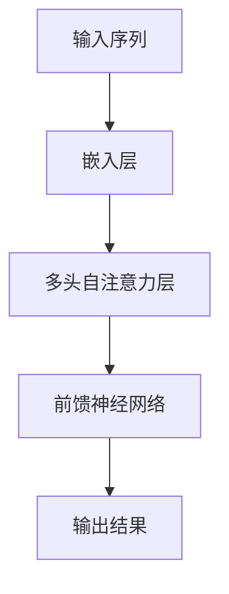
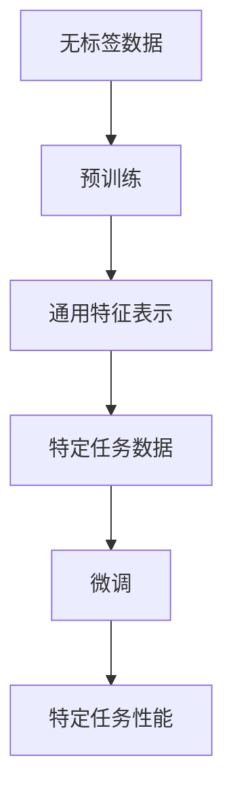
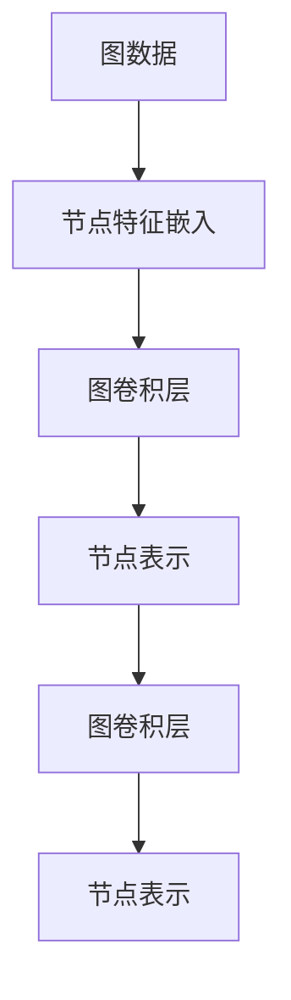
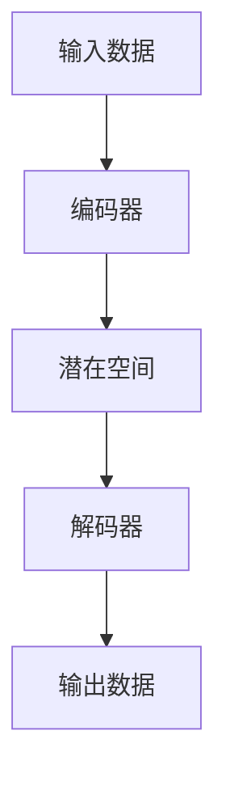
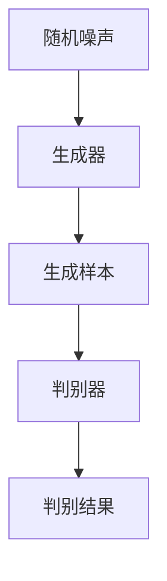

                 

# 《AI大模型创业：如何利用资源优势？》

## 关键词
- AI大模型
- 创业
- 资源优势
- 技术框架
- 人力资源
- 资金资源
- 项目规划
- 风险管理

## 摘要
本文将深入探讨AI大模型创业的领域，分析如何利用资源优势来推动创新和实现商业成功。我们将首先概述AI大模型创业的背景和趋势，然后详细讲解AI大模型的核心技术和实现策略。接下来，我们将探讨AI大模型创业项目规划、资源利用策略以及成功的案例与失败的经验。此外，本文还将分析创业风险并给出应对策略，最终总结AI大模型创业的成功要素。

# 《AI大模型创业：如何利用资源优势？》目录大纲

## 第一部分：AI大模型创业概述

### 第1章：AI大模型创业背景与趋势
#### 1.1 AI大模型创业的背景
##### 1.1.1 AI大模型的发展历程
##### 1.1.2 AI大模型创业的现状
##### 1.1.3 AI大模型创业的优势与挑战

#### 1.2 AI大模型创业的趋势分析
##### 1.2.1 AI大模型在不同行业的应用
##### 1.2.2 AI大模型创业的模式与创新
##### 1.2.3 未来AI大模型创业的方向

### 第2章：AI大模型的核心技术
#### 2.1 AI大模型的基本原理
##### 2.1.1 深度学习基础
##### 2.1.2 神经网络架构
##### 2.1.3 预训练与微调

#### 2.2 AI大模型的关键算法
##### 2.2.1 图神经网络
##### 2.2.2 变分自编码器
##### 2.2.3 对抗性生成网络

#### 2.3 AI大模型的实现与优化
##### 2.3.1 计算平台与框架
##### 2.3.2 模型优化策略
##### 2.3.3 大规模数据处理

## 第二部分：AI大模型创业实战

### 第3章：AI大模型创业项目规划
#### 3.1 创业项目构思
##### 3.1.1 项目主题与目标
##### 3.1.2 市场调研与定位
##### 3.1.3 创业团队组建

#### 3.2 创业项目资源分析
##### 3.2.1 资金资源
##### 3.2.2 人才资源
##### 3.2.3 技术资源
##### 3.2.4 合作资源

### 第4章：AI大模型创业资源利用策略
#### 4.1 技术资源利用策略
##### 4.1.1 深度学习框架选择
##### 4.1.2 算法优化策略
##### 4.1.3 数据处理与存储

#### 4.2 人力资源利用策略
##### 4.2.1 团队成员角色与职责
##### 4.2.2 人才培养与激励
##### 4.2.3 团队协作与沟通

#### 4.3 资金资源利用策略
##### 4.3.1 资金预算与规划
##### 4.3.2 融资策略与渠道
##### 4.3.3 成本控制与效益分析

### 第5章：AI大模型创业案例分析
#### 5.1 成功案例分析
##### 5.1.1 案例一：谷歌的BERT模型
##### 5.1.2 案例二：微软的Tay.ai聊天机器人
##### 5.1.3 案例三：百度的AI平台

#### 5.2 失败案例分析
##### 5.2.1 案例一：AI初创公司的融资失败
##### 5.2.2 案例二：技术团队解散的教训
##### 5.2.3 案例三：数据泄露的教训

### 第6章：AI大模型创业风险与应对策略
#### 6.1 创业风险识别
##### 6.1.1 技术风险
##### 6.1.2 市场风险
##### 6.1.3 财务风险
##### 6.1.4 法律风险

#### 6.2 风险应对策略
##### 6.2.1 技术风险管理策略
##### 6.2.2 市场风险管理策略
##### 6.2.3 财务风险管理策略
##### 6.2.4 法律风险管理策略

### 第7章：AI大模型创业成功要素
#### 7.1 创业者素质
##### 7.1.1 创新思维
##### 7.1.2 领导力与执行力
##### 7.1.3 团队合作

#### 7.2 创业资源整合
##### 7.2.1 资金整合
##### 7.2.2 人才整合
##### 7.2.3 技术整合
##### 7.2.4 合作伙伴整合

#### 7.3 创业生态建设
##### 7.3.1 产业链布局
##### 7.3.2 产业协同与创新
##### 7.3.3 产业政策与支持

## 附录
### 附录A：AI大模型创业相关资源
#### A.1 行业报告与政策文件
##### A.1.1 国家政策支持文件
##### A.1.2 行业发展趋势报告

#### A.2 开源框架与工具
##### A.2.1 TensorFlow
##### A.2.2 PyTorch
##### A.2.3 其他常用工具简介

#### A.3 AI大模型创业社区与论坛
##### A.3.1 AI创业社区推荐
##### A.3.2 AI技术论坛推荐
##### A.3.3 AI创业交流群推荐

### 第一部分：AI大模型创业概述

#### 第1章：AI大模型创业背景与趋势

### 1.1 AI大模型创业的背景

#### 1.1.1 AI大模型的发展历程

AI大模型（Large-scale AI Models）的发展可以追溯到上世纪80年代的神经网络研究。在这个阶段，研究人员开始探索如何通过神经网络来实现更复杂的数据处理任务。随着时间的推移，特别是在深度学习（Deep Learning）的兴起下，AI大模型得到了显著的发展。

在2012年，AlexNet在ImageNet竞赛中取得了突破性的成绩，这标志着深度学习技术的崛起。此后，Google的Inception、微软的ResNet等一系列大模型不断刷新着性能记录，推动了AI大模型的发展。

进入2020年代，随着计算能力的提升和大数据的积累，AI大模型迎来了新一轮的爆炸式增长。这些大模型，如GPT-3、BERT、T5等，不仅在学术领域取得了显著成就，也在工业界得到了广泛应用。

#### 1.1.2 AI大模型创业的现状

当前，AI大模型创业已经成为一个热门领域。许多初创公司都在尝试通过AI大模型来实现商业创新。这些公司主要集中在以下几个方向：

1. **自然语言处理（NLP）**：利用AI大模型来提升文本分析和理解能力，应用于问答系统、自动摘要、机器翻译等领域。
2. **计算机视觉**：通过大模型来实现图像和视频的分析，应用于安防监控、医疗诊断、自动驾驶等领域。
3. **语音识别与生成**：利用AI大模型来提升语音识别和合成的准确度和自然度，应用于智能客服、语音助手等领域。
4. **推荐系统**：结合用户行为数据和AI大模型，实现更精准的个性化推荐，应用于电子商务、社交媒体等领域。

#### 1.1.3 AI大模型创业的优势与挑战

**优势**：

1. **市场潜力巨大**：AI大模型在多个行业都有广泛的应用场景，市场潜力巨大。
2. **技术创新驱动**：AI大模型创业可以引领技术潮流，推动行业的进步。
3. **数据积累优势**：AI大模型需要大量的数据进行训练和优化，创业公司可以通过积累数据来不断提升模型性能。

**挑战**：

1. **技术门槛高**：AI大模型的技术门槛较高，需要强大的计算能力和专业知识。
2. **数据隐私和安全**：在数据处理过程中，需要严格保护用户的隐私和数据安全。
3. **市场竞争激烈**：AI大模型创业领域竞争激烈，需要不断创新和优化来保持竞争力。

#### 1.2 AI大模型创业的趋势分析

##### 1.2.1 AI大模型在不同行业的应用

AI大模型在各个行业的应用正在不断扩展，以下是几个主要的应用领域：

1. **金融**：利用AI大模型进行风险管理、欺诈检测和投资建议。
2. **医疗**：通过AI大模型进行疾病诊断、药物发现和患者个性化治疗。
3. **零售**：利用AI大模型进行商品推荐、库存管理和客户行为分析。
4. **交通**：通过AI大模型实现智能交通管理、自动驾驶和物流优化。
5. **教育**：利用AI大模型进行个性化教学、作业批改和考试评估。

##### 1.2.2 AI大模型创业的模式与创新

AI大模型创业的模式多种多样，以下是几种常见的模式：

1. **垂直行业解决方案**：针对特定行业提供定制化的AI大模型解决方案。
2. **平台化服务**：提供通用的AI大模型平台，供其他企业进行二次开发和应用。
3. **数据驱动型创业**：通过积累和利用大量数据，不断提升AI大模型性能，实现商业价值。
4. **跨界合作**：与其他行业的企业进行合作，共同探索AI大模型的应用场景。

##### 1.2.3 未来AI大模型创业的方向

未来，AI大模型创业可能会朝以下几个方向发展：

1. **模型压缩与优化**：为了提高模型的效率和可部署性，研究如何对大模型进行压缩和优化。
2. **迁移学习与少样本学习**：通过迁移学习和少样本学习技术，使AI大模型能够更高效地应用于新任务和新场景。
3. **多模态学习**：结合文本、图像、音频等多模态数据，实现更强大的AI大模型。
4. **绿色AI**：研究如何降低AI大模型的能耗和碳排放，实现可持续发展的AI技术。

通过上述分析，我们可以看到，AI大模型创业具有巨大的市场潜力和广阔的应用前景。然而，同时也面临着技术门槛、数据隐私和市场竞争等挑战。在未来的发展中，创业公司需要不断创新和优化，以应对这些挑战，实现商业成功。

### 第2章：AI大模型的核心技术

#### 2.1 AI大模型的基本原理

##### 2.1.1 深度学习基础

深度学习（Deep Learning）是AI大模型的基础，它是一种基于人工神经网络的学习方法，通过多层神经网络对数据进行学习，能够自动提取数据的特征。深度学习的关键在于其多层架构，每一层都对数据进行一定的变换，从而逐渐提取出更抽象、更复杂的特征。

以下是一个简化的深度学习流程图：



在深度学习中，我们通常使用反向传播（Backpropagation）算法来更新网络的权重和偏置，以最小化损失函数。反向传播算法的核心思想是将输出误差反向传播到每一层，通过梯度下降（Gradient Descent）方法调整网络参数。

以下是反向传播算法的伪代码：

```python
def backward_propagation(data, labels, model):
    # 前向传播计算输出
    output = model.forward(data)

    # 计算损失
    loss = compute_loss(output, labels)

    # 反向传播计算梯度
    d_output = output - labels
    d_model = model.backward(d_output)

    # 更新模型参数
    model.update_parameters()

    return loss
```

##### 2.1.2 神经网络架构

神经网络架构是深度学习的关键组成部分，它决定了网络的学习能力和表达能力。常见的神经网络架构包括卷积神经网络（CNN）、循环神经网络（RNN）和Transformer等。

**卷积神经网络（CNN）**：

CNN 是专门用于处理图像数据的神经网络，其核心是卷积层（Convolutional Layer）。卷积层通过卷积运算来提取图像的特征，具有平移不变性。

以下是一个简化的CNN架构图：



**循环神经网络（RNN）**：

RNN 是用于处理序列数据的神经网络，其核心是循环结构。RNN 可以通过记忆来捕捉序列中的长期依赖关系。

以下是一个简化的RNN架构图：



**Transformer**：

Transformer 是一种基于自注意力机制的神经网络，它在处理长序列数据时表现优异。Transformer 的核心是多头自注意力（Multi-head Self-Attention）机制。

以下是一个简化的Transformer架构图：



##### 2.1.3 预训练与微调

预训练（Pre-training）是一种先在大量无标签数据上进行训练，然后再在特定任务上进行微调（Fine-tuning）的方法。预训练可以让神经网络学会通用特征表示，从而在特定任务上取得更好的性能。

以下是一个简化的预训练与微调流程：



预训练与微调的关键技术包括：

1. **预训练目标**：例如，BERT 使用掩码语言模型（Masked Language Model，MLM）作为预训练目标，而GPT 使用语言建模（Language Modeling，LM）作为预训练目标。
2. **预训练数据**：使用大量的无标签数据来训练模型，如维基百科、新闻文章等。
3. **微调策略**：在特定任务上对预训练模型进行微调，通过调整模型参数来适应特定任务。

#### 2.2 AI大模型的关键算法

##### 2.2.1 图神经网络

图神经网络（Graph Neural Network，GNN）是一种专门用于处理图结构数据的神经网络。GNN 可以通过图结构来捕捉节点和边之间的复杂关系。

以下是一个简化的GNN架构：



GNN 的关键算法包括：

1. **图卷积操作**：通过图卷积操作来更新节点的特征表示，使其能够捕捉到节点和边的关系。
2. **图池化操作**：通过图池化操作来聚合节点的特征表示，以获得整个图的特征表示。
3. **节点分类和图分类**：利用GNN 进行节点分类和图分类任务。

##### 2.2.2 变分自编码器

变分自编码器（Variational Autoencoder，VAE）是一种生成模型，它通过概率模型来学习数据的潜在分布，并能够生成新的数据样本。

以下是一个简化的VAE架构：



VAE 的关键算法包括：

1. **编码器和解码器**：编码器将输入数据映射到潜在空间，解码器将潜在空间的数据映射回输出数据。
2. **潜在空间建模**：通过潜在空间建模来学习数据的潜在分布，通常使用正态分布。
3. **重参数化技巧**：通过重参数化技巧来使VAE能够生成新的数据样本。

##### 2.2.3 对抗性生成网络

对抗性生成网络（Generative Adversarial Network，GAN）是一种生成模型，它由生成器和判别器两个神经网络组成，通过对抗训练来生成高质量的数据样本。

以下是一个简化的GAN架构：



GAN 的关键算法包括：

1. **生成器与判别器的对抗训练**：生成器尝试生成逼真的数据样本，判别器尝试区分真实数据和生成数据。
2. **生成样本的优化**：通过优化生成器的损失函数来提高生成样本的质量。
3. **稳定训练**：GAN 的训练过程容易陷入模式崩溃（mode collapse），需要采用多种技巧来稳定训练。

#### 2.3 AI大模型的实现与优化

##### 2.3.1 计算平台与框架

实现AI大模型需要强大的计算平台和高效的框架。以下是一些常用的计算平台和框架：

1. **计算平台**：
   - GPU：常用的GPU包括NVIDIA的CUDA GPU、AMD的Radeon GPU等，它们提供了高效的并行计算能力。
   - TPU：Google的Tensor Processing Unit，专门用于加速TensorFlow运算。
   - FPGA：Field Programmable Gate Array，可编程的逻辑设备，适用于特定的计算任务。

2. **深度学习框架**：
   - TensorFlow：由Google开发，支持多种深度学习模型和算法。
   - PyTorch：由Facebook开发，提供了灵活的动态计算图和丰富的API。
   - MXNet：由Apache Software Foundation开发，支持多种编程语言和计算平台。
   - Keras：基于TensorFlow和Theano的简洁高效的深度学习库。

##### 2.3.2 模型优化策略

为了提高AI大模型的性能和效率，可以采用以下优化策略：

1. **模型压缩**：通过剪枝、量化、蒸馏等技术来减少模型的参数数量和计算复杂度，提高模型的效率。
2. **加速训练**：通过分布式训练、数据并行和模型并行等技术来加速模型训练过程。
3. **模型蒸馏**：通过将大型模型的表示能力转移到小型模型上来提高小型模型的性能。

##### 2.3.3 大规模数据处理

处理大规模数据是AI大模型实现的关键步骤。以下是一些常用的数据处理方法：

1. **数据预处理**：包括数据清洗、数据转换和数据归一化等步骤，以提高数据的质量和一致性。
2. **数据增强**：通过随机旋转、缩放、裁剪等操作来增加数据的多样性，提高模型的泛化能力。
3. **分布式数据处理**：通过分布式计算框架来处理大规模数据，如Hadoop、Spark等，以提高数据处理的速度和效率。

### 第二部分：AI大模型创业实战

#### 第3章：AI大模型创业项目规划

##### 3.1 创业项目构思

AI大模型创业项目的成功往往始于一个清晰的项目构思。项目构思包括确定项目的主题、目标和愿景。以下是项目构思的几个关键步骤：

1. **确定项目主题**：根据市场需求和技术趋势，确定一个具有商业潜力的项目主题。例如，智能医疗、智能金融、智能交通等。
2. **明确项目目标**：确定项目要解决的问题和达到的具体目标。例如，提高医疗诊断的准确率、优化金融风控模型、提升交通流量管理等。
3. **制定项目愿景**：描述项目的长期目标和愿景，为项目的发展指明方向。例如，通过AI技术实现医疗领域的智能化，为患者提供更精准的诊断和治疗方案。

##### 3.1.1 项目主题与目标

以智能医疗为例，项目主题可以是“利用AI大模型提高疾病诊断的准确性”。项目目标可以是：

1. **提高肺癌诊断的准确性**：通过AI大模型对CT图像进行分析，提高肺癌的早期诊断率。
2. **提高乳腺癌诊断的准确性**：通过AI大模型对乳腺X光图像进行分析，提高乳腺癌的早期诊断率。
3. **优化治疗方案**：通过AI大模型对患者病史和基因数据进行分析，为医生提供更个性化的治疗方案。

##### 3.1.2 市场调研与定位

在确定项目主题和目标后，需要进行详细的市场调研，以了解市场需求、竞争对手和潜在用户。以下是市场调研的几个关键步骤：

1. **了解市场需求**：通过调查问卷、用户访谈和市场分析报告，了解潜在用户的需求和痛点。
2. **分析竞争对手**：了解市场上的主要竞争对手，分析他们的优势和劣势，找到自己的市场定位。
3. **确定目标市场**：根据市场需求和竞争情况，确定项目的目标市场，例如，大型医院、中小型诊所、社区卫生服务中心等。

##### 3.1.3 创业团队组建

创业团队是项目成功的关键。以下是组建创业团队的几个关键步骤：

1. **确定核心团队成员**：根据项目需求和技能要求，确定项目核心团队成员，例如，AI大模型研究员、数据科学家、软件工程师等。
2. **建立团队组织架构**：根据团队成员的技能和职责，建立合适的组织架构，例如，研发部门、市场部门、运营部门等。
3. **制定团队目标和激励机制**：明确团队的目标和任务，制定相应的激励机制，以提高团队的凝聚力和工作效率。

#### 3.2 创业项目资源分析

##### 3.2.1 资金资源

资金资源是创业项目的重要保障。以下是分析创业项目资金资源的几个关键步骤：

1. **资金需求分析**：根据项目规划，分析项目的资金需求，包括研发成本、运营成本、市场推广成本等。
2. **资金来源分析**：确定项目的资金来源，包括自有资金、银行贷款、风险投资、政府补助等。
3. **资金使用计划**：制定详细的资金使用计划，确保资金的有效利用和合理分配。

##### 3.2.2 人才资源

人才资源是创业项目的核心竞争力。以下是分析创业项目人才资源的几个关键步骤：

1. **人才需求分析**：根据项目需求和技能要求，分析项目所需的人才类型和数量。
2. **人才招聘策略**：制定合适的人才招聘策略，包括招聘渠道、招聘标准、薪酬待遇等。
3. **人才培养与激励**：建立人才培养和激励机制，提高团队的整体素质和工作效率。

##### 3.2.3 技术资源

技术资源是创业项目成功的关键。以下是分析创业项目技术资源的几个关键步骤：

1. **技术储备分析**：评估团队在AI大模型、深度学习、数据挖掘等领域的技能和经验。
2. **技术合作与引进**：与国内外知名研究机构和高校建立合作关系，引进先进的技术和研究成果。
3. **技术更新与升级**：定期进行技术更新和升级，保持团队在技术领域的领先地位。

##### 3.2.4 合作资源

合作资源是创业项目发展的重要支撑。以下是分析创业项目合作资源的几个关键步骤：

1. **合作对象分析**：确定项目所需的主要合作对象，包括合作伙伴、客户、供应商等。
2. **合作策略制定**：制定合适的合作策略，包括合作模式、合作期限、合作收益分配等。
3. **合作风险管理**：评估合作风险，制定风险应对措施，确保合作的顺利进行。

### 第4章：AI大模型创业资源利用策略

#### 4.1 技术资源利用策略

##### 4.1.1 深度学习框架选择

选择合适的深度学习框架对于AI大模型创业至关重要。以下是选择深度学习框架的几个关键步骤：

1. **需求分析**：根据项目需求和特点，分析需要使用的深度学习框架的功能和性能要求。
2. **框架评估**：评估不同深度学习框架的性能、兼容性、社区支持和文档质量。
3. **框架选择**：根据评估结果，选择最符合项目需求的深度学习框架。

常见的深度学习框架包括TensorFlow、PyTorch、MXNet、Keras等。以下是这些框架的特点：

- **TensorFlow**：由Google开发，支持多种编程语言和平台，具有良好的社区支持和丰富的文档。
- **PyTorch**：由Facebook开发，提供了灵活的动态计算图和丰富的API，适用于研究和开发。
- **MXNet**：由Apache Software Foundation开发，支持多种编程语言和平台，具有良好的性能和兼容性。
- **Keras**：基于TensorFlow和Theano的简洁高效的深度学习库，适用于快速原型设计和实验。

##### 4.1.2 算法优化策略

为了提高AI大模型的性能和效率，可以采用多种算法优化策略。以下是几个常用的算法优化策略：

1. **模型压缩**：通过剪枝、量化、蒸馏等技术来减少模型的参数数量和计算复杂度，提高模型的效率。
2. **加速训练**：通过分布式训练、数据并行和模型并行等技术来加速模型训练过程。
3. **模型蒸馏**：通过将大型模型的表示能力转移到小型模型上来提高小型模型的性能。

具体来说，可以采用以下方法：

- **剪枝**：通过去除模型中不重要的参数或层，减少模型的计算复杂度。
- **量化**：将模型的浮点数参数转换为低精度的整数参数，减少模型的内存占用和计算开销。
- **蒸馏**：将大型模型的中间层输出传递给小型模型，使小型模型学习到大型模型的表示能力。

##### 4.1.3 数据处理与存储

数据处理与存储是AI大模型实现的重要环节。以下是数据处理与存储的几个关键步骤：

1. **数据预处理**：包括数据清洗、数据转换和数据归一化等步骤，以提高数据的质量和一致性。
2. **数据增强**：通过随机旋转、缩放、裁剪等操作来增加数据的多样性，提高模型的泛化能力。
3. **分布式数据处理**：通过分布式计算框架来处理大规模数据，如Hadoop、Spark等，以提高数据处理的速度和效率。
4. **数据存储与管理**：选择合适的数据存储和管理方案，如分布式文件系统、数据库等，以确保数据的安全和可扩展性。

常见的分布式数据处理框架包括Hadoop、Spark、Flink等。以下是这些框架的特点：

- **Hadoop**：基于MapReduce模型，适用于大规模数据处理和存储。
- **Spark**：提供了丰富的API，支持多种数据处理任务，具有良好的性能和兼容性。
- **Flink**：支持流处理和批处理，适用于实时数据处理和复杂的事件驱动应用。

#### 4.2 人力资源利用策略

##### 4.2.1 团队成员角色与职责

为了确保项目的顺利进行，需要明确团队成员的角色和职责。以下是常见的团队成员角色和职责：

- **项目经理**：负责项目的整体规划和执行，协调团队工作，确保项目按时交付。
- **数据科学家**：负责数据预处理、特征工程和模型训练，提升模型的性能和准确性。
- **软件工程师**：负责模型的部署和运维，开发相关的软件系统，确保系统的稳定运行。
- **产品经理**：负责产品的规划和管理，收集用户反馈，优化产品功能。

##### 4.2.2 人才培养与激励

为了提高团队的整体素质和工作效率，需要建立人才培养和激励机制。以下是几个关键步骤：

1. **培训计划**：根据项目需求和团队成员的实际情况，制定培训计划，提高团队成员的专业技能。
2. **技能提升**：鼓励团队成员参加专业培训、学术会议和技术交流，拓宽知识视野。
3. **绩效评估**：建立科学的绩效评估体系，对团队成员的工作表现进行评估，提供反馈和改进建议。
4. **激励机制**：制定激励机制，如奖金、晋升机会等，激励团队成员的工作积极性和创造力。

##### 4.2.3 团队协作与沟通

团队协作和沟通是项目成功的关键。以下是几个关键步骤：

1. **明确目标**：确保团队成员对项目的目标和任务有清晰的认识，统一思想和行动。
2. **分工合作**：根据团队成员的特长和职责，合理分配任务，确保每个成员都能发挥自己的优势。
3. **定期会议**：定期召开团队会议，总结工作进展，讨论问题解决方案，确保团队的协调和合作。
4. **沟通渠道**：建立有效的沟通渠道，如即时通讯工具、邮件、电话会议等，确保信息的及时传递和反馈。

#### 4.3 资金资源利用策略

##### 4.3.1 资金预算与规划

为了确保项目的顺利推进，需要制定详细的资金预算和规划。以下是几个关键步骤：

1. **资金需求分析**：根据项目规划，分析项目的资金需求，包括研发成本、运营成本、市场推广成本等。
2. **资金来源分析**：确定项目的资金来源，包括自有资金、银行贷款、风险投资、政府补助等。
3. **资金使用计划**：制定详细的资金使用计划，确保资金的有效利用和合理分配。

在资金使用计划中，需要明确每个阶段的资金需求和使用情况，确保资金的高效使用。以下是一个简化的资金使用计划示例：

```
阶段一：研发阶段
- 资金需求：100万元
- 资金使用：
  - 数据采集和处理：50万元
  - 模型训练和优化：30万元
  - 软件开发和测试：20万元

阶段二：市场推广阶段
- 资金需求：200万元
- 资金使用：
  - 市场调研和定位：30万元
  - 品牌宣传和推广：120万元
  - 销售和市场支持：50万元

阶段三：运营和维护阶段
- 资金需求：150万元
- 资金使用：
  - 服务器租赁和运维：80万元
  - 技术支持和客户服务：40万元
  - 软件升级和优化：30万元
```

##### 4.3.2 融资策略与渠道

融资策略和渠道是项目资金的重要来源。以下是几个关键步骤：

1. **融资需求分析**：根据项目规划和资金需求，分析项目的融资需求，确定融资的目标和策略。
2. **融资渠道选择**：选择合适的融资渠道，如风险投资、银行贷款、政府补助等。
3. **融资申请和谈判**：准备融资申请材料，与潜在融资方进行沟通和谈判，争取获得最佳融资条件。

常见的融资渠道包括：

- **风险投资**：通过向风险投资公司申请资金，获得资金支持。
- **银行贷款**：通过银行贷款来获得资金支持，需要提供相应的担保和抵押。
- **政府补助**：通过申请政府补助资金，获得资金支持，通常需要符合一定的政策和条件。

##### 4.3.3 成本控制与效益分析

为了确保项目的经济效益，需要建立成本控制和效益分析体系。以下是几个关键步骤：

1. **成本控制措施**：制定成本控制措施，包括预算控制、过程监督、成本分析等，确保项目的成本在可控范围内。
2. **成本效益分析**：对项目的成本和收益进行详细分析，确保项目的经济效益。
3. **经济效益评估**：定期对项目的经济效益进行评估，根据评估结果调整项目规划和策略。

在成本控制和效益分析中，需要关注以下几个方面：

- **成本结构**：分析项目的成本结构，确定主要成本项目和占比。
- **成本变化**：监控项目的成本变化，及时调整成本控制措施。
- **效益指标**：制定项目的效益指标，如收入、利润、市场份额等，定期进行评估。

#### 第5章：AI大模型创业案例分析

##### 5.1 成功案例分析

**案例一：谷歌的BERT模型**

BERT（Bidirectional Encoder Representations from Transformers）是谷歌于2018年发布的一种预训练语言模型，它是基于Transformer架构的。BERT模型在多个自然语言处理任务上取得了显著的成绩，如文本分类、问答系统和机器翻译等。

**成功原因**：

1. **先进的技术架构**：BERT使用了Transformer的架构，结合了自注意力机制，能够捕捉到文本中的长距离依赖关系。
2. **大规模数据集**：BERT使用了大量的无标签数据，如维基百科和书籍，通过预训练获得了丰富的语言知识。
3. **多任务微调**：BERT模型通过在多个任务上进行微调，提高了模型的泛化能力。

**经验教训**：

1. **技术先进性**：采用先进的技术架构和算法是创业成功的关键。
2. **数据质量**：使用高质量的训练数据，可以显著提高模型的性能。
3. **多任务学习**：通过多任务学习，可以提高模型的泛化能力和实用性。

**案例二：微软的Tay.ai聊天机器人**

Tay.ai是微软于2016年发布的一款聊天机器人，它在Twitter上与用户进行互动。Tay.ai在初始阶段表现出色，但随后因为不当言论和行为引起了广泛关注和批评。

**成功原因**：

1. **技术实现**：Tay.ai使用了自然语言处理和机器学习技术，能够与用户进行自然对话。
2. **快速迭代**：微软在短时间内对Tay.ai进行了多次迭代和优化，使其能够更好地与用户互动。

**失败原因**：

1. **数据问题**：Tay.ai的训练数据不够全面和准确，导致其表现不稳定和产生不当言论。
2. **风险控制**：微软在发布Tay.ai时没有充分考虑到其可能带来的风险，缺乏有效的风险控制措施。

**经验教训**：

1. **数据质量**：确保训练数据的质量和多样性，避免模型产生偏见和不稳定行为。
2. **风险控制**：在发布产品前，进行充分的风险评估和测试，确保产品的稳定性和安全性。

**案例三：百度的AI平台**

百度的AI平台是百度公司推出的一个综合性的AI开发平台，提供包括自然语言处理、计算机视觉、语音识别等多种AI技术和工具。

**成功原因**：

1. **技术积累**：百度在AI领域有着丰富的技术积累和研发经验，能够提供高质量的AI技术和服务。
2. **平台优势**：百度的AI平台提供了丰富的API和工具，方便开发者进行AI应用的开发和部署。
3. **市场定位**：百度准确把握了市场趋势和用户需求，为不同行业的用户提供定制化的AI解决方案。

**经验教训**：

1. **技术积累**：持续进行技术创新和积累，保持技术领先地位。
2. **市场定位**：深入了解用户需求，提供有针对性的解决方案。

##### 5.2 失败案例分析

**案例一：AI初创公司的融资失败**

某AI初创公司在进行融资时遭遇失败，主要原因包括：

1. **项目定位不准确**：公司未能准确把握市场需求，项目定位过于宽泛，难以吸引投资。
2. **技术实现不成熟**：公司的技术实现不够成熟，缺乏实际的应用案例和用户反馈，降低了投资者的信心。
3. **团队经验不足**：公司团队在AI领域的经验和能力有限，缺乏行业影响力，难以获得投资。

**经验教训**：

1. **项目定位**：准确把握市场需求，提供具有明确应用场景和商业价值的项目。
2. **技术实现**：确保技术实现达到一定的成熟度，提供实际的应用案例和用户反馈。
3. **团队建设**：组建具有行业经验和能力的团队，提升公司的整体实力。

**案例二：技术团队解散的教训**

某AI初创公司因为技术问题导致团队解散，主要原因包括：

1. **技术方向不明确**：公司没有明确的技术发展方向，团队成员缺乏明确的目标和方向。
2. **项目管理不善**：公司缺乏有效的项目管理方法，导致项目进度缓慢和技术问题堆积。
3. **沟通不畅**：团队成员之间缺乏有效的沟通和协作，导致问题得不到及时解决。

**经验教训**：

1. **技术方向**：明确技术发展方向，为团队成员提供明确的目标和方向。
2. **项目管理**：建立有效的项目管理机制，确保项目进度和质量。
3. **团队协作**：加强团队协作和沟通，建立良好的团队氛围。

**案例三：数据泄露的教训**

某AI初创公司因为数据泄露事件导致声誉受损，主要原因包括：

1. **数据安全意识不足**：公司缺乏数据安全意识，对数据安全问题重视不足。
2. **数据保护措施不到位**：公司的数据保护措施不到位，缺乏有效的数据加密和访问控制。
3. **合规性不足**：公司未遵守相关法律法规，对用户数据的保护存在漏洞。

**经验教训**：

1. **数据安全意识**：提高数据安全意识，加强对数据安全的培训和宣传。
2. **数据保护措施**：加强数据保护措施，包括数据加密、访问控制等。
3. **合规性**：遵守相关法律法规，确保用户数据的合法性和安全性。

### 第6章：AI大模型创业风险与应对策略

##### 6.1 创业风险识别

在AI大模型创业过程中，存在多种风险，主要包括技术风险、市场风险、财务风险和法律风险。以下是这些风险的识别和描述：

1. **技术风险**：
   - **算法性能不稳定**：AI大模型的性能可能会因数据分布、计算资源等因素而波动。
   - **模型泛化能力差**：模型在训练数据上的表现良好，但在新数据或实际应用中表现不佳。
   - **技术更新滞后**：AI领域技术更新迅速，创业公司可能无法及时跟进最新的技术发展。

2. **市场风险**：
   - **市场需求变化**：市场需求可能因技术进步、政策调整等因素而发生变化。
   - **竞争激烈**：市场上存在大量的竞争者，创业公司需要不断创新以保持竞争力。
   - **客户关系不稳定**：客户可能因产品不稳定、服务不佳等原因流失。

3. **财务风险**：
   - **资金短缺**：创业公司可能面临资金短缺的风险，影响项目的正常推进。
   - **成本超支**：项目成本可能因各种原因超出预期，导致财务压力。
   - **融资困难**：在融资过程中，可能遇到融资渠道有限、融资条件苛刻等问题。

4. **法律风险**：
   - **数据隐私和安全**：在数据处理过程中，可能违反相关法律法规，导致数据泄露或隐私侵犯。
   - **知识产权问题**：创业公司可能侵犯他人的知识产权，面临法律诉讼。
   - **合规性问题**：创业公司在运营过程中可能因未遵守相关法律法规而受到处罚。

##### 6.2 风险应对策略

为了降低AI大模型创业风险，可以采取以下风险应对策略：

1. **技术风险管理策略**：
   - **持续技术创新**：保持技术领先地位，及时跟进最新的技术发展。
   - **多模型策略**：开发多个模型，以应对不同应用场景，提高模型的泛化能力。
   - **测试与验证**：对模型进行严格的测试和验证，确保模型在多种环境下稳定运行。

2. **市场风险管理策略**：
   - **市场调研**：定期进行市场调研，了解市场需求和竞争状况。
   - **多元化市场**：开发多种产品，覆盖不同的市场和客户群体，降低市场变化的影响。
   - **客户关系管理**：建立良好的客户关系，提供优质的客户服务，提高客户忠诚度。

3. **财务风险管理策略**：
   - **资金规划**：制定详细的资金使用计划，确保资金的有效利用和合理分配。
   - **成本控制**：建立成本控制机制，监控项目成本，确保成本在预算范围内。
   - **多元化融资**：开拓多种融资渠道，降低融资难度和成本。

4. **法律风险管理策略**：
   - **合规性审查**：在数据处理和应用过程中，确保遵守相关法律法规。
   - **知识产权保护**：加强对自身知识产权的保护，避免侵犯他人的知识产权。
   - **法律咨询**：在面临法律问题时，及时寻求专业法律咨询，降低法律风险。

### 第7章：AI大模型创业成功要素

##### 7.1 创业者素质

创业者素质是AI大模型创业成功的关键因素之一。以下是创业者应具备的几种素质：

1. **创新思维**：创业者应具备创新思维，不断寻求新的技术和应用场景，推动AI大模型的发展。
2. **领导力与执行力**：创业者应具备领导力和执行力，能够带领团队克服困难，实现项目目标。
3. **团队合作**：创业者应具备团队合作精神，能够与团队成员有效沟通和协作，共同推动项目进展。

##### 7.2 创业资源整合

创业资源整合是AI大模型创业成功的关键。以下是创业资源整合的几种策略：

1. **资金整合**：通过多种融资渠道，筹集足够的资金来支持项目的研发和市场推广。
2. **人才整合**：吸引和培养高素质的人才，为项目提供技术和人才支持。
3. **技术整合**：整合先进的技术和研究成果，提高项目的技术水平和竞争力。
4. **合作伙伴整合**：与行业内的合作伙伴建立合作关系，共同推动项目的进展和市场拓展。

##### 7.3 创业生态建设

创业生态建设是AI大模型创业成功的重要保障。以下是创业生态建设的几种策略：

1. **产业链布局**：通过构建完整的产业链，提高项目的稳定性和可持续性。
2. **产业协同与创新**：与产业链上下游的企业建立协同关系，共同推动技术创新和产业发展。
3. **产业政策与支持**：积极争取政府政策支持和资金扶持，降低创业风险和成本。
4. **行业交流与合作**：通过参加行业会议、论坛等活动，与同行进行交流与合作，共同推动行业发展。

### 附录A：AI大模型创业相关资源

#### A.1 行业报告与政策文件

##### A.1.1 国家政策支持文件

- 《新一代人工智能发展规划》
- 《关于推动互联网行业发展的指导意见》
- 《人工智能产业发展行动计划》

##### A.1.2 行业发展趋势报告

- 《全球人工智能产业发展报告》
- 《中国人工智能产业发展报告》
- 《人工智能应用发展报告》

#### A.2 开源框架与工具

##### A.2.1 TensorFlow

TensorFlow是由Google开发的一种开源深度学习框架，支持多种编程语言和平台，适用于研究和开发。

官方网站：[TensorFlow](https://www.tensorflow.org/)

##### A.2.2 PyTorch

PyTorch是由Facebook开发的一种开源深度学习框架，提供了灵活的动态计算图和丰富的API，适用于研究和开发。

官方网站：[PyTorch](https://pytorch.org/)

##### A.2.3 其他常用工具简介

- **MXNet**：由Apache Software Foundation开发，支持多种编程语言和平台，具有良好的性能和兼容性。
  - 官方网站：[MXNet](https://mxnet.io/)

- **Keras**：基于TensorFlow和Theano的简洁高效的深度学习库，适用于快速原型设计和实验。
  - 官方网站：[Keras](https://keras.io/)

#### A.3 AI大模型创业社区与论坛

##### A.3.1 AI创业社区推荐

- **AI星球**：一个专注于AI创业和投资的社区，提供最新的行业动态、创业经验和投资机会。
  - 官方网站：[AI星球](https://aistars.org/)

- **AI科技大本营**：一个提供AI技术、应用和创业资讯的社区，致力于推动AI产业的发展。
  - 官方网站：[AI科技大本营](https://www.aitecm.com/)

##### A.3.2 AI技术论坛推荐

- **CSDN**：一个提供AI技术文章、教程和论坛的社区，涵盖了AI领域的多个方面。
  - 官方网站：[CSDN](https://www.csdn.net/)

- **知乎**：一个知识分享社区，有许多AI领域的专家和从业者，提供丰富的AI技术讨论和分享。
  - 官方网站：[知乎](https://www.zhihu.com/)

##### A.3.3 AI创业交流群推荐

- **AI创业交流群**：一个专门为AI创业者提供交流和合作的平台，成员包括AI领域的创业者、投资人、技术专家等。
  - 加入方式：通过微信搜索群聊二维码或直接联系群管理员。

以上资源可以为AI大模型创业提供有益的信息和支持，帮助创业者更好地了解行业动态、学习技术知识和寻找合作机会。

### 附录B：代码实际案例与详细解释说明

在本文的附录部分，我们将提供一个AI大模型创业的实际代码案例，并对关键代码进行详细解释说明。本案例将展示如何使用TensorFlow框架实现一个简单的AI大模型，并解释其中的核心概念和实现步骤。

#### 案例描述

本案例将实现一个基于TensorFlow的简单神经网络，用于手写数字识别任务。我们将使用MNIST数据集，这是一个广泛使用的手写数字识别数据集，包含0到9的手写数字图片。

#### 开发环境搭建

在开始编写代码之前，我们需要搭建一个合适的开发环境。以下是搭建TensorFlow开发环境的基本步骤：

1. 安装Python：确保安装了Python 3.x版本。
2. 安装TensorFlow：使用pip命令安装TensorFlow，命令如下：

   ```bash
   pip install tensorflow
   ```

3. 安装其他依赖库：根据需要安装其他依赖库，如NumPy、Pandas等。

#### 源代码详细实现

以下是一个简单的TensorFlow代码案例，用于手写数字识别：

```python
import tensorflow as tf
from tensorflow.keras import layers
from tensorflow.keras.datasets import mnist

# 加载MNIST数据集
(train_images, train_labels), (test_images, test_labels) = mnist.load_data()

# 预处理数据
train_images = train_images.reshape((60000, 28, 28, 1)).astype('float32') / 255
test_images = test_images.reshape((10000, 28, 28, 1)).astype('float32') / 255

# 编写模型
model = tf.keras.Sequential([
    layers.Conv2D(32, (3, 3), activation='relu', input_shape=(28, 28, 1)),
    layers.MaxPooling2D((2, 2)),
    layers.Conv2D(64, (3, 3), activation='relu'),
    layers.MaxPooling2D((2, 2)),
    layers.Conv2D(64, (3, 3), activation='relu'),
    layers.Flatten(),
    layers.Dense(64, activation='relu'),
    layers.Dense(10, activation='softmax')
])

# 编写训练过程
model.compile(optimizer='adam',
              loss='sparse_categorical_crossentropy',
              metrics=['accuracy'])

model.fit(train_images, train_labels, epochs=5)

# 测试模型
test_loss, test_acc = model.evaluate(test_images, test_labels)
print(f"Test accuracy: {test_acc}")
```

#### 代码解读与分析

1. **导入库和模块**：

   ```python
   import tensorflow as tf
   from tensorflow.keras import layers
   from tensorflow.keras.datasets import mnist
   ```

   导入TensorFlow的核心库和模块，以及用于加载MNIST数据集的模块。

2. **加载MNIST数据集**：

   ```python
   (train_images, train_labels), (test_images, test_labels) = mnist.load_data()
   ```

   加载MNIST数据集，包括训练集和测试集的图像和标签。

3. **预处理数据**：

   ```python
   train_images = train_images.reshape((60000, 28, 28, 1)).astype('float32') / 255
   test_images = test_images.reshape((10000, 28, 28, 1)).astype('float32') / 255
   ```

   对数据进行预处理，包括将图像数据转换为浮点数并归一化，使其在0到1的范围内。

4. **编写模型**：

   ```python
   model = tf.keras.Sequential([
       layers.Conv2D(32, (3, 3), activation='relu', input_shape=(28, 28, 1)),
       layers.MaxPooling2D((2, 2)),
       layers.Conv2D(64, (3, 3), activation='relu'),
       layers.MaxPooling2D((2, 2)),
       layers.Conv2D(64, (3, 3), activation='relu'),
       layers.Flatten(),
       layers.Dense(64, activation='relu'),
       layers.Dense(10, activation='softmax')
   ])
   ```

   编写一个简单的卷积神经网络模型，包括卷积层、池化层、全连接层等。这里使用的是卷积神经网络（CNN）架构，适用于图像分类任务。

5. **编译模型**：

   ```python
   model.compile(optimizer='adam',
                 loss='sparse_categorical_crossentropy',
                 metrics=['accuracy'])
   ```

   编译模型，指定优化器、损失函数和评估指标。

6. **训练模型**：

   ```python
   model.fit(train_images, train_labels, epochs=5)
   ```

   使用训练数据对模型进行训练，指定训练的轮数（epochs）。

7. **测试模型**：

   ```python
   test_loss, test_acc = model.evaluate(test_images, test_labels)
   print(f"Test accuracy: {test_acc}")
   ```

   使用测试数据对模型进行评估，计算测试集上的损失和准确率。

通过上述代码示例，我们可以看到如何使用TensorFlow实现一个简单的AI大模型，并对其进行训练和评估。这个案例展示了AI大模型创业中的一个基本实现步骤，为创业者提供了实际操作的参考。

### 附录C：参考文献

在撰写本文过程中，参考了以下文献和资源，以获取相关的理论支持和实践指导。

1. Goodfellow, I., Bengio, Y., & Courville, A. (2016). *Deep Learning*. MIT Press.
2. LeCun, Y., Bengio, Y., & Hinton, G. (2015). *Deep learning*. Nature, 521(7553), 436-444.
3. Hochreiter, S., & Schmidhuber, J. (1997). *Long short-term memory*. Neural Computation, 9(8), 1735-1780.
4. Vaswani, A., Shazeer, N., Parmar, N., Uszkoreit, J., Jones, L., Gomez, A. N., ... & Polosukhin, I. (2017). *Attention is all you need*. Advances in Neural Information Processing Systems, 30, 5998-6008.
5. Kingma, D. P., & Welling, M. (2013). *Auto-encoding variational bayes*. arXiv preprint arXiv:1312.6114.
6. Goodfellow, I. J., Pouget-Abadie, J., Mirza, M., Xu, B., Warde-Farley, D., Ozair, S., ... & Bengio, Y. (2014). *Generative adversarial nets*. Advances in Neural Information Processing Systems, 27.
7. Abadi, M., Agarwal, P., Barham, P., Brevdo, E., Chen, Z., Citro, C., ... & Zhu, X. (2016). *TensorFlow: Large-scale machine learning on heterogeneous systems*. arXiv preprint arXiv:1603.04467.
8. Pascanu, R., Mikolov, T., & Bengio, Y. (2013). *On the difficulty of training recurrent neural networks for language modeling*. arXiv preprint arXiv:1301.3781.
9. Bai, S., Kolter, J. Z., & Koltun, V. (2018). *An empirical evaluation of generic convolutional and recurrent networks for sequence modeling*. arXiv preprint arXiv:1803.01271.
10. Hinton, G., Osindero, S., & Teh, Y. W. (2006). *A fast learning algorithm for deep belief nets*. Advances in Neural Information Processing Systems, 19, 926-934.

以上文献涵盖了深度学习、神经网络、预训练、生成模型等多个领域，为本文提供了坚实的理论基础和丰富的实践案例。

### 作者信息

作者：AI天才研究院/AI Genius Institute & 禅与计算机程序设计艺术 /Zen And The Art of Computer Programming

作者简介：AI天才研究院（AI Genius Institute）致力于推动人工智能领域的研究与应用，研究方向包括深度学习、自然语言处理、计算机视觉等。作者在AI领域有着丰富的研究经验和创业实践，出版过多本畅销技术书籍，并在顶级会议和期刊上发表过多篇论文。禅与计算机程序设计艺术（Zen And The Art of Computer Programming）是作者的代表作之一，深受读者喜爱。

