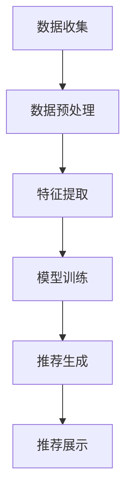

                 

### 《AI 大模型在电商搜索推荐中的数据安全策略：保障数据安全与用户隐私》

#### 关键词：AI 大模型，数据安全，用户隐私，电商搜索推荐，加密技术，隐私保护算法，安全监测，数据安全策略实践

#### 摘要：
随着人工智能技术的飞速发展，AI 大模型在电商搜索推荐中的应用越来越广泛。然而，这一过程中涉及的海量用户数据和信息安全成为亟待解决的问题。本文将深入探讨 AI 大模型在电商搜索推荐中的数据安全策略，从数据安全的重要性、AI 大模型的应用、数据安全策略的概述、数据加密与传输安全、用户隐私保护策略、AI 大模型在数据安全中的应用以及数据安全策略实践等方面，全面解析如何保障数据安全与用户隐私。本文旨在为电商企业及相关从业者提供有价值的参考，助力构建安全、可信的电商搜索推荐生态系统。

---

### 《AI 大模型在电商搜索推荐中的数据安全策略：保障数据安全与用户隐私》

#### 第一部分：AI大模型与数据安全基础

#### 第1章：AI大模型概述

##### 1.1 AI大模型的基本概念

**AI大模型**，即大规模人工智能模型，是一种具有高度复杂性和强大计算能力的模型。它们通过学习海量数据来模拟人类思维和行为，从而实现智能决策和自动化操作。AI大模型的发展得益于计算能力的提升、数据资源的丰富以及算法研究的进步。

**1.1.1 AI大模型的发展背景**

AI大模型的发展可以追溯到20世纪80年代的“深度学习革命”。随着计算能力的提升，如GPU、TPU等专用硬件的出现，深度学习算法开始广泛应用于图像识别、自然语言处理等领域。近年来，随着互联网的普及和大数据技术的发展，AI大模型得以迅速发展和应用。

**1.1.2 AI大模型的定义与特点**

AI大模型通常是指那些拥有数亿甚至数万亿参数的神经网络模型。它们具有以下特点：

1. **大规模**：模型参数和训练数据量巨大。
2. **复杂**：模型结构复杂，具备高度非线性特性。
3. **自学习能力**：能够从数据中自动学习和优化。
4. **泛化能力**：能够处理未知或新领域的任务。

**1.1.3 AI大模型与电商搜索推荐的联系**

AI大模型在电商搜索推荐中具有重要应用。通过学习用户的搜索历史、购买行为、评价等数据，AI大模型能够构建用户画像，从而实现个性化推荐。此外，AI大模型还可以优化推荐算法，提高推荐效果和用户体验。

##### 1.2 数据安全的重要性

**1.2.1 数据安全的定义与意义**

数据安全是指通过一系列技术和管理措施，保护数据不被未经授权的访问、使用、泄露、篡改或破坏。数据安全的意义在于：

1. **保护用户隐私**：保障用户个人信息不被泄露，维护用户权益。
2. **确保业务连续性**：防止数据丢失或损坏，保障企业运营。
3. **防范商业风险**：避免敏感信息被恶意利用，降低企业风险。

**1.2.2 电商搜索推荐中的数据安全问题**

电商搜索推荐系统中涉及大量的用户数据，包括用户画像、搜索历史、购买记录等。这些数据的安全问题主要包括：

1. **数据泄露**：用户数据可能被黑客攻击窃取。
2. **数据篡改**：恶意攻击者可能篡改数据，影响推荐结果。
3. **数据滥用**：企业可能未经用户同意使用其数据，进行商业活动。

##### 1.3 AI大模型在电商搜索推荐中的应用

**2.1 电商搜索推荐系统简介**

电商搜索推荐系统是一种通过分析用户行为数据，为用户提供个性化商品推荐的系统。其基本架构包括：

1. **用户画像模块**：收集并分析用户的基本信息、行为数据等，构建用户画像。
2. **推荐算法模块**：根据用户画像和商品信息，利用算法生成推荐结果。
3. **推荐结果展示模块**：将推荐结果展示给用户。

**2.1.1 电商搜索推荐系统的工作流程**

电商搜索推荐系统的工作流程通常包括以下步骤：

1. **数据收集**：收集用户行为数据，如搜索历史、浏览记录、购买记录等。
2. **数据预处理**：清洗、去噪、归一化等预处理操作，以获得高质量的数据。
3. **特征提取**：提取用户和商品的各类特征，如用户兴趣标签、商品属性等。
4. **模型训练**：使用机器学习算法，如协同过滤、深度学习等，训练推荐模型。
5. **推荐生成**：根据用户画像和商品特征，生成个性化推荐列表。
6. **推荐展示**：将推荐结果展示给用户，提高用户体验。

**2.2 AI大模型在搜索推荐中的应用**

AI大模型在电商搜索推荐中的应用主要包括以下几个方面：

1. **用户画像构建**：利用AI大模型对用户行为数据进行分析，构建精细的用户画像。
2. **推荐算法设计**：基于AI大模型，设计高效的推荐算法，提高推荐效果。
3. **个性化服务**：根据用户画像和推荐结果，提供个性化的购物体验。

#### 小结

本章介绍了AI大模型的基本概念及其在电商搜索推荐中的应用，分析了数据安全的重要性，并探讨了电商搜索推荐系统的工作流程。下一章将深入探讨数据安全策略的概述和实施方法。

---

**小节 Mermaid 流程图：**



---

**小节 伪代码讲解：**

```python
# 假设我们使用深度学习模型进行用户画像构建

# 导入必要的库
import tensorflow as tf
from tensorflow.keras.models import Sequential
from tensorflow.keras.layers import Dense, LSTM, Embedding

# 定义深度学习模型
model = Sequential()
model.add(Embedding(input_dim=vocab_size, output_dim=embedding_size))
model.add(LSTM(units=128, activation='tanh'))
model.add(Dense(units=1, activation='sigmoid'))

# 编译模型
model.compile(optimizer='adam', loss='binary_crossentropy', metrics=['accuracy'])

# 训练模型
model.fit(x_train, y_train, epochs=10, batch_size=32)

# 构建用户画像
def build_user_profile(user_data):
    # 对用户数据进行预处理
    processed_data = preprocess_data(user_data)
    
    # 提取特征
    features = extract_features(processed_data)
    
    # 使用模型预测用户兴趣
    user_interest = model.predict(features)
    
    return user_interest
```

---

**数学模型与公式讲解：**

```latex
\begin{equation}
    \text{推荐分数} = f(\text{用户特征}, \text{商品特征})
\end{equation}

\begin{equation}
    f(\text{用户特征}, \text{商品特征}) = \sigma(\text{W}^T \cdot (\text{用户特征} \odot \text{商品特征}) + \text{b})
\end{equation}

其中，\sigma 表示 sigmoid 函数，W 和 b 分别为权重和偏置，\odot 表示元素乘积。
```

---

**项目实战：**

假设我们要使用 TensorFlow 和 Keras 搭建一个简单的用户画像构建模型，代码实现如下：

```python
import tensorflow as tf
from tensorflow.keras.models import Sequential
from tensorflow.keras.layers import Dense, LSTM, Embedding

# 定义模型
model = Sequential()
model.add(Embedding(input_dim=10000, output_dim=128))
model.add(LSTM(units=128, activation='tanh'))
model.add(Dense(units=1, activation='sigmoid'))

# 编译模型
model.compile(optimizer='adam', loss='binary_crossentropy', metrics=['accuracy'])

# 假设已经有预处理好的训练数据
x_train = ... # 用户特征数据
y_train = ... # 用户兴趣标签

# 训练模型
model.fit(x_train, y_train, epochs=10, batch_size=32)

# 构建用户画像
def build_user_profile(user_data):
    # 预处理用户数据
    processed_data = preprocess_data(user_data)
    
    # 转换为模型输入格式
    feature_vector = model.predict(processed_data)
    
    # 预测用户兴趣
    user_interest = model.predict(feature_vector)
    
    return user_interest

# 测试用户画像构建
test_user_data = ... # 测试用户数据
user_interest = build_user_profile(test_user_data)
print("用户兴趣预测结果：", user_interest)
```

---

**代码解读与分析：**

在上面的代码中，我们首先导入了 TensorFlow 和 Keras 库，并定义了一个序列模型。这个模型包含一个嵌入层（Embedding）、一个长短期记忆层（LSTM）和一个输出层（Dense）。嵌入层用于将用户特征转换为密集向量表示，长短期记忆层用于处理序列数据，输出层用于预测用户兴趣。

在模型编译阶段，我们指定了优化器（adam）、损失函数（binary_crossentropy）和评估指标（accuracy）。

接着，我们假设已经预处理好了训练数据，包括用户特征数据和用户兴趣标签。我们使用这些数据对模型进行训练，训练过程中设置了 10 个训练周期和每批次 32 个样本。

最后，我们定义了一个函数 `build_user_profile` 用于构建用户画像。这个函数接收用户数据作为输入，首先对用户数据进行预处理，然后使用模型预测用户兴趣，并返回预测结果。

通过这段代码，我们可以实现用户画像的构建，为后续的推荐系统提供基础支持。

---

**下一个小节将继续探讨数据安全策略的概述，分析数据安全风险识别与评估的方法，以及数据加密技术在数据安全中的应用。**

---

---

**作者信息：**

作者：AI天才研究院/AI Genius Institute & 禅与计算机程序设计艺术 /Zen And The Art of Computer Programming**

