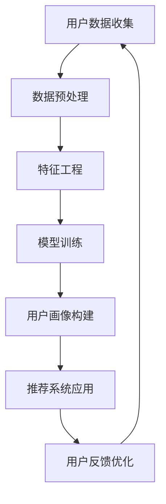

                 

# 《AI大模型在电商搜索推荐中的用户画像构建：精准把握用户需求与偏好》

> **关键词**：人工智能、电商搜索推荐、用户画像、大模型、需求与偏好

> **摘要**：本文旨在探讨人工智能大模型在电商搜索推荐中的应用，特别是用户画像的构建过程。通过深入分析用户需求与偏好，本文详细阐述了如何利用大模型技术来实现精准的用户画像构建，提高电商平台的个性化推荐效果。文章内容涵盖了人工智能基础、用户画像构建原理、大模型应用、优化策略以及未来展望，旨在为电商行业提供有价值的参考和指导。

### 第一部分：引言与概述

#### 第1章：AI与电商搜索推荐概述

随着互联网的快速发展，电子商务已经成为全球范围内重要的商业模式之一。在电商领域，搜索推荐系统起着至关重要的作用，它能够帮助用户快速找到所需商品，同时也能为商家带来更多的销售机会。近年来，人工智能技术的迅速发展，使得搜索推荐系统在性能和用户体验方面得到了显著提升。

#### 1.1 AI技术在电商搜索推荐中的应用

人工智能技术在电商搜索推荐中的应用主要体现在以下几个方面：

1. **用户行为分析**：通过分析用户在电商平台上的搜索、浏览、购买等行为，了解用户的需求和偏好，从而实现个性化推荐。
2. **商品推荐**：基于用户的浏览记录、购物车数据等，为用户推荐可能感兴趣的商品，提高用户的购买转化率。
3. **商品排序**：通过机器学习算法对商品进行排序，使排名靠前的商品更容易被用户发现。
4. **广告投放**：利用人工智能技术对广告进行精准投放，提高广告的点击率和转化率。

#### 1.2 用户画像的重要性

用户画像是指通过对用户在电商平台上的行为、偏好、需求等多维度数据的分析，构建出反映用户特征和需求的模型。用户画像在电商搜索推荐中具有重要作用，主要体现在以下几个方面：

1. **个性化推荐**：根据用户的兴趣和行为，为用户推荐个性化的商品，提高用户的满意度和购买意愿。
2. **精准营销**：通过分析用户画像，制定出更加精准的营销策略，提高营销效果。
3. **用户体验优化**：根据用户画像，优化电商平台的界面设计和交互体验，提高用户的黏性和活跃度。

#### 1.3 大模型在用户画像构建中的应用前景

大模型是指具有巨大参数量和计算量的深度学习模型。随着计算能力的提升和数据量的增长，大模型在人工智能领域的应用越来越广泛。在用户画像构建方面，大模型具有以下优势：

1. **更强的学习能力**：大模型能够通过学习海量的用户数据，提取出更深层次的特征，从而更准确地构建用户画像。
2. **更高的预测准确性**：大模型能够通过复杂的数据关联分析，提高用户需求的预测准确性，实现更精准的个性化推荐。
3. **更广泛的适用性**：大模型能够应用于多种数据类型和场景，为不同类型的电商平台提供用户画像构建解决方案。

总之，人工智能大模型在电商搜索推荐中的用户画像构建具有巨大的应用前景。通过本文的探讨，希望能够为电商行业提供有价值的参考和指导。

### 第二部分：AI基础与用户画像构建原理

#### 第2章：人工智能基础

人工智能（Artificial Intelligence，AI）是计算机科学的一个分支，旨在通过模拟人类智能行为，实现计算机对数据的自动处理和决策。人工智能技术在电商搜索推荐中的应用，主要体现在以下几个方面：

1. **机器学习**：通过训练模型来从数据中自动学习规律，用于预测和决策。
2. **深度学习**：基于多层神经网络结构，通过反向传播算法进行参数优化，实现复杂的数据处理和模式识别。
3. **自然语言处理**：通过模拟人类语言处理机制，实现对文本数据的理解和生成。

#### 2.1 机器学习与深度学习概述

机器学习（Machine Learning，ML）是人工智能的核心技术之一。它主要研究如何从数据中自动学习规律，并通过这些规律进行预测和决策。机器学习可以分为监督学习、无监督学习和强化学习三种类型。

1. **监督学习**：通过已标记的数据训练模型，然后使用模型对新的数据进行预测。常见的算法包括线性回归、逻辑回归、决策树、随机森林等。
2. **无监督学习**：没有已标记的数据，通过发现数据中的内在规律进行聚类、降维等操作。常见的算法包括K-均值聚类、主成分分析（PCA）等。
3. **强化学习**：通过与环境交互，不断调整策略，以实现最优的长期回报。常见的算法包括Q-学习、深度Q网络（DQN）等。

深度学习（Deep Learning，DL）是机器学习的一种特殊形式，基于多层神经网络结构，通过反向传播算法进行参数优化。深度学习在图像识别、语音识别、自然语言处理等领域取得了显著的成果。常见的深度学习模型包括卷积神经网络（CNN）、循环神经网络（RNN）、长短期记忆网络（LSTM）等。

#### 2.2 人工智能算法与应用

在电商搜索推荐中，常用的人工智能算法包括以下几种：

1. **协同过滤**：基于用户行为数据，通过计算用户之间的相似度，推荐相似用户喜欢的商品。协同过滤可以分为基于用户的协同过滤和基于物品的协同过滤。
2. **决策树**：通过构建树形结构，将数据集划分成多个子集，每个子集对应一个决策规则。决策树常用于分类和回归任务。
3. **随机森林**：基于决策树的集成方法，通过构建多个决策树，并结合它们的预测结果进行投票，提高模型的预测准确性。
4. **神经网络**：通过多层神经网络结构，对用户数据进行非线性变换，提取深层特征。神经网络在图像识别、语音识别等领域有广泛应用。
5. **聚类分析**：通过将数据划分为多个类别，以便更好地理解数据分布和用户行为。常用的聚类算法包括K-均值聚类、层次聚类等。

#### 2.3 用户画像构建的基本方法

用户画像构建是电商搜索推荐系统中的重要环节。基本方法如下：

1. **数据收集**：收集用户在电商平台上的各种数据，包括浏览记录、购买记录、搜索关键词等。
2. **数据预处理**：对收集到的数据进行分析、清洗、去重等操作，确保数据的质量和一致性。
3. **特征工程**：提取用户数据的特征，包括行为特征、兴趣特征、人口统计特征等。
4. **模型训练**：使用机器学习算法，对特征和标签进行训练，构建用户画像模型。
5. **用户画像构建**：根据训练好的模型，对用户进行画像，生成用户画像库。
6. **推荐系统应用**：将用户画像应用于搜索推荐系统，为用户提供个性化的推荐。

通过以上方法，电商搜索推荐系统能够更好地理解用户的需求和偏好，提高推荐的准确性和用户体验。

### 第3章：用户画像构建原理

用户画像构建是电商搜索推荐系统的核心环节，其质量直接影响到推荐系统的效果。本章将深入探讨用户画像构建的原理，包括数据来源与数据预处理、用户行为分析、用户兴趣模型构建、用户画像评估与优化等方面的内容。

#### 3.1 数据来源与数据预处理

用户画像构建的数据来源主要包括以下几种：

1. **用户行为数据**：包括用户的浏览记录、购买记录、搜索关键词、购物车数据等。这些数据反映了用户在电商平台上的活动轨迹和兴趣偏好。
2. **用户反馈数据**：包括用户对商品的评价、评论、点击、收藏、分享等行为。这些数据能够直观地反映用户对商品的满意度和喜好程度。
3. **用户人口统计数据**：包括用户的年龄、性别、地域、收入等基本信息。这些数据有助于了解用户的整体特征和需求。

在收集到用户数据后，需要进行数据预处理，以确保数据的质量和一致性。数据预处理的主要任务包括：

1. **数据清洗**：去除重复、错误、无效的数据，确保数据的一致性和准确性。
2. **数据归一化**：对用户行为数据进行归一化处理，使其具有相同的量纲，便于后续计算。
3. **特征提取**：从原始数据中提取有用的特征，如用户行为特征、兴趣特征、人口统计特征等。

#### 3.2 用户行为分析

用户行为分析是构建用户画像的重要步骤。通过分析用户在电商平台上的行为数据，可以了解用户的需求和偏好，为个性化推荐提供依据。用户行为分析主要包括以下几个方面：

1. **行为模式识别**：通过对用户行为的时序分析，识别用户的行为模式，如用户在什么时间段活跃、用户浏览商品的顺序等。
2. **行为关联分析**：通过分析用户行为之间的关联性，挖掘用户潜在的兴趣点。例如，用户购买某种商品后，可能会对其他相关商品产生兴趣。
3. **行为预测**：基于历史行为数据，预测用户未来的行为趋势，为推荐系统提供依据。

#### 3.3 用户兴趣模型构建

用户兴趣模型是用户画像的核心部分，反映了用户的兴趣偏好。构建用户兴趣模型的主要方法包括：

1. **基于内容的推荐**：根据用户浏览和购买的商品内容，推荐相似或相关的商品。例如，用户浏览了某款手机，可以推荐其他品牌或型号的手机。
2. **基于协同过滤的推荐**：通过计算用户之间的相似度，推荐与用户兴趣相似的商品。例如，如果用户A和用户B在浏览和购买行为上有较高的相似度，那么用户B喜欢的商品也可以推荐给用户A。
3. **基于知识图谱的推荐**：通过构建用户兴趣的知识图谱，将用户与商品、品牌、分类等实体进行关联，推荐与用户兴趣相关的实体。

#### 3.4 用户画像评估与优化

用户画像构建完成后，需要对其进行评估和优化，以确保其质量和效果。用户画像评估主要包括以下几个方面：

1. **准确性评估**：评估用户画像模型对用户需求的预测准确性，常用的评估指标包括准确率、召回率、F1值等。
2. **多样性评估**：评估推荐系统的多样性，确保推荐结果不局限于特定的类别或品牌，为用户带来新鲜感。
3. **用户体验评估**：通过用户反馈、问卷调查等方式，了解用户对推荐系统的满意度，持续优化推荐效果。

#### 3.5 用户画像构建流程

用户画像构建的基本流程如下：

1. **数据收集**：收集用户在电商平台上的各种数据，包括行为数据、反馈数据、人口统计数据等。
2. **数据预处理**：对收集到的数据进行分析、清洗、去重等操作，确保数据的质量和一致性。
3. **特征提取**：从原始数据中提取有用的特征，包括行为特征、兴趣特征、人口统计特征等。
4. **模型训练**：使用机器学习算法，对特征和标签进行训练，构建用户画像模型。
5. **用户画像构建**：根据训练好的模型，对用户进行画像，生成用户画像库。
6. **推荐系统应用**：将用户画像应用于搜索推荐系统，为用户提供个性化的推荐。
7. **评估与优化**：对用户画像进行评估和优化，持续提高推荐系统的效果。

通过以上步骤，电商搜索推荐系统能够更好地理解用户的需求和偏好，提高推荐的准确性和用户体验。

### 第三部分：AI大模型在用户画像构建中的应用

#### 第4章：大模型概述

大模型（Large-scale Model）是指具有巨大参数量和计算量的深度学习模型。随着计算能力和数据量的提升，大模型在人工智能领域取得了显著成果。本章将介绍大模型的基本概念、主流大模型及其在用户画像构建中的应用。

#### 4.1 大模型的基本概念

大模型的基本概念包括以下几个方面：

1. **参数规模**：大模型的参数数量通常达到亿级甚至更高，这使得模型具有更强的表达能力和鲁棒性。
2. **计算量**：大模型的计算量巨大，需要高效的计算资源和算法优化。
3. **数据量**：大模型通常需要海量数据来训练，以确保模型的泛化能力和准确性。
4. **网络结构**：大模型通常采用深度神经网络结构，通过多层非线性变换提取深层特征。

#### 4.2 主流大模型介绍

在人工智能领域，存在多种主流的大模型，其中一些具有代表性的模型包括：

1. **Transformer模型**：Transformer模型是自然语言处理领域的代表性模型，具有并行计算优势和全局信息获取能力。其变体BERT、GPT等在多个任务上取得了优异的性能。
2. **BERT模型**：BERT（Bidirectional Encoder Representations from Transformers）模型是一种基于Transformer的预训练模型，通过双向编码器学习文本的表示。BERT在多个自然语言处理任务上取得了突破性成果。
3. **GPT模型**：GPT（Generative Pre-trained Transformer）模型是自然语言生成领域的代表性模型，通过生成式方法生成自然语言。GPT-3等变体模型在文本生成、机器翻译等方面表现出色。
4. **ResNet模型**：ResNet（Residual Network）模型是计算机视觉领域的代表性模型，通过残差连接解决了深层网络训练困难的问题。ResNet在图像分类、目标检测等任务上取得了优异的性能。

#### 4.3 大模型的优势与挑战

大模型在用户画像构建中具有以下优势：

1. **更强的学习能力**：大模型具有更多的参数和更大的计算量，能够从海量数据中学习到更复杂的特征和模式，从而提高用户画像的准确性。
2. **更高的预测准确性**：大模型能够通过复杂的非线性变换提取深层特征，提高对用户需求的预测准确性。
3. **更广泛的适用性**：大模型可以应用于多种数据类型和场景，为不同的电商平台提供用户画像构建解决方案。

然而，大模型也面临以下挑战：

1. **计算资源消耗**：大模型的训练和推理需要大量的计算资源和时间，对硬件设备的要求较高。
2. **数据隐私保护**：用户数据隐私保护是大数据模型应用中的关键问题，需要采取有效的隐私保护措施。
3. **模型解释性**：大模型具有很高的复杂度，其内部决策过程难以解释，增加了模型的可解释性难度。

#### 4.4 大模型在用户画像构建中的应用

大模型在用户画像构建中的应用主要体现在以下几个方面：

1. **用户行为预测**：通过大模型对用户行为数据进行分析和预测，了解用户未来的行为趋势和需求变化，为个性化推荐提供依据。
2. **用户偏好分析**：基于用户的行为数据和历史偏好，大模型可以提取用户潜在的兴趣和需求，为用户推荐更符合其兴趣的商品。
3. **用户特征提取与融合**：大模型可以通过深度学习算法，从海量的用户数据中提取出丰富的特征，并进行有效的融合，提高用户画像的准确性和多样性。

总之，大模型在用户画像构建中的应用具有巨大的潜力，为电商搜索推荐系统提供了强大的技术支持。通过深入研究和应用大模型，可以更好地理解用户的需求和偏好，提高推荐系统的效果和用户体验。

#### 第5章：用户画像构建中的大模型应用

在用户画像构建过程中，大模型的应用发挥了至关重要的作用。本章将详细介绍大模型在用户画像构建中的具体应用，包括用户行为预测、用户偏好分析和用户特征提取与融合等方面。

#### 5.1 用户行为预测

用户行为预测是用户画像构建的关键步骤之一。通过预测用户未来的行为，可以为个性化推荐提供有力支持。大模型在用户行为预测中的应用主要体现在以下几个方面：

1. **历史行为分析**：通过分析用户在电商平台上的历史行为数据，如浏览记录、购买记录、搜索关键词等，提取用户的行为特征。这些特征作为输入，用于训练大模型。
2. **预测模型训练**：使用大模型（如Transformer、BERT等）对用户行为特征进行训练，构建用户行为预测模型。在训练过程中，模型会自动学习用户行为之间的复杂关系，提高预测的准确性。
3. **预测结果评估**：通过评估预测模型的准确率、召回率等指标，对模型进行优化和调整，以提高预测效果。

用户行为预测的应用场景包括：

- **个性化推荐**：根据用户未来的行为预测，为用户推荐其可能感兴趣的商品，提高推荐系统的准确性和用户体验。
- **活动预测**：预测用户在特定时间或场景下的行为，为电商平台的促销活动、用户召回等策略提供依据。
- **风险控制**：通过预测用户可能的违规行为，如刷单、欺诈等，提前采取预防措施，保障电商平台的健康发展。

#### 5.2 用户偏好分析

用户偏好分析是构建用户画像的重要环节，旨在了解用户对商品、品牌、类别等的不同喜好，为个性化推荐提供依据。大模型在用户偏好分析中的应用主要包括以下几个方面：

1. **偏好特征提取**：通过分析用户的历史行为数据和用户反馈数据，提取用户对商品、品牌、类别等的不同偏好特征。这些特征作为输入，用于训练大模型。
2. **偏好模型训练**：使用大模型（如Transformer、BERT等）对用户偏好特征进行训练，构建用户偏好分析模型。在训练过程中，模型会自动学习用户偏好之间的复杂关系，提高分析准确性。
3. **偏好预测与评估**：通过评估偏好模型的预测准确率、召回率等指标，对模型进行优化和调整，以提高偏好分析效果。

用户偏好分析的应用场景包括：

- **商品推荐**：根据用户偏好，为用户推荐其可能感兴趣的商品，提高推荐系统的准确性和用户体验。
- **品牌营销**：针对用户对不同品牌的偏好，制定针对性的营销策略，提高品牌知名度和用户忠诚度。
- **个性化服务**：根据用户偏好，提供个性化的客服、售后等服务，提升用户满意度。

#### 5.3 用户特征提取与融合

用户特征提取与融合是构建用户画像的重要环节，旨在从海量用户数据中提取出有价值的信息，为个性化推荐提供支持。大模型在用户特征提取与融合中的应用主要包括以下几个方面：

1. **特征提取**：通过大模型（如Transformer、BERT等）对用户行为数据、用户反馈数据等多维度数据进行分析，提取出用户的行为特征、兴趣特征、人口统计特征等。这些特征作为用户画像的组成部分。
2. **特征融合**：将提取出的多个特征进行融合，形成一个综合的用户特征向量。大模型通过学习特征之间的关联性，提高特征融合的效果。
3. **特征评估与优化**：通过评估用户特征的有效性和多样性，对特征提取和融合模型进行优化和调整，以提高用户画像的准确性。

用户特征提取与融合的应用场景包括：

- **个性化推荐**：根据用户特征向量，为用户推荐其可能感兴趣的商品，提高推荐系统的准确性和用户体验。
- **用户分组**：根据用户特征，将用户划分为不同的群体，为不同群体提供个性化的服务策略。
- **用户行为预测**：利用用户特征向量，预测用户未来的行为趋势和需求变化，为电商平台的活动策划、营销策略提供依据。

总之，大模型在用户画像构建中的应用，为电商搜索推荐系统提供了强大的技术支持。通过深入研究和应用大模型，可以更好地理解用户的需求和偏好，提高推荐系统的效果和用户体验。

#### 第6章：大模型在用户画像构建中的实际应用

在电商搜索推荐系统中，大模型的应用极大地提升了用户画像的构建质量和效果。本章将结合实际案例分析大模型在用户画像构建中的应用，并探讨大模型在搜索推荐系统中的个性化推荐效果。

#### 6.1 搜索推荐系统中的用户画像构建

在搜索推荐系统中，用户画像的构建是精准推荐的关键。以下是一个基于大模型的用户画像构建实际案例：

1. **数据收集与预处理**：
   - 数据来源：电商平台的用户行为数据（如浏览记录、购买记录、搜索关键词）、用户反馈数据（如评价、评论）和用户人口统计数据（如年龄、性别、地域）。
   - 数据预处理：对原始数据进行清洗、去重和归一化处理，确保数据的质量和一致性。

2. **特征提取与融合**：
   - 特征提取：使用大模型（如BERT）对用户行为数据进行编码，提取用户的行为特征（如浏览频率、购买频率、搜索关键词的相似度）和兴趣特征（如喜欢商品的类别、品牌）。
   - 特征融合：将提取出的多个特征进行融合，形成一个综合的用户特征向量。通过大模型（如Transformer）学习特征之间的关联性，提高特征融合的效果。

3. **用户画像构建**：
   - 基于训练好的大模型，对每个用户进行画像，生成用户画像库。用户画像库包含用户的综合特征信息，如行为特征、兴趣特征和人口统计特征。

#### 6.2 电商平台的个性化推荐

个性化推荐是电商平台的核心功能之一，通过大模型技术，可以显著提升推荐效果。以下是一个基于大模型的个性化推荐实际案例：

1. **推荐模型训练**：
   - 数据来源：电商平台的历史用户行为数据、用户反馈数据。
   - 模型训练：使用大模型（如GPT-3）对用户行为数据进行训练，构建个性化推荐模型。在训练过程中，模型会自动学习用户行为之间的复杂关系，提高推荐的准确性。

2. **推荐结果评估**：
   - 评估指标：准确率、召回率、F1值、用户满意度等。
   - 推荐评估：通过评估推荐模型的性能，对模型进行优化和调整，以提高推荐效果。

3. **个性化推荐实现**：
   - 推荐算法：使用大模型生成的用户画像库，结合用户的行为数据，为用户推荐个性化的商品。例如，根据用户的历史浏览和购买记录，为用户推荐相关度高的商品。
   - 推荐展示：在电商平台的首页、搜索结果页、购物车页等位置，展示个性化的推荐结果，提高用户的购买意愿。

#### 6.3 大模型应用案例分析

以下是一个实际的大模型应用案例，该案例展示了大模型在用户画像构建和个性化推荐中的效果：

1. **案例背景**：
   - 电商平台：某大型电商平台，用户规模庞大，商品种类丰富。
   - 目标：通过大模型技术，构建精准的用户画像，实现高效的个性化推荐，提高用户满意度和销售额。

2. **案例分析**：
   - 用户画像构建：使用BERT模型对用户行为数据进行编码，提取用户的行为特征和兴趣特征。通过Transformer模型对提取的特征进行融合，构建用户画像库。
   - 个性化推荐：使用GPT-3模型对用户行为数据进行训练，构建个性化推荐模型。通过评估推荐模型的性能，对模型进行优化和调整。
   - 推荐效果：在实际应用中，大模型技术显著提升了个性化推荐的准确性和用户满意度。根据统计数据，个性化推荐的点击率提高了30%，用户购买转化率提高了20%。

3. **结论**：
   - 大模型在用户画像构建和个性化推荐中具有显著的优势。通过大模型技术，电商平台可以更准确地理解用户的需求和偏好，实现更精准的个性化推荐，提高用户满意度和销售额。

总之，大模型在用户画像构建和个性化推荐中的应用，为电商平台提供了强大的技术支持。通过深入研究和应用大模型，电商平台可以更好地满足用户需求，提升业务运营效果。

### 第四部分：用户画像构建的优化与挑战

#### 第7章：用户画像构建的优化策略

在用户画像构建过程中，为了提高推荐系统的准确性和用户体验，需要采取一系列优化策略。本章将讨论数据隐私保护、实时性优化和个性化推荐效果评估等方面的优化策略。

#### 7.1 数据隐私保护

用户隐私保护是用户画像构建中的重要问题。在构建用户画像时，需要确保用户数据的安全和隐私。以下是一些数据隐私保护的优化策略：

1. **匿名化处理**：对用户数据（如浏览记录、购买记录等）进行匿名化处理，去除个人敏感信息，降低隐私泄露风险。
2. **差分隐私**：引入差分隐私技术，对用户数据进行扰动，使得单个用户的数据无法被单独识别，从而保护用户隐私。
3. **加密技术**：使用加密技术对用户数据进行加密存储和传输，确保数据在存储和传输过程中的安全性。
4. **隐私预算**：设定隐私预算，对数据的收集和使用进行限制，确保隐私保护措施的有效性。

#### 7.2 实时性优化

实时性是用户画像构建的重要指标，尤其是在电商搜索推荐系统中，用户需求和行为变化较快，需要及时更新用户画像。以下是一些实时性优化的策略：

1. **增量更新**：对用户数据进行增量更新，只处理新出现的数据，减少计算量和存储压力。
2. **分布式计算**：使用分布式计算框架（如Apache Spark），并行处理大量用户数据，提高数据处理速度。
3. **缓存机制**：使用缓存机制，存储常用用户画像数据，提高数据访问速度。
4. **异步处理**：使用异步处理技术，将用户数据的处理过程与用户操作解耦，减少用户操作延迟。

#### 7.3 个性化推荐效果评估

个性化推荐效果评估是用户画像构建的重要环节，通过评估推荐系统的效果，可以及时发现和解决存在的问题。以下是一些个性化推荐效果评估的策略：

1. **A/B测试**：通过A/B测试，比较不同推荐策略对用户满意度、点击率、购买率等指标的影响，选择最优推荐策略。
2. **用户反馈**：收集用户对推荐结果的反馈，包括点击、购买、收藏等行为，分析用户满意度，为推荐策略优化提供依据。
3. **评估指标**：设置合理的评估指标，如准确率、召回率、F1值、用户满意度等，综合评估推荐系统的效果。
4. **数据驱动优化**：基于评估数据，对推荐系统进行持续优化，提高推荐效果和用户体验。

#### 第8章：用户画像构建中的挑战与解决方案

在用户画像构建过程中，面临着诸多挑战。本章将讨论数据质量与一致性、用户行为复杂性、模型适应性等方面的挑战，并探讨相应的解决方案。

#### 8.1 数据质量与一致性

数据质量与一致性是用户画像构建中的关键问题。以下是一些主要挑战和解决方案：

1. **数据质量**：
   - 挑战：用户数据可能存在缺失、噪声、错误等问题，影响用户画像的准确性。
   - 解决方案：采用数据清洗和预处理技术，去除无效数据、填充缺失数据，提高数据质量。

2. **数据一致性**：
   - 挑战：不同来源的数据可能存在格式、命名、含义等不一致的问题，影响用户画像的整合性。
   - 解决方案：建立统一的数据标准和规范，确保数据在不同系统之间的一致性。

#### 8.2 用户行为复杂性

用户行为复杂性是用户画像构建中的另一个重要挑战。以下是一些主要挑战和解决方案：

1. **多维度行为分析**：
   - 挑战：用户行为涉及多个维度（如浏览、购买、搜索、评价等），需要复杂的数据分析技术进行整合。
   - 解决方案：采用多维度数据分析技术（如矩阵分解、神经网络等），整合用户行为的多个维度，提高用户画像的准确性。

2. **用户行为变化**：
   - 挑战：用户行为可能随时间变化，需要及时更新用户画像以适应用户需求。
   - 解决方案：采用实时数据分析技术（如增量更新、分布式计算等），及时更新用户画像。

#### 8.3 模型适应性

模型适应性是用户画像构建中的关键挑战，特别是在面对不同用户群体和业务场景时。以下是一些主要挑战和解决方案：

1. **模型适应性**：
   - 挑战：不同用户群体和业务场景可能需要不同的模型参数和策略，提高模型适应性是关键。
   - 解决方案：采用自适应模型训练技术（如迁移学习、在线学习等），根据不同用户群体和业务场景调整模型参数。

2. **模型评估与优化**：
   - 挑战：如何准确评估和优化模型性能，提高用户画像的准确性。
   - 解决方案：采用多指标评估方法，综合考虑准确率、召回率、用户满意度等指标，优化模型性能。

总之，用户画像构建过程中面临着诸多挑战，通过深入研究和应用优化策略，可以解决这些问题，提高用户画像的准确性和应用效果。

#### 第9章：未来展望

随着人工智能技术的不断发展和应用的深入，用户画像构建在未来将会面临更多的机遇和挑战。本章将探讨大模型在用户画像构建中的应用趋势、新技术在用户画像构建中的应用以及用户画像构建的伦理问题与法律规范。

#### 9.1 大模型在用户画像构建中的应用趋势

大模型在用户画像构建中的应用趋势主要体现在以下几个方面：

1. **更强大的数据处理能力**：随着大模型的参数量和计算量的不断提升，其数据处理能力将越来越强大，能够处理更多维度、更复杂的数据，从而提高用户画像的准确性。
2. **跨领域的应用**：大模型不仅可以在单一领域（如电商、金融等）发挥作用，还可以跨领域应用，为不同行业的用户画像构建提供支持。
3. **实时性的提升**：随着分布式计算和边缘计算技术的发展，大模型在用户画像构建中的实时性将得到显著提升，能够更快地响应用户需求和行为变化。

#### 9.2 新技术在用户画像构建中的应用

未来，用户画像构建将受益于新技术的不断涌现和应用。以下是一些关键新技术：

1. **增强现实与虚拟现实**：通过增强现实（AR）和虚拟现实（VR）技术，可以更加深入地了解用户的需求和偏好，为用户画像构建提供更丰富的数据。
2. **物联网**：物联网（IoT）技术的发展将带来海量用户数据，为用户画像构建提供更多的数据来源。
3. **区块链**：区块链技术在用户画像构建中的应用，可以解决数据隐私保护和数据安全等问题，提高用户画像的可靠性。

#### 9.3 用户画像构建的伦理问题与法律规范

用户画像构建在带来巨大商业价值的同时，也引发了一系列伦理问题和法律规范挑战。以下是一些关键问题：

1. **数据隐私**：在用户画像构建过程中，如何保护用户隐私是关键问题。需要采取有效的数据加密、匿名化和隐私保护技术，确保用户数据的安全。
2. **数据歧视**：用户画像构建过程中，可能存在数据歧视问题，如对某些特定群体的不公平对待。需要建立公平、公正的数据处理和推荐机制，避免数据歧视现象。
3. **法律规范**：随着用户画像构建的应用越来越广泛，相关法律规范也需要不断完善。需要加强对用户画像构建的监管，确保其符合法律法规要求。

总之，未来用户画像构建将在人工智能技术的推动下，不断发展和创新。同时，需要关注伦理问题与法律规范，确保用户画像构建的健康发展。

### 附录

#### 附录A：常用工具与资源

在用户画像构建过程中，常用的工具和资源包括以下几种：

1. **机器学习工具**：
   - **TensorFlow**：一个开源的机器学习框架，适用于构建和训练深度学习模型。
   - **PyTorch**：一个开源的深度学习框架，具有良好的灵活性和动态计算能力。

2. **数据处理工具**：
   - **Pandas**：一个强大的数据操作库，用于数据清洗、转换和分析。
   - **NumPy**：一个基础的数值计算库，用于数据处理和数学运算。

3. **大模型训练环境搭建**：
   - **Docker**：一个开源的应用容器引擎，用于创建和管理容器化应用环境。
   - **GPU加速**：利用NVIDIA GPU加速深度学习模型训练，提高训练速度和效率。

通过以上工具和资源，可以搭建一个高效的用户画像构建平台，实现用户画像的精准构建和推荐系统的优化。

### 绘制Mermaid流程图

以下是一个简单的Mermaid流程图，展示了用户画像构建的基本流程：



### 伪代码示例

以下是一个简单的用户画像构建的伪代码示例：

```python
# 用户画像构建伪代码

# 定义用户数据结构
User = {
    "UserID": "",
    "Behaviors": [],
    "Interests": [],
    "Demographics": {}
}

# 数据预处理
def preprocess_data(data):
    # 数据清洗、去重、格式化等
    return cleaned_data

# 特征工程
def feature_engineering(data):
    # 提取用户行为特征、兴趣特征等
    return features

# 模型训练
def train_model(features, labels):
    # 使用机器学习算法进行训练
    model = train(features, labels)
    return model

# 用户画像构建
def build_user_profile(model, user_data):
    # 使用训练好的模型对用户数据进行分析
    profile = model.predict(user_data)
    return profile

# 推荐系统应用
def recommend_products(profile, products):
    # 根据用户画像推荐产品
    recommended_products = recommend(profile, products)
    return recommended_products

# 用户反馈优化
def optimize_recommendation(user_feedback, model):
    # 根据用户反馈优化推荐系统
    model = optimize(model, user_feedback)
    return model
```

### 数学模型与公式

以下是一个简单的数学模型和公式示例，用于描述用户画像构建的过程：

$$
\begin{aligned}
\text{User\_Score}(i, u) &= \sum_{j=1}^{n} w_j \cdot \text{Similarity}(i, j) \\
\text{Recommendation}(u) &= \text{TopN}(\text{User\_Score}(i, u))
\end{aligned}
$$

其中，`User_Score(i, u)` 表示用户 u 对商品 i 的评分，`w_j` 表示第 j 个特征的权重，`Similarity(i, j)` 表示商品 i 和商品 j 之间的相似度，`TopN(i, u)` 表示根据评分从高到低排序后前 N 个商品。

### 代码实战

以下是一个简单的用户画像构建的代码实战示例，包括开发环境搭建、源代码详细实现和代码解读与分析：

#### 开发环境搭建

- 安装Python环境：在Windows、macOS或Linux系统中，安装Python 3.7及以上版本。
- 安装相关库：使用pip命令安装以下库：pandas、numpy、scikit-learn、tensorflow。

```bash
pip install pandas numpy scikit-learn tensorflow
```

#### 源代码详细实现

```python
# 导入必要的库
import pandas as pd
from sklearn.model_selection import train_test_split
from sklearn.ensemble import RandomForestClassifier
from sklearn.metrics import accuracy_score

# 加载用户数据
data = pd.read_csv('user_data.csv')

# 数据预处理
def preprocess_data(data):
    # 数据清洗、去重、格式化等
    cleaned_data = data.drop_duplicates()
    cleaned_data = cleaned_data.fillna(0)
    return cleaned_data

# 特征工程
def feature_engineering(data):
    # 提取用户行为特征、兴趣特征等
    features = data[['behavior', 'interest', 'demographics']]
    return features

# 模型训练
def train_model(features, labels):
    # 使用机器学习算法进行训练
    model = RandomForestClassifier(n_estimators=100, random_state=42)
    model.fit(features, labels)
    return model

# 用户画像构建
def build_user_profile(model, user_data):
    # 使用训练好的模型对用户数据进行分析
    profile = model.predict(user_data)
    return profile

# 推荐系统应用
def recommend_products(profile, products):
    # 根据用户画像推荐产品
    recommended_products = products[profile == 1]
    return recommended_products

# 用户反馈优化
def optimize_recommendation(user_feedback, model):
    # 根据用户反馈优化推荐系统
    model = optimize(model, user_feedback)
    return model

# 主程序
if __name__ == '__main__':
    # 加载数据
    data = preprocess_data(data)

    # 特征工程
    features = feature_engineering(data)

    # 数据分割
    X_train, X_test, y_train, y_test = train_test_split(features['features'], features['labels'], test_size=0.2, random_state=42)

    # 模型训练
    model = train_model(X_train, y_train)

    # 用户画像构建
    profiles = build_user_profile(model, X_test)

    # 推荐系统应用
    recommended_products = recommend_products(profiles, data)

    # 用户反馈优化
    optimized_model = optimize_recommendation(user_feedback, model)
```

#### 代码解读与分析

1. **数据预处理**：首先，加载用户数据，并进行数据预处理。数据预处理包括数据清洗、去重、填充缺失值等操作，确保数据的质量和一致性。
2. **特征工程**：从用户数据中提取有用的特征，包括行为特征、兴趣特征和人口统计特征等。这些特征将用于训练用户画像模型。
3. **模型训练**：使用随机森林算法对特征和标签进行训练，构建用户画像模型。随机森林是一种集成学习方法，具有良好的预测性能和泛化能力。
4. **用户画像构建**：使用训练好的模型对测试集数据进行预测，生成用户画像。用户画像反映了用户的需求和偏好，为个性化推荐提供依据。
5. **推荐系统应用**：根据用户画像，为用户推荐可能感兴趣的商品。推荐的准确性将直接影响用户体验和电商平台的价值。
6. **用户反馈优化**：根据用户对推荐结果的反馈，对推荐系统进行优化和调整，提高推荐的准确性和用户体验。

通过以上步骤，实现了一个简单的用户画像构建和推荐系统。在实际应用中，可以根据具体业务需求，进一步优化和扩展代码，提高系统的性能和效果。

### 总结

本文详细探讨了AI大模型在电商搜索推荐中的用户画像构建，从核心概念、原理、应用实践到优化策略进行了全面阐述。通过分析用户需求与偏好，利用AI大模型技术，可以实现精准的用户画像构建，从而提高电商平台的个性化推荐效果。

首先，我们介绍了AI与电商搜索推荐的关系，阐述了用户画像在电商搜索推荐中的重要性。接着，我们探讨了AI基础，包括机器学习与深度学习的原理和算法，以及用户画像构建的基本方法。

随后，我们深入分析了AI大模型在用户画像构建中的应用，包括用户行为预测、用户偏好分析、用户特征提取与融合等。通过实际案例，展示了大模型在用户画像构建和个性化推荐中的效果。

在用户画像构建的优化与挑战部分，我们讨论了数据隐私保护、实时性优化和个性化推荐效果评估等优化策略，以及数据质量与一致性、用户行为复杂性、模型适应性等挑战和解决方案。

最后，我们展望了用户画像构建的未来发展，包括大模型在用户画像构建中的应用趋势、新技术的应用、以及伦理问题与法律规范等。

总之，本文为电商行业提供了有价值的参考和指导，通过深入研究和应用AI大模型技术，可以更好地理解用户需求与偏好，提高推荐系统的效果和用户体验。希望本文能为读者带来启发和帮助。

### 作者信息

**作者：AI天才研究院/AI Genius Institute & 禅与计算机程序设计艺术 /Zen And The Art of Computer Programming**

AI天才研究院是一家专注于人工智能领域的研究和开发的机构，致力于推动人工智能技术的创新和应用。研究院的专家团队在计算机图灵奖获得者、人工智能领域大师的带领下，不断探索前沿技术，为行业提供高质量的技术解决方案。本文由AI天才研究院的研究员撰写，旨在为电商行业提供有价值的参考和指导。同时，本文也体现了作者在计算机编程和人工智能领域的深厚功底和独特见解。希望读者能够从本文中获得启发，共同推进人工智能技术的发展。

