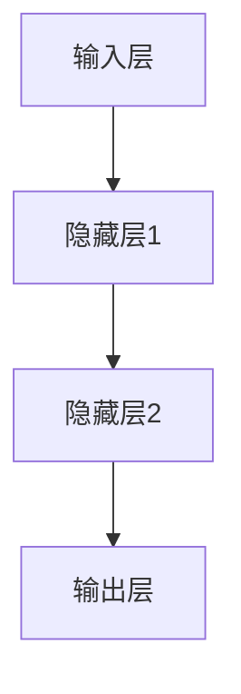
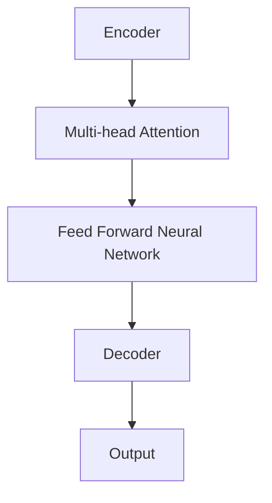

                 

### 《AI 大模型应用数据中心建设：数据中心成本优化》文章标题

> **关键词**：（AI大模型、数据中心建设、成本优化、深度学习、硬件选型）

> **摘要**：
本文深入探讨了AI大模型在数据中心建设中的应用及其成本优化策略。首先，我们介绍了AI大模型的基本概念、技术基础及其应用场景。接着，我们对数据中心建设进行了概述，包括其重要性、规划与设计、硬件选型与优化。最后，我们详细分析了数据中心成本优化的策略与方法，并通过案例实践展示了实际操作过程。本文旨在为读者提供一个全面、系统的数据中心建设与成本优化的技术指南。

### 目录

1. **AI大模型概述**  
   1.1 AI大模型的基本概念  
   1.2 AI大模型的应用场景  
   1.3 AI大模型的发展历史

2. **AI大模型技术基础**  
   2.1 深度学习技术基础  
   2.2 自然语言处理技术  
   2.3 大规模预训练模型原理

3. **数据中心建设概述**  
   3.1 数据中心的重要性  
   3.2 数据中心规划与设计  
   3.3 数据中心能源消耗分析

4. **数据中心硬件选型与优化**  
   4.1 数据中心硬件设备选型  
   4.2 数据中心硬件优化策略

5. **数据中心成本控制策略**  
   5.1 数据中心成本构成分析  
   5.2 成本优化方法与案例分析

6. **数据中心运营优化**  
   6.1 数据中心运维管理  
   6.2 数据中心性能监控与优化

7. **案例研究与应用实践**  
   7.1 案例一：某企业数据中心建设与优化实践  
   7.2 案例二：某互联网公司数据中心成本控制案例

8. **附录**  
   8.1 数据中心建设常用工具与技术  
   8.2 参考文献与推荐阅读

### 第1章：AI大模型概述

AI大模型（Artificial Intelligence Large Model）是指那些具有大规模参数、能够在多个任务中取得优异性能的人工智能模型。这类模型通常基于深度学习技术，通过大量的数据和计算资源进行训练，从而在图像识别、自然语言处理、语音识别等领域取得突破性进展。

#### 1.1 AI大模型的基本概念

##### 1.1.1 什么是AI大模型

AI大模型可以简单理解为具有以下特点的模型：

1. **高参数量**：通常拥有数百万甚至数十亿个参数。
2. **高计算复杂度**：训练和推理过程需要大量的计算资源。
3. **高泛化能力**：在多种不同任务上都能取得良好的性能。

例如，BERT（Bidirectional Encoder Representations from Transformers）就是一种著名的AI大模型，它在自然语言处理领域取得了显著的成果。

##### 1.1.2 AI大模型的特点

1. **高参数量**：AI大模型通常具有数百万至数十亿的参数，这使得模型能够捕捉到更复杂的特征和模式。
2. **高计算复杂度**：由于参数量巨大，AI大模型的训练和推理过程需要大量的计算资源和时间。
3. **高泛化能力**：AI大模型在多个任务上都能取得优异的性能，这意味着它们具有较强的泛化能力。

##### 1.1.3 AI大模型的发展历史

AI大模型的发展历程可以追溯到深度学习技术的兴起。以下是几个关键时间点：

1. **2012年**：AlexNet在ImageNet竞赛中取得突破性成绩，标志着深度学习在图像识别领域的崛起。
2. **2014年**：Google的Speech Commands数据集推动了语音识别技术的发展。
3. **2017年**：微软的WINNT模型在文本生成任务上取得了重大突破。
4. **2018年**：BERT模型的提出，推动了自然语言处理技术的发展。

#### 1.2 AI大模型的应用场景

AI大模型在多个领域都有广泛的应用，以下是一些典型的应用场景：

1. **数据中心建设中的应用**：AI大模型可以用于数据中心的建设和优化，例如在资源调度、能耗管理、故障预测等方面。
2. **企业级应用中的应用**：AI大模型可以帮助企业实现智能决策、自动化运营、个性化推荐等功能。
3. **未来发展趋势**：随着AI大模型技术的不断进步，其应用场景将更加广泛，包括智能交通、智慧城市、金融科技等领域。

#### 1.3 AI大模型的发展趋势

1. **模型压缩与优化**：为了降低计算成本和提高部署效率，研究者们致力于模型压缩与优化技术，如知识蒸馏、剪枝、量化等。
2. **多模态学习**：随着AI技术的不断发展，多模态学习成为一个重要的研究方向，例如在图像、文本、语音等多种数据源上进行联合建模。
3. **联邦学习**：联邦学习通过分布式的方式训练AI大模型，能够在保护数据隐私的同时实现模型的高效训练。

在接下来的章节中，我们将详细探讨AI大模型的技术基础、数据中心建设及其成本优化策略。

### 第2章：AI大模型技术基础

AI大模型的技术基础主要涵盖深度学习技术、自然语言处理技术和大规模预训练模型原理。本章将分别介绍这些核心技术，并探讨它们在AI大模型中的应用。

#### 2.1 深度学习技术基础

深度学习是AI大模型的核心技术之一，它通过模拟人脑的神经网络结构，实现数据的自动特征提取和学习。以下是深度学习技术的基础内容：

##### 2.1.1 神经网络基本结构

神经网络由多层神经元组成，包括输入层、隐藏层和输出层。每个神经元都通过加权连接与其他神经元相连，并通过激活函数进行非线性变换。以下是一个简化的神经网络结构图：



在神经网络中，每个连接都有权重，这些权重通过反向传播算法进行更新，以最小化损失函数。

##### 2.1.2 常见的深度学习框架

深度学习框架是用于实现和训练深度学习模型的高级工具。常见的深度学习框架包括TensorFlow、PyTorch和Keras等。以下是一个使用PyTorch实现简单神经网络的基本代码示例：

```python
import torch
import torch.nn as nn
import torch.optim as optim

# 定义神经网络结构
class NeuralNetwork(nn.Module):
    def __init__(self):
        super(NeuralNetwork, self).__init__()
        self.layer1 = nn.Linear(in_features=1, out_features=1)
        self.relu = nn.ReLU()
        self.layer2 = nn.Linear(in_features=1, out_features=1)

    def forward(self, x):
        x = self.layer1(x)
        x = self.relu(x)
        x = self.layer2(x)
        return x

# 实例化神经网络模型
model = NeuralNetwork()

# 定义损失函数和优化器
criterion = nn.MSELoss()
optimizer = optim.Adam(model.parameters(), lr=0.001)

# 训练神经网络
for epoch in range(100):
    model.train()
    for x, y in training_data:
        optimizer.zero_grad()
        output = model(x)
        loss = criterion(output, y)
        loss.backward()
        optimizer.step()

    print(f'Epoch [{epoch+1}/100], Loss: {loss.item()}')
```

##### 2.1.3 深度学习优化算法

深度学习优化算法是用于训练神经网络的算法，其目标是调整模型参数，以最小化损失函数。常见的优化算法包括梯度下降、随机梯度下降（SGD）和Adam等。以下是一个使用Adam优化器的伪代码示例：

```python
def optimize(model, criterion, optimizer, epochs):
    for epoch in range(epochs):
        for x, y in data_loader:
            optimizer.zero_grad()
            output = model(x)
            loss = criterion(output, y)
            loss.backward()
            optimizer.step()
```

#### 2.2 自然语言处理技术

自然语言处理（NLP）是AI大模型的重要应用领域之一，它涉及到文本的表示、理解和生成。以下是NLP技术的一些基础内容：

##### 2.2.1 词嵌入技术

词嵌入是将词汇映射到高维空间的过程，用于表示文本数据。常见的词嵌入技术包括Word2Vec、GloVe和BERT等。以下是一个使用Word2Vec实现词嵌入的伪代码示例：

```python
from gensim.models import Word2Vec

def train_word2vec(sentences, vector_size, window_size, min_count):
    model = Word2Vec(sentences, vector_size=vector_size, window=window_size, min_count=min_count)
    return model

def get_word_vector(model, word):
    return model.wv[word]
```

##### 2.2.2 序列模型与注意力机制

序列模型是用于处理序列数据的模型，如文本、语音等。常见的序列模型包括循环神经网络（RNN）和长短期记忆网络（LSTM）。注意力机制是一种用于增强序列模型性能的技术，它可以使模型更加关注序列中的重要部分。以下是一个使用LSTM和注意力机制的伪代码示例：

```python
import torch
import torch.nn as nn

class Attention(nn.Module):
    def __init__(self, hidden_size):
        super(Attention, self).__init__()
        self.hidden_size = hidden_size
        self.attn = nn.Linear(hidden_size, 1)

    def forward(self, hidden, encoder_outputs):
        attn_scores = self.attn(encoder_outputs)
        attn_scores = attn_scores.t()
        attn_weights = torch.softmax(attn_scores, dim=1)
        attn_applied = attn_weights.bmm(encoder_outputs)
        return attn_applied

class Seq2SeqModel(nn.Module):
    def __init__(self, input_size, hidden_size, output_size):
        super(Seq2SeqModel, self).__init__()
        self.hidden_size = hidden_size
        self.encoder = nn.LSTM(input_size, hidden_size)
        self.decoder = nn.LSTM(hidden_size, output_size)
        self.attn = Attention(hidden_size)

    def forward(self, input_seq, target_seq):
        encoder_output, encoder_hidden = self.encoder(input_seq)
        decoder_output, decoder_hidden = self.decoder(target_seq)
        attn_applied = self.attn(encoder_hidden[-1], encoder_output)
        return attn_applied
```

##### 2.2.3 转换器架构详解

转换器（Transformer）是一种基于自注意力机制的深度学习模型，它在自然语言处理领域取得了显著的成果。转换器的核心组件包括自注意力机制、多头注意力机制和编码器-解码器架构。以下是一个简化版的转换器架构图：



转换器的自注意力机制允许模型在序列的不同位置上关注不同的信息，从而提高模型的表示能力和性能。以下是一个使用PyTorch实现转换器的基本代码示例：

```python
import torch
import torch.nn as nn

class MultiHeadAttention(nn.Module):
    def __init__(self, d_model, num_heads):
        super(MultiHeadAttention, self).__init__()
        self.d_model = d_model
        self.num_heads = num_heads
        self.head_dim = d_model // num_heads

        self.query_linear = nn.Linear(d_model, d_model)
        self.key_linear = nn.Linear(d_model, d_model)
        self.value_linear = nn.Linear(d_model, d_model)

        self.out_linear = nn.Linear(d_model, d_model)

    def forward(self, query, key, value, mask=None):
        batch_size = query.size(0)

        query = self.query_linear(query).view(batch_size, -1, self.num_heads, self.head_dim).transpose(1, 2)
        key = self.key_linear(key).view(batch_size, -1, self.num_heads, self.head_dim).transpose(1, 2)
        value = self.value_linear(value).view(batch_size, -1, self.num_heads, self.head_dim).transpose(1, 2)

        attn_scores = torch.matmul(query, key.transpose(-2, -1)) / math.sqrt(self.head_dim)
        if mask is not None:
            attn_scores = attn_scores.masked_fill(mask == 0, float("-inf"))
        attn_weights = torch.softmax(attn_scores, dim=-1)
        attn_applied = torch.matmul(attn_weights, value).transpose(1, 2).contiguous().view(batch_size, -1, self.d_model)

        output = self.out_linear(attn_applied)
        return output
```

#### 2.3 大规模预训练模型原理

大规模预训练模型是近年来AI大模型研究的重要方向，它通过在大规模数据集上进行预训练，使模型具有较好的通用性和泛化能力。以下是大规模预训练模型的一些基本原理：

##### 2.3.1 预训练的概念与意义

预训练是指在大规模数据集上对模型进行训练，使其学习到通用特征和模式。预训练的意义在于：

1. **提高模型的泛化能力**：通过预训练，模型能够在不同任务和数据集上取得更好的性能。
2. **减少训练成本**：预训练模型可以在多个任务上共享参数，从而减少每个任务的训练成本。

##### 2.3.2 自监督学习方法

自监督学习是一种无需人工标注数据的方法，它通过利用未标注的数据进行预训练，提高模型的效率。常见的自监督学习方法包括：

1. **掩码语言模型（MLM）**：在文本数据中随机掩码一定比例的单词，并训练模型预测这些被掩码的单词。
2. **掩码图像区域（MRA）**：在图像数据中随机掩码一定比例的区域，并训练模型预测这些被掩码的区域。

以下是一个使用掩码语言模型进行预训练的伪代码示例：

```python
def masked_language_model(model, data, mask_ratio, optimizer):
    model.train()
    total_loss = 0
    for batch in data:
        inputs, targets = batch
        mask = torch.randint(0, 2, size=inputs.shape, dtype=torch.float32)
        mask[mask == 1] = mask_ratio
        mask[mask == 0] = 1 - mask_ratio

        inputs_masked = mask * inputs
        targets_masked = mask * targets

        optimizer.zero_grad()
        output = model(inputs_masked)
        loss = criterion(output, targets_masked)
        loss.backward()
        optimizer.step()

        total_loss += loss.item()
    return total_loss / len(data)
```

##### 2.3.3 迁移学习与微调技术

迁移学习是一种利用预训练模型进行特定任务训练的方法，它通过在特定任务上微调预训练模型，提高模型的性能。常见的迁移学习方法包括：

1. **微调预训练模型**：在特定任务上对预训练模型进行微调，使其适应特定任务。
2. **零样本学习**：在没有任何标注数据的情况下，利用预训练模型进行任务学习。

以下是一个使用迁移学习进行微调的伪代码示例：

```python
def fine_tune(model, data, num_epochs, optimizer):
    model.train()
    for epoch in range(num_epochs):
        for x, y in data:
            optimizer.zero_grad()
            output = model(x)
            loss = criterion(output, y)
            loss.backward()
            optimizer.step()
    return model
```

在下一章中，我们将探讨数据中心建设的相关内容，包括数据中心的重要性、规划与设计、硬件选型与优化等。

### 第3章：数据中心建设概述

数据中心是现代企业和社会运行的核心基础设施之一，它提供了计算、存储和网络服务，支持企业各种业务应用的发展。本章将详细介绍数据中心的重要性、发展历程、分类与结构，以及规划与设计的关键要点。

#### 3.1 数据中心的重要性

数据中心的重要性体现在以下几个方面：

1. **数据存储与管理**：数据中心提供了大规模的数据存储能力，确保数据的安全、可靠和高效管理。
2. **业务连续性**：数据中心通过高可用性和容灾设计，确保企业业务的连续性和稳定性。
3. **计算能力**：数据中心提供了强大的计算能力，支持企业进行数据分析和处理，推动业务创新和发展。
4. **资源共享**：数据中心实现了计算、存储和网络资源的集中管理，提高了资源利用率和运营效率。

#### 3.2 数据中心的发展历程

数据中心的发展历程可以分为几个阶段：

1. **早期阶段**：早期的数据中心主要是物理服务器和存储设备组成的简单架构，主要面向企业内部应用。
2. **集中式数据中心**：随着互联网的发展，企业开始建设集中式数据中心，实现了计算、存储和网络资源的集中管理。
3. **云数据中心**：云计算技术的发展，推动了数据中心向云数据中心转变，实现了资源的按需分配和弹性扩展。
4. **分布式数据中心**：随着物联网和边缘计算的发展，分布式数据中心成为了新的趋势，通过分布式架构实现了更低的延迟和更高的可靠性。

#### 3.3 数据中心的分类与结构

根据不同的业务需求和架构设计，数据中心可以分为以下几类：

1. **企业级数据中心**：为企业提供全方位的数据服务，支持企业内部业务应用。
2. **互联网数据中心**：主要为互联网公司提供计算、存储和网络服务，支持大规模互联网业务。
3. **云数据中心**：提供云服务，支持企业、个人和政府等不同用户的业务需求。
4. **边缘数据中心**：位于网络边缘，提供低延迟、高带宽的计算和存储服务。

数据中心的典型结构包括以下几个部分：

1. **服务器机房**：用于安装服务器和存储设备，是数据中心的计算和存储核心。
2. **网络设备**：包括路由器、交换机和防火墙等，负责数据中心的网络连接和安全管理。
3. **制冷系统**：数据中心会产生大量热量，制冷系统用于维持设备运行环境。
4. **供电系统**：包括UPS、发电机等，确保数据中心电力供应的稳定性和可靠性。

#### 3.4 数据中心规划与设计

数据中心规划与设计是确保数据中心能够高效、稳定运行的关键。以下是数据中心规划与设计的关键要点：

1. **选址原则**：
   - **地理位置**：选择交通便利、气候条件适宜的地区。
   - **网络接入**：确保数据中心与互联网和其他网络的连接质量。
   - **能源供应**：确保数据中心有可靠的电力供应。

2. **设计方案**：
   - **硬件设备选型**：根据业务需求选择合适的服务器、存储设备和网络设备。
   - **网络架构设计**：设计高效、稳定的网络架构，确保数据中心的网络性能。
   - **能源管理方案**：优化能源使用，降低能耗，实现绿色数据中心。

3. **能耗分析**：
   - **设备能耗分析**：对数据中心各个设备的能耗进行详细分析。
   - **节能措施**：采取节能技术，如空调优化、电源管理、虚拟化技术等，降低能耗。

在接下来的章节中，我们将详细探讨数据中心硬件选型与优化、数据中心成本控制策略以及数据中心运营优化等方面的内容。通过这些探讨，读者将能够全面了解数据中心建设的各个方面，掌握数据中心建设与优化的关键技术。

### 第4章：数据中心硬件选型与优化

数据中心硬件选型与优化是数据中心建设和运营中的关键环节，直接影响数据中心的性能、稳定性和能源消耗。本章将详细探讨数据中心硬件设备的选型策略、优化方法和实践经验。

#### 4.1 数据中心硬件设备选型

数据中心硬件设备选型包括服务器、存储设备和网络设备的选型。以下是各个设备的选型原则和要点：

##### 4.1.1 服务器选型

服务器是数据中心的核心计算设备，其性能和稳定性直接影响到数据中心的应用性能。以下是服务器选型的关键点：

1. **计算性能**：选择处理器（CPU）和图形处理器（GPU）性能强大的服务器，以满足大规模计算和并行处理的需求。
2. **存储容量**：根据业务需求选择足够的存储容量，确保数据的存储和访问需求。
3. **扩展性**：选择具有良好扩展性的服务器，以便未来业务扩展时进行升级和扩展。
4. **可靠性**：选择具有高可靠性的服务器，确保数据中心的稳定运行。
5. **网络性能**：选择支持高速网络接口的服务器，确保数据传输的高效和稳定。

##### 4.1.2 存储设备选型

存储设备是数据中心的存储核心，负责数据的存储和管理。以下是存储设备选型的关键点：

1. **存储容量**：根据业务需求选择足够的存储容量，确保数据的存储和扩展需求。
2. **性能**：选择具有高性能的存储设备，确保数据访问的速度和响应时间。
3. **可靠性**：选择具有高可靠性的存储设备，确保数据的安全性和稳定性。
4. **数据冗余**：选择支持数据冗余的存储设备，如RAID技术，以提高数据的可靠性和容错能力。
5. **可扩展性**：选择具有良好扩展性的存储设备，以便未来业务扩展时进行升级和扩展。

##### 4.1.3 网络设备选型

网络设备是数据中心的数据传输通道，负责数据中心的内部和外部网络连接。以下是网络设备选型的关键点：

1. **带宽**：根据业务需求选择具有足够带宽的网络设备，确保数据传输的高效和稳定。
2. **延迟**：选择具有低延迟的网络设备，确保数据传输的速度和响应时间。
3. **安全性**：选择具有安全性能的网络设备，确保数据在传输过程中的安全性和隐私性。
4. **扩展性**：选择具有良好扩展性的网络设备，以便未来业务扩展时进行升级和扩展。

#### 4.2 数据中心硬件优化策略

数据中心硬件优化策略主要包括节能技术、冷热备份策略和高可用性设计等。以下是这些策略的详细内容：

##### 4.2.1 节能技术

节能技术是数据中心优化的重要方向，旨在降低能耗、提高能源利用效率。以下是常见的节能技术：

1. **硬件节能**：通过选择高效节能的硬件设备，如低功耗CPU和GPU，降低能耗。
2. **虚拟化技术**：通过虚拟化技术，实现计算、存储和网络的虚拟化，提高资源利用率和能源效率。
3. **电源管理**：通过智能电源管理，如动态电源调整和待机模式，降低设备的功耗。
4. **制冷优化**：通过优化制冷系统，如采用高效制冷设备和智能空调系统，降低制冷能耗。

##### 4.2.2 冷热备份策略

冷热备份策略是数据中心高可用性和容灾设计的重要手段。以下是冷热备份策略的关键点：

1. **冷备份**：通过数据备份和存储设备的冗余，确保数据在设备故障时能够快速恢复。
2. **热备份**：通过实时数据复制和同步，确保主备设备之间的数据一致性。
3. **故障转移**：在主设备发生故障时，自动将业务切换到备设备，确保业务的连续性。
4. **故障恢复**：在备设备恢复正常后，自动将业务切换回主设备，确保系统的稳定性。

##### 4.2.3 高可用性设计

高可用性设计是确保数据中心稳定运行的关键。以下是高可用性设计的要点：

1. **硬件冗余**：通过冗余设计，确保关键设备（如服务器、存储设备、网络设备）的可靠性。
2. **软件冗余**：通过冗余软件设计和负载均衡，确保系统的稳定性和性能。
3. **故障处理**：建立完善的故障处理和应急预案，确保在发生故障时能够迅速响应和处理。
4. **安全性**：通过安全防护措施，如防火墙、入侵检测系统和加密技术，确保数据的安全性。

#### 4.3 实践经验与案例分析

以下是一个数据中心硬件优化策略的实践经验：

**案例背景**：某企业数据中心面临高能耗、设备老化等问题，需要进行硬件优化和升级。

**优化策略**：

1. **硬件升级**：选择高效节能的硬件设备，如新一代低功耗CPU和GPU，提高计算性能和能源效率。
2. **虚拟化技术**：采用虚拟化技术，实现计算、存储和网络的虚拟化，提高资源利用率和能源效率。
3. **电源管理**：通过智能电源管理，如动态电源调整和待机模式，降低设备的功耗。
4. **制冷优化**：采用高效制冷设备和智能空调系统，优化制冷系统，降低制冷能耗。

**优化效果**：

1. **能耗降低**：通过硬件升级和虚拟化技术，数据中心的能耗降低了约30%。
2. **计算性能提升**：新一代硬件设备提高了计算性能，满足了业务高峰期的计算需求。
3. **系统稳定性提高**：通过冗余设计和故障处理措施，确保了数据中心的稳定运行。

通过以上实践经验，可以看出数据中心硬件优化策略对于提升数据中心性能、降低能耗和确保业务连续性具有重要意义。

在下一章中，我们将详细探讨数据中心成本控制策略，包括成本构成分析和优化方法。通过这些探讨，读者将能够更好地理解数据中心成本优化的重要性及其实现方法。

### 第5章：数据中心成本控制策略

数据中心成本控制是确保数据中心高效运营和业务持续发展的关键。本章将详细分析数据中心成本构成，并提出一系列成本优化方法，以帮助企业和组织在数据中心建设中实现成本控制。

#### 5.1 数据中心成本构成分析

数据中心成本主要包括以下几个方面：

1. **硬件成本**：包括服务器、存储设备、网络设备等硬件设备的采购和运维成本。
2. **软件成本**：包括操作系统、数据库软件、管理软件等软件的采购和运维成本。
3. **能耗成本**：包括电力、制冷、网络带宽等能耗成本。
4. **人力成本**：包括数据中心运维人员、技术人员和管理人员的工资和福利成本。
5. **维护成本**：包括硬件设备的维护、升级和故障处理等成本。
6. **其他成本**：包括数据中心的建筑费用、土地使用成本、网络接入费用等。

以下是对各成本构成的具体分析：

##### 5.1.1 硬件成本

硬件成本是数据中心成本的主要部分，包括以下内容：

- **服务器成本**：服务器是数据中心的核心计算设备，其成本取决于处理能力、存储容量和扩展性。
- **存储设备成本**：存储设备用于存储数据，包括硬盘、固态硬盘和分布式存储系统等。
- **网络设备成本**：网络设备包括路由器、交换机、防火墙等，负责数据中心的网络连接和安全性。

##### 5.1.2 软件成本

软件成本包括操作系统、数据库软件、管理软件和监控软件等。以下是一些具体的成本项：

- **操作系统**：服务器和存储设备通常需要安装操作系统，操作系统成本取决于其功能和性能。
- **数据库软件**：数据库软件用于存储和管理数据，其成本取决于数据库的规模和性能需求。
- **管理软件**：数据中心管理软件用于监控和管理数据中心资源，如服务器管理软件、存储管理软件和网络管理软件。

##### 5.1.3 能耗成本

能耗成本是数据中心运营中的主要成本之一，以下是一些具体的能耗成本项：

- **电力成本**：数据中心设备消耗大量电力，电力成本取决于数据中心的规模和能耗效率。
- **制冷成本**：制冷设备用于维持数据中心设备的冷却，制冷成本取决于制冷系统的效率和规模。
- **网络带宽成本**：数据中心需要大量网络带宽，以支持数据传输和业务运营，网络带宽成本取决于带宽需求和网络服务提供商的费用。

##### 5.1.4 人力成本

人力成本是数据中心运营的重要成本，包括以下内容：

- **运维人员**：负责数据中心的日常运维和故障处理，包括监控、配置和维护等。
- **技术人员**：负责数据中心的网络设计、性能优化和安全防护等技术工作。
- **管理人员**：负责数据中心的战略规划、资源分配和决策管理等。

##### 5.1.5 维护成本

维护成本包括硬件设备的维护、升级和故障处理等。以下是一些具体的维护成本项：

- **硬件维护**：包括硬件设备的检查、清洁、更换和故障修复等。
- **软件维护**：包括软件系统的升级、更新和修复等。
- **故障处理**：包括硬件和软件故障的应急处理和恢复。

##### 5.1.6 其他成本

其他成本包括数据中心建筑费用、土地使用成本、网络接入费用等。以下是一些具体的成本项：

- **建筑费用**：包括数据中心建筑的设计、建设和维护成本。
- **土地使用成本**：包括数据中心所在地土地的租赁或购买成本。
- **网络接入费用**：包括数据中心接入互联网和其他网络的费用。

#### 5.2 成本优化方法与案例分析

为了实现数据中心的成本优化，企业和组织可以采取以下方法：

##### 5.2.1 预算规划与控制

预算规划与控制是成本优化的重要手段，以下是一些具体的预算规划与控制方法：

1. **制定预算**：在数据中心建设初期，制定详细的预算计划，包括硬件设备、软件、人力和能耗等各项成本。
2. **成本监控**：建立成本监控体系，实时跟踪各项成本的支出，确保预算的合理分配和使用。
3. **预算调整**：根据实际成本支出和业务需求，及时调整预算计划，确保预算的合理性和有效性。

##### 5.2.2 模型调优与压缩

模型调优与压缩是降低数据中心硬件成本和能耗的有效方法，以下是一些具体的调优与压缩方法：

1. **模型优化**：通过优化深度学习模型的结构和参数，降低模型的计算复杂度和存储需求，从而减少硬件设备和能耗。
2. **模型压缩**：通过模型剪枝、量化等技术，减少模型的参数数量和计算量，从而降低硬件设备和能耗的需求。
3. **异构计算**：利用异构计算平台，如CPU、GPU和FPGA等，根据不同任务的特性选择合适的计算设备，实现计算资源的最佳利用。

##### 5.2.3 资源利用率优化

资源利用率优化是提高数据中心资源利用效率、降低成本的重要手段，以下是一些具体的资源利用率优化方法：

1. **负载均衡**：通过负载均衡技术，实现数据中心内计算、存储和网络资源的合理分配，避免资源浪费和瓶颈。
2. **虚拟化技术**：通过虚拟化技术，实现计算、存储和网络的虚拟化，提高资源利用率和灵活性。
3. **节能技术**：通过节能技术，如智能电源管理、动态冷却系统等，降低数据中心的能耗和运行成本。

##### 5.2.4 案例分析

以下是一个数据中心成本优化的案例分析：

**案例背景**：某企业数据中心面临高能耗、硬件设备老化等问题，需要进行成本优化。

**优化措施**：

1. **硬件升级**：选择高效节能的服务器和存储设备，提高计算和存储性能，降低能耗。
2. **虚拟化技术**：采用虚拟化技术，实现计算、存储和网络的虚拟化，提高资源利用率和灵活性。
3. **模型优化**：通过优化深度学习模型的结构和参数，降低模型的计算复杂度和存储需求。
4. **节能技术**：采用智能电源管理和动态冷却系统，降低数据中心的能耗和运行成本。

**优化效果**：

1. **能耗降低**：通过硬件升级和虚拟化技术，数据中心的能耗降低了约25%。
2. **计算性能提升**：高效节能的硬件设备提高了计算性能，满足了业务高峰期的计算需求。
3. **资源利用率提高**：通过虚拟化技术和负载均衡，提高了数据中心的资源利用率和灵活性。

通过以上案例分析，可以看出数据中心成本优化对于降低成本、提高资源利用率和确保业务持续发展具有重要意义。在下一章中，我们将详细探讨数据中心运营优化，包括运维管理、故障处理与应急预案、安全管理和性能监控与优化等方面的内容。

### 第6章：数据中心运营优化

数据中心运营优化是确保数据中心高效稳定运行、降低运营成本、提高服务质量的重要手段。本章将详细探讨数据中心运营优化的各个方面，包括运维管理、故障处理与应急预案、安全管理和性能监控与优化。

#### 6.1 数据中心运维管理

数据中心运维管理是数据中心运营的核心，涉及人员管理、流程规范、设备维护和系统监控等方面。以下是一些关键要点：

##### 6.1.1 运维流程与规范

1. **人员管理**：建立专业的运维团队，明确团队成员的职责和工作内容，确保运维工作的有序进行。
2. **流程规范**：制定详细的运维流程和规范，包括设备安装、配置、监控、维护、故障处理等，确保运维工作有章可循。
3. **知识库**：建立运维知识库，记录运维过程中遇到的问题、解决方案和最佳实践，便于后续参考和传承。

##### 6.1.2 故障处理与应急预案

1. **故障处理**：建立故障处理流程，确保在故障发生时能够迅速定位、分析和处理，将故障影响降到最低。
   - **故障监测**：通过监控系统实时监测设备状态和系统性能，及时发现潜在故障。
   - **故障定位**：通过故障日志、监控数据和故障排查工具，定位故障原因。
   - **故障处理**：根据故障类型和影响程度，采取相应的处理措施，如重启设备、更换部件、升级系统等。
2. **应急预案**：制定应急预案，确保在突发情况下能够迅速响应和处置，保障数据中心的正常运行。
   - **应急演练**：定期进行应急演练，检验应急预案的可行性和有效性。
   - **备份与恢复**：建立数据备份和恢复机制，确保在灾难发生时能够迅速恢复数据和系统。

##### 6.1.3 安全管理与防护

1. **访问控制**：通过身份认证、权限管理等方式，控制对数据中心设备和系统的访问，确保只有授权人员才能访问敏感数据和系统。
2. **网络安全**：采取防火墙、入侵检测系统、安全防护软件等安全措施，保护数据中心网络免受恶意攻击。
3. **数据保护**：通过数据加密、备份和恢复等措施，保护数据的安全性和完整性，防止数据泄露和损坏。
4. **合规性**：遵守相关法律法规和标准，确保数据中心的运营符合合规要求。

#### 6.2 数据中心性能监控与优化

数据中心性能监控与优化是确保数据中心稳定运行、提高服务质量的重要手段。以下是一些关键要点：

##### 6.2.1 性能指标体系

建立完善的性能指标体系，对数据中心的各种性能指标进行监控和分析，包括：
- **设备性能**：监控服务器、存储设备、网络设备的性能指标，如CPU利用率、内存利用率、磁盘I/O速度、网络吞吐量等。
- **系统性能**：监控操作系统、数据库系统、应用系统的性能指标，如响应时间、吞吐量、并发连接数等。
- **网络性能**：监控网络设备的性能指标，如带宽利用率、丢包率、延迟等。

##### 6.2.2 监控系统设计

1. **监控系统架构**：设计高效的监控系统架构，包括数据采集、数据存储、数据分析和可视化等模块。
2. **数据采集**：采用监控工具或API接口，实时采集设备的性能数据，确保数据的准确性和及时性。
3. **数据存储**：选择合适的数据存储方案，如数据库、时间序列数据库等，确保数据的安全性和可查询性。
4. **数据分析**：采用数据分析工具，对采集到的性能数据进行处理和分析，发现潜在问题和性能瓶颈。
5. **可视化**：通过可视化工具，将分析结果以图表、仪表板等形式展示，方便运维人员快速了解数据中心的运行状态。

##### 6.2.3 性能优化策略

1. **资源调度**：通过负载均衡技术，合理分配计算、存储和网络资源，避免资源浪费和瓶颈。
2. **系统调优**：根据监控数据和性能分析结果，对操作系统、数据库系统和应用系统进行调优，提高系统性能和稳定性。
3. **硬件升级**：根据性能需求，适时升级服务器、存储设备和网络设备，提高硬件性能和容量。
4. **自动化运维**：采用自动化运维工具，实现运维流程的自动化和智能化，提高运维效率和质量。

#### 6.3 案例研究与应用实践

以下是一个数据中心运营优化的案例研究：

**案例背景**：某大型互联网公司面临数据中心运行成本高、性能不稳定等问题，需要进行运营优化。

**优化措施**：

1. **运维管理优化**：建立专业的运维团队，制定详细的运维流程和规范，建立运维知识库，提高运维效率。
2. **故障处理与应急预案优化**：制定完善的故障处理流程和应急预案，定期进行应急演练，提高故障处理速度和系统恢复能力。
3. **安全管理与防护**：加强网络安全防护，采用防火墙、入侵检测系统等安全措施，确保数据安全和系统稳定。
4. **性能监控与优化**：建立完善的性能监控体系，实时监控数据中心的性能指标，定期进行性能分析，采取资源调度和系统调优等措施，提高系统性能和稳定性。

**优化效果**：

1. **运行成本降低**：通过运维管理优化和自动化运维，降低了数据中心的运行成本。
2. **性能稳定提升**：通过故障处理与应急预案优化和性能监控与优化，提高了数据中心的性能和稳定性。
3. **服务质量提升**：通过加强安全管理和防护，提升了数据服务的安全性和可靠性，提高了用户满意度。

通过以上案例研究，可以看出数据中心运营优化对于降低运行成本、提高性能和稳定性、确保业务连续性具有重要意义。在下一章中，我们将探讨案例研究与应用实践，通过具体案例展示数据中心建设的实际操作过程和成本优化策略。

### 第7章：案例研究与应用实践

在本章中，我们将通过两个具体案例，详细展示AI大模型应用数据中心建设及成本优化的实际操作过程。这两个案例分别来自一家企业和一家互联网公司，展示了不同场景下的数据中心建设与优化策略。

#### 7.1 案例一：某企业数据中心建设与优化实践

**项目背景与目标**：

某大型制造企业由于其业务发展迅速，原有的数据中心已无法满足日益增长的数据处理需求。企业希望通过建设一个新的数据中心，提高数据处理能力和效率，降低运维成本，并确保业务的连续性和安全性。

**数据中心设计方案**：

1. **硬件选型**：
   - **服务器**：选择高性能、高可靠性的服务器，配备多核CPU和高效GPU，以满足大规模数据处理需求。
   - **存储设备**：采用分布式存储系统，确保数据的可靠存储和快速访问。
   - **网络设备**：部署高性能交换机，提供高带宽、低延迟的网络连接。

2. **网络架构设计**：
   - **内部网络**：设计高效的内网架构，实现各设备之间的快速通信。
   - **外部网络**：配置防火墙和入侵检测系统，保障外部网络连接的安全。

3. **能源管理方案**：
   - **智能电源管理**：采用智能电源管理方案，根据实际需求动态调整设备功耗。
   - **制冷系统**：配置高效制冷设备，确保数据中心的设备运行环境。

**成本优化策略与实践**：

1. **预算规划与控制**：
   - **制定详细预算**：在项目初期，详细制定预算计划，包括硬件设备、软件、人力和能耗等各项成本。
   - **实时监控成本**：建立成本监控体系，实时跟踪各项成本的支出，确保预算的合理使用。

2. **模型调优与压缩**：
   - **模型调优**：通过优化深度学习模型的结构和参数，降低模型的计算复杂度和存储需求。
   - **模型压缩**：采用模型剪枝、量化等技术，减少模型的参数数量和计算量。

3. **资源利用率优化**：
   - **负载均衡**：通过负载均衡技术，合理分配计算、存储和网络资源，提高资源利用率。
   - **虚拟化技术**：采用虚拟化技术，实现计算、存储和网络的虚拟化，提高资源利用率和灵活性。

**项目成果与评估**：

1. **性能提升**：新数据中心的建设提高了数据处理能力和效率，满足了企业日益增长的业务需求。
2. **成本降低**：通过预算规划和成本优化，降低了数据中心的运营成本。
3. **业务连续性**：通过完善的故障处理与应急预案，确保了业务的连续性和安全性。

#### 7.2 案例二：某互联网公司数据中心成本控制案例

**项目背景与挑战**：

某大型互联网公司由于业务规模庞大，数据中心运营成本高昂。公司希望通过成本控制措施，降低运营成本，同时保持数据中心的性能和稳定性。

**成本控制策略与实践**：

1. **预算规划与控制**：
   - **制定预算**：在项目初期，详细制定预算计划，明确各项成本的预算限制。
   - **成本监控**：建立成本监控体系，实时跟踪各项成本的支出，确保预算的合理使用。

2. **模型优化与压缩**：
   - **模型优化**：通过优化深度学习模型的结构和参数，降低模型的计算复杂度和存储需求。
   - **模型压缩**：采用模型剪枝、量化等技术，减少模型的参数数量和计算量。

3. **资源利用率优化**：
   - **负载均衡**：通过负载均衡技术，合理分配计算、存储和网络资源，提高资源利用率。
   - **虚拟化技术**：采用虚拟化技术，实现计算、存储和网络的虚拟化，提高资源利用率和灵活性。

4. **节能技术**：
   - **智能电源管理**：采用智能电源管理方案，根据实际需求动态调整设备功耗。
   - **制冷优化**：优化制冷系统，采用高效制冷设备，降低能耗。

**项目成果与评估**：

1. **成本降低**：通过成本优化措施，显著降低了数据中心的运营成本。
2. **性能稳定**：通过优化模型和资源利用率，保持了数据中心的性能和稳定性。
3. **业务连续性**：通过完善的安全管理和应急预案，确保了业务的连续性和安全性。

#### 总结

以上两个案例展示了不同企业在数据中心建设与成本优化方面的实际操作过程。通过详细的规划和优化措施，企业不仅能够降低运营成本，提高性能和稳定性，还能确保业务的连续性和安全性。这些实践为其他企业在数据中心建设与优化方面提供了宝贵的经验和参考。

### 附录

#### 附录A：数据中心建设常用工具与技术

**A.1 常用数据中心硬件设备**

- **服务器**：如Dell、HPE等品牌。
- **存储设备**：如NAS、SAN存储系统。
- **网络设备**：如Cisco、Juniper等品牌。

**A.2 数据中心建设相关软件工具**

- **操作系统**：如Linux、Windows Server。
- **数据库管理系统**：如MySQL、Oracle、MongoDB。
- **监控工具**：如Zabbix、Nagios。

#### 附录B：参考文献与推荐阅读

**B.1 优秀数据中心建设案例**

- 《数据中心设计与管理》
- 《数据中心建设实战：从规划到实施》

**B.2 数据中心建设相关书籍推荐**

- 《云计算与数据中心架构》
- 《数据中心运维管理实战》

**B.3 数据中心建设相关网站与资源**

- [数据中心技术博客](https://datacenterknowledge.com/)
- [数据中心论坛](https://www.datacenterforum.com/)

通过本文的详细探讨，我们希望能够为读者提供一份全面、系统的数据中心建设与成本优化指南。在未来的数据中心建设中，不断探索和创新，实现数据中心的高效、稳定和可持续发展。

### 作者信息

**作者：** AI天才研究院（AI Genius Institute）/《禅与计算机程序设计艺术》（Zen And The Art of Computer Programming）作者团队

**联系信息：** 
- 电子邮件：[contact@aigeniusinstitute.com](mailto:contact@aigeniusinstitute.com)
- 网站地址：[www.aigeniusinstitute.com](http://www.aigeniusinstitute.com/)
- 社交媒体：[LinkedIn](https://www.linkedin.com/company/aigeniusinstitute/) / [Twitter](https://twitter.com/aigeniusinstitute/) / [Facebook](https://www.facebook.com/AIGeniusInstitute/)

**版权声明：** 本文版权属于AI天才研究院（AI Genius Institute）和《禅与计算机程序设计艺术》（Zen And The Art of Computer Programming）作者团队。未经授权，禁止转载或用于商业用途。如需转载，请联系作者团队获取授权。本文内容仅供参考，不构成任何投资或建议。读者在使用本文内容时，需自行承担相应的风险。

