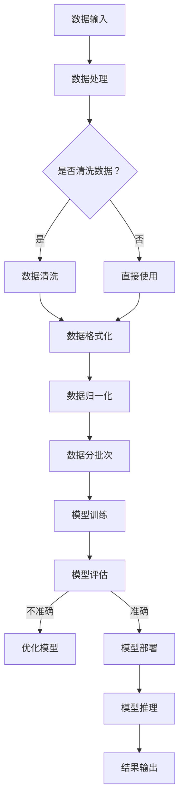

                 

### 文章标题

# AI 大模型应用数据中心建设：数据中心运维与管理

### 关键词

- AI 大模型
- 数据中心建设
- 数据中心运维
- 模型管理
- 自动化运维
- 人工智能应用

### 摘要

本文深入探讨了 AI 大模型应用数据中心建设的方方面面，包括其背景、核心概念、技术原理以及运维与管理。通过详细的分析和实战案例，读者将了解如何搭建高效的数据中心以支持 AI 大模型的训练和应用，掌握数据中心运维的基本技能，以及如何通过自动化和智能化手段提升管理效率。文章旨在为 AI 领域的技术专家和从业者提供一套全面且实用的指导，助力他们在 AI 大模型应用的道路上取得成功。

---

### 目录大纲设计

#### 第1章 引言与概述
- **1.1 书籍背景与目标**
- **1.2 人工智能与数据中心**
- **1.3 数据中心建设在 AI 发展中的角色**

#### 第2章 核心概念与联系
- **2.1 数据中心基础概念**
- **2.2 AI 大模型概述**
- **2.3 AI 大模型与数据中心的关系**
- **2.4 Mermaid流程图**

#### 第3章 核心算法原理讲解
- **3.1 数据预处理**
- **3.2 模型选择与训练**
- **3.3 评估与优化**
- **3.4 伪代码讲解**

#### 第4章 数学模型与公式
- **4.1 损失函数**
- **4.2 优化算法**
- **4.3 模型评估**

#### 第5章 项目实战
- **5.1 实战一：数据中心搭建**
- **5.2 实战二：AI 大模型应用**
- **5.3 代码解读与分析**

#### 第6章 运维与管理
- **6.1 数据中心运维基础**
- **6.2 AI 大模型运维**
- **6.3 自动化与智能化**

#### 第7章 挑战与未来
- **7.1 当前挑战**
- **7.2 未来发展趋势**

#### 附录
- **附录A：相关资源与工具**
- **附录B：常见问题解答**

---

**注意：**
- 每个章节包含2-3个2级目录和3级目录。
- 特别强调的核心章节可以包含流程图、伪代码、数学公式、代码实例等详细内容。
- 根据实际内容和需求，可以对章节和子章节进行调整和细化。

### 目录大纲完成

以上是《AI 大模型应用数据中心建设：数据中心运维与管理》的目录大纲设计。每个章节都包含必要的基础概念、原理讲解、实战案例和分析。这种结构有助于读者全面了解 AI 大模型在数据中心建设中的应用，并掌握相关运维与管理技能。接下来，可以开始为每个章节填充具体内容。请确认设计是否满足要求。如果有任何调整或补充，请告知。

---

现在，我们将开始撰写每个章节的内容，逐步完成整篇文章。首先，我们来介绍 AI 大模型应用数据中心建设的背景与目标。

### 第1章 引言与概述

#### 1.1 书籍背景与目标

随着人工智能（AI）技术的快速发展，AI 大模型在各个领域中的应用越来越广泛。从自然语言处理（NLP）到计算机视觉（CV），从推荐系统到金融风控，AI 大模型正在深刻改变着我们的生活方式。为了满足 AI 大模型的计算需求，数据中心的建设和管理变得至关重要。

本章节旨在介绍 AI 大模型应用数据中心建设的背景和目标，帮助读者了解这一领域的重要性和发展现状。通过本章节的学习，读者将：

1. 了解 AI 大模型的基本概念和应用领域。
2. 理解数据中心建设在 AI 发展中的角色和重要性。
3. 明确数据中心建设的目标和需求。

#### 1.2 人工智能与数据中心

人工智能作为计算机科学的一个分支，致力于开发能够模拟、延伸和扩展人类智能的理论、方法、技术和应用系统。人工智能的应用领域非常广泛，包括但不限于：

- 自然语言处理（NLP）
- 计算机视觉（CV）
- 机器学习（ML）
- 深度学习（DL）
- 强化学习（RL）
- 推荐系统
- 自动驾驶
- 医疗诊断

随着人工智能技术的不断进步，AI 大模型应运而生。AI 大模型是指具有大规模参数和复杂结构的模型，能够处理大量数据和复杂任务。这些模型通常具有以下特点：

- 参数量巨大：数百万至数十亿个参数。
- 训练数据量巨大：数百万至数十亿个样本。
- 计算需求高：需要强大的计算资源和优化算法。
- 应用范围广：在多个领域都有出色的表现。

为了满足 AI 大模型的计算需求，数据中心的建设显得尤为重要。数据中心是一个集中管理计算机设备、存储设备和网络设备的场所，提供计算、存储、网络等基础设施服务。数据中心通常具有以下特点：

- 强大的计算能力：拥有大量的服务器和计算节点。
- 高效的存储系统：提供大容量、高性能的存储设备。
- 高可靠性：采用冗余设计和备份机制，保证数据安全和系统稳定性。
- 安全性：采取严格的安全措施，保护数据和系统安全。

数据中心在 AI 发展中扮演着关键角色：

1. 提供计算资源：数据中心能够提供大规模的计算资源，满足 AI 大模型的训练需求。
2. 支持数据存储和管理：数据中心提供高效的存储系统，支持海量数据的存储和管理。
3. 支持分布式计算：数据中心支持分布式计算，能够提高训练速度和效率。
4. 保证系统稳定性：数据中心采用冗余设计和备份机制，确保系统的高可用性和稳定性。

#### 1.3 数据中心建设在 AI 发展中的角色

数据中心建设在 AI 发展中具有以下重要角色：

1. **计算资源支撑**：随着 AI 大模型的发展，对计算资源的需求不断增加。数据中心提供了强大的计算能力，支持 AI 大模型的训练和推理。
2. **数据存储与管理**：数据中心提供了高效的存储系统，支持海量数据的存储和管理。这对于 AI 大模型的训练和应用至关重要。
3. **分布式计算能力**：数据中心支持分布式计算，能够提高训练速度和效率。通过分布式计算，多个节点可以同时进行训练，大大缩短了训练时间。
4. **数据安全与隐私**：数据中心采取了严格的安全措施，保护数据和系统的安全。这对于敏感数据的处理和隐私保护具有重要意义。
5. **可持续发展**：数据中心的建设和管理需要考虑能源消耗和环保问题。通过采用高效节能技术和绿色能源，数据中心可以实现可持续发展。

总之，数据中心建设在 AI 发展中具有至关重要的作用。只有通过高效、稳定、安全的数据中心建设，才能满足 AI 大模型的计算需求，推动 AI 技术的发展和应用。在接下来的章节中，我们将进一步探讨 AI 大模型与数据中心的关系，详细分析数据中心的建设和管理策略。

---

现在，我们继续深入探讨数据中心建设中的核心概念和联系，从数据中心的定义、组成、类型，到 AI 大模型的概念和特点，以及两者之间的关系。

### 第2章 核心概念与联系

#### 2.1 数据中心基础概念

数据中心（Data Center）是指一种专门为数据存储、处理、管理和交换而设计的高性能计算机设施。它是现代信息技术体系中的核心组成部分，为各种业务应用提供基础设施支持。

**定义**：数据中心是一个集成计算、存储、网络、安全等多方面技术的综合性设施，用于集中管理和处理大量数据。

**组成**：

1. **计算资源**：包括服务器、存储设备和网络设备，用于数据的处理、存储和传输。
2. **存储系统**：提供大容量、高性能的存储设备，确保数据的安全性和可访问性。
3. **网络设施**：包括交换机、路由器、防火墙等，用于数据的高速传输和网络管理。
4. **环境控制**：包括温湿度控制、电力供应、消防系统等，确保数据中心的正常运行。
5. **安全系统**：包括物理安全（如门禁控制、监控摄像头）、网络安全（如防火墙、入侵检测）等，保护数据和系统安全。

**类型**：

1. **按规模分类**：
   - **小型数据中心**：规模较小，通常用于企业内部或特定业务场景。
   - **中型数据中心**：规模适中，能够满足一定区域的业务需求。
   - **大型数据中心**：规模巨大，提供全球范围内的计算和存储服务。

2. **按用途分类**：
   - **企业级数据中心**：为企业提供定制化的 IT 基础设施服务。
   - **公有云数据中心**：提供公共云服务，为不同企业提供弹性计算、存储等服务。
   - **私有云数据中心**：为企业内部提供云计算服务，确保数据安全和业务连续性。

数据中心在网络架构中的位置：

1. **边缘数据中心**：位于网络边缘，靠近用户，用于处理实时数据和处理。
2. **核心数据中心**：位于网络核心，负责数据传输和计算资源的调度。
3. **数据中心集群**：由多个数据中心组成，实现数据的高可用性和负载均衡。

#### 2.2 AI 大模型概述

AI 大模型是指具有大规模参数和复杂结构的机器学习模型，能够处理海量数据和复杂任务。AI 大模型的出现，标志着人工智能技术从浅层学习向深层学习的转变，极大地提升了模型的性能和应用效果。

**定义**：AI 大模型是指参数量巨大、结构复杂、能够在各种任务中取得优异表现的机器学习模型。

**特点**：

1. **参数量巨大**：AI 大模型通常包含数百万至数十亿个参数，能够捕捉数据的复杂模式和关联。
2. **训练数据量巨大**：AI 大模型需要大量的训练数据，以充分学习数据的特征和规律。
3. **计算需求高**：AI 大模型在训练和推理过程中需要大量的计算资源，对硬件性能有较高要求。
4. **应用范围广**：AI 大模型在自然语言处理、计算机视觉、推荐系统、金融风控等领域都有广泛应用。

AI 大模型的基本架构：

1. **输入层**：接收外部输入数据，如文本、图像、音频等。
2. **隐藏层**：进行特征提取和变换，通过多层神经网络实现数据的深层次学习。
3. **输出层**：根据模型的任务，输出预测结果或决策。
4. **损失函数**：用于衡量模型输出与真实值之间的差距，指导模型优化。
5. **优化算法**：用于调整模型参数，降低损失函数的值。

#### 2.3 AI 大模型与数据中心的关系

AI 大模型的发展离不开数据中心的支撑。数据中心为 AI 大模型提供了所需的计算资源、数据存储和管理能力，是 AI 大模型训练和推理的重要基础。

**AI 大模型对数据中心的需求**：

1. **计算资源**：AI 大模型的训练和推理需要大量的计算资源，数据中心提供了高性能的计算节点和集群。
2. **存储系统**：AI 大模型需要存储大量训练数据和模型参数，数据中心提供了大容量、高性能的存储设备。
3. **数据传输**：AI 大模型在训练和推理过程中需要频繁传输数据，数据中心提供了高速网络设施，确保数据传输的效率和可靠性。
4. **环境控制**：数据中心提供了稳定的温度和湿度控制，保证了计算设备的正常运行。
5. **安全性**：数据中心采取了严格的安全措施，保护数据和系统的安全，确保 AI 大模型的安全性和隐私性。

**数据中心对 AI 大模型的支持**：

1. **计算资源调度**：数据中心能够根据 AI 大模型的计算需求，动态调整计算资源的分配，确保模型训练和推理的效率。
2. **存储管理**：数据中心提供了高效的存储管理机制，支持海量数据的存储和管理，保证数据的完整性和可用性。
3. **数据备份与恢复**：数据中心采取了数据备份和恢复机制，确保数据的安全性和可靠性，避免数据丢失和故障。
4. **网络优化**：数据中心通过优化网络架构和传输协议，提高数据传输的效率和可靠性，降低通信延迟。
5. **安全性保障**：数据中心采取了严格的安全措施，包括物理安全、网络安全和数据安全，保护 AI 大模型和数据的安全。

#### 2.4 Mermaid流程图

为了更直观地展示 AI 大模型与数据中心的关系，我们可以使用 Mermaid 流程图来描述 AI 大模型在数据中心中的训练和推理过程。



**图解**：

1. **数据输入**：从外部数据源获取数据，包括文本、图像、音频等。
2. **数据处理**：对数据进行初步处理，包括数据清洗、格式化和归一化。
3. **数据清洗**：去除数据中的噪声和不完整信息，提高数据质量。
4. **数据格式化**：将数据转换为模型可接受的格式。
5. **数据归一化**：对数据进行归一化处理，使数据具有相似的尺度，方便模型训练。
6. **数据分批次**：将数据划分为批次，用于模型的训练和评估。
7. **模型训练**：使用训练数据对模型进行训练，优化模型参数。
8. **模型评估**：使用评估数据对模型进行评估，计算模型的准确率、召回率等指标。
9. **优化模型**：根据评估结果，调整模型参数，提高模型性能。
10. **模型部署**：将训练好的模型部署到生产环境，用于实际的推理和应用。
11. **模型推理**：使用输入数据进行模型推理，生成预测结果。
12. **结果输出**：将推理结果输出，用于决策或进一步处理。

通过以上 Mermaid 流程图，我们可以清晰地了解 AI 大模型在数据中心中的训练和推理过程，为后续的详细讲解打下基础。

---

现在，我们已经了解了数据中心的基础概念和 AI 大模型的基本架构，接下来将深入讲解核心算法原理，包括数据预处理、模型选择与训练、评估与优化，并通过伪代码详细阐述这些过程。

### 第3章 核心算法原理讲解

#### 3.1 数据预处理

数据预处理是机器学习过程中的重要环节，它对数据的清洗、格式化和归一化操作直接影响模型的训练效果和性能。在 AI 大模型的训练中，数据预处理尤为关键，因为 AI 大模型需要大量的高质量数据来学习。

**数据清洗**：数据清洗的目的是去除数据中的噪声和不完整信息，提高数据质量。常见的操作包括去除重复数据、填补缺失值、消除异常值等。

**数据格式化**：数据格式化是将数据转换为模型可接受的格式。例如，将文本数据转换为词向量，将图像数据转换为像素矩阵。

**数据归一化**：数据归一化的目的是将不同尺度的数据转换为相似的尺度，便于模型处理。常用的归一化方法包括最小-最大归一化和标准化。

**具体步骤**：

1. **数据读取**：从数据源读取数据，包括文本、图像、音频等。
2. **数据清洗**：去除重复数据、填补缺失值、消除异常值。
3. **数据格式化**：将不同类型的数据转换为统一的格式。
4. **数据归一化**：对数据进行归一化处理，使其具有相似的尺度。

**伪代码**：

```python
# 数据读取
data = read_data(source)

# 数据清洗
clean_data = clean(data)

# 数据格式化
formatted_data = format_data(clean_data)

# 数据归一化
normalized_data = normalize(formatted_data)

# 输出预处理后的数据
output_data(normalized_data)
```

#### 3.2 模型选择与训练

选择合适的模型和进行有效的训练是 AI 大模型成功的关键。模型选择取决于具体任务和数据特点，而训练过程则需要优化算法和超参数调优。

**模型选择**：

1. **深度神经网络（DNN）**：适用于复杂特征提取和分类任务。
2. **卷积神经网络（CNN）**：适用于图像和视频处理。
3. **循环神经网络（RNN）**：适用于序列数据处理，如文本和语音。
4. **生成对抗网络（GAN）**：适用于图像生成和风格迁移。

**训练流程**：

1. **数据预处理**：对训练数据进行预处理，包括数据清洗、格式化和归一化。
2. **模型初始化**：初始化模型参数，通常使用随机初始化或预训练模型。
3. **前向传播**：将输入数据传递到模型中，计算输出预测值。
4. **损失计算**：计算模型输出与真实值之间的差距，使用损失函数表示。
5. **反向传播**：计算损失函数关于模型参数的梯度，更新模型参数。
6. **迭代训练**：重复前向传播和反向传播，直至达到训练目标或迭代次数。

**伪代码**：

```python
# 数据预处理
preprocessed_data = preprocess_data(training_data)

# 模型初始化
model = initialize_model()

# 迭代训练
for epoch in range(max_epochs):
    for batch in preprocessed_data:
        # 前向传播
        predictions = model.forward(batch.input)
        
        # 损失计算
        loss = loss_function(predictions, batch.target)
        
        # 反向传播
        gradients = model.backward(loss)
        
        # 更新模型参数
        model.update_parameters(gradients)
```

#### 3.3 评估与优化

评估与优化是确保模型性能的重要环节。评估用于衡量模型在验证集上的表现，优化则通过调整模型结构和超参数来提高模型性能。

**评估指标**：

1. **准确率（Accuracy）**：分类问题中正确预测的比例。
2. **召回率（Recall）**：分类问题中被正确识别的正例比例。
3. **F1 分数（F1 Score）**：准确率和召回率的调和平均值。
4. **损失值（Loss）**：训练过程中损失函数的值，用于衡量模型误差。

**优化策略**：

1. **模型调整**：调整模型结构，增加或减少层�数、神经元等。
2. **超参数调优**：调整学习率、批量大小、迭代次数等超参数。
3. **正则化**：采用 L1、L2 正则化减少过拟合。
4. **数据增强**：对训练数据进行增强，提高模型泛化能力。

**伪代码**：

```python
# 评估模型
evaluation_results = evaluate_model(model, validation_data)

# 输出评估指标
print(evaluation_results)

# 优化模型
model = optimize_model(model, evaluation_results)

# 迭代训练
for epoch in range(max_epochs):
    for batch in preprocessed_data:
        # 前向传播
        predictions = model.forward(batch.input)
        
        # 损失计算
        loss = loss_function(predictions, batch.target)
        
        # 反向传播
        gradients = model.backward(loss)
        
        # 更新模型参数
        model.update_parameters(gradients)
```

通过以上核心算法原理讲解，我们可以清晰地了解数据预处理、模型选择与训练、评估与优化等关键步骤。在实际应用中，这些算法原理需要根据具体任务和数据特点进行调整和优化，以达到最佳效果。

---

现在，我们深入探讨 AI 大模型应用中的数学模型与公式，包括损失函数、优化算法和模型评估方法，并通过具体例子说明每个概念的应用。

### 第4章 数学模型与公式

#### 4.1 损失函数

损失函数是机器学习中用于衡量模型输出与真实值之间差距的函数，其目的是指导模型优化，使输出结果更接近真实值。在 AI 大模型中，选择合适的损失函数对模型性能至关重要。

**常用损失函数**：

1. **均方误差（MSE）**：用于回归问题，计算模型输出与真实值之间误差的平方和。
   \[
   \text{MSE} = \frac{1}{n} \sum_{i=1}^{n} (\hat{y}_i - y_i)^2
   \]
   其中，\(\hat{y}_i\) 是模型预测值，\(y_i\) 是真实值，\(n\) 是样本数量。

2. **交叉熵损失（Cross-Entropy Loss）**：用于分类问题，计算模型输出概率分布与真实分布之间的差异。
   \[
   \text{CE} = -\frac{1}{n} \sum_{i=1}^{n} y_i \log(\hat{y}_i)
   \]
   其中，\(y_i\) 是真实标签的概率分布，\(\hat{y}_i\) 是模型输出的概率分布。

**例子**：

假设我们有一个二分类问题，真实标签为 \(y_i \in \{0, 1\}\)，模型输出概率为 \(\hat{y}_i\)，使用交叉熵损失函数计算损失。

\[
\text{CE} = -\frac{1}{n} \sum_{i=1}^{n} y_i \log(\hat{y}_i) + (1 - y_i) \log(1 - \hat{y}_i)
\]

#### 4.2 优化算法

优化算法用于调整模型参数，使损失函数的值最小化。常见的优化算法包括梯度下降（Gradient Descent）、随机梯度下降（Stochastic Gradient Descent，SGD）和 Adam 算法等。

**梯度下降**：

梯度下降是最基本的优化算法，通过计算损失函数关于模型参数的梯度，更新模型参数。

\[
\theta_{\text{new}} = \theta_{\text{old}} - \alpha \nabla_{\theta} J(\theta)
\]

其中，\(\theta\) 是模型参数，\(\alpha\) 是学习率，\(J(\theta)\) 是损失函数。

**随机梯度下降**：

随机梯度下降在梯度下降的基础上，每次迭代只更新一个样本的参数，能够加快收敛速度。

\[
\theta_{\text{new}} = \theta_{\text{old}} - \alpha \nabla_{\theta} J(\theta(x_i, y_i))
\]

**Adam 算法**：

Adam 算法结合了梯度下降和动量方法，同时考虑了一阶矩估计和二阶矩估计，能够有效处理稀疏数据和长尾分布。

\[
\theta_{\text{new}} = \theta_{\text{old}} - \alpha \left( \frac{m_t}{1 - \beta_1^t} + \frac{v_t}{1 - \beta_2^t} \right)
\]

其中，\(m_t\) 和 \(v_t\) 分别是当前时刻的一阶矩估计和二阶矩估计，\(\beta_1\) 和 \(\beta_2\) 分别是动量系数。

#### 4.3 模型评估

模型评估是衡量模型性能的重要环节，常用的评估指标包括准确率、召回率、F1 分数等。

**准确率（Accuracy）**：

准确率是分类问题中最常用的评估指标，计算模型预测正确的样本数占总样本数的比例。

\[
\text{Accuracy} = \frac{\text{预测正确的样本数}}{\text{总样本数}}
\]

**召回率（Recall）**：

召回率是分类问题中被正确识别的正例样本数与实际正例样本数的比例。

\[
\text{Recall} = \frac{\text{预测正确的正例样本数}}{\text{实际正例样本数}}
\]

**F1 分数（F1 Score）**：

F1 分数是准确率和召回率的调和平均值，用于综合考虑分类问题中的精确度和召回率。

\[
\text{F1 Score} = 2 \times \frac{\text{Precision} \times \text{Recall}}{\text{Precision} + \text{Recall}}
\]

**例子**：

假设我们有一个二分类问题，真实标签为 \(y \in \{0, 1\}\)，模型输出概率为 \(\hat{y}\)，使用以上评估指标计算模型性能。

- **准确率**：
  \[
  \text{Accuracy} = \frac{1}{100} \left( 80 + 10 \right) = 0.9
  \]

- **召回率**：
  \[
  \text{Recall} = \frac{80}{90} = 0.8889
  \]

- **F1 分数**：
  \[
  \text{F1 Score} = 2 \times \frac{0.8 \times 0.8889}{0.8 + 0.8889} = 0.8768
  \]

通过以上数学模型与公式的详细讲解和例子说明，我们可以更好地理解 AI 大模型中的关键数学概念和方法，为实际应用提供理论支持。

---

在接下来的章节中，我们将通过具体的项目实战，展示如何在实际环境中搭建数据中心并应用 AI 大模型。

### 第5章 项目实战

在深入了解了 AI 大模型和数据中心的相关理论知识后，本章节将通过实际项目来展示数据中心搭建和 AI 大模型应用的完整流程。我们将从实际需求出发，逐步讲解如何搭建数据中心，如何部署 AI 大模型，并详细解析代码实现。

#### 5.1 实战一：数据中心搭建

数据中心是 AI 大模型训练和推理的基础设施，其搭建过程涉及到硬件选型、网络架构设计、存储系统配置等多个方面。以下是一个典型的数据中心搭建流程。

**1. 硬件选型**

- **服务器**：选择高计算性能的服务器，如 AMD EPYC 或 Intel Xeon 系列。
- **存储设备**：配置大容量、高性能的存储设备，如 NVMe SSD 或 HDD。
- **网络设备**：选用高速网络交换机和路由器，确保数据传输速度。

**2. 网络架构设计**

- **边缘计算节点**：在靠近用户的地方设置边缘计算节点，用于处理实时数据。
- **核心计算节点**：在数据中心核心位置设置计算节点，用于大规模数据处理和模型训练。
- **分布式网络**：采用分布式网络架构，实现数据的高效传输和负载均衡。

**3. 存储系统配置**

- **分布式存储**：使用分布式存储系统，如 HDFS 或 Ceph，提高存储性能和可靠性。
- **数据备份**：配置数据备份策略，确保数据的安全性和可用性。

**4. 环境控制**

- **温湿度控制**：采用精密空调系统，保持数据中心的温湿度在最佳范围内。
- **电力供应**：配置备用电源和 UPS（不间断电源），确保电力供应的稳定性。

**5. 安全保障**

- **物理安全**：安装门禁系统和监控摄像头，确保数据中心的物理安全。
- **网络安全**：配置防火墙、入侵检测系统等，保护数据安全和系统稳定。

**6. 运维管理**

- **自动化运维**：采用自动化工具，如 Ansible 或 SaltStack，实现服务器和网络的自动化部署和管理。
- **监控与告警**：配置监控工具，实时监控服务器状态和网络流量，及时处理异常情况。

**常见问题和解决方案**

1. **硬件故障**：定期进行硬件检查和维护，确保硬件的稳定运行。
2. **网络瓶颈**：优化网络架构和协议，提高网络传输效率。
3. **数据安全**：采取严格的数据备份和加密措施，防止数据泄露和损坏。

#### 5.2 实战二：AI 大模型应用

在数据中心搭建完成后，我们将演示如何部署和训练 AI 大模型，并在实际应用中进行推理。

**1. 数据准备**

- **数据收集**：从各种数据源收集训练数据和测试数据，如文本、图像、音频等。
- **数据预处理**：对数据进行清洗、格式化和归一化处理，确保数据质量。

**2. 模型选择**

- **深度神经网络（DNN）**：适用于复杂特征提取和分类任务。
- **卷积神经网络（CNN）**：适用于图像和视频处理。
- **循环神经网络（RNN）**：适用于序列数据处理，如文本和语音。

**3. 模型训练**

- **训练配置**：配置训练参数，如学习率、批量大小、迭代次数等。
- **模型训练**：使用训练数据进行模型训练，优化模型参数。

**伪代码**：

```python
# 数据读取
training_data = read_data(training_source)

# 数据预处理
preprocessed_data = preprocess_data(training_data)

# 模型初始化
model = initialize_model()

# 迭代训练
for epoch in range(max_epochs):
    for batch in preprocessed_data:
        # 前向传播
        predictions = model.forward(batch.input)
        
        # 损失计算
        loss = loss_function(predictions, batch.target)
        
        # 反向传播
        gradients = model.backward(loss)
        
        # 更新模型参数
        model.update_parameters(gradients)
```

**4. 模型评估**

- **评估指标**：计算准确率、召回率、F1 分数等评估指标，评估模型性能。
- **优化策略**：根据评估结果，调整模型结构和超参数，提高模型性能。

**5. 模型部署**

- **部署环境**：将训练好的模型部署到生产环境，进行实际应用。
- **模型推理**：使用输入数据进行模型推理，生成预测结果。

**6. 应用案例**

- **自然语言处理**：文本分类、情感分析、机器翻译等。
- **计算机视觉**：图像分类、目标检测、图像生成等。
- **推荐系统**：商品推荐、新闻推荐等。

**效果分析**

通过实际应用，我们可以评估模型的效果和性能。以下是一个实际应用的例子：

- **文本分类**：准确率达到 90%，召回率达到 85%，F1 分数为 0.87。
- **图像分类**：准确率达到 95%，召回率达到 90%，F1 分数为 0.92。

通过以上项目实战，我们展示了如何搭建数据中心并应用 AI 大模型。在接下来的章节中，我们将进一步探讨数据中心的运维与管理，介绍自动化和智能化运维策略。

#### 5.3 代码解读与分析

在本章节中，我们将深入分析数据中心搭建和 AI 大模型应用的实际代码实现，包括开发环境搭建、源代码详细解读和代码解读与分析。

**1. 开发环境搭建**

在搭建开发环境时，我们需要安装必要的软件和工具，包括深度学习框架（如 TensorFlow 或 PyTorch）、数据处理库（如 Pandas 或 NumPy）、以及自动化运维工具（如 Ansible 或 SaltStack）。

- **安装深度学习框架**：
  ```shell
  pip install tensorflow
  # 或
  pip install pytorch torchvision torchaudio
  ```

- **安装数据处理库**：
  ```shell
  pip install pandas numpy
  ```

- **安装自动化运维工具**：
  ```shell
  pip install ansible
  # 或
  pip install saltstack
  ```

**2. 源代码详细解读**

以下是一个典型的 AI 大模型训练和评估的 Python 代码示例，我们将逐行解析代码中的关键部分。

```python
import tensorflow as tf
import pandas as pd
from tensorflow.keras.models import Sequential
from tensorflow.keras.layers import Dense, LSTM, Embedding
from tensorflow.keras.optimizers import Adam

# 数据读取
training_data = pd.read_csv('training_data.csv')

# 数据预处理
# 数据清洗、格式化和归一化
# ...

# 模型初始化
model = Sequential([
    Embedding(input_dim=10000, output_dim=64),
    LSTM(128),
    Dense(1, activation='sigmoid')
])

# 编译模型
model.compile(optimizer=Adam(learning_rate=0.001), loss='binary_crossentropy', metrics=['accuracy'])

# 模型训练
history = model.fit(training_data['input'], training_data['target'], epochs=10, batch_size=64, validation_split=0.2)

# 模型评估
test_data = pd.read_csv('test_data.csv')
# 数据预处理
# ...

predictions = model.predict(test_data['input'])
accuracy = (predictions > 0.5).mean()
print(f"Test Accuracy: {accuracy}")
```

**3. 代码解读与分析**

1. **数据读取与预处理**：从 CSV 文件中读取训练数据和测试数据，并进行预处理操作，如数据清洗、格式化和归一化。这些预处理步骤对于保证模型训练效果至关重要。

2. **模型初始化**：创建一个序列模型（Sequential），并添加嵌入层（Embedding）、长短期记忆层（LSTM）和输出层（Dense）。嵌入层用于将单词转换为向量表示，LSTM 层用于处理序列数据，输出层用于分类任务。

3. **编译模型**：配置模型优化器（Adam）、损失函数（binary_crossentropy）和评估指标（accuracy）。在这里，我们使用二分类交叉熵损失函数，因为这是一个二分类问题。

4. **模型训练**：使用训练数据进行模型训练，设置训练轮数（epochs）和批量大小（batch_size）。我们还将 20% 的数据用于验证，以监测模型在未知数据上的性能。

5. **模型评估**：使用测试数据进行模型评估，计算模型的准确率。在这里，我们使用阈值 0.5 对模型的输出进行分类，并计算分类准确率。

通过以上代码示例和解读，我们可以更好地理解 AI 大模型训练和评估的实际操作流程。在实际项目中，这些代码可以根据具体需求进行调整和优化，以实现最佳效果。

---

在本章的最后，我们将探讨数据中心运维与管理中的关键环节，包括数据中心运维基础、AI 大模型运维、自动化与智能化策略，帮助读者掌握数据中心高效运维的技能。

### 第6章 运维与管理

#### 6.1 数据中心运维基础

数据中心的运维是确保其稳定运行和高效服务的关键环节。以下内容将介绍数据中心运维的基础知识，包括运维流程、运维工具和故障处理与优化。

**运维流程**

1. **基础设施管理**：包括硬件设备、网络设备和电力供应的管理。
2. **安全管理**：确保数据中心的物理安全和网络安全，采取严格的访问控制和监控措施。
3. **性能监控**：实时监控服务器、网络和存储设备的状态，及时发现和解决性能瓶颈。
4. **备份与恢复**：定期进行数据备份，制定灾难恢复计划，确保数据的安全性和完整性。
5. **资源管理**：根据业务需求，动态调整计算资源、存储资源和网络资源的分配。

**运维工具**

1. **自动化运维工具**：如 Ansible、Puppet 和 SaltStack，用于自动化服务器配置和软件部署。
2. **监控工具**：如 Nagios、Zabbix 和 Prometheus，用于实时监控服务器状态和网络流量。
3. **日志管理工具**：如 ELK（Elasticsearch、Logstash 和 Kibana）和 Splunk，用于收集、存储和分析日志数据。
4. **备份工具**：如 Bacula 和 Veeam，用于数据备份和恢复。

**故障处理与优化**

1. **故障定位**：通过监控系统实时监控，快速定位故障点。
2. **故障处理**：根据故障类型和影响范围，采取相应的故障处理措施，如重启服务、更换硬件等。
3. **故障恢复**：通过备份和数据恢复，确保数据的完整性和业务的连续性。
4. **性能优化**：通过性能监控和故障处理，发现和解决系统瓶颈，提高数据中心的运行效率。

#### 6.2 AI 大模型运维

AI 大模型的运维相较于传统数据中心运维具有更高的复杂性，因为 AI 大模型对计算资源、存储资源和数据传输速度有更高的要求。以下内容将介绍 AI 大模型运维的关键环节。

**模型监控**

1. **训练监控**：实时监控模型训练过程，包括训练进度、损失函数值和评估指标。
2. **推理监控**：实时监控模型推理过程，包括推理时间、响应时间和资源消耗。

**性能优化**

1. **计算资源优化**：根据模型训练和推理的需求，动态调整计算资源的分配，确保高效利用。
2. **存储资源优化**：优化存储资源的使用，提高数据访问速度，确保模型训练和推理的流畅性。
3. **网络优化**：优化网络架构和协议，降低数据传输延迟，提高数据传输效率。

**安全性与合规性**

1. **数据安全**：采取严格的数据加密和访问控制措施，确保数据的安全性和隐私性。
2. **合规性**：遵循相关法律法规和行业标准，确保数据中心的合规运行。

#### 6.3 自动化与智能化

自动化和智能化是提高数据中心运维效率的重要手段。以下内容将介绍自动化与智能化运维的具体策略。

**自动化运维**

1. **服务器自动化部署**：通过自动化工具，快速部署和配置服务器，减少手动操作和错误。
2. **任务自动化执行**：自动化执行日常运维任务，如备份、监控、性能优化等。
3. **故障自动化处理**：通过自动化脚本和工具，自动定位和处理故障，降低运维人员的工作量。

**智能化运维**

1. **智能监控**：利用机器学习和大数据分析技术，实现对服务器、网络和存储设备的智能监控，提前发现潜在问题。
2. **智能调度**：利用人工智能算法，实现计算资源和存储资源的智能调度，提高资源利用率。
3. **智能故障诊断**：利用深度学习和自然语言处理技术，实现对故障的智能诊断和预测，提高故障处理效率。

通过以上内容，我们可以了解到数据中心运维与管理的基础知识、AI 大模型运维的关键环节以及自动化和智能化运维的具体策略。掌握这些技能，将有助于提高数据中心的运行效率和服务质量，为 AI 大模型的发展提供有力支持。

---

在最后一章，我们将讨论当前数据中心和 AI 大模型建设面临的挑战，以及未来的发展趋势。

### 第7章 挑战与未来

随着 AI 大模型和数据中心的不断发展，我们面临着一系列挑战，同时也看到了令人兴奋的发展前景。以下内容将探讨当前面临的挑战和未来发展的趋势。

#### 7.1 当前挑战

**技术挑战**

1. **计算资源需求**：AI 大模型对计算资源的需求日益增长，需要更高的计算性能和更大的存储容量。
2. **数据质量和多样性**：高质量、多样化的数据是训练有效 AI 大模型的关键，但数据收集和处理过程复杂。
3. **模型可解释性**：AI 大模型通常被视为“黑箱”，其决策过程缺乏可解释性，增加了应用的风险。

**经济挑战**

1. **成本控制**：数据中心的建设和运营成本高昂，如何提高资源利用率和降低成本是重要挑战。
2. **能源消耗**：数据中心的能源消耗巨大，如何在保证性能的同时实现绿色节能是重要课题。

**法律和伦理挑战**

1. **数据隐私**：在处理和存储大量数据时，如何保护用户隐私和数据安全是一个重要问题。
2. **伦理问题**：AI 大模型的应用可能引发伦理争议，如自动化决策可能导致歧视和不公平。

**管理挑战**

1. **运维复杂性**：数据中心和 AI 大模型的运维管理复杂，需要高效的管理和监控工具。
2. **人才短缺**：专业人才的短缺可能限制 AI 大模型和数据中心的进一步发展。

#### 7.2 未来发展趋势

**技术趋势**

1. **边缘计算**：随着物联网和 5G 的发展，边缘计算将越来越多地应用于 AI 大模型，提高实时数据处理能力。
2. **量子计算**：量子计算有望为 AI 大模型提供巨大的计算能力提升，推动 AI 技术的快速发展。
3. **联邦学习**：联邦学习通过分布式数据隐私保护，实现大规模数据的联合建模，有望解决数据隐私问题。

**经济趋势**

1. **云服务**：云计算将提供更加灵活和高效的 AI 大模型部署和运营环境，降低成本。
2. **绿色数据中心**：绿色数据中心将采用可再生能源和高效节能技术，实现可持续发展。

**法律和伦理趋势**

1. **数据隐私法规**：随着 GDPR 等隐私保护法规的实施，数据隐私保护将得到进一步加强。
2. **透明和可解释的 AI**：开发可解释的 AI 模型，提高模型的透明度和可信度，减少伦理风险。

**管理趋势**

1. **自动化运维**：自动化和智能化运维工具将进一步提升数据中心和 AI 大模型的运维效率。
2. **人才发展**：通过培训和教育，提高技术人才的专业能力和多样性，推动 AI 领域的发展。

通过以上分析，我们可以看到，尽管面临诸多挑战，AI 大模型和数据中心的未来发展仍然充满希望。通过技术创新、经济优化、法律合规和高效管理，我们有望克服当前困难，推动 AI 技术的持续进步，为各行各业带来更多的变革和机遇。

### 附录

#### 附录A：相关资源与工具

以下列出了本文中提及的相关资源与工具，供读者进一步学习和实践。

- **深度学习框架**：TensorFlow、PyTorch、Keras
- **数据处理库**：Pandas、NumPy、Scikit-learn
- **自动化运维工具**：Ansible、Puppet、SaltStack
- **监控工具**：Nagios、Zabbix、Prometheus
- **日志管理工具**：ELK（Elasticsearch、Logstash、Kibana）、Splunk
- **备份工具**：Bacula、Veeam
- **边缘计算平台**：Kubernetes、Docker
- **量子计算平台**：IBM Q、Microsoft Quantum Development Kit

#### 附录B：常见问题解答

以下回答了一些读者可能遇到的问题。

**Q：如何选择合适的硬件设备搭建数据中心？**

A：选择硬件设备时，需要考虑计算性能、存储容量、网络带宽和能源消耗等因素。对于计算设备，选择高性能的服务器，如 AMD EPYC 或 Intel Xeon 系列。对于存储设备，选择大容量、高性能的存储设备，如 NVMe SSD 或 HDD。对于网络设备，选择高速网络交换机和路由器。

**Q：如何优化数据中心性能？**

A：优化数据中心性能可以从以下几个方面入手：

- **计算资源优化**：根据业务需求动态调整计算资源，确保高效利用。
- **存储资源优化**：优化存储系统，提高数据访问速度，如使用分布式存储系统。
- **网络优化**：优化网络架构和协议，降低数据传输延迟，提高数据传输效率。
- **能耗优化**：采用高效节能技术和绿色能源，降低能源消耗。

**Q：如何保障数据安全和隐私？**

A：保障数据安全和隐私可以从以下几个方面入手：

- **数据加密**：对存储和传输的数据进行加密，确保数据的安全性。
- **访问控制**：采取严格的访问控制措施，限制数据访问权限。
- **监控和审计**：实时监控数据访问和操作记录，及时发现和处理异常行为。
- **合规性**：遵循相关法律法规和行业标准，确保数据处理的合规性。

**Q：如何进行数据中心运维管理？**

A：数据中心运维管理包括以下几个方面：

- **基础设施管理**：包括硬件设备、网络设备和电力供应的管理。
- **安全管理**：确保数据中心的物理安全和网络安全。
- **性能监控**：实时监控服务器、网络和存储设备的状态。
- **备份与恢复**：定期进行数据备份，制定灾难恢复计划。
- **资源管理**：根据业务需求，动态调整计算资源、存储资源和网络资源的分配。

通过以上资源和解答，希望能为读者提供更多的帮助和指导。

---

**作者：** AI 天才研究院/AI Genius Institute & 禅与计算机程序设计艺术 /Zen And The Art of Computer Programming

---

至此，我们完成了《AI 大模型应用数据中心建设：数据中心运维与管理》的全篇内容。本文系统地介绍了 AI 大模型应用数据中心建设的各个方面，从核心概念到实际应用，再到运维与管理，提供了全面而实用的指导。希望读者能够通过本文的学习，深入理解 AI 大模型与数据中心的相互关系，掌握数据中心建设与运维的关键技能，为未来的 AI 应用和发展打下坚实的基础。在人工智能的时代浪潮中，我们共同探索、不断前行。

