                 

### AI 大模型应用数据中心建设：数据中心运维与管理

> **关键词**：AI 大模型、数据中心、运维管理、硬件配置、网络安全、性能优化、案例分析

> **摘要**：本文旨在探讨 AI 大模型应用数据中心的建设与运维管理。首先，我们将概述数据中心的基础建设和主要组成部分，然后深入分析 AI 大模型数据中心的需求和硬件配置，探讨存储系统设计、网络优化以及数据中心的安全管理。最后，通过实际案例分享，提供数据中心运维管理的实践经验和未来发展趋势的预测。

### 目录大纲

#### 第一部分：数据中心基础建设

- **第1章** 数据中心概述
  - 1.1 数据中心的重要性
  - 1.2 数据中心的定义与分类
  - 1.3 数据中心的发展趋势

- **第2章** 数据中心架构
  - 2.1 数据中心架构设计原则
  - 2.2 数据中心主要组成部分
  - 2.3 数据中心网络架构

- **第3章** 服务器硬件选择与配置
  - 3.1 服务器硬件选型
  - 3.2 服务器硬件配置优化
  - 3.3 硬件故障排除与维护

- **第4章** 存储系统设计与管理
  - 4.1 存储系统概述
  - 4.2 常见存储设备及其特点
  - 4.3 存储系统性能优化
  - 4.4 数据备份与恢复策略

- **第5章** 网络设备配置与管理
  - 5.1 网络设备概述
  - 5.2 路由器配置与管理
  - 5.3 交换机配置与管理
  - 5.4 安全设备配置与管理

- **第6章** 数据中心能源管理与绿色化
  - 6.1 数据中心能源消耗分析
  - 6.2 数据中心能源管理策略
  - 6.3 数据中心绿色化实践

- **第7章** 数据中心安全管理
  - 7.1 数据中心安全威胁分析
  - 7.2 数据中心安全策略制定
  - 7.3 数据中心安全管理流程
  - 7.4 应急预案与响应

#### 第二部分：AI 大模型数据中心建设

- **第8章** AI 大模型数据中心需求分析
  - 8.1 AI 大模型应用场景分析
  - 8.2 数据中心需求分析
  - 8.3 数据中心建设方案规划

- **第9章** AI 大模型硬件配置与优化
  - 9.1 AI 大模型硬件选型
  - 9.2 硬件性能优化策略
  - 9.3 软硬件协同优化

- **第10章** AI 大模型存储解决方案
  - 10.1 AI 大模型存储需求
  - 10.2 存储系统设计与优化
  - 10.3 数据管理策略

- **第11章** AI 大模型网络优化与加速
  - 11.1 AI 大模型网络需求
  - 11.2 网络优化技术
  - 11.3 网络加速技术

- **第12章** AI 大模型数据中心运维与管理
  - 12.1 数据中心运维体系构建
  - 12.2 运维管理工具与实践
  - 12.3 AI 大模型性能监控与调优

- **第13章** AI 大模型数据中心案例分析
  - 13.1 案例一：AI 大模型应用数据中心建设实践
  - 13.2 案例二：数据中心运维管理经验分享
  - 13.3 案例三：AI 大模型应用效益评估

- **第14章** 未来数据中心发展趋势
  - 14.1 AI 大模型数据中心面临的挑战
  - 14.2 未来数据中心发展趋势预测
  - 14.3 数据中心建设与发展战略建议

#### 附录

- **附录 A** 常用工具与软件介绍
- **附录 B** 相关资料与参考文献
- **附录 C** Mermaid 流程图示
- **附录 D** 算法伪代码展示
- **附录 E** 数学模型与公式详解
- **附录 F** 代码解读与分析示例

### 第一部分：数据中心基础建设

#### 第1章 数据中心概述

数据中心是现代信息技术的重要组成部分，它是集中处理、存储和分发数据的物理位置。数据中心的重要性在于它为企业提供了一个稳定、高效和安全的数据处理环境，支撑着各种关键业务的运行。

##### 1.1 数据中心的重要性

数据中心的重要性体现在以下几个方面：

1. **业务连续性**：数据中心提供了高可用性，确保业务在灾难发生时能够迅速恢复。
2. **数据安全**：数据中心采用了多种安全措施，保障数据的安全性和隐私性。
3. **资源集中管理**：数据中心允许企业集中管理和分配资源，提高资源利用效率。
4. **数据存储和检索**：数据中心提供了大量的存储空间和高效的检索能力，支撑大规模数据处理需求。
5. **支持云计算和大数据应用**：数据中心是云计算和大数据应用的基础设施，提供了强大的计算和存储能力。

##### 1.2 数据中心的定义与分类

数据中心可以定义为一种设施，用于集中存储、处理和分发大量数据。根据数据中心的规模、功能和目标，可以将数据中心分为以下几种类型：

1. **企业内部数据中心**：企业内部建立的数据中心，主要用于支撑企业的内部业务。
2. **公有云数据中心**：由第三方云服务提供商运营的数据中心，提供各种云计算服务。
3. **混合云数据中心**：结合公有云和私有云的数据中心，为企业提供灵活的混合云服务。
4. **边缘数据中心**：靠近数据源的微型数据中心，主要用于处理本地数据，降低数据传输延迟。
5. **超级数据中心**：规模巨大、处理能力强大的数据中心，通常用于大规模数据处理和存储。

##### 1.3 数据中心的发展趋势

数据中心的发展趋势主要表现在以下几个方面：

1. **云计算的普及**：随着云计算的普及，数据中心逐渐成为云计算服务的重要支撑。
2. **绿色数据中心**：为了降低能源消耗和碳排放，绿色数据中心成为了数据中心建设的重要方向。
3. **智能化运维**：人工智能和机器学习技术的应用，使数据中心的运维管理更加智能化和高效。
4. **边缘计算的发展**：随着5G和物联网的普及，边缘数据中心逐渐成为数据中心体系的重要组成部分。
5. **安全性的提升**：数据安全和隐私保护成为了数据中心建设的重要挑战，数据中心的安全防护措施不断加强。

### 第2章 数据中心架构

数据中心的架构设计是确保数据中心高效、稳定和安全运行的关键。一个良好的数据中心架构应包括硬件设备、软件系统、网络架构和管理策略等。

##### 2.1 数据中心架构设计原则

数据中心架构设计应遵循以下原则：

1. **高可用性**：确保数据中心在发生故障时能够快速恢复，保证业务的连续性。
2. **高可靠性**：确保数据中心设备、系统和网络的高可靠性，降低故障率和停机时间。
3. **可扩展性**：设计时应考虑未来的业务增长，确保数据中心能够灵活扩展。
4. **灵活性**：支持各种业务需求，如云计算、大数据、物联网等。
5. **安全性**：采用多种安全措施，确保数据的安全性和隐私性。

##### 2.2 数据中心主要组成部分

数据中心的主要组成部分包括：

1. **服务器**：服务器是数据中心的核心计算设备，用于处理数据和运行应用。
2. **存储系统**：存储系统用于数据存储和检索，包括磁盘阵列、NAS、SAN等。
3. **网络设备**：网络设备包括路由器、交换机、防火墙等，用于数据传输和网络安全。
4. **电源系统**：提供稳定的电力供应，确保数据中心正常运行。
5. **冷却系统**：数据中心需要大量电力和计算设备，因此冷却系统至关重要。
6. **监控管理系统**：监控系统用于实时监控数据中心的运行状态，管理工具用于自动化运维。
7. **安全系统**：包括防火墙、入侵检测系统、加密设备等，确保数据安全。

##### 2.3 数据中心网络架构

数据中心的网络架构通常包括以下层次：

1. **接入层**：连接用户设备，如PC、手机等。
2. **分布层**：连接服务器、存储设备等核心设备。
3. **核心层**：连接数据中心内部各个网络节点，提供高速数据传输。
4. **边缘层**：连接外部网络，如互联网、云服务提供商等。

数据中心网络架构的设计应考虑以下因素：

1. **高带宽**：提供足够的带宽，确保数据传输速度。
2. **高可靠性**：采用冗余设计和备份机制，确保网络稳定。
3. **安全性**：采用防火墙、加密技术等，保护数据安全。
4. **灵活性**：支持业务扩展和变化，易于管理和维护。

### 第3章 服务器硬件选择与配置

服务器是数据中心的计算核心，选择合适的硬件和配置对于数据中心的高效运行至关重要。

##### 3.1 服务器硬件选型

服务器硬件选型应考虑以下因素：

1. **处理器**：根据业务需求选择合适的处理器，如CPU核心数、频率、缓存大小等。
2. **内存**：根据应用需求配置足够的内存，确保系统运行流畅。
3. **存储**：选择适合的存储设备，如SSD、HDD等，根据需求配置存储容量和性能。
4. **网络**：根据数据传输需求选择合适的网络设备，如网卡、交换机等。
5. **扩展性**：考虑未来的扩展需求，选择可扩展的服务器硬件。

##### 3.2 服务器硬件配置优化

服务器硬件配置优化包括以下方面：

1. **CPU性能优化**：通过调整处理器频率、启用超线程技术等，提高CPU性能。
2. **内存优化**：通过合理配置内存、关闭不必要的后台进程等，提高内存利用率。
3. **存储优化**：通过RAID技术、SSD缓存等，提高存储性能和可靠性。
4. **网络优化**：通过优化网络配置、启用QoS技术等，提高网络传输速度和稳定性。

##### 3.3 硬件故障排除与维护

硬件故障排除与维护是数据中心运维的重要环节，包括以下步骤：

1. **故障检测**：通过监控系统实时监控硬件状态，发现故障迹象。
2. **故障诊断**：根据故障现象，分析硬件故障原因，如硬件故障、软件故障等。
3. **故障处理**：根据故障原因，采取相应的处理措施，如更换硬件、升级软件等。
4. **故障记录**：记录故障情况、处理过程和结果，便于后续故障排查和预防。

### 第4章 存储系统设计与管理

存储系统是数据中心的重要组成部分，负责数据的存储和检索。合理设计和管理存储系统对于提高数据中心的性能和可靠性至关重要。

##### 4.1 存储系统概述

存储系统包括以下组成部分：

1. **存储设备**：如磁盘阵列、NAS、SAN等。
2. **存储协议**：如SCSI、NAS、iSCSI等。
3. **存储管理软件**：用于管理存储设备、配置存储策略、监控存储性能等。

##### 4.2 常见存储设备及其特点

常见存储设备及其特点如下：

1. **磁盘阵列**：通过多个硬盘组成的阵列，提高数据存储的可靠性和性能。
2. **NAS**：网络存储设备，通过网络连接，提供文件存储和共享服务。
3. **SAN**：存储区域网络，通过光纤通道或iSCSI协议连接，提供块级存储服务。
4. **SSD**：固态硬盘，具有高速度、低延迟、高可靠性等特点。
5. **HDD**：机械硬盘，具有高容量、低成本等特点。

##### 4.3 存储系统性能优化

存储系统性能优化包括以下方面：

1. **RAID技术**：通过RAID技术提高存储性能和可靠性。
2. **SSD缓存**：通过SSD缓存加速数据读写速度。
3. **存储策略**：根据业务需求，合理配置存储策略，如数据复制、数据迁移等。
4. **数据去重和压缩**：通过数据去重和压缩减少存储空间占用，提高存储性能。

##### 4.4 数据备份与恢复策略

数据备份与恢复策略包括以下方面：

1. **全备份**：定期对数据进行完全备份，确保数据完整性。
2. **增量备份**：备份自上次备份后发生变化的数据，减少备份时间。
3. **差异备份**：备份自上次全备份后发生变化的数据，减少备份空间占用。
4. **恢复策略**：根据备份类型和需求，采取相应的恢复策略，如快照恢复、文件恢复等。

### 第5章 网络设备配置与管理

网络设备是数据中心的重要组成部分，负责数据传输和网络安全。正确配置和管理网络设备对于确保数据中心的高效运行至关重要。

##### 5.1 网络设备概述

网络设备包括以下组成部分：

1. **路由器**：用于连接不同网络，实现数据包转发和路由功能。
2. **交换机**：用于连接网络设备，实现数据包转发和交换功能。
3. **防火墙**：用于保护网络安全，实现数据包过滤和访问控制功能。
4. **负载均衡器**：用于均衡网络流量，提高网络性能。

##### 5.2 路由器配置与管理

路由器配置与管理包括以下方面：

1. **基本配置**：设置路由器的基本参数，如IP地址、子网掩码等。
2. **路由协议**：配置路由协议，如RIP、OSPF等，实现路由功能。
3. **访问控制**：设置访问控制列表，控制数据包的进出。
4. **安全配置**：配置防火墙、加密等安全功能，保护网络安全。

##### 5.3 交换机配置与管理

交换机配置与管理包括以下方面：

1. **基本配置**：设置交换机的基本参数，如VLAN、端口模式等。
2. **交换协议**：配置交换协议，如STP、VSTP等，实现网络冗余。
3. **访问控制**：设置访问控制列表，控制端口访问。
4. **性能优化**：通过调整交换机参数，提高网络性能和稳定性。

##### 5.4 安全设备配置与管理

安全设备配置与管理包括以下方面：

1. **防火墙配置**：配置防火墙规则，过滤和阻止恶意流量。
2. **入侵检测系统（IDS）**：配置IDS规则，检测和防范入侵行为。
3. **入侵防御系统（IPS）**：配置IPS规则，阻止和修复入侵行为。
4. **安全策略**：制定安全策略，确保网络设备的安全配置和运行。

### 第6章 数据中心能源管理与绿色化

数据中心能源消耗巨大，绿色化数据中心成为了降低能源消耗和碳排放的重要方向。

##### 6.1 数据中心能源消耗分析

数据中心能源消耗包括以下方面：

1. **计算设备**：服务器、存储设备、网络设备等。
2. **冷却系统**：冷却设备、空调等。
3. **供电系统**：UPS、发电机组等。
4. **辅助设备**：照明、安防等。

##### 6.2 数据中心能源管理策略

数据中心能源管理策略包括以下方面：

1. **节能技术**：采用节能设备、优化设备运行参数等。
2. **能源监测**：实时监测能源消耗，优化能源使用。
3. **能源审计**：定期进行能源审计，发现节能潜力。
4. **绿色认证**：获取绿色认证，提高数据中心绿色化水平。

##### 6.3 数据中心绿色化实践

数据中心绿色化实践包括以下方面：

1. **节能设备**：采用高效服务器、节能空调等。
2. **可再生能源**：使用太阳能、风能等可再生能源。
3. **冷却优化**：采用液冷、蒸发冷却等高效冷却技术。
4. **废物管理**：进行废物分类、回收和再利用。

### 第7章 数据中心安全管理

数据中心的安全管理是确保数据中心稳定运行和业务连续性的重要保障。

##### 7.1 数据中心安全威胁分析

数据中心安全威胁包括以下方面：

1. **网络攻击**：如DDoS攻击、SQL注入等。
2. **数据泄露**：如敏感数据泄露、用户信息泄露等。
3. **设备故障**：如硬件故障、电源故障等。
4. **人为错误**：如操作失误、配置错误等。

##### 7.2 数据中心安全策略制定

数据中心安全策略制定包括以下方面：

1. **安全架构**：设计安全架构，确保系统安全性。
2. **访问控制**：设置访问控制策略，控制用户权限。
3. **数据加密**：对数据进行加密，保护数据安全。
4. **备份与恢复**：定期备份数据，确保数据可恢复。

##### 7.3 数据中心安全管理流程

数据中心安全管理流程包括以下步骤：

1. **风险评估**：识别潜在风险，评估风险影响。
2. **安全策略制定**：制定安全策略，确保系统安全性。
3. **安全措施实施**：实施安全措施，如安装防火墙、入侵检测系统等。
4. **安全监控**：实时监控安全事件，及时响应和处理。
5. **安全培训**：定期进行安全培训，提高员工安全意识。

##### 7.4 应急预案与响应

应急预案与响应包括以下方面：

1. **应急预案制定**：制定应急预案，确保在发生紧急情况时能够迅速响应。
2. **应急演练**：定期进行应急演练，提高应急响应能力。
3. **应急响应**：在发生紧急情况时，按照应急预案进行响应和处理。
4. **故障恢复**：在紧急情况结束后，进行故障恢复和数据恢复。

### 第二部分：AI 大模型数据中心建设

#### 第8章 AI 大模型数据中心需求分析

AI 大模型数据中心的需求分析是构建高效、稳定和可扩展数据中心的基石。AI 大模型通常需要处理海量数据，对计算能力、存储容量和网络性能有极高的要求。

##### 8.1 AI 大模型应用场景分析

AI 大模型的应用场景包括：

1. **自然语言处理**：如智能客服、机器翻译等。
2. **计算机视觉**：如图像识别、视频分析等。
3. **推荐系统**：如电商平台商品推荐、音乐推荐等。
4. **语音识别**：如语音助手、语音翻译等。
5. **金融风控**：如信用评分、交易监控等。

不同应用场景对数据中心的需求有所不同，但总体上，AI 大模型数据中心需要具备以下特点：

- **高计算能力**：支持大规模并行计算，满足训练和推理需求。
- **大规模存储**：存储海量训练数据和模型数据，确保数据快速访问。
- **高速网络**：提供低延迟、高带宽的网络连接，确保数据传输效率。
- **高可用性**：确保数据中心在故障情况下能够快速恢复，保证业务连续性。

##### 8.2 数据中心需求分析

AI 大模型数据中心的需求分析包括以下方面：

1. **计算需求**：根据模型复杂度和训练规模，选择合适的计算资源。例如，使用GPU或TPU加速AI模型的训练和推理。
2. **存储需求**：根据数据量和访问频率，选择合适的存储方案。例如，使用SSD提供高性能数据存储，使用分布式文件系统提供海量数据存储。
3. **网络需求**：根据数据传输量和网络延迟，设计高效的网络架构。例如，使用高速以太网或Infiniband提供高速数据传输。
4. **能源需求**：考虑能源消耗，采用节能技术和绿色化策略，降低运营成本和环境影响。
5. **管理需求**：采用自动化运维和管理工具，提高运维效率和可靠性。

##### 8.3 数据中心建设方案规划

AI 大模型数据中心建设方案规划包括以下步骤：

1. **需求分析**：明确AI 大模型的应用场景和性能需求。
2. **资源规划**：根据需求分析结果，选择合适的硬件设备和网络架构。
3. **架构设计**：设计数据中心的整体架构，包括计算节点、存储节点、网络节点和管理节点。
4. **部署实施**：根据架构设计，部署硬件设备和软件系统，并进行配置和测试。
5. **运维管理**：建立运维管理体系，确保数据中心稳定运行和高效管理。

### 第9章 AI 大模型硬件配置与优化

AI 大模型硬件配置与优化是确保数据中心性能的关键因素。合理的硬件配置和优化策略可以提高计算性能、降低能耗，提高数据中心的整体效率。

##### 9.1 AI 大模型硬件选型

AI 大模型硬件选型包括以下方面：

1. **CPU**：选择高性能CPU，满足AI模型的计算需求。例如，使用Intel Xeon系列或AMD EPYC系列处理器。
2. **GPU**：选择高性能GPU，加速AI模型的训练和推理。例如，使用NVIDIA Tesla系列或Google TPU系列GPU。
3. **存储**：选择高速存储设备，提高数据访问速度。例如，使用SSD或NVMe存储设备。
4. **网络**：选择高速网络设备，提供低延迟、高带宽的网络连接。例如，使用Infiniband或100Gbps以太网。
5. **服务器**：选择高性能服务器，确保计算资源的充分利用。例如，使用刀片服务器或高性能计算服务器。

##### 9.2 硬件性能优化策略

硬件性能优化策略包括以下方面：

1. **负载均衡**：通过负载均衡技术，将计算任务分配到不同的服务器和GPU上，提高资源利用率和性能。
2. **并行计算**：通过并行计算技术，将任务分解为多个子任务，同时执行，提高计算速度。
3. **缓存策略**：通过缓存技术，加快数据访问速度。例如，使用CPU缓存、GPU缓存和存储缓存。
4. **电源管理**：通过电源管理技术，降低能耗。例如，使用动态电源管理（DPM）和智能电源分配。
5. **散热优化**：通过散热优化技术，确保硬件设备在正常运行温度下工作。例如，使用液体冷却和高效散热系统。

##### 9.3 软硬件协同优化

软硬件协同优化是提高数据中心性能的重要手段。软硬件协同优化包括以下方面：

1. **操作系统优化**：优化操作系统性能，减少资源占用。例如，调整内核参数、关闭不必要的后台服务。
2. **编译优化**：通过编译器优化，提高程序执行效率。例如，使用编译器优化选项、编写高效代码。
3. **库优化**：优化系统库和第三方库的性能，提高程序运行速度。例如，使用高性能数学库、图像处理库。
4. **数据传输优化**：优化数据传输协议和算法，提高数据传输速度。例如，使用高效的网络传输协议、数据压缩技术。
5. **硬件加速**：利用硬件加速技术，提高计算速度。例如，使用GPU加速深度学习、使用FPGA加速特定任务。

### 第10章 AI 大模型存储解决方案

AI 大模型存储解决方案是确保海量数据高效存储、管理和访问的关键。合理的存储方案可以提高数据中心的性能和可靠性，降低存储成本。

##### 10.1 AI 大模型存储需求

AI 大模型存储需求包括以下方面：

1. **存储容量**：存储海量训练数据和模型数据，支持大规模数据处理。
2. **存储性能**：提供高速数据访问，满足模型训练和推理需求。
3. **数据可靠性**：确保数据的安全性和完整性，防止数据丢失和损坏。
4. **数据一致性**：确保数据在不同存储设备和节点之间的一致性，支持多用户并发访问。

##### 10.2 存储系统设计与优化

存储系统设计与优化包括以下方面：

1. **分布式存储**：采用分布式存储系统，提高存储容量和性能。例如，使用HDFS、Ceph等分布式文件系统。
2. **存储虚拟化**：通过存储虚拟化技术，实现存储资源的动态分配和管理。例如，使用SDS（软件定义存储）系统。
3. **缓存机制**：采用缓存机制，提高数据访问速度。例如，使用SSD缓存、内存缓存。
4. **数据去重与压缩**：通过数据去重和压缩技术，减少存储空间占用，降低存储成本。例如，使用数据去重算法、数据压缩算法。
5. **数据备份与恢复**：采用数据备份和恢复策略，确保数据的安全性和可用性。例如，使用增量备份、全备份、快照技术。

##### 10.3 数据管理策略

数据管理策略包括以下方面：

1. **数据分类**：根据数据的重要性和访问频率，对数据进行分类，采取不同的存储策略。例如，将热数据存储在高速存储设备中，将冷数据存储在低成本存储设备中。
2. **数据加密**：对敏感数据进行加密，确保数据安全。例如，使用AES加密算法、TLS加密协议。
3. **访问控制**：设置访问控制策略，控制用户对数据的访问权限。例如，使用访问控制列表（ACL）、身份验证和授权机制。
4. **数据归档**：将不再活跃的数据归档，减少存储成本。例如，使用归档存储设备、定期归档策略。
5. **数据生命周期管理**：根据数据的重要性和使用情况，对数据进行生命周期管理，确保数据的有效利用。例如，数据保留策略、数据迁移策略。

### 第11章 AI 大模型网络优化与加速

AI 大模型网络优化与加速是提高模型训练和推理效率的关键。合理的网络架构和优化策略可以提高数据传输速度和网络性能，降低网络延迟。

##### 11.1 AI 大模型网络需求

AI 大模型网络需求包括以下方面：

1. **高带宽**：提供足够的带宽，满足大规模数据传输需求。例如，使用100Gbps、400Gbps网络。
2. **低延迟**：降低网络延迟，提高模型训练和推理速度。例如，使用高速以太网、Infiniband。
3. **高可靠性**：确保网络稳定，避免数据传输中断。例如，使用冗余网络设计、网络监控和故障恢复机制。
4. **可扩展性**：支持网络规模扩展，适应未来业务增长。例如，使用可扩展的网络架构、动态带宽分配。

##### 11.2 网络优化技术

网络优化技术包括以下方面：

1. **负载均衡**：通过负载均衡技术，分配网络流量，提高网络性能。例如，使用软件负载均衡器、硬件负载均衡器。
2. **网络压缩**：通过网络压缩技术，减少数据传输量，降低网络负载。例如，使用数据压缩算法、HTTP压缩协议。
3. **缓存技术**：通过缓存技术，加速数据访问，减少网络传输次数。例如，使用分布式缓存系统、边缘缓存。
4. **网络隔离**：通过网络隔离技术，确保不同业务网络之间的隔离，提高网络安全性。例如，使用虚拟局域网（VLAN）、防火墙隔离。
5. **智能路由**：通过智能路由技术，优化数据传输路径，提高网络性能。例如，使用动态路由协议、网络优化算法。

##### 11.3 网络加速技术

网络加速技术包括以下方面：

1. **CDN**：通过内容分发网络（CDN），加速内容访问速度，减少网络延迟。例如，使用分布式CDN架构、智能缓存策略。
2. **网络优化器**：通过网络优化器，优化网络参数和配置，提高网络性能。例如，使用网络性能优化工具、智能网络优化算法。
3. **分布式计算**：通过分布式计算，将计算任务分配到不同节点，提高计算速度。例如，使用分布式计算框架、GPU分布式计算。
4. **边缘计算**：通过边缘计算，将计算任务靠近数据源，减少数据传输距离。例如，使用边缘服务器、边缘计算框架。
5. **网络加速器**：通过网络加速器，提高数据传输速度，减少网络延迟。例如，使用硬件网络加速卡、网络加速引擎。

### 第12章 AI 大模型数据中心运维与管理

AI 大模型数据中心的运维与管理是确保数据中心稳定运行和高效运营的关键。合理的运维管理体系和工具可以提高运维效率，降低运维成本。

##### 12.1 数据中心运维体系构建

数据中心运维体系构建包括以下方面：

1. **运维组织结构**：建立运维团队，明确职责和协作机制。
2. **运维流程**：制定运维流程，规范运维操作，确保运维效率。
3. **运维工具**：选择合适的运维工具，提高运维效率。例如，使用监控工具、自动化运维工具、故障管理系统。
4. **文档管理**：建立文档管理体系，确保文档的完整性和可追溯性。
5. **培训与发展**：定期进行运维培训，提高运维人员的技能水平。

##### 12.2 运维管理工具与实践

运维管理工具与实践包括以下方面：

1. **监控管理**：使用监控工具实时监控数据中心运行状态，及时发现和处理问题。例如，使用Zabbix、Nagios等监控工具。
2. **自动化运维**：使用自动化工具实现运维操作的自动化，提高运维效率。例如，使用Ansible、Puppet等自动化工具。
3. **故障管理**：建立故障管理机制，快速响应和处理故障。例如，使用故障管理系统、故障处理流程。
4. **变更管理**：制定变更管理流程，确保变更操作的规范和可控。例如，使用变更管理工具、变更记录。
5. **性能优化**：定期进行性能优化，提高数据中心性能和稳定性。例如，使用性能优化工具、性能优化策略。

##### 12.3 AI 大模型性能监控与调优

AI 大模型性能监控与调优包括以下方面：

1. **性能监控**：使用性能监控工具实时监控AI大模型性能，包括计算资源使用率、存储性能、网络性能等。例如，使用Prometheus、Grafana等监控工具。
2. **性能指标**：制定性能指标，评估AI大模型性能。例如，计算时间、准确率、延迟等。
3. **调优策略**：根据性能监控结果，制定调优策略，优化AI大模型性能。例如，调整模型参数、优化数据预处理、调整网络配置。
4. **性能测试**：定期进行性能测试，验证调优效果，确保AI大模型性能稳定。例如，使用性能测试工具、性能测试场景。

### 第13章 AI 大模型数据中心案例分析

通过实际案例，我们可以更深入地了解AI 大模型数据中心的构建和运维管理经验，以及其在实际应用中的效益评估。

##### 13.1 案例一：AI 大模型应用数据中心建设实践

案例一介绍了一家大型互联网公司在构建AI 大模型数据中心时的实践经验。该公司通过以下步骤实现了数据中心的建设：

1. **需求分析**：明确AI 大模型的应用场景和性能需求。
2. **资源规划**：选择合适的硬件设备和网络架构，包括高性能GPU服务器、分布式存储系统和高速网络。
3. **架构设计**：设计数据中心的整体架构，包括计算节点、存储节点、网络节点和管理节点。
4. **部署实施**：根据架构设计，部署硬件设备和软件系统，并进行配置和测试。
5. **运维管理**：建立运维管理体系，包括监控管理、自动化运维、故障管理和性能优化。

案例一展示了如何通过合理的需求分析和资源规划，构建一个高效、稳定和可扩展的AI 大模型数据中心。

##### 13.2 案例二：数据中心运维管理经验分享

案例二分享了一家金融企业在数据中心运维管理方面的经验。该公司通过以下措施提高了数据中心运维效率：

1. **运维团队建设**：建立专业的运维团队，明确职责和协作机制。
2. **运维流程**：制定详细的运维流程，规范运维操作，提高运维效率。
3. **自动化运维**：使用自动化工具实现运维操作的自动化，降低人力成本。
4. **故障管理**：建立故障管理机制，快速响应和处理故障。
5. **性能优化**：定期进行性能测试和调优，提高数据中心性能和稳定性。

案例二展示了如何通过专业团队建设和自动化运维，提高数据中心的运维效率和可靠性。

##### 13.3 案例三：AI 大模型应用效益评估

案例三介绍了一家电子商务公司在使用AI 大模型进行商品推荐时的效益评估。该公司通过以下步骤进行了效益评估：

1. **模型训练与部署**：使用大量用户数据，训练AI 大模型，并在实际业务中进行部署。
2. **性能监控**：实时监控AI 大模型性能，包括计算资源使用率、存储性能和网络性能。
3. **效益评估**：通过对比实验，评估AI 大模型对业务指标的影响，如销售额、点击率等。
4. **成本分析**：分析数据中心建设和运维成本，评估AI 大模型应用的经济效益。

案例三展示了如何通过模型训练与部署、性能监控和效益评估，评估AI 大模型在业务中的应用效益。

### 第14章 未来数据中心发展趋势

随着AI 大模型技术的不断发展，数据中心的建设和运维管理也将面临新的挑战和机遇。未来数据中心发展趋势包括以下方面：

##### 14.1 AI 大模型数据中心面临的挑战

1. **计算能力需求**：AI 大模型的计算需求日益增长，对数据中心计算能力提出更高要求。
2. **数据存储与传输**：海量数据存储和高效数据传输是数据中心面临的挑战。
3. **能源消耗**：数据中心能源消耗巨大，降低能耗和实现绿色化成为重要任务。
4. **安全性**：AI 大模型数据中心面临着更复杂的安全威胁，确保数据安全和隐私保护至关重要。

##### 14.2 未来数据中心发展趋势预测

1. **智能化运维**：随着人工智能技术的应用，数据中心运维将更加智能化和自动化。
2. **边缘计算**：边缘计算的发展将推动数据中心向边缘节点扩展，提高数据处理速度和响应能力。
3. **绿色数据中心**：绿色数据中心将成为数据中心建设的重要方向，通过节能技术和可再生能源的应用降低能源消耗。
4. **云计算与数据中心融合**：云计算和数据中心将更加紧密融合，实现资源的高效利用和灵活调度。
5. **安全性提升**：随着AI 大模型的应用，数据中心的安全性将不断提升，采用更先进的安全技术和防护策略。

##### 14.3 数据中心建设与发展战略建议

1. **需求分析**：深入了解业务需求和性能需求，合理规划数据中心规模和架构。
2. **技术创新**：持续关注新技术的发展，引入先进的技术和设备，提高数据中心性能和效率。
3. **绿色化建设**：采用绿色化技术和策略，降低数据中心能源消耗和环境影响。
4. **安全性建设**：加强数据中心安全防护，采用多层次的安全措施，确保数据安全和隐私保护。
5. **人才培养**：加强数据中心专业人才培养，提高运维人员的技能水平和职业素养。

### 附录

#### 附录 A：常用工具与软件介绍

1. **监控工具**：Zabbix、Nagios、Prometheus
2. **自动化工具**：Ansible、Puppet、Chef
3. **故障管理系统**：Nagios、Zabbix、Zenoss
4. **存储系统**：HDFS、Ceph、GlusterFS
5. **网络优化工具**：F5 BIG-IP、PRTG、NuttX

#### 附录 B：相关资料与参考文献

1. **《数据中心设计指南》**：微软数据中心团队编写的数据中心设计指南。
2. **《人工智能：一种现代方法》**：汤姆·米切尔和迈克尔·莫拉里编写的AI经典教材。
3. **《网络优化技术》**：托马斯·麦克劳德和詹姆斯·D·莫利编写的网络优化教材。
4. **《绿色数据中心技术》**：戴维·梅尔和约书亚·萨皮罗编写的绿色数据中心教材。

#### 附录 C：Mermaid 流程图示

```mermaid
graph TD
    A[数据中心概述] --> B[数据中心定义与分类]
    B --> C[数据中心发展趋势]
    A --> D[数据中心架构]
    D --> E[数据中心架构设计原则]
    D --> F[数据中心主要组成部分]
    D --> G[数据中心网络架构]
    A --> H[服务器硬件选择与配置]
    H --> I[服务器硬件选型]
    H --> J[服务器硬件配置优化]
    H --> K[硬件故障排除与维护]
    A --> L[存储系统设计与管理]
    L --> M[存储系统概述]
    L --> N[常见存储设备及其特点]
    L --> O[存储系统性能优化]
    L --> P[数据备份与恢复策略]
    A --> Q[网络设备配置与管理]
    Q --> R[网络设备概述]
    Q --> S[路由器配置与管理]
    Q --> T[交换机配置与管理]
    Q --> U[安全设备配置与管理]
    A --> V[数据中心能源管理与绿色化]
    V --> W[数据中心能源消耗分析]
    V --> X[数据中心能源管理策略]
    V --> Y[数据中心绿色化实践]
    A --> Z[数据中心安全管理]
    Z --> AA[数据中心安全威胁分析]
    Z --> BB[数据中心安全策略制定]
    Z --> CC[数据中心安全管理流程]
    Z --> DD[应急预案与响应]
```



#### 附录 D：算法伪代码展示

```python
# AI 大模型训练伪代码

# 初始化模型参数
model_params = initialize_model()

# 训练数据集
training_data = load_training_data()

# 循环迭代
for epoch in range(num_epochs):
    for data in training_data:
        # 前向传播
        predictions = forward_pass(data, model_params)

        # 计算损失
        loss = compute_loss(predictions, data)

        # 反向传播
        gradients = backward_pass(loss, model_params)

        # 更新模型参数
        update_model_params(model_params, gradients)

# 评估模型
evaluation_data = load_evaluation_data()
evaluation_predictions = forward_pass(evaluation_data, model_params)
evaluation_loss = compute_loss(evaluation_predictions, evaluation_data)

print("Final Evaluation Loss:", evaluation_loss)
```

#### 附录 E：数学模型与公式详解

$$
J = \frac{1}{m} \sum_{i=1}^{m} \sum_{j=1}^{n} \left( y^{(i)}_{j} - \sigma(z^{(i)}_{j}) \right)^2
$$

$$
z^{(i)}_j = w^{(i)}_j \cdot x_j + b^{(i)}
$$

$$
\sigma(z^{(i)}_{j}) = \frac{1}{1 + e^{-z^{(i)}_{j}}}
$$

$$
\frac{\partial J}{\partial w^{(i)}_j} = \frac{1}{m} \sum_{i=1}^{m} \sum_{j=1}^{n} \left( y^{(i)}_{j} - \sigma(z^{(i)}_{j}) \right) \cdot x_j
$$

$$
\frac{\partial J}{\partial b^{(i)}} = \frac{1}{m} \sum_{i=1}^{m} \sum_{j=1}^{n} \left( y^{(i)}_{j} - \sigma(z^{(i)}_{j}) \right)
$$

$$
w^{(i)}_j \leftarrow w^{(i)}_j - \alpha \cdot \frac{\partial J}{\partial w^{(i)}_j}
$$

$$
b^{(i)} \leftarrow b^{(i)} - \alpha \cdot \frac{\partial J}{\partial b^{(i)}}
$$

#### 附录 F：代码解读与分析示例

```python
# 示例：使用 TensorFlow 和 Keras 实现一个简单的神经网络

import tensorflow as tf
from tensorflow.keras.models import Sequential
from tensorflow.keras.layers import Dense

# 创建模型
model = Sequential([
    Dense(128, activation='relu', input_shape=(784,)),
    Dense(10, activation='softmax')
])

# 编译模型
model.compile(optimizer='adam', loss='categorical_crossentropy', metrics=['accuracy'])

# 加载数据
(x_train, y_train), (x_test, y_test) = tf.keras.datasets.mnist.load_data()

# 预处理数据
x_train = x_train / 255.0
x_test = x_test / 255.0

# 展平图像数据
x_train = x_train.reshape((-1, 784))
x_test = x_test.reshape((-1, 784))

# 转换标签为独热编码
y_train = tf.keras.utils.to_categorical(y_train, 10)
y_test = tf.keras.utils.to_categorical(y_test, 10)

# 训练模型
model.fit(x_train, y_train, epochs=5, batch_size=32, validation_data=(x_test, y_test))

# 评估模型
test_loss, test_acc = model.evaluate(x_test, y_test)
print("Test Accuracy:", test_acc)
```

### 总结

本文深入探讨了AI 大模型应用数据中心的建设与运维管理。从数据中心的基础建设、硬件配置、存储系统设计、网络优化到安全管理，我们详细分析了每个关键环节，并通过实际案例展示了数据中心建设的实践经验和效益评估。随着AI 大模型技术的不断发展，数据中心的建设和运维管理将面临新的挑战和机遇。未来，数据中心将更加智能化、绿色化和安全化，为AI 大模型的应用提供强大的支持。

### 作者信息

**作者：AI 天才研究院/AI Genius Institute & 禅与计算机程序设计艺术 /Zen And The Art of Computer Programming**

