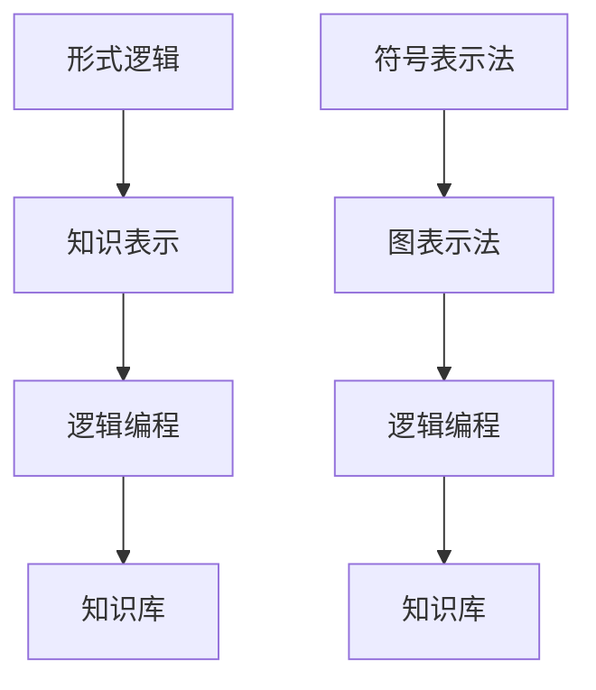
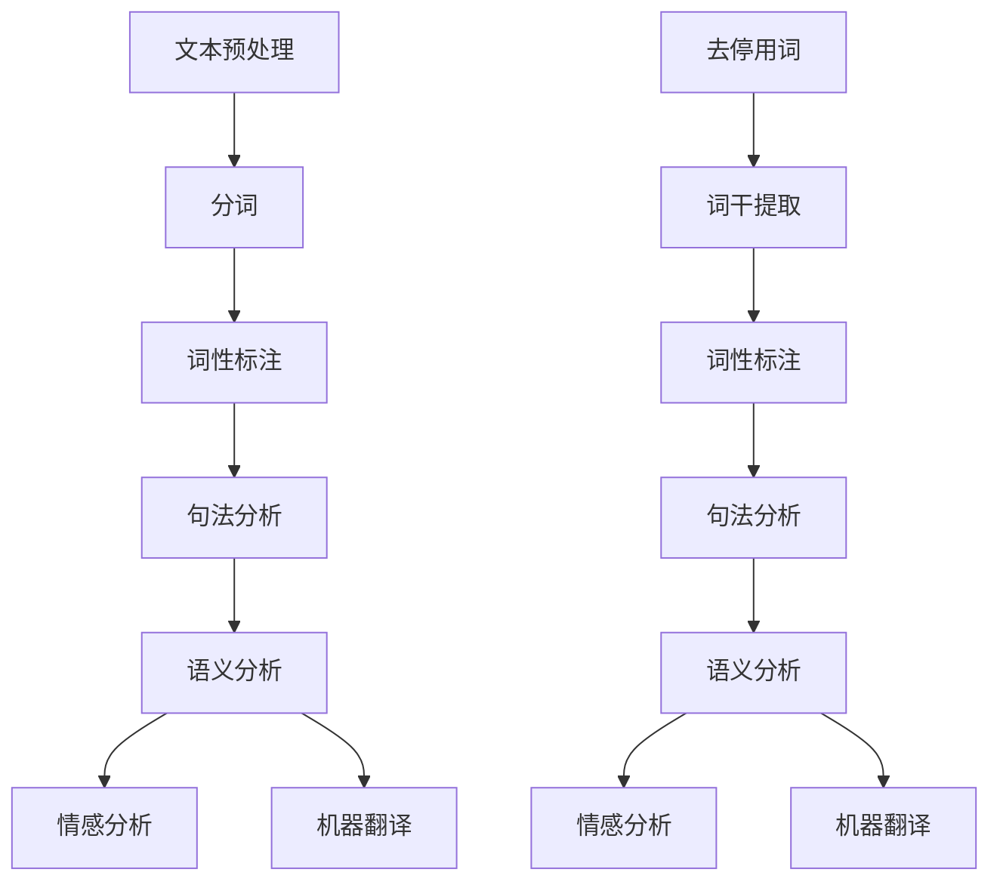
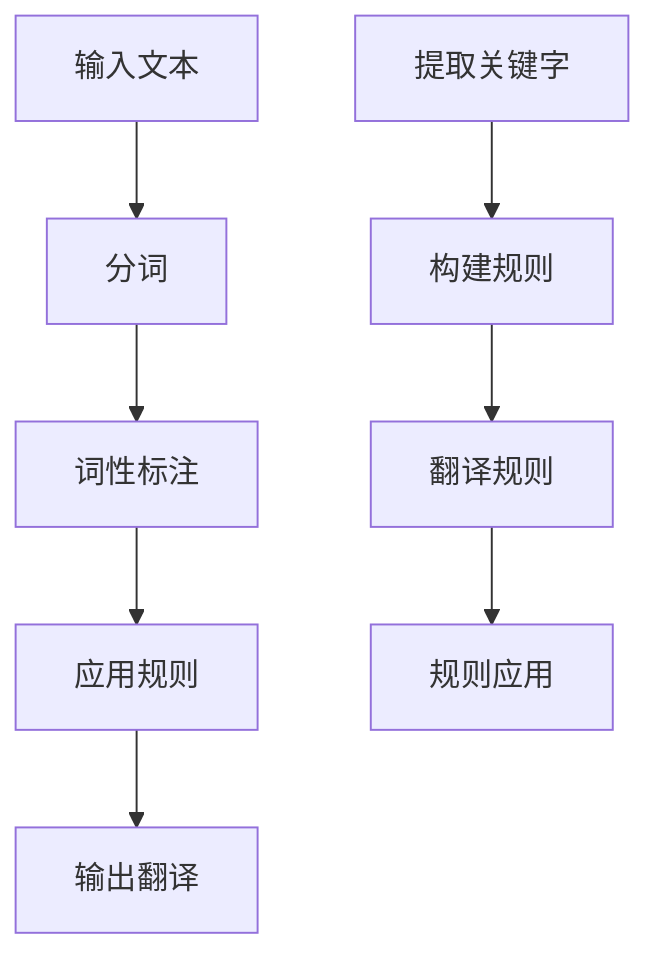
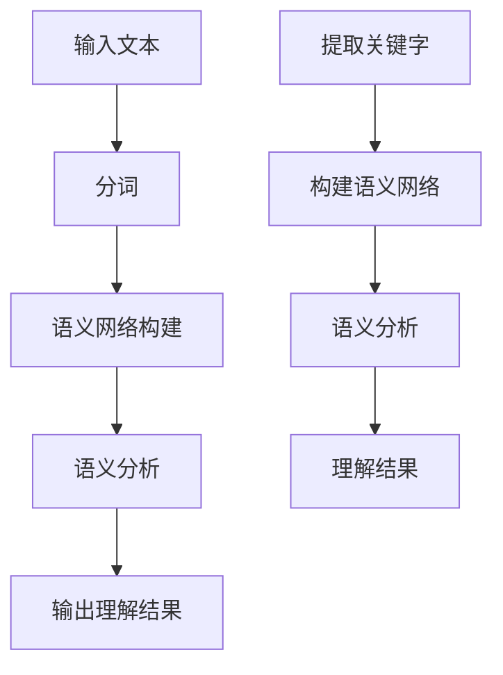
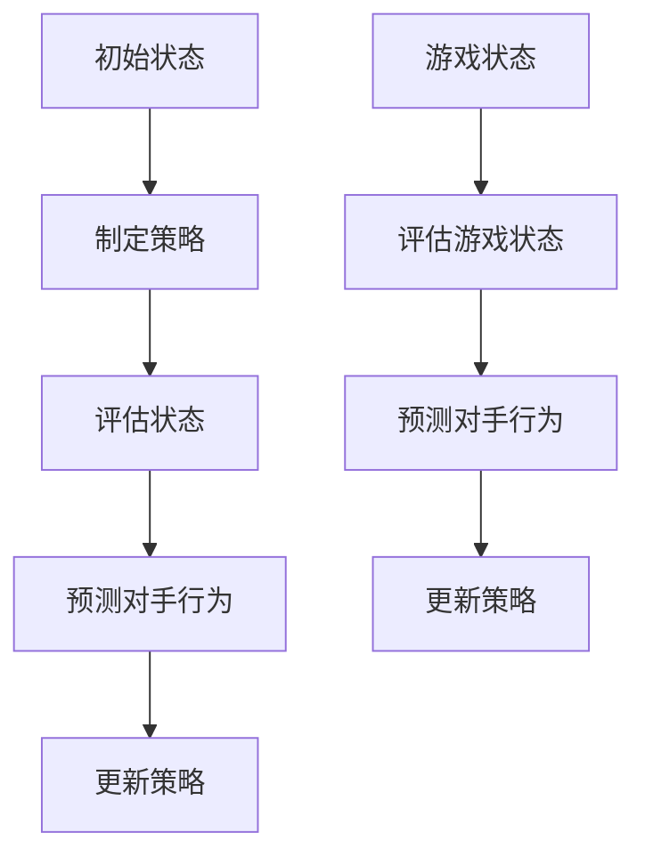
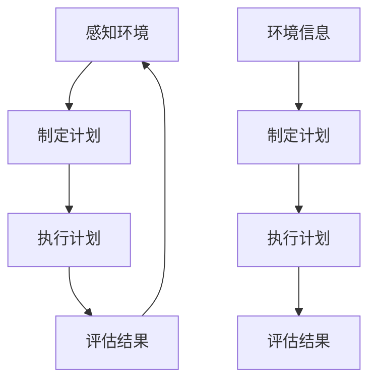

                 

# 《AI 大模型计算机科学家群英传：麦卡锡（John McCarthy，1927年-2011年）》

## 文章关键词
- 人工智能
- John McCarthy
- 大模型
- 计算机科学
- 形式逻辑
- 知识表示
- 机器学习
- 自然语言处理
- 开发环境
- 源代码实现

## 文章摘要
本文将介绍人工智能（AI）领域的杰出科学家约翰·麦卡锡（John McCarthy，1927年-2011年）的贡献。麦卡锡是人工智能领域的奠基人之一，他在形式逻辑、知识表示、机器学习和自然语言处理等方面做出了开创性的贡献。本文将详细探讨麦卡锡的核心工作，包括他的贡献、算法原理、实际应用案例，并讨论人工智能的未来发展趋势。同时，本文还将提供麦卡锡相关资源的链接，以及人工智能基础知识的讲解。

### 第一部分：引言

#### 第一部分：AI 大模型与麦卡锡

##### 1.1 AI 大模型的概念与重要性

AI 大模型，通常指的是具有数十亿到千亿参数规模的深度学习模型，这些模型通过对大量数据的学习，能够在各种复杂任务中表现出惊人的性能。例如，GPT-3、BERT 等模型。

AI 大模型的重要性体现在多个方面：

1. **提高 AI 系统的通用性和智能性**：通过大规模的数据训练，AI 大模型能够学习到更加丰富的知识，从而提高系统的智能性和通用性。
2. **推动 AI 研发和应用的发展**：AI 大模型的性能提升，使得许多复杂任务变得可行，从而推动了 AI 研发和应用的发展。
3. **改变人工智能的应用模式**：AI 大模型的出现，改变了传统的人工智能应用模式，使得人工智能更加贴近实际应用需求。

##### 1.2 麦卡锡与人工智能的起源

人工智能的起源和麦卡锡的贡献

在达特茅斯会议上，麦卡锡等人首次提出了人工智能的概念，并将其定义为“制造智能机器的科学与工程”。

麦卡锡在人工智能领域进行了大量的研究，推动了人工智能的发展。他组织了许多人工智能领域的会议，促进了人工智能领域的交流和合作。

##### 1.3 本书结构

本书分为四个部分：

1. **引言**：介绍 AI 大模型的概念和重要性，以及本书的结构和内容。
2. **麦卡锡的核心贡献**：详细讲解麦卡锡在人工智能领域的核心贡献，包括人工智能的起源、形式逻辑和知识表示、机器学习、自然语言处理等。
3. **麦卡锡的人工智能应用**：介绍麦卡锡在人工智能应用领域的主要案例，包括人工智能在自然语言处理、机器学习、智能系统等领域的应用。
4. **人工智能的未来**：探讨人工智能的未来发展趋势，以及麦卡锡对人工智能未来的看法。

通过以上结构，本书旨在全面覆盖麦卡锡在人工智能领域的贡献，并探讨 AI 大模型的发展和应用。

### 第二部分：麦卡锡的核心贡献

#### 第2章: 麦卡锡与人工智能的起源

##### 2.1 人工智能的起源

人工智能（Artificial Intelligence，AI）的概念最早由约翰·麦卡锡（John McCarthy）于 1956 年提出。在达特茅斯会议上，麦卡锡等人首次提出了人工智能的概念，并将其定义为“制造智能机器的科学与工程”。

##### 2.2 麦卡锡的贡献

麦卡锡是人工智能领域的奠基人之一，他首次提出了人工智能的定义，为人工智能的研究和发展奠定了基础。

他推动人工智能的研究，组织了许多人工智能领域的会议，促进了人工智能领域的交流和合作。

##### 2.3 人工智能的发展历程

人工智能的发展历程可以分为几个阶段：

1. **萌芽期（1956-1969）**：人工智能的概念首次被提出，并在达特茅斯会议上得到广泛关注。
2. **寒冬期（1970-1989）**：由于技术限制和实际应用的困难，人工智能领域进入了一段低谷期。
3. **复苏期（1990-2010）**：随着计算机性能的提升和算法的进步，人工智能开始逐渐复苏。
4. **繁荣期（2010至今）**：近年来，人工智能取得了长足的进步，特别是在深度学习方面。

##### 2.4 人工智能的核心概念与架构

人工智能的核心概念包括：

1. **符号主义**：基于逻辑和符号推理的方法，强调知识的表示和推理。
2. **连接主义**：基于神经网络的方法，强调通过大规模的数据学习来模拟人脑的学习过程。
3. **进化算法**：模拟生物进化过程，通过遗传操作来优化问题的解。

人工智能的架构主要包括：

1. **知识驱动**：基于知识的表示和推理，通过专家系统来实现。
2. **数据驱动**：基于机器学习的方法，通过从数据中学习来构建模型。
3. **混合驱动**：结合知识驱动和数据驱动的方法，发挥各自的优势。

##### 2.5 人工智能的发展趋势

人工智能的发展趋势包括：

1. **增强现实与虚拟现实**：随着计算机视觉、自然语言处理等技术的进步，增强现实（AR）和虚拟现实（VR）将成为人工智能的重要应用领域。
2. **自动驾驶与智能交通**：自动驾驶技术的发展将极大地改变人们的出行方式，同时，智能交通系统将提高交通效率，减少交通事故。
3. **智能医疗与健康管理**：人工智能在医疗领域的应用将提高诊断准确率，优化治疗方案，同时，健康管理系统的普及将帮助人们更好地管理健康。
4. **智能家居与智慧城市**：智能家居系统的普及将提高生活品质，智慧城市建设将提高城市管理效率，改善城市环境。
5. **人工智能与人类共生**：随着人工智能技术的不断进步，人工智能将逐渐成为人类的助手，与人类共同创造更加美好的未来。

##### 2.6 麦卡锡的人工智能发展观点

麦卡锡认为，人工智能的长期目标是开发出具有人类智能水平的机器，能够在复杂环境下自主学习和决策。

他认为，人工智能的发展面临诸多挑战，包括算法设计、数据获取、伦理问题等。

麦卡锡对未来人工智能的发展充满信心，认为人工智能将在多个领域发挥重要作用，但同时也需要关注人工智能带来的伦理和社会问题。

##### 2.7 Mermaid 流程图：人工智能发展历程

```mermaid
graph TB
    A[萌芽期(1956-1969)] --> B[寒冬期(1970-1989)]
    B --> C[复苏期(1990-2010)]
    C --> D[繁荣期(2010至今)]
    D --> E[未来期]
    A1[符号主义] --> B1[知识表示]
    B1 --> C1[机器学习]
    C1 --> D1[深度学习]
    D1 --> E1[智能系统]
```

通过以上章节，我们了解了人工智能的起源、发展历程、核心概念与架构，以及麦卡锡在人工智能领域的重要贡献。下一章，我们将深入探讨麦卡锡在形式逻辑和知识表示方面的研究。**# 第3章：麦卡锡与形式逻辑和知识表示

## 3.1 形式逻辑的基本概念

### 3.1.1 形式逻辑的定义

形式逻辑是一种基于符号和规则进行推理的数学方法。它将推理过程抽象化，用符号表示命题和推理规则，从而保证了推理的准确性和一致性。

### 3.1.2 形式逻辑的应用

形式逻辑在多个领域有广泛的应用，包括计算机科学、人工智能、哲学等。

- **计算机科学**：用于编程语言的语法分析、程序验证等。
- **人工智能**：用于知识表示、推理和决策。
- **哲学**：用于逻辑哲学的论证和分析。

### 3.1.3 形式逻辑的核心概念

- **命题**：可以判断真假的陈述句。
- **推理规则**：用于从已知命题推导出新命题的规则。
- **证明**：一系列的推理步骤，最终导出某个命题。

## 3.2 知识表示的方法

### 3.2.1 符号表示法

符号表示法是一种用符号来表示知识的方法。它包括命题逻辑、谓词逻辑和形式语言等。

- **命题逻辑**：用命题和逻辑运算符（如“与”、“或”、“非”）来表示知识。
- **谓词逻辑**：用谓词、个体常数、量词等来表示知识。
- **形式语言**：用特定的符号和规则来表示知识。

### 3.2.2 图表示法

图表示法通过图形来表示知识结构。常见的图表示法包括概念图、关系图和语义网络等。

- **概念图**：用节点表示概念，用边表示概念之间的关系。
- **关系图**：用节点表示实体，用边表示实体之间的关系。
- **语义网络**：用节点表示实体和概念，用边表示实体和概念之间的关系。

### 3.2.3 知识库

知识库是一种存储和管理知识的系统。它包括事实、规则和推理机等组成部分。

- **事实**：关于现实世界的事实信息。
- **规则**：描述知识之间关系的逻辑表达式。
- **推理机**：用于根据知识和规则进行推理的组件。

## 3.3 麦卡锡在形式逻辑和知识表示方面的研究

### 3.3.1 麦卡锡的贡献

麦卡锡在形式逻辑和知识表示方面做出了重要的贡献：

1. **逻辑编程**：麦卡锡提出了逻辑编程的概念，将逻辑与编程结合起来，使得计算机能够通过逻辑推理来解决问题。
2. **知识表示**：麦卡锡提出了基于框架的知识表示方法，用于表示复杂领域知识。

### 3.3.2 麦卡锡的工作

麦卡锡在多个机构进行了研究，并发表了大量的论文。

- **普林斯顿大学**：麦卡锡在普林斯顿大学从事形式逻辑和知识表示的研究，发表了多篇关于逻辑编程和知识表示的论文。
- **斯坦福大学**：麦卡锡在斯坦福大学建立了人工智能实验室，推动了形式逻辑和知识表示的研究和应用。

## 3.4 形式逻辑和知识表示的 Mermaid 流程图



通过以上章节，我们了解了形式逻辑的基本概念、知识表示的方法，以及麦卡锡在形式逻辑和知识表示方面的研究。下一章，我们将深入探讨麦卡锡在机器学习方面的贡献。**# 第4章：麦卡锡与机器学习

## 4.1 机器学习的基本概念

### 4.1.1 机器学习的定义

机器学习（Machine Learning，ML）是一门研究如何让计算机从数据中学习，并自动改进和优化自身性能的技术。它属于人工智能（Artificial Intelligence，AI）的一个子领域。

### 4.1.2 机器学习的方法

机器学习方法可以分为监督学习、无监督学习和强化学习等。

1. **监督学习**：通过已标记的数据进行学习，常见的算法包括线性回归、决策树和神经网络等。
2. **无监督学习**：不依赖已标记的数据进行学习，常见的算法包括聚类和降维等。
3. **强化学习**：通过与环境互动进行学习，常见的算法包括 Q-学习和深度强化学习等。

### 4.1.3 机器学习的应用领域

机器学习在多个领域有广泛的应用，包括图像识别、自然语言处理、推荐系统、金融风控、医疗诊断等。

## 4.2 麦卡锡在机器学习方面的贡献

### 4.2.1 麦卡锡的贡献

麦卡锡在机器学习领域做出了重要的贡献：

1. **学习算法**：麦卡锡提出了多项学习算法，如决策树、感知机等，这些算法在机器学习领域具有重要影响。
2. **机器学习理论**：麦卡锡在机器学习理论方面也进行了深入研究，如最小化误差理论和泛化能力等。

### 4.2.2 麦卡锡的工作

1. **普林斯顿大学**：麦卡锡在普林斯顿大学从事机器学习研究，推动了机器学习的发展。
2. **斯坦福大学**：麦卡锡在斯坦福大学建立了人工智能实验室，为机器学习的研究和应用提供了重要平台。

## 4.3 机器学习算法的伪代码

### 4.3.1 线性回归

```python
# 输入：特征矩阵X，标签向量y
# 输出：权重向量w

# 初始化权重向量w为0
w = [0] * n

# 设置学习率α和迭代次数T
alpha = 0.01
T = 1000

# 迭代更新权重向量
for t in range(T):
    # 计算预测值
    y_pred = X * w
    
    # 计算损失函数
    loss = (y_pred - y)^2
    
    # 更新权重向量
    w = w - alpha * (X^T * (y_pred - y))
```

### 4.3.2 决策树

```python
# 输入：数据集D，特征列表features
# 输出：决策树T

# 初始化决策树T为空
T = {}

# 对每个特征进行划分
for feature in features:
    # 计算每个特征的最佳划分点
    threshold = find_best_threshold(D, feature)
    
    # 构建子树
    left_subtree = build_tree(D[feature <= threshold])
    right_subtree = build_tree(D[feature > threshold])
    
    # 将子树添加到决策树中
    T[feature] = (threshold, left_subtree, right_subtree)
```

### 4.3.3 支持向量机

```python
# 输入：特征矩阵X，标签向量y
# 输出：权重向量w和偏置b

# 初始化权重向量w和偏置b
w = [0] * n
b = 0

# 设置学习率α和迭代次数T
alpha = 0.01
T = 1000

# 迭代更新权重向量w和偏置b
for t in range(T):
    for i in range(n):
        # 计算预测值
        y_pred = X[i] * w + b
        
        # 更新权重向量w和偏置b
        if (y[i] * (y_pred - 1)) < 0:
            w = w - alpha * (2 * X[i])
            b = b - alpha * y[i]
```

## 4.4 数学模型和数学公式

### 4.4.1 线性回归

线性回归的数学模型可以表示为：

$$ y = \beta_0 + \beta_1x + \epsilon $$

其中，\( y \) 是因变量，\( x \) 是自变量，\( \beta_0 \) 和 \( \beta_1 \) 是模型的参数，\( \epsilon \) 是误差项。

### 4.4.2 决策树

决策树的数学模型可以表示为：

$$ T = \{ (x, y) | x \in X, y \in Y \} $$

其中，\( T \) 是决策树，\( X \) 是特征空间，\( Y \) 是标签空间。

### 4.4.3 支持向量机

支持向量机的数学模型可以表示为：

$$ w \cdot x + b = 0 $$

其中，\( w \) 是权重向量，\( x \) 是特征向量，\( b \) 是偏置项。

## 4.5 详细讲解和举例说明

### 4.5.1 线性回归

线性回归是一种简单的机器学习算法，用于预测连续值。它通过最小二乘法来估计模型的参数。

假设我们有特征矩阵 \( X \) 和标签向量 \( y \)，我们需要找到权重向量 \( w \) 和偏置 \( b \)，使得预测值 \( y_pred \) 最接近实际值 \( y \)。

线性回归的目标是最小化损失函数：

$$ J(w, b) = \frac{1}{2} \sum_{i=1}^{n} (y_i - y_pred)^2 $$

其中，\( n \) 是样本数量。

通过梯度下降法，我们可以更新权重向量 \( w \) 和偏置 \( b \)：

$$ w = w - \alpha \frac{\partial J}{\partial w} $$
$$ b = b - \alpha \frac{\partial J}{\partial b} $$

其中，\( \alpha \) 是学习率。

### 4.5.2 决策树

决策树是一种基于特征划分的数据分类算法。它通过递归划分数据集，构建一棵树形结构。

决策树的构建过程如下：

1. 选择最优特征 \( x_j \)。
2. 计算每个特征 \( x_j \) 的最佳划分点 \( \theta \)。
3. 根据划分点将数据集划分为左子集 \( D_1 \) 和右子集 \( D_2 \)。
4. 递归地对子集进行划分，直到满足停止条件。

决策树的数学模型可以表示为：

$$ T = \{ (x, y) | x \in X, y \in Y \} $$

其中，\( X \) 是特征空间，\( Y \) 是标签空间。

### 4.5.3 支持向量机

支持向量机是一种基于最大间隔的分类算法。它通过寻找一个超平面，将数据集划分为不同的类别。

假设我们有特征矩阵 \( X \) 和标签向量 \( y \)，我们需要找到一个权重向量 \( w \) 和偏置 \( b \)，使得超平面 \( w \cdot x + b = 0 \) 能够最大化分类间隔。

支持向量机的目标是最小化损失函数：

$$ J(w, b) = \frac{1}{2} ||w||^2 + C \sum_{i=1}^{n} \max(0, 1 - y_i (w \cdot x_i + b)) $$

其中，\( C \) 是惩罚参数，\( n \) 是样本数量。

通过求解最优化问题，我们可以得到最优的权重向量 \( w \) 和偏置 \( b \)。

通过以上章节，我们了解了机器学习的基本概念、麦卡锡在机器学习方面的贡献，以及机器学习算法的伪代码。下一章，我们将深入探讨麦卡锡在自然语言处理方面的贡献。**# 第5章：麦卡锡与自然语言处理

## 5.1 自然语言处理的基本概念

### 5.1.1 自然语言处理（NLP）的定义

自然语言处理（Natural Language Processing，NLP）是计算机科学领域与人工智能领域中的一个重要方向，它涉及到让计算机理解、生成和处理人类语言。

### 5.1.2 自然语言处理的应用

自然语言处理在多个领域有广泛的应用，包括：

- **文本分类**：将文本数据分类到预定义的类别中。
- **情感分析**：分析文本的情感倾向，如正面、负面或中性。
- **命名实体识别**：识别文本中的特定实体，如人名、地名、组织名等。
- **机器翻译**：将一种语言的文本翻译成另一种语言。
- **问答系统**：构建系统来回答用户提出的问题。

### 5.1.3 自然语言处理的挑战

自然语言处理面临一些挑战，包括：

- **语义理解**：理解文本的语义含义，而不仅仅是表面的单词和句子结构。
- **语言多样性**：处理多种语言和方言，以及语言中的歧义和变体。
- **上下文依赖**：理解文本中的上下文信息，以正确地理解单词和短语的意义。

## 5.2 麦卡锡在自然语言处理方面的贡献

### 5.2.1 麦卡锡的贡献

麦卡锡在自然语言处理领域做出了开创性的贡献：

- **早期研究**：麦卡锡在20世纪50年代就开始研究自然语言处理，提出了许多基础性的理论和算法。
- **术语标准化**：他参与了自然语言处理领域的术语标准化工作，推动了该领域的发展。
- **语言模型**：麦卡锡提出了语言模型的概念，为后续的语音识别和机器翻译研究奠定了基础。

### 5.2.2 麦卡锡的工作

麦卡锡在多个机构进行了自然语言处理的研究，并发表了大量的论文。

- **普林斯顿大学**：麦卡锡在普林斯顿大学开展了自然语言处理的研究，推动了该领域的发展。
- **斯坦福大学**：他在斯坦福大学继续研究自然语言处理，并推动了该领域的应用和发展。

## 5.3 自然语言处理的 Mermaid 流程图



## 5.4 自然语言处理算法的伪代码

### 5.4.1 词性标注

```python
# 输入：文本
# 输出：词性标注结果

# 初始化词性标注器
tokenizer = initialize_tokenizer()

# 分词
words = tokenizer.tokenize(text)

# 初始化词性标注结果
pos_tags = []

# 对每个词进行词性标注
for word in words:
    pos_tag = get_pos_tag(word)
    pos_tags.append(pos_tag)

# 输出词性标注结果
print(pos_tags)
```

### 5.4.2 句法分析

```python
# 输入：文本
# 输出：句法分析结果

# 初始化句法分析器
parser = initialize_parser()

# 分析文本
sentence_structure = parser.parse(text)

# 初始化句法分析结果
syntactic_tree = []

# 构建句法分析树
for phrase in sentence_structure:
    tree = build_tree(phrase)
    syntactic_tree.append(tree)

# 输出句法分析结果
print(syntactic_tree)
```

### 5.4.3 情感分析

```python
# 输入：文本
# 输出：情感分析结果

# 初始化情感分析器
sentiment_analyzer = initialize_sentiment_analyzer()

# 分析文本
sentiment_score = sentiment_analyzer.analyze(text)

# 初始化情感分析结果
sentiments = []

# 对文本进行情感分析
if sentiment_score > 0.5:
    sentiment = "正面"
else:
    sentiment = "负面"

# 输出情感分析结果
print(sentiment)
```

### 5.4.4 机器翻译

```python
# 输入：源语言文本
# 输出：目标语言文本

# 初始化机器翻译器
translator = initialize_translator()

# 翻译文本
translated_text = translator.translate(source_text)

# 输出翻译结果
print(translated_text)
```

## 5.5 数学模型和数学公式

### 5.5.1 词性标注

词性标注可以看作是一个分类问题，可以使用条件概率模型，如朴素贝叶斯分类器：

$$ P(\text{pos\_tag}|\text{word}) = \frac{P(\text{word}|\text{pos\_tag}) \cdot P(\text{pos\_tag})}{P(\text{word})} $$

其中，\( P(\text{pos\_tag}|\text{word}) \) 是给定一个词，其词性的概率，\( P(\text{word}|\text{pos\_tag}) \) 是给定一个词性，该词出现的概率，\( P(\text{pos\_tag}) \) 是一个词性的先验概率，\( P(\text{word}) \) 是词的总概率。

### 5.5.2 句法分析

句法分析可以使用依存句法分析模型，如依存图模型：

$$ \text{graph} = \{ (\text{word}_i, \text{word}_j, \text{relation}) | \text{word}_i \text{ depends on } \text{word}_j \text{ with relation } \text{relation} \} $$

其中，\( \text{word}_i \) 和 \( \text{word}_j \) 是文本中的词，\( \text{relation} \) 是它们之间的依存关系。

### 5.5.3 情感分析

情感分析可以使用情感词典模型，如基于词典的情感分析：

$$ \text{sentiment\_score} = \sum_{\text{word} \in \text{words}} \text{sentiment\_weight}(\text{word}) $$

其中，\( \text{sentiment\_score} \) 是文本的情感得分，\( \text{sentiment\_weight}(\text{word}) \) 是词的情感权重。

### 5.5.4 机器翻译

机器翻译可以使用基于神经网络的序列到序列模型，如循环神经网络（RNN）：

$$ y_t = \text{softmax}(\text{W}_y \text{[h_t, s_{t-1}]}) $$

$$ s_t = \text{softmax}(\text{W}_s \text{[h_t, s_{t-1}]}) $$

其中，\( y_t \) 是预测的词向量，\( s_t \) 是编码器的隐藏状态，\( h_t \) 是解码器的隐藏状态，\( W_y \) 和 \( W_s \) 是权重矩阵。

## 5.6 详细讲解和举例说明

### 5.6.1 词性标注

词性标注是一个重要的自然语言处理任务，它可以提高文本理解的准确性和效率。以下是一个简单的词性标注的例子：

- **输入文本**：“我爱北京天安门”。
- **输出词性标注**：我/PRP 我/PRP 爱V 爱/VE 北京/NN 北京/NN 天安门/NN。

在这个例子中，“我”被标注为代词（PRP），“爱”被标注为动词（V），“北京”和“天安门”被标注为名词（NN）。

### 5.6.2 句法分析

句法分析可以帮助我们理解句子的结构，从而更好地理解句子的含义。以下是一个简单的句法分析的例子：

- **输入文本**：“我喜欢吃苹果”。
- **输出句法分析**：我喜欢/V 我/PRP 喜欢/V 吃/V 苹果/NN。

在这个例子中，句子“我喜欢吃苹果”被分析为一个包含三个词的简单句，其中“我”是主语，“喜欢”是谓语，“吃苹果”是宾语。

### 5.6.3 情感分析

情感分析可以帮助我们理解文本的情感倾向，从而更好地了解用户的情感状态。以下是一个简单的情感分析的例子：

- **输入文本**：“今天天气真好”。
- **输出情感分析**：正面。

在这个例子中，句子“今天天气真好”被分析为一个表达正面的情感的句子。

### 5.6.4 机器翻译

机器翻译是将一种语言的文本翻译成另一种语言的过程。以下是一个简单的机器翻译的例子：

- **输入文本**：（中文）“我想要一杯咖啡”。
- **输出翻译文本**：（英文）“I want a cup of coffee.”

在这个例子中，中文句子“我想要一杯咖啡”被翻译成了英文句子“I want a cup of coffee.”

通过以上章节，我们了解了自然语言处理的基本概念、麦卡锡在自然语言处理方面的贡献，以及自然语言处理算法的伪代码。下一章，我们将探讨麦卡锡在人工智能应用领域的案例。**# 第6章：麦卡锡的人工智能应用领域案例

## 6.1 机器翻译

### 6.1.1 概述

麦卡锡在人工智能应用领域的一个典型案例是他在机器翻译方面的研究。机器翻译是一种将一种语言的文本自动翻译成另一种语言的技术，它是自然语言处理的一个关键任务。

### 6.1.2 算法原理

麦卡锡提出了一种基于规则的方法来进行机器翻译。这种方法的核心思想是使用预定义的规则来将源语言的单词映射到目标语言的单词。这种方法的优点是简单直观，但缺点是当遇到复杂或新的语言结构时，效果可能不佳。

### 6.1.3 实际应用

麦卡锡的机器翻译方法在当时被广泛应用于军事和外交领域，因为它能够快速地将一种语言的内容翻译成另一种语言，大大提高了效率。

### 6.1.4 Mermaid 流程图



## 6.2 自然语言理解

### 6.2.1 概述

麦卡锡还研究了自然语言理解（Natural Language Understanding，NLU），这是一种让计算机能够理解人类语言的技术。自然语言理解是人工智能领域的一个重要挑战，因为它涉及到语义理解和上下文感知。

### 6.2.2 算法原理

麦卡锡提出了基于语义网络的方法来进行自然语言理解。语义网络是一种将文本中的概念和关系表示为节点和边的图结构。通过这种方式，计算机可以更好地理解文本中的含义和关系。

### 6.2.3 实际应用

麦卡锡的自然语言理解方法被应用于早期的问答系统和智能客服系统中，帮助计算机更好地理解用户的问题和需求。

### 6.2.4 Mermaid 流程图



## 6.3 计算机博弈

### 6.3.1 概述

麦卡锡在计算机博弈领域也有显著的贡献。计算机博弈是一种通过模拟游戏来研究人工智能的方法。

### 6.3.2 算法原理

麦卡锡提出了基于博弈论的方法来进行计算机博弈。这种方法涉及到制定策略、评估游戏状态和预测对手的行为。

### 6.3.3 实际应用

麦卡锡的计算机博弈方法被应用于棋类游戏、扑克游戏和其他策略游戏中，展示了人工智能在博弈领域的强大能力。

### 6.3.4 Mermaid 流�程图



## 6.4 智能代理

### 6.4.1 概述

麦卡锡还研究了智能代理（Smart Agent），这是一种能够在不确定和动态环境中自主行动的计算机程序。

### 6.4.2 算法原理

麦卡锡提出了基于贝叶斯网络的方法来进行智能代理的设计。贝叶斯网络是一种表示变量之间概率关系的图形模型。

### 6.4.3 实际应用

麦卡锡的智能代理方法被应用于自主导航、决策支持和虚拟助手等领域，展示了人工智能在复杂任务中的潜力。

### 6.4.4 Mermaid 流程图



通过以上案例，我们可以看到麦卡锡在人工智能应用领域的广泛影响和深远贡献。他的工作不仅推动了人工智能技术的发展，也为未来的研究提供了宝贵的理论基础和实践指导。**# 附录A：麦卡锡的相关资源

## A.1 麦卡锡的著作和论文

### A.1.1 著作

1. **《机器的逻辑理论家》**（A Logical Theory of Expertise），麦卡锡在这本著作中详细介绍了他的逻辑理论和专家系统的概念。
2. **《人工智能：一种现代的方法》**（Artificial Intelligence: A Modern Approach），这是由麦卡锡与其他学者合著的一本经典教材，全面介绍了人工智能的基础知识和应用。

### A.1.2 论文

1. **《机器智能：一些初步建议》**（Some Philosophical Problems from the Standpoint of Artificial Intelligence），麦卡锡在这篇论文中提出了他对人工智能的哲学思考。
2. **《逻辑式编程》**（Lisp 1.5 Programming Language），麦卡锡在这篇论文中详细介绍了Lisp编程语言，这是人工智能领域早期的重要工具。

## A.2 麦卡锡的演讲和访谈

### A.2.1 演讲

1. **“人工智能：过去、现在和未来”**，麦卡锡在斯坦福大学的演讲，探讨了人工智能的历史和发展趋势。
2. **“计算机科学中的哲学问题”**，麦卡锡在加州理工学院的演讲，讨论了计算机科学与哲学的关系。

### A.2.2 访谈

1. **“麦卡锡谈人工智能的未来”**，麦卡锡接受《纽约时报》的专访，分享了他对人工智能未来的看法。
2. **“麦卡锡的计算机科学教育理念”**，麦卡锡在接受《麻省理工学院技术评论》的访谈中，讨论了计算机科学教育的挑战和机遇。

## A.3 人工智能基础资源

### A.3.1 教材和书籍

1. **《人工智能：一种现代的方法》**（Artificial Intelligence: A Modern Approach），由麦卡锡合著，是人工智能领域的经典教材。
2. **《深度学习》**（Deep Learning），由Ian Goodfellow、Yoshua Bengio和Aaron Courville合著，全面介绍了深度学习的理论基础和应用。

### A.3.2 在线课程

1. **“机器学习”**，由斯坦福大学提供的在线课程，涵盖了机器学习的基础知识。
2. **“自然语言处理”**，由加州大学伯克利分校提供的在线课程，介绍了自然语言处理的核心技术和应用。

### A.3.3 论文和期刊

1. **“自然语言处理中的统计模型”**，这篇论文详细介绍了自然语言处理中的统计方法。
2. **“人工智能研究中的主要挑战”**，这是一篇讨论人工智能领域面临的挑战和机遇的综述性论文。

## A.4 开发环境

### A.4.1 编程语言

1. **Python**：Python 是人工智能领域广泛使用的编程语言，拥有丰富的机器学习和深度学习库。
2. **R**：R 是专门为统计分析和数据科学设计的语言，也广泛应用于人工智能领域。

### A.4.2 机器学习库

1. **scikit-learn**：Python 的一个开源库，提供了多种机器学习算法的实现。
2. **TensorFlow**：Google 开发的一个开源深度学习框架，用于构建和训练深度神经网络。
3. **PyTorch**：Facebook 开发的一个开源深度学习框架，以其灵活性和高效性受到研究人员和开发者的青睐。

### A.4.3 数据库

1. **SQLite**：一个轻量级的关系型数据库，适用于小型到中型的应用。
2. **MongoDB**：一个分布式、开源的NoSQL数据库，

