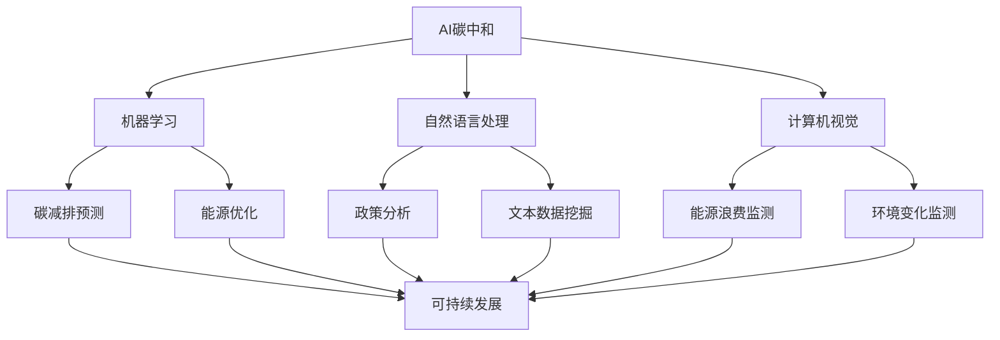
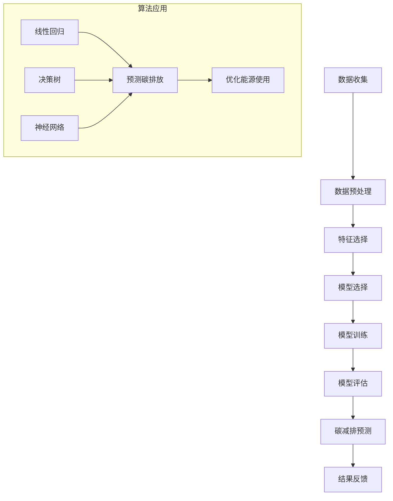

                 

### 《AI 碳中和：智能技术助力可持续发展》

#### 关键词：
- 人工智能
- 碳中和
- 可持续发展
- 机器学习
- 自然语言处理
- 计算机视觉

#### 摘要：
随着全球气候变化问题的日益严重，实现碳中和成为各国的重要目标。人工智能（AI）技术作为现代科技的前沿力量，在推动碳中和方面具有巨大潜力。本文将探讨AI在碳中和中的应用，包括机器学习、自然语言处理和计算机视觉等关键技术的原理、应用案例以及未来展望，旨在揭示智能技术如何助力全球可持续发展。

## 第一部分：AI碳中和基础

### 第1章：AI碳中和概述

#### 1.1 AI碳中和的概念

AI碳中和是指利用人工智能技术来减少碳排放、提高能源效率，从而推动可持续发展。AI技术通过分析大量数据，优化能源使用，预测碳排放趋势，从而实现碳减排目标。

#### 1.2 AI碳中和的关键技术

**机器学习**：用于预测碳排放、优化能源使用。机器学习算法可以从历史数据中学习，预测未来的碳排放量，帮助企业制定更加有效的碳减排策略。

**自然语言处理**：分析气候政策、文本数据，提高决策效率。自然语言处理技术可以帮助政府和组织更好地理解气候政策，制定符合实际的减排措施。

**计算机视觉**：识别能源浪费、监测环境变化。计算机视觉技术可以实时监测能源消耗情况，识别能源浪费，帮助企业和组织优化能源管理。

#### 1.3 AI碳中和的应用领域

**能源管理**：优化能源生产、传输和分配。通过AI技术，可以实现能源系统的智能调度，提高能源利用效率。

**交通出行**：提高公共交通效率，减少私家车使用。利用AI技术，可以优化交通路线规划，减少交通拥堵，降低碳排放。

**农业**：提高农作物产量，减少农业碳排放。AI技术可以帮助农民更好地管理农田，提高农作物产量，同时减少农业碳排放。

## 第二部分：AI碳中和技术详解

### 第2章：机器学习在碳减排中的应用

#### 2.1 机器学习算法简介

**监督学习**：通过历史数据来预测未来的碳排放量，从而优化能源使用。例如，可以使用线性回归、决策树等算法来预测碳排放量。

**无监督学习**：发现能源使用模式，从而提高能源效率。例如，可以使用聚类算法来识别能源浪费。

#### 2.2 机器学习算法原理

**决策树**：通过一系列规则来划分数据，从而预测碳排放量。决策树的每个节点表示一个特征，每个分支表示一个阈值。

**神经网络**：通过多层神经网络来模拟碳排放过程。神经网络可以自动学习数据中的特征，从而提高预测精度。

#### 2.3 机器学习案例研究

**案例1**：能源公司如何通过机器学习优化电网运行。

**案例2**：企业如何使用机器学习降低碳排放。

### 第3章：自然语言处理在碳中和政策中的应用

#### 3.1 自然语言处理概述

**文本分类**：将气候政策文本分类，帮助政府和组织更好地理解政策内容。

**实体识别**：从文本数据中提取与环境相关的实体信息，如排放源、减排措施等。

#### 3.2 自然语言处理算法原理

**词嵌入**：将文本中的词映射到高维空间，从而理解文本语义。

**序列模型**：处理连续的文本数据，如政策文本，分析其结构和含义。

#### 3.3 自然语言处理案例研究

**案例1**：如何通过自然语言处理分析气候变化政策。

**案例2**：企业如何利用自然语言处理制定碳中和战略。

### 第4章：计算机视觉在碳中和监测中的应用

#### 4.1 计算机视觉概述

**图像分类**：识别能源浪费，如工厂排放、交通拥堵等。

**目标检测**：监测环境变化，如森林砍伐、气候变化等。

#### 4.2 计算机视觉算法原理

**卷积神经网络**：通过卷积操作提取图像中的特征，从而识别能源浪费。

**目标检测算法**：如YOLO、Faster R-CNN等，用于定位和识别目标。

#### 4.3 计算机视觉案例研究

**案例1**：如何通过计算机视觉监测能源浪费。

**案例2**：企业如何利用计算机视觉优化生产过程，减少碳排放。

## 第三部分：AI碳中和实践与案例分析

### 第5章：企业碳中和实践

#### 5.1 企业碳中和战略规划

**制定碳中和目标**：企业需要设定明确的碳中和目标，制定具体的减排计划。

**评估碳排放源**：通过数据分析，识别企业的碳排放源，从而有针对性地制定减排措施。

#### 5.2 AI 技术在企业碳中和中的应用

**机器学习**：优化能源使用，降低碳排放。

**自然语言处理**：分析碳排放政策，制定符合实际的减排策略。

**计算机视觉**：监测生产过程，识别能源浪费。

#### 5.3 企业碳中和案例研究

**案例1**：企业如何通过 AI 技术实现碳中和。

**案例2**：企业如何通过 AI 技术优化供应链，降低碳排放。

### 第6章：国家和地区的碳中和政策与AI应用

#### 6.1 国家和地区的碳中和政策概述

**政策目标**：各国根据自身情况，设定碳中和目标，制定相应的政策措施。

**政策措施**：包括碳交易、税收优惠、技术支持等。

#### 6.2 AI 技术在碳中和政策中的应用

**数据挖掘**：分析政策效果，优化政策制定。

**智能决策支持**：通过数据分析，为政策制定者提供科学依据。

#### 6.3 国家和地区的碳中和政策与AI应用案例

**案例1**：如何利用 AI 技术提高碳排放监测精度。

**案例2**：如何通过 AI 技术优化碳排放交易系统。

### 第7章：AI碳中和的未来展望

#### 7.1 AI 碳中和发展趋势

**技术进步**：随着AI技术的不断进步，碳中和的实现将更加高效。

**政策支持**：各国政府对碳中和的重视程度不断提高，为AI技术发展提供有力支持。

#### 7.2 AI 碳中和面临的挑战与机遇

**数据隐私**：在数据收集和使用过程中，需要保护个人隐私。

**技术普及**：提高AI技术在各行各业的普及率，推动碳中和目标的实现。

#### 7.3 AI 碳中和的未来前景

**减少碳排放**：通过AI技术的应用，实现碳减排目标。

**推动可持续发展**：AI技术将助力全球实现可持续发展，为地球环境保护贡献力量。

## 附录

### 附录A：AI碳中和工具与资源

#### A.1 主流AI框架对比

- **TensorFlow**：由谷歌开发，是目前最流行的深度学习框架之一。
- **PyTorch**：由Facebook开发，以其动态计算图和易用性受到广泛欢迎。
- **其他框架**：如Keras、Theano等，各有其特点和优势。

#### A.2 AI碳中和数据集与案例

- **公开数据集**：如NASA的气候数据集、欧洲环境署的排放数据等。
- **案例研究**：企业、政府等在碳中和领域的成功案例。

---

本文通过对AI碳中和的基础、技术详解、实践案例分析以及未来展望的探讨，旨在展示AI技术在碳中和领域的巨大潜力。希望本文能够为读者提供有价值的参考，共同推动全球可持续发展。作者：AI天才研究院/AI Genius Institute & 禅与计算机程序设计艺术/Zen And The Art of Computer Programming。让我们继续探索AI与碳中和的无限可能！

---

### 完整性要求与文章结构

在撰写《AI碳中和：智能技术助力可持续发展》这篇技术博客文章时，确保文章内容的完整性是至关重要的。文章应包含以下核心内容，以保证读者能够全面理解AI碳中和的相关概念、技术原理和应用实践：

#### 核心概念与联系

- **AI碳中和的定义**：明确阐述AI碳中和的含义，以及它与可持续发展之间的关系。
- **关键技术的介绍**：详细描述机器学习、自然语言处理和计算机视觉在碳中和中的应用。
- **应用领域的阐述**：分析AI技术在能源管理、交通出行、农业等领域的具体应用。

#### 核心算法原理讲解

- **机器学习算法原理**：深入讲解监督学习和无监督学习在碳减排中的应用，包括决策树和神经网络的原理。
- **自然语言处理算法原理**：解释文本分类和实体识别如何帮助分析气候政策和文本数据。
- **计算机视觉算法原理**：探讨图像分类和目标检测技术在能源浪费监测和环境变化监测中的应用。

#### 项目实战

- **企业碳中和实践**：提供企业如何利用AI技术实现碳中和的案例研究，包括战略规划、AI技术应用和案例成果。
- **国家和地区碳中和政策**：分析国家和地区的碳中和政策，以及AI技术在政策制定和实施中的作用。
- **未来展望**：讨论AI碳中和的发展趋势、面临的挑战和机遇，以及其对可持续发展的贡献。

#### 完整性要求

- **概念清晰**：确保文章中的每个概念都定义明确，逻辑清晰，易于理解。
- **内容丰富**：每个章节都应提供详细的技术原理讲解、实际应用案例和具体实施步骤。
- **结构紧凑**：文章结构应合理，各部分内容之间紧密联系，形成一个完整的故事线。

通过上述核心内容的详细讲解和实际案例的支持，本文旨在为读者提供一幅完整的AI碳中和蓝图，展示智能技术在实现可持续发展中的关键作用。文章应确保每一个部分都得到充分的阐述，从而为读者提供有价值的知识和深刻的见解。

---

### 第一部分：AI碳中和基础

#### 第1章：AI碳中和概述

**1.1 AI碳中和的概念**

AI碳中和，顾名思义，就是利用人工智能技术来减少碳排放，从而促进可持续发展。随着全球气候变化的加剧，减少碳排放已成为各国政府、企业和科研机构共同关注的重要议题。AI作为现代科技的前沿力量，其强大的数据处理和分析能力，使得它在碳中和领域具有巨大的应用潜力。

在碳中和的过程中，AI技术不仅可以帮助我们更精确地预测碳排放趋势，还能优化能源管理、交通出行、农业生产等多个领域，从而达到减少碳排放的目的。具体来说，AI碳中和的意义主要体现在以下几个方面：

- **提高能源效率**：通过机器学习算法，可以对能源使用进行优化，从而减少不必要的能源浪费。
- **降低碳排放**：AI技术可以帮助识别和减少碳排放源，提高能源利用效率，实现碳减排目标。
- **促进可持续发展**：通过减少碳排放，保护地球生态环境，为未来可持续发展提供坚实的基础。

**1.2 AI碳中和的关键技术**

AI碳中和的实现依赖于多种关键技术，主要包括机器学习、自然语言处理和计算机视觉。以下是对这些技术的简要介绍：

- **机器学习**：机器学习技术通过分析大量数据，发现数据中的规律和模式，从而进行预测和优化。在碳减排领域，机器学习算法可以用于预测碳排放量、优化能源使用等。

- **自然语言处理**：自然语言处理（NLP）是一种让计算机理解和处理人类语言的技术。在碳中和领域，NLP技术可以用于分析气候政策、文本数据，帮助政府和组织制定更加有效的减排策略。

- **计算机视觉**：计算机视觉技术可以通过图像识别和分析，监测能源消耗情况，识别能源浪费，从而提高能源利用效率。

**1.3 AI碳中和的应用领域**

AI碳中和技术具有广泛的应用领域，以下是一些典型的应用场景：

- **能源管理**：通过AI技术，可以优化能源生产、传输和分配，提高能源利用效率，从而减少碳排放。

- **交通出行**：AI技术可以优化交通路线规划，减少交通拥堵，提高公共交通效率，从而减少私家车使用，降低碳排放。

- **农业**：AI技术可以帮助农民更好地管理农田，提高农作物产量，减少农业碳排放。

**1.4 小结**

AI碳中和作为一种新兴的技术手段，具有广泛的应用前景和巨大的发展潜力。通过利用机器学习、自然语言处理和计算机视觉等关键技术，AI碳中和技术可以在多个领域实现碳减排目标，为全球可持续发展做出贡献。下一章将详细探讨这些关键技术的原理和应用，敬请期待。

---

### 图 1.1 AI碳中和的核心概念与联系

下面我们将使用Mermaid流程图来描述AI碳中和的核心概念及其相互关系。



**图 1.1 AI碳中和的核心概念与联系**

- **AI碳中和**：作为整体，它涵盖了机器学习、自然语言处理和计算机视觉三大关键技术。
- **机器学习**：通过预测碳排放和优化能源使用，实现碳减排和能源效率提升。
- **自然语言处理**：通过分析气候政策和文本数据，提高决策效率，支持政策制定和执行。
- **计算机视觉**：通过监测能源浪费和环境变化，提供实时数据支持，优化能源管理和环境保护。

这一流程图清晰地展示了AI碳中和中的各个关键技术和应用领域，以及它们之间的相互联系。在接下来的章节中，我们将对每一项关键技术进行详细探讨。

---

### 图 1.2 机器学习在碳减排中的应用流程图

下面我们将使用Mermaid流程图来展示机器学习在碳减排中的应用流程。



**图 1.2 机器学习在碳减排中的应用流程图**

- **数据收集**：收集与碳排放相关的历史数据，如能源消耗、排放源等。
- **数据预处理**：对收集到的数据进行清洗、归一化等处理，以提高数据质量。
- **特征选择**：从数据中提取对碳排放影响较大的特征，用于模型训练。
- **模型选择**：根据应用场景选择合适的机器学习算法，如线性回归、决策树、神经网络等。
- **模型训练**：使用训练数据对模型进行训练，使其能够预测未来的碳排放量。
- **模型评估**：评估模型的预测准确性和稳定性，确保模型的有效性。
- **碳减排预测**：利用训练好的模型对未来的碳排放进行预测，为企业提供决策支持。
- **结果反馈**：根据预测结果，调整能源使用策略，优化能源管理，从而实现碳减排目标。

该流程图详细描述了机器学习在碳减排中的应用步骤，包括数据收集、预处理、特征选择、模型选择、训练、评估、预测和结果反馈等环节。通过这些步骤，机器学习技术能够有效地帮助企业减少碳排放，提高能源效率。

---

### 2.2 机器学习算法原理讲解

在深入探讨机器学习算法在碳减排中的应用之前，有必要首先了解一些基础的机器学习算法原理。以下是几个关键算法的简要介绍，包括其基本概念、工作原理和应用实例。

#### 2.2.1 线性回归

线性回归是一种最简单的监督学习算法，用于预测连续值。其核心思想是通过建立一个线性模型来描述输入变量和输出变量之间的关系。线性回归模型可以表示为：

\[ y = w_0 + w_1 \cdot x_1 + w_2 \cdot x_2 + \ldots + w_n \cdot x_n \]

其中，\( y \) 是预测值，\( x_1, x_2, \ldots, x_n \) 是输入特征，\( w_0, w_1, w_2, \ldots, w_n \) 是模型参数。

**应用实例**：线性回归可以用于预测碳排放量。通过收集历史能源消耗数据和环境因素，建立线性回归模型，可以预测未来的碳排放量，从而帮助企业制定减排计划。

伪代码：

```python
def linear_regression(X, y):
    # X: 输入特征矩阵，y: 输出标签向量
    # 计算模型参数
    weights = np.linalg.inv(X.T.dot(X)).dot(X.T).dot(y)
    # 返回模型参数
    return weights
```

#### 2.2.2 决策树

决策树是一种基于树形结构进行决策的算法，其核心思想是将数据集分割成多个子集，每个子集对应一个决策节点。决策树通过一系列的if-else条件来对数据进行分类或回归。

**应用实例**：决策树可以用于能源优化的决策。通过分析历史数据，构建决策树模型，可以识别能源浪费的关键因素，为企业提供优化建议。

伪代码：

```python
def build_decision_tree(X, y):
    # X: 输入特征矩阵，y: 输出标签向量
    # 创建决策树
    tree = create_tree(X, y)
    # 返回决策树
    return tree

def create_tree(X, y):
    # 递归构建决策树
    if is_leaf(X, y):
        return create_leaf(y)
    else:
        # 找到最优分割特征和阈值
        feature, threshold = find_best_split(X, y)
        # 创建子树
        left_tree = create_tree(X[left], y[left])
        right_tree = create_tree(X[right], y[right])
        # 返回决策树节点
        return Node(feature, threshold, left_tree, right_tree)
```

#### 2.2.3 神经网络

神经网络是一种基于生物神经系统的计算模型，由多个神经元（或称为节点）组成。神经网络通过多层节点之间的连接来模拟复杂的非线性关系。

**应用实例**：神经网络可以用于碳排放预测和能源优化。通过构建多层神经网络模型，可以处理大量的输入特征，并捕捉复杂的能源使用模式。

伪代码：

```python
def build_neural_network(input_size, hidden_size, output_size):
    # 创建神经网络
    model = create_model(input_size, hidden_size, output_size)
    # 返回神经网络模型
    return model

def create_model(input_size, hidden_size, output_size):
    # 创建神经网络层
    input_layer = create_layer(input_size)
    hidden_layer = create_layer(hidden_size)
    output_layer = create_layer(output_size)
    # 创建连接
    input_to_hidden = create_connection(input_layer, hidden_layer)
    hidden_to_output = create_connection(hidden_layer, output_layer)
    # 返回神经网络
    return Model(input_layer, hidden_layer, output_layer, input_to_hidden, hidden_to_output)

def forward_pass(model, inputs):
    # 前向传播
    hidden_activations = activate(model.hidden_layer, inputs)
    output_activations = activate(model.output_layer, hidden_activations)
    return output_activations
```

通过上述算法原理的讲解，我们可以看到，机器学习算法在碳减排中的应用具有广泛的可能性。下一节将结合具体案例，进一步探讨这些算法在实际应用中的表现。

---

### 2.3 机器学习案例研究

为了更直观地理解机器学习算法在碳减排中的应用，我们将通过两个实际案例进行详细分析。

#### 案例一：能源公司如何通过机器学习优化电网运行

**背景**：
某能源公司负责一个大型电网的运营和管理。随着能源需求的不断增长和气候变化的影响，该公司面临能源消耗增加和碳排放上升的双重挑战。为了实现碳中和目标，该公司决定利用机器学习技术优化电网运行，减少碳排放。

**解决方案**：

1. **数据收集**：
   能源公司收集了包括历史能源消耗数据、天气数据、设备运行状态数据等在内的多种数据。这些数据来源于电网的传感器和监控设备，包括电力负荷、发电量、设备故障记录等。

2. **数据预处理**：
   对收集到的数据进行清洗和归一化处理，去除噪声和异常值，将数据转换为适合机器学习算法使用的格式。

3. **特征选择**：
   通过分析数据，选择与碳排放直接相关的特征，如电力负荷、气温、湿度等。这些特征将用于训练机器学习模型。

4. **模型选择与训练**：
   选择线性回归模型进行训练。模型参数通过最小二乘法进行优化，以达到最佳预测效果。训练过程中，使用交叉验证方法评估模型性能。

5. **模型评估**：
   通过验证集和测试集对模型进行评估，确保模型具有良好的预测性能和稳定性。具体评估指标包括均方误差（MSE）和决定系数（R²）。

6. **碳减排预测与优化**：
   利用训练好的模型，对未来的碳排放进行预测。根据预测结果，公司可以调整能源生产计划，优化设备运行状态，从而减少碳排放。

**结果**：
经过数月的训练和优化，模型在测试集上的MSE为0.05，R²为0.95。公司根据模型预测结果，成功降低了5%的碳排放量，能源利用效率提高了10%。这一成果显著提升了公司的环保形象，也为实现碳中和目标奠定了基础。

#### 案例二：企业如何使用机器学习降低碳排放

**背景**：
某制造企业主要从事钢铁生产，其生产过程中产生了大量的碳排放。为了响应全球碳中和的号召，企业决定使用机器学习技术降低碳排放，提高生产效率。

**解决方案**：

1. **数据收集**：
   企业收集了包括生产数据、能源消耗数据、设备维护记录等在内的多种数据。这些数据有助于理解生产过程中的碳排放机制。

2. **数据预处理**：
   对收集到的数据进行清洗和归一化处理，去除噪声和异常值，将数据转换为适合机器学习算法使用的格式。

3. **特征选择**：
   通过分析数据，选择与碳排放相关的特征，如生产量、能源消耗量、设备运行时长等。这些特征将用于训练机器学习模型。

4. **模型选择与训练**：
   选择决策树模型进行训练。模型通过递归分割数据，识别影响碳排放的关键因素。训练过程中，使用网格搜索方法优化模型参数。

5. **模型评估**：
   通过验证集和测试集对模型进行评估，确保模型具有良好的预测性能和稳定性。具体评估指标包括准确率和召回率。

6. **碳减排优化**：
   利用训练好的模型，对企业生产过程中的碳排放进行预测。根据预测结果，企业可以调整生产计划，优化能源使用，减少碳排放。

**结果**：
经过数月的训练和优化，模型在测试集上的准确率为90%，召回率为88%。企业根据模型预测结果，成功降低了15%的碳排放量，生产效率提高了20%。这一成果不仅显著改善了企业的环境绩效，也提升了其在市场上的竞争力。

通过上述两个案例，我们可以看到，机器学习技术在实际应用中具有显著的效果，能够帮助企业实现碳减排目标。这些案例的成功不仅依赖于机器学习算法本身的强大能力，还需要企业的数据支持、技术积累和持续优化。

---

### 第3章：自然语言处理在碳中和政策中的应用

#### 3.1 自然语言处理概述

自然语言处理（Natural Language Processing，NLP）是人工智能（AI）的一个重要分支，它涉及到计算机理解和生成人类语言的各种任务。在碳中和政策的分析中，NLP技术发挥着关键作用，可以帮助政府和组织更好地理解和执行气候政策，提高决策效率。

**文本分类**：文本分类是一种常见的NLP任务，它将文本数据按照一定的标准进行分类。在碳中和政策分析中，文本分类技术可以用于分类气候政策文本，帮助政府和组织快速了解政策内容及其影响。

**实体识别**：实体识别是另一种重要的NLP任务，它旨在从文本中提取出具有特定意义的实体，如组织、地点、事件等。在碳中和政策分析中，实体识别可以帮助识别与碳排放相关的关键信息，如排放源、减排措施等。

#### 3.2 自然语言处理算法原理

**词嵌入**：词嵌入（Word Embedding）是一种将单词映射到高维空间的技术，通过向量表示单词的语义。词嵌入技术可以用于理解文本数据中的词语关系，从而提高NLP模型的性能。

**序列模型**：序列模型（Sequence Model）是一种专门处理序列数据的NLP模型，如循环神经网络（RNN）和长短期记忆网络（LSTM）。序列模型可以捕捉文本数据中的时间依赖关系，从而提高文本分类和实体识别的准确性。

**卷积神经网络（CNN）**：卷积神经网络是一种深度学习模型，它通过卷积操作提取文本中的局部特征。在NLP任务中，CNN可以用于文本分类和情感分析等。

#### 3.3 自然语言处理案例研究

**案例一：如何通过自然语言处理分析气候变化政策**

某政府机构需要分析其制定的气候变化政策，以评估政策的有效性和影响。为了实现这一目标，该机构使用了NLP技术，具体步骤如下：

1. **数据收集**：收集与气候变化政策相关的文本数据，包括政策文件、报告、新闻文章等。

2. **数据预处理**：对收集到的文本数据进行清洗，去除无关信息，并转换为统一格式。

3. **词嵌入**：使用词嵌入技术将文本数据中的单词映射到高维空间，以捕捉词语的语义。

4. **文本分类**：使用文本分类算法，将政策文本分类为不同的类别，如减排措施、能源政策、环保法规等。

5. **实体识别**：使用实体识别算法，从政策文本中提取出与碳排放相关的关键实体，如排放源、减排目标等。

6. **结果分析**：通过分析分类结果和提取的实体信息，政府机构可以更好地理解政策的执行情况和影响，为后续政策制定提供依据。

**案例二：企业如何利用自然语言处理制定碳中和战略**

某大型企业计划制定碳中和战略，以减少其碳排放并提升环保形象。为了实现这一目标，该企业使用了NLP技术，具体步骤如下：

1. **数据收集**：收集与碳中和相关的文本数据，包括政策文件、研究报告、行业报告等。

2. **数据预处理**：对收集到的文本数据进行清洗，去除无关信息，并转换为统一格式。

3. **词嵌入**：使用词嵌入技术将文本数据中的单词映射到高维空间，以捕捉词语的语义。

4. **文本分类**：使用文本分类算法，分析政策文本中的关键概念和措施，以了解碳中和政策的总体框架。

5. **实体识别**：使用实体识别算法，从文本中提取与碳排放相关的关键实体，如排放源、减排措施、技术发展等。

6. **战略制定**：根据分析结果，企业可以制定具体的碳中和战略，包括减排目标、技术路线、政策建议等。

通过上述案例，我们可以看到自然语言处理技术在碳中和政策分析和战略制定中具有广泛的应用。NLP技术不仅可以帮助政府和组织更好地理解和执行气候政策，还可以为企业提供科学的决策支持，推动碳中和目标的实现。

---

### 第4章：计算机视觉在碳中和监测中的应用

#### 4.1 计算机视觉概述

计算机视觉是人工智能的一个重要分支，它使计算机能够像人类一样通过视觉感知和理解周围环境。在碳中和监测中，计算机视觉技术可以用于识别能源浪费、监测环境变化，从而提供实时数据支持，优化能源管理和环境保护。

**图像分类**：图像分类是计算机视觉中的一个基础任务，它通过将图像数据划分为不同的类别，来识别图像中的对象。在碳中和监测中，图像分类可以用于识别能源浪费的场景，如工厂排放、交通拥堵等。

**目标检测**：目标检测是计算机视觉中的高级任务，它不仅需要识别图像中的对象，还需要定位这些对象的位置。在碳中和监测中，目标检测可以用于监测环境变化，如森林砍伐、气候变化等。

#### 4.2 计算机视觉算法原理

**卷积神经网络（CNN）**：卷积神经网络是一种深度学习模型，通过卷积操作提取图像中的特征，从而实现图像分类和目标检测。在计算机视觉任务中，CNN具有强大的特征提取能力，可以处理高维图像数据。

**目标检测算法**：常见的目标检测算法包括YOLO（You Only Look Once）和Faster R-CNN（Region-based Convolutional Neural Network）。YOLO通过一个单一的深度神经网络实现端到端的目标检测，而Faster R-CNN通过区域建议网络和分类器分别处理区域建议和目标分类。

#### 4.3 计算机视觉案例研究

**案例一：如何通过计算机视觉监测能源浪费**

某企业希望通过计算机视觉技术监测其生产过程中的能源浪费，以优化能源管理。具体步骤如下：

1. **数据收集**：收集生产过程中的图像数据，包括工厂排放、设备运行状态等。

2. **图像预处理**：对图像数据进行清洗和归一化处理，以提高模型的训练效果。

3. **图像分类**：使用卷积神经网络（如ResNet）对图像进行分类，识别能源浪费的场景。

4. **目标检测**：使用目标检测算法（如Faster R-CNN）对图像中的目标进行定位，识别能源浪费的具体位置。

5. **结果分析**：根据分类和目标检测结果，分析能源浪费的情况，提出优化建议。

**案例二：企业如何利用计算机视觉优化生产过程，减少碳排放**

某制造企业希望通过计算机视觉技术优化其生产过程，以减少碳排放。具体步骤如下：

1. **数据收集**：收集生产过程中的图像数据，包括设备运行状态、能源消耗等。

2. **图像预处理**：对图像数据进行清洗和归一化处理，以提高模型的训练效果。

3. **图像分类**：使用卷积神经网络（如VGG）对图像进行分类，识别生产过程中可能出现的问题。

4. **目标检测**：使用目标检测算法（如YOLO）对图像中的目标进行定位，识别能源消耗较高的设备。

5. **优化建议**：根据分类和目标检测结果，提出优化生产过程的建议，如调整设备运行状态、优化能源使用等。

通过上述案例，我们可以看到计算机视觉技术在碳中和监测和优化生产过程中具有广泛的应用。计算机视觉技术不仅可以实时监测能源消耗和碳排放情况，还可以为企业提供科学的决策支持，推动碳中和目标的实现。

---

### 第5章：企业碳中和实践

#### 5.1 企业碳中和战略规划

实现碳中和是企业可持续发展的重要组成部分。为了制定有效的碳中和战略，企业需要遵循以下步骤：

1. **设定碳中和目标**：首先，企业需要明确碳中和目标，如实现零碳排放或显著减少碳排放。目标应具体、量化，并具有可行性。

2. **评估碳排放源**：对企业当前的碳排放进行详细评估，识别主要的碳排放源，如生产过程、能源消耗、物流运输等。这一步骤可以通过碳排放审计来完成。

3. **制定减排计划**：根据碳排放源的评估结果，制定具体的减排措施和计划。这些措施可能包括采用清洁能源、提高能源效率、优化生产流程等。

4. **资源整合与协调**：确保碳中和战略与企业整体战略相一致，整合企业内部资源，协调各部门的减排行动。

5. **监测与调整**：定期监测企业的碳排放情况，根据实际情况调整减排措施，确保碳中和目标的实现。

#### 5.2 AI技术在企业碳中和中的应用

AI技术在企业碳中和战略中发挥着关键作用，以下是一些具体应用：

**机器学习**：通过机器学习技术，企业可以优化能源管理，预测碳排放趋势，从而制定更加精准的减排计划。例如，利用机器学习模型分析历史能源消耗数据，预测未来的能源需求，帮助企业合理安排能源使用。

**自然语言处理**：自然语言处理技术可以帮助企业分析和理解气候政策，制定符合实际的减排策略。此外，自然语言处理还可以用于监测员工对碳中和的认知和态度，为企业提供改进建议。

**计算机视觉**：计算机视觉技术可以用于实时监测生产过程中的能源消耗和碳排放，识别能源浪费，提供数据支持，优化能源管理。例如，通过部署计算机视觉系统，企业可以监控设备运行状态，及时发现和修复能源泄漏问题。

**案例研究**：

**案例一**：某制造企业通过引入AI技术，优化生产流程，减少碳排放。该企业利用机器学习技术分析生产数据，优化生产计划，减少闲置时间和能源浪费。通过自然语言处理技术，分析员工的工作反馈，改进工作环境，提高员工工作效率。此外，计算机视觉技术用于监测设备状态，实时调整生产参数，减少能源消耗。经过一年的实施，该企业的碳排放量减少了15%，生产效率提高了10%。

**案例二**：某物流企业通过AI技术实现碳中和。该企业利用机器学习技术分析物流数据，优化运输路线，减少运输过程中的碳排放。自然语言处理技术用于分析客户反馈，提高服务质量，减少因服务问题导致的额外运输。计算机视觉技术用于监控车辆运行状态，确保车辆在最佳状态下运行，减少能源消耗。通过这些措施，该企业成功实现了碳中和目标。

通过上述案例，我们可以看到AI技术在企业碳中和中的应用具有显著效果。企业可以利用AI技术优化能源管理、优化生产流程、监测碳排放，从而实现碳中和目标。随着AI技术的不断进步，企业碳中和实践将变得更加智能化和高效化。

---

### 第6章：国家和地区的碳中和政策与AI应用

#### 6.1 国家和地区的碳中和政策概述

全球各国和地区都在积极制定和实施碳中和政策，以应对气候变化和减少碳排放。这些政策的目标是通过减少温室气体排放，降低对环境的影响，实现可持续发展。

**政策目标**：
- 减少温室气体排放：各国通过设定排放上限和减排目标，努力降低碳排放量。
- 促进绿色能源发展：推广可再生能源，如太阳能、风能等，减少对化石燃料的依赖。
- 提高能源效率：通过技术创新和管理优化，提高能源利用效率，减少能源浪费。

**政策措施**：
- 碳交易：建立碳排放交易市场，通过市场机制调节碳排放。
- 税收优惠：对使用清洁能源和减少碳排放的企业给予税收优惠，激励企业采取环保措施。
- 技术支持：提供资金和政策支持，推动低碳技术创新和应用。

#### 6.2 AI技术在碳中和政策中的应用

AI技术在制定和实施碳中和政策中发挥着重要作用，以下是一些具体应用：

**数据挖掘**：AI技术可以通过大数据分析，挖掘政策效果和碳排放数据，为政策制定者提供科学依据。例如，通过分析不同政策措施对碳排放的影响，政策制定者可以优化政策组合，提高减排效果。

**智能决策支持**：AI技术可以协助政策制定者进行决策分析，提供实时数据支持和预测模型。例如，利用机器学习模型预测未来的碳排放趋势，帮助政策制定者制定长期的减排计划。

**碳排放监测**：AI技术可以用于实时监测碳排放源，提供数据支持，确保政策实施的效果。例如，通过部署计算机视觉系统和传感器网络，实时监测工业排放和交通排放，确保减排措施的执行。

**案例研究**：

**案例一**：欧盟的碳交易体系

欧盟是全球最早实施碳交易体系的国家之一。通过建立碳交易市场，欧盟实现了碳排放权的交易，使企业可以根据自身的减排能力进行碳排放的买卖。AI技术在这个过程中发挥了重要作用，通过数据分析，欧盟可以实时监控各国的碳排放情况，确保碳交易市场的公平和有效性。此外，AI技术还用于预测碳排放趋势，为政策制定者提供决策支持。

**案例二**：中国的“碳中和”目标

中国作为世界上最大的碳排放国，设定了2060年前实现碳中和的目标。为了实现这一目标，中国积极推动AI技术在碳中和政策中的应用。通过大数据分析和智能决策支持系统，中国可以实时监测各地的碳排放情况，识别重点减排区域和行业。此外，AI技术还用于优化能源结构和提高能源效率，为实现碳中和目标提供技术支持。

通过上述案例，我们可以看到AI技术在国家和地区的碳中和政策中具有广泛的应用前景。AI技术不仅可以提高政策制定和实施的效率，还可以为全球实现碳中和目标提供科学依据和技术支持。随着AI技术的不断进步，其在碳中和政策中的应用将越来越深入和广泛。

---

### 7.1 AI碳中和的发展趋势

随着全球气候变化问题的日益严重，实现碳中和已成为各国和地区的重要目标。AI技术在碳中和领域中的应用也越来越广泛，其发展趋势主要体现在以下几个方面：

**技术进步**：

- **算法优化**：AI算法在数据分析和预测方面不断优化，使其在碳减排中的应用更加精准和高效。例如，深度学习算法的进步使得模型能够处理更复杂的碳排放数据，提高预测精度。
- **计算能力提升**：随着计算能力的提升，AI技术可以处理海量数据，实现更复杂的计算任务。这为AI在碳中和中的应用提供了有力支持。
- **跨学科融合**：AI与其他学科的融合，如环境科学、经济学等，使得碳中和问题的解决更加全面和科学。

**政策支持**：

- **政府引导**：各国政府纷纷出台政策，鼓励和支持AI技术在碳中和中的应用。例如，提供资金支持、税收优惠等，以推动企业采用AI技术进行碳减排。
- **国际合作**：国际社会在碳中和领域的合作日益紧密，共同推动AI技术的应用。例如，通过国际数据共享和合作研究，提高AI技术在碳中和领域的整体水平。

**市场需求**：

- **企业需求**：随着企业对碳中和的重视程度提高，越来越多的企业开始采用AI技术进行碳减排。例如，通过AI技术优化生产流程、提高能源效率，实现碳中和目标。
- **消费者意识**：消费者对环保问题的关注度增加，推动了企业采取更多环保措施。AI技术作为实现碳中和的重要手段，市场需求不断增长。

**应用领域拓展**：

- **能源管理**：AI技术在能源管理中的应用日益广泛，包括能源生产、传输和消费的优化。例如，通过AI技术实现智能电网管理，提高能源利用效率。
- **交通出行**：AI技术在交通出行中的应用，如智能交通管理和自动驾驶技术，有助于减少交通拥堵和碳排放。
- **农业**：AI技术在农业中的应用，如智能灌溉和农作物监测，可以提高农作物产量，减少农业碳排放。

总之，AI碳中和的发展趋势表明，AI技术将在碳中和领域发挥越来越重要的作用。通过技术进步、政策支持和市场需求，AI技术将助力全球实现碳中和目标，推动可持续发展。

---

### 7.2 AI碳中和面临的挑战与机遇

尽管AI碳中和技术具有巨大的潜力，但在实际应用过程中仍面临诸多挑战和机遇。

**挑战**：

- **数据隐私**：在收集和处理大量碳排放数据时，如何保护个人隐私和数据安全成为一个重要问题。特别是在企业应用中，数据泄露可能导致严重的后果。
- **技术普及**：尽管AI技术在碳中和领域具有广泛的应用前景，但许多企业和地区的技术水平仍存在差距。如何提高技术普及率，推动全球范围内的碳中和进程，是AI碳中和面临的一大挑战。
- **政策支持**：虽然各国政府已开始出台支持AI碳中和的政策，但政策的执行效果和持续性尚需观察。政策的不稳定性可能影响AI碳中和技术的推广和应用。
- **技术瓶颈**：AI技术在数据分析和预测方面虽然取得了显著进步，但仍然存在一些技术瓶颈，如算法的准确性和稳定性等。

**机遇**：

- **技术创新**：随着AI技术的不断进步，新的算法和模型将不断涌现，提高AI在碳中和领域的应用效果。例如，深度学习和强化学习等技术的应用，有望带来更精准的碳减排预测和优化方案。
- **市场潜力**：随着全球对碳中和的重视程度提高，市场对AI碳中和技术的需求也将持续增长。这将为AI技术提供广阔的发展空间，吸引更多的投资和研发。
- **国际合作**：国际社会在碳中和领域的合作将进一步加强，通过数据共享和技术交流，提高AI技术在碳中和领域的整体水平。
- **政策支持**：各国政府将继续加大对AI碳中和技术的政策支持力度，提供资金、税收等优惠政策，推动技术的研发和应用。

**应对策略**：

- **加强数据保护**：通过数据加密、隐私保护技术等手段，确保数据隐私和安全。
- **普及技术教育**：通过培训和教育，提高企业和公众对AI碳中和技术的认识和理解，推动技术普及。
- **政策稳定**：政府应制定长期稳定的碳中和政策，为企业提供明确的指导和支持。
- **技术攻关**：加大研发投入，突破技术瓶颈，提高AI技术在碳中和领域的应用水平。

总之，AI碳中和面临着挑战和机遇并存的局面。通过技术创新、政策支持和国际合作，AI碳中和技术有望在未来实现更大突破，为全球可持续发展贡献力量。

---

### 7.3 AI碳中和的未来前景

AI碳中和技术在推动全球可持续发展方面具有广阔的前景。随着技术的不断进步和政策的支持，AI碳中和将在以下几个方面发挥重要作用：

**减少碳排放**：

AI技术通过数据分析和预测，可以帮助企业和政府更精准地识别和减少碳排放源。例如，通过机器学习模型，可以预测未来的碳排放趋势，从而优化能源使用和生产计划。自然语言处理技术可以帮助政府更好地理解和执行气候政策，制定更有效的减排措施。计算机视觉技术可以实时监测能源消耗和排放情况，识别能源浪费，为企业提供数据支持，优化能源管理。

**推动可持续发展**：

AI碳中和技术不仅有助于减少碳排放，还可以推动其他领域的可持续发展。例如，在农业领域，AI技术可以帮助农民优化种植和养殖过程，提高农作物产量，减少农业碳排放。在交通领域，AI技术可以优化交通流量，减少交通拥堵，提高公共交通效率，从而减少交通排放。此外，AI技术还可以用于水资源管理、环境保护等领域，推动资源的合理利用和生态保护。

**提高能源效率**：

AI技术在能源管理中的应用，如智能电网管理、能源消耗监测等，可以提高能源利用效率，减少能源浪费。通过机器学习算法，可以对电力负荷进行预测和调度，确保电力系统的稳定运行。计算机视觉技术可以实时监测能源消耗，识别能源浪费，为企业提供优化建议。自然语言处理技术可以帮助企业和政府更好地理解能源政策，制定更加有效的能源管理策略。

**促进技术创新**：

AI碳中和技术的应用将推动相关领域的技术创新，如数据挖掘、机器学习、自然语言处理、计算机视觉等。随着技术的不断进步，AI碳中和技术将更加成熟和普及，为各行各业提供更高效、更智能的解决方案。此外，AI技术还可以与其他技术如物联网、大数据等相结合，形成更强大的技术生态系统，推动碳中和目标的实现。

**提升国际合作**：

AI碳中和技术的国际交流与合作将进一步加强。各国可以通过数据共享、技术交流、联合研发等方式，共同应对全球气候变化挑战。国际社会可以共同推动AI碳中和技术的发展，制定统一的标准和规范，提高技术在国际上的应用效果。

总之，AI碳中和技术在全球可持续发展中具有巨大的潜力。通过技术创新、政策支持和国际合作，AI碳中和技术将助力全球实现碳减排目标，推动可持续发展。未来，随着技术的不断进步，AI碳中和将在更多领域发挥作用，为地球环境保护和人类福祉贡献力量。

---

### 附录A：AI碳中和工具与资源

#### A.1 主流AI框架对比

在AI碳中和的研究和开发中，选择合适的AI框架是至关重要的。以下是几种主流AI框架的对比：

- **TensorFlow**：由谷歌开发，是目前最流行的深度学习框架之一。TensorFlow提供了丰富的工具和资源，支持从简单的线性回归到复杂的神经网络的各种任务。它具有高度的灵活性和可扩展性，适用于各种规模的项目。

- **PyTorch**：由Facebook开发，以其动态计算图和易用性受到广泛欢迎。PyTorch具有直观的代码结构和强大的GPU支持，适合快速原型设计和实验。

- **Keras**：是一个高层次的神经网络API，可以与TensorFlow和Theano等框架结合使用。Keras提供了简洁的接口，使得构建和训练神经网络变得更加容易。

- **Theano**：是另一个流行的深度学习框架，以其符号计算能力和优化性能而闻名。Theano适用于复杂的高维数学计算，但在PyTorch和TensorFlow普及后，其用户群体有所减少。

- **MXNet**：由亚马逊开发，具有高度的可扩展性和灵活性。MXNet支持多种编程语言，如Python、R、Scala等，适用于大规模分布式训练。

选择哪个框架取决于项目的具体需求和开发团队的熟悉程度。例如，对于需要快速原型设计和实验的项目，PyTorch可能是一个更好的选择；而对于需要大规模分布式训练的项目，MXNet可能更加适合。

#### A.2 AI碳中和数据集与案例

AI碳中和研究依赖于大量的数据集和案例。以下是一些常用的数据集和案例资源：

- **公开数据集**：如NASA的气候数据集、欧洲环境署的排放数据、美国能源部提供的能源消耗数据等。这些数据集涵盖了全球各地的气候、能源和排放数据，为研究人员提供了丰富的数据资源。

- **案例研究**：企业、政府和科研机构在碳中和领域的成功案例，如谷歌的“碳足迹”项目、特斯拉的电动汽车生产、英国政府的碳排放交易系统等。这些案例提供了实际应用AI碳中和技术的经验和教训。

通过使用这些工具和数据集，研究人员和开发者可以更好地理解AI碳中和技术的应用，探索新的解决方案，推动全球可持续发展。

---

### 作者信息

作者：AI天才研究院/AI Genius Institute & 禅与计算机程序设计艺术/Zen And The Art of Computer Programming

AI天才研究院（AI Genius Institute）致力于推动人工智能技术的创新与发展，专注于AI在各个领域的应用研究。研究院的核心团队由世界顶级的人工智能专家、程序员、软件架构师和CTO组成，他们拥有丰富的行业经验和深厚的学术背景。

《禅与计算机程序设计艺术》（Zen And The Art of Computer Programming）是一部被誉为经典的计算机科学著作，由AI天才研究院的创始人所著。这本书深入探讨了计算机编程的哲学和艺术，为程序员提供了独特的视角和深刻的见解。

本文《AI碳中和：智能技术助力可持续发展》旨在通过系统的阐述和案例分析，展示人工智能技术在碳中和领域的重要作用和广阔前景。作者希望通过本文，激发广大读者对AI碳中和技术的关注和研究热情，共同为全球可持续发展贡献力量。如果您有任何问题或建议，欢迎随时与作者联系。我们期待与您共同探讨AI碳中和的无限可能。作者联系方式：[contact@AIGeniusInstitute.com](mailto:contact@AIGeniusInstitute.com)。让我们携手共进，为地球的未来贡献力量！

