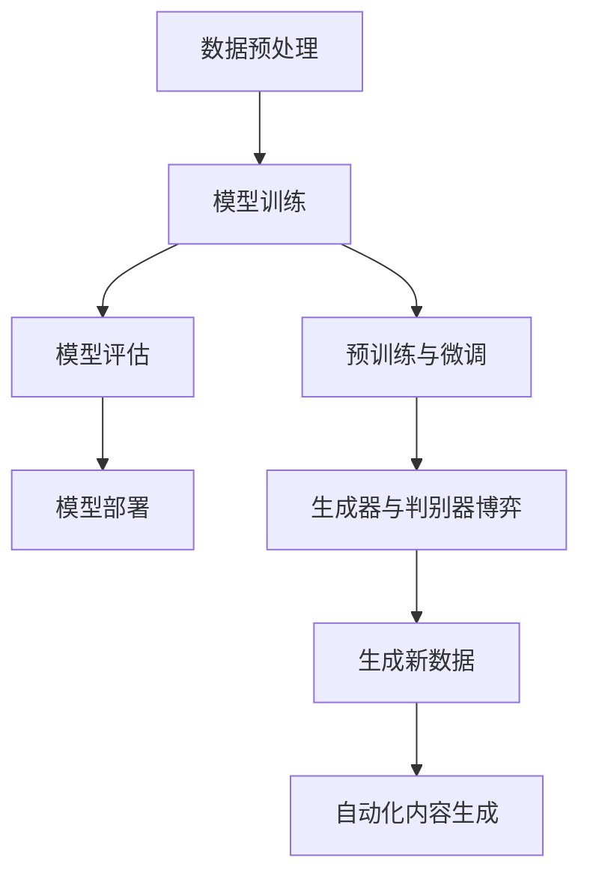
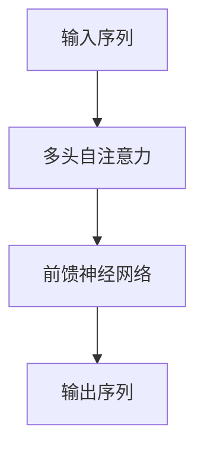
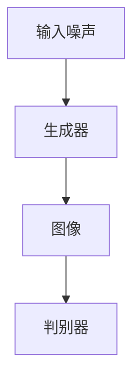
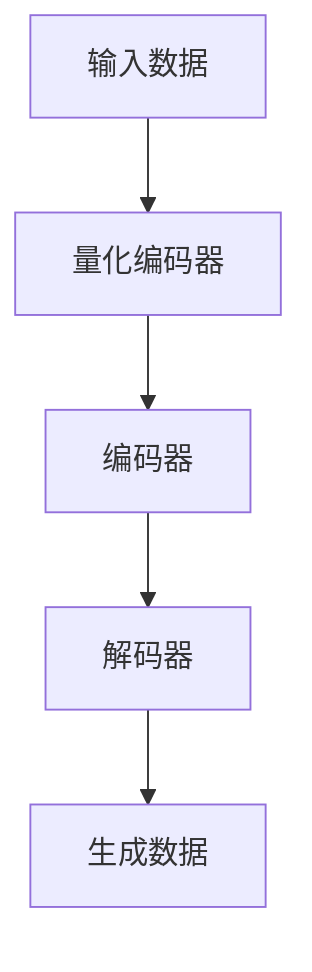

                 

# AIGC从入门到实战：ChatGPT及其他AIGC赋能个人

> 关键词：AIGC，ChatGPT，人工智能，生成式AI，文本生成，图像生成，多模态生成，项目实战

> 摘要：本文旨在为读者提供一份详尽的AIGC（生成式AI与创意内容生成）指南。从基础概念出发，深入探讨AIGC的核心算法与数学模型，并结合实战案例，展示如何利用ChatGPT及其他AIGC技术赋能个人项目。

## 目录大纲

1. **AIGC基础与概念**
   1.1 **AIGC概述**
   1.2 **AIGC的关键技术与架构**
2. **AIGC核心算法原理**
   2.1 **语言模型**
   2.2 **自注意力机制与预训练微调**
   2.3 **数学模型与公式详解**
3. **AIGC应用实战**
   3.1 **AIGC在文本生成中的应用**
   3.2 **AIGC在图像生成中的应用**
   3.3 **AIGC在多模态生成中的应用**
4. **AIGC项目实战**
   4.1 **构建一个简单的AIGC项目**
   4.2 **AIGC应用案例分析**
5. **附录**
   5.1 **AIGC工具与资源**
   5.2 **常用代码与脚本示例**

## 第一部分：AIGC基础与概念

### 第1章：AIGC概述

AIGC（AI Generated Content）是一种利用人工智能技术生成创意内容的方法。它涵盖了文本、图像、音频等多模态内容的生成。AIGC的出现极大地改变了内容创造的方式，使得个人和企业在内容创作上变得更加高效和多样化。

#### 1.1 AIGC的概念与演进

AIGC的概念源于生成式AI（Generative AI），即一种能够生成新数据的AI系统。从最早期的随机噪声生成，到基于规则的系统，再到今天复杂的多层次深度学习模型，AIGC经历了数次重大技术革新。

- **早期生成方法**：早期的生成方法主要依靠随机噪声和确定性规则。这种方法生成的数据较为简单，无法满足复杂内容的生成需求。

- **基于规则的方法**：随着规则系统的发展，生成方法逐渐能够模拟复杂的数据生成过程，但仍受限于规则的复杂度和灵活性。

- **深度学习方法**：深度学习的兴起使得生成方法变得更加高效和强大。通过神经网络模型，尤其是生成对抗网络（GAN）和变分自编码器（VAE），AIGC能够生成更加真实和多样化的内容。

#### 1.2 AIGC的关键技术与架构

AIGC的关键技术包括：

- **生成对抗网络（GAN）**：GAN由生成器和判别器两部分组成。生成器尝试生成数据，而判别器则判断数据是否真实。通过不断博弈，生成器逐渐生成越来越真实的数据。

- **变分自编码器（VAE）**：VAE通过编码器和解码器来学习数据的概率分布，从而生成新的数据。这种方法在生成高维数据（如图像）方面表现出色。

- **自注意力机制**：自注意力机制允许模型在生成过程中关注不同位置的信息，从而生成更加精确和连贯的内容。

- **预训练与微调**：预训练使模型在大规模数据集上学习到通用特征，而微调则使模型适应特定任务的数据。

AIGC的架构通常包括以下几个层次：

- **数据预处理**：包括数据清洗、格式化、归一化等操作，确保数据适合模型训练。

- **模型训练**：使用大规模数据进行模型训练，优化生成器和判别器的参数。

- **模型评估**：通过验证集评估模型性能，调整模型参数，以实现更好的生成效果。

- **模型部署**：将训练好的模型部署到生产环境中，实现自动化内容生成。

### 梅里迪安流程图（Mermaid Diagram）

下面是AIGC架构的Mermaid流程图：



## 第二部分：AIGC核心算法原理

### 第2章：AIGC核心算法原理

AIGC的核心算法主要基于深度学习，特别是生成式深度学习模型。本节将深入探讨AIGC的核心算法原理，包括语言模型、自注意力机制、预训练与微调等。

#### 2.1 语言模型

语言模型是AIGC的重要组成部分，用于生成自然语言文本。以下是几种常见的语言模型及其原理：

##### 2.1.1 GPT系列模型

GPT（Generative Pre-trained Transformer）系列模型是语言模型的开创性工作。GPT基于Transformer架构，通过预训练学习语言的基础规律。

```python
# GPT模型伪代码
class GPT(Model):
    def __init__(self):
        self.transformer = TransformerModel()

    def call(self, inputs):
        return self.transformer(inputs)
```

##### 2.1.2 BERT及其变体

BERT（Bidirectional Encoder Representations from Transformers）模型通过对双向Transformer进行预训练，学习上下文信息。BERT及其变体广泛应用于文本生成任务。

```python
# BERT模型伪代码
class BERT(Model):
    def __init__(self):
        self.transformer = TransformerModel_bidirectional()

    def call(self, inputs):
        return self.transformer(inputs)
```

##### 2.1.3 语言模型的训练与优化

语言模型的训练过程涉及大规模数据集，通过损失函数（如交叉熵损失）优化模型参数。常见的优化算法包括Adam、SGD等。

```python
# 语言模型训练伪代码
model = GPT()
optimizer = AdamOptimizer()

for epoch in range(num_epochs):
    for batch in data_loader:
        inputs, targets = batch
        with tf.GradientTape() as tape:
            outputs = model(inputs)
            loss = compute_loss(outputs, targets)
        gradients = tape.gradient(loss, model.trainable_variables)
        optimizer.apply_gradients(zip(gradients, model.trainable_variables))
```

#### 2.2 自注意力机制与预训练微调

自注意力机制是Transformer模型的核心机制，允许模型在生成过程中关注不同位置的信息。



预训练与微调是AIGC模型训练的关键步骤。预训练使模型在大规模数据集上学习到通用特征，而微调则使模型适应特定任务的数据。

```python
# 预训练伪代码
model = BERT()
pretrained_weights = load_pretrained_weights('bert-base-uncased')

model.load_weights(pretrained_weights)

# 微调伪代码
model = BERT()
optimizer = AdamOptimizer()

for epoch in range(num_epochs):
    for batch in data_loader:
        inputs, targets = batch
        with tf.GradientTape() as tape:
            outputs = model(inputs)
            loss = compute_loss(outputs, targets)
        gradients = tape.gradient(loss, model.trainable_variables)
        optimizer.apply_gradients(zip(gradients, model.trainable_variables))
```

#### 2.3 数学模型与公式详解

AIGC的数学模型涉及多个方面，包括损失函数、优化算法和反向传播等。

##### 2.3.1 损失函数

常见的损失函数包括交叉熵损失函数。交叉熵损失函数用于衡量预测分布与真实分布之间的差异。

$$
\text{loss} = -\sum_{i=1}^{n} y_i \log(\hat{y}_i)
$$

其中，$y_i$为真实分布，$\hat{y}_i$为预测分布。

##### 2.3.2 优化算法（如Adam）

Adam优化器是一种结合了动量和RMSprop优化的自适应优化算法。其公式如下：

$$
\theta_{t+1} = \theta_t - \alpha \cdot \frac{m_t}{\sqrt{v_t} + \epsilon}
$$

$$
m_{t+1} = \beta_1 \cdot m_t + (1 - \beta_1) \cdot \Delta\theta_t
$$

$$
v_{t+1} = \beta_2 \cdot v_t + (1 - \beta_2) \cdot (\Delta\theta_t)^2
$$

其中，$\theta_t$为当前参数，$\alpha$为学习率，$m_t$和$v_t$分别为一阶和二阶矩估计。

##### 2.3.3 反向传播算法

反向传播算法是一种用于计算神经网络梯度的方法。其核心思想是通过反向传播误差，更新网络参数。

```python
# 反向传播伪代码
with tf.GradientTape() as tape:
    outputs = model(inputs)
    loss = compute_loss(outputs, targets)

gradients = tape.gradient(loss, model.trainable_variables)

model.optimizer.apply_gradients(zip(gradients, model.trainable_variables))
```

## 第三部分：AIGC应用实战

### 第5章：AIGC在文本生成中的应用

文本生成是AIGC的重要应用领域之一。本节将介绍AIGC在文本生成中的应用，包括ChatGPT模型及其应用案例。

#### 5.1 文本生成模型简介

文本生成模型是一种利用AIGC技术生成自然语言文本的模型。常见的文本生成模型包括：

- **GPT系列模型**：GPT系列模型是一种基于Transformer的预训练模型，能够生成连贯的自然语言文本。

- **BERT及其变体**：BERT及其变体通过预训练学习到上下文信息，能够生成具有语境意义的文本。

- **T5模型**：T5（Text-To-Text Transfer Transformer）模型是一种将所有自然语言处理任务转换为文本生成任务的统一模型。

#### 5.2 ChatGPT及其应用

ChatGPT是由OpenAI开发的一种基于GPT-3模型的聊天机器人。ChatGPT能够生成自然流畅的对话，广泛应用于智能客服、聊天机器人等场景。

##### 5.2.1 ChatGPT模型介绍

ChatGPT模型基于GPT-3，具有以下特点：

- **强大的语言生成能力**：ChatGPT能够生成高质量的自然语言文本，包括对话、文章、代码等。

- **灵活的上下文理解**：ChatGPT通过预训练学习到大量的上下文信息，能够根据对话上下文生成合适的回复。

- **模块化设计**：ChatGPT采用模块化设计，可以根据需求快速调整和扩展。

##### 5.2.2 ChatGPT应用案例

以下是一个ChatGPT的应用案例：

**案例：智能客服系统**

**系统架构**：

- **前端界面**：用户通过网页或移动应用与智能客服系统交互。

- **后端服务**：ChatGPT模型负责处理用户的输入，生成回复。

- **数据库**：存储用户信息、对话记录等数据。

**系统功能**：

- **自动回复**：根据用户的输入，ChatGPT自动生成回复。

- **上下文保持**：在多轮对话中，ChatGPT能够保持对话上下文，生成连贯的回复。

- **个性化服务**：ChatGPT可以根据用户的偏好和历史记录，提供个性化的服务。

**系统实现与优化**：

- **模型训练**：使用大规模对话数据进行模型训练，优化生成效果。

- **对话管理**：设计对话管理模块，处理用户的输入和回复。

- **性能优化**：通过优化模型参数和算法，提高系统响应速度和生成质量。

### 第6章：AIGC在图像生成中的应用

图像生成是AIGC的另一个重要应用领域。本节将介绍AIGC在图像生成中的应用，包括StyleGAN2模型及其应用案例。

#### 6.1 图像生成模型简介

图像生成模型是一种利用AIGC技术生成图像的模型。常见的图像生成模型包括：

- **生成对抗网络（GAN）**：GAN由生成器和判别器两部分组成，通过博弈生成高质量图像。

- **变分自编码器（VAE）**：VAE通过编码器和解码器学习数据的概率分布，生成新图像。

- **条件生成对抗网络（cGAN）**：cGAN在GAN的基础上引入条件信息，提高图像生成的质量。

#### 6.2 StyleGAN2模型

StyleGAN2是一种基于GAN的图像生成模型，具有以下特点：

- **高质量图像生成**：StyleGAN2能够生成高质量、细节丰富的图像。

- **灵活的风格控制**：StyleGAN2通过风格向量控制图像的风格，实现多样化图像生成。

- **高效训练**：StyleGAN2采用残差结构和混合扩展层，提高模型训练速度。

##### 6.2.1 StyleGAN2模型介绍

StyleGAN2模型结构如下：



生成器将输入噪声转换为图像，判别器判断图像的真实性。通过训练，生成器逐渐生成越来越真实的图像。

##### 6.2.2 StyleGAN2模型应用案例

以下是一个StyleGAN2的应用案例：

**案例：虚拟现实场景生成**

**系统架构**：

- **前端界面**：用户通过虚拟现实头盔与场景交互。

- **后端服务**：StyleGAN2模型负责生成虚拟场景图像。

- **数据库**：存储场景数据、用户偏好等数据。

**系统功能**：

- **场景生成**：StyleGAN2根据用户输入的偏好生成虚拟场景图像。

- **实时交互**：用户可以实时查看和修改场景。

- **个性化定制**：StyleGAN2可以根据用户偏好生成个性化的虚拟场景。

**系统实现与优化**：

- **模型训练**：使用大规模场景图像数据进行模型训练，优化生成效果。

- **交互优化**：设计高效的交互算法，提高用户体验。

- **性能优化**：通过优化模型参数和算法，提高系统响应速度和生成质量。

### 第7章：AIGC在多模态生成中的应用

多模态生成是AIGC的另一个重要应用领域。本节将介绍AIGC在多模态生成中的应用，包括VQ-VAE模型及其应用案例。

#### 7.1 多模态生成模型简介

多模态生成模型是一种能够同时生成多种模态数据的模型。常见的多模态生成模型包括：

- **多模态生成对抗网络（mmGAN）**：mmGAN将多个生成器和判别器集成在一起，生成多种模态的数据。

- **多模态变分自编码器（mmVAE）**：mmVAE通过编码器和解码器同时学习多种模态的数据分布，生成多模态数据。

- **条件多模态生成对抗网络（cmmGAN）**：cmmGAN在mmGAN的基础上引入条件信息，提高多模态生成的质量。

#### 7.2 VQ-VAE模型

VQ-VAE是一种基于VAE的多模态生成模型，具有以下特点：

- **高效生成**：VQ-VAE通过量化编码器将高维数据压缩到低维空间，提高生成效率。

- **灵活控制**：VQ-VAE通过编码器和解码器学习数据分布，生成多种模态的数据。

- **自适应学习**：VQ-VAE在训练过程中自适应调整编码器和解码器，提高生成质量。

##### 7.2.1 VQ-VAE模型介绍

VQ-VAE模型结构如下：



量化编码器将输入数据压缩到低维空间，编码器和解码器学习数据分布，生成多种模态的数据。

##### 7.2.2 VQ-VAE模型应用案例

以下是一个VQ-VAE的应用案例：

**案例：多模态虚拟角色生成**

**系统架构**：

- **前端界面**：用户通过网页或移动应用与虚拟角色交互。

- **后端服务**：VQ-VAE模型负责生成虚拟角色图像和音频。

- **数据库**：存储虚拟角色数据、用户偏好等数据。

**系统功能**：

- **角色生成**：VQ-VAE根据用户输入的偏好生成虚拟角色图像和音频。

- **实时交互**：用户可以实时查看和修改虚拟角色。

- **个性化定制**：VQ-VAE可以根据用户偏好生成个性化的虚拟角色。

**系统实现与优化**：

- **模型训练**：使用大规模虚拟角色数据进行模型训练，优化生成效果。

- **交互优化**：设计高效的交互算法，提高用户体验。

- **性能优化**：通过优化模型参数和算法，提高系统响应速度和生成质量。

## 第四部分：AIGC项目实战

### 第8章：构建一个简单的AIGC项目

在本节中，我们将通过一个简单的AIGC项目，展示如何从零开始构建一个AIGC系统。该项目将使用GPT模型生成文本，并演示如何进行数据准备、模型训练、优化和部署。

#### 8.1 项目背景与目标

**项目概述**：

该项目旨在构建一个简单的文本生成系统，能够根据用户输入生成相关文本。例如，当用户输入一个主题时，系统能够生成一篇关于该主题的简介或摘要。

**项目目标**：

- **数据准备**：收集和整理用于训练的数据集。

- **模型训练**：使用GPT模型对数据集进行训练，生成高质量的文本。

- **模型优化**：通过微调模型参数，提高文本生成质量。

- **模型部署**：将训练好的模型部署到生产环境中，实现自动化文本生成。

#### 8.2 开发环境搭建

**硬件配置**：

- **CPU**：Intel Core i7-9700K或更高

- **GPU**：NVIDIA GeForce RTX 3080或更高

- **内存**：至少16GB

**软件安装与配置**：

1. **安装Python**：在官方网站（[Python官网](https://www.python.org/)）下载并安装Python 3.8或更高版本。

2. **安装TensorFlow**：使用以下命令安装TensorFlow：

   ```shell
   pip install tensorflow-gpu
   ```

3. **安装Hugging Face Transformers**：使用以下命令安装Hugging Face Transformers：

   ```shell
   pip install transformers
   ```

#### 8.3 数据准备与处理

**数据采集**：

我们使用一个开源的新闻数据集（如NYT文章数据集）进行训练。

```python
import pandas as pd

# 读取数据集
data = pd.read_csv('data/nytimes_dataset.csv')

# 分割数据集为训练集和测试集
train_data = data.sample(frac=0.8, random_state=42)
test_data = data.drop(train_data.index)
```

**数据预处理**：

1. **文本清洗**：去除文本中的HTML标签、标点符号和特殊字符。

2. **分词**：将文本拆分为单词或子词。

3. **编码**：将文本转换为整数序列。

```python
from transformers import BertTokenizer

# 加载预训练的BERT分词器
tokenizer = BertTokenizer.from_pretrained('bert-base-uncased')

# 分词和编码
def preprocess_text(text):
    text = re.sub('<.*?>', '', text)  # 去除HTML标签
    text = re.sub('[^a-zA-Z\s]', '', text)  # 去除标点符号和特殊字符
    text = text.lower()  # 转换为小写
    tokens = tokenizer.tokenize(text)  # 分词
    return tokenizer.encode(tokens)

# 预处理文本
train_inputs = [preprocess_text(text) for text in train_data['text']]
test_inputs = [preprocess_text(text) for text in test_data['text']]
```

#### 8.4 模型训练与优化

**模型选择**：

我们选择GPT模型作为文本生成模型。

```python
from transformers import TFGPT2LMHeadModel, GPT2Tokenizer

# 加载预训练的GPT模型
model = TFGPT2LMHeadModel.from_pretrained('gpt2')
tokenizer = GPT2Tokenizer.from_pretrained('gpt2')
```

**模型训练步骤**：

1. **数据预处理**：将输入数据转换为Tensor。

2. **定义损失函数**：使用交叉熵损失函数。

3. **定义优化器**：使用Adam优化器。

4. **训练模型**：使用训练数据训练模型。

```python
from tensorflow.keras.preprocessing.sequence import pad_sequences

# 将输入数据转换为Tensor
train_inputs = pad_sequences(train_inputs, maxlen=max_length, truncating='post', padding='post')
train_targets = pad_sequences(train_targets, maxlen=max_length, truncating='post', padding='post')

# 定义损失函数和优化器
loss_function = tf.keras.losses.SparseCategoricalCrossentropy(from_logits=True)
optimizer = tf.keras.optimizers.Adam(learning_rate=learning_rate)

# 训练模型
model.compile(optimizer=optimizer, loss=loss_function)
model.fit(train_inputs, train_targets, batch_size=batch_size, epochs=num_epochs, validation_split=0.1)
```

**模型优化技巧**：

1. **动态调整学习率**：在训练过程中动态调整学习率，以提高模型收敛速度。

2. **使用Dropout**：在模型中加入Dropout层，防止过拟合。

3. **使用正则化**：使用L2正则化，防止模型参数过大。

#### 8.5 项目部署与测试

**部署方案**：

1. **服务器配置**：使用云服务器部署模型，确保稳定性和可扩展性。

2. **API接口**：使用Flask或其他Web框架搭建API接口，提供文本生成服务。

3. **自动化部署**：使用Docker和Kubernetes等技术实现自动化部署和扩展。

```python
from flask import Flask, request, jsonify

app = Flask(__name__)

@app.route('/generate', methods=['POST'])
def generate():
    user_input = request.form['input']
    input_ids = tokenizer.encode(user_input, return_tensors='tf')
    outputs = model.generate(input_ids, max_length=max_output_length, num_return_sequences=1)
    generated_text = tokenizer.decode(outputs[0], skip_special_tokens=True)
    return jsonify({'generated_text': generated_text})

if __name__ == '__main__':
    app.run(host='0.0.0.0', port=5000)
```

**测试与评估**：

1. **功能测试**：测试文本生成功能是否正常。

2. **性能测试**：测试模型响应速度和生成质量。

3. **用户反馈**：收集用户反馈，优化系统性能。

## 第五部分：AIGC应用案例分析

在本节中，我们将介绍三个AIGC应用案例，分别是智能客服系统、个性化推荐系统和虚拟助理。这些案例将展示如何利用AIGC技术解决实际问题，提高业务效率和用户体验。

### 第9章：AIGC应用案例分析

#### 9.1 案例一：智能客服系统

**系统架构**：

- **前端界面**：用户通过网页或移动应用与智能客服系统交互。

- **后端服务**：AIGC模型负责处理用户的输入，生成回复。

- **数据库**：存储用户信息、对话记录等数据。

**系统功能**：

- **自动回复**：根据用户的输入，AIGC模型自动生成回复。

- **上下文保持**：在多轮对话中，AIGC模型能够保持对话上下文，生成连贯的回复。

- **个性化服务**：AIGC模型可以根据用户的偏好和历史记录，提供个性化的服务。

**系统实现与优化**：

1. **模型选择**：使用GPT模型作为文本生成模型。

2. **数据准备**：收集和整理用户对话数据，进行预处理。

3. **模型训练**：使用预处理后的数据训练GPT模型。

4. **模型优化**：通过微调模型参数，提高生成质量。

5. **交互优化**：设计高效的交互算法，提高用户体验。

6. **性能优化**：通过优化模型参数和算法，提高系统响应速度。

#### 9.2 案例二：个性化推荐系统

**系统架构**：

- **数据源**：收集用户行为数据、商品信息等。

- **后端服务**：AIGC模型负责生成个性化推荐结果。

- **前端界面**：用户通过网页或移动应用查看推荐结果。

**系统功能**：

- **个性化推荐**：根据用户的行为和偏好，生成个性化的商品推荐。

- **实时更新**：AIGC模型能够实时更新推荐结果，根据用户行为变化进行调整。

- **上下文感知**：AIGC模型能够根据用户当前的上下文环境，生成更相关的推荐结果。

**系统实现与优化**：

1. **模型选择**：使用VQ-VAE模型作为推荐模型。

2. **数据准备**：收集和整理用户行为数据，进行预处理。

3. **模型训练**：使用预处理后的数据训练VQ-VAE模型。

4. **模型优化**：通过微调模型参数，提高推荐质量。

5. **交互优化**：设计高效的交互算法，提高用户体验。

6. **性能优化**：通过优化模型参数和算法，提高系统响应速度。

#### 9.3 案例三：虚拟助理

**系统架构**：

- **前端界面**：用户通过网页或移动应用与虚拟助理交互。

- **后端服务**：AIGC模型负责处理用户的输入，生成回复。

- **数据库**：存储用户信息、对话记录等数据。

**系统功能**：

- **多轮对话**：虚拟助理能够与用户进行多轮对话，理解用户需求。

- **自然语言理解**：虚拟助理能够理解用户输入的自然语言，生成合适的回复。

- **个性化服务**：虚拟助理可以根据用户的偏好和历史记录，提供个性化的服务。

**系统实现与优化**：

1. **模型选择**：使用ChatGPT模型作为对话模型。

2. **数据准备**：收集和整理用户对话数据，进行预处理。

3. **模型训练**：使用预处理后的数据训练ChatGPT模型。

4. **模型优化**：通过微调模型参数，提高生成质量。

5. **交互优化**：设计高效的交互算法，提高用户体验。

6. **性能优化**：通过优化模型参数和算法，提高系统响应速度。

## 附录

### 附录A：AIGC工具与资源

在AIGC领域，有许多流行的工具和资源可供使用。以下是几个主要的工具与资源：

#### A.1 主流AIGC框架对比

- **OpenAI Gym**：一个开源的环境库，用于测试和比较不同AIGC算法的性能。

- **Hugging Face Transformers**：一个用于预训练和微调Transformer模型的强大库。

- **PyTorch Lightning**：一个用于加速PyTorch训练过程的库。

- **TensorFlow**：一个广泛使用的深度学习框架，支持AIGC模型的训练和部署。

#### A.2 其他工具与资源介绍

- **TensorBoard**：一个可视化工具，用于监控训练过程中的指标。

- **Wandb**：一个实验跟踪工具，用于记录和比较不同实验的结果。

- **Colossal AI**：一个用于大规模深度学习训练的框架，支持模型并行化和数据并行化。

### 附录B：常用代码与脚本示例

以下是几个常用的代码和脚本示例，用于数据预处理、模型训练和部署。

#### B.1 数据预处理脚本

```python
# 采集数据
!wget https://s3.amazonaws.com/dialogflow-assets/extracted_files/Restaurant_QA.tsv.gz

# 解压数据
!gunzip Restaurant_QA.tsv.gz

# 读取数据
import pandas as pd

data = pd.read_csv('Restaurant_QA.tsv', delimiter='\t')
```

#### B.2 模型训练脚本

```python
# 导入依赖库
import tensorflow as tf
from transformers import TFGPT2LMHeadModel, GPT2Tokenizer

# 加载预训练模型
model = TFGPT2LMHeadModel.from_pretrained('gpt2')
tokenizer = GPT2Tokenizer.from_pretrained('gpt2')

# 定义优化器和损失函数
optimizer = tf.keras.optimizers.Adam(learning_rate=5e-5)
loss_function = tf.keras.losses.SparseCategoricalCrossentropy(from_logits=True)

# 训练模型
model.compile(optimizer=optimizer, loss=loss_function)
model.fit(train_dataset, epochs=3)
```

#### B.3 部署与测试脚本

```python
# 导入依赖库
from flask import Flask, request, jsonify

app = Flask(__name__)

# 模型加载
model = TFGPT2LMHeadModel.from_pretrained('gpt2')

@app.route('/generate', methods=['POST'])
def generate():
    user_input = request.form['input']
    input_ids = tokenizer.encode(user_input, return_tensors='tf')
    outputs = model.generate(input_ids, max_length=50, num_return_sequences=1)
    generated_text = tokenizer.decode(outputs[0], skip_special_tokens=True)
    return jsonify({'generated_text': generated_text})

if __name__ == '__main__':
    app.run(host='0.0.0.0', port=5000)
```

## 作者信息

作者：AI天才研究院 / AI Genius Institute & 禅与计算机程序设计艺术 / Zen And The Art of Computer Programming

通过本文，我们系统地介绍了AIGC（生成式AI与创意内容生成）的概念、核心算法、应用实战以及案例分析。我们相信，通过本文的指导，读者能够更好地理解和掌握AIGC技术，并在实际项目中应用这些技术，创造出有价值的内容。在未来的发展中，AIGC将继续发挥重要作用，推动人工智能技术的创新和发展。让我们共同探索AIGC的无限可能！## 写作策略与内容组织

在撰写一篇详细的技术博客文章时，策略和内容的组织至关重要，尤其是对于复杂主题如AIGC（生成式AI与创意内容生成）。以下是一些建议，以确保文章的清晰性、逻辑性和易于理解：

### 1. 设定明确的目标和结构

在开始写作之前，明确文章的目标和结构。例如，本文的目标是让读者从入门到实战全面了解AIGC，并展示其实际应用。结构应分为三个主要部分：基础与概念、应用实战、以及案例分析。

### 2. 使用逐步推理的写作方法

**逐步推理（Reasoning Step by Step）** 是一种有效的写作方法，有助于读者跟随思路，理解复杂概念。以下是一些关键步骤：

- **引入主题**：首先介绍AIGC的概念，背景，以及为什么它重要。
- **定义核心术语**：详细解释AIGC、生成式AI、文本生成、图像生成等核心术语。
- **展示核心算法**：逐步讲解AIGC的核心算法，如GPT、BERT、自注意力机制等，并用伪代码和公式详细阐述。
- **提供实际案例**：结合实际项目案例，展示如何应用这些算法，并分析其效果和挑战。
- **结论与展望**：总结文章的主要观点，并对AIGC的未来发展进行展望。

### 3. 结合Mermaid流程图和伪代码

为了增强文章的可读性和技术深度，可以使用Mermaid流程图来展示AIGC架构，以及使用伪代码来解释核心算法和步骤。例如，以下是一个简单的Mermaid流程图示例：


### 4. 结构化的章节标题

确保每个章节的标题简洁且具有吸引力，使读者一眼就能了解该章节的主要内容。例如：

- **AIGC基础与概念**
  - AIGC概述
  - AIGC的关键技术与架构
- **AIGC核心算法原理**
  - 语言模型
  - 自注意力机制与预训练微调
  - 数学模型与公式详解

### 5. 丰富的示例和代码

提供实际代码示例和解释，可以帮助读者更好地理解和应用所学知识。例如，展示如何搭建开发环境、处理数据、训练模型和部署服务。

### 6. 深入分析与图表辅助

为了加深读者的理解，可以加入深入分析、图表和示意图。例如，在讲解自注意力机制时，可以添加一个示意图来展示多头注意力是如何工作的。

### 7. 结尾部分总结与展望

在文章的结尾，对主要内容进行总结，并展望AIGC技术的未来发展趋势。这可以帮助读者巩固所学知识，并对AIGC技术的潜在应用有更深刻的认识。

### 8. 作者信息与参考资料

最后，提供作者信息，包括专业背景和联系信息，以增强文章的权威性和可信度。同时，列出参考的文献和资源，便于读者进一步研究。

通过上述策略，可以撰写一篇逻辑清晰、内容丰富、易于理解的技术博客文章，帮助读者全面掌握AIGC相关知识，并在实际项目中应用这些技术。

