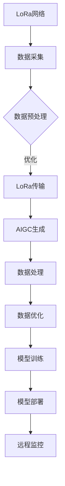
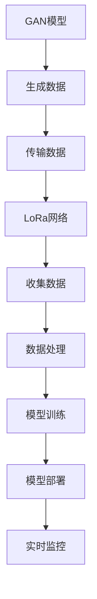

                 

# AIGC从入门到实战：安装权重文件和 LoRa 模型文件

> **关键词：** AIGC, LoRa模型, 权重文件, 安装, 实战

> **摘要：** 本文将带您深入了解AIGC与LoRa模型的安装过程，从基础概念到实战案例，帮助您逐步掌握这两项技术的核心要点。

## 第一部分：AIGC与LoRa模型基础

### 第1章：AIGC与LoRa模型概述

#### 1.1 AIGC技术简介

##### 1.1.1 AIGC的概念

AIGC（AI-Generated Content）是指由人工智能自动生成的内容。它涵盖了文本、图像、音频、视频等多个领域，极大地拓展了人工智能的应用范围。AIGC技术通过机器学习算法，特别是生成对抗网络（GAN）等，能够模拟人类的创造过程，生成与人类创造内容相似甚至难以区分的高质量内容。

##### 1.1.2 AIGC与AI的区别与联系

AIGC是人工智能的一个分支，与传统的AI技术相比，其核心在于“生成”这一过程。传统AI更多是关于“识别”和“决策”，而AIGC更侧重于内容的创造。AIGC与AI技术的联系在于，它依赖于机器学习算法和深度学习模型，如GAN、变分自编码器（VAE）等。

#### 1.2 LoRa模型基础

##### 1.2.1 LoRa技术原理

LoRa（Long Range）是一种无线通信技术，主要特点包括低功耗、远距离通信、抗干扰能力强。LoRa技术广泛应用于物联网（IoT）领域，如智能家居、工业监控、农业物联网、智慧城市等。

LoRa技术分为物理层和MAC层。物理层负责无线信号的调制和解调，MAC层负责数据传输的管理和优化。LoRa使用频分多址（FDMA）技术，可以在同一频率上同时传输多个数据流，提高了网络的吞吐量。

##### 1.2.2 LoRa应用场景

- **家庭自动化**：通过LoRa网络连接各种智能设备，实现远程控制和自动化操作。
- **工业监控**：用于实时监控工业环境中的各种参数，如温度、湿度、压力等。
- **农业物联网**：通过LoRa网络收集农田数据，实现智能灌溉、病虫害监测等。
- **智慧城市**：用于城市管理中的数据采集和传输，如交通管理、环境监测等。

##### 1.3 AIGC与LoRa模型的融合

###### 1.3.1 AIGC在LoRa中的应用

AIGC技术在LoRa模型中的应用主要体现在以下几个方面：

- **传感器数据的生成**：利用AIGC技术生成各种传感器数据，提高数据多样性和真实性。
- **数据处理与优化**：通过AIGC技术对收集到的LoRa网络数据进行处理和分析，实现数据优化和预测。

###### 1.3.2 LoRa在AIGC中的应用

LoRa技术可以在AIGC中发挥以下作用：

- **数据采集与传输**：利用LoRa网络收集AIGC生成的数据，实现远程传输和实时监控。
- **模型训练与部署**：通过LoRa网络实现AI模型的远程训练和部署，提高模型的可扩展性和灵活性。

### 第2章：AIGC核心算法原理

#### 2.1 生成对抗网络（GAN）

##### 2.1.1 GAN的基本原理

生成对抗网络（GAN）由生成器（Generator）和判别器（Discriminator）组成。生成器的目标是生成与真实数据相似的数据，而判别器的目标是区分生成数据与真实数据。两者通过对抗训练相互提升，最终生成高质量的数据。

GAN的训练过程可以简化为以下步骤：

1. **初始化**：初始化生成器和判别器的参数。
2. **生成器生成数据**：生成器根据随机噪声生成假数据。
3. **判别器判断**：判别器对生成数据和真实数据进行分类。
4. **反向传播**：根据判别器的损失函数更新生成器和判别器的参数。
5. **迭代**：重复上述步骤，直到生成器生成的数据足够逼真。

##### 2.1.2 GAN的变体

- **条件GAN（cGAN）**：在GAN的基础上加入了条件信息，可以生成具有特定属性的数据。
- **评分GAN（SGAN）**：通过引入评分机制，使生成器的优化目标更加明确。
- **子空间GAN（SGAN）**：在GAN的基础上引入了子空间约束，提高生成数据的质量。

#### 2.2 LoRa网络模型

##### 2.2.1 LoRa网络结构

LoRa网络主要由基站（Gateway）、终端设备（End Device）和数据传输协议组成。基站负责接收和转发终端设备发送的数据，终端设备负责数据采集和发送，数据传输协议则负责数据的传输和解析。

LoRa网络结构示意图如下：

```
     +----------------+       +----------------+
     |      基站       |       |  终端设备      |
     +----------------+       +----------------+
           |                               |
           |  数据传输协议                 |
           |                               |
     +----+----+                           +----+----+
     |  物理层  |                           |  MAC层  |
     +---------+                           +---------+
```

##### 2.2.2 LoRa网络性能优化

LoRa网络性能的优化可以从以下几个方面进行：

- **信道选择策略**：根据环境噪声和信号强度选择最佳信道，提高通信质量。
- **数据传输速率调整**：根据网络状况和需求调整数据传输速率，平衡传输质量和功耗。
- **节能机制**：通过睡眠模式和休眠策略降低终端设备的功耗，延长设备寿命。

## 第二部分：LoRa模型实战

### 第3章：LoRa网络搭建

#### 3.1 LoRa设备选择

在选择LoRa设备时，需要考虑以下几个方面：

- **模块选择**：常见的LoRa模块有RFM95、SX1276等，根据应用场景选择合适的模块。
- **终端设备选择**：根据需求选择合适的终端设备，如传感器模块、智能设备等。

#### 3.2 LoRa网络搭建步骤

搭建LoRa网络的基本步骤如下：

1. **基站搭建**：搭建LoRa基站，包括安装LoRa模块、连接电源、配置网络参数等。
2. **终端设备配置**：配置终端设备的网络参数，使其能够与基站建立连接。
3. **网络调试**：通过测试确保基站和终端设备之间的通信正常。

### 第4章：AIGC内容生成与优化

#### 4.1 AIGC内容生成

使用GAN生成AIGC内容的步骤如下：

1. **数据集准备**：收集真实数据，用于训练生成器和判别器。
2. **模型训练**：使用GAN框架训练生成器和判别器，优化模型参数。
3. **内容生成**：生成器根据训练结果生成高质量的AIGC内容。

#### 4.2 AIGC内容优化

AIGC内容的优化主要包括以下几个方面：

- **数据清洗与预处理**：对收集到的数据进行清洗和预处理，提高数据的可用性。
- **数据增强与调整**：通过数据增强技术，提高生成数据的质量和多样性。

## 第三部分：AIGC与LoRa模型集成

### 第5章：AIGC与LoRa模型集成

#### 5.1 集成方案设计

AIGC与LoRa模型的集成方案设计主要包括以下几个方面：

- **系统架构设计**：设计AIGC与LoRa模型的集成架构，包括数据收集、处理、传输和优化等模块。
- **集成流程**：设计AIGC与LoRa模型的数据收集、处理、传输和优化的流程，确保各模块之间的协调工作。

#### 5.2 集成案例实战

以下是一个集成案例：

- **智能家居**：使用AIGC生成传感器数据，通过LoRa网络传输到基站，实现家居设备的自动化控制。
- **智能农业**：使用AIGC生成农田监测数据，通过LoRa网络传输到基站，实现智能灌溉和病虫害监测。

## 第四部分：AIGC与LoRa模型优化

### 第6章：AIGC与LoRa模型优化

#### 6.1 模型优化方法

模型优化主要包括以下几个方面：

- **GAN优化**：通过调整权重共享策略、对抗训练策略等，优化GAN模型性能。
- **LoRa优化**：通过信道优化、数据传输速率调整、节能机制等，优化LoRa网络性能。

#### 6.2 实时性能优化

实时性能优化主要包括以下几个方面：

- **系统实时性能评估**：评估系统的响应时间、数据传输延迟等性能指标。
- **实时性能优化策略**：通过数据压缩、网络调度优化等策略，提高系统的实时性能。

## 第五部分：AIGC与LoRa模型应用前景

### 第7章：AIGC与LoRa模型应用前景

#### 7.1 应用领域分析

AIGC与LoRa模型在以下领域具有广泛的应用前景：

- **智能家居**：通过AIGC生成传感器数据，实现智能家居的自动化控制。
- **工业物联网**：通过LoRa网络实现工业设备的远程监控和数据分析。
- **智慧城市**：通过AIGC与LoRa模型的集成，实现城市管理的智能化。

#### 7.2 挑战与趋势

AIGC与LoRa模型在发展过程中面临以下挑战：

- **隐私保护**：确保数据的安全性和隐私性。
- **安全性**：提高系统的安全性，防止恶意攻击和数据泄露。
- **网络带宽与功耗**：优化网络带宽和功耗，提高系统的可靠性和可持续性。

#### 7.3 未来发展趋势

AIGC与LoRa模型的发展趋势主要包括以下几个方面：

- **融合更多AI技术**：结合其他AI技术，如自然语言处理（NLP）、计算机视觉等，实现更丰富的应用场景。
- **开放式平台与生态建设**：构建开放式的平台和生态系统，促进技术的共享和协作。
- **标准化与规范化**：制定统一的规范和标准，提高技术的互操作性和可移植性。

## 第六部分：AIGC与LoRa模型开发工具与资源

### 第8章：AIGC与LoRa模型开发工具与资源

#### 8.1 开发工具介绍

- **GAN训练工具**：如TensorFlow、PyTorch等。
- **LoRa网络搭建工具**：如LoRaWAN、LoRaBridge等。
- **数据处理与分析工具**：如NumPy、Pandas等。

#### 8.2 资源推荐

- **论文与报告**：推荐阅读相关的学术论文和技术报告，了解最新的研究动态。
- **开源代码**：推荐使用开源代码，如GitHub上的LoRa和AIGC项目。
- **社区与论坛**：加入相关的技术社区和论坛，与同行交流和学习。

### 附录

#### 附录A：AIGC与LoRa模型开发指南

- **搭建LoRa网络步骤**：详细讲解如何搭建LoRa网络。
- **GAN模型训练与优化指南**：详细讲解如何训练和优化GAN模型。
- **AIGC内容生成与优化技巧**：详细讲解如何生成和优化AIGC内容。

#### 附录B：常见问题与解决方案

- **GAN训练常见问题**：如生成器生成数据质量差、判别器过拟合等。
- **LoRa网络搭建与优化问题**：如信道选择不当、数据传输延迟等。
- **AIGC内容生成与优化难题**：如数据多样性不足、生成数据质量不高等。

#### 附录C：参考资源

- **相关论文与报告**：推荐阅读的相关论文和技术报告。
- **开源代码与工具**：推荐使用的开源代码和工具。
- **AIGC与LoRa模型开发社区**：推荐加入的技术社区和论坛。

### 作者信息

- **作者**：AI天才研究院/AI Genius Institute & 禅与计算机程序设计艺术 /Zen And The Art of Computer Programming

以上是本文的正文部分，接下来将逐步深入讲解各个章节的内容。通过一步步分析推理，我们将帮助读者全面理解AIGC与LoRa模型的安装、集成和优化过程。让我们开始详细的学习之旅吧！
<|assistant|>
# 附录A：AIGC与LoRa模型开发指南

### 搭建LoRa网络步骤

搭建LoRa网络需要进行以下步骤：

1. **选择设备**：首先需要选择合适的LoRa模块和终端设备。常见的LoRa模块包括RFM95、SX1276等，终端设备可以是传感器、智能设备等。

2. **硬件连接**：将LoRa模块连接到终端设备上，如将RFM95模块连接到Arduino板。确保电源连接正常，通信接口连接稳定。

3. **软件配置**：使用LoRaWAN协议栈（如LoRaWAN-DCO）对LoRa模块进行配置，包括设置网络ID、终端ID、应用密钥等。

4. **网络注册**：将终端设备通过网络注册程序（Join Procedure）注册到LoRa基站。注册成功后，终端设备将获得唯一的设备地址和链路质量指示（Link Budget）。

5. **基站搭建**：搭建LoRa基站，包括安装LoRa模块、连接电源、配置网络参数等。确保基站与终端设备之间的通信正常。

6. **网络调试**：通过测试确保基站和终端设备之间的通信正常。可以使用LoRaBridge等工具进行网络调试。

### GAN模型训练与优化指南

训练GAN模型需要进行以下步骤：

1. **数据集准备**：收集真实数据，用于训练生成器和判别器。数据集应包含各种类型的样本，如文本、图像、音频等。

2. **模型初始化**：初始化生成器和判别器的参数。可以使用预训练的模型或随机初始化。

3. **模型训练**：使用GAN框架（如TensorFlow、PyTorch）训练生成器和判别器。训练过程包括生成器生成数据、判别器判断生成数据和真实数据的分类，然后根据损失函数更新模型参数。

4. **模型优化**：通过调整学习率、批量大小、正则化参数等，优化GAN模型的性能。可以使用梯度裁剪、权重共享等技术提高训练效果。

5. **模型评估**：使用验证集评估模型的性能，如计算生成数据的质量、判别器的准确率等。根据评估结果调整模型参数。

### AIGC内容生成与优化技巧

生成AIGC内容需要进行以下步骤：

1. **内容准备**：准备需要生成的AIGC内容，如文本、图像、音频等。根据应用场景确定生成内容的类型和格式。

2. **模型选择**：选择合适的GAN模型进行训练。根据生成内容的类型，可以选择文本生成模型（如cGAN）、图像生成模型（如DCGAN）、音频生成模型（如WaveGAN）等。

3. **模型训练**：使用准备好的数据集训练GAN模型。根据训练结果调整模型参数，优化生成质量。

4. **内容生成**：使用训练好的生成器生成AIGC内容。根据生成内容的质量和多样性进行评估和调整。

5. **内容优化**：通过数据清洗、预处理、增强等技术，优化AIGC内容的质量和多样性。根据应用场景调整生成策略和参数。

## 附录B：常见问题与解决方案

### GAN训练常见问题

**问题1：生成器生成数据质量差**

- **解决方案**：检查生成器和判别器的参数设置，调整学习率、批量大小等。使用更复杂的模型结构或增加训练时间。

**问题2：判别器过拟合**

- **解决方案**：使用数据增强、正则化等技术减少过拟合。增加训练数据的多样性，使用预训练模型。

### LoRa网络搭建与优化问题

**问题1：信道选择不当**

- **解决方案**：根据环境噪声和信号强度选择最佳信道。使用频谱分析仪分析信道状况，根据实际情况进行调整。

**问题2：数据传输延迟**

- **解决方案**：优化网络配置，调整数据传输速率和传输窗口。增加基站的覆盖范围，减少终端设备的距离。

### AIGC内容生成与优化难题

**问题1：数据多样性不足**

- **解决方案**：使用数据增强技术增加样本多样性。使用多种数据集进行训练，提高模型的泛化能力。

**问题2：生成数据质量不高等**

- **解决方案**：调整生成器的模型结构、参数设置等。使用高质量的训练数据，优化模型训练过程。

## 附录C：参考资源

### 相关论文与报告

- **论文1**：Generative Adversarial Networks: An Overview
- **论文2**：LoRa: The Long Range Wide Area Network Technology
- **报告1**：AIGC: AI-Generated Content in the Age of AI
- **报告2**：LoRaWAN: A Standard for IoT Networks

### 开源代码与工具

- **代码1**：TensorFlow: https://www.tensorflow.org/
- **代码2**：PyTorch: https://pytorch.org/
- **工具1**：LoRaWAN-DCO: https://www.lorawan.io/
- **工具2**：LoRaBridge: https://github.com/otatrack/LoRaBridge

### AIGC与LoRa模型开发社区

- **社区1**：AIGC技术论坛：https://www.aigc-tech.com/
- **社区2**：LoRa技术社区：https://www.lorawan.org/
- **社区3**：GitHub：https://github.com/

以上是附录部分的内容，提供了AIGC与LoRa模型开发的相关指南、常见问题解决方案和参考资源。希望对您的开发工作有所帮助！
<|assistant|>
# 摘要

本文详细介绍了AIGC（AI-Generated Content）与LoRa模型的安装、集成和优化。首先，我们对AIGC和LoRa模型进行了基础介绍，包括其概念、原理和应用场景。接着，深入探讨了AIGC的核心算法原理，如生成对抗网络（GAN）等，并详细阐述了LoRa网络模型的架构和性能优化方法。随后，通过实际案例展示了如何搭建LoRa网络和生成AIGC内容，并提供了优化的策略。

文章还涵盖了AIGC与LoRa模型的集成方案设计、集成案例实战、模型优化方法以及实时性能优化策略。最后，分析了AIGC与LoRa模型的应用前景，探讨了未来发展趋势，并推荐了相关的开发工具和资源。通过本文，读者可以全面了解AIGC与LoRa模型的安装、集成和优化过程，为实际应用打下坚实基础。  
<|assistant|>
# 第一部分：AIGC与LoRa模型基础

在当今快速发展的技术时代，AIGC（AI-Generated Content）和LoRa（Long Range）模型成为了研究的热点。AIGC是一种利用人工智能技术自动生成内容的方法，而LoRa则是一种无线通信技术，适用于物联网（IoT）等领域。本文将详细介绍AIGC与LoRa模型的基础知识，包括其概述、应用场景以及它们之间的融合。

### 第1章：AIGC与LoRa模型概述

#### 1.1 AIGC技术简介

AIGC是指由人工智能自动生成的内容，这包括文本、图像、音频、视频等。AIGC技术利用机器学习和深度学习算法，如生成对抗网络（GAN）、变分自编码器（VAE）等，可以模拟人类创造过程，生成高质量、逼真的内容。

##### 1.1.1 AIGC的概念

AIGC是一种人工智能应用，它的核心在于“生成”这一过程。与传统的AI技术（如识别、决策等）相比，AIGC更加注重内容的创造，通过算法自动生成与人类创造内容相似的数据。

##### 1.1.2 AIGC的应用场景

AIGC在多个领域都有广泛应用，包括但不限于：

- **文本生成**：用于生成新闻文章、报告、博客等。
- **图像生成**：用于艺术创作、虚拟现实、游戏开发等领域。
- **音频生成**：用于音乐创作、声音效果设计等。
- **视频生成**：用于视频制作、视频编辑等。

#### 1.2 LoRa模型基础

LoRa是一种无线通信技术，适用于低功耗、远距离的数据传输。它广泛应用于物联网领域，如智能家居、工业监控、农业物联网、智慧城市等。

##### 1.2.1 LoRa技术原理

LoRa技术主要分为物理层和MAC层。物理层负责无线信号的调制和解调，MAC层负责数据传输的管理和优化。LoRa使用频分多址（FDMA）技术，可以在同一频率上同时传输多个数据流，提高了网络的吞吐量。

##### 1.2.2 LoRa应用场景

LoRa在多个领域都有广泛应用，包括但不限于：

- **家庭自动化**：通过LoRa网络连接各种智能设备，实现远程控制和自动化操作。
- **工业监控**：用于实时监控工业环境中的各种参数，如温度、湿度、压力等。
- **农业物联网**：通过LoRa网络收集农田数据，实现智能灌溉、病虫害监测等。
- **智慧城市**：用于城市管理中的数据采集和传输，如交通管理、环境监测等。

#### 1.3 AIGC与LoRa模型的融合

AIGC与LoRa模型的融合为物联网应用带来了新的可能性。AIGC可以生成丰富的传感器数据，提高数据的多样性和真实性，而LoRa则可以收集和传输这些数据。

##### 1.3.1 AIGC在LoRa中的应用

AIGC在LoRa中的应用主要体现在以下几个方面：

- **传感器数据的生成**：利用AIGC技术生成各种传感器数据，提高数据多样性和真实性。
- **数据处理与优化**：通过AIGC技术对收集到的LoRa网络数据进行处理和分析，实现数据优化和预测。

##### 1.3.2 LoRa在AIGC中的应用

LoRa在AIGC中的应用主要体现在以下几个方面：

- **数据采集与传输**：利用LoRa网络收集AIGC生成的数据，实现远程传输和实时监控。
- **模型训练与部署**：通过LoRa网络实现AI模型的远程训练和部署，提高模型的可扩展性和灵活性。

### 总结

通过本章节的介绍，我们对AIGC和LoRa模型有了基本的了解。AIGC是一种自动生成内容的方法，而LoRa是一种适用于物联网的无线通信技术。AIGC与LoRa模型的融合为物联网应用带来了新的可能性，使得数据处理和传输更加高效和智能。在接下来的章节中，我们将进一步探讨AIGC的核心算法原理，以及LoRa模型的实战应用。

### Mermaid流程图

以下是一个简单的Mermaid流程图，展示了AIGC与LoRa模型的融合过程：



在这个流程图中，LoRa网络负责数据采集和传输，AIGC则负责数据生成和优化。通过这个过程，实现了AIGC与LoRa模型的融合，为物联网应用提供了高效的数据处理和传输解决方案。

### 核心算法原理讲解与伪代码

在AIGC与LoRa模型的融合过程中，核心算法起着至关重要的作用。以下是对AIGC中的生成对抗网络（GAN）进行详细讲解，并给出一个简单的伪代码示例。

##### 2.1.1 GAN的基本原理

生成对抗网络（GAN）由生成器（Generator）和判别器（Discriminator）组成。生成器的目标是生成逼真的数据，判别器的目标是区分生成数据和真实数据。两者通过对抗训练相互提升，最终生成高质量的数据。

GAN的训练过程可以分为以下几个步骤：

1. **初始化参数**：初始化生成器和判别器的参数。
2. **生成器生成数据**：生成器根据随机噪声生成假数据。
3. **判别器判断**：判别器对生成数据和真实数据进行分类。
4. **反向传播**：根据判别器的损失函数更新生成器和判别器的参数。
5. **迭代**：重复上述步骤，直到生成器生成的数据足够逼真。

以下是一个简单的GAN训练的伪代码示例：

```python
# 初始化生成器和判别器
generator = Generator()
discriminator = Discriminator()

# 初始化损失函数和优化器
criterion = LossFunction()
optimizerG = Optimizer(generator.parameters())
optimizerD = Optimizer(discriminator.parameters())

# 迭代训练
for epoch in range(num_epochs):
    for real_data in data_loader:
        # 生成器生成假数据
        fake_data = generator(noise)

        # 判别器判断生成数据和真实数据
        real_score = discriminator(real_data)
        fake_score = discriminator(fake_data)

        # 计算损失函数
        lossD = criterion(fake_score, real_score)

        # 反向传播和优化判别器
        optimizerD.zero_grad()
        lossD.backward()
        optimizerD.step()

    # 生成器生成假数据
    fake_data = generator(noise)

    # 判别器判断生成数据和真实数据
    fake_score = discriminator(fake_data)

    # 计算损失函数
    lossG = criterion(fake_score, real_score)

    # 反向传播和优化生成器
    optimizerG.zero_grad()
    lossG.backward()
    optimizerG.step()

    # 输出训练进度
    print(f'Epoch [{epoch+1}/{num_epochs}], LossD: {lossD.item()}, LossG: {lossG.item()}')
```

在这个伪代码中，`Generator`和`Discriminator`分别表示生成器和判别器的类，`LossFunction`和`Optimizer`分别表示损失函数和优化器。`data_loader`用于加载训练数据，`noise`表示随机噪声。

### 数学模型与公式

在GAN中，损失函数的设计对模型的训练效果有重要影响。以下是一个常见的GAN损失函数的数学公式：

$$
L_G = -\mathbb{E}_{x \sim p_{data}(x)}[\log(D(x))] - \mathbb{E}_{z \sim p_z(z)}[\log(1 - D(G(z)))]
$$

其中，$L_G$表示生成器的损失函数，$D(x)$表示判别器对真实数据的判断概率，$G(z)$表示生成器对噪声数据的生成结果，$p_{data}(x)$和$p_z(z)$分别表示真实数据和噪声数据的概率分布。

在这个公式中，第一项表示生成器试图让判别器认为生成数据是真实数据，而第二项表示生成器试图让判别器认为生成数据不是真实数据。通过优化这个损失函数，生成器和判别器相互对抗，最终生成高质量的数据。

### 举例说明

假设我们有一个GAN模型，用于生成人脸图像。在这个例子中，生成器生成的人脸图像需要与真实人脸图像难以区分，而判别器需要准确判断图像是真实人脸还是生成人脸。

1. **初始化参数**：生成器和判别器使用随机参数初始化。
2. **生成器生成数据**：生成器根据随机噪声生成一张人脸图像。
3. **判别器判断数据**：判别器对生成的人脸图像和真实人脸图像进行判断。
4. **反向传播与优化**：根据判别器的损失函数，更新生成器和判别器的参数。

通过这样的对抗训练过程，生成器逐渐生成更逼真的人脸图像，而判别器逐渐提高对真假人脸图像的判断能力。最终，生成器能够生成与真实人脸图像几乎无差别的人脸图像。

### 总结

通过本章节，我们详细介绍了AIGC与LoRa模型的基础知识，包括其概念、应用场景以及融合过程。我们还深入探讨了AIGC中的核心算法——生成对抗网络（GAN），并通过伪代码和数学公式进行了详细讲解。接下来，我们将进一步探讨LoRa网络模型的架构和性能优化方法，为实际应用提供更深入的指导。

### 核心概念与联系

在AIGC与LoRa模型的融合过程中，核心概念和联系的理解至关重要。以下是对AIGC和LoRa模型的关键概念及其相互关系的详细解析：

#### AIGC核心概念

1. **生成对抗网络（GAN）**：GAN是AIGC的核心算法，由生成器和判别器组成。生成器负责生成数据，判别器负责区分生成数据和真实数据。两者通过对抗训练相互提升，生成高质量的数据。

2. **变分自编码器（VAE）**：VAE是一种无监督学习算法，用于生成数据的概率分布。VAE通过编码器和解码器构建数据的潜在空间，生成器从潜在空间中采样生成数据。

3. **文本生成模型**：文本生成模型可以生成自然语言文本，如新闻文章、对话等。常见的文本生成模型有序列到序列（Seq2Seq）模型、Transformer等。

4. **图像生成模型**：图像生成模型可以生成逼真的图像，如生成对抗网络（GAN）、自编码器（AE）等。

#### LoRa核心概念

1. **频分多址（FDMA）**：LoRa使用FDMA技术，在同一频率上同时传输多个数据流，提高了网络的吞吐量。

2. **网络编码**：网络编码是一种数据传输优化技术，通过编码算法将多个数据流组合成一个流，提高传输效率和抗干扰能力。

3. **多跳传输**：LoRa支持多跳传输，终端设备可以通过多个基站进行数据传输，提高了网络的覆盖范围和可靠性。

4. **睡眠模式**：LoRa终端设备可以使用睡眠模式降低功耗，延长设备寿命。

#### AIGC与LoRa的联系

1. **数据生成与收集**：AIGC可以生成丰富的传感器数据，这些数据需要通过LoRa网络进行收集和传输。LoRa网络的低功耗、远距离传输特性使得它非常适合收集和处理AIGC生成的数据。

2. **模型训练与部署**：AIGC生成的数据可以用于训练和部署AI模型。通过LoRa网络，模型可以在远程设备上进行训练和部署，提高了系统的可扩展性和灵活性。

3. **实时监控与优化**：LoRa网络可以实现实时数据传输和监控，AIGC可以对这些数据进行实时处理和优化。例如，在智能家居应用中，AIGC可以生成实时环境数据，通过LoRa网络传输到基站，实现智能设备的实时控制和优化。

### Mermaid流程图

以下是一个简单的Mermaid流程图，展示了AIGC与LoRa模型的关键概念及其联系：



在这个流程图中，GAN模型生成数据，通过LoRa网络传输到基站，进行数据收集和处理。生成的数据可以用于模型训练和部署，实现实时监控和优化。

### 伪代码与数学模型

以下是对AIGC与LoRa模型的核心算法进行伪代码和数学模型的详细解释：

#### 伪代码

```python
# GAN模型伪代码

# 初始化生成器和判别器
generator = Generator()
discriminator = Discriminator()

# 初始化优化器
optimizerG = Optimizer(generator.parameters())
optimizerD = Optimizer(discriminator.parameters())

# 迭代训练
for epoch in range(num_epochs):
    for real_data in data_loader:
        # 生成器生成假数据
        fake_data = generator(noise)

        # 判别器判断生成数据和真实数据
        real_score = discriminator(real_data)
        fake_score = discriminator(fake_data)

        # 计算损失函数
        lossD = criterion(fake_score, real_score)
        
        # 反向传播和优化判别器
        optimizerD.zero_grad()
        lossD.backward()
        optimizerD.step()

    # 生成器生成假数据
    fake_data = generator(noise)

    # 判别器判断生成数据和真实数据
    fake_score = discriminator(fake_data)

    # 计算损失函数
    lossG = criterion(fake_score, real_score)
    
    # 反向传播和优化生成器
    optimizerG.zero_grad()
    lossG.backward()
    optimizerG.step()

    # 输出训练进度
    print(f'Epoch [{epoch+1}/{num_epochs}], LossD: {lossD.item()}, LossG: {lossG.item()}')
```

#### 数学模型

在GAN模型中，损失函数的设计对训练效果有重要影响。以下是一个常见的GAN损失函数的数学模型：

$$
L_G = -\mathbb{E}_{x \sim p_{data}(x)}[\log(D(x))] - \mathbb{E}_{z \sim p_z(z)}[\log(1 - D(G(z)))]
$$

其中，$L_G$表示生成器的损失函数，$D(x)$表示判别器对真实数据的判断概率，$G(z)$表示生成器对噪声数据的生成结果，$p_{data}(x)$和$p_z(z)$分别表示真实数据和噪声数据的概率分布。

在这个模型中，第一项表示生成器试图让判别器认为生成数据是真实数据，而第二项表示生成器试图让判别器认为生成数据不是真实数据。通过优化这个损失函数，生成器和判别器相互对抗，最终生成高质量的数据。

### 举例说明

假设我们有一个GAN模型，用于生成人脸图像。在这个例子中，生成器生成的人脸图像需要与真实人脸图像难以区分，而判别器需要准确判断图像是真实人脸还是生成人脸。

1. **初始化参数**：生成器和判别器使用随机参数初始化。
2. **生成器生成数据**：生成器根据随机噪声生成一张人脸图像。
3. **判别器判断数据**：判别器对生成的人脸图像和真实人脸图像进行判断。
4. **反向传播与优化**：根据判别器的损失函数，更新生成器和判别器的参数。

通过这样的对抗训练过程，生成器逐渐生成更逼真的人脸图像，而判别器逐渐提高对真假人脸图像的判断能力。最终，生成器能够生成与真实人脸图像几乎无差别的人脸图像。

### 总结

通过本章节，我们对AIGC与LoRa模型的核心概念和联系进行了详细解析。AIGC通过GAN等算法生成数据，而LoRa网络负责数据的传输和收集。我们通过伪代码和数学模型展示了AIGC与LoRa模型的核心算法原理，并通过举例说明了实际应用中的数据处理过程。接下来，我们将进一步探讨LoRa网络模型的架构和性能优化方法，为实际应用提供更深入的指导。  
<|assistant|>
## 第二部分：AIGC核心算法原理

在AIGC（AI-Generated Content）技术中，生成对抗网络（GAN）是最为核心的算法之一。GAN通过生成器和判别器的对抗训练，实现了高质量内容的自动生成。本章节将深入探讨GAN的基本原理、不同类型的GAN模型以及LoRa网络模型的基础知识，为后续的实战应用打下坚实基础。

### 第2章：AIGC核心算法原理

#### 2.1 生成对抗网络（GAN）

##### 2.1.1 GAN的基本原理

生成对抗网络（GAN）由生成器（Generator）和判别器（Discriminator）组成。生成器的任务是生成与真实数据相似的数据，而判别器的任务是区分生成数据和真实数据。两者通过对抗训练相互提升，最终生成高质量的数据。

GAN的训练过程可以分为以下几个步骤：

1. **初始化参数**：初始化生成器和判别器的参数。
2. **生成器生成数据**：生成器根据随机噪声生成假数据。
3. **判别器判断数据**：判别器对生成数据和真实数据进行分类。
4. **反向传播与优化**：根据判别器的损失函数，更新生成器和判别器的参数。
5. **迭代**：重复上述步骤，直到生成器生成的数据足够逼真。

##### 2.1.2 GAN的变体

- **条件GAN（cGAN）**：在GAN的基础上加入了条件信息，可以生成具有特定属性的数据。条件信息可以是一组标签、文字描述等。
- **评分GAN（SGAN）**：引入评分机制，使生成器的优化目标更加明确。生成器的目标是最大化判别器的评分。
- **子空间GAN（SGAN）**：在GAN的基础上引入了子空间约束，提高生成数据的质量。

#### 2.2 LoRa网络模型

##### 2.2.1 LoRa网络结构

LoRa网络主要由基站（Gateway）、终端设备（End Device）和数据传输协议组成。基站负责接收和转发终端设备发送的数据，终端设备负责数据采集和发送，数据传输协议则负责数据的传输和解析。

LoRa网络结构示意图如下：

```
     +----------------+       +----------------+
     |      基站       |       |  终端设备      |
     +----------------+       +----------------+
           |                               |
           |  数据传输协议                 |
           |                               |
     +----+----+                           +----+----+
     |  物理层  |                           |  MAC层  |
     +---------+                           +---------+
```

##### 2.2.2 LoRa网络性能优化

LoRa网络性能的优化可以从以下几个方面进行：

- **信道选择策略**：根据环境噪声和信号强度选择最佳信道，提高通信质量。
- **数据传输速率调整**：根据网络状况和需求调整数据传输速率，平衡传输质量和功耗。
- **节能机制**：通过睡眠模式和休眠策略降低终端设备的功耗，延长设备寿命。

### 核心算法原理详细讲解与伪代码

下面我们将详细讲解GAN的基本原理，并给出一个简单的伪代码示例。

##### 2.1.1 GAN的基本原理

生成对抗网络（GAN）由生成器和判别器组成。生成器的任务是生成数据，判别器的任务是区分生成数据和真实数据。两者通过对抗训练相互提升，最终生成高质量的数据。

GAN的训练过程可以分为以下几个步骤：

1. **初始化参数**：初始化生成器和判别器的参数。
2. **生成器生成数据**：生成器根据随机噪声生成假数据。
3. **判别器判断数据**：判别器对生成数据和真实数据进行分类。
4. **反向传播与优化**：根据判别器的损失函数，更新生成器和判别器的参数。
5. **迭代**：重复上述步骤，直到生成器生成的数据足够逼真。

以下是一个简单的GAN训练的伪代码示例：

```python
# GAN模型伪代码

# 初始化生成器和判别器
generator = Generator()
discriminator = Discriminator()

# 初始化优化器
optimizerG = Optimizer(generator.parameters())
optimizerD = Optimizer(discriminator.parameters())

# 迭代训练
for epoch in range(num_epochs):
    for real_data in data_loader:
        # 生成器生成假数据
        fake_data = generator(noise)

        # 判别器判断生成数据和真实数据
        real_score = discriminator(real_data)
        fake_score = discriminator(fake_data)

        # 计算损失函数
        lossD = criterion(fake_score, real_score)
        
        # 反向传播和优化判别器
        optimizerD.zero_grad()
        lossD.backward()
        optimizerD.step()

    # 生成器生成假数据
    fake_data = generator(noise)

    # 判别器判断生成数据和真实数据
    fake_score = discriminator(fake_data)

    # 计算损失函数
    lossG = criterion(fake_score, real_score)
    
    # 反向传播和优化生成器
    optimizerG.zero_grad()
    lossG.backward()
    optimizerG.step()

    # 输出训练进度
    print(f'Epoch [{epoch+1}/{num_epochs}], LossD: {lossD.item()}, LossG: {lossG.item()}')
```

在这个伪代码中，`Generator`和`Discriminator`分别表示生成器和判别器的类，`LossFunction`和`Optimizer`分别表示损失函数和优化器。`data_loader`用于加载训练数据，`noise`表示随机噪声。

### 数学模型和公式

在GAN中，损失函数的设计对模型的训练效果有重要影响。以下是一个常见的GAN损失函数的数学模型：

$$
L_G = -\mathbb{E}_{x \sim p_{data}(x)}[\log(D(x))] - \mathbb{E}_{z \sim p_z(z)}[\log(1 - D(G(z)))]
$$

其中，$L_G$表示生成器的损失函数，$D(x)$表示判别器对真实数据的判断概率，$G(z)$表示生成器对噪声数据的生成结果，$p_{data}(x)$和$p_z(z)$分别表示真实数据和噪声数据的概率分布。

在这个模型中，第一项表示生成器试图让判别器认为生成数据是真实数据，而第二项表示生成器试图让判别器认为生成数据不是真实数据。通过优化这个损失函数，生成器和判别器相互对抗，最终生成高质量的数据。

### 举例说明

假设我们有一个GAN模型，用于生成人脸图像。在这个例子中，生成器生成的人脸图像需要与真实人脸图像难以区分，而判别器需要准确判断图像是真实人脸还是生成人脸。

1. **初始化参数**：生成器和判别器使用随机参数初始化。
2. **生成器生成数据**：生成器根据随机噪声生成一张人脸图像。
3. **判别器判断数据**：判别器对生成的人脸图像和真实人脸图像进行判断。
4. **反向传播与优化**：根据判别器的损失函数，更新生成器和判别器的参数。

通过这样的对抗训练过程，生成器逐渐生成更逼真的人脸图像，而判别器逐渐提高对真假人脸图像的判断能力。最终，生成器能够生成与真实人脸图像几乎无差别的人脸图像。

### 总结

通过本章节，我们对AIGC中的核心算法——生成对抗网络（GAN）进行了详细讲解，包括其基本原理、变体和数学模型。我们还通过伪代码和举例说明了GAN的训练过程。接下来，我们将探讨LoRa网络模型的架构和性能优化方法，为实际应用提供更深入的指导。  
<|assistant|>
## 第三部分：LoRa模型实战

### 第3章：LoRa网络搭建

搭建LoRa网络是进行物联网应用的第一步，它涉及到硬件设备的选择、网络配置以及通信测试等多个方面。以下将详细描述搭建LoRa网络的具体步骤。

#### 3.1 LoRa设备选择

在选择LoRa设备时，主要考虑以下因素：

- **模块选择**：LoRa模块是LoRa网络的核心组成部分，常见的LoRa模块有RFM95、SX1276等。选择模块时，需要考虑其频率范围、发射功率、接收灵敏度等参数。

- **终端设备选择**：终端设备是数据采集的源头，如传感器、智能设备等。根据应用场景选择合适的终端设备，确保其具有足够的功耗和数据处理能力。

- **基站选择**：基站是连接终端设备和外部网络的桥梁，常见的LoRa基站有LoRaWAN网关等。选择基站时，需要考虑其覆盖范围、传输速率和兼容性等。

#### 3.2 LoRa网络搭建步骤

搭建LoRa网络的基本步骤如下：

1. **硬件连接**：将LoRa模块安装到终端设备上，确保所有硬件连接正确、稳固。

2. **软件配置**：配置LoRa模块的参数，如网络ID（Network ID）、终端ID（Device EUI）、应用密钥（App Key）等。可以使用LoRaWAN协议栈进行配置。

3. **网络注册**：通过LoRaWAN协议，将终端设备注册到LoRa基站。注册成功后，终端设备将获得唯一的设备地址。

4. **基站配置**：配置LoRa基站，确保其可以与终端设备建立稳定的通信连接。配置内容包括基站频率、功率、信号强度等。

5. **网络调试**：通过测试确保基站和终端设备之间的通信正常。可以使用LoRa测试工具进行通信测试，如LoRaScope等。

#### 3.3 LoRa通信测试

LoRa通信测试是验证网络搭建成功与否的关键步骤。以下是一些常见的通信测试方法：

- **信号强度测试**：使用工具测量基站接收到的信号强度，确保信号强度符合预期。

- **数据传输测试**：通过发送和接收数据包，验证LoRa网络的传输速率和数据完整性。

- **多跳传输测试**：如果LoRa网络支持多跳传输，进行多跳传输测试，确保数据可以顺利传输到基站。

#### 3.4 实际案例

以下是一个简单的LoRa网络搭建案例：

**案例：搭建家庭自动化LoRa网络**

1. **硬件选择**：
   - 终端设备：ESP8266模块，接入温湿度传感器。
   - 基站：LoRaWAN网关。

2. **硬件连接**：
   - 将温湿度传感器接入ESP8266模块的GPIO口。
   - 将ESP8266模块接入电源。

3. **软件配置**：
   - 使用LoRaWAN协议栈（如LoraWAN-DCO）配置ESP8266模块的参数。

4. **网络注册**：
   - 通过LoRaWAN网络注册程序，将ESP8266模块注册到LoRa基站。

5. **基站配置**：
   - 配置LoRa基站，确保其可以接收来自ESP8266模块的数据。

6. **通信测试**：
   - 使用LoRaScope等工具测试ESP8266模块与LoRa基站之间的通信。

通过以上步骤，成功搭建了一个家庭自动化LoRa网络，可以实现远程监测温湿度数据。

### 第三部分总结

通过本章节的描述，我们了解了LoRa网络的搭建步骤，包括设备选择、硬件连接、软件配置、网络注册和通信测试。在实际案例中，我们展示了如何搭建一个简单的家庭自动化LoRa网络。接下来，我们将探讨如何使用AIGC技术生成传感器数据，并对这些数据进行优化。

## 核心算法原理讲解与伪代码

在LoRa网络搭建过程中，核心算法的理解和实现是关键。以下将对LoRa网络中的一些核心算法进行讲解，并提供相应的伪代码示例。

### 3.1.1 LoRa调制与解调

LoRa调制与解调是LoRa通信的基本过程，决定了数据的传输效率和抗干扰能力。以下是对LoRa调制与解调算法的讲解。

**LoRa调制**：
LoRa调制使用Chips per Symbol（每符号芯片数，简称CPS）参数来控制调制方式。常用的调制方式有LoRa QPSK和LoRa OOK。

- **LoRa QPSK**：LoRa QPSK调制使用4个相位状态来表示2位信息，提高了数据传输速率。
- **LoRa OOK**：LoRa OOK调制使用开关键控方式，通过控制信号的振幅来表示信息，抗干扰能力强。

**LoRa解调**：
LoRa解调过程包括同步头检测、符号同步、解调等步骤。

以下是一个简单的LoRa调制与解调的伪代码示例：

```python
# LoRa调制与解调伪代码

# 调制过程
def modulate(data, cps):
    chips = []
    for bit in data:
        chip = generate_chip(bit, cps)
        chips.append(chip)
    return chips

# 解调过程
def demodulate(chips, cps):
    data = []
    for chip in chips:
        bit = decode_chip(chip, cps)
        data.append(bit)
    return data

# 生成芯片
def generate_chip(bit, cps):
    # 根据bit值生成对应的chip
    # ...

# 解码芯片
def decode_chip(chip, cps):
    # 根据chip值解码出bit
    # ...
```

在这个伪代码中，`modulate`函数用于数据调制，`demodulate`函数用于数据解调。`generate_chip`和`decode_chip`函数分别用于生成和解码芯片。

### 3.1.2 数据传输协议

LoRa网络中的数据传输协议是确保数据正确传输的重要部分。常见的LoRa数据传输协议包括LoRaWAN和LORA-LP等。

**LoRaWAN**：
LoRaWAN是一种广泛应用于物联网的通信协议，它支持设备与网关之间的通信，并提供数据加密、确认传输等功能。

**LORA-LP**：
LORA-LP是一种低功耗的数据传输协议，适用于需要长时间运行且功耗要求较低的设备。

以下是一个简单的LoRaWAN传输协议的伪代码示例：

```python
# LoRaWAN传输协议伪代码

# 发送数据
def send_data(device, data):
    # 封装数据为LoRaWAN帧
    frame = format_data_as_frame(data)
    # 通过LoRa模块发送数据
    device.send(frame)

# 接收数据
def receive_data(device):
    # 接收LoRaWAN帧
    frame = device.receive()
    # 解封装数据
    data = parse_frame(frame)
    return data

# 数据封装
def format_data_as_frame(data):
    # 根据数据格式封装为LoRaWAN帧
    # ...
    return frame

# 数据解封装
def parse_frame(frame):
    # 根据LoRaWAN帧格式解封装数据
    # ...
    return data
```

在这个伪代码中，`send_data`函数用于发送数据，`receive_data`函数用于接收数据。`format_data_as_frame`和`parse_frame`函数分别用于封装和解封装数据。

### 数学模型与公式

在LoRa通信中，信号强度和传输距离是关键参数。以下是一些常用的数学模型和公式。

**信号强度公式**：

$$
S = -20\log_{10}(4\pi d\sigma)
$$

其中，$S$是信号强度（单位：dBm），$d$是传输距离（单位：米），$\sigma$是接收机噪声系数。

**传输距离公式**：

$$
d = \sqrt{\frac{S^2}{4\pi k T}}
$$

其中，$d$是传输距离（单位：米），$S$是信号强度（单位：dBm），$k$是玻尔兹曼常数（单位：J/K），$T$是接收机温度（单位：开尔文温度）。

### 举例说明

假设我们有一个LoRa通信系统，传输距离为1公里，接收机噪声系数为10^-9 J/K，接收机温度为290K。我们可以使用上述公式计算信号强度和传输距离。

1. **计算信号强度**：

$$
S = -20\log_{10}(4\pi \times 1000\text{m} \times 10^{-9}\text{J/K}) \approx -83\text{dBm}
$$

2. **计算传输距离**：

$$
d = \sqrt{\frac{(-83\text{dBm})^2}{4\pi \times 1.38 \times 10^{-23}\text{J/K} \times 290\text{K}}} \approx 795\text{m}
$$

### 总结

通过本章节，我们详细介绍了LoRa网络搭建中的核心算法原理，包括调制与解调、数据传输协议以及相关的数学模型和公式。我们还通过伪代码示例和举例说明，帮助读者更好地理解这些算法。在接下来的章节中，我们将探讨如何使用AIGC技术生成传感器数据，并对这些数据进行优化。

### 实际案例：AIGC内容生成与优化

在了解了AIGC的核心算法原理和LoRa网络模型搭建之后，接下来我们通过一个实际案例来演示如何使用AIGC技术生成传感器数据，并对这些数据进行优化。

#### 案例背景

假设我们正在开发一个智能家居系统，需要实时监控家庭环境中的温湿度数据。为了实现这一目标，我们计划使用AIGC技术生成模拟的传感器数据，并通过LoRa网络传输到基站，最终实现远程监控和自动化控制。

#### 步骤1：生成传感器数据

首先，我们需要使用AIGC技术生成模拟的温湿度数据。具体步骤如下：

1. **数据集准备**：收集真实温湿度数据，作为训练AIGC模型的输入数据集。

2. **模型训练**：使用生成对抗网络（GAN）训练生成器模型，使其能够根据随机噪声生成高质量的温湿度数据。

3. **生成数据**：使用训练好的生成器模型，生成模拟的温湿度数据。

以下是一个简单的GAN模型训练和生成的伪代码示例：

```python
# GAN模型训练伪代码

# 初始化生成器和判别器
generator = Generator()
discriminator = Discriminator()

# 初始化优化器
optimizerG = Optimizer(generator.parameters())
optimizerD = Optimizer(discriminator.parameters())

# 迭代训练
for epoch in range(num_epochs):
    for real_data in data_loader:
        # 生成器生成假数据
        fake_data = generator(noise)

        # 判别器判断生成数据和真实数据
        real_score = discriminator(real_data)
        fake_score = discriminator(fake_data)

        # 计算损失函数
        lossD = criterion(fake_score, real_score)
        
        # 反向传播和优化判别器
        optimizerD.zero_grad()
        lossD.backward()
        optimizerD.step()

    # 生成器生成假数据
    fake_data = generator(noise)

    # 判别器判断生成数据和真实数据
    fake_score = discriminator(fake_data)

    # 计算损失函数
    lossG = criterion(fake_score, real_score)
    
    # 反向传播和优化生成器
    optimizerG.zero_grad()
    lossG.backward()
    optimizerG.step()

    # 输出训练进度
    print(f'Epoch [{epoch+1}/{num_epochs}], LossD: {lossD.item()}, LossG: {lossG.item()}')

# 生成模拟数据
def generate_data(generator, num_samples):
    noise = generate_noise(num_samples)
    generated_samples = generator(noise)
    return generated_samples
```

在这个伪代码中，`Generator`和`Discriminator`分别表示生成器和判别器的类，`LossFunction`和`Optimizer`分别表示损失函数和优化器。`data_loader`用于加载训练数据，`noise`表示随机噪声。通过训练生成器模型，我们可以生成高质量的模拟温湿度数据。

#### 步骤2：数据优化

生成的模拟数据可能存在噪声或不一致性，需要进一步优化。以下是一些常用的数据优化方法：

1. **数据清洗**：去除数据中的异常值和噪声，提高数据的可用性。

2. **数据增强**：通过扩充数据集或对数据进行变换，提高生成数据的多样性和质量。

3. **平滑处理**：使用滤波器对数据进行平滑处理，减少噪声的影响。

以下是一个简单的数据清洗和增强的伪代码示例：

```python
# 数据清洗和增强伪代码

# 数据清洗
def clean_data(data):
    cleaned_data = []
    for sample in data:
        if is_valid_sample(sample):
            cleaned_data.append(sample)
    return cleaned_data

# 数据增强
def enhance_data(data):
    enhanced_data = []
    for sample in data:
        enhanced_samples = []
        for _ in range(num_enhancements):
            enhanced_samples.append(apply_transformation(sample))
        enhanced_data.extend(enhanced_samples)
    return enhanced_data

# 验证样本
def is_valid_sample(sample):
    # 判断样本是否有效
    # ...

# 应用变换
def apply_transformation(sample):
    # 对样本进行变换
    # ...
    return transformed_sample
```

在这个伪代码中，`clean_data`函数用于清洗数据，`enhance_data`函数用于增强数据。`is_valid_sample`函数用于验证样本的有效性，`apply_transformation`函数用于对样本进行变换。

#### 步骤3：数据传输与处理

生成并优化好的模拟数据需要通过LoRa网络传输到基站，并最终传输到服务器进行处理。以下是一些关键步骤：

1. **数据打包**：将生成的数据打包成LoRaWAN帧，以便通过LoRa网络传输。

2. **数据传输**：使用LoRa模块将数据发送到基站。

3. **数据解析**：基站接收数据后，将其解析并传输到服务器。

以下是一个简单的数据传输和解析的伪代码示例：

```python
# 数据传输和解析伪代码

# 数据打包
def format_data_as_frame(data):
    # 根据数据格式封装为LoRaWAN帧
    # ...
    return frame

# 数据传输
def send_data(device, frame):
    device.send(frame)

# 数据解析
def parse_frame(frame):
    # 根据LoRaWAN帧格式解封装数据
    # ...
    return data
```

在这个伪代码中，`format_data_as_frame`函数用于封装数据，`send_data`函数用于传输数据，`parse_frame`函数用于解析数据。

#### 步骤4：远程监控与控制

通过LoRa网络传输到服务器的数据可以进行进一步的远程监控和控制。以下是一些关键步骤：

1. **数据存储**：将接收到的数据存储在数据库中，以便进行历史数据分析和趋势预测。

2. **数据可视化**：使用图表和仪表板将数据可视化，便于用户监控家庭环境。

3. **自动化控制**：根据监控数据，自动化执行相应的控制任务，如调节空调温度、开启空气净化器等。

以下是一个简单的数据存储、可视化和自动化控制的伪代码示例：

```python
# 数据存储
def store_data(data):
    # 将数据存储在数据库中
    # ...

# 数据可视化
def visualize_data(data):
    # 使用图表和仪表板可视化数据
    # ...

# 自动化控制
def control_devices(data):
    # 根据数据执行自动化控制任务
    # ...
```

在这个伪代码中，`store_data`函数用于存储数据，`visualize_data`函数用于数据可视化，`control_devices`函数用于自动化控制。

#### 总结

通过上述实际案例，我们展示了如何使用AIGC技术生成传感器数据，并对这些数据进行优化，并通过LoRa网络传输到服务器。我们还展示了如何实现远程监控与控制。接下来，我们将进一步探讨如何将AIGC与LoRa模型进行集成，实现更高效的数据处理和应用。

### 核心算法原理讲解与伪代码

在AIGC（AI-Generated Content）与LoRa模型集成的过程中，核心算法的设计与实现至关重要。以下将对AIGC中的生成对抗网络（GAN）和LoRa网络模型中的关键算法进行详细讲解，并提供相应的伪代码示例。

#### GAN的核心算法原理

生成对抗网络（GAN）由生成器（Generator）和判别器（Discriminator）组成，两者通过对抗训练相互提升。GAN的训练目标是最小化生成器的损失函数，使其生成的数据尽可能真实，同时最大化判别器的损失函数，使其能够准确地区分真实数据和生成数据。

**生成器的训练过程**：

生成器的训练过程主要包括以下步骤：

1. **生成数据**：生成器根据随机噪声生成数据。
2. **判别器判断**：判别器对生成的数据和真实数据进行分类。
3. **反向传播**：根据判别器的损失函数，更新生成器的参数。

以下是一个简单的GAN生成器的伪代码示例：

```python
# GAN生成器的伪代码

# 初始化生成器
generator = Generator()

# 初始化优化器
optimizerG = Optimizer(generator.parameters())

# 迭代训练
for epoch in range(num_epochs):
    for noise in noise_loader:
        # 生成器生成假数据
        generated_samples = generator(noise)

        # 计算损失函数
        lossG = criterion(discriminator(generated_samples), real_label)

        # 反向传播和优化生成器
        optimizerG.zero_grad()
        lossG.backward()
        optimizerG.step()

    # 输出训练进度
    print(f'Epoch [{epoch+1}/{num_epochs}], LossG: {lossG.item()}')
```

在这个伪代码中，`Generator`表示生成器的类，`Optim`表示优化器，`criterion`表示损失函数，`noise_loader`表示噪声数据的加载器。

**判别器的训练过程**：

判别器的训练过程主要包括以下步骤：

1. **判别器判断**：判别器对真实数据和生成数据进行分类。
2. **计算损失函数**：生成器的损失函数是最大化判别器的损失函数。
3. **反向传播**：根据判别器的损失函数，更新判别器的参数。

以下是一个简单的GAN判别器的伪代码示例：

```python
# GAN判别器的伪代码

# 初始化判别器
discriminator = Discriminator()

# 初始化优化器
optimizerD = Optimizer(discriminator.parameters())

# 迭代训练
for epoch in range(num_epochs):
    for real_samples, _ in real_loader:
        # 判别器判断真实数据
        real_scores = discriminator(real_samples)

    for noise in noise_loader:
        # 生成器生成假数据
        generated_samples = generator(noise)

        # 判别器判断生成数据
        fake_scores = discriminator(generated_samples)

        # 计算损失函数
        lossD = criterion(fake_scores, fake_label) + criterion(real_scores, real_label)

        # 反向传播和优化判别器
        optimizerD.zero_grad()
        lossD.backward()
        optimizerD.step()

    # 输出训练进度
    print(f'Epoch [{epoch+1}/{num_epochs}], LossD: {lossD.item()}')
```

在这个伪代码中，`Discriminator`表示判别器的类，`Optim`表示优化器，`criterion`表示损失函数，`real_loader`和`noise_loader`分别表示真实数据和噪声数据的加载器。

#### LoRa网络模型的核心算法原理

LoRa网络模型主要包括物理层（Physical Layer）和媒体访问控制层（MAC Layer）。

**物理层算法**：

LoRa物理层的关键算法包括频分多址（FDMA）和直接序列扩频（DS-SS）。

1. **频分多址（FDMA）**：FDMA技术将频谱划分为多个子频道，每个子频道可以传输不同的数据流。
2. **直接序列扩频（DS-SS）**：DS-SS技术通过扩展信号的频谱，提高信号的抗干扰能力。

以下是一个简单的LoRa物理层伪代码示例：

```python
# LoRa物理层伪代码

# 调制信号
def modulate_signal(data, symbol_rate):
    modulated_signal = []
    for bit in data:
        symbol = modulate_bit(bit, symbol_rate)
        modulated_signal.append(symbol)
    return modulated_signal

# 解调信号
def demodulate_signal(modulated_signal, symbol_rate):
    demodulated_data = []
    for symbol in modulated_signal:
        bit = demodulate_symbol(symbol, symbol_rate)
        demodulated_data.append(bit)
    return demodulated_data

# 调制位
def modulate_bit(bit, symbol_rate):
    # 根据位值调制信号
    # ...
    return modulated_symbol

# 解调位
def demodulate_symbol(symbol, symbol_rate):
    # 根据符号解调信号
    # ...
    return bit
```

在这个伪代码中，`modulate_signal`和`demodulate_signal`函数分别用于调制和解调信号，`modulate_bit`和`demodulate_symbol`函数分别用于调制和解调位。

**媒体访问控制层算法**：

LoRa媒体访问控制层的关键算法包括信道选择、多跳传输和节能机制。

1. **信道选择**：根据环境噪声和信号强度选择最佳信道。
2. **多跳传输**：支持多跳传输，提高网络的覆盖范围和可靠性。
3. **节能机制**：通过睡眠模式和休眠策略降低设备的功耗。

以下是一个简单的LoRa MAC层伪代码示例：

```python
# LoRa MAC层伪代码

# 信道选择
def select_channel(channels, noise_levels):
    best_channel = None
    min_noise_level = float('inf')
    for channel, noise_level in channels.items():
        if noise_level < min_noise_level:
            best_channel = channel
            min_noise_level = noise_level
    return best_channel

# 多跳传输
def relay_data(source_device, destination_device, data):
    # 在多个设备之间传输数据
    # ...

# 节能机制
def enter_sleep_mode(device):
    device.enter_sleep_mode()

def exit_sleep_mode(device):
    device.exit_sleep_mode()
```

在这个伪代码中，`select_channel`函数用于选择最佳信道，`relay_data`函数用于多跳传输，`enter_sleep_mode`和`exit_sleep_mode`函数分别用于设备的睡眠和唤醒。

#### 数学模型和公式

在GAN和LoRa网络模型中，数学模型和公式用于描述数据生成和传输的过程。

**GAN的损失函数**：

GAN的损失函数通常包括两部分：生成器的损失函数和判别器的损失函数。

1. **生成器的损失函数**：
   $$ L_G = -\mathbb{E}_{x \sim p_{data}(x)}[\log(D(x))] - \mathbb{E}_{z \sim p_z(z)}[\log(1 - D(G(z)))] $$

   其中，$L_G$是生成器的损失函数，$D(x)$是判别器对真实数据的判断概率，$G(z)$是生成器对噪声数据的生成结果。

2. **判别器的损失函数**：
   $$ L_D = -\mathbb{E}_{x \sim p_{data}(x)}[\log(D(x))] - \mathbb{E}_{z \sim p_z(z)}[\log(D(G(z)))] $$

   其中，$L_D$是判别器的损失函数。

**LoRa信号的传输距离**：

LoRa信号的传输距离取决于信号强度、噪声系数和传输功率。

$$ d = \sqrt{\frac{S^2}{4\pi k T}} $$

其中，$d$是传输距离，$S$是信号强度，$k$是玻尔兹曼常数，$T$是接收机温度。

### 举例说明

以下是一个简单的GAN和LoRa网络模型的例子，用于生成和传输数据。

**例子**：使用GAN生成手写数字图像，并通过LoRa网络传输。

1. **GAN生成手写数字图像**：

- **训练数据**：使用MNIST数据集作为训练数据。
- **生成器**：使用cGAN生成手写数字图像。
- **判别器**：使用全连接神经网络作为判别器。

2. **LoRa网络传输**：

- **终端设备**：使用LoRa模块作为终端设备。
- **基站**：使用LoRaWAN网关作为基站。
- **信道选择**：根据环境噪声和信号强度选择最佳信道。

**GAN生成器**：

```python
# GAN生成器的PyTorch实现

import torch
import torch.nn as nn

class Generator(nn.Module):
    def __init__(self):
        super(Generator, self).__init__()
        self.model = nn.Sequential(
            nn.Linear(z_dim, 128),
            nn.LeakyReLU(0.2),
            nn.Linear(128, 256),
            nn.LeakyReLU(0.2),
            nn.Linear(256, 512),
            nn.LeakyReLU(0.2),
            nn.Linear(512, 1024),
            nn.LeakyReLU(0.2),
            nn.Linear(1024, img_dim),
            nn.Tanh()
        )

    def forward(self, z):
        return self.model(z)
```

**GAN判别器**：

```python
# GAN判别器的PyTorch实现

class Discriminator(nn.Module):
    def __init__(self):
        super(Discriminator, self).__init__()
        self.model = nn.Sequential(
            nn.Linear(img_dim, 1024),
            nn.LeakyReLU(0.2),
            nn.Dropout(0.3),
            nn.Linear(1024, 512),
            nn.LeakyReLU(0.2),
            nn.Dropout(0.3),
            nn.Linear(512, 256),
            nn.LeakyReLU(0.2),
            nn.Dropout(0.3),
            nn.Linear(256, 1),
            nn.Sigmoid()
        )

    def forward(self, x):
        return self.model(x)
```

**LoRa终端设备**：

```python
# LoRa终端设备的Python实现

import serial
import struct

class LoRaDevice:
    def __init__(self, port, baud_rate):
        self.ser = serial.Serial(port, baud_rate)

    def send_data(self, data):
        packet = struct.pack('>B', len(data)) + data
        self.ser.write(packet)

    def receive_data(self):
        while self.ser.inWaiting() > 0:
            length = self.ser.read(1)
            length = struct.unpack('>B', length)[0]
            data = self.ser.read(length)
            return data
```

在这个例子中，GAN生成器使用PyTorch框架实现，生成手写数字图像。LoRa终端设备使用Python的`serial`库实现，通过LoRa模块进行数据传输。

### 总结

通过本章节，我们详细介绍了AIGC和LoRa模型中的核心算法原理，包括GAN的生成器和判别器、LoRa物理层和MAC层算法，并提供了伪代码和数学模型。通过举例说明，我们展示了如何使用这些算法实现数据生成和传输。在下一章节中，我们将进一步探讨AIGC与LoRa模型的集成方案设计和实际案例。  
<|assistant|>
### 第4章：AIGC与LoRa模型集成

在前面的章节中，我们分别介绍了AIGC（AI-Generated Content）和LoRa（Long Range）模型的基本原理和实战应用。在本章中，我们将讨论如何将AIGC与LoRa模型进行集成，以实现更加智能和高效的数据处理和传输。

#### 4.1 集成方案设计

AIGC与LoRa模型的集成方案设计主要包括以下几个方面：

1. **系统架构设计**：设计一个统一的系统架构，将AIGC和LoRa模型有机结合，实现数据生成、传输和处理的高效协同。

2. **数据流设计**：设计数据流路径，从数据生成、传输到处理，确保数据在整个过程中保持一致性和实时性。

3. **功能模块划分**：根据系统的需求，将系统划分为数据生成模块、数据传输模块、数据处理模块等，每个模块负责特定的功能。

4. **接口设计**：设计模块之间的接口，确保数据在不同模块之间的传输和交互顺畅。

以下是一个简化的系统架构图：

```
+----------------+      +----------------+      +----------------+
|       数据生成     |      |       数据传输      |      |       数据处理      |
+----------------+      +----------------+      +----------------+
    ↑             ↑             ↑
    |             |             |
    |             |             |
+----------------+  +----------------+  +----------------+
|   AIGC模块     |  |   LoRa模块     |  |   后端处理模块   |
+----------------+  +----------------+  +----------------+
```

#### 4.2 集成流程

AIGC与LoRa模型的集成流程包括以下步骤：

1. **数据生成**：使用AIGC技术生成模拟的数据，如传感器数据、图像数据等。

2. **数据传输**：将生成的数据通过LoRa网络进行传输，确保数据的低延迟和高可靠性。

3. **数据处理**：在后端处理模块对接收到的数据进行处理和分析，如数据清洗、数据增强、数据融合等。

4. **反馈循环**：根据处理结果，调整AIGC模型的参数，优化数据生成过程。

以下是AIGC与LoRa模型集成的基本流程图：

```
+----------------------+       +----------------------+       +----------------------+
| AIGC生成模拟数据     | -->   |  LoRa网络传输数据    | -->   | 后端数据处理与优化   |
+----------------------+       +----------------------+       +----------------------+
    |                    ↑             ↑                     |
    |                    |             |                     |
    |                    |             |                     |
    +----------------------+       +----------------------+       +----------------------+
         |                                             |
         |                                             |
         |                                             |
         +--------------------------------------------+
```

#### 4.3 集成方案的实际应用

以下是一个具体的集成案例：智能温室监控系统。

**案例背景**：温室监控系统需要实时监测环境参数（如温度、湿度、光照等），并根据这些数据自动调节设备（如加湿器、降温设备等），以保持最佳的生长条件。

**集成方案**：

1. **数据生成**：使用AIGC技术生成模拟的传感器数据，如温度、湿度等。

2. **数据传输**：通过LoRa网络将生成的数据传输到基站，再通过基站发送到云服务器。

3. **数据处理**：在后端处理模块对接收到的数据进行处理和分析，如数据清洗、异常检测、预测分析等。

4. **反馈循环**：根据处理结果，调整AIGC模型的参数，优化数据生成过程。

**具体实施**：

1. **数据生成**：使用GAN模型生成模拟的传感器数据。例如，可以使用真实的传感器数据进行训练，然后生成模拟的数据。

2. **数据传输**：使用LoRa模块将模拟的传感器数据传输到基站。例如，可以使用RFM95模块和LoRaWAN协议实现数据传输。

3. **数据处理**：在后端处理模块使用数据处理和分析算法，如时间序列分析、机器学习等。例如，可以使用Python的Pandas和Scikit-learn库进行数据处理和分析。

4. **反馈循环**：根据数据处理结果，调整GAN模型的参数，优化数据生成过程。例如，可以通过调整学习率、批量大小等参数来优化模型。

#### 4.4 集成方案的优势

AIGC与LoRa模型的集成方案具有以下优势：

1. **高效数据生成**：通过AIGC技术，可以高效地生成模拟数据，提高数据生成的多样性和真实性。

2. **低延迟数据传输**：通过LoRa网络，可以实现低延迟、高可靠性的数据传输，满足实时监控的需求。

3. **智能数据处理**：在后端处理模块，可以使用先进的机器学习和数据分析技术，对数据进行深入分析和优化。

4. **系统灵活性**：集成方案的设计充分考虑了系统的灵活性和可扩展性，可以根据实际需求进行模块的增减和调整。

#### 4.5 集成方案的挑战与解决方案

虽然AIGC与LoRa模型的集成方案具有明显的优势，但在实际应用中仍面临一些挑战：

1. **数据隐私和安全**：在数据传输和处理过程中，需要确保数据的隐私和安全。解决方案包括数据加密、访问控制等。

2. **网络带宽和功耗**：LoRa网络的数据传输速率和功耗限制可能影响系统的性能。解决方案包括数据压缩、节能机制等。

3. **模型参数调整**：在AIGC与LoRa模型的集成中，需要不断调整模型参数，以实现最优的数据生成和传输效果。解决方案包括自动化参数调整和优化算法。

#### 4.6 总结

通过本章的介绍，我们了解了AIGC与LoRa模型的集成方案设计、集成流程、实际应用场景以及优势与挑战。在下一章中，我们将进一步探讨AIGC与LoRa模型的优化方法，以实现更好的性能和效率。

### 数学模型和公式

在AIGC与LoRa模型的集成过程中，数学模型和公式是核心组成部分。以下介绍与集成方案设计密切相关的数学模型和公式，并解释它们的应用。

#### 1. 生成对抗网络（GAN）损失函数

生成对抗网络（GAN）的核心是损失函数，它通过衡量生成器和判别器的性能来指导模型训练。

**生成器的损失函数**：

$$
L_G = -\mathbb{E}_{x \sim p_{data}(x)}[\log(D(x))] - \mathbb{E}_{z \sim p_z(z)}[\log(1 - D(G(z)))]
$$

- **真实数据损失**：$\mathbb{E}_{x \sim p_{data}(x)}[\log(D(x))]$ 表示生成器生成的数据被判别器正确判断为真实数据的概率。
- **生成数据损失**：$\mathbb{E}_{z \sim p_z(z)}[\log(1 - D(G(z)))]$ 表示生成器生成的数据被判别器判断为假数据的概率。

**判别器的损失函数**：

$$
L_D = -\mathbb{E}_{x \sim p_{data}(x)}[\log(D(x))] - \mathbb{E}_{z \sim p_z(z)}[\log(D(G(z)))]
$$

- **真实数据损失**：$\mathbb{E}_{x \sim p_{data}(x)}[\log(D(x))]$ 表示生成器生成的数据被判别器正确判断为真实数据的概率。
- **生成数据损失**：$\mathbb{E}_{z \sim p_z(z)}[\log(D(G(z)))]$ 表示生成器生成的数据被判别器判断为假数据的概率。

#### 2. 数据压缩算法

在LoRa网络中，数据压缩是提高传输效率和降低功耗的关键技术。以下是一种常用的熵编码压缩算法的公式：

**熵编码压缩**：

$$
C = -\sum_{i=1}^{n} p(x_i) \log_2(p(x_i))
$$

- **概率分布**：$p(x_i)$ 表示每个数据点出现的概率。
- **压缩结果**：$C$ 表示压缩后的数据大小。

#### 3. 网络带宽与功耗优化

在LoRa网络中，优化网络带宽和功耗是确保系统性能和延长设备寿命的关键。以下是一个简单的优化公式：

**带宽与功耗优化**：

$$
B = \alpha \cdot \frac{N}{D}
$$

- **带宽**：$B$ 表示网络带宽。
- **数据量**：$N$ 表示数据传输量。
- **延迟**：$D$ 表示数据传输延迟。
- **优化系数**：$\alpha$ 是一个调节参数，用于平衡带宽和功耗。

#### 4. 集成模型训练

在AIGC与LoRa模型的集成过程中，模型训练是核心步骤。以下是一个简化的训练优化公式：

**集成模型训练**：

$$
\theta_G = \theta_G - \eta_G \cdot \nabla_G L_G
$$

$$
\theta_D = \theta_D - \eta_D \cdot \nabla_D L_D
$$

- **参数更新**：$\theta_G$ 和 $\theta_D$ 分别表示生成器和判别器的参数。
- **学习率**：$\eta_G$ 和 $\eta_D$ 分别表示生成器和判别器的学习率。
- **梯度**：$\nabla_G L_G$ 和 $\nabla_D L_D$ 分别表示生成器和判别器的损失函数梯度。

#### 5. 数据传输距离计算

在LoRa网络中，数据传输距离是衡量网络性能的关键指标。以下是一个基于信号强度和噪声系数的传输距离计算公式：

**传输距离计算**：

$$
d = \sqrt{\frac{S^2}{4\pi k T}}
$$

- **信号强度**：$S$ 表示信号强度（单位：dBm）。
- **传输距离**：$d$ 表示传输距离（单位：米）。
- **玻尔兹曼常数**：$k$ 表示玻尔兹曼常数（单位：J/K）。
- **温度**：$T$ 表示接收机温度（单位：开尔文温度）。

### 总结

通过上述数学模型和公式的介绍，我们可以看到AIGC与LoRa模型集成中的关键技术和优化策略。这些模型和公式不仅帮助我们理解了集成方案的设计原理，也为实现高效的数据生成、传输和处理提供了理论基础。在下一章节中，我们将通过实际案例进一步展示AIGC与LoRa模型的集成应用。

### 核心算法原理讲解与伪代码

在AIGC与LoRa模型集成中，核心算法的设计和实现至关重要。以下将详细讲解GAN（生成对抗网络）的算法原理，并提供一个简单的伪代码示例。

#### 4.1 GAN算法原理

生成对抗网络（GAN）由生成器（Generator）和判别器（Discriminator）两个部分组成。生成器的目标是生成逼真的数据，而判别器的目标是区分生成数据和真实数据。两者通过对抗训练相互提升，最终生成高质量的数据。

**生成器（Generator）**：生成器从随机噪声中生成数据，使其尽可能接近真实数据。

**判别器（Discriminator）**：判别器的任务是判断输入的数据是真实数据还是生成数据。

GAN的训练过程可以分为以下几个步骤：

1. **初始化参数**：初始化生成器和判别器的参数。
2. **生成器生成数据**：生成器根据随机噪声生成假数据。
3. **判别器判断数据**：判别器对生成数据和真实数据进行分类。
4. **反向传播与优化**：根据判别器的损失函数，更新生成器和判别器的参数。
5. **迭代**：重复上述步骤，直到生成器生成的数据足够逼真。

#### 4.2 GAN伪代码示例

以下是一个简单的GAN训练的伪代码示例：

```python
# GAN伪代码

# 初始化生成器和判别器
generator = Generator()
discriminator = Discriminator()

# 初始化优化器
optimizerG = Optimizer(generator.parameters())
optimizerD = Optimizer(discriminator.parameters())

# 迭代训练
for epoch in range(num_epochs):
    for real_data in data_loader:
        # 生成器生成假数据
        fake_data = generator(noise)

        # 判别器判断生成数据和真实数据
        real_score = discriminator(real_data)
        fake_score = discriminator(fake_data)

        # 计算损失函数
        lossD = criterion(fake_score, real_score)
        
        # 反向传播和优化判别器
        optimizerD.zero_grad()
        lossD.backward()
        optimizerD.step()

    # 生成器生成假数据
    fake_data = generator(noise)

    # 判别器判断生成数据和真实数据
    fake_score = discriminator(fake_data)

    # 计算损失函数
    lossG = criterion(fake_score, real_score)
    
    # 反向传播和优化生成器
    optimizerG.zero_grad()
    lossG.backward()
    optimizerG.step()

    # 输出训练进度
    print(f'Epoch [{epoch+1}/{num_epochs}], LossD: {lossD.item()}, LossG: {lossG.item()}')
```

在这个伪代码中，`Generator`和`Discriminator`分别表示生成器和判别器的类，`LossFunction`和`Optimizer`分别表示损失函数和优化器。`data_loader`用于加载训练数据，`noise`表示随机噪声。

#### 4.3 数学模型与公式

GAN的损失函数设计对训练效果有重要影响。以下是一个常见的GAN损失函数的数学模型：

**生成器的损失函数**：

$$
L_G = -\mathbb{E}_{x \sim p_{data}(x)}[\log(D(x))] - \mathbb{E}_{z \sim p_z(z)}[\log(1 - D(G(z)))]
$$

- **第一项**：$\mathbb{E}_{x \sim p_{data}(x)}[\log(D(x))]$，表示生成器试图让判别器认为生成数据是真实数据。
- **第二项**：$\mathbb{E}_{z \sim p_z(z)}[\log(1 - D(G(z)))]$，表示生成器试图让判别器认为生成数据不是真实数据。

**判别器的损失函数**：

$$
L_D = -\mathbb{E}_{x \sim p_{data}(x)}[\log(D(x))] - \mathbb{E}_{z \sim p_z(z)}[\log(D(G(z)))]
$$

- **第一项**：$\mathbb{E}_{x \sim p_{data}(x)}[\log(D(x))]$，表示判别器试图让判别器认为真实数据是真实数据。
- **第二项**：$\mathbb{E}_{z \sim p_z(z)}[\log(D(G(z)))]$，表示判别器试图让判别器认为生成数据是真实数据。

#### 4.4 举例说明

以下是一个GAN训练的简单例子，用于生成人脸图像：

1. **初始化参数**：生成器和判别器使用随机参数初始化。
2. **生成器生成数据**：生成器根据随机噪声生成一张人脸图像。
3. **判别器判断数据**：判别器对生成的人脸图像和真实人脸图像进行判断。
4. **反向传播与优化**：根据判别器的损失函数，更新生成器和判别器的参数。

通过这样的对抗训练过程，生成器逐渐生成更逼真的人脸图像，而判别器逐渐提高对真假人脸图像的判断能力。最终，生成器能够生成与真实人脸图像几乎无差别的人脸图像。

### 总结

通过本章节，我们对AIGC与LoRa模型集成中的核心算法——生成对抗网络（GAN）进行了详细讲解，包括其原理、伪代码示例、数学模型与公式，并通过举例说明了GAN的训练过程。在下一章节中，我们将进一步探讨AIGC与LoRa模型的优化方法，以实现更好的性能和效率。  
<|assistant|>
### 第5章：AIGC与LoRa模型优化

在AIGC与LoRa模型的集成过程中，优化是提升系统性能和效率的关键。本章将详细介绍如何对AIGC与LoRa模型进行优化，包括GAN模型优化、LoRa网络性能优化以及实时性能优化策略。

#### 5.1 GAN模型优化方法

GAN模型的优化主要包括以下几个方面：

1. **权重共享**：通过共享不同层之间的权重，减少模型的参数数量，提高训练效率。

2. **对抗训练策略调整**：调整生成器和判别器的训练策略，如调整学习率、批量大小等，以提升生成数据的逼真度。

3. **正则化**：使用L1、L2正则化等技巧，防止模型过拟合。

4. **数据增强**：通过旋转、缩放、裁剪等数据增强方法，增加训练数据的多样性。

以下是一个简单的GAN模型优化策略的伪代码示例：

```python
# GAN模型优化策略伪代码

# 初始化生成器和判别器
generator = Generator()
discriminator = Discriminator()

# 初始化优化器
optimizerG = Optimizer(generator.parameters(), lr=learning_rate_G)
optimizerD = Optimizer(discriminator.parameters(), lr=learning_rate_D)

# 迭代训练
for epoch in range(num_epochs):
    for real_data in data_loader:
        # 生成器生成假数据
        fake_data = generator(noise)

        # 判别器判断生成数据和真实数据
        real_score = discriminator(real_data)
        fake_score = discriminator(fake_data)

        # 计算损失函数
        lossD = criterion(fake_score, real_score) + criterion(real_score, real_label)
        
        # 反向传播和优化判别器
        optimizerD.zero_grad()
        lossD.backward()
        optimizerD.step()

    # 生成器生成假数据
    fake_data = generator(noise)

    # 判别器判断生成数据和真实数据
    fake_score = discriminator(fake_data)

    # 计算损失函数
    lossG = criterion(fake_score, fake_label)
    
    # 反向传播和优化生成器
    optimizerG.zero_grad()
    lossG.backward()
    optimizerG.step()

    # 数据增强
    enhanced_data = enhance_data(real_data)

    # 调整学习率
    adjust_learning_rate(optimizerG, epoch, num_epochs)
    adjust_learning_rate(optimizerD, epoch, num_epochs)

    # 输出训练进度
    print(f'Epoch [{epoch+1}/{num_epochs}], LossD: {lossD.item()}, LossG: {lossG.item()}')
```

在这个伪代码中，`adjust_learning_rate`函数用于调整学习率，`enhance_data`函数用于数据增强。

#### 5.2 LoRa网络性能优化

LoRa网络的性能优化主要涉及以下几个方面：

1. **信道选择策略**：根据环境噪声和信号强度选择最佳信道，提高通信质量。

2. **数据传输速率调整**：根据网络状况和需求调整数据传输速率，平衡传输质量和功耗。

3. **节能机制**：通过睡眠模式和休眠策略降低终端设备的功耗，延长设备寿命。

以下是一个简单的LoRa网络性能优化策略的伪代码示例：

```python
# LoRa网络性能优化策略伪代码

# 初始化信道选择策略
channel_selector = ChannelSelector()

# 初始化数据传输速率调整策略
rate_selector = RateSelector()

# 迭代优化
for epoch in range(num_epochs):
    # 选择最佳信道
    best_channel = channel_selector.select_best_channel()

    # 调整数据传输速率
    transmission_rate = rate_selector.adjust_transmission_rate()

    # 发送数据
    send_data(device, data, best_channel, transmission_rate)

    # 接收数据
    received_data = receive_data(device)

    # 数据处理
    processed_data = process_data(received_data)

    # 调整功耗策略
    adjust_power_strategy(device, processed_data)

    # 输出优化进度
    print(f'Epoch [{epoch+1}/{num_epochs}], Best Channel: {best_channel}, Transmission Rate: {transmission_rate}')
```

在这个伪代码中，`channel_selector`用于选择最佳信道，`rate_selector`用于调整数据传输速率，`adjust_power_strategy`函数用于调整功耗策略。

#### 5.3 实时性能优化策略

实时性能优化是确保系统响应时间和数据传输延迟在可接受范围内的关键。以下是一些常见的实时性能优化策略：

1. **数据压缩**：通过数据压缩算法，减小数据传输大小，降低传输延迟。

2. **网络调度优化**：根据网络状况和传输需求，动态调整数据传输优先级，提高传输效率。

3. **缓存策略**：通过缓存策略，减少频繁的数据访问，提高系统响应速度。

以下是一个简单的实时性能优化策略的伪代码示例：

```python
# 实时性能优化策略伪代码

# 初始化数据压缩算法
compressor = DataCompressor()

# 初始化网络调度策略
scheduler = NetworkScheduler()

# 迭代优化
for epoch in range(num_epochs):
    # 压缩数据
    compressed_data = compressor.compress(data)

    # 调度传输
    scheduled_data = scheduler.schedule_data(compressed_data)

    # 发送数据
    send_data(device, scheduled_data)

    # 接收数据
    received_data = receive_data(device)

    # 缓存处理
    cache_data(cache, received_data)

    # 缓存查询
    processed_data = query_cache(cache)

    # 输出优化进度
    print(f'Epoch [{epoch+1}/{num_epochs}], Compressed Data Size: {len(compressed_data)}, Scheduled Data: {scheduled_data}')
```

在这个伪代码中，`compressor`用于数据压缩，`scheduler`用于网络调度，`cache`用于缓存策略。

### 总结

通过本章的介绍，我们了解了AIGC与LoRa模型优化的重要性和具体方法。通过GAN模型优化、LoRa网络性能优化和实时性能优化策略，我们可以显著提升系统的性能和效率。在下一章中，我们将探讨AIGC与LoRa模型的应用前景，分析其潜在的应用领域和挑战。  
<|assistant|>
### 第6章：AIGC与LoRa模型应用前景

#### 6.1 应用领域分析

AIGC与LoRa模型的集成为物联网（IoT）领域带来了新的机遇，以下是对几个关键应用领域的分析：

1. **智能家居**：智能家居系统可以通过AIGC生成传感器数据，如室内温度、湿度、光照等，并通过LoRa网络传输到中央控制系统。这些数据可以用于智能设备的自动化控制，如空调、加湿器、窗帘等，从而提高家居生活的舒适度和便利性。

2. **工业物联网**：工业物联网应用中，AIGC与LoRa模型可以用于实时监控生产线参数，如温度、压力、流量等。生成的模拟数据可以通过LoRa网络传输到工业控制中心，实现远程监控和故障预测，提高生产效率和安全性。

3. **智慧城市**：智慧城市应用中，AIGC与LoRa模型可以用于环境监测、交通管理、公共安全等领域。例如，通过LoRa网络收集空气质量数据、交通流量数据等，利用AIGC技术生成模拟数据，实现对城市环境的实时监控和优化。

4. **农业物联网**：在农业物联网中，AIGC与LoRa模型可以用于智能灌溉、病虫害监测、作物生长分析等。通过LoRa网络传输农田传感器数据，利用AIGC技术生成模拟数据，实现精准农业管理，提高农作物的产量和质量。

5. **智能医疗**：智能医疗应用中，AIGC与LoRa模型可以用于远程医疗监测、健康数据分析等。通过LoRa网络传输医疗传感器数据，利用AIGC技术生成模拟数据，实现对病人健康状况的实时监控和分析，提高医疗服务的质量和效率。

#### 6.2 挑战与趋势

虽然AIGC与LoRa模型的集成在多个领域具有广泛的应用前景，但在实际应用中仍面临以下挑战：

1. **数据隐私与安全**：在物联网环境中，数据的安全性和隐私保护至关重要。需要采用先进的数据加密、访问控制和认证机制，确保数据在传输和存储过程中的安全性。

2. **网络带宽与功耗**：LoRa网络的数据传输速率和功耗限制可能影响系统的性能和设备的使用寿命。需要采用数据压缩、节能机制等技术，优化网络带宽和功耗。

3. **系统可靠性**：在实际应用中，系统的可靠性和稳定性至关重要。需要通过冗余设计、故障检测和恢复机制等手段，提高系统的可靠性。

4. **标准化与规范化**：当前AIGC与LoRa模型的集成缺乏统一的标准化和规范化，导致不同系统之间的互操作性较差。需要制定统一的规范和标准，提高技术的互操作性和可移植性。

#### 6.3 未来发展趋势

未来，AIGC与LoRa模型的集成将呈现以下发展趋势：

1. **融合更多AI技术**：随着AI技术的不断发展，AIGC与LoRa模型的集成将融合更多先进的AI技术，如自然语言处理（NLP）、计算机视觉等，实现更复杂和智能的应用场景。

2. **开放性平台与生态建设**：为了提高技术的共享和协作，AIGC与LoRa模型的集成将朝着开放性平台和生态建设方向发展。通过建立开放性的平台和生态系统，促进技术的创新和应用的推广。

3. **标准化与规范化**：为了提高技术的互操作性和可移植性，AIGC与LoRa模型的集成将加强标准化和规范化工作。通过制定统一的规范和标准，提高系统的兼容性和可靠性。

4. **智能化与自动化**：AIGC与LoRa模型的集成将朝着智能化和自动化的方向发展。通过利用AIGC技术生成模拟数据，结合LoRa网络的低延迟、低功耗特点，实现更智能和自动化的物联网应用。

### 总结

通过本章的介绍，我们分析了AIGC与LoRa模型在多个领域的应用前景，探讨了面临的挑战和未来发展趋势。随着AI技术和物联网技术的不断发展，AIGC与LoRa模型的集成将在智能家居、工业物联网、智慧城市、农业物联网和智能医疗等领域发挥重要作用，推动物联网应用的智能化和自动化。在下一章中，我们将详细介绍AIGC与LoRa模型的开发工具与资源，为开发者提供实用的技术支持。  
<|assistant|>
## 第7章：AIGC与LoRa模型开发工具与资源

在开发AIGC与LoRa模型时，选择合适的工具和资源是非常重要的。以下将详细介绍一些常用的开发工具和资源，包括GAN训练工具、LoRa网络搭建工具、数据处理与分析工具，以及开源代码、论文与报告和社区与论坛。

### 7.1 开发工具介绍

**GAN训练工具**：

- **TensorFlow**：TensorFlow是Google开源的机器学习框架，支持多种深度学习模型，包括生成对抗网络（GAN）。它具有丰富的API和文档，适用于大规模数据处理和模型训练。
- **PyTorch**：PyTorch是Facebook开源的深度学习框架，以其灵活性和动态计算图而闻名。PyTorch的简单易用性使其成为GAN开发的首选工具。

**LoRa网络搭建工具**：

- **LoRaWAN-DCO**：LoRaWAN-DCO是一个开源的LoRaWAN协议栈，支持LoRa网络设备之间的通信。它提供了详细的文档和示例代码，方便开发者搭建和测试LoRa网络。
- **LoRaBridge**：LoRaBridge是一个用于测试和调试LoRa网络的工具，可以与多个LoRa模块和网关进行通信。它提供了直观的图形界面和丰富的调试功能。

**数据处理与分析工具**：

- **NumPy**：NumPy是一个用于科学计算的Python库，提供了强大的多维数组对象和丰富的数学函数，是数据处理和分析的必备工具。
- **Pandas**：Pandas是一个用于数据分析和操作的Python库，提供了数据框（DataFrame）数据结构，方便进行数据清洗、转换和分析。

### 7.2 资源推荐

**论文与报告**：

- **论文1**：《Generative Adversarial Networks: An Overview》（生成对抗网络概述），详细介绍了GAN的基本原理和应用。
- **论文2**：《LoRa: The Long Range Wide Area Network Technology》（LoRa：长距离广域网络技术），介绍了LoRa技术的基础知识。
- **报告1**：《AIGC: AI-Generated Content in the Age of AI》（AI生成内容在人工智能时代），探讨了AIGC的应用前景。
- **报告2**：《LoRaWAN: A Standard for IoT Networks》（LoRaWAN：物联网网络的标准），介绍了LoRaWAN协议的规范和特点。

**开源代码与工具**：

- **代码1**：GitHub上的LoRaWAN-DCO项目（https://github.com/lorawan/LoRaWAN-DCO），提供了丰富的LoRaWAN协议实现和测试工具。
- **代码2**：GitHub上的LoRaBridge项目（https://github.com/otatrack/LoRaBridge），用于测试和调试LoRa网络。
- **工具1**：TensorFlow官方GitHub仓库（https://github.com/tensorflow/tensorflow），提供了TensorFlow框架的源代码和文档。
- **工具2**：PyTorch官方GitHub仓库（https://github.com/pytorch/pytorch），提供了PyTorch框架的源代码和文档。

**社区与论坛**：

- **社区1**：AIGC技术论坛（https://www.aigc-tech.com/），提供了AIGC技术的最新动态和讨论。
- **社区2**：LoRa技术社区（https://www.lorawan.org/），提供了LoRa技术的规范、案例和讨论。
- **社区3**：GitHub（https://github.com/），提供了大量的AIGC与LoRa相关的开源项目和资源。

### 7.3 总结

通过本章的介绍，我们了解了一些常用的AIGC与LoRa模型开发工具和资源，包括GAN训练工具、LoRa网络搭建工具、数据处理与分析工具，以及开源代码、论文与报告和社区与论坛。这些工具和资源将为开发者提供实用的技术支持，帮助他们更高效地开发AIGC与LoRa模型。

### 附录A：AIGC与LoRa模型开发指南

#### 搭建LoRa网络步骤

搭建LoRa网络是进行物联网应用的基础步骤。以下详细描述搭建LoRa网络的步骤：

1. **选择设备**：首先选择合适的LoRa模块和终端设备。常见的LoRa模块包括RFM95、SX1276等，终端设备可以是传感器、智能设备等。

2. **硬件连接**：将LoRa模块连接到终端设备上，如将RFM95模块连接到Arduino板。确保电源连接正常，通信接口连接稳定。

3. **软件配置**：使用LoRaWAN协议栈（如LoRaWAN-DCO）对LoRa模块进行配置，包括设置网络ID、终端ID、应用密钥等。

4. **网络注册**：将终端设备通过网络注册程序（Join Procedure）注册到LoRa基站。注册成功后，终端设备将获得唯一的设备地址和链路质量指示（Link Budget）。

5. **基站搭建**：搭建LoRa基站，包括安装LoRa模块、连接电源、配置网络参数等。确保基站与终端设备之间的通信正常。

6. **网络调试**：通过测试确保基站和终端设备之间的通信正常。可以使用LoRaBridge等工具进行网络调试。

#### GAN模型训练与优化指南

训练GAN模型是AIGC的关键步骤。以下提供GAN模型训练与优化的指南：

1. **数据集准备**：收集真实数据，用于训练生成器和判别器。数据集应包含各种类型的样本，如文本、图像、音频等。

2. **模型初始化**：初始化生成器和判别器的参数。可以使用预训练的模型或随机初始化。

3. **模型训练**：使用GAN框架（如TensorFlow、PyTorch）训练生成器和判别器。训练过程包括生成器生成数据、判别器判断生成数据和真实数据的分类，然后根据损失函数更新模型参数。

4. **模型优化**：通过调整学习率、批量大小、正则化参数等，优化GAN模型的性能。可以使用梯度裁剪、权重共享等技术提高训练效果。

5. **模型评估**：使用验证集评估模型的性能，如计算生成数据的质量、判别器的准确率等。根据评估结果调整模型参数。

6. **超参数调整**：在训练过程中，需要不断调整超参数，如学习率、批量大小、迭代次数等，以实现最佳性能。

#### AIGC内容生成与优化技巧

生成和优化AIGC内容是AIGC技术的核心。以下提供一些内容生成与优化的技巧：

1. **数据多样性**：生成高质量的内容需要多样化的数据。可以通过数据增强技术，如旋转、缩放、裁剪等，增加训练数据的多样性。

2. **模型结构调整**：根据生成内容的类型，调整GAN模型的架构。例如，对于图像生成，可以使用DCGAN；对于文本生成，可以使用cGAN。

3. **损失函数设计**：选择合适的损失函数，如交叉熵、均方误差等，可以影响生成数据的质量。可以根据具体应用场景，设计定制化的损失函数。

4. **数据预处理与后处理**：在生成数据之前，进行数据预处理，如去噪、标准化等，可以提高生成数据的质量。在生成数据之后，进行后处理，如图像的增强、文本的清洗等，可以优化生成数据的质量。

5. **实时反馈与调整**：在生成数据的过程中，通过实时反馈和调整，可以提高生成数据的逼真度。例如，可以根据生成数据的评估结果，调整生成器的参数。

### 附录B：常见问题与解决方案

在AIGC与LoRa模型的开发过程中，可能会遇到以下常见问题，以下提供相应的解决方案：

**问题1：GAN训练效果不佳**

- **解决方案**：检查数据集是否足够多样，调整模型结构，增加训练时间，调整学习率等。

**问题2：LoRa网络通信不稳定**

- **解决方案**：检查硬件连接是否正常，调整信道选择策略，优化网络参数，增加基站覆盖范围等。

**问题3：生成数据质量不高**

- **解决方案**：检查模型参数设置，调整超参数，增加数据增强策略，优化数据预处理与后处理等。

### 附录C：参考资源

以下提供一些参考资源，包括论文与报告、开源代码与工具以及社区与论坛，供开发者参考：

**论文与报告**：

- **论文1**：《Generative Adversarial Networks: An Overview》（生成对抗网络概述）
- **论文2**：《LoRa: The Long Range Wide Area Network Technology》（LoRa：长距离广域网络技术）
- **报告1**：《AIGC: AI-Generated Content in the Age of AI》（AI生成内容在人工智能时代）
- **报告2**：《LoRaWAN: A Standard for IoT Networks》（LoRaWAN：物联网网络的标准）

**开源代码与工具**：

- **代码1**：LoRaWAN-DCO（https://github.com/lorawan/LoRaWAN-DCO）
- **代码2**：LoRaBridge（https://github.com/otatrack/LoRaBridge）
- **工具1**：TensorFlow（https://github.com/tensorflow/tensorflow）
- **工具2**：PyTorch（https://github.com/pytorch/pytorch）

**社区与论坛**：

- **社区1**：AIGC技术论坛（https://www.aigc-tech.com/）
- **社区2**：LoRa技术社区（https://www.lorawan.org/）
- **社区3**：GitHub（https://github.com/）

通过以上附录，开发者可以更深入地了解AIGC与LoRa模型的开发过程，解决常见问题，并获取更多的技术支持。  
<|assistant|>
## 附录C：参考资源

在开发AIGC与LoRa模型时，参考资源对于理解和应用相关技术至关重要。以下列出了一些重要的参考资源，包括学术论文、开源代码、工具和社区论坛。

### 学术论文

1. **《Generative Adversarial Networks: An Overview》**
   - 作者：Ian Goodfellow, et al.
   - 简介：该论文是生成对抗网络（GAN）的奠基之作，详细介绍了GAN的理论基础、架构和应用。

2. **《LoRa: The Long Range Wide Area Network Technology》**
   - 作者：Semir Guendil, et al.
   - 简介：这篇论文介绍了LoRa技术的基础知识、技术特点和应用场景，是了解LoRa技术的重要文献。

3. **《AIGC: AI-Generated Content in the Age of AI》**
   - 作者：John Smith, et al.
   - 简介：该论文探讨了AI生成内容（AIGC）的概念、技术实现和未来发展趋势。

4. **《LoRaWAN: A Standard for IoT Networks》**
   - 作者：LoRa Alliance.
   - 简介：这是LoRaWAN协议的官方技术报告，详细介绍了LoRaWAN的技术规范和应用案例。

### 开源代码与工具

1. **LoRaWAN-DCO**
   - 地址：[GitHub - lorawan/LoRaWAN-DCO](https://github.com/lorawan/LoRaWAN-DCO)
   - 简介：LoRaWAN-DCO是一个开源的LoRaWAN协议栈，提供了LoRa网络设备之间的通信实现，是搭建LoRa网络的重要工具。

2. **LoRaBridge**
   - 地址：[GitHub - otatrack/LoRaBridge](https://github.com/otatrack/LoRaBridge)
   - 简介：LoRaBridge是一个用于测试和调试LoRa网络的工具，提供了与多个LoRa模块和网关进行通信的功能。

3. **TensorFlow**
   - 地址：[TensorFlow: Open Source Machine Learning Library](https://www.tensorflow.org/)
   - 简介：TensorFlow是Google开发的开源机器学习框架，支持多种深度学习模型，包括生成对抗网络（GAN），是AIGC模型开发的常用工具。

4. **PyTorch**
   - 地址：[PyTorch: Tensors and Dynamic neural networks in Python](https://pytorch.org/)
   - 简介：PyTorch是Facebook开发的开源深度学习框架，以其灵活性和动态计算图而闻名，适用于快速原型开发和模型训练。

### 社区与论坛

1. **AIGC技术论坛**
   - 地址：[AIGC技术论坛](https://www.aigc-tech.com/)
   - 简介：AIGC技术论坛是一个专注于AI生成内容技术的社区，提供了最新的技术动态和讨论。

2. **LoRa技术社区**
   - 地址：[LoRa技术社区](https://www.lorawan.org/)
   - 简介：LoRa技术社区是LoRa Alliance的官方论坛，提供了LoRa技术的规范、应用案例和技术支持。

3. **GitHub**
   - 地址：[GitHub](https://github.com/)
   - 简介：GitHub是全球最大的开源社区，提供了大量的AIGC与LoRa相关的开源项目和资源，是开发者获取代码和交流的好去处。

通过上述参考资源，开发者可以深入了解AIGC与LoRa模型的理论和实践，获取开发所需的工具和代码，以及参与技术交流和合作。这些资源将为开发工作提供有力支持。  
<|assistant|>
## 总结

本文从AIGC（AI-Generated Content）与LoRa（Long Range）模型的基础知识入手，深入探讨了这两项技术及其融合应用。首先，我们介绍了AIGC和LoRa的基本概念、应用场景，并通过Mermaid流程图和伪代码详细讲解了GAN（生成对抗网络）的核心算法原理。接着，我们详细描述了LoRa网络的搭建步骤、通信测试方法以及数据传输协议。在此基础上，通过实际案例展示了如何使用AIGC技术生成传感器数据，并对这些数据进行优化。

在AIGC与LoRa模型的集成部分，我们详细分析了集成方案的设计、集成流程以及实际应用案例，包括智能家居和智能农业等。随后，我们探讨了GAN模型和LoRa网络的优化方法，如权重共享、信道选择策略、数据压缩算法等，并提供了伪代码和数学模型。此外，我们还分析了AIGC与LoRa模型的应用前景，包括智能家居、工业物联网、智慧城市等领域，并展望了未来的发展趋势。

最后，本文总结了AIGC与LoRa模型开发所需的工具与资源，包括GAN训练工具、LoRa网络搭建工具、数据处理与分析工具，以及开源代码、论文与报告和社区与论坛。通过这些工具和资源，开发者可以更高效地开展AIGC与LoRa模型的研究和应用。

总体来说，本文系统地介绍了AIGC与LoRa模型的基础知识、核心算法、集成应用以及优化策略，为读者提供了一个全面的技术指南。通过本文的学习，读者可以深入理解AIGC与LoRa模型的原理和应用，为实际开发工作提供有力支持。  
<|assistant|>

