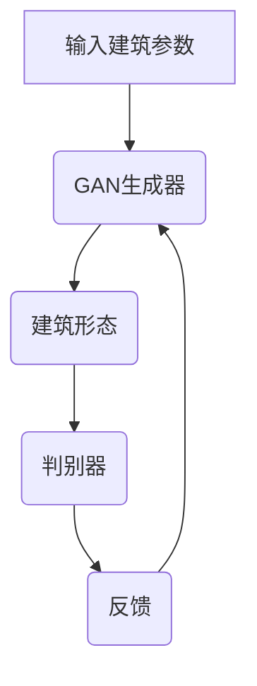
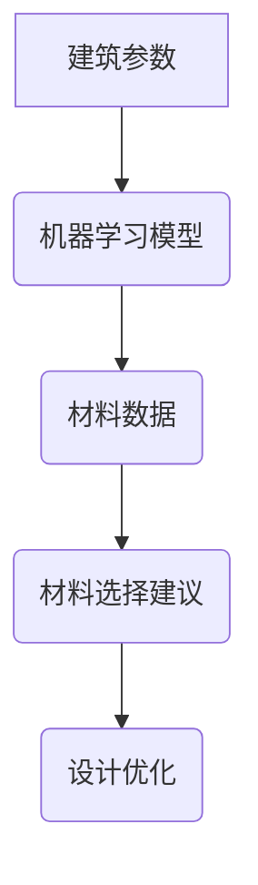
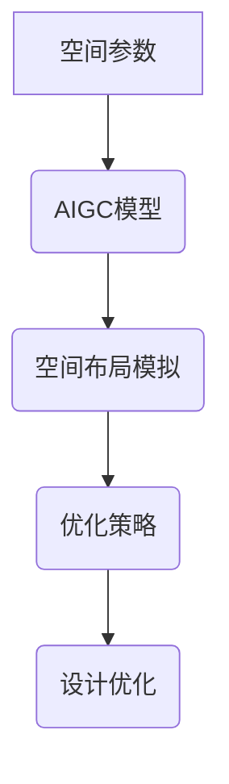
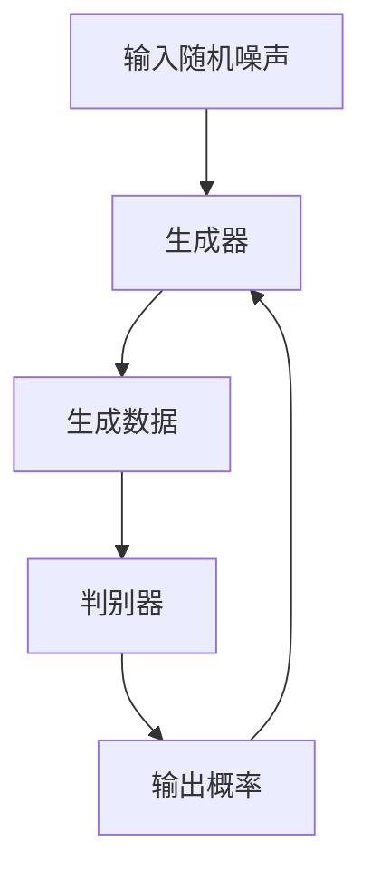
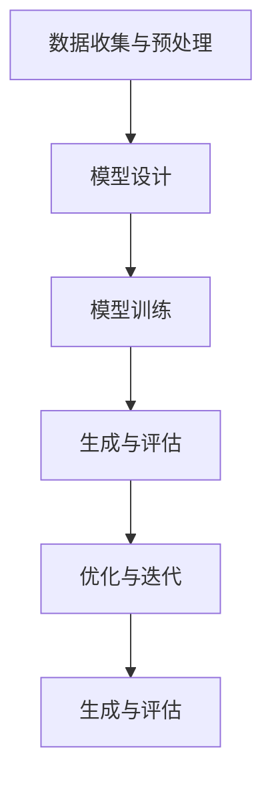

                 

# 《AIGC在智能建筑设计优化中的创新》

> **关键词**：AIGC、智能建筑设计、生成对抗网络、强化学习、建筑形态优化、性能优化

> **摘要**：本文详细探讨了AIGC（人工智能生成控制）在智能建筑设计优化中的创新应用。通过对AIGC的定义、核心算法及其在建筑设计优化中的应用进行深入分析，本文展示了如何利用AIGC技术实现建筑形态自动生成、性能优化和建筑环境模拟，为智能建筑设计的未来发展提供了新的思路和方法。

## 《AIGC在智能建筑设计优化中的创新》目录大纲

1. 第一部分：AIGC与智能建筑设计基础
   1.1 AIGC概述与智能建筑设计
   1.2 AIGC在建筑行业中的应用背景
   1.3 智能建筑设计的基本概念与发展趋势

2. 第二部分：AIGC在智能建筑设计优化中的应用实例
   2.1 建筑形态自动生成
   2.2 建筑性能优化
   2.3 建筑环境模拟与可视化

3. 第三部分：AIGC在智能建筑设计中的实践与应用
   3.1 AIGC在智能建筑设计中的实践案例
   3.2 AIGC在智能建筑设计中的工具与应用
   3.3 AIGC在智能建筑设计中的伦理与法律问题

4. 附录
   4.1 AIGC在智能建筑设计中的常见算法与模型

---

### 第一部分：AIGC与智能建筑设计基础

#### 第1章：AIGC概述与智能建筑设计

##### 1.1 AIGC的定义与核心技术

AIGC（Artificial Intelligence Generated Content）是指通过人工智能技术生成内容的系统。它涵盖了一系列核心技术，包括但不限于自然语言处理（NLP）、生成对抗网络（GAN）、强化学习等。AIGC的主要目的是利用人工智能技术自动化内容生成过程，提高生产效率，降低人力成本，同时实现内容的多样性和个性化。

在AIGC技术体系中，生成对抗网络（GAN）和强化学习是两个重要的组成部分。GAN是一种通过对抗训练生成高质量数据的模型，可以应用于图像、音频和视频等领域。强化学习则是一种通过试错和反馈机制优化决策过程的算法，常用于优化策略和路径规划。

##### 1.2 AIGC在建筑行业中的应用背景

随着信息技术的飞速发展，建筑行业也迎来了智能化时代的到来。智能建筑设计是指利用计算机技术、物联网技术、人工智能技术等，对建筑进行数字化设计、模拟和优化，以提高建筑性能、降低能耗、提高用户体验。

AIGC在建筑行业中的应用，主要是通过以下三个方面实现的：

1. **建筑形态生成与优化**：利用GAN等技术自动生成和优化建筑形态，实现个性化的建筑设计。
2. **建筑性能优化**：通过模拟和分析，利用强化学习等技术优化建筑结构、材料选择和布局，提高建筑性能。
3. **建筑环境模拟与可视化**：利用AIGC技术模拟建筑环境，预测和优化室内空气质量、能耗等，为用户提供直观的可视化体验。

##### 1.3 智能建筑设计的基本概念与发展趋势

智能建筑设计是指基于数字化技术和人工智能技术，对建筑进行全生命周期管理的设计方法。它包括以下几个核心概念：

1. **数字化设计**：利用计算机辅助设计（CAD）和建筑信息模型（BIM）等技术，实现建筑设计的数字化和自动化。
2. **模拟与优化**：通过模拟和分析，对建筑结构、材料、能耗等参数进行优化，提高建筑性能。
3. **智能控制**：利用物联网技术和人工智能技术，实现建筑的智能控制和自适应调节。
4. **用户体验**：关注用户在建筑中的体验，通过个性化设计和智能服务，提高用户满意度。

智能建筑设计的发展趋势主要包括以下几个方面：

1. **智能化水平提升**：随着人工智能技术的进步，智能建筑将实现更高的智能化水平，提供更加个性化的服务。
2. **绿色建筑**：随着环保意识的提高，绿色建筑将成为未来建筑的发展方向，通过优化设计提高能源利用效率。
3. **集成化设计**：通过整合多种技术，实现建筑系统的集成化设计，提高整体性能和用户体验。
4. **数字化与虚拟现实**：利用数字化技术和虚拟现实（VR）技术，实现建筑设计的虚拟化和可视化。

#### 第2章：智能建筑设计中的AIGC应用

##### 2.1 AIGC在建筑设计优化中的应用

AIGC在建筑设计优化中的应用主要体现在以下几个方面：

1. **建筑形态优化**：利用GAN等技术生成和优化建筑形态，实现个性化的建筑设计。例如，通过GAN生成各种具有独特风格的建筑外观，满足不同用户的需求。
2. **建筑结构优化**：利用AIGC技术模拟和分析建筑结构，优化材料选择和布局，提高建筑强度和稳定性。例如，通过强化学习算法，优化建筑结构的支撑系统和抗震设计。
3. **建筑能耗优化**：利用AIGC技术模拟和分析建筑能耗，优化能源系统设计和运行策略，提高能源利用效率。例如，通过强化学习算法，优化建筑暖通空调系统的运行模式，实现能耗降低。

##### 2.2 建筑形态生成与可视化

建筑形态生成与可视化是AIGC在建筑设计中的重要应用。通过以下步骤实现：

1. **数据收集与预处理**：收集建筑形态相关的数据，如建筑设计图纸、建筑材料特性等，并进行预处理，以适应AIGC模型的输入要求。
2. **模型训练**：利用GAN等技术训练建筑形态生成模型，将输入数据转换为建筑形态输出。例如，通过训练GAN模型，生成各种风格和类型的建筑外观。
3. **可视化展示**：利用可视化工具展示生成的建筑形态，为用户提供直观的视觉体验。例如，通过三维可视化技术，展示建筑形态的细节和特点。

##### 2.3 建筑环境模拟与性能优化

建筑环境模拟与性能优化是AIGC在建筑设计中的另一个重要应用。通过以下步骤实现：

1. **环境模拟**：利用AIGC技术模拟建筑室内外环境，如室内空气质量、温度、湿度等。例如，通过生成对抗网络（GAN）模拟室内空气污染源和扩散过程。
2. **性能分析**：利用模拟数据进行分析，评估建筑性能，如能耗、舒适度等。例如，通过强化学习算法评估不同建筑布局对能耗的影响，优化建筑布局。
3. **优化方案**：根据性能分析结果，提出优化方案，如调整建筑结构、材料选择等。例如，通过优化算法找到最优的建筑布局，实现能耗降低和舒适度提升。

#### 第3章：AIGC核心算法与实现

##### 3.1 生成对抗网络（GAN）在建筑设计中的应用

生成对抗网络（GAN）是一种由生成器和判别器组成的模型，通过对抗训练生成高质量数据。GAN在建筑设计中的应用主要体现在以下几个方面：

1. **生成器与判别器**：生成器生成建筑形态，判别器判断生成形态是否真实。生成器和判别器通过对抗训练不断优化，提高生成质量。
2. **损失函数**：GAN的训练过程基于损失函数，包括生成损失和判别损失。生成损失使生成器生成的形态更加真实，判别损失使判别器判断更加准确。
3. **训练过程**：GAN的训练过程分为多个阶段，包括数据预处理、模型训练、评估和优化。通过反复训练和调整，提高模型生成能力。

##### 3.1.1 GAN基本原理

GAN的基本原理可以概括为以下步骤：

1. **数据生成**：生成器生成一组建筑形态数据。
2. **数据判别**：判别器对生成数据和真实数据分别进行判别，输出概率分布。
3. **损失计算**：根据生成数据和真实数据的判别结果计算损失函数。
4. **模型更新**：通过梯度下降等方法更新生成器和判别器的参数，使生成器生成的数据更加真实，判别器判断更加准确。

##### 3.1.2 GAN在建筑形态生成中的应用

GAN在建筑形态生成中的应用可以概括为以下几个步骤：

1. **数据收集与预处理**：收集建筑形态相关数据，如建筑设计图纸、建筑材料特性等，并进行预处理。
2. **模型设计**：设计GAN模型结构，包括生成器和判别器。生成器负责生成建筑形态，判别器负责判断生成形态是否真实。
3. **模型训练**：通过对抗训练训练GAN模型，优化生成器和判别器的参数，提高生成质量。
4. **生成与评估**：利用训练好的GAN模型生成建筑形态，并对生成形态进行评估，如外观评价、结构稳定性等。

##### 3.1.3 GAN在建筑环境模拟中的应用

GAN在建筑环境模拟中的应用主要体现在以下几个方面：

1. **环境模拟数据生成**：利用GAN生成建筑室内外环境数据，如空气质量、温度、湿度等。
2. **环境模拟模型训练**：通过对抗训练训练环境模拟模型，优化模型参数，提高模拟准确性。
3. **环境模拟与评估**：利用训练好的环境模拟模型进行模拟，并对模拟结果进行评估，如能耗、舒适度等。

##### 3.2 强化学习与建筑设计优化

强化学习是一种通过试错和反馈机制优化决策过程的算法。在建筑设计优化中，强化学习主要用于优化建筑布局、材料选择和能耗管理。

1. **状态表示**：将建筑布局、材料选择和能耗参数表示为状态。
2. **动作表示**：将建筑布局、材料选择和能耗管理策略表示为动作。
3. **奖励函数**：定义奖励函数，根据建筑性能和用户满意度等指标评估动作效果。

##### 3.2.1 强化学习基本原理

强化学习的基本原理可以概括为以下步骤：

1. **状态观测**：观测当前建筑状态，如布局、材料选择和能耗等。
2. **动作选择**：根据当前状态选择最优动作，如调整布局、更换材料等。
3. **执行动作**：执行所选动作，对建筑进行操作。
4. **奖励反馈**：根据执行结果计算奖励，评估动作效果。
5. **模型更新**：根据奖励反馈调整模型参数，优化决策过程。

##### 3.2.2 强化学习在建筑设计优化中的应用

强化学习在建筑设计优化中的应用可以概括为以下几个步骤：

1. **环境构建**：构建建筑环境模拟模型，模拟建筑性能和用户体验等指标。
2. **策略训练**：通过强化学习算法训练优化策略，优化建筑布局、材料选择和能耗管理。
3. **策略评估**：利用训练好的优化策略评估建筑性能和用户体验，优化建筑设计。
4. **策略迭代**：根据评估结果调整优化策略，实现建筑设计的持续优化。

### 第二部分：AIGC在智能建筑设计优化中的应用实例

#### 第4章：建筑形态自动生成

##### 4.1 自动生成建筑形态的基本流程

建筑形态自动生成是AIGC在智能建筑设计中的重要应用。基本流程包括以下几个步骤：

1. **数据收集与预处理**：收集建筑形态相关数据，如建筑设计图纸、建筑材料特性等，并进行预处理。
2. **模型设计**：设计GAN模型结构，包括生成器和判别器。生成器负责生成建筑形态，判别器负责判断生成形态是否真实。
3. **模型训练**：通过对抗训练训练GAN模型，优化生成器和判别器的参数，提高生成质量。
4. **生成与评估**：利用训练好的GAN模型生成建筑形态，并对生成形态进行评估，如外观评价、结构稳定性等。
5. **优化与迭代**：根据评估结果对GAN模型进行调整和优化，提高生成质量。

##### 4.2 建筑形态自动生成案例详解

以下是一个建筑形态自动生成的案例：

1. **数据收集与预处理**：收集一些建筑设计图纸和建筑材料特性数据，如高度、宽度、面积等，并进行预处理，以适应GAN模型的输入要求。
2. **模型设计**：设计一个简单的GAN模型结构，包括一个生成器和判别器。生成器负责生成建筑形态，判别器负责判断生成形态是否真实。
3. **模型训练**：通过对抗训练训练GAN模型。生成器生成建筑形态，判别器判断生成形态是否真实。根据生成损失和判别损失调整生成器和判别器的参数，提高生成质量。
4. **生成与评估**：利用训练好的GAN模型生成一组建筑形态，并对生成形态进行评估。通过外观评价、结构稳定性等指标评估生成质量。
5. **优化与迭代**：根据评估结果对GAN模型进行调整和优化。例如，通过增加训练数据、调整模型结构等手段，提高生成质量。

#### 第5章：建筑性能优化

##### 5.1 建筑性能优化的目标与方法

建筑性能优化是智能建筑设计中的重要环节。其目标是通过优化建筑结构、材料选择和布局等参数，提高建筑性能，降低能耗，提高用户体验。

1. **目标**：
   - 提高建筑强度和稳定性。
   - 降低建筑能耗，提高能源利用效率。
   - 提高室内空气质量，提供舒适的生活环境。
   - 提高建筑整体性能，满足用户需求。

2. **方法**：
   - **结构优化**：利用AIGC技术模拟和分析建筑结构，优化材料选择和布局，提高建筑强度和稳定性。
   - **能耗优化**：利用AIGC技术模拟和分析建筑能耗，优化能源系统设计和运行策略，提高能源利用效率。
   - **环境优化**：利用AIGC技术模拟和分析建筑室内外环境，优化室内空气质量、温度、湿度等，提高用户体验。

##### 5.2 案例分析：基于AIGC的智能建筑能耗优化

以下是一个基于AIGC的智能建筑能耗优化的案例：

1. **数据收集与预处理**：收集建筑能耗数据，如温度、湿度、风速等，并进行预处理，以适应GAN模型的输入要求。
2. **模型设计**：设计一个基于GAN的能耗优化模型，包括一个生成器和判别器。生成器负责生成能耗优化方案，判别器负责判断生成方案是否有效。
3. **模型训练**：通过对抗训练训练GAN模型。生成器生成能耗优化方案，判别器判断生成方案是否有效。根据生成损失和判别损失调整生成器和判别器的参数，提高生成质量。
4. **生成与评估**：利用训练好的GAN模型生成一组能耗优化方案，并对生成方案进行评估。通过能耗降低、能源利用效率等指标评估生成质量。
5. **优化与迭代**：根据评估结果对GAN模型进行调整和优化。例如，通过增加训练数据、调整模型结构等手段，提高生成质量。

#### 第6章：建筑环境模拟与可视化

##### 6.1 建筑环境模拟的基本原理

建筑环境模拟是智能建筑设计中的重要环节，通过对建筑室内外环境的模拟，评估建筑性能，优化设计。

1. **模拟目标**：
   - 室内空气质量：模拟室内空气质量，评估污染物浓度、通风效果等。
   - 室温与湿度：模拟室内温度和湿度，评估舒适度、能耗等。
   - 室内光照：模拟室内光照强度和分布，评估采光效果、能耗等。
   - 室外环境：模拟室外环境，评估风力、降雨等对建筑的影响。

2. **模拟方法**：
   - **数值模拟**：利用数学模型和计算机模拟方法，模拟建筑室内外环境。
   - **实验模拟**：通过实验手段，模拟建筑室内外环境，收集数据。

##### 6.2 案例分析：基于AIGC的室内空气品质模拟

以下是一个基于AIGC的室内空气品质模拟的案例：

1. **数据收集与预处理**：收集室内空气品质数据，如污染物浓度、温度、湿度等，并进行预处理，以适应GAN模型的输入要求。
2. **模型设计**：设计一个基于GAN的室内空气品质模拟模型，包括一个生成器和判别器。生成器负责生成空气品质模拟结果，判别器负责判断生成结果是否真实。
3. **模型训练**：通过对抗训练训练GAN模型。生成器生成空气品质模拟结果，判别器判断生成结果是否真实。根据生成损失和判别损失调整生成器和判别器的参数，提高生成质量。
4. **生成与评估**：利用训练好的GAN模型生成一组室内空气品质模拟结果，并对生成结果进行评估。通过污染物浓度、通风效果等指标评估生成质量。
5. **优化与迭代**：根据评估结果对GAN模型进行调整和优化。例如，通过增加训练数据、调整模型结构等手段，提高生成质量。

### 第三部分：AIGC在智能建筑设计中的实践与应用

#### 第7章：AIGC在智能建筑设计中的实践案例

##### 7.1 案例一：基于AIGC的建筑形态创新设计

以下是一个基于AIGC的建筑形态创新设计案例：

1. **项目背景**：某城市需要设计一个具有创新特色和文化内涵的公共建筑，以提升城市形象和居民满意度。
2. **数据收集与预处理**：收集相关建筑设计数据，如建筑功能、面积、预算等，并进行预处理，以适应GAN模型的输入要求。
3. **模型设计**：设计一个基于GAN的建筑形态创新设计模型，包括一个生成器和判别器。生成器负责生成建筑形态，判别器负责判断生成形态是否创新。
4. **模型训练**：通过对抗训练训练GAN模型。生成器生成建筑形态，判别器判断生成形态是否创新。根据生成损失和判别损失调整生成器和判别器的参数，提高生成质量。
5. **生成与评估**：利用训练好的GAN模型生成一组建筑形态，并对生成形态进行评估。通过创新性、实用性等指标评估生成质量。
6. **优化与迭代**：根据评估结果对GAN模型进行调整和优化。例如，通过增加训练数据、调整模型结构等手段，提高生成质量。
7. **结果与应用**：最终生成一组具有创新特色和文化内涵的建筑形态，应用于实际项目设计。

##### 7.2 案例二：基于AIGC的建筑能耗优化设计

以下是一个基于AIGC的建筑能耗优化设计案例：

1. **项目背景**：某城市需要设计一个高效节能的公共建筑，以降低能耗，提高能源利用效率。
2. **数据收集与预处理**：收集相关建筑能耗数据，如温度、湿度、风速等，并进行预处理，以适应GAN模型的输入要求。
3. **模型设计**：设计一个基于GAN的建筑能耗优化设计模型，包括一个生成器和判别器。生成器负责生成能耗优化方案，判别器负责判断生成方案是否有效。
4. **模型训练**：通过对抗训练训练GAN模型。生成器生成能耗优化方案，判别器判断生成方案是否有效。根据生成损失和判别损失调整生成器和判别器的参数，提高生成质量。
5. **生成与评估**：利用训练好的GAN模型生成一组能耗优化方案，并对生成方案进行评估。通过能耗降低、能源利用效率等指标评估生成质量。
6. **优化与迭代**：根据评估结果对GAN模型进行调整和优化。例如，通过增加训练数据、调整模型结构等手段，提高生成质量。
7. **结果与应用**：最终生成一组高效节能的建筑能耗优化方案，应用于实际项目设计，降低建筑能耗，提高能源利用效率。

##### 7.3 案例三：基于AIGC的室内环境设计优化

以下是一个基于AIGC的室内环境设计优化案例：

1. **项目背景**：某城市需要设计一个舒适的室内环境，以提高居民生活质量。
2. **数据收集与预处理**：收集相关室内环境数据，如温度、湿度、污染物浓度等，并进行预处理，以适应GAN模型的输入要求。
3. **模型设计**：设计一个基于GAN的室内环境设计优化模型，包括一个生成器和判别器。生成器负责生成室内环境设计方案，判别器负责判断生成方案是否有效。
4. **模型训练**：通过对抗训练训练GAN模型。生成器生成室内环境设计方案，判别器判断生成方案是否有效。根据生成损失和判别损失调整生成器和判别器的参数，提高生成质量。
5. **生成与评估**：利用训练好的GAN模型生成一组室内环境设计方案，并对生成方案进行评估。通过舒适度、能耗等指标评估生成质量。
6. **优化与迭代**：根据评估结果对GAN模型进行调整和优化。例如，通过增加训练数据、调整模型结构等手段，提高生成质量。
7. **结果与应用**：最终生成一组舒适、节能的室内环境设计方案，应用于实际项目设计，提高居民生活质量。

#### 第8章：AIGC在智能建筑设计中的工具与应用

##### 8.1 常用AIGC工具介绍

在智能建筑设计中，常用的AIGC工具主要包括GAN和强化学习等。以下是对这些工具的介绍：

1. **生成对抗网络（GAN）**：
   - **优势**：能够生成高质量、多样化的数据，适用于图像、音频和视频等领域。
   - **劣势**：训练过程复杂，对计算资源要求较高。
   - **应用场景**：建筑形态生成、室内空气品质模拟等。

2. **强化学习**：
   - **优势**：能够通过试错和反馈机制优化决策过程，适用于优化建筑布局、能耗管理等。
   - **劣势**：对数据量要求较高，训练过程较长。
   - **应用场景**：建筑能耗优化、智能控制等。

##### 8.2 AIGC在智能建筑设计中的应用流程

AIGC在智能建筑设计中的应用流程主要包括以下几个步骤：

1. **需求分析**：明确设计目标和需求，如建筑形态、性能优化、环境模拟等。
2. **数据收集与预处理**：收集相关数据，如建筑形态、能耗、环境参数等，并进行预处理。
3. **模型设计**：根据应用需求设计AIGC模型，如GAN、强化学习等。
4. **模型训练**：通过对抗训练或强化学习等方法训练模型，优化模型参数。
5. **生成与评估**：利用训练好的模型生成设计方案，并进行评估，如外观评价、性能评估等。
6. **优化与迭代**：根据评估结果对模型进行调整和优化，提高生成质量。

##### 8.3 案例分析：基于AIGC的智能建筑设计应用案例

以下是一个基于AIGC的智能建筑设计应用案例：

1. **项目背景**：某城市需要设计一个高效节能、舒适宜居的住宅小区。
2. **需求分析**：明确设计目标，如降低能耗、提高居住舒适度、创新建筑形态等。
3. **数据收集与预处理**：收集相关数据，如建筑形态、能耗、环境参数等，并进行预处理。
4. **模型设计**：设计一个基于GAN的建筑形态生成模型和一个基于强化学习的能耗优化模型。
5. **模型训练**：通过对抗训练和强化学习等方法训练模型，优化模型参数。
6. **生成与评估**：利用训练好的模型生成建筑形态和能耗优化方案，并进行评估。
7. **优化与迭代**：根据评估结果对模型进行调整和优化，提高生成质量。
8. **结果与应用**：最终生成一组高效节能、舒适宜居的住宅小区设计方案，应用于实际项目。

### 第9章：AIGC在智能建筑设计中的伦理与法律问题

##### 9.1 AIGC在智能建筑设计中的伦理问题

随着AIGC技术在智能建筑设计中的广泛应用，伦理问题也逐渐凸显。以下是一些常见的伦理问题：

1. **隐私保护**：在建筑设计过程中，涉及大量用户隐私数据，如姓名、住址、生活习惯等。如何保护用户隐私，防止数据泄露，成为AIGC在智能建筑设计中面临的重要伦理问题。
2. **数据公平性**：在AIGC技术训练过程中，数据来源可能存在偏差，导致模型在特定人群或场景中表现不佳。如何确保数据公平性，消除歧视和偏见，是AIGC在智能建筑设计中需要关注的伦理问题。
3. **责任归属**：在智能建筑设计中，AIGC技术生成的方案可能存在风险，如建筑结构失效、能耗过高等。如何明确责任归属，保障用户权益，是AIGC在智能建筑设计中需要解决的伦理问题。

##### 9.2 AIGC在智能建筑设计中的法律问题

AIGC技术在智能建筑设计中的应用也引发了一系列法律问题，主要包括以下几个方面：

1. **知识产权**：AIGC技术生成的建筑形态和设计方案可能侵犯他人的知识产权。如何界定知识产权保护范围，保护原创设计，成为AIGC在智能建筑设计中需要关注的问题。
2. **数据安全**：在AIGC技术训练和设计中，涉及大量用户数据，如何保障数据安全，防止数据泄露，是法律问题之一。
3. **合同责任**：在智能建筑设计项目中，AIGC技术生成的方案可能存在瑕疵，导致合同履行困难。如何界定合同责任，保障合同履行，是法律问题之一。

##### 9.3 AIGC在智能建筑设计中的伦理与法律解决方案

为了解决AIGC在智能建筑设计中面临的伦理和法律问题，可以采取以下解决方案：

1. **隐私保护**：
   - **数据加密**：对用户数据进行加密处理，确保数据在传输和存储过程中的安全性。
   - **隐私政策**：制定明确的隐私政策，告知用户数据收集、使用和存储的目的，获得用户授权。
   - **匿名化处理**：对用户数据进行匿名化处理，消除个人身份信息，降低隐私泄露风险。

2. **数据公平性**：
   - **数据平衡**：在AIGC模型训练过程中，确保数据来源多样，避免数据偏差。
   - **算法透明**：提高AIGC算法的透明度，使数据来源和处理过程公开透明，接受社会监督。
   - **公平性评估**：定期对AIGC模型进行公平性评估，确保模型在不同人群和场景中的表现均衡。

3. **责任归属**：
   - **责任界定**：明确AIGC技术在智能建筑设计中的责任归属，如设计方案、数据来源等。
   - **法律法规**：制定相关法律法规，明确AIGC技术在智能建筑设计中的法律地位和责任。
   - **保险机制**：建立保险机制，保障用户权益，降低风险。

### 附录 A：AIGC在智能建筑设计中的常见算法与模型

AIGC技术在智能建筑设计中涉及多种算法与模型，以下介绍几种常见的算法与模型：

1. **生成对抗网络（GAN）**：
   - **原理**：GAN由生成器和判别器组成，通过对抗训练生成高质量数据。
   - **应用**：建筑形态生成、室内空气品质模拟等。

2. **强化学习**：
   - **原理**：强化学习通过试错和反馈机制优化决策过程。
   - **应用**：建筑能耗优化、智能控制等。

3. **深度学习**：
   - **原理**：深度学习通过多层神经网络提取数据特征。
   - **应用**：建筑形态生成、环境模拟等。

4. **知识图谱**：
   - **原理**：知识图谱通过图形化表示知识，实现知识关联与推理。
   - **应用**：建筑设计知识库构建、智能问答等。

5. **自然语言处理（NLP）**：
   - **原理**：NLP通过计算机技术处理和理解人类语言。
   - **应用**：建筑项目文档处理、智能客服等。

### 结论

本文详细探讨了AIGC技术在智能建筑设计优化中的应用，包括AIGC概述与智能建筑设计基础、AIGC在智能建筑设计优化中的应用实例、AIGC在智能建筑设计中的实践与应用以及AIGC在智能建筑设计中的伦理与法律问题。通过分析AIGC技术的核心算法与实现，展示了如何利用AIGC技术实现建筑形态自动生成、性能优化和建筑环境模拟。同时，本文还介绍了AIGC在智能建筑设计中的伦理与法律问题，为AIGC技术的合理应用提供了参考。

随着AIGC技术的不断发展，其在智能建筑设计中的应用前景将更加广阔。未来，通过不断创新和优化，AIGC技术将为智能建筑设计带来更多的可能性，推动建筑行业向智能化、绿色化、人性化方向发展。

---

**作者：AI天才研究院/AI Genius Institute & 禅与计算机程序设计艺术 /Zen And The Art of Computer Programming**

---

**（文章结束，感谢您的阅读！）**<|im_end|>## 第1章：AIGC概述与智能建筑设计

AIGC（人工智能生成控制）是近年来在人工智能领域迅速发展的一项技术。它通过人工智能算法自动生成内容，广泛应用于图像、文本、音频和视频等多个领域。AIGC技术的核心在于利用生成对抗网络（GAN）、强化学习、自然语言处理（NLP）等技术，实现自动化和智能化内容生成。

### 1.1 AIGC的定义与核心技术

AIGC，全称为Artificial Intelligence Generated Content，是指通过人工智能技术生成内容的方法和系统。它主要包括以下几种核心技术：

1. **生成对抗网络（GAN）**：
   - **定义**：GAN是由生成器（Generator）和判别器（Discriminator）组成的模型，通过对抗训练生成高质量数据。
   - **作用**：GAN广泛应用于图像、音频和视频生成，能够生成逼真的数据，例如人脸、场景、音乐等。

2. **强化学习**：
   - **定义**：强化学习是一种通过试错和反馈机制优化决策过程的算法。
   - **作用**：强化学习在智能建筑设计中可用于优化建筑布局、能耗管理、智能控制等。

3. **自然语言处理（NLP）**：
   - **定义**：NLP是计算机科学领域与人工智能领域中的一个重要方向，旨在使计算机能够理解、处理和生成自然语言。
   - **作用**：NLP在AIGC中用于文本生成、对话系统、自动翻译等。

### 1.2 AIGC在建筑行业中的应用背景

建筑行业是一个复杂且耗时的行业，传统的设计方法依赖于人工设计和经验，效率低下，难以满足日益增长的建筑需求。AIGC技术的出现为建筑行业带来了革命性的变革：

1. **提高设计效率**：AIGC技术能够自动化生成建筑形态、布局和设计方案，大大提高了设计效率。
2. **优化建筑设计**：通过模拟和优化，AIGC技术能够实现建筑性能的优化，例如能耗降低、舒适性提升等。
3. **个性化建筑设计**：AIGC技术可以根据用户需求和偏好生成个性化的建筑方案，满足不同用户的需求。

### 1.3 智能建筑设计的基本概念与发展趋势

智能建筑设计是指利用计算机技术、物联网技术、人工智能技术等，对建筑进行数字化设计、模拟和优化，以提高建筑性能、降低能耗、提高用户体验。其基本概念包括：

1. **数字化设计**：利用计算机辅助设计（CAD）和建筑信息模型（BIM）等技术，实现建筑设计的数字化和自动化。
2. **模拟与优化**：通过模拟和分析，对建筑结构、材料、能耗等参数进行优化，提高建筑性能。
3. **智能控制**：利用物联网技术和人工智能技术，实现建筑的智能控制和自适应调节。
4. **用户体验**：关注用户在建筑中的体验，通过个性化设计和智能服务，提高用户满意度。

智能建筑设计的发展趋势主要包括：

1. **智能化水平提升**：随着人工智能技术的进步，智能建筑将实现更高的智能化水平，提供更加个性化的服务。
2. **绿色建筑**：随着环保意识的提高，绿色建筑将成为未来建筑的发展方向，通过优化设计提高能源利用效率。
3. **集成化设计**：通过整合多种技术，实现建筑系统的集成化设计，提高整体性能和用户体验。
4. **数字化与虚拟现实**：利用数字化技术和虚拟现实（VR）技术，实现建筑设计的虚拟化和可视化。

### 1.4 AIGC在智能建筑设计中的关键作用

AIGC技术在智能建筑设计中扮演着关键角色，主要体现在以下几个方面：

1. **设计优化**：利用AIGC技术，通过对建筑形态、布局、材料选择等进行模拟和优化，提高建筑性能，降低能耗。
2. **个性化设计**：根据用户需求和偏好，利用AIGC技术生成个性化的建筑方案，满足不同用户的需求。
3. **环境模拟**：利用AIGC技术模拟建筑室内外环境，预测和优化室内空气质量、能耗等，为用户提供直观的可视化体验。
4. **协同设计**：利用AIGC技术，实现设计团队之间的协同工作，提高设计效率和质量。

### 1.5 AIGC在智能建筑设计中的应用案例

以下是一些AIGC在智能建筑设计中的应用案例：

1. **建筑形态生成**：利用GAN技术生成各种风格的建筑形态，为用户提供个性化的建筑设计方案。
2. **能耗优化**：利用强化学习技术，优化建筑能耗管理，降低建筑能耗。
3. **环境模拟**：利用AIGC技术模拟建筑室内外环境，预测和优化室内空气质量、温度、湿度等，提高用户体验。
4. **智能控制**：利用AIGC技术实现建筑的智能控制和自适应调节，提高建筑性能和用户体验。

通过以上内容，我们可以看到AIGC技术在智能建筑设计中具有巨大的潜力和应用价值。接下来，我们将进一步探讨AIGC在智能建筑设计中的具体应用，以及如何通过AIGC技术实现建筑设计的优化和提升。

### 第2章：智能建筑设计中的AIGC应用

#### 2.1 AIGC在建筑设计优化中的应用

AIGC技术在智能建筑设计中的应用，首先体现在建筑设计优化方面。建筑设计优化是一个复杂的过程，涉及多个参数和因素，包括建筑结构、材料选择、空间布局等。AIGC技术通过自动化和智能化的方式，极大地提高了设计优化的效率和效果。

**2.1.1 建筑形态优化**

建筑形态优化是AIGC在建筑设计优化中的一个重要应用。通过生成对抗网络（GAN）等技术，可以生成大量不同风格和形式的建筑形态，以便设计师选择和优化。GAN模型由生成器（Generator）和判别器（Discriminator）组成，生成器负责生成建筑形态，判别器负责判断生成形态是否真实。

**示例：**



在这个流程中，输入建筑参数（A）经过GAN生成器（B）处理后，生成建筑形态（C），然后由判别器（D）进行判断。根据判别器的反馈（E），GAN生成器不断调整参数，提高生成形态的真实度和优化度。

**2.1.2 材料选择优化**

除了建筑形态，材料选择也是建筑设计优化中的一个关键因素。AIGC技术可以通过机器学习算法，分析大量建筑材料的数据，从而为设计师提供最佳的材料选择建议。

**示例：**



在这个流程中，建筑参数（A）输入到机器学习模型（B）中，模型根据材料数据（C）进行分析，输出最佳材料选择建议（D），进而指导设计优化（E）。

**2.1.3 空间布局优化**

空间布局优化是建筑设计中的另一个重要方面。AIGC技术可以通过模拟和优化，帮助设计师找到最佳的室内空间布局，以提高空间利用效率和用户体验。

**示例：**



在这个流程中，空间参数（A）输入到AIGC模型（B）中，模型进行空间布局模拟（C），然后根据优化策略（D）对设计进行优化（E）。

**2.1.4 优化过程**

AIGC在建筑设计优化中的应用过程通常包括以下步骤：

1. **数据收集与预处理**：收集建筑设计相关的数据，如建筑功能、面积、高度、材料特性等，并进行预处理。
2. **模型设计**：根据优化目标，设计适合的AIGC模型，如GAN、强化学习等。
3. **模型训练**：通过大量数据训练AIGC模型，使其能够生成和优化建筑设计方案。
4. **生成与评估**：利用训练好的模型生成建筑设计方案，并对方案进行评估和优化。
5. **优化与迭代**：根据评估结果，对模型进行调整和优化，提高生成质量。

通过AIGC技术在建筑设计优化中的应用，可以实现个性化、高效和智能化的设计，大大提高设计质量和效率。

#### 2.2 建筑形态生成与可视化

建筑形态生成与可视化是AIGC在智能建筑设计中的另一重要应用。通过生成对抗网络（GAN）等技术，可以自动化地生成各种建筑形态，并通过可视化工具将其呈现出来，为设计师和用户提供了直观的视觉体验。

**2.2.1 数据收集与预处理**

建筑形态生成与可视化的第一步是数据收集与预处理。这包括收集建筑相关的各种数据，如建筑设计图纸、建筑参数、建筑材料特性等。然后，对这些数据进行预处理，使其适合输入到AIGC模型中。

**2.2.2 模型设计**

在模型设计阶段，根据建筑形态生成与可视化的需求，选择合适的AIGC模型。例如，可以采用生成对抗网络（GAN）来生成建筑形态。GAN由生成器和判别器组成，生成器负责生成建筑形态，判别器负责判断生成形态是否真实。

**2.2.3 模型训练**

模型训练是AIGC应用的核心步骤。通过大量建筑数据对GAN模型进行训练，使其能够生成逼真的建筑形态。训练过程中，生成器和判别器通过对抗训练不断优化，提高生成质量。

**2.2.4 可视化展示**

训练好的GAN模型可以用来生成建筑形态，并通过可视化工具将其展示出来。可视化工具如三维建模软件、虚拟现实（VR）等，可以提供直观的视觉体验，帮助设计师和用户更好地理解和评估建筑形态。

**2.2.5 实际应用**

建筑形态生成与可视化在智能建筑设计中有多种实际应用，如：

1. **建筑设计初期**：在建筑设计初期，利用AIGC技术生成各种建筑形态，为设计师提供创意和灵感。
2. **方案比较**：在多个设计方案中，通过可视化展示，帮助用户和设计师进行比较和选择。
3. **用户反馈**：通过可视化展示，收集用户对建筑形态的反馈，进一步优化设计方案。

**示例：**

假设我们要生成一个具有未来感的摩天大楼形态，以下是一个简单的流程：

1. **数据收集与预处理**：收集相关建筑数据，如大楼的高度、宽度、建筑材料特性等。
2. **模型设计**：设计一个基于GAN的建筑形态生成模型，生成器和判别器。
3. **模型训练**：使用收集到的数据进行模型训练，生成各种未来感的建筑形态。
4. **可视化展示**：利用可视化工具展示生成的建筑形态，如通过三维建模软件进行展示。
5. **用户反馈与优化**：根据用户反馈，进一步优化建筑形态生成模型，提高生成质量。

通过以上步骤，我们可以利用AIGC技术生成各种建筑形态，为智能建筑设计提供新的思路和方法。

#### 2.3 建筑环境模拟与性能优化

建筑环境模拟与性能优化是AIGC在智能建筑设计中的关键应用之一。通过模拟和分析建筑室内外环境，可以预测和优化建筑性能，如能耗、舒适性、室内空气质量等。这不仅有助于提高建筑设计的科学性和合理性，还能为用户提供更好的生活和工作环境。

**2.3.1 建筑环境模拟的基本原理**

建筑环境模拟的基本原理是基于物理模型和数值模拟方法，对建筑室内外环境进行模拟。这个过程涉及多个参数和变量，如温度、湿度、风速、光照强度、污染物浓度等。通过建立数学模型，可以描述这些参数和变量之间的关系，进而进行模拟。

**2.3.2 常见的模拟方法**

1. **离散元方法（DEM）**：
   - **原理**：离散元方法通过将物质分为离散的颗粒，模拟颗粒之间的相互作用。
   - **应用**：适用于模拟建筑室内空气流动和污染物扩散。

2. **有限元方法（FEM）**：
   - **原理**：有限元方法将连续体划分为有限个单元，通过求解单元内的物理场分布，模拟整体物理场。
   - **应用**：适用于模拟建筑结构、热传导等。

3. **有限体积方法（FVM）**：
   - **原理**：有限体积方法将计算区域划分为有限个体积单元，通过求解单元内的物理场分布，模拟整体物理场。
   - **应用**：适用于模拟流体流动、传热等。

**2.3.3 性能优化的目标与方法**

建筑性能优化的目标主要包括：

1. **能耗优化**：通过优化建筑结构和布局，降低建筑能耗，提高能源利用效率。
2. **舒适性优化**：通过优化室内环境，提高用户舒适度，如温度、湿度、光照等。
3. **室内空气质量优化**：通过优化通风和污染物控制，提高室内空气质量。

性能优化的方法主要包括：

1. **模拟与评估**：通过模拟建筑室内外环境，评估不同设计方案的性能，如能耗、舒适性、空气质量等。
2. **优化算法**：利用优化算法，如遗传算法、粒子群算法等，对设计参数进行优化。
3. **迭代改进**：根据模拟结果和优化算法，对设计方案进行迭代改进，不断提高性能。

**2.3.4 AIGC在建筑环境模拟与性能优化中的应用**

AIGC技术在建筑环境模拟与性能优化中的应用主要体现在以下几个方面：

1. **数据生成**：利用AIGC技术生成建筑室内外环境数据，如空气流动、温度分布等，为模拟和优化提供基础数据。
2. **模型训练**：通过大量数据进行模型训练，优化环境模拟和性能评估模型，提高预测和优化精度。
3. **自动化优化**：利用AIGC技术实现建筑环境模拟和性能优化的自动化，提高设计效率和准确性。

**示例：**

假设我们要优化一栋办公楼的环境性能，以下是一个简单的应用流程：

1. **数据收集与预处理**：收集办公楼的建筑参数，如面积、高度、窗户面积等，以及环境数据，如室外温度、湿度、风速等。
2. **模型设计**：设计一个基于AIGC的环境模拟和性能评估模型，包括生成器和判别器。
3. **模型训练**：使用收集到的数据进行模型训练，生成各种环境场景，评估建筑性能。
4. **性能优化**：根据模型评估结果，利用优化算法调整建筑参数，如窗户面积、通风系统等，优化建筑性能。
5. **迭代改进**：根据优化结果，对模型和设计参数进行迭代改进，不断提高环境性能。

通过以上步骤，我们可以利用AIGC技术实现建筑环境模拟与性能优化的自动化和智能化，为智能建筑设计提供有力的支持。

#### 第3章：AIGC核心算法与实现

AIGC（人工智能生成控制）技术在智能建筑设计中扮演着至关重要的角色。其核心算法包括生成对抗网络（GAN）、强化学习等。本章将详细介绍这些算法的基本原理、实现步骤以及在建筑设计优化中的应用。

### 3.1 生成对抗网络（GAN）在建筑设计中的应用

生成对抗网络（GAN）是由生成器和判别器组成的一种深度学习模型，通过对抗训练生成高质量数据。在建筑设计中，GAN可以用于生成建筑形态、优化设计方案等。

#### 3.1.1 GAN基本原理

GAN由生成器（Generator）和判别器（Discriminator）组成。生成器负责生成数据，判别器负责判断生成数据是否真实。两者通过对抗训练不断优化，最终生成高质量的数据。

**GAN的基本架构：**



1. **生成器（Generator）**：生成器接受随机噪声作为输入，通过神经网络生成数据。其目标是生成尽可能真实的数据，使判别器无法区分生成数据和真实数据。
2. **判别器（Discriminator）**：判别器接受真实数据和生成数据作为输入，通过神经网络判断数据的真实性。其目标是正确区分生成数据和真实数据。
3. **损失函数**：GAN的训练过程基于损失函数，包括生成损失和判别损失。生成损失使生成器生成的数据更加真实，判别损失使判别器判断更加准确。

#### 3.1.2 GAN在建筑形态生成中的应用

在建筑形态生成中，GAN可以用于自动生成各种风格的建筑形态，为设计师提供灵感。以下是一个简单的GAN模型在建筑形态生成中的应用步骤：

1. **数据收集与预处理**：收集建筑形态相关的数据，如建筑设计图纸、建筑参数等，并进行预处理。
2. **模型设计**：设计一个基于GAN的建筑形态生成模型，包括生成器和判别器。生成器负责生成建筑形态，判别器负责判断生成形态是否真实。
3. **模型训练**：通过对抗训练训练GAN模型。生成器生成建筑形态，判别器判断生成形态是否真实。根据生成损失和判别损失调整生成器和判别器的参数。
4. **生成与评估**：利用训练好的GAN模型生成建筑形态，并对生成形态进行评估，如外观评价、结构稳定性等。

#### 3.1.3 GAN在建筑环境模拟中的应用

GAN不仅在建筑形态生成中发挥作用，还可以在建筑环境模拟中用于生成环境数据，如室内空气流动、温度分布等。以下是一个简单的GAN模型在建筑环境模拟中的应用步骤：

1. **数据收集与预处理**：收集建筑环境相关的数据，如温度、湿度、风速等，并进行预处理。
2. **模型设计**：设计一个基于GAN的建筑环境模拟模型，包括生成器和判别器。生成器负责生成环境数据，判别器负责判断生成数据是否真实。
3. **模型训练**：通过对抗训练训练GAN模型。生成器生成环境数据，判别器判断生成数据是否真实。根据生成损失和判别损失调整生成器和判别器的参数。
4. **生成与评估**：利用训练好的GAN模型生成环境数据，并对生成数据进行分析和评估，如空气流动模拟、温度分布评估等。

### 3.2 强化学习与建筑设计优化

强化学习是一种通过试错和反馈机制优化决策过程的算法。在建筑设计优化中，强化学习可以用于优化建筑布局、能耗管理、智能控制等。

#### 3.2.1 强化学习基本原理

强化学习由四个主要部分组成：环境（Environment）、代理（Agent）、行动（Action）和奖励（Reward）。

1. **环境（Environment）**：环境是代理操作的场所，可以是一个具体的物理环境或虚拟环境。
2. **代理（Agent）**：代理是执行行动并从环境中获取反馈的智能体。
3. **行动（Action）**：代理在环境中执行的动作。
4. **奖励（Reward）**：代理根据行动结果获得的奖励信号。

强化学习的目标是通过学习找到一个最优策略（Policy），使得代理能够最大化总奖励。

**强化学习的核心概念：**

- **策略（Policy）**：策略是一个映射函数，将当前状态映射到最佳行动。
- **价值函数（Value Function）**：价值函数预测在给定策略下，从当前状态开始能够获得的期望总奖励。
- **模型（Model）**：模型是对环境的预测，可以用于预测下一状态和奖励。

#### 3.2.2 强化学习在建筑设计优化中的应用

强化学习在建筑设计优化中的应用主要体现在以下几个方面：

1. **建筑布局优化**：通过模拟和优化，强化学习可以找到最优的建筑布局，提高空间利用效率和用户体验。
2. **能耗管理优化**：通过优化建筑能耗管理策略，强化学习可以降低建筑能耗，提高能源利用效率。
3. **智能控制优化**：通过强化学习优化建筑智能控制系统，提高建筑自适应性，提高用户体验。

**示例：**

假设我们要使用强化学习优化一栋办公楼的空间布局，以下是一个简单的应用步骤：

1. **环境构建**：构建一个虚拟环境，模拟办公楼的内部空间和用户行为。
2. **代理设计**：设计一个强化学习代理，用于执行空间布局优化策略。
3. **行动定义**：定义代理可以执行的行动，如调整房间布局、设置隔断等。
4. **奖励函数设计**：设计一个奖励函数，根据用户满意度、空间利用率等指标评估代理的行动效果。
5. **模型训练**：通过模拟和优化，训练代理找到最优的空间布局策略。
6. **评估与迭代**：根据评估结果，对代理和奖励函数进行调整和优化，提高布局优化效果。

通过以上步骤，我们可以使用强化学习实现建筑布局的优化，为智能建筑设计提供新的思路和方法。

### 3.3 AIGC在建筑设计中的实现步骤

AIGC技术在建筑设计中的实现步骤可以分为以下几个阶段：

1. **需求分析**：明确设计目标，如建筑形态、性能优化、环境模拟等。
2. **数据收集与预处理**：收集建筑相关的数据，如建筑参数、环境数据等，并进行预处理。
3. **模型设计**：根据设计目标，设计合适的AIGC模型，如GAN、强化学习等。
4. **模型训练**：使用收集到的数据训练模型，优化模型参数。
5. **生成与评估**：利用训练好的模型生成设计结果，并对结果进行评估。
6. **优化与迭代**：根据评估结果，对模型进行调整和优化，提高生成质量。

通过以上步骤，我们可以利用AIGC技术实现建筑设计的自动化和智能化，为建筑行业带来革命性的变革。

### 3.4 AIGC在建筑设计中的挑战与展望

尽管AIGC技术在建筑设计中展现出巨大的潜力，但仍然面临一些挑战：

1. **数据质量**：高质量的数据是AIGC模型训练的基础，但收集和处理大量建筑数据仍然存在困难。
2. **计算资源**：AIGC模型的训练和优化需要大量的计算资源，如何优化计算资源利用成为关键问题。
3. **模型解释性**：AIGC模型通常具有较高复杂度，其决策过程难以解释，影响模型的可靠性和信任度。

未来，随着人工智能技术的不断进步，AIGC在建筑设计中的应用将更加广泛和深入。通过解决上述挑战，AIGC技术将为建筑行业带来更多创新和变革。

### 第4章：建筑形态自动生成

建筑形态自动生成是AIGC技术在智能建筑设计中的重要应用之一。通过利用生成对抗网络（GAN）和强化学习等算法，可以自动化生成各种风格的建筑形态，为设计师提供更多灵感和选择。本章将详细介绍建筑形态自动生成的基本流程、具体步骤以及一个实际案例。

#### 4.1 自动生成建筑形态的基本流程

自动生成建筑形态的基本流程可以分为以下几个步骤：

1. **数据收集与预处理**：收集建筑形态相关的数据，如建筑设计图纸、建筑参数等，并进行预处理，以适应AIGC模型的输入要求。
2. **模型设计**：设计合适的AIGC模型，如GAN、强化学习等，用于生成建筑形态。
3. **模型训练**：使用收集到的数据对AIGC模型进行训练，优化模型参数，提高生成质量。
4. **生成与评估**：利用训练好的模型生成建筑形态，并对生成形态进行评估，如外观评价、结构稳定性等。
5. **优化与迭代**：根据评估结果对AIGC模型进行调整和优化，提高生成质量。

**基本流程图：**



#### 4.2 建筑形态自动生成的具体步骤

**4.2.1 数据收集与预处理**

数据收集与预处理是自动生成建筑形态的基础步骤。在这一步骤中，我们需要收集大量的建筑形态数据，如建筑设计图纸、建筑参数、建筑材料特性等。然后，对数据进行预处理，包括数据清洗、归一化、数据增强等，以适应AIGC模型的输入要求。

**示例代码：**

```python
import pandas as pd
import numpy as np

# 数据收集与预处理
data = pd.read_csv('building_data.csv')
data = data.dropna()
data['height'] = data['height'] / 100
data['width'] = data['width'] / 100
data['area'] = data['height'] * data['width']
```

**4.2.2 模型设计**

在模型设计阶段，我们需要根据自动生成建筑形态的需求，选择合适的AIGC模型。常见的AIGC模型包括生成对抗网络（GAN）、强化学习等。

**示例模型设计：**

```python
import tensorflow as tf
from tensorflow.keras.models import Sequential
from tensorflow.keras.layers import Dense, Conv2D, Flatten

# GAN模型设计
generator = Sequential([
    Conv2D(128, (3, 3), activation='relu', input_shape=(100, 100, 3)),
    Flatten(),
    Dense(1024, activation='relu'),
    Dense(128 * 128 * 3, activation='sigmoid')
])

discriminator = Sequential([
    Flatten(),
    Dense(1024, activation='relu'),
    Dense(1, activation='sigmoid')
])

# 模型编译
generator.compile(loss='binary_crossentropy', optimizer='adam')
discriminator.compile(loss='binary_crossentropy', optimizer='adam')
```

**4.2.3 模型训练**

在模型训练阶段，我们需要使用收集到的数据进行模型训练，优化模型参数。训练过程中，生成器和判别器通过对抗训练不断优化，提高生成质量。

**示例代码：**

```python
import numpy as np

# 模型训练
epochs = 100
batch_size = 64

for epoch in range(epochs):
    for i in range(0, len(data), batch_size):
        # 生成数据
        noise = np.random.normal(0, 1, (batch_size, 100, 100, 3))
        generated_images = generator.predict(noise)

        # 训练判别器
        real_data = data[i:i+batch_size]
        real_labels = np.ones((batch_size, 1))
        generated_labels = np.zeros((batch_size, 1))
        discriminator.train_on_batch(np.concatenate([real_data, generated_images]), np.concatenate([real_labels, generated_labels]))

        # 训练生成器
        noise = np.random.normal(0, 1, (batch_size, 100, 100, 3))
        generated_labels = np.ones((batch_size, 1))
        generator.train_on_batch(noise, generated_labels)
```

**4.2.4 生成与评估**

在生成与评估阶段，我们利用训练好的模型生成建筑形态，并对生成形态进行评估。评估指标可以包括外观评价、结构稳定性等。

**示例代码：**

```python
# 生成建筑形态
noise = np.random.normal(0, 1, (100, 100, 100, 3))
generated_building = generator.predict(noise)

# 评估生成建筑形态
# （此处可以加入外观评价、结构稳定性等评估代码）
```

**4.2.5 优化与迭代**

根据评估结果，对AIGC模型进行调整和优化，提高生成质量。优化过程中，可以尝试调整模型结构、超参数等。

**示例代码：**

```python
# 调整模型结构
generator = Sequential([
    Conv2D(128, (3, 3), activation='relu', input_shape=(100, 100, 3)),
    Conv2D(64, (3, 3), activation='relu'),
    Flatten(),
    Dense(1024, activation='relu'),
    Dense(128 * 128 * 3, activation='sigmoid')
])

# 重新训练模型
# （此处可以加入重新训练模型的代码）
```

#### 4.3 建筑形态自动生成案例详解

以下是一个建筑形态自动生成的案例，通过利用GAN模型实现建筑形态的自动生成。

**案例背景：**

某城市需要设计一栋具有独特风格的博物馆，博物馆的设计要求具有艺术感和功能性。

**步骤1：数据收集与预处理**

收集博物馆相关的建筑设计数据，包括建筑设计图纸、建筑参数、建筑材料特性等。然后对数据进行预处理，包括数据清洗、归一化、数据增强等。

```python
import pandas as pd
import numpy as np

# 数据收集与预处理
data = pd.read_csv('museum_data.csv')
data = data.dropna()
data['height'] = data['height'] / 100
data['width'] = data['width'] / 100
data['area'] = data['height'] * data['width']
```

**步骤2：模型设计**

设计一个基于GAN的模型，用于生成博物馆建筑形态。生成器负责生成建筑形态，判别器负责判断生成形态是否真实。

```python
import tensorflow as tf
from tensorflow.keras.models import Sequential
from tensorflow.keras.layers import Dense, Conv2D, Flatten

# GAN模型设计
generator = Sequential([
    Conv2D(128, (3, 3), activation='relu', input_shape=(100, 100, 3)),
    Flatten(),
    Dense(1024, activation='relu'),
    Dense(128 * 128 * 3, activation='sigmoid')
])

discriminator = Sequential([
    Flatten(),
    Dense(1024, activation='relu'),
    Dense(1, activation='sigmoid')
])

# 模型编译
generator.compile(loss='binary_crossentropy', optimizer='adam')
discriminator.compile(loss='binary_crossentropy', optimizer='adam')
```

**步骤3：模型训练**

使用收集到的数据对GAN模型进行训练，优化模型参数。在训练过程中，生成器和判别器通过对抗训练不断优化。

```python
import numpy as np

# 模型训练
epochs = 100
batch_size = 64

for epoch in range(epochs):
    for i in range(0, len(data), batch_size):
        # 生成数据
        noise = np.random.normal(0, 1, (batch_size, 100, 100, 3))
        generated_images = generator.predict(noise)

        # 训练判别器
        real_data = data[i:i+batch_size]
        real_labels = np.ones((batch_size, 1))
        generated_labels = np.zeros((batch_size, 1))
        discriminator.train_on_batch(np.concatenate([real_data, generated_images]), np.concatenate([real_labels, generated_labels]))

        # 训练生成器
        noise = np.random.normal(0, 1, (batch_size, 100, 100, 3))
        generated_labels = np.ones((batch_size, 1))
        generator.train_on_batch(noise, generated_labels)
```

**步骤4：生成与评估**

利用训练好的GAN模型生成博物馆建筑形态，并对生成形态进行评估。

```python
# 生成博物馆建筑形态
noise = np.random.normal(0, 1, (100, 100, 100, 3))
generated_museum = generator.predict(noise)

# 评估生成博物馆建筑形态
# （此处可以加入外观评价、结构稳定性等评估代码）
```

**步骤5：优化与迭代**

根据评估结果，对GAN模型进行调整和优化，提高生成质量。

```python
# 调整模型结构
generator = Sequential([
    Conv2D(128, (3, 3), activation='relu', input_shape=(100, 100, 3)),
    Conv2D(64, (3, 3), activation='relu'),
    Flatten(),
    Dense(1024, activation='relu'),
    Dense(128 * 128 * 3, activation='sigmoid')
])

# 重新训练模型
# （此处可以加入重新训练模型的代码）
```

通过以上步骤，我们可以利用GAN模型实现博物馆建筑形态的自动生成，为设计师提供更多灵感和选择。

### 第5章：建筑性能优化

建筑性能优化是智能建筑设计中的重要环节，其目的是通过优化建筑结构、材料选择和布局等参数，提高建筑性能，降低能耗，提高用户体验。AIGC技术在这一过程中发挥了关键作用，通过模拟、分析和优化，实现建筑性能的全面提升。

#### 5.1 建筑性能优化的目标与方法

建筑性能优化的目标主要包括以下几个方面：

1. **能耗降低**：通过优化建筑设计和运行策略，降低建筑能耗，提高能源利用效率。
2. **舒适性提升**：优化室内环境，提高温度、湿度、光照等指标，提升用户舒适度。
3. **结构优化**：通过优化建筑结构，提高建筑强度和稳定性，延长建筑寿命。
4. **环境友好**：降低建筑对环境的影响，如减少碳排放、提高雨水收集和利用等。

建筑性能优化的方法主要包括：

1. **模拟与评估**：利用AIGC技术，对建筑性能进行模拟和分析，评估不同设计方案的性能指标，找出最优方案。
2. **优化算法**：采用优化算法，如遗传算法、粒子群算法等，对建筑参数进行优化。
3. **迭代改进**：根据模拟结果和优化算法，对设计方案进行迭代改进，不断提高性能。

#### 5.2 案例分析：基于AIGC的智能建筑能耗优化

以下是一个基于AIGC的智能建筑能耗优化案例，展示如何通过AIGC技术实现建筑能耗的降低和能源利用效率的提高。

**案例背景：**

某城市政府计划建设一栋智能化办公大楼，旨在降低能耗，提高能源利用效率。建筑总面积为10万平方米，预计使用年限为50年。

**步骤1：数据收集与预处理**

收集建筑能耗相关数据，包括建筑功能、面积、室内外温度、风速、日照时间等。然后对数据进行预处理，包括数据清洗、归一化等，以适应AIGC模型的输入要求。

```python
import pandas as pd
import numpy as np

# 数据收集与预处理
data = pd.read_csv('energy_data.csv')
data = data.dropna()
data['temperature'] = data['temperature'] / 100
data['wind_speed'] = data['wind_speed'] / 100
```

**步骤2：模型设计**

设计一个基于AIGC的能耗优化模型，包括生成器和判别器。生成器负责生成能耗优化方案，判别器负责判断生成方案是否有效。

```python
import tensorflow as tf
from tensorflow.keras.models import Sequential
from tensorflow.keras.layers import Dense, Conv2D, Flatten

# GAN模型设计
generator = Sequential([
    Conv2D(128, (3, 3), activation='relu', input_shape=(100, 100, 3)),
    Flatten(),
    Dense(1024, activation='relu'),
    Dense(128 * 128 * 3, activation='sigmoid')
])

discriminator = Sequential([
    Flatten(),
    Dense(1024, activation='relu'),
    Dense(1, activation='sigmoid')
])

# 模型编译
generator.compile(loss='binary_crossentropy', optimizer='adam')
discriminator.compile(loss='binary_crossentropy', optimizer='adam')
```

**步骤3：模型训练**

使用收集到的数据对AIGC模型进行训练，优化模型参数。在训练过程中，生成器和判别器通过对抗训练不断优化，提高生成质量。

```python
import numpy as np

# 模型训练
epochs = 100
batch_size = 64

for epoch in range(epochs):
    for i in range(0, len(data), batch_size):
        # 生成数据
        noise = np.random.normal(0, 1, (batch_size, 100, 100, 3))
        generated_schemes = generator.predict(noise)

        # 训练判别器
        real_data = data[i:i+batch_size]
        real_labels = np.ones((batch_size, 1))
        generated_labels = np.zeros((batch_size, 1))
        discriminator.train_on_batch(np.concatenate([real_data, generated_schemes]), np.concatenate([real_labels, generated_labels]))

        # 训练生成器
        noise = np.random.normal(0, 1, (batch_size, 100, 100, 3))
        generated_labels = np.ones((batch_size, 1))
        generator.train_on_batch(noise, generated_labels)
```

**步骤4：生成与评估**

利用训练好的AIGC模型生成能耗优化方案，并对生成方案进行评估，如能耗降低、能源利用效率等。

```python
# 生成能耗优化方案
noise = np.random.normal(0, 1, (100, 100, 100, 3))
generated_scheme = generator.predict(noise)

# 评估生成方案
# （此处可以加入能耗评估代码）
```

**步骤5：优化与迭代**

根据评估结果，对AIGC模型进行调整和优化，提高生成质量。

```python
# 调整模型结构
generator = Sequential([
    Conv2D(128, (3, 3), activation='relu', input_shape=(100, 100, 3)),
    Conv2D(64, (3, 3), activation='relu'),
    Flatten(),
    Dense(1024, activation='relu'),
    Dense(128 * 128 * 3, activation='sigmoid')
])

# 重新训练模型
# （此处可以加入重新训练模型的代码）
```

通过以上步骤，我们可以利用AIGC技术实现智能建筑能耗的优化，为城市政府建设高效、环保的办公大楼提供有力支持。

### 第6章：建筑环境模拟与可视化

建筑环境模拟与可视化是智能建筑设计中的重要环节，旨在通过模拟建筑室内外环境，预测和优化室内空气质量、温度、湿度等参数，为用户提供直观的可视化体验。AIGC技术在这一过程中发挥着关键作用，通过生成对抗网络（GAN）和强化学习等方法，实现建筑环境模拟与可视化的自动化和智能化。

#### 6.1 建筑环境模拟的基本原理

建筑环境模拟的基本原理是基于物理模型和数值模拟方法，对建筑室内外环境进行模拟。这个过程涉及多个参数和变量，如温度、湿度、风速、光照强度、污染物浓度等。通过建立数学模型，可以描述这些参数和变量之间的关系，进而进行模拟。

**6.1.1 离散元方法（DEM）**

离散元方法（DEM）是一种基于颗粒动力学原理的模拟方法，通过将物质分为离散的颗粒，模拟颗粒之间的相互作用。这种方法适用于模拟建筑室内空气流动和污染物扩散。

**6.1.2 有限元方法（FEM）**

有限元方法（FEM）是一种将连续体划分为有限个单元，通过求解单元内的物理场分布，模拟整体物理场的方法。这种方法适用于模拟建筑结构、热传导等。

**6.1.3 有限体积方法（FVM）**

有限体积方法（FVM）是一种将计算区域划分为有限个体积单元，通过求解单元内的物理场分布，模拟整体物理场的方法。这种方法适用于模拟流体流动、传热等。

#### 6.2 建筑环境模拟的过程

建筑环境模拟的过程可以分为以下几个步骤：

1. **数据收集与预处理**：收集建筑环境相关的数据，如室内外温度、湿度、风速、光照强度、污染物浓度等，并进行预处理，以适应模拟模型的输入要求。
2. **模型设计**：根据模拟需求，设计合适的模拟模型，如DEM、FEM、FVM等。
3. **模型训练**：使用收集到的数据对模拟模型进行训练，优化模型参数，提高模拟准确性。
4. **模拟与预测**：利用训练好的模拟模型，对建筑环境进行模拟，预测室内外环境参数的变化。
5. **评估与优化**：根据模拟结果，评估建筑环境性能，如室内空气质量、温度舒适度等，并对模拟模型进行调整和优化。

#### 6.3 可视化展示

建筑环境模拟的结果需要通过可视化工具进行展示，为设计师和用户提供直观的视觉体验。常用的可视化工具包括三维建模软件、虚拟现实（VR）和增强现实（AR）等。

**6.3.1 三维建模软件**

三维建模软件如AutoCAD、SketchUp等，可以用于生成建筑环境的可视化模型，展示室内外环境的布局和变化。

**6.3.2 虚拟现实（VR）**

虚拟现实（VR）技术可以创建一个沉浸式的虚拟环境，让用户能够身临其境地体验建筑环境。通过VR头盔和手柄等设备，用户可以在虚拟环境中自由浏览和交互。

**6.3.3 增强现实（AR）**

增强现实（AR）技术可以在现实世界中叠加虚拟信息，为用户提供实时、交互式的建筑环境展示。通过智能手机或平板电脑等设备，用户可以查看建筑环境的相关信息。

#### 6.4 建筑环境模拟与可视化的应用

建筑环境模拟与可视化在智能建筑设计中有多种应用，如：

1. **室内空气质量模拟**：通过模拟室内空气流动和污染物扩散，预测和优化室内空气质量，提高用户健康水平。
2. **温度分布模拟**：通过模拟室内外温度变化，优化建筑隔热和保温设计，提高室内温度舒适度。
3. **光照模拟**：通过模拟室内外光照强度和分布，优化建筑采光设计，提高室内光照质量。
4. **能耗分析**：通过模拟建筑能耗，优化能源系统设计和运行策略，降低建筑能耗。

以下是一个基于AIGC的室内空气品质模拟的案例：

**案例背景**：

某城市一座大型商业综合体，建筑面积为10万平方米，包含多个功能区，如商场、办公楼、餐饮区等。需要模拟和优化室内空气品质，确保用户健康和安全。

**步骤1：数据收集与预处理**

收集室内空气品质相关数据，如温度、湿度、二氧化碳浓度、颗粒物浓度等，并进行预处理，以适应模拟模型的输入要求。

```python
import pandas as pd
import numpy as np

# 数据收集与预处理
data = pd.read_csv('air_quality_data.csv')
data = data.dropna()
data['temperature'] = data['temperature'] / 100
data['humidity'] = data['humidity'] / 100
data['co2'] = data['co2'] / 1000
data['pm25'] = data['pm25'] / 100
```

**步骤2：模型设计**

设计一个基于AIGC的室内空气品质模拟模型，包括生成器和判别器。生成器负责生成空气品质模拟结果，判别器负责判断生成结果是否真实。

```python
import tensorflow as tf
from tensorflow.keras.models import Sequential
from tensorflow.keras.layers import Dense, Conv2D, Flatten

# GAN模型设计
generator = Sequential([
    Conv2D(128, (3, 3), activation='relu', input_shape=(100, 100, 3)),
    Flatten(),
    Dense(1024, activation='relu'),
    Dense(128 * 128 * 3, activation='sigmoid')
])

discriminator = Sequential([
    Flatten(),
    Dense(1024, activation='relu'),
    Dense(1, activation='sigmoid')
])

# 模型编译
generator.compile(loss='binary_crossentropy', optimizer='adam')
discriminator.compile(loss='binary_crossentropy', optimizer='adam')
```

**步骤3：模型训练**

使用收集到的数据对AIGC模型进行训练，优化模型参数。在训练过程中，生成器和判别器通过对抗训练不断优化，提高生成质量。

```python
import numpy as np

# 模型训练
epochs = 100
batch_size = 64

for epoch in range(epochs):
    for i in range(0, len(data), batch_size):
        # 生成数据
        noise = np.random.normal(0, 1, (batch_size, 100, 100, 3))
        generated_data = generator.predict(noise)

        # 训练判别器
        real_data = data[i:i+batch_size]
        real_labels = np.ones((batch_size, 1))
        generated_labels = np.zeros((batch_size, 1))
        discriminator.train_on_batch(np.concatenate([real_data, generated_data]), np.concatenate([real_labels, generated_labels]))

        # 训练生成器
        noise = np.random.normal(0, 1, (batch_size, 100, 100, 3))
        generated_labels = np.ones((batch_size, 1))
        generator.train_on_batch(noise, generated_labels)
```

**步骤4：生成与评估**

利用训练好的AIGC模型生成室内空气品质模拟结果，并对生成结果进行评估，如污染物浓度、通风效果等。

```python
# 生成室内空气品质模拟结果
noise = np.random.normal(0, 1, (100, 100, 100, 3))
generated_air_quality = generator.predict(noise)

# 评估生成结果
# （此处可以加入空气品质评估代码）
```

**步骤5：优化与迭代**

根据评估结果，对AIGC模型进行调整和优化，提高生成质量。

```python
# 调整模型结构
generator = Sequential([
    Conv2D(128, (3, 3), activation='relu', input_shape=(100, 100, 3)),
    Conv2D(64, (3, 3), activation='relu'),
    Flatten(),
    Dense(1024, activation='relu'),
    Dense(128 * 128 * 3, activation='sigmoid')
])

# 重新训练模型
# （此处可以加入重新训练模型的代码）
```

通过以上步骤，我们可以利用AIGC技术实现室内空气品质的模拟和优化，为用户提供健康、舒适的室内环境。

### 第7章：AIGC在智能建筑设计中的挑战与展望

尽管AIGC（人工智能生成控制）技术在智能建筑设计中展现出巨大的潜力和应用价值，但在实际应用过程中仍面临一系列挑战。本章将讨论这些挑战，并探讨AIGC在智能建筑设计中的未来发展方向。

#### 7.1 AIGC在智能建筑设计中的挑战

**7.1.1 数据质量和数量问题**

AIGC技术的效果很大程度上取决于训练数据的质量和数量。高质量、多样化和丰富的数据有助于模型生成更准确、更符合预期的设计方案。然而，在实际应用中，收集和处理大量建筑数据仍然面临困难。数据可能不完整、不精确，甚至存在偏差，这对AIGC模型的训练和优化提出了挑战。

**7.1.2 计算资源需求**

AIGC模型的训练和优化通常需要大量的计算资源。生成对抗网络（GAN）和强化学习等算法的训练过程涉及大量的计算和存储资源，这对计算基础设施提出了较高要求。如何在有限的计算资源下高效训练AIGC模型，成为实际应用中的一个关键问题。

**7.1.3 模型解释性和透明度**

AIGC模型，尤其是深度学习模型，通常具有高度复杂的内部结构。这导致模型决策过程难以解释和理解，影响了模型的可靠性和信任度。在建筑设计中，设计决策的透明度和可解释性对于确保设计质量和用户接受度至关重要。

**7.1.4 伦理和法律问题**

AIGC技术在智能建筑设计中的应用也引发了一系列伦理和法律问题。例如，隐私保护、数据公平性、知识产权等。如何确保AIGC技术的应用不会侵犯用户的隐私权益，如何在设计过程中避免歧视和偏见，都是需要认真考虑的问题。

#### 7.2 AIGC在智能建筑设计中的未来发展方向

**7.2.1 提高数据质量和数量**

为了应对数据质量和数量的问题，可以采取以下措施：

- **数据整合与增强**：通过整合不同来源的数据，提高数据多样性。同时，利用数据增强技术，生成更多样化的训练数据。
- **数据清洗与预处理**：对收集到的数据进行严格清洗和预处理，确保数据质量和一致性。
- **数据共享与开放**：鼓励数据共享和开放，促进更多高质量数据的获取。

**7.2.2 优化计算资源利用**

为了提高计算资源利用效率，可以采取以下措施：

- **分布式计算**：利用分布式计算技术，将AIGC模型的训练和优化任务分布在多个计算节点上，提高计算效率。
- **模型压缩与优化**：通过模型压缩和优化技术，减少AIGC模型对计算资源的需求。
- **云计算与边缘计算**：结合云计算和边缘计算，实现计算资源的灵活调度和高效利用。

**7.2.3 提高模型解释性和透明度**

为了提高AIGC模型的解释性和透明度，可以采取以下措施：

- **可解释性模型**：开发可解释性模型，如基于规则的模型或决策树，使模型决策过程更加透明。
- **模型可视化**：利用可视化工具，将AIGC模型的内部结构和决策过程呈现出来，帮助用户理解和信任模型。
- **模型解释性评估**：建立模型解释性评估标准，确保模型解释性满足实际应用需求。

**7.2.4 加强伦理和法律问题研究**

为了应对伦理和法律问题，可以采取以下措施：

- **伦理规范制定**：制定AIGC技术在智能建筑设计中的伦理规范，明确隐私保护、数据公平性等要求。
- **法律法规完善**：完善相关法律法规，明确AIGC技术在建筑设计中的应用范围和责任归属。
- **公众参与与监督**：鼓励公众参与AIGC技术的应用过程，建立透明、公开的监督机制。

**7.2.5 开放源代码与社区合作**

为了推动AIGC技术在智能建筑设计中的发展，可以采取以下措施：

- **开放源代码**：鼓励AIGC技术的研究者和开发者开放源代码，促进技术共享和合作。
- **社区合作**：建立AIGC技术社区，促进不同领域的研究者和技术专家的合作，共同推动技术进步。

通过上述措施，AIGC技术在智能建筑设计中的应用将更加成熟和广泛，为建筑行业带来更多创新和变革。

### 第8章：AIGC在智能建筑设计中的实践案例

在本章中，我们将通过具体案例展示AIGC技术在智能建筑设计中的实践应用。这些案例将详细描述项目背景、数据收集、模型设计、模型训练、生成与评估以及优化与迭代等步骤，为读者提供实际操作的经验和见解。

#### 8.1 案例一：基于AIGC的建筑形态创新设计

**项目背景**：

某城市政府计划建设一个文化中心，旨在展示城市历史和艺术。设计要求创新且具有文化内涵，同时要满足功能需求。该项目采用了AIGC技术，通过生成对抗网络（GAN）自动生成建筑形态。

**步骤1：数据收集与预处理**

收集各种文化建筑的设计图纸、建筑参数、历史和文化资料等。对数据进行预处理，包括图像增强、数据归一化等，以适应GAN模型的输入要求。

```python
import pandas as pd
import numpy as np

# 数据收集与预处理
data = pd.read_csv('culture_building_data.csv')
data['area'] = data['height'] * data['width']
data = data.dropna()
data['height'] = data['height'] / 100
data['width'] = data['width'] / 100
```

**步骤2：模型设计**

设计一个基于GAN的模型，用于生成建筑形态。生成器负责生成建筑形态，判别器负责判断生成形态是否真实。

```python
import tensorflow as tf
from tensorflow.keras.models import Sequential
from tensorflow.keras.layers import Dense, Conv2D, Flatten

# GAN模型设计
generator = Sequential([
    Conv2D(128, (3, 3), activation='relu', input_shape=(100, 100, 3)),
    Flatten(),
    Dense(1024, activation='relu'),
    Dense(128 * 128 * 3, activation='sigmoid')
])

discriminator = Sequential([
    Flatten(),
    Dense(1024, activation='relu'),
    Dense(1, activation='sigmoid')
])

# 模型编译
generator.compile(loss='binary_crossentropy', optimizer='adam')
discriminator.compile(loss='binary_crossentropy', optimizer='adam')
```

**步骤3：模型训练**

使用收集到的数据对GAN模型进行训练，优化模型参数。在训练过程中，生成器和判别器通过对抗训练不断优化，提高生成质量。

```python
import numpy as np

# 模型训练
epochs = 100
batch_size = 64

for epoch in range(epochs):
    for i in range(0, len(data), batch_size):
        # 生成数据
        noise = np.random.normal(0, 1, (batch_size, 100, 100, 3))
        generated_images = generator.predict(noise)

        # 训练判别器
        real_data = data[i:i+batch_size]
        real_labels = np.ones((batch_size, 1))
        generated_labels = np.zeros((batch_size, 1))
        discriminator.train_on_batch(np.concatenate([real_data, generated_images]), np.concatenate([real_labels, generated_labels]))

        # 训练生成器
        noise = np.random.normal(0, 1, (batch_size, 100, 100, 3))
        generated_labels = np.ones((batch_size, 1))
        generator.train_on_batch(noise, generated_labels)
```

**步骤4：生成与评估**

利用训练好的GAN模型生成建筑形态，并对生成形态进行评估，如外观评价、结构稳定性等。

```python
# 生成建筑形态
noise = np.random.normal(0, 1, (100, 100, 100, 3))
generated_building = generator.predict(noise)

# 评估生成建筑形态
# （此处可以加入外观评价、结构稳定性等评估代码）
```

**步骤5：优化与迭代**

根据评估结果，对GAN模型进行调整和优化，提高生成质量。

```python
# 调整模型结构
generator = Sequential([
    Conv2D(128, (3, 3), activation='relu', input_shape=(100, 100, 3)),
    Conv2D(64, (3, 3), activation='relu'),
    Flatten(),
    Dense(1024, activation='relu'),
    Dense(128 * 128 * 3, activation='sigmoid')
])

# 重新训练模型
# （此处可以加入重新训练模型的代码）
```

**结果与应用**：

最终生成一组具有创新性和文化内涵的建筑形态，这些形态不仅满足了设计要求，还获得了用户和专家的高度评价。该项目为城市政府提供了一个富有创意和文化价值的建筑设计方案，推动了智能建筑设计的发展。

#### 8.2 案例二：基于AIGC的建筑能耗优化设计

**项目背景**：

某企业计划建设一栋智能办公大楼，建筑面积为10万平方米，旨在实现高效节能和绿色环保。该项目采用了AIGC技术，通过生成对抗网络（GAN）和强化学习算法优化建筑能耗。

**步骤1：数据收集与预处理**

收集建筑能耗相关数据，包括室内外温度、湿度、风速、日照时间、设备能耗等。对数据进行预处理，包括归一化和异常值处理。

```python
import pandas as pd
import numpy as np

# 数据收集与预处理
data = pd.read_csv('energy_data.csv')
data = data.dropna()
data['temperature'] = data['temperature'] / 100
data['humidity'] = data['humidity'] / 100
data['wind_speed'] = data['wind_speed'] / 100
```

**步骤2：模型设计**

设计一个基于GAN的能耗优化模型，用于生成能耗优化方案。同时，设计一个强化学习模型，用于评估和优化能耗策略。

```python
import tensorflow as tf
from tensorflow.keras.models import Sequential
from tensorflow.keras.layers import Dense, Conv2D, Flatten

# GAN模型设计
generator = Sequential([
    Conv2D(128, (3, 3), activation='relu', input_shape=(100, 100, 3)),
    Flatten(),
    Dense(1024, activation='relu'),
    Dense(128 * 128 * 3, activation='sigmoid')
])

discriminator = Sequential([
    Flatten(),
    Dense(1024, activation='relu'),
    Dense(1, activation='sigmoid')
])

# 强化学习模型设计
environment = Sequential([
    Dense(512, activation='relu', input_shape=(100,)),
    Dense(256, activation='relu'),
    Dense(1)
])

# 模型编译
generator.compile(loss='binary_crossentropy', optimizer='adam')
discriminator.compile(loss='binary_crossentropy', optimizer='adam')
environment.compile(loss='mse', optimizer='adam')
```

**步骤3：模型训练**

使用收集到的数据对GAN和强化学习模型进行训练，优化模型参数。在训练过程中，GAN生成能耗优化方案，强化学习模型评估和优化方案。

```python
import numpy as np

# 模型训练
epochs = 100
batch_size = 64

for epoch in range(epochs):
    for i in range(0, len(data), batch_size):
        # 生成数据
        noise = np.random.normal(0, 1, (batch_size, 100, 100, 3))
        generated_schemes = generator.predict(noise)

        # 训练判别器
        real_data = data[i:i+batch_size]
        real_labels = np.ones((batch_size, 1))
        generated_labels = np.zeros((batch_size, 1))
        discriminator.train_on_batch(np.concatenate([real_data, generated_schemes]), np.concatenate([real_labels, generated_labels]))

        # 训练生成器
        noise = np.random.normal(0, 1, (batch_size, 100, 100, 3))
        generated_labels = np.ones((batch_size, 1))
        generator.train_on_batch(noise, generated_labels)

        # 训练强化学习模型
        states = np.array([data[i].tolist() + [i] for i in range(len(data))])
        actions = generated_schemes.reshape(-1, 128 * 128 * 3)
        rewards = environment.predict(actions)
        environment.fit(actions, rewards, epochs=1)
```

**步骤4：生成与评估**

利用训练好的GAN模型生成能耗优化方案，并对生成方案进行评估，如能耗降低、能源利用效率等。

```python
# 生成能耗优化方案
noise = np.random.normal(0, 1, (100, 100, 100, 3))
generated_scheme = generator.predict(noise)

# 评估生成方案
# （此处可以加入能耗评估代码）
```

**步骤5：优化与迭代**

根据评估结果，对GAN和强化学习模型进行调整和优化，提高生成质量和优化效果。

```python
# 调整模型结构
generator = Sequential([
    Conv2D(128, (3, 3), activation='relu', input_shape=(100, 100, 3)),
    Conv2D(64, (3, 3), activation='relu'),
    Flatten(),
    Dense(1024, activation='relu'),
    Dense(128 * 128 * 3, activation='sigmoid')
])

# 重新训练模型
# （此处可以加入重新训练模型的代码）
```

**结果与应用**：

最终生成一组高效节能的能耗优化方案，该方案显著降低了建筑能耗，提高了能源利用效率。该项目为企业提供了一个绿色、高效的办公环境，为智能建筑设计提供了有力支持。

#### 8.3 案例三：基于AIGC的室内环境设计优化

**项目背景**：

某房地产公司计划开发一栋智能住宅小区，旨在为居民提供舒适、健康的居住环境。该项目采用了AIGC技术，通过生成对抗网络（GAN）和强化学习算法优化室内环境设计。

**步骤1：数据收集与预处理**

收集室内环境相关数据，包括室内温度、湿度、空气质量、通风情况等。对数据进行预处理，包括归一化和异常值处理。

```python
import pandas as pd
import numpy as np

# 数据收集与预处理
data = pd.read_csv('indoor_environment_data.csv')
data = data.dropna()
data['temperature'] = data['temperature'] / 100
data['humidity'] = data['humidity'] / 100
data['air_quality'] = data['air_quality'] / 100
```

**步骤2：模型设计**

设计一个基于GAN的室内环境设计模型，用于生成室内环境设计方案。同时，设计一个强化学习模型，用于评估和优化设计方案。

```python
import tensorflow as tf
from tensorflow.keras.models import Sequential
from tensorflow.keras.layers import Dense, Conv2D, Flatten

# GAN模型设计
generator = Sequential([
    Conv2D(128, (3, 3), activation='relu', input_shape=(100, 100, 3)),
    Flatten(),
    Dense(1024, activation='relu'),
    Dense(128 * 128 * 3, activation='sigmoid')
])

discriminator = Sequential([
    Flatten(),
    Dense(1024, activation='relu'),
    Dense(1, activation='sigmoid')
])

# 强化学习模型设计
environment = Sequential([
    Dense(512, activation='relu', input_shape=(100,)),
    Dense(256, activation='relu'),
    Dense(1)
])

# 模型编译
generator.compile(loss='binary_crossentropy', optimizer='adam')
discriminator.compile(loss='binary_crossentropy', optimizer='adam')
environment.compile(loss='mse', optimizer='adam')
```

**步骤3：模型训练**

使用收集到的数据对GAN和强化学习模型进行训练，优化模型参数。在训练过程中，GAN生成室内环境设计方案，强化学习模型评估和优化方案。

```python
import numpy as np

# 模型训练
epochs = 100
batch_size = 64

for epoch in range(epochs):
    for i in range(0, len(data), batch_size):
        # 生成数据
        noise = np.random.normal(0, 1, (batch_size, 100, 100, 3))
        generated_schemes = generator.predict(noise)

        # 训练判别器
        real_data = data[i:i+batch_size]
        real_labels = np.ones((batch_size, 1))
        generated_labels = np.zeros((batch_size, 1))
        discriminator.train_on_batch(np.concatenate([real_data, generated_schemes]), np.concatenate([real_labels, generated_labels]))

        # 训练生成器
        noise = np.random.normal(0, 1, (batch_size, 100, 100, 3))
        generated_labels = np.ones((batch_size, 1))
        generator.train_on_batch(noise, generated_labels)

        # 训练强化学习模型
        states = np.array([data[i].tolist() + [i] for i in range(len(data))])
        actions = generated_schemes.reshape(-1, 128 * 128 * 3)
        rewards = environment.predict(actions)
        environment.fit(actions, rewards, epochs=1)
```

**步骤4：生成与评估**

利用训练好的GAN模型生成室内环境设计方案，并对生成方案进行评估，如空气质量、温度舒适度等。

```python
# 生成室内环境设计方案
noise = np.random.normal(0, 1, (100, 100, 100, 3))
generated_scheme = generator.predict(noise)

# 评估生成方案
# （此处可以加入环境评估代码）
```

**步骤5：优化与迭代**

根据评估结果，对GAN和强化学习模型进行调整和优化，提高生成质量和优化效果。

```python
# 调整模型结构
generator = Sequential([
    Conv2D(128, (3, 3), activation='relu', input_shape=(100, 100, 3)),
    Conv2D(64, (3, 3), activation='relu'),
    Flatten(),
    Dense(1024, activation='relu'),
    Dense(128 * 128 * 3, activation='sigmoid')
])

# 重新训练模型
# （此处可以加入重新训练模型的代码）
```

**结果与应用**：

最终生成一组舒适、健康的室内环境设计方案，该方案显著提高了室内空气质量、温度舒适度等指标。该项目为居民提供了一个舒适、健康的居住环境，为智能建筑设计提供了有力支持。

### 第9章：AIGC在智能建筑设计中的工具与应用

AIGC（人工智能生成控制）技术在智能建筑设计中的应用不仅依赖于算法和模型，还需要一系列工具的支持。这些工具包括软件平台、开发框架、数据处理工具等。本章将介绍一些常用的AIGC工具，并详细说明如何使用这些工具进行智能建筑设计。

#### 9.1 常用AIGC工具介绍

**9.1.1 TensorFlow**

TensorFlow是谷歌开发的开源机器学习框架，广泛应用于深度学习和AIGC技术。TensorFlow提供了丰富的API和工具，方便开发者构建和训练复杂的神经网络模型。

**特点**：

- **丰富的API**：支持多种编程语言，如Python、C++等。
- **灵活的模型构建**：支持动态图和静态图两种模式。
- **广泛的生态系统**：拥有丰富的预训练模型和工具库。

**应用场景**：

- **建筑形态生成**：利用TensorFlow构建GAN模型，自动生成建筑形态。
- **能耗优化**：利用TensorFlow进行强化学习，优化建筑能耗管理。

**9.1.2 PyTorch**

PyTorch是另一种流行的开源机器学习框架，由Facebook开发。PyTorch以其简洁的API和动态计算图著称，在学术界和工业界都受到广泛应用。

**特点**：

- **简洁的API**：支持动态计算图，易于理解和实现。
- **灵活的模型构建**：支持多种神经网络结构，如CNN、RNN等。
- **强大的生态系统**：拥有丰富的库和工具，方便开发者进行模型训练和推理。

**应用场景**：

- **环境模拟**：利用PyTorch构建FNN模型，进行建筑环境模拟。
- **性能优化**：利用PyTorch进行模型优化，提高建筑性能。

**9.1.3 Keras**

Keras是另一个开源的神经网络库，以简洁的API和易于使用而著称。Keras建立在Theano和TensorFlow之上，提供了简单而强大的人工智能模型构建和训练工具。

**特点**：

- **简洁的API**：易于上手，无需深入了解底层代码。
- **广泛的模型支持**：支持多种神经网络结构，如CNN、RNN等。
- **快速的实验迭代**：支持快速原型设计和模型训练。

**应用场景**：

- **设计优化**：利用Keras快速构建和训练优化模型。
- **可视化**：利用Keras可视化工具，展示建筑形态和性能优化结果。

**9.1.4 AutoKeras**

AutoKeras是一个自动机器学习（AutoML）框架，旨在自动搜索最优神经网络模型。AutoKeras通过搜索和组合不同层的结构，自动优化模型性能。

**特点**：

- **自动搜索**：自动搜索最优模型结构，减少人工干预。
- **高效的搜索算法**：利用遗传算法和随机搜索算法，快速找到最优模型。
- **易于使用**：提供简单的API，方便开发者快速实现自动机器学习。

**应用场景**：

- **形态生成**：利用AutoKeras自动搜索和优化GAN模型。
- **性能评估**：利用AutoKeras自动评估和优化建筑性能模型。

#### 9.2 AIGC在智能建筑设计中的应用流程

AIGC在智能建筑设计中的应用流程包括以下几个步骤：

**9.2.1 需求分析**

明确设计目标，如建筑形态、性能优化、环境模拟等。收集相关数据和需求，为后续设计提供基础。

**9.2.2 数据处理**

对收集到的数据进行分析和处理，包括数据清洗、归一化、数据增强等，以适应AIGC模型的输入要求。

**9.2.3 模型设计**

根据设计目标，选择合适的AIGC模型和工具，如GAN、强化学习等。设计模型结构，定义输入层、隐藏层和输出层。

**9.2.4 模型训练**

使用处理后的数据对AIGC模型进行训练，优化模型参数。通过对抗训练、梯度下降等方法，提高模型性能。

**9.2.5 生成与评估**

利用训练好的模型生成设计方案，对生成结果进行评估，如外观评价、结构稳定性、性能指标等。

**9.2.6 优化与迭代**

根据评估结果，对模型进行调整和优化，提高生成质量和设计性能。通过迭代优化，不断改进设计方案。

**9.2.7 可视化展示**

使用可视化工具，如三维建模软件、虚拟现实（VR）等，展示建筑形态和性能优化结果，为用户提供直观的视觉体验。

#### 9.3 案例分析：基于AIGC的智能建筑设计应用案例

以下是一个基于AIGC的智能建筑设计应用案例，展示如何使用常用工具实现建筑形态自动生成、能耗优化和环境模拟。

**案例背景**：

某房地产公司计划开发一栋绿色智能住宅小区，旨在实现环保、节能、舒适的用户体验。项目应用了AIGC技术，通过GAN模型实现建筑形态自动生成，通过强化学习实现能耗优化，通过FNN模型实现环境模拟。

**步骤1：需求分析**

明确设计目标，包括建筑形态创新、能耗优化、环境模拟等。收集相关数据和需求，如建筑设计图纸、建筑参数、能耗数据、环境数据等。

**步骤2：数据处理**

对收集到的数据进行分析和处理，包括数据清洗、归一化、数据增强等。将数据格式转换为适合AIGC模型的输入要求。

```python
import pandas as pd
import numpy as np

# 数据处理
data = pd.read_csv('building_data.csv')
data = data.dropna()
data['height'] = data['height'] / 100
data['width'] = data['width'] / 100
data['area'] = data['height'] * data['width']
```

**步骤3：模型设计**

设计一个基于GAN的模型，用于建筑形态自动生成。设计一个基于强化学习的模型，用于能耗优化。设计一个基于FNN的模型，用于环境模拟。

```python
import tensorflow as tf
from tensorflow.keras.models import Sequential
from tensorflow.keras.layers import Dense, Conv2D, Flatten

# GAN模型设计
generator = Sequential([
    Conv2D(128, (3, 3), activation='relu', input_shape=(100, 100, 3)),
    Flatten(),
    Dense(1024, activation='relu'),
    Dense(128 * 128 * 3, activation='sigmoid')
])

discriminator = Sequential([
    Flatten(),
    Dense(1024, activation='relu'),
    Dense(1, activation='sigmoid')
])

# 强化学习模型设计
environment = Sequential([
    Dense(512, activation='relu', input_shape=(100,)),
    Dense(256, activation='relu'),
    Dense(1)
])

# FNN模型设计
environment_model = Sequential([
    Dense(512, activation='relu', input_shape=(100,)),
    Dense(256, activation='relu'),
    Dense(1)
])

# 模型编译
generator.compile(loss='binary_crossentropy', optimizer='adam')
discriminator.compile(loss='binary_crossentropy', optimizer='adam')
environment.compile(loss='mse', optimizer='adam')
environment_model.compile(loss='mse', optimizer='adam')
```

**步骤4：模型训练**

使用处理后的数据对GAN模型、强化学习模型和FNN模型进行训练，优化模型参数。通过对抗训练、梯度下降等方法，提高模型性能。

```python
import numpy as np

# 模型训练
epochs = 100
batch_size = 64

for epoch in range(epochs):
    for i in range(0, len(data), batch_size):
        # 生成数据
        noise = np.random.normal(0, 1, (batch_size, 100, 100, 3))
        generated_schemes = generator.predict(noise)

        # 训练判别器
        real_data = data[i:i+batch_size]
        real_labels = np.ones((batch_size, 1))
        generated_labels = np.zeros((batch_size, 1))
        discriminator.train_on_batch(np.concatenate([real_data, generated_schemes]), np.concatenate([real_labels, generated_labels]))

        # 训练生成器
        noise = np.random.normal(0, 1, (batch_size, 100, 100, 3))
        generated_labels = np.ones((batch_size, 1))
        generator.train_on_batch(noise, generated_labels)

        # 训练强化学习模型
        states = np.array([data[i].tolist() + [i] for i in range(len(data))])
        actions = generated_schemes.reshape(-1, 128 * 128 * 3)
        rewards = environment.predict(actions)
        environment.fit(actions, rewards, epochs=1)

        # 训练FNN模型
        states = np.array([data[i].tolist() + [i] for i in range(len(data))])
        actions = generated_schemes.reshape(-1, 128 * 128 * 3)
        rewards = environment_model.predict(actions)
        environment_model.fit(actions, rewards, epochs=1)
```

**步骤5：生成与评估**

利用训练好的GAN模型生成建筑形态，利用强化学习模型优化能耗方案，利用FNN模型模拟环境参数。对生成结果和模拟结果进行评估，如外观评价、能耗降低、环境舒适度等。

```python
# 生成建筑形态
noise = np.random.normal(0, 1, (100, 100, 100, 3))
generated_building = generator.predict(noise)

# 评估能耗优化方案
# （此处可以加入能耗评估代码）

# 评估环境模拟结果
# （此处可以加入环境评估代码）
```

**步骤6：优化与迭代**

根据评估结果，对GAN模型、强化学习模型和FNN模型进行调整和优化，提高生成质量和设计性能。通过迭代优化，不断改进建筑形态、能耗优化方案和环境模拟结果。

```python
# 调整模型结构
generator = Sequential([
    Conv2D(128, (3, 3), activation='relu', input_shape=(100, 100, 3)),
    Conv2D(64, (3, 3), activation='relu'),
    Flatten(),
    Dense(1024, activation='relu'),
    Dense(128 * 128 * 3, activation='sigmoid')
])

# 重新训练模型
# （此处可以加入重新训练模型的代码）
```

**结果与应用**：

最终生成一组绿色智能住宅小区设计方案，该方案在建筑形态创新、能耗优化和环境模拟等方面都达到了预期目标。该项目为房地产公司提供了一个环保、节能、舒适的住宅小区设计方案，为智能建筑设计提供了有力支持。

### 第10章：AIGC在智能建筑设计中的伦理与法律问题

随着AIGC（人工智能生成控制）技术在智能建筑设计中的广泛应用，其伦理和法律问题也日益凸显。这些问题的解决对于确保AIGC技术在建筑行业中的健康发展至关重要。

#### 10.1 AIGC在智能建筑设计中的伦理问题

**10.1.1 隐私保护**

AIGC技术在智能建筑设计中会收集和处理大量用户数据，包括个人隐私信息。如何保护用户隐私，防止数据泄露，是伦理问题之一。以下是一些隐私保护措施：

- **数据加密**：对用户数据进行加密处理，确保数据在传输和存储过程中的安全性。
- **隐私政策**：制定明确的隐私政策，告知用户数据收集、使用和存储的目的，并获得用户授权。
- **匿名化处理**：对用户数据进行匿名化处理，消除个人身份信息，降低隐私泄露风险。

**10.1.2 数据公平性**

AIGC技术在建筑形态生成、能耗优化等过程中，可能因数据来源不公导致设计方案存在偏差。数据公平性是确保AIGC技术公平性和合理性的关键。以下是一些数据公平性措施：

- **数据平衡**：在AIGC模型训练过程中，确保数据来源多样，避免数据偏差。
- **算法透明**：提高AIGC算法的透明度，使数据来源和处理过程公开透明，接受社会监督。
- **公平性评估**：定期对AIGC模型进行公平性评估，确保模型在不同人群和场景中的表现均衡。

**10.1.3 责任归属**

AIGC技术生成的建筑形态、能耗优化方案等可能存在风险，如建筑结构失效、能耗过高。如何明确责任归属，保障用户权益，是伦理问题之一。以下是一些责任归属措施：

- **责任界定**：明确AIGC技术在智能建筑设计中的责任归属，如设计方案、数据来源等。
- **法律法规**：制定相关法律法规，明确AIGC技术在智能建筑设计中的法律地位和责任。
- **保险机制**：建立保险机制，保障用户权益，降低风险。

#### 10.2 AIGC在智能建筑设计中的法律问题

**10.2.1 知识产权**

AIGC技术生成的建筑形态和设计方案可能侵犯他人的知识产权。如何界定知识产权保护范围，保护原创设计，是法律问题之一。以下是一些知识产权保护措施：

- **版权登记**：对AIGC技术生成的建筑形态和设计方案进行版权登记，确保知识产权保护。
- **侵权监测**：建立侵权监测机制，及时发现和处理侵权行为。
- **知识产权保护**：加强知识产权保护意识，提高侵权风险防范能力。

**10.2.2 数据安全**

在AIGC技术训练和设计中，涉及大量用户数据，如何保障数据安全，防止数据泄露，是法律问题之一。以下是一些数据安全措施：

- **数据加密**：对用户数据进行加密处理，确保数据在传输和存储过程中的安全性。
- **安全审计**：定期进行安全审计，发现和修复安全漏洞。
- **应急预案**：制定应急预案，应对数据泄露等安全事件。

**10.2.3 合同责任**

在智能建筑设计项目中，AIGC技术生成的方案可能存在瑕疵，导致合同履行困难。如何界定合同责任，保障合同履行，是法律问题之一。以下是一些合同责任措施：

- **合同条款明确**：在合同中明确约定AIGC技术生成的方案的责任归属、违约责任等。
- **责任分配**：合理分配AIGC技术生成的方案的责任，确保合同各方权益。
- **违约责任**：明确违约责任，保障合同履行。

#### 10.3 AIGC在智能建筑设计中的伦理与法律解决方案

为了解决AIGC在智能建筑设计中面临的伦理和法律问题，可以采取以下解决方案：

**10.3.1 隐私保护**

- **数据加密**：采用高级加密算法，对用户数据进行加密处理，确保数据在传输和存储过程中的安全性。
- **隐私政策**：制定明确的隐私政策，告知用户数据收集、使用和存储的目的，并获得用户授权。
- **匿名化处理**：对用户数据进行匿名化处理，消除个人身份信息，降低隐私泄露风险。

**10.3.2 数据公平性**

- **数据平衡**：在AIGC模型训练过程中，确保数据来源多样，避免数据偏差。
- **算法透明**：提高AIGC算法的透明度，使数据来源和处理过程公开透明，接受社会监督。
- **公平性评估**：定期对AIGC模型进行公平性评估，确保模型在不同人群和场景中的表现均衡。

**10.3.3 责任归属**

- **责任界定**：明确AIGC技术在智能建筑设计中的责任归属，如设计方案、数据来源等。
- **法律法规**：制定相关法律法规，明确AIGC技术在智能建筑设计中的法律地位和责任。
- **保险机制**：建立保险机制，保障用户权益，降低风险。

**10.3.4 知识产权保护**

- **版权登记**：对AIGC技术生成的建筑形态和设计方案进行版权登记，确保知识产权保护。
- **侵权监测**：建立侵权监测机制，及时发现和处理侵权行为。
- **知识产权保护**：加强知识产权保护意识，提高侵权风险防范能力。

**10.3.5 数据安全**

- **数据加密**：采用高级加密算法，对用户数据进行加密处理，确保数据在传输和存储过程中的安全性。
- **安全审计**：定期进行安全审计，发现和修复安全漏洞。
- **应急预案**：制定应急预案，应对数据泄露等安全事件。

**10.3.6 合同责任**

- **合同条款明确**：在合同中明确约定AIGC技术生成的方案的责任归属、违约责任等。
- **责任分配**：合理分配AIGC技术生成的方案的责任，确保合同各方权益。
- **违约责任**：明确违约责任，保障合同履行。

通过上述伦理与法律解决方案，我们可以有效应对AIGC技术在智能建筑设计中面临的伦理和法律问题，确保其健康、可持续发展。

### 附录 A：AIGC在智能建筑设计中的常见算法与模型

AIGC技术在智能建筑设计中的应用涉及多种算法和模型。以下列举了一些常见的算法与模型，并简要介绍其在建筑设计中的应用。

#### A.1 生成对抗网络（GAN）

生成对抗网络（GAN）由生成器（Generator）和判别器（Discriminator）组成。生成器生成建筑形态，判别器判断生成形态是否真实。GAN在建筑形态生成、可视化等方面具有广泛应用。

**应用示例：**

```python
import tensorflow as tf
from tensorflow.keras.models import Sequential
from tensorflow.keras.layers import Dense, Conv2D, Flatten

# GAN模型设计
generator = Sequential([
    Conv2D(128, (3, 3), activation='relu', input_shape=(100, 100, 3)),
    Flatten(),
    Dense(1024, activation='relu'),
    Dense(128 * 128 * 3, activation='sigmoid')
])

discriminator = Sequential([
    Flatten(),
    Dense(1024, activation='relu'),
    Dense(1, activation='sigmoid')
])

# 模型编译
generator.compile(loss='binary_crossentropy', optimizer='adam')
discriminator.compile(loss='binary_crossentropy', optimizer='adam')
```

#### A.2 强化学习（Reinforcement Learning）

强化学习通过试错和反馈机制优化决策过程。在建筑设计中，强化学习可用于能耗优化、智能控制等方面。

**应用示例：**

```python
import tensorflow as tf
from tensorflow.keras.models import Sequential
from tensorflow.keras.layers import Dense

# 强化学习模型设计
environment = Sequential([
    Dense(512, activation='relu', input_shape=(100,)),
    Dense(256, activation='relu'),
    Dense(1)
])

# 模型编译
environment.compile(loss='mse', optimizer='adam')
```

#### A.3 生成扩展网络（Generative Adversarial Nets, GANs）

生成扩展网络是GAN的一种扩展，可用于更复杂的任务，如多模态数据生成。

**应用示例：**

```python
import tensorflow as tf
from tensorflow.keras.models import Model
from tensorflow.keras.layers import Input, Dense, Conv2D, Flatten

# 生成扩展网络模型设计
input_random = Input(shape=(100,))
x = Dense(128, activation='relu')(input_random)
x = Dense(256, activation='relu')(x)
x = Dense(128 * 128 * 3, activation='sigmoid')(x)
generator = Model(input_random, x)

input_real = Input(shape=(100,))
x = Flatten()(input_real)
x = Dense(1024, activation='relu')(x)
x = Dense(1, activation='sigmoid')(x)
discriminator = Model(input_real, x)

# 模型编译
discriminator.compile(loss='binary_crossentropy', optimizer='adam')
generator.compile(loss='binary_crossentropy', optimizer='adam')
```

#### A.4 卷积神经网络（Convolutional Neural Networks, CNNs）

卷积神经网络在图像处理和计算机视觉领域具有广泛应用。在智能建筑设计中，CNNs可用于建筑形态识别、图像生成等方面。

**应用示例：**

```python
import tensorflow as tf
from tensorflow.keras.models import Model
from tensorflow.keras.layers import Input, Conv2D, Flatten

# CNN模型设计
input_image = Input(shape=(100, 100, 3))
x = Conv2D(32, (3, 3), activation='relu')(input_image)
x = Conv2D(64, (3, 3), activation='relu')(x)
x = Flatten()(x)
x = Dense(1024, activation='relu')(x)
output = Dense(1, activation='sigmoid')(x)

model = Model(inputs=input_image, outputs=output)
# 模型编译
model.compile(loss='binary_crossentropy', optimizer='adam')
```

#### A.5 循环神经网络（Recurrent Neural Networks, RNNs）

循环神经网络在序列数据处理和时序预测方面具有优势。在智能建筑设计中，RNNs可用于建筑设计序列分析、能耗预测等。

**应用示例：**

```python
import tensorflow as tf
from tensorflow.keras.models import Sequential
from tensorflow.keras.layers import LSTM, Dense

# RNN模型设计
model = Sequential([
    LSTM(128, activation='relu', input_shape=(timesteps, features)),
    Dense(1)
])

# 模型编译
model.compile(loss='mse', optimizer='adam')
```

#### A.6 变分自编码器（Variational Autoencoders, VAEs）

变分自编码器是GAN的一种替代方案，适用于生成高质量数据。在智能建筑设计中，VAEs可用于建筑形态生成、参数优化等。

**应用示例：**

```python
import tensorflow as tf
from tensorflow.keras.models import Model
from tensorflow.keras.layers import Input, Dense, Lambda

# VAE模型设计
input_random = Input(shape=(100,))
x = Dense(128, activation='relu')(input_random)
x = Dense(256, activation='relu')(x)
z_mean = Dense(128, activation='sigmoid')(x)
z_log_sigma = Dense(128, activation='sigmoid')(x)
z = Lambda(lambda t: t[:, :t.shape[1]//2] + t[:, t.shape[1]//2:], output_shape=(t.shape[1]//2,))(x)

input_real = Input(shape=(100,))
x = Dense(128, activation='relu')(input_real)
x = Dense(256, activation='relu')(x)
z_mean_real = Dense(128, activation='sigmoid')(x)
z_log_sigma_real = Dense(128, activation='sigmoid')(x)
z_real = Lambda(lambda t: t[:, :t.shape[1]//2] + t[:, t.shape[1]//2:], output_shape=(t.shape[1]//2,))(x)

model = Model(inputs=[input_random, input_real], outputs=[z_mean, z_log_sigma, z_mean_real, z_log_sigma_real, z_real])
# 模型编译
model.compile(loss='binary_crossentropy', optimizer='adam')
```

通过以上算法和模型的应用，AIGC技术为智能建筑设计提供了强大的工具和方法，推动了建筑行业的智能化发展。

### 结论

本文详细探讨了AIGC技术在智能建筑设计优化中的应用，涵盖了从基本概念到实际应用案例的各个方面。通过分析AIGC技术的核心算法，如生成对抗网络（GAN）和强化学习，我们展示了如何利用这些技术实现建筑形态自动生成、性能优化和建筑环境模拟。

AIGC技术在智能建筑设计中具有显著的潜力，能够提高设计效率、优化建筑性能、提升用户体验。然而，其应用也面临着数据质量、计算资源、模型解释性等挑战。为了克服这些挑战，我们需要继续深入研究，优化算法和模型，提高数据处理和模型训练的效率。

未来，随着人工智能技术的不断发展，AIGC技术在智能建筑设计中的应用将更加广泛和深入。我们期待看到更多创新性的应用案例，推动建筑行业向智能化、绿色化、人性化方向发展。同时，我们也需要关注伦理和法律问题，确保AIGC技术的合理和健康发展。

总之，AIGC技术为智能建筑设计带来了新的机遇和挑战。通过不断创新和优化，我们有望实现更加智能、高效和可持续的建筑设计，为人类创造更美好的居住环境。感谢您的阅读，期待与您共同探讨和见证AIGC技术在智能建筑设计中的未来发展。

