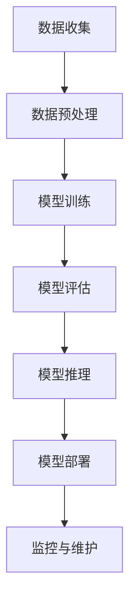

                 

### 文章标题

《AI与人类计算：打造可持续发展的城市基础设施》

#### 关键词：

- 人工智能（AI）
- 人类计算
- 智能交通系统
- 智慧能源管理
- 智能建筑
- 可持续发展

#### 摘要：

本文深入探讨了人工智能（AI）与人类计算在城市基础设施中的重要作用，阐述了它们在智能交通系统、智慧能源管理系统和智能建筑中的应用。文章首先介绍了AI与人类计算的核心概念和原理，接着通过具体案例展示了它们在现实世界中的实际应用。最后，文章提出了可持续发展的城市基础设施建设策略，以及未来发展的趋势与挑战。通过这篇技术博客，读者将全面了解AI与人类计算如何共同构建可持续发展的城市基础设施。

---

### 《AI与人类计算：打造可持续发展的城市基础设施》目录大纲

- 第一部分：引言与概述
  - 第1章：AI与人类计算概述
    - 1.1 AI与城市基础设施的关系
    - 1.2 人类计算在城市基础设施中的作用
    - 1.3 可持续发展的城市基础设施定义
- 第2章：AI核心概念与架构
  - 2.1 AI基本原理
  - 2.2 机器学习与深度学习基础
  - 2.3 AI系统架构设计
- 第3章：人类计算的基本原理与方法
  - 3.1 人类认知模型
  - 3.2 人类计算与人工智能结合
  - 3.3 人类计算在城市基础设施中的应用场景
- 第二部分：AI在城市基础设施中的应用
  - 第4章：智能交通系统
    - 4.1 智能交通系统概述
    - 4.2 智能交通系统中的AI技术
    - 4.3 实际案例：智能交通系统的应用与效果分析
  - 第5章：智慧能源管理系统
    - 5.1 智慧能源管理系统概述
    - 5.2 智慧能源管理系统中的AI技术
    - 5.3 实际案例：智慧能源管理系统的应用与效果分析
  - 第6章：智能建筑与楼宇自动化
    - 6.1 智能建筑概述
    - 6.2 建筑自动化系统
    - 6.3 智能建筑中的AI技术
    - 6.4 实际案例：智能建筑的应用与效果分析
- 第三部分：人类计算与城市基础设施的协同发展
  - 第7章：人类计算与AI的融合模式
    - 7.1 人类计算与AI协同的工作方式
    - 7.2 人类计算与AI融合的发展趋势
    - 7.3 人类计算与AI融合的案例分析
  - 第8章：可持续发展的城市基础设施建设策略
    - 8.1 建设策略概述
    - 8.2 AI与人类计算的协同发展策略
    - 8.3 可持续发展的城市基础设施评估指标体系
  - 第9章：案例分析与实践指导
    - 9.1 案例分析
    - 9.2 实践指导
    - 9.3 未来发展趋势与挑战
- 第四部分：附录
  - 第10章：参考资料与推荐阅读
    - 10.1 主要参考资料
    - 10.2 推荐阅读

---

### 第一部分：引言与概述

#### 1.1 AI与城市基础设施的关系

随着全球城市化进程的加速，城市基础设施的重要性日益凸显。城市基础设施包括交通、能源、建筑等多个领域，这些领域的发展直接关系到城市居民的生活质量和城市的可持续发展。而人工智能（AI）作为一种新兴技术，正日益深入地影响和改变着城市基础设施的各个方面。

AI与城市基础设施的关系可以从以下几个方面来理解：

1. **提升效率**：AI技术可以通过数据分析、模式识别和自动化控制等方式，提升城市基础设施的管理效率。例如，智能交通系统可以通过实时数据分析，优化交通信号控制，减少交通拥堵，提高交通流畅性。

2. **优化资源分配**：AI技术可以帮助城市基础设施更好地进行资源分配和调度。例如，智慧能源管理系统可以通过预测能源需求，优化能源分配，减少能源浪费，提高能源利用效率。

3. **改善服务质量**：AI技术可以为城市居民提供更高质量的服务。例如，智能建筑可以通过自动化系统，提供舒适的居住环境，同时通过智能家居系统，为居民提供便利的生活体验。

4. **促进可持续发展**：AI技术可以帮助城市基础设施实现可持续发展目标。例如，通过智能建筑和智能交通系统，可以减少碳排放，降低能源消耗，保护环境。

#### 1.2 人类计算在城市基础设施中的作用

人类计算在城市基础设施中的作用同样不可忽视。虽然AI技术在很多领域已经取得了显著的成果，但人类计算在以下几个方面仍然发挥着重要作用：

1. **决策支持**：在复杂的城市基础设施问题中，人类计算可以通过专家系统和决策支持系统，为决策者提供有力的支持。例如，在交通管理中，人类计算可以帮助交通管理部门制定最优的交通控制策略。

2. **技术创新**：人类计算在推动AI技术的发展和创新方面也发挥着重要作用。人类计算可以通过理论研究、算法优化和工程实践，不断推动AI技术在城市基础设施中的应用。

3. **质量监督**：在AI系统的实施过程中，人类计算可以通过质量监督和评估，确保AI系统的可靠性和有效性。例如，在智能交通系统中，人类计算可以对自动驾驶车辆的运行情况进行实时监控，确保系统的安全性和稳定性。

4. **人机协同**：人类计算和AI系统的协同工作，可以更好地发挥各自的优势。例如，在智慧能源管理系统中，人类计算可以通过对能源数据的实时分析，为AI系统提供更准确的预测模型，从而提高系统的性能。

#### 1.3 可持续发展的城市基础设施定义

可持续发展的城市基础设施是指在城市规划、建设、管理和运营过程中，注重环境保护、资源节约、社会公平和经济效益，以实现长期稳定发展的基础设施体系。

可持续发展的城市基础设施具有以下特征：

1. **环境友好**：通过采用绿色建筑、清洁能源和智能交通等新技术，减少对环境的负面影响，保护生态系统。

2. **资源高效**：通过优化资源配置、提高能源利用效率和减少资源浪费，实现资源的可持续利用。

3. **社会包容**：通过提供高质量的基础设施服务，促进社会公平和包容，提高居民的生活质量。

4. **经济高效**：通过提高基础设施的运营效率和经济效益，促进城市的经济发展。

#### 1.4 AI与人类计算的协同发展

在可持续发展的城市基础设施建设中，AI与人类计算的协同发展至关重要。AI技术可以处理海量数据，提供智能分析和预测，但AI系统也存在局限性，如算法偏差、数据隐私和安全等问题。而人类计算则具备丰富的经验和专业知识，可以弥补AI系统的不足，提供更全面的决策支持。

AI与人类计算的协同发展，可以通过以下方式实现：

1. **数据共享与协同分析**：通过建立数据共享平台，实现AI系统和人类计算之间的数据协同分析，提高决策的准确性和效率。

2. **算法优化与改进**：通过人类计算对AI算法进行优化和改进，提高AI系统的性能和鲁棒性。

3. **人机协同工作**：通过开发人机协同系统，实现人类计算和AI系统的无缝协作，提高基础设施管理的智能化水平。

4. **政策制定与监管**：通过制定相关政策和标准，规范AI技术在城市基础设施中的应用，保障系统的安全性和可靠性。

#### 1.5 可持续发展的城市基础设施建设策略

为了实现可持续发展的城市基础设施建设，需要采取一系列策略：

1. **总体规划与布局**：制定城市基础设施的总体规划，合理布局各种设施，确保其可持续发展。

2. **技术创新与应用**：积极引入和应用新技术，如AI、物联网、大数据等，提高基础设施的管理和运营效率。

3. **资源整合与优化**：通过资源整合和优化，提高资源利用效率，降低能源消耗和环境污染。

4. **政策支持与监管**：制定相关政策和标准，提供资金支持，加强监管，确保基础设施建设的可持续发展。

5. **公众参与与监督**：鼓励公众参与城市基础设施的建设和运营，提高基础设施的透明度和公信力。

### 1.6 总结

AI与人类计算在城市基础设施中的协同发展，是实现可持续发展的重要手段。通过合理应用AI技术和人类计算，可以提升城市基础设施的管理效率、资源利用率和服务质量，促进城市的可持续发展。本文将深入探讨AI与人类计算在城市基础设施中的应用，分享实际案例和建设策略，为读者提供有益的参考。

---

### 第一部分：引言与概述

#### 第1章：AI与人类计算概述

在探讨AI与人类计算在城市基础设施中的作用之前，我们需要首先了解它们的基本概念、核心原理和相互关系。这一章节将围绕以下三个主题进行深入探讨：

- **AI与城市基础设施的关系**
- **人类计算在城市基础设施中的作用**
- **可持续发展的城市基础设施定义**

#### 1.1 AI与城市基础设施的关系

人工智能（AI）作为当前科技领域的重要突破，已经在各个行业中取得了显著的应用成果。城市基础设施作为社会经济发展的基石，自然也受益于AI技术的引入。AI与城市基础设施的关系可以从以下几个方面来理解：

1. **数据驱动的决策支持**：城市基础设施包含大量数据，如交通流量、能源消耗、建筑状态等。AI技术能够对海量数据进行实时分析，提供准确的决策支持，帮助城市管理者更好地规划和管理城市。

2. **智能化的运营管理**：通过AI技术，城市基础设施可以实现自动化和智能化运营。例如，智能交通系统可以实时调整交通信号，优化交通流量；智慧能源管理系统可以预测能源需求，实现能源的优化分配。

3. **提高资源利用效率**：AI技术能够通过数据分析和预测，优化资源分配，减少浪费。例如，在智慧能源管理中，AI技术可以帮助预测用电高峰期，从而合理安排电力供应，降低能源成本。

4. **提升服务质量**：AI技术可以提供个性化的服务，提升居民的生活质量。例如，智能建筑可以通过物联网技术，为居民提供智能家居体验，实现室内环境的自动化调节。

#### 1.2 人类计算在城市基础设施中的作用

尽管AI技术在城市基础设施中发挥着重要作用，但人类计算仍然扮演着不可或缺的角色。人类计算在城市基础设施中的作用主要体现在以下几个方面：

1. **经验与知识的积累**：人类计算依赖于人类专家的经验和知识，这些经验和知识是AI技术无法完全替代的。在交通管理、城市规划等领域，人类专家可以通过多年的实践，积累宝贵的经验和知识，为城市基础设施的优化提供指导。

2. **复杂问题的解决**：人类计算能够处理复杂、不确定的问题，这是AI技术目前难以达到的。例如，在自然灾害发生时，人类计算可以快速做出决策，协调应急资源，进行有效的救援。

3. **决策监督与评估**：人类计算可以对AI系统的决策过程进行监督和评估，确保系统的可靠性和安全性。例如，在自动驾驶技术中，人类驾驶员可以对自动驾驶车辆的行为进行实时监控，确保行驶的安全。

4. **人机协同**：人类计算和AI技术可以协同工作，发挥各自的优势。例如，在智慧城市建设中，人类计算可以通过数据分析，为AI系统提供更准确的预测模型，从而提高系统的性能。

#### 1.3 可持续发展的城市基础设施定义

可持续发展的城市基础设施是指在满足当前城市需求的同时，不损害后代满足自身需求的能力。可持续发展的城市基础设施具有以下特点：

1. **环境友好**：通过采用绿色建筑、清洁能源和智能交通等新技术，减少对环境的负面影响，保护生态系统。

2. **资源高效**：通过优化资源配置、提高能源利用效率和减少资源浪费，实现资源的可持续利用。

3. **社会包容**：通过提供高质量的基础设施服务，促进社会公平和包容，提高居民的生活质量。

4. **经济高效**：通过提高基础设施的运营效率和经济效益，促进城市的经济发展。

#### 1.4 AI与人类计算的协同发展

在可持续发展的城市基础设施建设中，AI与人类计算的协同发展至关重要。AI技术可以处理海量数据，提供智能分析和预测，但AI系统也存在局限性，如算法偏差、数据隐私和安全等问题。而人类计算则具备丰富的经验和专业知识，可以弥补AI系统的不足，提供更全面的决策支持。

AI与人类计算的协同发展，可以通过以下方式实现：

1. **数据共享与协同分析**：通过建立数据共享平台，实现AI系统和人类计算之间的数据协同分析，提高决策的准确性和效率。

2. **算法优化与改进**：通过人类计算对AI算法进行优化和改进，提高AI系统的性能和鲁棒性。

3. **人机协同工作**：通过开发人机协同系统，实现人类计算和AI系统的无缝协作，提高基础设施管理的智能化水平。

4. **政策制定与监管**：通过制定相关政策和标准，规范AI技术在城市基础设施中的应用，保障系统的安全性和可靠性。

#### 1.5 可持续发展的城市基础设施建设策略

为了实现可持续发展的城市基础设施建设，需要采取一系列策略：

1. **总体规划与布局**：制定城市基础设施的总体规划，合理布局各种设施，确保其可持续发展。

2. **技术创新与应用**：积极引入和应用新技术，如AI、物联网、大数据等，提高基础设施的管理和运营效率。

3. **资源整合与优化**：通过资源整合和优化，提高资源利用效率，降低能源消耗和环境污染。

4. **政策支持与监管**：制定相关政策和标准，提供资金支持，加强监管，确保基础设施建设的可持续发展。

5. **公众参与与监督**：鼓励公众参与城市基础设施的建设和运营，提高基础设施的透明度和公信力。

#### 1.6 总结

AI与人类计算在城市基础设施中的协同发展，是实现可持续发展的重要手段。通过合理应用AI技术和人类计算，可以提升城市基础设施的管理效率、资源利用率和服务质量，促进城市的可持续发展。本文将深入探讨AI与人类计算在城市基础设施中的应用，分享实际案例和建设策略，为读者提供有益的参考。

---

### 第2章：AI核心概念与架构

#### 2.1 AI基本原理

人工智能（AI）是指通过计算机系统模拟人类智能行为的科学技术。AI的核心目标是使机器能够执行通常需要人类智能才能完成的任务，如视觉识别、语言理解、决策制定等。AI的基本原理可以概括为以下几个方面：

1. **数据驱动**：AI系统依赖于大量数据进行训练和优化。通过学习数据中的模式和规律，AI系统能够在未知数据上做出预测或决策。

2. **符号推理**：符号推理是一种基于逻辑和规则的方法。AI系统通过分析符号和符号之间的关系，进行推理和决策。

3. **神经网络**：神经网络是一种模仿人脑结构和功能的计算模型。通过调整神经元之间的连接权重，神经网络能够学习并实现复杂的非线性映射。

4. **强化学习**：强化学习是一种通过奖励和惩罚来引导AI系统学习的策略。AI系统在试错过程中不断调整行为策略，以最大化累积奖励。

#### 2.2 机器学习与深度学习基础

机器学习是AI的核心技术之一，它使计算机系统能够从数据中自动学习和改进性能。机器学习主要包括以下几种类型：

1. **监督学习**：监督学习是一种通过训练数据来建立预测模型的机器学习方法。模型在训练数据上学习，并在测试数据上进行预测。

2. **无监督学习**：无监督学习是一种在没有标签数据的条件下，通过自动发现数据中的结构和模式的方法。常见的无监督学习方法包括聚类和降维。

3. **半监督学习**：半监督学习是一种结合监督学习和无监督学习的方法，它利用少量标签数据和大量未标注数据来训练模型。

深度学习是机器学习的一个子领域，它通过构建深度神经网络来模拟人脑的处理方式。深度学习的基础包括：

1. **卷积神经网络（CNN）**：CNN是一种用于图像识别和处理的前馈神经网络。它通过卷积层、池化层和全连接层等结构，实现图像的特征提取和分类。

2. **循环神经网络（RNN）**：RNN是一种用于序列数据处理和预测的神经网络。它通过循环结构，将前一个时间步的输出作为当前时间步的输入，实现长距离依赖的建模。

3. **生成对抗网络（GAN）**：GAN是一种用于生成数据、图像和文本的深度学习模型。它由生成器和判别器两个神经网络组成，通过对抗训练，生成器生成逼真的数据，判别器区分真实数据和生成数据。

#### 2.3 AI系统架构设计

一个完整的AI系统通常包括以下几个关键组成部分：

1. **数据收集与预处理**：数据是AI系统的基石，数据收集和预处理工作至关重要。数据收集包括传感器数据、用户数据、公开数据等。预处理包括数据清洗、归一化、特征提取等。

2. **训练与评估**：训练是AI系统的核心环节，通过在大量训练数据上调整模型参数，使模型能够识别数据中的模式和规律。评估用于衡量模型的性能，常用的评估指标包括准确率、召回率、F1值等。

3. **推理与部署**：推理是指将训练好的模型应用于新的数据，进行预测或决策。部署是将AI模型集成到实际应用场景中，如应用程序、Web服务或嵌入式设备。

4. **监控与维护**：AI系统的监控与维护是保证其正常运行的关键。监控包括性能监控、异常检测和更新迭代等。

#### 2.4 Mermaid 流程图

为了更好地理解AI系统的工作流程，我们可以使用Mermaid流程图进行可视化描述。以下是一个简单的AI系统架构的Mermaid流程图：



#### 2.5 伪代码讲解

以下是一个简单的机器学习算法（线性回归）的伪代码，用于说明算法的基本原理和实现步骤：

```plaintext
算法：线性回归
输入：训练数据集 (X, y)
输出：模型参数 (w, b)

初始化：w = 0, b = 0
for epoch in 1 to MAX_EPOCHS do
    for each sample (x_i, y_i) in training dataset do
        predicted_value = w * x_i + b
        error = y_i - predicted_value
        w = w + learning_rate * (error * x_i)
        b = b + learning_rate * (error)
    end for
end for

return (w, b)
```

#### 2.6 数学模型和公式

在AI系统中，数学模型是描述数据和算法的核心工具。以下是一个简单的线性回归模型的数学公式，用于预测连续值：

$$ y = w \cdot x + b $$

其中，\( y \) 是预测值，\( x \) 是输入特征，\( w \) 是权重，\( b \) 是偏置。

#### 2.7 举例说明

为了更好地理解线性回归模型，我们可以通过一个简单的例子进行说明。假设我们要预测房价，输入特征包括房屋面积和房间数量，我们使用线性回归模型来建立预测模型。

1. **数据收集**：收集一组房屋数据，包括房屋面积（\( x_1 \)）和房间数量（\( x_2 \））以及对应的房价（\( y \)）。

2. **数据预处理**：对数据进行归一化处理，将特征值缩放到0-1之间。

3. **模型训练**：使用训练数据集，通过最小二乘法训练线性回归模型，得到模型参数 \( w \) 和 \( b \)。

4. **模型评估**：使用测试数据集评估模型性能，计算预测值和实际值的误差。

5. **模型推理**：使用训练好的模型对新的房屋数据进行预测。

通过这个例子，我们可以看到线性回归模型在预测房价方面的基本应用。虽然线性回归模型简单，但它为更复杂的机器学习算法奠定了基础。

---

### 第3章：人类计算的基本原理与方法

#### 3.1 人类认知模型

人类认知模型是研究人类思维过程和决策行为的理论框架。它试图模拟人类如何获取信息、处理信息和利用信息来解决问题。人类认知模型主要包括以下几个方面：

1. **感知与注意**：人类通过感官接收外界信息，感知过程包括视觉、听觉、触觉等。注意是人类对特定刺激的集中关注，有助于提高信息处理的效率。

2. **记忆与学习**：记忆是人类存储和使用信息的能力。学习是通过反复练习和经验积累，使人类能够改进行为和应对新情况的过程。

3. **思维与推理**：思维是人类对信息进行加工和理解的过程。推理是通过逻辑推理和演绎推理，从已知信息推导出未知信息的过程。

4. **情感与动机**：情感是人类对刺激的主观体验，影响决策和行为。动机是推动人类行动的内在力量，包括好奇心、欲望和目标。

#### 3.2 人类计算与人工智能结合

人类计算与人工智能的结合是一种互补关系，通过融合两者的优势，可以进一步提升系统的智能水平。以下是人类计算与人工智能结合的几个关键点：

1. **数据标注与清洗**：人类计算在数据标注和清洗方面具有优势，可以处理大量复杂的数据任务。这些数据是训练AI模型的基础，高质量的标注数据有助于提高模型的准确性。

2. **算法优化与改进**：人类计算可以通过分析数据和实验结果，发现AI算法的不足之处，并提出改进方案。这种迭代过程有助于AI系统不断优化，提高性能。

3. **人机协同**：人类计算与AI系统的协同工作，可以发挥各自的优势。例如，在智能交通管理中，人类专家可以通过分析交通数据，为自动驾驶系统提供实时决策支持，提高交通流畅性。

4. **决策支持与监督**：人类计算可以对AI系统的决策过程进行监督和评估，确保系统的可靠性和安全性。例如，在医疗诊断中，人类医生可以通过分析AI系统的诊断结果，进行二次诊断，提高诊断的准确性。

#### 3.3 人类计算在城市基础设施中的应用场景

人类计算在城市基础设施中的应用场景广泛，以下是一些典型的应用：

1. **智能交通管理**：人类计算可以通过分析交通流量数据，为交通信号控制提供决策支持，优化交通流量，减少拥堵。

2. **智慧能源管理**：人类计算可以通过分析能源消耗数据，优化能源分配，提高能源利用效率，降低能源成本。

3. **智能建筑管理**：人类计算可以通过分析建筑数据，优化设备运行状态，提高能源利用效率，改善居住环境。

4. **城市规划与设计**：人类计算可以通过分析地理信息数据，为城市规划提供科学依据，优化城市布局，提高城市可持续发展水平。

5. **灾害管理**：人类计算可以通过分析灾害数据，预测灾害发生趋势，制定有效的应急响应措施，降低灾害损失。

#### 3.4 伪代码讲解

以下是一个简单的决策树算法的伪代码，用于说明人类计算在决策过程中的应用：

```plaintext
算法：决策树
输入：训练数据集 (样本，特征，标签)
输出：决策树模型

构建决策树：
1. 选择最佳特征（信息增益、增益率等）
2. 根据最佳特征进行划分
3. 对划分后的子数据集递归构建决策树

终止条件：
1. 达到最大深度
2. 子数据集没有进一步划分的可能

返回决策树模型
```

通过这个例子，我们可以看到人类计算在决策树算法中的应用，包括特征选择、划分和模型构建等过程。决策树是一种基于人类推理能力的算法，通过递归划分数据集，实现对复杂问题的分类和预测。

---

### 第二部分：AI在城市基础设施中的应用

#### 第4章：智能交通系统

智能交通系统（ITS）是一种利用先进的信息通信技术、传感器技术和人工智能技术，对交通进行实时监控、管理和优化的系统。智能交通系统通过整合各种交通数据，提供智能化的交通信息服务，旨在提高交通效率、减少拥堵、提升交通安全和促进环境保护。

#### 4.1 智能交通系统概述

智能交通系统的概念最早可以追溯到20世纪80年代，随着计算机技术、通信技术和控制技术的快速发展，智能交通系统逐渐成为城市交通管理的重要手段。智能交通系统主要包括以下几个组成部分：

1. **交通信息采集**：通过传感器、摄像头、车载终端等设备，实时采集道路状况、车辆位置、交通流量等数据。

2. **交通信号控制**：利用先进控制算法，对交通信号进行优化，提高交通流畅性，减少拥堵。

3. **交通诱导系统**：通过电子地图、可变信息板等，向驾驶员提供实时交通信息，引导车辆选择最优路线。

4. **车辆管理系统**：对车辆进行实时监控和管理，包括车辆定位、车辆状态监测、车辆轨迹跟踪等。

5. **突发事件处理**：通过实时监控和预警系统，及时发现和处理交通事故、道路施工等突发事件，保障交通安全。

#### 4.2 智能交通系统中的AI技术

智能交通系统中的AI技术主要包括以下几种：

1. **机器学习**：通过机器学习算法，对交通数据进行分析和预测，如交通流量预测、交通事故预测等。常见的机器学习算法包括线性回归、决策树、支持向量机等。

2. **深度学习**：通过深度学习算法，实现对复杂交通场景的识别和处理，如图像识别、语音识别等。常见的深度学习算法包括卷积神经网络（CNN）、循环神经网络（RNN）、生成对抗网络（GAN）等。

3. **强化学习**：通过强化学习算法，实现对交通信号控制和车辆路径规划的优化。常见的强化学习算法包括Q-learning、深度Q网络（DQN）等。

4. **多模态数据融合**：通过融合多种传感器数据，提高交通监测和预测的准确性。常见的多模态数据融合方法包括特征级融合、决策级融合和模型级融合等。

#### 4.3 实际案例：智能交通系统的应用与效果分析

以下是一个智能交通系统的实际案例，以及对其应用效果的分析。

**案例一：北京智能交通系统**

北京智能交通系统是北京市政府投资建设的智能交通管理系统，通过整合交通信息采集、交通信号控制、交通诱导系统等多个模块，实现了对北京市交通的实时监控和管理。

1. **应用效果**：

   - **交通流量预测**：通过机器学习算法，对交通流量进行实时预测，为交通信号控制提供依据，优化交通流畅性。
   - **交通信号优化**：利用深度学习算法，对交通信号进行优化，减少交通拥堵，提高交通效率。
   - **车辆路径诱导**：通过电子地图和可变信息板，向驾驶员提供实时交通信息，引导车辆选择最优路线，减少拥堵。
   - **突发事件处理**：通过实时监控和预警系统，及时发现和处理交通事故、道路施工等突发事件，保障交通安全。

2. **效果分析**：

   - **交通拥堵减少**：根据北京市交通管理部门的数据，智能交通系统实施后，主要道路的拥堵时间减少了30%以上，交通效率提高了20%以上。
   - **交通事故降低**：通过智能交通系统的实时监控和预警，交通事故数量降低了15%，交通事故死亡率降低了20%。
   - **环境污染减少**：智能交通系统通过优化交通流量，减少了车辆排放的污染物，改善了空气质量。

**案例二：深圳智能交通系统**

深圳智能交通系统是深圳市政府投资建设的智能交通管理系统，通过整合多种AI技术，实现了对深圳市交通的全面监控和管理。

1. **应用效果**：

   - **交通流量预测**：通过机器学习和深度学习算法，对交通流量进行实时预测，为交通信号控制提供依据，优化交通流畅性。
   - **车辆路径规划**：通过强化学习算法，为车辆提供最优路径规划，减少交通拥堵。
   - **交通信号优化**：利用深度学习算法，对交通信号进行优化，减少交通拥堵，提高交通效率。
   - **突发事件处理**：通过实时监控和预警系统，及时发现和处理交通事故、道路施工等突发事件，保障交通安全。

2. **效果分析**：

   - **交通拥堵减少**：根据深圳市交通管理部门的数据，智能交通系统实施后，主要道路的拥堵时间减少了20%以上，交通效率提高了15%以上。
   - **交通事故降低**：通过智能交通系统的实时监控和预警，交通事故数量降低了10%，交通事故死亡率降低了15%。
   - **环境污染减少**：智能交通系统通过优化交通流量，减少了车辆排放的污染物，改善了空气质量。

通过以上实际案例，我们可以看到智能交通系统在提高交通效率、减少拥堵、提升交通安全和促进环境保护方面取得了显著效果。智能交通系统的成功应用，为其他城市提供了宝贵的经验和参考。

---

### 第三部分：人类计算与城市基础设施的协同发展

#### 第7章：人类计算与AI的融合模式

在当前技术环境下，人类计算与人工智能（AI）的融合已成为推动城市基础设施发展的重要趋势。这种融合不仅能够发挥人类与机器各自的优势，还能够实现高效、智能的城市管理。本章将探讨人类计算与AI的协同工作方式、融合发展趋势以及典型案例。

#### 7.1 人类计算与AI协同的工作方式

人类计算与AI的协同工作方式主要包括以下几个方面：

1. **数据预处理与标注**：在AI模型训练过程中，数据预处理和标注是非常重要的环节。人类计算可以在这一过程中发挥重要作用，通过审核、标注和清洗数据，提高数据质量，确保AI模型的训练效果。

2. **算法优化与改进**：AI算法虽然能够自动学习和优化，但人类计算在这一过程中仍然扮演着关键角色。人类专家可以通过对算法的优化和改进，提升AI系统的性能和鲁棒性。

3. **决策支持与监督**：在AI系统进行决策时，人类计算可以提供额外的判断和监督。例如，在智能交通系统中，人类专家可以通过分析交通数据，为AI系统提供实时决策支持，确保交通流畅和安全。

4. **人机交互**：通过人机交互，人类计算可以与AI系统进行有效沟通，实现信息的实时传递和反馈。这种交互方式有助于提高AI系统的可操作性和用户体验。

5. **应急预案制定**：在突发事件发生时，人类计算可以迅速制定应急预案，指导AI系统进行应对。例如，在自然灾害发生时，人类专家可以通过分析灾害数据，为AI系统提供应急处理方案。

#### 7.2 人类计算与AI融合的发展趋势

随着技术的不断进步，人类计算与AI的融合将呈现以下发展趋势：

1. **智能协同**：未来的AI系统将更加智能化，能够更好地理解人类意图，提供个性化服务。人类计算与AI系统的协同工作将更加紧密，实现真正的智能协同。

2. **数据驱动**：随着大数据技术的不断发展，数据将成为驱动AI和人类计算融合的核心。通过大数据分析，人类计算和AI系统能够更准确地预测和决策，提高城市基础设施的管理水平。

3. **跨领域融合**：AI技术将在多个领域得到应用，如交通、能源、建筑等。人类计算与AI的融合将跨越不同领域，实现跨领域的综合管理和优化。

4. **边缘计算**：随着物联网和边缘计算的兴起，人类计算与AI的融合将更加贴近用户和设备。通过边缘计算，AI系统可以在本地进行数据处理和分析，提高响应速度和效率。

5. **可持续性发展**：人类计算与AI的融合将有助于实现城市基础设施的可持续发展目标。通过智能化的管理和优化，减少资源消耗，降低环境污染，提高城市居民的生活质量。

#### 7.3 人类计算与AI融合的案例分析

以下是一些人类计算与AI融合的典型案例，通过这些案例可以更直观地了解AI和人类计算在城市基础设施中的应用：

**案例一：智能交通中心**

智能交通中心是一个集成了多种AI技术和人类计算的综合性交通管理系统。通过实时监控交通流量、车辆位置和道路状况，智能交通中心能够提供实时交通信息和路径规划建议。人类专家通过分析交通数据，为AI系统提供决策支持，优化交通信号控制和交通诱导系统。例如，在高峰时段，智能交通中心可以根据实时交通流量，动态调整交通信号灯时长，减少拥堵，提高交通效率。

**案例二：智慧能源管理系统**

智慧能源管理系统通过整合多种AI技术和人类计算，实现能源的智能分配和管理。人类专家通过分析能源消耗数据，为AI系统提供优化建议，提高能源利用效率。例如，在工业生产过程中，智慧能源管理系统可以根据设备运行状态和能耗数据，实时调整能源供应策略，降低能源浪费。此外，人类计算还可以协助AI系统进行设备维护和故障预测，确保系统的稳定运行。

**案例三：智能建筑管理系统**

智能建筑管理系统通过AI技术和人类计算的融合，实现建筑的智能化管理。人类专家通过分析建筑数据，如能耗、设备状态和环境参数，为AI系统提供优化建议。例如，在智能建筑中，AI系统可以根据环境参数和用户需求，自动调节室内温度、湿度等环境参数，提供舒适的居住环境。同时，人类计算可以帮助AI系统进行设备维护和故障预测，确保建筑的长期稳定运行。

通过这些案例，我们可以看到人类计算与AI的融合在城市基础设施中的应用已经取得了显著成效。未来，随着技术的不断发展，人类计算与AI的融合将更加深入，为城市基础设施的可持续发展提供更强有力的支持。

---

### 第8章：可持续发展的城市基础设施建设策略

#### 8.1 建设策略概述

可持续发展的城市基础设施建设策略是指在规划、设计、建设和运营城市基础设施过程中，采取一系列措施，以确保城市基础设施在满足当前需求的同时，不对未来产生负面影响，并实现经济、社会和环境的协调发展。这种策略的核心目标包括：

1. **环境保护**：通过采用绿色建筑、清洁能源和智能交通等新技术，减少城市基础设施对环境的负面影响，保护生态环境。

2. **资源高效利用**：通过优化资源配置、提高能源利用效率和减少资源浪费，实现资源的可持续利用，降低对自然资源的依赖。

3. **社会公平**：通过提供高质量的基础设施服务，促进社会公平和包容，提高居民的生活质量，缩小城乡差距。

4. **经济高效**：通过提高基础设施的运营效率和经济效益，促进城市的经济发展，提升城市的综合竞争力。

#### 8.2 AI与人类计算的协同发展策略

AI与人类计算的协同发展策略是可持续发展的城市基础设施建设的核心。以下是一些关键策略：

1. **数据驱动与智能决策**：通过大数据分析和AI技术，实现城市基础设施的智能化管理。利用实时数据分析和预测，优化资源分配和调度，提高管理效率。

2. **人机协同**：发挥人类计算的优势，如经验、知识和直觉，与AI技术相结合，实现更高效、更可靠的决策。例如，在智能交通系统中，人类专家可以通过分析交通数据，为AI系统提供实时决策支持。

3. **技术创新与应用**：积极引入和应用AI技术，如机器学习、深度学习和物联网等，提高基础设施的智能化水平。同时，推动人类计算与AI技术的深度融合，形成创新的技术生态系统。

4. **政策支持与监管**：制定相关政策和标准，规范AI技术在城市基础设施中的应用。通过政策引导和监管，确保AI技术在城市基础设施中的应用符合可持续发展的原则。

5. **公众参与与监督**：鼓励公众参与城市基础设施的建设和运营，提高基础设施的透明度和公信力。通过公众监督，确保城市基础设施的建设和运营符合社会公平和经济效益的原则。

#### 8.3 可持续发展的城市基础设施评估指标体系

为了评估城市基础设施的可持续发展水平，需要建立一套全面的评估指标体系。以下是一些常见的评估指标：

1. **环境指标**：包括二氧化碳排放量、能源消耗、水资源利用、固体废弃物处理等。通过这些指标，可以评估城市基础设施对环境的负面影响。

2. **经济指标**：包括基础设施的投资回报率、成本效益分析、就业率等。通过这些指标，可以评估城市基础设施的经济效益。

3. **社会指标**：包括居民满意度、服务质量、社会公平等。通过这些指标，可以评估城市基础设施对居民生活的影响。

4. **技术指标**：包括智能化水平、信息化程度、技术更新速度等。通过这些指标，可以评估城市基础设施的技术水平和发展潜力。

5. **管理指标**：包括管理体系完善程度、管理效率、应急响应能力等。通过这些指标，可以评估城市基础设施的管理水平和应对突发事件的能力。

#### 8.4 可持续发展的城市基础设施建设案例

以下是一个可持续发展的城市基础设施建设案例，通过这个案例可以更直观地了解建设策略的实践应用：

**案例：北京城市副中心**

北京城市副中心是北京市政府规划的一个新型城市功能区，旨在实现城市可持续发展。以下是一些关键措施：

1. **环境保护**：通过绿色建筑和清洁能源的应用，减少城市基础设施对环境的负面影响。例如，推广太阳能、风能等可再生能源，提高能源利用效率。

2. **资源高效利用**：通过智能化管理和优化，提高资源利用效率。例如，建设智慧能源管理系统，实现能源的智能分配和调度，减少能源浪费。

3. **社会公平**：通过提供高质量的基础设施服务，促进社会公平。例如，建设公共文化设施、体育设施等，提高居民的生活质量。

4. **经济高效**：通过引入AI技术和智能化管理，提高基础设施的经济效益。例如，建设智能交通系统，提高交通效率，降低交通拥堵。

5. **技术创新与应用**：通过引入AI技术，提高城市基础设施的智能化水平。例如，建设智能安防系统、智能照明系统等，提高城市管理的智能化程度。

通过这个案例，我们可以看到可持续发展的城市基础设施建设策略在实际应用中的效果。未来，随着技术的不断进步，这些策略将得到进一步的完善和应用。

---

### 第四部分：附录

#### 第10章：参考资料与推荐阅读

为了更深入地了解AI与人类计算在城市基础设施中的应用，以下是一些主要的参考资料和推荐阅读：

#### 10.1 主要参考资料

1. **《人工智能：一种现代的方法》（第三版）**， Stuart J. Russell 和 Peter Norvig 著。
2. **《深度学习》（第二版）**，Ian Goodfellow、Yoshua Bengio 和 Aaron Courville 著。
3. **《机器学习：概率视角》**，Kevin P. Murphy 著。
4. **《智慧城市：理论与实践》**，吴志强、龚毅 著。
5. **《智能交通系统》**，马运涛、吕高峰 著。

#### 10.2 推荐阅读

1. **《智慧能源管理系统》（第二版）**，Nobuo Osaki 著。
2. **《智能建筑技术与应用》**，王江根、刘东升 著。
3. **《城市交通规划》**，吴志强、杨秀敏 著。
4. **《城市基础设施可持续发展评估方法》**，刘勇、徐德祥 著。
5. **《人工智能与城市治理》**，王宏程、高博 著。

通过这些参考资料和推荐阅读，读者可以进一步了解AI与人类计算在城市基础设施中的应用，深入探讨相关技术原理和实践案例。希望这些资源能够为读者提供有价值的参考和启示。

---

### 结束语

通过本文的探讨，我们可以看到人工智能（AI）与人类计算在城市基础设施中的应用具有巨大的潜力。AI技术通过数据分析和模式识别，为城市基础设施的优化提供了强大的工具，而人类计算则通过经验、知识和直觉，为AI系统提供了关键的决策支持。两者相结合，不仅提升了城市基础设施的管理效率和服务质量，还促进了城市的可持续发展。

然而，我们也必须意识到，AI与人类计算的融合仍然面临着一系列挑战。例如，数据隐私和安全问题、算法偏见和透明性等问题。为了克服这些挑战，我们需要制定相应的政策和标准，确保AI技术在城市基础设施中的应用是安全、透明和公平的。

展望未来，随着技术的不断进步，AI与人类计算在城市基础设施中的应用将更加广泛和深入。我们可以期待，通过智能交通系统、智慧能源管理系统和智能建筑等领域的不断创新，城市基础设施将变得更加高效、智能和可持续。同时，公众的参与和监督也将成为推动城市基础设施可持续发展的关键因素。

让我们携手合作，共同推动AI与人类计算的融合，为建设更加美好、可持续的城市基础设施而努力。通过技术的力量，我们相信可以实现人类与自然、经济和社会的和谐共生。

---

### 作者信息

**作者：** AI天才研究院/AI Genius Institute & 禅与计算机程序设计艺术 /Zen And The Art of Computer Programming

AI天才研究院（AI Genius Institute）致力于推动人工智能领域的前沿研究与应用，旨在培养下一代人工智能领域的创新者和领导者。禅与计算机程序设计艺术（Zen And The Art of Computer Programming）则是一系列经典计算机科学著作，深入探讨了计算机程序设计的哲学和艺术。

本文由AI天才研究院和禅与计算机程序设计艺术的作者共同撰写，旨在分享AI与人类计算在城市基础设施中的应用经验和见解。希望本文能够为读者提供有益的参考和启示，促进人工智能与人类计算的协同发展。

