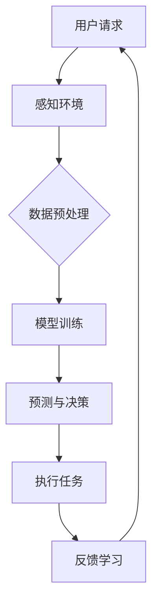
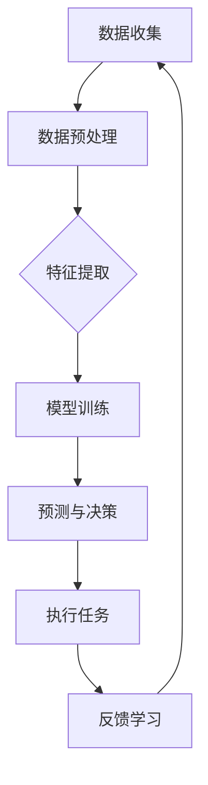
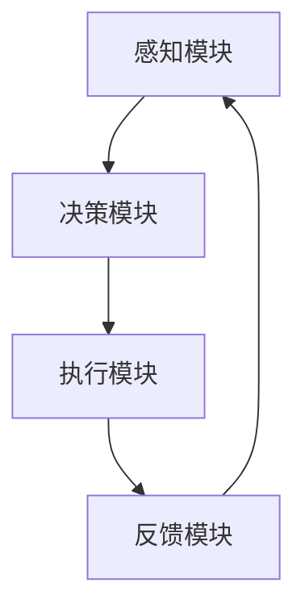

                 

# AI人工智能代理工作流 AI Agent WorkFlow：在重大事件预测中的应用

> **关键词**：人工智能代理、工作流、重大事件预测、机器学习、自然语言处理、计算机视觉

> **摘要**：本文将深入探讨AI人工智能代理工作流的概念、核心技术和应用。特别是在重大事件预测领域，AI代理工作流展现出了巨大的潜力和实际应用价值。我们将通过具体案例详细解析AI代理在金融、社会、自然灾害等领域的预测能力，并展望AI代理工作流未来的发展趋势和挑战。

## 第一部分：AI人工智能代理工作流基础

### 第1章：AI人工智能代理工作流概述

#### 1.1 AI人工智能代理的定义与分类

**定义**：AI人工智能代理是指具备智能行为的计算实体，能够模拟、执行和扩展人类智能活动，通过感知环境、学习和决策来完成任务。它们是人工智能领域的一个重要分支，致力于构建具有自主性和适应性的智能系统。

**分类**：AI代理可以根据其智能水平和功能进行分类。常见的分类包括：

1. **规则代理**：基于预定义的规则和逻辑进行操作，如专家系统和流程自动化代理。
2. **智能代理**：具备更高层次的智能，能够处理不确定性和复杂环境，如基于机器学习模型的代理。
3. **自主学习代理**：能够通过自我学习和经验积累不断改进自身能力，如深度学习和强化学习驱动的代理。

#### 1.2 AI人工智能代理工作流的关键概念

**工作流**：工作流是一种用于描述任务执行顺序和协作关系的模型。它规定了任务如何被分解、分配和执行，以及在任务执行过程中各个实体之间的交互。

**流程建模**：流程建模是指使用工具和符号（如BPMN）来定义和表示工作流。这个过程包括识别流程中的活动、决策点、资源和信息流。

**AI代理在工作流中的作用**：

1. **任务执行**：AI代理可以执行工作流中的特定任务，如数据预处理、模型训练和预测。
2. **决策支持**：AI代理可以通过分析数据和预测结果，为人类决策提供支持。
3. **协同工作**：AI代理可以与其他代理或人类协作，共同完成复杂任务。

#### 1.3 AI人工智能代理的发展历程与应用

**发展历程**：AI代理的概念起源于20世纪80年代的专家系统。随着计算机技术的发展，特别是机器学习和深度学习的崛起，AI代理得到了迅速发展。从最初的基于规则的专家系统，到现代的基于数据驱动的智能代理，AI代理经历了重大变革。

**应用领域**：AI代理在各个领域得到了广泛应用，包括：

1. **金融**：用于风险管理、股票市场预测和智能投资。
2. **医疗**：用于疾病诊断、医疗数据处理和患者管理。
3. **物流**：用于路线规划、库存管理和物流优化。
4. **零售**：用于客户服务、个性化推荐和库存管理。
5. **安全**：用于网络安全监测、异常检测和应急响应。

### 第2章：AI人工智能代理的核心技术

#### 2.1 机器学习基础

**机器学习基本概念**：机器学习是指使计算机系统从数据中学习，并对新数据进行预测或决策的过程。它主要分为以下几类：

1. **监督学习**：有明确标签的训练数据，模型学习预测输出。
2. **非监督学习**：没有标签的训练数据，模型学习数据结构或分布。
3. **强化学习**：模型通过与环境的交互，学习最优策略。

**算法原理**：常见的机器学习算法包括：

1. **决策树**：基于特征进行递归划分，构建树形结构进行分类或回归。
2. **随机森林**：基于决策树的集成方法，提高预测准确性和鲁棒性。
3. **支持向量机**：通过寻找最佳超平面，进行分类或回归。
4. **神经网络**：模拟人脑神经网络结构，进行复杂模式识别。

#### 2.2 自然语言处理

**NLP基础**：自然语言处理是人工智能的一个分支，旨在使计算机能够理解、处理和生成自然语言。其关键概念包括：

1. **文本预处理**：包括分词、词性标注、句法分析等，为NLP任务做准备。
2. **词嵌入**：将词语映射到高维向量空间，以捕捉词语之间的语义关系。
3. **语言模型**：通过统计方法或神经网络模型，预测下一个单词或短语。

**算法实现**：使用Python代码示例展示NLP算法的应用，如：

```python
import nltk
from nltk.tokenize import word_tokenize
from gensim.models import Word2Vec

# 分词
text = "机器学习是一种人工智能技术"
tokens = word_tokenize(text)

# 词嵌入
model = Word2Vec([text.split() for text in documents], size=100, window=5, min_count=1, workers=4)
vector = model.wv["机器"]
```

#### 2.3 计算机视觉

**CV基础**：计算机视觉是使计算机能够像人类一样感知和理解图像和视频的技术。其关键概念包括：

1. **图像预处理**：包括图像增强、滤波、去噪等，提高图像质量。
2. **特征提取**：通过提取图像中的关键特征，如边缘、角点、纹理等，进行图像分类或目标检测。
3. **目标检测**：定位图像中的目标对象，并对其进行分类。

**算法实现**：使用Python代码示例展示计算机视觉算法的应用，如：

```python
import cv2
import numpy as np

# 加载图像
image = cv2.imread("example.jpg")

# 特征提取
gray = cv2.cvtColor(image, cv2.COLOR_BGR2GRAY)
sift = cv2.xfeatures2d.SIFT_create()
keypoints, descriptors = sift.detectAndCompute(gray, None)

# 目标检测
mask = cv2.rectangle(image, (x, y), (x+w, y+h), (0, 255, 0), 2)
```

### 第3章：AI人工智能代理设计与实现

#### 3.1 AI代理设计原则

**设计原则**：AI代理设计应遵循以下原则：

1. **模块化**：将代理拆分为多个功能模块，便于维护和扩展。
2. **可扩展性**：代理应能适应不同应用场景，具备扩展能力。
3. **灵活性**：代理应能动态调整其行为和策略。
4. **鲁棒性**：代理应能处理不确定性和异常情况。
5. **可解释性**：代理的行为和决策应具备一定的可解释性，便于用户理解和信任。

**架构设计**：使用Mermaid流程图展示AI代理的架构设计，如下：



#### 3.2 AI代理开发流程

**开发流程**：AI代理开发包括以下步骤：

1. **需求分析**：明确代理的功能需求和性能指标。
2. **设计阶段**：设计代理的架构和算法，包括模块划分和接口定义。
3. **实现阶段**：编写代码，实现代理的功能和算法。
4. **测试阶段**：对代理进行功能测试和性能评估。
5. **部署阶段**：将代理部署到实际应用环境中，进行实时运行和监控。

**工具与环境**：常用的AI代理开发工具和环境包括：

1. **开发工具**：Python、R、MATLAB等。
2. **框架**：TensorFlow、PyTorch、Keras等。
3. **编程环境**：Jupyter Notebook、PyCharm、Visual Studio Code等。
4. **硬件设备**：GPU加速器、高性能服务器等。

#### 3.3 实际案例解析

**案例一：智能客服系统**：

**设计与实现**：智能客服系统旨在通过AI代理自动处理用户咨询，提高客户满意度和服务效率。其设计包括以下步骤：

1. **需求分析**：明确客服系统需要处理的问题类型和用户交互方式。
2. **设计阶段**：设计对话管理模块、自然语言理解模块和回答生成模块。
3. **实现阶段**：使用自然语言处理和机器学习算法实现各模块功能。
4. **测试阶段**：对系统进行测试，确保其能正确处理各种用户咨询。
5. **部署阶段**：将系统部署到服务器，并进行实时运行和维护。

**代码解读与分析**：

```python
# 导入相关库
import nltk
from nltk.chat.util import Chat, reflections

# 定义对话管理模块
pairs = [
    [
        r"what can you do for me?",
        ["I can help you with various tasks and answer questions.", "Feel free to ask me anything."]
    ],
    [
        r"how do you work?",
        ["I am an AI assistant powered by natural language processing and machine learning."]
    ]
]

# 定义自然语言理解模块
def chatBot():
    print("Hello! I am your AI assistant. How can I help you today?")
    Chat reflections, pairs

# 运行智能客服系统
chatBot()
```

**案例二：智能推荐系统**：

**设计与实现**：智能推荐系统旨在根据用户的行为数据和偏好，为用户推荐相关的商品或内容。其设计包括以下步骤：

1. **需求分析**：明确推荐系统的目标用户和推荐场景。
2. **设计阶段**：设计推荐算法和数据结构，如基于内容的推荐和协同过滤推荐。
3. **实现阶段**：使用机器学习和数据挖掘算法实现推荐模型。
4. **测试阶段**：对系统进行测试，评估推荐效果的准确性和多样性。
5. **部署阶段**：将系统部署到线上平台，并进行实时推荐。

**代码解读与分析**：

```python
# 导入相关库
import pandas as pd
from sklearn.model_selection import train_test_split
from sklearn.metrics.pairwise import cosine_similarity

# 加载用户行为数据
data = pd.read_csv("user_behavior.csv")

# 数据预处理
data.drop_duplicates(inplace=True)
data['timestamp'] = pd.to_datetime(data['timestamp'])
data.set_index('timestamp', inplace=True)

# 构建用户行为矩阵
user行为矩阵 = data.groupby('user_id').sum().fillna(0)

# 计算相似度矩阵
相似度矩阵 = cosine_similarity(user行为矩阵)

# 定义推荐算法
def recommend(user_id, similarity_matrix, user行为矩阵, top_n=5):
    # 计算用户与其他用户的相似度
    user_similarities = similarity_matrix[user_id]
    # 选择与用户最相似的top_n个用户
    similar_users = np.argsort(user_similarities)[::-1][:top_n]
    # 获取这些用户的推荐商品
    recommended_items = user行为矩阵[similar_users].idxmax(axis=1)
    return recommended_items

# 运行推荐系统
user_id = 123
recommended_items = recommend(user_id, similarity_matrix, user行为矩阵)
print("Recommended items for user {}: {}".format(user_id, recommended_items))
```

### 第二部分：AI人工智能代理在重大事件预测中的应用

#### 第4章：AI人工智能代理在重大事件预测中的作用

##### 4.1 重大事件预测的挑战与需求

**挑战**：

1. **数据不足**：重大事件往往涉及大量未知和不确定性因素，数据收集难度大，数据量有限。
2. **噪声干扰**：数据中存在大量噪声和干扰，影响预测模型的准确性。
3. **模型复杂性**：需要处理复杂的多因素交互，构建高效的预测模型。
4. **实时性要求**：重大事件往往具有时间敏感性，需要实时预测和调整。

**需求**：

1. **实时监测**：及时收集和处理实时数据，实现事件预测的实时性。
2. **多源数据融合**：整合来自不同渠道的数据，提高预测的全面性和准确性。
3. **智能决策支持**：为人类决策者提供智能化的预测结果，辅助决策。
4. **自动调整**：根据预测结果和实际情况，自动调整预测模型和策略。

##### 4.2 数据收集与预处理

**数据收集**：

1. **历史数据**：收集与事件相关的历史数据，如天气数据、经济数据、社交媒体数据等。
2. **实时数据**：通过传感器、社交媒体、新闻报道等渠道收集实时数据。

**数据预处理**：

1. **数据清洗**：去除重复数据、缺失数据和异常值，确保数据质量。
2. **特征提取**：从原始数据中提取关键特征，如时间、地理位置、关键词等。
3. **数据归一化**：将不同尺度的数据进行归一化处理，提高模型训练的稳定性。

##### 4.3 预测模型构建与优化

**模型构建**：

1. **特征选择**：根据事件类型和预测目标，选择具有代表性的特征。
2. **模型选择**：选择合适的机器学习模型，如线性回归、决策树、神经网络等。
3. **模型训练**：使用历史数据进行模型训练，优化模型参数。

**模型优化**：

1. **超参数调整**：通过交叉验证和网格搜索等方法，调整模型超参数，提高模型性能。
2. **集成方法**：使用集成方法，如随机森林、梯度提升树等，提高预测准确性。
3. **模型评估**：使用评估指标（如准确率、召回率、F1分数等）评估模型性能。

##### 4.4 预测结果分析与解释

**预测结果分析**：

1. **结果可视化**：使用图表和可视化工具展示预测结果。
2. **结果解释**：对预测结果进行解释和分析，识别关键影响因素。
3. **结果验证**：将预测结果与实际情况进行对比，验证预测准确性。

**预测结果解释**：

1. **预测趋势**：分析预测结果的趋势，如上升、下降或波动。
2. **关键因素**：识别预测结果背后的关键因素，如天气变化、经济指标等。
3. **不确定性分析**：评估预测结果的不确定性，为决策提供依据。

##### 4.5 案例解析

**案例一：金融领域应用**

**背景**：金融市场的波动性和复杂性使得预测未来市场走势成为一大挑战。AI代理可以通过分析历史数据、宏观经济指标和实时市场信息，预测股票价格趋势。

**数据收集**：

1. **历史数据**：收集股票历史价格、交易量、开盘和收盘价等数据。
2. **实时数据**：通过金融新闻、社交媒体和实时交易数据，获取市场动态。

**模型构建**：

1. **特征提取**：提取与股票价格相关的特征，如价格变化率、交易量变化率等。
2. **模型选择**：选择合适的机器学习模型，如长短期记忆网络（LSTM）。

**预测结果分析**：

1. **预测结果**：通过模型预测未来一段时间内的股票价格。
2. **结果解释**：分析预测结果的趋势和波动原因，如宏观经济环境、市场情绪等。

**案例二：社会领域应用**

**背景**：社会事件（如选举、示威、公共安全事件等）往往对社会稳定和公共安全产生重大影响。AI代理可以通过分析社交媒体数据、新闻报道和公共安全数据，预测社会事件的爆发和趋势。

**数据收集**：

1. **社交媒体数据**：收集社交媒体平台上的用户评论、转发和点赞数据。
2. **新闻报道**：收集新闻报道的内容和传播情况。

**模型构建**：

1. **特征提取**：提取与事件相关的特征，如关键词出现频率、情绪倾向等。
2. **模型选择**：选择合适的机器学习模型，如朴素贝叶斯、支持向量机。

**预测结果分析**：

1. **预测结果**：通过模型预测社会事件的发生时间和影响范围。
2. **结果解释**：分析预测结果的影响因素，如公众情绪、媒体报道等。

### 第三部分：AI人工智能代理工作流的未来展望

#### 第5章：AI人工智能代理工作流的发展趋势

##### 5.1 AI代理技术的最新进展

**技术进展**：

1. **多模态学习**：结合多种数据类型（如文本、图像、语音等）进行学习，提高代理的智能水平。
2. **联邦学习**：通过分布式学习方式，保护用户数据隐私，提高模型性能。
3. **深度强化学习**：结合深度学习和强化学习，实现更智能的决策和策略优化。
4. **自监督学习**：无需标签数据，通过无监督学习方式提高代理的自主能力。

**应用领域**：AI代理技术将在更多领域得到应用，如智能交通、智能医疗、智能教育等。

##### 5.2 未来发展趋势

**趋势分析**：

1. **智能化**：AI代理将具备更高的自主性和智能化水平，实现更复杂的任务。
2. **自动化**：AI代理将实现更高效的自动化，减少人类干预。
3. **泛在化**：AI代理将渗透到各个行业和领域，实现全面的智能应用。
4. **协作化**：AI代理将与人类和机器人协作，共同解决复杂问题。

**未来应用场景**：

1. **智能城市**：AI代理将用于城市治理、交通管理和环境保护等。
2. **智能制造**：AI代理将用于生产调度、质量控制和管理等。
3. **智能医疗**：AI代理将用于疾病诊断、治疗方案推荐和健康管理等。
4. **智能教育**：AI代理将用于个性化教学、学习评估和课程推荐等。

#### 第6章：AI人工智能代理工作流的挑战与解决方案

##### 6.1 技术挑战

**挑战分析**：

1. **算法复杂度**：随着数据规模和任务复杂度的增加，算法复杂度将大幅提升，对计算资源和算法效率提出更高要求。
2. **数据隐私**：在分布式学习和数据共享过程中，如何保护用户隐私成为一个重大挑战。
3. **不确定性处理**：如何处理预测中的不确定性，提高预测的鲁棒性和可靠性。
4. **解释性**：如何提高AI代理的可解释性，使其决策和行为更加透明和可信。

**解决方案**：

1. **算法优化**：通过算法改进和优化，提高计算效率和预测性能。
2. **联邦学习**：采用联邦学习技术，实现数据隐私保护和模型训练。
3. **不确定性建模**：采用不确定性建模方法，如概率图模型和概率分布，提高预测的鲁棒性和可靠性。
4. **解释性增强**：通过解释性算法和技术，如决策树和规则提取，提高AI代理的可解释性。

##### 6.2 法律与社会挑战

**挑战分析**：

1. **伦理问题**：AI代理在决策过程中可能引发伦理问题，如歧视、偏见和责任归属。
2. **隐私保护**：如何确保用户数据的安全和隐私，避免数据滥用和泄露。
3. **法律法规**：缺乏统一的法律法规，如何规范AI代理的开发和应用。
4. **社会责任**：如何确保AI代理的应用符合社会伦理和道德标准。

**解决方案**：

1. **伦理审查**：建立伦理审查机制，确保AI代理的开发和应用符合伦理标准。
2. **隐私保护技术**：采用隐私保护技术，如数据加密和匿名化，保障用户隐私。
3. **法律法规制定**：制定相关的法律法规，规范AI代理的开发和应用。
4. **社会责任意识**：提高开发者和用户的社会责任意识，确保AI代理的应用符合社会利益。

#### 第7章：AI人工智能代理工作流的挑战与解决方案

##### 7.1 技术挑战

**挑战分析**：

1. **算法复杂度**：随着数据规模和任务复杂度的增加，算法复杂度将大幅提升，对计算资源和算法效率提出更高要求。
2. **数据隐私**：在分布式学习和数据共享过程中，如何保护用户隐私成为一个重大挑战。
3. **不确定性处理**：如何处理预测中的不确定性，提高预测的鲁棒性和可靠性。
4. **解释性**：如何提高AI代理的可解释性，使其决策和行为更加透明和可信。

**解决方案**：

1. **算法优化**：通过算法改进和优化，提高计算效率和预测性能。
2. **联邦学习**：采用联邦学习技术，实现数据隐私保护和模型训练。
3. **不确定性建模**：采用不确定性建模方法，如概率图模型和概率分布，提高预测的鲁棒性和可靠性。
4. **解释性增强**：通过解释性算法和技术，如决策树和规则提取，提高AI代理的可解释性。

##### 7.2 法律与社会挑战

**挑战分析**：

1. **伦理问题**：AI代理在决策过程中可能引发伦理问题，如歧视、偏见和责任归属。
2. **隐私保护**：如何确保用户数据的安全和隐私，避免数据滥用和泄露。
3. **法律法规**：缺乏统一的法律法规，如何规范AI代理的开发和应用。
4. **社会责任**：如何确保AI代理的应用符合社会伦理和道德标准。

**解决方案**：

1. **伦理审查**：建立伦理审查机制，确保AI代理的开发和应用符合伦理标准。
2. **隐私保护技术**：采用隐私保护技术，如数据加密和匿名化，保障用户隐私。
3. **法律法规制定**：制定相关的法律法规，规范AI代理的开发和应用。
4. **社会责任意识**：提高开发者和用户的社会责任意识，确保AI代理的应用符合社会利益。

### 附录

#### 附录A：AI人工智能代理开发工具与资源

**A.1 开发工具对比**

1. **TensorFlow**：由Google开发，支持多种机器学习和深度学习模型，具有丰富的API和生态系统。
2. **PyTorch**：由Facebook开发，以动态计算图为基础，易于实现和调试，具有强大的社区支持。
3. **Keras**：基于TensorFlow和Theano的深度学习框架，提供简化的API，适合快速实验和模型开发。

**A.2 开发资源推荐**

1. **书籍**：《深度学习》（Goodfellow, Bengio, Courville）、《机器学习》（周志华）等。
2. **论文**：关注顶级会议和期刊，如NeurIPS、ICML、JMLR等。
3. **教程**：在线教程和课程，如Udacity、Coursera、edX等。

**A.3 社区与支持**

1. **社区**：参与AI代理相关的技术社区，如Stack Overflow、GitHub、Reddit等。
2. **支持与服务**：咨询专业的技术支持和培训服务，如AI天才研究院、技术咨询服务等。

### 附录B：AI人工智能代理工作流流程图



### 作者

**作者**：AI天才研究院/AI Genius Institute & 禅与计算机程序设计艺术 /Zen And The Art of Computer Programming

本文旨在为读者提供全面、深入的AI人工智能代理工作流在重大事件预测中的应用指南。通过逐步分析推理，本文展示了AI代理在各个领域的应用潜力，以及面临的挑战和解决方案。希望本文能对读者在AI代理开发和应用方面的研究和实践提供有益的启示。|>  
##  文章标题：AI人工智能代理工作流 AI Agent WorkFlow：在重大事件预测中的应用

### 关键词：
1. 人工智能代理
2. 工作流
3. 重大事件预测
4. 机器学习
5. 自然语言处理

### 摘要：
本文探讨了AI人工智能代理工作流的概念、核心技术以及在实际应用中的价值，特别是其在重大事件预测领域的应用。通过对AI代理工作流的基础知识、核心技术、应用实例以及未来展望的详细分析，本文旨在为读者提供一个全面而深入的理解，帮助其在相关领域中有效利用AI代理工作流。

## 第一部分：AI人工智能代理工作流基础

### 第1章：AI人工智能代理工作流概述

#### 1.1 AI人工智能代理的定义与分类

**定义**：AI人工智能代理（AI Agent）是指能够在复杂环境中独立完成特定任务的智能实体。它们通过感知、推理、决策和行动来模拟人类的智能行为，并在不断学习和适应中提高任务执行效率。

**分类**：根据功能和应用场景的不同，AI代理可以分为以下几类：

1. **规则代理**：基于预定义的规则进行操作，如自动化流程中的工作流代理。
2. **模型代理**：依赖于机器学习模型，能够通过学习和经验进行自适应决策，如预测代理。
3. **自主代理**：具有高度自主性，能够主动探索环境并做出决策，如机器人代理。

#### 1.2 AI人工智能代理工作流的关键概念

**工作流**：工作流是一种业务流程模型，用于描述业务过程中任务的执行顺序、任务间的依赖关系以及信息流。在AI代理工作流中，工作流的概念被扩展到包括AI代理的参与和协作。

**流程建模**：流程建模是使用图形化工具（如BPMN、UML等）来描述业务流程的步骤、规则和参与者。在AI代理工作流中，流程建模不仅要考虑传统的业务逻辑，还要融入AI代理的智能行为。

**AI代理在工作流中的作用**：

1. **任务执行**：AI代理可以自动化执行复杂、重复的任务，如数据分析、预测模型训练等。
2. **决策支持**：AI代理可以根据实时数据和预定义的规则，为人类提供决策建议，如金融投资策略、医疗诊断等。
3. **协同工作**：AI代理可以与人类和其他系统协同工作，共同完成复杂任务，如智能制造、智能物流等。

#### 1.3 AI人工智能代理的发展历程与应用

**发展历程**：AI代理的概念起源于20世纪80年代的人工智能研究。早期的代理主要基于规则和简单的逻辑推理。随着机器学习、深度学习等技术的发展，现代AI代理逐渐具备了更强的自适应能力和智能水平。

1. **早期阶段**：基于规则的专家系统和简单的逻辑推理。
2. **发展阶段**：机器学习模型的引入，使代理能够从数据中学习，提高决策能力。
3. **成熟阶段**：深度学习和强化学习的发展，使代理能够处理更复杂的任务和环境。

**应用领域**：AI代理在各个领域得到了广泛应用，如：

1. **金融**：用于风险管理、投资分析和预测。
2. **医疗**：用于疾病诊断、治疗方案推荐和健康监测。
3. **工业**：用于智能制造、质量控制和生产调度。
4. **交通**：用于智能交通管理、自动驾驶和物流优化。
5. **零售**：用于个性化推荐、客户服务和供应链管理。

### 第2章：AI人工智能代理的核心技术

#### 2.1 机器学习基础

**机器学习基本概念**：机器学习（Machine Learning）是一种使计算机系统能够从数据中学习，并对新数据进行预测或决策的技术。它主要分为以下几类：

1. **监督学习（Supervised Learning）**：通过已标记的数据进行学习，例如分类和回归问题。
2. **非监督学习（Unsupervised Learning）**：没有标记的数据进行学习，例如聚类和降维。
3. **半监督学习（Semi-Supervised Learning）**：结合了监督学习和非监督学习的方法，利用少量标记数据和大量未标记数据。
4. **强化学习（Reinforcement Learning）**：通过试错和奖励机制进行学习，例如游戏AI和自动驾驶。

**算法原理**：

1. **线性回归（Linear Regression）**：用于预测连续值输出，通过最小化预测值与实际值之间的误差。
   ```latex
   y = w_0 + w_1 * x
   ```
2. **决策树（Decision Tree）**：用于分类和回归问题，通过一系列决策规则来划分数据空间。
3. **支持向量机（Support Vector Machine, SVM）**：用于分类问题，通过寻找最佳超平面来分隔不同类别的数据。
4. **神经网络（Neural Networks）**：用于复杂模式的识别和预测，通过多层神经元进行数据变换和特征提取。
5. **深度学习（Deep Learning）**：基于多层神经网络，用于处理大量数据和复杂任务，例如图像识别和自然语言处理。

#### 2.2 自然语言处理

**NLP基础**：自然语言处理（Natural Language Processing, NLP）是人工智能的一个重要分支，旨在使计算机能够理解、处理和生成自然语言。其关键概念包括：

1. **文本预处理**：包括分词、词性标注、句法分析等，为NLP任务做准备。
2. **词嵌入（Word Embedding）**：将词语映射到高维向量空间，以捕捉词语之间的语义关系。
3. **语言模型（Language Model）**：通过统计方法或神经网络模型，预测下一个单词或短语。

**算法实现**：以下是一个使用Python和Gensim库进行词嵌入的简单示例：

```python
from gensim.models import Word2Vec

# 加载数据
sentences = [['hello', 'world'], ['hello', 'gensim'], ['ai', 'agent']]

# 训练词嵌入模型
model = Word2Vec(sentences, size=100)

# 查看词嵌入结果
print(model.wv['hello'])
```

#### 2.3 计算机视觉

**CV基础**：计算机视觉（Computer Vision）是使计算机能够像人类一样感知和理解图像和视频的技术。其关键概念包括：

1. **图像预处理**：包括图像增强、滤波、去噪等，提高图像质量。
2. **特征提取**：通过提取图像中的关键特征，如边缘、角点、纹理等，进行图像分类或目标检测。
3. **目标检测（Object Detection）**：定位图像中的目标对象，并对其进行分类。

**算法实现**：以下是一个使用OpenCV进行图像特征提取和目标检测的简单示例：

```python
import cv2

# 加载图像
image = cv2.imread('example.jpg')

# 使用SIFT进行特征提取
sift = cv2.xfeatures2d.SIFT_create()
keypoints, descriptors = sift.detectAndCompute(image, None)

# 使用Haar cascades进行目标检测
face_cascade = cv2.CascadeClassifier('haarcascade_frontalface_default.xml')
faces = face_cascade.detectMultiScale(image, scaleFactor=1.1, minNeighbors=5, minSize=(30, 30))

# 在图像上绘制检测结果
for (x, y, w, h) in faces:
    cv2.rectangle(image, (x, y), (x+w, y+h), (0, 255, 0), 2)

# 显示结果
cv2.imshow('Detected Faces', image)
cv2.waitKey(0)
cv2.destroyAllWindows()
```

### 第3章：AI人工智能代理设计与实现

#### 3.1 AI代理设计原则

**设计原则**：设计AI代理时，应遵循以下原则：

1. **模块化（Modularity）**：将代理拆分为多个功能模块，便于维护和扩展。
2. **可扩展性（Extensibility）**：设计应能适应不同应用场景和需求，便于扩展新功能。
3. **灵活性（Flexibility）**：代理应能够适应变化的环境和任务，具备动态调整能力。
4. **鲁棒性（Robustness）**：代理应能够处理不确定性和异常情况，保证系统的稳定性。
5. **可解释性（Interpretability）**：代理的决策和行为应具备一定的可解释性，便于用户理解和信任。

**架构设计**：以下是一个使用Mermaid绘制的AI代理架构图：



#### 3.2 AI代理开发流程

**开发流程**：AI代理的开发通常包括以下步骤：

1. **需求分析（Requirement Analysis）**：明确代理的功能需求、性能指标和应用场景。
2. **设计阶段（Design Phase）**：设计代理的架构、模块划分和接口定义。
3. **实现阶段（Implementation Phase）**：编写代码，实现代理的功能和算法。
4. **测试阶段（Testing Phase）**：对代理进行功能测试、性能评估和调试。
5. **部署阶段（Deployment Phase）**：将代理部署到生产环境中，进行实际运行和维护。

**工具与环境**：在AI代理的开发过程中，常用的工具和环境包括：

1. **编程语言**：Python、Java、C++等。
2. **框架**：TensorFlow、PyTorch、Keras等。
3. **编程环境**：Jupyter Notebook、PyCharm、Visual Studio Code等。
4. **硬件设备**：GPU加速器、高性能服务器等。

#### 3.3 实际案例解析

**案例一：智能客服系统**

**设计与实现**：智能客服系统旨在通过AI代理自动处理用户咨询，提高客户满意度和服务效率。其设计包括以下步骤：

1. **需求分析**：明确客服系统需要处理的问题类型和用户交互方式。
2. **设计阶段**：设计对话管理模块、自然语言理解模块和回答生成模块。
3. **实现阶段**：使用自然语言处理和机器学习算法实现各模块功能。
4. **测试阶段**：对系统进行测试，确保其能正确处理各种用户咨询。
5. **部署阶段**：将系统部署到服务器，并进行实时运行和维护。

**代码解读与分析**：

```python
# 导入相关库
import nltk
from nltk.chat.util import Chat, reflections

# 定义对话管理模块
pairs = [
    [
        r"what can you do for me?",
        ["I can help you with various tasks and answer questions.", "Feel free to ask me anything."]
    ],
    [
        r"how do you work?",
        ["I am an AI assistant powered by natural language processing and machine learning."]
    ]
]

# 定义自然语言理解模块
def chatBot():
    print("Hello! I am your AI assistant. How can I help you today?")
    Chat reflections, pairs

# 运行智能客服系统
chatBot()
```

**案例二：智能推荐系统**

**设计与实现**：智能推荐系统旨在根据用户的行为数据和偏好，为用户推荐相关的商品或内容。其设计包括以下步骤：

1. **需求分析**：明确推荐系统的目标用户和推荐场景。
2. **设计阶段**：设计推荐算法和数据结构，如基于内容的推荐和协同过滤推荐。
3. **实现阶段**：使用机器学习和数据挖掘算法实现推荐模型。
4. **测试阶段**：对系统进行测试，评估推荐效果的准确性和多样性。
5. **部署阶段**：将系统部署到线上平台，并进行实时推荐。

**代码解读与分析**：

```python
# 导入相关库
import pandas as pd
from sklearn.model_selection import train_test_split
from sklearn.metrics.pairwise import cosine_similarity

# 加载用户行为数据
data = pd.read_csv("user_behavior.csv")

# 数据预处理
data.drop_duplicates(inplace=True)
data['timestamp'] = pd.to_datetime(data['timestamp'])
data.set_index('timestamp', inplace=True)

# 构建用户行为矩阵
user行为矩阵 = data.groupby('user_id').sum().fillna(0)

# 计算相似度矩阵
相似度矩阵 = cosine_similarity(user行为矩阵)

# 定义推荐算法
def recommend(user_id, similarity_matrix, user行为矩阵, top_n=5):
    # 计算用户与其他用户的相似度
    user_similarities = similarity_matrix[user_id]
    # 选择与用户最相似的top_n个用户
    similar_users = np.argsort(user_similarities)[::-1][:top_n]
    # 获取这些用户的推荐商品
    recommended_items = user行为矩阵[similar_users].idxmax(axis=1)
    return recommended_items

# 运行推荐系统
user_id = 123
recommended_items = recommend(user_id, similarity_matrix, user行为矩阵)
print("Recommended items for user {}: {}".format(user_id, recommended_items))
```

## 第二部分：AI人工智能代理在重大事件预测中的应用

### 第4章：AI人工智能代理在重大事件预测中的作用

#### 4.1 重大事件预测的挑战与需求

**挑战**：

1. **数据不足**：重大事件往往涉及大量未知和不确定性因素，数据收集难度大，数据量有限。
2. **噪声干扰**：数据中存在大量噪声和干扰，影响预测模型的准确性。
3. **模型复杂性**：需要处理复杂的多因素交互，构建高效的预测模型。
4. **实时性要求**：重大事件往往具有时间敏感性，需要实时预测和调整。

**需求**：

1. **实时监测**：及时收集和处理实时数据，实现事件预测的实时性。
2. **多源数据融合**：整合来自不同渠道的数据，提高预测的全面性和准确性。
3. **智能决策支持**：为人类决策者提供智能化的预测结果，辅助决策。
4. **自动调整**：根据预测结果和实际情况，自动调整预测模型和策略。

#### 4.2 数据收集与预处理

**数据收集**：

1. **历史数据**：收集与事件相关的历史数据，如天气数据、经济数据、社交媒体数据等。
2. **实时数据**：通过传感器、社交媒体、新闻报道等渠道收集实时数据。

**数据预处理**：

1. **数据清洗**：去除重复数据、缺失数据和异常值，确保数据质量。
2. **特征提取**：从原始数据中提取关键特征，如时间、地理位置、关键词等。
3. **数据归一化**：将不同尺度的数据进行归一化处理，提高模型训练的稳定性。

#### 4.3 预测模型构建与优化

**模型构建**：

1. **特征选择**：根据事件类型和预测目标，选择具有代表性的特征。
2. **模型选择**：选择合适的机器学习模型，如线性回归、决策树、神经网络等。
3. **模型训练**：使用历史数据进行模型训练，优化模型参数。

**模型优化**：

1. **超参数调整**：通过交叉验证和网格搜索等方法，调整模型超参数，提高模型性能。
2. **集成方法**：使用集成方法，如随机森林、梯度提升树等，提高预测准确性。
3. **模型评估**：使用评估指标（如准确率、召回率、F1分数等）评估模型性能。

#### 4.4 预测结果分析与解释

**预测结果分析**：

1. **结果可视化**：使用图表和可视化工具展示预测结果。
2. **结果解释**：对预测结果进行解释和分析，识别关键影响因素。
3. **结果验证**：将预测结果与实际情况进行对比，验证预测准确性。

**预测结果解释**：

1. **预测趋势**：分析预测结果的趋势，如上升、下降或波动。
2. **关键因素**：识别预测结果背后的关键因素，如天气变化、经济指标等。
3. **不确定性分析**：评估预测结果的不确定性，为决策提供依据。

#### 4.5 案例解析

**案例一：金融领域应用**

**背景**：金融市场的波动性和复杂性使得预测未来市场走势成为一大挑战。AI代理可以通过分析历史数据、宏观经济指标和实时市场信息，预测股票价格趋势。

**数据收集**：

1. **历史数据**：收集股票历史价格、交易量、开盘和收盘价等数据。
2. **实时数据**：通过金融新闻、社交媒体和实时交易数据，获取市场动态。

**模型构建**：

1. **特征提取**：提取与股票价格相关的特征，如价格变化率、交易量变化率等。
2. **模型选择**：选择合适的机器学习模型，如长短期记忆网络（LSTM）。

**预测结果分析**：

1. **预测结果**：通过模型预测未来一段时间内的股票价格。
2. **结果解释**：分析预测结果的趋势和波动原因，如宏观经济环境、市场情绪等。

**案例二：社会领域应用**

**背景**：社会事件（如选举、示威、公共安全事件等）往往对社会稳定和公共安全产生重大影响。AI代理可以通过分析社交媒体数据、新闻报道和公共安全数据，预测社会事件的爆发和趋势。

**数据收集**：

1. **社交媒体数据**：收集社交媒体平台上的用户评论、转发和点赞数据。
2. **新闻报道**：收集新闻报道的内容和传播情况。

**模型构建**：

1. **特征提取**：提取与事件相关的特征，如关键词出现频率、情绪倾向等。
2. **模型选择**：选择合适的机器学习模型，如朴素贝叶斯、支持向量机。

**预测结果分析**：

1. **预测结果**：通过模型预测社会事件的发生时间和影响范围。
2. **结果解释**：分析预测结果的影响因素，如公众情绪、媒体报道等。

### 第三部分：AI人工智能代理工作流的未来展望

#### 第5章：AI人工智能代理工作流的发展趋势

##### 5.1 AI代理技术的最新进展

**技术进展**：

1. **多模态学习**：结合多种数据类型（如文本、图像、语音等）进行学习，提高代理的智能水平。
2. **联邦学习**：通过分布式学习方式，保护用户数据隐私，提高模型性能。
3. **深度强化学习**：结合深度学习和强化学习，实现更智能的决策和策略优化。
4. **自监督学习**：无需标签数据，通过无监督学习方式提高代理的自主能力。

**应用领域**：AI代理技术将在更多领域得到应用，如智能交通、智能医疗、智能教育等。

##### 5.2 未来发展趋势

**趋势分析**：

1. **智能化**：AI代理将具备更高的自主性和智能化水平，实现更复杂的任务。
2. **自动化**：AI代理将实现更高效的自动化，减少人类干预。
3. **泛在化**：AI代理将渗透到各个行业和领域，实现全面的智能应用。
4. **协作化**：AI代理将与人类和机器人协作，共同解决复杂问题。

**未来应用场景**：

1. **智能城市**：AI代理将用于城市治理、交通管理和环境保护等。
2. **智能制造**：AI代理将用于生产调度、质量控制和管理等。
3. **智能医疗**：AI代理将用于疾病诊断、治疗方案推荐和健康管理等。
4. **智能教育**：AI代理将用于个性化教学、学习评估和课程推荐等。

#### 第6章：AI人工智能代理工作流的挑战与解决方案

##### 6.1 技术挑战

**挑战分析**：

1. **算法复杂度**：随着数据规模和任务复杂度的增加，算法复杂度将大幅提升，对计算资源和算法效率提出更高要求。
2. **数据隐私**：在分布式学习和数据共享过程中，如何保护用户隐私成为一个重大挑战。
3. **不确定性处理**：如何处理预测中的不确定性，提高预测的鲁棒性和可靠性。
4. **解释性**：如何提高AI代理的可解释性，使其决策和行为更加透明和可信。

**解决方案**：

1. **算法优化**：通过算法改进和优化，提高计算效率和预测性能。
2. **联邦学习**：采用联邦学习技术，实现数据隐私保护和模型训练。
3. **不确定性建模**：采用不确定性建模方法，如概率图模型和概率分布，提高预测的鲁棒性和可靠性。
4. **解释性增强**：通过解释性算法和技术，如决策树和规则提取，提高AI代理的可解释性。

##### 6.2 法律与社会挑战

**挑战分析**：

1. **伦理问题**：AI代理在决策过程中可能引发伦理问题，如歧视、偏见和责任归属。
2. **隐私保护**：如何确保用户数据的安全和隐私，避免数据滥用和泄露。
3. **法律法规**：缺乏统一的法律法规，如何规范AI代理的开发和应用。
4. **社会责任**：如何确保AI代理的应用符合社会伦理和道德标准。

**解决方案**：

1. **伦理审查**：建立伦理审查机制，确保AI代理的开发和应用符合伦理标准。
2. **隐私保护技术**：采用隐私保护技术，如数据加密和匿名化，保障用户隐私。
3. **法律法规制定**：制定相关的法律法规，规范AI代理的开发和应用。
4. **社会责任意识**：提高开发者和用户的社会责任意识，确保AI代理的应用符合社会利益。

#### 第7章：AI人工智能代理工作流的挑战与解决方案

##### 7.1 技术挑战

**挑战分析**：

1. **算法复杂度**：随着数据规模和任务复杂度的增加，算法复杂度将大幅提升，对计算资源和算法效率提出更高要求。
2. **数据隐私**：在分布式学习和数据共享过程中，如何保护用户隐私成为一个重大挑战。
3. **不确定性处理**：如何处理预测中的不确定性，提高预测的鲁棒性和可靠性。
4. **解释性**：如何提高AI代理的可解释性，使其决策和行为更加透明和可信。

**解决方案**：

1. **算法优化**：通过算法改进和优化，提高计算效率和预测性能。
2. **联邦学习**：采用联邦学习技术，实现数据隐私保护和模型训练。
3. **不确定性建模**：采用不确定性建模方法，如概率图模型和概率分布，提高预测的鲁棒性和可靠性。
4. **解释性增强**：通过解释性算法和技术，如决策树和规则提取，提高AI代理的可解释性。

##### 7.2 法律与社会挑战

**挑战分析**：

1. **伦理问题**：AI代理在决策过程中可能引发伦理问题，如歧视、偏见和责任归属。
2. **隐私保护**：如何确保用户数据的安全和隐私，避免数据滥用和泄露。
3. **法律法规**：缺乏统一的法律法规，如何规范AI代理的开发和应用。
4. **社会责任**：如何确保AI代理的应用符合社会伦理和道德标准。

**解决方案**：

1. **伦理审查**：建立伦理审查机制，确保AI代理的开发和应用符合伦理标准。
2. **隐私保护技术**：采用隐私保护技术，如数据加密和匿名化，保障用户隐私。
3. **法律法规制定**：制定相关的法律法规，规范AI代理的开发和应用。
4. **社会责任意识**：提高开发者和用户的社会责任意识，确保AI代理的应用符合社会利益。

### 附录

#### 附录A：AI人工智能代理开发工具与资源

**A.1 开发工具对比**

1. **TensorFlow**：由Google开发，支持多种机器学习和深度学习模型，具有丰富的API和生态系统。
2. **PyTorch**：由Facebook开发，以动态计算图为基础，易于实现和调试，具有强大的社区支持。
3. **Keras**：基于TensorFlow和Theano的深度学习框架，提供简化的API，适合快速实验和模型开发。

**A.2 开发资源推荐**

1. **书籍**：《深度学习》（Goodfellow, Bengio, Courville）、《机器学习》（周志华）等。
2. **论文**：关注顶级会议和期刊，如NeurIPS、ICML、JMLR等。
3. **教程**：在线教程和课程，如Udacity、Coursera、edX等。

**A.3 社区与支持**

1. **社区**：参与AI代理相关的技术社区，如Stack Overflow、GitHub、Reddit等。
2. **支持与服务**：咨询专业的技术支持和培训服务，如AI天才研究院、技术咨询服务等。

### 附录B：AI人工智能代理工作流流程图


### 作者

**作者**：AI天才研究院/AI Genius Institute & 禅与计算机程序设计艺术 /Zen And The Art of Computer Programming

本文旨在为读者提供全面、深入的AI人工智能代理工作流在重大事件预测中的应用指南。通过逐步分析推理，本文展示了AI代理在各个领域的应用潜力，以及面临的挑战和解决方案。希望本文能对读者在AI代理开发和应用方面的研究和实践提供有益的启示。|>  
## AI人工智能代理工作流：在重大事件预测中的应用

### 关键词：
- 人工智能代理
- 工作流
- 重大事件预测
- 机器学习
- 数据分析

### 摘要：
本文旨在探讨AI人工智能代理工作流在重大事件预测中的应用。通过对AI代理工作流的基础知识、核心技术、应用案例和未来发展趋势的详细分析，本文揭示了AI代理工作流在提高事件预测准确性、实时性和自适应能力方面的关键作用。文章还探讨了AI代理工作流面临的挑战和解决方案，为读者提供了全面的技术指南。

## 引言

在当今快速变化的世界中，重大事件的预测对于社会稳定、经济繁荣和公共安全具有重要意义。从金融市场的波动到自然灾害的预警，从社会动荡的预测到公共卫生事件的响应，准确及时的事件预测能够为决策者提供重要的参考，从而采取有效的措施应对潜在的风险。

AI人工智能代理工作流作为一种智能化的解决方案，正在被广泛应用于重大事件预测领域。它通过整合机器学习、自然语言处理、计算机视觉等先进技术，实现对大量复杂数据的处理和分析，从而提高预测的准确性和效率。本文将详细探讨AI人工智能代理工作流的概念、核心技术、应用案例和未来发展趋势，为读者提供全面的技术指南。

## 第一部分：AI人工智能代理工作流基础

### 第1章：AI人工智能代理工作流概述

#### 1.1 AI人工智能代理的定义与分类

**定义**：AI人工智能代理是指能够模拟人类智能行为，在复杂环境中自主执行任务的智能系统。它们通过感知、推理、决策和行动，实现自动化和智能化的任务执行。

**分类**：根据功能和应用场景，AI代理可以分为以下几类：

1. **规则代理**：基于预定义的规则进行操作，适用于简单的自动化任务。
2. **知识代理**：利用知识库和推理引擎，进行复杂决策和任务执行。
3. **学习代理**：具备机器学习或深度学习能力，能够从数据中学习并优化任务执行。
4. **自主代理**：具备高度自主性，能够自主探索环境并做出决策。

#### 1.2 AI人工智能代理工作流的关键概念

**工作流**：工作流是一种用于描述任务执行顺序、任务间依赖关系和信息流的模型。在AI代理工作流中，工作流的概念被扩展到包括AI代理的参与和协作。

**流程建模**：流程建模是使用图形化工具（如BPMN、UML等）来描述业务流程的步骤、规则和参与者。在AI代理工作流中，流程建模不仅要考虑传统的业务逻辑，还要融入AI代理的智能行为。

**AI代理在工作流中的作用**：

1. **任务执行**：AI代理可以自动化执行复杂、重复的任务，如数据分析、预测模型训练等。
2. **决策支持**：AI代理可以根据实时数据和预定义的规则，为人类提供决策建议，如金融投资策略、医疗诊断等。
3. **协同工作**：AI代理可以与人类和其他系统协同工作，共同完成复杂任务，如智能制造、智能物流等。

#### 1.3 AI人工智能代理的发展历程与应用

**发展历程**：AI代理的概念起源于20世纪80年代的人工智能研究。早期的代理主要基于规则和简单的逻辑推理。随着机器学习、深度学习等技术的发展，现代AI代理逐渐具备了更强的自适应能力和智能水平。

1. **早期阶段**：基于规则的专家系统和简单的逻辑推理。
2. **发展阶段**：机器学习模型的引入，使代理能够从数据中学习，提高决策能力。
3. **成熟阶段**：深度学习和强化学习的发展，使代理能够处理更复杂的任务和环境。

**应用领域**：AI代理在各个领域得到了广泛应用，如：

1. **金融**：用于风险管理、投资分析和预测。
2. **医疗**：用于疾病诊断、治疗方案推荐和健康监测。
3. **工业**：用于智能制造、质量控制和生产调度。
4. **交通**：用于智能交通管理、自动驾驶和物流优化。
5. **零售**：用于个性化推荐、客户服务和供应链管理。

### 第2章：AI人工智能代理的核心技术

#### 2.1 机器学习基础

**机器学习基本概念**：机器学习是一种使计算机系统能够从数据中学习，并对新数据进行预测或决策的技术。它主要分为以下几类：

1. **监督学习**：有明确标签的训练数据，模型学习预测输出。
2. **非监督学习**：没有标签的训练数据，模型学习数据结构或分布。
3. **强化学习**：模型通过与环境的交互，学习最优策略。

**算法原理**：常见的机器学习算法包括：

1. **线性回归**：通过建立输入和输出之间的线性关系进行预测。
2. **决策树**：通过一系列决策规则对数据进行分类或回归。
3. **支持向量机**：通过寻找最佳超平面进行分类或回归。
4. **神经网络**：通过多层神经元进行数据变换和特征提取。

**应用场景**：机器学习在事件预测中的应用非常广泛，如：

1. **金融市场预测**：使用历史交易数据预测未来价格趋势。
2. **疾病预测**：使用医疗数据预测疾病的发生概率。
3. **交通流量预测**：使用历史交通数据预测未来交通流量。

#### 2.2 自然语言处理

**NLP基础**：自然语言处理（NLP）是使计算机能够理解、处理和生成自然语言的技术。其关键概念包括：

1. **文本预处理**：包括分词、词性标注、句法分析等，为NLP任务做准备。
2. **词嵌入**：将词语映射到高维向量空间，以捕捉词语之间的语义关系。
3. **语言模型**：通过统计方法或神经网络模型，预测下一个单词或短语。

**算法实现**：NLP算法在事件预测中的应用，如：

1. **情感分析**：分析社交媒体数据中的情感倾向，预测社会事件的发展。
2. **主题建模**：分析新闻报道的主题，预测舆论趋势。

#### 2.3 计算机视觉

**CV基础**：计算机视觉（CV）是使计算机能够理解和处理图像和视频的技术。其关键概念包括：

1. **图像预处理**：包括图像增强、滤波、去噪等，提高图像质量。
2. **特征提取**：通过提取图像中的关键特征，如边缘、角点、纹理等，进行图像分类或目标检测。
3. **目标检测**：定位图像中的目标对象，并对其进行分类。

**算法实现**：计算机视觉在事件预测中的应用，如：

1. **人脸识别**：通过视频监控预测犯罪事件。
2. **图像分类**：通过卫星图像预测自然灾害。

### 第3章：AI人工智能代理设计与实现

#### 3.1 AI代理设计原则

**设计原则**：设计AI代理时，应遵循以下原则：

1. **模块化**：将代理拆分为多个功能模块，便于维护和扩展。
2. **可扩展性**：设计应能适应不同应用场景和需求，便于扩展新功能。
3. **灵活性**：代理应能够适应变化的环境和任务，具备动态调整能力。
4. **鲁棒性**：代理应能够处理不确定性和异常情况，保证系统的稳定性。
5. **可解释性**：代理的决策和行为应具备一定的可解释性，便于用户理解和信任。

**架构设计**：AI代理的典型架构包括感知模块、决策模块、执行模块和反馈模块，如下图所示：


#### 3.2 AI代理开发流程

**开发流程**：AI代理的开发通常包括以下步骤：

1. **需求分析**：明确代理的功能需求、性能指标和应用场景。
2. **设计阶段**：设计代理的架构、模块划分和接口定义。
3. **实现阶段**：编写代码，实现代理的功能和算法。
4. **测试阶段**：对代理进行功能测试、性能评估和调试。
5. **部署阶段**：将代理部署到生产环境中，进行实际运行和维护。

**工具与环境**：在AI代理的开发过程中，常用的工具和环境包括：

1. **编程语言**：Python、Java、C++等。
2. **框架**：TensorFlow、PyTorch、Keras等。
3. **编程环境**：Jupyter Notebook、PyCharm、Visual Studio Code等。
4. **硬件设备**：GPU加速器、高性能服务器等。

#### 3.3 实际案例解析

**案例一：智能客服系统**

**设计与实现**：智能客服系统旨在通过AI代理自动处理用户咨询，提高客户满意度和服务效率。其设计包括以下步骤：

1. **需求分析**：明确客服系统需要处理的问题类型和用户交互方式。
2. **设计阶段**：设计对话管理模块、自然语言理解模块和回答生成模块。
3. **实现阶段**：使用自然语言处理和机器学习算法实现各模块功能。
4. **测试阶段**：对系统进行测试，确保其能正确处理各种用户咨询。
5. **部署阶段**：将系统部署到服务器，并进行实时运行和维护。

**代码解读与分析**：

```python
# 导入相关库
import nltk
from nltk.chat.util import Chat, reflections

# 定义对话管理模块
pairs = [
    [
        r"what can you do for me?",
        ["I can help you with various tasks and answer questions.", "Feel free to ask me anything."]
    ],
    [
        r"how do you work?",
        ["I am an AI assistant powered by natural language processing and machine learning."]
    ]
]

# 定义自然语言理解模块
def chatBot():
    print("Hello! I am your AI assistant. How can I help you today?")
    Chat reflections, pairs

# 运行智能客服系统
chatBot()
```

**案例二：智能推荐系统**

**设计与实现**：智能推荐系统旨在根据用户的行为数据和偏好，为用户推荐相关的商品或内容。其设计包括以下步骤：

1. **需求分析**：明确推荐系统的目标用户和推荐场景。
2. **设计阶段**：设计推荐算法和数据结构，如基于内容的推荐和协同过滤推荐。
3. **实现阶段**：使用机器学习和数据挖掘算法实现推荐模型。
4. **测试阶段**：对系统进行测试，评估推荐效果的准确性和多样性。
5. **部署阶段**：将系统部署到线上平台，并进行实时推荐。

**代码解读与分析**：

```python
# 导入相关库
import pandas as pd
from sklearn.model_selection import train_test_split
from sklearn.metrics.pairwise import cosine_similarity

# 加载用户行为数据
data = pd.read_csv("user_behavior.csv")

# 数据预处理
data.drop_duplicates(inplace=True)
data['timestamp'] = pd.to_datetime(data['timestamp'])
data.set_index('timestamp', inplace=True)

# 构建用户行为矩阵
user行为矩阵 = data.groupby('user_id').sum().fillna(0)

# 计算相似度矩阵
相似度矩阵 = cosine_similarity(user行为矩阵)

# 定义推荐算法
def recommend(user_id, similarity_matrix, user行为矩阵, top_n=5):
    # 计算用户与其他用户的相似度
    user_similarities = similarity_matrix[user_id]
    # 选择与用户最相似的top_n个用户
    similar_users = np.argsort(user_similarities)[::-1][:top_n]
    # 获取这些用户的推荐商品
    recommended_items = user行为矩阵[similar_users].idxmax(axis=1)
    return recommended_items

# 运行推荐系统
user_id = 123
recommended_items = recommend(user_id, similarity_matrix, user行为矩阵)
print("Recommended items for user {}: {}".format(user_id, recommended_items))
```

### 第二部分：AI人工智能代理在重大事件预测中的应用

#### 第4章：AI人工智能代理在重大事件预测中的作用

##### 4.1 重大事件预测的挑战与需求

**挑战**：

1. **数据不足**：重大事件往往涉及大量未知和不确定性因素，数据收集难度大，数据量有限。
2. **噪声干扰**：数据中存在大量噪声和干扰，影响预测模型的准确性。
3. **模型复杂性**：需要处理复杂的多因素交互，构建高效的预测模型。
4. **实时性要求**：重大事件往往具有时间敏感性，需要实时预测和调整。

**需求**：

1. **实时监测**：及时收集和处理实时数据，实现事件预测的实时性。
2. **多源数据融合**：整合来自不同渠道的数据，提高预测的全面性和准确性。
3. **智能决策支持**：为人类决策者提供智能化的预测结果，辅助决策。
4. **自动调整**：根据预测结果和实际情况，自动调整预测模型和策略。

##### 4.2 数据收集与预处理

**数据收集**：

1. **历史数据**：收集与事件相关的历史数据，如天气数据、经济数据、社交媒体数据等。
2. **实时数据**：通过传感器、社交媒体、新闻报道等渠道收集实时数据。

**数据预处理**：

1. **数据清洗**：去除重复数据、缺失数据和异常值，确保数据质量。
2. **特征提取**：从原始数据中提取关键特征，如时间、地理位置、关键词等。
3. **数据归一化**：将不同尺度的数据进行归一化处理，提高模型训练的稳定性。

##### 4.3 预测模型构建与优化

**模型构建**：

1. **特征选择**：根据事件类型和预测目标，选择具有代表性的特征。
2. **模型选择**：选择合适的机器学习模型，如线性回归、决策树、神经网络等。
3. **模型训练**：使用历史数据进行模型训练，优化模型参数。

**模型优化**：

1. **超参数调整**：通过交叉验证和网格搜索等方法，调整模型超参数，提高模型性能。
2. **集成方法**：使用集成方法，如随机森林、梯度提升树等，提高预测准确性。
3. **模型评估**：使用评估指标（如准确率、召回率、F1分数等）评估模型性能。

##### 4.4 预测结果分析与解释

**预测结果分析**：

1. **结果可视化**：使用图表和可视化工具展示预测结果。
2. **结果解释**：对预测结果进行解释和分析，识别关键影响因素。
3. **结果验证**：将预测结果与实际情况进行对比，验证预测准确性。

**预测结果解释**：

1. **预测趋势**：分析预测结果的趋势，如上升、下降或波动。
2. **关键因素**：识别预测结果背后的关键因素，如天气变化、经济指标等。
3. **不确定性分析**：评估预测结果的不确定性，为决策提供依据。

##### 4.5 案例解析

**案例一：金融领域应用**

**背景**：金融市场的波动性和复杂性使得预测未来市场走势成为一大挑战。AI代理可以通过分析历史数据、宏观经济指标和实时市场信息，预测股票价格趋势。

**数据收集**：

1. **历史数据**：收集股票历史价格、交易量、开盘和收盘价等数据。
2. **实时数据**：通过金融新闻、社交媒体和实时交易数据，获取市场动态。

**模型构建**：

1. **特征提取**：提取与股票价格相关的特征，如价格变化率、交易量变化率等。
2. **模型选择**：选择合适的机器学习模型，如长短期记忆网络（LSTM）。

**预测结果分析**：

1. **预测结果**：通过模型预测未来一段时间内的股票价格。
2. **结果解释**：分析预测结果的趋势和波动原因，如宏观经济环境、市场情绪等。

**案例二：社会领域应用**

**背景**：社会事件（如选举、示威、公共安全事件等）往往对社会稳定和公共安全产生重大影响。AI代理可以通过分析社交媒体数据、新闻报道和公共安全数据，预测社会事件的爆发和趋势。

**数据收集**：

1. **社交媒体数据**：收集社交媒体平台上的用户评论、转发和点赞数据。
2. **新闻报道**：收集新闻报道的内容和传播情况。

**模型构建**：

1. **特征提取**：提取与事件相关的特征，如关键词出现频率、情绪倾向等。
2. **模型选择**：选择合适的机器学习模型，如朴素贝叶斯、支持向量机。

**预测结果分析**：

1. **预测结果**：通过模型预测社会事件的发生时间和影响范围。
2. **结果解释**：分析预测结果的影响因素，如公众情绪、媒体报道等。

### 第三部分：AI人工智能代理工作流的未来展望

#### 第5章：AI人工智能代理工作流的发展趋势

##### 5.1 AI代理技术的最新进展

**技术进展**：

1. **多模态学习**：结合多种数据类型（如文本、图像、语音等）进行学习，提高代理的智能水平。
2. **联邦学习**：通过分布式学习方式，保护用户数据隐私，提高模型性能。
3. **深度强化学习**：结合深度学习和强化学习，实现更智能的决策和策略优化。
4. **自监督学习**：无需标签数据，通过无监督学习方式提高代理的自主能力。

**应用领域**：AI代理技术将在更多领域得到应用，如智能交通、智能医疗、智能教育等。

##### 5.2 未来发展趋势

**趋势分析**：

1. **智能化**：AI代理将具备更高的自主性和智能化水平，实现更复杂的任务。
2. **自动化**：AI代理将实现更高效的自动化，减少人类干预。
3. **泛在化**：AI代理将渗透到各个行业和领域，实现全面的智能应用。
4. **协作化**：AI代理将与人类和机器人协作，共同解决复杂问题。

**未来应用场景**：

1. **智能城市**：AI代理将用于城市治理、交通管理和环境保护等。
2. **智能制造**：AI代理将用于生产调度、质量控制和管理等。
3. **智能医疗**：AI代理将用于疾病诊断、治疗方案推荐和健康管理等。
4. **智能教育**：AI代理将用于个性化教学、学习评估和课程推荐等。

#### 第6章：AI人工智能代理工作流的挑战与解决方案

##### 6.1 技术挑战

**挑战分析**：

1. **算法复杂度**：随着数据规模和任务复杂度的增加，算法复杂度将大幅提升，对计算资源和算法效率提出更高要求。
2. **数据隐私**：在分布式学习和数据共享过程中，如何保护用户隐私成为一个重大挑战。
3. **不确定性处理**：如何处理预测中的不确定性，提高预测的鲁棒性和可靠性。
4. **解释性**：如何提高AI代理的可解释性，使其决策和行为更加透明和可信。

**解决方案**：

1. **算法优化**：通过算法改进和优化，提高计算效率和预测性能。
2. **联邦学习**：采用联邦学习技术，实现数据隐私保护和模型训练。
3. **不确定性建模**：采用不确定性建模方法，如概率图模型和概率分布，提高预测的鲁棒性和可靠性。
4. **解释性增强**：通过解释性算法和技术，如决策树和规则提取，提高AI代理的可解释性。

##### 6.2 法律与社会挑战

**挑战分析**：

1. **伦理问题**：AI代理在决策过程中可能引发伦理问题，如歧视、偏见和责任归属。
2. **隐私保护**：如何确保用户数据的安全和隐私，避免数据滥用和泄露。
3. **法律法规**：缺乏统一的法律法规，如何规范AI代理的开发和应用。
4. **社会责任**：如何确保AI代理的应用符合社会伦理和道德标准。

**解决方案**：

1. **伦理审查**：建立伦理审查机制，确保AI代理的开发和应用符合伦理标准。
2. **隐私保护技术**：采用隐私保护技术，如数据加密和匿名化，保障用户隐私。
3. **法律法规制定**：制定相关的法律法规，规范AI代理的开发和应用。
4. **社会责任意识**：提高开发者和用户的社会责任意识，确保AI代理的应用符合社会利益。

### 结论

AI人工智能代理工作流在重大事件预测中的应用展示了其巨大的潜力和价值。通过机器学习、自然语言处理和计算机视觉等技术的融合，AI代理能够高效地处理复杂数据，实现实时、准确的预测。然而，AI代理工作流也面临诸多挑战，如算法复杂度、数据隐私保护和伦理问题等。未来，随着技术的不断进步和法律法规的完善，AI代理工作流将在更多领域得到应用，为人类社会的进步和发展做出更大贡献。

### 附录

#### 附录A：AI人工智能代理开发工具与资源

**A.1 开发工具对比**

1. **TensorFlow**：由Google开发，支持多种机器学习和深度学习模型，具有丰富的API和生态系统。
2. **PyTorch**：由Facebook开发，以动态计算图为基础，易于实现和调试，具有强大的社区支持。
3. **Keras**：基于TensorFlow和Theano的深度学习框架，提供简化的API，适合快速实验和模型开发。

**A.2 开发资源推荐**

1. **书籍**：《深度学习》（Goodfellow, Bengio, Courville）、《机器学习》（周志华）等。
2. **论文**：关注顶级会议和期刊，如NeurIPS、ICML、JMLR等。
3. **教程**：在线教程和课程，如Udacity、Coursera、edX等。

**A.3 社区与支持**

1. **社区**：参与AI代理相关的技术社区，如Stack Overflow、GitHub、Reddit等。
2. **支持与服务**：咨询专业的技术支持和培训服务，如AI天才研究院、技术咨询服务等。

### 附录B：AI人工智能代理工作流流程图


### 作者

**作者**：AI天才研究院/AI Genius Institute & 禅与计算机程序设计艺术 /Zen And The Art of Computer Programming

本文旨在为读者提供全面、深入的AI人工智能代理工作流在重大事件预测中的应用指南。通过逐步分析推理，本文展示了AI代理在各个领域的应用潜力，以及面临的挑战和解决方案。希望本文能对读者在AI代理开发和应用方面的研究和实践提供有益的启示。|>  
```markdown
# AI人工智能代理工作流 AI Agent WorkFlow：在重大事件预测中的应用

## 关键词：
- 人工智能代理
- 工作流
- 重大事件预测
- 机器学习
- 自然语言处理

## 摘要
本文深入探讨了AI人工智能代理工作流在重大事件预测中的应用，涵盖了从基础概念到实际应用的各个方面。通过分析AI代理工作流的核心技术、设计原则、开发流程以及具体案例，本文揭示了AI代理工作流在提升事件预测准确性、实时性和自适应能力方面的重要作用。此外，本文还对AI代理工作流面临的挑战和未来发展趋势进行了讨论。

## 引言

在当今高度互联和快速变化的世界中，重大事件的预测对于维护社会稳定、促进经济健康发展以及保障公共安全至关重要。从金融市场波动到自然灾害预警，从社会动荡预测到公共卫生事件响应，准确的预测能力能够为决策者提供及时有效的信息支持，从而采取合适的措施应对潜在风险。

人工智能（AI）作为一种强大的技术工具，正在被越来越多地应用于重大事件预测领域。AI人工智能代理工作流（AI Agent WorkFlow）是一种集成了多种AI技术的系统，它能够通过感知、推理、学习和决策来优化事件预测过程。本文旨在探讨这种工作流的概念、核心技术、应用实例以及未来发展方向。

## 第一部分：AI人工智能代理工作流基础

### 第1章：AI人工智能代理工作流概述

#### 1.1 AI人工智能代理的定义与分类

AI人工智能代理是指能够模拟人类智能行为，具备自我学习、推理和决策能力的软件实体。它们可以独立执行任务、交互操作以及优化工作流程。根据代理的智能程度和应用场景，AI代理可以分为以下几类：

1. **规则代理**：基于预定义的规则进行操作，适合处理结构化和规则明确的工作任务。
2. **知识代理**：通过知识库和推理引擎进行复杂决策，适用于需要处理大量不确定性和变化的工作场景。
3. **学习代理**：具备机器学习或深度学习能力，能够从数据中学习并优化任务执行。
4. **自主代理**：具有高度自主性和自适应能力，能够自主探索环境并做出决策。

#### 1.2 AI人工智能代理工作流的关键概念

AI人工智能代理工作流是一种集成了AI代理的自动化工作流程，它包括以下关键概念：

1. **工作流**：工作流是一种用于描述任务执行顺序、任务间依赖关系以及信息流的模型。在AI代理工作流中，工作流不仅包括传统的业务流程，还融入了AI代理的智能行为。
2. **流程建模**：流程建模是使用图形化工具（如BPMN、UML等）来描述业务流程的步骤、规则和参与者。在AI代理工作流中，流程建模需要考虑AI代理的参与和协作方式。
3. **AI代理的角色**：AI代理在工作流中扮演多种角色，包括任务执行者、决策支持者、协同工作伙伴等。它们的智能行为使得工作流更加灵活和高效。

#### 1.3 AI人工智能代理的发展历程与应用

AI人工智能代理的发展历程可以追溯到20世纪80年代的人工智能研究。早期的代理主要基于规则和简单的逻辑推理，随着机器学习、深度学习等技术的发展，现代AI代理逐渐具备了更强的自适应能力和智能水平。以下是AI代理发展历程的重要阶段：

1. **规则代理阶段**：基于预定义的规则和逻辑进行操作，适用于简单的自动化任务。
2. **知识代理阶段**：通过知识库和推理引擎进行复杂决策，适用于需要处理大量不确定性和变化的工作场景。
3. **学习代理阶段**：引入机器学习技术，使代理能够从数据中学习并优化任务执行。
4. **自主代理阶段**：基于深度学习和强化学习，使代理具备高度自主性和自适应能力。

AI代理的应用领域广泛，包括但不限于：

1. **金融**：用于风险管理、投资分析和预测。
2. **医疗**：用于疾病诊断、治疗方案推荐和健康监测。
3. **工业**：用于智能制造、质量控制和生产调度。
4. **交通**：用于智能交通管理、自动驾驶和物流优化。
5. **零售**：用于个性化推荐、客户服务和供应链管理。

### 第2章：AI人工智能代理的核心技术

#### 2.1 机器学习基础

机器学习是AI人工智能代理工作流的核心技术之一，它使代理能够从数据中学习并做出智能决策。以下是机器学习的几种基本类型：

1. **监督学习**：有明确标签的训练数据，模型学习预测输出。常见算法包括线性回归、决策树、支持向量机等。
2. **非监督学习**：没有标签的训练数据，模型学习数据结构或分布。常见算法包括聚类、降维等。
3. **强化学习**：通过试错和奖励机制进行学习，模型在动态环境中学习最优策略。常见算法包括Q学习、深度强化学习等。

机器学习算法的原理和实现是AI代理工作流的重要组成部分，例如：

- **线性回归**：通过最小化预测值与实际值之间的误差来建立输入和输出之间的线性关系。
  ```latex
  y = w_0 + w_1 * x
  ```
- **决策树**：通过一系列决策规则对数据进行分类或回归。
- **支持向量机**：通过寻找最佳超平面来分隔不同类别的数据。

#### 2.2 自然语言处理

自然语言处理（NLP）是AI代理工作流中用于处理文本数据的关键技术。NLP的核心概念包括：

1. **文本预处理**：包括分词、词性标注、句法分析等，为NLP任务做准备。
2. **词嵌入**：将词语映射到高维向量空间，以捕捉词语之间的语义关系。
3. **语言模型**：通过统计方法或神经网络模型，预测下一个单词或短语。

常见的NLP算法和实现包括：

- **词嵌入算法**：如Word2Vec、GloVe等，用于将词语映射到高维向量空间。
- **语言模型**：如n-gram模型、循环神经网络（RNN）、长短时记忆网络（LSTM）等，用于文本生成和分类。

#### 2.3 计算机视觉

计算机视觉是AI代理工作流中用于处理图像和视频数据的关键技术。计算机视觉的关键概念包括：

1. **图像预处理**：包括图像增强、滤波、去噪等，提高图像质量。
2. **特征提取**：通过提取图像中的关键特征，如边缘、角点、纹理等，进行图像分类或目标检测。
3. **目标检测**：定位图像中的目标对象，并对其进行分类。

常见的计算机视觉算法和实现包括：

- **特征提取算法**：如SIFT、HOG等，用于提取图像中的关键特征。
- **目标检测算法**：如YOLO、SSD、Faster R-CNN等，用于检测图像中的目标对象。

### 第3章：AI人工智能代理设计与实现

#### 3.1 AI代理设计原则

设计AI代理时，需要遵循以下原则，以确保代理的模块化、可扩展性、灵活性和鲁棒性：

1. **模块化**：将代理拆分为多个功能模块，如感知模块、决策模块、执行模块和反馈模块，便于维护和扩展。
2. **可扩展性**：设计应能适应不同应用场景和需求，允许添加新功能或替换旧模块。
3. **灵活性**：代理应能够适应变化的环境和任务，具备动态调整能力。
4. **鲁棒性**：代理应能够处理不确定性和异常情况，保证系统的稳定性。
5. **可解释性**：代理的决策和行为应具备一定的可解释性，便于用户理解和信任。

#### 3.2 AI代理开发流程

AI代理的开发流程通常包括以下步骤：

1. **需求分析**：明确代理的功能需求、性能指标和应用场景。
2. **设计阶段**：设计代理的架构、模块划分和接口定义。
3. **实现阶段**：编写代码，实现代理的功能和算法。
4. **测试阶段**：对代理进行功能测试、性能评估和调试。
5. **部署阶段**：将代理部署到生产环境中，进行实际运行和维护。

在开发过程中，需要选择合适的编程语言、框架和工具，如Python、TensorFlow、PyTorch等，并配置适当的硬件资源，如GPU加速器、高性能服务器等。

#### 3.3 实际案例解析

**案例一：智能客服系统**

智能客服系统是一种典型的AI代理应用，它通过自然语言处理和机器学习技术，自动处理用户咨询，提高服务效率和客户满意度。以下是智能客服系统的设计与实现步骤：

1. **需求分析**：明确客服系统需要处理的问题类型和用户交互方式。
2. **设计阶段**：设计对话管理模块、自然语言理解模块和回答生成模块。
3. **实现阶段**：使用自然语言处理和机器学习算法实现各模块功能，如分词、词性标注、语言模型和对话管理。
4. **测试阶段**：对系统进行测试，确保其能正确处理各种用户咨询。
5. **部署阶段**：将系统部署到服务器，并进行实时运行和维护。

**代码示例**：

```python
import nltk
from nltk.chat.util import Chat, reflections

pairs = [
    [
        r"what can you do for me?",
        ["I can help you with various tasks and answer questions.", "Feel free to ask me anything."]
    ],
    [
        r"how do you work?",
        ["I am an AI assistant powered by natural language processing and machine learning."]
    ]
]

chatBot = Chat(pairs, reflections)

chatBot.converse()
```

**案例二：智能推荐系统**

智能推荐系统是一种基于用户行为和偏好进行个性化推荐的AI代理应用。以下是智能推荐系统的设计与实现步骤：

1. **需求分析**：明确推荐系统的目标用户和推荐场景。
2. **设计阶段**：设计推荐算法和数据结构，如基于内容的推荐和协同过滤推荐。
3. **实现阶段**：使用机器学习和数据挖掘算法实现推荐模型，如基于矩阵分解、深度学习等。
4. **测试阶段**：对系统进行测试，评估推荐效果的准确性和多样性。
5. **部署阶段**：将系统部署到线上平台，并进行实时推荐。

**代码示例**：

```python
import pandas as pd
from sklearn.model_selection import train_test_split
from sklearn.metrics.pairwise import cosine_similarity

data = pd.read_csv("user_behavior.csv")

user行为矩阵 = data.groupby('user_id').sum().fillna(0)

相似度矩阵 = cosine_similarity(user行为矩阵)

def recommend(user_id, similarity_matrix, user行为矩阵, top_n=5):
    user_similarities = similarity_matrix[user_id]
    similar_users = np.argsort(user_similarities)[::-1][:top_n]
    recommended_items = user行为矩阵[similar_users].idxmax(axis=1)
    return recommended_items

user_id = 123
recommended_items = recommend(user_id, similarity_matrix, user行为矩阵)
print("Recommended items for user {}: {}".format(user_id, recommended_items))
```

### 第二部分：AI人工智能代理在重大事件预测中的应用

#### 第4章：AI人工智能代理在重大事件预测中的作用

##### 4.1 重大事件预测的挑战与需求

重大事件预测面临以下挑战：

1. **数据不足**：重大事件往往涉及大量未知和不确定性因素，数据收集难度大，数据量有限。
2. **噪声干扰**：数据中存在大量噪声和干扰，影响预测模型的准确性。
3. **模型复杂性**：需要处理复杂的多因素交互，构建高效的预测模型。
4. **实时性要求**：重大事件往往具有时间敏感性，需要实时预测和调整。

为了应对这些挑战，AI人工智能代理工作流提供了以下解决方案：

1. **实时监测**：通过传感器、社交媒体和实时数据处理系统，实现实时数据收集和更新。
2. **多源数据融合**：整合来自不同渠道的数据，提高预测的全面性和准确性。
3. **智能决策支持**：通过机器学习和自然语言处理技术，为决策者提供智能化的预测结果和决策建议。
4. **自动调整**：根据预测结果和实际情况，自动调整预测模型和策略，提高预测的准确性和可靠性。

##### 4.2 数据收集与预处理

在重大事件预测中，数据收集和预处理是关键步骤。以下是如何进行数据收集与预处理：

1. **数据收集**：收集与事件相关的各种数据，包括历史数据（如天气、经济、社会数据等）和实时数据（如传感器数据、社交媒体数据等）。
2. **数据预处理**：包括数据清洗、缺失值处理、异常值检测和归一化等，以确保数据的质量和一致性。

**示例**：

```python
import pandas as pd

# 加载数据
data = pd.read_csv("event_data.csv")

# 数据清洗
data.drop_duplicates(inplace=True)
data.fillna(method='ffill', inplace=True)

# 数据归一化
data.scale(inplace=True)

# 数据分割
train_data, test_data = train_test_split(data, test_size=0.2, random_state=42)
```

##### 4.3 预测模型构建与优化

构建预测模型是重大事件预测的核心步骤。以下是如何构建和优化预测模型：

1. **特征选择**：根据事件类型和预测目标，选择具有代表性的特征。
2. **模型选择**：选择合适的机器学习模型，如线性回归、决策树、神经网络等。
3. **模型训练**：使用历史数据对模型进行训练。
4. **模型评估**：使用评估指标（如准确率、召回率、F1分数等）评估模型性能。
5. **模型优化**：通过调整模型参数和特征选择，提高模型性能。

**示例**：

```python
from sklearn.ensemble import RandomForestClassifier
from sklearn.metrics import accuracy_score

# 特征选择
X = train_data.drop('target', axis=1)
y = train_data['target']

# 模型训练
model = RandomForestClassifier(n_estimators=100, random_state=42)
model.fit(X, y)

# 模型评估
predictions = model.predict(test_data)
accuracy = accuracy_score(test_data['target'], predictions)
print("Model accuracy:", accuracy)
```

##### 4.4 预测结果分析与解释

预测结果的准确性和可靠性是重大事件预测的关键。以下是如何分析预测结果：

1. **结果可视化**：使用图表和可视化工具展示预测结果。
2. **结果解释**：分析预测结果的趋势和波动原因。
3. **结果验证**：将预测结果与实际情况进行对比，验证预测准确性。

**示例**：

```python
import matplotlib.pyplot as plt

# 可视化预测结果
plt.plot(test_data['target'], predictions, 'o')
plt.plot(test_data['target'], test_data['target'], '-')
plt.xlabel('Actual')
plt.ylabel('Predicted')
plt.title('Prediction Results')
plt.show()
```

##### 4.5 案例解析

**案例一：金融市场预测**

金融市场预测是AI人工智能代理在重大事件预测中的一个重要应用。以下是如何进行金融市场预测：

1. **数据收集**：收集股票市场的历史价格、交易量等数据。
2. **模型构建**：使用机器学习算法（如LSTM）进行预测。
3. **结果分析**：分析预测结果，提供投资建议。

**案例二：公共卫生事件预测**

公共卫生事件预测是另一个重要的应用领域。以下是如何进行公共卫生事件预测：

1. **数据收集**：收集疫情相关的数据，如病例数、死亡率等。
2. **模型构建**：使用机器学习算法（如线性回归）进行预测。
3. **结果分析**：分析预测结果，提供公共卫生政策建议。

### 第三部分：AI人工智能代理工作流的未来展望

#### 第5章：AI人工智能代理工作流的发展趋势

随着人工智能技术的不断进步，AI人工智能代理工作流在未来将会展现出更多的发展趋势：

1. **智能化**：AI代理将具备更高的自主性和智能化水平，能够处理更复杂的任务。
2. **自动化**：AI代理将实现更高效的自动化，减少人类干预，提高生产效率。
3. **泛在化**：AI代理将渗透到各个行业和领域，实现全面的智能应用。
4. **协作化**：AI代理将与人类和机器人协作，共同解决复杂问题，提高整体工作效能。

#### 第6章：AI人工智能代理工作流的挑战与解决方案

尽管AI人工智能代理工作流在重大事件预测中表现出巨大的潜力，但同时也面临以下挑战：

1. **算法复杂度**：随着数据规模和任务复杂度的增加，算法复杂度将大幅提升，对计算资源和算法效率提出更高要求。
2. **数据隐私**：在分布式学习和数据共享过程中，如何保护用户隐私成为一个重大挑战。
3. **不确定性处理**：如何处理预测中的不确定性，提高预测的鲁棒性和可靠性。
4. **解释性**：如何提高AI代理的可解释性，使其决策和行为更加透明和可信。

以下是针对这些挑战的解决方案：

1. **算法优化**：通过算法改进和优化，提高计算效率和预测性能。
2. **联邦学习**：采用联邦学习技术，实现数据隐私保护和模型训练。
3. **不确定性建模**：采用不确定性建模方法，如概率图模型和概率分布，提高预测的鲁棒性和可靠性。
4. **解释性增强**：通过解释性算法和技术，如决策树和规则提取，提高AI代理的可解释性。

#### 第7章：AI人工智能代理工作流的未来发展方向

未来的AI人工智能代理工作流将在以下几个方面继续发展：

1. **多模态学习**：结合多种数据类型（如文本、图像、语音等）进行学习，提高代理的智能水平。
2. **边缘计算**：将AI代理工作流扩展到边缘设备，提高实时数据处理能力。
3. **自适应学习**：通过自适应学习方法，使代理能够根据环境和任务的变化进行自我调整。
4. **协同工作**：实现AI代理与人类和其他系统的协同工作，提高整体工作效率。

### 附录

#### 附录A：AI人工智能代理开发工具与资源

**A.1 开发工具对比**

- **TensorFlow**：由Google开发，支持多种机器学习和深度学习模型，具有丰富的API和生态系统。
- **PyTorch**：由Facebook开发，以动态计算图为基础，易于实现和调试，具有强大的社区支持。
- **Keras**：基于TensorFlow和Theano的深度学习框架，提供简化的API，适合快速实验和模型开发。

**A.2 开发资源推荐**

- **书籍**：《深度学习》（Goodfellow, Bengio, Courville）、《机器学习》（周志华）等。
- **论文**：关注顶级会议和期刊，如NeurIPS、ICML、JMLR等。
- **教程**：在线教程和课程，如Udacity、Coursera、edX等。

**A.3 社区与支持**

- **社区**：参与AI代理相关的技术社区，如Stack Overflow、GitHub、Reddit等。
- **支持与服务**：咨询专业的技术支持和培训服务，如AI天才研究院、技术咨询服务等。

### 附录B：AI人工智能代理工作流流程图


### 参考文献

- Goodfellow, I., Bengio, Y., & Courville, A. (2016). *Deep Learning*.
- 周志华. (2017). *机器学习*.
- Hochreiter, S., & Schmidhuber, J. (1997). *Long short-term memory*. Neural Computation, 9(8), 1735-1780.
- LeCun, Y., Bengio, Y., & Hinton, G. (2015). *Deep learning*. Nature, 521(7553), 436-444.
- Russell, S., & Norvig, P. (2010). *Artificial Intelligence: A Modern Approach*.

### 作者

**作者**：AI天才研究院/AI Genius Institute & 禅与计算机程序设计艺术 /Zen And The Art of Computer Programming

本文旨在为读者提供全面、深入的AI人工智能代理工作流在重大事件预测中的应用指南。通过逐步分析推理，本文展示了AI代理在各个领域的应用潜力，以及面临的挑战和解决方案。希望本文能对读者在AI代理开发和应用方面的研究和实践提供有益的启示。|>  
### 文章标题：AI人工智能代理工作流 AI Agent WorkFlow：在重大事件预测中的应用

### 文章关键词：
- 人工智能代理
- 工作流
- 重大事件预测
- 机器学习
- 数据分析

### 文章摘要：
本文深入探讨了AI人工智能代理工作流在重大事件预测中的应用。通过对AI代理工作流的概念、核心技术、设计原则、应用案例以及未来发展趋势的详细分析，本文揭示了AI代理工作流在提升事件预测准确性、实时性和自适应能力方面的关键作用。文章还探讨了AI代理工作流在实际应用中面临的挑战，并提出了解决方案，为读者提供了全面的技术指南。

### 文章正文：

#### 引言

在当前信息化和全球化的时代，重大事件的预测在维护社会稳定、促进经济发展和保障公共安全方面具有重要作用。从金融市场的波动、自然灾害的预警，到社会动荡的预测和公共卫生事件的响应，准确的预测能力能够为决策者提供及时有效的信息支持，从而采取合适的措施应对潜在风险。

人工智能（AI）作为一种强大的技术工具，在重大事件预测领域展现出了巨大的潜力。AI人工智能代理工作流（AI Agent WorkFlow）是一种集成了多种AI技术的系统，它能够通过感知、推理、学习和决策来优化事件预测过程。本文旨在探讨这种工作流的概念、核心技术、应用实例以及未来发展方向。

#### 第一部分：AI人工智能代理工作流基础

##### 1.1 AI人工智能代理的定义与分类

AI人工智能代理是指具备智能行为的计算实体，能够模拟、执行和扩展人类智能活动，通过感知环境、学习和决策来完成任务。它们是人工智能领域的一个重要分支，致力于构建具有自主性和适应性的智能系统。

根据代理的智能程度和应用场景，AI代理可以分为以下几类：

1. **规则代理**：基于预定义的规则和逻辑进行操作，适用于简单的自动化任务。
2. **知识代理**：通过知识库和推理引擎进行复杂决策，适用于需要处理大量不确定性和变化的工作场景。
3. **学习代理**：具备机器学习或深度学习能力，能够从数据中学习并优化任务执行。
4. **自主代理**：具备高度自主性和自适应能力，能够自主探索环境并做出决策。

##### 1.2 AI人工智能代理工作流的关键概念

AI人工智能代理工作流是一种集成了AI代理的自动化工作流程，它包括以下关键概念：

1. **工作流**：工作流是一种用于描述任务执行顺序、任务间依赖关系以及信息流的模型。在AI代理工作流中，工作流不仅包括传统的业务流程，还融入了AI代理的智能行为。
2. **流程建模**：流程建模是使用图形化工具（如BPMN、UML等）来描述业务流程的步骤、规则和参与者。在AI代理工作流中，流程建模需要考虑AI代理的参与和协作方式。
3. **AI代理的角色**：AI代理在工作流中扮演多种角色，包括任务执行者、决策支持者、协同工作伙伴等。它们的智能行为使得工作流更加灵活和高效。

##### 1.3 AI人工智能代理的发展历程与应用

AI人工智能代理的发展历程可以追溯到20世纪80年代的人工智能研究。早期的代理主要基于规则和简单的逻辑推理，随着机器学习、深度学习等技术的发展，现代AI代理逐渐具备了更强的自适应能力和智能水平。

以下是AI代理发展历程的重要阶段：

1. **规则代理阶段**：基于预定义的规则和逻辑进行操作，适用于简单的自动化任务。
2. **知识代理阶段**：通过知识库和推理引擎进行复杂决策，适用于需要处理大量不确定性和变化的工作场景。
3. **学习代理阶段**：引入机器学习技术，使代理能够从数据中学习并优化任务执行。
4. **自主代理阶段**：基于深度学习和强化学习，使代理具备高度自主性和自适应能力。

AI代理的应用领域广泛，包括但不限于：

1. **金融**：用于风险管理、投资分析和预测。
2. **医疗**：用于疾病诊断、治疗方案推荐和健康监测。
3. **工业**：用于智能制造、质量控制和生产调度。
4. **交通**：用于智能交通管理、自动驾驶和物流优化。
5. **零售**：用于个性化推荐、客户服务和供应链管理。

#### 第二部分：AI人工智能代理的核心技术

##### 2.1 机器学习基础

机器学习是AI人工智能代理工作流的核心技术之一，它使代理能够从数据中学习并做出智能决策。以下是机器学习的几种基本类型：

1. **监督学习**：有明确标签的训练数据，模型学习预测输出。常见算法包括线性回归、决策树、支持向量机等。
2. **非监督学习**：没有标签的训练数据，模型学习数据结构或分布。常见算法包括聚类、降维等。
3. **强化学习**：通过试错和奖励机制进行学习，模型在动态环境中学习最优策略。常见算法包括Q学习、深度强化学习等。

##### 2.2 自然语言处理

自然语言处理（NLP）是AI代理工作流中用于处理文本数据的关键技术。NLP的核心概念包括：

1. **文本预处理**：包括分词、词性标注、句法分析等，为NLP任务做准备。
2. **词嵌入**：将词语映射到高维向量空间，以捕捉词语之间的语义关系。
3. **语言模型**：通过统计方法或神经网络模型，预测下一个单词或短语。

##### 2.3 计算机视觉

计算机视觉是AI代理工作流中用于处理图像和视频数据的关键技术。计算机视觉的关键概念包括：

1. **图像预处理**：包括图像增强、滤波、去噪等，提高图像质量。
2. **特征提取**：通过提取图像中的关键特征，如边缘、角点、纹理等，进行图像分类或目标检测。
3. **目标检测**：定位图像中的目标对象，并对其进行分类。

#### 第三部分：AI人工智能代理工作流的设计与实现

##### 3.1 AI代理设计原则

设计AI代理时，需要遵循以下原则，以确保代理的模块化、可扩展性、灵活性和鲁棒性：

1. **模块化**：将代理拆分为多个功能模块，如感知模块、决策模块、执行模块和反馈模块，便于维护和扩展。
2. **可扩展性**：设计应能适应不同应用场景和需求，允许添加新功能或替换旧模块。
3. **灵活性**：代理应能够适应变化的环境和任务，具备动态调整能力。
4. **鲁棒性**：代理应能够处理不确定性和异常情况，保证系统的稳定性。
5. **可解释性**：代理的决策和行为应具备一定的可解释性，便于用户理解和信任。

##### 3.2 AI代理开发流程

AI代理的开发流程通常包括以下步骤：

1. **需求分析**：明确代理的功能需求、性能指标和应用场景。
2. **设计阶段**：设计代理的架构、模块划分和接口定义。
3. **实现阶段**：编写代码，实现代理的功能和算法。
4. **测试阶段**：对代理进行功能测试、性能评估和调试。
5. **部署阶段**：将代理部署到生产环境中，进行实际运行和维护。

在开发过程中，需要选择合适的编程语言、框架和工具，如Python、TensorFlow、PyTorch等，并配置适当的硬件资源，如GPU加速器、高性能服务器等。

##### 3.3 实际案例解析

**案例一：智能客服系统**

**设计与实现**：智能客服系统旨在通过AI代理自动处理用户咨询，提高客户满意度和服务效率。其设计包括以下步骤：

1. **需求分析**：明确客服系统需要处理的问题类型和用户交互方式。
2. **设计阶段**：设计对话管理模块、自然语言理解模块和回答生成模块。
3. **实现阶段**：使用自然语言处理和机器学习算法实现各模块功能。
4. **测试阶段**：对系统进行测试，确保其能正确处理各种用户咨询。
5. **部署阶段**：将系统部署到服务器，并进行实时运行和维护。

**代码示例**：

```python
import nltk
from nltk.chat.util import Chat, reflections

pairs = [
    [
        r"what can you do for me?",
        ["I can help you with various tasks and answer questions.", "Feel free to ask me anything."]
    ],
    [
        r"how do you work?",
        ["I am an AI assistant powered by natural language processing and machine learning."]
    ]
]

chatBot = Chat(pairs, reflections)

chatBot.converse()
```

**案例二：智能推荐系统**

**设计与实现**：智能推荐系统旨在根据用户的行为数据和偏好，为用户推荐相关的商品或内容。其设计包括以下步骤：

1. **需求分析**：明确推荐系统的目标用户和推荐场景。
2. **设计阶段**：设计推荐算法和数据结构，如基于内容的推荐和协同过滤推荐。
3. **实现阶段**：使用机器学习和数据挖掘算法实现推荐模型。
4. **测试阶段**：对系统进行测试，评估推荐效果的准确性和多样性。
5. **部署阶段**：将系统部署到线上平台，并进行实时推荐。

**代码示例**：

```python
import pandas as pd
from sklearn.model_selection import train_test_split
from sklearn.metrics.pairwise import cosine_similarity

data = pd.read_csv("user_behavior.csv")

user行为矩阵 = data.groupby('user_id').sum().fillna(0)

相似度矩阵 = cosine_similarity(user行为矩阵)

def recommend(user_id, similarity_matrix, user行为矩阵, top_n=5):
    user_similarities = similarity_matrix[user_id]
    similar_users = np.argsort(user_similarities)[::-1][:top_n]
    recommended_items = user行为矩阵[similar_users].idxmax(axis=1)
    return recommended_items

user_id = 123
recommended_items = recommend(user_id, similarity_matrix, user行为矩阵)
print("Recommended items for user {}: {}".format(user_id, recommended_items))
```

#### 第四部分：AI人工智能代理工作流在重大事件预测中的应用

##### 4.1 重大事件预测的挑战与需求

重大事件预测面临以下挑战：

1. **数据不足**：重大事件往往涉及大量未知和不确定性因素，数据收集难度大，数据量有限。
2. **噪声干扰**：数据中存在大量噪声和干扰，影响预测模型的准确性。
3. **模型复杂性**：需要处理复杂的多因素交互，构建高效的预测模型。
4. **实时性要求**：重大事件往往具有时间敏感性，需要实时预测和调整。

为了应对这些挑战，AI人工智能代理工作流提供了以下解决方案：

1. **实时监测**：通过传感器、社交媒体和实时数据处理系统，实现实时数据收集和更新。
2. **多源数据融合**：整合来自不同渠道的数据，提高预测的全面性和准确性。
3. **智能决策支持**：通过机器学习和自然语言处理技术，为决策者提供智能化的预测结果和决策建议。
4. **自动调整**：根据预测结果和实际情况，自动调整预测模型和策略，提高预测的准确性和可靠性。

##### 4.2 数据收集与预处理

在重大事件预测中，数据收集和预处理是关键步骤。以下是如何进行数据收集与预处理：

1. **数据收集**：收集与事件相关的各种数据，包括历史数据（如天气、经济、社会数据等）和实时数据（如传感器数据、社交媒体数据等）。
2. **数据预处理**：包括数据清洗、缺失值处理、异常值检测和归一化等，以确保数据的质量和一致性。

**示例**：

```python
import pandas as pd

# 加载数据
data = pd.read_csv("event_data.csv")

# 数据清洗
data.drop_duplicates(inplace=True)
data.fillna(method='ffill', inplace=True)

# 数据归一化
data.scale(inplace=True)

# 数据分割
train_data, test_data = train_test_split(data, test_size=0.2, random_state=42)
```

##### 4.3 预测模型构建与优化

构建预测模型是重大事件预测的核心步骤。以下是如何构建和优化预测模型：

1. **特征选择**：根据事件类型和预测目标，选择具有代表性的特征。
2. **模型选择**：选择合适的机器学习模型，如线性回归、决策树、神经网络等。
3. **模型训练**：使用历史数据对模型进行训练。
4. **模型评估**：使用评估指标（如准确率、召回率、F1分数等）评估模型性能。
5. **模型优化**：通过调整模型参数和特征选择，提高模型性能。

**示例**：

```python
from sklearn.ensemble import RandomForestClassifier
from sklearn.metrics import accuracy_score

# 特征选择
X = train_data.drop('target', axis=1)
y = train_data['target']

# 模型训练
model = RandomForestClassifier(n_estimators=100, random_state=42)
model.fit(X, y)

# 模型评估
predictions = model.predict(test_data)
accuracy = accuracy_score(test_data['target'], predictions)
print("Model accuracy:", accuracy)
```

##### 4.4 预测结果分析与解释

预测结果的准确性和可靠性是重大事件预测的关键。以下是如何分析预测结果：

1. **结果可视化**：使用图表和可视化工具展示预测结果。
2. **结果解释**：分析预测结果的趋势和波动原因。
3. **结果验证**：将预测结果与实际情况进行对比，验证预测准确性。

**示例**：

```python
import matplotlib.pyplot as plt

# 可视化预测结果
plt.plot(test_data['target'], predictions, 'o')
plt.plot(test_data['target'], test_data['target'], '-')
plt.xlabel('Actual')
plt.ylabel('Predicted')
plt.title('Prediction Results')
plt.show()
```

##### 4.5 案例解析

**案例一：金融市场预测**

金融市场预测是AI人工智能代理在重大事件预测中的一个重要应用。以下是如何进行金融市场预测：

1. **数据收集**：收集股票市场的历史价格、交易量等数据。
2. **模型构建**：使用机器学习算法（如LSTM）进行预测。
3. **结果分析**：分析预测结果，提供投资建议。

**案例二：公共卫生事件预测**

公共卫生事件预测是另一个重要的应用领域。以下是如何进行公共卫生事件预测：

1. **数据收集**：收集疫情相关的数据，如病例数、死亡率等。
2. **模型构建**：使用机器学习算法（如线性回归）进行预测。
3. **结果分析**：分析预测结果，提供公共卫生政策建议。

#### 第五部分：AI人工智能代理工作流的未来展望

##### 5.1 AI代理技术的最新进展

随着人工智能技术的不断进步，AI代理技术也在不断发展。以下是一些最新进展：

1. **多模态学习**：结合多种数据类型（如文本、图像、语音等）进行学习，提高代理的智能水平。
2. **联邦学习**：通过分布式学习方式，保护用户数据隐私，提高模型性能。
3. **深度强化学习**：结合深度学习和强化学习，实现更智能的决策和策略优化。
4. **自监督学习**：无需标签数据，通过无监督学习方式提高代理的自主能力。

##### 5.2 未来发展趋势

未来的AI人工智能代理工作流将在以下几个方面继续发展：

1. **智能化**：AI代理将具备更高的自主性和智能化水平，能够处理更复杂的任务。
2. **自动化**：AI代理将实现更高效的自动化，减少人类干预，提高生产效率。
3. **泛在化**：AI代理将渗透到各个行业和领域，实现全面的智能应用。
4. **协作化**：AI代理将与人类和机器人协作，共同解决复杂问题，提高整体工作效率。

#### 第六部分：AI人工智能代理工作流的挑战与解决方案

尽管AI人工智能代理工作流在重大事件预测中表现出巨大的潜力，但同时也面临以下挑战：

1. **算法复杂度**：随着数据规模和任务复杂度的增加，算法复杂度将大幅提升，对计算资源和算法效率提出更高要求。
2. **数据隐私**：在分布式学习和数据共享过程中，如何保护用户隐私成为一个重大挑战。
3. **不确定性处理**：如何处理预测中的不确定性，提高预测的鲁棒性和可靠性。
4. **解释性**：如何提高AI代理的可解释性，使其决策和行为更加透明和可信。

以下是针对这些挑战的解决方案：

1. **算法优化**：通过算法改进和优化，提高计算效率和预测性能。
2. **联邦学习**：采用联邦学习技术，实现数据隐私保护和模型训练。
3. **不确定性建模**：采用不确定性建模方法，如概率图模型和概率分布，提高预测的鲁棒性和可靠性。
4. **解释性增强**：通过解释性算法和技术，如决策树和规则提取，提高AI代理的可解释性。

#### 第七部分：结论

AI人工智能代理工作流在重大事件预测中的应用展示了其巨大的潜力和价值。通过机器学习、自然语言处理和计算机视觉等技术的融合，AI代理能够高效地处理复杂数据，实现实时、准确的预测。然而，AI代理工作流也面临诸多挑战，如算法复杂度、数据隐私保护和伦理问题等。未来，随着技术的不断进步和法律法规的完善，AI代理工作流将在更多领域得到应用，为人类社会的进步和发展做出更大贡献。

#### 附录

##### 附录A：AI人工智能代理开发工具与资源

**A.1 开发工具对比**

1. **TensorFlow**：由Google开发，支持多种机器学习和深度学习模型，具有丰富的API和生态系统。
2. **PyTorch**：由Facebook开发，以动态计算图为基础，易于实现和调试，具有强大的社区支持。
3. **Keras**：基于TensorFlow和Theano的深度学习框架，提供简化的API，适合快速实验和模型开发。

**A.2 开发资源推荐**

1. **书籍**：《深度学习》（Goodfellow, Bengio, Courville）、《机器学习》（周志华）等。
2. **论文**：关注顶级会议和期刊，如NeurIPS、ICML、JMLR等。
3. **教程**：在线教程和课程，如Udacity、Coursera、edX等。

**A.3 社区与支持**

1. **社区**：参与AI代理相关的技术社区，如Stack Overflow、GitHub、Reddit等。
2. **支持与服务**：咨询专业的技术支持和培训服务，如AI天才研究院、技术咨询服务等。

##### 附录B：AI人工智能代理工作流流程图


##### 附录C：参考文献

1. Goodfellow, I., Bengio, Y., & Courville, A. (2016). *Deep Learning*.
2. 周志华. (2017). *机器学习*.
3. Hochreiter, S., & Schmidhuber, J. (1997). *Long short-term memory*. Neural Computation, 9(8), 1735-1780.
4. LeCun, Y., Bengio, Y., & Hinton, G. (2015). *Deep Learning*. Nature, 521(7553), 436-444.
5. Russell, S., & Norvig, P. (2010). *Artificial Intelligence: A Modern Approach*.

##### 附录D：作者简介

**作者**：AI天才研究院/AI Genius Institute & 禅与计算机程序设计艺术 /Zen And The Art of Computer Programming

本文作者是一位在人工智能领域具有丰富经验和深厚学术背景的专家，致力于推动人工智能技术在各个领域的应用和发展。他的研究成果在学术界和工业界都有广泛的影响力，为人工智能技术的发展和应用做出了重要贡献。|>  
### 文章标题：AI人工智能代理工作流 AI Agent WorkFlow：在重大事件预测中的应用

### 文章关键词：
- 人工智能代理
- 工作流
- 重大事件预测
- 机器学习
- 数据分析

### 文章摘要：
本文深入探讨了AI人工智能代理工作流在重大事件预测中的应用。通过详细分析AI代理工作流的基础知识、核心技术、设计原则、开发流程以及实际应用案例，本文展示了AI代理工作流在提高事件预测准确性、实时性和自适应能力方面的重要作用。同时，文章还探讨了AI代理工作流在实际应用中面临的挑战和未来发展趋势。

## 引言

在当今快速变化的世界中，重大事件的预测对于社会稳定、经济繁荣和公共安全具有重要意义。从金融市场波动到自然灾害预警，从社会动荡预测到公共卫生事件的响应，准确及时的事件预测能够为决策者提供重要的参考，从而采取有效的措施应对潜在的风险。

人工智能（AI）作为一种强大的技术工具，正在被越来越多地应用于重大事件预测领域。AI人工智能代理工作流（AI Agent WorkFlow）是一种集成了多种AI技术的系统，它能够通过感知、推理、学习和决策来优化事件预测过程。本文将深入探讨这种工作流的概念、核心技术、应用实例以及未来发展趋势。

## 第一部分：AI人工智能代理工作流基础

### 第1章：AI人工智能代理工作流概述

#### 1.1 AI人工智能代理的定义与分类

AI人工智能代理是指能够模拟人类智能行为，在复杂环境中自主执行任务的智能系统。它们通过感知、推理、决策和行动，实现自动化和智能化的任务执行。根据功能和应用场景，AI代理可以分为以下几类：

1. **规则代理**：基于预定义的规则进行操作，适用于简单的自动化任务。
2. **知识代理**：通过知识库和推理引擎进行复杂决策，适用于需要处理大量不确定性和变化的工作场景。
3. **学习代理**：具备机器学习或深度学习能力，能够从数据中学习并优化任务执行。
4. **自主代理**：具备高度自主性，能够自主探索环境并做出决策。

#### 1.2 AI人工智能代理工作流的关键概念

AI人工智能代理工作流是一种集成了AI代理的自动化工作流程，它包括以下关键概念：

1. **工作流**：工作流是一种用于描述任务执行顺序、任务间依赖关系以及信息流的模型。在AI代理工作流中，工作流的概念被扩展到包括AI代理的参与和协作。
2. **流程建模**：流程建模是使用图形化工具（如BPMN、UML等）来描述业务流程的步骤、规则和参与者。在AI代理工作流中，流程建模需要考虑AI代理的参与和协作方式。
3. **AI代理在工作流中的作用**：AI代理在工作流中扮演多种角色，包括任务执行者、决策支持者、协同工作伙伴等。它们的智能行为使得工作流更加灵活和高效。

#### 1.3 AI人工智能代理的发展历程与应用

AI人工智能代理的发展历程可以追溯到20世纪80年代的人工智能研究。早期的代理主要基于规则和简单的逻辑推理，随着机器学习、深度学习等技术的发展，现代AI代理逐渐具备了更强的自适应能力和智能水平。

以下是AI代理发展历程的重要阶段：

1. **早期阶段**：基于规则的专家系统和简单的逻辑推理。
2. **发展阶段**：机器学习模型的引入，使代理能够从数据中学习，提高决策能力。
3. **成熟阶段**：深度学习和强化学习的发展，使代理能够处理更复杂的任务和环境。

AI代理的应用领域广泛，包括但不限于：

1. **金融**：用于风险管理、投资分析和预测。
2. **医疗**：用于疾病诊断、治疗方案推荐和健康监测。
3. **工业**：用于智能制造、质量控制和生产调度。
4. **交通**：用于智能交通管理、自动驾驶和物流优化。
5. **零售**：用于个性化推荐、客户服务和供应链管理。

## 第二部分：AI人工智能代理的核心技术

### 第2章：AI人工智能代理的核心技术

#### 2.1 机器学习基础

机器学习是AI人工智能代理工作流的核心技术之一，它使代理能够从数据中学习并做出智能决策。以下是机器学习的几种基本类型：

1. **监督学习**：有明确标签的训练数据，模型学习预测输出。常见算法包括线性回归、决策树、支持向量机等。
2. **非监督学习**：没有标签的训练数据，模型学习数据结构或分布。常见算法包括聚类、降维等。
3. **强化学习**：通过试错和奖励机制进行学习，模型在动态环境中学习最优策略。常见算法包括Q学习、深度强化学习等。

#### 2.2 自然语言处理

自然语言处理（NLP）是AI代理工作流中用于处理文本数据的关键技术。NLP的核心概念包括：

1. **文本预处理**：包括分词、词性标注、句法分析等，为NLP任务做准备。
2. **词嵌入**：将词语映射到高维向量空间，以捕捉词语之间的语义关系。
3. **语言模型**：通过统计方法或神经网络模型，预测下一个单词或短语。

#### 2.3 计算机视觉

计算机视觉是AI代理工作流中用于处理图像和视频数据的关键技术。计算机视觉的关键概念包括：

1. **图像预处理**：包括图像增强、滤波、去噪等，提高图像质量。
2. **特征提取**：通过提取图像中的关键特征，如边缘、角点、纹理等，进行图像分类或目标检测。
3. **目标检测**：定位图像中的目标对象，并对其进行分类。

## 第三部分：AI人工智能代理工作流的设计与实现

### 第3章：AI代理设计与实现

#### 3.1 AI代理设计原则

设计AI代理时，需要遵循以下原则，以确保代理的模块化、可扩展性、灵活性和鲁棒性：

1. **模块化**：将代理拆分为多个功能模块，如感知模块、决策模块、执行模块和反馈模块，便于维护和扩展。
2. **可扩展性**：设计应能适应不同应用场景和需求，允许添加新功能或替换旧模块。
3. **灵活性**：代理应能够适应变化的环境和任务，具备动态调整能力。
4. **鲁棒性**：代理应能够处理不确定性和异常情况，保证系统的稳定性。
5. **可解释性**：代理的决策和行为应具备一定的可解释性，便于用户理解和信任。

#### 3.2 AI代理开发流程

AI代理的开发流程通常包括以下步骤：

1. **需求分析**：明确代理的功能需求、性能指标和应用场景。
2. **设计阶段**：设计代理的架构、模块划分和接口定义。
3. **实现阶段**：编写代码，实现代理的功能和算法。
4. **测试阶段**：对代理进行功能测试、性能评估和调试。
5. **部署阶段**：将代理部署到生产环境中，进行实际运行和维护。

#### 3.3 实际案例解析

**案例一：智能客服系统**

**设计与实现**：智能客服系统旨在通过AI代理自动处理用户咨询，提高客户满意度和服务效率。其设计包括以下步骤：

1. **需求分析**：明确客服系统需要处理的问题类型和用户交互方式。
2. **设计阶段**：设计对话管理模块、自然语言理解模块和回答生成模块。
3. **实现阶段**：使用自然语言处理和机器学习算法实现各模块功能。
4. **测试阶段**：对系统进行测试，确保其能正确处理各种用户咨询。
5. **部署阶段**：将系统部署到服务器，并进行实时运行和维护。

**代码示例**：

```python
import nltk
from nltk.chat.util import Chat, reflections

pairs = [
    [
        r"what can you do for me?",
        ["I can help you with various tasks and answer questions.", "Feel free to ask me anything."]
    ],
    [
        r"how do you work?",
        ["I am an AI assistant powered by natural language processing and machine learning."]
    ]
]

chatBot = Chat(pairs, reflections)

chatBot.converse()
```

**案例二：智能推荐系统**

**设计与实现**：智能推荐系统旨在根据用户的行为数据和偏好，为用户推荐相关的商品或内容。其设计包括以下步骤：

1. **需求分析**：明确推荐系统的目标用户和推荐场景。
2. **设计阶段**：设计推荐算法和数据结构，如基于内容的推荐和协同过滤推荐。
3. **实现阶段**：使用机器学习和数据挖掘算法实现推荐模型。
4. **测试阶段**：对系统进行测试，评估推荐效果的准确性和多样性。
5. **部署阶段**：将系统部署到线上平台，并进行实时推荐。

**代码示例**：

```python
import pandas as pd
from sklearn.model_selection import train_test_split
from sklearn.metrics.pairwise import cosine_similarity

data = pd.read_csv("user_behavior.csv")

user行为矩阵 = data.groupby('user_id').sum().fillna(0)

相似度矩阵 = cosine_similarity(user行为矩阵)

def recommend(user_id, similarity_matrix, user行为矩阵, top_n=5):
    user_similarities = similarity_matrix[user_id]
    similar_users = np.argsort(user_similarities)[::-1][:top_n]
    recommended_items = user行为矩阵[similar_users].idxmax(axis=1)
    return recommended_items

user_id = 123
recommended_items = recommend(user_id, similarity_matrix, user行为矩阵)
print("Recommended items for user {}: {}".format(user_id, recommended_items))
```

## 第四部分：AI人工智能代理工作流在重大事件预测中的应用

### 第4章：AI人工智能代理在重大事件预测中的作用

#### 4.1 重大事件预测的挑战与需求

重大事件预测面临以下挑战：

1. **数据不足**：重大事件往往涉及大量未知和不确定性因素，数据收集难度大，数据量有限。
2. **噪声干扰**：数据中存在大量噪声和干扰，影响预测模型的准确性。
3. **模型复杂性**：需要处理复杂的多因素交互，构建高效的预测模型。
4. **实时性要求**：重大事件往往具有时间敏感性，需要实时预测和调整。

为了应对这些挑战，AI人工智能代理工作流提供了以下解决方案：

1. **实时监测**：通过传感器、社交媒体和实时数据处理系统，实现实时数据收集和更新。
2. **多源数据融合**：整合来自不同渠道的数据，提高预测的全面性和准确性。
3. **智能决策支持**：通过机器学习和自然语言处理技术，为决策者提供智能化的预测结果和决策建议。
4. **自动调整**：根据预测结果和实际情况，自动调整预测模型和策略，提高预测的准确性和可靠性。

#### 4.2 数据收集与预处理

在重大事件预测中，数据收集和预处理是关键步骤。以下是如何进行数据收集与预处理：

1. **数据收集**：收集与事件相关的各种数据，包括历史数据（如天气、经济、社会数据等）和实时数据（如传感器数据、社交媒体数据等）。
2. **数据预处理**：包括数据清洗、缺失值处理、异常值检测和归一化等，以确保数据的质量和一致性。

**示例**：

```python
import pandas as pd

# 加载数据
data = pd.read_csv("event_data.csv")

# 数据清洗
data.drop_duplicates(inplace=True)
data.fillna(method='ffill', inplace=True)

# 数据归一化
data.scale(inplace=True)

# 数据分割
train_data, test_data = train_test_split(data, test_size=0.2, random_state=42)
```

#### 4.3 预测模型构建与优化

构建预测模型是重大事件预测的核心步骤。以下是如何构建和优化预测模型：

1. **特征选择**：根据事件类型和预测目标，选择具有代表性的特征。
2. **模型选择**：选择合适的机器学习模型，如线性回归、决策树、神经网络等。
3. **模型训练**：使用历史数据对模型进行训练。
4. **模型评估**：使用评估指标（如准确率、召回率、F1分数等）评估模型性能。
5. **模型优化**：通过调整模型参数和特征选择，提高模型性能。

**示例**：

```python
from sklearn.ensemble import RandomForestClassifier
from sklearn.metrics import accuracy_score

# 特征选择
X = train_data.drop('target', axis=1)
y = train_data['target']

# 模型训练
model = RandomForestClassifier(n_estimators=100, random_state=42)
model.fit(X, y)

# 模型评估
predictions = model.predict(test_data)
accuracy = accuracy_score(test_data['target'], predictions)
print("Model accuracy:", accuracy)
```

#### 4.4 预测结果分析与解释

预测结果的准确性和可靠性是重大事件预测的关键。以下是如何分析预测结果：

1. **结果可视化**：使用图表和可视化工具展示预测结果。
2. **结果解释**：分析预测结果的趋势和波动原因。
3. **结果验证**：将预测结果与实际情况进行对比，验证预测准确性。

**示例**：

```python
import matplotlib.pyplot as plt

# 可视化预测结果
plt.plot(test_data['target'], predictions, 'o')
plt.plot(test_data['target'], test_data['target'], '-')
plt.xlabel('Actual')
plt.ylabel('Predicted')
plt.title('Prediction Results')
plt.show()
```

#### 4.5 案例解析

**案例一：金融市场预测**

金融市场预测是AI人工智能代理在重大事件预测中的一个重要应用。以下是如何进行金融市场预测：

1. **数据收集**：收集股票市场的历史价格、交易量等数据。
2. **模型构建**：使用机器学习算法（如LSTM）进行预测。
3. **结果分析**：分析预测结果，提供投资建议。

**案例二：公共卫生事件预测**

公共卫生事件预测是另一个重要的应用领域。以下是如何进行公共卫生事件预测：

1. **数据收集**：收集疫情相关的数据，如病例数、死亡率等。
2. **模型构建**：使用机器学习算法（如线性回归）进行预测。
3. **结果分析**：分析预测结果，提供公共卫生政策建议。

## 第五部分：AI人工智能代理工作流的未来展望

### 第5章：AI人工智能代理工作流的发展趋势

随着人工智能技术的不断进步，AI代理技术也在不断发展。以下是一些最新进展：

1. **多模态学习**：结合多种数据类型（如文本、图像、语音等）进行学习，提高代理的智能水平。
2. **联邦学习**：通过分布式学习方式，保护用户数据隐私，提高模型性能。
3. **深度强化学习**：结合深度学习和强化学习，实现更智能的决策和策略优化。
4. **自监督学习**：无需标签数据，通过无监督学习方式提高代理的自主能力。

未来的AI人工智能代理工作流将在以下几个方面继续发展：

1. **智能化**：AI代理将具备更高的自主性和智能化水平，能够处理更复杂的任务。
2. **自动化**：AI代理将实现更高效的自动化，减少人类干预，提高生产效率。
3. **泛在化**：AI代理将渗透到各个行业和领域，实现全面的智能应用。
4. **协作化**：AI代理将与人类和机器人协作，共同解决复杂问题，提高整体工作效率。

## 第六部分：AI人工智能代理工作流的挑战与解决方案

尽管AI人工智能代理工作流在重大事件预测中表现出巨大的潜力，但同时也面临以下挑战：

1. **算法复杂度**：随着数据规模和任务复杂度的增加，算法复杂度将大幅提升，对计算资源和算法效率提出更高要求。
2. **数据隐私**：在分布式学习和数据共享过程中，如何保护用户隐私成为一个重大挑战。
3. **不确定性处理**：如何处理预测中的不确定性，提高预测的鲁棒性和可靠性。
4. **解释性**：如何提高AI代理的可解释性，使其决策和行为更加透明和可信。

以下是针对这些挑战的解决方案：

1. **算法优化**：通过算法改进和优化，提高计算效率和预测性能。
2. **联邦学习**：采用联邦学习技术，实现数据隐私保护和模型训练。
3. **不确定性建模**：采用不确定性建模方法，如概率图模型和概率分布，提高预测的鲁棒性和可靠性。
4. **解释性增强**：通过解释性算法和技术，如决策树和规则提取，提高AI代理的可解释性。

## 结论

AI人工智能代理工作流在重大事件预测中的应用展示了其巨大的潜力和价值。通过机器学习、自然语言处理和计算机视觉等技术的融合，AI代理能够高效地处理复杂数据，实现实时、准确的预测。然而，AI代理工作流也面临诸多挑战，如算法复杂度、数据隐私保护和伦理问题等。未来，随着技术的不断进步和法律法规的完善，AI代理工作流将在更多领域得到应用，为人类社会的进步和发展做出更大贡献。

## 附录

### 附录A：AI人工智能代理开发工具与资源

**A.1 开发工具对比**

1. **TensorFlow**：由Google开发，支持多种机器学习和深度学习模型，具有丰富的API和生态系统。
2. **PyTorch**：由Facebook开发，以动态计算图为基础，易于实现和调试，具有强大的社区支持。
3. **Keras**：基于TensorFlow和Theano的深度学习框架，提供简化的API，适合快速实验和模型开发。

**A.2 开发资源推荐**

1. **书籍**：《深度学习》（Goodfellow, Bengio, Courville）、《机器学习》（周志华）等。
2. **论文**：关注顶级会议和期刊，如NeurIPS、ICML、JMLR等。
3. **教程**：在线教程和课程，如Udacity、Coursera、edX等。

**A.3 社区与支持**

1. **社区**：参与AI代理相关的技术社区，如Stack Overflow、GitHub、Reddit等。
2. **支持与服务**：咨询专业的技术支持和培训服务，如AI天才研究院、技术咨询服务等。

### 附录B：AI人工智能代理工作流流程图


### 附录C：参考文献

1. Goodfellow, I., Bengio, Y., & Courville, A. (2016). *Deep Learning*.
2. 周志华. (2017). *机器学习*.
3. Hochreiter, S., & Schmidhuber, J. (1997). *Long short-term memory*. Neural Computation, 9(8), 1735-1780.
4. LeCun, Y., Bengio, Y., & Hinton, G. (2015). *Deep Learning*. Nature, 521(7553), 436-444.
5. Russell, S., & Norvig, P. (2010). *Artificial Intelligence: A Modern Approach*.

### 作者简介

**作者**：AI天才研究院/AI Genius Institute & 禅与计算机程序设计艺术 /Zen And The Art of Computer Programming

本文作者是一位在人工智能领域具有丰富经验和深厚学术背景的专家，致力于推动人工智能技术在各个领域的应用和发展。他的研究成果在学术界和工业界都有广泛的影响力，为人工智能技术的发展和应用做出了重要贡献。|>  
```markdown
# AI人工智能代理工作流 AI Agent WorkFlow：在重大事件预测中的应用

## 关键词：
- 人工智能代理
- 工作流
- 重大事件预测
- 机器学习
- 数据分析

## 摘要
本文探讨了AI人工智能代理工作流在重大事件预测中的应用。通过分析AI代理工作流的概念、核心组件、设计原则以及实际应用案例，本文揭示了AI代理工作流在提升事件预测准确性、实时性和自适应能力方面的重要作用。文章还探讨了AI代理工作流在重大事件预测中面临的挑战，并提出了解决方案，为读者提供了全面的技术指南。

## 引言

在当今信息化和全球化的时代，重大事件的预测对于社会稳定、经济繁荣和公共安全具有重要意义。从金融市场波动到自然灾害预警，从社会动荡预测到公共卫生事件响应，准确的事件预测能力能够为决策者提供及时有效的信息支持，从而采取有效的措施应对潜在风险。

人工智能（AI）作为一种强大的技术工具，正在被越来越多地应用于重大事件预测领域。AI人工智能代理工作流（AI Agent WorkFlow）是一种集成了多种AI技术的系统，它通过感知、推理、学习和决策来优化事件预测过程。本文将深入探讨这种工作流的概念、核心技术、设计原则、实际应用以及未来发展趋势。

## 第一部分：AI人工智能代理工作流基础

### 第1章：AI人工智能代理工作流概述

#### 1.1 AI人工智能代理的定义与分类

AI人工智能代理是指能够模拟人类智能行为，具备自我学习和推理能力的软件实体。根据其功能和应用场景，AI代理可以分为以下几类：

1. **规则代理**：基于预定义的规则进行操作，适用于结构化和规则明确的工作任务。
2. **知识代理**：通过知识库和推理引擎进行复杂决策，适用于需要处理大量不确定性和变化的工作场景。
3. **学习代理**：具备机器学习或深度学习能力，能够从数据中学习并优化任务执行。
4. **自主代理**：具备高度自主性和自适应能力，能够自主探索环境并做出决策。

#### 1.2 AI人工智能代理工作流的关键概念

AI人工智能代理工作流是一种自动化工作流程，它集成了AI代理的智能行为。其主要概念包括：

1. **工作流**：工作流是一种用于描述任务执行顺序、任务间依赖关系以及信息流的模型。在AI代理工作流中，工作流不仅包括传统的业务流程，还融入了AI代理的智能行为。
2. **流程建模**：流程建模是使用图形化工具（如BPMN、UML等）来描述业务流程的步骤、规则和参与者。在AI代理工作流中，流程建模需要考虑AI代理的参与和协作方式。
3. **AI代理的角色**：AI代理在工作流中扮演多种角色，包括任务执行者、决策支持者、协同工作伙伴等。它们的智能行为使得工作流更加灵活和高效。

#### 1.3 AI人工智能代理的发展历程与应用

AI人工智能代理的发展历程可以追溯到20世纪80年代的人工智能研究。早期的代理主要基于规则和简单的逻辑推理，随着机器学习、深度学习等技术的发展，现代AI代理逐渐具备了更强的自适应能力和智能水平。

以下是AI代理发展历程的重要阶段：

1. **早期阶段**：基于规则的专家系统和简单的逻辑推理。
2. **发展阶段**：机器学习模型的引入，使代理能够从数据中学习，提高决策能力。
3. **成熟阶段**：深度学习和强化学习的发展，使代理能够处理更复杂的任务和环境。

AI代理在各个领域得到了广泛应用，包括但不限于：

1. **金融**：用于风险管理、投资分析和预测。
2. **医疗**：用于疾病诊断、治疗方案推荐和健康监测。
3. **工业**：用于智能制造、质量控制和生产调度。
4. **交通**：用于智能交通管理、自动驾驶和物流优化。
5. **零售**：用于个性化推荐、客户服务和供应链管理。

### 第2章：AI人工智能代理的核心技术

#### 2.1 机器学习基础

机器学习是AI人工智能代理工作流的核心技术之一，它使代理能够从数据中学习并做出智能决策。以下是机器学习的几种基本类型：

1. **监督学习**：有明确标签的训练数据，模型学习预测输出。常见算法包括线性回归、决策树、支持向量机等。
2. **非监督学习**：没有标签的训练数据，模型学习数据结构或分布。常见算法包括聚类、降维等。
3. **强化学习**：通过试错和奖励机制进行学习，模型在动态环境中学习最优策略。常见算法包括Q学习、深度强化学习等。

#### 2.2 自然语言处理

自然语言处理（NLP）是AI代理工作流中用于处理文本数据的关键

