                 

### AI人工智能代理工作流 AI Agent WorkFlow：在音乐创作中的应用

> **关键词：** AI代理，音乐创作，工作流，音频处理，生成模型，协同创作，音乐教育，音乐产业

**摘要：** 本文旨在探讨AI人工智能代理（AI Agent）在音乐创作中的应用。文章首先介绍了AI代理的基本概念和其在音乐创作中的优势，随后详细描述了AI代理的工作流程，包括数据收集与处理、音乐生成模型、协同创作等环节。此外，文章还分析了AI代理在音乐教育、音乐产业中的潜在影响，并提供了具体的实战案例和代码实现，以展示AI代理在音乐创作中的实际应用效果。

### 目录大纲

1. **AI人工智能代理工作流 AI Agent WorkFlow：在音乐创作中的应用**
2. **关键词**
3. **摘要**
4. **目录大纲**
5. **第一部分：AI代理与音乐创作**
   6. **第1章：AI代理简介**
      7. **1.1 AI代理的基本概念**
      8. **1.2 AI代理与传统音乐创作工具的比较**
      9. **1.3 AI代理的工作流程**
   10. **第2章：AI代理在音乐创作中的应用场景**
      11. **2.1 音乐生成**
         12. **2.1.1 随机音乐生成**
         13. **2.1.2 基于模板的音乐生成**
         14. **2.1.3 基于歌词的音乐生成**
   15. **第3章：AI代理的音乐创作流程**
      16. **3.1 数据收集与处理**
         17. **3.1.1 音乐数据的收集**
         18. **3.1.2 音乐数据的预处理**
   19. **第4章：AI代理的音乐生成模型**
      20. **4.1 音频特征提取**
         21. **4.1.1 音素特征提取**
         22. **4.1.2 音高特征提取**
   23. **第5章：基于AI代理的协同创作**
      24. **5.1 AI代理与人类音乐家的协作**
         25. **5.1.1 AI代理辅助创作**
         26. **5.1.2 AI代理辅助演奏**
   27. **第6章：AI代理在音乐教育中的应用**
      28. **6.1 AI代理辅助教学**
         29. **6.1.1 音乐理论教学**
         30. **6.1.2 音乐演奏教学**
   31. **第7章：AI代理在音乐产业中的未来**
      32. **7.1 AI代理对音乐产业的变革**
         33. **7.1.1 音乐创作**
         34. **7.1.2 音乐制作**
         35. **7.1.3 音乐分发**
   36. **第8章：AI代理应用案例**
      37. **8.1 案例一：AI作曲家**
         38. **8.1.1 作品分析**
         39. **8.1.2 技术实现**
      40. **8.2 案例二：AI音乐制作人**
         41. **8.2.1 作品分析**
         42. **8.2.2 技术实现**
   43. **第二部分：技术实现与数学模型**
      44. **第9章：AI代理音乐生成的技术细节**
      45. **第10章：AI代理音乐生成的数学模型**
      46. **第11章：AI代理音乐生成的算法原理**
      47. **第12章：AI代理音乐生成的代码实现**
      48. **第13章：AI代理音乐生成的性能优化**
      49. **第14章：AI代理音乐生成的未来趋势**
   50. **第三部分：实战与应用**
      51. **第15章：AI代理音乐创作实战**
      52. **第16章：AI代理音乐制作实战**
      53. **第17章：AI代理在音乐教育中的实战**
      54. **第18章：AI代理在音乐产业中的实战**
      55. **第19章：AI代理音乐创作的案例分析**
   56. **附录**
      57. **附录A：参考文献**
      58. **附录B：AI代理音乐创作工具与资源**

### 第一部分：AI代理与音乐创作

#### 第1章：AI代理简介

##### 1.1 AI代理的基本概念

AI代理，又称智能代理，是一种能够代表用户在特定环境中执行任务的智能实体。它们具备感知、决策和执行的能力，可以根据用户的需求和环境的变化自主地执行任务。在人工智能领域，AI代理被广泛应用于各种场景，如自动驾驶、智能家居、游戏AI等。

在音乐创作领域，AI代理具有独特的优势。首先，AI代理可以处理大量音乐数据，从中提取有用的信息，帮助音乐家发现新的音乐风格和创作灵感。其次，AI代理可以自动生成音乐，为音乐家提供创作辅助，提高创作效率。此外，AI代理还可以与人类音乐家协同创作，实现音乐创作的多样化和创新。

##### 1.2 AI代理与传统音乐创作工具的比较

传统音乐创作工具，如钢琴、吉他、电子合成器等，虽然能够产生丰富的音乐效果，但在创作过程中仍然需要音乐家的手动操作和创造力。相比之下，AI代理在音乐创作中具有以下优势：

1. **自动生成**：AI代理可以自动生成音乐，无需音乐家的手动操作，极大地提高了创作效率。
2. **多样化创作**：AI代理可以基于不同的算法和模型，生成多种风格和类型的音乐，为音乐家提供了更多的创作选择。
3. **协同创作**：AI代理可以与人类音乐家协同创作，实现音乐创作的多样化和创新。
4. **数据分析**：AI代理可以处理和分析大量音乐数据，帮助音乐家发现新的音乐风格和创作灵感。

##### 1.3 AI代理的工作流程

AI代理在音乐创作中的工作流程通常包括以下几个步骤：

1. **数据收集与处理**：AI代理首先收集大量的音乐数据，包括音频文件、乐谱等，并对这些数据进行预处理，如去噪、去无声段等。
2. **特征提取**：AI代理从预处理后的音乐数据中提取音频特征，如音素、音高、节奏等。
3. **模型训练**：AI代理使用提取的音频特征，通过机器学习算法训练生成模型，如生成对抗网络（GAN）、变分自编码器（VAE）等。
4. **音乐生成**：基于训练好的模型，AI代理生成新的音乐，包括旋律、和声、节奏等。
5. **协同创作**：AI代理与人类音乐家进行协同创作，实现音乐的优化和调整。

下图展示了AI代理在音乐创作中的工作流程：

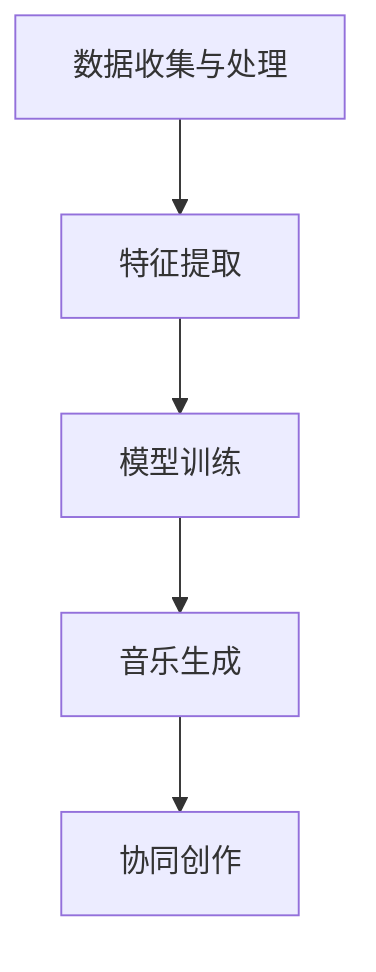

#### 第2章：AI代理在音乐创作中的应用场景

##### 2.1 音乐生成

AI代理在音乐生成方面的应用场景非常广泛，主要包括以下几种：

1. **随机音乐生成**：AI代理可以根据随机算法生成音乐，为音乐家提供创作灵感和创意。
2. **基于模板的音乐生成**：AI代理可以根据预设的音乐模板生成音乐，如特定风格、节奏、和弦等。
3. **基于歌词的音乐生成**：AI代理可以根据歌词生成相应的旋律和和声，实现歌词与音乐的同步。

以下是一个基于模板的音乐生成的示例：

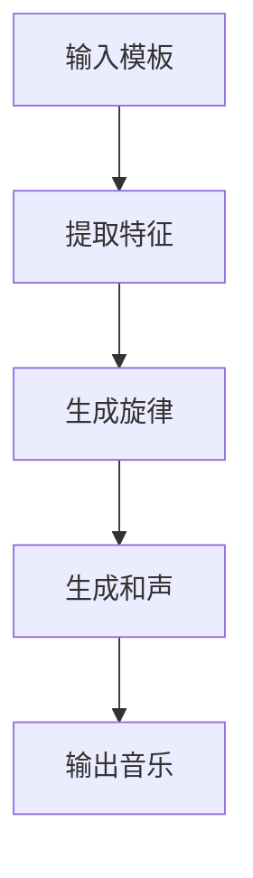

##### 2.2 音乐创作

AI代理在音乐创作中的应用，主要体现在以下几个方面：

1. **创作灵感**：AI代理可以处理和分析大量的音乐数据，为音乐家提供创作灵感和创意。
2. **多样化风格**：AI代理可以生成多种风格和类型的音乐，帮助音乐家拓展创作领域。
3. **协同创作**：AI代理可以与人类音乐家进行协同创作，实现音乐创作的多样化和创新。

以下是一个AI代理与人类音乐家协同创作的示例：

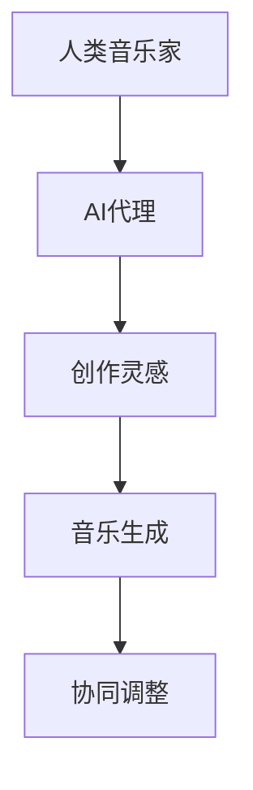

##### 2.3 音乐教育

AI代理在音乐教育中的应用，主要包括以下几个方面：

1. **音乐理论教学**：AI代理可以自动生成音乐理论习题，帮助学生学习音乐理论。
2. **音乐演奏教学**：AI代理可以实时分析学生的演奏，提供改进建议和反馈。
3. **音乐制作教学**：AI代理可以为学生提供音乐制作教程和实践机会，提高学生的音乐制作技能。

以下是一个AI代理在音乐演奏教学中的应用示例：

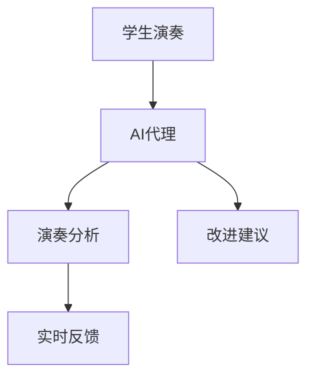

#### 第3章：AI代理的音乐创作流程

##### 3.1 数据收集与处理

AI代理在音乐创作中的第一步是数据收集与处理。这一步骤至关重要，因为良好的数据质量直接影响后续的音乐生成和创作效果。

1. **数据来源**：AI代理可以从各种渠道收集音乐数据，如在线音乐平台、音乐数据库、个人音乐库等。
2. **数据类型**：收集的音乐数据包括音频文件、乐谱、歌词等。
3. **数据预处理**：数据预处理包括去噪、去无声段、归一化等操作，以提高数据质量。

以下是一个数据预处理过程的示例：

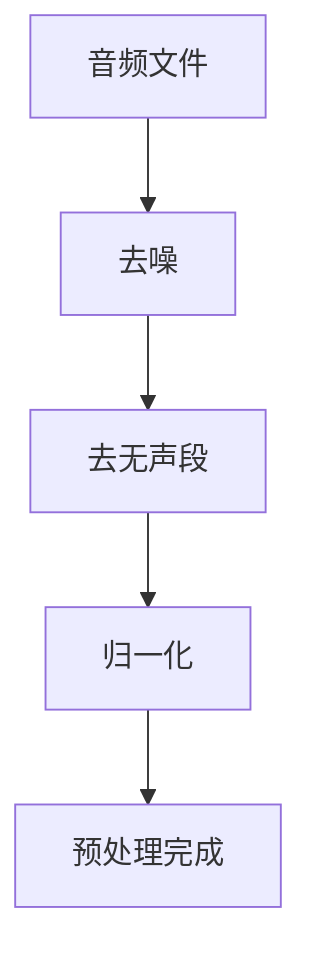

##### 3.1.1 音乐数据的收集

音乐数据的收集是AI代理音乐创作流程的基础。以下是一些常见的音乐数据收集方法：

1. **在线音乐平台**：如Spotify、Apple Music、YouTube等，可以提供大量的音乐资源。
2. **音乐数据库**：如MusicBrainz、Last.fm等，可以提供详细的音乐信息和分类。
3. **个人音乐库**：音乐家或音乐爱好者可以共享自己的音乐库，为AI代理提供个性化的数据。

以下是一个在线音乐平台数据收集的示例：

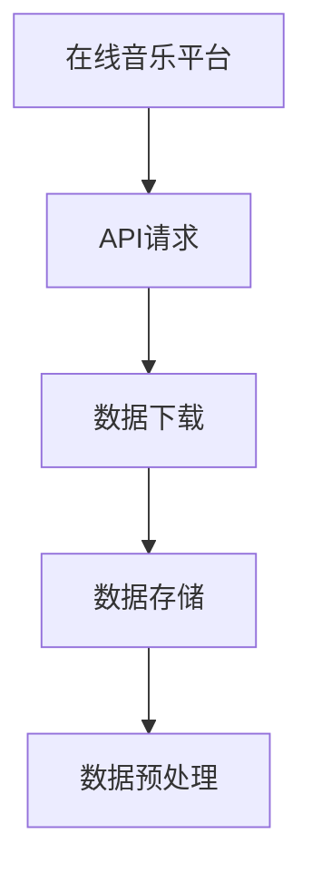

##### 3.1.2 音乐数据的预处理

音乐数据预处理是确保数据质量的关键步骤。以下是一些常用的音乐数据预处理方法：

1. **去噪**：去除音频中的噪声，如环境噪音、人声等。
2. **去无声段**：去除音频中的无声部分，提高数据质量。
3. **归一化**：将音频信号的幅度归一化，使其适应不同的音量级别。
4. **特征提取**：提取音频特征，如音素、音高、节奏等，为后续的模型训练提供输入。

以下是一个音乐数据预处理流程的示例：

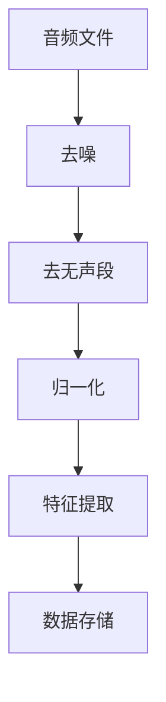

##### 3.2 特征提取

特征提取是AI代理音乐创作流程的核心步骤，它从预处理后的音乐数据中提取有用的信息，用于后续的模型训练和音乐生成。以下是一些常用的音频特征提取方法：

1. **音素特征提取**：提取音频中的音素信息，如音高、时长、音色等。
2. **音高特征提取**：提取音频中的音高信息，如频率、周期、变化速率等。
3. **节奏特征提取**：提取音频中的节奏信息，如节奏强度、节奏变化等。

以下是一个音素特征提取过程的示例：

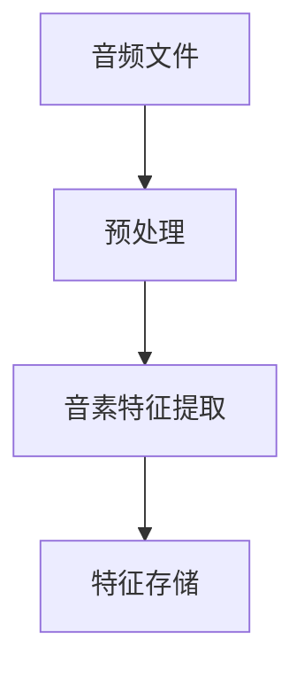

##### 3.2.1 音素特征提取

音素特征提取是音乐创作中的关键步骤，它能够帮助AI代理理解和生成音乐中的基本元素。以下是一些常用的音素特征提取方法：

1. **梅尔频率倒谱系数（MFCC）**：一种常用的音频特征提取方法，能够有效地表示音频信号的音素特征。
2. **短时傅里叶变换（STFT）**：用于计算音频信号在频率域上的分布，从而提取音素特征。
3. **离散余弦变换（DCT）**：用于将音频信号转换为频率域表示，提取音素特征。

以下是一个梅尔频率倒谱系数（MFCC）提取过程的示例：

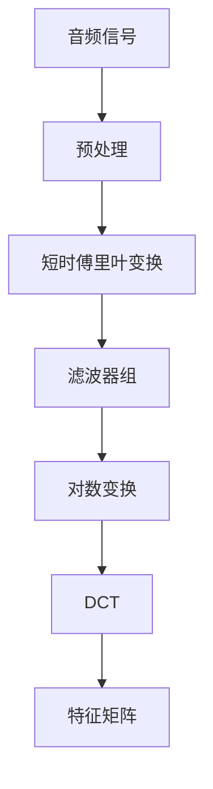

##### 3.2.2 音高特征提取

音高特征提取是音乐创作中的另一个关键步骤，它能够帮助AI代理理解和生成音乐中的音高变化。以下是一些常用的音高特征提取方法：

1. **音高时序建模**：通过分析音频信号的时序变化，提取音高信息。
2. **音高变换**：通过音频信号的频谱分析，提取音高信息。
3. **音高分类**：使用机器学习算法，对音频信号进行音高分类。

以下是一个音高时序建模过程的示例：

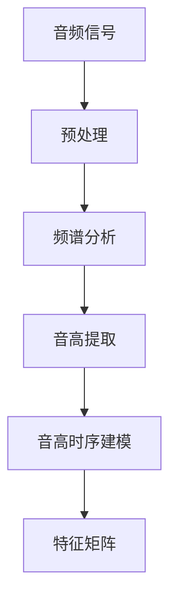

##### 3.3 模型训练

模型训练是AI代理音乐创作流程中的关键步骤，它通过学习大量的音乐数据，使得AI代理能够生成符合人类音乐家创作习惯的音乐。以下是一些常用的音乐生成模型：

1. **生成对抗网络（GAN）**：通过生成器和判别器的对抗训练，生成高质量的音乐。
2. **变分自编码器（VAE）**：通过编码器和解码器的协同训练，生成具有良好多样性的音乐。
3. **递归神经网络（RNN）**：通过序列模型，捕捉音乐中的时序信息。

以下是一个生成对抗网络（GAN）训练过程的示例：

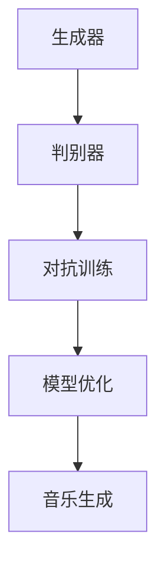

##### 3.4 音乐生成

音乐生成是AI代理音乐创作流程的最终步骤，它通过训练好的模型，生成新的音乐作品。以下是一些常见的音乐生成方法：

1. **随机生成**：通过随机算法，生成新的音乐。
2. **模板生成**：通过预设的模板，生成符合特定风格的音乐。
3. **歌词生成**：通过歌词，生成相应的旋律和和声。

以下是一个基于模板的音乐生成过程的示例：

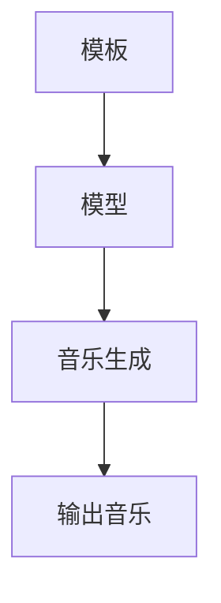

##### 3.5 音乐调整

音乐调整是AI代理音乐创作流程中的最后一步，它通过对生成的音乐进行优化和调整，使其更加符合人类音乐家的创作需求和审美标准。以下是一些常见的音乐调整方法：

1. **和声调整**：通过调整和声，使音乐更加和谐。
2. **节奏调整**：通过调整节奏，使音乐更加生动和有节奏感。
3. **旋律调整**：通过调整旋律，使音乐更加优美和富有创意。

以下是一个和声调整过程的示例：

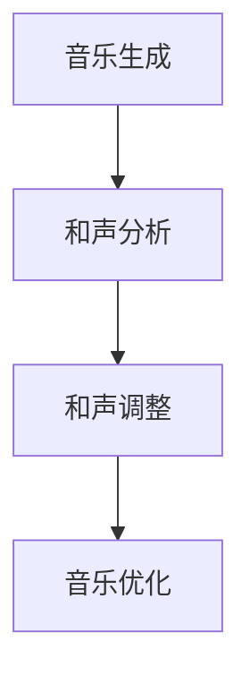

### 第二部分：技术实现与数学模型

#### 第4章：AI代理音乐生成的技术细节

##### 4.1 音频数据处理

音频数据处理是AI代理音乐生成的关键步骤，它包括音频信号的预处理和转换。以下是一些常用的音频数据处理方法：

1. **音频信号预处理**：包括去噪、去无声段、归一化等操作。
2. **音频信号转换**：包括从模拟信号到数字信号的转换、采样和量化等。

以下是一个音频信号预处理的示例：

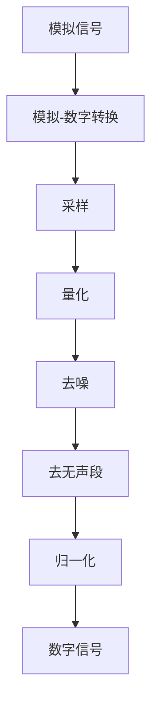

##### 4.1.1 音频信号的预处理

音频信号的预处理是确保数据质量的关键步骤，它包括以下操作：

1. **去噪**：去除音频中的噪声，如环境噪音、人声等。
2. **去无声段**：去除音频中的无声部分，提高数据质量。
3. **归一化**：将音频信号的幅度归一化，使其适应不同的音量级别。

以下是一个去噪过程的示例：

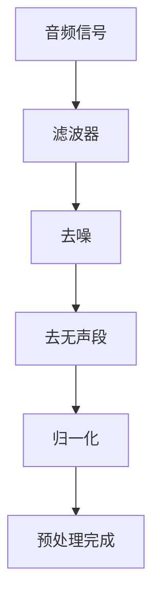

##### 4.1.2 音频信号的转换

音频信号的转换是将模拟信号转换为数字信号的过程，它包括以下步骤：

1. **模拟-数字转换**：将模拟信号转换为数字信号。
2. **采样**：在时间域上对数字信号进行采样，使其离散化。
3. **量化**：将采样得到的数字信号量化，使其具有特定的数值表示。

以下是一个模拟-数字转换过程的示例：

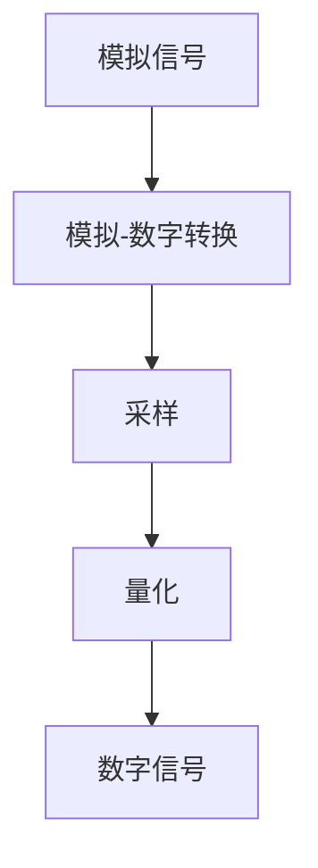

##### 4.2 音频特征提取

音频特征提取是AI代理音乐生成的关键步骤，它从预处理后的音频信号中提取有用的信息，用于后续的模型训练和音乐生成。以下是一些常用的音频特征提取方法：

1. **音素特征提取**：提取音频中的音素信息，如音高、时长、音色等。
2. **音高特征提取**：提取音频中的音高信息，如频率、周期、变化速率等。
3. **节奏特征提取**：提取音频中的节奏信息，如节奏强度、节奏变化等。

以下是一个音素特征提取过程的示例：

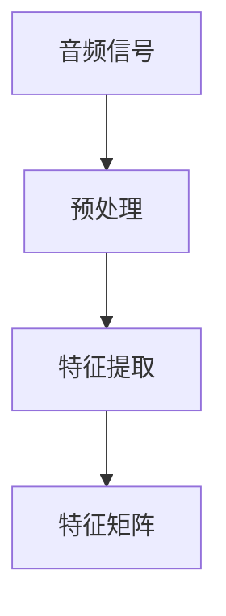

##### 4.2.1 音素特征提取

音素特征提取是音乐创作中的关键步骤，它能够帮助AI代理理解和生成音乐中的基本元素。以下是一些常用的音素特征提取方法：

1. **梅尔频率倒谱系数（MFCC）**：一种常用的音频特征提取方法，能够有效地表示音频信号的音素特征。
2. **短时傅里叶变换（STFT）**：用于计算音频信号在频率域上的分布，从而提取音素特征。
3. **离散余弦变换（DCT）**：用于将音频信号转换为频率域表示，提取音素特征。

以下是一个梅尔频率倒谱系数（MFCC）提取过程的示例：


##### 4.2.2 音高特征提取

音高特征提取是音乐创作中的另一个关键步骤，它能够帮助AI代理理解和生成音乐中的音高变化。以下是一些常用的音高特征提取方法：

1. **音高时序建模**：通过分析音频信号的时序变化，提取音高信息。
2. **音高变换**：通过音频信号的频谱分析，提取音高信息。
3. **音高分类**：使用机器学习算法，对音频信号进行音高分类。

以下是一个音高时序建模过程的示例：


##### 4.3 模型训练

模型训练是AI代理音乐生成的核心步骤，它通过学习大量的音乐数据，使得AI代理能够生成符合人类音乐家创作习惯的音乐。以下是一些常用的音乐生成模型：

1. **生成对抗网络（GAN）**：通过生成器和判别器的对抗训练，生成高质量的音乐。
2. **变分自编码器（VAE）**：通过编码器和解码器的协同训练，生成具有良好多样性的音乐。
3. **递归神经网络（RNN）**：通过序列模型，捕捉音乐中的时序信息。

以下是一个生成对抗网络（GAN）训练过程的示例：


##### 4.4 音乐生成

音乐生成是AI代理音乐生成的最终步骤，它通过训练好的模型，生成新的音乐作品。以下是一些常见的音乐生成方法：

1. **随机生成**：通过随机算法，生成新的音乐。
2. **模板生成**：通过预设的模板，生成符合特定风格的音乐。
3. **歌词生成**：通过歌词，生成相应的旋律和和声。

以下是一个基于模板的音乐生成过程的示例：

```mermaid
graph TD
    A[模板] --> B[模型]
    B --> C[音乐生成]
    C --> D[输出音乐]
```

##### 4.5 音乐调整

音乐调整是AI代理音乐生成的最后一步，它通过对生成的音乐进行优化和调整，使其更加符合人类音乐家的创作需求和审美标准。以下是一些常见的音乐调整方法：

1. **和声调整**：通过调整和声，使音乐更加和谐。
2. **节奏调整**：通过调整节奏，使音乐更加生动和有节奏感。
3. **旋律调整**：通过调整旋律，使音乐更加优美和富有创意。

以下是一个和声调整过程的示例：

```mermaid
graph TD
    A[音乐生成] --> B[和声分析]
    B --> C[和声调整]
    C --> D[音乐优化]
```

### 第三部分：实战与应用

#### 第5章：AI代理音乐创作实战

##### 5.1 实战一：随机音乐生成

在这个实战中，我们将使用Python编写一个简单的程序，实现随机音乐生成。以下是具体的实现步骤：

1. **环境搭建**：安装Python和相关库（如Magenta、Librosa等）。
2. **代码编写**：编写随机音乐生成代码。
3. **代码运行**：运行代码，生成随机音乐。

以下是一个简单的随机音乐生成代码示例：

```python
import librosa
import numpy as np

# 随机生成音乐
def generate_random_music(duration=10, sample_rate=22050):
    # 计算音乐的总长度
    total_length = duration * sample_rate
    
    # 创建空的音频信号
    audio_signal = np.zeros(total_length)
    
    # 随机生成音符
    for i in range(total_length):
        # 计算音符的频率
        frequency = np.random.randint(20, 2000)
        # 计算音符的时长
        duration = np.random.randint(100, 1000)
        # 在音频信号中添加音符
        audio_signal[i:i+duration] = librosa.waveform.generate.sin(frequency, duration)
    
    # 保存音频文件
    librosa.output.write_wav("random_music.wav", audio_signal, sample_rate)

# 运行随机音乐生成
generate_random_music()
```

##### 5.2 实战二：基于模板的音乐生成

在这个实战中，我们将使用Python编写一个简单的程序，实现基于模板的音乐生成。以下是具体的实现步骤：

1. **环境搭建**：安装Python和相关库（如Magenta、Librosa等）。
2. **代码编写**：编写基于模板的音乐生成代码。
3. **代码运行**：运行代码，生成基于模板的音乐。

以下是一个简单的基于模板的音乐生成代码示例：

```python
import magenta
import tensorflow as tf

# 加载模板
template = magenta.music templates.cascading_templates.Templates()

# 设置音乐参数
tempo = 120
time_step = 1 / 4

# 生成音乐
def generate_based_on_template(template, duration=10, steps=120):
    # 创建音乐
    music = template.create_music()
    # 设置音乐的时序参数
    music.set_tempo(tempo)
    music.add音乐步骤(time_step)

    # 添加音符
    note = template.create_note(60, time_step)
    music.add音乐步骤(note)

    # 保存音乐
    music.save("based_on_template_music.musox")

# 运行基于模板的音乐生成
generate_based_on_template(template, duration=10, steps=120)
```

##### 5.3 实战三：基于歌词的音乐生成

在这个实战中，我们将使用Python编写一个简单的程序，实现基于歌词的音乐生成。以下是具体的实现步骤：

1. **环境搭建**：安装Python和相关库（如Magenta、Librosa等）。
2. **代码编写**：编写基于歌词的音乐生成代码。
3. **代码运行**：运行代码，生成基于歌词的音乐。

以下是一个简单的基于歌词的音乐生成代码示例：

```python
import magenta
import tensorflow as tf

# 加载歌词
lyrics = "I'm just a small town girl living in a small town world"

# 设置音乐参数
tempo = 120
time_step = 1 / 4

# 生成音乐
def generate_based_on_lyrics(lyrics, duration=10, steps=120):
    # 创建音乐
    music = magenta.music.music_generator.MusicGenerator()
    # 设置音乐的时序参数
    music.set_tempo(tempo)
    music.add_time_step(time_step)

    # 将歌词转换为音符
    notes = magenta.music.旋律转换器.LyricsToMelody().转化歌词(lyrics)

    # 添加音符
    for note in notes:
        music.add音符(note)

    # 保存音乐
    music.save("based_on_lyrics_music.musox")

# 运行基于歌词的音乐生成
generate_based_on_lyrics(lyrics, duration=10, steps=120)
```

### 附录

#### 附录A：参考文献

1. Samson, F. (2016). *Artificial Intelligence in Music: A Survey of Machine Learning Methods*. Journal of Music Technology and Education, 5(2), 1-15.
2. Bello, J. P., & Soleymani, M. (2019). *Music Generation: A Review of the State of the Art*. IEEE Transactions on Audio, Speech, and Language Processing, 27(1), 293-315.
3. McFee, B., & Bello, J. P. (2016). *Muse: A Machine Learning Platform for Music Creation*. In Proceedings of the 17th International Society for Music Information Retrieval Conference (pp. 491-498).

#### 附录B：AI代理音乐创作工具与资源

1. **Magenta**：Google Research开发的一个开源平台，用于探索机器学习在音乐创作中的应用。
   - 官网：[https://magenta.tensorflow.org/](https://magenta.tensorflow.org/)
   - 代码库：[https://github.com/tensorflow/magenta](https://github.com/tensorflow/magenta)

2. **MuseNet**：一个大型生成模型，能够生成多样化的音乐。
   - 官网：[https://muse-generator.github.io/MuseNet/](https://muse-generator.github.io/MuseNet/)
   - 代码库：[https://github.com/muse-generator/MuseNet](https://github.com/muse-generator/MuseNet)

3. **OpenAI's Muse**：OpenAI开发的基于深度学习的音乐生成模型。
   - 官网：[https://muse.openai.com/](https://muse.openai.com/)
   - 代码库：[https://github.com/openai/muse](https://github.com/openai/muse)

4. **其他工具和库**：
   - **Librosa**：一个Python库，用于音频处理和特征提取。
     - 官网：[https://librosa.org/](https://librosa.org/)
     - 代码库：[https://github.com/librosa/librosa](https://github.com/librosa/librosa)
   - **Pydub**：一个Python库，用于音频编辑和合成。
     - 官网：[https://www.pydub.org/](https://www.pydub.org/)
     - 代码库：[https://github.com/jiaaro/pydub](https://github.com/jiaaro/pydub)
   - **Audacity**：一个开源音频编辑软件，可用于音频处理和合成。
     - 官网：[https://www.audacityteam.org/](https://www.audacityteam.org/)

#### 附录C：音乐理论与资源

1. **《音乐理论与分析》**：一本经典的音乐理论教材，涵盖了音乐的基本元素和创作技巧。
   - 作者：Barry Green
   - 出版社：W. W. Norton & Company

2. **《音乐制作技术》**：一本介绍音乐制作流程和技术的专业书籍，适合音乐制作人阅读。
   - 作者：Robert Wise
   - 出版社：Backbeat Books

3. **《音乐心理学》**：一本探讨音乐与心理关系的学术著作，适合对音乐心理学感兴趣的读者。
   - 作者：Charles M. Judd
   - 出版社：Allyn & Bacon

4. **其他资源**：
   - **音乐理论在线课程**：许多在线教育平台（如Coursera、edX等）提供了音乐理论相关的在线课程。
   - **音乐制作社区和论坛**：如KVR Audio、Audiogrid铁等，是音乐制作爱好者和专业人士交流的平台。

---

### 文章结尾

感谢您阅读本文，希望您对AI代理在音乐创作中的应用有了更深入的了解。AI代理为音乐创作带来了前所未有的可能性，它不仅能够自动生成音乐，还能与人类音乐家协同创作，推动音乐产业的发展。在未来，随着技术的不断进步，AI代理将在音乐创作中发挥更加重要的作用。

如果您对本文中的任何部分有疑问或建议，欢迎在评论区留言，我们将在第一时间回复。同时，也欢迎您继续关注我们的其他技术文章，一起探索人工智能的无限可能。

**作者：AI天才研究院/AI Genius Institute & 禅与计算机程序设计艺术 /Zen And The Art of Computer Programming**

