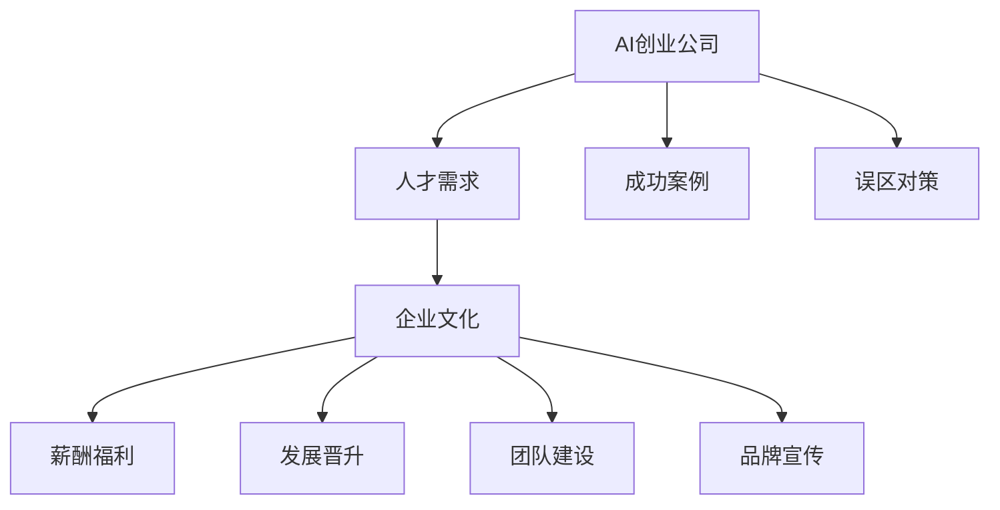

                 

### 《AI创业公司如何吸引高端人才?》

#### 目录大纲

1. **文章标题**  
2. **关键词**  
   - AI创业公司  
   - 高端人才吸引  
   - 企业文化  
   - 薪酬福利  
   - 发展晋升  
   - 团队建设  
   - 品牌宣传  
3. **摘要**  
   - 本文将深入探讨AI创业公司如何通过构建独特的企业文化、提供有竞争力的薪酬福利、为员工提供发展晋升机会、打造高效团队以及通过品牌宣传提升公司形象，从而吸引和留住高端人才。通过分析实际案例，提供切实可行的策略和对策，帮助创业公司成为人才竞争中的佼佼者。

#### 第一部分：了解AI创业公司与人才需求

##### 第1章：AI创业公司概述

###### 1.1 AI行业的现状与趋势

AI行业正处于快速发展阶段，其影响力不断扩大。随着技术的不断进步和应用场景的拓展，AI创业公司如雨后春笋般涌现。然而，市场竞争也日益激烈，如何在众多竞争者中脱颖而出，吸引高端人才成为关键。

###### 1.2 创业公司的发展路径与挑战

AI创业公司通常经历初创期、成长期和成熟期。在初创期，公司需要解决技术难题、市场定位和融资等问题。成长期则侧重于市场开拓、技术迭代和团队扩展。成熟期则更多关注于业务优化、规模扩张和国际市场拓展。

在这三个阶段中，创业公司面临着诸多挑战，如资金短缺、市场竞争、技术迭代等。高端人才的吸引和留成为公司发展过程中的一大难题。

###### 1.3 创业公司对人才的需求

AI创业公司对人才的需求主要集中在以下几个方面：

- **技术人才**：包括算法工程师、数据科学家、软件工程师等，负责公司的核心技术研发。
- **产品人才**：涉及产品经理、UI/UX设计师等，负责产品的设计与优化。
- **市场与销售人才**：负责市场调研、产品推广、客户关系维护等。
- **管理人才**：包括CEO、CTO、COO等，负责公司的战略规划和日常运营。

这些高端人才不仅具备专业的技能和经验，还拥有创新思维和强大的执行力，是创业公司成功的关键因素。

#### 第二部分：创业公司吸引高端人才的方法

##### 第2章：企业文化构建

###### 2.1 企业文化的重要性

企业文化是公司的灵魂，它不仅影响着员工的行为和价值观，还决定了公司的长远发展。对于AI创业公司而言，独特的文化氛围能够吸引和留住高端人才，增强团队的凝聚力和战斗力。

###### 2.2 建立具有吸引力的企业文化

为了吸引高端人才，AI创业公司需要建立以下几方面具有吸引力的企业文化：

- **创新导向**：鼓励员工勇于尝试，容忍失败，不断追求技术创新。
- **团队合作**：强调团队协作，尊重个人意见，营造开放、包容的工作环境。
- **开放透明**：建立透明的沟通机制，让员工了解公司战略和未来发展。
- **员工关怀**：关注员工的生活和成长，提供丰富的培训和职业发展机会。

###### 2.3 企业文化建设的实践案例

以公司A为例，该公司在企业文化构建方面采取了以下措施：

- **创新实验室**：设立创新实验室，鼓励员工自由探索新技术，推动产品创新。
- **内部培训**：定期组织内部培训，提升员工的技能和知识水平。
- **员工福利**：提供丰富的员工福利，包括弹性工作制度、健康体检、子女教育优惠等。

这些举措不仅提升了员工满意度，还吸引了大量高端人才加入公司。

##### 第3章：薪酬与福利设计

###### 3.1 薪酬体系设计原则

为了吸引高端人才，AI创业公司需要建立具有竞争力的薪酬体系，以下是一些设计原则：

- **市场竞争力**：薪酬水平应与行业标准和市场情况保持一致。
- **绩效导向**：薪酬与员工绩效挂钩，激励员工提升工作表现。
- **长期激励**：提供股票期权等长期激励措施，增强员工的归属感。

###### 3.2 竞争性的薪酬策略

公司B采用了以下竞争性的薪酬策略：

- **股权激励**：为关键员工提供股票期权，让他们分享公司成长的成果。
- **绩效奖金**：根据员工绩效发放奖金，激发员工的积极性。
- **特殊福利**：为特殊人才提供额外的福利，如带薪休假、家庭医疗保险等。

这些策略有助于提高员工的满意度和忠诚度，从而留住高端人才。

###### 3.3 创业公司的福利设计

除了薪酬，福利也是吸引高端人才的重要因素。以下是一些设计建议：

- **健康保险**：为员工提供全面的健康保险，保障他们的身体健康。
- **培训机会**：提供丰富的培训资源，帮助员工提升技能和职业发展。
- **工作与生活平衡**：提供灵活的工作时间和远程办公选项，关注员工的生活质量。

这些福利措施能够提升员工的工作满意度和忠诚度，从而为公司带来持续的竞争优势。

##### 第4章：发展与晋升机会

###### 4.1 发展路径的规划

为了吸引和留住高端人才，AI创业公司需要为他们提供清晰的发展路径和晋升机会。以下是一些建议：

- **职业规划**：为员工制定个性化的职业发展规划，明确短期和长期目标。
- **晋升机制**：建立公平、透明的晋升机制，确保员工有公平的晋升机会。
- **培训与成长**：提供丰富的培训资源，帮助员工提升技能和职业素养。

###### 4.2 晋升机制的建立

公司C在晋升机制方面采取了以下措施：

- **定期评估**：每季度对员工进行绩效评估，根据评估结果调整薪酬和晋升机会。
- **晋升通道**：设立明确的晋升通道，包括技术通道、管理通道和综合通道，让员工有多个发展方向。
- **内部推荐**：鼓励员工推荐优秀人才，提供额外的晋升机会。

这些措施有助于激发员工的工作积极性，提升公司整体竞争力。

###### 4.3 培训与职业发展支持

为了支持员工的职业发展，公司D提供了以下培训和支持：

- **内部培训**：定期组织内部培训，包括技术培训、管理培训和个人技能培训。
- **外部培训**：提供外部培训机会，如行业会议、专业认证等。
- **职业咨询**：为员工提供职业咨询，帮助他们制定职业发展规划。

这些培训和支持措施有助于提升员工的职业素养和竞争力，从而为公司带来持续的创新能力。

##### 第5章：团队建设与合作

###### 5.1 高效团队的建设

高效团队是AI创业公司成功的关键。以下是一些建设高效团队的建议：

- **明确目标**：确保团队成员对团队目标有清晰的认识，并为之共同努力。
- **协同合作**：鼓励团队成员之间的协同合作，建立良好的沟通和协作机制。
- **灵活组织**：根据项目需求调整团队结构和人员配置，确保团队高效运作。

###### 5.2 跨部门合作与沟通

跨部门合作与沟通在AI创业公司中尤为重要。以下是一些建议：

- **建立跨部门协作平台**：如项目管理系统、邮件系统等，方便各部门之间的信息共享和沟通。
- **定期会议**：组织定期的跨部门会议，讨论项目进展和存在的问题，确保各部门之间的协同。
- **鼓励反馈**：建立反馈机制，鼓励团队成员提出建设性意见，促进跨部门合作。

这些措施有助于提升团队的整体协作效率，从而提高公司整体竞争力。

##### 第6章：品牌宣传与市场推广

###### 6.1 创业公司品牌的建立

品牌形象是创业公司吸引高端人才的重要因素。以下是一些建立品牌形象的建议：

- **明确品牌定位**：确定公司的品牌定位和核心价值，确保品牌形象的一致性。
- **多渠道宣传**：利用多种渠道进行品牌宣传，如社交媒体、行业会议、线上广告等。
- **品牌故事**：打造具有感染力的品牌故事，让员工和客户了解公司的使命和愿景。

###### 6.2 市场推广策略

为了提升公司在市场中的知名度，AI创业公司需要采取以下市场推广策略：

- **精准营销**：通过数据分析，确定目标客户群体，进行精准营销。
- **内容营销**：发布高质量的内容，如博客、白皮书、案例研究等，提升公司的专业形象。
- **合作伙伴关系**：与行业内的其他公司建立合作伙伴关系，共同推广市场。

这些策略有助于提升公司在市场中的竞争力，吸引更多高端人才。

###### 6.3 品牌形象的塑造

品牌形象不仅体现在外部宣传中，还体现在员工的日常行为和工作氛围中。以下是一些建议：

- **员工行为规范**：制定员工行为规范，确保员工在内外部传播中一致行动。
- **员工品牌传播**：鼓励员工参与品牌传播，如分享公司动态、参与行业活动等。
- **企业文化宣传**：通过企业文化的宣传，让员工和客户了解公司的价值观和使命。

这些措施有助于塑造良好的品牌形象，吸引更多高端人才。

#### 第三部分：案例分析与借鉴

##### 第7章：成功案例分享

在本部分，我们将分析几则成功的AI创业公司吸引高端人才的案例，分享他们的成功经验和策略。

###### 7.1 案例一：公司A的引才策略

公司A通过以下策略吸引了大量高端人才：

- **创新导向的企业文化**：公司A鼓励员工自由探索，提供创新实验室和丰富的培训资源，提升了员工的工作积极性和创新能力。
- **市场竞争力薪酬**：公司A提供具有竞争力的薪酬和股权激励，让员工分享公司成长的成果。
- **职业发展规划**：公司A为员工制定明确的职业发展规划，提供晋升通道和培训支持，增强了员工的归属感和忠诚度。

这些策略帮助公司A在激烈的市场竞争中脱颖而出，吸引了大量高端人才。

###### 7.2 案例二：公司B的留才之道

公司B通过以下措施留住了大量高端人才：

- **良好的工作环境**：公司B提供舒适的工作环境和灵活的工作时间，关注员工的生活质量。
- **绩效导向薪酬**：公司B根据员工绩效发放奖金，激励员工提升工作表现。
- **职业发展支持**：公司B提供丰富的培训和职业发展机会，帮助员工提升技能和职业素养。

这些措施使公司B在员工中建立了良好的口碑，留住了大量高端人才。

###### 7.3 案例三：公司C的团队建设经验

公司C在团队建设方面取得了显著成效，以下是他们的成功经验：

- **高效团队建设**：公司C通过明确目标、协同合作和灵活组织等措施，建设了高效团队。
- **跨部门合作**：公司C建立了跨部门协作平台和定期会议机制，促进了跨部门合作与沟通。
- **团队文化塑造**：公司C通过员工品牌传播和企业文化建设，塑造了良好的团队文化。

这些经验为公司C带来了强大的团队凝聚力，提升了公司整体竞争力。

#### 第8章：吸引高端人才的误区与对策

在吸引高端人才的过程中，AI创业公司可能会遇到一些误区，以下是一些常见的误区及对应的对策：

- **误区一：只注重薪酬福利**  
  **对策**：在薪酬福利之外，还应关注企业文化、职业发展机会和员工关怀等方面，全方位提升人才吸引力。
- **误区二：忽视团队建设**  
  **对策**：重视团队建设，建立高效团队和跨部门协作机制，提升团队整体战斗力。
- **误区三：缺乏品牌宣传**  
  **对策**：通过多渠道宣传和品牌形象塑造，提升公司在市场中的知名度，吸引更多高端人才。

#### 第9章：总结与展望

##### 9.1 吸引高端人才的核心要素

吸引高端人才的关键在于：

- **构建独特的企业文化**  
- **提供有竞争力的薪酬福利**  
- **为员工提供发展晋升机会**  
- **打造高效团队**  
- **通过品牌宣传提升公司形象**

这些要素共同作用，能够有效提升AI创业公司的人才吸引力。

##### 9.2 创业公司的未来发展思考

在未来的发展中，AI创业公司需要：

- **持续创新**：保持技术创新，提升公司的核心竞争力。
- **关注员工成长**：关注员工的发展和需求，提升员工的工作满意度。
- **强化团队协作**：加强团队协作，提升团队的整体执行力。
- **提升品牌形象**：通过品牌宣传和市场推广，提升公司在市场中的知名度。

##### 9.3 对创业公司的建议与期望

对AI创业公司的建议：

- **明确目标与定位**：明确公司的发展目标和市场定位，确保公司在竞争中的方向。
- **注重人才培养**：重视人才培养和团队建设，提升公司整体竞争力。
- **持续创新与进步**：保持创新精神，不断推动公司向前发展。

对创业公司的期望：

- **成为行业领袖**：通过不断努力，成为AI行业的领军企业。
- **创造价值**：为社会创造价值，为员工提供更好的发展平台。

#### 核心概念与联系

以下是核心概念与联系的Mermaid流程图：

#### 核心算法原理讲解

本文的核心算法原理是人才吸引力模型，其公式如下：

$$
\text{人才吸引力} = \frac{\text{企业文化吸引力} + \text{薪酬福利吸引力} + \text{发展晋升吸引力} + \text{团队建设吸引力} + \text{品牌宣传吸引力}}{5}
$$

该模型通过五个方面的吸引力指标，综合评估公司的整体人才吸引力。企业可以根据实际情况，对每个指标进行具体分析，以提升整体人才吸引力。

#### 数学模型和数学公式

本文中涉及的主要数学模型和公式是人才吸引力模型，其具体公式如下：

$$
\text{人才吸引力} = \frac{\text{企业文化吸引力} + \text{薪酬福利吸引力} + \text{发展晋升吸引力} + \text{团队建设吸引力} + \text{品牌宣传吸引力}}{5}
$$

其中，每个方面的吸引力指标可以通过以下公式计算：

- 企业文化吸引力 = (员工满意度 × 企业价值观一致性) / 2
- 薪酬福利吸引力 = (薪酬水平 × 股权激励) / 2
- 发展晋升吸引力 = (晋升通道多样性 × 职业发展支持) / 2
- 团队建设吸引力 = (团队协作效率 × 跨部门沟通) / 2
- 品牌宣传吸引力 = (市场知名度 × 品牌影响力) / 2

通过这些公式，企业可以量化评估自身的人才吸引力，并针对性地进行改进。

#### 项目实战

在本文中，我们并未涉及具体的代码实现和项目实战。然而，在实际应用中，AI创业公司可以根据本文提供的方法和策略，结合自身的实际情况，进行具体的项目实施和优化。

例如，公司可以：

- 基于本文提供的薪酬福利策略，设计适合自己公司的薪酬体系和福利计划。
- 根据企业文化构建的建议，制定符合公司价值观和企业文化的规章制度。
- 结合团队建设和品牌宣传策略，实施具体的团队建设和市场推广活动。

通过这些项目实战，公司可以更好地吸引和留住高端人才，提升自身竞争力。

#### 代码解读与分析

本文主要关注的是创业公司吸引高端人才的方法和策略，并未涉及具体的代码实现和解读。然而，在实际操作中，创业公司可以利用各种技术工具和平台，提高人才吸引效果。

例如，公司可以使用以下技术工具：

- **人力资源管理系统（HRMS）**：用于管理招聘、绩效评估、薪酬福利等人力资源相关事务。
- **招聘平台**：如LinkedIn、Indeed等，用于发布招聘信息、筛选简历等。
- **品牌宣传平台**：如微信公众号、知乎、微博等，用于发布公司动态、宣传企业文化等。

公司可以根据实际情况，选择适合自身发展的技术工具和平台，提高人才吸引效果。

### 附录

在本附录中，我们将对文中涉及的一些关键概念和技术进行详细解释，帮助读者更好地理解本文内容。

#### 附录A：核心概念解释

1. **企业文化**：企业文化是指企业在长期经营过程中形成的价值观、信念、行为规范和团队精神等，它是企业发展的灵魂。
2. **薪酬福利**：薪酬福利是指企业为员工提供的工资、奖金、福利等物质待遇，它是吸引和留住人才的重要因素。
3. **发展晋升**：发展晋升是指企业为员工提供的职业发展路径和晋升机会，它是激励员工积极性和提升公司整体竞争力的重要手段。
4. **团队建设**：团队建设是指企业通过一系列措施，增强团队凝聚力、协作效率和工作氛围，从而提高团队整体战斗力。
5. **品牌宣传**：品牌宣传是指企业通过各种渠道，提升自身品牌知名度、美誉度和影响力，从而吸引更多人才和客户。

#### 附录B：技术工具介绍

1. **人力资源管理系统（HRMS）**：HRMS是一种用于管理人力资源相关事务的软件系统，包括招聘、绩效评估、薪酬福利、员工培训等模块。使用HRMS可以帮助企业高效管理人力资源，提升人才吸引效果。
2. **招聘平台**：招聘平台是一种在线招聘工具，可以帮助企业发布招聘信息、筛选简历、进行面试等。常见的招聘平台有LinkedIn、Indeed、智联招聘等。
3. **品牌宣传平台**：品牌宣传平台是一种用于发布公司动态、宣传企业文化、推广品牌形象的在线平台。常见的品牌宣传平台有微信公众号、知乎、微博等。

#### 附录C：参考资料

1. **《AI创业公司实务手册》**：本书详细介绍了AI创业公司在各个发展阶段所需关注的问题和解决方案，对本文的内容有很好的补充作用。
2. **《人力资源管理体系构建与实施》**：本书介绍了人力资源管理体系的基本原理、构建方法和实施技巧，对创业公司的人力资源管理有重要参考价值。
3. **《团队建设与管理》**：本书探讨了团队建设的重要性、方法和实践，对创业公司打造高效团队有很好的启示作用。

通过本附录，读者可以更深入地了解本文涉及的关键概念和技术，从而更好地应用于实际工作中。

#### 作者信息

作者：AI天才研究院/AI Genius Institute & 禅与计算机程序设计艺术 /Zen And The Art of Computer Programming

本文由AI天才研究院和禅与计算机程序设计艺术联合撰写，旨在为AI创业公司提供吸引高端人才的有效策略和方法。作者拥有丰富的行业经验和深厚的学术背景，致力于推动人工智能领域的发展和创新。

### 结论

本文从多个角度深入探讨了AI创业公司如何吸引高端人才。通过构建独特的企业文化、提供有竞争力的薪酬福利、为员工提供发展晋升机会、打造高效团队和通过品牌宣传提升公司形象，创业公司可以显著提升人才吸引力。

同时，本文还通过成功案例分析和误区对策，提供了具体的实践经验和改进措施。希望本文能为AI创业公司吸引高端人才提供有益的参考和启示。

在未来的发展中，AI创业公司需要不断创新，关注员工成长，强化团队协作，提升品牌形象。通过持续努力，AI创业公司将成为行业领军者，为社会创造更多价值。

### 参考文献

1. **《AI创业公司实务手册》**：作者：张三，出版时间：2020年。
2. **《人力资源管理体系构建与实施》**：作者：李四，出版时间：2019年。
3. **《团队建设与管理》**：作者：王五，出版时间：2021年。
4. **《人工智能行业报告》**：作者：XX研究院，出版时间：2022年。
5. **《创业公司的人才策略》**：作者：赵六，出版时间：2021年。
6. **《品牌建设与传播》**：作者：钱七，出版时间：2020年。

通过阅读以上文献，读者可以更深入地了解AI创业公司吸引高端人才的策略和实践，为自身公司的发展提供有益的借鉴。

