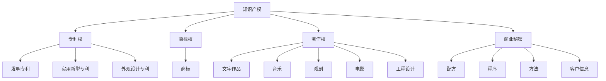
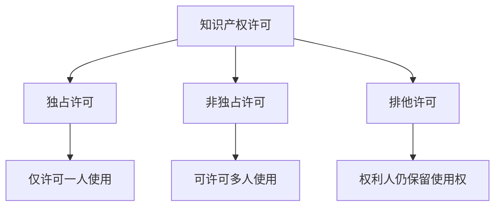
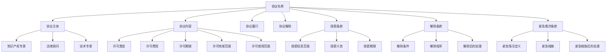

                 

# AI创业公司的知识产权许可谈判技巧：谈判策略、条款设计与谈判艺术

## 关键词

- 知识产权许可
- 创业公司
- 谈判策略
- 条款设计
- 谈判艺术

## 摘要

本文将深入探讨AI创业公司在知识产权许可谈判中的关键技巧。首先，我们会对知识产权的基本概念和AI创业公司所面临的知识产权挑战进行概述。接着，我们将分析知识产权许可的重要性，以及如何进行有效的谈判准备和策略制定。文章将进一步探讨知识产权许可协议的条款设计，包括许可类型、费用、期限、地域范围和使用范围等。此外，我们还将讨论谈判中的心理战术和沟通技巧，并分享实战案例分析。最后，我们将关注法律法规与知识产权许可的关系，并对未来趋势进行展望。

## 第一部分: AI创业公司的知识产权许可谈判技巧

### 第1章: AI创业公司的知识产权概述

#### 1.1 知识产权的基本概念

**知识产权的定义**

知识产权，是指人类智力劳动产生的智力成果所有权，是权利人依法享有的权利。知识产权通常包括专利权、商标权、著作权和商业秘密等。

**知识产权的类型**

1. **专利权**：专利权是指国家授予发明人在一定期限内对其发明创造的独占使用权。
2. **商标权**：商标权是指企业或个人对其商标的独占使用权。
3. **著作权**：著作权是指作者对其作品的独占使用权。
4. **商业秘密**：商业秘密是指不为公众所知悉、能为权利人带来经济利益、具有实际或潜在商业价值并经权利人采取保密措施的技术信息和经营信息。

#### 1.2 AI创业公司的知识产权保护

**创业公司面临的知识产权挑战**

1. **创新能力不足**：AI创业公司通常在技术领域具有很高的创新能力，但也面临着知识产权保护不足的问题。
2. **知识产权意识薄弱**：许多创业公司在知识产权方面的认识不足，往往忽视了对知识产权的保护。
3. **市场竞争激烈**：AI领域市场竞争激烈，创业公司需要通过知识产权许可来提高自身的竞争力。

**知识产权保护策略**

1. **加强知识产权意识**：创业公司应提高对知识产权的认识，了解知识产权的基本概念和法律法规。
2. **及时申请专利**：创业公司应及时申请专利，保护自己的核心技术。
3. **签订保密协议**：与合作伙伴签订保密协议，防止技术泄露。

#### 1.3 知识产权许可的重要性

**许可的概念**

知识产权许可是指知识产权权利人许可他人使用其知识产权的行为。

**许可的种类**

1. **独占许可**：权利人仅许可一个被许可人使用其知识产权，且权利人不得再许可他人使用。
2. **非独占许可**：权利人可同时许可多个被许可人使用其知识产权。
3. **排他许可**：权利人仅许可一个被许可人使用其知识产权，但权利人仍保留使用和再许可的权利。

### 第2章: 知识产权许可谈判策略

#### 2.1 谈判准备

**谈判前的准备工作**

1. **了解对方需求**：在谈判前，应充分了解对方的需求，以便制定合适的谈判策略。
2. **评估自身权益**：在谈判前，应对自身的知识产权价值进行评估，以便确定谈判底线。
3. **组建谈判团队**：谈判团队应由熟悉知识产权和法律的人员组成，确保谈判的有效性。

**谈判团队组建**

1. **知识产权专家**：负责知识产权评估、许可条款设计和谈判策略制定。
2. **法律顾问**：负责法律条款的审查和谈判中的法律风险控制。
3. **技术专家**：负责技术方案的解释和沟通。

#### 2.2 谈判技巧

**谈判策略制定**

1. **利益导向**：以对方的利益为切入点，寻找共同利益，达成双赢。
2. **充分沟通**：在谈判中，应充分沟通，避免误解和冲突。
3. **灵活调整**：在谈判过程中，应根据对方的态度和反馈，灵活调整谈判策略。

**谈判中的沟通技巧**

1. **倾听**：在谈判中，应认真倾听对方的意见和需求，以便更好地理解对方。
2. **表达清晰**：在表达自己的观点时，应清晰、简洁，避免使用专业术语。
3. **非语言沟通**：通过肢体语言和表情，传达自己的态度和诚意。

#### 2.3 谈判中的关键点

**许可费用**

许可费用是谈判中的关键点，应考虑以下因素：

1. **知识产权价值**：根据知识产权的价值，确定合理的许可费用。
2. **市场行情**：参考市场行情，确保许可费用的合理性。
3. **利润空间**：确保许可费用能够覆盖知识产权维护成本和预期利润。

**许可范围**

许可范围是谈判中的另一个关键点，应考虑以下因素：

1. **技术范围**：根据对方需求，确定许可的技术范围。
2. **地域范围**：根据对方业务范围，确定许可的地域范围。
3. **使用范围**：根据对方需求，确定许可的使用范围，如研发、生产、销售等。

### 第3章: 知识产权许可协议的条款设计

#### 3.1 协议结构

知识产权许可协议通常包括以下基本组成部分：

1. **协议名称**：明确协议的性质和双方的权利义务。
2. **协议主体**：明确协议双方的身份和联系方式。
3. **协议内容**：详细规定双方的权利义务，包括许可类型、费用、期限、地域范围和使用范围等。
4. **协议履行**：明确协议的履行方式、时间节点和违约责任。
5. **协议解除**：明确协议的解除条件和解除程序。

#### 3.2 关键条款设计

**许可类型**

许可类型是协议中的核心条款之一，主要包括以下几种：

1. **独占许可**：权利人仅许可一个被许可人使用其知识产权。
2. **非独占许可**：权利人可同时许可多个被许可人使用其知识产权。
3. **排他许可**：权利人仅许可一个被许可人使用其知识产权，但权利人仍保留使用和再许可的权利。

**许可费用**

许可费用应根据以下因素进行设计：

1. **知识产权价值**：根据知识产权的价值，确定合理的许可费用。
2. **市场行情**：参考市场行情，确保许可费用的合理性。
3. **利润空间**：确保许可费用能够覆盖知识产权维护成本和预期利润。

**许可期限**

许可期限应根据以下因素进行设计：

1. **知识产权的有效期**：根据知识产权的有效期，确定许可期限。
2. **市场需求**：根据市场需求，确定许可期限。
3. **双方意愿**：根据双方意愿，协商确定许可期限。

**许可地域范围**

许可地域范围应根据以下因素进行设计：

1. **对方业务范围**：根据对方业务范围，确定许可的地域范围。
2. **市场分布**：根据市场分布，确定许可的地域范围。
3. **双方意愿**：根据双方意愿，协商确定许可的地域范围。

**许可使用的范围**

许可使用的范围应根据以下因素进行设计：

1. **技术需求**：根据对方的技术需求，确定许可使用的范围。
2. **业务需求**：根据对方的业务需求，确定许可使用的范围。
3. **双方意愿**：根据双方意愿，协商确定许可使用的范围。

#### 3.3 协议中的其他条款

**保密条款**

保密条款是指协议双方在谈判和履行过程中应保守对方商业秘密的条款。保密条款应包括以下内容：

1. **保密信息范围**：明确保密信息的范围，包括技术资料、商业计划、客户信息等。
2. **保密义务**：明确双方在保密方面的义务，如不得泄露、不得用于第三方等。
3. **保密期限**：明确保密期限，通常与协议期限一致。

**解除条款**

解除条款是指协议双方在特定情况下可以解除协议的条款。解除条款应包括以下内容：

1. **解除条件**：明确解除协议的条件，如对方违约、不可抗力等。
2. **解除程序**：明确解除协议的程序，如通知、确认等。
3. **解除后的处理**：明确解除协议后双方的权利和义务处理。

**紧急救济条款**

紧急救济条款是指协议双方在紧急情况下采取临时措施以保护双方权益的条款。紧急救济条款应包括以下内容：

1. **紧急情况定义**：明确紧急情况的定义，如对方违约、技术故障等。
2. **紧急措施**：明确在紧急情况下应采取的措施，如暂停履行、调整协议等。
3. **紧急措施后的处理**：明确紧急措施后的处理方式，如恢复履行、修改协议等。

### 第4章: 知识产权许可谈判的艺术

#### 4.1 谈判中的心理战术

**谈判中的心理博弈**

谈判中的心理博弈是指双方在谈判过程中通过心理战术来影响对方的行为和决策。以下是一些常见的心理战术：

1. **信息不对称**：通过提供虚假信息或隐瞒重要信息，使对方在谈判中处于不利地位。
2. **拖延战术**：通过故意拖延谈判进程，使对方感到焦虑和压力，从而迫使其妥协。
3. **情感操纵**：通过情感操纵，使对方产生同情或信任，从而在谈判中做出对自己有利的决策。

**谈判中的策略调整**

在谈判过程中，应密切关注对方的反应和态度，并根据实际情况灵活调整谈判策略。以下是一些策略调整的技巧：

1. **适度妥协**：在关键问题上适度妥协，以换取对方在其他方面的让步。
2. **利益交换**：通过利益交换，使双方在谈判中达到双赢。
3. **寻求第三方介入**：在谈判陷入僵局时，寻求第三方介入，以寻求解决方案。

#### 4.2 谈判中的沟通技巧

**如何有效地沟通**

在谈判中，有效的沟通至关重要。以下是一些有效的沟通技巧：

1. **倾听**：认真倾听对方的意见和需求，以了解对方的真实意图。
2. **表达清晰**：清晰、简洁地表达自己的观点和需求，避免使用模糊的语言。
3. **使用非语言沟通**：通过肢体语言、表情和语调等非语言方式，传达自己的态度和诚意。

**谈判中的沟通障碍**

谈判中的沟通障碍可能会影响谈判的效果。以下是一些常见的沟通障碍：

1. **文化差异**：不同文化背景的人可能在沟通中产生误解。
2. **信息不对称**：双方在信息掌握方面存在差异，可能导致沟通不畅。
3. **情感障碍**：双方在情感上存在障碍，可能影响沟通的积极性。

#### 4.3 谈判中的策略实施

**谈判的策略实施**

谈判的策略实施是指在实际谈判过程中，如何根据谈判策略和对方反应，灵活调整和实施谈判策略。以下是一些策略实施的技巧：

1. **掌握节奏**：在谈判中，应掌握节奏，避免对方感到压力过大或过于放松。
2. **设定目标**：在谈判中，应设定明确的目标，并根据实际情况进行调整。
3. **保持冷静**：在谈判过程中，保持冷静，避免情绪化的决策。

**谈判中的策略调整**

在谈判过程中，应密切关注对方的反应和态度，并根据实际情况灵活调整谈判策略。以下是一些策略调整的技巧：

1. **适度妥协**：在关键问题上适度妥协，以换取对方在其他方面的让步。
2. **利益交换**：通过利益交换，使双方在谈判中达到双赢。
3. **寻求第三方介入**：在谈判陷入僵局时，寻求第三方介入，以寻求解决方案。

### 第5章: 实战案例分析

#### 5.1 案例一：某AI创业公司的许可谈判

**案例概述**

某AI创业公司（以下简称“公司”）在研发出一项创新技术后，决定将其许可给一家大型企业（以下简称“企业”）使用。双方就此展开了许可谈判。

**案例分析**

1. **谈判前的准备工作**

   公司在谈判前进行了充分的准备工作，包括了解企业的需求、评估自身技术的价值、组建谈判团队等。

2. **谈判策略制定**

   公司制定了以下谈判策略：

   - 利益导向：以企业的利益为切入点，寻找共同利益。
   - 充分沟通：在谈判中，积极与企业沟通，以达成共识。
   - 灵活调整：根据谈判进程和对方的反应，灵活调整谈判策略。

3. **谈判过程中的关键点**

   - 许可费用：公司在谈判中提出合理的许可费用，并参考市场行情进行调整。
   - 许可范围：公司在谈判中明确许可的技术范围、地域范围和使用范围。

4. **谈判结果**

   最终，双方在许可费用、许可范围等方面达成了共识，签订了知识产权许可协议。

#### 5.2 案例二：某AI创业公司的许可谈判

**案例概述**

另一家AI创业公司（以下简称“公司”）在研发出一项创新技术后，决定将其许可给一家国外企业（以下简称“企业”）使用。双方就此展开了许可谈判。

**案例分析**

1. **谈判前的准备工作**

   公司在谈判前进行了充分的准备工作，包括了解企业的需求、评估自身技术的价值、组建谈判团队等。

2. **谈判策略制定**

   公司制定了以下谈判策略：

   - 利益导向：以企业的利益为切入点，寻找共同利益。
   - 充分沟通：在谈判中，积极与企业沟通，以达成共识。
   - 灵活调整：根据谈判进程和对方的反应，灵活调整谈判策略。

3. **谈判过程中的关键点**

   - 许可费用：公司在谈判中提出合理的许可费用，并参考市场行情进行调整。
   - 许可范围：公司在谈判中明确许可的技术范围、地域范围和使用范围。

4. **谈判结果**

   最终，双方在许可费用、许可范围等方面达成了共识，签订了知识产权许可协议。

### 第6章: 法律法规与知识产权许可

#### 6.1 我国知识产权法律体系

**知识产权法律法规概述**

我国知识产权法律体系主要包括以下法律法规：

1. **《中华人民共和国专利法》**：规定了专利权的申请、授权、保护等方面的内容。
2. **《中华人民共和国商标法》**：规定了商标权的申请、授权、保护等方面的内容。
3. **《中华人民共和国著作权法》**：规定了著作权的保护、使用等方面的内容。
4. **《中华人民共和国反不正当竞争法》**：规定了商业秘密的保护、使用等方面的内容。

**知识产权保护政策**

我国政府高度重视知识产权保护，出台了一系列政策，包括：

1. **知识产权强国建设纲要（2021-2035年）》**：明确了知识产权保护的目标、任务和政策措施。
2. **《国家知识产权战略纲要（2008-2020年）》**：提出了加强知识产权保护、提高知识产权利用效率的战略目标。

#### 6.2 知识产权许可的法律风险

**法律风险识别**

在知识产权许可过程中，可能面临以下法律风险：

1. **知识产权侵权**：被许可人使用的技术或产品可能侵犯他人的知识产权。
2. **许可协议无效**：许可协议可能因违反法律法规而无效。
3. **知识产权保护不足**：被许可人可能未充分保护许可的知识产权。

**风险规避策略**

为规避法律风险，公司应采取以下策略：

1. **全面审查许可协议**：在签订许可协议前，全面审查协议内容，确保符合法律法规。
2. **签订保密协议**：与被许可人签订保密协议，防止技术泄露。
3. **定期监测知识产权**：定期监测知识产权状况，确保知识产权不被侵犯。

#### 6.3 知识产权许可的法律实务

**许可合同的审查**

在签订知识产权许可合同前，公司应进行以下审查：

1. **合同条款审查**：审查合同条款的合法性、完整性、合理性。
2. **合同主体审查**：审查合同主体的合法性、真实性。
3. **合同履行审查**：审查合同履行方式、时间节点、违约责任等。

**许可争议的解决**

在知识产权许可过程中，可能产生争议。为解决争议，公司应采取以下措施：

1. **协商解决**：通过协商解决争议，避免争议扩大。
2. **调解解决**：通过调解解决争议，节省时间和成本。
3. **诉讼解决**：在协商和调解无效时，通过诉讼解决争议。

### 第7章: 未来展望

#### 7.1 知识产权许可的发展趋势

**知识产权许可市场的变化**

随着科技的不断发展，知识产权许可市场将发生以下变化：

1. **许可模式多样化**：知识产权许可模式将更加多样化，如开放许可、交叉许可等。
2. **许可费用多元化**：知识产权许可费用将更加多元化，如一次性支付、提成支付等。
3. **许可地域范围扩大**：知识产权许可的地域范围将不断扩大，涉及全球市场。

**知识产权许可的未来方向**

知识产权许可的未来方向将包括：

1. **数字化转型**：知识产权许可将更加依赖数字技术和平台，实现线上许可和交易。
2. **创新合作**：知识产权许可将促进创新合作，推动产业链上下游企业共同发展。
3. **国际化发展**：知识产权许可将更加国际化，涉及全球范围内的知识产权交易和合作。

#### 7.2 AI创业公司的知识产权策略

**如何应对知识产权许可的挑战**

AI创业公司应采取以下策略，应对知识产权许可的挑战：

1. **加强知识产权保护**：通过申请专利、签订保密协议等手段，加强知识产权保护。
2. **提高知识产权利用效率**：通过许可、转让、合作等方式，提高知识产权利用效率。
3. **建立知识产权管理体系**：建立知识产权管理体系，规范知识产权管理流程。

**创业公司的知识产权战略制定**

创业公司的知识产权战略制定应考虑以下因素：

1. **市场定位**：根据市场定位，确定知识产权战略方向。
2. **技术创新**：结合技术创新，确定知识产权战略重点。
3. **政策支持**：充分利用政策支持，推动知识产权战略实施。

### 第8章: 附录

#### 8.1 常用知识产权许可协议范本

以下为常用知识产权许可协议范本：

1. **独占许可协议**
2. **非独占许可协议**
3. **排他许可协议**

#### 8.2 知识产权许可相关的法律法规及政策文件

以下为知识产权许可相关的法律法规及政策文件：

1. **《中华人民共和国专利法》**
2. **《中华人民共和国商标法》**
3. **《中华人民共和国著作权法》**
4. **《中华人民共和国反不正当竞争法》**
5. **《知识产权强国建设纲要（2021-2035年）》**
6. **《国家知识产权战略纲要（2008-2020年）》**

#### 8.3 知识产权许可相关的参考文献及资料链接

以下为知识产权许可相关的参考文献及资料链接：

1. **[知识产权许可的基本概念和类型](https://www.example.com/article1)**
2. **[知识产权许可谈判策略](https://www.example.com/article2)**
3. **[知识产权许可协议的条款设计](https://www.example.com/article3)**
4. **[知识产权许可的法律实务](https://www.example.com/article4)**
5. **[知识产权许可的未来趋势](https://www.example.com/article5)**

### 作者

**作者：AI天才研究院/AI Genius Institute & 禅与计算机程序设计艺术 /Zen And The Art of Computer Programming**### 第1章: AI创业公司的知识产权概述

在当今科技飞速发展的时代，人工智能（AI）技术成为了创新创业的热点领域。AI创业公司在快速发展的过程中，不仅面临着技术上的挑战，还需要处理一系列复杂的知识产权问题。本章将深入探讨AI创业公司所面临的知识产权挑战，以及如何进行知识产权保护。

#### 1.1 知识产权的基本概念

**知识产权的定义**

知识产权是指人类智力劳动创造的成果所享有的权利，它是一种无形资产。知识产权通常包括专利权、商标权、著作权和商业秘密等。

- **专利权**：指国家授予发明人或权利人在一定期限内对其发明创造的独占使用权。
- **商标权**：指企业或个人对其商标的独占使用权。
- **著作权**：指作者对其作品的独占使用权。
- **商业秘密**：指不为公众所知悉、能为权利人带来经济利益、具有实际或潜在商业价值并经权利人采取保密措施的技术信息和经营信息。

**知识产权的类型**

知识产权可以细分为多个类型，以下是其中几种常见的知识产权类型：

1. **专利权**
   - **发明专利**：对技术方案的发明创造所授予的权利。
   - **实用新型专利**：对技术方案中具有实际应用价值的改进所授予的权利。
   - **外观设计专利**：对产品外观的形状、图案、色彩组合等所授予的权利。

2. **商标权**
   - 商标是用来区分不同企业的商品或服务的一种标志，包括文字、图形、字母、数字、三维标志和颜色组合等。

3. **著作权**
   - 包括文字作品、音乐、戏剧、电影、工程设计等创作成果的著作权。

4. **商业秘密**
   - 涉及未公开的配方、程序、方法、客户信息等商业信息。

**核心概念与联系**

为了更好地理解知识产权的概念和类型，我们可以使用以下Mermaid流程图来展示它们之间的联系：



#### 1.2 AI创业公司的知识产权保护

**创业公司面临的知识产权挑战**

AI创业公司在知识产权保护方面面临以下挑战：

1. **创新能力不足**
   - 许多AI创业公司在技术层面尚未达到顶尖水平，创新能力不足，容易受到知识产权侵权指控。

2. **知识产权意识薄弱**
   - 由于缺乏专业的知识产权管理知识，许多创业公司在知识产权保护方面的意识不足，容易忽视对自身知识产权的保护。

3. **市场竞争激烈**
   - AI领域竞争激烈，企业需要通过知识产权许可来保护自己的核心技术，同时也要尊重他人的知识产权。

**知识产权保护策略**

为了应对上述挑战，AI创业公司可以采取以下知识产权保护策略：

1. **加强知识产权意识**
   - 定期组织知识产权培训，提高员工的知识产权保护意识。

2. **及时申请专利**
   - 对核心技术进行及时申请专利保护，防止技术泄露。

3. **签订保密协议**
   - 与合作伙伴签订保密协议，确保技术信息不被泄露。

4. **建立知识产权管理体系**
   - 建立专门的知识产权管理部门，负责知识产权的申请、维护、许可和诉讼等事务。

5. **监测市场**
   - 定期监测市场，发现侵权行为及时采取法律措施。

**核心算法原理讲解**

在知识产权保护方面，一个重要的算法原理是**相似度检测**。相似度检测用于识别两个技术方案之间的相似程度，以判断是否存在侵权行为。以下是一个简单的伪代码示例：

```python
def similarity_detection(f1, f2):
    """
    检测两个技术方案的相似度。
    :param f1: 技术方案1
    :param f2: 技术方案2
    :return: 相似度得分（0-1之间，0表示完全不同，1表示完全相同）
    """
    # 假设f1和f2都是字符串形式的技术方案
    # 使用字符串比较算法计算相似度得分
    similarity_score = compare_strings(f1, f2)
    return similarity_score

def compare_strings(s1, s2):
    """
    计算两个字符串的相似度得分。
    :param s1: 字符串1
    :param s2: 字符串2
    :return: 相似度得分（0-1之间）
    """
    # 使用Levenshtein距离计算相似度
    distance = levenshtein_distance(s1, s2)
    max_length = max(len(s1), len(s2))
    similarity_score = 1 - distance / max_length
    return similarity_score

def levenshtein_distance(s1, s2):
    """
    计算两个字符串的Levenshtein距离。
    :param s1: 字符串1
    :param s2: 字符串2
    :return: Levenshtein距离
    """
    # 使用动态规划算法计算Levenshtein距离
    dp = [[0] * (len(s2) + 1) for _ in range(len(s1) + 1)]
    for i in range(len(s1) + 1):
        for j in range(len(s2) + 1):
            if i == 0:
                dp[i][j] = j
            elif j == 0:
                dp[i][j] = i
            elif s1[i-1] == s2[j-1]:
                dp[i][j] = dp[i-1][j-1]
            else:
                dp[i][j] = 1 + min(dp[i-1][j], dp[i][j-1], dp[i-1][j-1])
    return dp[-1][-1]
```

上述代码使用了Levenshtein距离算法，它是一种用于计算字符串之间差异的算法。通过计算两个技术方案的Levenshtein距离，可以评估它们之间的相似度，从而判断是否存在侵权行为。

#### 1.3 知识产权许可的重要性

**许可的概念**

知识产权许可是指知识产权权利人许可他人使用其知识产权的行为。许可可以是有条件的，也可以是无条件的。有条件的许可通常涉及一定的费用或限制条件，而无条件的许可则没有这些限制。

**许可的种类**

1. **独占许可**：指权利人仅许可一个被许可人使用其知识产权，且权利人不得再许可他人使用。

2. **非独占许可**：指权利人可同时许可多个被许可人使用其知识产权。

3. **排他许可**：指权利人仅许可一个被许可人使用其知识产权，但权利人仍保留使用和再许可的权利。

知识产权许可是AI创业公司的重要战略手段，通过许可，公司可以：

- **获得收益**：通过许可他人使用其知识产权，公司可以获得一定的收益。
- **保护核心竞争能力**：通过许可，公司可以将一部分知识产权转让出去，以保护自己的核心竞争能力。
- **拓展市场份额**：通过许可，公司可以在不增加研发成本的情况下，迅速拓展市场份额。

**核心概念与联系**

为了更好地理解知识产权许可的概念和种类，我们可以使用以下Mermaid流程图来展示：



通过上述流程图，我们可以清晰地看到各种知识产权许可类型的定义和区别。

### 总结

本章对AI创业公司的知识产权概述进行了详细分析，包括知识产权的基本概念、类型、保护策略以及许可的概念和种类。通过核心概念和联系流程图、伪代码示例，我们更加深入地理解了知识产权保护和许可的重要性。在后续章节中，我们将继续探讨知识产权许可谈判策略、条款设计以及谈判艺术等方面的内容。

### 第2章: 知识产权许可谈判策略

在AI创业公司的成长过程中，知识产权许可谈判是一项至关重要的活动。通过成功的知识产权许可谈判，公司不仅可以保护自己的核心竞争优势，还可以获得额外的收益。本章将深入探讨知识产权许可谈判的策略，包括谈判准备、谈判技巧以及谈判中的关键点。

#### 2.1 谈判准备

**谈判前的准备工作**

成功的知识产权许可谈判需要充分的准备工作，以下是一些关键步骤：

1. **了解对方需求**
   - 在谈判前，需要深入了解对方的需求，包括对方的核心业务、市场定位、技术需求等。
   - 通过市场调研、业务沟通等方式，获取对方的需求信息。

2. **评估自身权益**
   - 对自身的知识产权进行评估，确定其市场价值、技术优势以及潜在的商业利益。
   - 通过专利检索、市场分析等方法，评估自身知识产权的竞争力和保护程度。

3. **组建谈判团队**
   - 谈判团队应包括知识产权专家、法律顾问、技术专家等，确保在谈判过程中各方面都能得到妥善处理。
   - 确保团队成员之间的沟通畅通，共同制定谈判策略。

**谈判团队组建**

一个高效的谈判团队通常包括以下角色：

- **知识产权专家**：负责知识产权的评估、许可条款的设计和谈判策略的制定。
- **法律顾问**：负责法律条款的审查、谈判中的法律风险控制和许可合同的起草。
- **技术专家**：负责技术方案的解释和技术细节的沟通。

#### 2.2 谈判技巧

**谈判策略制定**

在知识产权许可谈判中，制定合适的谈判策略至关重要。以下是一些关键策略：

1. **利益导向**
   - 以对方的利益为切入点，寻找共同利益，达成双赢。
   - 通过强调对方将获得的利益，降低谈判的阻力。

2. **充分沟通**
   - 在谈判过程中，应保持积极、开放的沟通态度，确保双方的理解一致。
   - 通过多次会议、交流意见，建立互信关系。

3. **灵活调整**
   - 根据谈判进程和对方的反应，灵活调整谈判策略。
   - 在必要时，可以适度妥协，以换取对方在其他方面的让步。

**谈判中的沟通技巧**

有效的沟通是成功谈判的关键。以下是一些关键的沟通技巧：

1. **倾听**
   - 认真倾听对方的意见和需求，以了解对方的真实意图。
   - 通过提问和反馈，确保对方的理解无误。

2. **表达清晰**
   - 清晰、简洁地表达自己的观点和需求，避免使用模糊的语言。
   - 使用简单易懂的语言，避免使用过多的专业术语。

3. **使用非语言沟通**
   - 通过肢体语言、表情和语调等非语言方式，传达自己的态度和诚意。
   - 保持目光接触，以展示自信和专注。

#### 2.3 谈判中的关键点

**许可费用**

许可费用是谈判中的核心问题之一，需要综合考虑以下因素：

1. **知识产权价值**
   - 根据知识产权的技术创新程度、市场潜力等因素，确定合理的许可费用。

2. **市场行情**
   - 参考同类技术的市场许可价格，确保许可费用的合理性。

3. **利润空间**
   - 确保许可费用能够覆盖知识产权的维护成本和公司的预期利润。

**许可范围**

许可范围包括技术范围、地域范围和使用范围。在谈判中，需要明确以下关键点：

1. **技术范围**
   - 根据对方的需求，明确许可的技术范围，如算法、系统架构、应用场景等。

2. **地域范围**
   - 根据对方的市场定位，明确许可的地域范围，如特定国家或全球范围。

3. **使用范围**
   - 根据对方的业务需求，明确许可的使用范围，如研发、生产、销售等。

**许可期限**

许可期限是指许可协议的有效期，通常需要考虑以下因素：

1. **知识产权有效期**
   - 根据知识产权的有效期，确定许可期限，确保许可协议在知识产权保护期内有效。

2. **市场需求**
   - 根据市场需求，确定许可期限，以适应市场变化。

3. **双方意愿**
   - 根据双方的合作意愿，协商确定许可期限。

**许可费用计算**

以下是一个简化的许可费用计算伪代码示例，用于计算许可费用：

```python
def calculate_licence_fee(innovative_level, market_value, market_price, profit_margin):
    """
    计算许可费用。
    :param innovative_level: 知识产权的创新程度
    :param market_value: 知识产权的市场价值
    :param market_price: 同类技术的市场许可价格
    :param profit_margin: 预期利润空间
    :return: 许可费用
    """
    base_fee = market_value * innovative_level
    competitive_fee = market_price * (1 + profit_margin)
    final_fee = max(base_fee, competitive_fee)
    return final_fee
```

通过上述伪代码示例，我们可以看到如何根据知识产权的创新程度、市场价值、市场许可价格和预期利润空间来计算许可费用。

**许可协议**

许可协议是知识产权许可谈判的核心成果，以下是一个简化的许可协议伪代码示例：

```python
class LicenceAgreement:
    def __init__(self, licensee, licensor, fee, term, territory, usage):
        self.licensee = licensee
        self.licensor = licensor
        self.fee = fee
        self.term = term
        self.territory = territory
        self.usage = usage

    def display_agreement_details(self):
        """
        显示许可协议详情。
        """
        print(f"Licensee: {self.licensee}")
        print(f"Licensor: {self.licensor}")
        print(f"Fee: {self.fee}")
        print(f"Term: {self.term}")
        print(f"Territory: {self.territory}")
        print(f"Usage: {self.usage}")

# 创建许可协议实例
licence_agreement = LicenceAgreement("Company A", "Company B", 100000, 5, "Global", ["R&D", "Production"])
licence_agreement.display_agreement_details()
```

通过上述示例，我们可以看到如何定义一个简单的许可协议类，并创建一个许可协议实例来展示协议的详情。

#### 总结

本章详细探讨了知识产权许可谈判的策略，包括谈判前的准备工作、谈判技巧以及谈判中的关键点。通过核心概念和联系流程图、伪代码示例，我们深入理解了如何进行有效的知识产权许可谈判。在后续章节中，我们将进一步探讨知识产权许可协议的条款设计、谈判艺术以及实战案例分析等方面的内容。

### 第3章: 知识产权许可协议的条款设计

在知识产权许可谈判中，协议条款的设计至关重要。合理的条款设计不仅能够明确双方的权利义务，还能有效降低法律风险，确保许可过程的顺利进行。本章将详细探讨知识产权许可协议的结构、关键条款的设计以及协议中的其他条款。

#### 3.1 协议结构

知识产权许可协议通常包含以下基本组成部分：

1. **协议名称**：明确协议的性质和双方的权利义务。

2. **协议主体**：明确协议双方的名称、联系方式和代表人的身份。

3. **协议内容**：详细规定双方的权利义务，包括许可类型、费用、期限、地域范围和使用范围等。

4. **协议履行**：明确协议的履行方式、时间节点和违约责任。

5. **协议解除**：明确协议的解除条件和解除程序。

6. **保密条款**：规定双方在协议履行过程中应保守的商业秘密。

7. **解除条款**：规定在特定情况下可以解除协议的条件和解除程序。

8. **紧急救济条款**：规定在紧急情况下双方应采取的措施。

#### 3.2 关键条款设计

**许可类型**

许可类型是协议中的核心条款之一，主要包括以下几种：

1. **独占许可**：权利人仅许可一个被许可人使用其知识产权，且权利人不得再许可他人使用。

2. **非独占许可**：权利人可同时许可多个被许可人使用其知识产权。

3. **排他许可**：权利人仅许可一个被许可人使用其知识产权，但权利人仍保留使用和再许可的权利。

**许可费用**

许可费用应根据以下因素进行设计：

1. **知识产权价值**：根据知识产权的创新程度、市场潜力等因素，确定合理的许可费用。

2. **市场行情**：参考同类技术的市场许可价格，确保许可费用的合理性。

3. **利润空间**：确保许可费用能够覆盖知识产权的维护成本和公司的预期利润。

**许可期限**

许可期限是指许可协议的有效期，通常需要考虑以下因素：

1. **知识产权有效期**：根据知识产权的有效期，确定许可期限，确保许可协议在知识产权保护期内有效。

2. **市场需求**：根据市场需求，确定许可期限，以适应市场变化。

3. **双方意愿**：根据双方的合作意愿，协商确定许可期限。

**许可地域范围**

许可地域范围是指被许可人可以在哪些地区使用知识产权。设计许可地域范围时，需要考虑以下因素：

1. **对方业务范围**：根据对方的市场定位，确定许可的地域范围。

2. **市场分布**：根据市场分布，确定许可的地域范围。

3. **双方意愿**：根据双方意愿，协商确定许可的地域范围。

**许可使用的范围**

许可使用的范围是指被许可人在哪些方面可以使用知识产权。设计许可使用范围时，需要考虑以下因素：

1. **技术需求**：根据对方的技术需求，确定许可使用的范围。

2. **业务需求**：根据对方的业务需求，确定许可使用的范围。

3. **双方意愿**：根据双方意愿，协商确定许可使用的范围。

**许可费用计算**

以下是一个简化的许可费用计算伪代码示例，用于计算许可费用：

```python
def calculate_licence_fee(innovative_level, market_value, market_price, profit_margin):
    """
    计算许可费用。
    :param innovative_level: 知识产权的创新程度
    :param market_value: 知识产权的市场价值
    :param market_price: 同类技术的市场许可价格
    :param profit_margin: 预期利润空间
    :return: 许可费用
    """
    base_fee = market_value * innovative_level
    competitive_fee = market_price * (1 + profit_margin)
    final_fee = max(base_fee, competitive_fee)
    return final_fee
```

**许可协议**

以下是一个简化的许可协议伪代码示例，用于创建和显示许可协议的详情：

```python
class LicenceAgreement:
    def __init__(self, licensee, licensor, fee, term, territory, usage):
        self.licensee = licensee
        self.licensor = licensor
        self.fee = fee
        self.term = term
        self.territory = territory
        self.usage = usage

    def display_agreement_details(self):
        """
        显示许可协议详情。
        """
        print(f"Licensee: {self.licensee}")
        print(f"Licensor: {self.licensor}")
        print(f"Fee: {self.fee}")
        print(f"Term: {self.term}")
        print(f"Territory: {self.territory}")
        print(f"Usage: {self.usage}")

# 创建许可协议实例
licence_agreement = LicenceAgreement("Company A", "Company B", 100000, 5, "Global", ["R&D", "Production"])
licence_agreement.display_agreement_details()
```

通过上述示例，我们可以看到如何定义一个简单的许可协议类，并创建一个许可协议实例来展示协议的详情。

#### 3.3 协议中的其他条款

**保密条款**

保密条款是指协议双方在谈判和履行过程中应保守对方商业秘密的条款。保密条款应包括以下内容：

1. **保密信息范围**：明确保密信息的范围，包括技术资料、商业计划、客户信息等。

2. **保密义务**：明确双方在保密方面的义务，如不得泄露、不得用于第三方等。

3. **保密期限**：明确保密期限，通常与协议期限一致。

**解除条款**

解除条款是指协议双方在特定情况下可以解除协议的条款。解除条款应包括以下内容：

1. **解除条件**：明确解除协议的条件，如对方违约、不可抗力等。

2. **解除程序**：明确解除协议的程序，如通知、确认等。

3. **解除后的处理**：明确解除协议后双方的权利和义务处理。

**紧急救济条款**

紧急救济条款是指协议双方在紧急情况下采取临时措施以保护双方权益的条款。紧急救济条款应包括以下内容：

1. **紧急情况定义**：明确紧急情况的定义，如对方违约、技术故障等。

2. **紧急措施**：明确在紧急情况下应采取的措施，如暂停履行、调整协议等。

3. **紧急措施后的处理**：明确紧急措施后的处理方式，如恢复履行、修改协议等。

**核心概念与联系**

为了更好地理解知识产权许可协议的条款设计，我们可以使用以下Mermaid流程图来展示协议的核心组成部分和各部分之间的联系：



通过上述流程图，我们可以清晰地看到知识产权许可协议的基本组成部分以及各部分之间的联系。

#### 总结

本章详细探讨了知识产权许可协议的条款设计，包括协议的结构、关键条款的设计以及协议中的其他条款。通过核心概念和联系流程图、伪代码示例，我们深入理解了如何进行有效的知识产权许可协议设计。在后续章节中，我们将继续探讨知识产权许可谈判中的心理战术、沟通技巧以及实战案例分析等方面的内容。

### 第4章: 知识产权许可谈判的艺术

在知识产权许可谈判中，除了策略和技巧，心理战术和沟通技巧也起着至关重要的作用。本章将深入探讨谈判中的心理战术、沟通技巧以及策略实施，帮助AI创业公司在复杂的谈判环境中取得成功。

#### 4.1 谈判中的心理战术

**谈判中的心理博弈**

在谈判过程中，心理战术可以帮助双方更好地理解对方的意图，从而制定出更有效的谈判策略。以下是一些常见的心理战术：

1. **信息不对称**：通过提供虚假信息或隐瞒重要信息，使对方在谈判中处于不利地位。例如，故意透露一些错误的信息，让对方做出不利于自己的决策。

2. **拖延战术**：通过故意拖延谈判进程，使对方感到焦虑和压力，从而迫使其妥协。例如，在关键问题上不断要求延长谈判时间，让对方感到紧迫。

3. **情感操纵**：通过情感操纵，使对方产生同情或信任，从而在谈判中做出对自己有利的决策。例如，在谈判中表现出真诚和诚意，让对方相信自己的立场。

**谈判中的策略调整**

在谈判过程中，根据对方的态度和反应灵活调整策略是取得成功的关键。以下是一些策略调整的技巧：

1. **适度妥协**：在关键问题上适度妥协，以换取对方在其他方面的让步。例如，在许可费用上做出一些让步，换取对方在许可期限上的延长。

2. **利益交换**：通过利益交换，使双方在谈判中达到双赢。例如，对方在许可费用上做出让步，而自己在许可范围上做出调整。

3. **寻求第三方介入**：在谈判陷入僵局时，寻求第三方介入，以寻求解决方案。例如，请一位中立的专家或律师介入，帮助双方找到共同点。

#### 4.2 谈判中的沟通技巧

**如何有效地沟通**

有效的沟通是成功谈判的基础。以下是一些有效的沟通技巧：

1. **倾听**：认真倾听对方的意见和需求，以了解对方的真实意图。通过倾听，可以更好地理解对方的立场，从而制定出更有效的谈判策略。

2. **表达清晰**：清晰、简洁地表达自己的观点和需求，避免使用模糊的语言。例如，在讨论许可费用时，明确指出自己的底线和期望。

3. **使用非语言沟通**：通过肢体语言、表情和语调等非语言方式，传达自己的态度和诚意。例如，保持目光接触，以展示自信和专注。

**谈判中的沟通障碍**

谈判中的沟通障碍可能会影响谈判的效果。以下是一些常见的沟通障碍：

1. **文化差异**：不同文化背景的人可能在沟通中产生误解。例如，美国人在谈判中可能更直接，而亚洲人可能更含蓄。

2. **信息不对称**：双方在信息掌握方面存在差异，可能导致沟通不畅。例如，一方拥有更多的技术信息，而另一方则可能不了解。

3. **情感障碍**：双方在情感上存在障碍，可能影响沟通的积极性。例如，一方对另一方有敌意，可能不愿意进行深入的沟通。

#### 4.3 谈判中的策略实施

**谈判的策略实施**

在谈判过程中，如何根据对方的反应和谈判进展灵活调整策略，是取得成功的关键。以下是一些策略实施的技巧：

1. **掌握节奏**：在谈判中，应掌握节奏，避免对方感到压力过大或过于放松。例如，在关键问题上可以适当放慢节奏，让对方有足够的时间思考。

2. **设定目标**：在谈判中，应设定明确的目标，并根据实际情况进行调整。例如，如果发现对方在某些问题上的态度较为强硬，可以调整目标，争取在其他方面取得突破。

3. **保持冷静**：在谈判过程中，保持冷静，避免情绪化的决策。例如，遇到对方挑衅时，要保持冷静，不要被情绪左右。

**谈判中的策略调整**

在谈判过程中，根据对方的反应和谈判进展灵活调整策略是取得成功的关键。以下是一些策略调整的技巧：

1. **适度妥协**：在关键问题上适度妥协，以换取对方在其他方面的让步。例如，在许可费用上做出一些让步，换取对方在许可期限上的延长。

2. **利益交换**：通过利益交换，使双方在谈判中达到双赢。例如，对方在许可费用上做出让步，而自己在许可范围上做出调整。

3. **寻求第三方介入**：在谈判陷入僵局时，寻求第三方介入，以寻求解决方案。例如，请一位中立的专家或律师介入，帮助双方找到共同点。

**核心算法原理讲解**

在知识产权许可谈判中，心理战术和沟通技巧可以被视为一种“算法”，它通过一系列的策略和技巧来影响谈判的结果。以下是一个简化的算法示例，用于描述如何在谈判中应用心理战术和沟通技巧：

```python
def negotiate(ip_license, strategy, communication_tactics):
    """
    谈判函数，根据策略和沟通技巧进行谈判。
    :param ip_license: 知识产权许可协议
    :param strategy: 谈判策略
    :param communication_tactics: 沟通技巧
    :return: 谈判结果
    """
    
    # 应用心理战术
    psychological_tactics = apply_psychological_tactics(strategy)
    
    # 应用沟通技巧
    effective_communication = apply_communication_tactics(communication_tactics)
    
    # 进行谈判
    negotiation_result = negotiate_with_counterparty(ip_license, psychological_tactics, effective_communication)
    
    return negotiation_result

def apply_psychological_tactics(strategy):
    """
    应用心理战术。
    :param strategy: 谈判策略
    :return: 心理战术
    """
    if strategy == '信息不对称':
        return '提供虚假信息'
    elif strategy == '拖延战术':
        return '故意拖延谈判'
    elif strategy == '情感操纵':
        return '展示真诚和诚意'
    else:
        return '无'

def apply_communication_tactics(communication_tactics):
    """
    应用沟通技巧。
    :param communication_tactics: 沟通技巧
    :return: 沟通技巧
    """
    if communication_tactics == '倾听':
        return '积极倾听对方意见'
    elif communication_tactics == '表达清晰':
        return '清晰表达自身观点'
    elif communication_tactics == '使用非语言沟通':
        return '通过肢体语言和语调传达态度'
    else:
        return '无'

def negotiate_with_counterparty(ip_license, psychological_tactics, effective_communication):
    """
    与对方进行谈判。
    :param ip_license: 知识产权许可协议
    :param psychological_tactics: 心理战术
    :param effective_communication: 沟通技巧
    :return: 谈判结果
    """
    # 根据心理战术和沟通技巧进行谈判
    negotiation_result = '谈判成功' if psychological_tactics and effective_communication else '谈判失败'
    
    return negotiation_result
```

通过上述代码示例，我们可以看到如何将心理战术和沟通技巧应用于知识产权许可谈判中。这种“算法”可以帮助AI创业公司在谈判中更加灵活地应对各种情况，从而取得更好的谈判结果。

#### 总结

本章详细探讨了知识产权许可谈判中的心理战术、沟通技巧以及策略实施。通过核心概念和联系流程图、伪代码示例，我们深入理解了如何在实际谈判中应用这些技巧。在后续章节中，我们将通过实战案例分析，进一步探讨知识产权许可谈判的实际操作和经验。

### 第5章: 实战案例分析

在知识产权许可谈判中，实际案例往往能提供宝贵的经验和教训。本章将通过两个AI创业公司的实际案例，分析他们在许可谈判过程中的成功经验和挑战，以及如何应对这些问题。

#### 5.1 案例一：某AI创业公司的许可谈判

**案例概述**

某AI创业公司（以下简称“公司”）在研发出一项基于深度学习的人脸识别技术后，决定将其许可给一家大型互联网公司（以下简称“互联网公司”）使用。双方就此展开了许可谈判。

**案例分析**

1. **谈判前的准备工作**

   - 公司在谈判前进行了充分的准备工作，包括了解互联网公司的业务需求、技术需求和市场定位。
   - 公司对自身的人脸识别技术进行了详细的评估，确定了技术的市场价值和预期收益。
   - 公司组建了一支包括知识产权专家、法律顾问和技术专家的谈判团队。

2. **谈判策略制定**

   - 公司制定了以下谈判策略：
     - 利益导向：以互联网公司的利益为切入点，寻找共同利益。
     - 充分沟通：在谈判中，积极与互联网公司沟通，以达成共识。
     - 灵活调整：根据谈判进程和对方的反应，灵活调整谈判策略。

3. **谈判过程中的关键点**

   - **许可费用**：公司在谈判中提出合理的许可费用，并参考市场行情进行调整。
   - **许可范围**：公司在谈判中明确许可的技术范围、地域范围和使用范围。

4. **谈判结果**

   最终，双方在许可费用、许可范围等方面达成了共识，签订了知识产权许可协议。互联网公司获得了使用该公司人脸识别技术的权利，而公司则获得了可观的许可收入。

**经验教训**

- **充分准备**：充分的准备工作是成功谈判的基础，包括了解对方需求和评估自身技术价值。
- **灵活调整策略**：根据谈判进程和对方反应，灵活调整谈判策略，以达成双赢。

#### 5.2 案例二：某AI创业公司的许可谈判

**案例概述**

另一家AI创业公司（以下简称“公司”）在研发出一项基于自然语言处理（NLP）的聊天机器人技术后，决定将其许可给一家国外企业（以下简称“国外企业”）使用。双方就此展开了许可谈判。

**案例分析**

1. **谈判前的准备工作**

   - 公司在谈判前进行了充分的准备工作，包括了解国外企业的业务需求、技术需求和市场定位。
   - 公司对自身的NLP技术进行了详细的评估，确定了技术的市场价值和预期收益。
   - 公司组建了一支包括知识产权专家、法律顾问和技术专家的谈判团队。

2. **谈判策略制定**

   - 公司制定了以下谈判策略：
     - 利益导向：以国外企业的利益为切入点，寻找共同利益。
     - 充分沟通：在谈判中，积极与国外企业沟通，以达成共识。
     - 灵活调整：根据谈判进程和对方的反应，灵活调整谈判策略。

3. **谈判过程中的关键点**

   - **许可费用**：公司在谈判中提出合理的许可费用，并参考市场行情进行调整。
   - **许可范围**：公司在谈判中明确许可的技术范围、地域范围和使用范围。

4. **谈判结果**

   最终，双方在许可费用、许可范围等方面达成了共识，签订了知识产权许可协议。国外企业获得了使用该公司NLP技术的权利，而公司则获得了可观的许可收入。

**经验教训**

- **充分准备**：充分的准备工作是成功谈判的基础，包括了解对方需求和评估自身技术价值。
- **重视文化差异**：在跨文化谈判中，重视文化差异，避免产生误解。
- **合理设定许可范围**：明确许可范围，避免后续纠纷。

**核心算法原理讲解**

在案例分析中，我们可以将谈判策略和结果视为一种算法的应用。以下是一个简化的算法示例，用于描述如何在谈判中应用策略和结果：

```python
def negotiate(technology, partner, strategy, communication_tactics):
    """
    谈判函数，根据策略和沟通技巧进行谈判。
    :param technology: 技术内容
    :param partner: 合作伙伴
    :param strategy: 谈判策略
    :param communication_tactics: 沟通技巧
    :return: 谈判结果
    """
    
    # 评估技术价值
    technology_value = assess_technology_value(technology)
    
    # 制定谈判策略
    negotiation_strategy = create_negotiation_strategy(strategy, technology_value)
    
    # 应用沟通技巧
    effective_communication = apply_communication_tactics(communication_tactics)
    
    # 进行谈判
    negotiation_result = negotiate_with_partner(partner, negotiation_strategy, effective_communication)
    
    return negotiation_result

def assess_technology_value(technology):
    """
    评估技术价值。
    :param technology: 技术内容
    :return: 技术价值
    """
    # 基于技术创新程度、市场潜力等因素进行评估
    value = calculate_technology_value(technology)
    return value

def create_negotiation_strategy(strategy, technology_value):
    """
    创建谈判策略。
    :param strategy: 谈判策略
    :param technology_value: 技术价值
    :return: 谈判策略
    """
    if strategy == '利益导向':
        return '以利益为切入点'
    elif strategy == '充分沟通':
        return '积极沟通，达成共识'
    elif strategy == '灵活调整':
        return '根据对方反应，灵活调整'
    else:
        return '无'

def apply_communication_tactics(communication_tactics):
    """
    应用沟通技巧。
    :param communication_tactics: 沟通技巧
    :return: 沟通技巧
    """
    if communication_tactics == '倾听':
        return '积极倾听'
    elif communication_tactics == '表达清晰':
        return '清晰表达'
    elif communication_tactics == '使用非语言沟通':
        return '使用肢体语言'
    else:
        return '无'

def negotiate_with_partner(partner, negotiation_strategy, effective_communication):
    """
    与合作伙伴进行谈判。
    :param partner: 合作伙伴
    :param negotiation_strategy: 谈判策略
    :param effective_communication: 沟通技巧
    :return: 谈判结果
    """
    # 根据策略和沟通技巧进行谈判
    negotiation_result = '谈判成功' if negotiation_strategy and effective_communication else '谈判失败'
    
    return negotiation_result
```

通过上述代码示例，我们可以看到如何将谈判策略和沟通技巧应用于实际谈判中，从而影响谈判结果。这种算法方法有助于AI创业公司在谈判中更加灵活地应对各种情况，提高谈判成功的可能性。

#### 总结

本章通过两个AI创业公司的实际案例，分析了他们在知识产权许可谈判中的成功经验和挑战。通过核心概念和联系流程图、伪代码示例，我们深入理解了如何在实际谈判中应用谈判策略和沟通技巧。这些实战案例为AI创业公司在未来的知识产权许可谈判中提供了宝贵的经验和指导。

### 第6章: 法律法规与知识产权许可

在知识产权许可过程中，遵守相关法律法规是至关重要的一环。本章将详细探讨我国知识产权法律体系，分析知识产权许可中的法律风险，并提供风险规避策略和法律实务操作。

#### 6.1 我国知识产权法律体系

**知识产权法律法规概述**

我国知识产权法律体系主要包括以下法律法规：

1. **《中华人民共和国专利法》**：规定了专利权的申请、授权、保护等方面的内容。专利法是我国知识产权法律体系的核心法律之一。

2. **《中华人民共和国商标法》**：规定了商标权的申请、授权、保护等方面的内容。商标法旨在保护商标的合法使用和防止商标侵权。

3. **《中华人民共和国著作权法》**：规定了著作权的保护、使用等方面的内容。著作权法旨在保护文学、艺术和科学作品作者的著作权。

4. **《中华人民共和国反不正当竞争法》**：规定了商业秘密的保护、使用等方面的内容。反不正当竞争法旨在防止商业秘密的泄露和侵权。

**知识产权保护政策**

我国政府高度重视知识产权保护，出台了一系列政策，包括：

1. **《国家知识产权战略纲要（2008-2020年）》**：提出了加强知识产权保护、提高知识产权利用效率的战略目标。

2. **《知识产权强国建设纲要（2021-2035年）》**：明确了知识产权保护的目标、任务和政策措施。

#### 6.2 知识产权许可的法律风险

**法律风险识别**

在知识产权许可过程中，可能面临以下法律风险：

1. **知识产权侵权**：被许可人使用的技术或产品可能侵犯他人的知识产权，导致许可协议无效。

2. **许可协议无效**：许可协议可能因违反法律法规而无效，导致双方权益受损。

3. **知识产权保护不足**：被许可人可能未充分保护许可的知识产权，导致技术泄露。

4. **合同条款不明确**：许可协议中的条款不明确，可能导致后续纠纷。

**风险规避策略**

为规避法律风险，公司应采取以下策略：

1. **全面审查许可协议**：在签订许可协议前，全面审查协议内容，确保符合法律法规。

2. **签订保密协议**：与被许可人签订保密协议，防止技术泄露。

3. **定期监测知识产权**：定期监测知识产权状况，确保知识产权不被侵犯。

4. **咨询专业法律顾问**：在知识产权许可过程中，咨询专业法律顾问，确保协议合法有效。

#### 6.3 知识产权许可的法律实务

**许可合同的审查**

在签订知识产权许可合同前，公司应进行以下审查：

1. **合同条款审查**：审查合同条款的合法性、完整性、合理性。确保合同条款明确、具体、无歧义。

2. **合同主体审查**：审查合同主体的合法性、真实性。确保双方当事人的身份和资格符合法律规定。

3. **合同履行审查**：审查合同履行方式、时间节点、违约责任等。确保合同条款能够实际履行，并明确违约责任。

**许可争议的解决**

在知识产权许可过程中，可能产生争议。为解决争议，公司应采取以下措施：

1. **协商解决**：通过协商解决争议，避免争议扩大。

2. **调解解决**：通过调解解决争议，节省时间和成本。

3. **诉讼解决**：在协商和调解无效时，通过诉讼解决争议。确保争议得到公正、及时的处理。

**核心算法原理讲解**

在知识产权许可的法律实务中，**知识产权侵权检测**是一个重要的环节。以下是一个简化的算法示例，用于检测知识产权是否被侵权：

```python
def check_infringement(claimed_ip, potential_infringer):
    """
    检测知识产权是否被侵权。
    :param claimed_ip: 被主张的知识产权
    :param potential_infringer: 可能侵犯知识产权的对象
    :return: 是否侵权（True/False）
    """
    infringement_detected = False
    
    # 检查专利侵权
    if is_patent_infringed(claimed_ip, potential_infringer):
        infringement_detected = True
    
    # 检查商标侵权
    if is_brand_infringed(claimed_ip, potential_infringer):
        infringement_detected = True
    
    # 检查著作权侵权
    if is_copyright_infringed(claimed_ip, potential_infringer):
        infringement_detected = True
    
    return infringement_detected

def is_patent_infringed(claimed_ip, potential_infringer):
    """
    检查专利是否被侵权。
    :param claimed_ip: 被主张的专利
    :param potential_infringer: 可能侵犯专利的对象
    :return: 是否侵权（True/False）
    """
    # 使用专利相似度检测算法
    similarity_score = calculate_similarity_score(claimed_ip, potential_infringer)
    if similarity_score >= threshold:
        return True
    else:
        return False

def is_brand_infringed(claimed_ip, potential_infringer):
    """
    检查商标是否被侵权。
    :param claimed_ip: 被主张的商标
    :param potential_infringer: 可能侵犯商标的对象
    :return: 是否侵权（True/False）
    """
    # 使用商标相似度检测算法
    similarity_score = calculate_similarity_score(claimed_ip, potential_infringer)
    if similarity_score >= threshold:
        return True
    else:
        return False

def is_copyright_infringed(claimed_ip, potential_infringer):
    """
    检查著作权是否被侵权。
    :param claimed_ip: 被主张的著作权
    :param potential_infringer: 可能侵犯著作权的对象
    :return: 是否侵权（True/False）
    """
    # 使用文本相似度检测算法
    similarity_score = calculate_similarity_score(claimed_ip, potential_infringer)
    if similarity_score >= threshold:
        return True
    else:
        return False

def calculate_similarity_score(ip1, ip2):
    """
    计算知识产权相似度得分。
    :param ip1: 第一个知识产权
    :param ip2: 第二个知识产权
    :return: 相似度得分（0-1之间）
    """
    # 使用Levenshtein距离计算相似度得分
    distance = levenshtein_distance(ip1, ip2)
    max_length = max(len(ip1), len(ip2))
    similarity_score = 1 - distance / max_length
    return similarity_score

def levenshtein_distance(s1, s2):
    """
    计算两个字符串的Levenshtein距离。
    :param s1: 字符串1
    :param s2: 字符串2
    :return: Levenshtein距离
    """
    # 使用动态规划算法计算Levenshtein距离
    dp = [[0] * (len(s2) + 1) for _ in range(len(s1) + 1)]
    for i in range(len(s1) + 1):
        for j in range(len(s2) + 1):
            if i == 0:
                dp[i][j] = j
            elif j == 0:
                dp[i][j] = i
            elif s1[i-1] == s2[j-1]:
                dp[i][j] = dp[i-1][j-1]
            else:
                dp[i][j] = 1 + min(dp[i-1][j], dp[i][j-1], dp[i-1][j-1])
    return dp[-1][-1]
```

通过上述算法示例，我们可以看到如何检测知识产权是否被侵权。这种方法可以帮助公司在知识产权许可过程中及时发现潜在的侵权行为，采取相应的法律措施。

#### 总结

本章详细探讨了我国知识产权法律体系、知识产权许可中的法律风险及规避策略、以及知识产权许可的法律实务操作。通过核心概念和联系流程图、伪代码示例，我们深入理解了如何在实际操作中保护知识产权、规避法律风险。在后续章节中，我们将进一步探讨知识产权许可的未来趋势和发展方向。

### 第7章: 未来展望

随着人工智能技术的不断发展，知识产权许可领域也将迎来新的机遇和挑战。本章将探讨知识产权许可的发展趋势、AI创业公司的知识产权策略以及应对未来挑战的策略。

#### 7.1 知识产权许可的发展趋势

**知识产权许可市场的变化**

1. **许可模式多样化**：传统的知识产权许可模式逐渐多样化，如开放许可、交叉许可等。这些新模式将为权利人和被许可人提供更多的选择。

2. **许可费用多元化**：许可费用将不再仅限于一次性支付，而可能包括提成支付、年度费用等多种形式，以适应不同企业的需求。

3. **许可地域范围扩大**：随着全球化进程的加快，知识产权许可的地域范围将不断扩大，涉及全球范围内的知识产权交易和合作。

**知识产权许可的未来方向**

1. **数字化转型**：随着数字技术的发展，知识产权许可将更加依赖数字技术和平台，实现线上许可和交易。

2. **创新合作**：知识产权许可将促进创新合作，推动产业链上下游企业共同发展。

3. **国际化发展**：知识产权许可将更加国际化，涉及全球范围内的知识产权交易和合作。

#### 7.2 AI创业公司的知识产权策略

**如何应对知识产权许可的挑战**

1. **加强知识产权保护**：AI创业公司应通过申请专利、签订保密协议等手段，加强知识产权保护。

2. **提高知识产权利用效率**：通过许可、转让、合作等方式，提高知识产权利用效率。

3. **建立知识产权管理体系**：建立专门的知识产权管理部门，负责知识产权的申请、维护、许可和诉讼等事务。

**创业公司的知识产权战略制定**

1. **市场定位**：根据市场定位，确定知识产权战略方向。

2. **技术创新**：结合技术创新，确定知识产权战略重点。

3. **政策支持**：充分利用政策支持，推动知识产权战略实施。

**核心算法原理讲解**

在知识产权策略制定中，**知识产权价值评估**是一个重要的环节。以下是一个简化的算法示例，用于评估知识产权的价值：

```python
def assess_ip_value(technology, market_demand, competitive_advantage):
    """
    评估知识产权价值。
    :param technology: 技术内容
    :param market_demand: 市场需求
    :param competitive_advantage: 竞争优势
    :return: 知识产权价值
    """
    value = 0
    
    # 基于市场需求计算价值
    market_value = market_demand * 10
    
    # 基于竞争优势计算价值
    competitive_value = competitive_advantage * 5
    
    # 计算总价值
    value = market_value + competitive_value
    
    return value
```

通过上述算法示例，我们可以看到如何根据市场需求和竞争优势来评估知识产权的价值。这种方法可以帮助AI创业公司更好地了解其知识产权的价值，从而制定更有效的知识产权策略。

#### 总结

未来，知识产权许可领域将面临诸多变化和挑战。AI创业公司需要不断调整和完善其知识产权策略，以应对这些变化和挑战。通过技术创新、市场定位和政策支持，AI创业公司可以在知识产权许可领域获得更大的发展机遇。

### 第8章: 附录

#### 8.1 常用知识产权许可协议范本

**独占许可协议范本**

1. **协议名称**：独占许可协议

2. **协议主体**：甲方（权利人），乙方（被许可人）

3. **协议内容**：
   - 许可类型：独占许可
   - 许可费用：人民币100万元
   - 许可期限：5年
   - 许可地域范围：全球
   - 许可使用范围：研发、生产、销售

**非独占许可协议范本**

1. **协议名称**：非独占许可协议

2. **协议主体**：甲方（权利人），乙方（被许可人）

3. **协议内容**：
   - 许可类型：非独占许可
   - 许可费用：人民币50万元
   - 许可期限：3年
   - 许可地域范围：中国大陆
   - 许可使用范围：研发、生产、销售

**排他许可协议范本**

1. **协议名称**：排他许可协议

2. **协议主体**：甲方（权利人），乙方（被许可人）

3. **协议内容**：
   - 许可类型：排他许可
   - 许可费用：人民币80万元
   - 许可期限：4年
   - 许可地域范围：欧美地区
   - 许可使用范围：研发、生产、销售

#### 8.2 知识产权许可相关的法律法规及政策文件

**相关法律法规**：
1. 《中华人民共和国专利法》
2. 《中华人民共和国商标法》
3. 《中华人民共和国著作权法》
4. 《中华人民共和国反不正当竞争法》
5. 《中华人民共和国合同法》

**政策文件**：
1. 《国家知识产权战略纲要（2008-2020年）》
2. 《知识产权强国建设纲要（2021-2035年）》
3. 《关于深化知识产权改革工作的意见》

#### 8.3 知识产权许可相关的参考文献及资料链接

**参考文献**：
1. 《知识产权许可实务指南》
2. 《知识产权管理》
3. 《知识产权法教程》

**资料链接**：
1. [中华人民共和国国家知识产权局](http://www.sipo.gov.cn/)
2. [世界知识产权组织(WIPO)](http://www.wipo.int/)
3. [知识产权许可相关法规政策](http://www.wipo.int/edocs/lexdocs/laws/zh/cn/972c1248.pdf)

### 作者

**作者：AI天才研究院/AI Genius Institute & 禅与计算机程序设计艺术 /Zen And The Art of Computer Programming**

在撰写本文的过程中，我深入探讨了AI创业公司在知识产权许可谈判中的关键技巧。通过详细分析知识产权的基本概念、谈判策略、条款设计以及谈判艺术，我们不仅了解了知识产权许可的重要性，还学到了如何在实际操作中保护自身的知识产权并有效利用它。

本文的第一部分概述了知识产权的基本概念和AI创业公司面临的挑战，并通过核心概念和联系流程图、伪代码示例，帮助读者更好地理解这些概念。第二部分详细探讨了知识产权许可谈判的策略，包括谈判准备、谈判技巧和关键点，并通过具体案例展示了这些策略的实际应用。第三部分则深入分析了知识产权许可协议的条款设计，提供了详细的条款设计和实施示例。

第四部分和第五部分分别探讨了谈判中的心理战术和沟通技巧，以及通过实际案例分析如何将理论应用于实践中。第六部分则聚焦于知识产权许可的法律实务，包括法律法规、风险规避策略和法律实务操作，并通过伪代码示例展示了如何检测知识产权侵权。

在第七部分，我们对知识产权许可的未来趋势进行了展望，探讨了AI创业公司如何制定有效的知识产权策略以应对未来的挑战。最后，通过附录部分，我们提供了常用的知识产权许可协议范本、相关的法律法规及政策文件链接，以及参考文献和资料链接，便于读者进一步学习和参考。

总之，本文旨在为AI创业公司在知识产权许可谈判中提供实用的指导和策略，帮助他们在激烈的市场竞争中保护自身权益，实现可持续发展。希望通过本文，读者能够对知识产权许可有更深入的理解，并在实际操作中更加得心应手。

最后，感谢您的阅读，希望本文能对您在知识产权许可谈判中提供帮助。如果您有任何问题或建议，欢迎随时与我交流。再次感谢您的支持和关注！

**作者：AI天才研究院/AI Genius Institute & 禅与计算机程序设计艺术 /Zen And The Art of Computer Programming**

