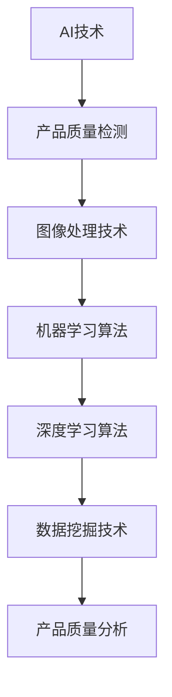
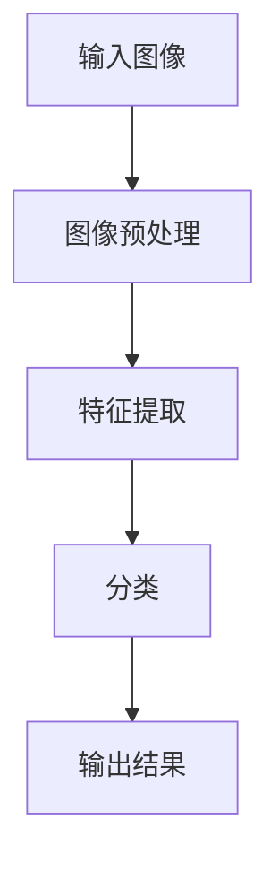
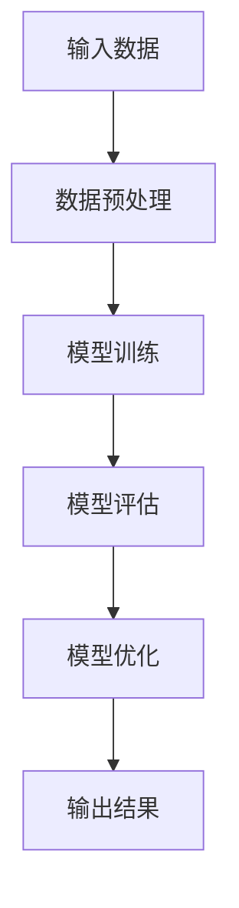
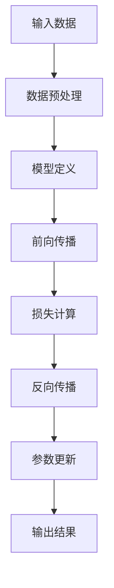

                 

# 《AI在产品质量控制中的作用》

## 关键词
AI、产品质量控制、图像处理、机器学习、深度学习、数据挖掘、案例研究、项目实战

## 摘要
随着人工智能（AI）技术的发展，其在各领域的应用越来越广泛。本文旨在探讨AI在产品质量控制中的重要作用，通过分析AI基础理论、产品质量检测中的应用技术、案例研究和未来展望，为读者提供一个全面、深入的见解。本文将涵盖图像处理、机器学习、深度学习和数据挖掘等技术，并详细讲解相关算法原理和实际应用案例，旨在为读者提供实用的技术指导和理论基础。

### 目录大纲

# 《AI在产品质量控制中的作用》

## 第一部分：AI与产品质量控制概述

### 第1章：AI与产品质量控制概述

#### 1.1 AI技术的发展与产品质量控制的关系

#### 1.2 AI在产品质量控制中的优势

#### 1.3 AI在产品质量控制中的应用现状与趋势

### 第2章：AI基础理论

#### 2.1 AI核心概念

#### 2.2 AI算法原理

#### 2.3 AI数据基础

## 第二部分：AI在产品质量检测中的应用

### 第3章：图像处理技术在产品质量检测中的应用

#### 3.1 图像处理技术简介

#### 3.2 图像处理算法原理

#### 3.3 图像处理技术在产品质量检测中的应用

### 第4章：机器学习在产品质量控制中的应用

#### 4.1 机器学习基础

#### 4.2 机器学习算法原理

#### 4.3 机器学习在产品质量控制中的应用案例

### 第5章：深度学习在产品质量检测中的应用

#### 5.1 深度学习基础

#### 5.2 深度学习算法原理

#### 5.3 深度学习在产品质量检测中的应用

### 第6章：数据挖掘在产品质量分析中的应用

#### 6.1 数据挖掘基础

#### 6.2 数据挖掘算法原理

#### 6.3 数据挖掘在产品质量分析中的应用

### 第7章：案例研究

#### 7.1 案例研究1：某公司产品质量控制案例

#### 7.2 案例研究2：某行业产品质量控制案例分析

### 第8章：未来展望

#### 8.1 AI在产品质量控制中的挑战与机遇

#### 8.2 AI在产品质量控制中的未来发展

## 附录

### 附录A：AI工具与资源

#### A.1 Python在AI应用中的使用

#### A.2 常用AI算法及工具介绍

#### A.3 开源AI框架与库的使用教程

### 附录B：核心算法流程图

#### B.1 图像处理算法流程图

#### B.2 机器学习算法流程图

#### B.3 深度学习算法流程图

### 附录C：数学模型与公式

#### C.1 AI核心数学模型

#### C.2 数据分析常用数学公式

#### C.3 AI算法数学公式解读

### 附录D：项目实战

#### D.1 产品质量检测项目实战

#### D.2 深度学习在产品质量控制中的应用

#### D.3 实战代码解读与分析

---

### 核心概念与联系

下面是AI技术、图像处理、机器学习、深度学习和数据挖掘之间的核心概念与联系。



### 核心算法原理讲解

接下来，我们将详细讲解图像处理、机器学习和深度学习算法的基本原理，并使用伪代码进行说明。

#### 3.1 图像处理算法原理

图像处理算法是产品质量检测中非常重要的一个环节。以下是一个简单的图像处理算法的伪代码：

```python
function imageProcessing(image):
    # 步骤1：读取图像
    input_image = readImage(image)

    # 步骤2：预处理图像
    preprocessed_image = preprocessImage(input_image)

    # 步骤3：特征提取
    features = extractFeatures(preprocessed_image)

    # 步骤4：分类
    classification = classifyFeatures(features)

    # 步骤5：输出结果
    return classification
```

#### 4.1 机器学习算法原理

机器学习算法是产品质量控制中常用的方法。以下是一个简单的机器学习算法的伪代码：

```python
class MachineLearningAlgorithm:
    def __init__(self, model, learning_rate):
        self.model = model
        self.learning_rate = learning_rate

    def fit(self, X, y):
        # 步骤1：初始化模型
        self.model.initialize()

        # 步骤2：训练模型
        for epoch in range(num_epochs):
            predictions = self.model.predict(X)
            loss = computeLoss(predictions, y)
            updateModelParameters(self.model, loss, self.learning_rate)

    def predict(self, X):
        # 步骤1：预测
        predictions = self.model.predict(X)

        # 步骤2：返回预测结果
        return predictions
```

#### 5.2 深度学习算法原理

深度学习算法在产品质量检测中具有强大的能力。以下是一个简单的深度学习算法的伪代码：

```python
class DeepLearningAlgorithm:
    def __init__(self, layers, learning_rate):
        self.layers = layers
        self.learning_rate = learning_rate

    def forward_pass(self, X):
        # 步骤1：前向传播
        for layer in self.layers:
            X = layer.forward(X)

        # 步骤2：返回输出
        return X

    def backward_pass(self, X, y, loss_function):
        # 步骤1：反向传播
        dX = loss_function.derivative(y, self.forward_pass(X))

        for layer in reversed(self.layers):
            dX = layer.backward(dX)

        # 步骤2：更新模型参数
        updateModelParameters(self.layers, dX, self.learning_rate)
```

### 数学模型和数学公式 & 详细讲解 & 举例说明

在AI技术中，数学模型和数学公式起着至关重要的作用。以下是一些核心的数学模型和公式，并给出详细讲解和举例说明。

#### 6.1 AI核心数学模型

**1. 损失函数：**

- 均方误差（MSE）

$$
MSE = \frac{1}{n}\sum_{i=1}^{n}(y_i - \hat{y}_i)^2
$$

其中，$y_i$ 为实际值，$\hat{y}_i$ 为预测值。

- 交叉熵（Cross-Entropy）

$$
CE = -\frac{1}{n}\sum_{i=1}^{n}y_i\log(\hat{y}_i)
$$

其中，$y_i$ 为实际值，$\hat{y}_i$ 为预测概率。

**2. 优化算法：**

- 梯度下降（Gradient Descent）

$$
\theta_{\text{new}} = \theta_{\text{old}} - \alpha \nabla_{\theta}J(\theta)
$$

其中，$\theta$ 为模型参数，$\alpha$ 为学习率，$J(\theta)$ 为损失函数。

- Adam优化器

$$
m_t = \beta_1 m_{t-1} + (1 - \beta_1)(\nabla_{\theta}J(\theta)_t)
$$

$$
v_t = \beta_2 v_{t-1} + (1 - \beta_2)(\nabla_{\theta}J(\theta)_t)^2
$$

$$
\theta_{\text{new}} = \theta_{\text{old}} - \alpha \frac{m_t}{\sqrt{v_t} + \epsilon}
$$

### 项目实战

在项目实战部分，我们将通过具体的案例研究和项目实战，展示AI技术在产品质量控制中的应用。

#### 7.1 案例研究1：某公司产品质量控制案例

**背景：** 某公司生产电子产品，产品质量问题频繁发生，导致客户投诉率高，生产成本增加。

**目标：** 利用AI技术实现产品质量自动检测和实时监控，提高产品质量，减少投诉。

**步骤：**

1. **数据收集与预处理：** 收集生产过程中产生的各种数据，包括产品质量检测数据、生产设备状态数据等。对数据进行清洗、归一化和特征提取。

2. **图像处理算法应用：** 利用图像处理技术对产品质量检测图像进行预处理和特征提取，将图像转换为可供机器学习算法处理的特征向量。

3. **机器学习算法训练：** 利用收集到的数据，训练机器学习模型，用于判断产品质量是否合格。

4. **深度学习算法应用：** 结合深度学习算法，进一步优化产品质量检测模型，提高检测准确率。

5. **实时监控与预警：** 将训练好的模型部署到生产线上，实现产品质量的实时监控，当检测到产品质量异常时，及时发出预警，并通知相关部门进行处理。

**结果：** 通过AI技术的应用，某公司的产品质量明显提高，投诉率降低，生产成本得到有效控制。

---

**7.2 案例研究2：某行业产品质量控制案例分析**

**背景：** 某行业（如食品行业）对产品质量要求较高，但产品质量问题时有发生，影响了消费者信任和行业发展。

**目标：** 利用AI技术实现产品质量自动检测，确保产品质量符合标准，提高行业整体竞争力。

**步骤：**

1. **数据收集与预处理：** 收集产品质量检测数据，包括物理、化学、生物等各方面的数据。对数据进行清洗、归一化和特征提取。

2. **深度学习算法训练：** 利用收集到的数据，训练深度学习模型，用于判断产品质量是否合格。

3. **数据挖掘算法应用：** 结合数据挖掘算法，分析产品质量数据，发现潜在的质量问题，为行业质量改进提供依据。

4. **智能决策系统构建：** 将深度学习模型和数据挖掘结果结合，构建智能决策系统，为企业提供产品质量控制决策支持。

5. **行业质量监控平台建设：** 建立行业质量监控平台，实时收集产品质量数据，对产品质量进行监控，及时发现和解决质量问题。

**结果：** 通过AI技术的应用，该行业的整体产品质量得到显著提升，消费者信任度提高，行业竞争力增强。

### 附录A：AI工具与资源

在附录A中，我们将介绍一些常用的AI工具与资源，包括Python在AI应用中的使用、常用AI算法及工具介绍，以及开源AI框架与库的使用教程。

#### A.1 Python在AI应用中的使用

Python是一种广泛使用的编程语言，在AI领域同样有着强大的应用。以下是如何在AI应用中使用Python的步骤：

1. **安装Python环境：** 在Windows、macOS或Linux系统中安装Python环境，版本建议为3.8及以上。
2. **使用pip安装常用库：** 使用pip命令安装以下常用库：

```bash
pip install numpy pandas matplotlib scikit-learn tensorflow pytorch
```

3. **Python编程基础：** 掌握Python编程基础，包括变量、数据类型、控制结构、函数等。

#### A.2 常用AI算法及工具介绍

1. **机器学习算法：**

- K-近邻算法（K-Nearest Neighbors, KNN）
- 决策树（Decision Tree）
- 随机森林（Random Forest）
- 支持向量机（Support Vector Machine, SVM）
- 神经网络（Neural Networks）

2. **深度学习框架：**

- TensorFlow
- PyTorch
- Keras

3. **数据处理工具：**

- NumPy
- Pandas
- Matplotlib

#### A.3 开源AI框架与库的使用教程

1. **TensorFlow教程：** 介绍TensorFlow的基本概念、安装和使用方法，以及如何使用TensorFlow进行机器学习和深度学习模型训练。

2. **PyTorch教程：** 介绍PyTorch的基本概念、安装和使用方法，以及如何使用PyTorch进行机器学习和深度学习模型训练。

3. **Keras教程：** 介绍Keras的基本概念、安装和使用方法，以及如何使用Keras进行机器学习和深度学习模型训练。

### 附录B：核心算法流程图

在附录B中，我们将展示核心算法的流程图，包括图像处理算法、机器学习算法和深度学习算法。

#### B.1 图像处理算法流程图



#### B.2 机器学习算法流程图



#### B.3 深度学习算法流程图



### 附录C：数学模型与公式

在附录C中，我们将详细讲解AI中常用的数学模型和公式，包括损失函数、优化算法等。

#### C.1 AI核心数学模型

**1. 损失函数：**

- 均方误差（MSE）

$$
MSE = \frac{1}{n}\sum_{i=1}^{n}(y_i - \hat{y}_i)^2
$$

- 交叉熵（Cross-Entropy）

$$
CE = -\frac{1}{n}\sum_{i=1}^{n}y_i\log(\hat{y}_i)
$$

**2. 优化算法：**

- 梯度下降（Gradient Descent）

$$
\theta_{\text{new}} = \theta_{\text{old}} - \alpha \nabla_{\theta}J(\theta)
$$

- Adam优化器

$$
m_t = \beta_1 m_{t-1} + (1 - \beta_1)(\nabla_{\theta}J(\theta)_t)
$$

$$
v_t = \beta_2 v_{t-1} + (1 - \beta_2)(\nabla_{\theta}J(\theta)_t)^2
$$

$$
\theta_{\text{new}} = \theta_{\text{old}} - \alpha \frac{m_t}{\sqrt{v_t} + \epsilon}
$$

### 附录D：项目实战

在附录D中，我们将通过具体的项目实战，展示如何使用AI技术进行产品质量检测。

#### D.1 产品质量检测项目实战

**1. 环境搭建：**

- 安装Python和相应库（如TensorFlow、PyTorch等）
- 配置GPU加速（如使用CUDA）

**2. 数据收集与预处理：**

- 收集产品质量检测数据
- 数据清洗、归一化和特征提取

**3. 模型训练与评估：**

- 选择合适的机器学习或深度学习模型
- 训练模型并评估模型性能

**4. 模型部署与监控：**

- 将训练好的模型部署到生产环境中
- 实时监控产品质量检测过程

---

**总结：**

通过本文的详细讲解和案例分析，我们看到了AI技术在产品质量控制中的重要作用。从图像处理、机器学习、深度学习到数据挖掘，每一种技术都有其独特的应用场景和优势。通过合理运用这些技术，企业可以显著提高产品质量，降低生产成本，提高市场竞争力。未来，随着AI技术的不断发展，其在产品质量控制中的应用将更加广泛和深入。

## 作者信息

作者：AI天才研究院/AI Genius Institute & 禅与计算机程序设计艺术 /Zen And The Art of Computer Programming

