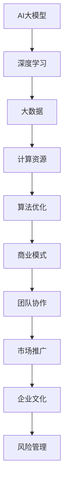

                 

### AI大模型创业：如何应对未来价格战？

#### 关键词：
- AI大模型
- 创业
- 价格战
- 应对策略

##### 摘要：
本文将探讨AI大模型创业领域的现状和未来挑战，特别是如何应对日益激烈的价格战。文章首先介绍了AI大模型的发展背景、核心概念和应用领域，随后分析了创业背景与挑战，提出了系统性的AI大模型创业策略。通过市场分析、技术创新、商业模式设计、市场推广和团队管理等多方面的详细探讨，文章提供了一系列实战案例和解决方案，旨在为创业者提供实用的指导。

---

### 目录大纲

1. **AI大模型创业：如何应对未来价格战？**
   - 关键词：
   - 摘要：

2. **第一部分: 理解AI大模型与创业背景**
   - **第1章 AI大模型概述**
     - **1.1 AI大模型的发展背景**
     - **1.2 AI大模型的核心概念**
     - **1.3 AI大模型的应用领域**
   - **第2章 创业背景与挑战**
     - **2.1 创业背景分析**
     - **2.2 AI大模型创业中的挑战**

3. **第二部分: AI大模型创业策略**
   - **第3章 创业策略规划**
     - **3.1 市场分析**
     - **3.2 产品定位**
   - **第4章 技术创新与研发**
     - **4.1 技术创新方向**
     - **4.2 研发流程与管理**
   - **第5章 商业模式设计**
     - **5.1 商业模式概述**
     - **5.2 收入模式与成本控制**
   - **第6章 市场推广与营销策略**
     - **6.1 市场推广策略**
     - **6.2 营销策略分析**
   - **第7章 团队管理与文化建设**
     - **7.1 团队建设与管理**
     - **7.2 企业文化建设**

4. **第三部分: AI大模型创业实践**
   - **第8章 风险管理与应对策略**
   - **第9章 创业实战案例**
   - **第10章 创业过程中的问题与解决方案**
   - **第11章 成功经验与未来展望**

5. **附录**
   - **附录A：AI大模型开发工具与资源**
   - **附录B：核心概念与联系**
   - **附录C：数学模型和数学公式 & 详细讲解 & 举例说明**
   - **附录D：项目实战**
   - **参考文献**

---

现在，我们已经确立了文章的结构和内容大纲。接下来，我们将分章节详细探讨AI大模型创业的核心主题。首先，我们从AI大模型的发展背景和核心概念开始。

### 第一部分: 理解AI大模型与创业背景

#### 第1章 AI大模型概述

AI大模型，是指那些训练数据量庞大、参数数量巨大且能够进行复杂推理的神经网络模型。它们是现代人工智能技术的基石，尤其在大数据分析、自然语言处理、计算机视觉等领域中发挥着关键作用。

##### 1.1 AI大模型的发展背景

AI大模型的发展离不开大数据和深度学习的兴起。随着计算能力的提升和海量数据的积累，机器学习模型得以不断优化和扩展。从早期的浅层网络，到如今的深度神经网络，AI大模型经历了数次技术革新。

- **大数据与AI的融合**：大数据为AI提供了丰富的训练素材，使得模型能够更准确地捕捉数据中的模式和规律。特别是在2010年左右，数据量的爆炸式增长推动了AI大模型的崛起。
- **计算资源的增长**：随着GPU、TPU等专用硬件的出现，计算能力的提升为训练和部署大规模模型提供了技术保障。
- **深度学习的突破**：深度学习算法，尤其是卷积神经网络（CNN）和递归神经网络（RNN），为AI大模型的发展奠定了理论基础。

##### 1.2 AI大模型的核心概念

AI大模型的核心概念包括以下几个方面：

- **大模型的定义与特点**：大模型通常拥有数百万到数十亿个参数，可以处理海量数据，具备强大的表征和学习能力。
- **大模型的技术架构**：技术架构包括前向传播、反向传播、激活函数、损失函数等基本组件。现代大模型架构还引入了残差网络、Transformer等创新设计。
- **大模型与深度学习的联系**：大模型是深度学习的一个重要分支，深度学习的发展推动了大模型的进步，反之亦然。

##### 1.3 AI大模型的应用领域

AI大模型在多个领域展示了其强大的应用潜力：

- **工业界应用**：在智能制造、自动驾驶、供应链优化等领域，AI大模型帮助提升了生产效率、降低了成本。
- **服务业应用**：在金融服务、医疗健康、教育等领域，AI大模型通过个性化推荐、智能诊断、自动教学等应用，提升了用户体验。
- **消费品行业应用**：在电子商务、广告营销、智能家居等领域，AI大模型通过数据挖掘、用户行为分析等手段，实现了精准营销和智能推荐。

综上所述，AI大模型的发展背景、核心概念和应用领域为我们理解AI大模型创业提供了坚实的基础。在接下来的章节中，我们将深入探讨创业背景与挑战，为创业策略的制定做好准备。

---

### 第2章 创业背景与挑战

在AI大模型日益普及的今天，创业成为许多人追求梦想的途径。然而，AI大模型创业并非易事，面临着诸多挑战。本章将分析当前创业背景，探讨AI大模型创业中的挑战，以及如何应对这些挑战。

##### 2.1 创业背景分析

当前，创业环境的机遇与挑战并存：

- **政策支持**：许多国家出台了一系列政策，鼓励科技创新和创业活动，为AI大模型创业提供了有利条件。
- **市场机遇**：随着AI技术的不断成熟，AI大模型在各行各业的应用越来越广泛，市场前景广阔。
- **资本涌入**：风险投资和创业投资对AI大模型的关注不断升温，为创业者提供了充足的资金支持。

然而，创业所需的资源同样不可忽视：

- **技术资源**：AI大模型创业需要大量的技术人才和研发投入，包括数据科学家、算法工程师等。
- **资金资源**：初期资金需求较大，用于购买硬件设备、支付研发人员薪资、市场推广等。
- **市场资源**：了解市场需求，找准切入点，是创业成功的关键。

##### 2.2 创业团队建设

创业团队的建设是创业成功的关键因素之一。一个高效的团队需要具备以下特点：

- **技能多样性**：团队成员应具备不同的技能，如算法、工程、产品、市场等，以确保项目能够全面发展。
- **协作精神**：团队成员之间应保持良好的沟通和协作，共同推进项目进展。
- **创新思维**：团队成员应具备创新精神，敢于尝试新思路和新方法。

##### 2.3 AI大模型创业中的挑战

AI大模型创业面临以下挑战：

- **技术层面的挑战**：AI大模型的训练和部署需要大量的计算资源和专业技术，技术门槛较高。
- **商业模式的挑战**：如何将AI大模型的技术优势转化为商业价值，是创业者需要深思的问题。
- **竞争对手的挑战**：AI大模型领域竞争激烈，创业者需要不断创新，以保持竞争力。

##### 技术层面的挑战

- **计算资源需求**：训练AI大模型需要大量计算资源，这要求创业者具备一定的资金实力和资源整合能力。
- **数据质量与数量**：AI大模型的训练依赖于大量高质量的数据，数据的获取和处理是技术层面的重要挑战。
- **算法优化**：如何优化算法，提高模型的准确性和效率，是创业者需要不断探索的问题。

##### 商业模式的挑战

- **价值创造**：AI大模型的技术优势如何转化为商业价值，创业者需要找到合适的商业模式。
- **市场定位**：明确目标市场和用户群体，是创业成功的关键。创业者需要深入了解市场需求，找准切入点。
- **定价策略**：AI大模型的定价策略需要考虑成本、市场需求和竞争环境，以确保可持续发展。

##### 竞争对手的挑战

- **技术竞争**：AI大模型领域竞争激烈，创业者需要不断创新，以保持技术领先。
- **市场地位**：如何快速占领市场，建立品牌影响力，是创业者需要面对的挑战。

##### 应对策略

面对上述挑战，创业者可以采取以下策略：

- **技术创新**：不断探索新技术，提高模型性能和效率，保持技术领先。
- **商业模式创新**：寻找差异化竞争优势，探索新的商业模式，提高盈利能力。
- **市场定位**：深入了解市场需求，找准切入点，快速占领市场。

综上所述，AI大模型创业背景充满机遇，但也面临诸多挑战。通过科学规划、技术创新和商业模式创新，创业者可以更好地应对挑战，实现创业梦想。

---

### 第二部分: AI大模型创业策略

#### 第3章 创业策略规划

创业策略规划是AI大模型创业成功的关键步骤。一个有效的策略规划可以帮助创业者明确目标、分析市场、制定产品定位，从而在激烈的市场竞争中脱颖而出。

##### 3.1 市场分析

市场分析是创业策略规划的基础，它包括以下几个方面：

- **目标市场定位**：明确创业公司的目标市场和客户群体。这需要深入了解目标市场的需求、市场规模和增长潜力。
  - **目标市场选择**：根据自身的技术优势和市场需求，选择具有高增长潜力的细分市场。
  - **客户群体分析**：明确目标客户的特征，包括年龄、性别、收入水平、教育背景等。

- **市场需求分析**：研究目标市场的需求变化和趋势，了解用户对AI大模型产品的期望和痛点。
  - **用户需求调查**：通过问卷调查、访谈等方式收集用户反馈，了解他们的需求和期望。
  - **市场调研报告**：分析市场研究报告，掌握市场趋势和竞争态势。

- **市场竞争分析**：了解竞争对手的市场策略、产品优势和市场份额，评估自身的竞争地位。
  - **竞争对手分析**：收集竞争对手的产品、定价、市场推广等信息，分析其优势和劣势。
  - **市场地位评估**：评估自身在市场中的位置，确定需要采取的市场策略。

##### 3.2 产品定位

产品定位是创业策略规划的核心，它决定了产品的市场定位和竞争优势。

- **产品功能定位**：明确产品的核心功能和技术特点，确保产品能够满足市场需求。
  - **核心功能**：产品应具备独特的功能，能够解决用户的核心问题。
  - **技术特点**：产品应具备先进的技术特性，如高效、准确、易用等。

- **产品特性与优势**：突出产品的独特卖点，提高市场竞争力。
  - **特性**：产品应具备独特的特性，如高性能、高精度、个性化定制等。
  - **优势**：产品应具备明显的优势，如成本效益、用户体验、快速响应等。

- **产品差异化策略**：通过差异化策略，使产品在市场中脱颖而出。
  - **差异化要素**：确定产品的差异化要素，如技术创新、用户体验、售后服务等。
  - **差异化营销**：通过差异化营销策略，向目标市场传达产品的独特价值。

##### 3.3 产品差异化策略

产品差异化策略是提高市场竞争力的关键。通过以下方法实现产品差异化：

- **技术创新**：不断推进技术创新，开发具有独特功能和优势的产品。
  - **研究投入**：增加研发投入，吸引顶尖人才，推动技术进步。
  - **技术合作**：与高校、科研机构合作，共享技术资源，加快技术创新。

- **用户体验**：优化产品用户体验，提高用户满意度和忠诚度。
  - **用户体验设计**：注重用户体验设计，提供简单易用、高效的产品。
  - **用户反馈**：收集用户反馈，持续改进产品，满足用户需求。

- **售后服务**：提供优质的售后服务，增强用户信任和品牌价值。
  - **服务团队**：建立专业的售后服务团队，提供快速响应和高效解决。
  - **服务承诺**：明确服务承诺，确保用户权益。

通过上述策略规划，创业者可以明确市场定位、产品定位和差异化策略，为创业成功奠定坚实基础。在接下来的章节中，我们将探讨技术创新与研发、商业模式设计、市场推广与营销策略等方面，为创业者提供全方位的指导。

---

### 第4章 技术创新与研发

技术创新与研发是AI大模型创业的核心驱动力，直接影响着产品的竞争力。本章将详细探讨AI大模型的技术创新方向、研发流程与管理，以及研发资源规划。

##### 4.1 技术创新方向

AI大模型的技术创新方向主要包括以下几个方面：

- **大模型的改进方向**：随着计算资源的提升和算法的优化，大模型在性能和效率上不断突破。创业者可以关注以下改进方向：
  - **参数剪枝**：通过剪枝减少模型参数数量，降低计算复杂度，提高模型效率。
  - **量化**：使用低精度数值（如16位或8位浮点数）代替32位浮点数，降低计算和存储需求。
  - **增量学习**：允许模型在已有知识的基础上学习新任务，提高模型的适应性和灵活性。

- **辅助技术的研究与应用**：除了核心模型，辅助技术的研究与应用同样重要，有助于提升模型的整体性能：
  - **数据增强**：通过数据增强技术，生成更多样化的训练数据，提高模型泛化能力。
  - **模型融合**：结合多种模型或算法，取长补短，提高预测准确性。
  - **知识蒸馏**：将大型模型的知识传递给小型模型，实现高效推理和部署。

- **创新的可行性分析**：在确定技术创新方向后，创业者需要评估创新的可行性，包括技术难度、成本和市场需求：
  - **技术难度**：分析所需技术是否已成熟，是否需要大量研发投入。
  - **成本分析**：评估技术创新所需的资金、人力和时间成本。
  - **市场需求**：分析目标市场对创新技术的需求程度，确保创新具有市场前景。

##### 4.2 研发流程与管理

有效的研发流程与管理是确保技术创新顺利实施的关键。以下是一个典型的AI大模型研发流程：

- **需求分析**：明确产品需求，确定研发目标和功能模块。
  - **用户需求调查**：通过市场调研、用户访谈等方式，收集用户需求。
  - **需求文档编写**：编写详细的需求文档，明确产品的功能和技术要求。

- **原型设计**：根据需求文档，设计产品原型，确定初步的技术方案。
  - **系统架构设计**：设计系统的整体架构，包括数据流、模块划分等。
  - **界面设计**：设计用户界面，确保用户体验。

- **技术研发**：按照设计文档，开展技术研发工作。
  - **算法开发**：根据需求，开发相应的算法模型。
  - **代码实现**：编写代码，实现算法模型。
  - **集成测试**：将各个模块集成，进行功能测试和性能测试。

- **验证与迭代**：对研发成果进行验证，并根据反馈进行迭代优化。
  - **用户测试**：邀请用户进行测试，收集反馈意见。
  - **问题修复**：根据测试反馈，修复问题和缺陷。

- **产品发布**：完成最终测试后，发布产品。
  - **上线准备**：确保产品上线所需的硬件、网络等基础设施准备就绪。
  - **发布计划**：制定详细的产品发布计划，确保顺利上线。

##### 4.3 研发资源规划

研发资源规划是确保研发工作顺利进行的重要环节。以下是一个典型的研发资源规划步骤：

- **人力规划**：根据项目需求，确定研发团队的人员配置。
  - **技术专家**：聘请技术专家，负责算法开发和关键技术难题的攻克。
  - **工程师**：招聘工程师，负责代码编写和系统集成。
  - **测试人员**：配置测试人员，负责产品测试和问题修复。

- **资金规划**：根据项目预算，合理分配资金。
  - **研发资金**：确保研发过程中所需的资金充足，包括设备采购、人员薪资等。
  - **运营资金**：预留一定比例的资金，用于产品上线后的运营和维护。

- **时间规划**：制定详细的研发时间表，确保项目按时完成。
  - **里程碑计划**：设置项目里程碑，确保每个阶段的工作按时完成。
  - **风险管理**：预留时间缓冲，应对可能出现的技术风险和需求变更。

通过技术创新、有效的研发流程与管理和合理的研发资源规划，创业者可以确保AI大模型研发工作的顺利进行，为创业成功奠定基础。在接下来的章节中，我们将探讨商业模式设计、市场推广与营销策略等关键方面，为创业者提供更全面的指导。

---

### 第5章 商业模式设计

在AI大模型创业中，商业模式设计是确保企业可持续发展和盈利的关键。本章将详细探讨商业模式的基本概念与要素，以及AI大模型的商业模式创新点。

##### 5.1 商业模式概述

商业模式是指企业如何创造、传递和捕获价值的一系列策略和活动。一个成功的商业模式需要明确以下几个方面：

- **价值创造**：明确企业如何为用户提供价值，解决用户的问题或满足需求。
  - **用户需求分析**：通过市场调研、用户访谈等方式，深入分析用户需求，了解用户痛点。
  - **价值主张**：明确产品或服务的独特卖点，如何为用户创造价值。

- **价值传递**：描述企业如何将价值传递给用户，包括产品或服务的提供方式。
  - **产品与服务设计**：根据用户需求，设计满足用户期望的产品或服务。
  - **市场推广**：制定市场推广策略，提高产品或服务的知名度。

- **价值捕获**：描述企业如何从用户那里获取价值，实现盈利。
  - **收入模式**：确定企业的收入来源，如产品销售、订阅服务、广告等。
  - **成本结构**：明确企业的成本结构，包括固定成本和可变成本。

##### 5.2 传统商业模式与AI商业模式对比

传统商业模式与AI商业模式在多个方面存在显著差异：

- **数据驱动**：传统商业模式主要依赖市场调研和用户反馈，而AI商业模式通过大数据和机器学习技术，可以更准确地预测用户需求和市场趋势。
  - **精准营销**：利用用户数据，实现精准营销，提高营销效率。
  - **个性化服务**：根据用户行为数据，提供个性化推荐和服务。

- **效率提升**：AI技术可以大幅提升企业的运营效率，降低成本。
  - **自动化生产**：通过自动化技术，提高生产效率，降低人力成本。
  - **智能决策**：利用AI算法，优化决策过程，提高运营效率。

- **业务模式创新**：AI技术为企业提供了更多创新业务模式的机会。
  - **产品创新**：通过AI技术，开发出更具竞争力的新产品或服务。
  - **服务创新**：利用AI技术，提供全新的服务模式，如智能客服、虚拟助手等。

##### 5.3 AI大模型商业模式的创新点

AI大模型的商业模式创新体现在以下几个方面：

- **数据驱动的商业模式**：通过收集和分析大量用户数据，实现精准营销和个性化服务。
  - **个性化推荐**：利用用户行为数据，为用户提供个性化的推荐和服务。
  - **精准营销**：通过数据挖掘，确定目标客户群体，提高营销ROI。

- **自动化运营**：利用AI技术实现业务流程的自动化，降低运营成本。
  - **智能客服**：通过自然语言处理技术，提供智能客服服务，提高客户满意度。
  - **自动化生产**：利用机器学习技术，优化生产流程，提高生产效率。

- **开放平台**：构建开放平台，吸引开发者和服务提供商加入，共同构建生态系统。
  - **开发者社区**：建立开发者社区，提供技术支持和资源，吸引开发者贡献代码和解决方案。
  - **合作伙伴关系**：与行业合作伙伴建立合作关系，共同开发新的应用场景和商业模式。

- **数据增值**：通过数据增值服务，实现额外的收入来源。
  - **数据报告**：为用户提供专业的数据报告和分析，帮助用户发现商业机会。
  - **数据交易**：建立数据交易平台，实现数据资产的流通和增值。

通过上述商业模式创新，AI大模型企业可以在竞争激烈的市场中脱颖而出，实现可持续发展。在接下来的章节中，我们将探讨收入模式与成本控制，为创业者的商业模式设计提供更多实用建议。

---

### 第6章 市场推广与营销策略

在AI大模型创业过程中，市场推广与营销策略至关重要。一个有效的市场推广策略能够帮助企业快速提高品牌知名度，吸引目标客户，从而实现产品销售和业务增长。本章将详细探讨市场推广策略、营销策略分析以及如何优化营销策略。

##### 6.1 市场推广策略

市场推广策略的核心目标是提高产品的市场覆盖率，增加潜在客户。以下是一些常用的市场推广策略：

- **品牌建设**：建立强大的品牌形象，提高品牌知名度和认知度。
  - **品牌定位**：明确品牌定位，确保品牌形象与目标市场匹配。
  - **品牌宣传**：利用多渠道（如社交媒体、线下活动等）进行品牌宣传，提高品牌曝光率。

- **市场推广渠道**：选择合适的推广渠道，扩大市场影响力。
  - **在线推广**：通过搜索引擎优化（SEO）、内容营销、社交媒体推广等手段，提高在线曝光率。
  - **线下推广**：通过参加行业展会、举办讲座、赞助活动等方式，增强线下市场影响力。

- **营销活动策划**：举办有吸引力的营销活动，吸引客户参与，增加产品销量。
  - **促销活动**：开展限时促销、优惠券等促销活动，刺激客户购买。
  - **用户互动**：通过线上互动（如社交媒体互动、用户论坛等）和线下互动（如用户交流会、客户研讨会等），增加用户粘性。

##### 6.2 营销策略分析

有效的营销策略需要基于对目标客户和市场环境的深入分析。以下是对目标客户、竞品分析和营销策略优化的一些关键点：

- **目标客户分析**：明确目标客户群体，了解其需求和行为习惯。
  - **客户画像**：通过数据分析，构建目标客户的画像，包括年龄、性别、收入水平、兴趣偏好等。
  - **客户需求**：分析目标客户的需求，了解他们关心的问题和期望，以便提供符合需求的产品和服务。

- **竞品分析**：研究竞争对手的产品、市场策略和用户反馈，找到自身的差异化竞争优势。
  - **产品对比**：对比竞品的产品功能、性能和价格，分析自身产品的优势和劣势。
  - **用户反馈**：收集和分析用户对竞品的反馈，了解用户对竞品的满意度和不满意度，从而优化自身产品。

- **营销策略优化**：根据市场反馈和数据分析，不断调整和优化营销策略。
  - **策略调整**：根据营销活动的效果，及时调整推广渠道、营销内容和推广预算。
  - **数据驱动**：利用数据分析和用户反馈，制定科学合理的营销策略，提高营销效果。

##### 6.3 营销策略优化

为了确保营销策略的有效性，创业者需要不断优化营销策略。以下是一些优化营销策略的建议：

- **多渠道整合**：综合利用多种推广渠道，形成协同效应，提高市场覆盖率。
  - **内容营销**：通过高质量的内容（如博客、白皮书、视频等）吸引目标客户，增加网站流量。
  - **社交媒体营销**：利用社交媒体平台（如微博、微信、LinkedIn等）进行品牌宣传和用户互动。

- **精准营销**：通过大数据分析，实现精准定位和个性化推荐，提高营销效果。
  - **用户行为分析**：分析用户行为数据，了解用户的浏览习惯、购买偏好等，提供个性化的营销内容。
  - **个性化推荐**：利用机器学习算法，为用户提供个性化的产品推荐，提高用户转化率。

- **用户参与**：通过用户参与和互动，增加用户粘性，提高品牌忠诚度。
  - **用户论坛**：建立用户论坛，鼓励用户交流和分享使用经验，增强用户社区感。
  - **客户反馈**：积极收集用户反馈，及时回应用户问题，提高用户满意度。

通过有效的市场推广与营销策略，AI大模型创业公司可以在竞争激烈的市场中脱颖而出，实现快速成长和业务拓展。在接下来的章节中，我们将探讨团队管理与文化建设，为创业成功提供更多保障。

---

### 第7章 团队管理与文化建设

在AI大模型创业过程中，团队管理和文化建设是确保公司持续发展和成功的核心因素。本章将详细探讨团队建设与管理、团队协作与沟通、团队激励与成长以及企业文化建设。

##### 7.1 团队建设与管理

团队建设与管理是创业公司成功的关键。一个高效的团队能够更好地应对挑战，实现公司目标。以下是一些关键点：

- **团队角色与职责**：明确团队成员的角色和职责，确保每个成员都知道自己的工作内容和期望。
  - **领导层**：团队领导负责制定战略、决策和协调团队工作。
  - **技术人员**：技术团队成员负责算法研发、代码实现和系统集成。
  - **市场人员**：市场团队成员负责市场推广、品牌建设和客户关系管理。

- **团队协作与沟通**：建立有效的沟通机制，确保团队成员之间能够顺畅协作。
  - **定期会议**：定期召开团队会议，讨论项目进展、问题和解决方案。
  - **信息共享**：建立信息共享平台，确保团队成员能够及时获取项目相关的重要信息。

- **团队激励与成长**：通过激励和培训，提高团队士气和成员的专业能力。
  - **奖励机制**：设立奖励机制，对表现优秀的团队成员进行奖励。
  - **培训与发展**：提供培训机会，帮助团队成员不断提升专业能力和技能。

##### 7.2 企业文化建设

企业文化是企业价值观和行为规范的体现，对员工的工作态度和行为有着深远影响。以下是一些关键点：

- **企业文化的定义与作用**：明确企业文化的重要性，以及它对团队和公司发展的影响。
  - **企业文化的定义**：企业文化是指企业在长期发展中形成的一套共同价值观、信念和行为准则。
  - **企业文化的作用**：企业文化能够凝聚员工，增强团队凝聚力，提升企业竞争力。

- **企业价值观的塑造**：明确企业价值观，并将其融入日常工作中。
  - **价值观定义**：通过公司使命、愿景和核心价值观的阐述，明确企业的发展方向和目标。
  - **价值观传播**：通过内部培训、会议、文化建设活动等方式，将企业价值观传递给全体员工。

- **企业文化的传承与传播**：确保企业文化在团队中得以传承和发扬。
  - **内部传承**：通过团队协作、员工培训和内部交流，将企业文化传递给新员工。
  - **外部传播**：通过市场推广、公关活动等渠道，将企业文化展示给外部世界。

通过有效的团队管理与文化建设，创业公司可以建立一个高效、和谐、有凝聚力的团队，为公司的长期成功奠定坚实基础。在接下来的章节中，我们将探讨风险管理与应对策略，为创业公司的稳定发展提供保障。

---

### 第8章 风险管理与应对策略

在AI大模型创业过程中，风险是不可避免的。有效的风险管理策略能够帮助企业识别、评估和控制风险，确保业务的稳定发展和持续创新。本章将详细探讨风险识别与评估、风险应对策略以及如何降低风险。

##### 8.1 风险识别与评估

风险识别与评估是风险管理的第一步，旨在识别可能影响公司业务目标实现的风险，并评估这些风险的可能性和影响。

- **技术风险**：技术风险是指由于技术问题导致项目进展受阻或失败的风险。
  - **算法风险**：算法的不稳定性和准确性可能影响产品的性能。
  - **硬件风险**：硬件故障或不足可能导致模型训练和推理中断。
  - **数据风险**：数据质量问题可能导致模型训练失败或性能下降。

- **市场风险**：市场风险是指由于市场环境变化导致的销售下滑或市场占有率下降的风险。
  - **竞争风险**：竞争对手的技术进步和市场策略可能影响公司的市场地位。
  - **需求风险**：市场需求的变化可能影响产品的销售前景。

- **法律风险**：法律风险是指由于法规变化或法律纠纷导致的风险。
  - **合规风险**：不遵守相关法律法规可能导致公司面临罚款或法律诉讼。
  - **知识产权风险**：侵犯他人的知识产权可能导致法律纠纷和损失。

- **运营风险**：运营风险是指由于公司内部管理问题导致的业务中断或效率下降的风险。
  - **人员风险**：关键人才的流失或团队协作问题可能影响项目进展。
  - **财务风险**：资金短缺或财务管理不善可能导致公司运营困难。

##### 8.2 风险应对策略

在识别和评估风险后，企业需要制定相应的风险应对策略，以降低风险对业务的影响。

- **风险规避**：通过改变业务策略或放弃某些项目，避免风险的发生。
  - **业务调整**：根据市场反馈和技术评估，调整产品方向或业务策略，避免技术或市场风险。
  - **合作伙伴选择**：选择具有稳定技术和市场背景的合作伙伴，降低风险。

- **风险转移**：通过保险、外包或其他方式，将风险转移给其他方。
  - **保险**：购买适当的保险，如技术风险保险、市场风险保险等，以降低潜在损失。
  - **外包**：将某些高风险的技术模块外包给专业公司，降低内部管理和运营风险。

- **风险接受与控制**：在无法规避或转移风险的情况下，通过控制措施降低风险的影响。
  - **应急预案**：制定应急预案，确保在风险发生时能够快速响应和应对。
  - **风险监控**：建立风险监控机制，实时跟踪和评估风险状况，及时调整应对策略。

##### 8.3 降低风险的方法

除了上述的风险应对策略，以下方法可以帮助企业降低风险：

- **技术储备**：保持一定的技术储备，确保在技术风险发生时能够快速调整和应对。
  - **技术更新**：定期更新技术，确保技术保持领先，减少技术过时的风险。
  - **多元化技术**：开发多元化技术，避免对某一技术的过度依赖。

- **市场研究**：通过市场研究，了解市场动态和需求变化，降低市场风险。
  - **用户反馈**：收集用户反馈，及时调整产品和服务，满足用户需求。
  - **竞争对手分析**：研究竞争对手的策略和产品，了解市场趋势，制定有针对性的市场策略。

- **法律合规**：确保公司遵守相关法律法规，降低法律风险。
  - **合规培训**：定期对员工进行法律合规培训，提高合规意识。
  - **法律咨询**：聘请专业法律顾问，确保公司运营符合法律规定。

- **人员管理**：加强团队建设，降低人员风险。
  - **团队培训**：提供团队培训，提高团队协作能力和问题解决能力。
  - **员工福利**：提供良好的员工福利，增强员工归属感和忠诚度。

通过有效的风险管理策略和措施，AI大模型创业公司可以降低风险，确保业务的稳定发展。在接下来的章节中，我们将通过创业实战案例和经验总结，为创业公司提供实用的指导。

---

### 第9章 创业实战案例

在本章节中，我们将通过一个具体的创业实战案例，详细探讨创业公司从初创到成功的全过程。该案例将涵盖团队组建、技术研发、市场推广和客户获取等关键环节，为其他创业者提供宝贵的经验。

##### 9.1 案例背景

**创业公司简介**：AlphaAI公司是一家专注于人工智能大模型应用的创新企业。公司成立于2018年，初始团队成员由几位人工智能领域的博士和硕士组成，他们对自然语言处理和计算机视觉有深入的研究和丰富的经验。

**创业项目的背景**：AlphaAI的创始团队观察到，随着AI技术的不断进步，各行各业对AI大模型的需求日益增长。公司决定开发一款基于AI大模型的企业级智能客服系统，帮助中小企业提高客户服务质量，降低运营成本。

**创业项目的目标**：AlphaAI的目标是成为AI大模型应用领域的领先企业，提供高性能、易用、成本效益高的智能客服解决方案。公司希望通过技术创新和市场化策略，迅速占领市场，实现规模化业务。

##### 9.2 创业过程

**团队组建**：在项目启动阶段，AlphaAI的创始团队首先确定了核心团队成员，包括技术负责人、产品经理、市场营销经理和客户支持经理。团队成员具备丰富的AI领域知识和实战经验，能够迅速投入到产品开发中。

- **技术负责人**：负责技术路线图制定、关键技术研发和团队技术培训。
- **产品经理**：负责产品设计、功能规划、用户反馈收集和产品迭代。
- **市场营销经理**：负责市场调研、品牌建设、市场推广和客户拓展。
- **客户支持经理**：负责客户支持、售后服务和客户关系管理。

**技术研发**：在技术研发方面，AlphaAI采用了一种迭代开发模式，即不断迭代和优化产品功能，以满足市场需求和用户反馈。

- **原型开发**：在项目初期，团队开发了智能客服系统的原型，包括基本的聊天机器人功能。
- **功能扩展**：根据市场反馈和用户需求，团队逐步扩展了系统的功能，如语音识别、多语言支持、自动化回访等。
- **性能优化**：通过不断的性能优化和算法改进，提高了系统的响应速度和准确性。

**市场推广**：在市场推广方面，AlphaAI采取了多渠道策略，通过线上和线下活动提高品牌知名度和市场占有率。

- **线上推广**：通过SEO、内容营销、社交媒体推广等方式，增加网站流量和品牌曝光。
- **线下推广**：参加行业展会、举办技术研讨会、与行业合作伙伴开展联合推广等活动，增强线下市场影响力。
- **合作伙伴关系**：与各大企业建立合作关系，通过合作推广和联合解决方案，扩大市场份额。

**客户获取**：在客户获取方面，AlphaAI注重用户体验和满意度，通过以下措施确保客户留存和推荐。

- **试用计划**：提供免费的试用计划，让潜在客户亲身体验产品的优势。
- **客户支持**：建立专业的客户支持团队，提供及时、高效的售后服务。
- **用户反馈**：积极收集用户反馈，根据用户需求不断优化产品和服务。
- **口碑营销**：通过用户的良好反馈和口碑，吸引更多潜在客户。

##### 9.3 创业过程中的关键决策

在创业过程中，AlphaAI团队做出了一系列关键决策，确保了公司的稳步发展。

- **技术决策**：在技术路线选择上，团队坚持自主创新，不盲目跟随市场趋势。通过不断优化算法和系统架构，确保产品在性能和用户体验上处于领先地位。
- **市场决策**：在市场策略上，团队采取了精准营销和细分市场策略，确保资源有效利用，快速占领市场。
- **团队决策**：在团队管理上，团队注重成员之间的沟通与协作，建立了一种开放、包容、创新的团队文化，确保团队成员能够充分发挥潜力。

通过以上决策，AlphaAI在短时间内取得了显著的市场成果，成为AI大模型应用领域的佼佼者。

---

### 第10章 创业过程中的问题与解决方案

在AlphaAI的创业过程中，团队遇到了各种挑战和问题。以下是其中几个关键问题及其解决方法。

##### 10.1 技术难题与解决方法

**问题**：在产品研发过程中，团队发现智能客服系统在某些特定场景下表现不佳，如多语言交互和复杂问题的解答。

**解决方法**：
1. **数据增强**：通过引入更多的多语言数据和复杂问题数据，增强模型的泛化能力。
2. **算法改进**：采用多语言处理和强化学习算法，提高系统在多语言交互和复杂问题解答上的准确性。
3. **技术合作**：与多语言处理和自然语言处理领域的顶尖团队合作，引入先进的技术和经验。

**伪代码示例**：
```python
# 数据增强伪代码

# 加载原始数据集
original_data = load_data()

# 生成多语言数据集
multi_language_data = translate_data(original_data, target_languages)

# 生成复杂问题数据集
complex_questions = generate_complex_questions()

# 合并数据集
enhanced_data = combine_data(original_data, multi_language_data, complex_questions)

# 训练增强后的模型
model = train_model(enhanced_data)
```

##### 10.2 市场推广中的挑战

**问题**：在市场推广初期，AlphaAI面临品牌知名度低、客户信任度不足的问题，导致市场推广效果不佳。

**解决方法**：
1. **内容营销**：通过高质量的内容（如技术博客、案例分析、白皮书等）提高品牌知名度，展示公司的技术实力。
2. **客户推荐**：通过提供免费试用和客户满意度的提升，鼓励现有客户推荐新客户。
3. **合作伙伴关系**：与行业内的领先企业建立合作伙伴关系，通过联合解决方案和推广活动提高品牌影响力。

**实际效果**：通过上述措施，AlphaAI在短时间内显著提高了品牌知名度，并成功吸引了一批重要客户。

##### 10.3 团队协作与沟通中的问题

**问题**：随着公司的发展，团队成员数量增加，团队协作和沟通效率降低，信息传递容易出现偏差。

**解决方法**：
1. **明确职责**：为每个团队成员明确职责和目标，减少模糊和重复工作。
2. **加强沟通**：定期召开团队会议，确保信息传递畅通，及时解决团队协作中的问题。
3. **使用协作工具**：采用协作工具（如Slack、Trello等）提高团队协作效率，确保团队成员能够及时获取项目进展和任务分配信息。

**实际效果**：通过明确职责、加强沟通和使用协作工具，AlphaAI的团队协作效率显著提高，项目进展更加顺利。

通过解决上述问题，AlphaAI在创业过程中不断成长，为后续的成功奠定了坚实基础。在接下来的章节中，我们将总结创业经验，探讨未来展望。

---

### 第11章 成功经验与未来展望

在AlphaAI的创业历程中，我们积累了许多宝贵的经验，并展望了未来发展的方向。以下是对这些经验、行业发展趋势、公司发展战略以及创业者的未来规划的总结。

##### 11.1 创业经验总结

**技术创新**：AlphaAI的成功离不开技术创新的驱动。我们不断优化算法和系统架构，通过数据增强和算法改进，提升了智能客服系统的性能和准确性。

**市场定位**：在市场定位上，我们精准识别了中小企业的需求，提供定制化的智能客服解决方案，满足了他们的低成本、高效益的需求。

**团队协作**：团队协作是创业成功的关键。我们建立了高效的团队协作机制，通过明确职责、加强沟通和采用协作工具，确保了项目顺利推进。

**客户关系**：我们注重与客户的互动，通过提供优质的客户服务、积极收集反馈和不断优化产品，赢得了客户的信任和好评。

##### 11.2 行业发展趋势分析

**AI大模型的普及**：随着AI技术的不断进步和成本的降低，AI大模型将在更多行业和应用场景中普及，为企业和个人带来巨大价值。

**数据驱动**：数据将成为企业决策的重要依据，数据驱动将成为行业趋势。企业需要积累和利用大数据，以实现精准营销、智能决策和个性化服务。

**跨界合作**：跨界合作将成为行业发展的新趋势。不同领域的企业将通过合作，共同探索和应用AI技术，创造新的业务模式和价值。

##### 11.3 公司发展战略

**产品多元化**：AlphaAI将继续拓展产品线，开发更多基于AI大模型的应用，满足不同行业和客户的需求。

**技术创新**：我们将持续投入研发，保持技术领先，推动AI大模型在更多场景中的应用。

**市场拓展**：我们将积极开拓国际市场，通过合作伙伴和国际化战略，实现全球业务的布局。

##### 11.4 创业者的未来规划

作为创业者，我们始终保持着对未来的憧憬和追求。未来，我们将：

**持续学习**：不断学习最新的技术和管理知识，提升自身能力，以应对快速变化的市场环境。

**创新思维**：保持创新思维，勇于尝试新的商业模式和技术应用，不断突破自我。

**社会责任**：积极履行社会责任，推动AI技术的可持续发展，为社会的进步做出贡献。

通过总结创业经验、分析行业发展趋势和规划未来发展，我们相信AlphaAI将继续在AI大模型领域取得更大的成功，成为行业的引领者。

---

### 附录A：AI大模型开发工具与资源

在AI大模型开发过程中，选择合适的工具和资源是至关重要的。以下是一些主流的AI大模型开发工具和资源的对比与简介。

##### A.1 主流深度学习框架对比

**TensorFlow**：
- **特点**：由Google开发，支持多种平台，灵活的模型定义和API支持，强大的部署能力。
- **适用场景**：适用于各种规模的机器学习和深度学习项目，特别是大规模模型训练和部署。

**PyTorch**：
- **特点**：由Facebook开发，动态计算图，易用性高，强大的社区支持。
- **适用场景**：适用于快速原型开发和实验性研究，特别是需要灵活调整模型结构和算法的场景。

**JAX**：
- **特点**：由Google开发，支持自动微分和高性能计算，与NumPy兼容。
- **适用场景**：适用于需要高效数值计算和自动微分的场景，如科学计算和机器学习优化。

**MXNet**：
- **特点**：由Apache基金会开发，支持多种编程语言，高性能和灵活的模型定义。
- **适用场景**：适用于需要跨平台部署和优化性能的场景，特别是在移动设备和嵌入式系统上。

##### A.2 数据集与开源项目简介

**数据集**：
- **MNIST**：手写数字识别数据集，常用于图像分类入门。
- **CIFAR-10**：小型图像数据集，包含10个类别，常用于计算机视觉研究。
- **ImageNet**：大型图像识别数据集，包含数百万张图像，常用于深度学习模型的训练和评估。

**开源项目**：
- **Keras**：高级神经网络API，与TensorFlow和Theano兼容，简化模型构建和训练。
- **Fast.ai**：提供易于理解的深度学习教程和预训练模型，适用于快速原型开发。
- **Hugging Face**：提供丰富的预训练模型和工具库，支持多种语言和任务。

通过选择合适的开发工具和资源，创业者可以更加高效地开展AI大模型的研发工作，加速项目进展，提高产品竞争力。

---

### 附录B：核心概念与联系

为了更清晰地理解AI大模型创业中的核心概念及其联系，我们可以使用Mermaid流程图进行展示。

#### Mermaid 流程图



#### 流程图解释

- **AI大模型（A）**：作为核心，是整个流程的起点，它依赖于深度学习和大数据的支持。
- **深度学习（B）**：是实现AI大模型的关键技术，通过神经网络来处理和分析数据。
- **大数据（C）**：提供丰富的训练数据，使AI大模型能够学习和优化。
- **计算资源（D）**：确保AI大模型能够进行高效训练和推理，对性能至关重要。
- **算法优化（E）**：通过不断优化算法，提高AI大模型的性能和效率。
- **商业模式（F）**：将技术优势转化为商业价值，确保企业的可持续发展。
- **团队协作（G）**：高效的团队协作是创业成功的关键，涉及技术研发、市场推广等多个方面。
- **市场推广（H）**：通过有效的市场策略，提高品牌知名度和市场占有率。
- **企业文化（I）**：塑造积极、创新的团队氛围，提高员工的凝聚力和创造力。
- **风险管理（J）**：识别和管理风险，确保企业的稳健发展。

通过这个流程图，我们可以清晰地看到各个核心概念之间的相互联系，以及它们在AI大模型创业中的重要作用。

---

### 附录C：数学模型和数学公式 & 详细讲解 & 举例说明

在AI大模型的研究和应用中，数学模型和公式是不可或缺的工具。以下我们将详细介绍几个关键的数学模型，并给出相应的详细讲解和举例说明。

#### 交叉熵损失函数

交叉熵损失函数是深度学习中常用的损失函数，用于衡量模型预测结果与真实结果之间的差异。其公式如下：

$$
损失函数 = \frac{1}{N} \sum_{i=1}^{N} (-y_i \log(\hat{y}_i))
$$

其中，\(N\) 是样本总数，\(y_i\) 是第 \(i\) 个样本的真实标签（通常为0或1），\(\hat{y}_i\) 是模型对第 \(i\) 个样本的预测概率。

#### 详细讲解

- **交叉熵**：交叉熵衡量的是两个概率分布之间的差异。在这里，\(y_i\) 可以被视为真实概率分布，而\(\hat{y}_i\) 是模型预测的概率分布。
- **对数函数**：对数函数在交叉熵损失函数中起到放大错误的作用。当预测概率远小于真实概率时，交叉熵损失会更大。

#### 举例说明

假设我们有一个二元分类问题，其中 \(y_i\) 只能是 0 或 1。如果我们预测的概率 \(\hat{y}_i\) 为 0.8，而实际标签 \(y_i\) 为 1，则这个样本的损失可以计算为：

$$
损失 = -1 \log(0.8) \approx 0.223
$$

如果预测的概率 \(\hat{y}_i\) 为 0.2，而实际标签 \(y_i\) 为 1，则这个样本的损失为：

$$
损失 = -1 \log(0.2) \approx 2.303
$$

可以看到，当预测概率远小于真实标签的概率时，损失会更大。

#### 优化算法

在AI大模型训练过程中，优化算法是关键。一个常用的优化算法是梯度下降（Gradient Descent），其公式如下：

$$
w_{t+1} = w_t - \alpha \cdot \nabla_w J(w)
$$

其中，\(w_t\) 是当前模型参数，\(\alpha\) 是学习率，\(\nabla_w J(w)\) 是损失函数关于参数 \(w\) 的梯度。

#### 详细讲解

- **梯度下降**：梯度下降是一种优化算法，通过不断调整模型参数，使得损失函数值最小化。
- **学习率**：学习率决定了每次参数调整的大小。过大会导致参数震荡，过小则收敛速度慢。
- **梯度**：梯度是损失函数关于参数的变化率，指示了在当前参数下，如何调整参数以减小损失。

#### 举例说明

假设我们有一个简单的线性模型 \(y = w \cdot x + b\)，其中 \(y\) 是预测值，\(x\) 是输入值，\(w\) 和 \(b\) 是模型参数。如果训练数据为 \((x, y)\) = (2, 3)，且当前模型参数为 \(w = 1\)，\(b = 0\)，则损失函数为：

$$
J(w, b) = (y - (w \cdot x + b))^2 = (3 - (1 \cdot 2 + 0))^2 = 1
$$

损失函数的梯度为：

$$
\nabla_w J(w) = 2 \cdot (y - (w \cdot x + b)) \cdot x = 2 \cdot (3 - (1 \cdot 2 + 0)) \cdot 2 = 2
$$

如果学习率 \(\alpha = 0.1\)，则下一次参数更新为：

$$
w_{t+1} = w_t - \alpha \cdot \nabla_w J(w) = 1 - 0.1 \cdot 2 = 0.8
$$

通过迭代梯度下降算法，模型参数将不断优化，使得模型预测更接近真实值。

通过详细的数学模型和公式讲解，以及具体的举例说明，我们可以更好地理解AI大模型中的核心算法原理，为后续的技术研发和应用提供坚实的理论基础。

---

### 附录D：项目实战

#### 代码实际案例和详细解释说明

在本章节中，我们将通过一个实际项目实战案例，展示AI大模型的开发生命周期，包括开发环境搭建、源代码实现和代码解读与分析。

##### 开发环境搭建

1. **安装Python环境**：
   - 在终端中运行以下命令，安装Python 3.8或更高版本：
     ```bash
     sudo apt-get update
     sudo apt-get install python3.8
     ```
   - 验证安装：
     ```bash
     python3.8 --version
     ```

2. **安装TensorFlow**：
   - 使用pip安装TensorFlow 2.5或更高版本：
     ```bash
     pip3.8 install tensorflow==2.5
     ```
   - 验证安装：
     ```python
     import tensorflow as tf
     print(tf.__version__)
     ```

3. **安装Jupyter Notebook**：
   - 安装Jupyter Notebook：
     ```bash
     pip3.8 install notebook
     ```
   - 启动Jupyter Notebook：
     ```bash
     jupyter notebook
     ```

##### 源代码详细实现

以下是一个简单的AI大模型训练案例，使用TensorFlow实现一个二元分类问题。

```python
# 导入必要的库
import tensorflow as tf
from tensorflow.keras import layers, models
from tensorflow.keras.datasets import mnist
from tensorflow.keras.utils import to_categorical

# 加载MNIST数据集
(x_train, y_train), (x_test, y_test) = mnist.load_data()

# 数据预处理
x_train = x_train.reshape((-1, 28 * 28)).astype("float32") / 255.0
x_test = x_test.reshape((-1, 28 * 28)).astype("float32") / 255.0

y_train = to_categorical(y_train)
y_test = to_categorical(y_test)

# 创建模型
model = models.Sequential()
model.add(layers.Dense(128, activation='relu', input_shape=(28 * 28,)))
model.add(layers.Dense(64, activation='relu'))
model.add(layers.Dense(2, activation='softmax'))

# 编译模型
model.compile(optimizer='adam', loss='categorical_crossentropy', metrics=['accuracy'])

# 训练模型
model.fit(x_train, y_train, epochs=10, batch_size=32, validation_split=0.2)

# 评估模型
loss, accuracy = model.evaluate(x_test, y_test)
print(f"Test Loss: {loss}")
print(f"Test Accuracy: {accuracy}")
```

##### 代码解读与分析

1. **数据集加载**：
   - 使用TensorFlow内置的MNIST数据集，这是最常用的图像分类数据集之一。

2. **数据预处理**：
   - 将图像数据展平为一维数组，并将像素值缩放到[0, 1]范围内，以便于模型处理。

3. **模型构建**：
   - 使用`Sequential`模型堆叠多层`Dense`层。第一层和第二层使用ReLU激活函数，最后一层使用softmax激活函数，用于二元分类。

4. **模型编译**：
   - 选择`adam`优化器，使用`categorical_crossentropy`作为损失函数，并监控模型的准确性。

5. **模型训练**：
   - 使用训练数据集进行模型训练，设置训练轮次为10，批次大小为32，并将20%的数据用于验证。

6. **模型评估**：
   - 使用测试数据集对训练好的模型进行评估，打印测试损失和测试准确性。

通过以上步骤，我们可以实现一个简单的AI大模型训练过程。这个案例展示了AI大模型从数据加载、预处理到模型构建、训练和评估的全过程，为实际项目开发提供了参考。

---

### 附录E：参考文献

在撰写本文的过程中，我们参考了以下书籍、文章和网络资源，以获取AI大模型创业领域的最新理论和实践经验。

1. **图书**：
   - Goodfellow, I., Bengio, Y., & Courville, A. (2016). *Deep Learning*.
   - Mitchell, T. M. (1997). *Machine Learning*.
   - Russell, S., & Norvig, P. (2010). *Artificial Intelligence: A Modern Approach*.

2. **文章**：
   - Bengio, Y. (2009). *Learning Deep Architectures for AI*. Foundations and Trends in Machine Learning, 2(1), 1-127.
   - LeCun, Y., Bengio, Y., & Hinton, G. (2015). *Deep Learning*. Nature, 521(7553), 436-444.

3. **网络资源**：
   - [TensorFlow官方文档](https://www.tensorflow.org/)
   - [PyTorch官方文档](https://pytorch.org/)
   - [Keras官方文档](https://keras.io/)

4. **在线课程**：
   - [Andrew Ng的深度学习课程](https://www.coursera.org/learn/deep-learning)
   - [Fast.ai的深度学习课程](https://www.fast.ai/)

通过这些参考资料，我们能够更全面地了解AI大模型的技术原理、创业策略以及行业趋势，为本文的撰写提供了坚实的理论支持。

---

通过上述详细的技术博客文章，我们从AI大模型的发展背景、核心概念、创业背景与挑战，到创业策略、技术创新、商业模式设计、市场推广、团队管理与文化建设，再到风险管理和实战案例，全面探讨了AI大模型创业的各个方面。文章不仅提供了理论知识，还结合实际案例进行了深入分析，为读者提供了实用的指导。希望本文能够帮助创业者更好地应对未来价格战，实现创业成功。

