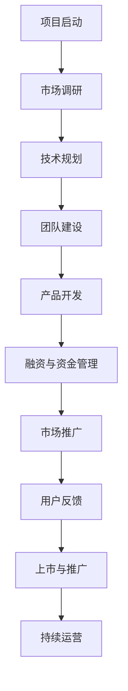

                 

### 引言

#### **标题：**《AI大模型创业：如何应对未来竞争对手？》

**关键词：** AI大模型、创业、竞争对手、应对策略

**摘要：** 在人工智能（AI）迅猛发展的今天，大模型技术已经成为引领行业变革的核心驱动力。对于创业者而言，如何有效应对未来竞争对手，构建具有竞争优势的AI大模型创业项目，成为了至关重要的问题。本文将深入探讨AI大模型的概述、创业环境、策略、运营以及竞争应对方法，为创业者提供实用的指导和参考。

随着深度学习、神经网络等技术的不断发展，AI大模型在各个领域展现出了前所未有的应用潜力。从金融、医疗到教育，AI大模型的应用正在深刻改变传统行业的运作方式。与此同时，创业市场的竞争也日益激烈，如何在众多竞争者中脱颖而出，成为创业者的核心挑战。

本文将从以下几个方面进行详细探讨：

1. **AI大模型概述与创业环境：** 了解AI大模型的基本概念、技术发展历程以及在创业中的应用场景。
2. **AI大模型创业策略：** 分析创业项目的商业模式、团队建设和技术路线选择。
3. **AI大模型创业的运营与竞争策略：** 探讨运营策略的设计以及如何应对未来竞争对手。
4. **成功案例分析：** 分析AI大模型创业的成功案例，提炼经验与教训。
5. **资源推荐与常见问题解答：** 提供相关的开发资源、书籍推荐以及创业常见问题解答。

通过以上内容的深入分析，本文旨在为创业者提供一套系统、全面的AI大模型创业指南，帮助他们在激烈的市场竞争中找到自己的定位，实现可持续发展的目标。

---

文章开篇，我们明确了本文的核心主题和关键词，并简要介绍了AI大模型在创业环境中的重要性。接下来，我们将正式进入第一部分，对AI大模型进行详细的概述，帮助读者建立基础认知。

## 第一部分：AI大模型概述与创业环境

### 第1章：AI大模型概述

#### 1.1 AI大模型的概念与特点

##### 1.1.1 AI大模型的定义

AI大模型，通常指的是具备大规模参数量和复杂结构的机器学习模型，如深度神经网络（DNN）、Transformer等。这些模型能够通过训练从海量数据中学习到复杂的规律和特征，从而在图像识别、自然语言处理、语音识别等领域展现出强大的表现能力。与传统的小型机器学习模型相比，AI大模型具有更高的参数数量和更深的网络结构。

##### 1.1.2 AI大模型的核心特点

1. **大规模参数量**：AI大模型通常包含数十亿甚至千亿级别的参数，这使得模型在处理复杂任务时具备更高的精度和泛化能力。
   
2. **深度结构**：AI大模型通常具有多层网络结构，通过逐层抽象和提取数据特征，使得模型能够理解更高层次的概念和关系。

3. **自主学习能力**：通过大数据训练，AI大模型能够自动发现数据中的规律和模式，实现从数据到知识的转化。

4. **强泛化能力**：大规模的参数量和深度的结构使得AI大模型能够在不同领域和任务中表现出良好的泛化能力。

##### 1.1.3 AI大模型与传统AI的区别

1. **模型规模**：传统AI模型通常参数量较小，而AI大模型具有更高的参数数量，这决定了其处理能力和复杂度。

2. **数据处理能力**：传统AI模型对数据量要求较低，而AI大模型需要处理海量数据，这要求更高的计算资源和存储能力。

3. **应用范围**：传统AI模型在特定领域有较好的表现，而AI大模型具有广泛的适用性，能够在多个领域实现突破。

4. **训练时间**：传统AI模型训练时间较短，而AI大模型需要大量时间进行训练，这要求更高效的训练算法和更强大的计算能力。

#### 1.2 AI大模型的技术发展历程

##### 1.2.1 从小模型到大模型的演变

AI大模型的发展经历了从小模型到大模型的演变过程。早期的人工智能模型如感知机、多层感知机等，其参数量和结构相对简单。随着深度学习技术的发展，神经网络逐渐演变成深度神经网络（DNN），参数量和结构变得更加复杂。近年来，Transformer模型的提出和广泛应用，标志着AI大模型进入了一个新的阶段。

##### 1.2.2 预训练模型的发展

预训练模型是AI大模型发展的重要里程碑。通过在大量无标签数据上进行预训练，模型可以学习到通用特征表示，然后再在特定任务上进行微调。这种技术大大提高了模型的训练效率和性能，为AI大模型的应用提供了强大支持。

##### 1.2.3 大模型的挑战与机遇

1. **计算资源需求**：AI大模型需要大量的计算资源和存储资源，这对创业项目的资源和成本管理提出了更高要求。

2. **数据处理能力**：大规模数据集的获取和处理能力成为AI大模型应用的关键。

3. **模型可解释性**：大模型的复杂性和黑箱特性使得其可解释性成为一个挑战，如何提高模型的可解释性是当前研究的热点。

4. **应用创新**：AI大模型在各个领域的应用创新带来了前所未有的机遇，创业者需要不断探索和尝试，找到具有商业价值的创新应用。

#### 总结

AI大模型作为人工智能领域的重要突破，为创业提供了丰富的机会和挑战。理解AI大模型的概念、特点及其技术发展历程，是创业者在AI大模型创业过程中不可或缺的基础。接下来，我们将进一步探讨AI大模型在创业中的应用场景，帮助创业者更好地把握市场机遇。

---

通过本章节的内容，我们系统地介绍了AI大模型的基本概念、特点以及技术发展历程，为后续章节的深入探讨奠定了基础。接下来，我们将进入第二部分，分析AI大模型在创业中的应用场景，帮助创业者了解其在不同领域中的具体应用和潜在价值。

### 第2章：AI大模型在创业中的应用场景

#### 2.1 AI大模型在各个行业的应用

AI大模型在各个行业的应用已经成为推动行业变革的重要力量。以下我们将详细探讨AI大模型在金融、医疗和教育等领域的具体应用及其带来的影响。

##### 2.1.1 金融行业的AI大模型应用

在金融行业，AI大模型的应用涵盖了风险控制、信用评估、投资决策等多个方面。例如，通过使用AI大模型，金融机构可以更准确地评估贷款申请者的信用风险，降低不良贷款率。同时，AI大模型在金融市场预测和风险管理方面也发挥着重要作用。通过分析海量数据，AI大模型可以预测市场走势，帮助金融机构做出更科学的投资决策。

具体应用案例包括：

- **信用评分模型**：使用深度学习模型对贷款申请者的信用记录、收入状况、消费习惯等多维度数据进行综合评估，提供更准确的信用评分。
- **风险控制模型**：通过分析客户交易行为、资金流向等数据，AI大模型可以及时发现异常交易，防范欺诈风险。
- **智能投顾**：AI大模型可以根据投资者的风险偏好、投资目标和市场环境，提供个性化的投资建议，提高投资收益。

##### 2.1.2 医疗行业的AI大模型应用

在医疗行业，AI大模型的应用大大提升了诊断的准确性和医疗服务的效率。例如，在影像诊断方面，AI大模型可以通过分析医学图像，辅助医生进行癌症筛查、疾病诊断等。在药物研发方面，AI大模型可以加速新药的发现和开发，提高药物的安全性和有效性。

具体应用案例包括：

- **影像诊断**：通过深度学习模型对医学影像进行分析，辅助医生进行肺癌、乳腺癌等重大疾病的早期诊断。
- **疾病预测**：利用AI大模型分析患者的病史、基因数据等，预测疾病风险，帮助医生制定个性化的治疗方案。
- **药物研发**：AI大模型可以通过模拟药物与生物分子的相互作用，加速新药的发现和开发，降低研发成本。

##### 2.1.3 教育行业的AI大模型应用

在教育行业，AI大模型的应用正在改变传统的教育模式，提供更加个性化和高效的学习体验。例如，通过使用AI大模型，学校和教育机构可以为学生提供智能化的学习辅导，提高学习效果。同时，AI大模型还可以用于教育资源的分配和优化，提升教育管理的效率。

具体应用案例包括：

- **个性化学习**：AI大模型可以根据学生的学习习惯、知识点掌握情况，提供个性化的学习计划和辅导，帮助学生更好地掌握知识。
- **智能评测**：通过AI大模型自动评估学生的学习进度和考试成绩，提供实时反馈，帮助教师调整教学策略。
- **教育资源优化**：利用AI大模型分析学生的需求和学习行为，优化教育资源的分配，提高教育资源的利用效率。

#### 2.2 AI大模型创业的机会与挑战

##### 2.2.1 创业机会分析

AI大模型在各个行业的广泛应用为创业者提供了丰富的机会。以下是一些关键机会：

1. **技术创新**：随着AI大模型技术的不断发展，创业者可以通过技术创新，开发出更高效、更智能的模型，满足市场的需求。
2. **数据资源**：拥有海量数据资源的创业者可以利用AI大模型进行深度挖掘，发现新的商业价值。
3. **应用场景**：AI大模型在多个行业的应用场景不断拓展，创业者可以探索新的应用领域，开拓市场空间。
4. **商业模式创新**：通过创新的商业模式，创业者可以将AI大模型与具体业务结合，提供独特的解决方案，获得市场认可。

##### 2.2.2 创业挑战分析

虽然AI大模型创业机会众多，但也面临一系列挑战：

1. **技术门槛**：AI大模型开发需要强大的技术支持和专业知识，创业者需要具备相关领域的背景和技能。
2. **数据获取**：高质量的数据是AI大模型训练的基础，创业者需要解决数据获取、清洗和管理的难题。
3. **计算资源**：AI大模型训练和部署需要大量的计算资源，创业者需要合理配置和利用资源。
4. **法律法规**：随着AI大模型的应用普及，相关法律法规也在不断完善，创业者需要遵守相关法律法规，确保合规运营。
5. **市场竞争**：AI大模型创业市场竞争激烈，创业者需要不断创新，提升自身竞争力。

#### 总结

AI大模型在金融、医疗和教育等行业的广泛应用为创业者提供了广阔的市场空间。通过深入了解这些行业的应用场景，创业者可以更好地把握市场机遇，应对挑战。接下来，我们将进一步探讨AI大模型创业的策略和方法，帮助创业者实现成功创业。

---

在本章节中，我们详细分析了AI大模型在金融、医疗和教育等领域的具体应用场景，探讨了其带来的机会和挑战。接下来，我们将进入第三部分，深入探讨AI大模型创业的策略，包括商业模式、团队建设和技术路线选择，为创业者提供实用的指导和参考。

### 第3章：AI大模型创业的商业模式

#### 3.1 商业模式概述

商业模式是创业项目的核心，决定了项目的可持续发展和盈利能力。在AI大模型创业中，商业模式的选择至关重要。一个成功的商业模式不仅要解决技术实现问题，还需要在市场定位、目标用户、收入模式等方面有清晰的设计。

##### 3.1.1 商业模式的重要性

1. **资源整合**：商业模式能够帮助创业者整合所需的资源，包括人才、资金、技术等，提高项目的执行效率。
2. **市场定位**：商业模式明确了项目的市场定位，帮助创业者确定目标用户和市场细分，提高市场竞争力。
3. **盈利模式**：商业模式设计了项目的盈利模式，确保项目在运营过程中能够持续获得收入，实现盈利目标。
4. **风险控制**：合理的商业模式可以降低项目运营风险，提高项目的稳健性。

##### 3.1.2 常见的商业模式

1. **B2B（企业对企业）模式**：主要服务于企业客户，通过提供定制化的解决方案和技术服务获取收入。例如，为企业提供AI大模型训练服务、数据分析和咨询服务等。
2. **B2C（企业对消费者）模式**：直接向消费者提供服务，通过产品销售或订阅服务获得收入。例如，开发面向消费者的AI大模型应用，如智能语音助手、个性化推荐系统等。
3. **B2B2C（企业对企业对消费者）模式**：通过为企业提供服务，再通过企业将服务提供给消费者，实现商业闭环。例如，为企业提供AI大模型培训课程，再通过企业向员工提供培训服务。
4. **广告模式**：通过为广告主提供广告投放服务，通过广告收入实现盈利。例如，开发基于AI大模型的广告推荐系统，为广告主提供精准投放服务。
5. **订阅模式**：通过向用户提供定期订阅服务，如软件、数据服务等，实现持续收入。例如，提供AI大模型API服务，用户根据使用量付费。

#### 3.2 创业项目的商业模式设计

##### 3.2.1 创业项目背景分析

在设计和选择商业模式之前，创业者需要对项目的背景进行深入分析。包括项目的核心优势、目标市场、竞争对手、行业趋势等。以下是一些关键分析步骤：

1. **市场分析**：了解目标市场的需求、市场规模、增长趋势以及竞争对手情况。通过市场调研和数据分析，确定项目的市场定位和目标用户群体。
2. **技术分析**：评估项目的技术可行性，包括技术成熟度、研发周期、成本和风险等。确保所选技术路线能够支撑商业模式的实现。
3. **竞争优势**：分析项目的竞争优势，如技术领先、数据优势、市场先发优势等。明确项目的核心竞争力，为商业模式设计提供依据。

##### 3.2.2 目标用户分析

目标用户是商业模式设计的重要考虑因素。创业者需要明确目标用户群体的特征、需求和行为习惯，以便设计出符合用户需求的服务和产品。

1. **用户画像**：通过用户调研和数据挖掘，构建目标用户的画像，包括年龄、性别、职业、教育程度、收入水平等。
2. **需求分析**：了解目标用户的需求和痛点，明确用户希望通过项目解决哪些问题，提供哪些价值。
3. **用户体验**：设计用户体验，包括界面设计、交互流程、服务流程等，确保用户在使用过程中能够获得良好的体验。

##### 3.2.3 收入模式设计

收入模式是商业模式的核心组成部分，决定了项目的盈利能力和可持续性。以下是一些常见的收入模式设计方法：

1. **直接收入模式**：通过销售产品或服务直接获得收入。例如，销售软件许可证、提供定制化解决方案等。
2. **订阅模式**：通过定期收取订阅费用实现收入。例如，提供在线服务、数据订阅等。
3. **增值服务模式**：通过提供增值服务实现收入。例如，提供高级功能、数据增值服务、个性化服务等。
4. **广告模式**：通过广告收入实现盈利。例如，提供广告位、广告推荐等。
5. **合作伙伴模式**：与合作伙伴合作，通过分成或佣金等方式实现收入。例如，与广告主合作、与企业合作等。

在设计收入模式时，创业者需要根据目标市场和用户需求，选择合适的收入模式，并确保收入模式的可行性和可持续性。

##### 3.2.4 模式验证与调整

商业模式设计完成后，需要通过实际运营进行验证和调整。以下是一些关键步骤：

1. **试点运营**：选择小规模用户进行试点运营，收集用户反馈和市场数据，评估商业模式的有效性。
2. **反馈优化**：根据用户反馈和市场数据，对商业模式进行调整和优化，提高用户满意度和市场竞争力。
3. **持续迭代**：商业模式不是一成不变的，创业者需要根据市场变化和用户需求，持续迭代和优化商业模式，确保项目的长期发展。

#### 总结

商业模式是AI大模型创业成功的关键因素之一。通过深入分析项目背景、目标用户和收入模式，创业者可以设计出符合市场需求和自身优势的商业模式，为项目的可持续发展奠定基础。接下来，我们将探讨AI大模型创业的团队建设，帮助创业者打造高效团队，实现项目目标。

---

在本章节中，我们详细讨论了AI大模型创业项目的商业模式设计，包括商业模式的重要性、常见模式的分析，以及创业项目背景分析、目标用户分析和收入模式设计的方法。接下来，我们将进入第四部分，探讨AI大模型创业团队建设的重要性及其组建与管理的策略。

### 第4章：AI大模型创业的团队建设

#### 4.1 团队建设的重要性

在AI大模型创业项目中，团队建设至关重要。一个高效的团队不仅能够推动项目的发展，还能在竞争激烈的市场中提供持续的创新和竞争力。以下从团队建设的影响和基本原则两方面进行详细探讨。

##### 4.1.1 团队建设的影响

1. **项目执行**：团队是项目执行的核心，高效的团队建设能够确保项目按计划推进，提高项目成功率。
2. **创新能力**：团队成员的多样性和知识互补性能够激发创新思维，推动技术进步和业务发展。
3. **协调合作**：良好的团队建设能够促进成员间的协调与合作，减少内部摩擦，提高团队整体效率。
4. **风险应对**：团队建设能够提高团队应对不确定性和风险的能力，确保项目在逆境中持续发展。

##### 4.1.2 团队建设的原则

1. **目标明确**：明确团队的目标和愿景，确保团队成员对项目有共同的认识和追求。
2. **职责清晰**：为团队成员分配明确的职责和任务，确保每个成员知道自己的角色和责任。
3. **协作机制**：建立有效的协作机制，促进团队成员间的沟通与合作，提高工作效率。
4. **激励机制**：设立合理的激励机制，激发团队成员的工作热情和创新动力。
5. **培训发展**：提供持续的培训和职业发展机会，提升团队成员的专业能力和综合素质。

#### 4.2 创业团队的组建与管理

##### 4.2.1 团队成员的角色与职责

一个高效的创业团队通常包括以下关键角色：

1. **创始人/CEO**：负责制定公司战略、愿景和目标，领导整个团队，对外沟通和资源整合。
2. **CTO（首席技术官）**：负责技术方向、研发规划和团队技术能力提升，确保项目技术实现。
3. **研发团队**：包括算法工程师、数据科学家、软件工程师等，负责模型研发、系统开发和维护。
4. **运营团队**：负责项目运营、市场推广、用户服务等工作，确保项目的市场拓展和用户满意度。
5. **财务团队**：负责财务管理、预算规划、投融资等财务工作，确保项目财务健康。

明确团队成员的职责和角色，有助于提高团队协作效率，避免职责重叠和冲突。

##### 4.2.2 团队管理的方法与技巧

1. **目标管理**：设定清晰的团队目标和个人目标，确保团队成员对目标和任务有明确的认识，提高执行效率。
2. **沟通机制**：建立有效的沟通机制，定期召开团队会议，分享进展、讨论问题和规划下一步行动。
3. **激励机制**：设立合理的激励机制，包括绩效奖励、股权激励等，激发团队成员的积极性和创造力。
4. **协作工具**：使用协作工具（如Slack、Trello等），提高团队协作效率，确保信息传递和任务分配的透明性。
5. **员工培训**：提供持续的培训和发展机会，提升团队成员的专业能力和综合素质。
6. **反馈机制**：建立反馈机制，鼓励团队成员提出改进建议，不断优化团队管理和工作流程。

#### 4.2.3 团队文化建设

团队文化是团队建设的重要组成部分，良好的团队文化能够增强团队凝聚力，提高团队士气。以下是一些关键措施：

1. **共同价值观**：明确团队的核心价值观，确保团队成员在价值观上有共同的认识和追求。
2. **尊重差异**：尊重团队成员的不同背景和观点，鼓励多元化思维，促进团队创新。
3. **共享成功**：团队取得成功时，共同庆祝和分享，增强团队凝聚力和归属感。
4. **信任与支持**：建立信任和支持的氛围，鼓励团队成员相互支持和帮助，共同克服困难。
5. **持续成长**：鼓励团队成员持续学习和成长，提升团队整体竞争力。

#### 总结

团队建设是AI大模型创业成功的关键因素之一。通过明确团队建设的重要性、基本原则和管理方法，创业者可以打造一支高效、协作的团队，为项目的成功奠定基础。接下来，我们将探讨AI大模型创业的技术路线，帮助创业者选择合适的技术方向和实现策略。

---

在本章节中，我们深入探讨了AI大模型创业的团队建设，包括其重要性、基本原则和管理方法，以及团队成员的角色与职责、团队管理的方法与技巧和团队文化建设。接下来，我们将进入第五部分，探讨AI大模型创业的技术路线，帮助创业者选择合适的技术方向和实现策略。

### 第5章：AI大模型创业的技术路线

#### 5.1 技术路线选择

选择合适的技术路线对于AI大模型创业项目至关重要。技术路线不仅影响项目的研发周期和成本，还直接关系到项目的市场竞争力。以下从技术路线的影响和常见技术路线两方面进行详细探讨。

##### 5.1.1 技术路线的影响

1. **研发周期**：技术路线的选择会直接影响项目的研发周期。合理的技术路线可以缩短研发时间，提高项目进度。
2. **成本控制**：技术路线的不同，研发成本也会有所不同。选择适合项目需求的技术路线，有助于降低研发成本，提高项目效益。
3. **市场竞争力**：技术路线的选择决定了项目的技术水平和市场竞争力。先进的技术路线可以帮助项目在市场上脱颖而出，获得竞争优势。

##### 5.1.2 常见的技术路线

1. **自主研发路线**：自主研发路线是指企业自行进行技术研究和开发，拥有完整的知识产权。这种路线的优点在于可以完全控制技术方向和进度，但缺点是研发周期长、成本高，需要强大的技术团队和资金支持。
2. **合作开发路线**：合作开发路线是指企业与其他技术团队合作，共同进行技术研究和开发。这种路线的优点是能够快速获取技术成果，降低研发成本，但缺点是技术掌控度较低，可能面临知识产权风险。
3. **开源路线**：开源路线是指企业利用开源技术进行项目开发，通过社区合作和贡献来提高项目质量。这种路线的优点是成本低、社区支持强，但缺点是技术定制化程度低，可能无法完全满足项目需求。

#### 5.2 创业项目的技术路线设计

##### 5.2.1 技术路线分析

在确定创业项目的技术路线时，需要对以下几个因素进行综合分析：

1. **项目目标**：明确项目的目标和需求，选择能够满足项目目标的技术路线。例如，如果项目目标是快速上市，可能选择合作开发路线。
2. **资源能力**：评估企业自身的研发能力、技术积累和资金实力，选择符合企业实际的技术路线。例如，如果企业具备强大的技术团队和资金支持，可以选择自主研发路线。
3. **市场趋势**：分析市场发展趋势和技术前沿，选择符合市场需求的先进技术。例如，如果市场对开源技术需求强烈，可以选择开源路线。
4. **竞争对手**：分析竞争对手的技术路线和优势，选择能够与竞争对手抗衡的技术路线。例如，如果竞争对手采用自主研发路线，企业可能需要选择合作开发或开源路线。

##### 5.2.2 技术实施策略

在确定技术路线后，需要制定详细的技术实施策略，包括以下几个方面：

1. **研发计划**：制定详细的研发计划，明确每个阶段的目标和任务，确保项目按计划推进。
2. **技术框架**：构建合理的技术框架，选择合适的框架和工具，提高开发效率和代码质量。
3. **数据管理**：建立完善的数据管理体系，包括数据收集、存储、处理和分析等，确保数据质量和管理效率。
4. **团队合作**：建立高效的团队合作机制，确保团队成员之间的沟通与协作，提高项目执行效率。
5. **测试与优化**：进行全面的测试和优化，确保项目的性能和质量，满足市场需求。

#### 5.2.3 技术路线选择实例分析

以下是一个AI大模型创业项目的技术路线选择实例：

1. **项目目标**：快速上市，提供高质量的AI大模型服务。
2. **资源能力**：企业具备一定的技术积累和资金支持，但技术团队规模有限。
3. **市场趋势**：开源技术受到市场青睐，社区支持强。
4. **竞争对手**：竞争对手采用自主研发路线，产品功能较为全面。

根据以上分析，项目选择开源路线，利用开源技术框架和工具进行开发，并与开源社区合作，快速获取技术支持和市场反馈。具体策略如下：

1. **技术框架**：选择TensorFlow、PyTorch等主流开源框架，构建AI大模型技术栈。
2. **数据管理**：利用Hadoop、Spark等大数据技术，构建数据收集、存储和处理平台。
3. **团队合作**：与开源社区合作，吸引开发者参与项目，共同优化和改进技术。
4. **测试与优化**：进行全面的测试和优化，确保项目的性能和质量，满足市场需求。

通过以上技术路线选择和实施策略，项目能够快速上线，提供高质量的AI大模型服务，满足市场需求，并在开源社区中获得良好的口碑和用户基础。

#### 总结

选择合适的技术路线对于AI大模型创业项目至关重要。通过深入分析项目目标、资源能力、市场趋势和竞争对手，创业者可以制定出合理的技术路线和实施策略，确保项目的成功。接下来，我们将探讨AI大模型创业的运营策略，帮助创业者实现项目的有效运营和管理。

---

在本章节中，我们详细探讨了AI大模型创业的技术路线选择，包括其影响和常见技术路线，以及创业项目的技术路线分析和实施策略。接下来，我们将进入第六部分，探讨AI大模型创业的运营策略，帮助创业者实现项目的有效运营和管理。

### 第6章：AI大模型创业的运营策略

#### 6.1 运营策略概述

运营策略是AI大模型创业项目成功的关键因素之一。它涉及到项目从启动到运营的整个过程，包括市场定位、产品规划、用户获取、用户维护和数据分析等方面。有效的运营策略能够确保项目的稳定发展，提高市场竞争力，实现商业目标。

##### 6.1.1 运营策略的定义

运营策略是指为了实现项目目标，对项目运营过程中各个环节进行规划和管理的一系列方法和措施。它涵盖了从市场调研、产品开发到市场营销、客户服务等各个方面的内容，旨在提高项目效率和效果，实现盈利目标。

##### 6.1.2 运营策略的重要性

1. **市场定位**：准确的运营策略能够帮助项目明确市场定位，确定目标用户和市场份额，提高项目的市场竞争力。
2. **产品规划**：有效的运营策略能够确保产品规划符合市场需求，提高产品的用户体验和满意度，增加用户粘性。
3. **用户获取**：通过合理的运营策略，可以制定有效的用户获取计划，提高用户转化率和留存率，扩大用户基础。
4. **用户维护**：运营策略中的用户维护措施能够提高用户满意度，增强用户忠诚度，降低用户流失率。
5. **数据分析**：通过数据分析，可以实时监控项目运营状况，发现问题和机会，及时调整运营策略，提高运营效果。

#### 6.2 创业项目的运营策略设计

##### 6.2.1 运营目标设定

在制定运营策略之前，需要明确项目的运营目标。运营目标应与项目整体目标保持一致，并具备可实现性。以下是一些常见的运营目标：

1. **市场份额**：在市场中获得一定的份额，提高项目的市场竞争力。
2. **用户增长**：通过有效的市场推广和用户获取策略，实现用户数量的快速增长。
3. **用户体验**：提高用户的满意度和忠诚度，降低用户流失率。
4. **收入增长**：通过产品销售、服务收费等方式，实现收入的持续增长。
5. **品牌认知**：提高项目的品牌认知度和市场影响力，增强品牌价值。

##### 6.2.2 运营计划制定

在明确运营目标后，需要制定详细的运营计划，包括以下几个方面：

1. **市场调研**：通过市场调研，了解目标市场的需求、竞争对手状况和行业趋势，为运营策略提供数据支持。
2. **产品规划**：根据市场调研结果，制定产品规划和开发计划，确保产品能够满足市场需求，提高用户体验。
3. **市场营销**：制定市场营销策略，包括广告推广、内容营销、社交媒体推广等，提高项目的市场曝光度和用户获取量。
4. **用户获取**：制定用户获取计划，包括SEO、SEM、社群运营、线上活动等，提高用户转化率和留存率。
5. **用户维护**：制定用户维护计划，包括客户服务、用户反馈收集、社群互动等，提高用户满意度和忠诚度。
6. **数据分析**：建立数据分析体系，实时监控项目运营数据，发现问题和机会，及时调整运营策略。

##### 6.2.3 运营执行与监控

在运营计划的执行过程中，需要建立有效的监控和反馈机制，确保运营策略的有效实施。以下是一些关键步骤：

1. **任务分配**：明确每个团队成员的职责和任务，确保任务按时完成。
2. **进度监控**：建立进度监控机制，定期检查项目进度，确保项目按计划推进。
3. **问题反馈**：建立问题反馈机制，及时收集和处理团队成员和用户的问题和建议，优化运营策略。
4. **效果评估**：定期评估运营效果，包括用户获取、留存、满意度等关键指标，分析运营策略的成效，为下一步调整提供依据。
5. **持续改进**：根据效果评估结果，持续优化运营策略，提高运营效果。

#### 总结

运营策略是AI大模型创业项目成功的关键因素之一。通过设定明确的运营目标、制定详细的运营计划、执行和监控运营策略，创业者可以确保项目的稳定发展，提高市场竞争力，实现商业目标。接下来，我们将探讨如何应对未来竞争对手的策略，帮助创业者应对市场竞争，实现持续发展。

---

在本章节中，我们详细探讨了AI大模型创业项目的运营策略，包括运营策略的定义、重要性、运营目标设定、运营计划制定以及运营执行与监控。接下来，我们将进入第七部分，探讨应对未来竞争对手的策略，帮助创业者分析竞争对手、设计应对策略，从而在市场竞争中脱颖而出。

### 第7章：应对未来竞争对手的策略

#### 7.1 竞争对手分析

在AI大模型创业项目中，了解竞争对手是制定有效竞争策略的重要前提。竞争对手分析包括识别竞争对手、分析竞争对手的优势和劣势、了解竞争对手的战略和战术等。

##### 7.1.1 竞争对手的类型

1. **直接竞争对手**：直接竞争对手是指在相同市场领域，提供相同或相似产品和服务的公司。例如，在AI大模型领域，直接竞争对手可能是其他提供类似AI大模型服务的公司。
2. **间接竞争对手**：间接竞争对手是在不同市场领域，但提供相似价值或满足相同用户需求的竞争对手。例如，AI大模型创业项目可能面临来自传统软件公司的竞争，这些公司也可能提供类似的数据分析和自动化解决方案。

##### 7.1.2 竞争对手的分析方法

1. **市场调研**：通过市场调研，了解竞争对手的市场份额、用户群体、产品特性等，分析竞争对手的市场地位和策略。
2. **产品分析**：对比竞争对手的产品功能、性能、用户体验等，找出优势和劣势。
3. **战略分析**：分析竞争对手的市场定位、业务模式、营销策略等，了解竞争对手的战略方向。
4. **财务分析**：通过财务数据，了解竞争对手的盈利能力、资金流动、成本结构等，评估竞争对手的财务状况和竞争力。
5. **行为分析**：观察竞争对手的市场行为，包括定价策略、促销活动、合作伙伴关系等，了解竞争对手的竞争策略。

#### 7.2 应对策略设计

在了解竞争对手后，创业者需要制定应对策略，以在市场竞争中取得优势。以下是一些常见的应对策略：

##### 7.2.1 市场定位策略

1. **差异化定位**：通过提供独特的产品特性或服务，满足用户特定需求，与竞争对手形成差异化，提高市场竞争力。
2. **细分市场定位**：针对细分市场，专注于某一特定领域或用户群体，提供更专业、更定制化的解决方案，避开与竞争对手的直接竞争。

##### 7.2.2 技术创新策略

1. **持续创新**：保持技术领先，通过持续的技术创新，开发出更先进、更高效的AI大模型，提高产品的竞争力。
2. **技术合作**：与知名科研机构、高校或技术公司建立合作关系，引进先进技术，加快技术创新步伐。
3. **技术保护**：加强知识产权保护，确保核心技术不被竞争对手抄袭或盗用。

##### 7.2.3 营销策略

1. **品牌建设**：建立强大的品牌影响力，提高项目的认知度和美誉度，吸引更多用户和合作伙伴。
2. **广告推广**：通过广告宣传，提高项目的市场曝光度，扩大用户基础。
3. **内容营销**：通过发布高质量的内容，如技术博客、白皮书、案例分析等，提升项目的专业形象，增加用户信任。
4. **社群营销**：利用社交媒体和线上社群，与用户互动，建立用户社区，增强用户黏性。

##### 7.2.4 服务策略

1. **优质服务**：提供优质的客户服务，解决用户问题，提高用户满意度，增强用户忠诚度。
2. **个性化服务**：根据用户需求，提供个性化服务，满足用户的特定需求，提高用户黏性。
3. **客户关怀**：通过定期的客户关怀活动，如客户回访、节日问候等，增强用户对项目的情感联系。

##### 7.2.5 合规策略

1. **合规运营**：遵守相关法律法规，确保项目的合规运营，降低法律风险。
2. **数据安全**：加强数据安全保护，确保用户数据的安全和隐私，提高用户信任。
3. **社会责任**：承担社会责任，关注社会问题，通过公益活动提升企业形象。

#### 总结

应对未来竞争对手是AI大模型创业项目成功的关键。通过分析竞争对手、设计有效的应对策略，创业者可以在激烈的市场竞争中脱颖而出，实现项目的持续发展。接下来，我们将通过成功案例分析，提炼AI大模型创业的启示与借鉴。

---

在本章节中，我们详细探讨了如何应对未来竞争对手，包括竞争对手分析的方法和应对策略的设计。接下来，我们将进入第八部分，通过成功案例分析，为创业者提供实际操作的启示与借鉴。

### 第8章：AI大模型创业的成功案例分析

#### 8.1 成功案例分析

在AI大模型创业领域，有许多公司通过创新技术和卓越运营取得了显著的成功。以下我们将分析几个典型案例，并从中提炼出对创业者有价值的启示和经验教训。

##### 8.1.1 案例选择标准

选择成功案例时，我们主要考虑以下标准：

1. **技术创新**：公司在AI大模型领域有显著的技术创新和突破。
2. **市场表现**：公司在市场上有良好的表现，取得了较高的市场份额和用户认可。
3. **商业价值**：公司的商业模式具有可持续性，能够实现盈利和持续发展。
4. **社会影响**：公司在社会上有积极的影响，如提高行业效率、改善公共服务等。

基于以上标准，我们选择了以下案例进行分析：

1. **案例1：OpenAI**
2. **案例2：DeepMind**
3. **案例3：谷歌AI**

#### 8.1.2 案例分析

##### 案例一：OpenAI

**背景**：OpenAI成立于2015年，是一家总部位于美国的人工智能研究公司。其宗旨是实现安全的通用人工智能（AGI），并让其造福人类。OpenAI通过预训练模型和分布式计算技术，开发出了多个领先的AI大模型，如GPT系列模型。

**成功原因**：

1. **技术创新**：OpenAI在AI大模型领域取得了多个重要突破，如GPT-3模型的发布，使其在自然语言处理领域处于领先地位。
2. **商业模式**：OpenAI采用了开放协作的模式，吸引了全球顶级的研究人员加入，并通过订阅服务实现盈利。
3. **品牌影响力**：OpenAI在学术界和工业界都有很高的声誉，吸引了大量的投资和合作机会。

**启示与借鉴**：

1. **持续创新**：不断推进技术创新，保持在行业前沿。
2. **开放协作**：通过开放合作，吸引优秀人才和资源。
3. **品牌建设**：建立强大的品牌影响力，提高市场竞争力。

##### 案例二：DeepMind

**背景**：DeepMind成立于2010年，是英国的一家AI公司，后来被谷歌收购。DeepMind以其在深度学习算法和强化学习方面的创新而闻名，开发了AlphaGo等知名AI大模型。

**成功原因**：

1. **技术创新**：DeepMind在深度学习和强化学习领域取得了多项重要成果，如AlphaGo的胜利，使其成为行业领导者。
2. **商业模式**：DeepMind通过为企业和研究机构提供AI解决方案，实现了盈利。
3. **科学研究**：DeepMind注重科学研究，与学术界有广泛的合作，推动了AI领域的进步。

**启示与借鉴**：

1. **科研驱动**：将科学研究作为核心驱动力，推动技术进步。
2. **商业化运作**：通过商业化运作，将研究成果转化为实际应用。
3. **跨界合作**：与学术界和工业界建立广泛合作，实现资源互补。

##### 案例三：谷歌AI

**背景**：谷歌AI是谷歌旗下的AI研究部门，成立于2013年。谷歌AI在自然语言处理、计算机视觉、语音识别等领域取得了多项重要成果，其AI大模型如BERT和LaMDA被广泛应用于谷歌的产品和服务。

**成功原因**：

1. **技术创新**：谷歌AI在AI大模型领域取得了多个突破，如BERT模型的发布，极大地推动了自然语言处理技术的发展。
2. **商业模式**：谷歌AI通过为谷歌的产品和服务提供AI支持，实现了巨大的商业价值。
3. **资源优势**：谷歌拥有庞大的数据资源和计算资源，为AI大模型的研究和开发提供了有力支持。

**启示与借鉴**：

1. **数据驱动**：利用海量数据，进行深度学习和分析，提升AI模型的性能。
2. **应用导向**：将AI大模型应用于实际业务，提升产品和服务质量。
3. **资源整合**：整合企业内部和外部资源，提升研发和运营效率。

#### 8.2 启示与借鉴

通过以上成功案例分析，我们可以提炼出以下对AI大模型创业者的启示和借鉴：

1. **技术创新**：保持技术创新，保持在行业前沿。
2. **商业模式**：设计可持续的商业模式，实现盈利和可持续发展。
3. **资源整合**：整合数据、技术、人才等资源，提升研发和运营效率。
4. **跨界合作**：与学术界、工业界建立合作关系，实现资源互补。
5. **用户导向**：以用户需求为导向，提供高质量的产品和服务。
6. **持续优化**：不断优化产品和服务，提高用户体验和满意度。

通过借鉴这些成功经验，创业者可以在AI大模型创业道路上取得更好的成果。

---

在本章节中，我们通过成功案例分析，提炼了AI大模型创业的启示与借鉴，为创业者提供了宝贵的经验。接下来，我们将进入第九部分，提供AI大模型创业的资源推荐，帮助创业者更好地开展项目。

### 附录：AI大模型创业资源推荐

#### 附录 A：AI大模型创业资源推荐

为了帮助AI大模型创业者更好地开展项目，我们推荐以下资源，包括开发工具与平台、相关书籍、在线课程、社交媒体与社区。

##### A.1 开发工具与平台推荐

1. **TensorFlow**：由谷歌开发的开源机器学习框架，广泛用于深度学习和AI大模型开发。
2. **PyTorch**：由Facebook开发的开源深度学习框架，以其灵活性和动态计算图而受到开发者喜爱。
3. **Hugging Face**：提供了大量的自然语言处理模型和工具，方便开发者进行NLP任务。
4. **Google Colab**：免费的在线协作平台，提供了GPU和TPU支持，适合进行大规模AI模型训练。
5. **AWS SageMaker**：亚马逊提供的云端机器学习服务，支持模型训练、部署和自动化。

##### A.2 相关书籍推荐

1. **《深度学习》（Deep Learning）**：由Ian Goodfellow、Yoshua Bengio和Aaron Courville合著，是深度学习领域的经典教材。
2. **《Python深度学习》（Deep Learning with Python）**：由François Chollet著，适合初学者入门深度学习和AI大模型。
3. **《强化学习》（Reinforcement Learning: An Introduction）**：由Richard S. Sutton和Barto合著，介绍了强化学习的基础理论和实践方法。
4. **《AI超级课程》**：吴恩达开设的在线课程，涵盖了机器学习、深度学习和AI大模型的核心内容。

##### A.3 在线课程推荐

1. **Coursera**：提供了大量的AI和深度学习相关课程，包括《机器学习基础》、《深度学习》、《自然语言处理》等。
2. **Udacity**：提供了多个AI和深度学习领域的纳米学位课程，适合希望深入学习的创业者。
3. **edX**：提供了由知名大学和机构开设的免费在线课程，包括《机器学习基础》、《深度学习》等。
4. **fast.ai**：提供了免费的全栈AI课程，适合快速掌握AI基础知识。

##### A.4 社交媒体与社区推荐

1. **Twitter**：关注AI和深度学习领域的知名专家和机构，获取最新的研究进展和行业动态。
2. **Reddit**：加入AI、深度学习和创业相关的子版块，参与讨论和获取建议。
3. **GitHub**：浏览AI和深度学习项目的源代码，学习先进的实现方法和经验。
4. **Stack Overflow**：解决AI和深度学习开发过程中的技术问题，获取专业帮助。
5. **AI会议与研讨会**：参加AI和深度学习领域的会议和研讨会，了解行业动态，拓展人脉。

通过以上资源的推荐，创业者可以更好地开展AI大模型创业项目，提升技术能力，拓宽视野，为项目的成功奠定坚实基础。

---

在本章节的附录中，我们为AI大模型创业者推荐了一系列宝贵的资源，包括开发工具与平台、相关书籍、在线课程、社交媒体与社区。接下来，我们将进入最后一部分，提供AI大模型创业的常见问题解答，帮助创业者解决在实际操作中遇到的问题。

### 附录 B：AI大模型创业常见问题解答

在AI大模型创业过程中，创业者可能会遇到各种问题，包括技术、融资、运营和法律等方面。以下是对一些常见问题的解答，希望能为创业者提供帮助。

##### B.1 技术问题

**Q1：如何选择合适的AI大模型框架？**
**A1：选择AI大模型框架时，需要考虑以下几个方面：**

1. **需求**：根据项目的具体需求，如自然语言处理、计算机视觉等，选择合适的框架。
2. **易用性**：选择易用的框架，降低开发难度，提高开发效率。
3. **社区支持**：选择拥有强大社区支持的框架，便于获取帮助和资源。
4. **性能**：考虑框架的性能，特别是对于大规模模型训练的效率。

**Q2：如何优化AI大模型的训练效率？**
**A2：优化AI大模型训练效率可以从以下几个方面入手：**

1. **数据预处理**：优化数据预处理流程，减少数据加载和转换的时间。
2. **模型架构**：选择合适的模型架构，如使用轻量级模型或深度压缩技术。
3. **硬件资源**：使用高性能计算资源，如GPU、TPU等，提高训练速度。
4. **分布式训练**：使用分布式训练策略，如多GPU训练、参数服务器等，提高训练效率。

##### B.2 融资问题

**Q1：如何获得AI大模型的融资？**
**A1：获得AI大模型融资可以从以下几个方面入手：**

1. **商业计划书**：准备一份详细的商业计划书，展示项目的市场前景、技术优势和商业模式。
2. **演示Demo**：制作一个演示Demo，展示项目的实际效果和价值。
3. **市场研究**：进行充分的市场研究，了解目标市场和竞争对手，提高项目的吸引力。
4. **人脉关系**：利用人脉关系，寻找潜在的投资人，如风险投资机构、天使投资人等。

**Q2：如何合理规划资金使用？**
**A2：合理规划资金使用，确保项目的可持续发展，可以采取以下策略：**

1. **分阶段融资**：根据项目进展，分阶段进行融资，避免一次性投入过多资金。
2. **预算管理**：制定详细的预算计划，明确每个阶段的资金需求和用途。
3. **成本控制**：优化成本结构，降低不必要的开支，提高资金使用效率。
4. **资金回报**：确保项目的投资回报，提高投资者的信心。

##### B.3 运营问题

**Q1：如何提高AI大模型产品的用户体验？**
**A1：提高AI大模型产品的用户体验可以从以下几个方面入手：**

1. **界面设计**：设计简洁、直观的用户界面，提高用户操作体验。
2. **性能优化**：优化模型的性能，确保模型快速、准确地进行预测和响应。
3. **用户反馈**：及时收集用户反馈，根据用户需求进行产品改进。
4. **客户支持**：提供优质的客户支持服务，解决用户在使用过程中遇到的问题。

**Q2：如何管理AI大模型项目的风险？**
**A2：管理AI大模型项目的风险，可以采取以下策略：**

1. **风险评估**：对项目进行风险评估，识别潜在的风险因素。
2. **风险预防**：采取预防措施，降低风险发生的概率，如数据安全保护、模型可解释性等。
3. **风险监控**：建立风险监控机制，实时监控项目风险，及时采取应对措施。
4. **风险管理**：制定风险管理计划，确保项目在风险发生时能够有效应对。

##### B.4 法律问题

**Q1：如何遵守AI大模型的法律法规？**
**A1：遵守AI大模型的法律法规，可以采取以下措施：**

1. **合规咨询**：咨询专业律师，了解相关法律法规，确保项目的合规性。
2. **数据保护**：遵守数据保护法律法规，保护用户隐私和数据安全。
3. **知识产权**：加强知识产权保护，确保自身的技术和产品不受侵犯。
4. **责任界定**：明确项目责任，制定风险应对措施，确保在法律纠纷中能够有效应对。

**Q2：如何应对法律纠纷？**
**A2：应对法律纠纷，可以采取以下策略：**

1. **法律咨询**：聘请专业律师团队，提供法律咨询和支持。
2. **沟通协商**：与对方进行沟通协商，寻求和解和解决争议。
3. **法律诉讼**：在协商无果的情况下，通过法律诉讼解决争议。
4. **风险管理**：建立风险管理机制，降低法律纠纷的风险和影响。

通过以上常见问题解答，创业者可以更好地应对AI大模型创业过程中的各种挑战，确保项目的顺利推进和成功实现。

---

在本章节的附录中，我们详细解答了AI大模型创业过程中常见的技术、融资、运营和法律问题，为创业者提供了实用的解决方案。接下来，我们将通过AI大模型创业流程图，全面展示AI大模型创业的详细步骤。

### 附录 C：AI大模型创业流程图

为了帮助创业者更好地理解AI大模型创业的整个过程，我们设计了一个详细的流程图，包括从项目启动到成功推出的各个关键步骤。

#### C.1 创业流程概述

AI大模型创业流程主要包括以下步骤：

1. **项目启动**：确定创业项目，明确目标和愿景。
2. **市场调研**：进行市场调研，分析市场需求和竞争对手。
3. **技术规划**：制定技术路线和研发计划。
4. **团队建设**：组建合适的团队，明确成员职责。
5. **产品开发**：进行产品开发和测试。
6. **融资与资金管理**：寻找投资，合理规划和使用资金。
7. **市场推广**：进行市场推广，提高项目知名度。
8. **用户反馈**：收集用户反馈，不断优化产品。
9. **上市与推广**：将产品推向市场，进行推广和销售。
10. **持续运营**：持续运营和优化产品，确保项目的长期成功。

#### C.2 创业流程详细步骤

以下是对每个步骤的详细描述：

1. **项目启动**：
   - **确定创业项目**：明确项目的目标、愿景和核心价值。
   - **组建创业团队**：确定核心团队成员，分配职责和任务。

2. **市场调研**：
   - **分析市场需求**：了解目标市场，确定用户需求。
   - **研究竞争对手**：分析竞争对手的产品、策略和市场表现。
   - **确定市场定位**：根据市场调研结果，确定项目的市场定位。

3. **技术规划**：
   - **选择技术路线**：根据市场需求，选择合适的技术路线。
   - **制定研发计划**：明确研发目标和时间表，制定详细的研发计划。

4. **团队建设**：
   - **组建研发团队**：聘请专业的研发人员，建立高效的技术团队。
   - **明确职责分工**：为团队成员分配明确的职责和任务。

5. **产品开发**：
   - **开发原型**：根据技术规划，开发产品原型。
   - **测试与优化**：进行产品测试，收集反馈，不断优化产品。

6. **融资与资金管理**：
   - **编写商业计划书**：准备详细的商业计划书，展示项目的潜力和前景。
   - **寻找投资**：通过投资路演、私募等方式，寻找潜在投资人。
   - **资金规划与使用**：制定资金使用计划，确保资金的有效利用。

7. **市场推广**：
   - **制定推广策略**：根据市场需求和用户特点，制定推广策略。
   - **开展市场活动**：通过线上和线下活动，提高项目的知名度和用户认可度。

8. **用户反馈**：
   - **收集用户反馈**：通过用户调研、问卷调查等方式，收集用户对产品的反馈。
   - **分析反馈**：对用户反馈进行分析，找出产品优缺点。

9. **上市与推广**：
   - **产品上市**：将产品推向市场，进行销售和推广。
   - **品牌建设**：建立品牌形象，提高项目的市场认知度。

10. **持续运营**：
    - **用户维护**：提供优质的客户服务，维护用户关系。
    - **产品优化**：根据用户反馈和市场变化，不断优化产品。
    - **业务拓展**：拓展新的业务领域，实现可持续发展。

#### C.3 创业流程Mermaid流程图展示

通过上述流程图，创业者可以清晰地了解AI大模型创业的各个步骤和关键节点，确保项目的顺利进行和成功推出。

---

在本章节的附录中，我们通过创业流程图展示了AI大模型创业的详细步骤，帮助创业者更好地规划和管理项目。至此，本文已经涵盖了AI大模型创业的各个方面，从概述、应用场景、策略到资源推荐和问题解答，为创业者提供了全面的指导。最后，让我们来总结全文。

## 总结

在本文中，我们系统地探讨了AI大模型创业的各个方面。首先，我们介绍了AI大模型的基本概念和特点，以及其技术发展历程。接着，我们分析了AI大模型在创业中的应用场景，包括金融、医疗和教育等领域，并探讨了其带来的机会和挑战。随后，我们详细阐述了AI大模型创业的策略，包括商业模式、团队建设和技术路线选择。我们还探讨了AI大模型创业的运营策略和应对未来竞争对手的策略。最后，通过成功案例分析和资源推荐，为创业者提供了宝贵的经验和实用工具。

**核心要点总结：**

1. **AI大模型概述与特点**：理解AI大模型的基本概念、核心技术及其在创业中的应用场景。
2. **创业策略**：包括商业模式设计、团队建设、技术路线选择和运营策略。
3. **市场竞争**：识别竞争对手，设计有效的应对策略，保持竞争优势。
4. **资源整合**：利用各种资源和工具，提升项目的技术水平和市场竞争力。
5. **持续创新**：保持技术创新，不断优化产品和服务，满足市场需求。

**作者介绍：**

**作者：** AI天才研究院/AI Genius Institute & 禅与计算机程序设计艺术 /Zen And The Art of Computer Programming

通过本文的探讨，我们希望为AI大模型创业者提供一套系统、全面的创业指南，帮助他们在竞争激烈的市场中找到自己的定位，实现可持续发展的目标。感谢您的阅读，希望本文能为您带来启示和帮助。

