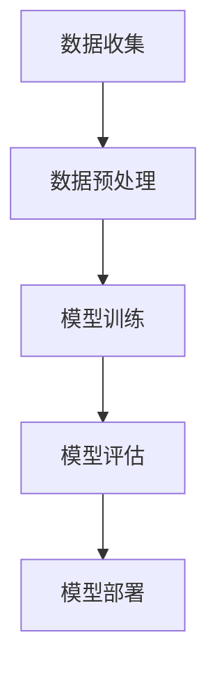

                 

# 《AI大模型创业：机遇与挑战并存》

> **关键词：**人工智能、大模型、创业、机遇、挑战

> **摘要：**本文将深入探讨AI大模型在创业领域中的应用，分析其带来的机遇与挑战，并从实践案例、风险管理、未来趋势等多个角度提供详细解析。通过对AI大模型创业的核心技术与流程、实践案例、风险管理和国际视野的全面梳理，旨在为创业者提供有价值的参考。

### 《AI大模型创业：机遇与挑战并存》目录大纲

**第一部分：AI大模型与创业概述**

**第1章：AI大模型的基本概念与创业机遇**

1.1 AI大模型的概念与特征

1.2 AI大模型的发展历程

1.3 创业中的AI大模型机遇

**第2章：AI大模型创业的核心技术与流程**

2.1 AI大模型核心技术介绍

2.2 AI大模型创业的流程

**第二部分：AI大模型创业的实践与案例分析**

**第3章：AI大模型创业实践案例**

3.1 案例一：某AI大模型创业公司成功之路

3.2 案例二：某AI大模型在金融行业的应用

**第4章：AI大模型创业的风险管理**

4.1 AI大模型创业的主要风险

4.2 风险管理策略

**第5章：AI大模型创业的未来趋势与挑战**

5.1 AI大模型创业的未来趋势

5.2 AI大模型创业的挑战

**第三部分：AI大模型创业的支持与资源**

**第6章：AI大模型创业的支持体系**

6.1 创业支持政策与资源

6.2 AI大模型创业的人才培养

**第7章：AI大模型创业的国际视野**

7.1 全球AI大模型创业的动态

7.2 国际合作与竞争

**附录**

**附录A：AI大模型创业资源列表**

**附录B：AI大模型创业参考资料**

**接下来，我们将按照目录大纲，逐步深入探讨AI大模型创业的各个方面。**

---

### 第一部分：AI大模型与创业概述

#### 第1章：AI大模型的基本概念与创业机遇

在探讨AI大模型创业之前，我们需要首先了解AI大模型的基本概念及其在创业中所蕴含的机遇。

##### 1.1 AI大模型的概念与特征

**AI大模型**，通常指的是具有大规模参数、能够处理大量数据并实现高度自动化决策的深度学习模型。其主要特征包括：

1. **大规模参数**：AI大模型通常包含数百万甚至数十亿个参数，这使得它们能够捕捉复杂的数据特征。
2. **数据驱动**：AI大模型依赖于大量数据进行训练，以实现高精度的预测和决策。
3. **自动化**：通过自我学习和优化，AI大模型能够自动调整其参数，从而提高性能。

**Mermaid流程图：AI大模型的基本原理**

##### 1.2 AI大模型的发展历程

AI大模型的发展可以追溯到深度学习的兴起。以下是AI大模型发展的关键事件与里程碑：

1. **1986年**：Rumelhart、Hinton和Williams提出反向传播算法，这是深度学习的基础。
2. **2012年**：AlexNet在ImageNet图像识别大赛中取得突破性成果，标志着深度学习进入工业化应用阶段。
3. **2016年**：谷歌的AlphaGo在围棋比赛中击败人类冠军，展示了AI大模型在复杂决策领域的潜力。
4. **2018年**：谷歌的BERT模型在自然语言处理任务中取得显著突破，进一步推动了大模型的快速发展。

##### 1.3 创业中的AI大模型机遇

AI大模型在创业中具有广泛的应用场景和巨大的市场潜力。以下是一些AI大模型在创业中的应用领域：

1. **医疗健康**：AI大模型可以帮助医生进行疾病诊断、个性化治疗和药物研发。
2. **金融科技**：AI大模型可以用于风险评估、信用评分、投资决策等金融领域。
3. **智能制造**：AI大模型可以优化生产流程、提高产品质量，并实现智能化的设备维护。
4. **智能交通**：AI大模型可以用于交通流量预测、路径规划、车辆调度等，提高交通系统的效率。

AI大模型创业的优势在于：

1. **技术创新**：AI大模型为创业者提供了强大的技术工具，可以快速实现创新应用。
2. **市场潜力**：随着AI技术的不断进步，市场对AI大模型的需求持续增长。
3. **竞争优势**：通过AI大模型，创业公司可以在短时间内建立强大的竞争力。

然而，AI大模型创业也面临着一些挑战，包括技术复杂性、数据隐私、法律法规等方面。接下来，我们将详细讨论这些核心技术与流程，以及如何在创业中应用AI大模型。

---

**文章正文部分撰写完毕，接下来我们将进入第二部分：AI大模型创业的核心技术与流程。**<|im_end|>

