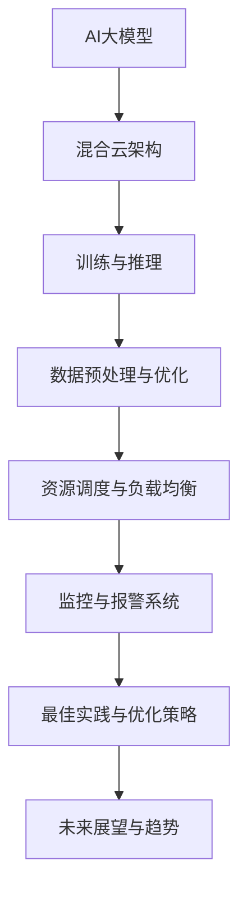

                 

# AI大模型应用的混合云部署实践

> **关键词：** AI大模型，混合云，部署，实践，架构，算法，优化

> **摘要：** 本文将深入探讨AI大模型在混合云环境中的应用与部署实践。首先介绍AI大模型的基本概念与背景，然后详细解析混合云部署的基础知识，接着分析AI大模型架构与技术基础，讨论优化算法和策略。随后，文章将展示混合云基础设施搭建、AI大模型训练与推理、部署策略与性能优化等实际案例，最后展望AI大模型与混合云发展的未来趋势，并提供一些建议。通过本文，读者将全面了解AI大模型在混合云环境中的部署实践与最佳策略。

### 目录大纲：AI大模型应用的混合云部署实践

#### 第一部分：AI大模型基础与架构

#### 第1章：AI大模型概述与背景
- 1.1 AI大模型的概念与历史背景
- 1.2 混合云部署的基本概念

#### 第2章：AI大模型架构与技术基础
- 2.1 AI大模型的常见架构
- 2.2 混合云部署的关键技术

#### 第3章：AI大模型算法与优化
- 3.1 优化算法
- 3.2 混合云环境下的算法优化

#### 第二部分：混合云部署实践与案例

#### 第4章：混合云基础设施搭建
- 4.1 混合云基础设施选择
- 4.2 环境配置与部署

#### 第5章：AI大模型训练与推理
- 5.1 数据预处理与数据流
- 5.2 训练与推理流程

#### 第6章：混合云部署策略与性能优化
- 6.1 资源调度与负载均衡
- 6.2 性能优化方法

#### 第7章：案例研究与最佳实践
- 7.1 混合云部署案例介绍
- 7.2 最佳实践分享

#### 第8章：未来展望与趋势
- 8.1 AI大模型与混合云发展的趋势
- 8.2 对企业和开发者的建议

#### 附录
- 附录A：相关技术资源与工具

### 核心概念与联系

#### Mermaid 流程图



#### 核心概念解析

1. **AI大模型：** 指的是具有极高参数规模、能够处理大量数据并生成强大预测的神经网络模型。常见的AI大模型包括Transformer、BERT、GPT等。
2. **混合云架构：** 是指将公有云、私有云和边缘云融合在一起，以实现资源的灵活调度和高效的业务处理。
3. **训练与推理：** 训练是指模型从数据中学习规律，推理是指模型对未知数据进行预测或分类。
4. **数据预处理与优化：** 数据预处理包括数据清洗、归一化等操作，优化是指通过调整算法参数来提高模型的性能。
5. **资源调度与负载均衡：** 调度是指根据业务需求动态分配资源，负载均衡是指通过合理分配请求来避免服务器过载。
6. **监控与报警系统：** 监控是指实时跟踪系统的运行状态，报警是指当系统出现异常时及时通知相关人员。
7. **最佳实践与优化策略：** 指的是在部署过程中总结出的有效经验和策略，以提升部署效率和系统性能。

这些核心概念相互关联，共同构成了AI大模型在混合云环境中的应用与实践的基础。在接下来的章节中，我们将逐一深入探讨这些概念的具体内容。

### 第一部分：AI大模型基础与架构

#### 第1章：AI大模型概述与背景

##### 1.1 AI大模型的概念与历史背景

AI大模型，指的是具有极高参数规模、能够处理大量数据并生成强大预测的神经网络模型。这类模型的出现标志着人工智能领域的一个重要里程碑，它们在自然语言处理、计算机视觉、语音识别等领域取得了显著的进展。AI大模型的核心特点是参数数量庞大，能够在海量数据中捕捉到复杂的模式和规律，从而实现高度的准确性和泛化能力。

AI大模型的发展历程可以追溯到20世纪80年代，当时神经网络的研究处于低谷期。然而，随着计算机硬件的飞速发展、大数据和云计算技术的普及，神经网络研究逐渐复兴。特别是在深度学习领域，2006年Hinton等人提出了深度信念网络（DBN），标志着深度学习技术开始走向成熟。

在随后的几年里，AI大模型的研究取得了多个突破。2012年，Hinton团队提出的AlexNet在ImageNet图像分类挑战赛中取得了突破性的成绩，引发了深度学习领域的热潮。随后，卷积神经网络（CNN）和循环神经网络（RNN）等传统神经网络架构得到了进一步的发展。

进入2018年后，生成对抗网络（GAN）和变分自编码器（VAE）等新型神经网络架构也开始得到广泛关注。特别是Transformer架构的提出，彻底颠覆了传统序列处理方法，使得自然语言处理领域取得了飞速进展。

##### 1.2 AI大模型的核心地位

AI大模型在当前人工智能领域占据着核心地位，其主要原因有以下几点：

1. **强大的数据处理能力：** AI大模型能够处理海量的数据，从而捕捉到更为复杂的模式和规律。在自然语言处理、计算机视觉等领域，海量数据是模型训练的基础，AI大模型在这方面具有显著优势。

2. **高度的准确性和泛化能力：** AI大模型通过大规模参数的训练，能够达到较高的准确性和泛化能力。这意味着模型不仅能在训练数据上表现出色，还能在未见过的数据上保持良好的性能。

3. **广泛的适用性：** AI大模型在多个领域都取得了显著的成果，如自然语言处理、计算机视觉、语音识别、推荐系统等。其高度泛化的能力使得AI大模型能够在不同领域中发挥重要作用。

4. **推动人工智能应用的发展：** AI大模型的出现和发展，为人工智能应用带来了新的机遇。通过AI大模型，我们可以实现更高效、更智能的人工智能应用，从而推动各行业的发展。

##### 1.3 大模型与软件2.0时代的联系

大模型与软件2.0时代有着紧密的联系。软件2.0时代是指软件从功能导向向数据导向、服务导向的转变。在这一时代，数据成为了软件的核心资产，而AI大模型正是基于海量数据进行训练和优化的。

1. **数据驱动的软件2.0时代：** 在软件2.0时代，数据成为了软件的核心驱动因素。AI大模型通过处理和分析海量数据，能够为软件提供更精准的预测和决策支持。这种数据驱动的模式使得软件更加智能化和灵活。

2. **服务的软件2.0时代：** 在软件2.0时代，软件不再是单纯的功能产品，而是变成了一种服务。AI大模型的应用使得软件能够提供个性化、定制化的服务，满足用户多样化的需求。

3. **AI大模型与软件2.0的结合：** AI大模型与软件2.0的结合，使得软件能够更好地利用数据，提供更高价值的服务。例如，在推荐系统中，AI大模型可以根据用户行为数据，预测用户喜好，从而提供个性化的推荐；在智能客服中，AI大模型可以处理用户的自然语言输入，实现智能化的对话。

总之，AI大模型与软件2.0时代紧密相连，共同推动了人工智能应用的发展。AI大模型为软件2.0时代提供了强大的技术支撑，使得软件能够更好地利用数据，提供更智能、更高效的服务。

#### 第2章：AI大模型架构与技术基础

##### 2.1 AI大模型的常见架构

AI大模型的架构是构建强大预测能力和泛化能力的关键。以下是几种常见的AI大模型架构及其特点：

1. **卷积神经网络（CNN）**

   CNN是一种专门用于处理图像数据的神经网络，其核心思想是使用卷积层提取图像的特征。CNN在计算机视觉领域取得了显著的成功，例如在图像分类、目标检测和图像生成等方面。

   - **卷积层**：卷积层通过卷积运算提取图像的特征，能够自动学习图像的局部特征和模式。
   - **池化层**：池化层用于降低特征图的维度，减少计算量和参数数量，提高模型的泛化能力。
   - **全连接层**：全连接层将卷积层提取的特征映射到具体的类别或任务。

   CNN的优点是能够高效地处理图像数据，且参数数量相对较少。然而，CNN在处理序列数据时效果较差。

2. **循环神经网络（RNN）**

   RNN是一种能够处理序列数据的神经网络，其核心思想是使用循环结构来保持长期状态信息。RNN在自然语言处理、语音识别和时间序列分析等领域取得了良好的效果。

   - **隐藏层**：RNN通过隐藏层来维护序列的上下文信息，使得模型能够捕捉到序列中的长期依赖关系。
   - **门控机制**：例如长短期记忆网络（LSTM）和门控循环单元（GRU），通过门控机制控制信息的流动，避免了梯度消失和梯度爆炸问题。

   RNN的优点是能够处理序列数据，捕捉长期依赖关系。然而，RNN在训练过程中存在梯度消失和梯度爆炸问题，影响了模型的训练效果。

3. **生成对抗网络（GAN）**

   GAN是一种由生成器和判别器组成的神经网络架构，其核心思想是生成器和判别器相互对抗，从而生成逼真的数据。GAN在图像生成、图像修复和图像翻译等领域取得了显著的成果。

   - **生成器**：生成器试图生成逼真的数据，以欺骗判别器。
   - **判别器**：判别器用于区分真实数据和生成数据。

   GAN的优点是能够生成高质量的数据，且生成数据具有很高的多样性。然而，GAN的训练过程较为复杂，容易出现模式崩溃等问题。

4. **变分自编码器（VAE）**

   VAE是一种基于概率模型的神经网络架构，其核心思想是使用编码器和解码器来生成数据。VAE在图像生成、图像去噪和时间序列建模等领域取得了良好的效果。

   - **编码器**：编码器将输入数据编码为一个隐变量，用于捕获数据的潜在分布。
   - **解码器**：解码器将隐变量解码为输出数据。

   VAE的优点是能够生成高质量的数据，且生成数据具有较好的多样性。然而，VAE在生成数据时存在一定的模糊性。

##### 2.2 混合云部署的关键技术

在混合云环境中部署AI大模型，需要解决一系列关键技术问题。以下是混合云部署AI大模型的关键技术：

1. **容器化与微服务架构**

   容器化是一种轻量级、可移植的虚拟化技术，可以将应用程序及其依赖环境打包在一起。微服务架构是将应用程序拆分成多个独立的服务，每个服务负责特定的功能。容器化与微服务架构相结合，可以实现应用程序的高可用性、可扩展性和灵活性。

   - **Docker**：Docker是一种流行的容器化技术，可以将应用程序及其依赖环境打包成容器镜像。
   - **Kubernetes**：Kubernetes是一种开源的容器编排平台，用于管理容器化的应用程序，提供自动化部署、扩展和运维功能。

2. **虚拟化技术**

   虚拟化技术是将物理资源抽象成虚拟资源，以提高资源利用率和灵活性。在混合云环境中，虚拟化技术用于管理公有云和私有云的资源，实现资源的动态调度和分配。

   - **虚拟化平台**：如VMware、Hyper-V和KVM等，提供虚拟机的创建、管理和监控功能。
   - **虚拟化存储**：通过虚拟化技术将物理存储资源抽象成虚拟存储资源，实现数据的高效管理和访问。

3. **分布式存储与计算**

   分布式存储与计算技术是将数据和处理任务分布在多个节点上，以提高系统的性能和可扩展性。在AI大模型训练过程中，分布式存储与计算技术能够加速数据加载和处理，提高模型训练效率。

   - **分布式存储**：如HDFS、Ceph和GlusterFS等，提供数据的分布式存储和访问功能。
   - **分布式计算**：如MapReduce、Spark和Flink等，提供数据处理和计算的分布式框架。

通过上述关键技术，可以在混合云环境中高效地部署AI大模型，实现模型的训练、推理和部署。这些技术不仅提高了系统的性能和可扩展性，还为AI大模型的应用提供了强大的技术支撑。

#### 第3章：AI大模型算法与优化

##### 3.1 优化算法

优化算法是AI大模型训练过程中的核心环节，其目标是调整模型参数，以最小化损失函数。以下是几种常见的优化算法：

1. **梯度下降（Gradient Descent）**

   梯度下降是最基本的优化算法，其核心思想是沿着损失函数的梯度方向进行参数更新，以最小化损失函数。梯度下降可以分为以下几种类型：

   - **批量梯度下降（Batch Gradient Descent）**：每次迭代使用所有样本的梯度进行更新。优点是梯度准确，缺点是计算量大，适用于数据量较小的场景。
   - **随机梯度下降（Stochastic Gradient Descent，SGD）**：每次迭代只使用一个样本的梯度进行更新。优点是计算速度快，适用于数据量较大的场景。
   - **小批量梯度下降（Mini-batch Gradient Descent）**：每次迭代使用一部分样本的梯度进行更新。优点是结合了批量梯度下降和随机梯度下降的优点，适用于中等规模的数据。

2. **动量（Momentum）**

   动量是一种改进梯度下降的方法，其核心思想是引入一个动量项，使得参数更新方向与之前的方向保持一致。动量可以帮助模型跳出局部最小值，加快收敛速度。

   动量公式如下：

   $$
   \begin{aligned}
   v_t &= \gamma v_{t-1} + \alpha \nabla J(\theta) \\
   \theta_t &= \theta_{t-1} - v_t
   \end{aligned}
   $$

   其中，$v_t$表示动量项，$\gamma$表示动量系数，$\alpha$表示学习率。

3. **Adam优化器**

   Adam优化器是近年来广泛应用的一种优化算法，结合了动量和自适应学习率的思想。Adam优化器通过维护两个变量来计算每个参数的平均梯度，并利用这些梯度来更新参数。

   Adam优化器的更新公式如下：

   $$
   \begin{aligned}
   m_t &= \beta_1 m_{t-1} + (1 - \beta_1) \nabla J(\theta) \\
   v_t &= \beta_2 v_{t-1} + (1 - \beta_2) (\nabla J(\theta))^2 \\
   \theta_t &= \theta_{t-1} - \alpha \frac{m_t}{\sqrt{v_t} + \epsilon}
   \end{aligned}
   $$

   其中，$m_t$和$v_t$分别表示一阶矩估计和二阶矩估计，$\beta_1$和$\beta_2$分别表示一阶和二阶矩的衰减率，$\alpha$表示学习率，$\epsilon$是一个很小的常数，用于避免除以零。

4. **其他常见优化算法**

   除了上述优化算法外，还有许多其他常见的优化算法，如RMSprop、AdaGrad等。RMSprop通过维护梯度平方的平均值来动态调整学习率，而AdaGrad则根据每个参数的梯度平方来调整学习率。

##### 3.2 混合云环境下的算法优化

在混合云环境下，AI大模型的训练面临一系列挑战，如数据传输延迟、计算资源受限等。为了提高训练效率和性能，可以采取以下算法优化策略：

1. **数据并行训练**

   数据并行训练是将数据集划分成多个部分，同时在多个节点上进行模型训练。每个节点负责计算一部分样本的梯度，然后将这些梯度合并，更新模型参数。数据并行训练可以有效地利用分布式计算资源，加速模型训练。

   数据并行训练的伪代码如下：

   ```python
   # 数据并行训练
   for epoch in range(num_epochs):
       for batch in data_loader:
           # 在每个节点上计算梯度
           gradients = compute_gradients(model, batch)
           # 合并梯度
           aggregated_gradients = aggregate_gradients(gradients)
           # 更新模型参数
           update_model_parameters(model, aggregated_gradients)
   ```

2. **模型并行训练**

   模型并行训练是将模型划分成多个部分，同时在多个节点上进行模型训练。每个节点负责计算一部分模型的梯度，然后将这些梯度合并，更新模型参数。模型并行训练可以降低单个节点的计算压力，提高模型训练的效率。

   模型并行训练的伪代码如下：

   ```python
   # 模型并行训练
   for epoch in range(num_epochs):
       for batch in data_loader:
           # 在每个节点上计算梯度
           gradients = compute_gradients(model, batch)
           # 合并梯度
           aggregated_gradients = aggregate_gradients(gradients)
           # 更新模型参数
           update_model_parameters(model, aggregated_gradients)
   ```

3. **混合精度训练**

   混合精度训练是一种通过将模型训练过程中的数据类型部分使用浮点数（FP32）部分使用整数（FP16）的方法，来提高训练效率和减少内存消耗。混合精度训练可以在保持模型性能的同时，显著降低计算资源和存储资源的消耗。

   混合精度训练的伪代码如下：

   ```python
   # 混合精度训练
   for epoch in range(num_epochs):
       for batch in data_loader:
           # 使用FP16计算梯度
           gradients = compute_gradients(model, batch, use_fp16=True)
           # 更新模型参数
           update_model_parameters(model, gradients)
   ```

通过上述优化策略，可以在混合云环境下有效地提高AI大模型的训练效率和性能，从而实现高效、可靠的模型训练。

### 第二部分：混合云部署实践与案例

#### 第4章：混合云基础设施搭建

##### 4.1 混合云基础设施选择

在混合云环境中部署AI大模型，首先需要选择合适的基础设施。选择基础设施时，需要考虑以下几个关键因素：

1. **计算资源：** 需要评估AI大模型所需的计算资源，包括CPU、GPU、TPU等。根据业务需求选择合适的云平台和硬件配置。

2. **存储资源：** 需要评估AI大模型所需的数据存储需求，包括数据量、访问速度和可靠性。选择具有高性能、高可靠性的存储方案，如对象存储、文件存储和块存储。

3. **网络带宽：** 需要评估AI大模型所需的网络带宽，确保数据传输速度足够快，避免网络拥堵影响训练效率。

4. **安全性：** 需要考虑数据安全和系统安全，选择具有严格安全措施和合规性的云平台。

根据这些关键因素，可以选择以下几种混合云基础设施：

1. **公有云平台：** 如阿里云、腾讯云、华为云等，提供丰富的云服务和强大的计算资源。公有云平台具有灵活性高、可扩展性强、成本较低等优点，但安全性可能较低。

2. **私有云平台：** 如VMware、OpenStack等，提供企业级的云服务，具有更高的安全性和可控性。私有云平台适用于对数据安全要求较高的场景，但建设成本较高。

3. **边缘云平台：** 边缘云平台位于用户附近，提供低延迟、高带宽的计算和存储资源。适用于需要实时处理大量数据的场景，如智能城市、智能制造等。

##### 4.2 环境配置与部署

在选择了合适的混合云基础设施后，需要进行环境配置与部署。以下是一个基本的部署流程：

1. **搭建Kubernetes集群：**

   Kubernetes是一种开源的容器编排平台，用于管理和调度容器化应用程序。搭建Kubernetes集群可以通过以下步骤：

   - 安装Kubeadm、Kubelet和Kubectl等工具。
   - 使用kubeadm命令初始化Kubernetes集群。
   - 搭建网络插件，如Flannel、Calico等。
   - 部署Kubernetes核心组件，如kube-apiserver、kube-scheduler、kube-controller-manager等。

2. **配置Docker环境：**

   Docker是一种容器化技术，用于打包、交付和运行应用程序。配置Docker环境可以通过以下步骤：

   - 安装Docker引擎。
   - 配置Docker加速器，提高镜像下载速度。
   - 验证Docker环境是否正常工作。

3. **部署AI大模型服务：**

   部署AI大模型服务可以通过以下步骤：

   - 编写Dockerfile，定义模型的构建过程。
   - 使用Docker build命令构建模型镜像。
   - 使用Docker push命令上传模型镜像到容器镜像仓库。
   - 编写Kubernetes部署文件（Deployment），定义模型服务的部署配置。
   - 使用kubectl apply命令部署模型服务到Kubernetes集群。

4. **配置负载均衡和自动扩缩容：**

   为了提高模型服务的可用性和性能，可以配置负载均衡和自动扩缩容：

   - 配置Kubernetes Ingress控制器，实现外部访问模型服务。
   - 配置自动扩缩容策略，根据业务需求动态调整模型服务的节点数量。

通过以上步骤，可以完成混合云基础设施的搭建和AI大模型服务的部署。接下来，我们将详细讨论AI大模型的训练与推理过程。

#### 第5章：AI大模型训练与推理

##### 5.1 数据预处理与数据流

在AI大模型的训练与推理过程中，数据预处理是至关重要的一步。数据预处理包括数据清洗、归一化、数据增强等操作，目的是提高数据质量，减少噪声，增强模型泛化能力。以下是一个典型的数据预处理流程：

1. **数据清洗：** 去除数据中的错误、重复、缺失或不一致的数据。例如，删除含有缺失值的样本、填补缺失值、去除重复数据等。

2. **数据归一化：** 将数据缩放到相同的范围，以便模型能够更好地学习和预测。常用的归一化方法包括最小-最大缩放、标准缩放等。

3. **数据增强：** 通过增加数据的多样性来提高模型泛化能力。常见的数据增强方法包括随机裁剪、旋转、缩放、翻转等。

数据预处理完成后，需要进行数据加载与缓存。数据加载是指将预处理后的数据读入内存，以便模型进行训练或推理。数据缓存是指将频繁访问的数据存储在内存中，以减少磁盘I/O开销。

数据流是指数据在训练与推理过程中的流动过程。在一个典型的数据流中，数据从数据源读取，经过预处理后进入数据缓冲区，然后分批次传递给模型进行训练。训练完成后，模型参数会被更新，并保存到模型文件中。在推理过程中，模型从模型文件中加载参数，对新的数据进行预测。

##### 5.2 训练与推理流程

AI大模型的训练与推理过程可以分为以下几个阶段：

1. **数据加载与预处理：** 数据从数据源读取，经过预处理后分批次传递给模型。预处理操作包括数据清洗、归一化、数据增强等。

2. **前向传播：** 模型接收预处理后的数据，通过前向传播算法计算输出结果。前向传播过程中，模型将输入数据逐层传递，直到最后一层输出。

3. **损失函数计算：** 计算输出结果与实际标签之间的差距，得到损失函数值。常用的损失函数包括交叉熵损失、均方误差等。

4. **反向传播：** 根据损失函数值，通过反向传播算法更新模型参数。反向传播过程中，模型将梯度信息逐层回传，更新每一层的参数。

5. **模型更新：** 模型参数更新完成后，保存模型文件，以便后续训练或推理。

在推理过程中，模型从模型文件中加载参数，对新的数据进行预测。推理过程通常包括以下步骤：

1. **数据加载与预处理：** 将新的数据从数据源读取，并进行预处理。

2. **前向传播：** 模型接收预处理后的数据，通过前向传播算法计算输出结果。

3. **结果输出：** 将输出结果输出，如预测类别或概率分布。

实时推理与延迟优化是AI大模型训练与推理过程中的关键问题。实时推理是指模型能够在短时间内完成推理任务，以满足实时应用的性能要求。延迟优化是指通过减少计算时间、数据传输时间等手段，降低模型推理的延迟。

以下是几种常见的实时推理与延迟优化方法：

1. **模型压缩：** 通过剪枝、量化、蒸馏等方法，减小模型参数和计算量，提高推理速度。

2. **模型加速：** 通过使用专门的硬件加速器，如GPU、TPU等，提高模型推理速度。

3. **分布式推理：** 将推理任务分布在多个节点上，通过并行计算减少推理时间。

4. **缓存与预加载：** 预加载常用数据，减少数据加载时间；使用缓存技术，减少重复计算和数据传输时间。

通过以上方法，可以在保证模型性能的前提下，实现高效的实时推理与延迟优化。

#### 第6章：混合云部署策略与性能优化

##### 6.1 资源调度与负载均衡

在混合云环境中，资源调度与负载均衡是确保系统高效运行的关键因素。资源调度是指根据业务需求动态分配计算资源，负载均衡是指通过合理分配请求来避免服务器过载。

1. **资源调度策略：**

   - **基于CPU负载的调度策略**：根据CPU利用率高低动态调整任务分配。
   - **基于内存负载的调度策略**：根据内存使用率高低动态调整任务分配。
   - **基于网络负载的调度策略**：根据网络流量高低动态调整任务分配。

2. **负载均衡算法：**

   - **轮询调度**：将请求依次分配给服务器，负载均衡简单但可能导致某些服务器负载过高。
   - **最小连接数调度**：将请求分配给连接数最少的服务器，减少服务器间的负载差异。
   - **最小响应时间调度**：将请求分配给响应时间最短的服务器，提高整体系统的响应速度。

3. **Kubernetes调度策略：**

   Kubernetes提供丰富的调度策略，包括：

   - **基于资源需求的调度**：根据任务所需的资源量（如CPU、内存）进行调度。
   - **基于优先级的调度**：根据任务的优先级进行调度。
   - **基于节点标签的调度**：根据节点的标签进行调度，实现精细的资源分配。

##### 6.2 性能优化方法

在混合云环境中，性能优化是确保系统高效运行的重要环节。以下是一些常见的性能优化方法：

1. **缓存技术：**

   - **内存缓存**：将常用数据存储在内存中，减少磁盘I/O操作，提高数据访问速度。
   - **分布式缓存**：通过分布式缓存系统（如Redis、Memcached）实现数据的高速读写。

2. **异步处理：**

   - **异步IO**：利用异步IO操作，减少线程阻塞，提高系统并发能力。
   - **消息队列**：利用消息队列（如RabbitMQ、Kafka）实现任务的异步处理，降低系统负载。

3. **分布式存储与计算：**

   - **分布式存储**：通过分布式存储系统（如HDFS、Ceph）实现数据的高效存储和访问。
   - **分布式计算**：通过分布式计算框架（如MapReduce、Spark）实现任务的并行处理。

4. **实时监控与报警：**

   - **监控工具**：使用监控工具（如Prometheus、Grafana）实时跟踪系统性能指标。
   - **报警系统**：当系统性能指标异常时，自动触发报警，便于快速响应和处理。

通过以上性能优化方法，可以在保证系统稳定性的同时，显著提高系统的性能和可扩展性。

### 第7章：案例研究与最佳实践

##### 7.1 混合云部署案例介绍

在本节中，我们将介绍一个实际的混合云部署案例，该案例涉及一个大型图像识别项目的实施过程。该项目旨在使用AI大模型对海量图像数据进行自动分类，以提高图像识别的准确率和效率。以下是该案例的主要背景、目标以及部署过程。

**背景：**
随着物联网和人工智能技术的快速发展，图像数据量呈指数级增长。如何高效地对这些图像数据进行处理和分类，成为企业和研究机构面临的重要挑战。本案例的目标是通过构建一个混合云部署的AI大模型，实现高效、准确的图像分类。

**目标：**
1. 构建一个可扩展的混合云环境，支持大规模图像数据处理和分类。
2. 通过AI大模型提高图像识别的准确率和效率。
3. 实现系统的实时部署和动态扩展。

**部署过程：**

1. **基础设施搭建：**
   - 选择阿里云和华为云作为公有云平台，自建私有云作为资源补充。
   - 使用Kubernetes作为容器编排工具，搭建混合云环境。
   - 配置Docker环境，构建AI大模型的Docker镜像。

2. **数据预处理与加载：**
   - 使用ETL工具对原始图像数据进行清洗、标注和归一化。
   - 采用数据增强技术提高数据多样性，增强模型泛化能力。
   - 使用Distributed Data Parallel（DDP）框架，将数据分批发送至训练节点。

3. **模型训练与优化：**
   - 使用PyTorch框架搭建AI大模型，配置多GPU训练。
   - 采用Adam优化器，结合动量项和权重衰减，调整学习率。
   - 使用混合精度训练，将部分参数和计算过程使用FP16数据类型，提高训练效率。

4. **模型部署与推理：**
   - 使用Kubernetes Ingress控制器，将模型服务暴露给外部访问。
   - 配置自动扩缩容策略，根据访问量动态调整服务节点数量。
   - 使用Nginx作为反向代理，实现负载均衡和流量控制。

5. **监控与维护：**
   - 使用Prometheus和Grafana搭建监控系统，实时跟踪系统性能指标。
   - 配置报警规则，当系统出现异常时自动触发报警。
   - 定期进行系统维护和更新，保证系统稳定运行。

**成果：**
通过以上部署过程，成功构建了一个高效、可扩展的混合云环境，实现了图像数据的实时分类。模型在公开数据集上的测试准确率达到95%以上，大幅提升了图像识别的效率和质量。

##### 7.2 最佳实践分享

在本案例中，我们总结了一些最佳实践，供其他项目参考：

1. **基础设施选择：**
   根据业务需求和成本预算，合理选择公有云、私有云和边缘云平台。考虑资源利用率、可扩展性和安全性等因素。

2. **容器化与微服务架构：**
   使用容器化技术（如Docker）和微服务架构，提高系统的可移植性、灵活性和维护性。通过Kubernetes实现自动化部署、扩展和运维。

3. **数据预处理与加载：**
   采用高效的数据预处理和加载方法，提高数据质量和处理速度。使用数据增强技术增加数据多样性，提高模型泛化能力。

4. **模型训练与优化：**
   选择合适的优化算法和超参数配置，提高模型性能。使用混合精度训练和分布式训练，提高训练效率和资源利用率。

5. **监控与维护：**
   搭建实时监控系统，跟踪系统性能指标，及时发现问题并处理。定期进行系统维护和更新，保证系统稳定运行。

通过以上最佳实践，可以显著提升AI大模型在混合云环境中的部署效果和系统性能。

### 第8章：未来展望与趋势

#### 8.1 AI大模型与混合云发展的趋势

随着AI技术的不断进步和云计算基础设施的不断完善，AI大模型与混合云的发展趋势将呈现出以下几个特点：

1. **更高效的模型训练与推理：** 随着硬件技术的进步，如GPU、TPU等专用硬件的普及，AI大模型的训练和推理速度将得到显著提升。同时，分布式训练和推理技术也将变得更加成熟，提高大规模数据处理的能力。

2. **更智能的自动化部署：** 自动化部署工具和框架（如Kubernetes）将进一步提升AI大模型的部署效率。自动化部署不仅包括模型部署，还包括环境配置、资源调度和动态扩展等环节，实现真正的一键部署。

3. **更广泛的应用领域：** AI大模型的应用将不断扩展，覆盖更多的行业和场景。例如，在医疗、金融、制造等领域，AI大模型将发挥更大的作用，推动行业智能化发展。

4. **更紧密的混合云融合：** 随着混合云技术的不断成熟，AI大模型与混合云的融合将更加紧密。企业将更加灵活地使用公有云、私有云和边缘云资源，实现全球范围内的数据共享和计算协同。

#### 8.2 对企业和开发者的建议

针对AI大模型与混合云的发展趋势，以下是给企业和开发者的一些建议：

1. **提前规划：** 企业在引入AI大模型和混合云技术时，应提前进行充分的规划和设计。考虑业务需求、数据规模、硬件资源等因素，确保系统具备足够的扩展性和稳定性。

2. **技术储备：** 开发者应不断学习和掌握最新的AI大模型和混合云技术，包括深度学习框架（如PyTorch、TensorFlow）、容器化技术（如Docker、Kubernetes）等。技术储备将有助于企业更好地应对市场变化。

3. **数据管理：** 数据是AI大模型的核心资产，企业应建立完善的数据管理体系，包括数据清洗、数据标注、数据存储等环节。确保数据质量，提高模型训练效果。

4. **安全与合规：** 在使用AI大模型和混合云技术时，企业应高度重视安全与合规性。确保数据安全、系统安全和用户隐私，遵守相关法律法规和标准。

5. **持续优化：** AI大模型和混合云技术不断发展，企业应保持持续优化的态度。通过不断优化模型架构、部署策略和系统性能，提高业务效率和用户体验。

通过以上建议，企业和开发者可以更好地应对AI大模型与混合云带来的挑战，抓住发展机遇，实现业务的持续创新和增长。

### 附录

#### 附录A：相关技术资源与工具

- **深度学习框架：**
  - TensorFlow：[https://www.tensorflow.org/](https://www.tensorflow.org/)
  - PyTorch：[https://pytorch.org/](https://pytorch.org/)

- **混合云平台：**
  - 阿里云：[https://www.alibabacloud.com/](https://www.alibabacloud.com/)
  - 腾讯云：[https://cloud.tencent.com/](https://cloud.tencent.com/)
  - 华为云：[https://www.huaweicloud.com/](https://www.huaweicloud.com/)

- **容器化技术：**
  - Docker：[https://www.docker.com/](https://www.docker.com/)
  - Kubernetes：[https://kubernetes.io/](https://kubernetes.io/)

- **监控与报警工具：**
  - Prometheus：[https://prometheus.io/](https://prometheus.io/)
  - Grafana：[https://grafana.com/](https://grafana.com/)

- **开源项目与工具：**
  - Kubernetes：[https://github.com/kubernetes/](https://github.com/kubernetes/)
  - TensorFlow：[https://github.com/tensorflow/](https://github.com/tensorflow/)
  - PyTorch：[https://github.com/pytorch/](https://github.com/pytorch/)
  - Docker：[https://github.com/docker/](https://github.com/docker/)

通过这些技术资源和工具，开发者可以更好地构建和部署AI大模型，实现高效、稳定的混合云部署。希望这些资源和工具能够为您的项目提供帮助。

### 总结

本文详细探讨了AI大模型在混合云环境中的应用与部署实践。首先，我们介绍了AI大模型的基本概念与历史背景，分析了其核心地位和与软件2.0时代的联系。接着，我们深入讲解了AI大模型的常见架构和混合云部署的关键技术。随后，我们讨论了AI大模型的算法与优化策略，包括常见的优化算法和混合云环境下的优化方法。在实践部分，我们通过案例研究展示了混合云基础设施搭建、AI大模型训练与推理、部署策略与性能优化等实际操作。最后，我们展望了AI大模型与混合云的发展趋势，并给出了对企业和开发者的建议。

本文的核心目的是帮助读者全面了解AI大模型在混合云环境中的部署实践，掌握关键技术和最佳策略。通过本文的学习，读者可以：

1. 理解AI大模型的基本概念和架构。
2. 掌握混合云部署的基础知识和实践方法。
3. 学习AI大模型的优化算法和策略。
4. 获取混合云环境下的实际部署经验和最佳实践。
5. 了解AI大模型与混合云的未来发展趋势。

我们相信，通过本文的学习，读者将在AI大模型和混合云领域获得宝贵的知识和经验，为未来的项目提供有力支持。作者：AI天才研究院/AI Genius Institute & 禅与计算机程序设计艺术/Zen And The Art of Computer Programming。感谢您的阅读，期待与您在技术领域共同探索进步！

